# Docker

- 官网：https://www.docker.com/

## 为什么会出现 Docker？

### 传统部署方式的核心痛点

​	一个**应用程序**从**本地开发到运维部署上线**分为 **开发环境（development）** 和 **生产环境（production）**（中间可能**穿插测试环境（test）、预发布环境（prerelease）**...）。

​	由于从 本地开发 到 部署上线 的**流程本质**上是**将一个应用程序包**（包含*源代码、运行环境【Python、Java...】、系统工具、所需依赖包组件...*）**的整体运行环境迁移到另一台机器上运行**，**线上机器（服务器）专门负责对外开放 IP 端口让其他用户来访问**。

而对于环境迁移要面临的**核心痛点**：

​	在**传统开发模式**下，一个应用程序从本地开发环境到运维部署上线，需要**经过开发、测试、生产 3 个环境的部署配置**，运维人员都需要**对测试、生产环境的服务器**进行 **1:1 地完全复制开发环境下应用程序运行所需的工作环境（环境一致性）**；

​	而对于运维人员来说，从 0 开始部署配置这些环境到服务上线的**整个过程极其繁琐**、且**非常容易因为一些细节问题**（如安装的依赖版本不一致、底层依赖库少了一个补丁...）**而导致程序崩溃，配置失败**；

​	就会出现 *“明明在我的电脑上运行得好好的代码，一传到服务器或者同事的电脑上就各种报错”* 的经典问题。

​	于是 **Docker 容器化技术**便出现了，它就是为了解决 **同一应用程序在不同机器上的 “环境一致性”** 这一核心问题而出现的。

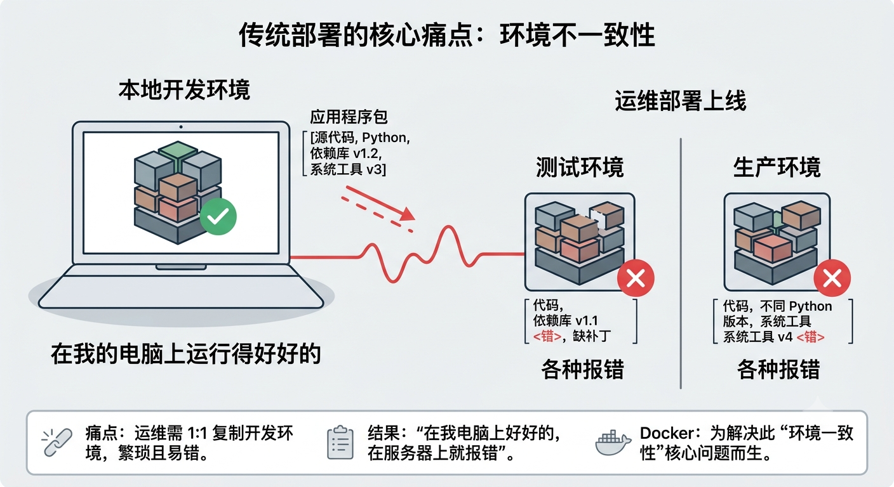

## 安装、启动

**Docker** 是**基于 Linux 的容器化技术**。在 Windows 和 Mac 电脑上，**Docker 通过虚拟化一个 Linux 子系统来运行**。

- Linux 系统宿主机是最佳的 Docker 实战环境

> 参考项目：https://github.com/tech-shrimp/docker_installer

### Linux 安装

1. 访问 `getdocker.com` 获取安装脚本
2. 执行安装脚本（例如，通过`curl -fsSL https://get.docker.com -o get-docker.sh` 下载脚本，然后执行 `sudo sh get-docker.sh`）
3. 安装完成后，若非 `root` 用户，需在所有 `docker` 命令前添加 `sudo` 以获取管理员权限

### Windows 安装

1. 搜索 ”启用 Windows 功能“： 勾选 “Virtual Machine Platform”（虚拟机平台）和“适用于Linux的Windows子系统”（WSL）

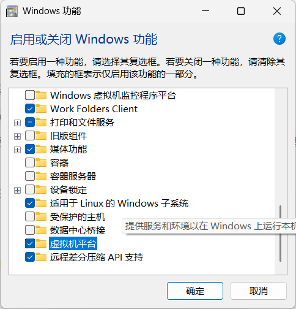

1. 重启电脑： 根据提示完成重启

2. 安装 WSL：

   - 以管理员身份打开命令提示符（CMD）

   - 执行 `wsl --set-default-version 2` 将WSL默认版本设为 2

   - 执行 `wsl --update` 安装WSL（国内网络建议添加 `--web-download` 参数减少下载失败）

3. 下载并安装 Docker Desktop 图形化界面：从官方网站下载对应CPU架构的安装包（Windows通常为AMD64），按提示完成安装

4. 启动 Docker Desktop： 需保持 Docker Desktop 软件运行

   > 否则执行命令会出现这个报错。
   >
   > ```sh
   > PS C:\Users\Administrator> docker ps
   > error during connect: Get "http://%2F%2F.%2Fpipe%2FdockerDesktopLinuxEngine/v1.51/containers/json": open //./pipe/dockerDesktopLinuxEngine: The system cannot find the file specified.
   > ```

5. 验证安装：在Windows终端输入 `docker --version` ，若能打印版本号则表示安装成功

   ```shell
   PS C:\Users\Administrator> docker --version
   Docker version 28.3.3, build 980b856
   ```

> - Docker 工作台：https://app.docker.com/accounts/huangkaijun1

### MaxOS 安装

1. 根据Mac电脑的芯片类型（Intel或Apple Silicon）下载对应的 Docker Desktop 安装包
2. 按提示完成安装

命令行使用：尽管 Docker Desktop 提供可视化界面，但命令行在各操作系统上通用性更强。

## Docker 的出现

### 核心概念

​	**Docker 容器化技术** 是一个**开源的应用容器引擎**，它**能将应用程序（技术项目）的源代码、运行环境、系统工具、依赖库等...**像打包行李箱一样，**全部打包成一个轻量级、可跨平台移植的 “镜像”（静态模板）**，而 **“镜像”** 是可以被**上传（push）到一个远程平台（Docker Hub）作为一个共享给其他人**的，其他人**只需一键拉取（pull）下来到本地，直接将 “镜像“ 模板创建出一个 “容器” 的实例启动运行**即可，**无需任何额外的配置**。

概念类比：

| **概念**                    | **手机应用商店类比**             | **面向对象编程（OOP）类比**     | **核心本质**                                             |
| --------------------------- | -------------------------------- | ------------------------------- | -------------------------------------------------------- |
| **Docker Hub**              | **手机应用商店**（如 App Store） | **开源中央仓库**（如 GitHub）   | **存放和共享镜像**的地方                                 |
| **Docker 镜像 (Image)**     | **应用商店里的安装包 (APK/IPA)** | **类 (Class)**                  | **静态的模板**，包含了**程序代码和完整的运行环境，只读** |
| **Docker 容器 (Container)** | **手机里正在运行的 App 进程**    | **对象/实例 (Object/Instance)** | **镜像运行后的实体**，**动态的、可读写、互相隔离**       |


### 核心优势

之所以选择需要 Docker，主要有以下几个核心原因：

#### 1. 彻底解决 “环境一致性” 问题

- **在没有 Docker 之前**：**配置开发、测试和生产环境是一场噩梦**。操作系统版本不同、Python/Java/Node.js... 版本不一致、甚至是某个底层依赖库少了一个补丁，都会导致程序崩溃
- **有个 Docker 之后**：无论是自己的笔记本、公司的测试服务器还是云端生产环境，**只要运行同一个 Docker “镜像”（即 “容器” 实例），里面的运行环境就一模一样**。实现了真正的 **“一次构建、到处运行”**。

#### 2. 极其轻量与高效

​	在 **Docker 流行之前**，经常会**使用虚拟机（如 VMware、VirtualBox）来隔离环境**。但是虚拟机**太重了**，它**要安装、加载一整个操作系统（Linux）**。

| **特性**     | **传统虚拟机 (VM)**                                       | **Docker 容器**                    |
| ------------ | --------------------------------------------------------- | ---------------------------------- |
| **架构**     | 包含**完整的操作系统**（Guest OS、Ubuntu OS、Cent OS...） | **共享Linux 宿主机的操作系统内核** |
| **启动速度** | 分钟级（需要加载整个系统）                                | 秒级甚至毫秒级（像启动一个进程）   |
| **资源占用** | 很大（动辄几 GB 内存和几十 GB 硬盘）                      | 极小（通常只需几 MB 到几百 MB）    |
| **性能**     | 有虚拟化损耗                                              | 几乎接近原生系统性能               |

#### 3. 环境隔离，拒绝 “打架“

在一台服务器上，可能需要同时运行 多个 不同版本的项目：项目 A 需要 Python 3.8，项目 B 需要 Python 3.11。

如果直接装在系统里，很容易发生版本冲突。

- **Docker 的每个 “容器（运行时的进程）” 都是一个互相隔离的独立沙盒**。它们**在同一个系统运行，却互不干扰，彻底杜绝了依赖冲突**

#### 4. 秒级部署与弹性压缩

现在互联网应用（比如 微服务架构）可能包含几十上百个服务：

- **手动部署**：**配置环境、安装依赖、启动服务可能需要花费几天的时间**
- **使用 Docker**：**一条 `docker run` 命令就能在几秒内启动一个复杂的数据库（Redis、MySQL）或其他业务服务**。当遇到流量暴增（如双十一）时，可以配合 Kubernetes (K8S) 秒级复制出几百个容器来分担压力，流量过去后再自动销毁。

#### 5. 统一的交付标准（容器化）

就像集装箱（Container）彻底改变了全球物流一样，**Docker 改变了软件交付的方式**。

- **传统方式**：交付的是 **“代码 + 部署文档”** （漏洞百出、极难维护）
- **现代方式**：交付的是**一个 Docker 镜像**；**无需关心镜像内的组成**，只需将其**扔到服务器上直接运行**即可

核心结论：需要 **Docker**，是因为它**把复杂的环境配置变简单了，把沉重的虚拟机变轻量了，让软件的开发、测试、部署变得像拼积木一样标准化和高效**。

### 为什么 Docker 能做到“一键运行”？

传统部署时，我们只迁移了**应用代码**，而把**操作系统和底层依赖库**留在了服务器上，导致了环境不一致。

Docker 换了个思路：**它不仅打包代码，连同应用运行所需的整个“文件系统”一起打包。**

1. **集装箱化（Containerization）：** Docker 镜像里包含了一个精简版的 Linux 文件系统（Rootfs）。这意味着，无论Linux 宿主机是 Ubuntu、CentOS 还是 macOS，只要安装了 Docker 引擎，容器一启动，应用看到的都是镜像里自带的那套一模一样的文件系统和依赖库。
2. **沙盒隔离：** 利用 Linux 内核的 `Namespace`（命名空间）和 `Cgroups`（控制组）技术，Docker 在单台服务器上隔离开了一个个独立的“沙盒”。每个容器都以为自己独占了一台机器，互不干扰。

- 容器本质上还是一个**特殊的进程**，但是当我们**进入容器内部**时，看起来就像是**一个独立的操作系统**

通过这种方式，Docker 把复杂的“环境配置问题”，降维打击成了“文件传输问题”。开发人员在本地构建好镜像，运维人员只需要 `docker run` 一行命令，应用就能以像素级的重现度在生产环境跑起来。

#### 核心本质

​	**Docker** 本质上是**在用户自己的操作系统之上（WIndows、Mac、Linux），去运行一个 Linux 子系统（Docker 容器内）**，本质上是**一个 “穿了隔离服的宿主机进程”**，这个**特殊进程内部按照 Linux 系统的文件系统规则、运行机制等底层逻辑来运行应用程序，并与外部的用户操作系统进行通信访问**；

​	相当于是**同一操作系统内下，两个 ”父子关系“  的操作系统之间隔离的「进程」在通信访问**，**通过 `-p`、`-v`、`-e` 等参数来做进程（应用程序）的映射**，以达到**运行**目的。


### 核心概念组成

> [!NOTE]
>
> Docker 本身是由以下 3 个核心部分组成：
>
> - **镜像 (Image)：** **一个只读的模板**，包含了运行应用程序所需的所有代码和依赖。可以把它看作是软件的“安装包”或面向对象编程中的“类”
> - **容器 (Container)：** **镜像运行时的实体**。容器可以被创建、启动、停止、删除。它是镜像的一个实例（相当于从“类”实例化出来的“对象”），并且容器层是**可写**的
> - **仓库 (Registry)：** **集中存放镜像的地方**。最著名的公开仓库是官方的 [Docker Hub](https://hub.docker.com/)

#### Docker 容器（Container）

​	**Docker** 是一个**软件部署技术**，利用**容器化技术**为**应用程序封装独立的运行环境**。每个**运行环境**即为一个 **“容器”**，**承载容器运行的计算机**被称为**Linux 宿主机**。

容器与虚拟机的区别：

- **Docker 容器**：**多个 “容器” 共享同一个系统内核**
- **虚拟机**：**每个虚拟机包含一个操作系统的完整内核**
- 优势：Docker容器比虚拟机更轻量、占用空间更小、启动速度更快。


核心要点：**”容器“** 本质上还是一个**特殊的进程**，但是当我们**进入容器内部**时，看起来就像是**一个独立的操作系统**

#### Docker 镜像（Image）

​	**镜像（Image）**是一个**只读、静态的容器模板**，**包含了 “容器” 运行时的程序代码、完整运行环境**。

##### 与 “容器” 的关系

核心定义：**"容器"**是**基于 "镜像"（安装包） 运行的应用程序实例**。

> 关系类比：镜像类似于制作糕点的模具，可用于创建多个糕点（容器），并可分享给他人。

核心特性：

- 可以**使用同一个 "镜像" 解压出很多份相同的 "容器"**，或者将**这个 “镜像” 分享给其他人，得到和我们一样的 “容器” 环境**
- 还可以通过**修改 “容器” 的内容，生成自己特定的 “镜像”**，并**将这些 “镜像” 分享给他人，创建出和我们一样的环境**


#### Docker 远程仓库（Hub）

​	**Docker 远程仓库**是专门用于**存储、分享 ”镜像“ 的公共共享平台**。所有人都**可以把自己的 ”镜像“ 上传到远程共享仓库中，提供给他人下载和使用**。

- Docker 的官方仓库是 **Docker Hub ([https://hub.docker.com](https://hub.docker.com/))**

  > 标有 "Docker Offcial Images" 表示 Docker 官方维护的镜像。
  >
  > 如果打不开 可以通过 https://docker.fxxk.dedyn.io/ 镜像站来搜索镜像。

## Docker 镜像（Image）

### 镜像站配置

在国内的网络环境中，如果执行 `docker pull` 可能会出现 下载失败的问题，所以可以通过配置文件配置 Docker 的镜像站。

#### Windows/Mac配置镜像站

在 Docker Desktop 图形化工具中，Setting -> Docker Engine -> 添加上换源的那一段，如下图 [](https://github.com/tech-shrimp/docker_installer/blob/main/images/win加速.png)

配置列表：

```json
"registry-mirrors": [
    "https://docker.m.daocloud.io",
    "https://docker.1panel.live",
    "https://hub.rat.dev"
    "https://docker.1ms.run"
]
```

### docker pull 下载镜像

核心作用：**`docker pull` 命令用于从仓库中下载一个镜像到本地**。

> 如果使用的是 Windows 10/11，且 Docker Desktop 启用了 WSL 2 引擎，Docker 实际上是运行在一个独立的、隐藏的 Linux 发行版（通常叫 `docker-desktop-data`）中。
>
> 所有的镜像、容器数据都被打包存放在一个名为 **`ext4.vhdx`** 的**虚拟磁盘文件**中。
>
> ```bash
> C:\Users\<你的用户名>\AppData\Local\Docker\wsl\data\ext4.vhdx
> ```

#### 核心语法

一个 Docker 镜像下载地址包含 4 部分内容：

```bash
$docker pull [仓库地址]/[命名空间]/[镜像名:<版本号>]
```

- **`[仓库地址]`（registry）：镜像仓库地址 / 注册表**

  - **`docker.io`：Docker 官网仓库，可以省略**
  - 其他私有仓库地址

- **`[命名空间]`：**

  作用：**为了防止不同用户上传同一个名称的镜像从而发生命名冲突，使用命名空间（作者名）来隔离区分**。

  - **`library`：Docker Hub 官网仓库 `docker.io` 的命名空间，该空间下的所有镜像都是由 Docker 官方维护。可以省略不写**
  - 其他命名空间（作者名）

- **`[镜像名]`：要获取下载的具体某个 “镜像”**。如 nginx

- **`<版本号>`：要获取下载的 ”镜像“ 标签名、具体版本号**

  - **`latest`：获取最新版；可以省略不写**
  - 其他版本号

#### 镜像库 repository

**镜像库（repository）**指的就是**某个 Docker 仓库中某个命名空间的存储空间**，用于**存放一个 Docker 镜像的不同版本**。

- 例如："docker.io/library/nginx" 就是一个存放 `nginx` 不同版本的镜像库。

#### 示例

```shell
$docker pull docker.io/library/nginx:latest
# 或者简写
$docker pull nginx
```

表示：从 **Docker Hub 官方仓库里的官方命名空间**中，**获取下载一个最新版本的 `nginx` Docker 镜像包**。

```shell
$docket pull docker.n8n.io/n8nio/n8n
```

表示：从一个**私有仓库（`docket.n8n.io`）的命名空间**中，**获取下载一个最新版本的 `n8n` Docker 镜像包**。

#### 参数

##### --platform=xx 拉取特定架构

默认情况下，**docker 会选择当前Linux 宿主机 CPU 架构的镜像**，大部分情况下我们不需要关注这个参数。

Mac 目前的 M 系列 CPU 都是 arm 架构的，但在运行 AMD64 架构的容器时，会自动调用 QEMU 来模拟 x86_64 指令集，从而实现兼容 AMD64 的镜像，不过可能会存在一些兼容性问题 以及额外的性能开销。

核心作用：**拉取特定 CPU 架构（`arm64`、`amd64`...）的镜像**。

```shell
$docker pull --platform=xxx [镜像名]
```

### docker images 查看镜像列表

核心作用：**列出本地已下载的所有 Docker 镜像列表**。

```shell
$docker images
```

- **`IMAGE`：镜像名**
- **`ID`：镜像 ID**
- **`DISK USAGE`：磁盘占用大小**
- **`CONTENT SIZE`：镜像内容大小**
- **`EXTRA`：其他信息**

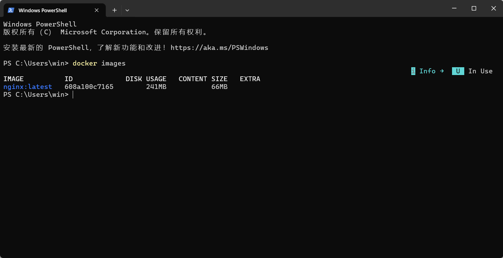

### docker rmi [id/image] 删除指定镜像

核心作用：**删除本地已下载的指定某个镜像**。

```shell
$docker rmi [id/image]
```

含义：`rm` -> `remove` 缩写，`i` -> `image` 缩写。

- **`id`：镜像 ID 标识**
- **`image`： 镜像名**

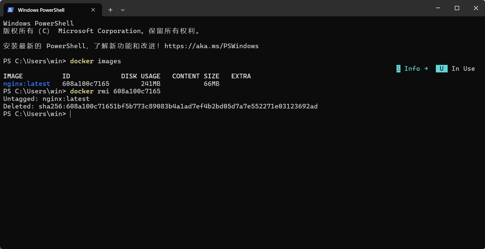

## Docker 容器（Containers）

### docker run 基于镜像创建并运行容器

#### 核心语法

一个 Docker 容器运行命令包含 2 部分内容：

```shell
$ docker run [镜像ID / IMAGE镜像名]
```

核心作用：**通过 `[镜像ID / IMAGE镜像名]`（镜像标识）基于该 Docker “镜像” 模板 创建一个 “容器” 实例（Container），并启动它**。

自动补全：当**为 Docker 镜像创建一个 “容器”** 时，会**自动**为**该 “容器” 随机指定一个具有唯一性的 `CONTAINER ID` 容器ID、`NAMES` 容器名称...**等**属性**。

例如：

```shell
$ docker images
$ docker run nginx:latest
```

表示：**基于最新版本的 `nginx` Docker 镜像创建并启动一个 Docker 容器实例**。

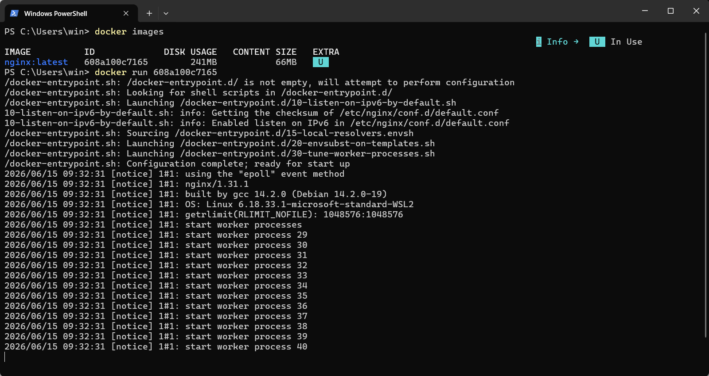

#### 核心机制（自动拉取）

**`docker run` 命令**内部有一个**检测判定分支**，它会**首先查看本地是否有该 Docker “镜像” （Unable to find image 'xxx' locally）**：

- 如果 **Docker 发现本地没有指定的 “镜像”**：则**自动运行 `docker pull` 命令拉取一个对应的 “镜像”，并基于 “镜像“ 直接启动运行**
- 如果**本地有指定的 Docker “镜像”：则直接启动运行**

简单来说，**`docker run` = `docker pull` + `docker run` 两者指令的组合简写形式**；所以 **`docker pull` 可以省略**。

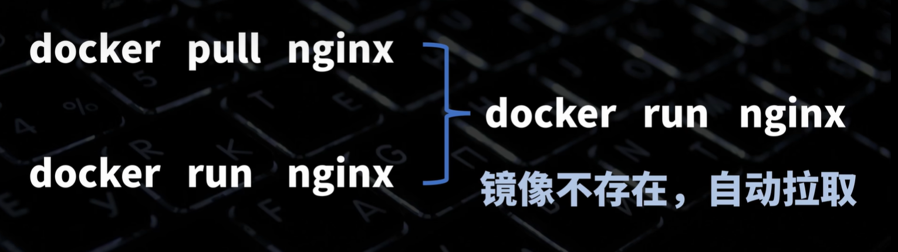

例如：

```shell
$ docker run langchain/langchain
```

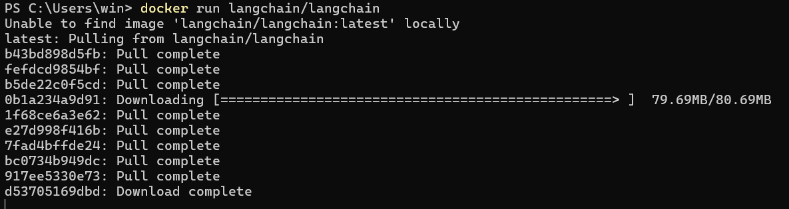

#### -d 分离模式（不阻塞当前终端）

默认情况下，**`docker run` 创建容器并运行后会占用当前 Shell 窗口，导致当前 Shell 终端挂起，无法进行其他操作**。

核心机制：可以选择**添加 `docker run -d xxx` 参数**，表示 **创建的 Docker 容器让其在后台运行，不阻塞当前 Shell 终端窗口**。

```shell
$ docker run -d [镜像ID / IMAGE镜像名]
```

- 未添加 `-d` 参数：

  ```shell
  $docker run nginx
  ```

  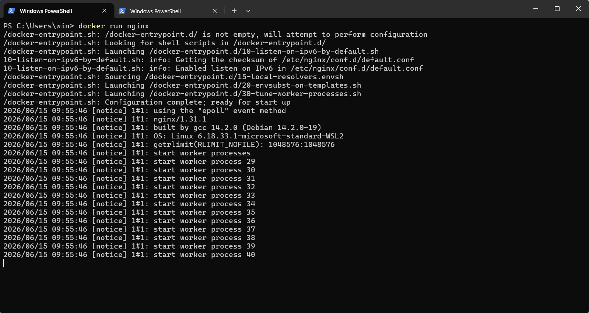

- 添加了 `-d` 参数：

  ```shell
  $docker run -d nginx
  ```

  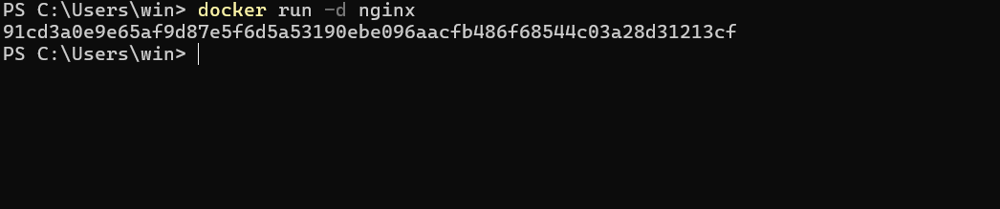

#### --name 自定义容器名称

核心定义：默认情况下，**`docker run` 会为 Docker 容器随机指定一个 `NAMES` 容器名称**。

核心作用：可以选择**添加 `docker run --name xxx` 为启动运行的 Docker 容器自定义一个 “唯一性” 名称**。

> 注：在**使用 `docker rm`** 时，**对于容器的查找 `NAMES` 容器名 、`CONTAINER_ID` 容器ID 是等价**的

```shell
$ docker run --name [自定义容器名] [容器ID / IMAGE容器名]
```

示例：

```shell
$docker run -d --name my_mongo mongo
```

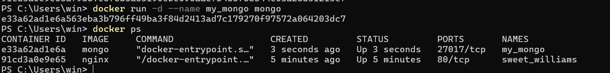

#### -p 端口映射转发（网络通信）

##### 核心痛点

​	由于 **Docker 启动的 “容器”** 是**直接复用了宿主机的系统 OS 内核**，并**采用了Linux 内核提供的两项核心技术—Namespace（命名空间）和 Cgroups（控制组）**—**在全局操作系统中“圈”出了一个独立运行的沙盒让 Docker ”容器“ 在其中运行**。

​	也就是说，**Docker 容器被封装在了宿主机内的一个独立 “沙盒” 中运行，对于宿主机来说是看不见的**。

隔离机制：由于 Docker 采用了 **基于内核进程的软件隔离**，即**无法在宿主机上的某个进程（Chrome 浏览器）通过网络通信访问 Docker “容器”（应用程序）**。


于是，Docker 为 `docker run` 命令提供了 `-p` 参数。

****

##### 基本语法

```shell
$docker run -d -p {xxxx宿主机端口}:{yyyy容器端口} [镜像ID / IMAGE镜像名]
```

核心作用：**`-p {xxxx宿主机端口}:{yyyy容器端口}` 参数**可以**让「当前 Docker 容器的端口」与「宿主机的指定端口」**进行**绑定映射**。

核心原理：**当外部访问宿主机的 `xxxx` 端口时**，宿主机**会自动转发到映射的 Docker 容器的 `yyyy` 端口去执行**。

```css
外部请求 ──> [宿主机 IP : xxxx 端口]
                  │
                  ▼ (触发宿主机内核的 IPTables DNAT 规则)
            [修改目标 IP 为容器 IP]
            [修改目标端口为 yyyy]
                  │
                  ▼ (通过 docker0 虚拟网桥)
         ──────> [容器 IP : yyyy 端口]
```


##### 示例

```shell
$docker -d -p 8080:80 nginx
```

表示：当**外部（宿主机）访问 8080 端口时会映射转发到 Docker 容器的 80 端口**。

例如：浏览器输入 http://localhost:8080/，实际访问端口是 http://localhost:80/

****

#### -v **目录映射**（挂载 volume 卷）

##### 核心痛点（数据易失性）

核心定义：由于 **Docker “容器”** 默认是 **“临时” 虚拟构建**的，而 **“容器” 内的应用程序中产出的数据往往需要 “持久化保存”**。

###### 底层机制

​	Docker 容器采用的是**分层文件系统（UnionFS）**。当**执行 `docker run` 基于一个镜像启动容器**时，Docker 会**在镜像的只读层之上**，添加一个薄薄的**可写层（Writable Layer）**。

​	此时，如果在 Docker 容器运行期间，创建了数据库、上传了文件或者修改了配置，那么**所有的更改都会记录在 Docker 容器的可写层中**；这会带来 2 个严重的问题：

- **生命周期绑定（数据随容器而亡）**：

  ​	一旦 **Docker 容器被 `docker rm` 删除**，这个**可写层内所记录的 "临时数据" 也会被随之彻底销毁**。

- **读写性能差**：

  ​	**Docker 容器可写层的读写**需要**经过 Docker 的存储驱动（Storage Driver）进行写时复制（Copy-on-Write）转换**，这种机制在面对高频 I/O（如 MySQL/Redis 数据库）时，性能表现非常糟糕。


于是，Docker 提供了 `-v` 参数。**`-v` 即（`volume` 挂载卷）**

****

##### 核心目的（持久化存储数据）

​	为了**实现 Docker 容器的 “数据持久化”**，因为一旦 **Docker 容器被 `docker rm` 删除**，容器内的**数据同时也会被随之删除**；

​	如果**使用了 `volume` 挂载卷**，那么**当 Docker 容器被删除**时，**不会影响到宿主机**，从而**实现即使 Docker 容器被删除，在宿主机内与之绑定的对应目录的数据也被持久化保存了下来**。

核心结论：**Container（容器）**负责运行**无状态**的**业务逻辑**，而 **Volume（挂载卷）**负责存储**有状态**的**数据**。通过**挂载卷**，Docker 实现了**“逻辑”与“数据”的完美分离，让容器可以随时被销毁、重建和迁移，而不用担心数据丢失**。


##### 挂载方式

**挂载 volume 卷**有 2 种主要方式：

###### **绑定挂载（Bind Mounts）**

```shell
$docker run -v {Linux 宿主机目录}:{容器内目录}  [镜像ID / IMAGE镜像名]
```

​	核心作用：**将 Docker 容器内的指定临时目录 与 Linux 宿主机的指定物理目录** 进行**绑定映射**，**Docker 容器的数据会被保存到 `{Linux 宿主机目录}` 中**。

> **数据双向同步**：**Docker 容器内对文件的修改会影响 Linux 宿主机的目录，反之亦然**。
>
> 宿主机 与 Docker 容器 通过这个目录紧密联系到了一起，**这种逻辑目录**也叫做 **`volume` 挂载卷**

> [!NOTE]
>
> 示例：
>
> ```shell
> $docker run -d -p 80:80 -v /website/html:/usr/share/nginx/html nginx
> ```
>
> 表示：**将 `/usr/share/nginx/html`（Docker 容器目录） 绑定到 `/website/html`（Linux 宿主机目录）下**，**双方目录的任何修改都会影响到对方目录的内容**。

> 💡注：**第一次使用绑定挂载**的时候，**宿主机的文件会暂时覆盖掉容器内的目录**。除了这种用法 还有一种叫 **Docker Volume 具名卷**，**可以在容器之间共享和重用**。

> ⚠️ 如果使用的是绑定挂载，那么**容器内的数据存在 Docker 的联合文件系统**（通常是 `overlay2` 驱动）的**可写层**中。
>
> 可以通过 `inspect` 找到：
>
> ```shell
> docker inspect [容器ID / NAMES容器名] | grep -A 5 "GraphDriver"
> ```
>
> 相关元信息：
>
> ```json
> "GraphDriver": {
>     "Data": {
>         "LowerDir": "...",
>         "MergedDir": "/var/lib/docker/overlay2/xyz123.../merged", // xyz123 容器ID，作为唯一目录名
>         "UpperDir": "/var/lib/docker/overlay2/xyz123.../diff",
>         "WorkDir": "..."
>     },
>     "Name": "overlay2"
> }
> ```

###### 匿名/具名卷挂载（Volume）

1. 需要先**通过 `docker volume create <卷名>` 创建一个挂载卷**，Docker 会**自动创建一个存储空间并为其命名为 `<卷名>`**，专门**存放与 `{容器内目录}` 的虚拟映射环境信息**。

```shell
$docker volume create [卷名]
```

2. **建立绑定关系**：

```shell
$docker run -v {volume卷名}:{容器内目录}  [镜像ID / IMAGE镜像名]
```

核心作用：**将 `{容器内目录}` 与 Docker 提供的默认宿主机目录（`volume` 挂载卷）**进行**绑定映射**。

3. **查看创建的 `volume` 具名挂载卷，在宿主机上的真实物理位置**：

```shell
$docker volume [卷名] inspect

#
# [
#    {
#        "CreatedAt": "2026-06-15T15:46:26Z",
#        "Driver": "local",
#        "Labels": null,
#        "Mountpoint": "/var/lib/docker/volumes/[卷名]/_data", 
		    # 映射存储的 Linux 宿主机目录位置，容器内的数据将存在这里
#        "Name": "test",
#        "Options": null,
#        "Scope": "local"
#    }
# ]
#
```

> 注：在**第一次使用 `volume` 具名卷**时，Docker 会**自动将容器内的数据同步到 宿主机 的目录中**，但绑定挂载没有这个功能。

> [!NOTE]
>
> 例如：
>
> ```shell
> $docker volume create mongo_test # 1. 创建 volume 具名挂载卷
> $docker volume inspect mongo_test # 2. 查看 mongo_test 具名挂载卷的 Linux 宿主机目录位置
> [
>     {
>         "CreatedAt": "2026-06-15T16:20:30Z",
>         "Driver": "local",
>         "Labels": null,
>         "Mountpoint": "/var/lib/docker/volumes/mongo_test/_data",
>         "Name": "mongo_test",
>         "Options": null,
>         "Scope": "local"
>     }
> ]
> # 2. 将 Linux 宿主机目录 /var/lib/docker/volumes/mongo_test/_data 与 容器内目录 /usr/share/mongo/data 绑定映射，启动 Docker 容器
> $docker docker run -d -p 99:99 --name my_mongo -v mong_test:/usr/share/mongo/data mongo
> ```
>
> 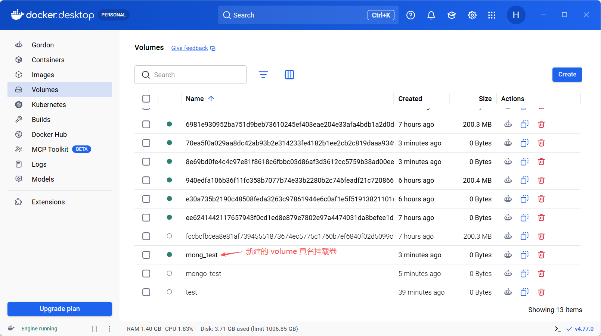

###### 两个方式的核心区别

- **挂载绑定**：*开发环境*

  - **没有任何实体管理，属于 “临时” 操作**，Docker **容器结束即销毁挂载**
  - 绑定命令：**`docker run -v {Linux 宿主机目录}:{容器内目录}` 自定义**要**绑定映射的 Linux 宿主机目录**
  - **第一次使用时，Linux 宿主机目录的内容会覆盖 Docker 容器内目录**

- **`volume` 具名挂载卷**：*生产环境*

  - 以 **卷实体** 进行管理，安全可靠

  - 绑定命令：**`docker run -v {volume卷名}:{容器内目录}`  **

    ​    **完全交由 Docker 自动控制**，**与默认 Linux 宿主机目录 ` /var/lib/docker/volumes/<卷名>` 进行绑定映射**

  - **提供一个存储空间的卷实体交由 Docker 顶层管理挂载卷**，可**实现共享、基于此挂载卷模板重建容器环境数据**...等操作

  - **第一次使用时**，Docker 会**自动将容器内的数据同步到 Linux 宿主机 的目录中**

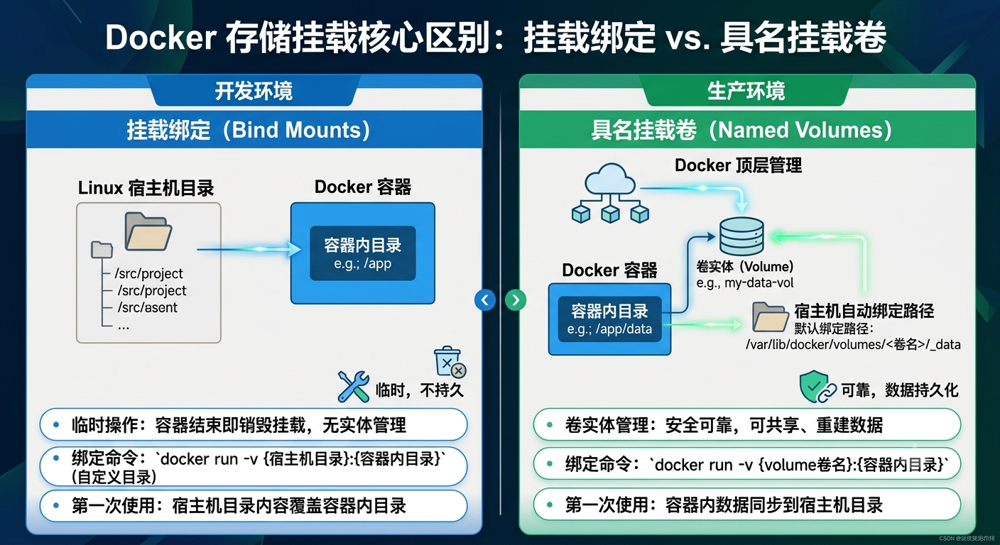

| **维度**          | **绑定挂载 (Bind Mounts)**                     | **具名挂载卷 (Named Volumes)**                             |
| ----------------- | ---------------------------------------------- | ---------------------------------------------------------- |
| **核心定位**      | **开发环境**的“传声筒”                         | **生产环境**的“保险箱”                                     |
| **宿主机路径**    | **完全自定义**（如 `/Users/project/src`）      | **Docker 自动管理**（统一在 `/var/lib/docker/volumes/`）   |
| **初次挂载行为**  | **宿主机覆盖容器**（宿主机为空，容器内变空）   | **容器初始化宿主机**（容器内数据自动复制到宿主机）         |
| **管理级别**      | 宿主机层面的普通文件/目录映射                  | Docker 顶层对象，支持 `docker volume` 命令管理             |
| **安全性/隔离性** | 较低（容器内程序误操作可能搞垮宿主机系统文件） | 较高（有 Docker 隔离保护，容器无法跨界访问其他宿主机目录） |

场景总结：

- **用 Bind Mount 的唯一理由：** **本地开发**。需要实时修改代码并让容器立即生效（热更新），或者需要让容器共享宿主机上的特定系统配置（如 `/etc/localtime` 同步时间）
- **用 Volume 的理由：** **除开发之外的所有场景**。特别是数据库（MySQL、PostgreSQL）、缓存（Redis）、日志存储等。数据安全、不丢失、好备份，才是生产环境的王道

#### -e 环境变量

核心定义：当**某个 Docker 容器（如 数据库）启动**时，往往**需要**一个**账号名、密码等信息**，可以**通过 `-e` 参数作为一个个环境变量传递注入**，等**下次再次启动时便不需要额外传递**了，**Docker 容器内部默认会存储（自动预设）**。

注：**由于 `-e` 参数会很长，所以每一行的末尾都需要添加 `\` 作为换行符标识；（Windows 中：Shell 是 \`，CMD 是 `^`）**

```shell
$docker run -d -p [Linux 宿主机端口]:[容器端口] \ # ` 或 ^（Windows）
-e [环境变量名1]=[值1] \ # ` 或 ^（Windows）
-e [环境变量名2]=[值2] \ # ` 或 ^（Windows）
...
[镜像ID / IMAGE镜像名]
```

核心作用：**将 `[环境变量名1]=[值1]`、`[环境变量名2]=[值2]`... 作为环境变量注入到 `[镜像ID / IMAGE镜像名]` Docker 容器中启动并运行**，同时**设置外部访问 `[Linux 宿主机端口]` 时转发到 `[容器端口]` 去执行**。

> 💡注：如果不知道容器的环境变量有哪些，可以在 Docker Hub 上搜索一下，或者去 Github 上看一下 readme 文档，都有详细的描述。

##### 示例

以 Docker 容器的形式，启动并运行 PostgreSQL 数据库，同时注入相关的用户名、密码、连接数据库...等信息：

```shell
docker run --name postgres-configured -d -p 5432:5432 `
  -e POSTGRES_USER=myuser `
  -e POSTGRES_PASSWORD=mypassword `
  -e POSTGRES_DB=mydb `
  -e POSTGRES_INITDB_ARGS="--encoding=UTF8 --locale=C" `
  postgres
```

之后可通过 PostgreSQL 图形化界面工具，或者直接 `psql` 命令使用，但前提是通过 `docker exec -it postgres-configured` 进入内部终端。

```shell
$docker exec -it postgres-configured psql -U myuser -d mydb
```

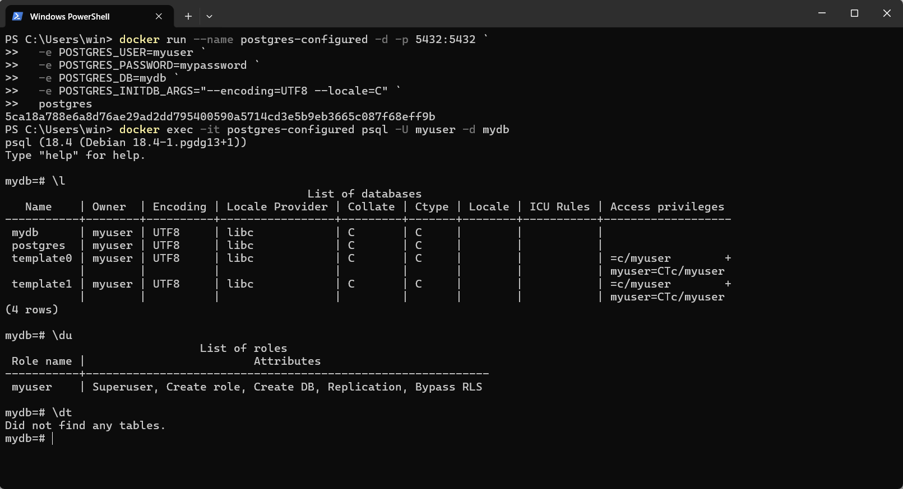

#### -it 创建并进入容器内部终端

核心作用：`docker run -it` 在**基于某个 Docker 镜像创建并启动运行一个 Docker 容器时，同时进入容器内部的终端**。

关键点：**退出 Docker 容器后，该容器会被保留**。

```shell
$docker run -it [镜像ID / IMAGE镜像名]
```

示例：

```shell
$docker run -it redis
```

表示：创建一个基于 `redis` Docker 镜像的 Docker 容器，启动运行并进入 Redis 终端。

```shell
PS C:\Users\win> docker ps -a
CONTAINER ID   IMAGE      COMMAND     CREATED          STATUS                  PORTS        NAMES

PS C:\Users\win> docker run -it --rm redis
...

PS C:\Users\win> docker ps -a 
CONTAINER ID   IMAGE   COMMAND                  CREATED             STATUS        PORTS     NAMES
8f7ad60b5c34   redis   "docker-entrypoint.s…"   5 seconds ago    Exited (0) ...             wizardly_hermann
# redis 容器被保留了下来
```

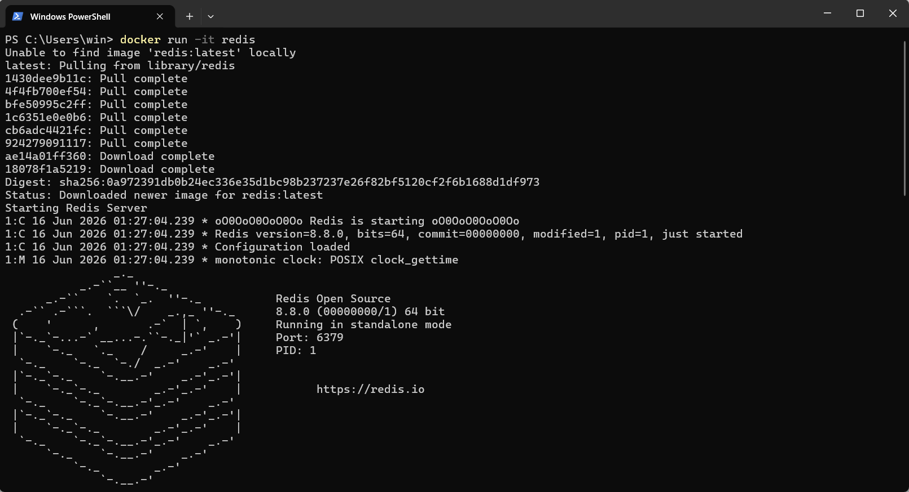

##### --rm 退出时删除容器

核心作用：**当退出 Docker 容器时，自动删除这个 Docker 容器**。一般**与 `-it` 命令配合使用**。用于**临时测试某个 Docker 容器**。

```shell
$docker run -it --rm [镜像ID / IMAGE镜像名]
```

示例：

```shell
$docker run -it --rm redis
```

表示：基于 `redis` Docker 镜像，创建并启动运行一个 Docker 容器，在退出容器时，自动删除这个 Docker 容器。

```shell
PS C:\Users\win> docker ps -a
CONTAINER ID   IMAGE      COMMAND     CREATED          STATUS                  PORTS        NAMES

PS C:\Users\win> docker run -it --rm redis
...

PS C:\Users\win> docker ps -a 
# redis 容器未被保留下来
```

#### --restart 容器重启策略

默认情况下，当出现 Linux 宿主机意外断电、Docker 容器内部崩溃... 等原因时，Docker 容器会自动停止。

核心作用：**`docker run --restart` 参数可以在创建并运行一个 Docker 容器后，当 Docker 容器停止时，自动重启并运行 Docker 容器**。

**`--restart` 后面有 2 个选项**，表示**重启策略**：

- **`always`**：**无论什么情况（内部错误崩溃，或者宿主机断电等场景...），只要 Docker 容器停止了，就会自动重启**
- **`unless-stopped`：与 `always` 类似**，唯一区别是：**手动停止的 Docker 容器不会尝试自动重启了**

```shell
$docker run -d --start [always|unless-stopped] [镜像ID / IMAGE镜像名]
```

示例：

```shell
$docker run -d --start always nginx
```

表示：当基于 `nginx` Docker 镜像创建运行的 Docker 容器停止时，会自动重启它。

### docker ps 查看正在运行的容器

- **`ps` 是 Process Status (进程状态)** 的缩写，也是 Linux 上的一个经典命令，用于**查看进程的状态信息**。

核心作用：**查看本地正在运行的 Docker 容器列表**。

```shell
$docker ps
```

- **`CONTAINER ID`：容器 ID，每个容器在创建时会生成一个唯一的 ID**
- **`COMMAND`**：**容器内启动服务的指令**
- **`IMAGE`：基于那个镜像创建出来的**
- **`CREATED`：容器创建时间**
- **`STATUS`：容器当前状态**
- **`PORTS`：容器使用端口**
- **`NAMES`：容器的名字**，如果**创建容器时没有 `--name` 指定名字，系统就会随机分配一个**

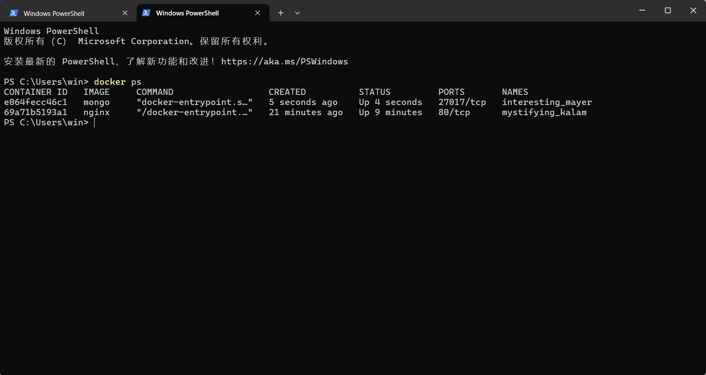

#### -a 查看所有容器

核心作用：可以看到**所有的 Docker 容器，包括正在运行的和已经停止的（`-a` = `-all`）**。

```shell
$docker ps -a
```

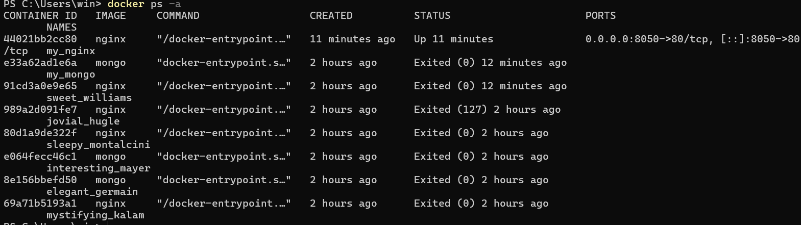

- **`STATUS`：容器状态**
  - **`Up ...` 正在运行**
  - **`Exited(0)`：已停止**

### docker rm [id/names] 删除容器

核心作用：**删除一个已创建、未运行的 Docker 容器**。

缺点：无法删除正在运行中的 Docker 容器，需借助 `-f` 参数强制删除。

```shell
$docker rm [容器标识ID / NMAES容器名]
```

例如：

```shell
$docker rm 8e156bbefd50
```

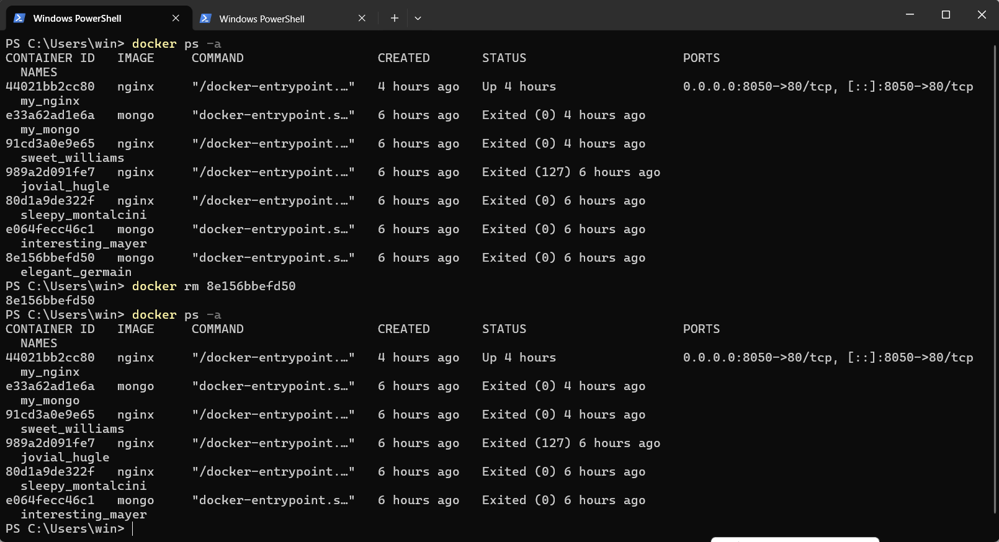

#### 参数

##### -f 强制删除运行中的容器

核心作用：**强制删除一个正在运行中的 Docker 容器**。

```shell
$docker rm -f [容器标识ID]
```

例如：

```shell
$docker rm -f f96bf2c7c135
```

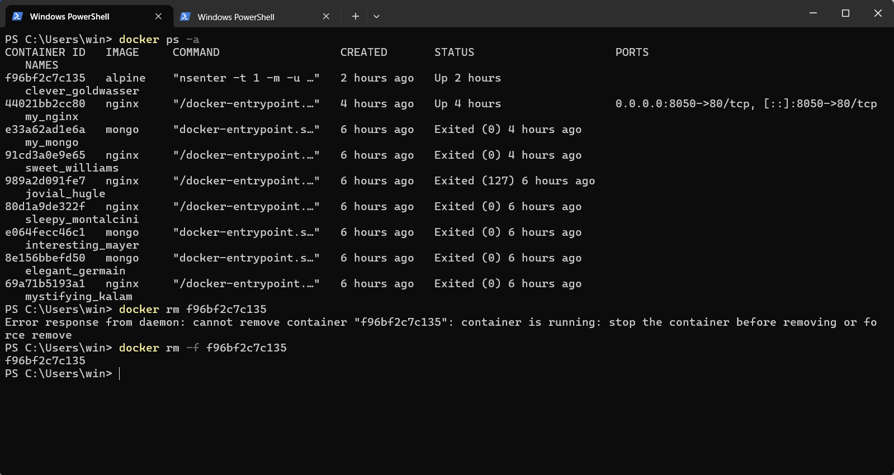

### 启动/停止 容器

核心描述：由于 `docker run` 每次都会创建一个新的 Docker 容器运行，如果想对同一个 Docker 容器进行启动 / 停止的持续操作，可以使用 `docker start/stop` 容器的启停命令组来实现。

#### docker start [id/names] 启动容器

核心作用：**根据给定的 `[id/names]`，手动启动某个已经创建好的 Docker 容器。**

- **`id`：容器ID**
- **`names`：容器名**

核心特性：

​	在使用 `docker start` 启动 Docker 容器时，不需要再额外传递创建容器时的 `-p` 端口映射、`-v` 挂载卷、`-e` 环境变量等参数；

​	在第一次使用 `docker run` 创建并运行 Docker 容器时，已经被 Docker 顶层内部自动记录保存了，使用 `docker start` 重新启动会按照原样运行。

```shell
$docker start [容器ID / NAMES容器名]
```

示例：

```shell
$docker run -d -p 80:80 --name my_nginx -v /website/html:/usr/share/nginx/html nginx 
# 创建并运行一个 Docker 容器

$docker ps -a
CONTAINER ID   IMAGE      COMMAND                  CREATED             STATUS          PORTS     NAMES
44021bb2cc80   nginx      "/docker-entrypoint.…"   14 hours ago        Exited (0)                my_nginx

$docker start my_nginx
# 手动启动，已创建但未运行（Exited）的 my_nginx 容器
```

表示：手动启动，已创建但未运行（Exited）的 `my_nginx` 容器。

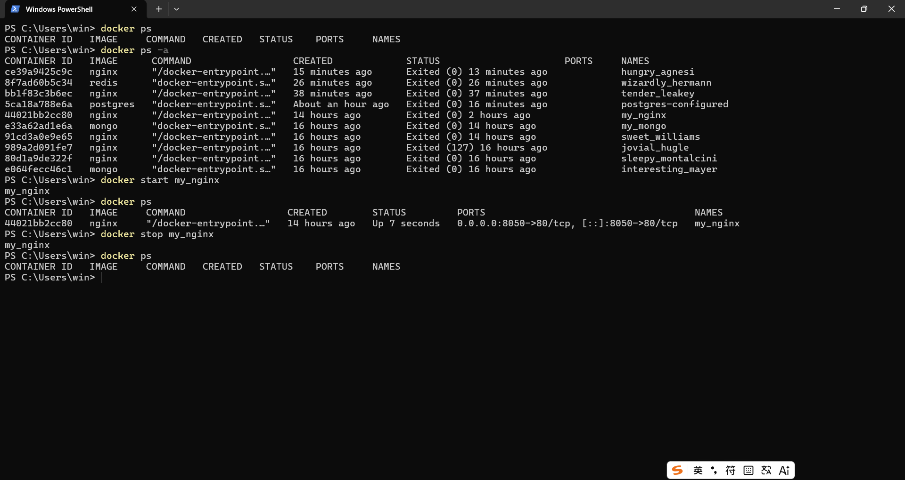

#### docker stop [id/names] 停止容器

核心作用：**根据给定的 `[id/names]`，手动停止某个 Docker 容器。**

- **`id`：容器ID**
- **`names`：容器名**

```shell
$docker stop [容器ID / NAMES容器名]
```

示例：

```shell
$docker stop my_nginx
```

表示：手动停止正在运行的 `my_nginx` Docker 容器。

### docker create 基于镜像创建容器

核心描述：`docker create` **与 `docker run` 命令功能类似**。

**区别**在于：**`docker create` 只创建一个 Docker 容器，不自动启动**，需**借助 `docker start/stop` 启停命令来手动启动**。

```shell
$docker create [-p] [--name] [-v]... [镜像ID / IMAGE镜像名]
```

示例：

```shell
$docker create -p 27017:27017 --name mongo_test mongo
```

表示：创建一个别名为 `mongo_test`，转发端口为 27017 的 Docker 容器，但不自动运行

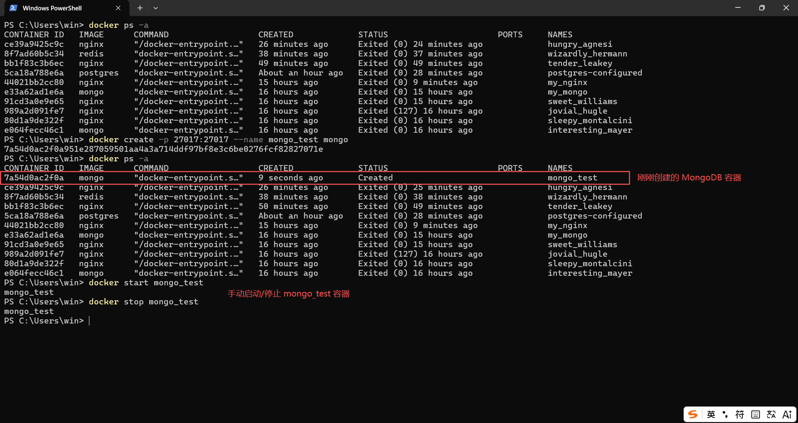

### docker logs [id/names] 查看容器日志

核心作用：**查看具体某个容器的运行日志。但不支持滚动查看**。

```shell
$docker logs [容器ID / NAMES容器名]
```

示例：

```shell
PS C:\Users\win> docker ps
CONTAINER ID   IMAGE     COMMAND                  CREATED         STATUS          PORTS                                             NAMES
7a54d0ac2f0a   mongo     "docker-entrypoint.s…"   8 minutes ago   Up 25 seconds   0.0.0.0:27017->27017/tcp, [::]:27017->27017/tcp   mongo_test

PS C:\Users\win> docker logs mongo_test
.....
```

#### -f 滚动查看

核心作用：**持续输出 Docker 容器的运行日志，可以滚动查看（`-f` = `-follow`）**。

```shell
$docker logs -f [容器ID / NAMES容器名]
```

示例：

```shell
PS C:\Users\win> docker ps
CONTAINER ID   IMAGE     COMMAND                  CREATED         STATUS          PORTS                                             NAMES
7a54d0ac2f0a   mongo     "docker-entrypoint.s…"   8 minutes ago   Up 25 seconds   0.0.0.0:27017->27017/tcp, [::]:27017->27017/tcp   mongo_test

PS C:\Users\win> docker logs -f mongo_test
.....
```

### docker inspect 输出容器的元信息

核心作用：`docker inspect` 会**以 JSON 格式返回 Docker 容器 的所有元数据**。

```shell
$docker inspect [容器ID / NAMES容器名]
```

示例：

```shell
$docker inspect my_mongo
[
    {
        "Id": "e33a62ad1e6a563eba3b796ff49ba3f84d2413ad7c179270f97572a064203dc7",
        "Created": "2026-06-15T10:02:24.432032532Z",
        "Path": "docker-entrypoint.sh",
        "Args": [
            "mongod"
        ],
        "State": {
            "Status": "exited",
            "Running": false,
            "Paused": false,
            "Restarting": false,
            "OOMKilled": false,
            "Dead": false,
            "Pid": 0,
            "ExitCode": 0,
            "Error": "",
            "StartedAt": "2026-06-15T10:02:24.51471011Z",
            "FinishedAt": "2026-06-15T11:43:35.644324722Z"
        },
        "Image": "sha256:49f1d7b87c2ddf918372be5defe7edff8c46703d0b2a56023a3f825e32e1250c",
        "ResolvConfPath": "/var/lib/docker/containers/e33a62ad1e6a563eba3b796ff49ba3f84d2413ad7c179270f97572a064203dc7/resolv.conf",
        "HostnamePath": "/var/lib/docker/containers/e33a62ad1e6a563eba3b796ff49ba3f84d2413ad7c179270f97572a064203dc7/hostname",
        "HostsPath": "/var/lib/docker/containers/e33a62ad1e6a563eba3b796ff49ba3f84d2413ad7c179270f97572a064203dc7/hosts",
        "LogPath": "/var/lib/docker/containers/e33a62ad1e6a563eba3b796ff49ba3f84d2413ad7c179270f97572a064203dc7/e33a62ad1e6a563eba3b796ff49ba3f84d2413ad7c179270f97572a064203dc7-json.log",
        "Name": "/my_mongo",
        "RestartCount": 0,
        "Driver": "overlayfs",
        "Platform": "linux",
        "MountLabel": "",
        "ProcessLabel": "",
        "AppArmorProfile": "",
        "ExecIDs": null,
        "HostConfig": {
            "Binds": null,
            "ContainerIDFile": "",
            "LogConfig": {
                "Type": "json-file",
                "Config": {}
            },
            "NetworkMode": "bridge",
            "PortBindings": {},
            "RestartPolicy": {
                "Name": "no",
                "MaximumRetryCount": 0
            },
            "AutoRemove": false,
            "VolumeDriver": "",
            "VolumesFrom": null,
            "ConsoleSize": [
                34,
                130
            ],
            "CapAdd": null,
            "CapDrop": null,
            "CgroupnsMode": "private",
            "Dns": null,
            "DnsOptions": [],
            "DnsSearch": [],
            "ExtraHosts": null,
            "GroupAdd": null,
            "IpcMode": "private",
            "Cgroup": "",
            "Links": null,
            "OomScoreAdj": 0,
            "PidMode": "",
            "Privileged": false,
            "PublishAllPorts": false,
            "ReadonlyRootfs": false,
            "SecurityOpt": null,
            "UTSMode": "",
            "UsernsMode": "",
            "ShmSize": 67108864,
            "Runtime": "runc",
            "Isolation": "",
            "CpuShares": 0,
            "Memory": 0,
            "NanoCpus": 0,
            "CgroupParent": "",
            "BlkioWeight": 0,
            "BlkioWeightDevice": [],
            "BlkioDeviceReadBps": [],
            "BlkioDeviceWriteBps": [],
            "BlkioDeviceReadIOps": [],
            "BlkioDeviceWriteIOps": [],
            "CpuPeriod": 0,
            "CpuQuota": 0,
            "CpuRealtimePeriod": 0,
            "CpuRealtimeRuntime": 0,
            "CpusetCpus": "",
            "CpusetMems": "",
            "Devices": [],
            "DeviceCgroupRules": null,
            "DeviceRequests": null,
            "MemoryReservation": 0,
            "MemorySwap": 0,
            "MemorySwappiness": null,
            "OomKillDisable": null,
            "PidsLimit": null,
            "Ulimits": [],
            "CpuCount": 0,
            "CpuPercent": 0,
            "IOMaximumIOps": 0,
            "IOMaximumBandwidth": 0,
            "MaskedPaths": [
                "/proc/acpi",
                "/proc/asound",
                "/proc/interrupts",
                "/proc/kcore",
                "/proc/keys",
                "/proc/latency_stats",
                "/proc/sched_debug",
                "/proc/scsi",
                "/proc/timer_list",
                "/proc/timer_stats",
                "/sys/devices/virtual/powercap",
                "/sys/firmware"
            ],
            "ReadonlyPaths": [
                "/proc/bus",
                "/proc/fs",
                "/proc/irq",
                "/proc/sys",
                "/proc/sysrq-trigger"
            ]
        },
        "Storage": {
            "RootFS": {
                "Snapshot": {
                    "Name": "overlayfs"
                }
            }
        },
        "Mounts": [
            {
                "Type": "volume",
                "Name": "e30a735b2190c48508feda3263c97861944e6c0af1e5f51913821101a3bfe212",
                "Source": "/var/lib/docker/volumes/e30a735b2190c48508feda3263c97861944e6c0af1e5f51913821101a3bfe212/_data",
                "Destination": "/data/configdb",
                "Driver": "local",
                "Mode": "",
                "RW": true,
                "Propagation": ""
            },
            {
                "Type": "volume",
                "Name": "940edfa106b36f11fc358b7077b74e33b2280b2c746feadf21c7208662bb7c27",
                "Source": "/var/lib/docker/volumes/940edfa106b36f11fc358b7077b74e33b2280b2c746feadf21c7208662bb7c27/_data",
                "Destination": "/data/db",
                "Driver": "local",
                "Mode": "",
                "RW": true,
                "Propagation": ""
            }
        ],
        "Config": {
            "Hostname": "e33a62ad1e6a",
            "Domainname": "",
            "User": "",
            "AttachStdin": false,
            "AttachStdout": false,
            "AttachStderr": false,
            "ExposedPorts": {
                "27017/tcp": {}
            },
            "Tty": false,
            "OpenStdin": false,
            "StdinOnce": false,
            "Env": [
                "PATH=/usr/local/sbin:/usr/local/bin:/usr/sbin:/usr/bin:/sbin:/bin",
                "GOSU_VERSION=1.19",
                "JSYAML_VERSION=3.13.1",
                "JSYAML_CHECKSUM=662e32319bdd378e91f67578e56a34954b0a2e33aca11d70ab9f4826af24b941",
                "MONGO_PACKAGE=mongodb-org",
                "MONGO_REPO=repo.mongodb.org",
                "MONGO_MAJOR=8.2",
                "MONGO_VERSION=8.2.11",
                "HOME=/data/db",
                "GLIBC_TUNABLES=glibc.pthread.rseq=0"
            ],
            "Cmd": [
                "mongod"
            ],
            "Image": "mongo",
            "Volumes": {
                "/data/configdb": {},
                "/data/db": {}
            },
            "WorkingDir": "",
            "Entrypoint": [
                "docker-entrypoint.sh"
            ],
            "Labels": {
                "org.opencontainers.image.version": "24.04"
            },
            "StopTimeout": 1
        },
        "NetworkSettings": {
            "SandboxID": "",
            "SandboxKey": "",
            "Ports": {},
            "Networks": {
                "bridge": {
                    "IPAMConfig": null,
                    "Links": null,
                    "Aliases": null,
                    "DriverOpts": null,
                    "GwPriority": 0,
                    "NetworkID": "ee3e05d881dfd0557f5a4e7deef54e42fa9c4f1c4ca1bcb0cd62810c278178d1",
                    "EndpointID": "",
                    "Gateway": "",
                    "IPAddress": "",
                    "MacAddress": "",
                    "IPPrefixLen": 0,
                    "IPv6Gateway": "",
                    "GlobalIPv6Address": "",
                    "GlobalIPv6PrefixLen": 0,
                    "DNSNames": null
                }
            }
        },
        "ImageManifestDescriptor": {
            "mediaType": "application/vnd.oci.image.manifest.v1+json",
            "digest": "sha256:6c7889031d2ff57f7dd3711398587d1c8b05a68439aab02dd880ed1e0691cfbf",
            "size": 2476,
            "annotations": {
                "com.docker.official-images.bashbrew.arch": "amd64",
                "org.opencontainers.image.base.digest": "sha256:023f8a753c22258c9fe2d0005a7d28258038da7d620e9f93e9ad78aa266f9f11",
                "org.opencontainers.image.base.name": "ubuntu:noble",
                "org.opencontainers.image.created": "2026-06-12T19:08:46Z",
                "org.opencontainers.image.revision": "a8cac75a3a6fedc2ce048069a862a9bcb07cd69f",
                "org.opencontainers.image.source": "https://github.com/docker-library/mongo.git#a8cac75a3a6fedc2ce048069a862a9bcb07cd69f:8.2",
                "org.opencontainers.image.url": "https://hub.docker.com/_/mongo",
                "org.opencontainers.image.version": "8.2.11-noble"
            },
            "platform": {
                "architecture": "amd64",
                "os": "linux"
            }
        }
    }
]
```

表示：以 JSON 格式输出 `my_mongo` 的所有元信息。

#### --format 过滤输出信息

核心作用：**由于 `docker inspect` 会输出很多信息**，可以选择添加 **`--format` 来过滤，只输出某些具体信息**。

##### {{json .Mounts}} 过滤出挂载卷信息

```shell
$docker inspect --format='{{json .Mounts}}' my_mongo | jq
```

表示：以 JSON 格式，输出 `my_mongo` Docker 容器所使用的 Volume 挂载卷信息。

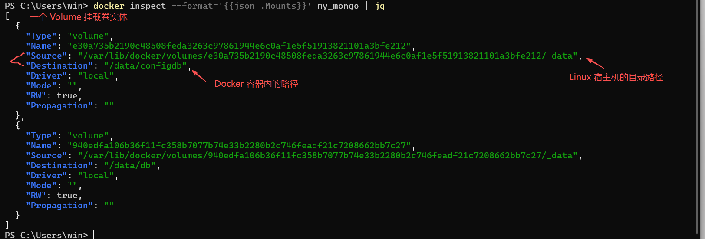

### docker exec 进入容器内部、执行 Linux 命令

#### Docker 容器化的技术原理

Docker 利用了 Linux 的两大原生功能，实现容器化：

- **Cgroups** **用来限制和隔离进程的资源使用**。可以为每个容器设定 CPU、内存、网络带宽等资源的使用上限，确保容器的内存消耗不会影响到宿主机。
- **Namespaces** **用于隔离进程的资源视图**，使得**容器只能看到自己内部的进程 ID、网络资源、文件目录，看不到宿主机的**。

容器本质上还是一个**特殊的进程**，但是**当我们进入容器内部**时，**看起来就像是一个独立的 Linux 操作系统**


#### exec [id/names] {linux bash} 发生一个命令

- **Docker 容器内部本身也是一个被封装的、极简的 Linux 操作系统**，可以**通过 `docker exec` 命令运行部分基础 Linux 命令**。
- 进入 Docker 容器内部，看起来就像是**一个完全独立的 Linux 系统**，**只能看到自己的文件（资源进程隔离）**。


##### 基本语法

```shell
$docker exec [容器ID / NAMES容器名] [要执行的 Linux 基础命令]
```

核心作用：**进入 Docker 容器内部（Linux 子系统），执行一些基础的 Linux 命令**。


示例：

```shell
$docker exec mongo_test ps -ef
```

表示：进入 `mongo_test` Docker 容器内部（Linux 子系统），查看当前 Linux 子系统内的进程列表。

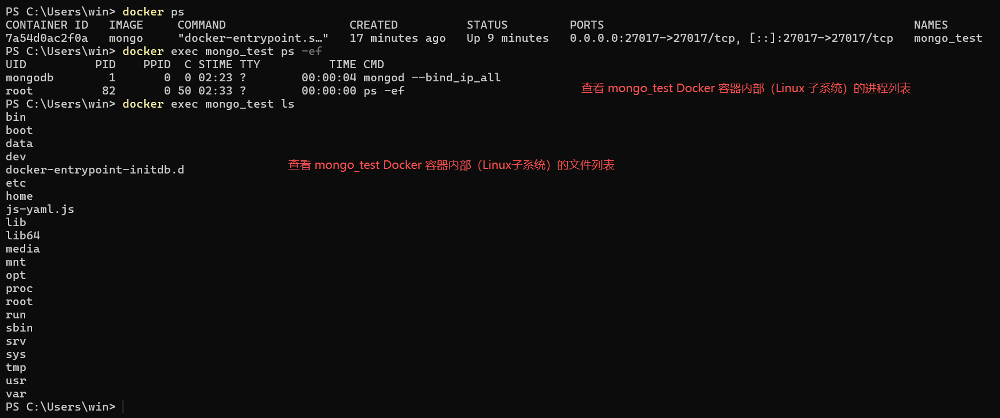

#### exec -it [id/names] [bash/sh] 命令交互式环境

核心作用：**进入 Docker 容器内部，获取一个 Linux 命令的交互式环境。**

##### 与 `exec` 的区别

- **`docker exec`：一次只能发送一条 Linux 命令**
- **`docker exec -it xxx bash`：直接进入容器内部，通过交互式环境，自由发送多条 Linux 命令**

> ⚠️ 注意点：由于 **Docker 为了尽量压缩镜像的大小，Docker 容器内部只是一个极简的 Linux 操作系统**，**只能运行一些基本的命令**（`ls` 查看文件列表、`ps` 查看进程....），若**想使用 `vim`... 等工具，需额外下载安装**。

##### 基本语法

```shell
$docker exec -it [容器ID / NAMES容器名] bash
$docker exec -it [容器ID / NAMES容器名] sh
# 两者等价
```

示例：

```bash
$docker exec -it my_nginx bash
$ ls
bin  boot  dev  docker-entrypoint.d  docker-entrypoint.sh  etc  home  lib  lib64  media  mnt  opt  proc  root  run  sbin  srv  sys  tmp  usr  var
$ cd /usr/share/nginx/html
$ ls
50x.html  index.html
$ apt install vim
$ vim index.html
```

表示：进入 `my_nginx` Docker 容器内部（Linux 子系统），并使用 Linux 命令修改了 `/usr/share/nginx/html/index.html` 文件

## Docker 卷（Volume / Mounts）

Docker 引入挂载卷（Volumes / Mounts）的核心原因：**因为 Docker 容器默认是“临时”的，而数据往往需要“永久”保存。**

- **Volume 挂载卷**是一个**逻辑单元**的概念，用于表示一个 **Linux 宿主机** 和 **Docker 容器** 两者**之间指定目录映射的 实体**。

### 核心概念

在 Docker 中，除了**直接使用 `docker run -v {x:y}`  命令**之外，还可以使用**命名卷（`volume`）**的形式来**实现 Docker 容器目录 与 宿主机目录 之间的 绑定映射**。

核心概念：**volume 卷**是用于**持久化数据的文件系统**，可以**将数据和应用程序分离，便于管理**，可以**在容器之间共享和重用**。同时 volume 卷可以用于**数据的备份和恢复**。

#### 主要挂载方式

在实际使用中，主要使用以下两种挂载方式：

| **挂载类型**               | 相关命令                                                     | **宿主机路径**                                            | **特点与适用场景**                                           |
| -------------------------- | ------------------------------------------------------------ | --------------------------------------------------------- | ------------------------------------------------------------ |
| **匿名/具名卷 (Volumes)**  | **`docker volume create {volume 卷名}` <br />+<br />`docker run -v {volume 卷名}:{容器内目录}`** | 由 Docker 自动管理<br />（`/var/lib/docker/volumes/` 下） | **生产环境首选、安全**。<br />不受宿主机操作系统目录结构的影响 |
| **绑定挂载 (Bind Mounts)** | **`docker run -v {宿主机目录}:{容器内目录}`**                | 由用户手动指定（如 `/User/project/code`）                 | **开发环境首选、快捷。** <br />**容器可以直接访问宿主机的任意文件** |

##### 核心区别

- **`docker run -v {宿主机目录}:{容器内目录}` 命令**：使用的是**绑定挂载卷**，**没有具体的实体管理能力**，属于**临时**操作

- **`docker volume create {volume 卷名}` + `docker run -v {volume 卷名}:{容器内目录}` 命令**：

  ​	Docker 会创建一个**`volume` 具名挂载卷实体**，并为它命名，默认将 `{容器内目录}` 映射到 **Linux 宿主机的 `/var/lib/docker/volumes` 目录下存储**，Docker 可以**通过管理这些 `volume` 卷来提升效率**。


#### 设计理念

- **`volume` 挂载卷**的设计：为了**绕开容器的可写层，直接将 Docker 容器内的某个目录映射绑定到宿主机（host）的磁盘上**。

核心作用理念：

##### **① 数据持久化**

这是最根本的需求。挂载卷**让数据脱离了容器的生命周期**。

- **场景：运行了一个 MySQL 容器**，把 Docker 容器的**数据目录 `/var/lib/mysql` 挂载到了宿主机身上的某个物理目录**
- **效果**：就算**把 MySQL 容器删除**了，甚至**更新了 MySQL 的镜像版本**，只要**重新启动一个新 MySQL 容器并挂载同一个 volume 卷，之前的全部数据都还在**

##### **② 容器内数据共享**

在**微服务架构**中，**多个 Docker 容器（应用程序）经常需要协同工作**：

- **场景**：一个负责收集日志的 Docker 容器（如 Logstash），需要读取 Web 服务器容器（如 Nginx）生成的日志
- **效果**：两者可以**同时挂载到同一个宿主机目录（`volume` 卷）**，Nginx 往里面写日志，Logstash 实时从里面读日志，实现高效**解耦**

##### ③ 主机与容器的实时同步

这在**开发环境**中极为常用（通常使用**绑定挂载卷 `Bind Mounts`**）

- **场景**：**在宿主机中写** Python、Java、Node.js... **源代码**，把源代码目录**扔到 Docker 容器里的运行目录**
- **效果**：在**宿主机（如 IDE 编辑器）修改了一行代码**，**Docker 容器内部实时更新变化**，配合热更新，**无需重新构建 Docker 镜像（`docker build`）**就能看到效果

##### ④ 性能提升

**Volume 挂载卷直接使用宿主机的文件系统**，绕过了Docker 存储驱动的层层转换。

- **效果**：它的 **I/O 性能等同于直接在宿主机中读写文件**，**非常适合**数据库、缓存...等**高 I/O 密集型任务的应用**

核心结论：**Container（容器）**负责运行**无状态**的**业务逻辑**，而 **Volume（挂载卷）**负责存储**有状态**的**数据**。通过挂载卷，Docker 实现了“逻辑”与“数据”的完美分离，让**容器可以随时被销毁、重建和迁移，而不用担心数据丢失**。

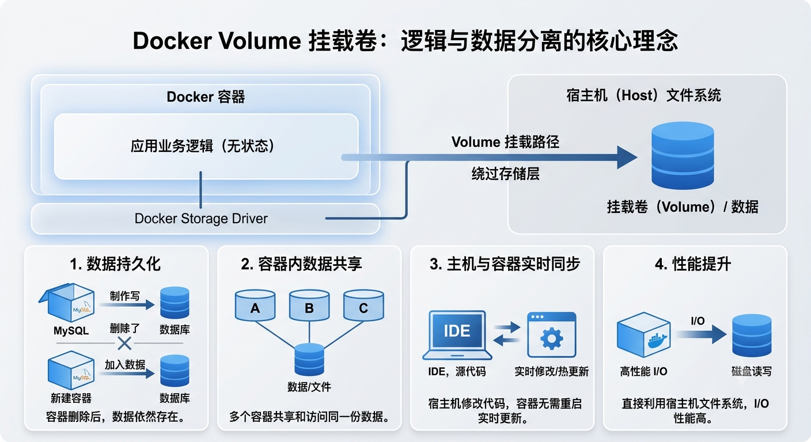

### docker volume 命令

#### create [卷名] 创建一个卷

```shell
$docker volume create [卷名]
```

核心作用：

1. 创建一个**具名挂载卷**，Docker 会**自动创建一个存储空间并为其命名为 `<卷名>`**，并**在 Linux 宿主机中**创建一个子目录 **`/var/lib/docker/volumes/[卷名]/`** 用于存储数据
2. 可**后续使用 `docker run -v {卷名}:{容器内目录}` 与 Docker 容器的目录进行绑定**，实现**数据持久化存储**
3. 创建一个**卷实体**，完全**交由 Docker 管理控制**，可**实现共享、基于此 挂载卷模板 重建容器环境数据**...等操作

##### 示例

```shell
$docker volume create mongo_test # 1. 创建 volume 具名挂载卷
$docker volume inspect mongo_test # 2. 查看 mongo_test 具名挂载卷的 Linux 宿主机目录位置
[
 {
     "CreatedAt": "2026-06-15T16:20:30Z",
     "Driver": "local",
     "Labels": null,
     "Mountpoint": "/var/lib/docker/volumes/mongo_test/_data",
     "Name": "mongo_test",
     "Options": null,
     "Scope": "local"
 }
]
# 2. 将 Linux 宿主机目录 /var/lib/docker/volumes/mongo_test/_data 与 容器内目录 /usr/share/mongo/data 绑定映射，启动 Docker 容器
$docker docker run -d -p 99:99 --name my_mongo -v mong_test:/usr/share/mongo/data mongo
```

#### inspect [卷名] 查看元信息

核心作用：查看**某个 Docker 卷（Volume）的元信息**。

```shell
$docker volume inspect [卷名]
```

示例：

```shell
$docker volume inspect mongo_test

[
 {
     "CreatedAt": "2026-06-15T16:20:30Z",
     "Driver": "local",
     "Labels": null,
     "Mountpoint": "/var/lib/docker/volumes/mongo_test/_data",
     "Name": "mongo_test",
     "Options": null,
     "Scope": "local"
 }
]
```


#### list 列出所有创建的卷

核心作用：**列出所有创建的 Docker 卷**。

```shell
$docker volume list
```

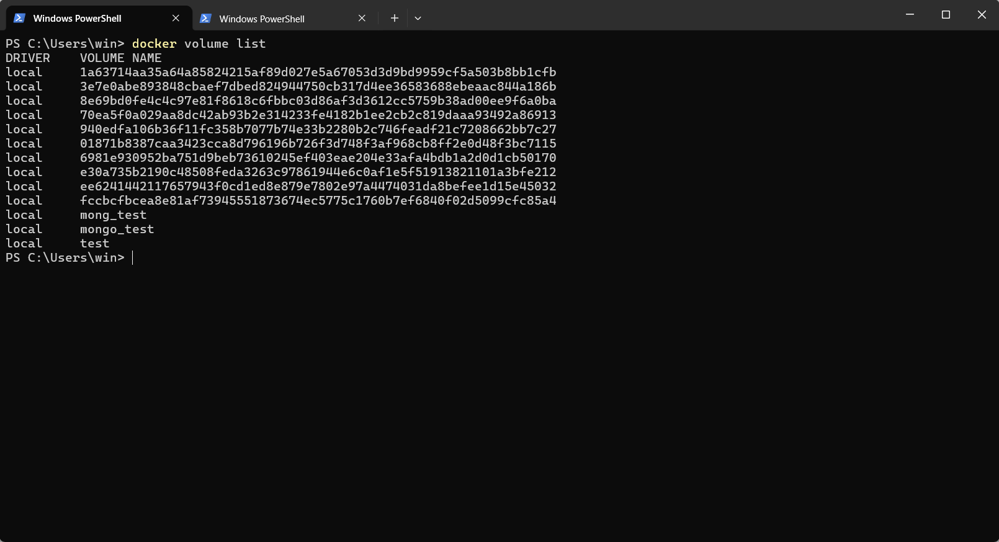

#### rm / remove [卷名] 删除指定卷

核心作用：**删除指定 Docker 卷**。

```shell
$docker volume rm [卷名]
```

示例：

```shell
$docker volume rm test
```

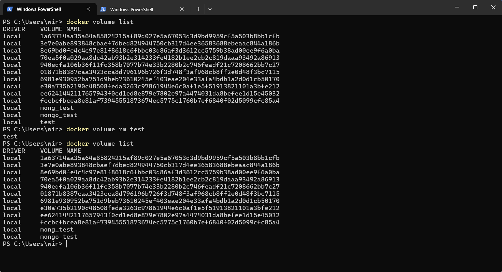

#### prune 删除所有未被容器使用的卷

核心作用：**删除所有未被容器使用的 Docker 卷，会提示是否删除，输入 `y` 即可**。

```shell
$docker volume prune
```

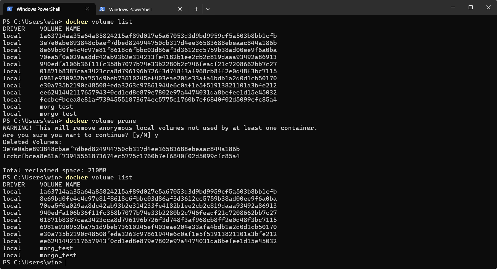

## Dockerfile 镜像构建文件

Dockerfile 是专门用来构建 Docker 镜像的一个配置文件，其中包含了构建 Docker 镜像所需的各种信息。

### 基本结构

```dockerfile
FROM [基础镜像]:[版本号]

WORKDIR [Docker 镜像（构建后容器）的工作目录]

COPY [当前项目目录] [构建后的 Docker 镜像的工作目录]

RUN [安装此镜像包所需依赖指令]

EXPOSE [此镜像包创建为一个 Docker 容器运行后对外提供的端口]

CMD [Docker 容器内服务启动命令]
```

#### FROM 所需基础镜像

Docker 规定，每一个**自定义构建的 Docker 镜像**都**需要基于某个 Docker 基础镜像**来作为**运行环境**。

- 比如一个 Python 程序，则它的基础镜像依赖就是 `python`，即**这个 Python 程序（镜像包）是基于 `python` 环境来运行的服务**

```dockerfile
FROM python:3.13-slim
```

#### WORKDIR 切换工作目录

- **Docker 镜像创建后的 Docker 容器是基于 Linux 系统上运行**的，所以**Docker 容器的内容需要依靠一个工作目录**来运行

所以 Docker 规定，**构建后的 Docker 镜像需要统一放在 Linux 操作系统中的某个目录下进行工作**。

简单来说，**会在 Docker 容器内的 Linux 系统中生成一个 `/xxx` 子目录来运行，后续所有的操作都是基于这个目录**。

```dockerfile
WORKDIR /app
```

> **在 Docker 容器内（Linux 子系统）中生成一个 `/app` 目录来运行 Docker 容器，放置 Docker 容器所需的源代码、依赖...等文件**

##### COPY 拷贝迁移

核心作用：**明确好 `WORKDIR` Docker 容器的工作目录**之后，就需要**通过 `COPY` 将 当前项目的源代码目录 完整拷贝迁移到 Docker 容器内工作目录中**。

```dockerfile
WORKDIR /app

COPY . .
```

- **第一个 `.`：当前应用程序（Python 项目）的源代码目录**
- **第二个 `.`：Docker 容器的工作目录（`WORKDIR /app`）**

> 表示：**将当前相对路径的 Python 项目源代码目录，拷贝到 Docker 镜像中（构建后容器）的 `/app` 工作目录中**

#### RUN 依赖安装指令

核心作用：它是一个**指令**。**用于安装 Docker 容器内，应用程序的运行环境所需的各种依赖。**

##### 核心机制

​	当 Docker 镜像作者执行 `docker build` 构建 Docker 镜像时，会读取到 `RUN` 指令，来预先安装该 Docker 镜像运行环境所需的依赖项，并打包到一起发布到远程仓库（Docker Hub）上。

​	**当其他人使用 `docker pull` 拉取一个 Docker 镜像**时，会将这些预先安装好的依赖项随着 Docker 镜像一起存储到本地，等**后续使用 `docker run` 创建 Docker 容器**时，会**基于这些 Docker 镜像的依赖项运行应用程序**，实现 **“环境一致性”（一次构建、到处运行）**。

```
【作者端：构建与固化】
 Dockerfile (RUN 依赖安装) -> docker build (执行并打包) -> docker push (发布成品)
                                                                 │
                                                                 ▼
【用户端：开箱即用】                                        [Docker Hub]
 docker run (直接基于依赖启动容器) <- docker pull (下载完整成品) ◄┘
```

核心结论：`RUN` 的本质就是**“把变数留在过去，把确定性留给未来”**。作者**在构建 Docker 镜像时把所有复杂的安装、配环境的“变数”都用 `RUN` 跑完并固化下来**；用户拿到的是绝对“确定”的成品，从而完美实现了**“环境一致性”**。


##### 示例

```dockerfile
RUN pip install -r requirements.txt
```

表示：事先为该 Docker 镜像安装好所有 Python 依赖项。

#### EXPOSE 声明容器端口

描述：默认情况下，**每个 Docker 容器（应用程序）都默认会有一个自己的端口**（Nginx 是 80、MongoDB 是 27014... ）。

-  **`EXPOSE`** 的作用其实只是**对外声明 Docker 容器运行后，其内的应用程序服务提供的一个端口**而已

```dockerfile
EXPOSE 8000
```

表示：当用户执行 `docker run` 运行容器时，提供的访问端口是 `8000`，但**还需要使用 `-p` 参数来做 Linux 宿主机端口 与 容器内端口 的转发映射**。

#### CMD 容器内服务启动命令

描述：定义 Docker 容器内服务的启动命令，**每次 `docker run\start` 启动 Docker 容器时，都会自动执行 `CMD` 命令来启动 容器内提供的 应用程序服务**。

关键点：最好是一个 **Bash 命令组列表**，方便 Linux 子系统识别执行。

```dockerfile
CMD ["python3","main.py"]
```

### 示例

项目目录结构：

```
demo/
|	- server.py
|	- requirements.txt
|	- dockerfile
```

`server.py`：

```python
from fastapi import FastAPI
import uvicorn
app = FastAPI()


@app.get("/")
def read_root():
    return {"hello": "world"}


if __name__ == "__main__":
    uvicorn.run(app, host='0.0.0.0', port=8000)
```

`requirements.txt`：

```ini
fastapi
uvicorn
```

`Dockerfile` 文件：

```dockerfile
FROM python:3.13-slim # 镜像所需环境
WORKDIR /app # 镜像工作目录
COPY . . # 将当前项目目录拷贝到 镜像工作目录
RUN pip install -r requirements.txt # 镜像所需依赖
CMD ["python3", "server.py"] # 容器内服务启动命令
EXPOSE 8000 # 容器内服务对外提供的端口
```

### docker build -t 构建镜像

核心作用：**将当前项目目录构建为一个 Docker 镜像**。

#### 基本语法

```shell
$docker build -t [镜像名:<版本号（不写为 latest）>] [要构建的项目目录]
```

核心作用：**Docker 会逐行读取 `Dockerfile` 文件**，并**依次下载安装 `FROM`、`RUN` 所需的运行环境、依赖项**，并最终**组合打包成一个静态 Docker 镜像包**。

示例：

```shell
$docker build -t docket_test . # . 代表当前目录
```

#### 运行

1. 查看构建的镜像：

   ```shell
   $docker images
   ```

   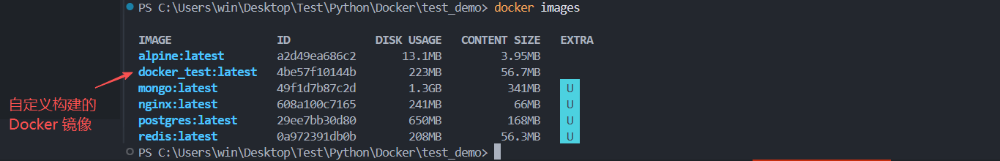

2. 基于此镜像创建容器运行：

   ```shell
   $docker run -d -p 8000:8000 --name my_fastapi_demo docker_test
   ```

   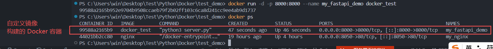

3. 外部访问 localhost:8080（已做映射）：

   ```shell
   $curl localhost:8080
   
   
   StatusCode        : 200
   StatusDescription : OK
   Content           : {"hello":"world"}
   RawContent        : HTTP/1.1 200 OK
                       Content-Length: 20
                       Content-Type: application/json
                       Date: Tue, 09 Sep 2025 14:31:30 GMT
                       Server: uvicorn
   
                       {"hello":"world"}
   Forms             : {}
   Headers           : {[Content-Length, 20], [Content-Type, application/json], [Date, Tue, 09 Sep 2025 14:31:30 GMT], [Server, uvicorn]}
   Images            : {}
   InputFields       : {}
   Links             : {}
   ParsedHtml        : System.__ComObject
   RawContentLength  : 20
   ```


### 推送到远程仓库（Docker Hub）

#### docker login 本地登录

流程：先输入 `docker login` 本地登录好 Docker 账号之后，便可基于此账号进行推送 Docker 镜像。

```shell
$docker build -t [<Docker 账号（命名空间）>/<镜像名>:<版本号（不写为 latest）>] .
```

**打包好拥有自己的命名空间的 Docker 镜像之后，开始推送。**

示例：

```shell
$docker build -t xxx/docker_test
```

#### docker push <命名空间/镜像名> 推送

```shell
$docker push [<Docker 账号（命名空间）>/<镜像名>:<版本号（不写为 latest）>]
```

**将打包好的 Docker 镜像推送到远程仓库 Docker Hub上，并存放在 `<Docker 账号>` 命名空间下。**

示例：

```shell
PS C:\Users\win\Desktop\Test\Python\Docker\test_demo> docker push xxx/docker_test
Using default tag: latest
The push refers to repository [docker.io/huangkaijun1/docker_test]
bae41854fae8: Pushed
72c03230f136: Mounted from library/nginx
cf5110b4fa79: Pushed
8d785f91be47: Pushed
9970f4c20ff1: Pushed
8958452cc516: Pushed
cff50c7bc206: Pushed
a4ad4aae302a: Pushed
latest: digest: sha256:1e93084c67e0e34fc405d4156549ee0664275dd5b02cd69f5c93e8cec055e920 size: 856
```

可以直接在 Docker Hub 上根据 `<Docker 账号（命名空间）>/<镜像名>` 搜索该 Docker 镜像。

- 其他人可以通过 **`docker pull <Docker 账号（命名空间）>/<镜像名>` 拉取该镜像**。

## **Docker 网络**

Docker 默认有以下 3 种网络模式进行通信：

### **1、桥接模式**

Docker网络默认是Bridge (桥接模式)，所有容器默认连接到此网络。每个容器被分配一个内部IP地址（通常是`172.17.x.x`开头）。

在内部子网中，**容器可以通过内部IP地址互相访问。但容器网络与宿主机网络隔离**，需通过端口映射（`-p`）才能从宿主机访问。

**创建子网：`docker network create <子网名称>`**

- 该子网默认也是桥接模式

**指定容器加入不同的子网：****`docker run -d --name <容器名称> --network <子网名称>`**

- 同一个子网的容器可以互相通信，而跨子网则不行。
- 同一子网内的容器可以使用**容器名称**互相访问，而不必使用内部IP地址（Docker内部DNS机制可以把容器名字转换成IP地址）：
- `docker run -e` 加入环境变量时，可以使用容器名而不是IP地址。
- ping容器名字

### **2、Host (主机模式)**

**Docker 容器直接共享宿主机的网络命名空间、 直接使用宿主机的IP地址，无需端口映射（`-p`参数），容器内的服务直接运行在宿主机的端口上，通过宿主机的IP和端口即可访问容器。**

-  语法：**`docker run --network host`**
-  在浏览器直接访问服务器的IP地址加端口80就可以访问到容器

在容器内部查询ip地址：32:40

- 安装工具iproute2
- 命令：ip addr show
- 可以发现容器的内网地址=云服务器内网地址，说明容器共享了宿主机的网络空间

### **3、None (不联网模式)**

容器不连接任何网络，完全隔离。

**`docker network list`：展示出所有网络**

- **NAME 中的 bridge、host、none 是三种默认网络，不能删除**
- **`docker network rm <网络ID>= docker network remove <网络ID>`：删除自定义子网**

## Docker Compose 多容器编排技术

### 基本概念

有的时候 一个完整的应用可能会是很多部分组成的，例如前端、后端、数据库 以及各种附加的技术栈，这些东西应该如何容器化呢？

我们可以自然的想到，将这些模块都打包在一起，做成一个巨大的容器。但这样做有一个弊端，只要其中一个模块发生故障，例如 服务端内存泄露，可能会导致整个容器都崩溃挂掉。

并且这样做的可伸缩性差，如果想给系统做扩容，只能把整个大容器在复制一份，做不到对某个模块的精确扩容。

多应用的最佳实践，是把每一个模块都打包成一个独立的容器。但这样多容器 增加了很多使用成本，因为想创建多个 容器 就要多次使用 docker run ，还需要配置容器之间的网络环境，尝试管理这些容器时，一个遗漏就会导致很多问题，并且若让其他人部署项目，如果操作者对部署流程不熟悉 也会导致各种问题的发生。

这个时候，容器编排技术就很有用了，也就是 **Docker Compose**，它使用 yml 文件 管理多个容器，在这个文件中记录了容器之间时如何创建以及如何协同工作的，我们可以简单的把 Docker Compose 文件理解成一个或多个 Docker run 命令，按照特定的格式书写到一个文件中。

Docker Compose 格式如下：

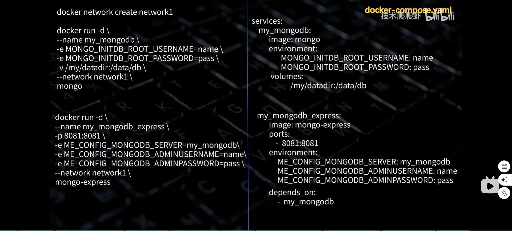

- 右侧最顶级的就是 Services 元素，每个元素就对应一个 Services
- 左侧的 `--name` 在右侧就变成了 services 名
- 左侧的镜像名，在右侧写在了 `image:` 属性后面
- 左侧的 `-e` 参数，对应右边的 `environments`
- 左侧的 `-v` 对应右侧的 `volume` 也就是挂载卷。
- 左侧的 `-p` 对应右边的 `ports`
- 右侧的 `depends_on` 用来表示启动顺序关系，这里表示 `my_mongodb_express` 容器，依赖 `my_mongodb` 。这时 程序会先启动 mongodb 再启动荣亲

左右两边唯一的区别是：左边自定义了一个子网 `network1` ，而右边没有。同一个 `compose` 文件中，定义的所有容器都会自动加入同一个子网，不用我们额外维护。

### docker-compose.yaml 文件

在启动目录下创建 `docker-compose.yaml` 文件，内容如下：

```yml
services:
  my_mongodb:
    image: mongo
    environment:
      MONGO_INITDB_ROOT_USERNAME: name
      MONGO_INITDB_ROOT_PASSWORD: pass
    volumes:
      - /my/datadir:/data/db

  my_mongodb_express:
    image: mongo-express
    ports:
      - 8081:8081
    environment:
      ME_CONFIG_MONGODB_SERVER: my_mongodb
      ME_CONFIG_MONGODB_ADMINUSERNAME: name
      ME_CONFIG_MONGODB_ADMINPASSWORD: pass
    depends_on:
      - my_mongodb
```

### **创建并运行启动**

然后执行 `docker compose up -d` 运行，如果容器已经在运行了 重复执行这个命令不会有任何效果。

执行该命令时，会检测当前目录下 名为 `docker-compose.yaml` 或 `compose.yaml` 文件。可以通过 `docker compose -f tesst.yaml up -d` 指定 compose 文件。

```sh
PS E:\dbkuaizi\mongodb> docker compose up -d
[+] Running 3/3
 ✔ Network mongodb_default                 Created                                                                 0.0s
 ✔ Container mongodb-my_mongodb-1          Started                                                                 0.6s
 ✔ Container mongodb-my_mongodb_express-1  Started                                                                 0.7s
PS E:\dbkuaizi\mongodb>
```

### **停止并删除**

`docker compose down` 命令会停止并删除容器

```sh
PS E:\docker\mongodb> docker compose down
time="2025-09-18T21:47:55+08:00" level=warning msg="E:\\docker\\mongodb\\docker-compose.yml: the attribute `version` is obsolete, it will be ignored, please remove it to avoid potential confusion"
[+] Running 3/3
 ✔ Container mongodb-my_mongodb_express-1  Removed                                                                 0.3s
 ✔ Container mongodb-my_mongodb-1          Removed                                                                 0.3s
 ✔ Network mongodb_default                 Removed                                                                 0.4s
```

### **停止不删除**

`docker compose stop` 命令会停止并且不会删除容器

### **启动**

`docker compose start` 命令会启动停止的容器
