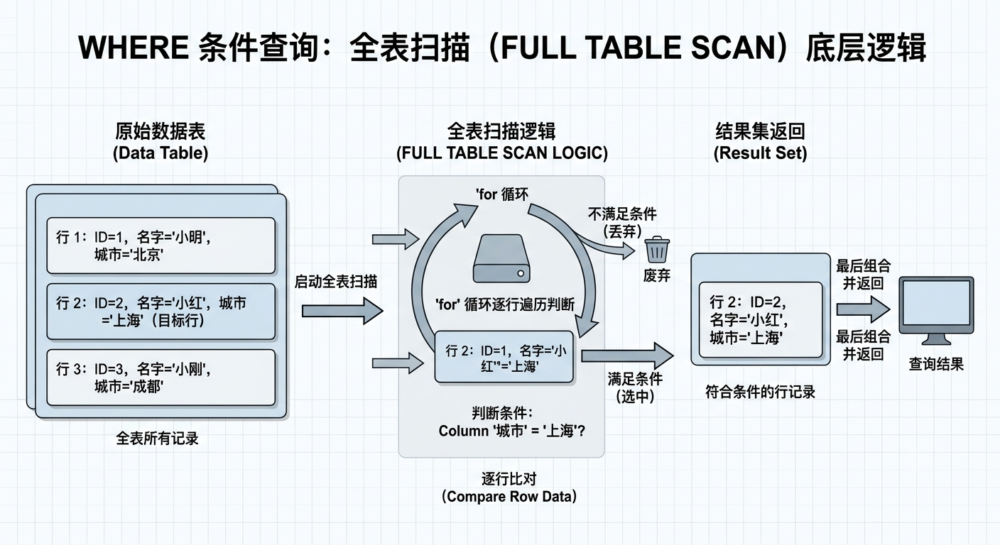
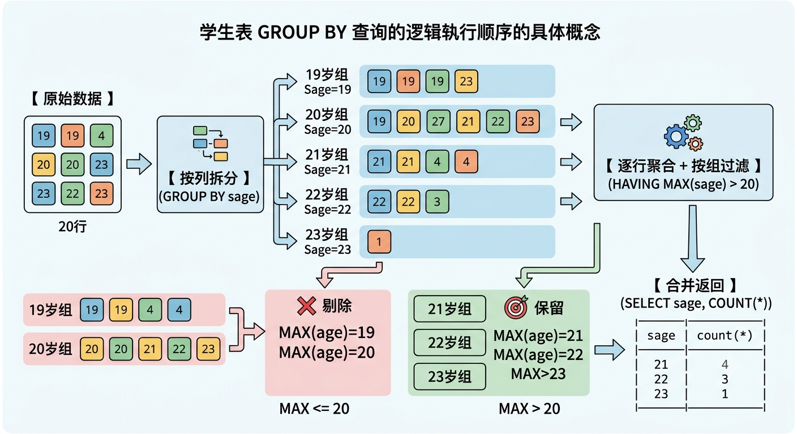
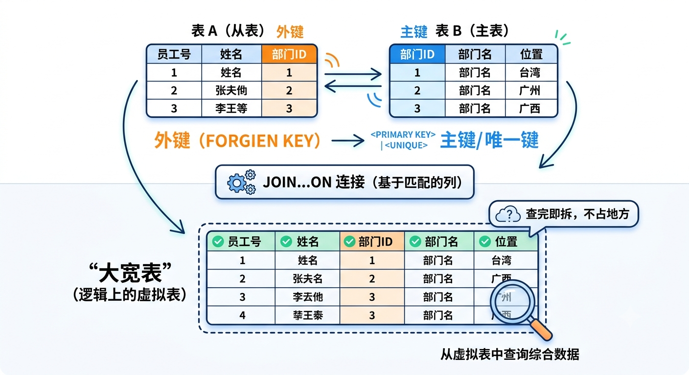
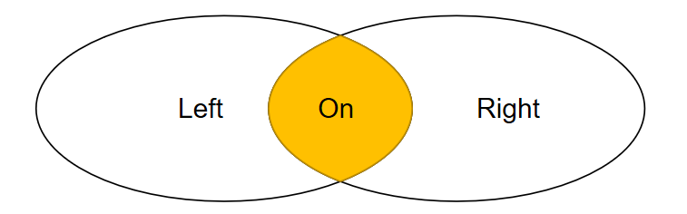
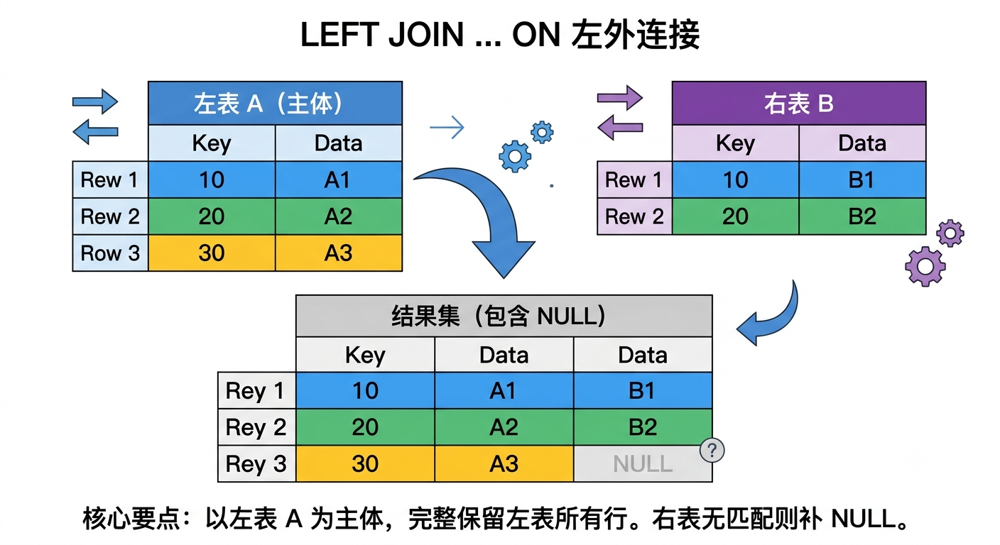
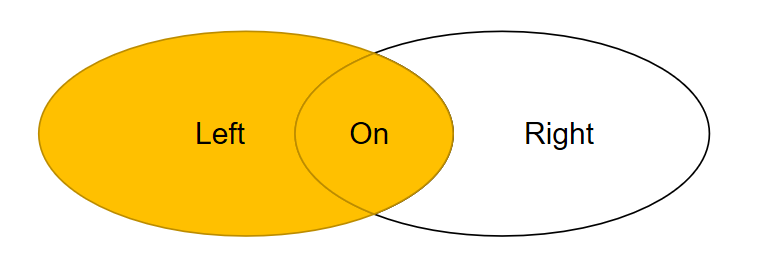
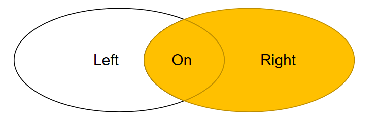
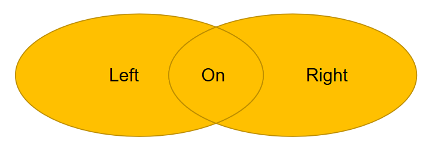
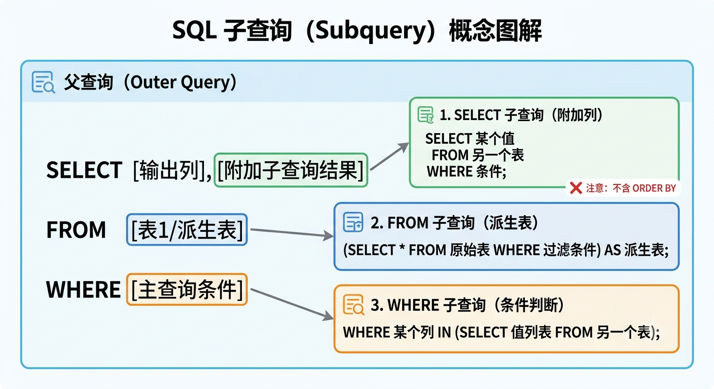

# SQL 标准对象与操作符

## 常用运算符

在 PostgreSQL 中，运算符（Operators）是**构建条件查询、进行数据过滤**和**计算**的核心工具。PostgreSQL 提供了非常丰富的运算符部件，除了标准的 SQL 运算符外，还有许多独有的高级运算符（如 JSONB 和数组操作）。

可以将常用的 PostgreSQL 查询运算符分为以下几大类：

### 📌算术运算符

用于对数值类型进行基础的数学运算：

| **运算符** | **描述**                 | **示例**            | **结果** |
| ---------- | ------------------------ | ------------------- | -------- |
| `+`        | 加法                     | `SELECT 2 + 3;`     | `5`      |
| `-`        | 减法                     | `SELECT 5 - 2;`     | `3`      |
| `*`        | 乘法                     | `SELECT 3 * 4;`     | `12`     |
| `/`        | 除法（整数相除趋零截断） | `SELECT 10 / 3;`    | `3`      |
| `%`        | 模（求余）               | `SELECT 10 % 3;`    | `1`      |
| `^`        | 指数（幂运算）           | `SELECT 2.0 ^ 3.0;` | `8`      |
| ` /`                       | 平方根              | `SELECT  ||
| ` /`                  | 立方根   |||
| `!`        | 阶乘（后缀）             | `SELECT 5!;`        | `12`     |

### 📌比较运算符

用于在 `WHERE` 子句中评估条件，返回布尔值（`TRUE`、`FALSE` 或 `NULL`）。

| **运算符**            | **描述**       | **示例**                               |
| --------------------- | -------------- | -------------------------------------- |
| `<`                   | 小于           | `age < 18`                             |
| `>`                   | 大于           | `salary > 5000`                        |
| `<=`                  | 小于或等于     | `score <= 60`                          |
| `>=`                  | 大于或等于     | `score >= 90`                          |
| `=`                   | 等于           | `status = 'active'`                    |
| `!=` 或 `<>`          | 不等于         | `role != 'admin'`                      |
| `IS NULL`             | 判断是否为空   | `email IS NULL`                        |
| `IS NOT NULL`         | 判断是否不为空 | `phone IS NOT NULL`                    |
| `BETWEEN ... AND ...` | 在指定闭区间内 | `age BETWEEN 18 AND 30`                |
| `IN (...)`            | 存在于列表中   | `country IN ('China', 'USA', 'Japan')` |

> 💡 **小贴士**：在处理可能包含 `NULL` 的比较时，普通运算符（如 `=`）会返回 `NULL`（未知）。如果你希望将 `NULL` 当作一个普通的值来进行“相等”比较，可以使用 `IS NOT DISTINCT FROM`。
>
> - `SELECT NULL IS NOT DISTINCT FROM NULL;` → 返回 `TRUE`

### 📌逻辑运算符

用于组合多个条件，PostgreSQL 遵循**三值逻辑（True, False, Null）**。

- **`AND`**：当**前后两个条件都为真**时，返回**真**
- **`OR`**：**前后两个条件中至少一个为真**时，返回**真**
- **`NOT`**：对当前条件的**布尔值取反**

```postgresql
SELECT * FROM test WHERE test_age > 0 AND test_age < 10;
SELECT * FROM test WHERE test_eu = 'xx' OR test_eu = 'yy';
```

### 📌文本匹配运算符

PostgreSQL 提供了强大的字符串模糊匹配和正则匹配运算符。

| **运算符** | **描述**                       | **示例**           | **说明**                           |
| ---------- | ------------------------------ | ------------------ | ---------------------------------- |
| `LIKE`     | 通配符匹配（区分大小写）       | `name LIKE 'A%'`   | `%` 代表任意字符，`_` 代表单个字符 |
| `ILIKE`    | 通配符匹配（**不区分大小写**） | `name ILIKE 'a%'`  | PostgreSQL 特有，非常实用          |
| `~`        | 正则表达式匹配（区分大小写）   | `name ~ '^A.*'`    | 匹配以 A 开头的字符串              |
| `~*`       | 正则表达式匹配（不区分大小写） | `name ~* '^a.*'`   | 匹配以 A/a 开头的字符串            |
| `!~`       | 正则不匹配（区分大小写）       | `name !~ '[0-9]'`  | 不包含数字                         |
| `!~*`      | 正则不匹配（不区分大小写）     | `name !~* '[a-z]'` | 不包含字母                         |

### 📌数组运算符（Array Operators）

PostgreSQL 原生支持数组类型，并拥有一套高效的数组运算符。

| **操作符** | **含义**                                  | **示例**                     | **结果**                                 |
| ---------- | ----------------------------------------- | ---------------------------- | ---------------------------------------- |
| **`=`**    | 等于（元素和顺序必须完全一致）            | `ARRAY[1,2] = ARRAY[1,2]`    | `true`                                   |
| **`@>`**   | **包含**（左边是否包含右边的所有元素）    | `ARRAY[1,2,3] @> ARRAY[2,3]` | `true`                                   |
| **`<@`**   | **被包含**（左边是否是右边的子集）        | `ARRAY[2,3] <@ ARRAY[1,2,3]` | `true`                                   |
| **`&&`**   | **重叠/有交集**（是否有任意一个共同元素） | `ARRAY[1,2] && ARRAY[2,4]`   | `true`                                   |
| **` || `**                         | **拼接**（连接两个数组或向数组追加元素） |`ARRAY[1,2] || ARRAY[3,4]`|`[1,2,3,4]`|

### 📌JSON / JSONB 运算符

PostgreSQL 对 JSON（尤其是二进制的 `jsonb`）的支持极其强大。

| **运算符** | **描述**                                            | **示例**                    | **意图**                            |
| ---------- | --------------------------------------------------- | --------------------------- | ----------------------------------- |
| `->`       | 通过键/索引获取 JSON 对象/数组元素（返回 JSON）     | `data -> 'user'`            | 获取 user 对象                      |
| `->>`      | 通过键/索引获取 JSON 对象/数组元素（返回 **文本**） | `data ->> 'name'`           | 获取名字字符串                      |
| `#>`       | 通过路径获取 JSON 对象（返回 JSON）                 | `data #> '{user, address}'` | 获取 user 下的 address              |
| `#>>`      | 通过路径获取 JSON 对象（返回 **文本**）             | `data #>> '{user, name}'`   | 获取 user 下的 name 文本            |
| `@>`       | JSONB 包含（左侧是否包含右侧）                      | `info @> '{"status": 1}'`   | 筛选 status 为 1 的行（带索引优化） |
| `?`        | 字符串是否存在于 JSON 键中                          | `info ? 'email'`            | 检查是否存在 email 键               |

### 📌字符拼接运算符

- **`||`**：用于将两个或多个字符串连接成一个字符串。

  ```sql
  SELECT 'Hello ' || 'World'; -- 结果: 'Hello World'
  ```

💡 提示：关于运算符的性能优化

在进行大规模数据查询时，使用 **`@>` (JSONB包含)** 或 **`&&` (数组交集)** 运算符通常可以完美命中 GIN（广义倒排索引）索引，从而实现毫秒级的海量数据检索；而使用 `ILIKE` 或带有前缀通配符的 `LIKE '%abc'` 则可能导致全表扫描，需要配合 `pg_trgm`（三元组扩展）建立索引。

### 运算符优先级

当一个表达式中包含多个运算符时，PostgreSQL 会按照以下优先级从高到低进行计算（同级则从左到右）：

1. `.` (点运算符，用于表名.列名)
2. `::` (类型转换，PG 特有)
3. `[ ]` (数组元素访问)
4. `-` (一元负号)
5. `^` (指数)
6. `*`, `/`, `%` (乘、除、取模)
7. `+`, `-` (加、减)
8. `IS` (`IS NULL`, `IS TRUE` 等)
9. 比较运算符 (`=`, `<`, `>`, `LIKE` 等)
10. `NOT` (逻辑非)
11. `AND` (逻辑与)
12. `OR` (逻辑或)

> 💡 **最佳实践**：如果不确定优先级，或者为了提高 SQL 的可读性，**强烈建议使用括号 `()`** 来明确指定计算顺序。

## 类型转换

PostgreSQL 中的类型转换（Type Cast）是指将一种数据类型的值转换为另一种数据类型的值。这可以通过几种不同的方式实现，并且转换何时发生，取决于转换的**调用上下文**。

### 调用方式

在 SQL 语句中，可以通过三种方式来**显式**或**隐式**地触发类型转换：

| 方式            | 语法示例                         | 说明                                                       |
| :-------------- | :------------------------------- | :--------------------------------------------------------- |
| **`CAST` 函数** | `SELECT CAST('123' AS INTEGER);` | 这是标准的 SQL 语法，非常明确                              |
| **`::` 操作符** | `SELECT '123'::INTEGER;`         | PostgreSQL 特有的简洁写法，是更常用的方式                  |
| **函数风格**    | `SELECT INTEGER('123');`         | 实际上会被解析为一次类型转换请求，前提是存在相应的转换函数 |

此外，对于一些复杂的转换需求，PostgreSQL 还提供了一系列专门的格式化函数，例如 **`to_char`、`to_date`、`to_number`** 等，它们允许指定转换的格式模板。例如，**`SELECT TO_DATE('2023-04-01', 'YYYY-MM-DD');`**。

#### `CAST` 函数（标准 SQL）

这是最通用、可移植性最好的写法，几乎所有的SQL数据库都支持。

语法：

```postgresql
CAST ( 值 AS 目标数据类型 )
```

示例：

```postgresql
-- 1. 字符串转整数 (常用于处理前端传入的参数)
SELECT CAST('123' AS INTEGER) AS "result";
-- 结果: 123 (数值型)

-- 2. 浮点数转整数 (截断小数，不是四舍五入)
SELECT CAST(99.75 AS INTEGER) AS "result";
-- 结果: 99

-- 3. 字符串转日期 (必须符合ISO标准格式)
SELECT CAST('2026-06-23' AS DATE) AS "result";
-- 结果: 2026-06-23 (日期型)

-- 4. 数字转布尔 (0为假，1为真)
SELECT CAST(1 AS BOOLEAN) AS "result";
-- 结果: t (true)
```

#### `::` 操作符（PostgreSQL 特有）

这是PostgreSQL最简洁、最流行的写法，在编写复杂SQL时能大幅减少代码量。

语法：

```postgresql
<表达式 :: 目标数据类型>
```

示例：

```sql
-- 1. 字符串转小数 (精度更高)
SELECT '3.14159'::DECIMAL(10,2) AS "result";
-- 结果: 3.14 (保留两位小数)

-- 2. 字符串转时间戳 (常用于时间范围查询)
SELECT '2026-06-23 14:30:00'::TIMESTAMP AS "result";
-- 结果: 2026-06-23 14:30:00

-- 3. 文本转数组 (处理JSON或CSV数据时很实用)
SELECT '{1,2,3}'::INT[] AS "result";
-- 结果: {1,2,3} (整数数组)

-- 4. 结合字段查询 (将文本字段转成数字参与运算)
-- 假设有一个表 products，其中 price 字段是 VARCHAR 类型
-- SELECT price::NUMERIC * 0.8 AS discount_price FROM products;

-- 5. 结合函数查询 (将文本字段转成数字参与运算)
-- 假设有一个表 products，其中 price 字段是 VARCHAR 类型
-- SELECT product_price(price)::NUMERIC * 0.8 AS discount_price FROM products;
```

#### 类函数调用

这种写法比较特殊，它看起来像函数，但实际上PostgreSQL会尝试将其解析为类型转换。它在某些场景下可读性更好，但**无法用于数组等复杂类型**。

语法：

```postgresql
目标数据类型 ( 表达式 )
```

示例：

```postgresql
-- 1. 字符串转整数
SELECT INTEGER('123') AS result;
-- 结果: 123

-- 2. 字符串转日期
SELECT DATE('2026-06-23') AS result;
-- 结果: 2026-06-23

-- 3. 字符串转文本 (虽然无聊，但语法正确)
SELECT TEXT('Hello World') AS result;
-- 结果: Hello World

-- 4. 错误示例 (函数风格无法处理数组类型)
-- SELECT INT[]('{1,2,3}');  -- 这会报错！数组必须用 CAST 或 ::
```

#### 格式化函数

##### 转换 vs. 格式化

- **`CAST` / `::` (类型转换)**：目的是**改变数据的“类型”**，但不改变数据的“外观”。例如，把字符串 `'2026-06-23'` 变成日期类型，它在数据库内部存储为二进制时间戳，你无法直接控制它显示成什么样子（通常由客户端的默认格式决定）
- **`to_char()` (格式化)**：目的是**将日期/时间或数字，按照你指定的“模板”变成特定格式的“字符串”**。它的输出**永远是一个 `text` 类型**，但你可以自由控制它的显示格式

##### 常用格式化函数

PostgreSQL 主要提供了三个最常用的格式化函数：

| 函数                 | 用途                                    | 输入类型                | 输出类型    |
| :------------------- | :-------------------------------------- | :---------------------- | :---------- |
| **`to_char()`**      | 将日期/时间或数字转换为格式化后的字符串 | `timestamp` / `numeric` | `text`      |
| **`to_date()`**      | 将按指定格式编写的字符串解析为日期      | `text`                  | `date`      |
| **`to_timestamp()`** | 将按指定格式编写的字符串解析为时间戳    | `text`                  | `timestamp` |

> 注意：`to_number()` 用于将格式化的字符串转为数字，但使用场景较少，容易因格式不匹配而出错，通常优先使用 `CAST`。

##### `to_char()` 转为字符串

###### 日期/时间格式化

```postgresql
-- 将当前时间转为 "年-月-日 时:分:秒" 的24小时制格式
SELECT to_char(NOW(), 'YYYY-MM-DD HH24:MI:SS') AS result;
-- 结果: '2026-06-23 14:30:45'

-- 转为中文习惯的 "2026年06月23日 下午02:30" 
SELECT to_char(NOW(), 'YYYY年MM月DD日 AMHH12:MI') AS result;
-- 结果: '2026年06月23日 下午02:30'

-- 提取并格式化周信息 (第23周，星期三)
SELECT to_char(NOW(), 'YYYY"年第"WW"周，星期"D') AS result;
-- 结果: '2026年第23周，星期3'
```

**常用日期模板元素**：

- `YYYY`：四位年份
- `MM`：月份 (01-12)
- `DD`：日 (01-31)
- `HH24`：小时 (00-23) | `HH12`：小时 (01-12)
- `MI`：分钟 (00-59)
- `SS`：秒 (00-59)
- `AM` / `PM`：上下午标识
- `D`：星期几 (1-7，周日为1)
- `WW`：一年中的第几周

###### 数字格式化

```postgresql
-- 转为货币格式 (美金符号，千分位，两位小数)
SELECT to_char(1234567.89, '$999,999,999.99') AS result;
-- 结果: '$1,234,567.89'

-- 填充前导零 (补齐到8位)
SELECT to_char(123, 'FM00000000') AS result;  -- FM 去除前导空格
-- 结果: '00000123'

-- 转为科学计数法
SELECT to_char(0.000123, '0.000EEEE') AS result;
-- 结果: '1.230e-04'
```

##### `to_date()` | ``to_timestamp()` 反向解析

当客户端（如前端）传入一个字符串 `'23-06-2026'`，但数据库需要存为日期时，直接 `CAST` 会报错，因为格式不标准。这时就需要格式化函数来指定解析规则。

```postgresql
-- 将 '日-月-年' 格式的字符串解析为日期
SELECT to_date('23-06-2026', 'DD-MM-YYYY') AS result;
-- 结果: 2026-06-23 (date类型)

-- 将带AM/PM的12小时制时间解析为时间戳
SELECT to_timestamp('2026-06-23 02:30:45 PM', 'YYYY-MM-DD HH12:MI:SS AM') AS result;
-- 结果: 2026-06-23 14:30:45 (timestamp类型)
```

### 调用上下文

系统目录 `pg_cast` 中存储了所有转换路径，其中的 `castcontext` 字段定义了转换可以在哪种上下文中被调用。

1. **显式转换 (`e` - Explicit)**：这是最严格的模式。转换**必须**使用 `CAST`、`::` 或函数风格的语法显式写出，否则不会发生。对于跨类型类别的转换（如 `text` 到 `int4`），默认都是显式的，以防止意外的性能问题或歧义。
2. **赋值转换 (`a` - Assignment)**：这种转换可以在**给目标列赋值**时自动发生，例如在 `INSERT` 或 `UPDATE` 语句中。它比显式转换更方便，但仍受限于赋值场景。例如，将一个整数插入到文本类型的列中，如果存在从 `integer` 到 `text` 的赋值转换，操作就会成功。
3. **隐式转换 (`i` - Implicit)**：这是最宽松的模式，**可以在任何表达式内部自动发生**，例如在操作符（如 `+`）的两侧。PostgreSQL 会为了解析操作符而自动应用隐式转换。例如，`SELECT 2 + 4.0;` 中，整数 `2` 会通过隐式转换变为 `numeric` 类型，以便与 `4.0` 进行运算。

> **💡 设计原则**：将转换标记为隐式需要非常谨慎，因为过多的隐式转换路径可能导致查询解析器产生歧义或选择令人惊讶的执行计划。通常，只有信息不会丢失的转换（如 `int2` 到 `int4`）才适合标记为隐式。

#### 查看现有的转换

例如，查询 `int4`（整数）是否可以转换为 `text`：

```sql
SELECT * FROM pg_catalog.pg_cast 
WHERE castsource = 'int4'::regtype AND casttarget = 'text'::regtype;
```

这会告诉这个转换是否存在，以及它的 `castcontext`（`e`/`a`/`i`）是什么。

## 常用函数

在 PostgreSQL 中，函数就像是**“内置的小工具”**，能帮你直接在 SQL 层把原始数据加工成最终需要的格式。

我们可以把常用的函数分为四大类：**字符串处理**、**数值计算**、**日期时间**以及**聚合处理**。

### 字符串处理函数（清洗数据的利器）

当你的文件路径、用户名格式不统一时，这些函数能帮大忙。

- **`CONCAT(a, b)` / `||`**：拼接字符串
- **`UPPER()` / `LOWER()`**：转换大小写
- **`SUBSTR(string, start, len)`**：截取字符串
- **`REPLACE(string, from, to)`**：替换内容
- **`COALESCE(value, default)`**：**【超级常用】** 如果字段是 NULL，就给它一个默认值

### 数值计算函数

- **`ROUND(numeric, 2)`**：四舍五入
- **`CEIL()` \ `FLOOR()`**：向上/向下取整
- **`ABS()`**：取绝对值

### 日期时间函数（时间管理的灵魂）

- **`NOW()`**：获取当前完整时间
- **`CURRENT_DATE`**：获取当前日期
- **`AGE(timestamp)`**：计算时间差

````postgresql
-- 看看这个文件上传了多久了
SET TIME ZONE 'Asia/Shanghai';
SELECT file_name, AGE(created_at) AS active_time FROM file_details;
````

- **`EXTRACT(field FROM source)`**：提取年、月、日、小时

  ```postgresql
  -- 统计每个小时的上传量
  SELECT EXTRACT(HOUR FROM created_at) AS hour, COUNT(*) 
  FROM file_details GROUP BY hour;
  ```

- **`TO_CHAR()`**：将时间格式化为字符串

  ```postgresql
  -- 变成类似 2026-04-14 14:30:00 的格式
  SELECT TO_CHAR(created_at, 'YYYY-MM-DD HH24:MI:SS') FROM file_details;
  ```

## `CASE THEN` 流程控制语句

```postgresql
-- 给文件分等级
SELECT file_name,
       CASE
           WHEN file_size > 1024*1024*100 THEN '大文件'
           WHEN file_size > 1024*1024*10 THEN '中文件'
           ELSE '小文件'
           END AS file_level
FROM files;
```

# Table 表操作

Table 表是所有关系型数据库的**基本数据存储与执行单元**，表现为 **行 & 列 的二维结构**。

## 表结构的设计（DDL）

### `CREATE TABLE` 创建基本表

#### 基本语法

- **指定所属 Schema 模式**：

  ```postgresql
  CREATE TABLE <模式名>.<表名>
  (
  	<列字段名> <数据类型>,
      ...
  );
  
  -- 切换模式
  SET search_path TO <模式名>;
  CREATE TABLE <表名>
  (
  	<列字段名> <数据类型>,
      ...
  );
  ```

- **不指定，默认放在 `public` 模式下**：

  ```postgresql
  CREATE TABLE <表名>
  (
  	<列字段名> <数据类型>,
      ...
  );
  ```

- **创建 Schema 模式的同时，创建一张表**：

  ```postgresql
  CREATE SCHEMA <模式名>
      CREATE TABLE <表名> (<列字段名> <数据类型>,...)
      CREATE VIEW <视图名> AS <SELECT 查询子句>
      GRANT USER <用户名>;
  ```

示例：

```postgresql
-- 在 markteing 模式下，创建一个 member 会员表
CREATE TABLE marketing.members
(
  	"id" INTEGER, -- 会员ID、int4 类型
	member_name TEXT, -- 会员名、文本类型
    age SMALLINT, -- 年龄、小整数类型
)
```

> ⚠️注意点：
>
> - 如果**列字段名与关键字冲突，则使用 `""` 双引号包裹**
>
> - `''` 单引号 和 `""` 双引号的区别：
>
>   **单引号包围的是“值”（字符串），双引号包围的是“名字”（标识符）**
>
>   - `''` 单引号：
>
>     用于 `COMMENT` 注释、`INSERT` 插入数据、`WHERE` 查询数据条件...时使用。
>
>     ```postgresql
>     SELECT * FROM product WHERE name = '苹果手机';
>     -- '苹果手机' 是一个字符串值
>                                                 
>     INSERT INTO product (datetime) VALUES ('2026-06-19 12:00:00');
>     -- '2026-06-19 12:00:00' 是一个日期时间字符串
>     ```
>
>
>     COMMENT ON COLUMN product.id IS '产品 ID';
>     COMMENT ON COLUMN product.name IS '产品名称';
>     COMMENT ON COLUMN product.datetime IS '上架时间';
>     ```
>
>   - `""` 双引号：
>
>     用于表名、列字段名、对象名、`AS` 别名...时使用。
>
>     ```postgresql
>     -- 建表时加了双引号，保留了大写
>     CREATE TABLE "User_Info" (
>         "UserId" INT,
>         name TEXT
>     );
>                                                 
>     -- 查询时：必须严格带双引号和大小写
>     SELECT "UserId", "UserName" AS "用户名" FROM "User_Info"; 
>                                                 
>     -- 错误查询：不加双引号，Postgres 会去找小写的 userid 和 user_info，导致报错
>     SELECT UserId FROM User_Info;
>     ```

#### 数据类型

PostgreSQL（通常简称为 Postgres）以其强大、丰富且可扩展的数据类型系统而闻名。它不仅支持标准的 SQL 基础类型，还自带了许多高级和特有的数据类型。

##### 📌数值类型

定义：用于存储整数、小数和浮点数。

- **整数**：

  | **类型名称**   | 别名/关键词       | **存储大小** | **描述**       | **范围 / 精度**            | 示例                |
  | -------------- | ----------------- | ------------ | -------------- | -------------------------- | ------------------- |
  | **`smallint`** | **`int2`**        | 2 字节       | 小范围整数     | -32,768 到 +32,767         | `123`，`-567`       |
  | **`integer`**  | **`int`、`int4`** | 4 字节       | **常用**的整数 | -21.4亿 到 +21.4亿         | `123456`，`-987654` |
  | **`bigint`**   | **`int8`**        | 8 字节       | 大范围整数     | 极大，适用于主键或高频计数 | `987654321012345`   |

- **浮点数**：

  | **类型名称**                | 别名/关键词        | **存储大小** | **描述**               | **范围 / 精度**     | 示例               |
  | --------------------------- | ------------------ | ------------ | ---------------------- | ------------------- | ------------------ |
  | **`decimal` / `numeric()`** | **`numeric(p,s)`** | **变长**     | 用户指定的准确精度     | 最多 131,072 位数字 | `123.45`，`999.99` |
  | **`real`**                  | **`float4`**       | 4 字节       | 单精度浮点数（不精确） | 6 位十进制精度      | `3.14159`          |
  | **`double precision`**      | **`float8`**       | 8 字节       | 双精度浮点数（不精确） | 15 位十进制精度     | `3.14159265358979` |

  > **`numeric(p,s)`**：高精度十进制数，适合金融等对精度要求高的场景，可指定**精度(p)**和**标度(s)**。
  >
  > - **`p`：总位数**
  > - **`s`：小数点后的位数**
  >
  > 例如：`numeric(10,2)` 表示最长 10 位，小数点后保留 2 位小数。1234567891.20

- **在 `INSERT` 插入时，从 1 开始自动递增的整数（常用于定义 `PRIMARY KEY` 主键列）**

  | **类型名称**         | 别名/关键词             | **存储大小** | **描述**   | **范围 / 精度**                |
  | -------------------- | ----------------------- | ------------ | ---------- | ------------------------------ |
  | **`smallserial`**    | **`serial2`**           | 2 字节       | 自增小整数 | 1 到 32,767                    |
  | **`serial`**（常用） | **`serial`、`serial4`** | 4 字节       | 自增整数   | 1 到 2,147,483,647             |
  | **`bigserial`**      | **`serial8`**           | 8 字节       | 自增大整数 | 1 到 9,223,372,036,854,775,807 |

  > 📌 **注意：** **`serial` 并不是真正的类型**，它只是一个**语法糖**，底层会**自动创建一个序列（Sequence）并将列设为默认自增**。在现代 PG 中，更**推荐使用**标准 SQL 的 **`GENERATED ALWAYS AS IDENTITY`**。

##### 📌字符类型

定义：Postgres 的字符类型在性能上没有本质区别（在很多其他数据库中 `varchar` 比 `text` 快，但在 PG 中它们底层存储方式相同）。

| **类型名称**        | 别名/关键词                | **描述**                                    | 示例                          |
| ------------------- | -------------------------- | ------------------------------------------- | ----------------------------- |
| **`char(n)`**       | **`character(n)`**         | 定长字符串，**长度不足 `n` 时会用空格填充** | `'ABC '`                      |
| **`varchar(n)`**    | **`character varying(n)`** | 变长字符串，**有长度限制，最多 `n` 个字符** | `'Hello'`                     |
| **`text`**（✅️推荐） |                            | 变长字符串，**无长度限制（最大可存 1GB）**  | `'这是一段很长的文本内容...'` |

##### 📌日期/时间类型

定义：Postgres 拥有极度精准且强大的时间处理能力。

| 类型名称          | 描述                                                         | 示例                        |
| ----------------- | ------------------------------------------------------------ | --------------------------- |
| **`date`**        | 日期**（年-月-日）**                                         | `'2026-06-19'`              |
| **`time`**        | 一天中的时间（无时区）【**时:分:秒.毫秒**】`time(3)` 毫秒留 3 位小数 | `'14:30:25.123'`            |
| **`timetz`**      | 一天中的时间（含时区）【**时:分:秒**】                       | `'14:30:25+08'`             |
| **`timestamp`**   | 日期+时间（无时区）【**年-月-日 时:分:秒.毫秒**】            | `'2026-06-19 14:30:25.123'` |
| **`timestamptz`** | 日期+时间（含时区，推荐）【**年-月-日 时:分:秒（时区）**】   | `'2026-06-19 14:30:25+08'`  |
| **`interval`**    | 时间间隔/时间段                                              | `'3 days 5 hours'`          |

##### 📌布尔类型

| **类型名称**  | 别名/关键词 | **描述**                                          |
| ------------- | ----------- | ------------------------------------------------- |
| **`boolean`** | **`bool`**  | 仅接受 **`true`、`false`（逻辑布尔值）和 `null`** |

> 输入时：
>
> - **`'t'`, `'true'`, `'y'`, `'yes'`, `'1'`** 都会被识别为**真值**
> - **`'f'`, `'false'`, `'n'`, `'no'`, `'0'`** 会被识别为**假值**

##### 📌JSON/XML 类型

定义：常用于 **高性能文档型数据（NoSQL）** 的应用。

| 类型名称            | 描述                                                         | 示例                                                         |
| ------------------- | ------------------------------------------------------------ | ------------------------------------------------------------ |
| **`json`**          | **文本格式JSON**（保留格式，处理慢）                         | `'{"name": "张三", "age": 30}'`                              |
| **`jsonb`**（推荐） | **二进制格式JSON**（删除空格，支持 `GIN` 索引，处理快，推荐） | `'{"name": "张三", "age": 30}'`<br />（存储时会被优化为二进制格式） |
| **`xml`**           | **文本 XML 格式**                                            | `<x>...</x>`                                                 |

##### 📌二进制数据类型

| **类型名称** | **描述**                       | 示例                                  |
| ------------ | ------------------------------ | ------------------------------------- |
| **`bytea`**  | 存储二进制数据（图片、文件等） | `\x48656c6c6f`（十六进制表示"Hello"） |

##### 📌数组类型

定义：Postgres 允许将字段定义为多维数组，基础类型几乎都可以变成数组。

| **类型名称**    | **描述**         | 示例                              |
| --------------- | ---------------- | --------------------------------- |
| **`integer[]`** | **整数数组**     | `[1,2,3]`                         |
| **`text[][]`**  | **二维文本数组** | `['postgres', 'database', 'sql']` |

##### 📌货币类型

定义：由于受本地化（Locale）影响较大，**实际开发中更推荐使用 `numeric`**。

| **类型名称** | **描述**                       | 示例        |
| ------------ | ------------------------------ | ----------- |
| **`money`**  | **带货币符号的金额**，精度固定 | `$1,234.56` |

##### 📌UUID（全局唯一标识符）

| **类型名称** | **描述**                                                     | 示例                                     |
| ------------ | ------------------------------------------------------------ | ---------------------------------------- |
| **`uuid`**   | 通用唯一标识符（128位）<br />比直接用 `text` 存储更省空间（仅 16 字节），且提供格式有效性检查 | `'550e8400-e29b-41d4-a716-446655440000'` |

##### 📌网络地址类型

定义：专门针对网络数据的优化类型，支持子网掩码检索和计算。

| 类型名称       | 描述                             | 示例                                  |
| -------------- | -------------------------------- | ------------------------------------- |
| **`inet`**     | IPv4或IPv6主机地址               | `'192.168.1.100'`，`'2001:db8::1'`    |
| **`cidr`**     | IPv4或IPv6网络地址（含子网掩码） | `'192.168.1.0/24'`，`'2001:db8::/32'` |
| **`macaddr`**  | MAC地址（48位）                  | `'08:00:2b:01:02:03'`                 |
| **`macaddr8`** | MAC地址（EUI-64格式，64位）      | `'08-00-2b-01-02-03-04-05'`           |

##### 📌位串类型（bit）

| 类型名称             | 别名/关键字  | 描述     | 示例                |
| -------------------- | ------------ | -------- | ------------------- |
| **`bit(n)`**         | -            | 定长位串 | `'10101'`（bit(5)） |
| **`bit varying(n)`** | **`varbit`** | 变长位串 | `'101'`             |

##### 📌文本搜索类型

常用于 **全文检索（`Elasticsearch`）**的应用。

| 类型名称       | 描述                     | 示例                                        |
| -------------- | ------------------------ | ------------------------------------------- |
| **`tsvector`** | 已分词的标准化的搜索文档 | `'张三':2 '李四':1`（表示分词后的位置信息） |
| **`tsquery`**  | 文本搜索查询条件         | `'张三' & '李四'`                           |

##### 📌几何类型

定义：用于在二维平面上表示数据，更高级的空间几何推荐使用 **PostGIS（地理位置系统）** 扩展。

| 类型名称      | 描述                 | 示例                                                         |
| ------------- | -------------------- | ------------------------------------------------------------ |
| **`point`**   | 二维平面上的点       | `'(1.5, 2.3)'`                                               |
| **`line`**    | 无限长的直线         | `'{1, -1, 0}'`（表示 y = x）                                 |
| **`lseg`**    | 线段                 | `'[(1,2), (3,4)]'`                                           |
| **`box`**     | 矩形（由对角点定义） | `'((1,2), (3,4))'`                                           |
| **`path`**    | 路径（开放或闭合）   | `'[(1,2), (3,4), (5,6)]'`（开放路径） `'((1,2), (3,4), (5,6))'`（闭合路径） |
| **`polygon`** | 多边形               | `'((1,2), (3,4), (5,6), (1,2))'`                             |
| **`circle`**  | 圆（中心点+半径）    | `'<(1,2), 3.5>'`                                             |

##### 其他类型

| 类型名称          | 描述                                 | 示例                                       |
| ----------------- | ------------------------------------ | ------------------------------------------ |
| **`pg_lsn`**      | 日志序列号（用于复制和恢复）         | `'1/2A3B4C5D'`                             |
| **`pg_snapshot`** | 事务ID快照（用于事务隔离）           | `'100:4:100,102'`                          |
| **`xml`**         | XML格式数据                          | `'<book><title>PostgreSQL</title></book>'` |
| **`oid`**         | 对象标识符（用来作为系统表的主键）   | `12345`                                    |
| **`name`**        | 用于对象名称的字符串类型（系统内部） | `'mytable'`                                |
| **`refcursor`**   | 游标引用（用于PL/pgSQL函数返回游标） | `'my_cursor'`                              |

#### 自增列（`SERIAL` & `IDENTITY`）

在 PostgreSQL 中提供了 **`SERIAL`** 和 **`GENERATED ALWAYS AS IDENTITY`（SQL 标准自增列）**，它们都是用来实现**列字段值的自增功能**的，但它们的**实现机制、对标准的支持以及安全限制**有着本质的区别。

简单来说，**`SERIAL`** 是 PostgreSQL 特有的**“老一代”语法**，而 **`IDENTITY`** 是 SQL:2003 标准引入的**“新一代”推荐语法**。

> [!IMPORTANT]
>
> 共同作用：**在 `INSERT` 插入 Column 列数据时，自动取值从 1 开始自动递增的整数（常用于定义 `PRIMARY KEY` 主键列）**。

##### 核心区别

| **特性**      | **SERIAL (传统方式)**                                    | **GENERATED ALWAYS AS IDENTITY (现代方式)**                |
| ------------- | -------------------------------------------------------- | ---------------------------------------------------------- |
| **标准支持**  | PostgreSQL 特有（非标准）                                | 符合 **SQL:2003 标准** (通用性强)                          |
| **底层实现**  | 自动创建一个序列，并将列的 `DEFAULT` 值设为 `nextval()`  | 列与序列紧密绑定，作为列的属性存在                         |
| **显式插入**  | 允许直接显式插入值（容易导致序列冲突）                   | **默认不允许**显式插入（除非加 `OVERRIDING SYSTEM VALUE`） |
| **权限管理**  | 需要单独处理序列的权限                                   | 只需处理表的权限，序列权限自动跟随                         |
| **删除表/列** | 早期版本中删除列可能遗留序列（现已优化，但仍有关联风险） | 删除列或表时，序列自动干净利落地删除                       |

> 💡选型建议：
>
> PostgreSQL 官方从 10.0 版本开始引入 `IDENTITY`，并且**强烈建议在新的开发中彻底废弃 `SERIAL`，全面拥抱 `IDENTITY`**。
>
> - 🚨 **避免使用 `SERIAL`：** 除非你需要兼容非常老旧的 PostgreSQL 版本（10 以前），或者某些第三方老旧框架只认 `SERIAL`。
> - ✅ **优先使用 `GENERATED ALWAYS AS IDENTITY`：** 它可以帮你写出更符合 SQL 标准、更安全、更不容易因手动插入数据而崩溃的健壮系统。

##### `SERIAL` 传统方式（序列）

| **类型名称**         | 别名/关键词             | **存储大小** | **描述**   | **范围 / 精度**                |
| -------------------- | ----------------------- | ------------ | ---------- | ------------------------------ |
| **`smallserial`**    | **`serial2`**           | 2 字节       | 自增小整数 | 1 到 32,767                    |
| **`serial`**（常用） | **`serial`、`serial4`** | 4 字节       | 自增整数   | 1 到 2,147,483,647             |
| **`bigserial`**      | **`serial8`**           | 8 字节       | 自增大整数 | 1 到 9,223,372,036,854,775,807 |

> 📌 **注意：** **`serial` 并不是真正的类型**，它只是一个**语法糖**，底层会**自动创建一个序列（Sequence）并将列设为默认自增**。在现代 PG 中，更**推荐使用**标准 SQL 的 **`GENERATED ALWAYS AS IDENTITY`**。

写法：

```postgresql
CREATE TABLE <模式名>.<表名>
(
	<列字段名> SERIAL <完整性约束>,
    ...
)
```

> ```postgresql
> INSERT INTO hr.test (id, name) VALUES (10, 'Tom');
> ```
>
> 这会导致显式插入的数据抢占了未来的自增位置。当序列自增到 `10` 时，插入就会因为**主键冲突**而报错。此外，如果把这个表的结构导出（`pg_dump`），会发现它被打散成了序列和默认值两部分，不够优雅。

##### `GENERATED ALWAYS AS IDENTITY` 现代写法（标识列）

###### 基本写法

```postgresql
CREATE TABLE <模式名>.<表名>
(
	<列字段名> INTEGER GENERATED ALWAYS AS IDENTITY <完整性约束>,
    ...
)
```

这里的 `<列字段名>` 被声明为**由系统总是（ALWAYS）生成的身份列**。

> 拆解说明：
>
> - **`GENERATED` 创建一个生成列**：它是一种**特殊类型的列，它的值不能被手动插入或更新，而是由一个表达式自动计算出来的**
> - **`ALWAYS AS xxx`：总是由 xxx**
> - **`IDENTITY`：自增值**
>
> 合起来：**`GENERATED ALWAYS AS IDENTITY`** 表示**该列的值是一个总是由（`ALWAYS AS`）系统自增产生值（`IDENTITY`）的生成列（`GENERATED`）**。

###### 插入数据机制

​	PostgreSQL 规定**由 `GENERATED ALWAYS AS IDENTITY` 修饰的列**，在 **`INSERT` 插入数据时不允许被显式传入值**，否则会拒绝插入，从而**彻底避免了主键冲突和序列错乱**的问题。

> **`IDENTITY` 自增列**：本质上是一个**自动从 1 开始填充的 `DEFAULT` 默认值**。

示例：

```postgresql
CREATE TABLE finance.cup
(
	cup_id INTEGER GENERATED ALWAYS AS IDENTITY PRIMARY KEY,
	cup_name TEXT
)

-- 只需显式传入 cup_name 字段值即可，cup_id 字段的值会是一个自动填充为 从 1 开始的自增值
INSERT INTO finance.cup(cup_name) VALUES('马克杯');
INSERT INTO finance.cup(cup_name) VALUES('水杯');
INSERT INTO finance.cup(cup_name) VALUES('量角杯');
INSERT INTO finance.cup(cup_name) VALUES('烧杯');

SELECT * FROM finance.cup;

/*
cup_id   cup_name
1		 马克杯
2		 水杯
3		 量角杯
4		 烧杯
*/

-- ❌️以下写法会报错
INSERT INTO finance.cup (cup_id, cup_name) VALUES (10, 'Tom');
-- 报错：ERROR: cannot insert into column "cup_id"
-- DETAIL: Column "cup_id" is an IDENTITY column defined as GENERATED ALWAYS.
```

###### `OVERRIDING SYSTEM VALUE` 手动强制插入

如果确实因为数据迁移等原因需要**在 `INSERT` 时手动插入 `GENERATED ALWAYS AS IDENTITY` 自增列的值**。

可以选择：

- **强制覆盖（推荐）：** 保持 `ALWAYS`，但**在 `INSERT` 插入时加上 `OVERRIDING SYSTEM VALUE` 关键字**，表示**覆盖系统值**

示例：

```postgresql
INSERT INTO finance.cup(cup_id, cup_name) OVERRIDING SYSTEM VALUE VALUES(15, '玻璃杯');

SELECT * FROM finance.cup;

/*
cup_id   cup_name
1		 马克杯
2		 水杯
3		 量角杯
4		 烧杯
15		 玻璃杯 -- cup_id 是手动强制插入的值，不再遵守自增规则
*/
```

#### `COMMENT` 注释

##### `COMMENT ON TABLE` 表注释

###### 基本语法

PostgreSQL **不支持**在表列中直接定义 `COMMENT`，必须**在表外使用 `COMMENT ON TABLE ... IS '...'` 命令**：

```postgresql
COMMENT ON TABLE <模式名>.<表名> IS '...';
```

示例：

```postgresql
-- 为 finance.customers 表的字段添加注释
COMMENT ON TABLE finance.customers IS '客服表';
```

###### 查看表的注释

当**使用 `COMMENT ON TABLE ... IS '...'` 命令为表的列字段添加上注释说明**之后，可以通过以下 2 种方式**查看字段的注释说明**：

- **psql 命令行工具查看**：

  ```sh
  $\dt+ <模式名>.<表名>
  ```

  示例：

  ```sh
  test=# \dt+ finance.customers
                                       List of relations
   Schema  |   Name    | Type  |  Owner   | Persistence | Access method | Size  | Description
  ---------+-----------+-------+----------+-------------+---------------+-------+-------------
   finance | customers | table | postgres | permanent   | heap          | 80 kB | 客服表
  (1 row)
  ```

  💡注：在 PostgreSQL 的底层逻辑里，注释（Comment）在系统字典中统一被称为 **Description（描述）**。

- **SQL**：

  - **通过 `pg_description` 系统表，查看某张表的表注释**：

    ```postgresql
    SELECT description 
    FROM pg_description 
    WHERE objoid = '你的表名'::regclass AND objsubid = 0;
    
    /*
    description
    客服表
    */
    ```

  - **通过 `pg_stat_user_tables` 系统催生视图，查看数据库中所有用户自定义表的表注释**：

    ```postgresql
    SELECT 
        relname AS 表名,
        obj_description(relid) AS 表注释
    FROM 
        pg_stat_user_tables;
        
        
    /*
    表名		  表注释
    test	
    users	
    customers	客服表
    product	
    person	
    */
    ```

##### `COMMENT ON COLUMN` 列注释

###### 基本语法

PostgreSQL **不支持**在表列中直接定义 `COMMENT`，必须**在表外使用 `COMMENT ON COLUMN ... IS '...'` 命令**：

```postgresql
COMMENT ON COLUMN <模式名>.<表名>.<列字段名> IS '...';
```

示例：

```postgresql
SET search_path TO finance; -- 切换为 finance 模式

CREATE TABLE product(
	"id" INTEGER PRIMARY KEY GENERATED ALWAYS AS IDENTITY, -- int 数值类型、主键、自增
	"name" TEXT NOT NULL, -- 文本类型、非空
	datetime TIMESTAMP NOT NULL DEFAULT CURRENT_TIMESTAMP -- 时间类型、非空、默认值为当前系统时间戳
);

-- 为 finance.customers 表的字段添加注释
COMMENT ON COLUMN customers.id IS '客服 ID';
COMMENT ON COLUMN customers.name IS '客服名称';
COMMENT ON COLUMN customers.datetime IS '上线时间';
```

###### 查看表列字段的注释

当**使用 `COMMENT ON COLUMN ... IS '...'` 命令为表的列字段添加上注释说明**之后，可以通过以下 2 种方式**查看字段的注释说明**：

- **psql 命令行工具查看**：

  ```sh
  $\d+ <模式名>.<表名>
  ```

  示例：

  ```sh
  test=# \d+ finance.customers
                                                 Table "finance.customers"
   Column |         Type          | Nullable | Default | Storage  | Compression | Stats target | Description
  --------+-----------------------+----------+---------+----------+-------------+--------------+-------------
   id     | integer               |          |         | plain    |             |              | 产品 ID
   name   | character varying(10) |          |         | extended |             |              | 产品 ID
  Access method: heap
  ```

  💡注：在 PostgreSQL 的底层逻辑里，注释（Comment）在系统字典中统一被称为 **Description（描述）**。

- **SQL**：

  - **通过 `pg_description` 系统表，查看某张表的 “所有字段” 的注释**：

    ```postgresql
    SELECT 
        a.attname AS 字段名,
        format_type(a.atttypid, a.atttypmod) AS 数据类型,
        col_description(a.attrelid, a.attnum) AS 字段注释
    FROM 
        pg_attribute a
    WHERE 
        a.attrelid = '你的表名'::regclass  -- 替换为你的表名
        AND a.attnum > 0 
        AND NOT a.attisdropped
    ORDER BY 
        a.attnum;
        
    /**
    id		integer					客服 ID
    name	character varying(10)	客服名称
    */
    ```

##### `pg_description` 系统注释表

PostgreSQL 提供了一个 **`pg_catalog.pg_description` 系统注释表**，专门用于**存储当前数据库中所有表、字段的注释说明**。

```postgresql
SELECT * FROM pg_description;

/*
description
...
snowball stemmer for yiddish language
configuration for yiddish language
PL/pgSQL procedural language
PL/pgSQL procedural language
产品 ID
产品名称
上架时间
客服表
...
*/
```

##### `pg_stat_user_tables` 系统注释视图

PostgreSQL 提供了一个 **`pg_stat_user_tables` 系统衍生视图**，专门用于**存储当前数据库中所有用户自定义的 Table 表的注释说明**。

```postgresql
SELECT 
    relname AS 表名,
    obj_description(relid) AS 表注释
FROM 
    pg_stat_user_tables;
    
    
/*
表名		  表注释
test		测试表
users		用户表
customers	客服表
product	
person	
*/
```

### `ALTER TABLE` 修改表结构

在 PostgreSQL 中，`ALTER TABLE` 命令用于**修改现有表的结构**。例如：添加列、删除列、修改数据类型，还是添加约束。

#### 表-操作

##### 基本语法

```postgresql
ALTER TABLE <模式名>.<表名> <表 | 列 操作>;

-- 切换为指定模式，在指定模式下操作其下的表
SET search_path TO <模式名>;

ALTER TABLE <表名> <表 | 列 操作>;
```

##### `RENAME TO` 重命名表

```postgresql
ALTER TABLE <模式名>.<表名> RENAME TO <新表名>;
```

示例：

```postgresql
SET search_path TO marketing; -- 切换为 marketing 模式操作它的表
SELECT tablename FROM pg_tables WHERE schemaname = CURRENT_SCHEMA AND tablename = 'customers';
-- 输出：customers

-- 示例：将 marketing 模式下的 customers 旧表名修改为 members 新表名
ALTER TABLE marketing.customers RENAME TO members;

SELECT tablename FROM pg_tables WHERE schemaname = CURRENT_SCHEMA AND tablename = 'members';
-- 输出：customers
```

##### `OWNER TO` 修改表的所有者

```postgresql
ALTER TABLE <模式名>.<表名> OWNER TO <所有者（用户名）>
```

示例：

```postgresql
CREATE USER super_manager; -- 创建一个 super_manager 用户角色

SELECT * FROM pg_roles; -- 查看数据库中的所有用户角色
-- postgres
-- super_manager

SET search_path TO marketing; -- 切换为 marketing 模式操作它的表

-- 查看 marketing 模式下的 members 表的所有者（用户角色）
SELECT tableowner FROM pg_tables WHERE schemaname = CURRENT_SCHEMA AND tablename = 'members';
-- postgres

-- 将 marketing 模式下的 members 表的所有者修改为 super_manager
ALTER TABLE marketing.members OWNER TO super_manager;

SELECT tableowner FROM pg_tables WHERE schemaname = CURRENT_SCHEMA AND tablename = 'members'; 
-- 输出：super_manager
```

##### `SET SCHEMA` 修改表的所属模式

```postgresql
ALTER TABLE <模式名>.<表名> SET SCHEMA <其他 Schema 模式名>
```

核心作用：**移动表到不同的模式/命名空间**。

示例：

```postgresql
SELECT schemaname FROM pg_tables WHERE tablename = 'members'; -- 查看 members 表的所属模式
-- marketing

-- 将 marketing 模式下的 members 表移动到 finance 模式下
ALTER TABLE marketing.members SET SCHEMA finance;

SELECT schemaname FROM pg_tables WHERE tablename = 'members'; -- 查看 members 表的所属模式
-- finance
```

#### 列字段-操作

##### `ADD COLUMN` 添加列字段

```postgresql
ALTER TABLE <模式名>.<表名> ADD COLUMN  <新列名> <数据类型> <完整性约束>;
```

示例：

```postgresql
SELECT 
	"column_name", data_type, is_nullable, column_default 
FROM information_schema.columns WHERE table_name = 'members'; -- 查看 members 表结构
/*
column_name data_type is_nullable column_default
id			integer	  YES	
name		character varying	  YES	
*/

-- 为 finance.members 表结构添加一个 age 列字段
ALTER TABLE finance.members ADD COLUMN age SMALLINT DEFAULT 18;
-- 添加一个 id 字段的同时设为自增主键
ALTER TABLE finance.members ADD COLUMN	id INTEGER PRIMARY KEY GENERATED ALWAYS AS IDENTITY;

SELECT 
	"column_name", data_type, is_nullable, column_default 
FROM information_schema.columns WHERE table_name = 'members'; -- 查看 members 表结构
/*
column_name data_type is_nullable column_default
id			integer	  YES	
name		character varying	  YES	
age			smallint  YES	      18
*/
```

##### `ALTER COLUMN TYPE` 修改数据类型

```postgresql
ALTER TABLE <模式名>.<表名> ALTER COLUMN <列字段名> TYPE <列名> <新数据类型>;
```

示例：

```postgresql
SELECT 
	"column_name", data_type, is_nullable, column_default 
FROM information_schema.columns WHERE table_name = 'members'; -- 查看 members 表结构
/* 
column_name data_type 			is_nullable column_default
id			integer	  			YES	
name		character varying	YES	
*/

-- 修改 finance.members 表的 id 列字段的数据类型为 smallint 类型
ALTER TABLE finance.members ALTER COLUMN "id" TYPE SMALLINT;


SELECT 
	"column_name", data_type, is_nullable, column_default 
FROM information_schema.columns WHERE table_name = 'members'; -- 查看 members 表结构
/*
column_name data_type 			is_nullable column_default
id			smallint	  		YES	
name		character varying	YES	
*/
```

##### `DROP COLUMN` 删除列字段

```postgresql
ALTER TABLE <模式名>.<表名> DROP COLUMN <列字段名> [RESTRICT | CASCADE];
```

- **`CASCADE` (级联)：当删除此列时，与此列相关的数据（外键、视图...）都会被删除。**

- **`RESTRICT` (限制)：如果此列有关联数据，则不可删除。**

示例：

```postgresql
SELECT 
	"column_name", data_type, is_nullable, column_default 
FROM information_schema.columns WHERE table_name = 'members'; -- 查看 members 表结构
/*
column_name data_type is_nullable column_default
id			integer	  YES	
name		character varying	  YES	
age			smallint  YES	      18
*/

-- 删除 finance.members 表的 age 列字段
ALTER TABLE finance.members DROP COLUMN age;

SELECT 
	"column_name", data_type, is_nullable, column_default 
FROM information_schema.columns WHERE table_name = 'members'; -- 查看 members 表结构
/*
column_name data_type 			is_nullable column_default
id			integer	  			YES	
name		character varying	YES	
*/
```

##### `RENAME COLUMN .. TO ..` 重命名字段

```postgresql
ALTER TABLE <模式名>.<表名> RENAME COLUMN <旧列字段名> TO <新列字段名>;
```

示例：

```postgresql
SELECT 
	"column_name", data_type, is_nullable, column_default 
FROM information_schema.columns WHERE table_name = 'members'; -- 查看 members 表结构
/*
column_name data_type is_nullable column_default
id			integer	  YES	
name		character varying	  YES	
age			smallint  YES	      18
*/

-- 修改 finance.members 表的 name 列字段名 为 member_name 新字段名
ALTER TABLE finance.members RENAME COLUMN name TO member_name;

SELECT 
	"column_name", data_type, is_nullable, column_default 
FROM information_schema.columns WHERE table_name = 'members'; -- 查看 members 表结构
/*
column_name data_type 			  is_nullable column_default
id			integer	  			  YES	
member_name character varying	  YES	
*/
```

#### 约束操作

##### `ADD <约束>` 添加约束

- **`ADD <约束>` 仅支持添加 `PRIMARY KEY` 主键、`UNIQUE` 唯一、`CHECK` 检查、`FOREIGN KEY` 外键约束**。
  - **`PRIMARY KEY(<列名>)` 主键**
  - **`UNIQUE(<列名>)` 唯一**
  - **`CHECK(<列名>)` 检查**
  - **`FOREIGN KEY(<列名>) REFERENCES <主表>(<主表列>)` 外键**

```postgresql
ALTER TABLE <模式名>.<表名> ADD <约束名(约束列)>
```

示例：

```postgresql
-- ADD PRIMARY KEY()：为表的指定列设为一个 PRIMARY KEY 主键（前提是该表没有主键）
ALTER TABLE schools.teacher1 ADD PRIMARY KEY(tea_id);
-- 如果是复合主键（中间表）：
ALTER TABLE schools.teacher1 ADD PRIMARY KEY (tea_id, course_id);

-- ADD UNIQUE()：为表的指定列添加一个 UNIQUE 唯一约束
ALTER TABLE schools.teacher1 ADD UNIQUE(tea_name);

-- ADD CHECK()：为表的指定列添加一个 CHECK 检查约束
ALTER TABLE schools.teacher1 ADD CHECK (age >= 18);

-- ADD FOREIGN KEY() REFERENCES：为表的指定列添加一个 FOREIGN KEY 外键约束
ALTER TABLE schools.teacher1 ADD FOREIGN KEY (dept_id) REFERENCES departments(id);
```

##### `ALTER COLUMN SET/DROP` 修改/删除列约束值

列级约束：在 PostgreSQL 中，**`ALTER COLUMN` 仅支持修改已有 Column 列的底层属性（数据类型、`NOT NULL` 是否非空、`DEFAULT` 默认值约束）**。

###### `SET <约束>` 添加约束

注：**表列的默认初始值都为 `Null` 空值，只有当 `INSERT` 、`UPDATE` 插入数据时才会被覆盖**。

```postgresql
ALTER TABLE  <模式名>.<表名> ALTER COLUMN <列名> SET DEFAULT <默认值>; -- 添加默认值约束
ALTER COLUMN <模式名>.<表名> ALTER COLUMN <列名> SET NOT NULL; -- 添加非空约束	
```

###### `DROP <约束>` 删除约束

```postgresql
ALTER TABLE  <模式名>.<表名>  ALTER COLUMN <列名> DROP DEFAULT <默认值>; -- 删除默认值约束
ALTER TABLE  <模式名>.<表名>  ALTER COLUMN <列名> DROP NOT NULL; -- 删除非空约束
```

示例：

```postgresql
CREATE TABLE students
(
		stu_id SMALLINT,
		stu_name TEXT,
		age SMALLINT
);

-- 为 schools.students 表的 age 字段添加一个默认值 15
ALTER TABLE schools.students ALTER COLUMN age SET DEFAULT 15;

-- 删除 schools.students 表的 age 字段默认值 15，让其还原为 Null
ALTER TABLE schools.students ALTER COLUMN age DROP DEFAULT;

-- 为 schools.students 表的 age 字段设置为非空约束，在 INSERT 插入数据时必须显式传入值
ALTER TABLE schools.students ALTER COLUMN age SET NOT NULL;

-- 删除 schools.students 表的 age 字段的非空约束，在 INSERT 插入数据时可以无需忽略该列字段
ALTER TABLE schools.students ALTER COLUMN age DROP NOT NULL;
```

##### `ADD/DROP CONSTRAINT` 约束别名

###### `ADD CONSTRAINT` 添加约束别名

约束别名：需通过**使用 `ADD CONSTRAINT` 命令**为表的列添加 **`PRIMARY KEY` 主键、`FRIEIGN KEY` 外键、`UNIQUE` 唯一约束、`CHECK` 检查约束**。

- **与 `ADD <约束>` 相同，只不过 `ADD CONSTRAINT` 是加了一个约束别名**。

```postgresql
-- ADD CONSTRAINT：为表的某些字段添加表级约束
ALTER TABLE  <模式名>.<表名> 
	ADD CONSTRAINT <约束别名> PRIMARY KEY(<列名>), -- 主键约束
	ADD CONSTRAINT <约束别名> UNIQUE(<列名>), -- 唯一约束
	ADD CONSTRAINT <约束别名> CHECK(<列名> ...), -- 检查约束
	ADD CONSTRAINT <约束别名> FOREIGN KEY (<列名>) REFERENCES <目标表名>(<目标表列名>); -- 外键约束
```

示例：

```postgresql
SET search_path TO schools;

CREATE TABLE students
(
		stu_id SMALLINT,
		stu_name TEXT,
		for_tea_id INTEGER,
		age SMALLINT
);

CREATE TABLE teacher
(
	tea_id INTEGER,
	tea_name TEXT
);

-- 单独为 students 和 teacher 表添加一个 PRIMARY KEY 主键
ALTER TABLE schools.students ADD PRIMARY KEY("stu_id");
ALTER TABLE schools.teacher ADD PRIMARY KEY("tea_id");

-- 修改 book 表的一些字段底层属性
ALTER TABLE schools.students 
	ALTER COLUMN "stu_id" TYPE INTEGER, -- 修改数据类型，由原来的
	ALTER COLUMN "stu_name" TYPE VARCHAR(15), -- 修改数据类型
	ALTER COLUMN "stu_name" SET NOT NULL, -- 添加非空约束
	ALTER COLUMN "stu_name" SET DEFAULT 'Jack'; -- 设置默认值

-- 为 student 表添加一些表级约束
ALTER TABLE schools.students
	ADD CONSTRAINT uk_student_stu_name UNIQUE ("stu_name"), -- 唯一约束
	ADD CONSTRAINT chk_student_age CHECK ("age" >= 0 AND  "age" <= 22), -- 检查约束
	ADD CONSTRAINT fk_student_teacher FOREIGN KEY ("for_tea_id") REFERENCES schools.teacher("tea_id"); 
	-- student 表的 for_tea_id 添加外键关联 teacher 表的 tea_id
	
-- 查看 schools 模式的 students 表的列字段结构
SELECT 
	"column_name", data_type, is_nullable, column_default 
FROM information_schema.columns WHERE "table_name" = 'students' AND table_schema = CURRENT_SCHEMA;
```

###### `DROP CONSTRAINT` 删除约束别名

```postgresql
ALTER TABLE  <模式名>.<表名> DROP CONSTRAINT <约束别名>;
```

核心作用：**删除该表中，原先通过 `ADD CONSTRAINT` 命令为表某些字段添加的 `<约束别名>`，将不再做相关约束检查处理**。

```postgresql
-- 删除 students 表中 stu_name 字段的 UNIQUE 唯一约束，让其可以允许重复
ALTER TABLE schools.students DROP CONSTRAINT uk_student_stu_name;

-- 删除 students 表中 age 字典的 CHECK 检查约束，在 INSERT 插入值时将不再做相关 CHECK 约束检查处理
ALTER TABLE schools.students DROP CONSTRAINT chk_student_age;

-- 删除 students 表中 for_tea_id 的外键约束，让其变成一个普通列
ALTER TABLE schools.students DROP CONSTRAINT fk_student_teacher; 
```

#### 组合操作

**多操作合并：** PostgreSQL 允许在**一个 `ALTER TABLE` 语句中包含多个修改动作，用逗号隔开**。

**强烈建议**这样做，因为 PostgreSQL 会**将其合并为一个表扫描，大大提高执行效率**。

```postgresql
-- 推荐做法（只扫描一次表）
ALTER TABLE users 
    ADD COLUMN nickname VARCHAR(50),
    ALTER COLUMN age SET NOT NULL,
    DROP COLUMN old_code;
```

### `DROP TABLE` 删除表结构

核心作用：**`DROP` 用于删除表结构、清空表记录，并连带着与之相关的索引、视图、触发器也一并删除！**

> ❌️警告：删除表要非常谨慎，一旦删除，表内数据将全部丢失。

```postgresql
DROP TABLE IF EXISTS <模式名>.<表名> [RESTRICT | CASCADE];
```

- **`CASCADE`：如果这个表被其他表作为外键关联，则需使用 `CASCADE` 强制级联删除！**

【说明】

- **`RESTRICT`（可忽略）**：删除表是**有限制**的。要删除的表**不能被其他表的约束所引用**。若**存在依赖该表的对象**，则**此表不能被删除**
- **`CASCADE`：删除该表没有限制。在删除基本表的同时，表的依赖对象一并删除**
- **基本表定义被删除，数据被删除，表上建立的索引、视图、触发器等一般也将被删除**

示例：

```postgresql
DROP TABLE IF EXISTS finance.members; -- 普通删除，仅一个 "孤立表"

DROP TABLE IF EXISTS finance.members CASCADE; 
-- 强制级联删除，无论是否有其他表引用依赖它，都会删除此表，但会影响到其他表
```

### `TRUNCATE TABLE` 清空表记录

描述：如果**只想清空 Table 表的所有记录，但想保留 Table 表结构，且重置自增 ID 列的数据**，可使用 `TRUNCATE`，它比 `DELETE` 一条一条删快多了。

```postgresql
TRUNCATE TABLE <模式名>.<表名>; -- 清空指定模式下的指定表的所有记录，并重置自增 ID 的数据
```

#### 与 `DELETE` 的区别

| **特性**                  | **TRUNCATE TABLE**                                   | **DELETE FROM**                          |
| ------------------------- | ---------------------------------------------------- | ---------------------------------------- |
| **自增 ID**               | **重置**（从 1 开始）                                | **不重置**（继续保持原有计数）           |
| **速度**                  | **极快**（直接释放数据页，不逐行记录日志）           | **较慢**（逐行删除，每删一行都会记日志） |
| **事务回滚 (`ROLLBACK`)** | **大多数数据库中不可回滚**（一旦执行，数据彻底消失） | **可回滚**（如果包裹在事务中，可以撤销） |
| **触发器 (Trigger)**      | 不会触发 `DELETE` 触发器                             | 会触发 `DELETE` 触发器                   |
| **条件过滤 (`WHERE`)**    | **不支持**（只能全表清空）                           | **支持**（可以只删除符合条件的数据）     |

⚠️注意点：`TRUNCATE` 是一个**DDL（数据定义语言）**操作，而 `DELETE` 是**DML（数据操纵语言）**操作。

换句话说，`TRUNCATE` 在生产环境中是一颗**“威力巨大的炸弹”**。因为它速度极快且通常无法通过事务撤销（Rollback），所以在对生产环境的表执行该命令时，请**务必双重确认**表名，避免误删重要数据！

### 数据分区

#### `INHERITS (表名)` 表继承

描述：这是 PostgreSQL 的 “黑科技” 之一，**可以创建一个 “父表”，并使用一个 “子表” 继承它**。

核心作用：**”子表“ 会继承 ”父表“ 的结构，并扩展 ”子表“ 自己的表列结构**。就像 OOPS 面向对象编程一样。

```postgresql
CREATE TABLE <父表>(...);

CREATE TABLE <子表>(...) INHERITS (<父表名>);
```

示例：

```postgresql
-- 父表，定义基础表列结构
SET search_path TO finance;
CREATE TABLE person
(
	"name" TEXT,
	age SMALLINT,
	sex CHAR(2)
)

-- 子表：继承 “父表” 的基础字段，并添加自己的字段
CREATE TABLE "users"
(
	user_id INTEGER,
	address TEXT
) INHERITS (person) -- 继承 person 表


-- 查看 finance.users 表的结构
SELECT 
	column_name AS "列名", data_type AS "数据类型" 
FROM information_schema.columns WHERE "table_name" = 'users';

/*
列名			数据类型
age				smallint
user_id		integer
name			text
sex				character
address		text
*/
```

##### 数据流向 & 存储机制

在 PostgreSQL 中，**一切对 ”子表“ 中所有记录的 `INSERT`、`UPDATE`、`DELETE` DML 操作，都会反应给 ”父表”**。

简单理解，**当查询 “父表” 时，也能看到 “子表” 的数据**，是因为 PostgreSQL 在底层执行了**联合查询（扫描）**。

###### `INSERT` 插入数据

- **向 “子表” 插入**：数据物理上**只写入 “子表”**。

  > - 如果**单独查询 “子表”  `SELECT * FROM "子表"`，能看到所有记录**；
  >
  > - 如果**查询 ”父表“ `SELECT * FROM "父表"` 也能看到 ”子表“ 中插入的同名列数据（继承而来的）**，是因为 **”父表“ 会去扫描自己本身 + 所有的 ”子表“**，并**展示一整个由 “父表” 作为顶层节点的「继承表关系树」的视图结果**。
  >
  > ```postgresql
  > -- 父表，定义基础表列结构
  > SET search_path TO finance;
  > CREATE TABLE person
  > (
  > 	"name" TEXT,
  > 	age SMALLINT,
  > 	sex CHAR(2)
  > )
  > 
  > -- 子表：继承 “父表” 的基础字段，并添加自己的字段
  > CREATE TABLE "users"
  > (
  > 	user_id INTEGER,
  > 	address TEXT
  > ) INHERITS (person) -- 继承 person 表
  > 
  > 
  > -- 查看 finance.users 表的结构
  > SELECT 
  > 	column_name AS "列名", data_type AS "数据类型" 
  > FROM information_schema.columns WHERE "table_name" = 'users';
  > 
  > /*
  > 列名			数据类型
  > age				smallint
  > user_id		integer
  > name			text
  > sex				character
  > address		text
  > */
  > 
  > -- 向子表插入数据
  > INSERT into users values('jack', 18, '男', 1, '湖南省');
  > INSERT into users values('tom', 11, '男', 2, '广东省');
  > INSERT into users values('kevin', 64, '男', 3, '浙江省');
  > 
  > -- "子表" 自己查看
  > SELECT * FROM users
  > /*
  > name 	age sex  user_id  address
  > jack	18	男 	1		湖南省
  > tom		11	男 	2		广东省
  > kevin	64	男 	3		浙江省
  > */
  > 
  > 
  > -- "父表" 查看，会加上 "子表" 的同名列展示
  > SELECT * FROM person
  > /*
  > 以下这些数据，都是 "父表" 从 "子表" 那里 “扒” 过来展示给用户看的
  > name 	age sex
  > jack	18	男
  > tom		11	男
  > kevin	64	男
  > */
  > ```

- **向 “父表” 插入**：数据物理上**只写入 “父表”**。

  > - 如果**单独查询 “子表”  `SELECT * FROM "子表"`** ，却**无法查看到 “父表“ 插入的记录**，即**无法逆向查询数据**
  >
  > ```postgresql
  > -- 父表，定义基础表列结构
  > SET search_path TO finance;
  > CREATE TABLE person
  > (
  > 	"name" TEXT,
  > 	age SMALLINT,
  > 	sex CHAR(2)
  > )
  > 
  > -- 子表：继承 “父表” 的基础字段，并添加自己的字段
  > CREATE TABLE "users"
  > (
  > 	user_id INTEGER,
  > 	address TEXT
  > ) INHERITS (person) -- 继承 person 表
  > 
  > 
  > -- 查看 finance.users 表的结构
  > SELECT 
  > 	column_name AS "列名", data_type AS "数据类型" 
  > FROM information_schema.columns WHERE "table_name" = 'users';
  > 
  > /*
  > 列名			数据类型
  > age				smallint
  > user_id		integer
  > name			text
  > sex				character
  > address		text
  > */
  > 
  > -- 向 "父表" 插入数据
  > INSERT INTO person VALUES('jack', 18, '男');
  > INSERT INTO person VALUES('tom', 11, '男');
  > INSERT INTO person VALUES('kevin', 64, '男');
  > 
  > -- "父表" 自己查看
  > SELECT * FROM users
  > /*
  > name 	age sex
  > jack	18	男
  > tom		11	男
  > kevin	64	男
  > */
  > 
  > -- "子表" 查看
  > -- 没有数据...
  > ```

简而言之，**`INSERT` 插入数据记录**时，**存储机制**是**具体 `INSERT` 的那个表实体本身**，而**数据展示流向**是 **“父表 +（子表1、子表2...）” 的组合结果**。


###### `UPDATE / DELETE` 更新与删除

如下：

- **操作 “子表”**：

  ​	**`UPDATE / DELETE` 修改或删除了子表的数据**，由于**数据本来就只存在子表**，**父表在扫描子表时看到的**自然是 **"子表" 更新后的结果**

- **操作 “父表”**：

  ​	如果**对 “父表” 中的记录执行 `UPDATE`、`DELETE` 操作**，默认情况下**会影响到 “子表” 相关的同名列（继承自 "父表" 而来）**，因为 **"父表" 的数据是引用自 “子表” 的物理数据记录**，所以**实际上是更新、删除的是 "子表" 的物理数据记录**。

```postgresql
-- 父表，定义基础表列结构
SET search_path TO finance;
CREATE TABLE person
(
	"name" TEXT,
	age SMALLINT,
	sex CHAR(2)
)

-- 子表：继承 “父表” 的基础字段，并添加自己的字段
CREATE TABLE "users"
(
	user_id INTEGER,
	address TEXT
) INHERITS (person) -- 继承 person 表


-- 查看 finance.users 表的结构
SELECT 
	column_name AS "列名", data_type AS "数据类型" 
FROM information_schema.columns WHERE "table_name" = 'users';

/*
列名			数据类型
age				smallint
user_id		integer
name			text
sex				character
address		text
*/

----------------- 未 UPDATE、DELETE 更新之前 -----------------
-- 查询 "父表" 的数据（实际上是引用的 "子表" 的物理记录）
SELECT * FROM person
/*
name	age	 sex
jack	18	 男 
tom		11	 男 
kevin	64	 男 
*/

-- 查询 "子表" 的数据
SELECT * FROM users 
/*
name	age	 sex  user_id  address
jack	18	 男 	 1		  湖南省
tom		11	 男 	 2		  广东省
kevin	64	 男 	 3		  浙江省
*/

-- 更新 "父表" 的数据（实际上是更新的 "子表" 的物理记录）
UPDATE person SET sex = '女';

----------------- UPDATE、DELETE 更新之后 -----------------
-- 查询 "父表" 的数据（实际上是引用的 "子表" 的物理记录）
SELECT * FROM person;
/*
name	age	 sex
jack	18	 女 
tom		11	 女 
kevin	64	 女 
*/

-- 查询 "子表" 的数据
SELECT * FROM users;
/*
name	age	 sex  user_id  address
jack	18	 女 	 1		  湖南省
tom		11	 女 	 2		  广东省
kevin	64	 女 	 3		  浙江省
*/
```

##### 仅操作 "父表"

###### `SELECT ... ONLY` 只查询 "父表"

如果想**只查询 "父表" 自己的物理数据记录**，不**联表查询（扫描），不引用 "子表" 的物理物理记录**，可以使用 **`SELECT * FROM ONLY` 命令**。

- （**前提是 "父表" 有被其他表继承之前插入的记录**）

```postgresql
SELECT * FROM ONLY <父表名>;
```

示例：

```postgresql
SELECT * FROM ONLY person; -- 只查询 person（父表）自己的记录，不额外添加 users（子表）的记录
/*
name  age  sex
jhon  16   男
tace  23   男
*/
```

###### `DELETE FROM ONLY` 只删除 "父表" 记录

核心作用：**只会删除 "父表" 在被其他表 `INHERITS` 继承之前的记录，不会影响到继承后的 "子表"**。

```postgresql
DELETE FROM ONLY <父表名> [WHERE...]
```

示例：

```postgresql
SELECT * FROM ONLY person; -- 只查询 person（父表）自己的记录，不额外添加 users（子表）的记录
/*
name  age  sex
jhon  16   女
tace  23   女
*/


DELETE FROM ONLY person WHERE "name" = 'jhon';


SELECT * FROM ONLY person; -- 只查询 person（父表）自己的记录，不额外添加 users（子表）的记录
/*
name  age  sex
tace  23   女
*/

SELECT * FROM users; -- "子表" 查询
/*
name	age	 sex  user_id  address
jack	18	 女 	 1		  湖南省
tom		11	 女 	 2		  广东省
kevin	64	 女 	 3		  浙江省
*/
```

###### ``UPDATE ONLY` 只更新 "父表" 记录

核心作用：**只会更新 "父表" 在被其他表 `INHERITS` 继承之前的记录，不会影响到继承后的 "子表"**。

```postgresql
UPDATE ONLY <父表名> [SET...]
```

示例：

```postgresql
UPDATE ONLY person SET sex = '未知';

SELECT * FROM ONLY person; -- 只查询 person（父表）自己的记录，不额外添加 users（子表）的记录
/*
name  age  sex
jhon  16   未知
tace  23   未知
*/


SELECT * FROM users; -- "子表" 查询
/*
name	age	 sex  user_id  address
jack	18	 女 	 1		  湖南省
tom		11	 女 	 2		  广东省
kevin	64	 女 	 3		  浙江省
*/
```

#### 概念总结

PostgreSQL 的表继承更像是一种**面向对象概念的映射**：

- 子表继承了父表的**结构（Schema）**
- **父表在查询**时，扮演了一个“管理者”或**“视图”的角色**，它**把所有子表的数据聚拢起来展现给用户**，但**它自己并不占有子表的那份数据**

##### 唯一性约束的限制

**父表上的唯一性约束（比如主键 PRIMARY KEY），无法约束子表**。

> **为什么？** 
>
> 因为**主键索引在物理上是依附于具体表**的。当你向子表插入一条 `id = 1` 的数据，再向父表插入一条 `id = 1` 的数据时，由于它们物理上存在于不同的表实体中，各自的索引无法感知对方的存在。
>
> 结果就是：当你查询父表时，会惊奇地发现**出现了两条 `id = 1` 的重复数据**！

最佳实践：官方更推荐使用 **`PARTITION BY`（声明式分区）**，而不是传统的表继承（Inheritance）。

## 完整性约束

### 基本概念

在关系型数据库中，**完整性约束（Integrity Constraints）**是数据库管理员或开发人员定义的一组**规则**。

- 它们的核心目的只有一个：**确保数据的准确性、一致性和可靠性**，防止垃圾数据或错误数据进入数据库。

#### 应具备的功能

##### 完整性约束条件

数据库的完整性约束条件也称为**完整性规则**，是数据库中必须满足的**语义约束条件**。

SQL 标准通过**数据定义语言（DDL）**来描述完整性包括**关系模型的 `实体完整性`、`参照完整性`、`值域完整性`和`用户定义完整性`**。

- 完整性检查：

  **数据库管理系统（DBMS）检查数据是否满足完整性约束条件**

  一般**在 `INSERT`、`UPDATE`、`DELETE` 语句执行后检查**，也可以在**事务 `COMMIT` 提交时检查**。

##### 违约处理

数据库管理系统若**发现用户的操作违背了完整性约束（插入了不符合约束的值）**，就会采取：

- **拒绝（NO ACTION）**执行该操作 、**级联（CASCADE）**执行其他操作方式、**取空值（NULL）**来保证完整性。

#### 分类

SQL 的完整性约束主要分为 4 大类：

- **实体完整性**：

  | 约束名       | 关键字            | 规则                                                         |
  | ------------ | ----------------- | ------------------------------------------------------------ |
  | **主键约束** | **`PRIMARY KEY`** | **唯一性、非空性**。保证**每一行记录都是唯一的、可区分的**。 |

- **参照完整性**：

  | 约束名       | 关键字            | 规则                                                         |
  | ------------ | ----------------- | ------------------------------------------------------------ |
  | **外键约束** | **`FOREIGN KEY`** | **主表的一个列（外键）被从表的一个列（`PRIMARY KEY` 主键 \| 其他唯一性的列）引用依赖**，以此实现**主表与从表之间的关联** |

- **值域完整性**：

  | 约束名         | 关键字         | 规则                                                         |
  | -------------- | -------------- | ------------------------------------------------------------ |
  | **唯一约束**   | **`UNIQUE`**   | **该列**的**值在表记录中必须唯一、不能重复，但允许为空 `NULL`** |
  | **非空约束**   | **`NOT NULL`** | 该**列必须有值、且不可为空 `NULL`**                          |
  | **默认值约束** | **`DEFAULT`**  | **设定该列的默认值**；如果**在 `INSERT` 插入数据**时**未显式传入该列的值**，则**自动填充 `DEFAULT` 默认值** |
  | **检查约束**   | **`CHECK`**    | **限制**该列的**值范围** \| **满足特定条件**；如果**在 `INSERT` 插入数据时未符合条件**，则**拒绝插入** |

- **用户定义完整性**：

  | 约束名                | 关键字          | 规则                                                         |
  | --------------------- | --------------- | ------------------------------------------------------------ |
  | **复杂 `CHECK` 约束** | **`CHECK ...`** | **跨列的比较**                                               |
  | **触发器**            | **`TRIGGER`**   | 在**增删改查操作发生**时，**自动执行**的一段 SQL 代码，用于**实现高级的业务校验规则** |
  | **存储过程**          |                 | 通过一段 SQL 代码逻辑，**在数据记录实际写入数据库前**进行**拦截校验** |

#### 表内定义& 表外定义

分为 **表内定义** 和 **表外定义** 两种写法：

- **表内定义**：**直接在 `CREATE` 创建表时，就第一时间定义好每个 Column 列字段的相关约束条件**。

  ```postgresql
  CREATE TABLE <模式名>.<表名>
  (
  	<列字段名> <数据类型> [<列级完整性约束>],
      ....
      [<表级完整性约束>]
  );
  ```

  - **`<列级完整性约束>`**：在表结构的**每个 Column 列当前行，定义该列的相关约束条件**
  - **`<表级完整性约束>`：在表结构的末尾处，定义相关的约束条件并引用具体的 Column 列字段名，完成某些表列的约束定义**，可以设定**多个 Column 组合**的**复合主键**。

- **表外定义**：**在已创建的 Table 表上，通过 `ALTER TABLE` 命令动态修改表列字段的约束**

  - **以 `COLUMN` 列的形式（隐式约束命名）：**

    - **修改表中已有 Column 列的约束**：

      - 列的**底层属性**：

        ```postgresql
        ALTER TABLE <表名> ALTER COLUMN <SET/DROP> <DEFAULT | NOT NULL>;
        -- 仅限 DEFAULT 默认值、NOT NULL 非空约束
        ```

      - 列的**表级约束**：

        ```postgresql
        ALTER TABLE <表名> ADD <PRIMARY KEY | FOREIGN KEY | UNIQUE | CHECK>(<约束列>);
        -- 仅限 PRIMARY KEY 主键、FOREIGN KEY 外键、UNIQUE 唯一、CHECK 检查...约束
        ```

    - **添加列的同时，添加数据类型、约束条件**：

      ```postgresql
      ALTER TABLE <表名> ADD COLUMN <新列名> <数据类型> <完整性约束>;
      ```

  - **`CONSTRAINT` （显式约束命名）：**

    - **增加**一个表列字段的**约束别名**：

      ```postgresql
      ALTER TABLE ... ADD CONSTRAINT <约束名> <PRIMARY KEY | FOREIGN KEY | UNIQUE | CHECK>(<约束列>);
      -- 仅限 PRIMARY KEY 主键、FOREIGN KEY 外键、UNIQUE 唯一、CHECK 检查...约束
      ```

    - **删除**一个表列字段的**约束别名**：

      ```postgresql
      ALTER TABLE ... DROP CONSTRAINT <约束名> [CASCADE | RESTRICT]
      ```

### 实体完整性

实体完整性要求表中的每一行数据都必须是**唯一的、可标识的**。也就是说，不能有完全重复的记录，且每条记录都要有“身份证”。

#### `PRIMARY KEY` 主键约束

##### 基本概念

- 规则：**必须唯一、不允许重复、不允许为 `NULL` 空值**
- 作用：用来**标识区分表中的每一条记录**。**一个表中只能有一个主键（但可以是由多个列组成的复合主键）**
- 示例：每个学生的 “学号” 必须是唯一的，且不能没有学号

核心要点：**一张 TABLE 表中必须有且仅有一个 `PRIMARY KEY` 主键。**

##### `CREATE TABLE` 表内定义

###### 基本语法

- **列级完整性约束定义**：

  ```postgresql
  CREATE TABLE <模式名>.<表名>
  (
  	<列字段名> <数据类型> PRIMARY KEY [是否自增? GENERATED ALWAYS AS IDENTITY],  -- 仅当前列
      ...
  )
  ```

- **表级完整性约束定义**：

  注：**如果完整性约束涉及到该表的多个 Column 列，则必须使用 `<表级约束>`，否则既可以定义在列级，也可以定义在表级上**。

  ```postgresql
  CREATE TABLE <模式名>.<表名>
  (
  	<列字段名> <数据类型>,
      ...
      PRIMARY KEY(<列字段名1>, <列字段名2>,...) -- 多个 Column 列组合的复合主键，常见于中间关系表
  )
  ```

> 注意：**`PRIMARY KEY` 主键**可以是**任何数据类型**，只要同时符合**唯一性、不可重复、不可为空**的特性即可。

###### 示例

```postgresql
SET search_path TO finance;
-- 列级约束定义
CREATE TABLE computer
(
	com_id INTEGER PRIMARY KEY GENERATED ALWAYS AS IDENTITY,
	com_name TEXT
)

INSERT INTO computer(com_name) VALUES('华硕');


--- 表级约束定义
CREATE TABLE computer
(
	com_id INTEGER GENERATED ALWAYS AS IDENTITY,
	com_name TEXT,
	PRIMARY KEY(com_id)
)

INSERT INTO computer(com_name) VALUES('华硕');
```

###### 复合主键

- 常用于**多张表之间的 “中间关系表”（多对多关联表、连接表）**

表示在 **“中间关系表” 中引用了多张表的 `PRIMARY KEY` 主键或其他 `UNIQUE` 唯一列**，并**产生强关联，在 `INSERT` 插入数据时缺一不可**

基本语法：

```postgresql
CREATE TABLE <模式名>.<表名>
(
	<关联外键-列字段名1> <数据类型> REFERENCES <主表1>(<主键、唯一性列字段>),
    <关联外键-列字段名2> <数据类型> REFERENCES <主表2>(<主键、唯一性列字段>),
	
    -- 作为复合主键
    PRIMARY KEY(<关联外键-列字段名1>, <关联外键-列字段名2>)
)
```

> 例如：
>
> 假设有一个经典的业务场景：**学生（Students）** 和 **课程（Courses）**。一个学生可以选多门课，一门课可以被多个学生选。这就是典型的**多对多（Many-to-Many）**关系。
>
> 为了实现这个关系，我们需要一张中间表 `student_courses`。
>
> 在这张中间表里，复合主键能完美解决两个核心问题：
>
> 1. **唯一性约束（防止脏数据）：** 一个学生对同一门课程只能选一次。如果把 `student_id` 和 `course_id` 联合作为复合主键，数据库就会在底层强制保证“学生A + 课程B” 的组合在整张表中只能出现一次。如果不小心重复插入，数据库直接报错拦截。
> 2. **天然的高效索引：** PostgreSQL 在创建主键时，会自动为其创建一个底层的唯一索引（通常是 B-Tree 索引）。这意味着，当你拿着 `student_id` 和 `course_id` 去查询某个特定的选课记录时，速度是极快的。

示例：

```postgresql
-- 1. 创建学生表
CREATE TABLE students (
    student_id SERIAL PRIMARY KEY,
    name VARCHAR(50) NOT NULL
);

-- 2. 创建课程表
CREATE TABLE courses (
    course_id SERIAL PRIMARY KEY,
    title VARCHAR(100) NOT NULL
);

-- 3. 创建中间关系表（使用复合主键）
CREATE TABLE student_courses (
    student_id INT REFERENCES students(student_id) ON DELETE CASCADE,
    course_id INT REFERENCES courses(course_id) ON DELETE CASCADE,
    enrolled_at TIMESTAMP DEFAULT CURRENT_TIMESTAMP,
    
    -- 在这里定义复合主键
    PRIMARY KEY (student_id, course_id)
);


-- 插入数据
INSERT INTO students VALUES(1, 'jack');
INSERT INTO students VALUES(2, 'tom');

INSERT INTO courses VALUES(1, 'Python');
INSERT INTO courses VALUES(2, 'JavaScript');
INSERT INTO courses VALUES(3, 'Java');

INSERT INTO student_courses VALUES(1, 1);
INSERT INTO student_courses VALUES(1, 2);

-- 关联查询出所有的学生报课记录
SELECT * FROM student_courses s_c
JOIN students s ON s_c.student_id = s.student_id
JOIN courses c ON s_c.course_id = c.course_id;
/*
1	1	2026-06-20 18:11:59.282972	1	jack	1	Python
1	2	2026-06-20 18:11:59.292261	1	jack	2	JavaScript
*/
```

##### `ALTER TABLE` 表外定义

###### `ADD PRIMARY KEY` 添加主键

- **为表的指定列设为一个 `PRIMARY KEY` 主键（前提是该表没有主键）**

```postgresql
ALTER TABLE <模式名>.<表名> ADD PRIMARY KEY(<列名>); -- 单主键

ALTER TABLE <模式名>.<表名> ADD PRIMARY KEY(<列名1>, <列名2>,...); -- 复合主键
```

```postgresql
SET search_path TO schools;

CREATE TABLE students
(
		stu_id SMALLINT,
		stu_name TEXT,
		for_tea_id INTEGER,
		age SMALLINT
);

-- 单独为 students 表的 stu_id 设置为一个 PRIMARY KEY 主键
ALTER TABLE schools.students ADD PRIMARY KEY("stu_id");
```

###### `ADD COLUMN` 添加列的同时设置约束

```postgresql
ALTER TABLE <表名> ADD COLUMN <新列名> <数据类型> <完整性约束>;
-- 可以设置 PRIMARY KEY 主键之外，还可以设置 UNIQUE 唯一、NOT NULL 非空、DEFAULT 默认值、CHECK 检查等约束
```

示例：

```postgresql
CREATE TABLE teacher1
(
	tea_name TEXT
);

DROP TABLE teacher1;

-- 添加一个 tea_id 的同时设为自增主键
ALTER TABLE schools.teacher1 ADD COLUMN	tea_id INTEGER PRIMARY KEY GENERATED ALWAYS AS IDENTITY;
```

##### 核心机制（`UNIQUE` “候选键”）

###### 主键 vs 候选键

在关系型数据库设计中，每张表都有 **“候选键”（Candidate Key）** 和 **“主键”（Primary Key）** 的概念。

- **“候选键”（Candidate Key）**：

  > [!IMPORTANT]
  >
  > 在设计一张 Table 表时，往往会有**好几个列（或列的组合）**都能**通过 `UNIQUE` 约束作为一条记录的唯一标识**；
  >
  > --> 这些**所有具备唯一性、不重复的 Column 列**都叫做 **”候选键“（Candidate Key）**。

  简而言之，**使用 `UNIQUE` 唯一约束的列（”候选键“）**，**都有机会可以被指定为一个 “主键”**，具体根据业务逻辑而定。

- **“主键”（Primary Key）**：

  > [!NOTE]
  >
  > 当**一个具备唯一性、不重复的 Column 列（“候选键”）** 被**指定为 `PRIMARY KEY` 主键**时，数据库底层**会自动为它附加 `UNIQUE` 唯一性约束、`NOT NULL` 非空约束**。

  也就是说： **`PRIMARY KEY`  主键 = `UNIQUE` 唯一 + `NOT NULL` 非空的约束组合**，但 `PRIMARY KEY` 会更严格。
  $$
  \text{PRIMARY KEY} = \text{UNIQUE} + \text{NOT NULL}
  $$

核心要点：**多个表列**可以**根据值的特性**被**赋予 `UNIQUE` 唯一性约束（“候选键”）**，但 **`PRIMARY KEY` “主键” 只能有一个**。

> 示例：
>
> 假设在一个公司员工表里，有三列数据都是每个人独一无二的：
>
> - `EmployeeID` (员工工号) → 唯一
> - `ID_Card` (身份证号) → 唯一
> - `Email` (公司邮箱) → 唯一
>
> 这三个列在数据库里**都可以被赋予 `UNIQUE`（唯一）约束**。
>
> 它们三个都是**候选人**。可以从这三个候选人中，**挑出一个**最**适合、最方便业务使用**的 **`UNIQUE` 唯一列指定为 `PRIMARY KEY`** ，封它为**“主键”（PRIMARY KEY）**。

###### 关键区别

| **特性**                  | **主键 (PRIMARY KEY)**                                       | **唯一约束 (UNIQUE)**                                        |
| ------------------------- | ------------------------------------------------------------ | ------------------------------------------------------------ |
| **数量限制**              | 一张表**只能有一个**主键                                     | 一张表可以有**多个** `UNIQUE` 列                             |
| **是否允许为空 (`NULL`)** | **绝对不允许**为 `NULL`                                      | **允许**为 `NULL`（在大多数数据库中，允许有一个或多个 `NULL`，因为 `NULL` 代表未知，不视作重复） |
| **索引类型**              | 默认会自动创建**聚集索引（Clustered Index）**，决定了数据在磁盘上的物理存储顺序 | 默认创建的是**非聚集索引（Non-clustered Index）**            |

> [!WARNING]
>
> **`UNIQUE` “候选键” 的另一个作用**：
>
> 正常情况下，在数据库设计的逻辑中，**一张表必须有一个 `PRIMARY KEY` 主键作为表记录的唯一标识**。
>
> 但是如果用户在设计 Table 表时，**偏不显式指定 `PRIMARY KEY` 主键**，那么数据库引擎底层（MySQL）会选择以下 2 种方案：
>
> - **“候选键” 替补上场**：
>
>   ​	数据库引擎会**选择并采用 Table 表结构中，同时具有 `UNIQUE` 、`NOT NULL` 约束的唯一性、不可为空的列（”候选键“）作为 “替补主键”**，并为其创建一个隐式的聚集索引 Index。
>
>   > 如果有多个 `UNIQUE` 、`NOT NULL` 约束 的列，系统会默认选择**第一个**定义的列。
>
> - **创建 `rowid` 隐藏列**：
>
>   ​	如果表结构中**既没有 `PRIMARY KEY` 主键，又没有同时符合 `UNIQUE`、`NOT NULL` 的 ”候选键“**，那么数据库引擎会**在后台自动为这张表创建一个名为 `rowid`（也叫 `DB_ROW_ID`）的隐藏列**。
>
>   > **代价**：这个隐藏列你是**无法在 SQL 中直接查询或控制**的。而且因为它是**全局共享**一个自增序列（多个没有主键的表共享同一个计数器），在多线程高并发写入时，会因为争抢这个全局自增锁而导致**性能严重下降**（发生锁冲突）。
>
> > 注：在表设计中，不添加 `PRIMARY KEY` 主键是大忌！它会严重降低数据库引擎的性能。
> >
> > 1. **性能雪崩（全表扫描）**：没有主键，意味着你要更新或删除某一行时，数据库无法精准定位，只能老老实实把整张表从头到尾扫描一遍（Full Table Scan），如果表有百万级数据，数据库会瞬间卡死。
> >
> > 2. **分布式复制（主从同步）灾难**：在现代数据库架构中，通常会有主库和从库。如果表没有主键，主库同步数据到从库时（尤其是基于行的复制 Row-based Replication），从库为了找到对应的那行数据改写，会对每条同步指令进行全表扫描，直接导致主从同步严重延迟。
> >
> > 3. **框架不支持**：现在绝大多数后端开发框架（如 Hibernate, MyBatis-Plus, Spring Data JPA）都强依赖主键。如果没有主键，你甚至无法使用这些框架的内置增删改查方法。

###### 不同数据库的机制

| **数据库**         | **是否强制需要主键机制** | **无主键时的底层替代品**            | **对性能/架构的影响**                             |
| ------------------ | ------------------------ | ----------------------------------- | ------------------------------------------------- |
| **MySQL (InnoDB)** | **是** (强制)            | 非空唯一索引 → 隐式 6 字节 `ROW_ID` | 全局行号锁竞争，并发写入性能受限                  |
| **PostgreSQL**     | **否** (堆表)            | 物理行指针 `ctid`                   | 无法做逻辑复制，数据修改/删除可能引发**全表扫描** |

### 参照完整性

#### 基本概念

​	**参照完整性（Referential Integrity）**是关系型数据库中用于定义 **“表与表之间数据一致性”** 的核心原则，通过 **参照表（“从表”） 与 被参照表（“主表”）** 的**主-外键列字段之间的引用关联**来维护**表与表之间的关系**。

##### 主表 与 从表

- **被参照表（主表）**：提供 **`PRIMARY KEY` 主键** 或 **其他 `UNIQUE` 唯一键** **给 “从表” 的 `FOREIGN KEY` 外键所引用**
- **参照表（从表）**：拥有 **`FOREIGN KEY` 外键** 并**引用 “主表” 提供的 `PRIMARY KEY` 主键 或 `UNIQUE` 唯一键**

> 例如：
>
> 关系模型：假设一个学生必须有一个老师，那么学生表必须提供一个 `FOREIGN KEY` 外键引用老师表的 `id`（主键、`UNIQUE` 唯一键），以此产生关联，表示可以通过学生找到某个老师。
>
> 那么这个学生表就是 参照表（“从表”），老师表就是 被参照表（“主表”）。

核心要点：参照完整性（Referential Integrity）必须**确保外键（Foreign Key）引用的值始终有效**，即 **“从表” 外键 引用的 “主表” 主键必须真实存在**，防止出现 **“孤儿数据”（无法通过任何手段找到与之关联的数据）**。


##### 约束规则

参照完整性规定，从表中的外键值只有两种合法情况：

1. **必须匹配**主表中已经存在的某个主键值。
2. **可以是 `NULL`**（如果业务允许该字段为空，表示暂时没有关联）。

##### 表与表之间的关系模型

在关系型数据库（如 MySQL、PostgreSQL）中，表与表之间的关系是整个数据库设计的心脏。

这正是**主-从表**之间的**主-外键关联**的用武之地，通过**主-外键建立表与表之间的关系**，可以**避免数据冗余，并保证数据的完整性**。

表与表之间的关系主要分为以下 **三种**：

###### 一对一（One-to-One）

一对一模型在特定的业务场景和架构设计中非常重要，相对少见，通常用于**数据垂直拆分**、达到**权限控制**的效果。

- 定义：**A表 的一条记录只能对应 B表 的一条记录**，反之亦然。

- 实现：

  - **B表 设定一个附加 `UNIQUE` 唯一约束的外键 →（指向）A表 的 主键**

  - **AB表 的主键成对对应**，即 **B表（从表） 的列即当主键、又当外键指向 A表（主表）的主键**

- 业务场景：

  - 用户表 & 用户详情表：一个用户只能有一个用户详情记录，反之一个用户详情记录也只能属于一个用户

    ```sql
    +-------------------+                 +-------------------+
    |     users (用户)   |                 | user_profiles(详情)|
    +-------------------+                 +-------------------+
    | PK | id           |——||—————————||——| PK,FK | user_id   |
    |    | username     |                 |       | bio       |
    |    | password     |                 |       | avatar_url|
    +-------------------+                 +-------------------+
    ```

  - 员工表 & 员工劳动合同表：一个员工只能有一份劳动合同记录，反之一份劳动合同记录只能所属一个员工

    ```sql
    +-------------------+                 +-------------------+
    |  employees (员工)  |                 | contract(员工合同) |
    +-------------------+                 +-------------------+
    | PK | id           |——||—————————||——| PK,FK | con_id    |
    |    | e_name       |                 |       | detail    |
    |    | department   |                 |       | cont_url   |
    +-------------------+                 +-------------------+
    ```

  - ...

###### 一对多/多对一（One-to-Many）

这是**最常见**的一种关系。

- 定义：**A表 中的一条记录可以对应 B表 中的多条记录，但 B表 中的一条记录只能对应 A表 中的一条记录**。

- 实现：**在 “多” 的一方（B表）创建一个 “外键” →（指向）→ "一" 的一方（A表）的 主键 或 其他 `UNIQUE` 唯一键**。

- 业务场景：

  - 员工表 & 部门表：一个部门中可以有多个员工，但一个员工只能归属于一个部门

    ```sql
    +-------------------+                 +-------------------+
    | department (部门)  |                 |  employees (员工) |
    +-------------------+                 +-------------------+
    | PK | d_id         |——||—————|       | PK | e_id         |
    |    | d_name       |         |——————<| FK | d_id         |
    +-------------------+                 |    | name         |
                                          +-------------------+
    ```

  - 用户表 & 文章表：一个博客用户可发布多篇文章，但一篇文章只能所属一个博客用户

    ```sql
    +-------------------+                 +-------------------+
    |     users (用户)   |                 |   articles (文章)  |
    +-------------------+                 +-------------------+
    | PK | id           |——||————————————<| PK | id           |
    |    | username     |                 | FK | user_id      |
    +-------------------+                 |    | title        |
                                          +-------------------+
    -- 一条 users 记录可以指向 0 条或多条 articles 记录；而一条 articles 记录必须且只能归属于一个 users。
    ```

  - ...

###### 多对多（Many-to-Many）

当**两张表的关系都 “多”** 的情况下，需使用 多对多 关系模型。

- 定义：**A表 中的一条记录可以对应 B表 中的多条记录，同时，B表 中的一条记录也同样可以对应 A表 中的多条记录**。

- 实现：

  ​	多对多关系在物理模型中**必须拆成两个一对多关系**，通过**中间表**来实现。

  ​	必须建立一个 **“中间关系表”**：这张表通常**包含两个及以上的 “外键”，用来指向两张主表的 “主键”**；后续**多表查询**的操作都是**基于这个 “中间关系表“ 来作为参照表**的。

- 业务场景：

  - 学生表 & 课程表：一个学生可以选修多门课程，一门课程也可以被多个学生选修

    - 学生表（`students`）
    - 课程表（`courses`）
    - 选课中间表（`student_courses`）

    ```sql
    +---------------------+               +-------------------------+               +---------------------+
    |   students (学生)    |               | student_courses (选课表) |               |    courses (课程)    |
    +---------------------+               +-------------------------+               +---------------------+
    | PK | id              |——||—————————<| PK,FK | student_id      |>—————————||——| PK | id              |
    |    | name            |               | PK,FK | course_id       |               |    | course_name     |
    +---------------------+               +-------------------------+               +---------------------+
    ```

    理解：“中间表 `student_courses`” 联合了两个外键，分别对应学生表和课程表。学生表与中间表是一对多，中间表与课程表是一对多，最终实现了学生表与课程表的多对多。


⚠️注意：以上所有关系模型都可以同时实现在一个业务场景相关的表中，只需记得 **"外键" 所引用的必须是一个唯一性、不可重复的键（`UNIQUE` 唯一键、`PRIMARY KEY` 主键）。**

#### `FOREIGN KEY` 外键约束

- **规则**：**子表（从表）外键列的值，必须指向父表（主表）的主键 | `UNIQUE` 唯一列**。
- 示例：“选课表”里的“学号”，必须在“学生表”里能找到。不能给一个不存在的学生选课。

核心要点：**一个表中的列即可以是 `PRIMARY KEY` 主键，也可以是 `FOREIGN KEY` 外键**。

> ❌️警告：**当想要 `DROP TABLE` 删除 “主表” 时，必须先删除与之关联的 “从表”（外键）！**

##### `CREATE TABLE` 表内定义

###### 基本语法

- **列级约束定义**：

  ```postgresql
  CREATE TABLE <模式名>.<表名>
  (
  	<列字段名> <数据类型> REFERENCES <主表名>(<主表列（主键 | UNIQUE唯一键）>) <违约级联处理>,
      ...
  )
  ```

  表示：在**从表（当前表）中建立一个 “外键”，引用（REFERENCES）主表中的某个列（主键 | 唯一键）**，当**从表外键引用的主表列（主键 | 唯一键）**数据发生**更新/删除**时，**从表（当前表）采取 `<违约级联处理>`**。

- **表级约束定义**：

  ```postgresql
  CREATE TABLE <模式名>.<表名>
  (
  	<列字段名> <数据类型>,
      ...
      FOREIGN KEY (<从表-列字段名>) REFERENCES <主表名>(<主表列（主键 | UNIQUE唯一键）>) <违约级联处理>,
      ...
  )
  ```

  表示：在**从表（当前表）中建立一个 “外键”，引用（REFERENCES）主表中的某个列（主键 | 唯一键）**，当**从表外键引用的主表列（主键 | 唯一键）**数据发生**更新/删除**时，**从表（当前表）采取 `<违约级联处理>`**。

###### 违约的级联策略处理

核心定义：当**从表外键引用的主表列（主键 | 唯一键）**数据发生**更新/删除**时，**从表（当前表）采取 `<违约级联处理>`**。

数据库提供了 4 种级联操作（Actions）来应对：

| 级联策略                               | 效果说明                                                     | 举例（删除作者时，名下的文章怎么处理）                       |
| -------------------------------------- | ------------------------------------------------------------ | ------------------------------------------------------------ |
| **`RESTRICT / NO ACTION`（默认行为）** | 必须**先删除/更新从表记录，再删除/更新主表记录**             | “不准删这个用户，必须先去把他的文章删光，才能删他”           |
| **`CASCADE`（级联）**                  | **主表记录变了，从表的记录跟着一起变**                       | 删除了这个用户，他写的所有文章也**自动被顺便删掉**”          |
| **`SET NULL`（置空）**                 | **主表记录删了，从表的「外键」关联字段变成 `NULL`**          | “删除了这个用户，他的文章还在，但作者栏自动变成**匿名/无作者**” |
| **`SET DEFAULT`（设为默认）**          | **主表记录删了，从表的「外键」关联字段变成一个预设的 `DEFAULT` 默认值** | “删除了这个用户，他的文章作者自动变成系统管理员（ID 1）”     |

基本语法：

```postgresql
CREATE TABLE <模式名>.<表名>
(
	<列字段名> <数据类型> REFERENCES <主表名>(<主表列（主键 | UNIQUE唯一键）>)
    ON [UPDATE | DELETE] [RESTRICT | NO ACTION | CASCADE | SET NULL | SET DEFAULT],
    -- ON [UPDATE | DELETE] RESTRICT -- 主表更新/删除，拒绝，必须先删除与之关联的从表记录，再删除主表记录
    -- ON [UPDATE | DELETE] NO ACTION -- 主表更新/删除，拒绝，必须先删除与之关联的从表记录，再删除主表记录
    -- ON [UPDATE | DELETE] CASCADE -- 从表的记录跟着主表的记录一起更新/删除
    -- ON [UPDATE | DELETE] SET NULL -- 主表更新/删除，从表的外键列被设为 NULL
    -- ON [UPDATE | DELETE] SET DEFAULT -- 主表更新/删除，从表的外键列被设为预设的 DEFAULT 默认值
    ...
)
```

###### 示例

- 一对一关系：

  ```postgresql
  SET search_path TO department_schema;
  
  -- 一对一（员工表 & 员工劳动合同表）
  -- 员工表（主表）
  CREATE TABLE employees
  (
  	employee_id INTEGER GENERATED ALWAYS AS IDENTITY,
  	employee_name TEXT NOT NULL,
  	
  	PRIMARY KEY (employee_id)
  );
  
  COMMENT ON COLUMN employees.employee_id IS '员工ID';
  COMMENT ON COLUMN employees.employee_name IS '员工姓名';
  
  
  -- 员工劳动合同表（从表）
  CREATE TABLE contact
  (
  	contact_id INTEGER PRIMARY KEY GENERATED ALWAYS AS IDENTITY,
  	detail TEXT NOT NULL,
  	link_url TEXT NOT NULL,
  	
  	FOREIGN KEY (contact_id) REFERENCES employees(employee_id) 
  	ON UPDATE CASCADE
  	ON DELETE CASCADE
  	-- 一旦员工记录更新/删除，相关的员工合同记录也随着更新/删除
  	/*
  	ON UPDATE SET [NULL/DEFAULT] 
  	ON DELETE SET [NULL/DEFAULT] 
  	-- 一旦员工记录更新/删除，他的合同记录还在，但是所属的员工ID（e_id）却被设为NULL或者预设默认值
  	
  	ON UPDATE [RESTRICT / NO ACTION]
  	ON DELETE [RESTRICT / NO ACTION]
  	-- 一旦员工记录更新/删除，会拒绝执行并报错，必须先删除关联的员工合同记录，再删除员工记录
  	*/
  );
  
  COMMENT ON COLUMN contact.contact_id IS '员工劳动合同ID，被员工所持有';
  COMMENT ON COLUMN contact.detail IS '员工劳动合同详情内容';
  COMMENT ON COLUMN contact.link_url IS '员工劳动合同查看链接';
  
  -- 插入员工数据
  INSERT INTO employees(employee_name) VALUES('李四');
  INSERT INTO employees(employee_name) VALUES('张三');
  
  -- 插入员工合同数据
  INSERT INTO contact(detail, link_url) VALUES('XXXX', 'http://company.e.io/xxx');
  INSERT INTO contact(detail, link_url) VALUES('XXXX', 'http://company.e.io/yyy');
  
  -- 查看某个员工的合同信息（由于员工表与员工合同表的主键相互关联，所以是一对一关系）
  SELECT * FROM contact c INNER JOIN employees e ON e.employee_id = c.contact_id;
  SELECT * FROM employees;
  SELECT * FROM contact;
  
  
  -- 删除某个员工（[RESTRICT / NO ACTION]）, 必须删除删除员工的合同记录，再删除员工
  DELETE FROM contact WHERE contact_id = (SELECT employee_id FROM employees WHERE employee_name = '李四'); 
  -- 1. 先删除员工合同记录
  DELETE FROM employees WHERE employee_name = '李四'; -- 2. 再删除员工记录
  ```

- 一对多关系：

  ```postgresql
  SET search_path = blog_schema;
  -- 用户表（主表）
  CREATE TABLE users
  (
  	user_id INTEGER PRIMARY KEY,
  	user_name TEXT NOT NULL
  );
  
  COMMENT ON COLUMN users.user_id IS '用户ID';
  COMMENT ON COLUMN users.user_name IS '用户姓名';
  
  
  -- 博客表（从表）
  CREATE TABLE blog
  (
  	blog_id INTEGER,
  	blog_title TEXT NOT NULL,
  	blog_content TEXT NOT NULL,
  	user_id INTEGER,
  	
  	CONSTRAINT pk_blog_id PRIMARY KEY (blog_id),
  	CONSTRAINT fk_blog_user_id FOREIGN KEY (user_id) REFERENCES users(user_id)
  	ON UPDATE SET NULL
  	ON DELETE SET NULL
  	-- 一旦用户记录被删除，他发布的博客记录还在，但是所属用户（user_id）将被设为 NULL，即该博客会变为一个没有所属用户发布的 “孤儿数据”
  	/*
  	ON UPDATE CASCADE
  	ON DELETE CASCADE
  	-- 一旦用户记录被更新/删除，他发布的博客记录也会随着被更新/删除
  	
  	ON UPDATE [RESTRICT / NO ACTION]
  	ON DELETE [RESTRICT / NO ACTION]
  	-- 一旦用户记录被更新/删除，则会拒绝执行并报错，必须先删除该用户发布的博客记录，再删除用户记录
  	*/
  );
  
  COMMENT ON COLUMN blog.blog_id IS '博客ID';
  COMMENT ON COLUMN blog.blog_title IS '博客标题';
  COMMENT ON COLUMN blog.blog_content IS '博客内容';
  COMMENT ON COLUMN blog.user_id IS '博客文章所属用户ID';
  
  
  -- 插入用户数据
  INSERT INTO users(user_id, user_name) VALUES (1, '凯撒');
  INSERT INTO users(user_id, user_name) VALUES (2, '一笑不然');
  
  -- 插入博客数据
  INSERT INTO blog(blog_id, blog_title, blog_content, user_id) VALUES (1, 'Python', 'xxx', 1);
  INSERT INTO blog(blog_id, blog_title, blog_content, user_id) VALUES (2, 'JavaScript', 'yyy', 1);
  INSERT INTO blog(blog_id, blog_title, blog_content, user_id) VALUES (3, 'PostgreSQL', 'zzz', 2);
  INSERT INTO blog(blog_id, blog_title, blog_content, user_id) VALUES (4, 'Java', 'nnn', 2);
  
  -- 查看用户发布的博客记录
  SELECT * FROM blog;
  SELECT * FROM users;
  SELECT * FROM blog b INNER JOIN users u ON u.user_id = b.user_id;
  
  -- 一旦用户记录被删除：
  --（[SET NULL | SET DEFAULT]）他发布的博客记录还在，但是所属用户（user_id）将被设为 NULL 或 预设默认值
  DELETE FROM users WHERE user_name = '凯撒';
  
  --（CASCADE）他发布的博客记录也会随着被更新/删除
  DELETE FROM users WHERE user_name = '凯撒';
  
  --（[RESTRICT / NO ACTION]）则会拒绝执行并报错，必须先删除该用户发布的博客记录，再删除用户记录
  DELETE FROM blog WHERE user_id = (SELECT user_id FROM users WHERE  user_name = '凯撒');
  -- 1. 先删除与用户关联的博客记录
  DELETE FROM users WHERE user_name = '凯撒'; -- 2. 再删除用户记录
  ```

- 多对多关系：

  > ❌️注意：
  >
  > - **两个主表之间的违约处理必须一致，否则会被其他的违约处理拦截下来，导致意外情况！**
  > - **多对多关系中，中间表的外键不允许设置 `SET NULL` 违约处理，因为本身它既是主键，会执行 `PRIMARY KEY` 的 `NOT NULL` 非空检查，从而产生矛盾！**
  >   - 除了**将中间表的字段隔离开，专门建立一个 Index 索引作为主键，单独设立一个外键列去指向主表的主键**

  ```postgresql
  SET search_path TO school;
  -- 学生表（主表）
  CREATE TABLE students
  (
  	stu_id INTEGER,
  	stu_name VARCHAR(6),
  	
  	CONSTRAINT pk_stu_id PRIMARY KEY (stu_id) -- 约束别名
  );
  
  COMMENT ON COLUMN students.stu_id IS '学生ID';
  COMMENT ON COLUMN students.stu_name IS '学生姓名';
  
  -- 课程表（主表）
  CREATE TABLE course
  (
  	cource_id INTEGER PRIMARY KEY,
  	cource_name TEXT
  );
  
  COMMENT ON COLUMN  course.cource_id IS '课程ID';
  COMMENT ON COLUMN  course.cource_name IS '课程名称';
  
  -- 选课表（中间表、从表）
  CREATE TABLE student_of_courses
  (
  	stu_id INTEGER,
  	cource_id INTEGER,
  	
  	PRIMARY KEY (stu_id, cource_id), -- 复合主键，又同时是外键
  	
  	FOREIGN KEY (stu_id) REFERENCES students(stu_id) 
  	ON UPDATE CASCADE
  	ON DELETE CASCADE,
  	-- 一旦学生记录被删除，与之相关的选课表记录也会被删除
  	/*
  	ON UPDATE [RESTRICT / NO ACTION]
  	ON DELETE [RESTRICT / NO ACTION]
  	-- 一旦学生记录被删除，则会拒绝执行并报错，必须先删除选课表中的记录，再删除学生记录
  	*/
  	
  	FOREIGN KEY (cource_id) REFERENCES course(cource_id)
  	ON UPDATE CASCADE
  	ON DELETE CASCADE
  	-- 注意，两个主表之间的违约处理必须一致，否则会被其他的违约处理拦截下来，导致意外情况！
  );
  
  COMMENT ON COLUMN student_of_courses.stu_id IS '选课的学生ID';
  COMMENT ON COLUMN student_of_courses.cource_id IS '学生选的课程ID';
  
  -- 插入学生记录
  INSERT INTO students(stu_id, stu_name) VALUES(1, '王晓慧');
  INSERT INTO students(stu_id, stu_name) VALUES(2, '李大壮');
  
  -- 插入课程记录
  INSERT INTO course(cource_id, cource_name) VALUES(1, 'Python3 程序设计');
  INSERT INTO course(cource_id, cource_name) VALUES(2, '网页设计');
  INSERT INTO course(cource_id, cource_name) VALUES(3, '操作系统理论');
  
  -- 插入选课记录
  -- 王晓慧选了 2 门课
  INSERT INTO student_of_courses(stu_id, cource_id) VALUES(1, 1);
  INSERT INTO student_of_courses(stu_id, cource_id) VALUES(1, 3);
  -- 李大壮选了 1 门课
  INSERT INTO student_of_courses(stu_id, cource_id) VALUES(2, 2);
  
  -- 查询数据
  SELECT * FROM students;
  SELECT * FROM course;
  SELECT * FROM student_of_courses;
  
  -- 根据选课表查询出学生的选课信息
  SELECT * FROM student_of_courses s_c
  INNER JOIN students s ON s.stu_id = s_c.stu_id
  INNER JOIN course c ON c.cource_id = s_c.cource_id;
  
  -- 一旦学生记录被删除：
  --（CASCADE）与之相关的选课表记录也会被删除
  DELETE FROM students WHERE stu_name = '王晓慧';
  
  --（[RESTRICT / NO ACTION]）则会拒绝执行并报错，必须先删除选课表中的记录，再删除学生记录
  DELETE FROM student_of_courses WHERE stu_id = (SELECT stu_id FROM students WHERE  stu_name = '王晓慧');
  -- 1. 先删除与用户关联的博客记录
  DELETE FROM students WHERE stu_name = '王晓慧'; -- 2. 再删除用户记录
  ```

##### `ALTER TABLE` 表外定义

###### `ADD FOREIGN KEY` 添加外键

- **为表的指定列设为一个或多个 `FOREIGN KEY` 主键**

```postgresql
ALTER TABLE <模式名>.<表名> ADD FOREIGN KEY(<列名>) REFERENCES <主表名>(<主表列>) <违约级联处理>; -- 单外键

ALTER TABLE <模式名>.<表名> ADD FOREIGN KEY(<列名>) REFERENCES <主表名>(<主表列1>, <主表列2>...) <违约级联处理>; -- 多外键
```

```postgresql
SET search_path TO school;

-- 班级表（主表）
CREATE TABLE clasies
(
	class_id INTEGER PRIMARY KEY,
	class_name TEXT
);

-- 系别表（从表）
CREATE TABLE department
(
	depart_id INTEGER PRIMARY KEY,
	depart_name TEXT
);

-- 为系别表的 depart_id 主键又设置为一个外键，指向班级表的 class_id 主键（一对一关系）
ALTER TABLE department ADD FOREIGN KEY (depart_id) REFERENCES clasies(class_id);
```

###### `ADD COLUMN` 添加列的同时设置约束

```postgresql
ALTER TABLE <表名> ADD COLUMN <新列名> <数据类型> FOREIGN KEY(<列名>) REFERENCES <主表名>(<主表列>) <违约级联处理>;
-- 可以设置 FOREIGN KEY 主键之外，还可以设置 PRIMARY KEY 主键、 UNIQUE 唯一、NOT NULL 非空、DEFAULT 默认值、CHECK 检查等约束
```

示例：

```postgresql
SET search_path TO school;
-- 学生表（主表）
CREATE TABLE students
(
	stu_id INTEGER,
	stu_name VARCHAR(6)
);

-- 班级表（从表）
CREATE TABLE clasies
(
	class_id INTEGER PRIMARY KEY,
	class_name TEXT
);

-- 为学生表添加一个 class_id 外键列，指向班级表的 class_id
ALTER TABLE students ADD COLUMN class_id INTEGER REFERENCES clasies(class_id) ON CASCADE; 
```

### 值域完整性

域完整性是**针对单个列（字段）的限制**，确保**该列中 `INSERT` 、`UPDATE` 输入的数据落在有效的取值范围内，符合预期的格式或类型**。

| 约束名         | 关键字         | 规则                                                         |
| -------------- | -------------- | ------------------------------------------------------------ |
| **唯一约束**   | **`UNIQUE`**   | **该列**的**值在表记录中必须唯一、不能重复，但允许为空 `NULL`** |
| **非空约束**   | **`NOT NULL`** | 该**列必须有值、且不可为空 `NULL`**                          |
| **默认值约束** | **`DEFAULT`**  | **设定该列的默认值**；如果**在 `INSERT` 插入数据**时**未显式传入该列的值**，则**自动填充 `DEFAULT` 默认值** |
| **检查约束**   | **`CHECK`**    | **限制**该列的**值范围** \| **满足特定条件**；如果**在 `INSERT` 插入数据时未符合条件**，则**拒绝插入** |

#### `UNIQUE` 唯一约束

##### 基本概念

规则：**该列**的**值在表记录中必须唯一、不能重复，但允许为空 `NULL`**。

##### `CREATE TABLE` 表内定义

###### 基本语法

- **列级完整性约束定义**：

  ```postgresql
  CREATE TABLE <模式名>.<表名>
  (
  	<列字段名> <数据类型> UNIQUE, -- 仅当前列
      ...
  )
  ```

- **表级完整性约束定义**：

  ```postgresql
  CREATE TABLE <模式名>.<表名>
  (
  	<列字段名> <数据类型>,
      ...
      UNIQUE(<列字段名1>, <列字段名2>,...) -- 一次性设定多个 UNIQUE 列
  )
  ```

###### 示例

```postgresql
CREATE TABLE phone
(
		"id" INTEGER PRIMARY KEY GENERATED ALWAYS AS IDENTITY,
		"version" VARCHAR(10) UNIQUE,
)

CREATE TABLE phone2
(
		"id" INTEGER PRIMARY KEY GENERATED ALWAYS AS IDENTITY,
		"version" VARCHAR(10),
		UNIQUE("version")
);


INSERT INTO phone2("version") VALUES('10.2');
INSERT INTO phone2("version") VALUES('10.2'); -- ❌️ 这一行会报错，因为 10.2 的值已重复存在
```

##### `ALTER TABLE` 表外定义

###### `ADD UNIQUE` 添加唯一约束

- **为表的指定列设为一个或多个 `UNIQUE` 唯一约束**

```postgresql
ALTER TABLE <模式名>.<表名> ADD UNIQUE(<列名1>, <列名2>,...);
```

```postgresql
SET search_path TO schools;

CREATE TABLE students
(
		stu_id SMALLINT,
		stu_name TEXT,
		for_tea_id INTEGER,
		age SMALLINT
);

-- 单独为 students 表的 stu_id 设置为一个 UNIQUE 唯一约束
ALTER TABLE schools.students ADD UNIQUE("stu_id");
```

###### `ADD COLUMN` 添加列的同时设置约束

```postgresql
ALTER TABLE <表名> ADD COLUMN <新列名> <数据类型> <完整性约束>;
-- 可以设置 PRIMARY KEY 主键之外，还可以设置 UNIQUE 唯一、NOT NULL 非空、DEFAULT 默认值、CHECK 检查等约束
```

示例：

```postgresql
CREATE TABLE teacher3
(
	tea_name TEXT
);

-- 添加一个 tea_id 的同时设为 UNIQUE 唯一约束
ALTER TABLE schools.teacher3 ADD COLUMN	tea_id INTEGER UNIQUE;
```

#### `NOT NULL` 非空约束

##### 基本概念

规则：该**列必须有值、且不可为空 `NULL`**。

注：**表列的默认初始值都为 `Null` 空值，只有当 `INSERT`、`UPDATE` 插入数据时才会被覆盖**。

##### `CREATE TABLE` 表内定义

###### 基本语法

```postgresql
CREATE TABLE <模式名>.<表名>
(
	<列字段名> <数据类型> NOT NULL, -- 仅当前列
    ...
)
```

示例：

```postgresql
CREATE TABLE teacher4
(
	tea_name TEXT NOT NULL,
	age INTEGER NULL
);

-- 查看表结构
SELECT 
	"column_name", data_type, is_nullable 
FROM information_schema.columns WHERE "table_name" = 'teacher4' AND table_schema = CURRENT_SCHEMA;

/*
column_name data_type	is_nullable
tea_name	text		NO	
age			integer		YES		
*/
```

##### `ALTER TABLE` 表外定义

###### `ALTER COLUMN SET/DROP` 修改/删除列约束值

列级约束：在 PostgreSQL 中，**`ALTER COLUMN` 仅支持修改已有 Column 列的底层属性（数据类型、`NOT NULL` 是否非空、`DEFAULT` 默认值约束）**。

- **`SET <约束>` 添加约束**

```postgresql
ALTER COLUMN <模式名>.<表名> ALTER COLUMN <列名> SET NOT NULL; -- 添加非空约束	
```

- **`DROP <约束>` 删除约束**

```postgresql
ALTER TABLE  <模式名>.<表名>  ALTER COLUMN <列名> DROP NOT NULL; -- 删除非空约束
```

示例：

```postgresql
CREATE TABLE students
(
		stu_id SMALLINT,
		stu_name TEXT,
		age SMALLINT
);

-- 为 schools.students 表的 age 字段设置为非空约束，在 INSERT 插入数据时必须显式传入值
ALTER TABLE schools.students ALTER COLUMN age SET NOT NULL;

-- 删除 schools.students 表的 age 字段的非空约束，在 INSERT 插入数据时可以无需忽略该列字段
ALTER TABLE schools.students ALTER COLUMN age DROP NOT NULL;
```

###### `ADD COLUMN` 添加列的同时设置约束

```postgresql
ALTER TABLE <表名> ADD COLUMN <新列名> <数据类型> <完整性约束>;
-- 可以设置 PRIMARY KEY 主键之外，还可以设置 UNIQUE 唯一、NOT NULL 非空、DEFAULT 默认值、CHECK 检查等约束
```

示例：

```postgresql
CREATE TABLE teacher4
(
	tea_name TEXT
);

-- 添加一个 tea_id 的同时设为非空约束
ALTER TABLE schools.teacher4 ADD COLUMN	tea_id INTEGER NOT NULL;
```

#### `DEFAULT` 默认值约束

- **设定该列的默认值**；如果**在 `INSERT` 插入数据**时**未显式传入该列的值**，则**自动填充 `DEFAULT` 默认值**

##### 基本概念

规则：该**列必须有值、且不可为空 `NULL`**。

注：**表列的默认初始值都为 `Null` 空值，只有当 `INSERT`、`UPDATE` 插入数据时才会被覆盖**。

##### `CREATE TABLE` 表内定义

###### 基本语法

```postgresql
CREATE TABLE <模式名>.<表名>
(
	<列字段名> <数据类型> DEFAULT <默认值>, -- 仅当前列
    ...
)
```

示例：

```postgresql
SET search_path = schools;
CREATE TABLE cource
(
	c_id INTEGER PRIMARY KEY, 
    -- 如果这里也给定 GENERATED ALWAYS AS IDENTITY 那么只需执行 INSERT INTO cource; 即可插入一条全默认值记录
	c_name TEXT NOT NULL DEFAULT 'Python',
	c_time TIMESTAMP NOT NULL DEFAULT CURRENT_DATE
);

SELECT 
	"column_name", data_type, is_nullable, column_default 
FROM information_schema.columns WHERE "table_name" = 'cource' AND table_schema = CURRENT_SCHEMA;
/*
column_name data_type 									is_nullable column_default
c_id	      integer	  									NO	
c_name	    text	    									NO					'Python'::text
c_time	    timestamp without time zone	NO					CURRENT_DATE
*/

INSERT INTO cource(c_id) VALUES(1); -- 插入数据时，无需显式指定 c_name 和 c_time 字段，它们会使用默认值填充

SELECT * FROM cource;
/*
c_id c_name  c_time
1		 Python	 2026-06-20 00:00:00
*/
```

##### `ALTER TABLE` 表外定义

###### `ALTER COLUMN SET/DROP` 修改/删除列约束值

列级约束：在 PostgreSQL 中，**`ALTER COLUMN` 仅支持修改已有 Column 列的底层属性（数据类型、`NOT NULL` 是否非空、`DEFAULT` 默认值约束）**。

- **`SET <约束>` 添加约束**

```postgresql
ALTER COLUMN <模式名>.<表名> ALTER COLUMN <列名> SET DEFAULT <默认值>; -- 添加默认值约束
```

- **`DROP <约束>` 删除约束**

```postgresql
ALTER TABLE  <模式名>.<表名>  ALTER COLUMN <列名> DROP DEFAULT; -- 删除默认值约束
```

示例：

```postgresql
CREATE TABLE students
(
		stu_id SMALLINT,
		stu_name TEXT,
		age SMALLINT
);

-- 为 schools.students 表的 age 字段添加一个默认值 15
ALTER TABLE schools.students ALTER COLUMN age SET DEFAULT 15;

-- 删除 schools.students 表的 age 字段默认值 15，让其还原为 Null
ALTER TABLE schools.students ALTER COLUMN age DROP DEFAULT;
```

###### `ADD COLUMN` 添加列的同时设置约束

```postgresql
ALTER TABLE <表名> ADD COLUMN <新列名> <数据类型> <完整性约束>;
-- 可以设置 PRIMARY KEY 主键之外，还可以设置 UNIQUE 唯一、NOT NULL 非空、DEFAULT 默认值、CHECK 检查等约束
```

示例：

```postgresql
CREATE TABLE teacher4
(
	tea_name TEXT
);

-- 添加一个 tea_id 的同时设为非空约束
ALTER TABLE schools.teacher4 ADD COLUMN	tea_id INTEGER DEFAULT 'Tom';
```

#### `CHECK` 检查约束

##### 基本概念

- **检查列值是否满足给定的值范围、某一条件表达式**；如果**在 `INSERT` 、`UPDATE` 插入数据时未符合 `CHECK` 条件**，则**拒绝插入**。

##### `CREATE TABLE` 表内定义

###### 基本语法

- **列级完整性约束定义**：

  ```postgresql
  CREATE TABLE <模式名>.<表名>
  (
  	<列字段名> <数据类型> CHECK (<约束条件（[字段名] <SQL 运算符> [固定值、计算表达式、其他字段名]）>), -- 仅当前列
      ...
  )
  ```

- **表级完整性约束定义**：

  ```postgresql
  CREATE TABLE <模式名>.<表名>
  (
  	<列字段名> <数据类型>,
      ...
      CONSTRAINT <约束别名> CHECK (<约束条件（[字段名] <SQL 运算符> [固定值、计算表达式、其他字段名]）>) 
      -- 需使用 CONSTRAINT 建立一个约束别名，适用于跨列的组合限制
  )
  ```

###### 示例

```postgresql
SET search_path = schools;
-- 列级定义
CREATE TABLE product
(
	p_id INTEGER PRIMARY KEY GENERATED ALWAYS AS IDENTITY, -- 商品ID
	"name" TEXT NOT NULL, -- 商品名称
	status VARCHAR(10) NOT NULL CHECK (status IN ('在售', '下架', '预售')) DEFAULT '下架',
	-- 商品状态：必须为 ('在售', '下架', '预售') 之一的枚举值，且默认值为 '下架'
	price NUMERIC(6,2) NOT NULL CHECK (price BETWEEN 19.9 AND 1999.99) DEFAULT 19.9,
	-- 价格：总位数6，小数点后保留2位；价格限制为 19.9 - 1999.99；默认值为 19.9
	discounted_price NUMERIC(6,2) NOT NULL CHECK (discounted_price <= price),
	-- 折扣价格：总位数6，小数点后保留2位；折扣价格 必须小于 商品价格
	coupon_code TEXT NOT NULL CHECK (coupon_code LIKE 'product-%')
	-- 优惠券代码：必须是以 product- 开头的字符串文本
);

-- 表级定义
CREATE TABLE product
(
	p_id INTEGER PRIMARY KEY GENERATED ALWAYS AS IDENTITY, -- 商品ID
	"name" TEXT NOT NULL, -- 商品名称
	status VARCHAR(10) NOT NULL DEFAULT '下架',
	price NUMERIC(6,2) NOT NULL DEFAULT 19.9,
	discounted_price NUMERIC(6,2) NOT NULL,
	coupon_code TEXT NOT NULL
    
    -- 定义约束别名
    CONSTRAINT chk_status CHECK (status IN ('在售', '下架', '预售'))
	-- 商品状态：必须为 ('在售', '下架', '预售') 之一的枚举值，且默认值为 '下架'
    CONSTRAINT chk_price CHECK (price BETWEEN 19.9 AND 1999.99)
	-- 价格：总位数6，小数点后保留2位；价格限制为 19.9 - 1999.99；默认值为 19.9
    CONSTRAINT chk_discounted_price CHECK (discounted_price <= price)
	-- 折扣价格：总位数6，小数点后保留2位；折扣价格 必须小于 商品价格
    CONSTRAINT chk_coupon_code CHECK (coupon_code LIKE 'product-%')
	-- 优惠券代码：必须是以 product- 开头的字符串文本
);


-- 查看表结构
SELECT 
	"column_name", data_type, is_nullable, column_default 
FROM information_schema.columns WHERE "table_name" = 'product' AND table_schema = CURRENT_SCHEMA;
/*
column_name 			data_type 									is_nullable  column_default
p_id	      			integer											NO	
name	      			text												NO	
status	    			character varying						NO					 '下架'::character varying
price	            numeric											NO						19.9
discounted_price	numeric											NO	
coupon_code				text												NO	
*/


-- 插入一条记录
INSERT INTO product("name", status, price, discounted_price, coupon_code) VALUES('电动牙刷', '在售', 299.98, 249.98, 'product-toothbrush-001');

-- 查看表数据
SELECT * FROM product;
/*
p_id  name      status  price   discounted_price  coupon_code
1	    电动牙刷	在售	  299.98	249.98	          product-toothbrush-001
*/
```

##### `ALTER TABLE` 表外定义

###### `ADD CHECK` 添加检查约束

- **为表的指定列设为一个 `CHECK` 检查约束**

```postgresql
ALTER TABLE <模式名>.<表名> ADD CHECK(<检查条件>);
```

```postgresql
SET search_path TO schools;

CREATE TABLE product3
(
	p_id INTEGER PRIMARY KEY GENERATED ALWAYS AS IDENTITY, -- 商品ID
	"name" TEXT NOT NULL, -- 商品名称
	status VARCHAR(10) NOT NULL DEFAULT '下架',
	price NUMERIC(6,2) NOT NULL DEFAULT 19.9
);

-- 单独为 schools.product3 字段添加一个 CHECK 检查约束
ALTER TABLE product3 ADD CHECK(price >= 199.9 AND price <= 1999.99);
```

###### `ADD COLUMN` 添加列的同时设置约束

```postgresql
ALTER TABLE <表名> ADD COLUMN <新列名> <数据类型> <完整性约束>;
-- 可以设置 PRIMARY KEY 主键之外，还可以设置 UNIQUE 唯一、NOT NULL 非空、DEFAULT 默认值、CHECK 检查等约束
```

示例：

```postgresql
SET search_path TO schools;

CREATE TABLE product3
(
	p_id INTEGER PRIMARY KEY GENERATED ALWAYS AS IDENTITY, -- 商品ID
	"name" TEXT NOT NULL, -- 商品名称
	status VARCHAR(10) NOT NULL DEFAULT '下架',
	price NUMERIC(6,2) NOT NULL DEFAULT 19.9
);

-- 添加 discounted_price 字段的同时，设定一个 CHECK 检查约束
ALTER TABLE product3 ADD COLUMN discounted_price NUMERIC(6,2) NOT NULL CHECK (discounted_price <= price);
```

### `CONSTRAINT` 约束别名

#### 基本概念

在 SQL 中，**`CONSTRAINT`** 关键字的作用是**显式地为完整性约束（如主键、外键、唯一性等）定义一个“名字”**，并将其应用到数据表的字段上。

简单来说，不用 `CONSTRAINT` 也可以创建约束，但用了 `CONSTRAINT`，就能给这个约束起一个**自定义的别名**。

##### 为什么要用 `CONSTRAINT` 关键字？

如果**不使用 `CONSTRAINT` 关键字**，数据库系统（如 MySQL、Oracle、SQL Server）会**自动为约束生成一个随机且难以记忆的系统默认名**（例如 `SYS_C007432` 或 `fk_12a3b4...`）。

使用 `CONSTRAINT` 显式命名有以下三大核心好处：

**1. 方便后续修改或删除约束**

当业务发生变化，你需要去掉某个约束时，必须通过它的“名字”来删除。如果名字是系统随机生成的，你得先去查系统表，非常麻烦。

- **没有命名（删除困难）**：`ALTER TABLE Users DROP FOREIGN KEY sys_c001234_random;` (你得先去猜或查这个名字)
- **显式命名（轻松删除）**：`ALTER TABLE Users DROP FOREIGN KEY fk_users_departments;`

**2. 提高错误日志的可读性**

当程序插入了非法数据导致报错时，数据库会抛出异常。如果使用了自定义命名，报错信息会非常直观，能让你一眼看出是哪条业务规则被违反了。

- **默认报错**：`Violation of UNIQUE KEY constraint 'UQ__Users__A3C6554D' ...` （一脸懵逼）
- **命名后报错**：`Violation of UNIQUE KEY constraint 'uk_users_email' ...` （秒懂：用户的邮箱重复了）

**3. 代码更规范、可读性更强**

在大型项目中，团队通常会有一套命名规范（例如：**主键用 `pk_` 开头，外键用 `fk_` 开头，唯一约束用 `uk_` 开头**）。使用 `CONSTRAINT` 可以让建表 SQL 语句如同文档一样清晰。

```postgresql
CREATE TABLE Employees (
    EmpID INT PRIMARY KEY,                       -- 系统自动命名主键
    Email VARCHAR(100) UNIQUE,                   -- 系统自动命名唯一约束
    DeptID INT REFERENCES Departments(DeptID)    -- 系统自动命名外键
);
```

##### 常规命名推荐

| **约束类型**           | **推荐前缀** | **命名示例（表名 + 列名）**                           |
| ---------------------- | ------------ | ----------------------------------------------------- |
| **主键 (Primary Key)** | `pk_`        | `pk_users_id`                                         |
| **外键 (Foreign Key)** | `fk_`        | `fk_orders_user_id` （表明来自orders表，关联user_id） |
| **唯一约束 (Unique)**  | `uk_`        | `uk_users_phone`                                      |
| **检查约束 (Check)**   | `ck_`        | `ck_users_age`                                        |

#### 基本语法

```postgresql
CONSTRAINT <约束别名> <PRIMARY KEY | FOREIGN KEY ... REFERENCES ... | UNIQUE | CHECK 约束>(<列名 | CHECK 约束条件>)
```

核心作用：**为当前表的指定列，创建一个 `<约束>` 的 `<约束别名>`，后续可根据该 `<约束别名>` 管理表列的约束删除、新增...**。

#### `CREATE TABLE` 表内定义

```postgresql
CREATE TABLE <模式名>.<表名>
(
	<字段名> <数据类型> <约束>,
    ...
    CONSTRAINT <约束别名> 
    	<PRIMARY KEY | FOREIGN KEY ... REFERENCES ... | UNIQUE | CHECK 约束>(<列名 | CHECK 约束条件>),
    CONSTRAINT <约束别名2> 
    	<PRIMARY KEY | FOREIGN KEY ... REFERENCES ... | UNIQUE | CHECK 约束>(<列名 | CHECK 约束条件>),
)
```

##### 示例

```postgresql
SET search_path = schools;
-- 标签表 --
CREATE TABLE tag
(
	tag_id INTEGER PRIMARY KEY GENERATED ALWAYS AS IDENTITY, -- 自增列
	tag_name VARCHAR(10)
);

COMMENT ON COLUMN tag.tag_id IS '标签ID';
COMMENT ON COLUMN tag.tag_name IS '标签名';

-- 书籍表 --
CREATE TABLE book
(
	book_id INTEGER GENERATED ALWAYS AS IDENTITY, -- 自增列
	book_name TEXT,
	price NUMERIC(4, 2) DEFAULT 0.0,
	tag_id INTEGER,
	
	-- 创建约束别名
	CONSTRAINT pk_book_book_id PRIMARY KEY (book_id), -- 主键约束
	CONSTRAINT uk_book_book_name UNIQUE (book_name), -- 唯一约束
	CONSTRAINT ck_book_price CHECK(price >= 0 AND price <= 99.99), -- 检查约束
	CONSTRAINT fk_tag_tag_id FOREIGN KEY (tag_id) REFERENCES tag(tag_id) -- 外键约束，引用 tag 标签表的 tag_id 字段
);

COMMENT ON COLUMN book.book_id IS '书籍ID';
COMMENT ON COLUMN book.book_name IS '书名';
COMMENT ON COLUMN book.price IS '价格';
COMMENT ON COLUMN book.tag_id IS '所属标签ID';


-- 插入数据批处理（先标签表、后书籍表，否则引用关系不对）
DO $$
DECLARE
    v_tag_id INT; -- 定义一个变量
BEGIN
    -- 插入标签，并通过 INTO 赋值给变量
    INSERT INTO tag(tag_name) VALUES ('理工类') RETURNING tag_id INTO v_tag_id; -- 将新插入记录的 tag_id 主键值返回给外部变量使用
    
    -- 使用这个变量插入图书
    INSERT INTO book(book_name, price, tag_id) VALUES ('Python3 程序设计', 49.98, v_tag_id);
END $$;

DO $$
DECLARE
    v_tag_id INT; -- 定义一个变量
BEGIN
    -- 插入标签，并通过 INTO 赋值给变量
    INSERT INTO tag(tag_name) VALUES ('金融类') RETURNING tag_id INTO v_tag_id; -- 将新插入记录的 tag_id 主键值返回给外部变量使用
    
    -- 使用这个变量插入图书
		INSERT INTO book(book_name, price, tag_id) VALUES('大学英语基础', 36.98, v_tag_id);
END $$;

DO $$
DECLARE
    v_tag_id INT; -- 定义一个变量
BEGIN
    -- 插入标签，并通过 INTO 赋值给变量
    INSERT INTO tag(tag_name) VALUES ('文学类') RETURNING tag_id INTO v_tag_id; -- 将新插入记录的 tag_id 主键值返回给外部变量使用
    
    -- 使用这个变量插入图书
		INSERT INTO book(book_name, price, tag_id) VALUES ('人性的弱点', 28.98, v_tag_id);
END $$;


-- 查询数据（JOIN ON 多表查询）
SELECT * FROM book b LEFT JOIN tag t ON b.tag_id = t.tag_id;
/*
3	Python3 程序设计	49.98	9		9		理工类
4	大学英语基础		  36.98	  10	  10	  金融类
5	人性的弱点		   28.98   11	   11	   文学类
*/
```

#### `ALTER TABLE` 表外定义

##### `ADD/DROP CONSTRAINT` 约束别名

###### `ADD CONSTRAINT` 添加约束别名

约束别名：需通过**使用 `ADD CONSTRAINT` 命令**为表的列添加 **`PRIMARY KEY` 主键、`FRIEIGN KEY` 外键、`UNIQUE` 唯一约束、`CHECK` 检查约束**。

- **与 `ADD <约束>` 相同，只不过 `ADD CONSTRAINT` 是加了一个约束别名**。

```postgresql
-- ADD CONSTRAINT：为表的某些字段添加表级约束
ALTER TABLE  <模式名>.<表名> 
	ADD CONSTRAINT <pk_约束别名> PRIMARY KEY(<列名>), -- 主键约束
	ADD CONSTRAINT <uk_约束别名> UNIQUE(<列名>), -- 唯一约束
	ADD CONSTRAINT <ck_约束别名> CHECK(<列名> ...), -- 检查约束
	ADD CONSTRAINT <fk_约束别名> FOREIGN KEY (<列名>) REFERENCES <目标表名>(<目标表列名>); -- 外键约束
```

示例：

```postgresql
SET search_path TO schools;

CREATE TABLE students
(
		stu_id SMALLINT,
		stu_name TEXT,
		for_tea_id INTEGER,
		age SMALLINT
);

CREATE TABLE teacher
(
	tea_id INTEGER,
	tea_name TEXT
);

-- 单独为 students 和 teacher 表添加一个 PRIMARY KEY 主键
ALTER TABLE schools.students ADD PRIMARY KEY("stu_id");
ALTER TABLE schools.teacher ADD PRIMARY KEY("tea_id");

-- 修改 book 表的一些字段底层属性
ALTER TABLE schools.students 
	ALTER COLUMN "stu_id" TYPE INTEGER, -- 修改数据类型，由原来的
	ALTER COLUMN "stu_name" TYPE VARCHAR(15), -- 修改数据类型
	ALTER COLUMN "stu_name" SET NOT NULL, -- 添加非空约束
	ALTER COLUMN "stu_name" SET DEFAULT 'Jack'; -- 设置默认值

-- 为 student 表添加一些表级约束
ALTER TABLE schools.students
	ADD CONSTRAINT uk_student_stu_name UNIQUE ("stu_name"), -- 唯一约束
	ADD CONSTRAINT chk_student_age CHECK ("age" >= 0 AND  "age" <= 22), -- 检查约束
	ADD CONSTRAINT fk_student_teacher FOREIGN KEY ("for_tea_id") REFERENCES schools.teacher("tea_id"); 
	-- student 表的 for_tea_id 添加外键关联 teacher 表的 tea_id
	
-- 查看 schools 模式的 students 表的列字段结构
SELECT 
	"column_name", data_type, is_nullable, column_default 
FROM information_schema.columns WHERE "table_name" = 'students' AND table_schema = CURRENT_SCHEMA;
```

###### `DROP CONSTRAINT` 删除约束别名

```postgresql
ALTER TABLE  <模式名>.<表名> DROP CONSTRAINT <约束别名>;
```

核心作用：**删除该表中，原先通过 `ADD CONSTRAINT` 命令为表某些字段添加的 `<约束别名>`，将不再做相关约束检查处理**。

```postgresql
-- 删除 students 表中 stu_name 字段的 UNIQUE 唯一约束，让其可以允许重复
ALTER TABLE schools.students DROP CONSTRAINT uk_student_stu_name;

-- 删除 students 表中 age 字典的 CHECK 检查约束，在 INSERT 插入值时将不再做相关 CHECK 约束检查处理
ALTER TABLE schools.students DROP CONSTRAINT chk_student_age;

-- 删除 students 表中 for_tea_id 的外键约束，让其变成一个普通列
ALTER TABLE schools.students DROP CONSTRAINT fk_student_teacher; 
```

## 查看表的元信息

在 PostgreSQL 中，查看表的信息有 2 种方式：

> 注意点：在 PostgreSQL 中，**Table 表是存储在 Schema 模式下的层次，所以需显式指明要表的所属 Schema 模式。**

### psql 命令行工具

#### `\d` 查看表结构

```sh
$\d <模式名>.* # 查看某个 Schema 模式下的所有 Table 表结构

            List of relations
  Schema   |   Name    | Type  |  Owner
-----------+-----------+-------+----------
 marketing | customers | table | postgres
 marketing | product   | table | postgres
(2 rows)
```

```sh
$\d <模式名>.<表名> # 查看某个 Schema 模式下的某个 Table 表结构

                                  Table "marketing.product"
  Column  |            Type             | Collation | Nullable |           Default
----------+-----------------------------+-----------+----------+------------------------------
 id       | integer                     |           | not null | generated always as identity
 name     | text                        |           | not null |
 datetime | timestamp without time zone |           | not null | CURRENT_TIMESTAMP
```

#### `\dt` 查看模式有哪些表

```sh
$\dt *.* # 查看当前数据库下所有 Schema 模式及它的表

                           List of relations
       Schema       |           Name           |    Type     |  Owner
--------------------+--------------------------+-------------+----------
 finance            | customers                | table       | postgres
 information_schema | sql_features             | table       | postgres
 information_schema | sql_implementation_info  | table       | postgres
 information_schema | sql_parts                | table       | postgres
...
```

```sh
$\dt <模式名>.* # 查看某个 Schema 模式下有哪些表

          List of relations
  Schema   |   Name    | Type  |  Owner
-----------+-----------+-------+----------
 marketing | customers | table | postgres
 marketing | product   | table | postgres
```

### `information_schema` 视图查询

PostgreSQL 提供了一个 `information_schema` 模式，它内部存储了很多视图：

| 视图名称                | 主要用途                                                   | 关键字段示例                                                 |
| :---------------------- | :--------------------------------------------------------- | :----------------------------------------------------------- |
| **`schemata`**          | 查询**当前数据库中所有 Schema 模式**                       | `catalog_name`、`schema_name`、`schema_owner`                |
| **`tables`**            | 查询**当前数据库中所有表（或视图）的列表**                 | `table_name`, `table_type` (BASE TABLE/VIEW), `table_schema` |
| **`columns`**           | 查询**表或视图中所有列的定义**                             | `column_name`, `data_type`, `is_nullable`, `column_default`  |
| **`table_constraints`** | 查询**与表相关的所有约束**（如主键、外键、唯一约束等）信息 | `constraint_name`, `constraint_type`, `table_name`           |
| **`key_column_usage`**  | 查询**被约束（尤其是主键和外键）限制的列**的具体信息       | `constraint_name`, `column_name`, `position_in_unique_constraint`视图名称视图名称 |

可以通过 `JOIN ON` 关联以上表进行精确查询：

- **查询当前数据库、当前 Schema 模式下的所有 Table 表**：

  ```postgresql
  -- 查询当前数据库的所有表
  SELECT 
      table_name 
  FROM 
      information_schema.tables 
  WHERE 
      table_catalog = CURRENT_CATALOG  -- 只查当前库
      AND table_schema = CURRENT_SCHEMA -- 只查当前 Schema 模式
      AND table_type = 'BASE TABLE';
  ```

- **查看某张 Table 表结构信息**：

  ```postgresql
  SELECT column_name, data_type, character_maximum_length, is_nullable
  FROM information_schema.columns
  WHERE table_name = 'product';
  ```

- **查看某个 Schema 模式下的所有 Table 表信息**：

  ```postgresql
  SELECT table_name 
  FROM information_schema.tables 
  WHERE table_schema = 'marketing'; -- 'public' 是 Postgres 的默认模式
  ```

- **查看某个 Schema 模式下的某张 Table 表的所有列信息**：

  ```postgresql
  -- 查看 marketing 模式下 product 表中的所有列的信息
  SELECT 
  	t.table_catalog AS "数据库", -- 注： AS 后面接的是 "" 双引号，而非单引号
  	t.table_schema AS "模式", 
  	t.table_name AS "表名", 
  	c."column_name" AS "列字段名", 
  	c.data_type AS "数据类型", 
  	c.is_nullable AS "是否为空", 
  	c.column_default AS "默认值"
  FROM information_schema.columns c
  JOIN information_schema.tables t ON c."table_name" = t."table_name"
  WHERE t.table_schema = 'marketing' AND c."table_name" = 'product';
  
  -- 核心要点：
  -- 根据 表名 连接 columns 和 tables 两张表，并根据条件（所属模式【表】，表名）查询具体的字段信息
  ```

- ...

### `pg_catalog` 系统目录

- **`pg_catalog` 系统目录（模式）** 提供了以下目录表/视图，包含了**当前数据库中，当前模式下的所有 Table 表信息**。

| 系统表             | 用途                                     | 备注                                           |
| :----------------- | :--------------------------------------- | :--------------------------------------------- |
| **`pg_class`**     | 存储**表、索引、序列、视图**等“关系”对象 | 这是最重要的系统表之一，记录了所有对象         |
| **`pg_attribute`** | 存储**表的列（属性）** 信息              | 和 `pg_class` 配合使用，可以查到每张表有哪些列 |
| **`pg_type`**      | 存储**数据类型**信息                     | 包括内置类型和用户自定义类型                   |
| **`pg_tables`**    | 存储数据库中的所有**表**信息             |                                                |

##### `pg_class` 总目录表

在 PostgreSQL 中，**`pg_class`** 是最核心的系统表（System Catalog）之一。简单来说，**它记录了数据库中所有“具有列（Columns）”或者“类似于表”的对象**。

###### 核心字段

| **字段名 (Field)** | **数据类型 (Type)** | **含义简述 (Description)** | **核心用途 / 备注**                                          |
| ------------------ | ------------------- | -------------------------- | ------------------------------------------------------------ |
| **`oid`**          | `oid`               | **对象唯一标识符**         | 隐含的主键，PostgreSQL 内部用来唯一标记这个表或索引。常用于与其他系统表（如 `pg_index`, `pg_attribute`）进行 `JOIN` 关联。 |
| **`relname`**      | `name`              | **对象名称**               | 表名、索引名、视图名或序列字段名。                           |
| **`relnamespace`** | `oid`               | **所属 Schema 的 OID**     | 关联 `pg_namespace.oid`，可以查出该对象属于哪个 Schema（如 `public`）。 |
| **`relkind`**      | `char`              | **对象类型**               | 区分该记录是普通表（`r`）、索引（`i`）、视图（`v`）、物化视图（`m`）还是序列（`S`）等。 |
| **`relfilenode`**  | `oid`               | **磁盘物理文件名**         | 该对象在服务器磁盘上对应的实际文件名。注意：执行 `VACUUM FULL` 或 `CLUSTER` 后，这个值可能会改变。 |
| **`reltuples`**    | `float4`            | **估算总行数**             | 该表中的数据行数。**注意：这是由 `ANALYZE` 收集的估算值**，不是实时精确值，但用来评估大表规模时查询极快。 |
| **`relpages`**     | `int4`              | **估算磁盘页数**           | 该对象在磁盘上占用的 Page（页，默认每页 8KB）的数量。同样是估算值，常用来计算表占用的物理空间大小。 |
| **`relam`**        | `oid`               | **访问方法 OID**           | 关联 `pg_am.oid`。如果是表，通常是 `heap`；如果是索引，则代表 `btree`、`hash`、`gin` 等索引类型。 |
| **`reloptions`**   | `text[]`            | **自定义存储参数**         | 存储创建表或索引时指定的额外参数（如 `autovacuum_enabled=false` 或 `fillfactor=90`）。 |

###### 字段名前缀解析

由于 `pg_class` 汇总了很多元信息，所以 PostgreSQL 采用了简写的形式为每个字段进行定义：

| **relkind 值** | **对象类型（英文）** | **对象类型（中文说明）**            |
| -------------- | -------------------- | ----------------------------------- |
| **`r`**        | ordinary table       | 普通数据表                          |
| **`i`**        | index                | 索引                                |
| **`S`**        | sequence             | 序列（自增 ID 使用）                |
| **`v`**        | view                 | 视图                                |
| **`m`**        | materialized view    | 物化视图                            |
| **`c`**        | composite type       | 复合类型（自定义类型）              |
| **`t`**        | TOAST table          | TOAST 表（用于存储超长文本/大字段） |
| **`p`**        | partitioned table    | 分区表的主表                        |

###### 常用 SQL 查询操作

- **查询某个 Schema 下所有的表和视图**：

  将 `pg_class` 与 `pg_namespace`（存储 Schema 的表）关联。

  ```postgresql
  SELECT n.nspname AS schema_name, c.relname AS object_name, c.relkind
  FROM pg_class c
  JOIN pg_namespace n ON n.oid = c.relnamespace
  WHERE n.nspname = 'public' AND c.relkind IN ('r', 'v');
  ```

- **查看某张表的索引**：

  将 `pg_class` 自身进行关联（因为表和索引都在这张表里），通过中间表 `pg_index` 连接。

  ```postgresql
  SELECT i.relname AS index_name
  FROM pg_class t
  JOIN pg_index x ON t.oid = x.indrelid
  JOIN pg_class i ON i.oid = x.indexrelid
  WHERE t.relname = 'your_table_name';
  ```

- **快速估算一张大表的行数**：

  对于数亿行的表，`SELECT count(*) FROM table` 会非常慢，而查 `pg_class` 可以瞬间建立认知。

  ```postgresql
  SELECT relname, reltuples AS estimated_rows 
  FROM pg_class 
  WHERE relname = 'your_table_name';
  ```

- **查看某张 Table 表的物理磁盘文件名**：

  ```postgresql
  SELECT relname, relfilenode 
  FROM pg_class 
  WHERE relname = 'your_table_name';
  ```

- ...

##### `pg_tables` 表-目录视图

在 PostgreSQL 中，**`pg_tables`** 是一个**系统视图（System View）**。

- 它专门用来**只看普通数据表**，过滤掉了索引、视图、序列等杂七杂八的对象，并且把 Schema 名字直接翻译成了可读的文本。

> [!IMPORTANT]
>
> 与 `pg_class` 的区别：
>
> 它们的关系就像“原始数据库”**与**“过滤后的精装视图”：
>
> - **`pg_class` 是系统表（底层的根基）**
>   - 它包含了**所有**类似表的对象（表、索引、视图、物化视图、序列、TOAST 表等）
>   - 里面的 Schema 只是一个数字 ID（`relnamespace`），想看名字得自己去跟 `pg_namespace` 做 `JOIN`
> - **`pg_tables` 是系统视图（上层的封装）**
>   - 它是基于 `pg_class`、`pg_namespace` 和 `pg_authid` 联合查询后定制出来的
>   - **它只保留了 `relkind = 'r'`（普通表）和 `relkind = 'p'`（分区表）的数据**

###### 核心字段

| **字段名**        | **数据类型** | **含义说明**                                                 |
| ----------------- | ------------ | ------------------------------------------------------------ |
| **`schemaname`**  | `name`       | 表所属的 **Schema 文本名**（例如 `public`），不用再去连表查 OID 了 |
| **`tablename`**   | `name`       | **表名**                                                     |
| **`tableowner`**  | `name`       | **表的所有者**（Owner）的用户名                              |
| **`tablespace`**  | `name`       | 表所在的**表空间名**（如果使用的是默认表空间，则显示为 `NULL`） |
| **`hasindexes`**  | `boolean`    | **是否有索引**。`t` (true) 表示该表至少建了一个索引，`f` (false) 表示没有 |
| **`hasrules`**    | `boolean`    | **是否有规则（Rules）**                                      |
| **`hastriggers`** | `boolean`    | **是否有触发器（Triggers）**                                 |
| **`rowsecurity`** | `boolean`    | **是否启用了行级安全策略**（Row-Level Security, RLS）        |

###### 常见 SQL 查询操作

- **查看某个 Schema 模式下的所有表名及所属用户**：

  ```postgresql
  SELECT tablename, tableowner 
  FROM pg_tables 
  WHERE schemaname = 'marketing';
  
  ```

- **查看所有没有建立 `INDEX` 索引的 表**：

  ```postgresql
  SELECT schemaname, tablename 
  FROM pg_tables 
  WHERE hasindexes = false 
    AND schemaname NOT IN ('pg_catalog', 'information_schema'); 
  -- 过滤掉系统自带的 schema
  ```

- ...

##### `pg_attribute` 表列-目录视图

在 PostgreSQL 中，**`pg_attribute`** 是一个**系统视图（System View）**。

- **`pg_attribute` 记录了所有表、索引、视图的 Column 列（字段）信息**

###### 核心字段

| **字段名 (Field)** | **数据类型 (Type)** | **含义简述 (Description)** | **核心用途 / 备注**                                          |
| ------------------ | ------------------- | -------------------------- | ------------------------------------------------------------ |
| **`attrelid`**     | `oid`               | **所属对象的 OID**         | 关联到 `pg_class.oid`。告诉你这个字段属于哪张表或哪个索引。  |
| **`attname`**      | `name`              | **字段名称**               | 列的名字（如 `id`, `user_name`, `create_time`）。            |
| **`atttypid`**     | `oid`               | **字段数据类型的 OID**     | 关联到 `pg_type.oid`。可以用它来查出字段是 `int4`、`varchar` 还是 `text`。 |
| **`attnum`**       | `int2`              | **字段的编号（位置）**     | 字段在表中的顺序（从 1 开始）。**特别注意：≤ 0 的编号代表系统隐藏列**（如 `ctid`, `xmin`）。 |
| **`attlen`**       | `int2`              | **定长类型的长度**         | 拷贝自 `pg_type`。如果是变长类型（如 `varchar`），这里通常显示为 `-1`。 |
| **`atttypmod`**    | `int4`              | **类型修饰符**             | 存储类似 `varchar(255)` 中的 `255`，或者 `numeric(10,2)` 中的精度。需要通过特定公式转换才能读出人类可读的值。 |
| **`attnotnull`**   | `boolean`           | **是否非空约束**           | `t` 表示有 `NOT NULL` 约束，`f` 表示允许为 `NULL`。          |
| **`atthasdef`**    | `boolean`           | **是否有默认值**           | `t` 表示该字段配置了 `DEFAULT` 值（默认值具体内容存在 `pg_attrdef` 表中）。 |
| **`attisdropped`** | `boolean`           | **字段是否已被删除**       | **PG 的特殊机制**：执行 `ALTER TABLE DROP COLUMN` 时，出于性能考虑，PG 并没有物理删除数据，而是把该字段标记为 `t`，并在上层隐藏。 |

###### 常见 SQL 查询操作

- 查询某张 Table 的所有列字段名、数据类型和顺序：

  ```postgresql
  SELECT 
      a.attnum AS "顺序",
      a.attname AS "列字段名",
      t.typname AS "基本类型",
      a.attnotnull AS "非空"
  FROM pg_attribute a
  JOIN pg_class c ON c.oid = a.attrelid
  JOIN pg_type t ON t.oid = a.atttypid
  WHERE c.relname = 'product'  -- 换成你的表名
    AND a.attnum > 0                   -- 排除系统隐藏列
    AND a.attisdropped = false         -- 排除已删除的列
  ORDER BY a.attnum;
  ```

- **在数据库中，找出所有包含 `xxx` 列的 Table 表**：

  ```postgresql
  -- 找出所有含有 user_id 字段的表
  SELECT c.relname AS table_name, a.attname AS column_name
  FROM pg_attribute a
  JOIN pg_class c ON c.oid = a.attrelid
  WHERE a.attname = 'user_id'
    AND c.relkind = 'r'               -- 只看普通表
    AND a.attisdropped = false;
  ```

- ...

##### `pg_type` 数据类型-目录视图

在 PostgreSQL 中，**`pg_type`** 是一个**系统视图（System View）**。

- **`pg_type` 记录了 PostgreSQL 中提供的所有数据类型，包括内置类型、自定义类型、复合类型...**

> [!NOTE]
>
> **什么是 “复合类型”？**
>
> ​	当执行 `CREATE TABLE user_info (...)` 时，PostgreSQL 不仅在 `pg_class` 里建了张表，还会默默地在 `pg_type` 里建一个名叫 `user_info` 的**复合类型（Composite Type）**。即 **表**也**是一种类型**！
>
> ​	这意味着，可以直接把 `user_info` 当作一种数据类型，嵌套在别的表里作为某一个列的类型！

###### 核心字段

`pg_type` 决定了**数据在内存和磁盘上如何存储、如何解析**。以下是核心字段的梳理：

| **字段名 (Field)** | **数据类型 (Type)** | **含义简述 (Description)** | **核心用途 / 备注**                                          |
| ------------------ | ------------------- | -------------------------- | ------------------------------------------------------------ |
| **`oid`**          | `oid`               | **类型的唯一标识符**       | 核心主键。`pg_attribute.atttypid` 指向的就是这个 OID。       |
| **`typname`**      | `name`              | **类型名称**               | 类型在 SQL 中的名字，如 `int4`, `text`, `bool`, `timestamp`。 |
| **`typnamespace`** | `oid`               | **所属 Schema 的 OID**     | 大多数内置类型都在 `pg_catalog` 命名空间下。                 |
| **`typlen`**       | `int2`              | **物理存储长度（字节）**   | 固定长度类型显示正数（如 `int4` 是 `4`）。如果是变长类型（如 `text`, `varchar`），则显示为 **`-1`**。如果是字符串（C-string），显示为 `-2`。 |
| **`typtype`**      | `char`              | **类型分类（主要类别）**   | `b` = 基础类型，`c` = 复合类型（通常对应一张表），`d` = 域类型（Domain），`e` = 枚举类型（Enum），`p` = 伪类型（Pseudo-type）。 |
| **`typrelid`**     | `oid`               | **对应的表 OID**           | **非常奇妙的字段！** 如果这个类型是一个复合类型（比如每建一张表，PG 都会自动生成一个同名的复合类型），这里会指向 `pg_class.oid`。如果不是复合类型，则为 `0`。 |
| **`typbasetype`**  | `oid`               | **基础类型 OID**           | 如果当前类型是一个“域类型（Domain）”（基于现有类型的衍生限制类型），该字段指向它依赖的基础类型。 |

###### 常见 SQL 查询操作

- **查询某张 Table 表结构的所有细节**：

  ```postgresql
  SELECT 
      a.attnum AS "列序号",
      a.attname AS "列字段名",
      t.typname AS "底层类型名",
      -- format_type 可以把底层 int4/varchar 转换成标准的 integer/varchar(255) 可读格式
      format_type(a.atttypid, a.atttypmod) AS "标准 SQL 类型"
  FROM pg_attribute a
  JOIN pg_class c ON c.oid = a.attrelid
  JOIN pg_type t ON t.oid = a.atttypid
  WHERE c.relname = 'your_table_name'  -- 换成你的表名
    AND a.attnum > 0 
    AND a.attisdropped = false
  ORDER BY a.attnum;
  ```

- 查询数据库中所有枚举（Enum）类型及它们的值：

  ```postgresql
  SELECT 
      t.typname AS enum_name,
      e.enumlabel AS enum_value,
      e.enumsortorder AS sort_order
  FROM pg_type t
  JOIN pg_enum e ON t.oid = e.enumtypid
  ORDER BY enum_name, sort_order;
  ```

- ...

## 数据更新（DML）

**DML（Data Manipulation Language）数据操纵语言**：用于对**表中的数据进行增删改**。

关键的 DML 命令：

| 命令              | 创建                                    |
| ----------------- | --------------------------------------- |
| **`INSERT` 插入** | **向 TABLE 表中插入一条新记录**         |
| **`UPDATE` 更新** | **对 TABLE 表中已有的一条记录进行修改** |
| **`DELETE` 删除** | **删除** TABLE **表中的某一条记录**     |

### `INSERT` 插入数据

#### 普通插入

```postgresql
INSERT INTO <表名> [(<属性列1>,<属性列2>)...] VALUES (<值1>,<值2>....); -- 单条插入

INSERT INTO <表名> [(<属性列1>,<属性列2>)...] VALUES (<值1>,<值2>....), (<值1>,<值2>....),...; -- 插入多条
```

功能：**将新数据插入指定表中**。

【说明】

- **`[(<属性列1>,<属性列2>)...]`（可选）** ：
  - **当要对表中的指定列插入数据**，**则在表名后定义要指定插入的列的列名** (xx,xx) ，最后再相应的插入数据即可
- **`INTO`** 子句：
  - 如果**显式指定了表列名**，则**可以自行定义属性列插入的顺序**
  - 如果**未指定表列名**，则**默认插入的顺序与表中字段定义的顺序一一对应**
- **`VALUES`** 子句：**提供的值必须与 `INTO` 子句匹配，值与表列的个数、数据类型要一致**。

> ⚠️注意：
>
> - 如果表列**未定义 `NOT NULL` 非空约束**，且在 `INSERT` 插入新数据时，**未对此列插入新值**，则将**自动赋予此新列为 `NULL` 空值**
>
> - 如果要**插入的表记录中有自增列，那么必须显式指定传入其他列 `()`**
>
>   ```postgresql
>   CREATE TABLE customers
>   (
>   		customer_id INTEGER PRIMARY KEY GENERATED ALWAYS AS IDENTITY, -- 自增列
>   		customer_name VARCHAR(4),
>   		customer_age SMALLINT CHECK (customer_age >= 0 AND customer_age <= 80)
>   );
>                         
>   INSERT INTO customers(customer_name, customer_age) VALUES ('李四', 18);
>   ```
>
>   

```postgresql
-- 显式指定列，可自定义插入顺序
INSERT INTO student (sno,sname,ssex,sdept,sage) VALUES('201215122','陈东','男','IS',18);

-- 不显式指定列（将按照表定义结构的顺序插入）
INSERT INTO student VALUES('201215122','陈东','男','IS',18);
```

#### 插入 `SELECT` 子查询结果

- **`INSERT` 支持将 `SELECT` 子查询语句返回的结果，作为一条新记录插入到指定表中**

> 注：**`SELECT` 子查询返回结果的结构（字段名、个数、数据类型...）必须与 `INSERT` 要插入的表结构完全一致，否则插入失败**。

```postgresql
INSERT INTO <表名> [(<属性列1>,<属性列2>...)] <子查询>; 
-- 不再需要 VALUES()，直接将 <子查询> 返回结果 INTO 注入到表中
```

示例：

- 适合用于一些**数据过滤、数据统计**...

```postgresql
SET search_path TO website;
-- 客户表
CREATE TABLE customers
(
		customer_id INTEGER PRIMARY KEY GENERATED ALWAYS AS IDENTITY,
		customer_name VARCHAR(4),
		customer_age SMALLINT CHECK (customer_age >= 0 AND customer_age <= 80)
);

COMMENT ON COLUMN customers.customer_id IS '客户ID';
COMMENT ON COLUMN customers.customer_name IS '客户姓名';
COMMENT ON COLUMN customers.customer_age IS '客户年龄';

-- 客户画像统计表
CREATE TABLE customer_prose
(
	customer_count INTEGER,
	avg_age SMALLINT CHECK (avg_age >= 0 AND avg_age <= 80)
);

COMMENT ON COLUMN customer_prose.customer_count IS '客户总数';
COMMENT ON COLUMN customer_prose.avg_age IS '平均年龄';

-- 插入数据
INSERT INTO customers(customer_name, customer_age) VALUES ('李四', 18);
INSERT INTO customers(customer_name, customer_age) VALUES ('张三', 24);
INSERT INTO customers(customer_name, customer_age) VALUES ('王五', 65);
INSERT INTO customers(customer_name, customer_age) VALUES ('赵六', 41);

-- 将子查询结果插入统计表中
INSERT INTO customer_prose(customer_count, avg_age) SELECT COUNT(*), AVG(customer_age) FROM customers;

SELECT * FROM customer_prose;
-- 4 37
```

#### `RETURNING` 临时结果

定义：

- **`INSERT INTO ... VALUES()` 执行后**，可以通过 **`RETURNING`** 关键字**接收当前插入的一条新记录中一个结果列作为临时变量返回**

  > 注：**`RETURNING` 返回的结果变量必须与表结构的列同名**。

作用：可以**在当前 SQL 执行命令周期中**，**使用该临时变量的值用于 `SELECT` 查询、`INSERT` 插入、`UPDATE` 更新**...等操作。

注意：`RETURNING` 子句返回的结果**只能被外部的调用程序（比如 Java、Python 代码或存储过程变量）接收**

```postgresql
-- 插入新数据，并按照表结构的列名，返回当前插入的新记录中某个列，作为临时变量返回
INSERT INTO <模式名>.<表名>(...) VALUES (...) RETURNING <结果列-临时变量>;

-- 使用 RETURNING 返回的临时变量（结果列）进行增删改查操作
INSERT INTO  <模式名>.<表名>(...) VALUES(..., <结果列-临时变量>, ...)
```

示例：

```python
# 1. 执行第一条语句并获取返回值
cursor.execute("INSERT INTO clasies VALUES(5, '1706班') RETURNING class_id;")
new_id = cursor.fetchone()[0]  # 获取返回的 class_id

# 2. 将获取到的 id 传给第二条语句
cursor.execute("INSERT INTO department VALUES (%s, '高一');", (new_id,))
```

#### `DO` 匿名代码块

核心定义：**`DO` 匿名块**是**一个用于执行一段复杂 SQL 逻辑的临时周期代码块**，当**执行完毕后，`DO` 匿名块会被立即销毁**。

> 注：**`DO` 匿名块内不能使用 `SELECT` 查询操作！**

##### 基本语法

```postgresql
DO $$ -- 标记进入 DO 块
DECLARE -- 预定义变量块
	<变量名> <数据类型>;
	
BEGIN -- 开始执行标记

	-- 复杂 SQL 逻辑
	
END $$ -- 结束标记
```

##### 示例

> ​	由于 `RETURNING` 返回的临时结果不能直接拿来 SQL 使用，所以可以在 `DO` 匿名块中创建一个临时变量来接收它以达到在 SQL 中使用的效果。

```postgresql
DO $$
DECLARE 
	v_class_id INT;
BEGIN
	INSERT INTO clasies VALUES(9, '1706班') RETURNING class_id INTO v_class_id; 
	-- 1. 将当前插入记录的 class_id 列值注入到 v_class_id 变量中

	-- 2. 使用 v_class_id 变量进行更新操作
	INSERT INTO department VALUES(v_class_id, '高一');
END $$;
```

### `UPDATE` 更新数据

```postgresql
UPDATE <表名> SET <列字段名> = <新值>,... [WHERE <条件查询子句>]
```

核心作用：**通过 `WHERE` 条件子句查询出对应的表记录（行），并进行列字段值的修改操作**。

【说明】

1. **`SET` 子句：指定修改方式、修改的列、修改后的值**
2. **`WHERE` 子句：修改满足条件的指定表记录、缺省【默认】代表修改所有行记录**
3. **在执行修改语句时会检查修改操作是否会破坏表中已有的完整性规则**

```postgresql
CREATE TABLE user2
(
	user_id INTEGER PRIMARY KEY,
	user_name TEXT NOT NULL,
	age INT CHECK (age >= 0 AND age <= 80)
);

-- 插入数据
INSERT INTO user2 VALUES (1, '李四', 18);
INSERT INTO user2 VALUES (2, '张三', 24);
INSERT INTO user2 VALUES (3, '王五', 65);
INSERT INTO user2 VALUES (4, '赵六', 41);

-- 修改所有行记录（为所有用户姓名添加 user- 字符串前缀，|| 字符串拼接）
UPDATE user2 SET user_name = 'user-' || user_name;
SELECT * FROM user2;

-- 修改满足条件的行记录
UPDATE user2 SET age = age + 1 WHERE user_name LIKE '%李四';

-- 通过子查询作为条件，修改表记录（去除年龄最大的用户姓名的 user- 前缀，REGEXP_REPLACE() 替换字符串）
UPDATE user2 SET user_name = REGEXP_REPLACE(user_name, '^user-', '') WHERE age = (SELECT MAX(age) FROM user2);
```

### `DELETE` 删除数据

```postgresql
DELETE FROM <表名> [WHERE <条件>];
```

核心作用：**删除指定表中满足 `WHERE` 条件的表记录**。

【注意】**删除记录时，系统会检查删除操作是否会破坏完整性规则**。

【说明】：

- `WHERE` 子句（可选）：

  - **指定要删除的元组，缺省【默认】要删除表中的全部行记录，表中的定义仍在**

  若**不设定 `WHERE` 条件，代表删除整个表的所有记录**。

```postgresql
CREATE TABLE user2
(
	user_id INTEGER PRIMARY KEY,
	user_name TEXT NOT NULL,
	age INT CHECK (age >= 0 AND age <= 80)
);

-- 插入数据
INSERT INTO user2 VALUES (1, '李四', 18);
INSERT INTO user2 VALUES (2, '张三', 24);
INSERT INTO user2 VALUES (3, '王五', 65);
INSERT INTO user2 VALUES (4, '赵六', 41);


-- 删除所有表记录
DELETE FROM user2;

-- 删除满足条件的行记录
DELETE FROM user2 WHERE user_id = 1;

-- 通过子查询作为条件，删除 SELECT 查询出来的表记录（删除所有年龄超过 平均年龄 的记录）
DELETE FROM user2 WHERE age >= (SELECT AVG(age) FROM user2);
```

### `NULL` 空值的处理

#### 什么是 NULL？

- **概念**：表示不存在、无意义或不确定的未知值。

- **产生原因**：当前不知道、不该有值、或不便填写。

- **自动填充**：若插入数据时未指定该列的值（且该列无默认值），系统会自动赋予 `NULL`。

  ```sql
  INSERT INTO SC (Sno,Cno,Grade) VALUES('201215122','1',NULL);
  
  INSERT INTO SC (Sno, Cno) VALUES ('201215122', '1'); -- Grade 自动为 NULL
  ```

#### 空值的约束与判断

1. **限制条件（不能为 NULL 的情况）**

   - **定义了 `NOT NULL` 的属性**

   - **定义了 `UNIQUE` 限制的属性**

   - **主码（Primary Key）属性**

2. 判断方法：必须使用 **`IS NULL`** 或 **`IS NOT NULL`**，**不能用 `=` 或 `!=`**。

```sql
SELECT * FROM Student WHERE Sname IS NULL; -- 找出漏填名字的学生
```

#### 空值的运算规则

- **算术运算**：`NULL` 参与任何算术运算，结果**仍为 `NULL`**。

  > 例：`NULL + 1 = NULL`

- **比较运算**：`NULL` 参与任何比较运算，结果**均为 `UNKNOWN`（未知）**。

  > 例：`NULL > 19 = UNKNOWN`

- **逻辑运算 (AND / OR / NOT)**：

  引入了三值逻辑（TRUE, FALSE, UNKNOWN），核心规律如下：

| **X**           | **Y**           | **X AND Y** | **X OR Y** | **NOT X** |
| --------------- | --------------- | ----------- | ---------- | --------- |
| **T** (True)    | **U** (Unknown) | **U**       | **T**      | F         |
| **F** (False)   | **U** (Unknown) | **F**       | **U**      | T         |
| **U** (Unknown) | **U** (Unknown) | **U**       | **U**      | **U**     |

> **💡 记忆口诀：**
>
> - `AND` 运算：有 `F` 则 `F`，无 `F` 有 `U` 则 `U`
> - `OR` 运算：有 `T` 则 `T`，无 `T` 有 `U` 则 `U`
> - `NOT` 运算：`NOT UNKNOWN` 依然是 `UNKNOWN`

#### 实际应用示例

**需求**：找出选修 1 号课程“不及格”以及“缺考（成绩为空）”的学生。

- **写法一（联合查询 `UNION`）**：

  SQL

  ```sql
  SELECT Sno FROM SC WHERE Grade < 60 AND Cno = '1'
  UNION
  SELECT Sno FROM SC WHERE Grade IS NULL AND Cno = '1';
  ```

- **写法二（条件组合 `OR` - 推荐）**：

  SQL

  ```sql
  SELECT Sno FROM SC WHERE Cno = '1' AND (Grade < 60 OR Grade IS NULL);
  ```

  *注意：必须显式加上 `OR Grade IS NULL`，因为 `Grade < 60` 无法筛选出 `NULL` 的行（`NULL < 60` 结果为 `UNKNOWN`，行会被过滤掉）。*

## 数据查询（DQL）

### 基本概念

**DQL（Data Query Language）数据查询语言**：用于通过**根据给定条件（`WHERE`），从一个或多个表中查询出某些记录**。

关键的 DQL 命令：

| 命令              | 创建                                |
| ----------------- | ----------------------------------- |
| **`SELECT` 查询** | **从 TABLE 表中查询某些记录并返回** |

##### 与 `SHOW` 的区别

简单来说：**`SELECT` 是用来查“数据”的，而 `SHOW` 是用来查“状态和元数据”的。**

| **特性**     | **SELECT**                                                   | **SHOW**                                                     |
| ------------ | ------------------------------------------------------------ | ------------------------------------------------------------ |
| **主要目的** | 查询**表中的具体数据**，或计算表达式                         | 查看**数据库的配置、结构、状态**等元数据                     |
| **操作对象** | **表（Table）、视图（View）**或**常数/函数**                 | 数据库集群、服务器变量、表结构、进程等                       |
| **灵活性**   | **极高**。支持**过滤（`WHERE`）、排序（`ORDER BY`）、连接（`JOIN`）**和**聚合（`GROUP BY`）** | **较低**。通常只支持简单的 `LIKE` 模糊匹配，或在末尾加 `WHERE`（部分数据库支持） |
| **标准性**   | 属于 **SQL 标准**（ANSI SQL），几乎所有关系型数据库通用      | 通常是**数据库特有的扩展命令**（如 MySQL 特有，PostgreSQL 中较少使用） |

- **`SELECT`** 本质上是**将右边的操作对象作为序列化结果输出**，类似于 Python 的 `print()`。

#### 查询机制

##### `SELECT` 查询语句结构

```mysql
SELECT [ALL | DISTINCT] <结果列（*, <指定列>,...）>
FROM <表名|视图名>
[WHERE <数据过滤-条件表达式>] 
[GROUP BY <列名>,... [HAVING <分组-条件表达式>]]
[ORDER BY <列名>,... [ASC | DESC]]

-- 注：以上书写顺序是固定的
```

###### 名词解释

1. **查询过滤与分组策略**（决定“要哪些数据、怎么组织”）：

   这一部分属于 **控制数据源** 的核心策略，直接决定了**查询结果的底层结构**。

   - **`WHERE <条件表达式>`**：**行级过滤器**。在分组和计算之前，**先筛选出符合条件的原始数据行**

   - **`GROUP BY <列名>`**：**分组策略**。将数据按指定列的值聚合成组（通常与 `COUNT`、`SUM`、`AVG` 等聚合函数连用）

     - **`HAVING <条件表达式>`**：**组级过滤器**。**对 `GROUP BY` 分组后的“组”进行条件筛选**

     > **核心区别**：**`WHERE` 过滤的是“每一行”；`HAVING` 过滤的是“每一个组”**。

2. **`SELECT`**（决定 ”**提取出指定列**进行投影“）

3. **查询结果加工与修饰符**（决定“结果怎么展现”）：

   这一部分是在**数据被筛选、分组出来**后，对最终的**结果展现形式**进行**修饰**。

   - **`ALL` | `DISTINCT`**：**去重修饰符（集合量词）**
     - **`ALL`：保留所有行（默认）**
     - **`DISTINCT`**：**去除**最终结果集中的**重复行**
   - **`ORDER BY <列名>`**：**排序修饰符**。对最终输出的结果进行排序
     - **`ASC` | `DESC`**：**排序方向量词**。属于 `ORDER BY` 的子后缀。**`ASC` 为升序（默认），`DESC` 为降序**

##### 底层执行流程

执行流程顺序（数据库处理的逻辑）：（本质上是一段**表数据清洗**的过程）

1. **`FROM`**：**先找到表**
2. **`WHERE <条件表达式>`（行过滤）**：根据 **`<条件表达式>` 过滤**掉表所有记录中**不需要的行记录**，返回**符合条件的行记录**
3. **`GROUP BY <列名1>`（行分组）**：根据 **`<列名1>`** 将 **`WHERE` 过滤后**的**剩余行记录分到不同的 “组”**
   - **`HAVING <条件表达式>`（组过滤）**：根据 **`<条件表达式>` 过滤掉不要的 “组”**
4. **`SELECT`（列提取）**：在**过滤、分组**后的**查询结果（行记录）**中，**挑选出指定列**进行投影准备二次加工、修饰
5. **`DISTINCT`**：对**查询结果（仅有 `n` 列的行记录）**进行**去重**
6. **`ORDER BY`**：最后将**去重后的查询结果**进行**排序输出**展示

简要过程：

> **`FROM` 找到指定的表** 
>
> ​	**→ `WHERE` 对表行记录进行条件过滤 → `GROUP BY` 对过滤后的表行记录进行分组 → `HAVING` 组过滤**
>
> ​		**→ `SELECT` 筛列** 
>
> ​			**→ `DISTINCT` 结果去重**
>
> ​				**→ `ORDER BY` 排序输出**
>
> 核心要点：**“先纵向筛选（行/组），后横向裁剪（列），最后润色（去重/排序）”**。
>
> 

### 查询结果限制

##### 语句结构

```postgresql
SELECT [ALL | DISTINCT] <结果列（*, <指定列>,...）> 
FROM <表名|视图名> 
[ORDER BY <列名2> [ASC | DESC]] [LIMIT <行数>]
```

这是最基础的 “单表查询” 语句结构。

过程：

1. **`FROM` 从表中拿取所有记录**后
2. 使用 **`LIMIT` 限制**返回的**表记录行数**
3. 通过 **`[ALL | DISTINCT] <结果列（*, <指定列>,...）> `** 手段，将**过滤后的表记录进行展示处理**
4. 最后使用 **`ORDER BY` 排序输出**

#### 结果列筛选

假设表结构如下：

```postgresql
SET search_path = school;

CREATE TABLE person
(
	id INTEGER PRIMARY KEY,
	name TEXT,
	age INTEGER CHECK (age >= 0 AND age <= 65),
	sex CHAR(2) CHECK (sex IN ('男', '女'))
);

INSERT INTO person VALUES(1, 'Jack', 18, '男');
INSERT INTO person VALUES(2, 'Tom', 43, '男');
INSERT INTO person VALUES(3, 'Kalay Clackson', 32, '女');
INSERT INTO person VALUES(4, 'Bob', 65 '男');
INSERT INTO person VALUES(5, 'Alan', 11 '男');
INSERT INTO person VALUES(6, 'Alax', 33, '女');
INSERT INTO person VALUES(7, 'Kevin', 41, '男');
INSERT INTO person VALUES(8, 'Aux', 62, '女');
```

##### 提取所有列

功能：**选出表中所有属性列**进行输出展示。

```postgresql
select * from <表名>;
```

示例：

```postgresql
SELECT * FROM school.person;

/*
 id |      name      | age | sex
----+----------------+-----+-----
  1 | Jack           |  18 | 男
  2 | Tom            |  43 | 男
  3 | Kalay Clackson |  32 | 女
  4 | Bob            |  65 | 男
  5 | Alan           |  11 | 男
  6 | Alax           |  33 | 女
  7 | Kevin          |  41 | 男
  8 | Aux            |  62 | 女
*/
```

##### 提取指定列

功能：**仅选出 `SELECT` 查询出的表行记录中的指定 Column 列**进行**输出展示**。

```postgresql
SELECT <列名1>,<列名2>... FROM <表名>;
```

示例：
```postgresql
SELECT "name", age FROM school.person; -- 仅展示 name、age 字段列

/*
      name      | age
----------------+-----
 Jack           |  18
 Tom            |  43
 Kalay Clackson |  32
 Bob            |  65
 Alan           |  11
 Alax           |  33
 Kevin          |  41
 Aux            |  62
 */
```

###### 列计算输出

​	功能：通过**计算表达式、运算符、函数、别名...** 等操作，**对 `SELECT` 查询出的表行记录经过提取后的指定 Column 列**进行**二次加工修饰**，最后**输出展示**。

简单来说，**选出表中指定的属性列，并经过计算后输出**。

> 本质上是利用了 **`SELECT` 直接输出对象结果值**的特性。

如下：

- **算术表达式**：将**指定列经过<运算符>计算后输出**

  ```postgresql
  SELECT 'peron-' || "name" AS "name", age + 10 AS age FROM school.person;
  
  /*
           name         | age
  ----------------------+-----
   peron-Jack           |  28
   peron-Tom            |  53
   peron-Kalay Clackson |  42
   peron-Bob            |  75
   peron-Alan           |  21
   peron-Alax           |  43
   peron-Kevin          |  51
   peron-Aux            |  72
  */
  ```

- **字符串、布尔值...**：将**字符串、运算符的布尔值结果...作为一个 Column 列输出**

  ```postgresql
  SELECT '姓名:', name , '年龄:', age, '是否成年:', age > 65 , '性别:', sex FROM school.person;
  
  /*
   ?column? |      name      | ?column? | age | ?column?  | ?column? | ?column? | sex
  ----------+----------------+----------+-----+-----------+----------+----------+-----
   姓名:    | Jack           | 年龄:    |  18 | 是否成年: | f        | 性别:    | 男
   姓名:    | Tom            | 年龄:    |  43 | 是否成年: | f        | 性别:    | 男
   姓名:    | Kalay Clackson | 年龄:    |  32 | 是否成年: | f        | 性别:    | 女
   姓名:    | Bob            | 年龄:    |  65 | 是否成年: | f        | 性别:    | 男
   姓名:    | Alan           | 年龄:    |  11 | 是否成年: | f        | 性别:    | 男
   姓名:    | Alax           | 年龄:    |  33 | 是否成年: | f        | 性别:    | 女
   姓名:    | Kevin          | 年龄:    |  41 | 是否成年: | f        | 性别:    | 男
   姓名:    | Aux            | 年龄:    |  62 | 是否成年: | f        | 性别:    | 女
  */
  ```

- **普通函数**：将**指定列经过特定函数计算后输出结果**，**输出的 Column 列名会是小写的普通函数名**。

  ```postgresql
  SELECT UPPER(name) FROM school.person;
  
  /*
       upper
  ----------------
   JACK
   TOM
   KALAY CLACKSON
   BOB
   ALAN
   ALAX
   KEVIN
   AUX
  */
  ```

  ❌️注意点：**普通函数** 与 **聚合函数** **不能放在一起输出**。

  > [!IMPORTANT]
  >
  > 普通函数 与 聚合函数 的本质**区别**：
  >
  > - **普通函数：面向所有行记录**
  > - **聚合函数：对所有行记录进行分组、计算后，只输出 1 行计算结果**
  >
  > > 例如：想象一下 `school.person` 表里有 **100 行记录**（100 个人）。
  > >
  > > - `COUNT(*)` 算出来的结果只有 **1行**（总人数：100）。
  > > - `MAX(age)` 算出来的结果也只有 **1行**（最大年龄：18）。
  > > - 但是 `UPPER("name")` 是要把这 100 个人的名字都变成大写，它渴望输出 **100行**。
  > >
  > > 这就尴尬了：数据库没办法把 **100个名字** 和 **1个总行数、1个最大年龄** 塞进同一行输出里。表格的行数对不齐，所以数据库直接罢工。

- **聚合函数**：需要将**整个查询的表记录根据 Column 列进行分组展示的操作**。

  ⚠️注意：**聚合函数只能单独作为结果列输出！**

  ```postgresql
  SELECT COUNT(*) AS "总行数", MAX(age) AS "最大年龄" FROM school.person;
  
  /*
   总行数 | 最大年龄
  --------+----------
        8 |       65
  */
  ```

- **`AS` 列别名**：设定要**输出的 Column 列为指定的 `AS` 别名**

  ```postgresql
  SELECT name AS "姓名", age AS "年龄" FROM school.person;
  
  /*
        姓名      | 年龄
  ----------------+------
   Jack           |   18
   Tom            |   43
   Kalay Clackson |   32
   Bob            |   65
   Alan           |   11
   Alax           |   33
   Kevin          |   41
   Aux            |   62
  */
  ```

- ...

#### `ALL | DISTINCT` 去重量词

核心作用：**对 `SELECT` 查询的结果集**进行**去重**处理。

##### `ALL` 保留所有行

这是默认行为，写不写都一样。

```postgresql
SELECT ALL <结果列（*, <指定列>,...）> FROM <模式名>.<表名>

SELECT <结果列（*, <指定列>,...）> FROM <模式名>.<表名>
-- 两个效果是一样的
```

##### `DISTINCT` 去重

功能：**在 `SELECT` 查询的最终结果集**中，**根据指定 Column 列**，**去除**最终结果集中的**重复行**。

```postgresql
SELECT DISTINCT <指定列>,... FROM <模式名>.<表名>

-- 注意：DISTINCT 不会对 * 去重，这是无效操作！
```

###### 去重标准

- **多列组合去重**：

  ​	**`DISTINCT <列A>, <列B>`** 会将 `<列A>` 和 `<列B>` 看做一个**整体**，只要**表记录中 `<列A>` 和 `<列B>` 的值完全相同**，则代表**重复行，只保留一行展示**。

- **单列去重**：

  ​	**`DISTINCT <列A>`** 只要**表记录中所有 `<列A>` 的值相同，则只保留一行展示**。

| **场景**        | **去重标准结果**                             |
| --------------- | -------------------------------------------- |
| `DISTINCT A`    | 只要 A 的值相同，就只保留一行                |
| `DISTINCT A, B` | 只有 A 和 B 的值**同时相同**，才只保留一行   |
| 包含 `NULL` 值  | 无论有多少个 `NULL`，**最终只剩一个 `NULL`** |

示例：

```postgresql
SET search_path TO company;
CREATE TABLE employee
(
	id INTEGER PRIMARY KEY,
	city TEXT,
	dept TEXT
);


-- 插入10条测试数据（包含重复项与NULL）
INSERT INTO employee (id, city, dept) VALUES (1, '北京', '研发部');
INSERT INTO employee (id, city, dept) VALUES (2, '北京', '研发部'); -- 与id=1完全重复
INSERT INTO employee (id, city, dept) VALUES (3, '北京', '销售部'); -- 城市重复，部门不同
INSERT INTO employee (id, city, dept) VALUES (4, '上海', '研发部'); -- 城市不同，部门重复
INSERT INTO employee (id, city, dept) VALUES (5, '上海', '销售部');
INSERT INTO employee (id, city, dept) VALUES (6, '上海', '销售部'); -- 与id=5完全重复
INSERT INTO employee (id, city, dept) VALUES (7, '广州', '财务部');
INSERT INTO employee (id, city, dept) VALUES (8, '广州', NULL);    -- 包含NULL值
INSERT INTO employee (id, city, dept) VALUES (9, '深圳', NULL);    -- 城市不同，NULL值重复
INSERT INTO employee (id, city, dept) VALUES (10, '深圳', '运营部');

-- 多列组合去重（看 city 和 dept 两个列的值是否完全相同，完全相同则去除，只保留一行）
SELECT DISTINCT city, dept FROM employee;
-- 预期结果：会过滤掉完全相同的重复行（如两条北京研发部只留一条），
-- 但“北京/研发部”和“北京/销售部”都会保留，总共会输出 7 行（包括含 NULL 的行）。

-- 单列去重（含多个 NULL）
SELECT DISTINCT dept FROM employee;
-- 预期结果：只看 dept 部门这一列。虽然第 8 条和第 9 条数据都是 NULL，但最终结果里只会保留一个 NULL。
```

#### `ORDER BY` 结果排序

核心作用：根据**一个或多个 Column 指定列**对**最终输出展示的 `SELECT` 查询结果**进行**排序**处理。

取值：

- **`ASC`（默认）：升序（从小到大）**
- **`DESC`：降序（从大到小）**

注：若**指定参考排序的 Column 列是 `NULL` 空值**时，则 **`NULL` 空值默认为最大值**。

##### 单列排序

```postgresql
SELECT <结果列（*, <指定列>,...）> FROM <模式名>.<表名> [ORDER BY <列名> [ASC | DESC]]
```

要点：根据 **`<列名>`** 对**最终输出展示的 `SELECT` 查询结果**进行**排序**处理。

示例：

```postgresql
-- 单列排序（按照 age 年龄大小，从小到大，升序排序）
SELECT * FROM school.person ORDER BY age ASC; -- 等价于 SELECT * FROM school.person ORDER BY age

/*
 id |      name      | age | sex
----+----------------+-----+-----
  5 | Alan           |  11 | 男
  1 | Jack           |  18 | 男
  3 | Kalay Clackson |  32 | 女
  6 | Alax           |  33 | 女
  7 | Kevin          |  41 | 男
  2 | Tom            |  43 | 男
  8 | Aux            |  62 | 女
  4 | Bob            |  65 | 男
*/

-- 单列排序（按照 age 年龄大小，从大到小，降序排序）
SELECT * FROM school.person ORDER BY age DESC;

/*
 id |      name      | age | sex
----+----------------+-----+-----
  4 | Bob            |  65 | 男
  8 | Aux            |  62 | 女
  2 | Tom            |  43 | 男
  7 | Kevin          |  41 | 男
  6 | Alax           |  33 | 女
  3 | Kalay Clackson |  32 | 女
  1 | Jack           |  18 | 男
  5 | Alan           |  11 | 男
*/
```

##### 多列排序

```postgresql
SELECT <结果列（*, <指定列>,...）> FROM <模式名>.<表名> [ORDER BY <列名1> [ASC | DESC], <列名2> [ASC | DESC],...]
```

要点：根据**定义顺序，先按 `<列名1>` 排序，后按 `<列名2>` 排序**。

示例：

```postgresql
-- 多列排序：查询全体学生情况，结果按所在系的系号升序排序，同一系中的学生按年龄降序排序
SELECT * FROM school.student ORDER BY Sdept ASC, Sage DESC;

/*
 sno  | sname | ssex | sage | sdept
------+-------+------+------+-------
 1002 | 李四  | 女   |   22 | CS
 1005 | 孙七  | 男   |   21 | CS
 1001 | 张三  | 男   |   20 | CS
 1007 | 吴九  | 男   |   22 | IS -- 可以看出学生记录已经被系分组，按系来排序年龄大小
 1006 | 周八  | 女   |   20 | IS
 1004 | 赵六  | 女   |   21 | MA
 1003 | 王五  | 男   |   19 | MA
*/
```

#### `LIMIT` 限制结果行数

```postgresql
SELECT [ALL | DISTINCT] <结果列（*, <指定列>,...）> 
FROM <表名|视图名> 
[LIMIT <行数>]
```

核心作用：**限制输出的查询结果为前 `n` 条行数**。

```postgresql
SELECT * FROM school.person LIMIT 5; -- 输出从小到大（升序）的前 5 行记录

/*
 id |      name      | age | sex
----+----------------+-----+-----
  1 | Jack           |  18 | 男
  2 | Tom            |  43 | 男
  3 | Kalay Clackson |  32 | 女
  4 | Bob            |  65 | 男
  5 | Alan           |  11 | 男
*/

SELECT * FROM school.person ORDER BY id DESC LIMIT 5; -- 输出从大到小（降序）的前 5 行记录
/*
 id | name  | age | sex
----+-------+-----+-----
  8 | Aux   |  62 | 女
  7 | Kevin |  41 | 男
  6 | Alax  |  33 | 女
  5 | Alan  |  11 | 男
  4 | Bob   |  65 | 男
*/
```

### 数据清洗策略

#### `WHERE` 条件查询

- **根据 `WHERE` 条件，从 `SELECT ... FROM` 查出的全部表记录**中**筛选提取**出**需要的部分表记录**。

```postgresql
SELECT [ALL | DISTINCT] <结果列（*, <指定列>,...）>
FROM <表名|视图名>
[WHERE <数据过滤-条件表达式>] 
```

`WHERE` 常用的查询条件运算符如下：

| 查询条件                 | 谓词                                                         |
| ------------------------ | ------------------------------------------------------------ |
| **比较**                 | **<、>、<=、>=、!=、<>、!>、!<、NOT + 比较符**               |
| **确定范围【值区间】**   | **BETWEEN AND 【在...和..之间】，NOT BETWEEN AND 【不在...和...之间】** |
| **确定集合【元素区间】** | **IN 【在于....】，NOT IN【不在于...】**                     |
| **字符匹配**             | **LIKE【模糊匹配】、NOT LIKE【模糊匹配取反】**               |
| **空值**                 | **IS NULL、IS NOT NULL**                                     |
| **多重条件（逻辑运算）** | **AND 并、OR 或 、NOT 非/反**                                |

> ❌️注：**`WHERE` 语句不能使用 聚合函数 作为查询条件**。

##### 底层逻辑（全表扫描）

在现代关系型数据库（如 MySQL、PostgreSQL）的架构中，`WHERE` 的本质是一个**过滤器（Filter 算子）**。

```sql
[FROM 阶段: 拿到表数据] 
       │
       ▼
[WHERE 阶段: 执行 Filter 算子]  <-- 满足条件的留下，不满足的丢弃
       │
       ▼
[SELECT 阶段: 投影出需要的列]
```

`WHERE` 条件查询的底层逻辑：

​	**根据 Column 列的条件值**进行**全表扫描（Full Table Scan）**，它就像是**一个 `for` 循环**，会对整个表**逐行遍历判断**是否满足条件，最后**将满足条件的行记录组合成一个结果集**返回展示。

- **核心痛点**：如果这张表有一亿条数据，数据库就得做一亿次判断，CPU 会冒烟，磁盘 I/O 也会被挤爆



###### `Index` 索引的出现

为了**不让数据库傻傻地去全表逐行遍历😭**，聪明的工程师引入了**`Index` 索引**（通常是 **B+ 树结构**）。

当 **`WHERE` 后面的「条件列」创建了 `Index` 索引**时，`WHERE` 的本质就从 **“逐行遍历判断”** 变成了 **“树的快速查找”**。

- **新逻辑**：数据库直接通过 B+ 树拿到满足条件那几行的“指针”（Row ID），然后直接去主键索引里把这几行数据提出来（回表），或者直接从索引树上返回
- **对比**：时间复杂度直接从 *O(n)* 降到了 *O(\log n)*。一亿条数据，原本要遍历一一亿次，现在可能只需要 3~4 次磁盘 I/O 就能搞定


##### 示例

###### `BETWEEN ... TO ...` 确定范围

- **`BETWEEN …… AND ……` 【在 ... 和 ... 之间】**

  ```postgresql
  SELECT Sname,Sdept,Sage
  FROM Student WHERE Sage BETWEEN 20 AND 23;
  
  --【例】查询年龄在 20 和 23 岁之间（包括20和23）的学生姓名、系别和年龄
  ```

- **`NOT BETWEEN ..... AND .....` 【不在 ... 和 ... 之间】**

  ```postgresql
  SELECT Sname,Sdept,Sage
  FROM Student WHERE Sage NOT BETWEEN 20 AND 23;
  
  --【例】查询年龄不在 20 和 23 岁之间（包括20和23）的学生姓名、系别和年龄
  ```

-----

###### `IN` 确定集合

- **`IN (值1,值2...)` ** ： **条件符合其中之一即可**

  ```postgresql
  SELECT Sname,Ssex
  FROM Student WHERE Sdept IN ('IS','MA','CS');
  -- 【例】查询信息系（IS），数学系（MA），计算机科学系（CS）的学生的姓名和性别。符合其中之一即可
  ```

- **`NOT IN (值1,值2...)`**：**必须条件都不在里面才能通过**

  ```postgresql
  -- 【例】查询不是信息系（IS）、数学系（MA），也不是计算机科学系（CS）的学生的姓名和性别。
  SELECT Sname,Ssex
  FROM Student WHERE Sdept NOT IN ('IS','MA','CS');
  -- 所在系必须都不是这三项才符合条件。
  ```

-----

###### `LIKE` 字符匹配

```postgresql
[NOT] LIKE '匹配串'  [ESCAPE '<换码字符>']
```

作用：**模糊匹配某些可能会出现的字符串或字符。**

- 当匹配串是**固定字符串**时（也就是知道要的条件是什么，所以**等价于 `=`** ）

  ```postgresql
  -- 【例】查询学号为 20121512122 的学生信息
  SELECT * FROM Student WHERE Sno LIKE '201215122';
  /*等价于*/
  SELECT * FROM Student WHERE Sno = '201215122';
  ```

- 当匹配串是含**通配符**的字符串时

  - **%：任意长度的字符串**
  - **_ :  任意一个未知字符**

  ```postgresql
  -- 【例】查询所有姓刘的学生姓名、学号和性别。
  SELECT Sname,Sno,Ssex FROM Student WHERE Sname LIKE '刘%';
  -- % 可以是很多个任意字符
  
  -- 【例】查询名字中第二个字为 “阳” 字的学生学号姓名、学号和性别。
  SELECT Sname,Sno,Ssex FROM Student WHERE Sname LIKE '_阳%';
  
  -- 【例】查询所有不姓刘的学生姓名、学号和性别。
  SELECT Sname,Sno,Ssex FROM Student WHERE Sname NOT LIKE '刘%';
  ```

- **字符转义**

  > **`\` x：将 x 通配符转义普通字符**，与 **ESCAPE 关键字**组合使用，**表示 `\` 为换码字符**。
  >
  > - **在字符串中，有时可能出现于通配符一致的字符，为了避免系统识别成有功能的通配符。故需要使用 `\` ，并其后通过 ESCAPE 关键字声明 `\` 后面的是字符，不是通配符，即转义**。

  ```postgresql
  -- 【例】查询 DB_Design 课程的课程号和学分。
  SELECT Cno,Ceredit FROM Course WHERE Cname LIKE 'DB\_Design' ESCAPE '\';
  ```

  > 【说明】
  >
  > - DB_ 的 _ 是通配符，如果不进行转义，则系统很有可能会把它当成是 _ 通配符运作
  > - 'DB\\_Design'： 将 _ 通配符转移为普通字符，同时使用 ESCAPE 为其声明换码功能。

-----

###### `IS NULL` 空值查询

- **`IS NULL`： 列值为空**

  ```postgresql
  -- 【例】查询没有成绩的学生学号、课程号。【成绩列为空】
  SELECT Sno,Cno FROM SC WHERE Grade IS NULL;
  ```

- **`IS NOT NULL`：列值不为空**

  ```postgresql
  -- 【例】查询有成绩的学生学号、课程号。【成绩列不为空】
  SELECT Sno,Cno FROM SC WHERE Grade IS NOT NULL;
  ```

> “IS” 不能用 = 代替：因为 =  后面应该跟的是具体的值，而不是变量。

-----

###### `AND OR NOT` 多重条件查询

描述：用逻辑运算符 `AND` 和 `OR` 来联结多个查询条件。**`AND` 的优先级高于 `OR`，可以用 () 括号来改变优先级**。

> 当一个语句的 WHERE 条件出现多个时，建立**使用 `()` 括号弄清楚条件的分类以及优先级**。

- **`AND` 并**：**必须满足所有条件。**【条件顺序无所谓】

  > 有时相当于 **`BETWEEN...AND...`**

  ```postgresql
  -- 【例】查询计算机系年龄在19岁以下的学生姓名。
  SELECT Sname FROM Student WHERE Sdept = 'IS' AND Sage < 19;
  ```

- **`OR` 或：满足其中之一条件即可**。

  > 有时相当于 **`IN`**

  ```postgresql
  -- 【例】查询信息系（IS）、数学系（MA）、计算机科学系（CS）学生的姓名和性别。
  SELECT Sname,Ssex FROM Student WHERE Sdept IN('IS','MA','CS');
  
  -- 可改写为：
  
  SELECT Sname,Ssex FROM Student WHERE Sdept='IS' OR Sdept = 'MA' OR Sdept= 'CS';
  ```

- **`NOT` 非：表示对条件取反**

  ```postgresql
  -- 【例】查询姓名是李勇且学号不是2006003的学生信息。
  SELECT * FROM Student WHERE NOT (Sname!='李勇' OR Sno='2006003');
  
  -- 相当于
  
  SELECT * FROM Student WHERE Sname ='李勇' AND Sno!='2006003';
  ```

#### `GROUP BY` 分组查询

##### 基本语法

```postgresql
SELECT <列名1>, <聚合函数(列名2)>
FROM <表名|视图名>
[WHERE <过滤条件>]
[GROUP BY <列名>,... [HAVING <聚合函数(<指定列>)-过滤条件>]
```

##### 执行逻辑

1. **`WHERE` 条件过滤行**：先**把表记录中的所有行**，**根据 `WHERE` 条件**进行**过滤**

2. **`GROUP BY` 按列拆分**：

   ​	**以 `GROUP BY` 指定**的 Column **列作为单位**，将**表记录中所有 `<列名>` 为相同值**的**行记录**都拆分在一起形成**多个 “小组”**。

3. **聚合函数-计算统计**：

   ​	以 **Row 行作为单位**，对**每个 “分组” 的行记录独立执行聚合函数**（如求和、算平均值），并得到**一个结果列**。

   ⚠️注：这里的聚合结果是**用于后续 `SELECT` 结果输出时的投影展示**，它**存在于一个虚拟表中**，并**不影响 “分组”**。

   > 例如：`MAX(<列名>)` 聚合函数会**依次遍历 “分组” 中所有行记录的 `<列名>` 并进行计算判断**，直到遍历完所有行记录之后，**得出一个每个 “分组” 中所有行的 `<列名>` 最大值**，并**作为一个结果列输出**。

4. **`HAVING <聚合函数(<指定列>)-过滤条件>` 过滤分组**：

   ​	**根据 `HAVING` 给定的条件**，以 Column **指定列作为单位**，**使用聚合函数（`MAX()`...）统计计算后的结果列，过滤出符合 “聚合值条件” 的 “分组" **。

5. **结果合并、投影输出**：

   ​	将**对 `HAVING` 过滤后的 ”分组“ 进行聚合函数计算的结果列、以及其他指定聚合列、合并成一个结果集（虚拟表）**返回，并**根据 `SELECT` 筛选投影输出展示**。


> 整个执行流程：
>
> **`FROM` 找到表** 
>
> ​	**→ `WHERE` 根据条件，过滤行记录** 
>
> ​		**→ `GROUP BY` 根据相同值的指定列，对行记录 “分组”**
>
> ​			**→ `MAX()、COUNT()...` 对每个 “分组” 中的行记录进行聚合计算，得到一个结果列，放在一边**
>
> ​			**→ `HAVING <聚合函数(<指定列>)-过滤条件>` 使用聚合函数得到出一个结果列，并根据结果列的值过滤出符合条件的 ”分组“**
>
> ​				**→ `SELECT` 筛选出结果列投影展示**

###### 示例

> 整个过程：**按列拆分 → 逐行聚合 → 按组过滤 → 合并返回**。
>
> 例如：
>
> ```postgresql
> SELECT * FROM school.student; -- 学生表的所有记录
> 
> /*
>  sno  | sname  | ssex | sage | sdept
> ------+--------+------+------+-------
>  1001 | 张三   | 男   |   20 | CS
>  1002 | 李四   | 女   |   22 | CS
>  1003 | 王五   | 男   |   19 | MA
>  1004 | 赵六   | 女   |   21 | MA
>  1005 | 孙七   | 男   |   21 | CS
>  1006 | 周八   | 女   |   20 | IS
>  1007 | 吴九   | 男   |   22 | IS
>  1008 | 黄石   | 男   |   20 | CS
>  1009 | 迪奥   | 男   |   19 | CS
>  1010 | 奥克斯 | 女   |   21 | IS
>  1011 | 黑商   | 女   |   19 | CS
>  1012 | 阿吉   | 男   |   23 | IS
>  1013 | 阿德   | 男   |   22 | CS
>  1014 | 安顿   | 男   |   21 | CS
>  1016 | 青浦   | 女   |   20 | IS
>  1017 | 雷士   | 男   |   20 | CS
>  1018 | 阿里   | 女   |   20 | IS
>  1019 | 阿飘   | 女   |   19 | CS
>  1020 | 欧倩   | 女   |   20 | CS
> */
> ```
>
> 分组查询：
>
> ```postgresql
> SELECT sage, COUNT(*) FROM school.student GROUP BY sage HAVING MAX(sage) > 20;
> 
> -- 1. GROUP BY sage：按 sage 列对所有行记录进行拆分，把每条 sage 列都为相同值的行记录分在一起，以此类推
> /*
>  sno  | sname | ssex | sage | sdept
> ------+-------+------+------+-------
>  1003 | 王五  |  男   |  19  | MA   <--- [组A]
>  1009 | 迪奥  |  男   |  19  | CS
>  1011 | 黑商  |  女   |  19  | CS
>  1019 | 阿飘  |  女   |  19  | CS
>  
>  1001 | 张三  |  男   |  20  | CS   <--- [组B]
>  1006 | 周八  |  女   |  20  | IS
>  1008 | 黄石  |  男   |  20  | CS
>  1016 | 青浦  |  女   |  20  | IS
>  1017 | 雷士  |  男   |  20  | CS
>  1018 | 阿里  |  女   |  20  | IS
>  1020 | 欧倩  |  女   |  20  | CS
>   
>  1004 | 赵六  |  女   |  21  | MA   <--- [组C]
>  1005 | 孙七  |  男   |  21  | CS
>  1010 | 奥克斯|  女   |  21  | IS
>  1014 | 安顿  |  男   |  21  | CS
>   
>  1002 | 李四  |  女   |  22  | CS   <--- [组D]
>  1007 | 吴九  |  男   |  22  | IS
>  1013 | 阿德  |  男   |  22  | CS
> 
>  1012 | 阿吉  |  男   |  23  | IS   <--- [组E]
> */
> 
> -- 2. HAVING MAX(sage) > 20：
> -- 2.1 MAX(sage)：对每个 “分组” 中的所有行记录独立执行 MAX(sage) 聚合计算，每个 “分组” 分别得到一个 sage 最大值
>     /*
>      max(age)  |
>     -----------+
>     |    19    |   <--- [组A]
>     |    20    |   <--- [组B]
>     |    21    |   <--- [组C]
>     |    22    |   <--- [组D]
>     |    23    |   <--- [组E]
>     */
> -- 2.2 sage > 20：根据每条结果行的 sage 列进行过滤，提取出 sage > 20 的结果行
>     /*
>      sno  | sname | ssex | sage | sdept
>     ------+-------+------+------+-------
>      1004 | 赵六  |  女   |  21  | MA   <--- [组C]
>      1005 | 孙七  |  男   |  21  | CS
>      1010 | 奥克斯|  女   |  21  | IS
>      1014 | 安顿  |  男   |  21  | CS
> 
>      1002 | 李四  |  女   |  22  | CS   <--- [组D]
>      1007 | 吴九  |  男   |  22  | IS
>      1013 | 阿德  |  男   |  22  | CS
> 
>      1012 | 阿吉  |  男   |  23  | IS   <--- [组E]
>     */
>     
> -- 3. SELECT sage, COUNT(*)：对 HAVING 条件过滤后的每条结果行进行统计计算，并得出一个总行数的结果列，并与 sage 列一起输出投影展示
>     /*
>     | sage | count(*) |
>     +-----+-----------+
>     |  21 |     4     |
>     |  22 |     3     |
>     |  23 |     1     |
>     */
> ```
>
> 

##### 注意点（重点）

1. **非 `GROUP BY` 聚合列不能写在 `SELECT` 后面**：

   ​	在大多数 SQL 标准中，**`SELECT` 后面出现的列，要么必须包含在 `GROUP BY` 中，要么必须包含在聚合函数中**，绝对**不能在 `SELECT` 后面输出其他未被 `GROUP BY` 分组的 Column 列**。

   ```postgresql
   -- ❌️报错！
   SELECT department, name, COUNT(id) 
   FROM employees 
   GROUP BY department;
   
   -- ✅️正确示例
   SELECT department, <聚合函数(name)>, COUNT(id) 
   -- name 列使用聚合函数执行之后，只会配合 GROUP BY 分组分别得出一个结果行
   FROM employees 
   GROUP BY department;
   ```

   > 因为 **`name` 列并没有被分组**，所以数据库**会去列出带有 name 列的所有行记录**，但是 **`GROUP BY` 只是要列出一个结果行**，于是产生了冲突！
   >
   > 即 **`SEELCT name` 要列出所有行**，但是 **`COUNT(id)`、`department` 只有几条计算结果行，行数上无法对齐！**
   >
   > 

2. **`WHERE` 和 `HAVING` 混用**：

   - **`WHERE`**：在**分组前**对**所有表记录基于条件**进行**过滤**数据（**不能包含聚合函数**）
   - **`HAVING`**：在**分组后**对**基于聚合值**进行**过滤**数据（**通常包含聚合函数**）

##### 聚合函数

SQL 内置提供的一些函数，专门用于**对每个 `GROUP BY` 分组后的表记录中的 Column 列**进行**计算**处理，最终**返回一个计算结果列**。

可以搭配：

- **`ALL`：【默认】全部行记录的 Column 列一起计算**
- **`DISTINCT`：去重之后再计算**

> ❌️注意点：
>
> 聚合函数只能用于：
>
> - **`SELECT <聚合函数(<Column 指定列>)>`** ：**采用 Column 指定列**的**聚合计算结果**进行**投影输出展示**
>
> - **`GROUP BY ... HAVING <聚合函数(<Column 指定列>)>`**：
>
>   1. 对 **`GROUP BY` 分组后的行记录中**的**Column 指定列**进行**聚合计算**
>   2. 将**每个 “分组” 的聚合计算结果**作为**筛选分组条件**
>
>   核心要点：要**统计计算的 Column 列不要放在 `GROUP BY` 中进行分组。**
>
> **不能用在 `WHERE` 条件查询子句中！**

假设有以下表：

```postgresql
SET search_path TO school;
-- 创建学生表
CREATE TABLE student
(
    sno   VARCHAR(20) PRIMARY KEY, -- 学号
    sname VARCHAR(50),             -- 姓名
    ssex  VARCHAR(10),             -- 性别
    sage  INTEGER,                 -- 年龄
    sdept VARCHAR(20)              -- 所在系的系号/名称
);

-- 插入测试数据（涵盖同系同年龄、同系不同年龄的情况）
INSERT INTO student VALUES ('1001', '张三', '男', 20, 'CS');
INSERT INTO student VALUES ('1002', '李四', '女', 22, 'CS');
INSERT INTO student VALUES ('1003', '王五', '男', 19, 'MA');
INSERT INTO student VALUES ('1004', '赵六', '女', 21, 'MA');
INSERT INTO student VALUES ('1005', '孙七', '男', 21, 'CS');
INSERT INTO student VALUES ('1006', '周八', '女', 20, 'IS');
INSERT INTO student VALUES ('1007', '吴九', '男', 22, 'IS');
INSERT INTO student VALUES ('1008', '黄石', '男', 20, 'CS');
INSERT INTO student VALUES ('1009', '迪奥', '男', 19, 'CS');
INSERT INTO student VALUES ('1010', '奥克斯', '女', 21, 'IS');
INSERT INTO student VALUES ('1011', '黑商', '女', 19, 'CS');
INSERT INTO student VALUES ('1012', '阿吉', '男', 23, 'IS');
INSERT INTO student VALUES ('1013', '阿德', '男', 22, 'CS');
INSERT INTO student VALUES ('1014', '安顿', '男', 21, 'CS');
INSERT INTO student VALUES ('1015', '顺子', '男', 23, 'IS');
INSERT INTO student VALUES ('1016', '青浦', '女', 20, 'IS');
INSERT INTO student VALUES ('1017', '雷士', '男', 20, 'CS');
INSERT INTO student VALUES ('1018', '阿里', '女', 20, 'IS');
INSERT INTO student VALUES ('1019', '阿飘', '女', 19, 'CS');
INSERT INTO student VALUES ('1020', '欧倩', '女', 20, 'CS');

SELECT * FROM school.student; -- 学生表的所有记录

/*
 sno  | sname  | ssex | sage | sdept
------+--------+------+------+-------
 1001 | 张三   | 男   |   20 | CS
 1002 | 李四   | 女   |   22 | CS
 1003 | 王五   | 男   |   19 | MA
 1004 | 赵六   | 女   |   21 | MA
 1005 | 孙七   | 男   |   21 | CS
 1006 | 周八   | 女   |   20 | IS
 1007 | 吴九   | 男   |   22 | IS
 1008 | 黄石   | 男   |   20 | CS
 1009 | 迪奥   | 男   |   19 | CS
 1010 | 奥克斯 | 女   |   21 | IS
 1011 | 黑商   | 女   |   19 | CS
 1012 | 阿吉   | 男   |   23 | IS
 1013 | 阿德   | 男   |   22 | CS
 1014 | 安顿   | 男   |   21 | CS
 1016 | 青浦   | 女   |   20 | IS
 1017 | 雷士   | 男   |   20 | CS
 1018 | 阿里   | 女   |   20 | IS
 1019 | 阿飘   | 女   |   19 | CS
 1020 | 欧倩   | 女   |   20 | CS
*/
```

###### `COUNT(<列名>)` 统计行数

- **统计每个 `GROUP BY` 分组的总行数**

```mysql
COUNT([DISTINCT | ALL] * | <列名>) -- 两个语法都是一样的，COUNT() 只是统计每个分组的行数
```

示例：

```mysql
-- 根据 sdept 所在系进行分组，查看有哪些系别
SELECT sdept FROM school.student GROUP BY sdept;
/*
 sdept
-------
 MA
 CS
 IS
*/


-- 根据 sdept 所在系进行分组，统计出每个系别的学生总数
SELECT sdept, COUNT(*) FROM school.student GROUP BY sdept;
/*
 sdept | count
-------+-------
 MA    |     2
 CS    |    11
 IS    |     7
*/

-- 根据 sdept 所在系进行分组，统计出每个系别内，年龄超过 20 岁的学生总数、学生最大年龄
SELECT sdept, COUNT(*), MAX(sage) FROM school.student WHERE sage > 20 GROUP BY sdept;
-- 先 where 过滤，再 group by 分组，后 COUNT()、MAX() 聚合计算分组，最后 select 得到一个结果集
/*
 sdept | count | max
-------+-------+-----
 CS    |     4 |  22
 IS    |     4 |  23
 MA    |     1 |  21
*/

-- 根据 sdept 所在系进行分组，筛选出年龄超过 22 岁的系别（组），以及该系别的学生总数
SELECT sdept, COUNT(*) FROM school.student GROUP BY sdept HAVING MAX(sage) > 22; -- 用 WHERE sage > 22 也可以
-- 先 group by 分组，再 COUNT(*) 统计出每个分组的行数，最后 having max(sage) 对每个 “分组” 进行过滤
/*
 sdept | count
-------+-------
 IS    |     7
*/

-- 根据 sdpet 系别进行分组，筛选出学生数量小于 3 的系别（组），以及该系别学生的总数量
SELECT sdept, COUNT(*) FROM school.student GROUP BY sdept HAVING COUNT(*) < 3;
/*
 sdept | count
-------+-------
 IS    |     2
*/
```

-----

###### `SUM(<列名>)` 计算总和

作用：**计算一列值的总和（此列必须是数值型）。**

```mysql
SUM([DISTINCT|ALL] <列名>)
```

示例：

```mysql
-- 根据 ssex 性别 和 spdet 系别进行分组，统计出每个系别中，每种性别的年龄之和
SELECT sdept, ssex, SUM(sage) FROM school.student GROUP BY sdept, ssex;

/*
 sdept | ssex | sum
-------+------+-----
 IS    | 男   |  68
 CS    | 男   | 143
 MA    | 男   |  19
 MA    | 女   |  21
 CS    | 女   |  80
 IS    | 女   |  81
*/
```

----

###### `AVG(<列名>)` 平均值

作用：**计算一列值的平均值（此列必须是数值型）**。

```mysql
AVG([DISTINCT|ALL] <列名>)
```

示例：

```mysql
-- 根据 sdept 系别 和 ssex 性别进行分组，统计出每个系别中，每个性别的学生平均年龄
SELECT sdept, ssex, AVG(sage) FROM school.student GROUP BY sdept, ssex;
/*
 sdept | ssex |         avg
-------+------+---------------------
 IS    | 男   | 22.6666666666666667
 CS    | 男   | 20.4285714285714286
 MA    | 男   | 19.0000000000000000
 MA    | 女   | 21.0000000000000000
 CS    | 女   | 20.0000000000000000
 IS    | 女   | 20.2500000000000000
*/

-- 根据 sdept 系别进行分组，统计出 CS 系别中男女学生的平均年龄
SELECT sdept, ssex, AVG(sage) FROM school.student WHERE sdept = 'CS' GROUP BY sdept, ssex;
/*
 sdept | ssex |         avg
-------+------+---------------------
 CS    | 女   | 20.0000000000000000
 CS    | 男   | 20.4285714285714286
*/
```

-----

###### `MAX(<列名>)` 最大值

作用：**计算一列值的最大值**。

```mysql
MAX([DISTINCT|ALL] <列名>)
```

示例：

```mysql
-- 根据 sdept 系别进行分组，统计出每个系别中的最大学生年龄
SELECT sdept, MAX(sage) FROM school.student GROUP BY sdept;
/*
 sdept | max
-------+-----
 MA    |  21
 CS    |  22
 IS    |  23
*/


-- 根据 sage 学生年龄、sdept 系别、ssex 性别进行分组，统计出 CS 系别中，性别为男，年龄超过 20 岁的学生总人数，并按 sage 年龄进行升序排序
SELECT sdept, sage, ssex, COUNT(*) FROM school.student 
	WHERE sdept = 'CS' AND ssex = '男' 
	GROUP BY sdept, ssex, sage 
	HAVING MAX(sage) > 20 
	ORDER BY sage ASC;
/*
 sdept | sage | ssex | count
-------+------+------+-------
 CS    |   21 | 男   |     2
 CS    |   22 | 男   |     1
*/
```

-----

###### `MIN(<列名>)` 最小值

作用：**计算一列值的最小值**。

```mysql
MIN([DISTINCT|ALL] <列名>)
```

示例：

```postgresql
-- 根据 sdept 系别进行分组，统计出每个系别中的最小学生年龄
SELECT sdept, MIN(sage) FROM school.student GROUP BY sdept;
/*
 sdept | max
-------+-----
 MA    |  19
 CS    |  19
 IS    |  20
*/
```

### 多表连接查询

#### 基本概念

简单理解：

- 连接查询：**即两个表以上的多表联合查询**。


核心要点：基于多个表之间的**自然连接【R ⋈ S】**，即**多张表**存在**值完全相同的列（主外键、`UNIQUE` 唯一键），便可连接在一起**，最终**组合**成一张 **“虚拟化的大体量表”**，并**从该虚拟表中查询**出涉及多张表的**综合数据**。

- **` <FORGIEN KEY> = <PRIMARY KEY> | <UNIQUE>` **：根据**从表的外键值 → 匹配主表的主键、唯一键值**，若**两个列的值完全相同**，则代表**两张表之间存在逻辑关系**，便可通过 **`JOIN ... ON` 连接在一起**

> **核心大白话**：连接查询就是利用**“相同的数据纽带”**（通常是主外键），把散落在不同地方的碎片表，临时拼成一张**“大宽表”**，查完即拆，绝不占地方。
>
> 💡注：**连接查询所连接出来的表**是**逻辑上的虚拟表，只在查询中有效，一旦查询完毕，则会消失**。



常见的连接方式有：

#### `WHERE` 等值连接

```postgresql
SELECT 
	<* | (<别名a>.<列> | <别名b>.<列>,...)> 
	-- <别名a>.<列> | <别名b>.<列> 表示要选择提取AB表任一方的列数据进行输出展示
FROM <表A> <别名a>,<表B> <别名b> WHERE <别名a>.<列> = <别名b>.<列>;
```

核心要点：**不需要 `JOIN ON` 连接谓词，仅靠 AB 两张表的某一列值完全相同，返回对应的结果集**。

##### 示例

```postgresql
-- 返回所有订单数据及相关的用户数据
SELECT * FROM mall.users u, mall.orders o WHERE u.user_id = o.user_id; 

/*
 user_id | user_name | order_id | order_status |    product_name     | user_id
---------+-----------+----------+--------------+---------------------+---------
       1 | 张伟      |      101 | 已支付       | iPhone 16 Pro       |       1
       1 | 张伟      |      102 | 未支付       | 蓝牙无线耳机        |       1
       1 | 张伟      |      103 | 已取消       | 机械键盘            |       1
       2 | 王芳      |      104 | 已支付       | 保温杯              |       2
       2 | 王芳      |      105 | 已支付       | 人体工学椅          |       2
       3 | 李娜      |      106 | 未支付       | 《SQL必知必会》图书 |       3
       3 | 李娜      |      107 | 已支付       | 智能运动手表        |       3
       3 | 李娜      |      108 | 已取消       | 防晒遮阳伞          |       3
       4 | 刘强      |      109 | 已支付       | 4K 电脑显示器       |       4
       4 | 刘强      |      110 | 未支付       | 便携式咖啡机        |       4
*/
```

#### `INNER JOIN .. ON` 内连接

- **绝对匹配**：**`FROM <表A> INNER JOIN <表B>`** 内连接只返回两张表中**完全匹配**的行，即**只有 A、B 两张表 都有的记录才能拼成一行**

  类似集合的**A ∩ B 交集**

核心要点：即<span style="color:red">**只输出满足符合条件的行记录**</span> ，**其余不符合条件的悬浮行记录则不计入结果集**。

> 举例：
>
> - `orders` 订单表：`order_id` 订单编号、`user_id` 下单人（`FOREIGN KEY` 外键）...
> - `users` 用户表：`user_id` 用户编号（`PRIMARY KEY` 主键 | `UNIQUE` 唯一键）
>
> 内连接：（`orders.user_id` 外键）匹配（`users.user_id` 主键），代表这两个列的值相同，则取出有关联的数据，排除任何无关联的数据。




##### 基本语法

```postgresql
SELECT 
	<* | (<别名a>.<列> | <别名b>.<列>,...)> 
	-- <别名a>.<列> | <别名b>.<列> 表示要选择提取主从表任一方的列数据进行输出展示
FROM <表A> <别名a> INNER JOIN <表B> <别名b> 
ON <别名a>.<(FOREIGN KEY 外键列)> = <别名b>.<(PRIMARY KEY 主键列) | (UNIQUE 唯一键列)>;

-- 当 表A 与 表B 某一列的值（通常是主外键）完全相同时，提取出当前行记录放入到 虚拟表 中，作为两表有关联的数据
```

##### 示例

```postgresql
SET search_path TO mall;
-- 用户表
CREATE TABLE users
(
	user_id INTEGER PRIMARY KEY, -- 用户ID（主键）
	user_name TEXT 							 -- 用户名
);

-- 订单表
CREATE TABLE orders
(
	order_id INTEGER PRIMARY KEY,							-- 订单ID
	order_status TEXT CHECK (order_status IN ('未支付', '已支付', '已取消')), -- 订单状态
	product_name TEXT, -- 购买的商品名
	user_Id INTEGER REFERENCES users(user_id) -- 外键（关联 users.user_id）表示用户下的订单
);


-- 插入用户数据
INSERT INTO users (user_id, user_name) VALUES (1, '张伟');
INSERT INTO users (user_id, user_name) VALUES (2, '王芳');
INSERT INTO users (user_id, user_name) VALUES (3, '李娜');
INSERT INTO users (user_id, user_name) VALUES (4, '刘强');

-- 插入订单数据
INSERT INTO orders (order_id, order_status, product_name, user_Id) VALUES (101, '已支付', 'iPhone 16 Pro', 1);
INSERT INTO orders (order_id, order_status, product_name, user_Id) VALUES (102, '未支付', '蓝牙无线耳机', 1);
INSERT INTO orders (order_id, order_status, product_name, user_Id) VALUES (103, '已取消', '机械键盘', 1);
INSERT INTO orders (order_id, order_status, product_name, user_Id) VALUES (104, '已支付', '保温杯', 2);
INSERT INTO orders (order_id, order_status, product_name, user_Id) VALUES (105, '已支付', '人体工学椅', 2);
INSERT INTO orders (order_id, order_status, product_name, user_Id) VALUES (106, '未支付', '《SQL必知必会》图书', 3);
INSERT INTO orders (order_id, order_status, product_name, user_Id) VALUES (107, '已支付', '智能运动手表', 3);
INSERT INTO orders (order_id, order_status, product_name, user_Id) VALUES (108, '已取消', '防晒遮阳伞', 3);
INSERT INTO orders (order_id, order_status, product_name, user_Id) VALUES (109, '已支付', '4K 电脑显示器', 4);
INSERT INTO orders (order_id, order_status, product_name, user_Id) VALUES (110, '未支付', '便携式咖啡机', 4);
```

普通查询：

```postgresql
-- 查询所有用户的订单数据（订单表 INNER JOIN 用户表）
SELECT * FROM orders o
INNER JOIN users u ON o.user_id = u.user_id;

/*
 order_id | order_status |    product_name     | user_id | user_id | user_name
----------+--------------+---------------------+---------+---------+-----------
      101 | 已支付       | iPhone 16 Pro        |       1 |       1 | 张伟
      102 | 未支付       | 蓝牙无线耳机          |       1 |       1 | 张伟
      103 | 已取消       | 机械键盘              |       1 |       1 | 张伟
      104 | 已支付       | 保温杯                |       2 |       2 | 王芳
      105 | 已支付       | 人体工学椅            |       2 |       2 | 王芳
      106 | 未支付       | 《SQL必知必会》图书    |       3 |       3 | 李娜
      107 | 已支付       | 智能运动手表          |       3 |       3 | 李娜
      108 | 已取消       | 防晒遮阳伞            |       3 |       3 | 李娜
      109 | 已支付       | 4K 电脑显示器         |       4 |       4 | 刘强
      110 | 未支付       | 便携式咖啡机          |       4 |       4 | 刘强
*/
```

条件筛选：

```postgresql
-- 查询 user_id = 1 用户的已支付订单
SELECT 
	u.user_name AS "下单人",
	o.product_name AS "购买商品",
	o.order_status AS "订单状态"
FROM orders o
INNER JOIN users u
ON o.user_id = u.user_id
WHERE u.user_id = 1 AND o.order_status = '已支付';


/*
 下单人 |    购买商品   |    订单状态     
-------+--------------+--------------+
  张伟 | iPhone 16 Pro |    已支付    
*/
```

执行步骤解读：

1. **`FROM` & `JOIN`（连接两张表）**

   ​	SQL 引擎首先处理 `FROM orders o INNER JOIN users u ON o.user_id = u.user_id。它会拿 orders 表和 users 表进行匹配，把所有 user_id 相同的行记录拼成一张巨大的内部虚拟表（中间结果集）。

2. **`WHERE`（条件筛选）**

   ​    在刚刚生成的虚拟表基础上，SQL 引擎开始执行 WHERE u.user_id = 1 AND o.order_status = '已支付'。它会一行一行地检查，只保留满足这两个条件的记录，不满足的统统过滤掉。

3. **`SELECT`（输出指定列并重命名）**

   ​    最后，基于筛选后的结果，提取出指定的列（u.user_name, o.product_name, o.order_status），并应用 AS 别名（如“下单人”）。

#### `OUTER JOIN` 外连接

##### `LEFT JOIN ... ON` 左外连接

###### 基本概念

- **左表至上**：

  - **`FROM <左表A> LEFT JOIN <右表B>`** 以**「左表A」为主体**，**完整返回**「左表A」的**所有行**
  - **「右表B」有匹配的行记录**则**填充在当前行**，**不匹配在当前行则补 `NULL` 空值表示**，以**补齐「左表A」的行数**
  
  连接匹配条件：**左右两表的某一列（通常是主外键）的值完全相同**。

核心要点：**从「左表A」取出所有记录，与「右表B」匹配。如果没有匹配，以 `null` 值代表「右表B」的列。**





###### 基本语法

```postgresql
SELECT 
	<* | (<别名a>.<列> | <别名b>.<列>,...)> 
	-- <别名a>.<列> | <别名b>.<列> 表示要选择提取主从表任一方的列数据进行输出展示
FROM <表A> <别名a> LEFT [OUTER] JOIN <表B> <别名b> 
ON <别名a>.<(FOREIGN KEY 外键列)> = <别名b>.<(PRIMARY KEY 主键列) | (UNIQUE 唯一键列)>;

-- 当 表A 与 表B 某一列的值（通常是主外键）完全相同时，提取出表A的所有行记录放入到 虚拟表 中，作为两表有关联的数据，并提取表B中无关联的数据以 NULL 作为填充
```

###### 示例

普通查询：

```postgresql
-- 查询所有用户的订单数据（用户表 LEFT JOIN 订单表），没有下过单的用户也会被展示出来，相关的订单表数据会被设为 NULL
SELECT * FROM mall.users u LEFT JOIN mall.orders o ON o.user_id = u.user_id;

/*
 user_id | user_name | order_id | order_status |    product_name     | user_id
---------+-----------+----------+--------------+---------------------+---------
       1 | 张伟      |      101 | 已支付        |   iPhone 16 Pro     |    1
       1 | 张伟      |      102 | 未支付        |   蓝牙无线耳机       |    1
       1 | 张伟      |      103 | 已取消        |   机械键盘           |    1
       2 | 王芳      |      104 | 已支付        |   保温杯             |    2
       2 | 王芳      |      105 | 已支付        |   人体工学椅         |     2
       3 | 李娜      |      106 | 未支付        |   《SQL必知必会》图书 |    3
       3 | 李娜      |      107 | 已支付        |   智能运动手表       |     3
       3 | 李娜      |      108 | 已取消        |   防晒遮阳伞         |     3
       4 | 刘强      |      109 | 已支付        |   4K 电脑显示器      |     4
       4 | 刘强      |      110 | 未支付        |   便携式咖啡机       |     4
       6 | 千禧      |     NULL |  NULL        |    NULL             |	NULL
       7 | 钱大欢    |     NULL |  NULL        |    NULL             |    NULL  <-- 右表（订单表）的相关字段为NULL
       5 | 欧文      |     NULL |  NULL        |    NULL             |    NULL
*/


-- 查询所有订单及用户数据（订单表 RIGHT JOIN 用户表），由于订单表没有用户数据，所以基本等于无条件
SELECT * FROM mall.orders o LEFT JOIN mall.users u ON o.user_id = u.user_id;
/*
 order_id | order_status |    product_name     | user_id | user_id | user_name
----------+--------------+---------------------+---------+---------+-----------
      101 | 已支付       | iPhone 16 Pro       |       1 |       1 | 张伟
      102 | 未支付       | 蓝牙无线耳机        |       1 |       1 | 张伟
      103 | 已取消       | 机械键盘            |       1 |       1 | 张伟
      104 | 已支付       | 保温杯              |       2 |       2 | 王芳
      105 | 已支付       | 人体工学椅          |       2 |       2 | 王芳
      106 | 未支付       | 《SQL必知必会》图书 |       3 |       3 | 李娜
      107 | 已支付       | 智能运动手表        |       3 |       3 | 李娜
      108 | 已取消       | 防晒遮阳伞          |       3 |       3 | 李娜
      109 | 已支付       | 4K 电脑显示器       |       4 |       4 | 刘强
      110 | 未支付       | 便携式咖啡机        |       4 |       4 | 刘强
*/
```

##### `RIGHT JOIN ... ON` 右外连接

###### 基本概念

- **右表至上**：

  - **`FROM <左表A> RIGHT JOIN <右表B>`** 以**「右表B」为主体**，**完整返回**「右表B」的**所有行**
  - **「左表A」有匹配的行记录**则**填充在当前行**，**不匹配在当前行则补 `NULL` 空值表示**，以**补齐「右表B」的行数**

  连接匹配条件：**左右两表的某一列（通常是主外键）的值完全相同**。

核心要点：**从「右表B」取出所有记录，与「左表A」匹配。如果没有匹配，以 `null` 值代表「左表A」的列。**



###### 基本语法

```postgresql
SELECT 
	<* | (<别名a>.<列> | <别名b>.<列>,...)> 
	-- <别名a>.<列> | <别名b>.<列> 表示要选择提取主从表任一方的列数据进行输出展示
FROM <表A> <别名a> RIGHT [OUTER] JOIN <表B> <别名b> 
ON <别名a>.<(FOREIGN KEY 外键列)> = <别名b>.<(PRIMARY KEY 主键列) | (UNIQUE 唯一键列)>;

-- 当 表A 与 表B 某一列的值（通常是主外键）完全相同时，提取出表B的所有行记录放入到 虚拟表 中，作为两表有关联的数据，并提取表A中无关联的数据以 NULL 作为填充
```

###### 示例

```postgresql
SELECT 
    u.id, 
    u.name, 
    o.order_no, 
    o.amount
FROM users u
RIGHT JOIN orders o ON u.id = o.user_id; -- orders 在右边，它是老大
/*
users.id users.name  orders.order_no orders.amount
1		  张三		A001 				￥100
2		  李四		B002				￥200
NULL      NULL		  C003  			  ￥50  <-- 无主订单
*/

-- 在实际开发中，因为“无主订单”属于异常数据（正常情况下订单表的外键一定会关联到一个具体用户），所以 users RIGHT JOIN orders 查出来的结果，通常和 INNER JOIN 一模一样。
```

##### `FULL JOIN ... ON` 全外连接

###### 基本概念

- **全部提取**：**`FROM <表A> FULL JOIN <表B>`** 会将 **A、B 两张表所有行记录（无论是否匹配）**都**整合在一起**输出



> 注：**`FULL JOIN` 全外连接** 等价于 **`<表A> UNION <表B>` 集合查询语句**的输出效果。

###### 基本语法

```postgresql
SELECT 
	<* | (<别名a>.<列> | <别名b>.<列>,...)> 
	-- <别名a>.<列> | <别名b>.<列> 表示要选择提取主从表任一方的列数据进行输出展示
FROM <表A> <别名a> FULL [OUTER] JOIN <表B> <别名b> 
ON <别名a>.<(FOREIGN KEY 外键列)> = <别名b>.<(PRIMARY KEY 主键列) | (UNIQUE 唯一键列)>;
```

- **`UNION` 的实现方式**：

  ```postgresql
  -- 可以使用 UNION 实现全连接
  select * from a left join b on a.id = b.id
  union
  select * from a right join b on a.id = b.id
  ```

###### 示例

```postgresql
-- 查询所有用户的所有订单数据（用户表 FULL JOIN 订单表），没有下过单的用户也会被展示出来，相关的订单表数据会被设为 NULL
SELECT * FROM mall.users u FULL JOIN mall.orders o ON o.user_id = u.user_id;

/*
 user_id | user_name | order_id | order_status |    product_name     | user_id
---------+-----------+----------+--------------+---------------------+---------
       1 | 张伟      |      101 | 已支付        |   iPhone 16 Pro     |    1
       1 | 张伟      |      102 | 未支付        |   蓝牙无线耳机       |    1
       1 | 张伟      |      103 | 已取消        |   机械键盘           |    1
       2 | 王芳      |      104 | 已支付        |   保温杯             |    2
       2 | 王芳      |      105 | 已支付        |   人体工学椅         |     2
       3 | 李娜      |      106 | 未支付        |   《SQL必知必会》图书 |    3
       3 | 李娜      |      107 | 已支付        |   智能运动手表       |     3
       3 | 李娜      |      108 | 已取消        |   防晒遮阳伞         |     3
       4 | 刘强      |      109 | 已支付        |   4K 电脑显示器      |     4
       4 | 刘强      |      110 | 未支付        |   便携式咖啡机       |     4
       6 | 千禧      |     NULL |  NULL        |    NULL             |	NULL
       7 | 钱大欢    |     NULL |  NULL        |    NULL             |    NULL  <-- 右表（订单表）的相关字段为NULL
       5 | 欧文      |     NULL |  NULL        |    NULL             |    NULL
*/
```

#### `JOIN` 自连接

核心特征是：**物理上是一张表，但逻辑上被当作两张表来用。** 它几乎专治一种数据结构——**层级结构（树状结构）**。

```postgresql
SELECT * FROM <表A> <别名a> JOIN <表A> <别名b> ON <别名a>.<列> = <别名b>.<其他列>
```

##### 示例

省市区/多级分类（最经典）

在设计电商分类（一级分类、二级分类、三级分类）或者行政区划（省、市、区）时，为了灵活性，通常会把所有数据存在一张表里，用一个 `parent_id`（父ID）来表达上下级关系。

- **业务需求**：查询“成都市”以及它所属的“四川省”。
- **SQL 体现**：

```postgresql
SELECT 
    city.name AS 城市, 
    province.name AS 所属省份
FROM regions city
INNER JOIN regions province ON city.parent_id = province.id
WHERE city.name = '成都市';
```

### 嵌套子查询

#### 基本概念

**SQL 子查询（Subquery）**，简单来说，就是**嵌套在另一个 SQL 查询中的查询**。它也被称为内部查询（Inner Query），而包含它的查询被称为外部查询（Outer Query）。

在 SQL 中，一个 **`SELECT ... FROM... WHERE ... HAVING...`  语句**就是一个 **SQL 查询块**，可以**在这 4 个部分中间插入一个 `SELECT` 子查询**并将**结果作为对应的 `SELECT` 附加列展示、`FROM` 派生表、`WHERE` 、`HAVING` 条件**。

> 说明：
>
> - **父查询：外层的 `SELECT ... FROM... WHERE ... HAVING ...` 语句任一部分**
> - **子查询：嵌套插入在 `SELECT ... FROM... WHERE ... HAVING ...` 语句任一部分的 `SELECT` 子查询语句**
>
> ⚠️注意点：**`SELECT` 子查询中不能使用 `ORDER BY` 谓词，即不能排序**。



#### `SELECT` 子查询-附加列

##### 基本语法

```postgresql
SELECT <* | 指定列>, <SELECT 子查询（附加列）> FROM <模式名>.<表名>;
```

核心作用：**内层 `SELECT` 子查询的结果**会作为一个**附加结果列**，**与外层的 `SELECT` 父查询结果列（合并）为一个结果集**投影输出展示，该子查询的附加列**不参与外层 `SELECT` 父查询的任何表处理**。


##### 示例

假设有以下表：

```postgresql
SET search_path TO company;
-- 部门表
CREATE TABLE department
(
	dept_id INTEGER PRIMARY KEY GENERATED ALWAYS AS IDENTITY, -- 部门ID
	dept_name TEXT	-- 部门名称
);


-- 员工表
CREATE TABLE employees
(
	e_id INTEGER, -- 员工ID
	e_name VARCHAR(4), -- 员工姓名
	e_age INTEGER CHECK (e_age >= 18 AND e_age <= 65), -- 员工年龄
	e_sex VARCHAR(2) CHECK (e_sex IN ('男', '女')),
	e_job TEXT NOT NULL, -- 员工职位
	dept_id INTEGER, -- 所属部门ID
	
	PRIMARY KEY (e_id),
	FOREIGN KEY (dept_id) REFERENCES department(dept_id)
);

-- 薪资表
CREATE TABLE salary
(
	salary_id INTEGER PRIMARY KEY GENERATED ALWAYS AS IDENTITY, -- 自动递增主键
	e_id INTEGER REFERENCES employees(e_id), -- 关联员工ID（外键）
	salary_paid NUMERIC(7,2) NOT NULL, -- 所发薪资
	payday DATE DEFAULT CURRENT_DATE -- 发薪日期（单位：月）
);


-- ==========================================
-- 1. 插入 4 个部门
-- ==========================================
INSERT INTO department (dept_name) VALUES 
('技术支持部'), -- 对应 dept_id: 1
('HR部'),       -- 对应 dept_id: 2
('行政部'),     -- 对应 dept_id: 3
('产品部');     -- 对应 dept_id: 4


-- ==========================================
-- 2. 插入 15 个员工
-- ==========================================
-- 职位分配：
-- Web前端开发 3个 (e_id: 1-3，技术支持部)
-- Python 后端开发 5个 (e_id: 4-8，技术支持部)
-- 产品经理 2个 (e_id: 9-10，产品部)
-- 服务器运维 1个 (e_id: 11，技术支持部)
-- HR 2个 (e_id: 12-13，HR部)
-- 会计 1个 (e_id: 14，行政部)
-- UI/UX 设计 1 个 (e_id: 15，产品部)

INSERT INTO employees (e_id, e_name, e_age, e_sex, e_job, dept_id) VALUES
(1, '张伟', 26, '男', 'Web前端开发', 1),
(2, '王芳', 24, '女', 'Web前端开发', 1),
(3, '李娜', 28, '女', 'Web前端开发', 1),
(4, '刘洋', 32, '男', 'Python 后端开发', 1),
(5, '陈杰', 29, '男', 'Python 后端开发', 1),
(6, '杨兵', 35, '男', 'Python 后端开发', 1),
(7, '黄敏', 27, '女', 'Python 后端开发', 1),
(8, '周涛', 30, '男', 'Python 后端开发', 1),
(9, '吴磊', 33, '男', '产品经理', 4),
(10, '赵静', 31, '女', '产品经理', 4),
(11, '孙强', 26, '男', '服务器运维', 1),
(12, '徐艳', 25, '女', 'HR', 2),
(13, '朱莉', 29, '女', 'HR', 2),
(14, '高飞', 40, '男', '会计', 3),
(15, '林悦', 25, '女', 'UI/UX 设计', 4);


-- ==========================================
-- 3. 插入 15 * 3 = 45 条薪资记录
-- ==========================================
-- 薪资流水主键 (salary_id) 是自增的，无需手动插入
-- 包含 2026 年 4月15日、5月15日、6月15日 的薪资数据
-- 薪资额度根据职位和员工进行了合理的梯度化模拟

INSERT INTO salary (e_id, salary_paid, payday) VALUES
-- ----------- 4 月份薪资 -----------
(1, 11500.00, '2026-04-15'), -- 张伟 (Web前端)
(2, 12000.50, '2026-04-15'), -- 王芳
(3, 10800.00, '2026-04-15'), -- 李娜
(4, 15500.00, '2026-04-15'), -- 刘洋 (Python后端)
(5, 16000.00, '2026-04-15'), -- 陈杰
(6, 17800.00, '2026-04-15'), -- 杨兵
(7, 15200.35, '2026-04-15'), -- 黄敏
(8, 17000.00, '2026-04-15'), -- 周涛
(9, 18500.00, '2026-04-15'), -- 吴磊 (产品经理)
(10, 19000.00, '2026-04-15'), -- 赵静
(11, 13000.00, '2026-04-15'), -- 孙强 (服务器运维)
(12, 9000.00,  '2026-04-15'), -- 徐艳 (HR)
(13, 9500.00,  '2026-04-15'), -- 朱莉
(14, 10800.00, '2026-04-15'), -- 高飞 (会计)
(15, 12500.00, '2026-04-15'), -- 林悦 (UI/UX)

-- ----------- 5 月份薪资 -----------
(1, 11500.00, '2026-05-15'),
(2, 12300.00, '2026-05-15'), -- 王芳（加薪/奖金微调）
(3, 10800.00, '2026-05-15'),
(4, 15500.00, '2026-05-15'),
(5, 16500.00, '2026-05-15'),
(6, 17800.00, '2026-05-15'),
(7, 15200.35, '2026-05-15'),
(8, 17000.00, '2026-05-15'),
(9, 18500.00, '2026-05-15'),
(10, 19500.00, '2026-05-15'),
(11, 13000.00, '2026-05-15'),
(12, 9000.00,  '2026-05-15'),
(13, 9500.00,  '2026-05-15'),
(14, 10800.00, '2026-05-15'),
(15, 12800.00, '2026-05-15'),

-- ----------- 6 月份薪资 -----------
(1, 11800.00, '2026-06-15'),
(2, 12300.00, '2026-06-15'),
(3, 11200.00, '2026-06-15'),
(4, 15800.00, '2026-06-15'),
(5, 16500.00, '2026-06-15'),
(6, 18000.00, '2026-06-15'),
(7, 15500.00, '2026-06-15'),
(8, 17500.00, '2026-06-15'),
(9, 18500.00, '2026-06-15'),
(10, 20000.00, '2026-06-15'),
(11, 13200.00, '2026-06-15'),
(12, 9300.00,  '2026-06-15'),
(13, 9500.00,  '2026-06-15'),
(14, 11000.00, '2026-06-15'),
(15, 12800.00, '2026-06-15');
```

查询示例：

```postgresql
-- 查询 2026 年 6月份，技术研发部所有员工的信息，并添加 2 个附加列（所有部门员工的平均年龄、当前日期）
SELECT 
    e.e_name AS 姓名,
    d.dept_name AS 部门,
    e.e_job AS 职位,
    s.salary_paid AS 六月薪资,
		(SELECT AVG(e_age) AS "员工平均年龄" FROM employees),
		(SELECT CURRENT_DATE AS "当前日期")
FROM employees e
JOIN department d ON e.dept_id = d.dept_id
JOIN salary s ON e.e_id = s.e_id
WHERE s.payday = '2026-06-15' AND d.dept_name = '技术支持部';
/*
 姓名 |    部门    |      职位       | 六月薪资 |    员工平均年龄     |  当前日期
------+------------+-----------------+----------+---------------------+------------
 张伟 | 技术支持部 | Web前端开发     | 11800.00 | 29.3333333333333333 | 2026-06-22
 王芳 | 技术支持部 | Web前端开发     | 12300.00 | 29.3333333333333333 | 2026-06-22
 李娜 | 技术支持部 | Web前端开发     | 11200.00 | 29.3333333333333333 | 2026-06-22
 刘洋 | 技术支持部 | Python 后端开发 | 15800.00 | 29.3333333333333333 | 2026-06-22
 陈杰 | 技术支持部 | Python 后端开发 | 16500.00 | 29.3333333333333333 | 2026-06-22
 杨兵 | 技术支持部 | Python 后端开发 | 18000.00 | 29.3333333333333333 | 2026-06-22
 黄敏 | 技术支持部 | Python 后端开发 | 15500.00 | 29.3333333333333333 | 2026-06-22
 周涛 | 技术支持部 | Python 后端开发 | 17500.00 | 29.3333333333333333 | 2026-06-22
 孙强 | 技术支持部 | 服务器运维      | 13200.00 | 29.3333333333333333 | 2026-06-22
*/


-- 以 职位 进行分组，查询每个员工的信息，并添加1个附加列（员工平均薪资）
SELECT 
	e_job AS "职位", 
	(SELECT AVG(salary_paid)::NUMERIC(7, 1) AS "所有员工平均薪资" FROM employees e JOIN salary s ON e.e_id = s.e_id ) 
	-- ::NUMERIC(7, 1) 强制类型转换，也可以使用 ROUND() 四舍五入
FROM employees GROUP BY e_job;
/*
      职位       | 所有员工平均薪资
-----------------+------------------
 UI/UX 设计      |          14015.6
 服务器运维      |          14015.6
 产品经理        |          14015.6
 会计            |          14015.6
 Python 后端开发 |          14015.6
 Web前端开发     |          14015.6
 HR              |          14015.6
*/


-- 查看所有员工的薪资是否超过了平均薪资
SELECT 
    e.e_name AS 姓名,
    d.dept_name AS 部门,
    e.e_job AS 职位,
    s.salary_paid AS 六月薪资,
		s.salary_paid > 
			(SELECT AVG(salary_paid)::NUMERIC(7, 1) 
             	FROM employees e JOIN salary s ON e.e_id = s.e_id ) AS "是否超过了员工平均薪资"
FROM employees e
JOIN department d ON e.dept_id = d.dept_id
JOIN salary s ON e.e_id = s.e_id;

/* t 代表 True, f 代表 False
 姓名 |    部门    |      职位       | 六月薪资 | 是否超过了员工平均薪资
------+------------+-----------------+----------+------------------------
 张伟 | 技术支持部 | Web前端开发     | 11500.00 | f
 王芳 | 技术支持部 | Web前端开发     | 12000.50 | f
 李娜 | 技术支持部 | Web前端开发     | 10800.00 | f
 刘洋 | 技术支持部 | Python 后端开发 | 15500.00 | t
 陈杰 | 技术支持部 | Python 后端开发 | 16000.00 | t
 杨兵 | 技术支持部 | Python 后端开发 | 17800.00 | t
 黄敏 | 技术支持部 | Python 后端开发 | 15200.35 | t
 周涛 | 技术支持部 | Python 后端开发 | 17000.00 | t
 吴磊 | 产品部     | 产品经理        | 18500.00 | t
 赵静 | 产品部     | 产品经理        | 19000.00 | t
 孙强 | 技术支持部 | 服务器运维      | 13000.00 | f
 徐艳 | HR部       | HR              |  9000.00 | f
 朱莉 | HR部       | HR              |  9500.00 | f
 高飞 | 行政部     | 会计            | 10800.00 | f
 林悦 | 产品部     | UI/UX 设计      | 12500.00 | f
 ...
*/
```

#### `FROM` 子查询-派生表

##### 基本语法

```postgresql
SELECT ... FROM <表名>, (SELECT 子查询...) <临时表别名>; -- 普通的派生表

SELECT ... FROM <表名A> <别名a> JOIN (SELECT 子查询...) <临时表别名b> ON <别名a>.<列> = <临时表别名b>.<列>;
-- 还可以为 SELECT 子查询返回的临时表连接主表进行查询操作
```

核心作用：

- **`FROM` 子句后面可以设定一个由 `SELECT` 子查询返回的临时派生结果表**，可以**成为主查询的查询对象**。

简单理解：`SELECT` 子查询返回一个**多行多列的虚拟表**。通常放在 `FROM` 子句中作为临时表使用，**必须为其设置别名**。


##### 示例

假设有如下表：

```postgresql
SET search_path TO company;
-- 部门表
CREATE TABLE dept (
    dept_id INT PRIMARY KEY, -- 部门ID
    dept_name VARCHAR(50) NOT NULL, -- 部门名称
    city VARCHAR(50) -- 所在城市
);

-- 员工表
CREATE TABLE emp (
    emp_id INT PRIMARY KEY, -- 员工ID
    emp_name VARCHAR(50) NOT NULL, -- 员工姓名
    salary DECIMAL(10, 2), -- 薪资
    dept_id INT, --所属部门ID
	
    CONSTRAINT fk_emp_dept FOREIGN KEY (dept_id) REFERENCES dept(dept_id)
);

-- 1. 插入部门数据 (Insert department data)
INSERT INTO dept (dept_id, dept_name, city) VALUES 
(10, '研发部', '北京'),
(20, '销售部', '上海'),
(30, '运营部', '广州'),
(40, '测试部', '深圳');

-- 2. 插入员工数据 (Insert employee data)
INSERT INTO emp (emp_id, emp_name, salary, dept_id) VALUES 
(1001, '张三', 12000.00, 10),
(1002, '李四', 15000.00, 10),
(1003, '王五', 8000.00,  20),
(1004, '赵六', 8000.00,  20),
(1005, '钱七', 9500.00,  30),
(1006, '孙八', 11000.00, NULL);
```

###### 内外层 `SELECT` 查询的作用域

- **`FROM` 后面的内层 `SELECT` 子查询返回的虚拟表字段**，可以通过**子查询的别名进行引用**，

  但是**如果内层的子查询结果集只返回了几个列**，甚至子查询的结果列**还使用了别名**，那么**必须使用子查询的别名来引用**，

  否则**外层的 `SELECT` 子查询会找不到该字段来自哪个表**。

```postgresql
-- ❌️ 错误示例：
SELECT emp_id FROM (SELECT emp_name FROM emp) emp_exc; 
-- 内子查询只返回了一个 emp_name 列，外层的查询无法得知 emp_id 是来自哪个表

-- ✅️正确示例
SELECT emp_name FROM (SELECT emp_name FROM emp) emp_exc;

SELECT emp_name FROM (SELECT * FROM emp);
```

###### 其他示例

```postgresql
-- 找出每个部门中，薪资高于当前部门的员工名单
SELECT 
    e.emp_name AS "员工名称",  
    e.salary AS "员工薪资", 
    ROUND(dept_avg.avg_salary, 2) AS "部门平均薪资"
FROM emp e
JOIN (
    SELECT dept_id, AVG(salary)::NUMERIC(7,2) AS avg_salary 
    -- 这里抛出的列（来自虚拟表 dept_avg）都可以在外层的主查询中使用 dept_avg 别名引用，否则无法找到
    FROM emp 
    WHERE dept_id IS NOT NULL 
    GROUP BY dept_id
) dept_avg 
ON e.dept_id = dept_avg.dept_id
-- 创建一个 临时虚拟表 与 emp 表连接，该虚拟表返回以部门分组的平均薪资结果
WHERE e.salary > dept_avg.avg_salary;

/*
员工名称  员工薪资	   部门平均薪资
李四		15000.00	13500.00
*/
```

#### `WHERE` 子查询-条件

*这是最常用的方式*

##### 基本语法

```postgresql
SELECT <* | 指定列> FROM <模式名>.<表名> WHERE <列名> <运算符-谓词> (SELECT 子查询);
```

核心定义：**`SELECT` 子查询语句的结果列，将会被作为 `WHERE` 的条件对表记录进行筛选**。

常用的 `WHERE` 运算符-谓词如下：

- **列的遍历比较**：

  - **`<、<=、>=、=、!=、...` 比较运算符**

  - **`IN`、`NOT IN`：是否存在于某些列**

    ```postgresql
    SELECT * FROM test WHERE column_ IN (SELECT t_column_name1 FROM table2);
    
    SELECT * FROM test WHERE column_ [=|!=|>|<|...] (SELECT t_column_name1 FROM table2);
    ```

    `WHERE ... SELECT ...` 子查询会返回**多行 1 列**，**`WHERE` 会通过 `IN`、`NOT IN`、`<\<=\=...` 等谓词来遍历 test 表中每一行的 `column_` 列进行判断**是否等于 table2 表子查询结果集每一行中 `t_column_name1` 列的值来进行 test 表记录的过滤筛选处理。

  

- **表内容的比较**

  - **`EXISTS`、`NOT EXISTS`：是否存在某些行**

    ```postgresql
    SELECT * FROM test WHERE EXISTS (SELECT * FROM table2);
    ```

    `SELECT * FROM table2` 子查询会返回**多行多列**的结果集，**`WHERE EXISTS` 会把 test 表与子查询结果集进行比较**。

- ...

##### 示例

假设有以下表：

```postgresql
SET search_path TO company;
-- 部门表
CREATE TABLE dept (
    dept_id INT PRIMARY KEY, -- 部门ID
    dept_name VARCHAR(50) NOT NULL, -- 部门名称
    city VARCHAR(50) -- 所在城市
);

-- 员工表
CREATE TABLE emp (
    emp_id INT PRIMARY KEY, -- 员工ID
    emp_name VARCHAR(50) NOT NULL, -- 员工姓名
    salary DECIMAL(10, 2), -- 薪资
    dept_id INT, --所属部门ID
	
    CONSTRAINT fk_emp_dept FOREIGN KEY (dept_id) REFERENCES dept(dept_id)
);

-- 1. 插入部门数据 (Insert department data)
INSERT INTO dept (dept_id, dept_name, city) VALUES 
(10, '研发部', '北京'),
(20, '销售部', '上海'),
(30, '运营部', '广州'),
(40, '测试部', '深圳');

-- 2. 插入员工数据 (Insert employee data)
INSERT INTO emp (emp_id, emp_name, salary, dept_id) VALUES 
(1001, '张三', 12000.00, 10),
(1002, '李四', 15000.00, 10),
(1003, '王五', 8000.00,  20),
(1004, '赵六', 8000.00,  20),
(1005, '钱七', 9500.00,  30),
(1006, '孙八', 11000.00, NULL);
```

查询示例：

```postgresql
-- 查找在北京或上海工作的员工
SELECT emp_id, emp_name, dept_id 
FROM emp 
WHERE dept_id IN (
    SELECT dept_id 
    FROM dept 
    WHERE city IN ('北京', '上海')
);
-- 子查询先成了一个城市在京沪的部门ID集合（例如：[10, 20]），主查询的 WHERE 部门ID IN ... 就会遍历员工表的每一行，看该员工的部门ID在不在这个集合里。
/*
 emp_id | emp_name | dept_id
--------+----------+---------
   1001 | 张三     |      10
   1002 | 李四     |      10
   1003 | 王五     |      20
   1004 | 赵六     |      20
*/

-- 查找全公司最低薪资的员工
SELECT emp_id, emp_name, dept_id  FROM emp  WHERE salary IN (SELECT MIN(salary) FROM emp);
-- 虽然这里子查询只返回了 1 行 1 列（比如 3000），用 = 也可以，但使用 IN 是一种更稳妥的习惯，尤其在子查询可能返回多个值时能防止报错。
/*
 emp_id | emp_name | dept_id
--------+----------+---------
   1003 | 王五     |      20
   1004 | 赵六     |      20
*/


-- 查找有正式部门名称的员工
SELECT emp_id, emp_name, dept_id 
FROM emp 
WHERE dept_id IN (
    SELECT dept_id 
    FROM dept 
    WHERE dept_name IS NOT NULL
);
/*
 emp_id | emp_name | dept_id
--------+----------+---------
   1001 | 张三     |      10
   1002 | 李四     |      10
   1003 | 王五     |      20
   1004 | 赵六     |      20
   1005 | 钱七     |      30
*/
```

#### `HAVING` 子查询-条件

与 `WHERE` 的用法类似...

```postgresql
SELECT 分组字段, 聚合函数(列名)
FROM 表名
GROUP BY 分组字段
HAVING 聚合函数(列名) <运算符> (SELECT 聚合函数 FROM 表名 ...); -- HAVING 后面的子查询
```
