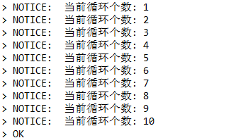
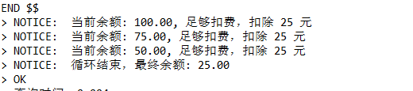
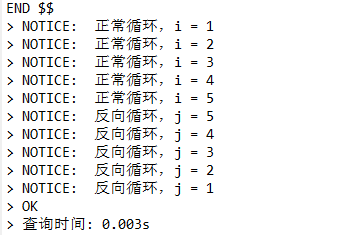
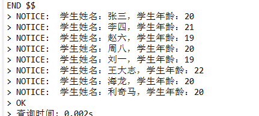
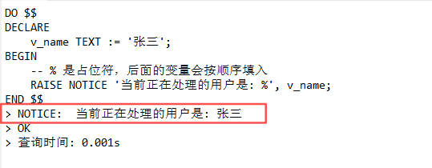
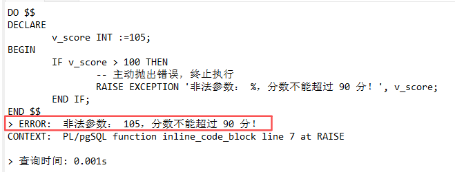
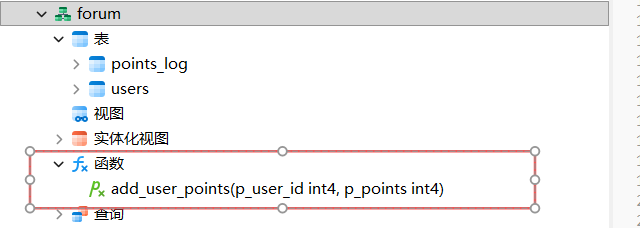

# PL/SQL 过程化语言

​	在数据库领域中， **PL/SQL（Procedural Language/SQL，过程化 SQL 语言）**是一种能将**标准 SQL 语句（`INSERT`、`SELECT`...）**与一些 **过程化控制语句（局部变量、`IF ... THEN ... ELSE` 流程控制、`LOOP/FOR/WHILE` 循环...）**两者**融合在一起**的**编程方式**，也是一种 “语法或逻辑”。

> 标准 SQL 是“声明式”的，你只能告诉数据库“我要什么数据”，但无法控制“先做什么，后做什么”。为了让数据库能处理复杂的业务逻辑，各家数据库厂商就推出了**PL/SQL 过程化语言**，将**过程化控制语句**与**标准 SQL** 融为一体。
>
> 在不同的数据库中，它们的具体归属和称呼略有不同：
>
> - 在 **Oracle**、**达梦**等数据库中，简称为 **PL/SQL 块 / 编程对象**
> - 在 **PostgreSQL**、**openGauss**等数据库中，称为 **PL/pgSQL 代码块 / 数据库服务器端编程 (Server-Side Programming)**
> - 在 **MySQL** 中，统称为 **存储程序 (Stored Programs)**

核心特征：

- **控制流能力：** 都支持 **`IF...THEN...ELSE` 条件判断、`LOOP/FOR/WHILE` 循环控制**
- **变量与异常处理：** 都可以使用 **`DECLARE` 声明临时变量**，都支持 **`EXCEPTION/RAISE` 捕捉和处理数据库错误**
- **减少网络开销：** 它们都是在数据库服务器端（Server-side）运行的。把多条 SQL 打包在里面一次性执行，避免了应用程序和数据库之间频繁的网络通信

## 分类

在 PL/SQL 家族中，主流的编程方式有以下 3 种：

- **`DO` 匿名块**：用完就扔，临时救急最紧要
- **`PROCEDURE` 存储过程**：专攻业务，大合大纵控事务
- **`FUNCTION` 函数**：专注算数据，SQL 之中任意入

### 核心区别

| **维度**     | **DO 匿名块**              | **存储过程 (Procedure)**        | **函数 (Function)**                      |
| ------------ | -------------------------- | ------------------------------- | ---------------------------------------- |
| **存储方式** | **临时执行，不保存**       | **永久保存**                    | **永久保存**                             |
| **调用方式** | **`DO $$...$$;`**          | **`CALL my_procedure();`**      | **`SELECT my_function();`**              |
| **返回值**   | **无**                     | **无**（只能靠 `OUT` 参数传出） | **必须有**（使用 `RETURNS`）             |
| **SQL 嵌入** | 无法嵌入 SQL               | 无法嵌入 SQL                    | **可以嵌入 SQL**（如 `WHERE f(x) > 10`） |
| **事务控制** | **支持** `COMMIT/ROLLBACK` | **支持** `COMMIT/ROLLBACK`      | **不支持**（视数据库版本，通常不允许）   |

## 过程化控制语句

以下关键字都是需要**在 `DO` 匿名块、`PRODECURE` 存储过程、`FUNCTION` 函数中声明使用**的，不能单独领出来定义。

> [!IMPORTANT]
>
> **`BEGIN ... END`** 是代表 **“开始-结束”** 的关键字，它会**隐式开启一个子事务**，所有 PL/SQL 语句都需要使用到。
>
> 核心作用：主要用于**将多条语句组合成一个逻辑代码块（Block）**。

#### `DECLARE` 声明临时变量并使用

- 也可以理解为是一个**只在当前作用域（ `DO` 匿名块、`PRODECURE` 存储过程、`FUNCTION` 函数）下有效的局部变量，用完即销毁**。

```postgresql
DO $$
DECLARE 
	<变量名> <数据类型>; --  声明一个变量，未显式给定默认值，初始默认值为 NULL
	<变量名> <数据类型> NOT NULL [:= | DEFAULT] <默认值>; -- 声明一个非空变量，必须设定初始默认值
	
	-- 设定默认值
	<变量名> <数据类型> DEFAULT <默认值>; -- 声明一个变量，并设定初始默认值
	<变量名> <数据类型> := <默认值>; -- 声明一个变量，并设定初始默认值

BEGIN
	-- 执行区，变量只能在这里使用
	<变量名> := <值 | 表达式>; -- 对已声明的临时变量重新赋值
	
	SELECT <查询结果 | 值> INTO <变量>,... [FROM <表名> WHERE <条件>]; 
	-- 将 表的某一行记录 | 固定值 通过 SELECT 查询出来后，按顺序注入到变量中
END $$;
```

##### `:=` 静态赋值

- 缺点：**只能给变量注入一个固定值**。要想**动态赋值**需**通过 `SELECT` 动态查询出结果**后再 **`INTO` 注入给变量**。

```sql
DO $$
DECLARE
	v_name TEXT;
	v_is_active BOOL := TRUE;
	v_sex VARCHAR(2) NOT NULL := '男';
	v_class_id INTEGER NOT NULL DEFAULT 1;
	v_dept_id INTEGER := 1001;
BEGIN
	v_name := 'Hello World';
END $$;
```

##### `SELECT INTO` 查询结果行动态赋值

在 PL/SQL 中，可以通过 **`SELECT ... INTO <变量>`** 的语法**将 `SELECT` 查询结果集的某一行记录注入给 `DECLARE` 声明的变量**。

- **固定值注入**：

  ```postgresql
  DO $$
  DECLARE
  	v_date TEXT;
  	v_user TEXT;
  BEGIN
  	SELECT CURRENT_DATE INTO v_date; -- 将当前时间注入给单个变量
  	
  	SELECT CURRENT_DATE, CURRENT_USER INTO v_date, v_user; -- 将多个值，按顺序一一对应注入给多个变量
  		
  	RAISE NOTICE '注入的结果值：%,%', v_date, v_user;
  END $$;
  
  -- 输出结果：
  -- > NOTICE:  注入的结果值：2026-06-23,postgres
  ```

- **表查询结果行-动态注入**：

  ```postgresql
  DO $$
  DECLARE
  	v_table RECORD; -- 行记录类型
  BEGIN
  	SELECT * INTO v_table FROM users WHERE user_id = 1; -- 如果不加 WHERE 过滤，返回的是表的最后一行
  	
  	RAISE NOTICE '注入的结果值：%', v_table;
  END $$;
  
  -- 输出结果：
  -- > NOTICE:  注入的结果值：(1,张三,100)
  ```

### 条件分支语句

在 PL\SQL 中，条件分支语句有 `IF ELSE` 和 `CASE ELSE` 两种语句，分别有不同的功能特性。

#### `IF...THEN...ENDIF` 复杂分支

*适合用于复杂的业务分支逻辑处理*

在 PL/SQL、 PL/pgSQL 中，`IF...THEN...ELSE` 是最基本的**条件分支控制结构**。它允许数据库**根据不同的条件，决定执行哪一段 SQL 或业务逻辑**。

- 基本逻辑就像**走分叉路**：如果满足条件 A 就走左边，否则看看满不满足条件 B，再不行就走备选通道。

> ⚠️注意点：**每个 `IF` 块末尾处都需要有一个 `END IF;` 表示结束分支判断语句**。

在 SQL 中，`IF ... ELSE` 语句有如下 3 种语法结构：

##### `IF x THEN ...` 单分支

- 最简单的单分支语句：**只有一个判断，满足条件则进入 `IF` 块，否则跳过**。

注：如果涉及到变量值的判断，需**提前在 `DECLARE` 区中声明一个临时变量**。

```postgresql
DO $$
DECLARE --（可选）
	<变量> <数据类型> := <默认值>; -- 初始化值，可后续通过 <变量>:= <(SELECT x FROM ...) | 值>; 赋值
BEGIN
	IF <变量 | 值> <条件表达式> THEN -- 如果 IF 条件表达式结果为 True，则进入分支块中执行逻辑，否则无视跳过
		-- 分支块
	END IF; -- 必需的
END $$
```

示例：

```postgresql
DO $$
DECLARE
    v_age INT := 20;
BEGIN
    IF v_age >= 18 THEN
        RAISE NOTICE '已成年';
    END IF; -- 记住每个 IF 都要有对应的 END IF
END $$;

-- 输出结果：
-- > NOTICE:  已成年
```

##### `IF x THEN ... ELSE` 双重分支

- 核心逻辑：**`IF` 条件通过走 `THEN` ，不通过则走 `ELSE`。（二选一）**

注：如果涉及到变量值的判断，需**提前在 `DECLARE` 区中声明一个临时变量**。

```postgresql
DO $$
DECLARE --（可选）
	<变量> <数据类型> := <默认值>; -- 初始化值，可后续通过 <变量>:= <(SELECT x FROM ...) | 值>; 赋值
BEGIN
	IF <变量 | 值> <条件表达式> THEN -- 如果 IF 条件表达式结果为 True，则进入分支块中执行逻辑，否则无视跳过
		-- IF 条件通过，执行该分支块
	ELSE
		-- IF 条件不通过，执行该分支块
	END IF; -- 必需的
END $$
```

示例：

```postgresql
DO $$
DECLARE
    v_score INT := 59;
BEGIN
    IF v_score >= 60 THEN
        RAISE NOTICE '考试通过！';
    ELSE
        RAISE NOTICE '不及格，准备补考。';
    END IF;
END $$;

-- 输出结果：
-- > NOTICE:  不及格，准备补考。
```

##### `IF x THEN ... ELSIF y ELSE` 多重分支

- 核心逻辑：当**有多个条件需要层层筛选**时使用。

> 注：**`ELSIF` 可以有多个，代表多个条件，`ELSE` 只能有一个，代表所有条件不通过时的兜底方案（可选的）**。

```postgresql
DO $$
DECLARE --（可选）
	<变量> <数据类型> := <默认值>; -- 初始化值，可后续通过 <变量>:= <(SELECT x FROM ...) | 值>; 赋值
BEGIN
	IF <变量 | 值> <条件表达式> THEN -- 如果 IF 条件表达式结果为 True，则进入分支块中执行逻辑，否则无视跳过
		-- IF 条件通过，执行该分支块
	ELSIF
		-- IF 条件不通过，执行该分支块
	ELSIF
		-- 前面的 IF、ELSIF 条件不通过，执行该分支块
	...
	ELSE
		-- 所有 IF、ELSIF 条件不通过，执行该分支块
	END IF; -- 必需的
END $$
```

示例：

```postgresql
DO $$
DECLARE
	v_score INT := 90;
BEGIN
	IF v_score >= 90 THEN
		RAISE NOTICE '优秀';
	ELSIF v_score >= 80 THEN
		RAISE NOTICE '良好';
	ELSIF v_score >= 60 THEN
		RAISE NOTICE '及格';
	ELSE
		RAISE NOTICE '不及格，去死吧';
	END IF; -- ⚠️不要忘记！
END $$

-- 输出结果：
-- > NOTICE:  优秀
```

#### `CASE x WHEN y THEN ... ELSE` 简单分支

*适合用于简单的业务分支逻辑处理*

如果 SQL 条件判断只是单纯地针对**某一个变量的不同固定值**进行分流，写一堆 `ELSIF` 会显得很臃肿，使用 `CASE` 语句更合适。

##### 基本语法结构

- 如果涉及到变量值的判断，需**提前在 `DECLARE` 区中声明一个临时变量**。

```postgresql
DO $$
DECLARE  --（可选）
	<变量> <数据类型> := <默认值>; -- 初始化值，可后续通过 <变量>:= <(SELECT x FROM ...) | 值>; 赋值
BEGIN
	CASE <变量>
		WHEN <值> WHEN -- 当 <变量> 与 <值> 相等时，则进入该分支体中执行内部逻辑
			-- 分支体
		...
		ELSE
			-- 如果 <变量> 与 前面的 <值> 都不相等，则进入 ELSE 块中执行，是一个兜底区（可选）
	END CASE;
END $$
```

示例：

```postgresql
DO $$
DECLARE
	v_role TEXT := 'admin';
BEGIN
	CASE v_role
		WHEN 'admin' THEN
			RAISE NOTICE '超级管理员';
		WHEN 'manager' THEN
			RAISE NOTICE '普通管理员';
		WHEN 'user' THEN
			RAISE NOTICE '普通用户';
		ELSE
			RAISE NOTICE '这是一个没有任何权限的用户';
	END CASE;
END $$

-- 输出结果：
-- > NOTICE:  普通管理员
```

#### `NULL` 空值处理

在数据库开发中，条件判断最容易翻车的地方就是处理 `NULL`。

在 SQL 逻辑中，有一个概念叫 **三值逻辑（Three-Valued Logic）**：一个条件的结果不仅有 `TRUE` 和 `FALSE`，还有 `UNKNOWN`（未知）。任何值与 `NULL` 进行常规比较（如 `=`, `!=`, `>`, `<`），结果都是 `UNKNOWN`。

**而 `IF` 语句只有在条件明确为 `TRUE` 时才会走 `THEN` 分支。如果是 `FALSE` 或者是 `UNKNOWN`，通通都会划归到 `ELSE` 中！**

- 解决方案：必须使用 **`IS NULL` 或 `IS NOT NULL` 来明确捕捉空值**

```postgresql
DO $$
DECLARE
    v_status TEXT := NULL;
BEGIN
    IF v_status IS NULL THEN
        RAISE NOTICE '状态异常（NULL）';
    ELSIF v_status = 'active' THEN
        RAISE NOTICE '用户已激活';
    ELSE
        RAISE NOTICE '用户未激活';
    END IF;
END $$;
```

### `LOOP/FOR/WHILE` 循环控制语句

在 PL/SQL、 PL/pgSQL 中，循环控制是**处理批量数据、重复逻辑**的核心武器。

- 主要分为：**`LOOP`（基础循环）**、**`WHILE`（条件循环）** 和 **`FOR`（计数/游标循环）**。

> 循环控制语句的 “安全阀门”：
>
> - **`EXIT`（跳出循环，相当于 `break`）**
> - **`CONTINUE`（跳过本次，进入下一轮）**

#### `LOOP` 基础循环

- **`LOOP ... END LOOP;`** 是最基础的循环，它**没有自带的终止条件**；必须**手动使用 `EXIT WHEN <终止条件>` 来退出**，否则会**死循环**。

##### 基础语法结构

```postgresql
LOOP -- 开始循环标识
	-- 循环体
	...
	
	EXIT WHEN <终止循环条件表达式>;
END LOOP; -- 结束循环表示
```

示例：

```postgresql
DO $$
DECLARE
	v_counter INT := 1;	
BEGIN
	LOOP 
		RAISE NOTICE "当前循环个数: %", v_counter;
		v_counter := v_counter + 1;
		
		EXIT WHEN v_counter > 10; -- 当循环次数超过 10 则退出循环，否则会死循环
	END LOOP; -- 结束循环
END $$;
```



> 注意：除了一些关键字，在**每一行的末尾处都需要添加 `;` 分号，否则会被视为一行**。

#### `WHILE ... LOOP` 条件循环（先判断、再执行）

- **`WHILE ... LOOP ... END LOOP;` 循环**会**在每一轮循环开始前，先检查一个条件**：
  - **条件为真（TRUE）：继续执行**
  - **条件为假（FALSE）：终止循环**

##### 基础语法结构

```postgresql
WHILE <循环条件> LOOP -- 只要循环条件为真，就会继续执行下一轮循环体
	-- 循环体
END LOOP; -- 若循环条件为假，则跳到这里结束循环
```

示例：

```postgresql
DO $$
DECLARE
	v_balance NUMERIC :=  100.00;	
BEGIN
  -- 只要余额大于30，就一直扣钱（循环）
	WHILE v_balance > 30.00 LOOP
		RAISE NOTICE '当前余额: %, 足够扣费，扣除 25 元', v_balance;
    v_balance := v_balance - 25.00;
	END LOOP;
	
	RAISE NOTICE '循环结束，最终余额: %', v_balance;
END $$;
```



#### `FOR x IN ... LOOP` 循环（推荐）

- **`FOR x IN ... LOOP ... END LOOP;`** 循环有 2 种非常经典的用法：

  - **固定次数的数值循环**
  - **遍历 `SELECT` SQL 查询结果**的**游标循环**

  `FOR` 循环是**最安全**的，因为它的**循环次数通常是受控**的。

##### 数值范围循环

###### 基本语法结构

- 在 `FOR` 循环中，**循环变量（如 `i`）不需要**在 **`DECLARE` 声明区中提取声明**，数据库会**自动创建**它，并**只能在循环体中使用**。

```postgresql
-- 正向循环
FOR <循环变量> IN <开始值>..<结束值> LOOP
	-- 循环体
END LOOP;

-- 反向循环
FOR <循环变量> IN REVERSE <结束值>..<开始值> LOOP
	-- 循环体
END LOOP;
```

示例：

```postgresql
DO $$
BEGIN
	-- 从 1 循环到 5（包括 5 本身）
	FOR i IN 1..5 LOOP
		RAISE NOTICE '正常循环，i = %', i;
	END LOOP;
	
	FOR j IN REVERSE 5..1 LOOP
		RAISE NOTICE '反向循环，j = %', j;
	END LOOP;
END $$
```



##### 游标循环（遍历SQL查询结果）

- 这是数据库开发中最实用的场景：直接**用 `FOR` 遍历某条 `SELECT` 语句查出来的每一行数据**。

###### 基本语法结构

- 当 **SQL 查询结果行被遍历完**后，`FOR` 循环会**自动结束**。

注：需要**提前在 `DECLARE` 区中声明**一个**数据类型为 `RECORD` 的临时局部变量**，用来**接收每次 `FOR IN` 循环提取的 SQL 查询行**。

```postgresql
DECLARE
	<循环变量-行记录> RECORD;
BEGIN
	FOR <循环变量-行记录> IN (SELECT 查询结果... FROM ...) LOOP
        -- 循环体，可以直接像对象一样操作每一行记录的列
        <循环变量-行记录>.<列名>
    END LOOP;
END $$;
```

示例：
```postgresql
DO $$
DECLARE
	-- 声明一个 RECORD（记录）类型的变量，用来当做“容器”装每一行数据
	v_row RECORD;
BEGIN
	-- 自动把查询结果的每一行依次赋值给 v_row
	FOR v_row IN (SELECT * FROM high_school.student WHERE gender = '男') LOOP
	
		-- 通过 变量名.列名 来访问数据
		RAISE NOTICE '学生姓名：%，学生年龄：%', v_row.student_name, v_row.age;
		
	END LOOP;
END $$;
```



#### `CONTINUE` 跳过本次循环

- 在循环中，**`EXIT`** 是**直接结束整个循环**，而 **`CONTINUE` 是结束本轮循环，直接进入下一轮**。

##### 基本语法结构

```postgresql
FOR <循环变量> IN <开始值>..<结束值> LOOP
	CONTINUE WHEN <跳过条件表达式>; -- 当表达式结果为 True 时，直接跳过后面的代码，进入下一次循环
END LOOP; 
```

示例：

```postgresql
DO $$
BEGIN
	FOR i IN 1..5 LOOP
		-- 如果是奇数，直接跳过后面的代码，进入下一次循环
		CONTINUE WHEN i % 2 != 0;
		
		RAISE NOTICE '偶数：%', i;-- 只会打印 2 和 4
	END LOOP;
END $$;
-- 输出结果
-- > NOTICE:  偶数：2
-- > NOTICE:  偶数：4
```

####  核心总结与避坑指南

1. **首选 FOR 循环：** 无论是数数还是遍历表数据，尽量用 `FOR`。因为它会自动帮你管理循环变量的递增和退出，基本不会写出死循环
2. **慎用 LOOP/WHILE：** 使用它们时，务必**第一步**先写好变量的递增逻辑（如 `v_i := v_i + 1`）和退出条件，再写业务逻辑，防止漏掉导致数据库 CPU 飙升 100%
3. **循环中少做大事务：** 避免在 `FOR` 循环内部去执行极其耗时的复杂 `UPDATE` 或 `INSERT`。如果有几万条数据，循环执行几万次单独的 SQL 性能会极差，此时应优先考虑纯 SQL 的**批量操作（Set-based）**

### `EXCEPTION/RAISE` 异常捕捉和处理

在 PL/SQL 、 PL/pgSQL 编程（包括 DO 块、存储过程、函数）中，**`EXCEPTION`（异常捕捉）**和 **`RAISE`（抛出异常/打印信息）** 是保证代码健壮性和可调试性的核心机制。

#### `RAISE` 抛出异常

在代码块中，`RAISE` 主要有两个作用：**输出调试信息**（不中断程序）和**抛出错误**（中断程序）。类似于 Python 的 `print()`。

##### 输出调试信息

- 调试信息分为 **`NOTICE` 提示、`INFO` 调试信息、`WARNING` 警告** 三种级别，这**不会终止 SQL 代码运行**。

> 注：调试信息不会有任何高亮代码提示，仅靠字符判断。

```postgresql
RAISE [NOTICE | INFO | WARNING ] "调试信息"; -- 纯文本
RAISE [NOTICE | INFO | WARNING ] "调试信息%", <变量>; -- 带变量解析的文本
```

示例：

```postgresql
DO $$
DECLARE
    v_name TEXT := '张三';
BEGIN
    -- % 是占位符，后面的变量会按顺序填入
    RAISE NOTICE '当前正在处理的用户是: %', v_name; 
END $$;
```



##### 抛出异常

- 使用 **`EXCEPTION` 异常级别**，会**直接触发错误，并使当前事务回滚**。

```postgresql
RAISE EXCEPTION "调试信息"; -- 纯文本异常信息
RAISE EXCEPTION "调试信息%", <变量>; -- 带变量解析的文本异常信息
```

示例：

```postgresql
DO $$
DECLARE
	v_score INT :=105;
BEGIN
	IF v_score > 100 THEN
		-- 主动抛出错误，终止执行
		RAISE EXCEPTION '非法参数： %，分数不能超过 90 分！', v_score;
	END IF;
END $$;
```



#### `EXCEPTION` 异常捕捉

当 SQL 代码**在 `BEING ... END` 执行区代码块之间发生错误**（比如除以 0、违反唯一约束、或者被 `RAISE EXCEPTION` 主动终止）时，**如果没有异常处理，整个程序就会报错弹窗并回滚**。

可以在**末尾处**底部**使用 `EXCEPTION`** 进行**异常捕获并处理**。

```postgresql
EXCEPTION -- 异常捕获
	-- 捕捉特定错误
	WHEN <具体错误类型> THEN -- 具体异常处理
		RAISE [NOTICE | INFO | WARNING ] "调试信息%", <变量>; -- 抛出调试信息 
	-- 捕捉其他错误
	WHEN OTHERS THEN
		RAISE [NOTICE | INFO | WARNING ] "调试信息%", <变量>; -- 抛出调试信息 
	...
```

示例：

```postgresql
DO $$
DECLARE 
	v_result INT;
BEGIN
	v_result := 10 / 0; -- 1. 这里会引发一个“除以零”的错误
	
	-- 后续代码不会再执行，已经被终止，转到 EXCEPTION 异常捕捉代码块处
EXCEPTION
	-- 2. 捕捉特定错误（division_by_zero 是标准错误码名称）
	WHEN division_by_zero THEN
		RAISE WARNING '捕获到了除零错误！现在将结果重置为 0。';
		v_result := 0;
		
	-- 3. 捕捉其他所有未预料到的错误（相当于 Java 的 catch(Exception e)）
	WHEN OTHERS THEN
		RAISE WARNING '捕获到了其他未知错误。';
END $$;
```

###### 具体异常信息

```postgresql
DO $$
BEGIN
    -- 故意插入一条违反唯一约束的数据（假设 id=1 已存在）
    INSERT INTO users(id, name) VALUES (1, '李四');

EXCEPTION WHEN OTHERS THEN
    -- 打印具体的报错内容
    RAISE NOTICE '错误码 (SQLSTATE): %', SQLSTATE;
    RAISE NOTICE '错误原因 (SQLERRM): %', SQLERRM;
END $$;
-- > NOTICE:  错误码 (SQLSTATE): 42P01
-- > NOTICE:  错误原因 (SQLERRM): relation "users" does not exist
```

#### 异常处理对事务的影响

> ⚠️ **性能与事务代价：** 在 **`BEGIN ... END` 块中一旦写了 `EXCEPTION`**，数据库内部为了能够实现“出错后捕获而不崩溃”，会在进入该块时**隐式创建**一个**子事务（Subtransaction/Savepoint）**。
>
> - **如果没报错：** 正常消耗一点点微小的子事务开销
> - **如果报错了：** 异常块内部会**自动回滚**该 `BEGIN` 块内已经执行的 SQL 操作，然后进入 `EXCEPTION` 分支
>
> **结论：** **不要在每个小代码段里都嵌套 `BEGIN ... EXCEPTION ... END`**。在高并发的循环中频繁触发异常捕捉，会导致严重的性能下降（子事务溢出）。只在真正需要防止崩溃或做错误转换的关键节点才使用它。

##### 关于事务的回滚机制

##### `EXCEPTION` 异常处理的回滚机制

在 PL/pgSQL 中，一旦**给 `BEGIN ... END;` 块加上了 `EXCEPTION` 捕获子句**，PostgreSQL 就会在后台**自动创建一个子事务（Subtransaction/Savepoint）**。

- **规则 1：** **在有 `EXCEPTION` 的块内部，PostgreSQL 不允许显式调用 `COMMIT` 或 `ROLLBACK`**。因为**子事务的提交和回滚**应该**由包裹它的主事务或块外层来控制**
- **规则 2：** 如果**存储过程运行中途发生异常，`EXCEPTION` 块会自动捕获**，并**自动回滚**该块内发生的所有更改。**不需要、也不能在 `EXCEPTION` 块或带有 `EXCPETION` 异常处理块的【存储过程】里手动写 `ROLLBACK` 回滚关键字**

解决方案：**不需要**在**带有 `EXCEPTION` 异常处理块的【存储过程】**中**添加 `COMMIT` 和 `ROLLBACK`**，应该**让存储过程内部的事务机制自动去处理**。

# `DO` 匿名块

## 基本概念

**DO 匿名块（Anonymous Block）**是数据库（如 PostgreSQL、Oracle 等）中一种非常实用的控制流结构。

简单来说，它就是一段**“即用即弃”的临时脚本**。

- 通常用于**执行一次性的、临时的自动化任务**，不需要在数据库中留下痕迹。

> 通常情况下，纯 SQL（如 `SELECT`, `UPDATE`）无法写 `IF` 判断、`LOOP` 循环。
>
> 如果想用这些高级逻辑，但**又不想专门去创建一个永久的存储过程**，最佳选择是定义一个**DO 匿名块**。

### 核心特点

- **没有名字：** 它不像存储过程那样有 `CREATE PROCEDURE my_proc` 的名字，因此**无法被后续的代码直接调用**
- **不留痕迹：** **执行完毕后，这段代码立即从内存中销毁**，不会在数据库的系统表（如 `pg_proc`）中留下任何对象
- **无输入输出参数：** 它**不支持**像函数那样传入参数（`IN`）或传出参数（`OUT`）。如果**需要临时变量，只能在 `DECLARE` 中硬编码或在执行区块内查询赋值**
- **事务控制：** 在**较新版本**的数据库中，**`DO` 匿名块内部支持 `COMMIT` 和 `ROLLBACK`**（视具体数据库版本而定）

> [!WARNING]
>
> **不应该使用 `DO` 块**的情况：
>
> - **需要高频重复调用：** 如果一段 SQL 逻辑每天要被业务代码调用几万次，需使用**存储过程**或**函数**，因为存储过程会**缓存执行计划，性能更好**
> - **需要接收外部传参：** 如果代码需要根据**形参输入**动态执行，**`DO` 匿名块无法直接接收参数**，必须使用**存储过程**

### 与 `PROCEDURE` 存储过程的核心区别

| **特性**       | **存储过程 (Stored Procedure)**                              | **DO 匿名块 (Anonymous Block)**    |
| -------------- | ------------------------------------------------------------ | ---------------------------------- |
| **持久化存储** | 代码编译后**持久化保存**在数据库系统表中                     | **执行完即销毁**，数据库不保存代码 |
| **调用方式**   | 通过**名字调用（如 `CALL proc_name();`）**                   | **直接执行 `DO $$...$$;` 代码块**  |
| **参数传递**   | 支持**输入（IN）**、**输出（OUT）**和**输入输出（INOUT）**参数 | **不支持**外部传参                 |
| **返回值**     | 可以通过 **`OUT` 参数、`RETURN` 关键字返回值**               | **无返回值**                       |
| **权限管理**   | 可以单独**对存储过程**进行**授权（`GRANT EXECUTE`）**        | **无法单独授权**                   |
| **性能/编译**  | 首次执行或创建时编译，后续执行直接使用执行计划（效率高）     | 每次执行都需要重新解析和编译       |

## 基本语法结构

- `DO` 匿名块的标准结构由 **`DO` 驱动关键字、变量声明区、SQL 执行区** 和 **`LANGUAGE` 语言** 这 4 个部分组成：

```postgresql
DO $$ -- 1. 驱动执行标识

DECLARE
	-- 2. 变量声明区（可选）
	<变量> <数据类型> [:= | DEFAULT] <默认值>;

BEGIN -- 3. 开始标记
	-- 4. SQL 代码逻辑执行区，可在此处使用 <变量> 操作

END $$ LANGUAGE plpgsql; -- 5. 结束标识 + 指定语言（默认是 plpgsql）
```

> **💡 提示：** **`$$` 标识符**用来**包裹代码块**，**防止代码内部的单引号 `'` 与外部冲突**。

### 示例

- 批量数据更新：

  ```postgresql
  DO $$
  DECLARE
  	v_row RECORD; -- 用于装每次循环得到的查询结果行
  BEGIN
  	-- 循环遍历 从 student 查询的结果行，每次循环都将当前行记录注入到 v_row 变量中
  	FOR v_row IN (SELECT * FROM student WHERE gender = '男') LOOP
  		-- 如果当前行记录（学生）的 class_id = 101 ，则该学生的年龄 + 10
  		IF v_row.class_id = 101 THEN
  			UPDATE student SET age = age + 10 WHERE class_id = v_row.class_id AND student_name = v_row.student_name;
  		-- 如果当前行记录（学生）的 class_id = 1010，则删除当前学生记录
  		ELSIF v_row.class_id = 1010 THEN
  			DELETE FROM student WHERE class_id = v_row.class_id AND student_name = v_row.student_name;
  		END IF;
  	END LOOP;
  	
  EXCEPTION
  	WHEN OTHERS THEN
      RAISE WARNING '错误码 (SQLSTATE): %', SQLSTATE;
      RAISE WARNING '错误原因 (SQLERRM): %', SQLERRM;
  END $$ LANGUAGE plpgsql;
  ```

- 借助 `RETURING` 返回的结果注入变量，动态更新数据：

  ```postgresql
  -- 同时插入3条数据
  DO $$
  DECLARE -- 定义变量
  	v_dept_id INTEGER; -- 当前新插入的系别ID
  	v_class_id INTEGER; -- 当前新插入的班级ID
  BEGIN
  	-- 插入一条系别数据
  	INSERT INTO department (dept_name) VALUES ('金融系') RETURNING dept_id INTO v_dept_id; 
  	-- 注入到 v_dept_id 变量中，给后续SQL代码引用
  	
  	-- 根据新插入的系别ID，插入 n 条班级数据
  	INSERT INTO d_class (class_id, class_name, dept_id) VALUES (1010, '2022-1701班', v_dept_id) RETURNING class_id INTO v_class_id;
  	 -- 注入到 v_class_id 变量中，给后续SQL代码引用
  	
  	-- 根据所新插入的班级ID，插入 n 条学生数据
  	INSERT INTO student (student_name, gender, age, class_id) VALUES ('王大志', '男', 22, v_class_id);
  	INSERT INTO student (student_name, gender, age, class_id) VALUES ('海龙', '男', 20, v_class_id);
  END $$;
  ```

- 脚本判断：

  ```postgresql
  DO $$
  BEGIN
      -- 如果不存在名为 idx_users_email 的索引，则创建
      IF NOT EXISTS (SELECT 1 FROM pg_class WHERE relname = 'idx_users_email') THEN
          CREATE INDEX idx_users_email ON users(email);
      END IF;
  END $$;
  ```

## 适用场景

- **数据库数据迁移或修复：** 一次性的刷数据脚本
- **动态控制流：** 在不支持复杂逻辑的纯 SQL 环境中（如某些 DDL 迁移工具 Liquibase/Flyway），用匿名块来做条件判断（如：如果表不存在则创建）
- **测试代码：** 在写存储过程前，先在匿名块里测试一段逻辑

# `PROCEDURE` 存储过程

​	在 PostgreSQL 中，**存储过程（Stored Procedures）** 是从 PostgreSQL 11 开始引入的重要特性。在此之前，开发者通常使用“函数（Functions）”来替代它。

- 存储过程是数据库中的一个**命名对象**。它就像**写好的一个功能函数**，**封装了复杂的业务逻辑，存放在服务器端**

## 基本概念

**存储过程（Stored Procedures）**是一种能**将一大串 SQL 执行语句封装在一起**成为一个**执行单元**的 **SQL 编程方式**。

核心特点：`PROCEDURE` 存储过程可**接收形参、编写 PL/SQL 过程化语言、事务控制....**等操作，就像编程里的 Function **函数**一样。 

> [!IMPORTANT]
>
> 与 **`FUNCTION` 函数**的**核心区别**：
>
> - **`PROCEDURE` 存储过程：**
>   - **支持事务控制（可以在内部执行 `COMMIT` 和 `ROLLBACK`）**
>
> - **`FUNCTION` 函数**：
>   - **运行在单个事务中**，**不能手动提交 `COMMIT` 或回滚 `ROLLBACK`**
>
>
> 与 **`DO` 匿名块**的核心区别：
>
> - **`PROCEDURE` 存储过程**是**“一次定义，多次复用”**的**持久化对象**
> - **`DO` 匿名块**是**“即用即弃”**的**临时执行脚本**

### 核心特点

| **特性**       | **存储过程 (Stored Procedure)**                              |
| -------------- | ------------------------------------------------------------ |
| **持久化存储** | 代码编译后**持久化保存**在数据库系统表中                     |
| **调用方式**   | 通过**名字调用（如 `CALL proc_name();`）**                   |
| **参数传递**   | 支持**输入（`IN`）**、**输出（`OUT`）**和**输入输出（`INOUT`）**参数 |
| **返回值**     | 可以通过 **`OUT` 参数、`RETURN` 关键字返回值**               |
| **权限管理**   | 可以单独**对存储过程**进行**授权（`GRANT EXECUTE`）**        |
| **性能/编译**  | 首次执行或创建时编译，后续执行直接使用执行计划（效率高）     |

#### 事务控制能力

在 PostgreSQL 11 引入存储过程之前，函数（Function）无法在内部独立管理事务。而存储过程打破了这一限制：

- **分批提交，防止锁表**：在处理几百万行的大数据量洗数（ETL）或历史数据归档时，你可以通过循环结合 `COMMIT`，每处理 1 万条就提交一次。这能有效防止数据库膨胀（Bloat）和长事务锁死表。
- **局部回滚**：允许在捕获异常（`EXCEPTION`）后执行 `ROLLBACK`，确保即使中间某步出错，也能让数据库退回到安全状态。

### 核心优势

- **显著降低网络开销（性能优势）**：这是最核心的优势。假设有一个复杂的报表逻辑需要执行 10 条 SQL，如果通过应用端调用，需要往返数据库 10 次；而存储过程只需将 10 条 SQL 写在内部，应用端仅需**1次**网络往返，这在**高并发**或**微服务架构**中能**极大减少网络拥塞**。
- **减少数据移动（计算下沉）**：它利用数据库自身的计算能力在数据“所在地”直接处理。对于处理大量原始数据（如数百GB的扫描和聚合），存储过程避免了将海量数据拉到应用服务器内存中处理，效率远高于在应用层做计算。
- **极高的安全性与权限控制**：可以对应用程序账号仅**授予存储过程的 `EXECUTE` 权限**，而完全禁止其对底层数据表的`INSERT/UPDATE/DELETE/SELECT`权限。这样一来，所有数据操作必须经由存储过程，能**有效防止 SQL 注入**，并实现细粒度的数据审计。
- **降低应用与数据库的耦合度（特定场景）**：当底层表结构发生变更（如拆分字段），只要存储过程的输入输出参数保持不变，你只需修改存储过程内部的 SQL 即可，应用程序**无需重新编译或发版**。

适用场景：**存储过程（Procedure）**是为了**大批量数据清洗（ETL）**和**复杂长事务控制**而生的利器。

## 创建、调用、删除

### `CREATE PROCEDURE` 创建一个存储过程

创建存储过程的基本结构如下（以最常用的 `plpgsql` 语言为例）：

```postgresql
CREATE [OR REPLACE] PROCEDURE <存储过程命名> (<形参名1> <数据类型>, <形参名1> <数据类型>,...) 
-- 1. 创建或覆盖一个存储过程，并声明接收从外部 CALL xxx() 传入的形参
LANGUAGE plpgsql -- 指定语言
AS $$ -- 驱动执行标记
DECLARE 
	-- 2. 局部变量声明区。可在 BEGIN 执行区中使用（可选）
	<变量> <数据类型> [:= | DEFAULT] <默认值>;
BEGIN -- 3. 开始标记

	-- 4. 业务逻辑代码，执行区（可编写任何SQL代码、PL/SQL 语言、包括事务 COMMIT、ROLLBACK...）
	RETURN; -- 结束存储过程的执行
[EXCEPTION WHEN ... THEN ...] -- 异常处理（可选）

END $$ -- 5. 结束标记
```

核心作用：**创建或覆盖一个存储过程，并为其命名，持久化存储在数据库服务器中，后续可使用 `CALL` 关键字随时调用**。

拆解说明：

- **形参输入**：存储过程可以在**使用 `CALL` 调用执行时接收来自外部传入的形参**，并**在 `BEGIN ... END` 作用域中使用**

  > 可以看出，其实 **`PROCEDURE` 存储过程本质上**也是一个**可执行函数**。

### `CALL` 调用存储过程

- 存储过程必须使用 **`CALL` 关键字来调用**，并**传入符合条件的「实参值（若有）」给存储过程接收并处理**。

```postgresql
CALL <存储过程名称>(<实参值1>, <实参值2>, <实参值3>...)
```

### `DROP PROCEDURE`  删除存储过程

- **`DROP PROCEDURE` 删除一个存储过程时，必须传入该存储过程所声明接收的形参数据类型**

```postgresql
DROP PROCEDURE [IF EXISTS] <存储过程名称>(<形参1-接收类型>, <形参2-接收类型>, <形参3-接收类型>);
```

### 示例

#### 简单案例

假设有如下表：

```postgresql
SET search_path TO forum;

-- 1. 创建用户表
CREATE TABLE users (
    user_id INTEGER PRIMARY KEY,
    username VARCHAR(50) NOT NULL,
    points INT DEFAULT 0
);

-- 2. 创建积分变更日志表
CREATE TABLE points_log (
    log_id SERIAL PRIMARY KEY,
    user_id INT,
    points_added INT,
    changed_at TIMESTAMP DEFAULT CURRENT_TIMESTAMP
);

-- 插入用户数据
INSERT INTO users (user_id, username, points) VALUES (1, '张三', 100), (2, '李四', 250);
```

- 创建一个可同时更新用户、积分日志表的存储过程，并可多次调用

  ```postgresql
  -- 创建一个存储过程：可同时更新用户表并写入日志表的操作，后续可随时调用执行，只需传入不同参数即可
  CREATE OR REPLACE PROCEDURE add_user_points (p_user_id INTEGER, p_points INTEGER) -- 要增加积分的用户ID，增加的积分数
  LANGUAGE plpgsql
  AS $$
  BEGIN 
  	-- 1. 更新用户的积分
  	UPDATE users SET points = points + p_points WHERE user_id = p_user_id;
  	
  	-- 2. 插入一条积分变更记录
  	INSERT INTO points_log (user_id, points_added) VALUES (p_user_id, p_points);
  END $$;
  
  -- 调用存储过程，并传入对应的实参值
  CALL add_user_points (1, 50); -- 给 张三（user_id = 1） 加上 50 积分
  CALL add_user_points (2, 50); -- 给 李四（user_id = 2） 加上 50 积分
  CALL add_user_points (1, 150); -- 给 张三（user_id = 1） 加上 150 积分
  
  SELECT * FROM users;
  /*
   user_id | username | points
  ---------+----------+--------
         2 | 李四     |    300
         1 | 张三     |    300
  */
  SELECT * FROM points_log;
  /*
   log_id | user_id | points_added |         changed_at
  --------+---------+--------------+----------------------------
        1 |       1 |           50 | 2026-06-23 20:37:52.108262
        2 |       2 |           50 | 2026-06-23 20:37:52.114811
        3 |       1 |          150 | 2026-06-23 20:37:52.116672
  */
  
  
  -- 删除存储过程
  DROP PROCEDURE IF EXISTS add_user_points(INTEGER, INTEGER);
  ```

  

- 用户积分记录回滚：

  ```postgresql
  -- 创建一个视图：查看所有用户的积分更改记录
  CREATE VIEW show_users_log AS (
  	SELECT u.user_id, username, points, points_added, changed_at
  	FROM points_log log INNER JOIN users u ON u.user_id = log.user_id
  );
  
  -- 创建一个存储过程：用于回滚用于积分记录
  -- 作用：遍历积分更改记录视图，将符合条件的用户提取出来，超过或等于一定时间的，删除日志记录，并减去相应的用户积分
  CREATE OR REPLACE PROCEDURE check_users_log_rollbak()
  LANGUAGE plpgsql
  AS $$
  DECLARE 
  	v_row RECORD := NULL;	-- 用于每次 FOR 循环接收 SQL 视图查询的当前结果行记录
  	v_has_record BOOL := FALSE; -- 标识符；判断 SQL 视图查询是否有结果行记录（因为 v_row 为 NULL，则 FOR 循环不会进入执行）
  BEGIN
  	-- 循环遍历用户积分记录视图的结果行，并将当前行的积分记录中的 changed_at 更新时间字段转换为 DATE 类型
  	FOR v_row IN (SELECT changed_at::DATE AS log_date, user_id, points_added FROM show_users_log) LOOP
  		-- 如果当前行记录（用户积分记录），时间 = 今天，则代表条件通过
  		IF v_row.log_date = CURRENT_DATE THEN
  			v_has_record := TRUE; -- 代表今天有误加的用户积分记录
  			RAISE NOTICE '正在回滚误加用户 ID: %, 积分: %', v_row.user_id, v_row.points_added; -- 调试信息
  			-- 删除相关的用户积分记录
  			DELETE FROM points_log WHERE user_id = v_row.user_id;
  						
  			-- 减去相关用户误加的积分
  			UPDATE users SET points = points - v_row.points_added WHERE user_id = v_row.user_id;
  		END IF;
  	END LOOP;
  	
  	IF NOT v_has_record THEN
  		RAISE NOTICE '今天没有误加积分的用户记录'; -- 调试信息
  		RETURN; -- 结束存储过程，后续代码不再执行
  	END IF;
  END $$;
  
  
  CALL check_users_log_rollbak();  -- 调用存储过程
  
  SELECT * FROM users;
  /*
   user_id | username | points
  ---------+----------+--------
         2 | 李四     |    250
         1 | 张三     |    100
  */
  SELECT * FROM points_log;
  /*
   log_id | user_id | points_added |         changed_at
  --------+---------+--------------+----------------------------
  */
  
  -- 删除存储过程
  DROP PROCEDURE IF EXISTS check_users_log_rollbak();
  ```

- CTE 形式：

  ```postgresql
  CREATE OR REPLACE PROCEDURE check_users_log_rollbak_fast()
  LANGUAGE plpgsql
  AS $$
  BEGIN
      -- 1. 使用 WITH 临时收集今天需要回滚的日志，并直接从日志表中删除，同时返回被删的数据
      WITH deleted_logs AS (
          DELETE FROM points_log
          WHERE log_id IN (
              SELECT log_id 
              FROM show_users_log 
              WHERE changed_at::DATE = CURRENT_DATE
          )
          RETURNING user_id, points_added
      )
      -- 2. 将被删掉的积分，成批地从用户表中扣除
      UPDATE users u
      SET points = u.points - sub.total_points
      FROM (
          SELECT user_id, SUM(points_added) AS total_points 
          FROM deleted_logs 
          GROUP BY user_id
      ) sub
      WHERE u.user_id = sub.user_id;
  
      RAISE NOTICE '今日误加积分已全部成功回滚！';
  END;
  $$;
  ```

#### 事务案例

##### `EXCEPTION` 异常处理的回滚机制

在 PL/pgSQL 中，一旦**给 `BEGIN ... END;` 块加上了 `EXCEPTION` 捕获子句**，PostgreSQL 就会在后台**自动创建一个子事务（Subtransaction/Savepoint）**。

- **规则 1：** **在有 `EXCEPTION` 的块内部，PostgreSQL 不允许显式调用 `COMMIT` 或 `ROLLBACK`**。因为**子事务的提交和回滚**应该**由包裹它的主事务或块外层来控制**
- **规则 2：** 如果**存储过程运行中途发生异常，`EXCEPTION` 块会自动捕获**，并**自动回滚**该块内发生的所有更改。**不需要、也不能在 `EXCEPTION` 块里手动写 `ROLLBACK` 回滚关键字**

解决方案：**不需要**在**带有 `EXCEPTION` 异常处理块的【存储过程】**中**添加 `COMMIT` 和 `ROLLBACK`**，应该**让存储过程内部的事务机制自动去处理**。

##### 示例

假设有一张表：

```postgresql
-- 账户表
CREATE TABLE accounts (
    id INT PRIMARY KEY,                 -- 账户ID，主键
    name VARCHAR(50) NOT NULL,          -- 账户持有者姓名
    balance NUMERIC(12, 2) NOT NULL,    -- 账户余额，使用 NUMERIC 保证金额精度
    CONSTRAINT chk_balance_non_negative CHECK (balance >= 0) -- 可选：防止余额变成负数
);

-- 插入账户数据
INSERT INTO accounts (id, name, balance) VALUES 
(1, '张三', 1000.00), -- 初始资金 1000 元
(2, '李四', 500.00);  -- 初始资金 500 元

SELECT * FROM accounts;
/*
 id | name | balance
----+------+---------
  1 | 张三 | 1000.00
  2 | 李四 |  500.00
*/
```

- 经典案例：银行转账

  ```postgresql
  -- 创建一个带事务提交、回滚的存储过程：账户转账
  CREATE OR REPLACE PROCEDURE transfer_funds(sender_id INTEGER, receiver_id INTEGER, amount NUMERIC)
  -- sender_id 转账人ID，receiver_id 收款人 ID，amount 转账金额
  LANGUAGE plpgsql
  AS $$
  BEGIN 
  	-- 1. 扣除发送方的钱
  	UPDATE accounts SET balance = balance - amount WHERE "id" = sender_id;
  	
  	-- 2. 增加收款方的钱
  	UPDATE accounts SET balance = balance + amount WHERE "id" = receiver_id;
  	
  EXCEPTION 
  	-- 添加了 EXCEPTION 块，会自动创建一个子事务（发生错误会自动回滚），而无需手动 COMMIT 提价、ROLLBACK 回滚
  	WHEN OTHERS THEN
  		-- 发生任何错误时回滚
  		RAISE EXCEPTION '转账失败，事务已回滚：%', SQLERRM;
  END $$;
  
  -- 开始转账：张三(user_id = 1) 向 李四(user_id = 2) 转账 500 元
  CALL transfer_funds(1, 2, 500.00);
  
  -- 验证结果
  SELECT * FROM accounts;
  /*
   id | name | balance
  ----+------+---------
    1 | 张三 |  500.00
    2 | 李四 | 1000.00
  */
  
  -- 删除存储过程
  DROP PROCEDURE IF EXISTS transfer_funds(INT, INT, NUMERIC);
  ```

## 存储过程的参数类型

PostgreSQL 的存储过程支持以下几种参数模式：

- **`IN`（输入参数）**：默认类型，只能传入值，不能在存储过程内修改并传出。
- **`OUT`（输出参数）**：用于将存储过程内部计算的值返回给调用者（在传入时可以不需要传实际变量，调用 `CALL` 时会自动返回结果集）。
- **`INOUT`（输入输出参数）**：既作为输入，又作为输出。

> 💡 **注意**：存储过程**没有** `RETURNS` 子句（那是函数特有的）。如果你想返回值，必须使用 `OUT` 或 `INOUT` 参数。

示例：

```postgresql
CREATE OR REPLACE PROCEDURE get_user_status(
    IN user_id INT,
    OUT user_name TEXT,
    OUT is_active BOOLEAN
)
LANGUAGE plpgsql
AS $$
BEGIN
    SELECT name, active INTO user_name, is_active  
    -- 将 SQL 查询的结果列 (name, active) 一一对应注入到 user_name、is_active 形参变量中
    FROM users 
    WHERE id = user_id;
END;
$$;

-- 调用方式：
CALL get_user_status(42, null, null); 
-- 后两个参数传入 null 作为占位符，执行后会返回对应的数据行
```

# `FUNCTION` 函数

## 基本概念

在数据库（如 PostgreSQL、Oracle、MySQL 等）中，**函数（Function）** 是 PL/SQL 或 PL/pgSQL 的核心组成部分。

> 如果把 **DO 匿名块** 比作“临时便签”，把 **存储过程** 比作“执行任务的机器人”，那么 **函数** 就是数据库里的“加工厂”——**它输入原料（参数），必须产出成品（返回值）。**

核心概念：**函数（Function）**就是**一个具有输入与输出的命名代码块**，可以把**一段业务逻辑封装在一起**，并**持久化存储**在服务器中，**随时取用**，并**在外部得到一个结果值**。

### 核心特点

- 可以**定义一个或多个形参**，来**接收外部传入的实参值**实现**复杂的业务逻辑**
- **必须有返回值：** 可以**返回一个基本类型（如整数、字符串）、一个行记录，甚至是一个结果集（Table）**
- **可以在 SQL 语句中直接调用：** 可以**把函数嵌入到 `SELECT`、`WHERE`、`HAVING` 等子句**中使用自定义函数，并得到一个结果值
- **不能控制事务：** 在函数内部，一般**不能**执行 **`COMMIT` 或 `ROLLBACK`**（存储过程可以）。它**必须作为调用它的那个大事务的一部分**

> 对于可以在 `SELECT` 查询、`WHERE` 、`HAVING` 等子句中重复使用的操作，使用函数（Function）是完美的选择。

### `DO` 匿名块 vs 存储过程 vs 函数

| **维度**     | **DO 匿名块**          | **存储过程 (Procedure)**      | **函数 (Function)**                      |
| ------------ | ---------------------- | ----------------------------- | ---------------------------------------- |
| **存储方式** | 临时执行，不保存       | 永久保存                      | 永久保存                                 |
| **调用方式** | `DO $$...$$;`          | `CALL my_procedure();`        | `SELECT my_function();`                  |
| **返回值**   | **无**                 | **无**（只能靠 OUT 参数传出） | **必须有**（使用 `RETURNS`）             |
| **SQL 嵌入** | 无法嵌入 SQL           | 无法嵌入 SQL                  | **可以嵌入 SQL**（如 `WHERE f(x) > 10`） |
| **事务控制** | 支持 `COMMIT/ROLLBACK` | 支持 `COMMIT/ROLLBACK`        | **不支持**（视数据库版本，通常不允许）   |

### 适用场景选型

- **计算并得到一个结果：`FUNCTION` 函数**
- **多步骤、批处理、控制事务：`PROCEDURE` 存储过程**
- **临时执行脚本：`DO` 匿名块**

## 创建、使用

### `CREATE FUNCTION` 创建一个函数

#### 基本语法结构

必需的 2 个参数：

- **`RETURNS <返回值类型>`：函数的返回值类型**
- **`RETURN <返回值>;`：函数执行后的返回值，会中断函数的执行**

⚠️注意：**`RETURN` 的返回值类型 必须与 `RETURNS` 声明的返回值类型相同！**

```postgresql
CREATE [ON REPLACE] FUNCTION <函数名>(<形参1> <数据类型>, <形参2> <数据类型>,...) -- 创建并接收一系列形参（可选）
RETURNS <返回值类型> -- 函数的返回值类型（必须）
LANGUAGE plpgsql
AS $$
DECLARE 
	-- 定义函数内的临时局部变量（可选）
	<变量> <数据类型> [:= | DEFAULT] <默认值>;
BEGIN
	-- SQL 业务逻辑执行区
	RETURN <返回值>; -- 函数给外部的返回值（必须），执行到此处会结束函数的执行，并对外返回一个结果值
END $$;
```

### 使用函数

函数可以在 **`SELCT` 查询、`WHERE`、`HAVING` 子句**中使用：

- **`SELECT` 查询**：

  - **直接调用**：直接**传入一个或多个字面量实参值**给函数接收，返回一个**结果值，`SELECT` 负责投影展示**

    ```postgresql
    SELECT <函数名>(<字面量实参值>, ...)[::<转换后的数据类型>];
    
    -- 示例：相加函数
    SELECT "add"(1.00, 1.00)::INTEGER; -- 2
    ```

  - **与表结合使用**：**函数的返回值**会**作为一个结果列**，**合并到结果集**中**投影展示**

    ```postgresql
    SELECT ..., <函数名>(<列名>) FROM <表名>;
    
    -- 示例：
    SELECT 
    	emp_name, salary AS "税前薪资", 
    	calculate_net_salary(emp_id, tax_rate)::NUMERIC(10,2) AS "税后薪资" 
    FROM employees;
    /*
    emp_name      税前薪资	   税后薪资
    张伟			15000.00	 13500.00
    李芳			18500.50	 15725.43
    王磊			9800.00	     9310.00
    陈静			12000.00	 11040.00
    赵强			25000.00	 20000.00
    */
    ```

- **`WHERE` 条件过滤**：

  ```postgresql
  SELECT ..., <函数名>(<列名>) FROM <表名> WHERE <函数名>(<列名 | 值>) <条件表达式>;
  
  SELECT emp_name, salary AS "税前薪资" FROM employees
  WHERE calculate_net_salary(emp_id, tax_rate)::NUMERIC(10,2) > (SELECT AVG(salary) FROM employees);
  /*
  emp_name  税前薪资	 税后薪资
  赵强			25000.00	 20000.00
  */
  ```

- **`HAVING` 分组过滤**：

  ```postgresql
  SELECT ..., <函数名>(<列名>) FROM <表名> GROUP BY <分组列名> HAVING <函数名>(<列名>) <条件表达式>;
  ```

### `DROP FUNCTION` 删除一个函数

```postgresql
DROP FUNCTION [IF EXISTS] <函数名>;
```

### 示例

假设有如下表：

```postgresql
SET search_path TO forum;
CREATE TABLE employees
(
	emp_id INTEGER PRIMARY KEY, -- 员工ID
	emp_name VARCHAR(4) NOT NULL, -- 员工姓名
	age INTEGER NOT NULL, -- 年龄
	sex VARCHAR(2) CHECK (sex IN ('男', '女')), -- 性别
	salary NUMERIC(10,2) NOT NULL, -- 税前薪资
	tax_rate NUMERIC(2,2) NOT NULL, -- 税率占比，如 0.10 = 10%
	start_working_datetime DATE DEFAULT CURRENT_DATE -- 入职时间
);


-- 插入5条员工测试数据
INSERT INTO employees (emp_id, emp_name, age, sex, salary, tax_rate, start_working_datetime) VALUES
(1, '张伟', 28, '男', 15000.00, 0.10, '2020-03-15'),
(2, '李芳', 32, '女', 18500.50, 0.15, '2018-07-01'),
(3, '王磊', 25, '男', 9800.00, 0.05, '2022-09-10'),
(4, '陈静', 29, '女', 12000.00, 0.08, '2021-01-20'),
(5, '赵强', 41, '男', 25000.00, 0.20, '2015-11-01');
```

函数使用示例：

```postgresql
-- 创建一个函数：计算员工的税后薪资
CREATE OR REPLACE FUNCTION calculate_net_salary(p_emp_id INTEGER, p_tax_rate NUMERIC) -- 员工ID，税率
RETURNS NUMERIC -- 返回一个税后薪资
LANGUAGE plpgsql
AS $$
DECLARE 
	v_salary NUMERIC; -- 税前薪资
	v_net NUMERIC; -- 税后薪资
BEGIN
	-- 1. 得到一个员工的税前薪资
	SELECT salary INTO v_salary FROM employees WHERE emp_id = p_emp_id;
	
	-- 2. 根据 税率 * 税前薪资 = 税后薪资
	v_net := v_salary * (1 - p_tax_rate);
	
	-- 3. 将得到的税后薪资作为一个结果值返回给外部
	RETURN v_net; -- ⚠️注意：RETURN 的返回值 必须与 RETURNS 返回值类型相同！
END $$

-- 使用函数
SELECT calculate_net_salary(1, 0.10)::INTEGER; -- 13500

-- 与表结合使用
SELECT emp_name, salary AS "税前薪资", calculate_net_salary(emp_id, tax_rate)::NUMERIC(10,2) AS "税后薪资" FROM employees;
/*
emp_name  税前薪资	 税后薪资
张伟			15000.00	 13500.00
李芳			18500.50	 15725.43
王磊			9800.00	   9310.00
陈静			12000.00	 11040.00
赵强			25000.00	 20000.00
*/

-- 查询出税后薪资 > 平均税前薪资的员工信息
SELECT emp_name, salary AS "税前薪资" FROM employees
WHERE calculate_net_salary(emp_id, tax_rate)::NUMERIC(10,2) > (SELECT AVG(salary) FROM employees);
/*
emp_name  税前薪资	 税后薪资
赵强			25000.00	 20000.00
*/
```


