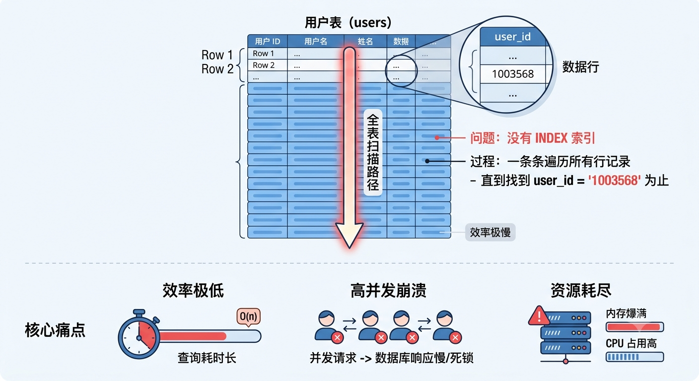
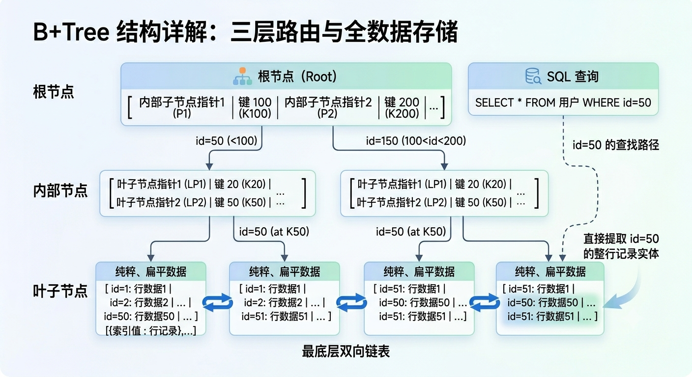
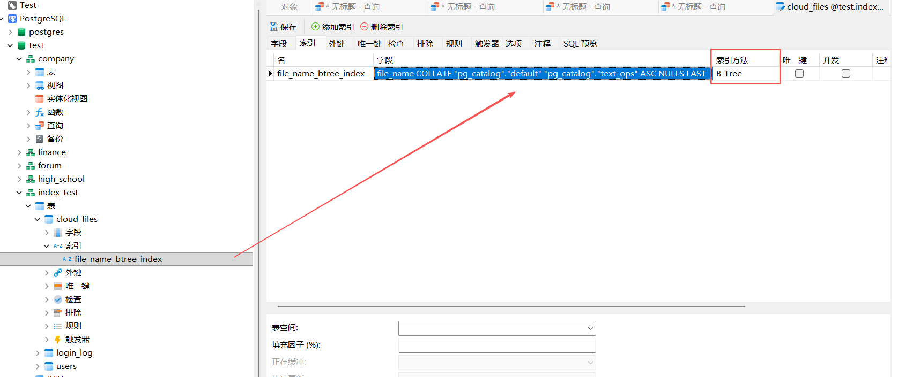
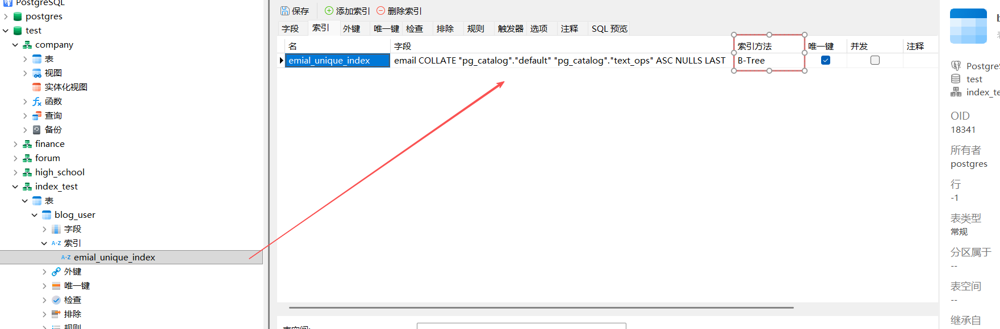

# `INDEX` 索引

核心要点：**`INDEX` 索引**是一种**表查询**的**性能优化手段**，用于**加速从表中检索行记录的速度**。

## 为什么需要索引？

### 全表扫描的核心痛点

​	在没有 `INDEX` 索引之前，数据库查找数据采用的是 **全表扫描（Full Table Scan）**，即**一条条遍历所有行记录，直到找到与 `WHERE` 查询条件匹配的行记录**为止。

> 假设有一张 `users` 表，表内存有一百万行记录，如果执行：
> ```postgresql
> SELECT * FROM users WHERE user_id = '1003568'
> ```
>
> 由于没有为 `user_id` 列建立一个 `INDEX` 索引，数据库得从第 1 行开始扫描，直到执行到第十几万条记录时，才找到 `user_id = '1003568'` 的行记录，这样的 SQL 查询效率会非常慢，尤其是在**高并发**场景下，每次都要执行这种**时间复杂度为 `O(n)`** 的 SQL 查询，会让数据库**服务器瞬间崩溃，内存爆满**。
>
> 

于是，便出现了 **`INDEX` 索引**的概念。

## `INDEX` 索引的出现

关键点：数据库可以针对**在 SQL 查询时，高频作为 `WHERE` 或其他过滤条件**的 **Column 目标列**，**建立**一个**结构简单、可实现快速检索**的**目录表**，**表内的映射关系即 `INDEX` 索引值 与 Column 目标列的指针（指向对应行记录）**。

### 核心价值

​	在**为指定 Columne 目标列建立 `INDEX` 索引**之后，数据库会通过特定的**数据结构**（通常是 **B+Tree 树结构**）**将表中指定 Columne 目标列的数据**全部**组织**起来**建立**一个**结构简单、可实现快速检索**的**“目录表”**，直接将查询的时间复杂度降低到 **`O(\log n)`**，极大地提升了查询速度。

​	**后续**再通过**该 Column 列作为 `WHERE` 过滤条件**进行 SQL **查询**时，数据库会**优先去 目录表（Index 索引）中查找**，并**利用 B+Tree 树结构**的**多路平衡查找**特性，以极快地速度**查找**到对应的**映射关系**，并**根据**此映射关系中的**「指针指向」**直接**跳到表中的对应行记录并提取出来**。


> [!IMPORTANT]
>
> 简而言之，在关系型数据库（如 PostgreSQL、MySQL）中，**索引（Index）** 就像是一本书的**目录**。
>
> - 如果没有目录，想找某个知识点就**必须通读整本书（全表扫描）**
> - 有了目录，就可以**先查到它在第几页，然后直接翻到对应位置（索引查找）**

### 核心数据结构（B+Tree）

#### 纵向三层级路由架构

绝大多数关系型数据库的默认索引类型都是 **B+ Tree（B+ 树）**。

可以把 **B+Tree 结构**理解为一个**多路平衡查找树**。通常分为以下 3 层**纵向的三层级路由架构**：

1. **根节点（Root）**：

   - **角色**：**全局查询的唯一入口，有且仅有一个**

   - **存储结构**：一组**由 ”边界范围键值“ 与 ”子节点指针“ 交替排列**组成的，可**动态递增**的**序列**。表示一个**顶层的 “边界范围”**

     - 底层直观模型：

       ```apl
       [ 内部子节点指针1 | 键 100 | 内部子节点指针2 | 键 200 | 内部子节点指针3 | ... ]
       # 0-100 的走这里			100-200 的走这里		  200-... 的走这里
       ```

       - 键 100、键 200：表示**能处理的 “范围边界”**

         > [!WARNING]
         >
         > ​	B+Tree 是**将表中某个列设定一个 `INDEX` 索引**，那么就会**根据表的整体行记录的数量**来**动态计算并递增 Root 根节点的 “范围边界”**。

       - **内部节点指针**：作为一个 **“路标”**，用于**导航到 “下游中” 缩短了一定范围的「内部子节点」**

     > 查找逻辑（二分查找法）：
     >
     > - 当拿着 `id=50` 时，发现 `50 < 100`，直接去 `<内部子节点指针1>` 导航到 “下游中” 缩短一定模糊范围的内部子节点
     > - 当拿着 `id=150` 时，发现 `100 < 150 < 200`，直接去 `<内部子节点指针2>` 导航到 “下游中” 缩短一定模糊范围的内部子节点

2. **内部子节点（Internal Nodes）**：

   - **角色**：由**「根节点」衍生并导航进入**，负责**“分流”**和**“缩小范围”**的**中间导航层节点**，可以**有多个**

   - **存储结构**：**与根节点一致**。表示一个**更缩小模糊范围的 “边界范围”**

     - 底层直观模型：

       ```apl
       [ 叶子节点指针1 | 键 20 | 叶子节点指针2 | 键 50 | 叶子节点指针3 | ... ]
       # 0-20 的走这里			 20-50 的走这里			 50-...的走这里
       ```

       - 键 20、键 50：表示**能处理的 “范围边界”**
       - **叶子节点指针**：作为一个 **“路标”**，用于**导航到 “下游中” 更具体范围的「叶子节点」**

     > 查找逻辑（二分查找法）：
     >
     > 当拿着 `id=50` 时：
     >
     > - 在根节点中：发现 `50 < 100`，直接去 `<内部子节点指针1>` 导航到 “下游中” 缩短一定模糊范围的内部子节点
     >   - 在内部节点中：发现 `20 < 50 < ...`，直接去 `<叶子节点指针3>` 导航到 “下游中” 更具体范围的叶子节点

3. **叶子节点（Leaf Nodes）**：

   - **角色**：

     - 由**中间层**的**某个内部子节点衍生**，表示**缩小搜索到更具体范围的最小子节点**
     - **实际存储数据的地方**，包含了**整张表（或索引字段）的全部数据，每个「叶子节点」**负责 **存储更具体范围** 的**行记录**

   - **存储结构**：**纯粹、扁平**的**键值对有序列表**

     ```apl
     [{索引值 : 行记录},...]
     ```

     - **键 Key：具体的、唯一的索引值**。（如 `id = 1`，`id = 2`）

     - **值 Value**：**索引值对应**的**整行记录数据**（聚集索引）或主键ID/行物理地址（二级索引）

     > 查找逻辑（**二分查找法**）：
     >
     > 当拿着 `id=50` 时：
     >
     > - 在根节点中：发现 `50 < 100`，直接去 `<内部子节点指针1>` 导航到 “下游中” 缩短一定模糊范围的内部子节点
     >   - 在内部节点中：发现 `20 < 50 < ...`，直接去 `<叶子节点指针3>` 导航到 “下游中” 更具体范围的叶子节点
     >     - 在子节点中：直接找到 `id=50` 的具体行记录实体并提取出来

   注：所有**最底层的叶子节点**通过**双向链表**相互**首尾连接（横向链表）**，极其适合范围扫描。


#### 查找机制（二分查找法）

> > [!NOTE]
> >
> > 假设 `users` 表整体有 300 行记录，那么 Root 根节点 与 内部子节点 则通常为：
> >
> > ```postgresql
> > -- Root 根节点
> > [ 内部子节点指针x | 100 | 内部子节点指针y | 200 | 内部子节点指针z | 300 ]
> > --  0-100 走这里		  100-200 走这里		  200-300 走这里
> > ```
> >
> > 因为 **B+Tree 是将表中某个列设定一个 `INDEX` 索引**，那么就会**根据表的整体行记录的数量**来**动态递增 Root 根节点的 “范围边界”**。
> >
> > 如果是 1000 记录，那么Root 根节点的范围边界可能就是 `[ 指针x | 200 | 指针y | 400 | 指针z | 600 | 指针m | 800| 指针n | 1000]`...以此类推。
>
> 假设有如下 SQL 查询语句：
>
> ```postgresql
> SELECT * FROM users WHERE "id" = 50;
> ```
>
> 拿着 `id = 50` 开始查找，整个过程都使用的是**二分查找法**：
>
> 1. 从根节点 Root 开始**分支判断**：
>
>    ```postgresql
>    -- Root 根节点
>    [ 内部子节点指针x | 100 | 内部子节点指针y | 200 | 内部子节点指针z | 300 ]
>    --  0-100 走这里		  101-200 走这里		  201-300 走这里
>    ```
>
>    判断 50 在哪个区间，发现在 `0-100` 的区间，则顺着 `内部子节点指针x` 去对应的内部子节点
>
> 2. 从 内部子节点x 继续**分支判断**：
>
>    ```postgresql
>    -- 内部子节点 x 
>    [ 叶子节点指针1 | 20 | 叶子节点指针2 | 50 | 叶子节点指针3 | 70 | 叶子节点指针4 | 100 ]
>    --  0-20 走这里		  21-50 走这里		  51-70 走这里		  71-100走这里
>    ```
>
>    判断 50 在哪个区间，发现在 `21-50` 的区间，则顺着 `叶子节点指针2` 去对应的叶子节点
>
> 3. 在 最底层的叶子节点中**直接定位**：
>
>    ```postgresql
>    -- 21-50 的叶子节点：
>    [
>        { 21: <行记录> },
>        { 22: <行记录> },
>        { 23: <行记录> },
>        ....
>        { 50: <行记录> }
>    ]
>    ```
>
>    直接定位到 `50` 这一行，提取到对应的行记录。
>
> 整个过程：原本需要遍历上百行的数据，通过 **B+Tree 靠二分查找法通常只需要 3~4 次就能定位成功**，而且数量越多优势越明显。



### 索引的利与弊

虽然 `INDEX` 索引能加速查询，但也绝对不是越多越好，它是一把双刃剑：

- **优势：**

  - 极大加快数据的**检索速度**（`SELECT`）
  - 分组（`GROUP BY`）**和**排序（`ORDER BY`）操作的加速效果显着

- **劣势：**

  - **空间成本**：索引需要**占用物理存储空间**

  - **时间成本**：当**对表进行 `INSERT、UPDATE、DELETE` 操作**时，数据库**不仅要修改数据**，**还要实时维护和调整 B+ Tree 的结构**，这会**降低写入数据操作的性能**

### 设计原则

**适合建索引的场景**：

- 经常出现在 `WHERE` 子句中的列
- 经常用于 `JOIN` 连接的关联列（如外键）
- 经常需要排序（`ORDER BY`）或分组（`GROUP BY`）的列

**不适合建索引的场景**：

- **数据量很小**的表（全表扫描可能比走索引还快）
- 经常需要**频繁更新的列**（随着需要频繁更新两套数据，一个是索引表、一个是数据表）
- **区分度极低**的列（例如“性别”列，只有男/女，建索引毫无意义）

## `CREATE INDEX` 创建一个索引

核心要点：只有**DBA【数据库管理员】和 表的属主（建立表的人）**才能权限建立 `INDEX` 索引。

> [!IMPORTANT]
>
> 核心要点：**`INDEX` 索引**是一个**独立于数据表之外的物理/逻辑对象**，它**有自己的存储结构**，核心是**以不同的数据结构（B+Tree、Hash...）存储相关的列、行记录**，以达到快速查找的效果。
>
> 所以，如果表记录很多的话（如上百万条，那么可能在建立索引会有一定的耗时）。

### 普通索引（B+Tree）

#### 基本语法

```postgresql
CREATE INDEX <索引名> ON <模式名>.<表名>(<列名1>);

-- 等价于

CREATE INDEX <索引名> ON <模式名>.<表名> USING btree (<列名1>); -- USING btree 使用 B+Tree 树结构的索引
```

核心作用：为**指定表的一个 Column 目标列**建立一个**底层数据结构为（B+Tree）**的 **`INDEX` 索引**。

#### `EXPLAIN ANALYZE` 测试查询耗时

这是数据库内部提供的一个测试代码，可以用来查看一条 `SELECT` SQL 查询的耗时以及查询方案...等信息。

```postgresql
EXPLAIN ANALYZE SELECT ...;
```

#### 示例

```postgresql
SET search_path TO index_test;
-- 1. 创建演示表
CREATE TABLE cloud_files (
    id BIGINT GENERATED BY DEFAULT AS IDENTITY PRIMARY KEY,
    file_name TEXT NOT NULL,
    file_type VARCHAR(20),
    created_at TIMESTAMPTZ DEFAULT NOW()
);

-- 2. 随机插入 100 万条模拟数据
INSERT INTO cloud_files (file_name, file_type)
SELECT 
    'file_' || i || '.pdf', 
    (ARRAY['video', 'image', 'doc'])[floor(random()*3)+1]
FROM generate_series(1, 1000000) s(i);

SELECT * FROM index_test.cloud_files;
/*
SELECT * FROM index_test.cloud_files;
   id    |    file_name     | file_type |          created_at
---------+------------------+-----------+-------------------------------
       1 | file_1.pdf       | video     | 2026-06-24 16:08:46.854903+08
       2 | file_2.pdf       | doc       | 2026-06-24 16:08:46.854903+08
       3 | file_3.pdf       | image     | 2026-06-24 16:08:46.854903+08
       4 | file_4.pdf       | doc       | 2026-06-24 16:08:46.854903+08
			 ......
 1000000 | file_4.pdf       | doc       | 2026-06-24 16:08:46.854903+08
*/

-- 测试查询耗时
EXPLAIN ANALYSE SELECT * FROM cloud_files WHERE file_name = 'file_999999.pdf'; 
-- "Seq Scan" (全表扫描) 耗时：30.828 ms

-- 为 file_name 列建立一个 B+Tree 索引
CREATE INDEX file_name_btree_index ON cloud_files(file_name);

-- 再次测试查询耗时
EXPLAIN ANALYSE SELECT * FROM cloud_files WHERE file_name = 'file_999999.pdf'; 
-- "Index Scan" (索引扫描) 耗时：0.163 ms
```

可以看出，建立了 `INDEX` 索引之后，仅依靠 `file_name` 列查询的速度从原先的 `30.808ms` 提高到了 `0.163ms` 快了约184倍！



### `INDEX` 索引的分类

#### 按物理存储分类

- **聚簇索引（Clustered Index / 聚集索引）【默认】**：
  - **特点**：索引的叶子节点直接存储了**实际的数据行**。也就是说，索引结构和数据存储是绑定在一起的
  - **限制**：一张表**有且只能有一个**聚簇索引（通常是主键）
  - **优势**：
    - 在**频繁查询的列**上建立聚簇索引**能够提高查询效率**。【**聚簇索引的查询效率是最高的**】
    - **经常更新的列不适合**建立**聚簇索引**
- **非聚簇索引（Secondary Index / 辅助索引 / 二级索引）**：
  - **特点**：索引的叶子节点不存储实际的数据行，而是存储**主键值**或者**指向数据行物理地址的指针**。
  - **回表查询**：如果通过辅助索引查到了主键，但查询语句还需要其他列，数据库就会拿着主键去聚簇索引里再查一次，这个过程叫**回表**。

```postgresql
CREATE INDEX <索引名> ON <模式名>.<表名>(<列名>); -- 普通索引

-- 等价于

CREATE CLUSTER INDEX <索引名> ON <模式名>.<表名>(<列名>); -- 聚簇索引
```

#### 按应用功能分类

按**不同应用功能**的维度，索引可以分为以下几种：

| **索引类型**                   | **描述**                                                     |
| ------------------------------ | ------------------------------------------------------------ |
| **主键索引 (Primary Key)**     | 建立在 **`PRIMARY KEY` 主键上的索引**，不允许重复，不允许为 NULL，**自动创建** |
| **唯一索引 (Unique Index)**    | 建立在 **`UNIQUE` 唯一约束列上的索引**，值必须唯一，但允许有 NULL 值，**手动/自动创建** |
| **普通索引 (Normal/Index)**    | 没有任何限制，纯粹为了加速查询                               |
| **复合索引 (Composite Index)** | 多个列组合在一起创建的一个索引。遵循**最左前缀法则**         |
| **覆盖索引 (Covering Index)**  | 一种**现象/优化状态**。如果查询列“恰好”都在索引里，不需要回表，就叫覆盖索引 |

##### `UNIQUE INDEX` 唯一索引

核心要点：当**一个表结构已经固定**时，若想要**为表中的某个列动态添加一个 `UNIQUE` 唯一约束**，可以通过**为其创建一个 `UNIQUE INDEX` 索引**来实现。

> [!IMPORTANT]
>
> ​	在 `CREATE TABLE` 创建表或者 `ALTER TABLE` 修改表字段的约束时，若**为一个目标列显示声明了 `UNIQUE` 唯一约束**，数据库会为**该目标列自动创建一个 `UNIQUE INDEX` 唯一索引**；
>
> ​	而 **`UNIQUE INDEX` 唯一索引的约束规则**是目标列【**值必须唯一，但允许有 NULL 值**】，这也正是 **`UNIQUE` 唯一约束的由来**。
>
> ```postgresql
> -- 用户表
> CREATE TABLE blog_user
> (
> 	user_id INTEGER PRIMARY KEY, -- 主键索引（自动创建）
> 	user_name TEXT,
> 	email TEXT UNIQUE -- 唯一索引（自动创建）
> );
> ```

###### 基本语法

```postgresql
CREATE UNIQUE INDEX <索引名> ON <模式名>.<表名>(<目标列名>); -- 默认使用 B+Tree 数据结构

-- 等价于

CREATE UNIQUE INDEX <索引名> ON <模式名>.<表名> USING btree (<目标列名>);
```

核心作用：**指定表的目标列添加了 `UNIQUE INDEX` 唯一索引之后，便会执行 `UNIQUE` 唯一约束规则（跨行的值必须唯一，但允许有 NULL 值）**。

###### 示例

```postgresql
-- 用户表
CREATE TABLE blog_user
(
	user_id INTEGER PRIMARY KEY, -- 主键索引（自动创建）
	user_name TEXT,
	email TEXT
);

-- 手动为 email 列创建一个唯一索引
CREATE UNIQUE INDEX emial_unique_index2 ON blog_user(email);

-- 添加一条数据
INSERT INTO blog_user (user_id, user_name, email) VALUES (100, '张三', '123456@qq.com');

-- ❌️添加一条相同邮箱的数据，会触发唯一索引（约束）的规则，拒绝插入
INSERT INTO blog_user (user_id, user_name, email) VALUES (101, '李四', '123456@qq.com');
```



##### 复合索引（多列）

###### 基本语法结构

```postgresql
CREATE INDEX <索引名> ON <模式名>.<表名> (<列名1>, <列名2>,...);
```

核心作用：同时**为指定表的多个目标列建立同一个 `INDEX` 索引**，能让数据库引擎**在 SQL 查询时快速定位同时匹配多个条件的记录**。

> 注意：**列的顺序很重要（遵循最左匹配原则）**，即**必须从最左侧字段开始匹配**。
>
> ```ini
> -- WHERE  <列名1>				   >> 模糊匹配
> -- WHERE  <列名1> AND <列名2>    >> 精确匹配
> -- WHERE  <列名2> 		       >> 索引效果失效
> ```

###### 最左匹配原则

> [!IMPORTANT]
>
> 如果为 `(id, name)` 建立了**复合索引**，它在索引树中的排序规则是：**先按照 `id` 排序；当 `id` 相同时，再按照 `name` 排序。**
>
> 基于这种有序的存储结构，查询时会出现以下两种情况：
>
> 1. **仅用 `id` 作为条件（前缀列） → 索引有效**
>    - 查询语句：`WHERE id = '001'`
>    - **结果**：**可以走索引。** 因为索引树的第一层排序就是 `id`，数据库可以直接利用索引树快速定位到 `id = '001'` 的区间。
> 2. **仅用 `name` 作为条件（非前缀列） → 索引失效（通常）**
>    - 查询语句：`WHERE name = '张三'`
>    - **结果**：**无法直接走索引查找。** 因为在整个索引树中，`name` 是分散在各个不同的 `id` 后面的，整体上是无序的。数据库无法通过二分查找快速定位，只能做全表扫描（或者全索引扫描）。
>
> **底层结构模型：**
>
> > [!NOTE]
> >
> > 可以把复合索引的内部 Key 想象成一个**多级字典**或者**联合排序的字符串**：
> >
> > - 它的物理存储结构更接近于：`Key = [id的值][name的值]`
> > - 如果提供 `id`，它能**匹配前缀（左边的列值）**
> > - 如果同时提供 `id` 和 `name`，它能**精准匹配**全部
> > - 如果只提供 `name`，由于前面的 `id` 缺失，它就无法在树状结构中进行范围定位

###### 示例

```postgresql
-- 员工表
CREATE TABLE emp
(
	emp_id INTEGER PRIMARY KEY, -- 员工ID
	emp_name TEXT,	-- 员工姓名
	department TEXT,	-- 所属部门
	join_date DATE DEFAULT CURRENT_DATE -- 入职时间
);


-- 随机插入 500 万条数据
INSERT INTO emp (emp_id, emp_name, department, join_date)
SELECT 
    -- 1. 生成 1 到 1000000 的连续自增 ID
    s.id AS emp_id,
    
    -- 2. 随机生成 3 个字母组成的员工姓名（例如 'abc'）
    substring(md5(random()::text), 1, 3) AS emp_name,
    
    -- 3. 从 4 个预设部门中随机分配一个
    (ARRAY['研发部', '市场部', '财务部', 'HR部'])[floor(random() * 4 + 1)] AS department,
    
    -- 4. 随机生成过去 5 年内（1825天）的一个入职日期
    CURRENT_DATE - (random() * 1825)::integer AS join_date
FROM generate_series(1, 5000000) AS s(id);


SELECT * FROM emp;
/*
 emp_id  | emp_name | department | join_date
---------+----------+------------+------------
       1 | 451      | 研发部     | 2023-08-12
       2 | 934      | 研发部     | 2024-06-15
       3 | e0d      | HR部       | 2026-02-03
 .....
 5000000 | 859      | HR部       | 2025-03-05
*/

-- 测试查询耗时，根据 department 所属部门 和 join_date 入职时间 两个列作为条件查询
EXPLAIN ANALYSE SELECT * FROM emp WHERE department = '研发部' AND join_date = CURRENT_DATE; 
-- "Seq Scan" (全表扫描) 耗时：424.057 ms

-- 为 department 所属部门 和 join_date 入职时间 两个列建立一个 复合 索引
CREATE INDEX composite_depart_join_index ON emp(department, join_date);

-- 再次测试查询耗时
-- 根据 department 所属部门 和 join_date 入职时间 两个列作为条件查询
EXPLAIN ANALYSE SELECT * FROM emp WHERE department = '研发部' AND join_date = CURRENT_DATE; 
-- "Bitmap Heap Scan" (位图堆扫描) 耗时：43.677 ms
```

可以看出，建立了 `INDEX` 复合索引之后，同一种查询的速度从原先的 `424.057ms` 提高到了 `43.677ms` 快了约10倍！

#### 按底层数据类型分类

在关系型数据库（特别是 PostgreSQL）中，根据**底层数据结构/算法**的不同，索引可以分为好几种类型。

不同的数据结构决定了它们擅长处理不同的**数据类型**和**查询场景**。以下是主流数据库中按底层数据结构分类的索引及其核心区别：

##### 基本语法

> [!IMPORTANT]
>
> 核心要点：**`INDEX` 索引**是一个**独立于数据表之外的物理/逻辑对象**，它**有自己的存储结构**，核心是**以不同的数据结构（B+Tree、Hash...）存储相关的列、行记录**，以达到快速查找的效果。
>
> - **B+ 树**具有**动态平衡**的优点，**HASH 索引**具有**快速查找**的优点。

可以通过在**创建 `INDEX` 索引**时，**使用 `USING xxx`** 关键字来**指定该 `INDEX` 索引使用的底层数据结构**：

```postgresql
CREATE INDEX <索引名> ON <模式名>.<表名> USING [btree | hash | gin | brin | gist] (<列名1>);
```

| **目标列数据类型**                          | **推荐底层索引** | **典型应用场景**                       |
| ------------------------------------------- | ---------------- | -------------------------------------- |
| **常规类型** (`INT`, `VARCHAR`, `DATETIME`) | **B-Tree**       | 绝大多数常规业务查询、排序、唯一性约束 |
| **文档/多值类型** (`JSONB`, `ARRAY`)        | **GIN**          | 动态配置查询、标签打标搜索、全文检索   |
| **空间/范围类型** (`GEOMETRY`, `RANGE`)     | **GiST**         | 地图 LBS 位置服务、订房时间段冲突校验  |
| **海量时序/流水数据** (TB级 `LOG`)          | **BRIN**         | 历史流水表大范围统计（用空间换性能）   |

###### 示例

假设有如下表：

```postgresql
-- 设备表
CREATE TABLE equipment
(
	equip_id INTEGER PRIMARY KEY, -- 设备ID
	equip_detail JSONB, -- 设备参数
	remarks TEXT	-- 备注说明
);


-- 1. 移除主键约束（或者建表时先不写 PRIMARY KEY）
-- 1. 移除主键约束（如果是空表，直接执行这步可以提速数倍）
ALTER TABLE equipment DROP CONSTRAINT IF EXISTS equipment_pkey;

-- 2. 执行 500 万条数据导入
INSERT INTO equipment (equip_id, equip_detail, remarks)
SELECT 
    s.id AS equip_id,
    
    -- 1) JSONB 保持结构化设备参数
    jsonb_build_object(
        'brand', (ARRAY['华为', '苹果', '小米', '戴尔', '联想'])[floor(random() * 5 + 1)],
        'model', 'Model-' || substring(md5(random()::text), 1, 5),
        'status', (ARRAY['online', 'offline', 'maintenance'])[floor(random() * 3 + 1)],
        'metrics', jsonb_build_object(
            'temperature', floor(random() * 40 + 40), 
            'cpu_usage', round((random() * 100)::numeric, 2)
        ),
        'is_active', random() > 0.2
    ) AS equip_detail,
    
    -- 2) 随机拼接出符合设备管理实际场景的中文备注
    (ARRAY['A区机房', 'B区机房', '边缘计算节点', '核心机房'])[floor(random() * 4 + 1)] || '-' ||
    (ARRAY['1号机柜', '3号机柜', '服务器架', '预备测试架'])[floor(random() * 4 + 1)] || '，' ||
    (ARRAY['近期已完成硬件升级。', '计划下周进行例行巡检。', '运行状态良好，暂无异常。', '注意：该设备温度近期偏高。'])[floor(random() * 4 + 1)] || 
    '（负责人 ID: ' || floor(random() * 100 + 1000) || '）' AS remarks

FROM generate_series(1, 5000000) AS s(id);

-- 3. 数据灌完后，重新一次性把主键索引建起来
ALTER TABLE equipment ADD PRIMARY KEY (equip_id);

SELECT * FROM index_test.equipment;
/*
equip_id |                                                                equip_detail                                                                 |                                remarks
----------+---------------------------------------------------------------------------------------------------------------------------------------------+------------------------------------------------------------------------
        1 | {"brand": "联想", "model": "Model-d63c9", "status": "online", "metrics": {"cpu_usage": 25.02, "temperature": 60}, "is_active": true}        | B区机房-1号机柜，注意：该设备温度近期偏高。（负责人 ID: 1072）
        2 | {"brand": "小米", "model": "Model-4a525", "status": "online", "metrics": {"cpu_usage": 56.51, "temperature": 54}, "is_active": true}        | B区机房-服务器架，运行状态良好，暂无异常。（负责人 ID: 1010）
...
*/
```

- 存储 **JSON 文档数据类型**的列：推荐**使用 `gin` 底层索引**：

  ```postgresql
  ----- JSONB 文档数据类型列 的查询测试 --------
  -- 测试查询耗时 ：筛选出每行的 equip_detail JSON数据列 中包含有 {"model": "Model-a1b2c"} 属性的行记录
  EXPLAIN ANALYSE SELECT * FROM equipment WHERE equip_detail @> '{"model": "Model-a1b2c"}'; 
  -- "Parallel Seq Scan" (并行全表扫描) 耗时：449.850 ms
  
  -- 为 equip_detail JSONB 数据类型列建立一个 GIN 索引
  CREATE INDEX jsonb_index ON equipment USING  gin (equip_detail);
  
  -- 再次测试查询耗时
  EXPLAIN ANALYSE SELECT * FROM equipment WHERE equip_detail @> '{"model": "Model-a1b2c"}'; 
  -- "Bitmap Heap Scan" (位图堆扫描) 耗时：0.517 ms
  ```
  
  可以看出，同一个查询，采用了 GIN 倒排索引的 SQL 查询速度从原先的 `449.850 ms` 提升高了 `0.517 ms` ，加快了870 倍！
  
- 存储 **大文本，用于全文搜索**的列：推荐**使用 `gin` 底层索引**：

  ```postgresql
  ----- 大文本数据类型列 的查询测试 -------- 常用于全文检索
  -- 测试查询耗时 ：筛选出每行的 remarks 大文本数据类型列 中包含有 '运行状态良好，暂无异常' 短文本 的行记录
  EXPLAIN ANALYSE 
  SELECT * FROM equipment WHERE remarks LIKE '%运行状态良好，暂无异常%';
  -- "Seq Scan" (全表扫描) 耗时：1161.22 ms
  
  -- 为 remarks 大文本数据类型列建立一个 GIN 索引
  -- 1. 激活系统自带扩展
  CREATE EXTENSION IF NOT EXISTS pg_trgm;
  
  -- 2. 为 remarks 建立支持 trgm 的 GIN 索引
  CREATE INDEX idx_remarks_trgm ON equipment USING gin (remarks gin_trgm_ops);
  DROP INDEX idx_remarks_trgm
  
  -- 再次测试查询耗时
  SET enable_seqscan = off;
  EXPLAIN ANALYSE 
  SELECT * FROM equipment WHERE remarks % '%运行状态良好，暂无异常%';
  SET enable_seqscan = on;
  -- "Bitmap Heap Scan" (位图堆扫描) 耗时：603.263 ms
  ```

##### 详细说明

###### B-Tree 平衡树索引（最通用）

B-Tree（在数据库中实际多为 B+ Tree）是绝大多数数据库默认的索引类型。它将数据按顺序组织在树状结构中。

- **支持的数据类型**：
  - 几乎所有可以**排序**的标准数据类型：整数（`INT`）、浮点数（`FLOAT`）、字符串（`VARCHAR`/`TEXT`）、日期时间（`TIMESTAMP`）。
- **擅长的查询场景**：
  - 精确等值查找（`=`）。
  - 范围查询（`>`, `<`, `BETWEEN`）。
  - 排序（`ORDER BY`）和分组（`GROUP BY`）。
  - 模糊查询的前缀匹配（`LIKE 'abc%'`）。
- **局限**：
  - 无法处理无序的数据（如 JSON 内部键值、数组元素）。
  - 对大文本、空间地理坐标支持极差。

###### GIN 倒排索引

GIN （Generalized Inverted Index，倒排索引）是**广义倒排索引**。传统 B-Tree 索引是一行数据对应一个索引项，而 GIN 索引是**一个数据项拆出多个元素，每个元素对应一组数据行的位置**。

- **支持的数据类型**：
  - **复合/多值数据类型**：数组（`ARRAY`）、`JSONB`、全文检索类型（`TSVECTOR`）。
- **擅长的查询场景**：
  - **包含与存在性查询**：
    - 查询 JSONB 中是否包含某个键值对（`data @> '{"status": "active"}'`）。
    - 查询数组中是否包含某个元素（`tags @> ARRAY['python']`）。
  - 全文搜索（搜索大段文本中的关键词）。
- **局限**：
  - **构建和更新成本极高**。因为插入或更新一行包含 10 个元素的数组，需要同时修改 GIN 树中的 10 个地方。不适合频繁写、少读的场景。

###### GiST 通用搜索树索引

GiST（Generalized Search Tree，通用搜索树）是一种高度抽象的通用平衡树索引，允许用户定义任意复杂的数据类型的存储结构和边界判定。

- **支持的数据类型**：
  - **多维/几何数据类型**：点（`POINT`）、线（`LINE`）、多边形（`POLYGON`）、三维空间数据、地理范围（`RANGE`，如时间段、数字范围）。
- **擅长的查询场景**：
  - **位置关系查询**：相交（Overlap）、包含、在...左边、在...附近。
  - **最近邻查询（KNN）**：例如“离我当前 GPS 坐标最近的 5 家餐馆”（`ORDER BY location <-> 'POINT(116 39)' LIMIT 5`）。
- **局限**：
  - 相比 B-Tree，GiST 的查找速度略慢，且构建索引的时间更长。

###### BRIN 块范围索引

BRIN （Block Range Index，块范围索引）是针对**海量数据**设计的。它不记录每一行数据的具体位置，而是记录磁盘上**一段连续数据块（Block Range）中的最小值和最大值**。

- **支持的数据类型**：
  - 物理存储顺序与逻辑顺序高度一致的**线性/时间序列数据**。例如：自动递增的主键（`ID`）、不断追加的日志时间（`created_at`）。
- **擅长的查询场景**：
  - 在拥有**数亿行**的大表上，查找某个时间段或范围的数据（`WHERE created_at >= '2026-01-01'`）。
  - **最大的优势是空间占用极小**：B-Tree 索引可能需要几百 GB，而 BRIN 只需要几百 MB。
- **局限**：
  - 如果数据在磁盘上是乱序插入的（没有物理关联性），BRIN 索引会彻底失效。

###### Hash 索引（哈希/散列索引）

通过哈希函数将列的值转换成哈希码，映射到哈希桶中。

- **支持的数据类型**：
  - 基本的标量数据类型。
- **擅长的查询场景**：
  - **纯粹的等值精确查找**（`=`）。在单行查找时，时间复杂度接近 $O(1)$，通常比 B-Tree 还要快一点点。
- **局限**：
  - **完全不支持范围查询、排序和部分匹配**（因为哈希值是无序的）。由于局限性太大，在开发中除了非常极端的等值加速，很少作为首选。

## `DROP INDEX` 删除索引

```postgresql
DROP INDEX <索引名>;
```

注：**删除索引时，系统会从数据字典（系统表）中删除有关该 `INDEX` 索引的描述**。

## 索引会 “失效” 的情况

| **场景**       | **错误示例 (会导致 Seq Scan)**             | **正确姿势**                           |
| -------------- | ------------------------------------------ | -------------------------------------- |
| **模糊查询**   | `WHERE file_name LIKE '%file_999%';`       | 只有“左前缀”匹配`file_999%` 才能用索引 |
| **函数操作**   | `WHERE UPPER(file_name) = 'FILE.PDF';`     | 建立**函数索引**或在查询前处理数据     |
| **类型不匹配** | `WHERE id = '123';` (id是数字，却传字符串) | 保持类型一致，避免隐式转换             |
| **最左匹配**   | 复合索引`(a, b)`只查`b`                    | 复合索引必须从最左侧字段开始匹配       |