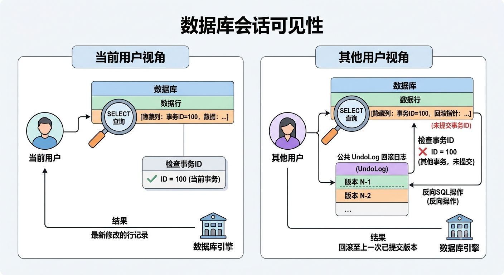
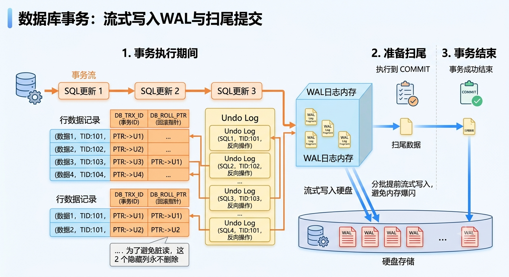
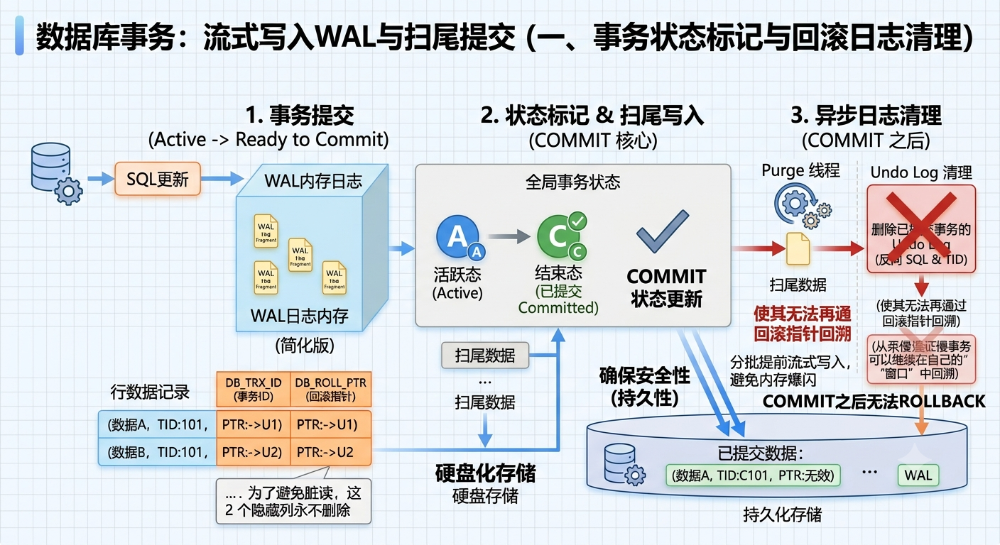
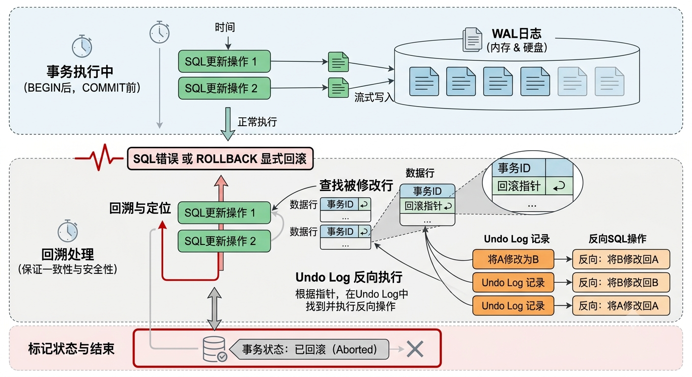
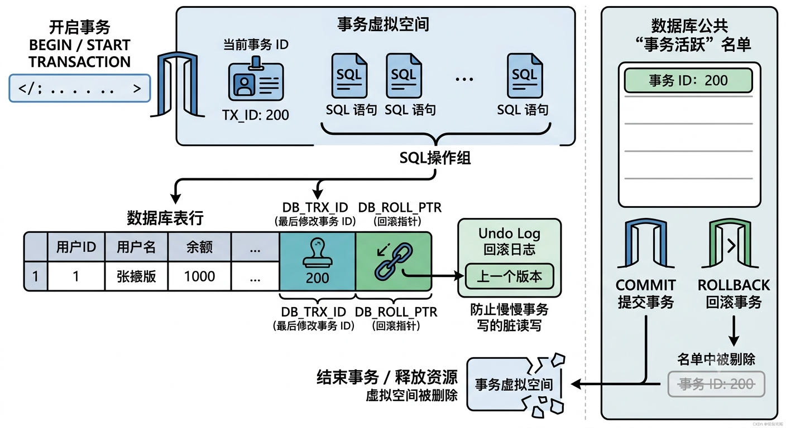
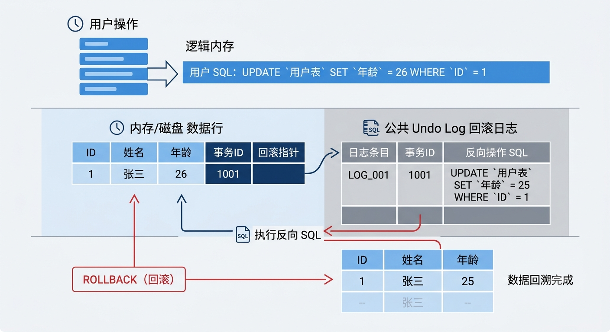
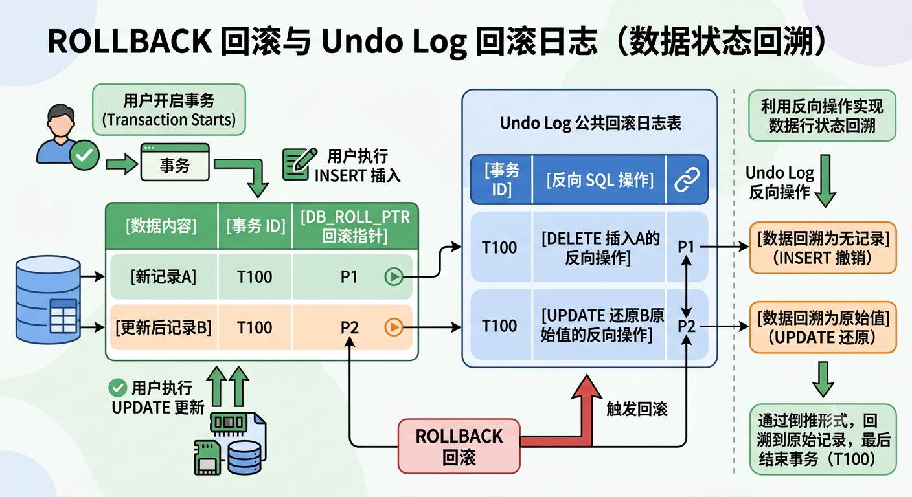
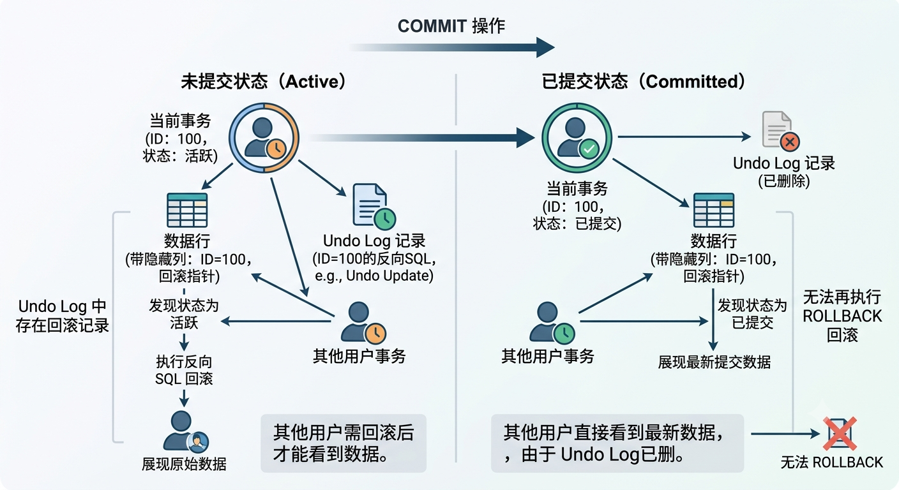
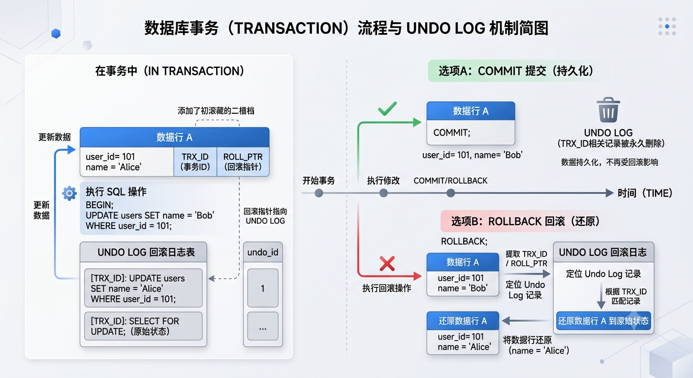
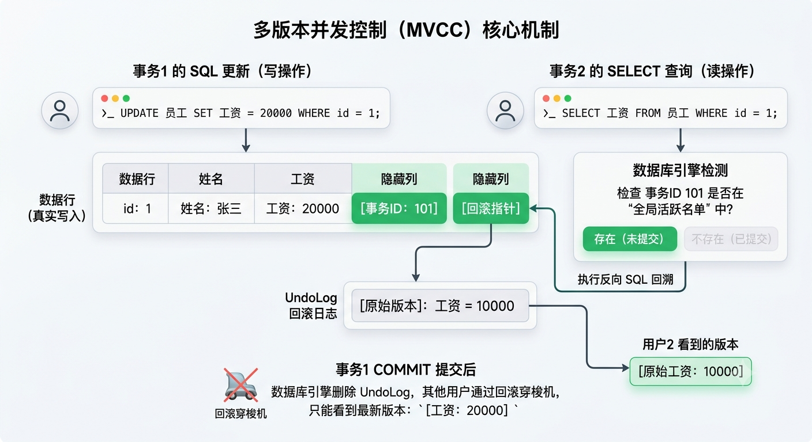

# `TRANSACTION` 事务

​	在 PostgreSQL 中，**事务（Transaction）**是**确保数据库数据一致性、安全性和可靠性的核心机制**。无论是处理高并发的电商系统，还是简单的银行转账，事务都扮演着至关重要的角色。

## 什么是事务？

- 核心要点：

  ​	**事务（Transaction）**被视为**一个基本工作单元**的**数据库操作序列**，即**一个事务工作单元中包含多段 SQL 语句的执行序列**。

### 核心特性（ACID）

事务会根据自身传统的 **ACID 特性**来**保证多段 SQL 语句逻辑在操作数据库数据时**的**一致性、安全性与可靠性。**

核心要点：**事务**是由**一系列对数据库的操作（读、写、修改...）组成**的一个**逻辑工作单元**。ACID 则是保证**事务（Transaction）可靠性**的一组**核心原则**。

> - **A - Atomicity（原子性）**：
>
>   ​	确保一个事务中的所有操作**要么全部成功完成，要么全部失败并且必须回滚**，它**绝不允许事务停留在某种“半完成”的状态**。确保了即使复杂操作期间发生错误，数据库也能**保持一致状态**。
>
> - **C - Consistency（一致性）**：
>
>   ​	确保**数据库在事务执行的前后**，都必须满足所有的**预设规则、约束和完整性**。事务只能**让数据库从一个“合法状态”转变到另一个“合法状态”**。
>
> - **I - Isolation（隔离性）**：
>
>   ​	当多个用户同时并发访问数据库时，隔离性确保**每个事务在提交前，对其他事务都是不可见或不干扰的**。每个事务都感觉自己是当前唯一正在运行的事务。
>
> - **D - Durability（持久性）**：
>
>   ​	确保一旦事务成功**提交（Commit）**，它**对数据库中数据的修改**就是**永久性**的。接下来的任何系统崩溃、断电或硬件故障，都不会导致这笔数据丢失。
>
> > ACID 的协同工作：
> >
> > - **成功时：** 满足**原子性**（所有步骤完成）、满足**一致性**（数据合法），经过**隔离**的执行，最终被**持久化**到磁盘
> > - **失败时：** 触发**原子性**的回滚，撤销所有操作，使数据库退回到事务开始前的**一致**状态

## TCL 事务控制语言

**TCL（Transaction Control Language）事务控制语言**：用于**控制事务的管理（提交执行、撤回恢复），以保证数据的一致性**。

> **事务（Transaction）**是**一组原子性的 SQL 操作**，它们要么**全部成功执行**，要么**全部失败回滚**，绝对不能停在中间状态。
>
> > 经典例子：银行转账
> >
> > 张三给李四转账 100 元，所产生的数据处理：
> >
> > 1. 张三的账户 +100 元
> > 2. 李四的账户 -100 元
> >
> > 这 2 个操作必须是同步进行的，要保证原子任务的一致性。如果第一步成功了，银行系统突然断电，第二步没有执行，导致意外出现，TCL 语言就是用于预防这种情况发生。
> >
> > 

关键的 TCL 命令：

| 命令                                    | 创建                                                         |
| --------------------------------------- | ------------------------------------------------------------ |
| **`BEGIN` / `START TRANSACTION;` 开启** | **开启一个事务的执行，以 `COMMIT` 结尾**                     |
| **`COMMIT` 提交**                       | 将**事务中操作的所有数据**都**提交**到数据库中**永久保存**。<br /><br />> **`COMMIT` 之后操作的数据**将**无法再 `ROLLBACK` 回滚**，所以一般**放置在末尾处执行** |
| **`ROLLBACK` 回滚**                     | **撤销当前事务中，所有未 `COMMIT` 提交的数据修改操作**，**恢复**到**事务开始前的状态** |
| **`SAVEPOINT` 保存点（可选）**          | **在事务中埋下一个 “存档点”**。<br /><br />> 当**事务执行过程出现问题**时，允许**选择性地 `ROLLBACK` 回滚到某一个特定的 `SAVEPOINT` “存档点”** |

> 示例：
>
> ```postgresql
> -- 1. 开启一个事务
> START TRANSACTION; -- 或者 BEGIN ... END;
> 
> -- 2. 执行第一步：张三扣款
> UPDATE accounts SET balance = blance - 100 WHERE name = '张三';
> 
> -- 3. 设置一个保存点（可选）
> SAVEPOINT point1;
> 
> -- 4. 执行第二步：李四入账
> UPDATE accounts SET balance = balance + 100 WHERE name = '李四';
> 
> -- 5. 假设上一条命令出现问题，则在 Try catch 异常处理逻辑中进行回滚
> -- 完全失败，执行: ROLLBACK（回滚到开启事务前的状态）
> -- 只撤销第二步：ROLLBACK TO point1;
> 
> -- 6. 如果一切顺利，最后提交，数据永久生效，无法再 ROLLBACK 撤回
> COMMIT;
> ```

### `BEGIN` / `START TRANSACTION` 开启一个事务

> [!IMPORTANT]
>
> ​	**`BEGIN`** 和 **`START TRANSACTION`** 都可以用来**开启一个事务的执行**，只不过前者是 PostgreSQL 比较常用的简写写法，而后者是标准SQL 写法（二者选其一）。

核心作用：**开启一个事务的虚拟执行空间**，此后**所有的 SQL 语句都会作为一个组，直到遇到 `COMMIT` 提交 或 `ROLLBACK` 回滚**。

> 注意：如果在 PostgreSQL 中连续输入两次 `BEGIN; BEGIN;`，数据库只会报一个 `WARNING: there is already a transaction in progress`（当前已有事务在进行）。

#### 会话可见性

> [!WARNING]
>
> 注：在事务中，**执行的任何 SQL 操作**都是**真实写入到内存与磁盘中**的，只不过数据库引擎是**根据当前事务的状态（是否 `COMMIT` 提交）**来**决定其他用户的事务中是否能够查看到库表的最新记录**（通过 **`Undo Log` 回滚日志**）。

每一个用户的事务，都相当于是一个 “快照”，**不同的 “快照” 有不同的用户视角**：

- **当前会话/连接的用户视角（当前事务）**

  ​	事务在**未 `COMMIT` 提交之前执行 `SELECT` 查询操作**时，**数据库引擎检查**到被查询的**数据行后面的隐藏列（事务ID）**是**当前用户所开启的当前事务**，即**当前连接的用户自己修改**的，那么就会**把最新修改的行记录返回给该用户**。

- **其他会话/连接的用户视角（其他事务）**

  ​	在事务中**执行 `SELECT` 查询**时，**数据库引擎检查**到被查询的**数据行后面的隐藏列（事务ID）是其他用户所开启的事务**，那么就会**拿着**该数据行的**「回滚指针」去查询公共 `UndoLog` 回滚日志**，**执行**一次针对该数据行的**反向SQL操作**，**回滚到上一次未 `COMMIT` 提交更新的原始版本记录**，然后**展示给其他用户看**。

> 💡 **大白话解释：** > 这就像你在本地写草稿。你自己（当前会话）看屏幕，草稿纸上已经有字了；但只要你没点“发送”（COMMIT），别人（其他会话）就看不到这份草稿。



这一切都是通过 **MVCC（多版本并发控制）**机制来实现的。

##### 验证

同时开 2 个查询窗口：

- 查询窗口1（执行 `INSERT` 更新操作）：

  ```postgresql
  BEGIN; -- 开启一个事务，此后的所有 SQL 语句都将会作为一个组，直到遇到 COMMIT 或 ROLLBACK 才会结束当前事务的执行
  
  -- 写入一条数据到内存/硬盘中，会自动在 user 表的所有行记录末尾处添加 2 个隐藏列（当前事务ID，回滚指针）
  INSERT INTO users(user_id, user_name, skills) VALUES (1, 'Jack', ARRAY['Python', 'JavaScript']);
  
  -- 立即查询
  SELECT * FROM transaction_test.users; 
  /*
   user_id | user_name | 				 skills           |
  ---------+-----------+--------------------------+
  	  1    |   Jack    | {Python,Java,JavaScript} |
  */
  ```

- 查询窗口2（执行 `SELECT` 查询操作）：

  ```postgresql
  BEGIN;
  SELECT * FROM transaction_test.users; 
  -- 数据库会查看 users 表中所有行记录的隐藏列（当前事务ID，回滚指针），根据事务ID是否存在于 “事务活跃名单”中
  -- 若该事务ID对应的事务状态还是 “活跃态”（未 COMMIT 提交）则返回该表所有行记录的最新版本
  /*
   user_id | user_name | skills
  ---------+-----------+--------
  */
  ```

### `COMMIT` 提交

#### 核心流程

##### 一、流式写入WAL、扫尾提交

1. 在 **`BEGIN` 开启一个事务之后，`COMMIT` 提交之前**的**事务执行期间**；

2. 事务中的**所有 SQL 更新操作**都是**一条条、分批提前输入 WAL 日志内存中**，并**随着任务进度流式写入硬盘中**

3. 在此期间：

   - **每条 SQL 更新操作的库表行记录**都会在**末尾处自动添加 2 个隐藏列（事务ID、回滚指针）**

     - **`DB_TRX_ID`**：最后一次修改本行数据的**事务 ID**（自增的数字）
     - **`DB_ROLL_PTR`**：**回滚指针**，指向**这条数据**在 `Undo Log` 回滚日志里的**上一个版本**

     > 以上2 个隐藏列之所以**永不删除**，是**因为可能存在其他慢事务在未来也要读写该数据行记录**，为了避免 **“脏读写”**，即**一个快事务修改并提交了同一数据行记录，另一个慢事务读取到了修改后的数据**，这个行数据就是 **“脏数据”**。

   - 为**每条 SQL 更新操作**，**在 `Undo Log` 回滚日志中添加上对应的 反向 SQL 操作 及 事务ID**，便于**后续 `ROLLBACK` 回滚状态**

4. 直到**执行到 `COMMIT`** ，将**最后一点数据扫尾写入**，事务才算**真正结束**

> 这是为了避免全部数据都写入 WAL 内存中，而导致 WAL 内存瞬间爆闪所采用的**缓和写入策略**。



##### 二、事务状态标记、异步清理回滚日志

- **`COMMIT`** 的核心任务是**确保安全性（持久性）和事务状态标记**。

###### 执行过程

1. 当事务执行到 `COMMIT` ，**把最后一点 SQL 更新操作的数据行扫尾写入到 WAL 内存之后**
2. 会将**当前事务状态**，从 **“活跃态（Active）” 改为 “结束态（已提交 Committed）”**，并**同步更新到 “全局事务活跃” 名单中**，将已结束的事务**剔除**
3. 通过**（Purge 线程）异步清理 `Undo Log` 回滚日志中所记录的每条反向 SQL 更新操作 及 事务ID**：
   - 使这些 **`COMMIT` 提交之后的数据行记录**，**无法再通过 `ROLLBACK` 回滚**
   - 同时**保证一些正在运行的慢事务**还可以**在它自己的 “窗口” 中进行回溯，执行一些必要的 SQL 修改操作**

> [!IMPORTANT]
>
> 这也是**为什么 `COMMIT` 之后，便无法再 `ROLLBACK` 回滚**的实际原因：
>
> ​	因为 **`Undo Log` 回滚日志记录已被删除**，**回滚指针失效**，**其他用户**已经**无法再通过「回滚指针」来执行反向 SQL 操作**，来**倒退回溯该数据行的原始状态**了。



#### 整体过程

```css
[ BEGIN 开启事务 ]
       │
       ▼
[ 执行多条 SQL 更新 ] ──(流式流转)──► 1. WAL 日志一条条、分批流入内存，并流式刷入硬盘。
       │                            2. 行记录打上当前 TRX_ID 和 ROLL_PTR 指针。
       │                            3. Undo Log 生成反向操作，写入回滚缓冲区。
       ▼
[ 执行 COMMIT 扫尾 ]
       │
       ├─► 1. 强制刷盘：把最后的 COMMIT 标记和残余 WAL 强行 fsync 进硬盘。
       ├─► 2. 状态变更：事务状态从 Active 变为 Committed，从全局活跃事务名单中剔除。
       └─► 3. 标记 Undo：将该事务的 Undo Log 标记为“可清理”，但【不立刻物理删除】。
       │
       ▼
[ 客户端收到成功响应 ]（此时事务真正结束，数据具备持久性，且不可被 ROLLBACK）
       │
       ▼
[ 后台 Purge 线程异步扫尾 ] ──► 当所有慢事务都离开后，彻底物理删除 Undo Log，释放磁盘空间。
```

#### 验证

同时开 2 个查询窗口：

- 查询窗口1（执行 `INSERT` 更新操作）：

  ```postgresql
  BEGIN; -- 开启一个事务，此后的所有 SQL 语句都将会作为一个组，直到遇到 COMMIT 或 ROLLBACK 才会结束当前事务的执行
  
  -- 会自动在 user 表的所有行记录末尾处添加 2 个隐藏列（当前事务ID，回滚指针）
  INSERT INTO users(user_id, user_name, skills) VALUES (1, 'Jack', ARRAY['Python', 'JavaScript']);
  INSERT INTO users(user_id, user_name, skills) VALUES (2, 'Jack', ARRAY['CSS', 'VUE']);
  INSERT INTO users(user_id, user_name, skills) VALUES (3, 'Jack', ARRAY['React', 'HTML']);
  INSERT INTO users(user_id, user_name, skills) VALUES (4, 'Jack', ARRAY['Redis', 'Node.js']);
  -- 以上 SQL 更新操作会一条条分批、提前写入到 WAL 预写日志中，并流式写入硬盘中
  
  -- 提交，事务结束
  COMMIT;
  
  
  -- 立即查询
  SELECT * FROM transaction_test.users;
  /*
   user_id | user_name |       skills
  ---------+-----------+---------------------
         1 | Jack      | {Python,JavaScript}
         2 | Jack      | {CSS,VUE}
         3 | Jack      | {React,HTML}
         4 | Jack      | {Redis,Node.js}
  */
  ```

- 查询窗口2（执行 `SELECT` 查询操作）：

  ```postgresql
  BEGIN;
  SELECT * FROM transaction_test.users; 
  -- 数据库会查看 users 表中所有行记录的隐藏列（当前事务ID，回滚指针），根据事务ID是否存在于 “事务活跃名单”中
  -- 若该事务ID对应的事务状态已为 “结束态”（已 COMMIT 提交）则返回该表所有行记录的最新版本
  /*
   user_id | user_name |       skills
  ---------+-----------+---------------------
         1 | Jack      | {Python,JavaScript}
         2 | Jack      | {CSS,VUE}
         3 | Jack      | {React,HTML}
         4 | Jack      | {Redis,Node.js}
  */
  ```

### `ROLLBACK` 回滚

- **`ROLLBACK`** 的核心任务是**确保数据一致性、安全性和事务状态标记**。

##### 执行流程

1. 在 **`BEGIN` 开启一个事务之后，`COMMIT` 提交之前**的**事务执行期间**；

2. 事务中的**所有 SQL 更新操作**都是**一条条、分批提前输入 WAL 日志内存中**，并**随着任务进度流式写入硬盘中**

3. 如果**在事务执行期间**，某一条 SQL 更新操作发生**错误**，或者**显式执行了 `ROLLBACK` 回滚操作**

4. 那么就会进行**回溯处理**，来保证**数据的一致性与安全性**：

   1. 根据 **`ROLLBACK` 当前代码行位置**，以**倒退**的形式**往前回溯**

   2. **找到**在此之前**所有 SQL 更新操作的被修改行记录**

   3. **提取**出被修改行记录的**隐藏列（事务ID、回滚指针）**

   4. 根据**回滚指针**，**去 `Undo Log` 回滚日志**中**找出对应**的**反向 SQL 操作并执行**，使**该数据行记录回滚到修改之前的原始状态**

      >数据库引擎会根据用户执行的 DML 操作类型，生成不同格式的 Undo Log 记录：
      >
      >- **`INSERT` 操作**：因为新插入的一行原本是不存在的，所以回滚时只需要把这行删掉。因此，Undo Log 里主要记录了这行数据的**主键（Primary Key）**。回滚时，直接**根据主键执行一条逻辑上的 `DELETE` 删除掉原本不存在的这一行即可**。
      >- **`DELETE` 操作**：删除一行意味着**回滚时需要把它插回来**。因此，Undo Log 里会记录**这行数据被删除前的完整内容**。回滚时，利用这些内容执行一条逻辑上的 `INSERT`。
      >- **`UPDATE` 操作**：修改数据时，情况稍微复杂一点：
      > - **如果没有修改主键**，Undo Log 会记录**被修改字段的旧值（Old Value）**。**回滚时，把这些字段改回旧值**。
      > - **如果修改了主键**，它的底层实质上是**先 `DELETE` 旧记录，再 `INSERT` 新记录**。因此会产生对应的两条反向逻辑记录。

5. 最后标记事务状态为 **“已回滚（Aborted）”**，**结束当前事务**



##### 验证

```postgresql
BEGIN; -- 开启一个事务，此后的所有 SQL 语句都将会作为一个组，直到遇到 COMMIT 或 ROLLBACK 才会结束当前事务的执行

INSERT INTO users(user_id, user_name, skills) VALUES (1, 'Jack', ARRAY['Python', 'JavaScript']);
INSERT INTO users(user_id, user_name, skills) VALUES (2, 'Jack', ARRAY['CSS', 'VUE']);
-- 以上 SQL 更新操作会一条条分批、提前写入到 WAL 预写日志中，并流式写入硬盘中

ROLLBACK; -- 遇到 ROLLBACK，以上 SQL 的更新都会回滚到更新之前的状态，并结束事务，后续的代码都与该事务无关
--==========================================事务空间=========================================================--

-- 这里的 SQL 更新操作并不属于事务内的操作，它只是简单的 SQL 逻辑
INSERT INTO users(user_id, user_name, skills) VALUES (3, 'Jack', ARRAY['React', 'HTML']);
INSERT INTO users(user_id, user_name, skills) VALUES (4, 'Jack', ARRAY['Redis', 'Node.js']);


-- COMMIT; -- 注意：这里是无效的，因为事务已经被上面的  ROLLBACK 结束了！

-- 立即查询
SELECT * FROM transaction_test.users;
/*
 user_id | user_name |       skills
---------+-----------+---------------------
       3 | Jack      | {React,HTML}
       4 | Jack      | {Redis,Node.js}
*/
```

### 事务保存点

#### `ROLLBACK` 的核心痛点（资源浪费）

> [!NOTE]
>
> 在默认情况下，数据库的事务遵循 **“全有或全无”** 的**原子性核心原则**。
>
> ​	如果事务中的**某一条 SQL 语句报错**，**整个事务都会进入 “终止态”（Aborted），后续所有的 SQL 语句都会失效**，只能选择使用 **`ROLLBACK` 回滚整个事务**；
>
> ​	这对于一个**大批量操作 SQL 数据的长事务**来说，会造成**一定不必要的 I/O 资源浪费**❌️。（有些 SQL 语句是正常的，没必要回滚）
>
> 于是，便出现了 **事务保存点（SavePoint）**和**部分回滚（Partial Rollback）**的概念✅️。

#### 核心概念与作用

在 PostgreSQL 中，**事务保存点（SavePoint）**和**部分回滚（Partial Rollback）**是**处理复杂长事务**时的核心控制工具。

核心作用：数据库允许通过 **`SAVEPOINT` 在一个长事务**中**创建若干个 “检查点”**，如果**后续的 SQL 操作发生错误时**，可以通过 **`ROLLBACK TO SAVEPOINT` 命令选择只回滚到某个 “检查点”**，剔除掉出错的 SQL 语句，保留正常的 SQL 语句，而**无需废弃整个事务**。

###### 基本概念

> [!IMPORTANT]
>
> **什么是保存点（SavePoint）？**
>
> > [!NOTE]
> >
> > **`SAVEPOINT`** 是**事务内部的一种特殊标记**，可以理解为一个 “存档点”：
> >
> > - 可以**在事务执行期间的任何时候，创建多个 “检查点”**
> > - `SAVEPOINT` 保存点**不会提交任何数据到数据库**，只是**在当前事务的执行历史周期上插上一个 “标记”**，也可以理解为是一个事务的 **“快照”**
>
> **什么是部分回滚（Partial Rollback）？**
>
> > [!NOTE]
> >
> > 当**事务中的某一条 SQL 语句操作失败**时，或者**根据业务逻辑不再需要执行后续的 SQL 语句操作**时，可以**使用 `ROLLBACK TO SAVEPOINT` 命令回滚到某个 `SAVEPOINT` “保存点”**：
> >
> > - **作用**：**撤销**从 **`SAVEPOINT` 该保存点之后**的所有 SQL 语句操作**对数据库的修改**，让**事务状态回到 `SAVEPOINT` 保存点建立时的那一刻**
> > - 关键点：**`SAVEPOINT` 保存点之前的 SQL 操作依然有效**，且**事务依然处于 “活跃态”**，可以**继续执行新的 SQL 语句并 `COMMIT` 提交**


###### 主要应用场景

- **批量数据处理：** 批量插入 10000 条数据，如果第 5000 条报错，不希望前 4999 条被白白回滚。
- **错误容忍与重试：** 尝试执行某项可能失败的操作（如插入冲突），如果失败则捕获错误、回滚到保存点，然后执行备用逻辑。
- **复杂业务流程：** 包含多个可选步骤的事务，根据前一步的结果动态决定是否撤销某一部分。

#### 语法结构

PostgreSQL 提供了三个核心命令来管理保存点：

- **创建保存点：** **`SAVEPOINT savepoint_name;`**

- **回滚到保存点（部分回滚）：** **`ROLLBACK TO SAVEPOINT savepoint_name;`**

- **释放保存点：** **`RELEASE SAVEPOINT savepoint_name;`**

  > 注意：**`RELEASE` 并不是提交数据**，而是**销毁这个保存点标记（释放内存）**。**一旦释放，就不能再回滚到这个保存点了，但它之后的操作依然保留。**

```postgresql
BEGIN;
--============================================================

-- SQL 语句（SQL 操作会保留）

SAVEPOINT <保存点A>; -- 创建一个保存点，一旦回滚到此处，后续的所有 SQL 操作将会失效！

-- SQL 语句（SQL 操作会失效）

ROLLBACK TO SAVEPOINT <保存点A>; -- 部分回滚到【保存点A】处


RELEASE SAVEPOINT <保存点A>; -- 释放【保存点A】，后续无法再使用 ROLLBACK TO SAVEPOINT <保存点A>; 进行部分回滚

--============================================================
COMMIT; -- 提交
```


##### 示例

假设有以下表：

```postgresql
CREATE TABLE accounts
(
	id INT PRIMARY KEY, -- 账户ID
  name VARCHAR(50), -- 账户名
  balance NUMERIC -- 账户余额
);


-- 插入数据
INSERT INTO accounts VALUES (1, 'Alice', 1000), (2, 'Bob', 500);

SELECT * FROM transaction_test.accounts;
/*
 id | name  | balance
----+-------+---------
  1 | Alice |    1000
  2 | Bob   |     500
*/
```

通过一个**银行转账与手续费扣除**的模拟场景来演示：

```postgresql
-- Alice 向 Bob 转账，并尝试扣除手续费
-- 转账必须成功。手续费扣除如果因为余额不足而失败，不能影响转账本身。

BEGIN; -- 1. 开启事务

-- 2. 正常执行的SQL语句：Alice 向 Bob 转账 200元
UPDATE accounts SET balance = balance - 200 WHERE name = 'Alice';
UPDATE accounts SET balance = balance + 200 WHERE name = 'Bob';

SAVEPOINT transfer_done; -- 3. 创建一个保存点，表示转账的操作必须成功

-- 4. 会发生错误的 SQL 语句（扣除 Alice 的手续费 900 元，但是 900 - 800, 会发生负数错误）
UPDATE accounts SET balance = balance - 900 WHERE name = 'Alice';
-- 这里的 SQL 代码将会失效！（保留转账成功的操作结果，去除扣除手续费的 SQL 操作）

ROLLBACK TO SAVEPOINT transfer_done; -- 5. 部分回滚到 transfer_done "保存点" 处，回到转账成功之后的状况


-- 6. （可选）此时可以继续做其他操作，比如记录一条“手续费欠费日志”
-- UPDATE accounts SET balance = balance - 10 WHERE id = 1; -- 改扣 10 元

COMMIT; -- 7. 提交，事务结束

-- 查看结果
SELECT * FROM transaction_test.accounts;
/*
 id | name  | balance
----+-------+---------
  1 | Alice |     800  		<--- 转账的 SQL 操作成功了，但扣除手续费的 SQL 操作失效了
  2 | Bob   |     700
*/

-- 整个事务没有因为中间的扣款失败而整体崩溃。
```

#### 💡核心注意事项

1. **性能开销：** 频繁创建大量的保存点会消耗 PostgreSQL 的内存和事务 ID 资源（子事务）。在循环中处理数百万级数据时，建议适度 `RELEASE` 已经不需要的保存点，或者分批提交。
2. **锁的释效：** 当你执行 `ROLLBACK TO SAVEPOINT` 时，在保存点之后获取的**行锁**会被释放，但有些**表级锁**可能会一直持有直到整个事务结束。
3. **应用层框架的实现：** 很多主流 ORM（如 Hibernate, Sequelize, SQLAlchemy）中的“嵌套事务（Nested Transactions）”在底层其实就是通过 PostgreSQL 的 `SAVEPOINT` 来实现的。

### 事务的底层生命周期

#### `BEGIN / START TRANSACTION` 开启事务

​	在使用 **`BEGIN / START TRANSACTION` 开启一个事务**时，数据库引擎会在**当前代码行位置创建一个虚拟逻辑空间**，并基于这个虚拟空间**新建一个标识符**，表示**当前事务ID**，同时当前事务状态处于 **“活跃态”**。

​	在当前事务空间中，**后续的所有 SQL 操作都会默认视为一个 “组”**，当执行 ”组“ 内的**某条 SQL 语句操作库表数据行**时，会**在修改后的数据行记录末尾处自动添加上永不删除的 2 个隐藏列**：

- **`t_cid`**：最后一次修改本行数据的**事务 ID**（自增的数字）

- **`t_ctid`**：**回滚指针**，指向**这条数据**在 `Undo Log` 回滚日志里的**上一个版本**

  > 以上2 个隐藏列之所以**永不删除**，是**因为可能存在其他慢事务在未来也要读写该数据行记录**，为了避免 **“脏读写”**，即**一个快事务修改并提交了同一数据行记录，另一个慢事务读取到了修改后的数据**，这个行数据就是 **“脏数据”**。

​	直到**遇到 `COMMIT` 提交 / `ROLLBACK` 回滚并结束事务**后，该虚拟空间就会被**删除**。

> 在**整个数据库**中，多个用户开启的**多个事务会被记录到一个公共的全局“事务活跃”名单中**，直到 **`COMMIT` 提交 / `ROLLBACK` 回滚并结束事务**后，**该 “活跃事务”** 就会**在 全局“事务活跃”名单（Read View）中被剔除**。



#### `ROLLBACK` 回滚与 `Undo Log` 回滚日志

​	**每一个数据库**中都会有一张**公共的 `Undo Log` 回滚日志表**，当每一个用户所开启的**事务中对某个库表数据行进行修改 SQL 操作**之后，`Undo Log` 会**存储该修改 SQL 操作对应的「反向 SQL 操作」与「事务ID」**，用于**后续 `ROLLBACK` 回滚**时，针对某些库表**数据行原始版本**的**回溯操作**。

##### 具体说明

​	在每个用户所开启的事务中，**任何对于库表数据行的 SQL 更新操作**其实都是**真实的写入到了内存与磁盘中**，只不过数据库引擎会在所有**被修改的库表数据行后面自动添加上 2 个隐藏列（事务ID、回滚指针）** ，相当于是一个**该数据行**的**最新版本标签（Tag）**；

​	并且会**在公共的 `Undo Log` 回滚日志**中**写下一条针对这个数据行的反向 SQL 操作**：

> 【比如用户在某个事务ID内针对某个库表中某条数据行写的是 `INSERT` \ `UPDATE` 更新操作，那么 `Undo Log` 公共回滚日志就会同时写下一条 `[事务ID、DELETE\UPDATE 的反向操作SQL语句]`】

​	以便于**后续**事务中 **`ROLLBACK` 回滚时**，**根据**当前**行记录**的 `DB_ROLL_PTR`（**回滚指针**）**精准定位**到 `Undo Log` 公共回滚日志里的**反向操作日志**，并**执行该数据行的反向 SQL 语句操作**，以**倒推回去**的形式，**回溯**到该数据**行的原始记录**，最后**根据**该数据行的**事务ID 结束对应的事务**。

> [!WARNING]
>
> **`Undo Log` 回滚日志里到底存了什么？**
>
> 数据库引擎会根据用户执行的 DML 操作类型，生成不同格式的 Undo Log 记录：
>
> - **`INSERT` 操作**：因为新插入的一行原本是不存在的，所以回滚时只需要把这行删掉。因此，Undo Log 里主要记录了这行数据的**主键（Primary Key）**。回滚时，直接**根据主键执行一条逻辑上的 `DELETE` 删除掉原本不存在的这一行即可**。
> - **`DELETE` 操作**：删除一行意味着**回滚时需要把它插回来**。因此，Undo Log 里会记录**这行数据被删除前的完整内容**。回滚时，利用这些内容执行一条逻辑上的 `INSERT`。
> - **`UPDATE` 操作**：修改数据时，情况稍微复杂一点：
>   - **如果没有修改主键**，Undo Log 会记录**被修改字段的旧值（Old Value）**。**回滚时，把这些字段改回旧值**。
>   - **如果修改了主键**，它的底层实质上是**先 `DELETE` 旧记录，再 `INSERT` 新记录**。因此会产生对应的两条反向逻辑记录。

- 本质上如何**利用反向操作（Undo Log）**来实现**数据行的原始状态回溯**。





#### `COMMIT` 提交/结束事务

​	**`COMMIT`** 的**实际作用**：**将事务从 “活跃态 Active” 状态改为 “结束态（已提交 Committed）”**，**删除公共 `Undo Log` 回滚日志**中**所有被修改行的相关记录（反向 SQL 操作、事务ID）**。

- **“活跃态（Active）”**：

  当前事务还**未 `COMMIT` 提交**，**事务 ID 处于全局“事务活跃”名单（Read View）中**。

  > [!IMPORTANT]
  >
  > 当**其他用户的事务来操作该事务中修改的数据行记录**时，会先**提取该数据行末尾处的隐藏列（事务ID、回滚指针）**
  >
  > - 根据**事务ID**查看该事务是否为 “活跃态“，**发现是 ”活跃态“** 则判断**该数据行还未提交**
  > - 接着就会**顺着「回滚指针」**，**找到 `Undo Log` 公共回滚日志表中的相关记录**，**执行反向 SQL 操作，将数据行回滚到原始状态，并展现给其他用户看**

- **“结束态（已提交 Committed）”**：

  当前用户在事务末尾处显式**执行 `COMMIT` 提交**后，该**事务ID 会从全局“事务活跃”名单（Read View）中剔除**。

  > [!NOTE]
  >
  > 当**其他用户的事务来操作该事务中修改的数据行记录**时，会先**提取该数据行末尾处的隐藏列（事务ID、回滚指针）**
  >
  > - 根据**事务ID**查看该事务是否为 “活跃态“，**发现是 “已提交的结束态”**，则会**直接返回最新版本**的**数据行记录给其他用户展现**

  同时，数据库引擎会**通过（Purge 线程）异步清理公共 `Undo Log` 回滚日志中**针对于**该被修改数据行的反向回滚 SQL 操作记录**，使其**不能再通过 `ROLLBACK` 回滚**，同时**保证**一些**正在运行的慢事务还可以在它自己的 “窗口” 中进行回溯，执行一些必要的 SQL 修改操作**。

  > [!IMPORTANT]
  >
  > 这也是**为什么 `COMMIT` 之后，便无法再 `ROLLBACK` 回滚**的实际原因：
  >
  > ​	因为 **`Undo Log` 回滚日志记录已被删除**，**回滚指针失效**，**其他用户**已经**无法再通过「回滚指针」来执行反向 SQL 操作**，来**倒退回溯该数据行的原始状态**了。



#### 💡总结

在事务中：

​	在 **`COMMIT` 提交之前**所更新的**所有数据行记录**都会**被自动添加上 2 个隐藏列（事务ID、回滚指针）**，并**在 `Undo Log` 回滚日志表中**记录下**该数据行的反向 SQL 操作语句及操作它的事务ID**；

​	在 **`COMMIT` 提交之后**，会**删除 `Undo Log` 回滚日志中的相关记录**，使得该数据行**无法再通过 `ROLLBACK` 回滚**，相当于已经被板上钉钉地持久化更新了；

​	如果**在事务执行期间**，发生了**错误**或**执行 `ROLLBACK` 回滚操作**：

1. 数据库引擎会**根据当前 `ROLLBACK` 代码行位置**进行**回溯**，找到所有 `ROLLBACK` 回滚之前的所有被修改行记录；
2. 并**提取**出这些**被修改行记录末尾处的 2 个隐藏列（事务ID、回滚指针）**；
3. 根据**「回滚指针」**找到**公共 `Undo Log` 回滚日志**中对应的记录，**执行相关的反向 SQL 语句**，将 **`ROLLBACK` 之前**的**所有数据行记录恢复为原始状态**。



## MVCC 多版本并发控制与隔离性

在实际的应用场景中，**一个数据库是可以被多个用户访问并发操作的**；

​	为了确保**事务之间的隔离性**，避免**多个用户的事务之间同时操作一个数据行数据（临界区）**导致**混乱**，便出现了 **MVCC（多版本并发控制）**。

### 实现效果

**一个数据库中的库表可以被多个用户并发同时查看、读写操作**，而为了**保证事务之间的隔离性**，MVCC 采用了如下操作：

> [!IMPORTANT]
>
> ​	在每个用户所开启的事务中，**任何对于库表数据行的 SQL 更新操作**其实都是**真实的写入到了内存与磁盘中**，只不过数据库引擎会在所有**被修改的库表数据行后面自动添加上 2 个隐藏列（事务ID、回滚指针）** ，相当于是一个**该数据行**的**最新版本标签（Tag）**。

> [!WARNING]
>
> ​	**每个用户事务**中**执行 `SELECT` 查询数据行**时，数据库引擎会**先提取该数据行对应的隐藏列（事务ID），检测操作这个数据行的事务是否在 “全局活跃名单” 中**：
>
> - **存在**：代表该**数据行还未被 `COMMIT` 提交**；根据**回滚指针**，`UndoLog` 回滚日志**执行反向SQL 操作**，将**数据行回溯到原始版本**给用户展现
> - **不存在**：该**数据行已经被 `COMMIT` 提交**；直接**返回最新版本**给用户展示

以此实现事务的**多版本并发控制**与**隔离性**：

​		即**某一个用户的事务未 `COMMIT` 提交之前，看到的是用户自己更新的版本记录，其他用户看到的是库表的原始版本记录**；

​		直到**某一个用户的事务通过 `COMMIT` 提交之后**，数据库引擎**删除对应数据行的 `UndoLog` 回滚日志记录**，这样其他用户就无法通过回滚穿梭机看到该数据行的原始模样，**从而看到的是最新版本记录**。

> **隔离性效果**：直观地体现了 MVCC 的目标——即使用户 A 已经写入了新数据，但只要未提交，用户 B 看到的仍然是该数据行的原始模样。直到事务 A 完成 COMMIT（提交）后，撤销日志被删除，其他用户才能看到最新的数据。



### 核心实现原理

在 PostgreSQL 中，**MVCC（Multi-Version Concurrency Control，多版本并发控制）** 是实现高并发和事务隔离的核心机制。

- 它的核心思想是：**写不阻塞读，读不阻塞写，写写阻塞**。

当一个事务修改一行数据时，PostgreSQL 不会直接覆盖旧数据，而是开辟一块新空间保存新版本，同时保留旧版本。

#### 隐藏列字段（事务ID、回滚指针）

每一行数据（Tuple）在磁盘上存储时，都包含几个关键的隐藏系统字段：

- **`xmin`**：创建（插入）该行版本的事务 ID（TxID）
- **`xmax`**：删除或更新该行版本的事务 ID。如果该行尚未被删除或更新，`xmax` 为 0
- **`t_cid`**：命令标识符（Command Identifier），用于追踪同一个事务内部的哪个命令创建/删除了该行
- **`t_ctid`**：物理指针，指向该行最新版本的物理位置（如果数据被更新了，它会指向新版本）

#### 快照（Snapshot）与可见性判断

当一个事务执行查询时，PostgreSQL 会为它生成一个**事务快照（Snapshot）**，格式通常为 **`XMIN:XMAX:xip_list`**：

- **`xmin`**：当前所有比它小的事务都已经提交，对当前快照**完全可见**
- **`xmax`**：当前所有比它大或等于的事务都尚未开始，对当前快照**完全不可见**
- **`xip_list`**：在 `xmin` 和 `xmax` 之间，处于**活跃（未提交）状态**的事务 ID 列表

**可见性基本规则：** 对于一条记录，只有当它的 `xmin` 事务已经提交，且 `xmax` 事务未提交或不存在时，该记录对当前事务才是可见的。

## 事务隔离级别

### 并发控制场景

PostgreSQL 中的**并发控制**指的是**数据库如何处理多个事务之间同时访问相同数据（临界区）。**

关键点：当一个事务执行查询时，PostgreSQL 会为它生成一个**事务快照（Snapshot）**。即**每个用户创建的事务都会有一个 “快照”**，记录着**在 `BEGIN` 开始之前，数据库表的原始状态版本**。

> 核心思想：当**多个用户同时并发访问、操作同一行数据**时，遵循 **“读不阻塞写，写不阻塞读，写写阻塞”** 的核心原则。

常见的并发场景：

- **并发读取**：**多个事务之间可以同时读取相同的行记录，而不会产生阻塞**

  ```postgresql
  -- 事务一（用户A）
  BEGIN;
  	SELECT * FROM users WHERE (user_info ->> 'skills') = 'Python';
  
  -- 事务二（用户B）
  BEGIN;
  	SELECT * FROM users WHERE (user_info ->> 'age') > 18;
  COMMIT;
  ```

  这两个事务可以并发读取同一张 `users` 表，而不会互相阻塞。

- **并发读写：多个事务之间可以同时对一张表进行读写操作，互相不会阻塞**

  ```postgresql
  -- 慢事务一（耗时较长的读操作）
  BEGIN;
  	SELECT * FROM users WHERE (user_info ->> 'department') IN ('HR', 'Office'); -- 假设这是一个很长的读操作
  
  -- 快事务二（写操作）
  BEGIN;
  	INSERT INTO users (...) VALUES(...);
  ```

  > 允许在慢事务A 读取数据的同时，另一个事务B 往表中写入数据，而不会互相阻塞

- **并发写入**：当**多个事务之间并发写入同一行数据**时，为**避免数据混乱**，PostgreSQL 会采用 **“行级锁”** 的机制

  > 🔒**行级锁：后面的 事务B 需一直阻塞等待，直到前面的 事务A 执行完、释放行级锁之后，才能进入表中执行写入操作**。

  ```postgresql
  -- 两者事务修改同一行数据时，会采用 “行级锁” 机制
  -- 事务一
  BEGIN;
  	UPDATE users SET user_info = jsonb_set(user_info, '{age}', '18')
  	WHERE user_info ->> 'name' = 'Jack';
  
  -- 事务二（需等待事务一执行完，才能执行）
  BEGIN;
  	UPDATE users SET user_info = jsonb_set(user_info, '{age}', '20')
  	WHERE user_info ->> 'name' = 'Jack';
  	
  
  -- 执行结果：事务一将 user_info.name = 'Jack' 的行记录的 age 设置为 18，而后来的事务二将 age 修改为 20
  ```

#### 并发读取的”脏数据“行为

​	在数据库的并发场景中，当多个事务同时并发操作相同的数据时，如果不做特殊的隔离限制，就会引发各种数据不一致（“脏数据”）的现象。这些现象在数据库理论中被定义为不同的“异常”或“并发问题”。

​	主要有以下 4 种数据不一致（“脏数据”）的场景：

##### 脏读（Dirty Ready）

核心定义：**当一个 事务A 读取到了另一个 未 `COMMIT` 提交的事务B 修改过的数据**。如果 **事务B 随后发生了 `ROLLBACK` 回滚操作**，那么 **事务A 读取到就是一个根本不存在的 “脏数据”**。

示例：

- 假设小明的账户余额原本是 **100 元**：

| **时间点** | **事务 A (小明的转账事务)**              | **事务 B (小明的消费查询)**     |
| ---------- | ---------------------------------------- | ------------------------------- |
| **T1**     | 开始事务                                 | 开始事务                        |
| **T2**     | 将余额修改为 **200 元** (未提交)         |                                 |
| **T3**     |                                          | 查询余额，读到了 **200 元** ❌   |
| **T4**     | **发生异常，执行回滚！** 余额变回 100 元 |                                 |
| **T5**     | 结束事务                                 | 拿着 200 元的结果去执行后续业务 |

- **带来的后果**：事务 B 基于一个**从未真正存在过**的数据（200元）做出了业务决策，导致资金或逻辑混乱。

  > 💡(注：PostgreSQL 在底层**彻底禁止了脏读**，即使在最低级别也读不到未提交的数据。)

##### 不可重复读 (Non-Repeatable Read)

核心定义：**在同一个 事务A 内两次读取同一条记录，读到的数据内容不一致**。

行为：这是因为**在 事务A 内两次查询期间，另一个 事务B 修改并提交了同一行数据记录**。

示例：

- 某件商品库存原本是 **10 件**：

| **时间点** | **事务 A (库存监控事务)**                 | **事务 B (用户下单事务)**                 |
| ---------- | ----------------------------------------- | ----------------------------------------- |
| **T1**     | 开始事务                                  | 开始事务                                  |
| **T2**     | 第一次查询库存，显示 **10 件**            |                                           |
| **T3**     |                                           | 将库存修改为 **9 件**，并 **COMMIT 提交** |
| **T4**     | 第二次查询同一件商品库存，显示 **9 件** ❌ |                                           |

- **带来的后果**：事务 A 在同一个事务里，前一秒看是 10，后一秒看是 9。数据在眼皮底下被“偷走”了，无法做到“可重复读取”。

##### 幻读 (Phantom Read)

核心定义：在**同一个 事务A 内，前后两次执行相同范围的 `WHERE` 条件查询，发现后一次查询出来的行数比变多了或者变少了**。

行为：这是因为**在 事务A 两次查询期间，另一个 事务B `INSERT` 插入或 `DELETE` 删除了符合该 `WHERE` 范围条件的数据并提交**。

> “幻读” 与 “不可重复读” 的**区别**：
>
> - **不可重复读** 侧重于同一条记录的**内容被修改**（Focus 在 UPDATE）
> - **幻读** 侧重于符合条件的**记录行数变多或变少**（Focus 在 INSERT / DELETE），就像产生了幻觉一样忽然多出几行

示例：

- 查询“年龄大于 20 岁”的用户，原本有 **2 个人**：

| **时间点** | **事务 A (报表统计事务)**                 | **事务 B (新用户注册事务)**                   |
| ---------- | ----------------------------------------- | --------------------------------------------- |
| **T1**     | 开始事务                                  | 开始事务                                      |
| **T2**     | 查询 `age > 20`，返回 **2 行** 数据       |                                               |
| **T3**     |                                           | 插入一条新用户 `age = 25`，并 **COMMIT 提交** |
| **T4**     | 再次查询 `age > 20`，返回 **3 行** 数据 ❌ |                                               |

- **带来的后果**：导致事务内做范围统计或批量更新时，漏掉或凭空多出新数据，打破数据的一致性状态。

##### 序列化异常 (Serialization Anomaly)

核心定义：一组**并发**事务**各自成功提交**，且两者之间**都没有违反“可重复读”**的限制（没有修改同一行，也没有让对方产生幻读），但是**它们交替执行的最终结果，无法通过任何一种“把这些事务一个接一个排队串行执行”的顺序来解释**。

- 这通常发生在存在**跨行交叉约束**的复杂场景中（如经典的“写倾斜” Write Skew）。

示例：

- 医院值班要求：**必须至少有一人值班**。当前医生 A 和 B 都在值班（Status = '在岗'）。

| **时间点** | **事务 A (医生 A 请假)**           | **事务 B (医生 B 请假)**                               |
| ---------- | ---------------------------------- | ------------------------------------------------------ |
| **T1**     | 检查在岗人数：2人（大于1，可请假） |                                                        |
| **T2**     |                                    | 检查在岗人数：2人（由于MVCC隔离，此时也是2人，可请假） |
| **T3**     | 将 A 的状态改为 '离岗'             |                                                        |
| **T4**     |                                    | 将 B 的状态改为 '离岗'                                 |
| **T5**     | **COMMIT 提交成功**                | **COMMIT 提交成功**                                    |

> **为什么叫序列化异常？**
>
> - 如果先执行 A 再执行 B：A 离岗成功（剩1人），B 检查时只剩1人，B 无法离岗。
> - 如果先执行 B 再执行 A：B 离岗成功（剩1人），A 检查时只剩1人，A 无法离岗。
> - **结论**：现实中 A 和 B 都离岗成功了（导致没人值班），这个结果**在串行世界里是绝对不可能发生的**，这就是序列化异常。

### 隔离级别

- PostgreSQL 的**事务隔离级别**决定了**当多个事务并发访问相同数据时，它们如何相互交互**。

ANSI SQL 标准定义了四种隔离级别，但 PostgreSQL 只实现了**由上之下，越来越严格**的 3 种级别，但其底层行为比标准更严格：

| **隔离级别**                          | **脏读** | **不可重复读** | **幻读** | **序列化异常** |
| ------------------------------------- | -------- | -------------- | -------- | -------------- |
| **Read Uncommitted (读未提交)**       | ❌ 会发生 | ❌ 会发生       | ❌ 会发生 | ❌ 会发生       |
| **Read Committed (读已提交)【默认】** | ✅ 已解决 | ❌ 会发生       | ❌ 会发生 | ❌ 会发生       |
| **Repeatable Read (可重复读)**        | ✅ 已解决 | ✅ 已解决       | ⚠️ 注1    | ❌ 会发生       |
| **Serializable (串行化)**             | ✅ 已解决 | ✅ 已解决       | ✅ 已解决 | ✅ 已解决       |

> 注：PostgreSQL 中**没有真正的 `Read Uncommitted`（读未提交）**，**如果设置**为该级别，PG 会**自动将其升级为 `Read Committed`（读已提交）**。
>
> > ⚠️ **注1（关于可重复读与幻读）：** 在标准 SQL 规范中，RR 级别允许发生幻读。但在 **PostgreSQL** 和 **MySQL (InnoDB)** 的实际实现中，它们在 `Repeatable Read` 级别下就已经通过快照或锁机制**顺手把幻读也彻底解决了**。要想解决最后的“序列化异常”，才必须开启最高级别 `Serializable`。

### 设置事务的隔离级（快照）

PostgreSQL 支持通过 **`BEGIN ISOLATION LEVEL <隔离级别>;` 命令** 以**设定不同的 `<隔离级别>` 来开启一个事务**。

- 关键点：**不同的 `<隔离级别>` 能解决不同的事务并发控制问题**（**脏读**、**不可重复读**、**幻读**、**序列化异常**），详见上表。

```postgresql
BEGIN ISOLATION LEVEL <隔离级别>; -- 按照不同隔离级别，开启一个事务

--- SQL 业务逻辑

[COMMIT | ROLLBACK];
```

##### `READ COMMITTED` 读已提交（默认）

- 行为：**事务中的每一条 SQL 语句在执行时，都会获得一个新的 “行级快照”，即数据行的最新版本记录**，以此**避免了多事务并发处理同一数据时的 “脏读” 现象**。

  

```postgresql
BEGIN ISOLATION LEVEL READ COMMITTED; -- 按照不同隔离级别，开启一个事务

--- SQL 业务逻辑

[COMMIT | ROLLBACK];
```

###### **解决的多事务并发问题**

- **“脏读”**：

  > ​	**当一个 事务A 读取到了另一个 未 `COMMIT` 提交的事务B 修改过的数据**。如果 **事务B 随后发生了 `ROLLBACK` 回滚操作**，那么 **事务A 读取到就是一个根本不存在的 “脏数据”**。

  - 未设置 `READ COMMITTED`（读已提交）隔离级别之前：

    ```postgresql
    -- 未设置 READ COMMITTED 隔离级别之前
    -- 事务A
    BEGIN;
    	UPDATE account SET balance = 200 WHERE name = '小明'; -- 1. 设置了小明的余额为 200
    	SELECT balance FROM account WHERE name = '小明'; -- 200
    	
    	ROLLBACK; -- 3. 但是事务A 回滚了，小明的余额变回了 0 
    	
    -- 事务B
    BEGIN;
    	SELECT balance FROM account WHERE name = '小明'; -- 2. 查询到小明的余额为 200
    	-- 3. 即使 事务A 回滚了，事务B 查询到小明的余额依然为 200，这就是一个 “脏数据”
    	-- 		事务B 依然可以拿着这个小明不存在的 200 余额进行转账操作
    	
    	UPDATE account SET balance = balance - 200 WHERE name = '小明'; -- 4. 这里就造成数据混乱了！
    	SELECT balance FROM account WHERE name = '小明'; -- 5. 查询到小明的余额居然变成了 -200 ！
    ```

  - 设置了 `READ COMMITTED`（读已提交）隔离级别之后：

    ```postgresql
    -- 事务A
    BEGIN ISOLATION LEVEL READ COMMITTED; -- 设置为 READ COMMITTED 读已提交 隔离级别的事务
    	UPDATE account SET balance = 200 WHERE name = '小明'; -- 1. 设置了小明的余额为 200
    	SELECT balance FROM account WHERE name = '小明'; -- 200
    	
    	ROLLBACK; -- 3. 事务A 回滚了，小明的余额变回了 0 
    	
    -- 事务B
    BEGIN ISOLATION LEVEL READ COMMITTED; -- 设置为 READ COMMITTED 读已提交 隔离级别的事务
    	SELECT balance FROM account WHERE name = '小明'; -- 2. 查询到小明的余额为 200
    	-- 3. 再次查询，查到小明的余额也变成了 0！
    	-- 核心原理：READ COMMITTED 隔离级别规定：事务中的每条 SQL 语句执行后，都会获得一个最新版本的行记录
    	
    	UPDATE account SET balance = balance - 200 WHERE name = '小明'; 
    	-- 4. 这里的 SQL 修改不会发生任何更新操作
    ```

###### **会出现的多事务并发问题**

- **不可重复读**：**同一个事务里，前后执行两次相同的 `SELECT`，如果中间有其他事务 `COMMIT` 提交了修改，两次看到的结果会不一致**。常见于耗时较长的 SQL 查询，耗时很短的 SQL 查询一下子就被最新版本的行记录给覆盖了

  ```postgresql
  -- 不可重复读
  -- 事务A
  BEGIN ISOLATION LEVEL READ COMMITTED;
  	SELECT balance FROM account WHERE name = '小明'; -- 1. 第一次查询，小明的余额为 0
  	
  	SELECT pg_sleep(10), balance FROM account WHERE name = '小明'; -- pg_sleep(10) 模拟查询持续 10 秒
  	-- 2. 第二次同样的查询，小明的余额变为了 200！❌️
  
  -- 事务B（在耗时较长的事务A 查询期间，对同一行数据作出了修改并提交操作）
  BEGIN ISOLATION LEVEL READ COMMITTED;
  	UPDATE account SET balance = balance + 200 WHERE name = '小明'; -- 将小明的余额修改为 200
  	SELECT balance FROM account WHERE name = '小明'; -- 200
  	
  COMMIT;
  ```

- **幻读**：**一个事务中前后两次相同的范围查询，中间有其他事务插入并提交了新数据，导致后一次查询行数变多了或者变少了**

  ```postgresql
  -- 幻读
  -- 事务A
  BEGIN ISOLATION LEVEL READ COMMITTED;
  	SELECT * FROM account WHERE skills = 'Python'; -- 1. 第一次范围查询，表记录的行数为 1 
  	/*
  	 name | balance
  	------+---------
  	 小明 |     200
  	*/
  	
  	-- pg_sleep(10) 模拟查询持续 10 秒
  	SELECT pg_sleep(10);
  	SELECT * FROM account WHERE skills = 'Python'; -- 2. 第二次同样范围的查询，行数居然从 1 变成了 2！❌️
  	/*
  	name | balance
  	------+---------
  	 小明 |     200
  	 小慧 |			100
  	*/
  
  -- 事务B（在耗时较长的事务A 查询期间，对符合范围查询的表行记录 新增/删除了一条行记录并提交）
  BEGIN ISOLATION LEVEL READ COMMITTED;
  	INSERT INTO account VALUES ('小慧', 100) WHERE skills = 'Python';
  	
  COMMIT;
  ```

以上 2 个并发问题就得靠 `REPEATABLE READ`（可重复读）隔离级别来解决了。

##### `REPEATABLE READ` 可重复读

- 行为：**事务在第一条 SQL 语句执行时，会获得一个 “表级快照”，并在整个事务运行期间一直复用它**，即**数据表在 `BEGIN` 开始操作之前的原始状态记录，确保了同一事务内的数据一致性**。

  以此**避免了多事务并发处理数据时的 “脏读”、“不可重复读”、”幻读“ 现象**。

> [!IMPORTANT]
>
> 核心原因：
>
> ​	因为**开启了 `REPEATABLE READ`（可重复读）隔离级别的事务A，在执行期间**一直都是**查看与操作**的都是**表的原始状态记录**；
>
> ​	这样即使在 事务A 执行了一个耗时较长、或同样两次的 SQL 查询时，**即使中间有另一个事务B 对该表进行了增删改操作**，事务A **最后拿到的也是 事务A 开始之前的 “快照” 即该表的原始行记录**；
>
> ​	以此从**根本上就解决了 “脏读”、“不可重复读”、”幻读“ 现象**。
>
> 

```postgresql
BEGIN ISOLATION LEVEL REPEATABLE READ; -- 按照不同隔离级别，开启一个事务

--- SQL 业务逻辑

[COMMIT | ROLLBACK];
```

###### **解决的多事务并发问题**

- **“脏读”**

  ```postgresql
  -- 事务A
  BEGIN;
  	UPDATE account SET balance = 200 WHERE name = '小明'; 
  	-- 1. 设置了小明的余额为 200
  	
  	SELECT balance FROM account WHERE name = '小明'; -- 200
  	
  	ROLLBACK; -- 4. 事务A 回滚了，小明的余额变回了 0 
  	
  
  -- 事务B（事务A 内对于 account 表的操作，不会影响到 事务B）
  BEGIN ISOLATION LEVEL REPEATABLE READ;
  	SELECT balance FROM account WHERE name = '小明'; -- 2. 第一次查询到小明的余额依然为 0
  	-- 在 REPEATABLE READ 隔离级别的事务中，所有 SQL 操作拿到的都是 account 表的 原始 “快照”
  	-- 即使中间有其他事务A操作了此表，也不会影响到事务B中 表的原始 “快照”
  	
  	SELECT balance FROM account WHERE name = '小明'; -- 3. 都二次查询到小明的余额依然为 0
  	-- 5. 即使 事务A 回滚了，事务B 查询到小明的余额依然为 0
  	-- 因为 事务B 中所有 SQL 查询与操作的都是表的原始状态记录
  	
  	UPDATE account SET balance = balance + 200 WHERE name = '小明'; -- 6. 基于原始表记录，小明的余额从 0 + 200
  	SELECT balance FROM account WHERE name = '小明'; -- 7. 再次查询 200
  ```

- **"不可重复读"**

  ```postgresql
  -- 事务A
  BEGIN ISOLATION LEVEL REPEATABLE READ;
  	-- 在 REPEATABLE READ 隔离级别的事务中，所有 SQL 操作拿到的都是 account 表的 原始 “快照”
  	-- 即使中间有其他事务A操作了此表，也不会影响到事务B中 表的原始 “快照”
  	
  	SELECT balance FROM account WHERE name = '小明'; 
  	-- 1. 第一次查询，拿到的是 accouont 表的原始记录，小明的余额为 0
  	
  	SELECT pg_sleep(10), balance FROM account WHERE name = '小明'; -- pg_sleep(10) 模拟查询持续 10 秒
  	-- 2. 第二次同样的查询，拿到的是 accouont 表的原始记录，小明的余额依然是 0 ✅️
  	
  	
  -- 事务B（在耗时较长的事务A 查询期间，对同一行数据作出了修改并提交操作，但根本不会影响到事务A ）
  BEGIN;
  	UPDATE account SET balance = balance + 200 WHERE name = '小明'; -- 将小明的余额修改为 200
  	SELECT balance FROM account WHERE name = '小明'; -- 200
  	
  COMMIT;
  ```

- **“幻读”**

  ```postgresql
  -- 事务A
  BEGIN ISOLATION LEVEL REPEATABLE READ;
  	SELECT * FROM account WHERE name = 'Python'; 
  	-- 1. 第一次范围查询，拿到的是 account 表的原始状态记录，表记录的行数为 1 
  	/*
  	 name | balance
  	------+---------
  	 小明 |     200
  	*/
  	
  	-- pg_sleep(10) 模拟查询持续 10 秒
  	SELECT pg_sleep(10);
  	SELECT * FROM account WHERE name = 'Python'; 
  	-- 2. 第二次同样范围的查询，拿到的是 account 表的原始状态记录，所以行数依然为 1 ✅️️
  	/*
  	name | balance
  	------+---------
  	 小明 |     200
  	*/
  
  
  -- 事务B（在耗时较长的事务A 查询期间，对符合范围查询的表行记录 新增/删除了一条行记录并提交，但不会影响到事务A）
  BEGIN;
  	INSERT INTO account VALUES ('小慧', 100);
  	
  	SELECT * FROM account WHERE name = 'Python'; 
  		-- 事务B 内查看到数据已更新，但事务A是看不到的，因为事务A是隔离的，它查看的是 account 表的原始记录
  		/*
  		name | balance
  		------+---------
  		 小明 |    200
  		 小慧 |	 100
  		*/
  COMMIT;
  ```

##### `SERIALIZABLE` 串行化

###### 什么是串行化？

​	`SERIALIZABLE` 的官方定义是：**可串行化**。 意思是说：不管现实中由于高并发导致多少个事务在**同一时间交替、混合着执行**，数据库最终呈现出来的结果，必须能够用“**把这些事务排成一条单行队列，一个接一个按顺序执行**”的某种结果来解释。

​	**如果并发执行完的结果，在“排队串行”的逻辑里是绝对不可能出现的**，那就判定为**序列化异常（Serialization Anomaly）**，数据库就会出手干预。

> [!IMPORTANT]
>
> 可以简单理解为：
>
> ​	**事务A 与 事务B，同时操作同一张表**，在**两者执行期间不会干预，直到都 `COMMIT` 提交之后**；
>
> ​	数据库引擎会**自动检测 事务A 与 事务B 所 `COMMIT` 提交操作的数据行记录是否存在交叉冲突**，即**是否存在修改同一张表的同一行记录，有冲突的行记录则以谁最先 `COMMIT` 提交的为准，后面 `COMMIT` 提交的同一个行记录操作就会被拦截下来**，并抛出异常。
>
> > 举例：
> >
> > 同一行记录冲突（狭义冲突）
> >
> > - **数据状态**：库存 = 1
> > - **并发执行**：
> >   - **事务 A** → 修改 `商品1` (库存减 1) → 🚀 **先 `COMMIT`** $→ **【成功】**
> >   - **事务 B** → 修改 `商品1` (库存减 1) → ⏱️ **后 `COMMIT`** → ❌ **【拦截报错】**
> > - **内核判定**：检测到修改了“同一行记录”，大前提被破坏，拦截后提交者。
>
> 

###### 基本语法

```postgresql
BEGIN ISOLATION LEVEL SERIALIZABLE; -- 按照不同隔离级别，开启一个事务

--- SQL 业务逻辑

[COMMIT | ROLLBACK];
```

###### 示例

- 会话窗口1：

  ```sh
  test=# BEGIN ISOLATION LEVEL SERIALIZABLE; # 事务A
  BEGIN
  test=*# UPDATE public.product SET count = count - 1;
  UPDATE 1
  test=*# COMMIT; -- 先提交
  COMMIT
  ```

- 会话窗口2：

  ```sh
  test=# BEGIN ISOLATION LEVEL SERIALIZABLE;  # 事务B
  BEGIN
  test=*# UPDATE public.product SET count = count - 1;
  ERROR:  could not serialize access due to concurrent update # 被拦截下来了
  ```

以上 2 个窗口都创建了一个 `SERIALIZABLE` 串行化隔离级别的事务，并且操作的都是同一行，当 事务A `COMMIT` 之后，事务B 再修改同一行数据便会被数据库引擎拦截下来，并抛出错误。

## “锁”机制

> [!IMPORTANT]
>
> PostgreSQL 的事务锁机制是一套多层次的体系，基于 **多版本并发控制（MVCC）** 思想，结合**表级锁**和**行级锁**来管理并发访问。它的核心设计目标是最大化并发性能（读不阻塞写），同时通过锁来解决数据修改时的冲突。
>
> 核心要点：**事务 ”锁“** 能**确保数据一致性**，并**在高并发场景下**，**多个事务同时访问相同数据时防止冲突**，它**控制对数据库对象（表、视图、行...）的并发访问**，以维护 ACID 特性。

在 PostgreSQL 中，“锁” 是确保数据库**并发安全（Consistency & Isolation）**的核心机制。简单来说，它**防止了多个用户同时修改同一条数据而导致的混乱**。

### 分类

PostgreSQL 的锁体系非常庞大，主要可以分为以下**三个层次**：

#### 表级锁 (Table-Level Locks)

默认情况下，当**用户对某个表进行 `SELECT`、`UPDATE` 操作时**，PostgreSQL 会**为该表自动加上一个 “排他锁”**。

- 常见的表级锁模式：
  - **Access Share (访问共享锁)：**`SELECT` 时自动获取，允许其他事务读写，但不允许修改表结构
  - **Row Exclusive (行排他锁)：**`INSERT`、`UPDATE`、`DELETE` 时自动获取
  - **Share (共享锁)：** 常用于创建索引，允许读，禁止改
  - **Access Exclusive (访问排他锁)：**最强锁。`ALTER TABLE`、`DROP TABLE`、`TRUNCATE`时触发。**它会阻塞一切操作（包括 SELECT）**

#### 行级锁 (Row-Level Locks)

- 行级锁用于控制对**单条记录**的并发修改，是解决 **“写-写冲突”** 的关键。它们不在内存中维护列表，而是直接在数据页中标记

它通过 **`SELECT ... FOR UPDATE/SHARE` 语句显式获取**，也有四种模式，按**强度递增排列**：

- **`FOR SHARE`：** 保证当前事务中读取的行不会被别人修改或删除，直到提交事务
- **`FOR UPDATE`：**锁定 “行” 以进行更新。其他事务无法对这些行进行 `UPDATE`、`DELETE` 或 `SELECT FOR UPDATE`
- **`FOR NO KEY UPDATE / FOR KEY SHARE`：** 更细粒度的锁，主要为了优化外键关联时的并发性能

```postgresql
BEGIN;
	[SELECT] ... FROM <表名> WHERE <条件表达式> FOR [UPDATE | SHARE];

	-- 对查出来的指定行记录加一个 “锁”，别人无法再对这些行记录进行增删改操作，必须等当前事务 COMMIT 提交处理完，才会自动释放锁！
COMMIT; -- 自动释放当前事务中定义的所有 “锁”。
```

#### 建议锁 (Advisory Locks)

这是 PostgreSQL 的一大特色。它不是由数据库引擎自动加的，而是**由程序员定义**的一种逻辑锁。

- **用途：** 比如你想锁定“发送邮件”这个动作，或者确保某个后台任务在同一时间只有一个实例在运行，就可以用建议锁
- **特点：** 它不锁定具体的表或行，只是在内存里占一个“标识位”

#### 关键场景与最佳实践

理解锁的机制，有助于分析实际问题和优化应用：

1. **避免死锁**：显式锁定或复杂的并发更新可能导致死锁。PostgreSQL能自动检测并回滚其中一个事务来解决。**最佳实践**是让所有事务以**相同的顺序**访问数据库对象，并在事务开始时**尽早获取最严格的锁**，以降低死锁风险。
2. **监控锁状态**：你可以通过查询 `pg_locks` 系统视图来查看当前数据库中的锁情况，这在排查性能瓶颈或阻塞问题时非常有用。
3. **MVCC与锁的关系**：PostgreSQL的MVCC机制让普通的 `SELECT` 查询（获取 `ACCESS SHARE` 锁）不会被 `INSERT`/`UPDATE`/`DELETE`（获取 `ROW EXCLUSIVE` 锁）阻塞，实现了"读不阻塞写"。

### 使用 “锁”

##### 自动锁定

- 绝大多数情况下，不需要手动加锁。

> 例如：执行`UPDATE users SET name = 'Gemini' WHERE id = 1;` 时，数据库会自动给该行加排他锁。

##### 手动锁定表

```postgresql
BEGIN;
-- 需要把这个锁放到事务里面
LOCK TABLE my_table IN ACCESS EXCLUSIVE MODE; -- 彻底锁死表
-- 执行操作
COMMIT;
```

##### 手动锁定 “行”

核心作用：**当一个事务A手动锁定了某张表的某些行记录时，其他事务B想要操作同一张表的同一行记录会一直陷入阻塞态，直到事务A `COMMIT` 提交结束、手动释放锁之后，事务B 才能操作同一行记录**。

- 会话窗口1：

  ```postgresql
  BEGIN;
  	SELECT * FROM transaction_test.account WHERE name = '小明' FOR UPDATE;
  	-- 为 account 表中 name='小明' 的行记录 添加一把 “锁”，同一时刻，在事务未结束前，其他事务不可以同时操作它
  
  COMMIT; -- 只有当 COMMIT 提交，当前事务结束之后，其他事务才可以操作 account 表中 name='小明' 的行记录
  ```

  

- 会话窗口2：

  ```postgresql
  BEGIN;
  	SELECT * FROM transaction_test.account WHERE name = '小明' FOR UPDATE; 
  	-- 这一条 SQL 会一直阻塞等待，直到其他事务将该行的 “锁” 释放（COMMIT 提交、ROLLBACK 回滚）
  ```

##### 使用建议锁

```postgresql
-- 获取一个编号为 12345 的逻辑锁
SELECT pg_advisory_lock(12345);

-- 执行你的业务逻辑...

-- 释放锁
SELECT pg_advisory_unlock(12345);
```

### 如何查看当前的锁？

如果发现数据库“卡住了”，可以用这张表查谁在锁谁：

```postgresql
SELECT * FROM pg_locks l 
JOIN pg_stat_activity a ON l.pid = a.pid;
```

## ACID 的底层核心依赖

数据库为了实现事务的四大特性（ACID），底层依赖了一个非常精妙的“四大核心基石”**组合**。

在底层，事务的生死存亡主要由以下四个组件决定：

| **核心组件** | **全称/概念**  | **负责的 ACID 特性**      | **一句话大白话解释**                               |
| ------------ | -------------- | ------------------------- | -------------------------------------------------- |
| **Undo Log** | 回滚日志       | **A** 原子性 (Atomicity)  | **“时光倒流机”**：记录数据的反向操作，用于回滚。   |
| **Redo Log** | 重做日志       | **D** 持久性 (Durability) | **“速记记事本”**：哪怕断电，也能靠它把数据追回来。 |
| **MVCC**     | 多版本并发控制 | **I** 隔离性 (Isolation)  | **“魔术滤镜”**：让不同的事务看到不同版本的数据。   |
| **Locks**    | 锁机制         | **I** 隔离性 (Isolation)  | **“排队护栏”**：防止多个人同时修改同一行数据。     |

#### 原子性（A）的底层：Undo Log（回滚日志）

原子性要求事务“要么全做，要么全不做”。但计算机无法预知未来，如果一个事务要执行 10 条 `INSERT`，在执行到第 8 条时突然报错了，前 7 条怎么办？

数据库的办法是：**边做边记账，留好退路。**

当执行增删改时，系统会在磁盘的 `Undo Log` 里记录相反的操作：

- 你执行 `INSERT INTO users VALUES (1, 'Jack')`
- `Undo Log` 就会记录：`DELETE WHERE id = 1`
- 你执行 `UPDATE age = 20 WHERE id = 1`（原本 age 是 18）
- `Undo Log` 就会记录：`UPDATE age = 18 WHERE id = 1`

**当触发 `ROLLBACK` 时：** 数据库不需要抓瞎，直接倒序执行 `Undo Log` 里的反向操作，数据瞬间恢复原状。

#### 持久性（D）的底层：Redo Log（重做日志）与 WAL 技术

数据既然直接写到内存（Buffer Pool）里，那如果在 `COMMIT` 提交的一瞬间，服务器突然**拔掉电源断电了**，内存里的数据还没来得及刷到磁盘文件（Data Files）里，数据不就丢了吗？

如果每次 `COMMIT` 都把整张表刷进磁盘，性能会极差（因为是随机 I/O）。为了解决这个矛盾，数据库采用了 **WAL（Write-Ahead Logging，日志先行）** 技术：

1. **内存修改：** 事务执行时，先修改内存中的数据页。
2. **速记日志：** 并在内存中生成一条 `Redo Log`，记录“在哪个物理位置改了什么值”。
3. **高效落盘：** 当你执行 `COMMIT` 时，数据库**只**把这条体积很小、顺序追加的 `Redo Log` 真正刷到磁盘上。只要 `Redo Log` 落盘成功，数据库就会告诉你：提交成功！

> 💡 **断电了怎么办？** 重启后，数据库会检查 `Redo Log`。发现有条记录显示“事务已 COMMIT，但数据还没来得及写入真正的表文件”，数据库就会读取 `Redo Log` 的内容，把数据重新写进去。这就是 **“重做（Redo）”**。

#### 隔离性（I）的底层

##### MVCC（多版本并发控制）

**每行数据在底层其实都藏着两个隐藏字段**：

- `DB_TRX_ID`：最后一次修改本行数据的**事务 ID**（自增的数字）。
- `DB_ROLL_PTR`：**回滚指针**，指向这条数据在 `Undo Log` 里的上一个版本。

当一个事务开启并执行 `SELECT` 时，数据库会生成一个“一致性视图”（Read View）。这个视图就像一张名单，记录了当前全系统有哪些事务是活跃的（还没提交的）。

**查询时的“滤镜”逻辑：**

1. 事务 B 读取某一行，发现该行的 `DB_TRX_ID` 是事务 A。
2. 事务 B 查阅自己的 `Read View`，发现：“事务 A 还在活跃名单里，也就是还没提交！”
3. 事务 B 顺着该行的 `DB_ROLL_PTR`（回滚指针），去 `Undo Log` 里找到上一个版本的数据。
4. 数据库在内存里组装出老版本的数据，吐给事务 B。

由此，**写操作（事务 A）不需要等读操作，读操作（事务 B）也不需要等写操作**，并发性能极高。

##### 一切的边界：锁机制（Locks）

既然 MVCC 让读写互不干扰，那如果**两个事务同时要修改同一行数据**（写-写冲突）该怎么办？比如两个人同时抢最后一张火车票。

这时就要靠**锁（Lock）**来兜底了。 

当事务 A 准备执行 `UPDATE` 修改某行时，会先给这行数据加上一把**独占锁（X锁/写锁）**。 此时如果事务 B 也想执行 `UPDATE` 修改这行，由于锁被 A 拿着，事务 B 只能进入阻塞（Wait）状态，直到事务 A 执行 `COMMIT` 或 `ROLLBACK` 释放了锁，事务 B 才能继续。

#### 总结：一条 SQL 的底层生命周期

当执行以下语句时：

```postgresql
BEGIN;
UPDATE users SET score = 100 WHERE id = 1; -- 假设原 score 是 80
COMMIT;
```

数据库底层经历的惊心动魄的几毫秒：

1. **加锁：** 找到 `id = 1` 这行，加上独占锁。
2. **写 Undo Log：** 记录 `UPDATE users SET score = 80 WHERE id = 1` 到 Undo 缓冲区，用于可能的归还。
3. **改内存：** 在内存（Buffer Pool）中把 score 从 80 改成 100。
4. **写 Redo Log：** 把“修改了某页某行 score 为 100”记录到 Redo 缓冲区。
5. **此时你 SELECT：** 你能看到 100。别人来看，由于事务未 `COMMIT` 提交，通过 MVCC 顺着 Undo Log 看到原始版本的 80。
6. **遇到 COMMIT：**
   - 把内存里的 `Redo Log` 真正**刷入磁盘**。
   - 把事务状态标记为 `COMMITTED`。
   - 释放第 1 步加的独占锁。
7. **事务完成！**（至于内存中改好的数据页什么时候真正写入磁盘的表文件，由后台线程异步慢慢刷，不影响性能）。


