# PostgreSQL

## 前置概念

### SQL 语言

**SQL（Structured Query Language）**：**结构化查询语言，是关系数据库的标准语言**。

**SQL 是一个通用、功能极强的关系数据库语言**，**基于关系代数的理论基础的良好实现**。

#### 核心特点

##### ① **综合统一**

------

(1) **集数据定义语言（DDL），数据操纵语言（DML）、数据控制语言（DCL）功能于一体**。

(2) **可以独立完成数据库生命周期中的全部活动**：

定义关系模式、插入数据、建立数据库、对数据库中的行查询和更新、数据库重构和维护、数据库安全性、完整性控制等。

(3) **用户数据库投入运行后，可根据需要随时修改关系模式、不影响数据的运行**。

【即增加、删除列等】

(4) **数据操作符统一**。

【具有固定的语句来实现数据的操作】

##### ② **高度非过程化**

------

> 非过程化：过程化指的是数据操作从一开始怎么操作，操作什么这一整个过程都是用户自己来定义，而非过程化则是**用户只需提供操作的要素即可， 剩下的操作过程由数据库内部自动完成**。

(1) **非关系数据模型的数据操纵语言都是“面向过程”的，必须指定存储路径**。

(2) **SQL 只要提出 “做什么” ，无需了解存取路径**

(3) 存取路径的选择以及SQL操作的过程由系统自动完成。

##### ③ **面向集合的操作方式**

------

>  **面向集合：即以整个关系的很多元组作为统一单位进行操作。**

① **非关系数据模型采用面向记录的方式，操作对象是一条记录**

> 例如：树状结构，是根据层次性的节点一个个往下找的

② **SQL 采用集合操作方式**

- 操作对象、查找结构可以是元组的集合【表】
- 一次插入、删除、更新操作的对象也可以是元组的集合。

##### ④ 以同一种语法结构提供多种使用方式

(1) **SQL 是独立的语言**

能够独立地用于联机交互的使用方式。【即在数据库中独立运行】

(2) **SQL 又是嵌入式语言**

SQL 能够嵌入到高级语言（C、C++、Java）程序，给程序员设计程序时使用。

##### ⑤ 语言简洁、易学易用

> SQL 的查询语句与语法结构就如同日常说话的方式一样，**采用语义化的形式来编写 SQL**。
>
> 例如 从 x 表中查询 x 记录。直接 `Select ... From X` 即可。 

SQL 功能极强，完成核心功能只用了 9 个动词：

| SQL功能      | 动词                              |
| ------------ | --------------------------------- |
| **数据查询** | **SELECT** 【**相当于 π 投影**】  |
| **数据定义** | **CREATE、DROP、ALTER**           |
| **数据操纵** | **INSERT、DELETE、UPDATE**        |
| **数据控制** | **GRANT【授权】、REVOKE【回滚】** |

#### 基本概念

SQL 支持关系数据库三级模式结构。


- **外模式：即用户可以看到的数据结果展现形式。**

> SQL 采用**视图 VIEW **的形式向用户展现最终的查询结果。
>
> **VIEW 视图**：是一种**虚拟表**，可以将**多个关系联合成一张表综合展示给用户查看**，是**外界与数据库之间对接的接口**。

- **SCHEMA 模式：即数据的逻辑结构和特征描述。**

> SQL 采用**关系表**的形式来**定义数据的存储结构、完整性约束、表与表之间的关系**等等概念

- **内模式：即数据的存储方式**

> SQL 采用文件的存储方式，存储到硬盘中，此过程由系统自动完成，不需要用户自己操作。

##### 基本表

① **本身独立存在的表**

② **SQL 中一个关系就对应一个基本表**

③ **一个（或多个）表对应一个存储文件**

④ **一个表可以带若干个索引**

>  **索引**：相当于是一个**目录**，它**提供了以更快捷、查询效率更高为目的的方式来查询出表中想要的结果**

##### 存储文件

① **逻辑结构上组成了关系数据库的内模式**

② **物理结构上是任意的，对用户透明**

> 即存储文件可以放在任意的位置，用户不需要知道其过程

##### 视图

① **是由一个或多个基本表导出的虚拟表**

② **数据库只存放视图的定义而不存放视图对应的数据**

> 即只存放视图的结构【查询什么】、而不是存放该视图查询出的结果数据。

③ **用户可以在视图上再定义视图**

### 关系型数据库

常见主流的关系型数据库有：

- **Oracle**
- **MicroSoft SQL Server**
- **MySQL**
- **PostgreSQL**
- **SQLite**
- ...

#### 差异性

核心结论：市面上琳琅满目的关系型数据库（RDBMS），其核心本质确实都是**对 SQL 标准的实现与扩展**，而它们之间的真正壁垒和差异，则集中在**底层存储引擎的设计、并发控制机制以及查询优化器**上。

- 可以把 SQL 语言看作是一套“接口规范”，而不同的数据库则是对这套规范的“具体实现类”。

##### 核心共性：SQL 标准与扩展

绝大多数关系型数据库都遵循 **SQL-92**、**SQL:1999** 等 ISO/IEC 标准，保证了基础语法的通用性（如 `SELECT`、`JOIN`、`GROUP BY`）。但为了满足复杂的业务场景和提升性能，各大数据库都进行了特色扩展：

- **过程化语言扩展：** 

  - **Oracle (PL/SQL)：** 支持强大的包（Package）、触发器和复杂的存储过程，企业级逻辑极其扎实
  - **SQL Server (T-SQL)：** 提供了丰富的内置函数、控制流语句以及对分布式事务的良好支持

  - **PostgreSQL (PL/pgSQL)：** 极其灵活，甚至允许你用 Python 或 JavaScript 来写存储过程

- **高级数据类型与特性：**

  - **PostgreSQL** 对 JSON/JSONB 的原生支持和索引优化，使其在处理半结构化数据时直逼 NoSQL；同时它还支持地理空间数据（PostGIS）、向量数据（pgvector）等

  - **MySQL** 在较新版本中也逐步加强了对 JSON 的支持和窗口函数（Window Functions）的实现

##### 核心差异：存储引擎

定义：SQL 只决定了你**怎么“表达”需求**，而**存储引擎（Storage Engine）才决定了数据在磁盘上怎么“存”和“取”**。

不同数据库的架构设计在这里走向了分叉：

###### MySQL 插件式存储引擎

MySQL 的架构将“Server 层（解析/优化）”与“存储引擎层”完全解耦。

- **InnoDB：** 现代 MySQL 的默认引擎。

  ​	采用 **B+ Tree** 索引组织表，支持事务（ACID）、行级锁和外键，通过 **MVCC（多版本并发控制）** 实现高并发读写

- **MyISAM：** 早期默认引擎。不支持事务，采用表级锁，但读取速度快，索引和数据分离

###### PostgreSQL 全功能一体化引擎

PostgreSQL 没有像 MySQL 那样明显的插件式引擎切换（虽然底层支持可扩展存储接口），它**默认使用的是一套高度精密的堆表（Heap Table）架构**：

- 同样基于 **B+ Tree** 变体（和其它多种索引如 GIN、GiST），但其 MVCC 的实现方式与 InnoDB 不同（PostgreSQL 将新旧版本数据都存在堆页中，依赖 VACUUM 机制清理垃圾；而 InnoDB 依赖 Undo Log）

###### 其他存储引擎

如：

- 传统的**行式存储**（适合 OLTP 事务场景，如 MySQL、PostgreSQL）

- **列式存储**引擎（如 ClickHouse、Greenplum、SQL Server 的 Columnstore 索引）：

  将同一列的数据聚合存储，极大提升了聚合计算的效率。适合应对**大数据分析（OLAP）**。

##### 底层优化机制的区别

当一条 SQL 语句被注入数据库，如何用最短的时间把它执行完，依赖的是数据库的**查询优化器（Optimizer）**。

- **RBO 与 CBO 的演进：** 

  ​	早期的优化器基于规则（RBO），而现代数据库普遍采用**基于代价的优化器（CBO, Cost-Based Optimizer）**。

  ​	它会根据系统内部收集的**数据统计信息**（如数据的散列度、行数、数据页大小），动态计算出成百上千种执行路径的“代价（Cost）”，然后选择最省时、省 I/O 的那一条。

- **执行计划的差异：** 

  - **Oracle** 的 CBO 极其强悍，能够处理成百上千行、包含数十个 Join 的变态级复杂 SQL
  - **PostgreSQL** 的优化器也非常聪明，支持遗传算法（Genetic Query Optimizer）来处理超多表的连接连接优化，并提供了丰富的物理连接方式（Hash Join, Merge Join, Nested Loop）
  - **MySQL** 的优化器在早期相对简单（主要依赖 Nested Loop Join），但随着 8.0 版本的迭代，引入了 Hash Join 和直方图（Histograms）统计，分析能力有了质的飞跃

总结：抹去外在的语法糖，关系型数据库的底层演进史，本质上就是一部**如何在有限的硬件资源（CPU、内存、磁盘 I/O）下，通过更优的数据结构（B+ Tree、LSM Tree）、更聪明的并发控制（MVCC、锁机制）以及更高效的算力调度（CBO 优化器）来压榨硬件极限的工业史。**

#### 核心概念

整个关系型 与 非关系型数据库核心组成（逻辑、物理层面）如下：

##### 基础架构与核心组件

这是数据库最基本的组成单位，无论是关系型还是非关系型数据库，都有对应的概念。

- **RDBMS (Relational Database Management System，数据库管理系统)：** 

  ​	基于**关系模型**（由 E.F. Codd 提出）操纵和管理数据库的大型软件，用于建立、使用和维护数据库（如 MySQL, PostgreSQL, Oracle）。它是目前企业级应用中最主流的数据库类型。

  简单来说，**关系模型**就是**把世界上的所有数据和数据之间的联系，都看作是一张张二维的“表”（Table）**。

  - **数据结构**：数据以**二维表（Table）**的形式组织，表由**行（Row/记录）**和**列（Column/字段）**组成
  - **关联性**：**表与表之间**可以通过**主键（Primary Key）**和**外键（Foreign Key）**建立起明确的、逻辑上的 **“关系”**
  - **访问方式**：使用统一的标准语言——**SQL（结构化查询语言）**
  - **核心特性**：严格遵循 **ACID（原子性、一致性、隔离性、持久性）** 事务原则，确保在高并发和异常情况下数据的绝对准确和安全
  - **典型代表**：PostgreSQL、MySQL、Oracle、Microsoft SQL Server、SQLite

- 语言结构：

  - **SQL (Structured Query Language，结构化查询语言)：** 用于管理关系型数据库的标准编程语言
  - **NoSQL (Not Only SQL)：** 泛指**非关系型**数据库（如 Redis, MongoDB），常用于高并发、超大规模数据的存储。

- **Schema (模式/模式对象)：** 数据库的组织和结构定义，包含了表、字段、数据类型及它们之间的关系。

- **Table (表) / Collection (集合)：** 

  - **关系型数据库**中由**行 (Row/Tuple)** 和 **列 (Column/Field)** 组成的二维结构
  - 在 NoSQL（如 MongoDB）中通常对应 **Collection（集合）**

##### 数据操作与完整性

用于保证数据的准确性、唯一性以及如何操作这些数据。

- **CRUD：** 数据库最核心的四种操作：**C**reate（增）、**R**ead（查）、**U**pdate（改）、**D**elete（删）。
- **Primary Key (PK，主键)：** 表中用于**唯一标识**每一条记录的一个或多个字段，不能为 `NULL`，且不能重复。
- **Foreign Key (FK，外键)：** 用于在两个表的数据之间建立连接的字段，保证数据的**参照完整性**。
- **Constraint (约束)：** 限制表中数据的规则。常见有：`NOT NULL`（非空）、`UNIQUE`（唯一）、`DEFAULT`（默认值）。

##### 存储与性能优化

当涉及**复杂的业务逻辑和高并发**时，这些技术是核心重点：

###### Transaction (事务)

定义：**一组作为单个逻辑工作单元执行的操作，要么全部成功，要么全部失败**。

> **ACID 特性：** 事务必须满足的四个核心要素：
>
> 1. **A**tomicity (原子性): 整个事务中的所有操作要么全部完成，要么全部不完成
> 2. **C**onsistency (一致性): 事务必须使数据库从一个一致性状态变到另一个一致性状态
> 3. **I**solation (隔离性): 一个事务的执行不能被其他事务干扰（引发了 *隔离级别* 的概念）
> 4. **D**urability (持久性): 事务一旦提交，其对数据库的改变就是永久性的

> **隔离级别（Isolation Levels）：** 为了平衡并发性能与数据准确性，SQL 标准定义了四个隔离级别：
>
> 1. **读未提交（Read Uncommitted）**—— 导致**脏读**
> 2. **读已提交（Read Committed）**—— 避免脏读，导致**不可重复读**
> 3. **可重复读（Repeatable Read）**—— 避免不可重复读，可能导致**幻读**（MySQL 很大程度上解决了幻读）
> 4. **串行化（Serializable）**—— 最高隔离，并发极低

###### Index (索引)

定义：数据库的“目录”。是**一种加快数据检索速度的数据结构（如 B-Tree, Hash 索引）**，没有索引时数据库需要**全表扫描**（Full Table Scan）。

- **核心原理：** 
  - 关系型数据库最常用 **B+树（B+ Tree）** 索引，平衡了查询、插入和范围查找的性能
  - NoSQL 或日志型数据库常使用 **LSM 树（Log-Structured Merge-tree）** 优化写性能
- **聚簇索引（Clustered Index）：** 数据行的物理存储顺序与索引顺序相同（如 InnoDB 的主键索引）

###### View (视图)

定义：**基于 SQL 语句的结果集的可视化虚表**，它不实际存储数据，**只存储查询逻辑**。

###### Stored Procedure (存储过程)

定义：**预先编译并存储在数据库中的一组 SQL 语句**，可以通过名称调用，提高执行效率。

##### 架构、性能与扩展

当**单一数据库无法满足业务需求**时，需要用到这些架构和技术。

- **Connection Pool (连接池)：** 

  ​	**预先创建并维护的一组数据库连接**，供**应用程序重复使用**，避免频繁创建/销毁连接带来的性能开销。

- **缓冲池/缓存（Buffer Pool）：** 

  ​	为了弥补磁盘与内存的速度差距，**数据库在内存中开辟的区域**，用于**缓存最近访问的数据页（Pages）和索引页**

- **Master-Slave Replication (主从复制)：** 

  ​	将**主数据库（Master）的数据实时同步到从数据库（Slave）**，通常用于**读写分离**（主写从读）。

- **Sharding (分库分表)：** 

  ​	将**一个巨大的数据库或表拆分成多个较小的物理数据库或表**，以解决单机性能瓶颈（分为垂直拆分和水平拆分）。

- **Deadlock (死锁)：** 

  ​	两个或**多个事务在执行过程**中，因**争夺资源而造成的一种互相等待**的僵局。

  ​	分为：**共享锁（读锁）、排他锁（写锁）、行锁、表锁**

- **MVCC（多版本并发控制）：** 

  ​	**读不加锁，读写不冲突**。通过保留数据的历史版本，让读操作去读快照，极大地提高了并发性能。

- **WAL (Write-Ahead Logging，预写式日志)：** 

  ​	在**修改实际数据页之前**，必须**先将修改操作记录到日志文件中**。这是**保证事务持久性和数据恢复**的关键机制。

##### 语言与管理架构

- **SQL（结构化查询语言）：** 操作关系型数据库的通用标准语言，分为：

| **缩写** | **全称**                                  | **作用**                   | **常见命令**                     |
| -------- | ----------------------------------------- | -------------------------- | -------------------------------- |
| **DDL**  | Data Definition Language (数据定义语言)   | **定义或改变数据库结构**   | **`CREATE`, `DROP`, `ALTER`**    |
| **DML**  | Data Manipulation Language (数据操纵语言) | 对**表中的数据进行增删改** | **`INSERT`, `UPDATE`, `DELETE`** |
| **DQL**  | Data Query Language (数据查询语言)        | **查询数据**（最常用）     | **`SELECT`**                     |
| **DCL**  | Data Control Language (数据控制语言)      | **控制数据库的访问权限**   | **`GRANT`, `REVOKE`**            |

- **查询优化器（Query Optimizer）：** 数据库的“大脑”。当你输入一条 SQL 语句，优化器会分析多种执行路径，计算代价（Cost），并选择一条最高效的执行计划（Execution Plan）去执行
- **高可用与分布式架构（HA & Distributed）：**
  - **主从复制（Master-Slave）：** 读写分离，主库写，从库读
  - **日志系统：** 前滚日志（WAL - Write-Ahead Logging）技术，即数据修改前必须先写日志（如 MySQL 的 Binlog、Redo Log），这是分布式一致性和容灾的基础
  - **分库分表 / Sharding：** 解决单机性能和存储瓶颈

### SQL 语言的五个子集

PostgreSQL 对 SQL 结构化查询语言的实现非常友好，根据**不同的功能与特性**主要提供有以下 5 个子集：

#### DDL 数据定义语言

**DDL（Data Definition Language）数据定义语言**：用于在处理数据之前，**定义或改变数据的存储位置**。

关键的 DDL 命令：

| 命令                | 创建                                                         |
| ------------------- | ------------------------------------------------------------ |
| **`CREATE` 创建**   | 用于**创建数据库 DATABASE、模式 SCHEMA、表 TABLE、索引 INDEX、视图 VIEW**... |
| **`ALTER` 修改**    | 用于**修改 TABLE 表结构、 INDEX 索引**                       |
| **`DROP` 删除**     | 用于**删除数据库 DATABASE、模式 SCHEMA、表 TABLE、索引 INDEX、视图 VIEW...** |
| **`RENAME` 重命名** | 用于**修改 TABLE 表名、表中的 Column 列字段名...**           |

#### DML 数据操纵语言

**DML（Data Manipulation Language）数据操纵语言**：用于对**表中的数据进行增删改**。

关键的 DML 命令：

| 命令              | 创建                                    |
| ----------------- | --------------------------------------- |
| **`INSERT` 插入** | **向 TABLE 表中插入一条新记录**         |
| **`UPDATE` 更新** | **对 TABLE 表中已有的一条记录进行修改** |
| **`DELETE` 删除** | **删除** TABLE **表中的某一条记录**     |

#### DQL 数据查询语言

**DQL（Data Query Language）数据查询语言**：用于通过**根据给定条件（`WHERE`），从一个或多个表中查询出某些记录**。

关键的 DQL 命令：

| 命令              | 创建                                |
| ----------------- | ----------------------------------- |
| **`SELECT` 查询** | **从 TABLE 表中查询某些记录并返回** |

##### 与 `SHOW` 的区别

简单来说：**`SELECT` 是用来查“数据”的，而 `SHOW` 是用来查“状态和元数据”的。**

| **特性**     | **SELECT**                                                   | **SHOW**                                                     |
| ------------ | ------------------------------------------------------------ | ------------------------------------------------------------ |
| **主要目的** | 查询**表中的具体数据**，或计算表达式                         | 查看**数据库的配置、结构、状态**等元数据                     |
| **操作对象** | 表（Table）、视图（View）或常数/函数                         | 数据库集群、服务器变量、表结构、进程等                       |
| **灵活性**   | **极高**。支持过滤（`WHERE`）、排序（`ORDER BY`）、连接（`JOIN`）和聚合（`GROUP BY`） | **较低**。通常只支持简单的 `LIKE` 模糊匹配，或在末尾加 `WHERE`（部分数据库支持） |
| **标准性**   | 属于 **SQL 标准**（ANSI SQL），几乎所有关系型数据库通用      | 通常是**数据库特有的扩展命令**（如 MySQL 特有，PostgreSQL 中较少使用） |

###### 数据库方言的区别

> - **在 MySQL 中：** `SHOW` 被发扬光大。
>
>   ​    MySQL 拥有极其丰富的 `SHOW` 命令（如 `SHOW PROCESSLIST`, `SHOW STATUS` 等），是运维和开发不可或缺的工具。
>
> - **在 PostgreSQL 中：** `SHOW` 的功能被**极大地弱化**了。
>
>   ​    Postgres 的 `SHOW` 只能用来查看参数（例如 `SHOW server_encoding;` 或 `SHOW ALL;`）。如果想在 Postgres 中看有哪些表，不能用 `SHOW TABLES`，而必须使用 psql 快捷命令（如 `\dt`）或者直接 `SELECT` 查询系统表。

#### DCL 数据控制语言

**DCL（Data Control Language）数据控制语言**：用于**授予/撤回某些用户、角色对某个数据库的访问权限控制，以保证数据的安全性**。

关键的 DCL 命令：

| 命令                  | 创建                                                         |
| --------------------- | ------------------------------------------------------------ |
| **`GRANT` 授权**      | **向某个用户、角色分配特定权限**，由 PostgreSQL 内部自动管理这些权限用户 |
| **`REVOKE` 撤销权限** | **撤销某个用户、角色所分配的特定权限**【降级处理】           |

#### TCL 事务控制语言

**TCL（Transaction Control Language）事务控制语言**：用于**控制事务的管理（提交执行、撤回恢复），以保证数据的一致性**。

> **事务（Transaction）**是**一组原子性的 SQL 操作**，它们要么**全部成功执行**，要么**全部失败回滚**，绝对不能停在中间状态。
>
> > 经典例子：银行转账
> >
> > 张三给李四转账 100 元，所产生的数据处理：
> >
> > 1. 张三的账户 +100 元
> > 2. 李四的账户 -100 元
> >
> > 这 2 个操作必须是同步进行的，要保证原子任务的一致性。如果第一步成功了，银行系统突然断电，第二步没有执行，导致意外出现，TCL 语言就是用于预防这种情况发生。
> >
> > 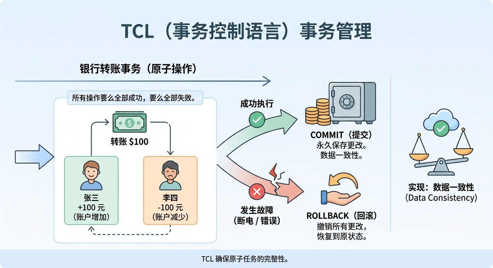

关键的 TCL 命令：

| 命令                           | 创建                                                         |
| ------------------------------ | ------------------------------------------------------------ |
| **`START TRANSACTION` 开启**   | **开启一个事务的执行，以 `COMMIT` 结尾**                     |
| **`COMMIT` 提交**              | 将**事务中操作的所有数据**都**提交**到数据库中**永久保存**。<br /><br />> **`COMMIT` 之后操作的数据**将**无法再 `ROLLBACK` 回滚**，所以一般**放置在末尾处执行** |
| **`ROLLBACK` 回滚**            | **撤销当前事务中，所有未 `COMMIT` 提交的数据修改操作**，**恢复**到**事务开始前的状态** |
| **`SAVEPOINT` 保存点（可选）** | **在事务中埋下一个 “存档点”**。<br /><br />> 当**事务执行过程出现问题**时，允许**选择性地 `ROLLBACK` 回滚到某一个特定的 `SAVEPOINT` “存档点”** |

> 示例：
>
> ```postgresql
> -- 1. 开启一个事务
> START TRANSACTION;
> 
> -- 2. 执行第一步：张三扣款
> UPDATE accounts SET balance = blance - 100 WHERE name = '张三';
> 
> -- 3. 设置一个保存点（可选）
> SAVEPOINT point1;
> 
> -- 4. 执行第二步：李四入账
> UPDATE accounts SET balance = balance + 100 WHERE name = '李四';
> 
> -- 5. 假设上一条命令出现问题，则在 Try catch 异常处理逻辑中进行回滚
> -- 完全失败，执行: ROLLBACK（回滚到开启事务前的状态）
> -- 只撤销第二步：ROLLBACK TO point1;
> 
> -- 6. 如果一切顺利，最后提交，数据永久生效，无法再 ROLLBACK 撤回
> COMMIT;
> ```

*****

## 简介

> 官网：https://www.postgresql.org/

**PostgreSQL（简称 Postgres）**是一个**功能强大、高度可扩展性**的**开源关系型数据库管理系统（RDBMS）**。

​	它不仅支持标准的 SQL 查询，还因其对复杂数据类型、高级索引技术和高度并发控制的卓越支持，在开发者群体中被誉为 **“功能最强大的开源数据库”**。

​	同时，它以极致的严谨性、强大的 JSON 支持以及近乎无限的插件扩展能力，成为了开发者处理复杂业务和高可靠性数据的终极选择。也被誉为**“世界上最先进的开源关系型数据库”**。

- 数据库引擎排行榜：https://db-engines.com/en/ranking

### 核心特性

- **对象-关系型数据库（ORDBMS）**：**兼容关系型数据库的核心特性**，同时**支持面向对象的设计**（如表继承和自定义复合类型）

- **极致的可靠性和完整性**：严格**遵循 ACID 事物原则**，对**外键、唯一性、非空等字段约束提供完美支持**

  > **ACID**：**事务**是由**一系列对数据库的操作（读、写、修改）组成**的一个**逻辑工作单元**。ACID 则是保证**事务（Transaction）可靠性**的一组**核心原则**。
  >
  > - **A - Atomicity（原子性）**：
  >
  >   ​	确保一个事务中的所有操作**要么全部成功完成，要么全部不执行**。它绝不允许事务停留在某种“半完成”的状态。
  >
  > - **C - Consistency（一致性）**：
  >
  >   ​	确保**数据库在事务执行的前后**，都必须满足所有的**预设规则、约束和完整性**。事务只能让数据库从一个“合法状态”转变到另一个“合法状态”。
  >
  > - **I - Isolation（隔离性）**：
  >
  >   ​	当多个用户同时并发访问数据库时，隔离性确保**每个事务在提交前，对其他事务都是不可见或不干扰的**。每个事务都感觉自己是当前唯一正在运行的事务。
  >
  > - **D - Durability（持久性）**：
  >
  >   ​	确保一旦事务成功**提交（Commit）**，它**对数据库中数据的修改**就是**永久性**的。接下来的任何系统崩溃、断电或硬件故障，都不会导致这笔数据丢失。
  >
  > > ACID 的协同工作：
  > >
  > > - **成功时：** 满足**原子性**（所有步骤完成）、满足**一致性**（数据合法），经过**隔离**的执行，最终被**持久化**到磁盘
  > > - **失败时：** 触发**原子性**的回滚，撤销所有操作，使数据库退回到事务开始前的**一致**状态

- **丰富的数据类型**：除了传统的数值和文本之外，还支持 **JSONB（高性能无模式数据）、UUID、几何数据（如经纬度）、网络地址（IP\MAC）、空间数据扩展**...

- **强大的插件扩展生态**：

  这是 PostgreSQL 最强大的特性之一，通过**引入不同的插件**来支持**存储不同格式、类型的数据**，PostgreSQL **随时可以转换为不同类型的数据库（关系型、非关系型、GIS、向量...数据库）**。

  - **基础 SQL（默认支持）：关系型数据**
  - **JSONB（默认支持）：NoSQL 非关系型数据（文档数据库）**
  - **PostGIS：地理信息系统（GIS）空间数据扩展**
  - **pgvector：向量数据库；支持高效的向量相似度检索，是构建大语言模型（LLM）和 RAG（检索增强生成）系统的核心组件**
  - ...

- **并发控制（MVCC）**：采用**多版本并发控制，读写互不阻塞**，在**长事务**和**高并发**场景下表现极佳

### 为什么是 PostgreSQL

1. 它是数据库界的“瑞士军刀”

   大多数数据库只擅长一件事（比如 MySQL 擅长简单 Web 应用，MongoDB 擅长文档存储），但 **PostgresSQL 几乎擅长所有事**。

   - **不仅仅是关系型：** 它**对 JSON 的支持（JSONB）极其出色**，**性能甚至可以媲美**专业的**文档数据库 MongoDB**
   - **地理信息处理：它的扩展插件 **`PostGIS` 是地理信息系统（GIS）领域的工业标准，没有任何对手
   - **全文检索：** 内置强大的搜索功能，很多时候甚至不需要专门安装 `Elasticsearch`

2. 极致的严谨性（数据安全是底线）

   在数据库领域，丢失数据或产生脏数据是灾难。Postgres 以“古板”和“严谨”著称：

   - **ACID 完美支持：** 它对事务的处理非常稳健，确保你的每一笔订单、每一分钱都不会因为意外而对不上账
   - **强类型约束：** 它会严格检查数据类型，比起某些为了方便而牺牲原则的数据库，Postgres 能在底层帮你规避大量的编程 Bug

3. 开源精神的顶点

   这一点对开发者至关重要。

   - **完全免费：** Postgres 采用类 BSD 许可，没有甲骨文（Oracle）这种巨头公司的商业限制
   - **生态繁荣：** 全球顶尖的工程师都在为它贡献代码。现在的趋势是：几乎所有新兴的 AI 平台和云服务（如 Supabase, Neon）都选择 Postgres 作为底层

4. 职业发展的“护城河”

   如果你学会了 PostgresSQL，你会发现再转去用 MySQL 或 SQLite 会变得轻而易举。

   - **高级特性：** 它支持窗口函数、公共表表达式（CTE）、存储过程、逻辑复制等高级 SQL 语法
   - **大厂标配：** 从初创公司到像 Apple、Instagram 这样的大型企业，都在大规模使用 Postgres。掌握它，意味着你掌握了处理复杂业务场景的能力

#### 与其他关系型数据库的对比

| **维度**         | **MySQL**                                 | **PostgreSQL**                           | **SQL Server (MSSQL)**     | **Oracle**                                       |
| ---------------- | ----------------------------------------- | ---------------------------------------- | -------------------------- | ------------------------------------------------ |
| **开源属性**     | 开源 (GPL)，双重授权 (Oracle控股)         | 完全开源 (类MIT协议)，无商业实体控制     | 商业闭源                   | 商业闭源                                         |
| **数据库类型**   | 经典关系型 (**RDBMS**)                    | 对象-关系型 (**ORDBMS**)                 | 关系型 (RDBMS)             | 关系型 / 分布式多模                              |
| **并发控制**     | MVCC (InnoDB)                             | 强MVCC (多版本并发控制)                  | MVCC / 锁机制混用          | 极强的行级 MVCC                                  |
| **扩展性/定制**  | 插件式存储引擎 (如 InnoDB)                | 极其恐怖。支持自定义类型、函数及各类插件 | 依赖微软生态的内置组件     | 依赖庞大的商业套件                               |
| **SQL 标准合规** | 较低（存在一些特有语法与隐式转换）        | 极高（几乎完美兼容 SQL 标准）            | 高（T-SQL）                | 高（PL/SQL）                                     |
| **复杂查询性能** | 偏弱（大表多表 Join、复杂子查询优化较差） | 极强（优化器非常聪明，擅长复杂分析）     | 强（执行计划优化非常成熟） | 统治级（顶级优化器，处理海量数据与极端复杂计算） |

##### 深度剖析与核心痛点

###### 1. MySQL：互联网时代的“流量担当”

MySQL 的设计初衷是**轻量、快速、易用**。它在 Web 2.0 时代伴随 LAMP/LNMP 架构一同爆发。

- **技术特点**：
  - **读写分离与分库分表生态极度成熟**：因为单机性能面对互联网海量并发时有瓶颈，开源社区发展出了类似 ShardingSphere、Vitess 等极其强大的中间件与分片方案
  - **架构简单**：InnoDB 引擎的索引组织表设计非常适合基于主键的快速查询（点查）
- **痛点**：对于复杂的 OLAP（联机分析处理）和多表多层嵌套的 Join 查询，其优化器显得有些力不从心

###### 2. PostgreSQL：功能强大的“学院派/极客最爱”

PostgreSQL 经常被称为“开源界最先进的数据库”。它不仅仅是一个数据库，更像是一个**数据开发平台**。

- **技术特点**：
  - **多模数据与丰富索引**：原生支持 JSON/JSONB、GIS 空间数据（PostGIS）、数组，并且拥有 B-Tree、GIN、GiST、BRIN 等极其丰富的索引类型
  - **强大的并发能力**：其 MVCC 机制在处理高并发读写时几乎不会发生死锁
  - **可扩展性**：开发者可以用 Python、Java 甚至 C 语言编写存储过程；像向量数据库插件（`pgvector`）让它在当下的 AI/RAG 时代再度爆火
- **痛点**：由于 MVCC 采用旧版本数据留在原表的机制，需要定期 `VACUUM`（垃圾回收），若配置不当容易引发表膨胀

###### 3. Microsoft SQL Server：企业级“全能全家桶”

SQL Server 是微软生态的核心数据组件，其最大的特点就是**省心、好用、工具极其强大**。

- **技术特点**：
  - **图形化管理无敌**：SSMS（SQL Server Management Studio）被公认为最好用的数据库管理工具之一，降低了 DBA 和开发人员的运维门槛
  - **一站式解决方案**：内置了 SSIS（集成服务/ETL）、SSAS（分析服务/多维魔方）、SSRS（报表服务），买来就是一套完整的数据仓库与 BI 工具链
  - **性能强悍**：对执行计划的缓存、查询优化器的智能程度都属于行业第一梯队
- **痛点**：高度绑定微软生态。虽然现在支持 Linux 部署，但其核心优势依然在 Windows Server 体系中才能完全发挥；商业授权费用高昂

###### 4. Oracle：金融级“不差钱的终极巨兽”

Oracle 是数据库领域的“航母”，专门为了**绝对的高可用、海量数据吞吐以及极端复杂的金融级业务**而生。

- **技术特点**：
  - **无与伦比的优化器**：面对成百上千行的复杂 SQL、几十个表的 Join，Oracle 的 CBO（基于代价的优化器）能够计算出最完美的执行路径
  - **RAC（实时应用集群）**：真正的共享存储多活集群架构，单点故障秒级切换，实现企业级的绝对高可用
  - **Flashback（闪回）**：允许将数据或表误操作后直接“倒带”回溯到过去的某个时间点，容灾能力极强
- **痛点**：**贵**（买授权贵、买服务贵、买专有硬件贵）；体系极其庞大，学习和运维门槛极高

##### 适用场景选型指南

为了让你在技术选型时有更直观的参考，可以根据以下具体场景进行抉择：

###### 💡 MySQL

- **典型行业**：中小型电商、传统互联网、SaaS 应用、内容管理系统（CMS）
- **项目特征**：
  - 业务模式相对简单，主要以 **高频的点查（CRUD）和高并发读** 为主
  - 团队里有现成的运维生态，或者需要直接对接现成的开源项目（如 WordPress、各类主流框架默认支持）
  - 需要依靠云厂商提供成熟的读写分离和分库分表集群

###### 💡 PostgreSQL

- **典型行业**：地理信息系统（GIS）、AI 与大模型应用（向量检索）、复杂制造业、新一代互联网科技初创公司
- **项目特征**：
  - 业务逻辑复杂，需要频繁处理 **JSON 混合非结构化数据**、时序数据或空间几何数据
  - 需要编写复杂的 SQL 分析报表、窗口函数或大规模数据统计
  - 不想支付昂贵的商业授权费，但又渴望获得接近 Oracle 级别的复杂查询能力

###### 💡 SQL Server

- **典型行业**：传统 ERP/CRM 系统、医院信息系统（HIS）、政府及大型传统企业（前提是已采购微软全家桶）
- **项目特征**：
  - 技术栈彻底基于微软生态（.NET / C# / Windows Server Active Directory）
  - 企业内部严重缺乏专业的 DBA（数据库管理员），需要极度依赖图形化工具进行低成本的运维、调优与备份管理
  - 不仅需要关系型数据库，还需要自带的轻量级 BI（报表、数据挖掘、ETL）功能

###### 💡 Oracle

- **典型行业**：大型银行核心交易系统、电信运营商、国家级电网、航空订票系统
- **项目特征**：
  - **不差钱**，相比于高昂的软件授权费，系统停机一分钟带来的损失更不可承受（要求 $99.999\%$ 的可用性）
  - 核心单表数据量达到亿级甚至十亿级，且伴随着极其复杂的传统金融级账务处理逻辑
  - 依赖极强的外部商业技术支持和完备的安全审计机制

### 安装、下载

PostgreSQL 的本地安装方式有 2 种：

#### 图形化界面安装

- 官方安装地址：https://www.postgresql.org/download/

这是最传统的方式，会安装数据库服务、命令行工具以及 **pgAdmin**（一个强大的图形化管理界面）。

##### 安装步骤

1. **运行安装程序：** 建议下载最新版本（如 PostgreSQL 17或 18）。

2. 选择组件：

   默认全选即可，包含：

   - **`PostgreSQL Server`：核心数据库**
   - **`pgAdmin 4`：图形化管理工具（必选）**
   - **`Stack Builder`: 用于下载额外驱动和插件（可选）**
   - **`Command Line Tools`：命令行工具（`SQL Shell`）**

3. 选择**数据存储位置：`./data`**

4. 设置密码：**安装过程中会设置**超级用户 **`postgres`** 的密码。**请务必牢记！**

5. **选择端口：默认为 `5432`**，除非被占用，否则不要修改

6. **完成：安装完成后，在开始菜单搜索并打开** `pgAdmin 4` 图形化界面工具即可开始操作

此外，还有一个 `Stack Builder` ，它是 PostgreSQL 在 Windows/macOS 图形化安装结束时自带的一个软件包管理工具。它的核心作用是帮你下载和安装**附加的扩展、驱动和相关工具**。

| **分类名称**                     | **包含内容与建议**                                           |
| -------------------------------- | ------------------------------------------------------------ |
| **Database Servers**             | 包含其他版本的 PostgreSQL 核心服务。**（通常不需要勾选，因为你刚刚已经装好了当前的服务器）** |
| **Database Drivers**             | 各种语言/标准的数据库驱动（ODBC, JDBC, .NET 等）。**（仅在需要原生系统级连接时下载）** |
| **Spatial Extensions**           | 主要是 `PostGIS`。**（做地图、LBS 定位、GIS 应用开发时必选）** |
| **Add-ons, tools and utilities** | 附加工具，例如 `pgAgent`（定时任务）。**（按需选择）**       |
| **Web Development**              | 有时会包含像 Apache/PHP 的捆绑包。**（现代开发基本用不到，直接无视）** |

##### pgAdmin 4 图形化工具

安装完成之后，打开的 `pgAdmin 4` 图形化工具：

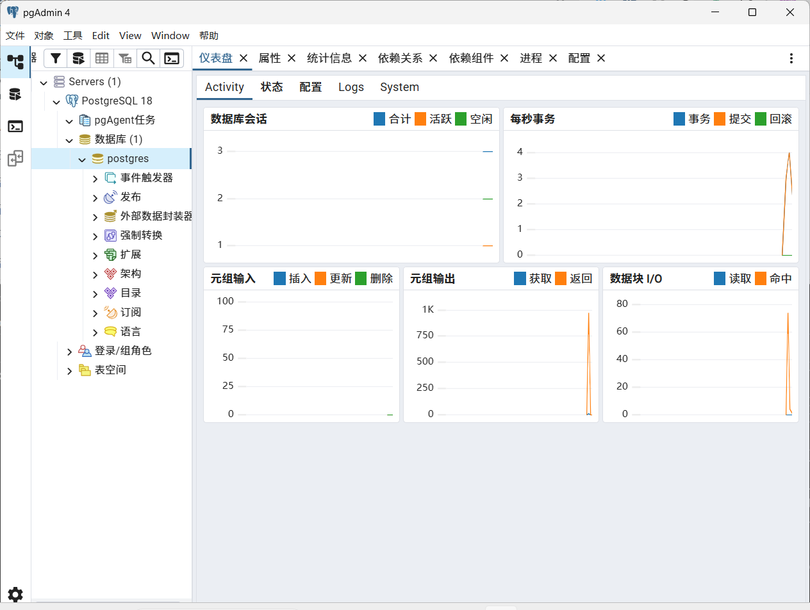

> 中文设置：
>
> - 在左侧的菜单树中，向下滚动找到**Miscellaneous**（杂项）
> - 点击**Miscellaneous**下方的**User Interface**（用户界面）
> - 在右侧出现的选项中，找到**Language**（语言）下拉框
> - 在下拉列表中选择**Chinese (Simplified)**（简体中文）
> - 点击页面顶部的**Save**（保存）按钮（那个小磁盘图标）

##### psql 命令行工具

- **`psql`** 是 PostgreSQL 提供的一个**CLI 脚手架指令工具**，用于**启动并访问 PostgreSQL 后台服务（Data Servers）。**

连接 `psql` 数据库服务，有 2 种方式：

###### SQL Shell(psql)

- 这是 PostgreSQL 安装包自带的一个**Command CLI 命令行工具**，可以**直接选择打开它**，它会**默认连接 `pgsql` 服务**

​	**搜索 “SQL Shell(psql)"** 打开；打开之后，默认情况下，**直接一步按回车 Enter 即可**，表示**当前默认登录的是 `postgres` 超级用户**。如果想登录其他用户，则需额外通过 `psql` 命令来完成。


###### CMD 命令行工具

​	默认情况下，PostgreSQL 只提供了 SQL Shell 命令行工具，如果**想要在 Windows 自带的 Power Shell 命令行工具的任意位置上使用 `psql` 命令**，需**配置 PostgreSQL  安装包的环境变量**。

- 把**安装 PostgreSQL 的 `/bin` 目录**设置到**环境变量 `Path` 参数** 里面，这样在任何位置下都可以**使用 `psql` 的命令行命令**了

  > 设置完环境变量之后，之前打开的 CMD 终端 和 IDE 编辑器，都**需要重新打开**，环境变量才会生效

打开 CMD 命令行，输入以下指令：**使用 `xxx` 用户身份登录并连接指定 `yyy` 数据库**：

```shell
$psql -U [登录用户名 | postgres] -d [要连接的数据库 | postgres] -h [远程 IP 地址] -p [端口号]
```

- **`-U`：指定要登录的用户名（超级用户 `postgres`）**
- **`-d`：指定要连接的数据库名（系统级数据库 `postgres`）**
- **`-h`：要连接的远程IP地址。默认 127.0.0.1**
- **`-p`：启用的端口号。默认 5432**
- **按下 回车Enter 输入用户密码**，密码就是按照图形界面的时候输入的密码

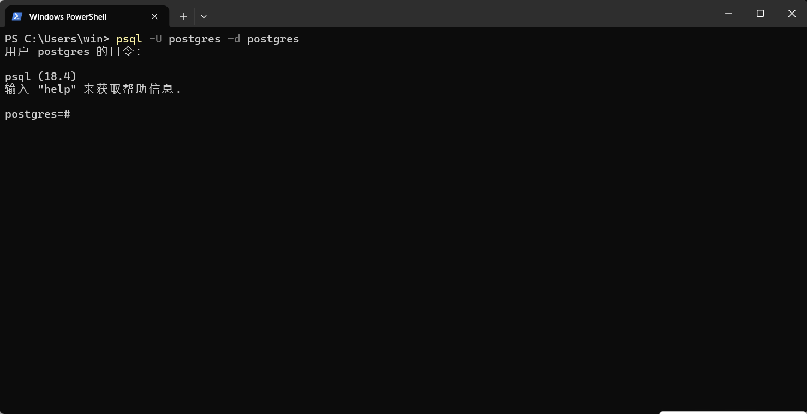

###### 常用元命令（`\{x}`）

在 `psql` 命令行工具内部执行的快捷元命令：

- **`\l`：列出所有数据库**

- **`\l+`：列出所有数据库的详细信息**

  ```shell
  postgres=# \l
                                                  List of databases
     Name    |  Owner   | Encoding | Locale Provider | Collate | Ctype | Locale | ICU Rules |   Access privileges
  -----------+----------+----------+-----------------+---------+-------+--------+-----------+-----------------------
   postgres  | postgres | UTF8     | libc            | C       | C     |        |           |
   template0 | postgres | UTF8     | libc            | C       | C     |        |           | =c/postgres          +
             |          |          |                 |         |       |        |           | postgres=CTc/postgres
   template1 | postgres | UTF8     | libc            | C       | C     |        |           | =c/postgres          +
             |          |          |                 |         |       |        |           | postgres=CTc/postgres
   test      | postgres | UTF8     | libc            | C       | C     |        |           |
  (4 rows)
  ```

- **`\c {数据库名}`：切换到指定数据库**

  ```shell
  postgres=# \c test
  You are now connected to database "test" as user "postgres".
  ```

- **`\dt`：列出当前数据库中的所有 Table 表**

- **`\d {表名}`：查看指定 Table 表的结构（列、类型、索引等...）**

- **`\q`：退出当前 `psql` 命令行工具**

#### Docker 安装

*更方便的安装方式，可以顺便切换版本，是开发、部署的不二之选*

##### 完整流程

1. **拉取 Docker 镜像**

   ```shell
   $docker pull postgres:17-alpine
   $docker images
   IMAGE                             ID             DISK USAGE   CONTENT SIZE   EXTRA
   postgres:17-alpine                979c4379dd69        400MB          112MB    U
   ```

   *注：建议不要 `pull` 拉取最新版 `latest`、`18`，会存在生态兼容问题。*

2. **创建自定义桥接网络**：

   ```shell
   $docker network create app-network
   $docker network list
   NETWORK ID     NAME          DRIVER    SCOPE
   85b77461b69a   app-network   bridge    local
   ee3e05d881df   bridge        bridge    local
   c0ae0c88ce4a   host          host      local
   da6278fac6aa   none          null      local
   ```

   作用：自定义网络 `app-network`（默认是 `bridge` 模式）的作用，**主要是为了让不同的 Docker 容器之间可以通过容器名（Name）直接互相通信**（比如未来 Python、Java 后端容器想连这个数据库，直接填 `pg-study:5432` 就能通）。

3. **创建 volume 挂载卷**

   ```shell
   $docker volume create pgsql-data
   $docker volume list
   DRIVER    VOLUME NAME
   local     7d583d33766f0d2e5dd45466f45f0ea1fcb9f4a72e17d3860ac28761be618193
   local     022e5cf30b05bc003124bde782b9b286a1987082bf91917fbbee8c44b770f27d
   local     940edfa106b36f11fc358b7077b74e33b2280b2c746feadf21c7208662bb7c27
   local     6981e930952ba751d9beb73610245ef403eae204e33afa4bdb1a2d0d1cb50170
   local     7035c6e778bb6073d544382e1424682b01470278baa8dd84ff6193f38290683d
   local     b59e814454d80ba88df968346c7508fdb6e68a51e81135b91df3e5cb654a9626
   local     d9054d8e8ceb66c8a765bde33b4c95fcd791dac581b99470927c8fad3db5ccc0
   local     e30a735b2190c48508feda3263c97861944e6c0af1e5f51913821101a3bfe212
   local     ee6241442117657943f0cd1ed8e879e7802e97a4474031da8befee1d15e45032
   local     pgsql-data
   ```

   作用：**用于关联 Docker 容器（PostgreSQL 数据库）内的 Linux 目录 与 宿主机物理目录，实现数据持久化存储，即使 Docker 容器被删除，存储的数据也会被宿主机保存**。

4. **创建 Docker 容器**

   ```shell
   $docker run -d --name pg-study -p 5432:5432 -v pgsql-data:/var/lib/postgresql/data --network app-network `
   >> -e POSTGRES_USER=postgres `
   >> -e POSTGRES_PASSWORD=123456 `
   >> -e POSTGRES_DB=postgres `
   >> -e POSTGRES_INITDB_ARGS="--encoding=UTF8 --locale=C" `
   >> -e TZ=Asia/Shanghai `
   >> postgres:17-alpine
   
   $docker ps
   CONTAINER ID   IMAGE                COMMAND                  CREATED         STATUS         PORTS                                         NAMES
   5d3895f04a39   postgres:17-alpine   "docker-entrypoint.s…"   2 seconds ago   Up 2 seconds   0.0.0.0:5432->5432/tcp, [::]:5432->5432/tcp   pg-study
   ```

   > 注：**(`) 是 WIndows PowerShell  的换行符，如果是 Linux 宿主机则选择使用 (\\)**

   参数说明：

   - **`-d`：分离模式，后台运行**
   - **`--name`：容器别名**
   - **`-p`：端口映射；将容器的 5432 端口映射到主机的 5432 端口**
   - **`-v`：目录映射**
   - **`--network`：网络模式关联**
   - **`-e`：注入 PostgreSQL 服务所需的环境变量**
     - **`-e POSTGRES_USER=postgres`：要登录的用户**
     - **`-e POSTGRES_PASSWORD=123456`：用户密码**
     - **`-e POSTGRES_DB=postgres`：要连接的数据库**
     - **`-e POSTGRES_INITDB_ARGS="--encoding=UTF8 --locale=C"`：编码**
     - **`-e TZ=Asia/Shanghai`：时区**
   - **`postgres:17-alpine`：基于 `postgres:17-alpine` 镜像创建的 Docker 容器**

   下次便不需要额外注入以上这些参数了，**直接 `start` 启动**即可。

5. **进入容器内部，执行 Linux 指令**

   - **`docker exec -it pg-study xx`**：一步到位（最推荐 🚀）

     ```sh
     $docker exec -it pg-study psql -U postgres -d postgres
     psql (17.10)
     Type "help" for help.
     
     postgres=#
     ```

     表示：**直接进入 Docker  容器内的同时，执行 `psql -U postgres -d postgres` 连接到 PostgreSQL 数据库。**

   - **`docker exec -it  pg-study sh`**：先入系统，后连数据库（Alpine 规范）

     表示：**先进入容器内部（Linux 系统），获取一个 Linux 命令交互式环境**，**在交互式环境中使用 `psql` 命令**

     ```shell
     $docker exec -it  pg-study sh
     $psql -U postgres -d postgres
     psql (17.10)
     Type "help" for help.
     
     postgres=# 
     ```

   两个方式都可以，挑选其一即可。

   *注：进入时会发现不需要输入密码，那是因为 `docker run` 的 `-e` 参数已经被记录下来了*

6. **其他远程连接方式**

   如果**不在 Docker 容器中使用 `psql` 命令**，而是**选择在宿主机或其他机器中访问 PostgreSQL 数据库**，可采用**远程连接**的方式：

   ```sh
   # psql -h <远程IP地址> -p <端口号> -U <用户名> -d <数据库名>
   $psql -h 127.0.0.1 -p 5432 -U postgres -d postgres
   用户 postgres 的口令：
   
   psql (18.4)
   输入 "help" 来获取帮助信息.
   
   postgres=#
   ```

> ❌️注意点：如果系统本地安装了一个 PostgreSQL 实例，必须使用 ` services.msc` 将本地服务关闭，或者修改 Docker 容器的端口映射，否则会产生冲突！

#### `version()` 函数（查看版本）

- **`"version"()` 查看 PostgreSQL 版本信息**

  ```postgresql
  SELECT "version"();
  
  -- PostgreSQL 18.4 on x86_64-windows, compiled by msvc-19.44.35227, 64-bit
  ```

  注：**`version` 是 PostgreSQL 的关键字，需使用 `"version"` 包裹**。

## 架构设计

在实际应用中，**数据库服务与外部的通信过程**是一个**经典的 `C/S（Client-Server）` 架构**模式，将工作单元分为以下 2 部分：

- **客户端（Client）**：**面向用户或业务逻辑的前端工作单元**

  （例如：Java、Python、Node.js ..后端应用程序，使用 jdbc、odbc 等接口来连接数据库）。

  主要任务是 **发起请求** 和 **展示结果**。

  - 核心职责：

    - **用户交互**：提供 **GUI 图形界面** 和 **CLI 命令行界面**，**接收用户的输入**

    - **业务逻辑处理**：负责基础的数据校验，并将用户的操作转化为数据库服务能理解的请求

    - **发送请求**：

      ​	通过**网络或系统间进程通信（IPC）**，**向数据库服务发送 SQL 数据查询语句**：Select 查询、Insert 插入、Update 更新、Delete 删除...等 SQL 指令

    - **渲染展示**：**接收数据库服务器返回的 SQL 查询数据结果**，将其转化为人类可读的界面**展示给用户**

- **数据库服务器（Database Server）**：**面向后端的数据管理与控制中心**。主要任务是 **处理请求** 和 **安全存储**

  - 核心职责：

    - **请求处理与优化**：

      ​	**接收来自客户端的 SQL 查询请求**，使用**查询优化器（Query Optimizer）**分析多种执行路径，计算代价（Cost），并**选择一条最高效的执行计划（Execution Plan）去执行**

    - **数据存储与管理**：

      ​	将**数据高效、结构化地持久化存储在磁盘或内存**中

    - **并发控制**：

      ​	当**多个客户端同时访问同一条数据**时，通过 **“锁”** 和 **“事务”** 机制，**确保数据不会被脏读写**

    - **安全验证与权限**：

      ​	**验证**客户端连接的**用户身份**，并**检查用户权限**，**确保该用户只能访问其拥有权限的数据**

    - **数据完整性与备份**：

      ​	通过**各种约束条件（主外键、非空、默认值...）满足数据的存储要求**，并提供 **WAL（预写式日志）**和**备份机制，防止数据丢失**

这两个工作单元在操作系统中各司其职，通过协同工作来完成数据的处理和存储。

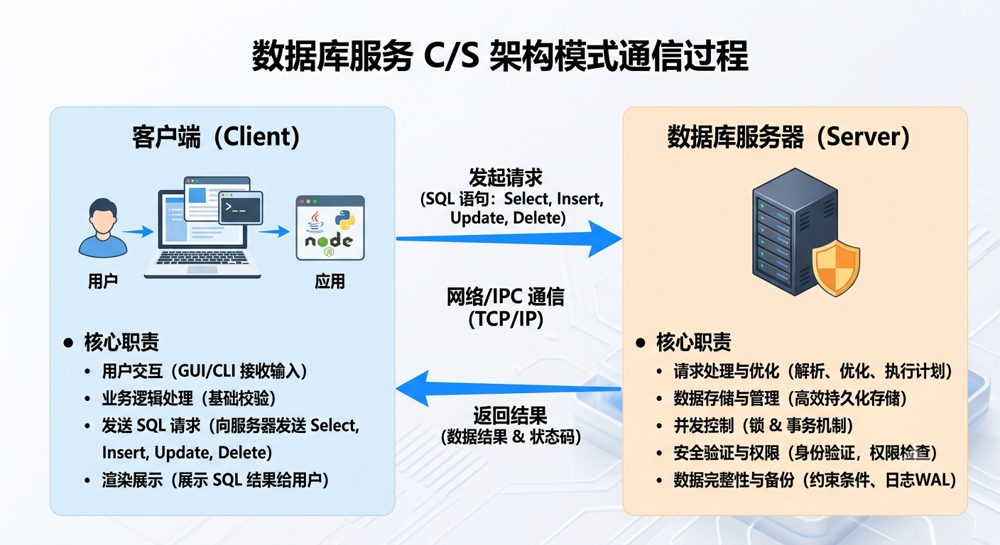

### 核心概念与架构

PostgreSQL（简称 Postgres）作为当下最流行的开源关系型数据库之一，其核心优势在于**极高的稳定性**、**强大的并发控制**和**高度的可扩展性**。

要理解 Postgres 的运作机制，我们需要拆解它的**进程架构**、**内存结构**和**磁盘存储结构**。

#### 进程架构

PostgreSQL 采用的是**多进程架构**（Process-Based Architecture），而非 MySQL 常用的多线程架构。

PostgreSQL 的进程主要分为三类：**主进程、后台工作进程** 和 **后台辅助进程**。

- **Postmaster (主进程)：** 

  - **职责**：**监听客户端连接请求，负责初始化集群**
  - **动作**：当**收到一个客户端连接**时，它会先进行**用户身份验证**（检查用户名、密码是否正确），然后**为每个客户端连接 fork** 衍生出一个独立的 **Backend Process（后端进程）**来专门负责服务该客户端。

- **Backend Process（后台工作进程）**：

  - **职责**：**一对一服务客户端**
  - **动作**：**接收从客户端发送来的 SQL 语句**，进行**解析、优化、执行**，并**将 SQL 查询结果返回给客户端**。当**客户端断开连接**时，该**后端进程会被销毁**

- **Background Processes（后台辅助进程）**：

  为了维持数据库的健康运行，Postgres 有一组各司其职的“清洁工”和“记录员”：

  - **WAL Writer (预写日志写入进程)**：负责将内存中缓冲的 WAL（Write-Ahead Logging）数据定期刷新到磁盘上，确保数据不丢失。
  - **Background Writer (后台写入进程)**：负责将内存中被修改过的“脏页（Dirty Pages）”逐步刷入磁盘，减轻 Checkpoint 的压力。
  - **Checkpointer (检查点进程)**：定期触发检查点，强制将所有脏页刷盘，并在 WAL 中做好标记，用于数据库崩溃后的快速恢复。
  - **Autovacuum Launcher / Worker (自动清理进程)**：Postgres 采用 MVCC（多版本并发控制），更新和删除操作会产生数据碎屑（死元组）。Autovacuum 负责回收这些空间，防止数据库膨胀。
  - **Stats Collector (统计信息收集进程)**：收集执行计划所需的各种统计数据（如表的大小、索引使用情况），供优化器（Optimizer）参考

#### 内存架构

PostgreSQL 的内存主要划分为**共享内存**（所有进程共用）和**本地内存**（每个后端进程独立享有）。

```
+------------------------------------------------------------------------+
|                           PostgreSQL Memory                            |
+----------------------------------------------------+-------------------+
|                   Shared Memory                    |   Local Memory    |
|  +----------------+ +------------+ +------------+  |  (per process)    |
|  | Shared Buffers | | WAL Buffer | | CLOG       |  |  +------------+   |
|  +----------------+ +------------+ +------------+  |  | work_mem   |   |
|                                                    |  +------------+   |
|                                                    |  | maintenance|   |
|                                                    |  | _work_mem  |   |
+----------------------------------------------------+-------------------+
```

- **Shared Memory (共享内存)：** 

  在数据库启动时分配，主要用于缓存数据和进程间通信。

  - **Shared Buffers（共享缓冲区）**：缓存从磁盘读取的数据页（Page）。当需要读取数据时，先看这里有没有，没有再从磁盘读入。通常建议设置为系统内存的 25%
  - **WAL Buffer（WAL 缓冲区）**：事务产生的 WAL 日志先写到这里，再由 WAL Writer 刷到磁盘
  - **Commit Log (CLOG)**：记录所有事务的最终状态（已提交、已回滚、运行中），用于 MVCC 判断数据可见性

- **Local Memory（本质内存）**：

  - 由每个后端进程独立申请，**用完即释放**。配置时需谨慎，因为 `连接数 × 内存大小` 如果超过物理内存，会导致 OOM。
    - **`work_mem`**：用于 SQL 中的 `ORDER BY`、`DISTINCT`、`JOIN` 等操作。如果排序数据量超过这个值，会转用磁盘临时文件，导致性能暴跌。
    - **`maintenance_work_mem`**：用于管理性操作，如 `VACUUM`、创建索引（`CREATE INDEX`）和添加外键。

- **WAL (Write-Ahead Logging)：** 预写日志机制。**任何数据修改必须先写入 WAL 盘**，保证断电后数据不丢失

#### 一条 SQL 查询的生命周期

##### 核心同步处理流

当客户端发送一条 SQL 请求时，它会经历以下标准的**同步执行链路**：

- **客户端 (Client) → Postmaster 主进程**：

  - **客户端发起连接请求，由 `Postmaster` 监听并接收**
  - `Postmaster` 为该连接单独 fork 出一个**工作进程 (Backend Process)** 进行后续处理

- **Backend 进程内部处理**

  - **解析器 (Parser):** 检查 SQL 语法，生成解析树

  - **优化器 (Planner/Optimizer):** 计算不同执行路径的代价，生成最优的**执行计划 (Execution Plan)**

  - **执行器 (Executor):** 真正开始执行该计划，并与内存进行交互

- **内存交互 (Shared Buffers & WAL Buffer)**

  - **读操作：** 执行器先去 `Shared Buffers`（共享内存）查找数据。若命中则直接返回；若未命中，则由操作系统（OS）从**磁盘**读取数据页加载到内存中

  - **写操作（DML/DDL）：** 执行器同时写入 `WAL Buffer`（日志缓冲）并修改 `Shared Buffers` 中的数据（此时数据页变脏）。一旦日志写入完毕，事务即可向客户端**返回成功**

##### 后台异步流

事务返回成功后，内存中的数据和日志并没有立刻写入磁盘，而是由以下后台进程**异步**完成，这也是数据库高性能的核心所在：

| **后台进程**          | **核心职责**                                                 | **交互流程**             |
| --------------------- | ------------------------------------------------------------ | ------------------------ |
| **WAL Writer**        | 负责将 `WAL Buffer` 中的日志源源不断地刷入**磁盘的 WAL 日志文件**，确保 ACID 的**持久性** | `WAL Buffer` → 磁盘      |
| **Background Writer** | 负责定期将 `Shared Buffers` 中的脏页（Dirty Pages）写入**磁盘的数据文件**，平摊 I/O 压力 | `Shared Buffers`  → 磁盘 |

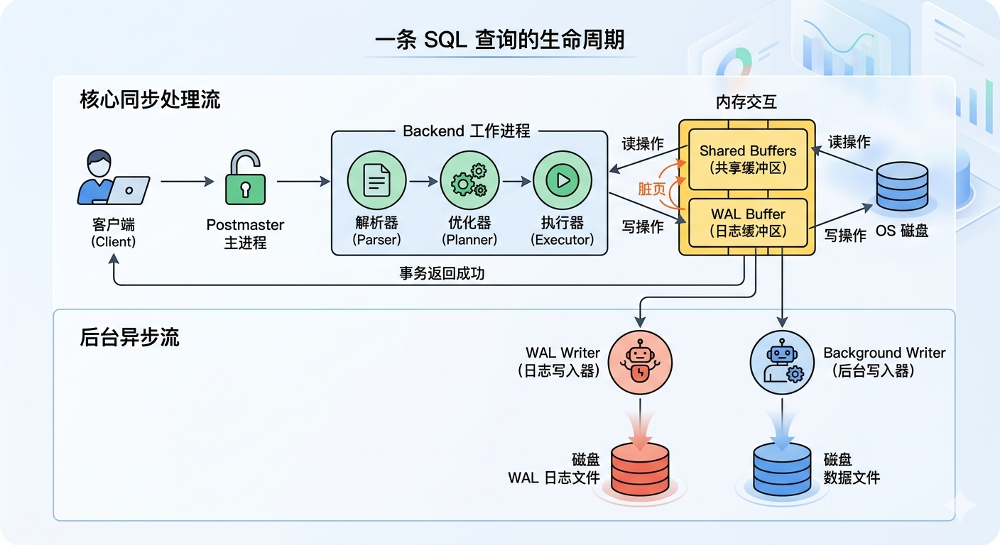

### 逻辑存储结构

在 PostgreSQL 中，数据的组织是层层嵌套的，每一层都有其特定的边界和作用。

- PostgreSQL 的逻辑存储结构**从大到小**依次为：

$$
实例（Instance） → 数据库（Database）→ 模式（Schema）→ 表（Table） → 行、列（Row 、Column）
$$

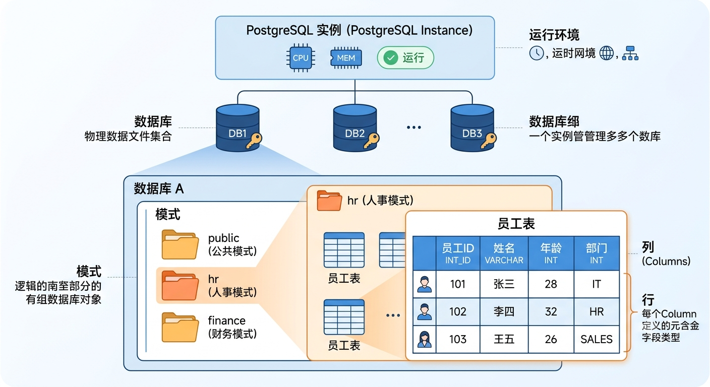

#### 核心层次结构

可以把 PostgreSQL 的逻辑存储结构理解成一个**写字楼**，每一层楼都代表着一个实体。

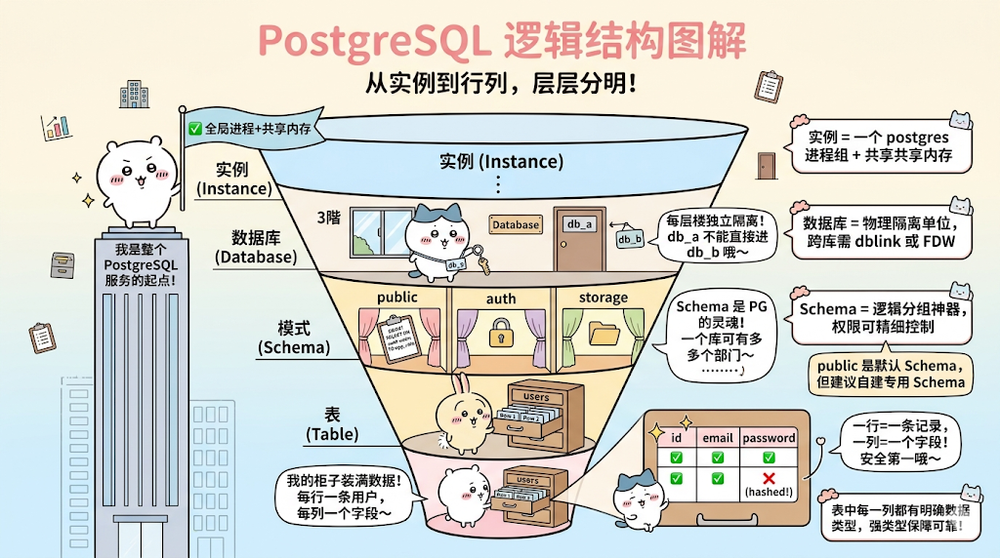

##### 1、运行进程与承载层（实例 → 数据库）

###### 实例（Instance）

- 定义：**数据库软件**在**内存中运行时**的**进程组合（主进程 & 后台进程 & 后台辅助进程）**和 **内存结构（共享内存、WAL 缓冲区）**

- 关系：实例（Instance）是数据库的 “肉体” 和 “发动机”，**数据库中的数据必须加载到实例中才能运行**

###### 数据库（Database）

- 定义：**物理磁盘上存储的数据文件集合**（如 `.dbf`, `.ibd` 文件、日志文件等）
- 关系：它是数据库的 “灵魂“ 和 ”仓库“
- 描述：通常**一个项目会占用一个独立的数据库**

> 注意：**不同数据库之间的数据默认是无法流通的**，即不能在 `db_a` 库里直接查询 `db_b` 库里的数据

**映射关系**：通常情况下，**一个实例管理一个数据库**。**但在现代高可用集群 或 Oracle RAC 架构中**，可以**有多个实例管理同一个数据库**。

##### 2、逻辑命名空间（数据库 → 模式）

###### 模式（Schema）

定义：**一个数据库中可以有多个 Schema 模式表示一个有相关特性的组织划分，一个 Schema 模式中可以有多张 Table 表。**

作用：**根据不同业务功能特性，将存储数据划分到同一相关业务功能特性的逻辑命名空间中管理。**


##### 3、核心实体结构（模式 → 表 → 行/列）

###### 表（Table）

- 定义：**存在于某个具体 Schema 模式下**的**二维数据结构（行 / 列）**，是**存放数据的核心载体**。
- **存储结构（行 / 列）**：
  - **每一行（Row）**代表**一条记录**，**每一列（Column）**代表**一个字段**

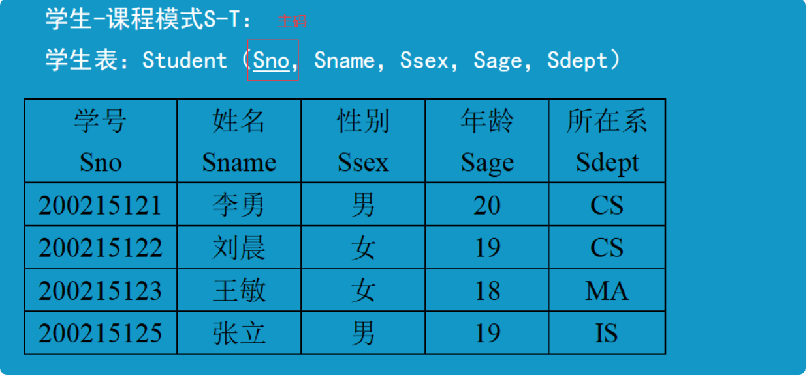

###### 行列（Row &  Column）

定义：**表**是由 **行（Row）**与 **列（Column）组成的**。

- **行（Row/记录）：横向结构**。代表**一条具体的数据实体**。如 ('1001','张三','18岁)

- **列（Column/字段）**：**纵向结构**。代表**一条数据实体所组成的元数据字段（Metadata）**

  如字段名（`user_id`）和数据类型（`INT`）。

### 系统表空间（`pg_default`、`pg_global`）

PostgreSQL 的表空间（Tablespace）是一个逻辑存储概念，它允许你在物理文件系统上定义不同的存储位置。

简单来说，表空间就是**一个指向实际物理存储目录的路径映射**，它让数据库管理员能够将不同的数据库对象（如表、索引）存放到不同的磁盘位置。

#### 核心概念

PostgreSQL 在初始化数据库集群（`initdb`）时，会自动创建两个系统表空间：

- **`pg_default`**：存储**用户数据对象和大多数数据库本地系统目录**
- **`pg_global`**：存储**所有数据库共享的**全局系统目录
  - **物理位置**：`pg_global` 对应的物理目录是 `$PGDATA/global/`，存放的是集群内所有数据库共用的系统表文件

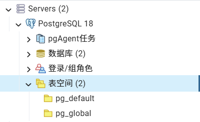

核心区别：

| 概念             | 本质                                             | 作用                                                     | 对应关系                         |
| :--------------- | :----------------------------------------------- | :------------------------------------------------------- | :------------------------------- |
| **`pg_default`** | **物理对象**：一个**表空间（Tablespace）**       | 默认的物理存储位置，绝大多数用户数据和系统表都存放在这里 | 对应数据目录下的 `base` 子目录   |
| **`pg_global`**  | **物理对象**：一个特殊的**表空间（Tablespace）** | 专门用于存储**整个数据库集群共享**的系统表               | 对应数据目录下的 `global` 子目录 |

**关键点**：

- 这些表中的数据在**所有数据库中都可见**
- 例如，连接到 `mydb` 时查询 `pg_database`，能看到的数据库列表信息实际上是存储在 `pg_global` 表空间中的

##### 对比

| 特性               | `pg_global`            | `pg_default`                  | 用户自定义表空间     |
| :----------------- | :--------------------- | :---------------------------- | :------------------- |
| **作用范围**       | 集群级别（全局共享）   | 数据库本地                    | 数据库本地           |
| **存储内容**       | 集群共享系统目录       | 数据库本地系统目录 + 用户数据 | 用户数据/索引        |
| **能否被用户修改** | ❌ 不能（由系统维护）   | ❌ 不能（由系统维护）          | ✅ 用户可以创建和使用 |
| **能否手动管理**   | ❌ 不能（禁止手动操作） | ❌ 不能（禁止手动操作）        | ✅ 用户可以创建/删除  |
| **物理目录**       | `$PGDATA/global/`      | `$PGDATA/base/`               | 用户指定的任意目录   |

### 系统目录空间（模式）

> [!IMPORTANT]
>
> **系统表空间** 与 **系统目录空间** 的区别：
>
> - **系统表空间（`pg_default` 、 `pg_global`）：物理存储层**
>
>   这两个是 **表空间（Tablespaces）**。它们决定了你的数据文件在服务器硬盘的什么地方。
>
>   - **`pg_default`**
>     - **角色**：默认的物理存储基地
>     - **解释**：当你执行 `CREATE TABLE my_table (...)` 而没有指定 `TABLESPACE` 时，PostgreSQL 就会自动把这个表的文件丢进 `pg_default` 对应的磁盘目录里
>   - **`pg_global`**
>     - **角色**：全局共享存储基地
>     - **解释**：PostgreSQL 里有些数据是**全集群共享**的，不属于某一个特定的数据库（例如：有哪些数据库用户、每个用户的密码、有哪些数据库等）。这些全局信息就必须存放在 `pg_global` 里
>
> - **系统目录（`pg_catalog`、`infomation_schema`）：（逻辑组织层）**
>
>   这两个是 **模式（Schemas）**。它们是数据库内部的名字空间（类似于文件夹），里面装的是**系统表和视图**。
>
>   - **`pg_catalog`**
>     - **角色**：内核的“真·花名册”
>     - **解释**：它是 PostgreSQL 的核心。里面记录了所有的表、列、索引、数据类型、内部函数等。它的表名通常以 `pg_` 开头（比如 `pg_class`, `pg_type`）
>     - **特点**：这是**底层、原生**的。不同版本的 PostgreSQL，或者换到 MySQL，里面的表结构是完全不一样的。直接查它有点晦涩难懂
>   - **`information_schema`**
>     - **角色**：国际标准的“官方翻译官”
>     - **解释**：它是 SQL 国际标准（ISO SQL）规定的系统视图。无论你用 PostgreSQL、SQL Server 还是 MySQL，都必须提供这个模式
>     - **特点**：它是**标准、友好**的。它通过视图（Views）把 `pg_catalog` 里那些晦涩的底层数据，包装成通俗易懂、符合国际标准的表格（比如 `tables`, `columns`）
>
> 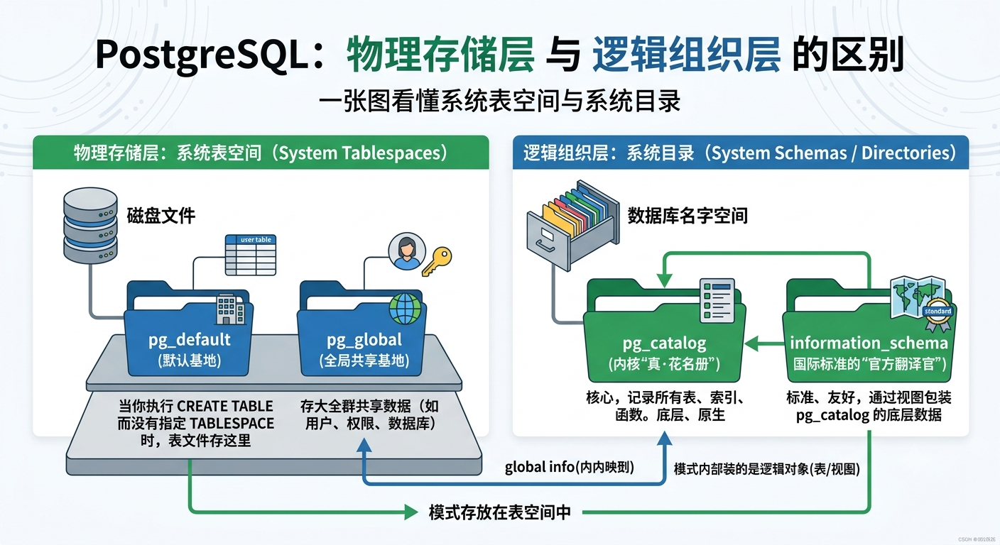

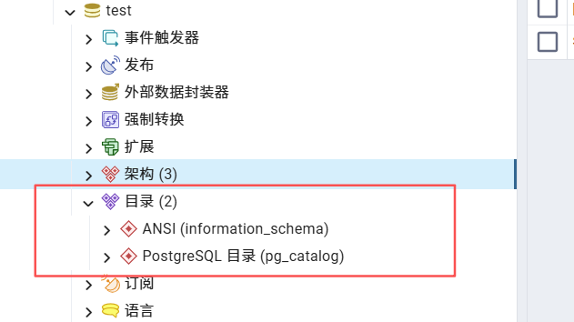

#### `pg_catalog` 逻辑存储系统表

##### 核心概念

PostgreSQL 的**数据库系统目录模式**，可以理解为**一个数据库的“数据字典”或“系统表集合”**。它是 PostgreSQL 运行的核心，**存储着所有数据库对象**（如表、列、索引、函数、数据类型等）的**元数据信息**。

核心特点：

1. **自动存在且优先**：每个数据库创建时自动包含 `pg_catalog`，且它**始终位于搜索路径的最前面**（即使 `SHOW search_path` 看不到它）。这是为了确保系统内部查询总能找到所需元数据。

2. **存储关键信息**：你在数据库中创建的任何东西，其定义都会记录在 `pg_catalog` 的各个系统表中。

   例如：

   - **`pg_class`：存储所有表、索引、视图等对象的信息**
   - **`pg_attribute`：存储表的列信息**
   - **`pg_proc`：存储函数和存储过程**
   - **`pg_namespace`：存储所有模式的信息**
   - **`pg_database`：存储数据库本身的信息**
   - ...

3. **权限限制**：**普通用户**对系统表通常**只有只读权限**，**只有超级用户才能修改它们**

##### 常见系统表 & 系统视图

核心定义：**系统表是存储元数据的“原始数据表”，而系统视图则是为了方便我们查询，在系统表之上构建的“快捷窗口”**。

> 注：以下这些 系统表 和 系统视图，在使用的时候**可以选择写 `pg_catalog.pg_class` 或者直接 `pg_class`，效果一致。**

###### 🗂️ 核心对象定义类

这类系统表记录了数据库里“有什么”，是元数据的根基。所有表、列、类型、模式等对象的定义都在这里。

| 系统表             | 用途                                     | 备注                                           |
| :----------------- | :--------------------------------------- | :--------------------------------------------- |
| **`pg_namespace`** | 存储**模式（Schema）** 信息              | 记录了当前数据库下的所有 Schema 模式           |
| **`pg_class`**     | 存储**表、索引、序列、视图**等“关系”对象 | 这是最重要的系统表之一，记录了所有对象         |
| **`pg_attribute`** | 存储**表的列（属性）** 信息              | 和 `pg_class` 配合使用，可以查到每张表有哪些列 |
| **`pg_type`**      | 存储**数据类型**信息                     | 包括内置类型和用户自定义类型                   |
| **`pg_database`**  | 存储当前数据库集群中的**数据库**信息     | 这是一个在集群内共享的系统表                   |

###### 👥 用户与权限类

这类系统表/视图记录了谁能访问数据库，以及他们的权限。

| 对象名          | 类型         | 用途                                                         | 与 `pg_authid` 的关系 |
| :-------------- | :----------- | :----------------------------------------------------------- | :-------------------- |
| **`pg_authid`** | **系统表**   | 存储所有**角色（Role）** 的凭证和属性，如是否是超级用户、能否登录等。**这是权限信息的源头**。 | -                     |
| **`pg_roles`**  | **系统视图** | 提供一个更安全的`pg_authid`视图，**会屏蔽掉密码字段**，供普通用户查询角色信息。 | 基于 `pg_authid` 构建 |
| **`pg_user`**   | **系统视图** | 只显示具有**登录权限**的角色信息。                           | 基于 `pg_authid` 构建 |
| **`pg_shadow`** | **系统视图** | 为了向后兼容而存在的视图，与`pg_user`类似，但**包含密码字段**，通常只有超级用户可访问。 | 基于 `pg_authid` 构建 |

###### 📊 性能与状态监控类

通过查询这些视图，可以实时了解数据库的运行状况，是DBA最常使用的工具。

| 系统视图               | 用途                                                         |
| :--------------------- | :----------------------------------------------------------- |
| **`pg_stat_activity`** | 查看**当前的连接和正在执行的SQL**，是排查性能问题的利器。    |
| **`pg_locks`**         | 查看当前数据库中的**锁**信息，用于诊断死锁或锁等待问题。     |
| **`pg_stat_database`** | 提供每个数据库的**统计信息**，如提交事务数、回滚数、磁盘块读写次数等。 |
| **`pg_stat_bgwriter`** | 监控**后台写进程（Background Writer）** 和**检查点（Checkpoint）** 的活动，对优化性能很有帮助。 |
| **`pg_settings`**      | 显示服务器当前的**运行时配置参数**，相当于`SHOW ALL`的结果。 |

###### 📖 常用信息查询视图

这些是构建在系统表之上的“快捷视图”，提供了更友好的查询接口，无需写复杂的关联查询。

| 系统视图                   | 用途                                                         |
| :------------------------- | :----------------------------------------------------------- |
| **`pg_tables`**            | 查询数据库中的所有**表**信息。                               |
| **`pg_views`**             | 查询数据库中的所有**视图**及其定义。                         |
| **`pg_indexes`**           | 查询数据库中的所有**索引**信息。                             |
| **`pg_sequences`**         | 查询数据库中的所有**序列**信息。                             |
| **`pg_stats`**             | 查询**表列的统计信息**，这些信息是查询优化器制定执行计划的关键依据。 |
| **`pg_replication_slots`** | 查看当前的**复制槽**信息，用于监控流复制状态。               |

#### `information_schema` 标准 SQL 视图集

##### 核心概念

它基于 `pg_catalog` 构建，提供更标准化但信息略少的数据访问方式。

- **角色**：国际标准的“官方翻译官”

- **解释**：它是 SQL 国际标准（ISO SQL）规定的系统视图。无论用 PostgreSQL、SQL Server 还是 MySQL，都必须提供这个模式

- **特点**：它是**标准、友好**的。它通过视图（Views）把 `pg_catalog` 里那些晦涩的底层数据，包装成通俗易懂、符合国际标准的表格（比如 `tables`, `columns`）

它提供了如下常用的 快捷视图：

##### 常用快捷视图

###### 📊 核心对象与结构

这几个视图最常用，能帮你快速了解数据库中的表、列和约束等核心结构信息。

| 视图名称                | 主要用途                                                   | 关键字段示例                                                 |
| :---------------------- | :--------------------------------------------------------- | :----------------------------------------------------------- |
| **`schemata`**          | 查询**当前数据库中所有 Schema 模式**                       | `catalog_name`、`schema_name`、`schema_owner`                |
| **`tables`**            | 查询**当前数据库中所有表（或视图）的列表**                 | `table_name`, `table_type` (BASE TABLE/VIEW), `table_schema` |
| **`columns`**           | 查询**表或视图中所有列的定义**                             | `column_name`, `data_type`, `is_nullable`, `column_default`  |
| **`table_constraints`** | 查询**与表相关的所有约束**（如主键、外键、唯一约束等）信息 | `constraint_name`, `constraint_type`, `table_name`           |
| **`key_column_usage`**  | 查询**被约束（尤其是主键和外键）限制的列**的具体信息       | `constraint_name`, `column_name`, `position_in_unique_constraint` |

###### 🔐 权限与角色管理

这些视图可以用于查看用户和角色的权限设置。

| 视图名称                                | 主要用途                               | 关键字段示例                               |
| :-------------------------------------- | :------------------------------------- | :----------------------------------------- |
| **`table_privileges`**                  | 查询用户或角色在表上的权限             | `grantee`, `table_name`, `privilege_type`  |
| **`column_privileges`**                 | 查询用户或角色在列上的权限             | `grantee`, `column_name`, `privilege_type` |
| **`applicable_roles`**                  | 查询当前用户可以使用的所有角色         | `grantee`, `role_name`, `is_grantable`     |
| **`administrable_role_authorizations`** | 查询当前用户可以将哪些角色授予其他用户 | `grantee`, `role_name`, `is_grantable`     |

###### ⚙️ 其他高级功能

这些视图涉及更具体的数据库对象，如函数、触发器、数据类型等。

| 视图名称                 | 主要用途                                       | 关键字段示例                                                 |
| :----------------------- | :--------------------------------------------- | :----------------------------------------------------------- |
| **`routines`**           | 查询函数和存储过程的信息                       | `routine_name`, `routine_type`, `data_type`, `routine_definition` |
| **`triggers`**           | 查询触发器的定义和属性                         | `trigger_name`, `event_object_table`, `action_statement`     |
| **`views`**              | 查询视图的定义信息                             | `table_name`, `view_definition`                              |
| **`user_defined_types`** | 查询数据库中自定义的数据类型                   | `type_name`, `type_definition`                               |
| **`attributes`**         | 查询复合数据类型（复合类型）的属性（字段）信息 | `udt_name`, `attribute_name`, `data_type`                    |

> **特别提醒**：要查询数组类型的元素类型，可以连接 `element_types` 视图使用，例如 `information_schema.columns` 视图中的 `dtd_identifier` 可以和 `element_types` 视图的 `collection_type_identifier` 进行连接查询。

#### ⚠️ 使用须知

1. **安全访问**：`information_schema` 中的视图带有权限检查，每个用户只能看到自己有权限访问的对象（如作为所有者或拥有某些权限的对象）。这与你直接查询系统表（如 `pg_class`）时能看到所有物理对象有所不同。
2. **标准化与局限性**：`information_schema` 是 SQL 标准定义的，因此在不同的数据库系统之间具有较好的可移植性。但它不包含 PostgreSQL 特有的功能信息，如果需要查询这些特殊信息，你需要直接查询 `pg_catalog` 下的系统表。

总的来说，对于**日常的数据库结构查询和标准化元数据需求，`information_schema` 是首选**。而当你**需要深入挖掘 PostgreSQL 特有的功能或更底层的元数据时，`pg_catalog` 系统表则更为强大**。

# Session 会话管理

## psql 命令行工具

### `\conninfo` 查看连接会话信息（psql）

- 在 psql 中执行 `\conninfo`，会显示连接字符串的详细信息

  ```bash
  test=# \conninfo
  You are connected to database "test" as user "postgres" via socket in "/var/run/postgresql" at port "5432".
  ```

## SQL 函数操作

PostgreSQL 提供了如下变量，用于**返回当前 Session 会话的相关信息参数，可使用 `SELECT` 查看**。

### 当前连接的用户

#### `CURRENT_USER` 当前会话用户

- **查看当前会话连接的用户**

  ```postgresql
  SELECT CURRENT_USER;
  
  -- postgres

#### `SESSION_USER` 会话用户原始名

- **查看建立会话连接时的原始用户名**

  ```postgresql
  SELECT SESSION_USER;
  
  -- postgres
  ```

#### `CURRENT_ROLE` 当前用户的角色

- **查看当前连接用户的角色**

  ```postgresql
  SELECT CURRENT_ROLE;
  
  -- postgres
  ```

### 当前连接的数据库

#### `CURRENT_CATALOG` 函数

PostgreSQL 中一个非常简洁的**内置函数**，它的作用是**返回当前会话所连接的数据库名称**。

```postgresql
SELECT CURRENT_CATALOG;

-- postgres
```

#### `CURRENT_DATABASE()` 函数

与 `CURRENT_CATALOG` 等价；

```postgresql
SELECT CURRENT_DATABASE();

-- postgres

SELECT CURRENT_CATALOG = CURRENT_DATABASE();  -- 返回 t (true)
```

### 当前 Schema 模式

#### `CURRENT_SCHEMA` 函数

- 返回当前 `search_path` 搜索路径中第一个模式（如 `public`）

  ```postgresql
  SELECT CURRENT_SCHEMA;
  
  -- public
  ```

### 当前时间

#### **`CURRENT_DATE` **日期

表示：**当前系统的日期（年-月-日）**

#### **`CURRENT_TIME` **时间

表示：**当前系统的时间（时:分:秒.毫秒）**

#### **`CURRENT_TIMESTAMP` **日期时间

表示：**当前系统的日期时间（年-月-日 时:分:秒.毫秒）**

```postgresql
SELECT CURRENT_DATE; -- 2026-06-18

SELECT CURRENT_TIME; -- 11:12:07.598553+08

SELECT CURRENT_TIMESTAMP; -- 2026-06-18 11:12:07.59884+08
```

## `pg_authid` 系统用户注册表

**`pg_authid` 是 PostgreSQL 中一张极其核心的系统表，存储着数据库集群中所有“角色”的信息。**

> 注：平时使用的 `CREATE USER`、`ALTER ROLE` 等命令，最终都是通过修改 `pg_authid` 表的内容来生效的。出于安全考虑，日常查询角色信息应使用 `pg_roles` 视图。

- **核心作用：存储所有角色**：`pg_authid` 表记录了关于数据库“授权标识符”的全部信息，这个标识符就是我们常说的“角色”（Role）。在 PostgreSQL 中，**“用户”和“组”的概念都被统一为“角色”**。一个拥有登录权限（`rolcanlogin` 标志为 true）的角色，就是我们通常所说的“数据库用户”。
- **集群级别共享**：角色信息是**集群级别**的，而不是某个数据库私有的。在整个数据库集群中，只有一份 `pg_authid` 表，所有数据库共享这份统一的角色清单。
- **安全保护：密码脱敏**：因为这张表里存储了角色的密码（`rolpassword` 字段），所以它**默认对普通用户不可见**。PostgreSQL 提供了一个名为 `pg_roles` 的公开视图，它能查询 `pg_authid` 中除了密码字段之外的所有信息，用于日常的角色查询。

### 核心字段

| 字段名          | 类型          | 描述                                                         |
| :-------------- | :------------ | :----------------------------------------------------------- |
| `rolname`       | `name`        | **角色名称**。这是你登录数据库时使用的用户名。               |
| `rolsuper`      | `bool`        | **是否为超级用户**。超级用户拥有绕过所有权限检查的最高权限。 |
| `rolcanlogin`   | `bool`        | **是否可以登录**。为 `true` 的角色就是“数据库用户”，反之则更像一个“用户组”。 |
| `rolpassword`   | `text`        | **角色的密码**（可能已加密）。通常以 `md5` 或 `SCRAM-SHA-256` 格式存储。**该字段在公开视图 `pg_roles` 中被隐藏**。 |
| `rolcreatedb`   | `bool`        | **是否可以创建数据库**。对应 `CREATE DATABASE` 的权限。      |
| `rolcreaterole` | `bool`        | **是否可以创建其他角色**。对应 `CREATE ROLE` 的权限。        |
| `rolconnlimit`  | `int4`        | **最大并发连接数限制**。`-1` 表示无限制。                    |
| `rolvaliduntil` | `timestamptz` | **密码过期时间**。用于实现密码有效期管理。                   |

### 常见 SQL 查询操作

```postgresql
-- 查看所有角色的名称和是否拥有超级用户权限
SELECT rolname, rolsuper FROM pg_roles;

-- 查看所有可以登录的“用户”角色
SELECT rolname FROM pg_roles WHERE rolcanlogin = true;
```


# Database 数据库操作

## 默认数据库（`postgres`）

PostgreSQL 默认提供了 3 个数据库：

### `postgres` 管理数据库

- 定位：这是 PostgreSQL 的**默认管理数据库**。

- 作用：当**初始化连接 PostgreSQL 服务但并没有指定具体连接哪一个数据库**时，**客户端（`psql`）通常会默认尝试连接到 `postgres` 数据库**。

- 使用场景：它主要供 **数据库管理员用户（如 `postgres`）、第三方管理工具或自动化脚本连接使用，以便执行创建其他库、创建用户等管理操作**。**不应该**在这个数据库中**创建与业务项目相关的生产数据表**。

### `template1` 模板数据库

- 定位：这是 PostgreSQL 的**静态模板数据库**。
- 作用：**每当使用 `CREATE DATABASE xxx;` 命令创建一个新数据库时，PostgreSQL 实际上是在后台根据 `template1` 数据库的结构，复制（克隆）了一份新数据库给用户使用**。
- 使用场景：如果有一些全局扩展（`Extenstions`）、自定义函数或全局配置，**希望以后每一个新建的数据库都默认自带这些东西时，可以将它们安装/配置到 `template1` 数据库中**

### `template0` 备份模板数据库

- 定位：这是 PostgreSQL 的**系统核心备份模板**。是 **`template1` 模板数据库最开始的状态**，类似于一个 **“出厂设置”**。
- 作用：PostgreSQL 强烈建议（且在很多情况下强制）**不要对 `template0` 进行任何修改**。
- 使用场景：当**想要把 `template1` 模板恢复到最初的状态**，或者系统需要一个绝对干净的初始环境时，PostgreSQL 内部会**使用 `template0` 作为基准进行初始化**。

> 💡注：如果在使用 `psql -U  xxx -d <数据库>` 命令连接数据库时，指定了 `-d my_app_development` ，PostgreSQL 会自动默认创建一个名为 `my_app_development` 业务数据库方便直接连接，而无需手动登录去执行 `CREATE  DATABASE` 手动创建。
>
> > 同理，Docker 容器连接时，在环境变量中指定了 `POSTGRES_DB=my_app_development`，也会做相同的操作。

## 数据库结构的定义（DDL）

PostgreSQL 对数据库的操作主要围绕**创建 (CREATE)**、**修改 (ALTER)** 和**删除 (DROP)** 这三个核心命令展开。可以通过 SQL 命令或更方便的命令行工具（如 `createdb`、`dropdb`）来执行这些操作。

### `CREATE` 创建数据库

> 注：需要先连接到任意一个数据库（比如默认的 `postgres` ）执行 SQL 语句才会生效。

#### 基本写法

分为 2 种写法：

- **普通创建一个数据库**：

```postgresql
CREATE DATABASE <数据库名>;
```

也可以**在 `psql` 命令行工具中使用 `createdb <数据库名>` 来实现**，无需 SQL。

- **创建一个数据库，指定所有者、编码、静态模板**：

```postgresql
CREATE DATABASE <数据库名> OWNER <所有者> ENCODING 'UTF-8' TEMPLATE <template0 | template1>;
```

- **完整创建，借助 `WITH` 关键字**

```postgresql
-- 完整创建（指定编码和模板，推荐的生产环境标准写法）
CREATE DATABASE hr_db 
    WITH 
    OWNER = hr_manager
    ENCODING = 'UTF8'
    LC_COLLATE = 'zh_CN.UTF-8'  -- 指定排序规则（此处以中文为例）
    LC_CTYPE = 'zh_CN.UTF-8'    -- 指定字符分类
    TEMPLATE = template1       -- 以 template1 为模板克隆
    CONNECTION LIMIT = 100;     -- 限制最大并发连接数为 100
```

#### `WITH ENCODING` 指定字符集

##### PostgreSQL 字符集的管理级别

PostgreSQL 的字符集设置遵循**自上而下**的继承逻辑，主要分为三个级别：

- **集群级别 (Cluster)：** 在使用 `initdb` 初始化数据库集群时指定。这是最底层的默认编码
- **数据库级别 (Database)：** 在创建数据库时指定。**这是 PostgreSQL 中管理字符集最常用的级别**。**同一个数据库下的所有表和列都强制使用该数据库的字符集**
- **客户端级别 (Client)：** 客户端连接数据库时使用的编码，PostgreSQL 会自动在客户端编码和数据库编码之间进行转换

PostgreSQL 的设计理念是：**一个数据库内部的所有文本数据都应该使用同一种底层的二进制编码（如 UTF8）存储**，这样可以保证性能和数据一致性。如果需要处理多语言，推荐将整个数据库设置为 `UTF8`。

> *MySQL 中可以使用 `CHARACTER SET` 写法将字符集精确到 表列。*

##### 基本语法

```postgresql
CREATE DATABASE <数据库名> WITH ENCODING 'UTF8';

-- 在该数据库下的所有 Schema 模式、Table 表、View 视图... 都会统一使用 UTF8 编码
```

##### 查看字符集

- **查看所有数据库的字符集编码**：

  ```postgresql
  SELECT datname, pg_encoding_to_char(encoding) FROM pg_database;
  
  /*
  datname		pg_encoding_to_char
  postgres	UTF8
  test		UTF8
  template1	UTF8
  template0	UTF8
  */
  ```

  也可以**在 `psql` 命令行工具中使用 `\l` 查看具体细节**。

- **查看当前 Session 会话连接的客户端编码 与 服务器编码**：

  ```postgresql
  SHOW server_encoding; -- 服务器（数据库）编码（UTF8）
  SHOW client_encoding; -- 当前客户端编码（Unicode）
  ```

###### 💡**字符集转换支持**

PostgreSQL 支持绝大多数常见编码（如 UTF8, GBK, LATIN1 等）之间的**自动转换**。

但前提是，**服务器编码必须能够兼容客户端写入的数据**。如果把数据库设为 `LATIN1`，却尝试写入中文 UTF8 数据，PostgreSQL 会无情地抛出 `invalid byte sequence` 错误。

- **数据库迁移做法**：

  > 1. 使用 `pg_dump` 导出数据
  > 2. 创建一个编码正确的新数据库
  > 3. 将数据导入新数据库

### `ALTER` 修改数据库

当数据库已创建，需要调整其配置时，可以使用 `ALTER DATABASE` 命令。

如下：

- **重命名数据库（不能重命名当前连接的数据库）**

  ```postgresql
  ALTER DATABASE <数据库> RENAME TO <新数据库名>;
  ```

- **更改数据库所有者**

  ```postgresql
  ALTER DATABASE <数据库> OWNER TO <新所有者>
  ```

- **限制数据库的最大并发连接数**

  ```postgresql
  ALTER DATABASE <数据库> CONNECTION LIMIT <并发数>;
  ```

- **为连接此数据库的所有 Session 会话，设置 `work_mem` 参数的默认值大小**

  ```postgresql
  ALTER DATABASE <数据库> SET work_item = '16MB';
  
  -- 超过 16MB 时，会使用硬盘临时内存进行转存
  ```

- ...

### `DROP` 删除数据库

⚠️注：删除数据库是一个不可逆的操作，会移除库内所有数据。

如下：

- **删除一个数据库（需切换到其他数据库，并且不能有连接会话）**

  ```postgresql
  DROP DATABASE <数据库名>;
  ```

  也可以**在 `psql` 命令行工具中使用 `dropdb <数据库名>` 来实现**，无需 SQL。

- **强制删除数据库（可以强制终止所有连接到该库的会话，然后删除数据库）**

  ```postgresql
  DROP DATABASE <数据库名> WITH (FORCE)
  ```

### `SELECT` 查询操作

- **使用 `current_database()` 函数，查看当前连接的数据库**

  ```postgresql
  SELECT current_database();
  
  -- test
  ```

## 查看数据库的元信息

### `pg_catalog` 系统目录

- **`pg_catalog` 系统目录（模式）** 提供了一个 **`pg_database` 系统数据库目录表，包含了 PostgreSQL 所有数据库信息。**

#### `pg_database` 系统数据库目录表

PostgreSQL 中**通过一系列系统表来管理自身结构**，而 `pg_database` 是 PostgreSQL 系统目录中的一个**系统表**，它存储了关于当前数据库集群中**所有数据库**的**元数据信息**。 

简单理解：

- 可以把它理解为 PostgreSQL 自己的“数据库注册表”

- **存储位置**：它**存储在 `pg_global` 表空间**中，因此**所有数据库共享同一个 `pg_database` 表**，无论连接到哪个数据库，都可以查询它
- **逻辑命名：所有的系统表都使用 `pg_catalog` 模式进行分组，所以可以使用 `pg_catalog.pg_database` 来引用**
- **权限**：**普通用户默认可以查询该表（只读）**，但**只能看到自己有权限访问的数据库记录**

> ⚠️注意：谨慎通过 `ALTER`、`DROP`、`DELETE` 、`UPDATE` 等命令来修改 `pg_database` 表的内容，因为可能会造成系统损坏！

##### 核心字段

| 字段名          | 类型      | 含义                                                   |
| :-------------- | :-------- | :----------------------------------------------------- |
| `oid`           | OID       | 数据库的对象标识符，是全局唯一ID                       |
| `datname`       | name      | 数据库名称                                             |
| `datdba`        | OID       | 数据库所有者（对应 `pg_authid.oid`）                   |
| `encoding`      | int4      | 字符编码的数字编码（如 6 代表 UTF8）                   |
| `datcollate`    | name      | LC_COLLATE（字符串排序规则）                           |
| `datctype`      | name      | LC_CTYPE（字符分类规则）                               |
| `datistemplate` | bool      | 是否为模板数据库（`t` 表示可作为模板）                 |
| `datallowconn`  | bool      | 是否允许连接（`t` 允许，`f` 禁止）                     |
| `datconnlimit`  | int4      | 最大并发连接数限制（-1 表示无限制）                    |
| `datlastsysoid` | OID       | 系统OID阈值，用于区分系统/用户对象                     |
| `dattablespace` | OID       | 默认表空间（对应 `pg_tablespace.oid`）                 |
| `datconfig`     | text[]    | 数据库级别的配置参数（通过 `ALTER DATABASE SET` 设置） |
| `datacl`        | aclitem[] | 数据库的访问权限列表（ACL）                            |

##### 常见 SQL 查询操作

- **查看所有数据库的基本信息**

  ```postgresql
  SELECT oid, datname, datdba, encoding FROM pg_database;
  ```

- **查看当前连接的数据库信息**

  ```postgresql
  SELECT * FROM pg_database WHERE datname = current_database();
  ```

- **查看编码为 UTF-8  的数据库**

  ```postgresql
  SELECT datname FROM pg_database WHERE encoding = 6;
  ```

- **查看允许连接的数据库**

  ```postgresql
  SELECT datname FROM pg_database WHERE datallowconn = true;
  ```

- **查看数据库所有者（需 `JOIN ON` 内关联 `pg_authid` 系统用户表）**

  ```postgresql
  SELECT d.datname AS database_name, u.rolname AS owner 
  FROM pg_database d 
  JOIN pg_authid u ON d.datdba = u.oid;
  ```

- ...

### psql 命令行工具

#### `\c` 切换数据库

> **❌️注意点：PostgreSQL 不支持 `USE` 关键字在同一个会话中“原地”切换数据库上下文，必须重新建立 Session 会话连接。**

切换数据库通常有两种方式：

- **在 SQL 交互界面（psql）中重连**：使用 `\c` 或 `\connect` 元命令，后面跟上数据库名（可选用户名和主机）

  ```bash
  $\c mydb
  -- 或者指定用户名
  $\c mydb myuser
  ```

  > 执行后，psql 会断开当前连接并重新连接到新数据库，同时显示连接成功的提示。

- **在操作系统命令行直接指定**：启动 `psql` 时通过 `-d` 参数指定目标数据库

  ```bash
  $psql -d mydb -U myuser
  ```

#### `\l` | `\list` 查看数据库列表

- **查看所有数据库列表**：在 psql 中使用 `\l` 或 `\list` 元命令，会列出数据库名称、所有者、编码、访问权限等信息。

  ```bash
  test=# \l
                                                  List of databases
     Name    |  Owner   | Encoding | Locale Provider | Collate | Ctype | Locale | ICU Rules |   Access privileges
  -----------+----------+----------+-----------------+---------+-------+--------+-----------+-----------------------
   postgres  | postgres | UTF8     | libc            | C       | C     |        |           |
   template0 | postgres | UTF8     | libc            | C       | C     |        |           | =c/postgres          +
             |          |          |                 |         |       |        |           | postgres=CTc/postgres
   template1 | postgres | UTF8     | libc            | C       | C     |        |           | =c/postgres          +
             |          |          |                 |         |       |        |           | postgres=CTc/postgres
   test      | postgres | UTF8     | libc            | C       | C     |        |           |
  (4 rows)
  
  test=# \l+
                                                                                    List of databases
     Name    |  Owner   | Encoding | Locale Provider | Collate | Ctype | Locale | ICU Rules |   Access privileges   |  Size   | Tablespace |                Description
  -----------+----------+----------+-----------------+---------+-------+--------+-----------+-----------------------+---------+------------+--------------------------------------------
   postgres  | postgres | UTF8     | libc            | C       | C     |        |           |                       | 7510 kB | pg_default | default administrative connection database
   template0 | postgres | UTF8     | libc            | C       | C     |        |           | =c/postgres          +| 7510 kB | pg_default | unmodifiable empty database
             |          |          |                 |         |       |        |           | postgres=CTc/postgres |         |            |
   template1 | postgres | UTF8     | libc            | C       | C     |        |           | =c/postgres          +| 7582 kB | pg_default | default template for new databases
             |          |          |                 |         |       |        |           | postgres=CTc/postgres |         |            |
   test      | postgres | UTF8     | libc            | C       | C     |        |           |                       | 7582 kB | pg_default |
  (4 rows)
  ```

  如果希望以更详细的表格形式查看，可以加上 `+` 后缀：`\l+`，还会显示大小、表空间等额外信息。

# Schema 模式操作

## 核心概念

核心定义：**Schema 模式**是一种**将数据库中根据业务逻辑所相关的表、视图、函数或其他数据库对象，分组在同一个逻辑命名空间下**的操作方式。

- **Schema 模式是数据库内部的逻辑命名空间 或 “分类文件夹”**
- **一个数据库中可以有多个 Schema 模式表示一个有相关特性的组织划分，一个 Schema 模式中可以有多张 Table 表。**

核心机制：**根据不同业务功能特性，将存储数据划分到同一相关业务功能特性的逻辑命名空间中管理。**


语义化：**`<Schema 模式>.<Table 表>`**

### 核心描述

​	PostgreSQL 可以让**一个数据库中设定多个 Schema 模式，每个 Schema 模式中可以定义同一业务相关的 Table 表、View 视图、函数...**，将这些数据库对象**组织联合在一起存储到同一个逻辑命名空间（Schema 模式）中**，可以**很方便地存储、查询同一个相关业务的数据结果**，以保证**业务数据**的**功能完整性**。

​	通过 **Schema 模式的逻辑分组**，让**庞大的数据库表结构变得井然有序、命名不冲突、且极易进行权限管理**，这种 **“数据库 → 模式 → 表”** 的架构设计在应对多部门的大型应用系统中非常高效。

> 比如：
>
> 一个公司的数据库系统中通常会有很多张表，如果没有 Schema 模式，这些庞大数量的表都是**扁平化管理**，极难维护；
>
> 而有了 Schema 模式，则可以根据**存储数据的不同特性**，以 **功能分类** 的形式进行**结构化管理**：
>
> - 员工相关：`employees` 员工表、`salary` 工资表、`shukkin` 出勤表...
> - 业务相关：`orders` 订单表、`products` 商品表、`users` 用户表...
>
> 假设公司的 HR 部门可能只需要员工相关（员工表、工资表、出勤表）的数据，则将这些表划分在一个 `hr` 模式下管理，直接通过 `hr.employees` 找到员工表操作；
>
> 而技术团队则需要商城业务相关（订单表、商品表、用户表）的数据，则将这些表划分在一个 `mall` 模式下管理，直接通过 `mall.orders` 找到订单表进行操作。
>
> ...以此类推。
>
> 

### 核心作用

1. **在物理之上的 “业务逻辑划分”**：

   ​	**在硬盘上，所有的数据都可能存在同一个数据库文件里**。但 **Schema 模式在应用层根据业务功能建立了一堵 ”隔离墙“**，可以**把不同业务的表进行分类管理**。

   例如：

   - `hr.employees` （HR 部分的员工表）
   - `finance.salaries`（财务部分的薪资表）

   虽然这些表都在同一个数据库里，但通过 `hr.` 和 `finance.` 前缀（Schema 模式），业务逻辑被隔离划分地非常清楚。

   > PostgreSQL 可以**根据 `<Schema 模式名称>.<Table 表名>` 精确地找到某些 Schema 模式下对应的 Table 表**

2. **解决表的 “重名” 冲突（命名空间）、结构化管理**：

   如果没有 Schema 模式，在同一个数据库中，所有的表都必须叫不同的名字，且都在一个空间中进行**扁平化管理**，很难维护。

   > 例如：电商业务有一张 `orders` 订单表，积分商城业务也有一张 `orders` 订单表，只能通过修改 `points_mall_orders` 这样的命名来区分，难以阅读，且表的分布很广泛、扁平，通常打开数据库一下子列出来很长的表。

   有了 Schema 模式之后，可以这样命名：

   - **`mall.orders`**（电商系统的订单表）
   - **`points_mall.orders`**（积分系统的订单表）

   它们可以同时存在，虽然两张表都叫 `orders` ，但却**由于有了 Schema 模式的命名空间隔离，所以实际上它们互不干扰**，整体展现出**结构化管理**形式。

3. **方便 “权限控制”（安全隔离）**：

   PostgreSQL 支持**为不同 Schema 模式分配不同的权限**，从而更**轻松地管理「某些数据库用户」可以查看、修改的表内容**。

   > 在实际开发中，不应该让所有人看到所有的表，基本都会根据用户的权限来分配能查看、修改的表。
   >
   > PostgreSQL 支持：
   >
   > - 给**财务系统的账号**只分配 `finance` 这个 Schema 的读写权限
   >
   > - 给**前端商品展示账号**只分配 `mall` 这个 Schema 的只读权限
   >
   > 通过对不同 Schema 模式的权限分配，就不用去给成百上千张表逐一配置权限了，极大地简化了数据库的管理。

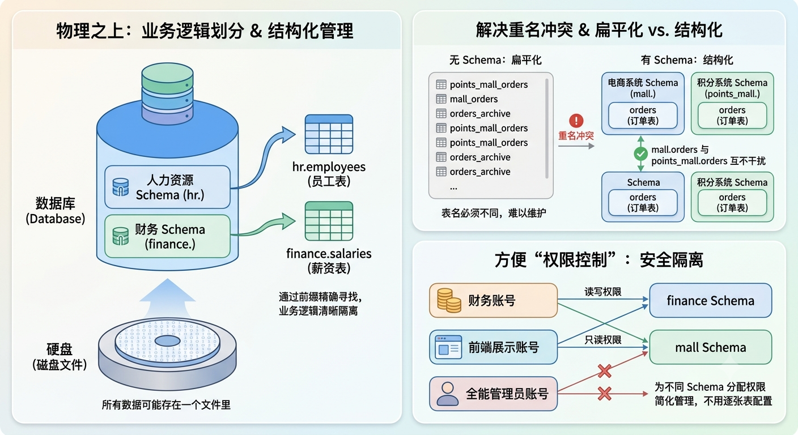

### 常见数据库的 Schema 差异

不同的数据库对 Schema 的实现理解稍微有一点点不同：

| **数据库**              | **关系层级**                        | **特点描述**                                                 |
| ----------------------- | ----------------------------------- | ------------------------------------------------------------ |
| **PostgreSQL / Oracle** | `Database` ➔ **`Schema`** ➔ `Table` | 最标准的实现。一个数据库下可以创建多个 Schema，每个 Schema 下包含多张表。 |
| **MySQL / MariaDB**     | `Database` **就是** **`Schema`**    | 在 MySQL 中，`CREATE DATABASE` 和 `CREATE SCHEMA` 是完全等价的同义词。它没有严格的三层结构。 |
| **SQL Server**          | `Database` ➔ **`Schema`** ➔ `Table` | 也是标准的独立层级，默认的 Schema 叫 `dbo`。                 |

## 默认模式（`public`）

核心定义：**PostgreSQL 默认提供了一个 `public` 全局模式**，**所有的 Table 表默认都放在 `public` 模式下管理**。

- 在实际场景中，最佳实践是**创建和使用自定义 Schema 模式**，并在**新建 Table 表时指定要划分的其他 Schema 模式，如果不指定，则默认放在 `public` 默认模式中**。

## 模式结构的定义（DDL）

在 PostgreSQL 中，**模式（Schema）是数据库内的一个命名空间**，可以把它想象成存放数据库对象（如表、视图、函数等）的“文件夹”。它主要用于逻辑组织数据和权限管理，能有效避免对象名称冲突。

PostgreSQL 对 Schema 模式的操作主要围绕**创建 (CREATE)**、**修改 (ALTER)** 和**删除 (DROP)** 这三个核心命令展开。

> 核心要点：在 PostgreSQL 中，最佳实践是**把 Schema 模式当做 Database 数据库来使用**。

### `CREATE` 创建模式

- 普通创建一个 Schema 模式

  ```postgresql
  CREATE SCHEMA <模式名>; -- 如果已存在，则报错
  
  CREATE SCHEMA IF NOT EXISTS <模式名>; -- 如果不存在，则创建
  ```

  可以**在 `psql` 命令行工具中使用 `\dn` 查看当前数据库下的所有模式**。

- **创建一个 Schema 模式，同时指定授权给某个用户**

  ```postgresql
  CREATE SCHEMA IF NOT EXISTS <模式名> AUTHORIZATION <用户名>; -- 用户名 与 模式名 不同
  
  CREATE SCHEMA IF NOT EXISTS AUTHORIZATION <用户名>; -- 用户名 与 模式名 相同
  ```

  

- **创建一个 Schema 模式，并在该 Schema 模式下创建一张表、视图、授权用户...**

  ```postgresql
  CREATE SCHEMA <模式名>
      CREATE TABLE <表名> (<字段名> <数据类型约束>,...)
      CREATE VIEW <视图名> AS <SELECT 查询子句>
      GRANT USER <用户名>;
      
  -- 示例：
  CREATE SCHEMA company
      CREATE TABLE employees (id INT, name TEXT)
      CREATE VIEW staff AS SELECT * FROM employees;
  ```

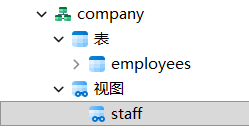

### `ALTER` 修改模式

当 Schema 模式已创建，需要调整其配置时，可以使用 `ALTER SCHEMA` 命令。

如下：

- **重命名模式**

  ```postgresql
  ALTER SCHEMA <模式名> RENAME TO <新模式名>;
  ```

- **更改模式的所有者用户**

  ```postgresql
  ALTER SCHEMA <模式名> OWNER TO <其他用户>;
  ```

  示例：

  ```postgresql
  -- 示例：
  CREATE USER hkj WITH PASSWORD '123456'; -- 创建用户
  
  SELECT CURRENT_USER; -- postgres
  
  ALTER SCHEMA company OWNER TO hkj; -- 将 company 模式授权给 hkj 用户
  
  -- 根据 pg_authid 系统用户表，查询出与之相关的 pg_catalog.pg_namespace 系统模式表中的模式、所属用户角色
  SELECT 
      n.nspname AS "模式名",
      p_a.rolname AS "所有者角色名"
  FROM 
      pg_catalog.pg_namespace n
  LEFT JOIN 
      pg_catalog.pg_authid p_a ON n.nspowner = p_a.oid;
  
  -- 查询结果：
  public	    			pg_database_owner
  storages				postgres
  information_schema		postgres
  pg_catalog				postgres
  pg_toast				postgres
  company	    			hkj
  ```

### `DROP` 删除模式

⚠️注：删除 Schema 模式是一个不可逆的操作，会移除模式内所有数据。

如下：

- **删除一个空模式（模式中没有任何表、视图...对象）**

  ```postgresql
  DROP SCHEMA <模式名>;
  
  -- 两者等价
  
  DROP SCHEMA IF EXISTS <模式名>; -- 增加 IF EXISTS 判断：如果存在、避免风险
  ```

- **选择性删除 Schema 模式**

  ```postgresql
  DROP SCHEMA IF EXISTS <模式名> <CASCADE | RESTRICT>;
  ```

  - **`CASCADE` (级联) ：强制删除，把该模式下所有数据库对象（表、视图、函数...）一并全部删除**

    > 即不管该模式下有没有数据，都彻底删除干净。

  - **`RESTRICT` (限制) ：如果该模式下定义了下属的数据库对象（如表、视图等），则拒绝该语句的执行。当该模式没有任何下属的对象时才能执行**。

    > 即如果该模式下有数据，那么则会执行出错，必须要先将此模式下的所有数据删除完，才能删除该模式。

## `search_path` 搜索路径

PostgreSQL 内部提供了一个 **`search_path` （搜索路径）的模式寻路机制**。它决定了**当不指定某个 Schema 模式而直接查询某个数据库对象（表、视图、函数...）时，PostgreSQL 应该如何去 “智能查找” 到对应的目标**。

### 为什么需要 `search_path` ？

假设一个数据库中有两张表，分别属于不同的 Schema 模式：

- `production.users` （生产环境的用户表）
- `test.users`（测试环境的用户表）

如果直接执行：

```postgresql
SELECT * FROM users;
```

PostgreSQL 内部会自动通过**`search_path`（搜索路径）**来**决定查找哪个模式**。

### `SHOW search_path` 查看值

可以执行查看 `search_path` 存储的是什么内容：

```postgresql
SHOW search_path;

-- "$user", public
```

默认情况下，**`search_path` 存储的是 `"$user", public`**，代表了 **PostgreSQL 查找数据库对象（表、视图、函数...）的顺序路径**。

### 模式查找机制

当执行：

```postgresql
SELECT * FROM users;
```

PostgreSQL 会**根据 `search_path` 当前的值（路径）去逐条查找**：

- **`pg_catalog`（不可见）**：PostgreSQL 会**第一时间去 `pg_catalog` 系统目录空间里**，**查找用户是否想要引用某个系统表**。

  > 表现形式：当**使用 `SELECT * FROM pg_namespace`** 时，其实 PostgreSQL 内部是**自动补全了 `pg_catalog.pg_namespace` ，所以才能找到**。

- **`"$user"` （动态变量）**：如果不是系统表，则**去与当前用户名同名的 Schema 模式里查找**

  > 表现形式：如果当前登录的数据库用户是 `alice`，PostgreSQL 就会去查找名为 `alice` 的 Schema；如果换成 `bob` 登录，它就会去查找名为 `bob` 的 Schema。如果同名 Schema 不存在，它会直接跳过，不会报错。

- **`public`（全局模式）**：以上两种路径都找不到，则**去 `public` 全局 Schema 模式里查找**

如果以上 3 种模式里都**找不到要操作的数据库对象（Table 表、View 视图...）**，则 **PostgreSQL 报错**。

> ```
> pg_catalog（系统目录空间） → "$user"（当前用户同名的 Schema 模式） → public（全局模式）
> ```

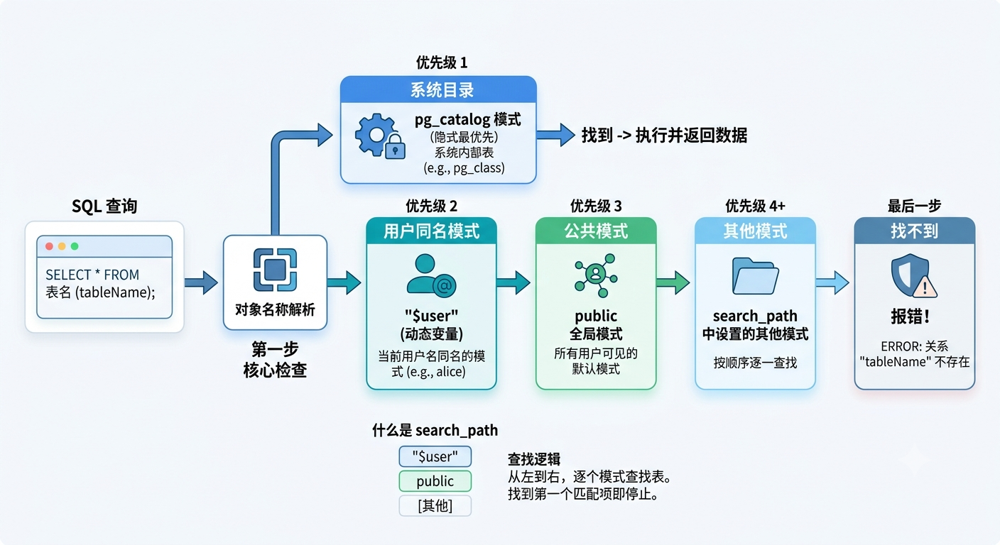

### 设置搜索路径（切换当前模式）

核心作用：**设置 `search_path`（搜索路径）之后，可以让 PostgreSQL 知道该怎么按什么顺序查找对应操作的数据库对象（表、视图、函数...）**。

#### 核心要点

​	**一个数据库中有多个 Schema 模式**，**不同 Schema 模式之间**是**隔离**的，如果**设置了 `search_path` （搜索路径）**，那么 PostgreSQL **只会去 `search_path` 中对应的 Schema 模式中去查找**，所以**设置 `search_path`（搜索路径）**等同于**切换当前 Schema 模式**。

> 例如：假设一个数据库中有以下 3 个模式：
>
> - `marketing` 模式：`customers` 会员表
> - `finance` 模式：`customers` 会员表
>
> ```postgresql
>  SET search_path TO marketing, public; -- 设置了 search_path 搜索路径
>  
>  SELECT CURRENT_SCHEMA; -- marketing
>  
>  SELECT * FROM customers; -- 则只会去 marketing 和 public 模式中查找 customers 表，不会去 finance 模式
> ```
>
> 

#### 设置方式

如果觉得每次都写 `marketing.xxx` 太麻烦，可以先用 `SET search_path` 切换“目的地”，然后直接建表、查询等操作。

有 2 种方式：

##### `SET` 临时设置（仅当前会话）

核心作用：如果希望**在当前连接中，优先按 `schema_a` → `public` 模式的顺序查找**，可以这样设置：

```postgresql
SET search_path TO schema_a, public;
```

表示：**SQL 查询会优先从 `schema_a` 中查找数据库对象（表、视图、函数...）**，并且**新创建的数据库对象（如 `CREATE TABLE...、CREATE VIEW...,`） 都会默认放在 `schema_a` 模式中**。

```postgresql
-- 1. 把搜索路径切到 marketing
SET search_path TO marketing;

-- 2. 直接建表，此时这张表会自动落入 marketing 模式中
CREATE TABLE customers (
    id INT,
    name VARCHAR(50)
);

-- 3. 查找 marketing.customers 表，如果找不到再去 public 模式里找
SELECT * FROM customers;
```

如果有**多个 Schema 模式**时，可以把 `search_path` 配置成一个**列表**，让 Postgres 跨模式寻找对象：

```postgresql
SET search_path TO finance, marketing, public;

SELECT * FROM users JOIN customers ON ...

-- 先去 finance 模式中找，再去 marketing 模式中找，最后去 public 模式中找
```

以此，可以在编写 SQL 语句时，直接**扁平化操作表名、视图名、函数名**...

##### 永久设置（数据库、用户）

如果**不想每次连接都设置 `search_path`（搜索路径）**，可以进行**持久化设置**：

- 针对整个数据库：

  ```postgresql
  ALTER DATABASE testdb SET search_path TO finance, marketing;
  
  -- testdb 数据库中有 3 个模式：
  -- 		finance 模式：customers 会员表
  --		marketing 模式：customers 会员表
  -- 		public 模式：user 员工表
  
  SELECT * FROM user; -- 报错：关系 "users" 不存在（public 模式已经被排除）
  
  SELECT * FROM customers; -- 先找到的是 finance.customers 表。
  ```

- **针对某个特定用户**：

  ```postgresql
  ALTER USER myuser SET search_path TO myschema, public;
  ```

#### 最佳实践（排除 public 模式）

默认情况下，PostgreSQL 中的**任何用户都可以往 `public` 模式里创建数据库对象（表、视图、函数...）**。

**如果 `search_path` 中包含 `public`**，**恶意用户**可能会**创建一张与系统表或核心业务表同名的病毒表，从而导致 “安全隐患”（路径劫持）**。

所以，最好的做法是：

- **在每次 SQL 操作数据库对象（表、视图、函数...）时，都显式指定所属的 Schema**：

  ```postgresql
  SELECT * FROM marketing.customers;
  
  SELECT * FROM finance.customers;
  ```

- **直接通过 `SET ... TO` 排除 `public`，只留下业务核心模式**：

  ```postgresql
  SET search_path TO finance, marketing; -- 只查找 finance, marketing 两个模式，public 模式留空
  ```

## 查看模式的元信息

### `pg_catalog` 系统目录

- **`pg_catalog` 系统目录（模式）** 提供了一个 **`pg_namespace` 模式目录表**，包含了**当前数据库中创建的所有 Schema 模式信息**。

#### `pg_namespace` 模式目录表

> Schema 模式本质上是一个命名空间，所以 PostgreSQL 内部 **`namespace` （命名空间） = Schema 模式**

PostgreSQL 中一个非常重要的**系统目录表**，它属于 `pg_catalog` 模式。它的作用很简单但很核心：**存储了数据库中所有模式（Schema）的定义信息**。

- **每 `CREATE SCHEMA` 创建的每一个模式，都会在这里有一条对应的记录**

简单理解：

- 可以把它理解为 PostgreSQL 中每一个数据库的 “模式注册表”

- **逻辑命名：所有的系统表都使用 `pg_catalog` 模式进行分组，所以可以使用 `pg_catalog.pg_namespace` 来引用**
- **权限**：**普通用户默认可以查询该表（只读）**，但**只能看到自己有权限访问的数据库记录**

> ⚠️注意：谨慎通过 `ALTER`、`DROP`、`DELETE` 、`UPDATE` 等命令来修改 `pg_namespace` 表的内容，因为可能会造成系统损坏！

##### 核心字段

| 字段名         | 类型        | 说明                                                         |
| :------------- | :---------- | :----------------------------------------------------------- |
| **`oid`**      | `oid`       | 对象标识符，是此模式在系统中的**唯一ID**，常用于与其他系统表关联 |
| **`nspname`**  | `name`      | 模式的**名称**，如 `public`、`pg_catalog`                    |
| **`nspowner`** | `oid`       | 模式的**所有者**的角色ID，可以通过关联 `pg_authid` 表查到具体用户名 |
| **`nspacl`**   | `aclitem[]` | 模式的**访问权限列表**，存储了该模式上的权限设置             |

##### 常见 SQL 查询操作

- **查看当前数据库下的所有 Schema 模式信息**

  ```postgresql
  SELECT * FROM pg_namespace ORDER BY oid; -- pg_catalog.pn_namespace 等价
  
  -- 输出结果：
  oid 	nspname				nspowner	nspacl
  11		pg_catalog			10			{postgres=UC/postgres,=U/postgres}
  99		pg_toast			10	
  2200	public				6171		{pg_database_owner=UC/pg_database_owner,=U/pg_database_owner}
  14860	information_schema	10			{postgres=UC/postgres,=U/postgres}
  16641	storages			10	
  16642	company				16654	
  ```

- **查看模式的所有者（关联 `pg_authid` 系统用户角色表）**

  ```postgresql
  SELECT ns.nspname AS schema_name, 
  			 o.rolname AS owner_name
  FROM pg_namespace ns 
  JOIN pg_authid o ON ns.nspowner = o.oid 
  ORDER BY ns.nspname;
  
  -- 输出结果：
  schema_name 		owner_name
  company				hkj
  information_schema	postgres
  pg_catalog			postgres
  pg_toast			postgres
  public				pg_database_owner
  storages			postgres
  ```

- **查看某个表属于哪个 Schema 模式（配合 `pg_class` 或 `pg_tables` 查出对应的数据记录）**

  ```postgresql
  SELECT * FROM pg_class c
  JOIN pg_namespace n ON c.relnamespace = n.oid
  WHERE c.relname = 'file'
  ```

- ...

### `information_schema.schemata` 视图查询

- **`information_schema.schemata` 视图：存储的是数据库中所有 Schema 模式的 SQL 查询视图结果**

```postgresql
-- 通过标准化视图查询模式（底层也是查 pg_namespace）
SELECT schema_name 
FROM information_schema.schemata;
```

### psql 命令行工具

#### `\dn` 查看模式信息

```shell
test=# \dn

      List of schemas
  Name  |       Owner
--------+-------------------
 public | pg_database_owner
(1 row)
```

# Table 表操作

Table 表是所有关系型数据库的**基本数据存储与执行单元**，表现为 **行 & 列 的二维结构**。

## 表结构的设计（DDL）

### `CREATE TABLE` 创建基本表

#### 基本语法

- **指定所属 Schema 模式**：

  ```postgresql
  CREATE TABLE <模式名>.<表名>
  (
  	<列字段名> <数据类型>,
      ...
  );
  
  -- 切换模式
  SET search_path TO <模式名>;
  CREATE TABLE <表名>
  (
  	<列字段名> <数据类型>,
      ...
  );
  ```

- **不指定，默认放在 `public` 模式下**：

  ```postgresql
  CREATE TABLE <表名>
  (
  	<列字段名> <数据类型>,
      ...
  );
  ```

- **创建 Schema 模式的同时，创建一张表**：

  ```postgresql
  CREATE SCHEMA <模式名>
      CREATE TABLE <表名> (<列字段名> <数据类型>,...)
      CREATE VIEW <视图名> AS <SELECT 查询子句>
      GRANT USER <用户名>;
  ```

示例：

```postgresql
-- 在 markteing 模式下，创建一个 member 会员表
CREATE TABLE marketing.members
(
  	"id" INTEGER, -- 会员ID、int4 类型
	member_name TEXT, -- 会员名、文本类型
    age SMALLINT, -- 年龄、小整数类型
)
```

> ⚠️注意点：
>
> - 如果**列字段名与关键字冲突，则使用 `""` 双引号包裹**
>
> - `''` 单引号 和 `""` 双引号的区别：
>
>   **单引号包围的是“值”（字符串），双引号包围的是“名字”（标识符）**
>
>   - `''` 单引号：
>
>     用于 `COMMENT` 注释、`INSERT` 插入数据、`WHERE` 查询数据条件...时使用。
>
>     ```postgresql
>     SELECT * FROM product WHERE name = '苹果手机';
>     -- '苹果手机' 是一个字符串值
>         
>     INSERT INTO product (datetime) VALUES ('2026-06-19 12:00:00');
>     -- '2026-06-19 12:00:00' 是一个日期时间字符串
>     
>     
>     COMMENT ON COLUMN product.id IS '产品 ID';
>     COMMENT ON COLUMN product.name IS '产品名称';
>     COMMENT ON COLUMN product.datetime IS '上架时间';
>     ```
>
>   - `""` 双引号：
>
>     用于表名、列字段名、对象名、`AS` 别名...时使用。
>
>     ```postgresql
>     -- 建表时加了双引号，保留了大写
>     CREATE TABLE "User_Info" (
>         "UserId" INT,
>         name TEXT
>     );
>         
>     -- 查询时：必须严格带双引号和大小写
>     SELECT "UserId", "UserName" AS "用户名" FROM "User_Info"; 
>         
>     -- 错误查询：不加双引号，Postgres 会去找小写的 userid 和 user_info，导致报错
>     SELECT UserId FROM User_Info;
>     ```

#### 数据类型

PostgreSQL（通常简称为 Postgres）以其强大、丰富且可扩展的数据类型系统而闻名。它不仅支持标准的 SQL 基础类型，还自带了许多高级和特有的数据类型。

##### 📌数值类型

定义：用于存储整数、小数和浮点数。

- **整数**：

  | **类型名称**   | 别名/关键词       | **存储大小** | **描述**       | **范围 / 精度**            | 示例                |
  | -------------- | ----------------- | ------------ | -------------- | -------------------------- | ------------------- |
  | **`smallint`** | **`int2`**        | 2 字节       | 小范围整数     | -32,768 到 +32,767         | `123`，`-567`       |
  | **`integer`**  | **`int`、`int4`** | 4 字节       | **常用**的整数 | -21.4亿 到 +21.4亿         | `123456`，`-987654` |
  | **`bigint`**   | **`int8`**        | 8 字节       | 大范围整数     | 极大，适用于主键或高频计数 | `987654321012345`   |

- **浮点数**：

  | **类型名称**                | 别名/关键词        | **存储大小** | **描述**               | **范围 / 精度**     | 示例               |
  | --------------------------- | ------------------ | ------------ | ---------------------- | ------------------- | ------------------ |
  | **`decimal` / `numeric()`** | **`numeric(p,s)`** | **变长**     | 用户指定的准确精度     | 最多 131,072 位数字 | `123.45`，`999.99` |
  | **`real`**                  | **`float4`**       | 4 字节       | 单精度浮点数（不精确） | 6 位十进制精度      | `3.14159`          |
  | **`double precision`**      | **`float8`**       | 8 字节       | 双精度浮点数（不精确） | 15 位十进制精度     | `3.14159265358979` |

  > **`numeric(p,s)`**：高精度十进制数，适合金融等对精度要求高的场景，可指定**精度(p)**和**标度(s)**。
  >
  > - **`p`：总位数**
  > - **`s`：小数点后的位数**
  >
  > 例如：`numeric(10,2)` 表示最长 10 位，小数点后保留 2 位小数。1234567891.20

- **在 `INSERT` 插入时，从 1 开始自动递增的整数（常用于定义 `PRIMARY KEY` 主键列）**

  | **类型名称**         | 别名/关键词             | **存储大小** | **描述**   | **范围 / 精度**                |
  | -------------------- | ----------------------- | ------------ | ---------- | ------------------------------ |
  | **`smallserial`**    | **`serial2`**           | 2 字节       | 自增小整数 | 1 到 32,767                    |
  | **`serial`**（常用） | **`serial`、`serial4`** | 4 字节       | 自增整数   | 1 到 2,147,483,647             |
  | **`bigserial`**      | **`serial8`**           | 8 字节       | 自增大整数 | 1 到 9,223,372,036,854,775,807 |

  > 📌 **注意：** **`serial` 并不是真正的类型**，它只是一个**语法糖**，底层会**自动创建一个序列（Sequence）并将列设为默认自增**。在现代 PG 中，更**推荐使用**标准 SQL 的 **`GENERATED ALWAYS AS IDENTITY`**。

##### 📌字符类型

定义：Postgres 的字符类型在性能上没有本质区别（在很多其他数据库中 `varchar` 比 `text` 快，但在 PG 中它们底层存储方式相同）。

| **类型名称**        | 别名/关键词                | **描述**                                    | 示例                          |
| ------------------- | -------------------------- | ------------------------------------------- | ----------------------------- |
| **`char(n)`**       | **`character(n)`**         | 定长字符串，**长度不足 `n` 时会用空格填充** | `'ABC '`                      |
| **`varchar(n)`**    | **`character varying(n)`** | 变长字符串，**有长度限制，最多 `n` 个字符** | `'Hello'`                     |
| **`text`**（✅️推荐） |                            | 变长字符串，**无长度限制（最大可存 1GB）**  | `'这是一段很长的文本内容...'` |

##### 📌日期/时间类型

定义：Postgres 拥有极度精准且强大的时间处理能力。

| 类型名称          | 描述                                                         | 示例                        |
| ----------------- | ------------------------------------------------------------ | --------------------------- |
| **`date`**        | 日期**（年-月-日）**                                         | `'2026-06-19'`              |
| **`time`**        | 一天中的时间（无时区）【**时:分:秒.毫秒**】`time(3)` 毫秒留 3 位小数 | `'14:30:25.123'`            |
| **`timetz`**      | 一天中的时间（含时区）【**时:分:秒**】                       | `'14:30:25+08'`             |
| **`timestamp`**   | 日期+时间（无时区）【**年-月-日 时:分:秒.毫秒**】            | `'2026-06-19 14:30:25.123'` |
| **`timestamptz`** | 日期+时间（含时区，推荐）【**年-月-日 时:分:秒（时区）**】   | `'2026-06-19 14:30:25+08'`  |
| **`interval`**    | 时间间隔/时间段                                              | `'3 days 5 hours'`          |

##### 📌布尔类型

| **类型名称**  | 别名/关键词 | **描述**                                          |
| ------------- | ----------- | ------------------------------------------------- |
| **`boolean`** | **`bool`**  | 仅接受 **`true`、`false`（逻辑布尔值）和 `null`** |

> 输入时：
>
> - **`'t'`, `'true'`, `'y'`, `'yes'`, `'1'`** 都会被识别为**真值**
> - **`'f'`, `'false'`, `'n'`, `'no'`, `'0'`** 会被识别为**假值**

##### 📌JSON/XML 类型

定义：常用于 **高性能文档型数据（NoSQL）** 的应用。

| 类型名称            | 描述                                                         | 示例                                                         |
| ------------------- | ------------------------------------------------------------ | ------------------------------------------------------------ |
| **`json`**          | **文本格式JSON**（保留格式，处理慢）                         | `'{"name": "张三", "age": 30}'`                              |
| **`jsonb`**（推荐） | **二进制格式JSON**（删除空格，支持 `GIN` 索引，处理快，推荐） | `'{"name": "张三", "age": 30}'`<br />（存储时会被优化为二进制格式） |
| **`xml`**           | **文本 XML 格式**                                            | `<x>...</x>`                                                 |

##### 📌二进制数据类型

| **类型名称** | **描述**                       | 示例                                  |
| ------------ | ------------------------------ | ------------------------------------- |
| **`bytea`**  | 存储二进制数据（图片、文件等） | `\x48656c6c6f`（十六进制表示"Hello"） |

##### 📌数组类型

定义：Postgres 允许将字段定义为多维数组，基础类型几乎都可以变成数组。

| **类型名称**    | **描述**         | 示例                              |
| --------------- | ---------------- | --------------------------------- |
| **`integer[]`** | **整数数组**     | `[1,2,3]`                         |
| **`text[][]`**  | **二维文本数组** | `['postgres', 'database', 'sql']` |

##### 📌货币类型

定义：由于受本地化（Locale）影响较大，**实际开发中更推荐使用 `numeric`**。

| **类型名称** | **描述**                       | 示例        |
| ------------ | ------------------------------ | ----------- |
| **`money`**  | **带货币符号的金额**，精度固定 | `$1,234.56` |

##### 📌UUID（全局唯一标识符）

| **类型名称** | **描述**                                                     | 示例                                     |
| ------------ | ------------------------------------------------------------ | ---------------------------------------- |
| **`uuid`**   | 通用唯一标识符（128位）<br />比直接用 `text` 存储更省空间（仅 16 字节），且提供格式有效性检查 | `'550e8400-e29b-41d4-a716-446655440000'` |

##### 📌网络地址类型

定义：专门针对网络数据的优化类型，支持子网掩码检索和计算。

| 类型名称       | 描述                             | 示例                                  |
| -------------- | -------------------------------- | ------------------------------------- |
| **`inet`**     | IPv4或IPv6主机地址               | `'192.168.1.100'`，`'2001:db8::1'`    |
| **`cidr`**     | IPv4或IPv6网络地址（含子网掩码） | `'192.168.1.0/24'`，`'2001:db8::/32'` |
| **`macaddr`**  | MAC地址（48位）                  | `'08:00:2b:01:02:03'`                 |
| **`macaddr8`** | MAC地址（EUI-64格式，64位）      | `'08-00-2b-01-02-03-04-05'`           |

##### 📌位串类型（bit）

| 类型名称             | 别名/关键字  | 描述     | 示例                |
| -------------------- | ------------ | -------- | ------------------- |
| **`bit(n)`**         | -            | 定长位串 | `'10101'`（bit(5)） |
| **`bit varying(n)`** | **`varbit`** | 变长位串 | `'101'`             |

##### 📌文本搜索类型

常用于 **全文检索（`Elasticsearch`）**的应用。

| 类型名称       | 描述                     | 示例                                        |
| -------------- | ------------------------ | ------------------------------------------- |
| **`tsvector`** | 已分词的标准化的搜索文档 | `'张三':2 '李四':1`（表示分词后的位置信息） |
| **`tsquery`**  | 文本搜索查询条件         | `'张三' & '李四'`                           |

##### 📌几何类型

定义：用于在二维平面上表示数据，更高级的空间几何推荐使用 **PostGIS（地理位置系统）** 扩展。

| 类型名称      | 描述                 | 示例                                                         |
| ------------- | -------------------- | ------------------------------------------------------------ |
| **`point`**   | 二维平面上的点       | `'(1.5, 2.3)'`                                               |
| **`line`**    | 无限长的直线         | `'{1, -1, 0}'`（表示 y = x）                                 |
| **`lseg`**    | 线段                 | `'[(1,2), (3,4)]'`                                           |
| **`box`**     | 矩形（由对角点定义） | `'((1,2), (3,4))'`                                           |
| **`path`**    | 路径（开放或闭合）   | `'[(1,2), (3,4), (5,6)]'`（开放路径） `'((1,2), (3,4), (5,6))'`（闭合路径） |
| **`polygon`** | 多边形               | `'((1,2), (3,4), (5,6), (1,2))'`                             |
| **`circle`**  | 圆（中心点+半径）    | `'<(1,2), 3.5>'`                                             |

##### 其他类型

| 类型名称          | 描述                                 | 示例                                       |
| ----------------- | ------------------------------------ | ------------------------------------------ |
| **`pg_lsn`**      | 日志序列号（用于复制和恢复）         | `'1/2A3B4C5D'`                             |
| **`pg_snapshot`** | 事务ID快照（用于事务隔离）           | `'100:4:100,102'`                          |
| **`xml`**         | XML格式数据                          | `'<book><title>PostgreSQL</title></book>'` |
| **`oid`**         | 对象标识符（用来作为系统表的主键）   | `12345`                                    |
| **`name`**        | 用于对象名称的字符串类型（系统内部） | `'mytable'`                                |
| **`refcursor`**   | 游标引用（用于PL/pgSQL函数返回游标） | `'my_cursor'`                              |

#### 自增列（`SERIAL` & `IDENTITY`）

在 PostgreSQL 中提供了 **`SERIAL`** 和 **`GENERATED ALWAYS AS IDENTITY`（SQL 标准自增列）**，它们都是用来实现**列字段值的自增功能**的，但它们的**实现机制、对标准的支持以及安全限制**有着本质的区别。

简单来说，**`SERIAL`** 是 PostgreSQL 特有的**“老一代”语法**，而 **`IDENTITY`** 是 SQL:2003 标准引入的**“新一代”推荐语法**。

> [!IMPORTANT]
>
> 共同作用：**在 `INSERT` 插入 Column 列数据时，自动取值从 1 开始自动递增的整数（常用于定义 `PRIMARY KEY` 主键列）**。

##### 核心区别

| **特性**      | **SERIAL (传统方式)**                                    | **GENERATED ALWAYS AS IDENTITY (现代方式)**                |
| ------------- | -------------------------------------------------------- | ---------------------------------------------------------- |
| **标准支持**  | PostgreSQL 特有（非标准）                                | 符合 **SQL:2003 标准** (通用性强)                          |
| **底层实现**  | 自动创建一个序列，并将列的 `DEFAULT` 值设为 `nextval()`  | 列与序列紧密绑定，作为列的属性存在                         |
| **显式插入**  | 允许直接显式插入值（容易导致序列冲突）                   | **默认不允许**显式插入（除非加 `OVERRIDING SYSTEM VALUE`） |
| **权限管理**  | 需要单独处理序列的权限                                   | 只需处理表的权限，序列权限自动跟随                         |
| **删除表/列** | 早期版本中删除列可能遗留序列（现已优化，但仍有关联风险） | 删除列或表时，序列自动干净利落地删除                       |

> 💡选型建议：
>
> PostgreSQL 官方从 10.0 版本开始引入 `IDENTITY`，并且**强烈建议在新的开发中彻底废弃 `SERIAL`，全面拥抱 `IDENTITY`**。
>
> - 🚨 **避免使用 `SERIAL`：** 除非你需要兼容非常老旧的 PostgreSQL 版本（10 以前），或者某些第三方老旧框架只认 `SERIAL`。
> - ✅ **优先使用 `GENERATED ALWAYS AS IDENTITY`：** 它可以帮你写出更符合 SQL 标准、更安全、更不容易因手动插入数据而崩溃的健壮系统。

##### `SERIAL` 传统方式

| **类型名称**         | 别名/关键词             | **存储大小** | **描述**   | **范围 / 精度**                |
| -------------------- | ----------------------- | ------------ | ---------- | ------------------------------ |
| **`smallserial`**    | **`serial2`**           | 2 字节       | 自增小整数 | 1 到 32,767                    |
| **`serial`**（常用） | **`serial`、`serial4`** | 4 字节       | 自增整数   | 1 到 2,147,483,647             |
| **`bigserial`**      | **`serial8`**           | 8 字节       | 自增大整数 | 1 到 9,223,372,036,854,775,807 |

> 📌 **注意：** **`serial` 并不是真正的类型**，它只是一个**语法糖**，底层会**自动创建一个序列（Sequence）并将列设为默认自增**。在现代 PG 中，更**推荐使用**标准 SQL 的 **`GENERATED ALWAYS AS IDENTITY`**。

写法：

```postgresql
CREATE TABLE <模式名>.<表名>
(
	<列字段名> SERIAL <完整性约束>,
    ...
)
```

> ```postgresql
> INSERT INTO hr.test (id, name) VALUES (10, 'Tom');
> ```
>
> 这会导致显式插入的数据抢占了未来的自增位置。当序列自增到 `10` 时，插入就会因为**主键冲突**而报错。此外，如果把这个表的结构导出（`pg_dump`），会发现它被打散成了序列和默认值两部分，不够优雅。

##### `GENERATED ALWAYS AS IDENTITY` 现代写法

###### 基本写法

```postgresql
CREATE TABLE <模式名>.<表名>
(
	<列字段名> INTEGER GENERATED ALWAYS AS IDENTITY <完整性约束>,
    ...
)
```

这里的 `<列字段名>` 被声明为**由系统总是（ALWAYS）生成的身份列**。

> 拆解说明：
>
> - **`GENERATED` 创建一个生成列**：它是一种**特殊类型的列，它的值不能被手动插入或更新，而是由一个表达式自动计算出来的**
> - **`ALWAYS AS xxx`：总是由 xxx**
> - **`IDENTITY`：自增值**
>
> 合起来：**`GENERATED ALWAYS AS IDENTITY`** 表示**该列的值是一个总是由（`ALWAYS AS`）系统自增产生值（`IDENTITY`）的生成列（`GENERATED`）**。

###### 插入数据机制

​	PostgreSQL 规定**由 `GENERATED ALWAYS AS IDENTITY` 修饰的列**，在 **`INSERT` 插入数据时不允许被显式传入值**，否则会拒绝插入，从而**彻底避免了主键冲突和序列错乱**的问题。

> **`IDENTITY` 自增列**：本质上是一个**自动从 1 开始填充的 `DEFAULT` 默认值**。

示例：

```postgresql
CREATE TABLE finance.cup
(
	cup_id INTEGER GENERATED ALWAYS AS IDENTITY PRIMARY KEY,
	cup_name TEXT
)

-- 只需显式传入 cup_name 字段值即可，cup_id 字段的值会是一个自动填充为 从 1 开始的自增值
INSERT INTO finance.cup(cup_name) VALUES('马克杯');
INSERT INTO finance.cup(cup_name) VALUES('水杯');
INSERT INTO finance.cup(cup_name) VALUES('量角杯');
INSERT INTO finance.cup(cup_name) VALUES('烧杯');

SELECT * FROM finance.cup;

/*
cup_id   cup_name
1		 马克杯
2		 水杯
3		 量角杯
4		 烧杯
*/

-- ❌️以下写法会报错
INSERT INTO finance.cup (cup_id, cup_name) VALUES (10, 'Tom');
-- 报错：ERROR: cannot insert into column "cup_id"
-- DETAIL: Column "cup_id" is an IDENTITY column defined as GENERATED ALWAYS.
```

###### `OVERRIDING SYSTEM VALUE` 手动强制插入

如果确实因为数据迁移等原因需要**在 `INSERT` 时手动插入 `GENERATED ALWAYS AS IDENTITY` 自增列的值**。

可以选择：

- **强制覆盖（推荐）：** 保持 `ALWAYS`，但**在 `INSERT` 插入时加上 `OVERRIDING SYSTEM VALUE` 关键字**，表示**覆盖系统值**

示例：

```postgresql
INSERT INTO finance.cup(cup_id, cup_name) OVERRIDING SYSTEM VALUE VALUES(15, '玻璃杯');

SELECT * FROM finance.cup;

/*
cup_id   cup_name
1		 马克杯
2		 水杯
3		 量角杯
4		 烧杯
15		 玻璃杯 -- cup_id 是手动强制插入的值，不再遵守自增规则
*/
```

#### `COMMENT` 注释

##### `COMMENT ON TABLE` 表注释

###### 基本语法

PostgreSQL **不支持**在表列中直接定义 `COMMENT`，必须**在表外使用 `COMMENT ON TABLE ... IS '...'` 命令**：

```postgresql
COMMENT ON TABLE <模式名>.<表名> IS '...';
```

示例：

```postgresql
-- 为 finance.customers 表的字段添加注释
COMMENT ON TABLE finance.customers IS '客服表';
```

###### 查看表的注释

当**使用 `COMMENT ON TABLE ... IS '...'` 命令为表的列字段添加上注释说明**之后，可以通过以下 2 种方式**查看字段的注释说明**：

- **psql 命令行工具查看**：

  ```sh
  $\dt+ <模式名>.<表名>
  ```

  示例：

  ```sh
  test=# \dt+ finance.customers
                                       List of relations
   Schema  |   Name    | Type  |  Owner   | Persistence | Access method | Size  | Description
  ---------+-----------+-------+----------+-------------+---------------+-------+-------------
   finance | customers | table | postgres | permanent   | heap          | 80 kB | 客服表
  (1 row)
  ```

  💡注：在 PostgreSQL 的底层逻辑里，注释（Comment）在系统字典中统一被称为 **Description（描述）**。

- **SQL**：

  - **通过 `pg_description` 系统表，查看某张表的表注释**：

    ```postgresql
    SELECT description 
    FROM pg_description 
    WHERE objoid = '你的表名'::regclass AND objsubid = 0;
    
    /*
    description
    客服表
    */
    ```

  - **通过 `pg_stat_user_tables` 系统催生视图，查看数据库中所有用户自定义表的表注释**：

    ```postgresql
    SELECT 
        relname AS 表名,
        obj_description(relid) AS 表注释
    FROM 
        pg_stat_user_tables;
        
        
    /*
    表名		  表注释
    test	
    users	
    customers	客服表
    product	
    person	
    */
    ```

##### `COMMENT ON COLUMN` 列注释

###### 基本语法

PostgreSQL **不支持**在表列中直接定义 `COMMENT`，必须**在表外使用 `COMMENT ON COLUMN ... IS '...'` 命令**：

```postgresql
COMMENT ON COLUMN <模式名>.<表名>.<列字段名> IS '...';
```

示例：

```postgresql
SET search_path TO finance; -- 切换为 finance 模式

CREATE TABLE product(
	"id" INTEGER PRIMARY KEY GENERATED ALWAYS AS IDENTITY, -- int 数值类型、主键、自增
	"name" TEXT NOT NULL, -- 文本类型、非空
	datetime TIMESTAMP NOT NULL DEFAULT CURRENT_TIMESTAMP -- 时间类型、非空、默认值为当前系统时间戳
);

-- 为 finance.customers 表的字段添加注释
COMMENT ON COLUMN customers.id IS '客服 ID';
COMMENT ON COLUMN customers.name IS '客服名称';
COMMENT ON COLUMN customers.datetime IS '上线时间';
```

###### 查看表列字段的注释

当**使用 `COMMENT ON COLUMN ... IS '...'` 命令为表的列字段添加上注释说明**之后，可以通过以下 2 种方式**查看字段的注释说明**：

- **psql 命令行工具查看**：

  ```sh
  $\d+ <模式名>.<表名>
  ```

  示例：

  ```sh
  test=# \d+ finance.customers
                                                 Table "finance.customers"
   Column |         Type          | Nullable | Default | Storage  | Compression | Stats target | Description
  --------+-----------------------+----------+---------+----------+-------------+--------------+-------------
   id     | integer               |          |         | plain    |             |              | 产品 ID
   name   | character varying(10) |          |         | extended |             |              | 产品 ID
  Access method: heap
  ```

  💡注：在 PostgreSQL 的底层逻辑里，注释（Comment）在系统字典中统一被称为 **Description（描述）**。

- **SQL**：

  - **通过 `pg_description` 系统表，查看某张表的 “所有字段” 的注释**：

    ```postgresql
    SELECT 
        a.attname AS 字段名,
        format_type(a.atttypid, a.atttypmod) AS 数据类型,
        col_description(a.attrelid, a.attnum) AS 字段注释
    FROM 
        pg_attribute a
    WHERE 
        a.attrelid = '你的表名'::regclass  -- 替换为你的表名
        AND a.attnum > 0 
        AND NOT a.attisdropped
    ORDER BY 
        a.attnum;
        
    /**
    id		integer					客服 ID
    name	character varying(10)	客服名称
    */
    ```

##### `pg_description` 系统注释表

PostgreSQL 提供了一个 **`pg_catalog.pg_description` 系统注释表**，专门用于**存储当前数据库中所有表、字段的注释说明**。

```postgresql
SELECT * FROM pg_description;

/*
description
...
snowball stemmer for yiddish language
configuration for yiddish language
PL/pgSQL procedural language
PL/pgSQL procedural language
产品 ID
产品名称
上架时间
客服表
...
*/
```

##### `pg_stat_user_tables` 系统注释视图

PostgreSQL 提供了一个 **`pg_stat_user_tables` 系统衍生视图**，专门用于**存储当前数据库中所有用户自定义的 Table 表的注释说明**。

```postgresql
SELECT 
    relname AS 表名,
    obj_description(relid) AS 表注释
FROM 
    pg_stat_user_tables;
    
    
/*
表名		  表注释
test		测试表
users		用户表
customers	客服表
product	
person	
*/
```

### `ALTER TABLE` 修改表结构

在 PostgreSQL 中，`ALTER TABLE` 命令用于**修改现有表的结构**。例如：添加列、删除列、修改数据类型，还是添加约束。

#### 表-操作

##### 基本语法

```postgresql
ALTER TABLE <模式名>.<表名> <表 | 列 操作>;

-- 切换为指定模式，在指定模式下操作其下的表
SET search_path TO <模式名>;

ALTER TABLE <表名> <表 | 列 操作>;
```

##### `RENAME TO` 重命名表

```postgresql
ALTER TABLE <模式名>.<表名> RENAME TO <新表名>;
```

示例：

```postgresql
SET search_path TO marketing; -- 切换为 marketing 模式操作它的表
SELECT tablename FROM pg_tables WHERE schemaname = CURRENT_SCHEMA AND tablename = 'customers';
-- 输出：customers

-- 示例：将 marketing 模式下的 customers 旧表名修改为 members 新表名
ALTER TABLE marketing.customers RENAME TO members;

SELECT tablename FROM pg_tables WHERE schemaname = CURRENT_SCHEMA AND tablename = 'members';
-- 输出：customers
```

##### `OWNER TO` 修改表的所有者

```postgresql
ALTER TABLE <模式名>.<表名> OWNER TO <所有者（用户名）>
```

示例：

```postgresql
CREATE USER super_manager; -- 创建一个 super_manager 用户角色

SELECT * FROM pg_roles; -- 查看数据库中的所有用户角色
-- postgres
-- super_manager

SET search_path TO marketing; -- 切换为 marketing 模式操作它的表

-- 查看 marketing 模式下的 members 表的所有者（用户角色）
SELECT tableowner FROM pg_tables WHERE schemaname = CURRENT_SCHEMA AND tablename = 'members';
-- postgres

-- 将 marketing 模式下的 members 表的所有者修改为 super_manager
ALTER TABLE marketing.members OWNER TO super_manager;

SELECT tableowner FROM pg_tables WHERE schemaname = CURRENT_SCHEMA AND tablename = 'members'; 
-- 输出：super_manager
```

##### `SET SCHEMA` 修改表的所属模式

```postgresql
ALTER TABLE <模式名>.<表名> SET SCHEMA <其他 Schema 模式名>
```

核心作用：**移动表到不同的模式/命名空间**。

示例：

```postgresql
SELECT schemaname FROM pg_tables WHERE tablename = 'members'; -- 查看 members 表的所属模式
-- marketing

-- 将 marketing 模式下的 members 表移动到 finance 模式下
ALTER TABLE marketing.members SET SCHEMA finance;

SELECT schemaname FROM pg_tables WHERE tablename = 'members'; -- 查看 members 表的所属模式
-- finance
```

#### 列字段-操作

##### `ADD COLUMN` 添加列字段

```postgresql
ALTER TABLE <模式名>.<表名> ADD COLUMN  <新列名> <数据类型> <完整性约束>;
```

示例：
```postgresql
SELECT 
	"column_name", data_type, is_nullable, column_default 
FROM information_schema.columns WHERE table_name = 'members'; -- 查看 members 表结构
/*
column_name data_type is_nullable column_default
id			integer	  YES	
name		character varying	  YES	
*/

-- 为 finance.members 表结构添加一个 age 列字段
ALTER TABLE finance.members ADD COLUMN age SMALLINT DEFAULT 18;
-- 添加一个 id 字段的同时设为自增主键
ALTER TABLE finance.members ADD COLUMN	id INTEGER PRIMARY KEY GENERATED ALWAYS AS IDENTITY;

SELECT 
	"column_name", data_type, is_nullable, column_default 
FROM information_schema.columns WHERE table_name = 'members'; -- 查看 members 表结构
/*
column_name data_type is_nullable column_default
id			integer	  YES	
name		character varying	  YES	
age			smallint  YES	      18
*/
```

##### `ALTER COLUMN TYPE` 修改数据类型

```postgresql
ALTER TABLE <模式名>.<表名> ALTER COLUMN <列字段名> TYPE <列名> <新数据类型>;
```

示例：

```postgresql
SELECT 
	"column_name", data_type, is_nullable, column_default 
FROM information_schema.columns WHERE table_name = 'members'; -- 查看 members 表结构
/* 
column_name data_type 			is_nullable column_default
id			integer	  			YES	
name		character varying	YES	
*/

-- 修改 finance.members 表的 id 列字段的数据类型为 smallint 类型
ALTER TABLE finance.members ALTER COLUMN "id" TYPE SMALLINT;


SELECT 
	"column_name", data_type, is_nullable, column_default 
FROM information_schema.columns WHERE table_name = 'members'; -- 查看 members 表结构
/*
column_name data_type 			is_nullable column_default
id			smallint	  		YES	
name		character varying	YES	
*/
```

##### `DROP COLUMN` 删除列字段

```postgresql
ALTER TABLE <模式名>.<表名> DROP COLUMN <列字段名> [RESTRICT | CASCADE];
```

- **`CASCADE` (级联)：当删除此列时，与此列相关的数据（外键、视图...）都会被删除。**

- **`RESTRICT` (限制)：如果此列有关联数据，则不可删除。**

示例：

```postgresql
SELECT 
	"column_name", data_type, is_nullable, column_default 
FROM information_schema.columns WHERE table_name = 'members'; -- 查看 members 表结构
/*
column_name data_type is_nullable column_default
id			integer	  YES	
name		character varying	  YES	
age			smallint  YES	      18
*/

-- 删除 finance.members 表的 age 列字段
ALTER TABLE finance.members DROP COLUMN age;

SELECT 
	"column_name", data_type, is_nullable, column_default 
FROM information_schema.columns WHERE table_name = 'members'; -- 查看 members 表结构
/*
column_name data_type 			is_nullable column_default
id			integer	  			YES	
name		character varying	YES	
*/
```

##### `RENAME COLUMN .. TO ..` 重命名字段

```postgresql
ALTER TABLE <模式名>.<表名> RENAME COLUMN <旧列字段名> TO <新列字段名>;
```

示例：

```postgresql
SELECT 
	"column_name", data_type, is_nullable, column_default 
FROM information_schema.columns WHERE table_name = 'members'; -- 查看 members 表结构
/*
column_name data_type is_nullable column_default
id			integer	  YES	
name		character varying	  YES	
age			smallint  YES	      18
*/

-- 修改 finance.members 表的 name 列字段名 为 member_name 新字段名
ALTER TABLE finance.members RENAME COLUMN name TO member_name;

SELECT 
	"column_name", data_type, is_nullable, column_default 
FROM information_schema.columns WHERE table_name = 'members'; -- 查看 members 表结构
/*
column_name data_type 			  is_nullable column_default
id			integer	  			  YES	
member_name character varying	  YES	
*/
```

#### 约束操作

##### `ADD <约束>` 添加约束

- **`ADD <约束>` 仅支持添加 `PRIMARY KEY` 主键、`UNIQUE` 唯一、`CHECK` 检查、`FOREIGN KEY` 外键约束**。
  - **`PRIMARY KEY(<列名>)` 主键**
  - **`UNIQUE(<列名>)` 唯一**
  - **`CHECK(<列名>)` 检查**
  - **`FOREIGN KEY(<列名>) REFERENCES <目标表>()` 外键**

```postgresql
ALTER TABLE <模式名>.<表名> ADD <约束名(约束列)>
```

示例：

```postgresql
-- ADD PRIMARY KEY()：为表的指定列设为一个 PRIMARY KEY 主键（前提是该表没有主键）
ALTER TABLE schools.teacher1 ADD PRIMARY KEY(tea_id);
-- 如果是复合主键（中间表）：
ALTER TABLE schools.teacher1 ADD PRIMARY KEY (tea_id, course_id);

-- ADD UNIQUE()：为表的指定列添加一个 UNIQUE 唯一约束
ALTER TABLE schools.teacher1 ADD UNIQUE(tea_name);

-- ADD CHECK()：为表的指定列添加一个 CHECK 检查约束
ALTER TABLE schools.teacher1 ADD CHECK (age >= 18);

-- ADD FOREIGN KEY() REFERENCES：为表的指定列添加一个 FOREIGN KEY 外键约束
ALTER TABLE schools.teacher1 ADD FOREIGN KEY (dept_id) REFERENCES departments(id);
```

##### `ALTER COLUMN SET/DROP` 修改/删除列约束值

列级约束：在 PostgreSQL 中，**`ALTER COLUMN` 仅支持修改已有 Column 列的底层属性（数据类型、`NOT NULL` 是否非空、`DEFAULT` 默认值约束）**。

###### `SET <约束>` 添加约束

注：**表列的默认初始值都为 `Null` 空值，只有当 `INSERT` 、`UPDATE` 插入数据时才会被覆盖**。

```postgresql
ALTER TABLE  <模式名>.<表名> ALTER COLUMN <列名> SET DEFAULT <默认值>; -- 添加默认值约束
ALTER COLUMN <模式名>.<表名> ALTER COLUMN <列名> SET NOT NULL; -- 添加非空约束	
```

###### `DROP <约束>` 删除约束

```postgresql
ALTER TABLE  <模式名>.<表名>  ALTER COLUMN <列名> DROP DEFAULT <默认值>; -- 删除默认值约束
ALTER TABLE  <模式名>.<表名>  ALTER COLUMN <列名> DROP NOT NULL; -- 删除非空约束
```

示例：

```postgresql
CREATE TABLE students
(
		stu_id SMALLINT,
		stu_name TEXT,
		age SMALLINT
);

-- 为 schools.students 表的 age 字段添加一个默认值 15
ALTER TABLE schools.students ALTER COLUMN age SET DEFAULT 15;

-- 删除 schools.students 表的 age 字段默认值 15，让其还原为 Null
ALTER TABLE schools.students ALTER COLUMN age DROP DEFAULT;

-- 为 schools.students 表的 age 字段设置为非空约束，在 INSERT 插入数据时必须显式传入值
ALTER TABLE schools.students ALTER COLUMN age SET NOT NULL;

-- 删除 schools.students 表的 age 字段的非空约束，在 INSERT 插入数据时可以无需忽略该列字段
ALTER TABLE schools.students ALTER COLUMN age DROP NOT NULL;
```

##### `ADD/DROP CONSTRAINT` 约束别名

###### `ADD CONSTRAINT` 添加约束别名

约束别名：需通过**使用 `ADD CONSTRAINT` 命令**为表的列添加 **`PRIMARY KEY` 主键、`FRIEIGN KEY` 外键、`UNIQUE` 唯一约束、`CHECK` 检查约束**。

- **与 `ADD <约束>` 相同，只不过 `ADD CONSTRAINT` 是加了一个约束别名**。

```postgresql
-- ADD CONSTRAINT：为表的某些字段添加表级约束
ALTER TABLE  <模式名>.<表名> 
	ADD CONSTRAINT <约束别名> PRIMARY KEY(<列名>), -- 主键约束
	ADD CONSTRAINT <约束别名> UNIQUE(<列名>), -- 唯一约束
	ADD CONSTRAINT <约束别名> CHECK(<列名> ...), -- 检查约束
	ADD CONSTRAINT <约束别名> FOREIGN KEY (<列名>) REFERENCES <目标表名>(<目标表列名>); -- 外键约束
```

示例：

```postgresql
SET search_path TO schools;

CREATE TABLE students
(
		stu_id SMALLINT,
		stu_name TEXT,
		for_tea_id INTEGER,
		age SMALLINT
);

CREATE TABLE teacher
(
	tea_id INTEGER,
	tea_name TEXT
);

-- 单独为 students 和 teacher 表添加一个 PRIMARY KEY 主键
ALTER TABLE schools.students ADD PRIMARY KEY("stu_id");
ALTER TABLE schools.teacher ADD PRIMARY KEY("tea_id");

-- 修改 book 表的一些字段底层属性
ALTER TABLE schools.students 
	ALTER COLUMN "stu_id" TYPE INTEGER, -- 修改数据类型，由原来的
	ALTER COLUMN "stu_name" TYPE VARCHAR(15), -- 修改数据类型
	ALTER COLUMN "stu_name" SET NOT NULL, -- 添加非空约束
	ALTER COLUMN "stu_name" SET DEFAULT 'Jack'; -- 设置默认值

-- 为 student 表添加一些表级约束
ALTER TABLE schools.students
	ADD CONSTRAINT uk_student_stu_name UNIQUE ("stu_name"), -- 唯一约束
	ADD CONSTRAINT chk_student_age CHECK ("age" >= 0 AND  "age" <= 22), -- 检查约束
	ADD CONSTRAINT fk_student_teacher FOREIGN KEY ("for_tea_id") REFERENCES schools.teacher("tea_id"); 
	-- student 表的 for_tea_id 添加外键关联 teacher 表的 tea_id
	
-- 查看 schools 模式的 students 表的列字段结构
SELECT 
	"column_name", data_type, is_nullable, column_default 
FROM information_schema.columns WHERE "table_name" = 'students' AND table_schema = CURRENT_SCHEMA;
```

###### `DROP CONSTRAINT` 删除约束别名

```postgresql
ALTER TABLE  <模式名>.<表名> DROP CONSTRAINT <约束别名>;
```

核心作用：**删除该表中，原先通过 `ADD CONSTRAINT` 命令为表某些字段添加的 `<约束别名>`，将不再做相关约束检查处理**。

```postgresql
-- 删除 students 表中 stu_name 字段的 UNIQUE 唯一约束，让其可以允许重复
ALTER TABLE schools.students DROP CONSTRAINT uk_student_stu_name;

-- 删除 students 表中 age 字典的 CHECK 检查约束，在 INSERT 插入值时将不再做相关 CHECK 约束检查处理
ALTER TABLE schools.students DROP CONSTRAINT chk_student_age;

-- 删除 students 表中 for_tea_id 的外键约束，让其变成一个普通列
ALTER TABLE schools.students DROP CONSTRAINT fk_student_teacher; 
```

#### 组合操作

**多操作合并：** PostgreSQL 允许在**一个 `ALTER TABLE` 语句中包含多个修改动作，用逗号隔开**。

**强烈建议**这样做，因为 PostgreSQL 会**将其合并为一个表扫描，大大提高执行效率**。

```postgresql
-- 推荐做法（只扫描一次表）
ALTER TABLE users 
    ADD COLUMN nickname VARCHAR(50),
    ALTER COLUMN age SET NOT NULL,
    DROP COLUMN old_code;
```

### `DROP TABLE` 删除表

> ❌️警告：删除表要非常谨慎，一旦删除，表内数据将全部丢失。

```postgresql
DROP TABLE IF EXISTS <模式名>.<表名> [RESTRICT | CASCADE];
```

- **`CASCADE`：如果这个表被其他表作为外键关联，则需使用 `CASCADE` 强制级联删除！**

【说明】

- **RESTRICT（可忽略）**：删除表是**有限制**的。要删除的表**不能被其他表的约束所引用**。若**存在依赖该表的对象**，则**此表不能被删除**
- **CASCADE：删除该表没有限制。在删除基本表的同时，表的依赖对象一并删除**
- **基本表定义被删除，数据被删除，表上建立的索引、视图、触发器等一般也将被删除**

示例：

```postgresql
DROP TABLE IF EXISTS finance.members; -- 普通删除，仅一个 "孤立表"

DROP TABLE IF EXISTS finance.members CASCADE; 
-- 强制级联删除，无论是否有其他表引用依赖它，都会删除此表，但会影响到其他表
```

### 数据分区

#### `INHERITS (表名)` 表继承

描述：这是 PostgreSQL 的 “黑科技” 之一，**可以创建一个 “父表”，并使用一个 “子表” 继承它**。

核心作用：**”子表“ 会继承 ”父表“ 的结构，并扩展 ”子表“ 自己的表列结构**。就像 OOPS 面向对象编程一样。

```postgresql
CREATE TABLE <父表>(...);

CREATE TABLE <子表>(...) INHERITS (<父表名>);
```

示例：

```postgresql
-- 父表，定义基础表列结构
SET search_path TO finance;
CREATE TABLE person
(
	"name" TEXT,
	age SMALLINT,
	sex CHAR(2)
)

-- 子表：继承 “父表” 的基础字段，并添加自己的字段
CREATE TABLE "users"
(
	user_id INTEGER,
	address TEXT
) INHERITS (person) -- 继承 person 表


-- 查看 finance.users 表的结构
SELECT 
	column_name AS "列名", data_type AS "数据类型" 
FROM information_schema.columns WHERE "table_name" = 'users';

/*
列名			数据类型
age				smallint
user_id		integer
name			text
sex				character
address		text
*/
```

##### 数据流向 & 存储机制

在 PostgreSQL 中，**一切对 ”子表“ 中所有记录的 `INSERT`、`UPDATE`、`DELETE` DML 操作，都会反应给 ”父表”**。

简单理解，**当查询 “父表” 时，也能看到 “子表” 的数据**，是因为 PostgreSQL 在底层执行了**联合查询（扫描）**。

###### `INSERT` 插入数据

- **向 “子表” 插入**：数据物理上**只写入 “子表”**。

  > - 如果**单独查询 “子表”  `SELECT * FROM "子表"`，能看到所有记录**；
  >
  > - 如果**查询 ”父表“ `SELECT * FROM "父表"` 也能看到 ”子表“ 中插入的同名列数据（继承而来的）**，是因为 **”父表“ 会去扫描自己本身 + 所有的 ”子表“**，并**展示一整个由 “父表” 作为顶层节点的「继承表关系树」的视图结果**。
  >
  > ```postgresql
  > -- 父表，定义基础表列结构
  > SET search_path TO finance;
  > CREATE TABLE person
  > (
  > 	"name" TEXT,
  > 	age SMALLINT,
  > 	sex CHAR(2)
  > )
  > 
  > -- 子表：继承 “父表” 的基础字段，并添加自己的字段
  > CREATE TABLE "users"
  > (
  > 	user_id INTEGER,
  > 	address TEXT
  > ) INHERITS (person) -- 继承 person 表
  > 
  > 
  > -- 查看 finance.users 表的结构
  > SELECT 
  > 	column_name AS "列名", data_type AS "数据类型" 
  > FROM information_schema.columns WHERE "table_name" = 'users';
  > 
  > /*
  > 列名			数据类型
  > age				smallint
  > user_id		integer
  > name			text
  > sex				character
  > address		text
  > */
  > 
  > -- 向子表插入数据
  > INSERT into users values('jack', 18, '男', 1, '湖南省');
  > INSERT into users values('tom', 11, '男', 2, '广东省');
  > INSERT into users values('kevin', 64, '男', 3, '浙江省');
  > 
  > -- "子表" 自己查看
  > SELECT * FROM users
  > /*
  > name 	age sex  user_id  address
  > jack	18	男 	1		湖南省
  > tom		11	男 	2		广东省
  > kevin	64	男 	3		浙江省
  > */
  > 
  > 
  > -- "父表" 查看，会加上 "子表" 的同名列展示
  > SELECT * FROM person
  > /*
  > 以下这些数据，都是 "父表" 从 "子表" 那里 “扒” 过来展示给用户看的
  > name 	age sex
  > jack	18	男
  > tom		11	男
  > kevin	64	男
  > */
  > ```

- **向 “父表” 插入**：数据物理上**只写入 “父表”**。

  > - 如果**单独查询 “子表”  `SELECT * FROM "子表"`** ，却**无法查看到 “父表“ 插入的记录**，即**无法逆向查询数据**
  >
  > ```postgresql
  > -- 父表，定义基础表列结构
  > SET search_path TO finance;
  > CREATE TABLE person
  > (
  > 	"name" TEXT,
  > 	age SMALLINT,
  > 	sex CHAR(2)
  > )
  > 
  > -- 子表：继承 “父表” 的基础字段，并添加自己的字段
  > CREATE TABLE "users"
  > (
  > 	user_id INTEGER,
  > 	address TEXT
  > ) INHERITS (person) -- 继承 person 表
  > 
  > 
  > -- 查看 finance.users 表的结构
  > SELECT 
  > 	column_name AS "列名", data_type AS "数据类型" 
  > FROM information_schema.columns WHERE "table_name" = 'users';
  > 
  > /*
  > 列名			数据类型
  > age				smallint
  > user_id		integer
  > name			text
  > sex				character
  > address		text
  > */
  > 
  > -- 向 "父表" 插入数据
  > INSERT INTO person VALUES('jack', 18, '男');
  > INSERT INTO person VALUES('tom', 11, '男');
  > INSERT INTO person VALUES('kevin', 64, '男');
  > 
  > -- "父表" 自己查看
  > SELECT * FROM users
  > /*
  > name 	age sex
  > jack	18	男
  > tom		11	男
  > kevin	64	男
  > */
  > 
  > -- "子表" 查看
  > -- 没有数据...
  > ```

简而言之，**`INSERT` 插入数据记录**时，**存储机制**是**具体 `INSERT` 的那个表实体本身**，而**数据展示流向**是 **“父表 +（子表1、子表2...）” 的组合结果**。

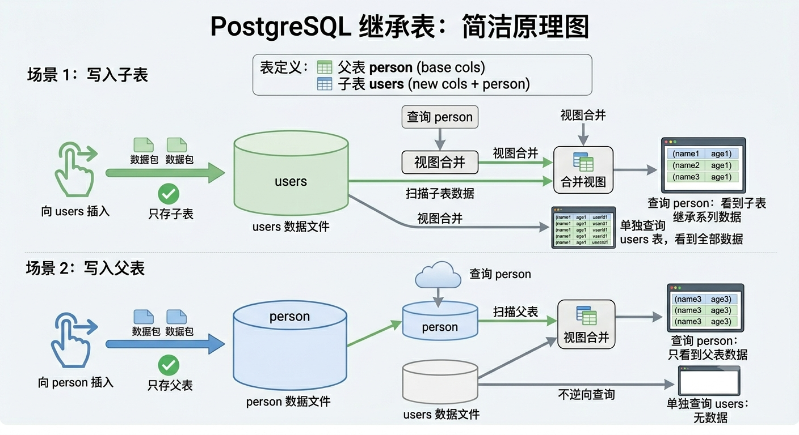

###### `UPDATE / DELETE` 更新与删除

如下：

- **操作 “子表”**：

  ​	**`UPDATE / DELETE` 修改或删除了子表的数据**，由于**数据本来就只存在子表**，**父表在扫描子表时看到的**自然是 **"子表" 更新后的结果**

- **操作 “父表”**：

  ​	如果**对 “父表” 中的记录执行 `UPDATE`、`DELETE` 操作**，默认情况下**会影响到 “子表” 相关的同名列（继承自 "父表" 而来）**，因为 **"父表" 的数据是引用自 “子表” 的物理数据记录**，所以**实际上是更新、删除的是 "子表" 的物理数据记录**。

```postgresql
-- 父表，定义基础表列结构
SET search_path TO finance;
CREATE TABLE person
(
	"name" TEXT,
	age SMALLINT,
	sex CHAR(2)
)

-- 子表：继承 “父表” 的基础字段，并添加自己的字段
CREATE TABLE "users"
(
	user_id INTEGER,
	address TEXT
) INHERITS (person) -- 继承 person 表


-- 查看 finance.users 表的结构
SELECT 
	column_name AS "列名", data_type AS "数据类型" 
FROM information_schema.columns WHERE "table_name" = 'users';

/*
列名			数据类型
age				smallint
user_id		integer
name			text
sex				character
address		text
*/

----------------- 未 UPDATE、DELETE 更新之前 -----------------
-- 查询 "父表" 的数据（实际上是引用的 "子表" 的物理记录）
SELECT * FROM person
/*
name	age	 sex
jack	18	 男 
tom		11	 男 
kevin	64	 男 
*/

-- 查询 "子表" 的数据
SELECT * FROM users 
/*
name	age	 sex  user_id  address
jack	18	 男 	 1		  湖南省
tom		11	 男 	 2		  广东省
kevin	64	 男 	 3		  浙江省
*/

-- 更新 "父表" 的数据（实际上是更新的 "子表" 的物理记录）
UPDATE person SET sex = '女';

----------------- UPDATE、DELETE 更新之后 -----------------
-- 查询 "父表" 的数据（实际上是引用的 "子表" 的物理记录）
SELECT * FROM person;
/*
name	age	 sex
jack	18	 女 
tom		11	 女 
kevin	64	 女 
*/

-- 查询 "子表" 的数据
SELECT * FROM users;
/*
name	age	 sex  user_id  address
jack	18	 女 	 1		  湖南省
tom		11	 女 	 2		  广东省
kevin	64	 女 	 3		  浙江省
*/
```

##### 仅操作 "父表"

###### `SELECT ... ONLY` 只查询 "父表"

如果想**只查询 "父表" 自己的物理数据记录**，不**联表查询（扫描），不引用 "子表" 的物理物理记录**，可以使用 **`SELECT * FROM ONLY` 命令**。

- （**前提是 "父表" 有被其他表继承之前插入的记录**）

```postgresql
SELECT * FROM ONLY <父表名>;
```

示例：

```postgresql
SELECT * FROM ONLY person; -- 只查询 person（父表）自己的记录，不额外添加 users（子表）的记录
/*
name  age  sex
jhon  16   男
tace  23   男
*/
```

###### `DELETE FROM ONLY` 只删除 "父表" 记录

核心作用：**只会删除 "父表" 在被其他表 `INHERITS` 继承之前的记录，不会影响到继承后的 "子表"**。

```postgresql
DELETE FROM ONLY <父表名> [WHERE...]
```

示例：

```postgresql
SELECT * FROM ONLY person; -- 只查询 person（父表）自己的记录，不额外添加 users（子表）的记录
/*
name  age  sex
jhon  16   女
tace  23   女
*/


DELETE FROM ONLY person WHERE "name" = 'jhon';


SELECT * FROM ONLY person; -- 只查询 person（父表）自己的记录，不额外添加 users（子表）的记录
/*
name  age  sex
tace  23   女
*/

SELECT * FROM users; -- "子表" 查询
/*
name	age	 sex  user_id  address
jack	18	 女 	 1		  湖南省
tom		11	 女 	 2		  广东省
kevin	64	 女 	 3		  浙江省
*/
```

###### ``UPDATE ONLY` 只更新 "父表" 记录

核心作用：**只会更新 "父表" 在被其他表 `INHERITS` 继承之前的记录，不会影响到继承后的 "子表"**。

```postgresql
UPDATE ONLY <父表名> [SET...]
```

示例：

```postgresql
UPDATE ONLY person SET sex = '未知';

SELECT * FROM ONLY person; -- 只查询 person（父表）自己的记录，不额外添加 users（子表）的记录
/*
name  age  sex
jhon  16   未知
tace  23   未知
*/


SELECT * FROM users; -- "子表" 查询
/*
name	age	 sex  user_id  address
jack	18	 女 	 1		  湖南省
tom		11	 女 	 2		  广东省
kevin	64	 女 	 3		  浙江省
*/
```

#### 概念总结

PostgreSQL 的表继承更像是一种**面向对象概念的映射**：

- 子表继承了父表的**结构（Schema）**
- **父表在查询**时，扮演了一个“管理者”或**“视图”的角色**，它**把所有子表的数据聚拢起来展现给用户**，但**它自己并不占有子表的那份数据**

##### 唯一性约束的限制

**父表上的唯一性约束（比如主键 PRIMARY KEY），无法约束子表**。

> **为什么？** 
>
> 因为**主键索引在物理上是依附于具体表**的。当你向子表插入一条 `id = 1` 的数据，再向父表插入一条 `id = 1` 的数据时，由于它们物理上存在于不同的表实体中，各自的索引无法感知对方的存在。
>
> 结果就是：当你查询父表时，会惊奇地发现**出现了两条 `id = 1` 的重复数据**！

最佳实践：官方更推荐使用 **`PARTITION BY`（声明式分区）**，而不是传统的表继承（Inheritance）。

## 完整性约束

### 基本概念

在关系型数据库中，**完整性约束（Integrity Constraints）**是数据库管理员或开发人员定义的一组**规则**。

- 它们的核心目的只有一个：**确保数据的准确性、一致性和可靠性**，防止垃圾数据或错误数据进入数据库。

#### 应具备的功能

##### 完整性约束条件

数据库的完整性约束条件也称为**完整性规则**，是数据库中必须满足的**语义约束条件**。

SQL 标准通过**数据定义语言（DDL）**来描述完整性包括**关系模型的 `实体完整性`、`参照完整性`、`值域完整性`和`用户定义完整性`**。

- 完整性检查：

  **数据库管理系统（DBMS）检查数据是否满足完整性约束条件**

  一般**在 `INSERT`、`UPDATE`、`DELETE` 语句执行后检查**，也可以在**事务 `COMMIT` 提交时检查**。

##### 违约处理

数据库管理系统若**发现用户的操作违背了完整性约束（插入了不符合约束的值）**，就会采取：

- **拒绝（NO ACTION）**执行该操作 、**级联（CASCADE）**执行其他操作方式、**取空值（NULL）**来保证完整性。

#### 分类

SQL 的完整性约束主要分为 4 大类：

- **实体完整性**：

  | 约束名       | 关键字            | 规则                                                         |
  | ------------ | ----------------- | ------------------------------------------------------------ |
  | **主键约束** | **`PRIMARY KEY`** | **唯一性、非空性**。保证**每一行记录都是唯一的、可区分的**。 |

- **参照完整性**：

  | 约束名       | 关键字            | 规则                                                         |
  | ------------ | ----------------- | ------------------------------------------------------------ |
  | **外键约束** | **`FOREIGN KEY`** | **主表的一个列（外键）被从表的一个列（`PRIMARY KEY` 主键 \| 其他唯一性的列）引用依赖**，以此实现**主表与从表之间的关联** |

- **值域完整性**：

  | 约束名         | 关键字         | 规则                                                         |
  | -------------- | -------------- | ------------------------------------------------------------ |
  | **唯一约束**   | **`UNIQUE`**   | **该列**的**值在表记录中必须唯一、不能重复，但允许为空 `NULL`** |
  | **非空约束**   | **`NOT NULL`** | 该**列必须有值、且不可为空 `NULL`**                          |
  | **默认值约束** | **`DEFAULT`**  | **设定该列的默认值**；如果**在 `INSERT` 插入数据**时**未显式传入该列的值**，则**自动填充 `DEFAULT` 默认值** |
  | **检查约束**   | **`CHECK`**    | **限制**该列的**值范围** \| **满足特定条件**；如果**在 `INSERT` 插入数据时未符合条件**，则**拒绝插入** |

- **用户定义完整性**：

  | 约束名                | 关键字          | 规则                                                         |
  | --------------------- | --------------- | ------------------------------------------------------------ |
  | **复杂 `CHECK` 约束** | **`CHECK ...`** | **跨列的比较**                                               |
  | **触发器**            | **`TRIGGER`**   | 在**增删改查操作发生**时，**自动执行**的一段 SQL 代码，用于**实现高级的业务校验规则** |
  | **存储过程**          |                 | 通过一段 SQL 代码逻辑，**在数据记录实际写入数据库前**进行**拦截校验** |

#### 表内定义& 表外定义

分为 **表内定义** 和 **表外定义** 两种写法：

- **表内定义**：**直接在 `CREATE` 创建表时，就第一时间定义好每个 Column 列字段的相关约束条件**。

  ```postgresql
  CREATE TABLE <模式名>.<表名>
  (
  	<列字段名> <数据类型> [<列级完整性约束>],
      ....
      [<表级完整性约束>]
  );
  ```

  - **`<列级完整性约束>`**：在表结构的**每个 Column 列当前行，定义该列的相关约束条件**
  - **`<表级完整性约束>`：在表结构的末尾处，定义相关的约束条件并引用具体的 Column 列字段名，完成某些表列的约束定义**，可以设定**多个 Column 组合**的**复合主键**。

- **表外定义**：**在已创建的 Table 表上，通过 `ALTER TABLE` 命令动态修改表列字段的约束**

  - **以 `COLUMN` 列的形式（隐式约束命名）：**
    
    - **修改表中已有 Column 列的约束**：

      - 列的**底层属性**：
    
        ```postgresql
        ALTER TABLE <表名> ALTER COLUMN <SET/DROP> <DEFAULT | NOT NULL>;
        -- 仅限 DEFAULT 默认值、NOT NULL 非空约束
        ```
    
      - 列的**表级约束**：
    
        ```postgresql
        ALTER TABLE <表名> ADD <PRIMARY KEY | FOREIGN KEY | UNIQUE | CHECK>(<约束列>);
        -- 仅限 PRIMARY KEY 主键、FOREIGN KEY 外键、UNIQUE 唯一、CHECK 检查...约束
        ```
    
    - **添加列的同时，添加数据类型、约束条件**：
    
      ```postgresql
      ALTER TABLE <表名> ADD COLUMN <新列名> <数据类型> <完整性约束>;
      ```
    
  - **`CONSTRAINT` （显式约束命名）：**
    
    - **增加**一个表列字段的**约束别名**：
      
      ```postgresql
      ALTER TABLE ... ADD CONSTRAINT <约束名> <PRIMARY KEY | FOREIGN KEY | UNIQUE | CHECK>(<约束列>);
      -- 仅限 PRIMARY KEY 主键、FOREIGN KEY 外键、UNIQUE 唯一、CHECK 检查...约束
      ```
    - **删除**一个表列字段的**约束别名**：
      
      ```postgresql
      ALTER TABLE ... DROP CONSTRAINT <约束名> [CASCADE | RESTRICT]
      ```

### 实体完整性

实体完整性要求表中的每一行数据都必须是**唯一的、可标识的**。也就是说，不能有完全重复的记录，且每条记录都要有“身份证”。

#### `PRIMARY KEY` 主键约束

##### 基本概念

- 规则：**必须唯一、不允许重复、不允许为 `NULL` 空值**
- 作用：用来**标识区分表中的每一条记录**。**一个表中只能有一个主键（但可以是由多个列组成的复合主键）**
- 示例：每个学生的 “学号” 必须是唯一的，且不能没有学号

核心要点：**一张 TABLE 表中必须有且仅有一个 `PRIMARY KEY` 主键。**

##### `CREATE TABLE` 表内定义

###### 基本语法

- **列级完整性约束定义**：

  ```postgresql
  CREATE TABLE <模式名>.<表名>
  (
  	<列字段名> <数据类型> PRIMARY KEY [是否自增? GENERATED ALWAYS AS IDENTITY],  -- 仅当前列
      ...
  )
  ```

- **表级完整性约束定义**：

  注：**如果完整性约束涉及到该表的多个 Column 列，则必须使用 `<表级约束>`，否则既可以定义在列级，也可以定义在表级上**。

  ```postgresql
  CREATE TABLE <模式名>.<表名>
  (
  	<列字段名> <数据类型>,
      ...
      PRIMARY KEY(<列字段名1>, <列字段名2>,...) -- 多个 Column 列组合的复合主键，常见于中间关系表
  )
  ```

> 注意：**`PRIMARY KEY` 主键**可以是**任何数据类型**，只要同时符合**唯一性、不可重复、不可为空**的特性即可。

###### 示例

```postgresql
SET search_path TO finance;
-- 列级约束定义
CREATE TABLE computer
(
	com_id INTEGER PRIMARY KEY GENERATED ALWAYS AS IDENTITY,
	com_name TEXT
)

INSERT INTO computer(com_name) VALUES('华硕');


--- 表级约束定义
CREATE TABLE computer
(
	com_id INTEGER GENERATED ALWAYS AS IDENTITY,
	com_name TEXT,
	PRIMARY KEY(com_id)
)

INSERT INTO computer(com_name) VALUES('华硕');
```

###### 复合主键

- 常用于**多张表之间的 “中间关系表”（多对多关联表、连接表）**

表示在 **“中间关系表” 中引用了多张表的 `PRIMARY KEY` 主键或其他 `UNIQUE` 唯一列**，并**产生强关联，在 `INSERT` 插入数据时缺一不可**

基本语法：

```postgresql
CREATE TABLE <模式名>.<表名>
(
	<关联外键-列字段名1> <数据类型> REFERENCES <主表1>(<主键、唯一性列字段>),
    <关联外键-列字段名2> <数据类型> REFERENCES <主表2>(<主键、唯一性列字段>),
	
    -- 作为复合主键
    PRIMARY KEY(<关联外键-列字段名1>, <关联外键-列字段名2>)
)
```

> 例如：
>
> 假设有一个经典的业务场景：**学生（Students）** 和 **课程（Courses）**。一个学生可以选多门课，一门课可以被多个学生选。这就是典型的**多对多（Many-to-Many）**关系。
>
> 为了实现这个关系，我们需要一张中间表 `student_courses`。
>
> 在这张中间表里，复合主键能完美解决两个核心问题：
>
> 1. **唯一性约束（防止脏数据）：** 一个学生对同一门课程只能选一次。如果把 `student_id` 和 `course_id` 联合作为复合主键，数据库就会在底层强制保证“学生A + 课程B” 的组合在整张表中只能出现一次。如果不小心重复插入，数据库直接报错拦截。
> 2. **天然的高效索引：** PostgreSQL 在创建主键时，会自动为其创建一个底层的唯一索引（通常是 B-Tree 索引）。这意味着，当你拿着 `student_id` 和 `course_id` 去查询某个特定的选课记录时，速度是极快的。

示例：

```postgresql
-- 1. 创建学生表
CREATE TABLE students (
    student_id SERIAL PRIMARY KEY,
    name VARCHAR(50) NOT NULL
);

-- 2. 创建课程表
CREATE TABLE courses (
    course_id SERIAL PRIMARY KEY,
    title VARCHAR(100) NOT NULL
);

-- 3. 创建中间关系表（使用复合主键）
CREATE TABLE student_courses (
    student_id INT REFERENCES students(student_id) ON DELETE CASCADE,
    course_id INT REFERENCES courses(course_id) ON DELETE CASCADE,
    enrolled_at TIMESTAMP DEFAULT CURRENT_TIMESTAMP,
    
    -- 在这里定义复合主键
    PRIMARY KEY (student_id, course_id)
);


-- 插入数据
INSERT INTO students VALUES(1, 'jack');
INSERT INTO students VALUES(2, 'tom');

INSERT INTO courses VALUES(1, 'Python');
INSERT INTO courses VALUES(2, 'JavaScript');
INSERT INTO courses VALUES(3, 'Java');

INSERT INTO student_courses VALUES(1, 1);
INSERT INTO student_courses VALUES(1, 2);

-- 关联查询出所有的学生报课记录
SELECT * FROM student_courses s_c
JOIN students s ON s_c.student_id = s.student_id
JOIN courses c ON s_c.course_id = c.course_id;
/*
1	1	2026-06-20 18:11:59.282972	1	jack	1	Python
1	2	2026-06-20 18:11:59.292261	1	jack	2	JavaScript
*/
```

##### `ALTER TABLE` 表外定义

###### `ADD PRIMARY KEY` 添加主键

- **为表的指定列设为一个 `PRIMARY KEY` 主键（前提是该表没有主键）**

```postgresql
ALTER TABLE <模式名>.<表名> ADD PRIMARY KEY(<列名>); -- 单主键

ALTER TABLE <模式名>.<表名> ADD PRIMARY KEY(<列名1>, <列名2>,...); -- 复合主键
```

```postgresql
SET search_path TO schools;

CREATE TABLE students
(
		stu_id SMALLINT,
		stu_name TEXT,
		for_tea_id INTEGER,
		age SMALLINT
);

-- 单独为 students 表的 stu_id 设置为一个 PRIMARY KEY 主键
ALTER TABLE schools.students ADD PRIMARY KEY("stu_id");
```

###### `ADD COLUMN` 添加列的同时设置约束

```postgresql
ALTER TABLE <表名> ADD COLUMN <新列名> <数据类型> <完整性约束>;
-- 可以设置 PRIMARY KEY 主键之外，还可以设置 UNIQUE 唯一、NOT NULL 非空、DEFAULT 默认值、CHECK 检查等约束
```

示例：

```postgresql
CREATE TABLE teacher1
(
	tea_name TEXT
);

DROP TABLE teacher1;

-- 添加一个 tea_id 的同时设为自增主键
ALTER TABLE schools.teacher1 ADD COLUMN	tea_id INTEGER PRIMARY KEY GENERATED ALWAYS AS IDENTITY;
```

##### 核心机制（`UNIQUE` “候选键”）

###### 主键 vs 候选键

在关系型数据库设计中，每张表都有 **“候选键”（Candidate Key）** 和 **“主键”（Primary Key）** 的概念。

- **“候选键”（Candidate Key）**：

  > [!IMPORTANT]
  >
  > 在设计一张 Table 表时，往往会有**好几个列（或列的组合）**都能**通过 `UNIQUE` 约束作为一条记录的唯一标识**；
  >
  > --> 这些**所有具备唯一性、不重复的 Column 列**都叫做 **”候选键“（Candidate Key）**。

  简而言之，**使用 `UNIQUE` 唯一约束的列（”候选键“）**，**都有机会可以被指定为一个 “主键”**，具体根据业务逻辑而定。

- **“主键”（Primary Key）**：

  > [!NOTE]
  >
  > 当**一个具备唯一性、不重复的 Column 列（“候选键”）** 被**指定为 `PRIMARY KEY` 主键**时，数据库底层**会自动为它附加 `UNIQUE` 唯一性约束、`NOT NULL` 非空约束**。
  
  也就是说： **`PRIMARY KEY`  主键 = `UNIQUE` 唯一 + `NOT NULL` 非空的约束组合**，但 `PRIMARY KEY` 会更严格。
  $$
  \text{PRIMARY KEY} = \text{UNIQUE} + \text{NOT NULL}
  $$

核心要点：**多个表列**可以**根据值的特性**被**赋予 `UNIQUE` 唯一性约束（“候选键”）**，但 **`PRIMARY KEY` “主键” 只能有一个**。

> 示例：
>
> 假设在一个公司员工表里，有三列数据都是每个人独一无二的：
>
> - `EmployeeID` (员工工号) → 唯一
> - `ID_Card` (身份证号) → 唯一
> - `Email` (公司邮箱) → 唯一
>
> 这三个列在数据库里**都可以被赋予 `UNIQUE`（唯一）约束**。
>
> 它们三个都是**候选人**。可以从这三个候选人中，**挑出一个**最**适合、最方便业务使用**的 **`UNIQUE` 唯一列指定为 `PRIMARY KEY`** ，封它为**“主键”（PRIMARY KEY）**。

###### 关键区别

| **特性**                  | **主键 (PRIMARY KEY)**                                       | **唯一约束 (UNIQUE)**                                        |
| ------------------------- | ------------------------------------------------------------ | ------------------------------------------------------------ |
| **数量限制**              | 一张表**只能有一个**主键                                     | 一张表可以有**多个** `UNIQUE` 列                             |
| **是否允许为空 (`NULL`)** | **绝对不允许**为 `NULL`                                      | **允许**为 `NULL`（在大多数数据库中，允许有一个或多个 `NULL`，因为 `NULL` 代表未知，不视作重复） |
| **索引类型**              | 默认会自动创建**聚集索引（Clustered Index）**，决定了数据在磁盘上的物理存储顺序 | 默认创建的是**非聚集索引（Non-clustered Index）**            |

> [!WARNING]
>
> **`UNIQUE` “候选键” 的另一个作用**：
>
> 正常情况下，在数据库设计的逻辑中，**一张表必须有一个 `PRIMARY KEY` 主键作为表记录的唯一标识**。
>
> 但是如果用户在设计 Table 表时，**偏不显式指定 `PRIMARY KEY` 主键**，那么数据库引擎底层（MySQL）会选择以下 2 种方案：
>
> - **“候选键” 替补上场**：
>
>   ​	数据库引擎会**选择并采用 Table 表结构中，同时具有 `UNIQUE` 、`NOT NULL` 约束的唯一性、不可为空的列（”候选键“）作为 “替补主键”**，并为其创建一个隐式的聚集索引 Index。
>
>   > 如果有多个 `UNIQUE` 、`NOT NULL` 约束 的列，系统会默认选择**第一个**定义的列。
>
> - **创建 `rowid` 隐藏列**：
>
>   ​	如果表结构中**既没有 `PRIMARY KEY` 主键，又没有同时符合 `UNIQUE`、`NOT NULL` 的 ”候选键“**，那么数据库引擎会**在后台自动为这张表创建一个名为 `rowid`（也叫 `DB_ROW_ID`）的隐藏列**。
>
>   > **代价**：这个隐藏列你是**无法在 SQL 中直接查询或控制**的。而且因为它是**全局共享**一个自增序列（多个没有主键的表共享同一个计数器），在多线程高并发写入时，会因为争抢这个全局自增锁而导致**性能严重下降**（发生锁冲突）。
>
> > 注：在表设计中，不添加 `PRIMARY KEY` 主键是大忌！它会严重降低数据库引擎的性能。
> >
> > 1. **性能雪崩（全表扫描）**：没有主键，意味着你要更新或删除某一行时，数据库无法精准定位，只能老老实实把整张表从头到尾扫描一遍（Full Table Scan），如果表有百万级数据，数据库会瞬间卡死。
> >
> > 2. **分布式复制（主从同步）灾难**：在现代数据库架构中，通常会有主库和从库。如果表没有主键，主库同步数据到从库时（尤其是基于行的复制 Row-based Replication），从库为了找到对应的那行数据改写，会对每条同步指令进行全表扫描，直接导致主从同步严重延迟。
> >
> > 3. **框架不支持**：现在绝大多数后端开发框架（如 Hibernate, MyBatis-Plus, Spring Data JPA）都强依赖主键。如果没有主键，你甚至无法使用这些框架的内置增删改查方法。

###### 不同数据库的机制

| **数据库**         | **是否强制需要主键机制** | **无主键时的底层替代品**            | **对性能/架构的影响**                             |
| ------------------ | ------------------------ | ----------------------------------- | ------------------------------------------------- |
| **MySQL (InnoDB)** | **是** (强制)            | 非空唯一索引 → 隐式 6 字节 `ROW_ID` | 全局行号锁竞争，并发写入性能受限                  |
| **PostgreSQL**     | **否** (堆表)            | 物理行指针 `ctid`                   | 无法做逻辑复制，数据修改/删除可能引发**全表扫描** |

### 参照完整性

#### 基本概念

​	**参照完整性（Referential Integrity）**是关系型数据库中用于定义 **“表与表之间数据一致性”** 的核心原则，通过 **参照表（“从表”） 与 被参照表（“主表”）** 的**主-外键列字段之间的引用关联**来维护**表与表之间的关系**。

##### 主表 与 从表

- **被参照表（主表）**：提供 **`PRIMARY KEY` 主键** 或 **其他 `UNIQUE` 唯一键** **给 “从表” 的 `FOREIGN KEY` 外键所引用**
- **参照表（从表）**：拥有 **`FOREIGN KEY` 外键** 并**引用 “主表” 提供的 `PRIMARY KEY` 主键 或 `UNIQUE` 唯一键**

> 例如：
>
> 关系模型：假设一个学生必须有一个老师，那么学生表必须提供一个 `FOREIGN KEY` 外键引用老师表的 `id`（主键、`UNIQUE` 唯一键），以此产生关联，表示可以通过学生找到某个老师。
>
> 那么这个学生表就是 参照表（“从表”），老师表就是 被参照表（“主表”）。

核心要点：参照完整性（Referential Integrity）必须**确保外键（Foreign Key）引用的值始终有效**，即 **“从表” 外键 引用的 “主表” 主键必须真实存在**，防止出现 **“孤儿数据”（无法通过任何手段找到与之关联的数据）**。

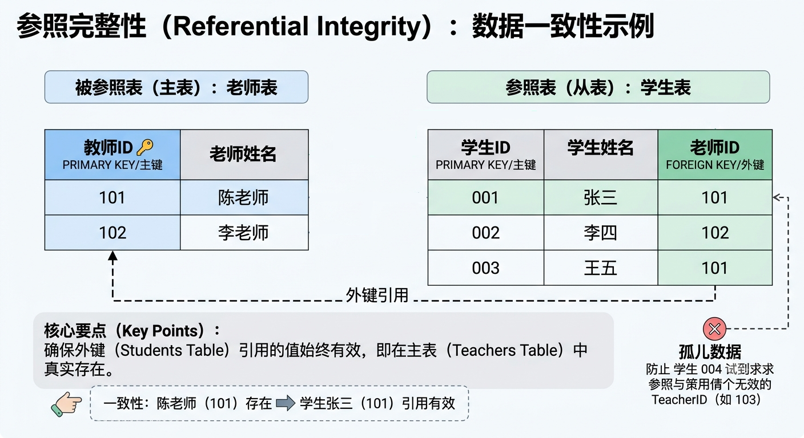

##### 约束规则

参照完整性规定，从表中的外键值只有两种合法情况：

1. **必须匹配**主表中已经存在的某个主键值。
2. **可以是 `NULL`**（如果业务允许该字段为空，表示暂时没有关联）。

##### 表与表之间的关系模型

在关系型数据库（如 MySQL、PostgreSQL）中，表与表之间的关系是整个数据库设计的心脏。

这正是**主-从表**之间的**主-外键关联**的用武之地，通过**主-外键建立表与表之间的关系**，可以**避免数据冗余，并保证数据的完整性**。

表与表之间的关系主要分为以下 **三种**：

###### 一对一（One-to-One）

一对一模型在特定的业务场景和架构设计中非常重要，相对少见，通常用于**数据垂直拆分**、达到**权限控制**的效果。

- 定义：**A表 的一条记录只能对应 B表 的一条记录**，反之亦然。

- 实现：**B表 设定一个附加 `UNIQUE` 唯一约束的外键 →（指向）A表 的 主键**，或者直接让 **AB表 的主键成对对应**。

- 业务场景：

  - 用户表 & 用户详情表：一个用户只能有一个用户详情记录，反之一个用户详情记录也只能属于一个用户

    ```sql
    +-------------------+                 +-------------------+
    |     users (用户)   |                 | user_profiles(详情)|
    +-------------------+                 +-------------------+
    | PK | id           |——||—————————||——| PK,FK | user_id   |
    |    | username     |                 |       | bio       |
    |    | password     |                 |       | avatar_url|
    +-------------------+                 +-------------------+
    ```

  - 员工表 & 员工劳动合同表：一个员工只能有一份劳动合同记录，反之一份劳动合同记录只能所属一个员工

    ```sql
    +-------------------+                 +-------------------+
    |  employees (员工)  |                 | contract(员工合同) |
    +-------------------+                 +-------------------+
    | PK | id           |——||—————————||——| PK,FK | con_id    |
    |    | e_name       |                 |       | detail    |
    |    | department   |                 |       | cont_url   |
    +-------------------+                 +-------------------+
    ```

  - ...

###### 一对多/多对一（One-to-Many）

这是**最常见**的一种关系。

- 定义：**A表 中的一条记录可以对应 B表 中的多条记录，但 B表 中的一条记录只能对应 A表 中的一条记录**。

- 实现：**在 “多” 的一方（B表）创建一个 “外键” →（指向）→ "一" 的一方（A表）的 主键 或 其他 `UNIQUE` 唯一键**。

- 业务场景：

  - 员工表 & 部门表：一个部门中可以有多个员工，但一个员工只能归属于一个部门

    ```sql
    +-------------------+                 +-------------------+
    | department (部门)  |                 |  employees (员工) |
    +-------------------+                 +-------------------+
    | PK | d_id         |——||—————|       | PK | e_id         |
    |    | d_name       |         |——————<| FK | d_id         |
    +-------------------+                 |    | name         |
                                          +-------------------+
    ```

  - 用户表 & 文章表：一个博客用户可发布多篇文章，但一篇文章只能所属一个博客用户

    ```sql
    +-------------------+                 +-------------------+
    |     users (用户)   |                 |   articles (文章)  |
    +-------------------+                 +-------------------+
    | PK | id           |——||————————————<| PK | id           |
    |    | username     |                 | FK | user_id      |
    +-------------------+                 |    | title        |
                                          +-------------------+
    -- 一条 users 记录可以指向 0 条或多条 articles 记录；而一条 articles 记录必须且只能归属于一个 users。
    ```

  - ...

###### 多对多（Many-to-Many）

当**两张表的关系都 “多”** 的情况下，需使用 多对多 关系模型。

- 定义：
- 实现：
- 业务场景：

⚠️注意：以上所有关系模型都可以同时实现在一个业务场景相关的表中，只需记得 **"外键" 所引用的必须是一个唯一性、不可重复的键（`UNIQUE` 唯一键、`PRIMARY KEY` 主键）。**


外键约束 (FOREIGN KEY)


级联操作：当主表数据更新或删除时，可以设置子表的应对策略：

CASCADE（级联）：主表删了，子表对应数据也一起删。

SET NULL（置空）：主表删了，子表对应列变成 NULL。

RESTRICT / NO ACTION（限制）：如果子表还有关联数据，禁止删除主表数据。

示例：“选课表”里的“学号”，必须在“学生表”里能找到。你不能给一个不存在的学生选课。


REFERENCES students(student_id) ON DELETE CASCADE

### 值域完整性

域完整性是**针对单个列（字段）的限制**，确保**该列中 `INSERT` 、`UPDATE` 输入的数据落在有效的取值范围内，符合预期的格式或类型**。

| 约束名         | 关键字         | 规则                                                         |
| -------------- | -------------- | ------------------------------------------------------------ |
| **唯一约束**   | **`UNIQUE`**   | **该列**的**值在表记录中必须唯一、不能重复，但允许为空 `NULL`** |
| **非空约束**   | **`NOT NULL`** | 该**列必须有值、且不可为空 `NULL`**                          |
| **默认值约束** | **`DEFAULT`**  | **设定该列的默认值**；如果**在 `INSERT` 插入数据**时**未显式传入该列的值**，则**自动填充 `DEFAULT` 默认值** |
| **检查约束**   | **`CHECK`**    | **限制**该列的**值范围** \| **满足特定条件**；如果**在 `INSERT` 插入数据时未符合条件**，则**拒绝插入** |

#### `UNIQUE` 唯一约束

##### 基本概念

规则：**该列**的**值在表记录中必须唯一、不能重复，但允许为空 `NULL`**。

##### `CREATE TABLE` 表内定义

###### 基本语法

- **列级完整性约束定义**：

  ```postgresql
  CREATE TABLE <模式名>.<表名>
  (
  	<列字段名> <数据类型> UNIQUE, -- 仅当前列
      ...
  )
  ```

- **表级完整性约束定义**：

  ```postgresql
  CREATE TABLE <模式名>.<表名>
  (
  	<列字段名> <数据类型>,
      ...
      UNIQUE(<列字段名1>, <列字段名2>,...) -- 一次性设定多个 UNIQUE 列
  )
  ```

###### 示例

```postgresql
CREATE TABLE phone
(
		"id" INTEGER PRIMARY KEY GENERATED ALWAYS AS IDENTITY,
		"version" VARCHAR(10) UNIQUE,
)

CREATE TABLE phone2
(
		"id" INTEGER PRIMARY KEY GENERATED ALWAYS AS IDENTITY,
		"version" VARCHAR(10),
		UNIQUE("version")
);


INSERT INTO phone2("version") VALUES('10.2');
INSERT INTO phone2("version") VALUES('10.2'); -- ❌️ 这一行会报错，因为 10.2 的值已重复存在
```

##### `ALTER TABLE` 表外定义

###### `ADD UNIQUE` 添加唯一约束

- **为表的指定列设为一个或多个 `UNIQUE` 唯一约束**

```postgresql
ALTER TABLE <模式名>.<表名> ADD UNIQUE(<列名1>, <列名2>,...);
```

```postgresql
SET search_path TO schools;

CREATE TABLE students
(
		stu_id SMALLINT,
		stu_name TEXT,
		for_tea_id INTEGER,
		age SMALLINT
);

-- 单独为 students 表的 stu_id 设置为一个 UNIQUE 唯一约束
ALTER TABLE schools.students ADD UNIQUE("stu_id");
```

###### `ADD COLUMN` 添加列的同时设置约束

```postgresql
ALTER TABLE <表名> ADD COLUMN <新列名> <数据类型> <完整性约束>;
-- 可以设置 PRIMARY KEY 主键之外，还可以设置 UNIQUE 唯一、NOT NULL 非空、DEFAULT 默认值、CHECK 检查等约束
```

示例：

```postgresql
CREATE TABLE teacher3
(
	tea_name TEXT
);

-- 添加一个 tea_id 的同时设为 UNIQUE 唯一约束
ALTER TABLE schools.teacher3 ADD COLUMN	tea_id INTEGER UNIQUE;
```

#### `NOT NULL` 非空约束

##### 基本概念

规则：该**列必须有值、且不可为空 `NULL`**。

注：**表列的默认初始值都为 `Null` 空值，只有当 `INSERT`、`UPDATE` 插入数据时才会被覆盖**。

##### `CREATE TABLE` 表内定义

###### 基本语法

```postgresql
CREATE TABLE <模式名>.<表名>
(
	<列字段名> <数据类型> NOT NULL, -- 仅当前列
    ...
)
```

示例：

```postgresql
CREATE TABLE teacher4
(
	tea_name TEXT NOT NULL,
	age INTEGER NULL
);

-- 查看表结构
SELECT 
	"column_name", data_type, is_nullable 
FROM information_schema.columns WHERE "table_name" = 'teacher4' AND table_schema = CURRENT_SCHEMA;

/*
column_name data_type	is_nullable
tea_name	text		NO	
age			integer		YES		
*/
```

##### `ALTER TABLE` 表外定义

###### `ALTER COLUMN SET/DROP` 修改/删除列约束值

列级约束：在 PostgreSQL 中，**`ALTER COLUMN` 仅支持修改已有 Column 列的底层属性（数据类型、`NOT NULL` 是否非空、`DEFAULT` 默认值约束）**。

- **`SET <约束>` 添加约束**

```postgresql
ALTER COLUMN <模式名>.<表名> ALTER COLUMN <列名> SET NOT NULL; -- 添加非空约束	
```

- **`DROP <约束>` 删除约束**

```postgresql
ALTER TABLE  <模式名>.<表名>  ALTER COLUMN <列名> DROP NOT NULL; -- 删除非空约束
```

示例：

```postgresql
CREATE TABLE students
(
		stu_id SMALLINT,
		stu_name TEXT,
		age SMALLINT
);

-- 为 schools.students 表的 age 字段设置为非空约束，在 INSERT 插入数据时必须显式传入值
ALTER TABLE schools.students ALTER COLUMN age SET NOT NULL;

-- 删除 schools.students 表的 age 字段的非空约束，在 INSERT 插入数据时可以无需忽略该列字段
ALTER TABLE schools.students ALTER COLUMN age DROP NOT NULL;
```

###### `ADD COLUMN` 添加列的同时设置约束

```postgresql
ALTER TABLE <表名> ADD COLUMN <新列名> <数据类型> <完整性约束>;
-- 可以设置 PRIMARY KEY 主键之外，还可以设置 UNIQUE 唯一、NOT NULL 非空、DEFAULT 默认值、CHECK 检查等约束
```

示例：

```postgresql
CREATE TABLE teacher4
(
	tea_name TEXT
);

-- 添加一个 tea_id 的同时设为非空约束
ALTER TABLE schools.teacher4 ADD COLUMN	tea_id INTEGER NOT NULL;
```

#### `DEFAULT` 默认值约束

- **设定该列的默认值**；如果**在 `INSERT` 插入数据**时**未显式传入该列的值**，则**自动填充 `DEFAULT` 默认值**

##### 基本概念

规则：该**列必须有值、且不可为空 `NULL`**。

注：**表列的默认初始值都为 `Null` 空值，只有当 `INSERT`、`UPDATE` 插入数据时才会被覆盖**。

##### `CREATE TABLE` 表内定义

###### 基本语法

```postgresql
CREATE TABLE <模式名>.<表名>
(
	<列字段名> <数据类型> DEFAULT <默认值>, -- 仅当前列
    ...
)
```

示例：

```postgresql
SET search_path = schools;
CREATE TABLE cource
(
	c_id INTEGER PRIMARY KEY, 
    -- 如果这里也给定 GENERATED ALWAYS AS IDENTITY 那么只需执行 INSERT INTO cource; 即可插入一条全默认值记录
	c_name TEXT NOT NULL DEFAULT 'Python',
	c_time TIMESTAMP NOT NULL DEFAULT CURRENT_DATE
);

SELECT 
	"column_name", data_type, is_nullable, column_default 
FROM information_schema.columns WHERE "table_name" = 'cource' AND table_schema = CURRENT_SCHEMA;
/*
column_name data_type 									is_nullable column_default
c_id	      integer	  									NO	
c_name	    text	    									NO					'Python'::text
c_time	    timestamp without time zone	NO					CURRENT_DATE
*/

INSERT INTO cource(c_id) VALUES(1); -- 插入数据时，无需显式指定 c_name 和 c_time 字段，它们会使用默认值填充

SELECT * FROM cource;
/*
c_id c_name  c_time
1		 Python	 2026-06-20 00:00:00
*/
```

##### `ALTER TABLE` 表外定义

###### `ALTER COLUMN SET/DROP` 修改/删除列约束值

列级约束：在 PostgreSQL 中，**`ALTER COLUMN` 仅支持修改已有 Column 列的底层属性（数据类型、`NOT NULL` 是否非空、`DEFAULT` 默认值约束）**。

- **`SET <约束>` 添加约束**

```postgresql
ALTER COLUMN <模式名>.<表名> ALTER COLUMN <列名> SET DEFAULT <默认值>; -- 添加默认值约束
```

- **`DROP <约束>` 删除约束**

```postgresql
ALTER TABLE  <模式名>.<表名>  ALTER COLUMN <列名> DROP DEFAULT; -- 删除默认值约束
```

示例：

```postgresql
CREATE TABLE students
(
		stu_id SMALLINT,
		stu_name TEXT,
		age SMALLINT
);

-- 为 schools.students 表的 age 字段添加一个默认值 15
ALTER TABLE schools.students ALTER COLUMN age SET DEFAULT 15;

-- 删除 schools.students 表的 age 字段默认值 15，让其还原为 Null
ALTER TABLE schools.students ALTER COLUMN age DROP DEFAULT;
```

###### `ADD COLUMN` 添加列的同时设置约束

```postgresql
ALTER TABLE <表名> ADD COLUMN <新列名> <数据类型> <完整性约束>;
-- 可以设置 PRIMARY KEY 主键之外，还可以设置 UNIQUE 唯一、NOT NULL 非空、DEFAULT 默认值、CHECK 检查等约束
```

示例：

```postgresql
CREATE TABLE teacher4
(
	tea_name TEXT
);

-- 添加一个 tea_id 的同时设为非空约束
ALTER TABLE schools.teacher4 ADD COLUMN	tea_id INTEGER DEFAULT 'Tom';
```

#### `CHECK` 检查约束

##### 基本概念

- **检查列值是否满足给定的值范围、某一条件表达式**；如果**在 `INSERT` 、`UPDATE` 插入数据时未符合 `CHECK` 条件**，则**拒绝插入**。

##### `CREATE TABLE` 表内定义

###### 基本语法

- **列级完整性约束定义**：

  ```postgresql
  CREATE TABLE <模式名>.<表名>
  (
  	<列字段名> <数据类型> CHECK (<约束条件（[字段名] <SQL 运算符> [固定值、计算表达式、其他字段名]）>), -- 仅当前列
      ...
  )
  ```

- **表级完整性约束定义**：

  ```postgresql
  CREATE TABLE <模式名>.<表名>
  (
  	<列字段名> <数据类型>,
      ...
      CONSTRAINT <约束别名> CHECK (<约束条件（[字段名] <SQL 运算符> [固定值、计算表达式、其他字段名]）>) 
      -- 需使用 CONSTRAINT 建立一个约束别名，适用于跨列的组合限制
  )
  ```

###### 示例

```postgresql
SET search_path = schools;
-- 列级定义
CREATE TABLE product
(
	p_id INTEGER PRIMARY KEY GENERATED ALWAYS AS IDENTITY, -- 商品ID
	"name" TEXT NOT NULL, -- 商品名称
	status VARCHAR(10) NOT NULL CHECK (status IN ('在售', '下架', '预售')) DEFAULT '下架',
	-- 商品状态：必须为 ('在售', '下架', '预售') 之一的枚举值，且默认值为 '下架'
	price NUMERIC(6,2) NOT NULL CHECK (price BETWEEN 19.9 AND 1999.99) DEFAULT 19.9,
	-- 价格：总位数6，小数点后保留2位；价格限制为 19.9 - 1999.99；默认值为 19.9
	discounted_price NUMERIC(6,2) NOT NULL CHECK (discounted_price <= price),
	-- 折扣价格：总位数6，小数点后保留2位；折扣价格 必须小于 商品价格
	coupon_code TEXT NOT NULL CHECK (coupon_code LIKE 'product-%')
	-- 优惠券代码：必须是以 product- 开头的字符串文本
);

-- 表级定义
CREATE TABLE product
(
	p_id INTEGER PRIMARY KEY GENERATED ALWAYS AS IDENTITY, -- 商品ID
	"name" TEXT NOT NULL, -- 商品名称
	status VARCHAR(10) NOT NULL DEFAULT '下架',
	price NUMERIC(6,2) NOT NULL DEFAULT 19.9,
	discounted_price NUMERIC(6,2) NOT NULL,
	coupon_code TEXT NOT NULL
    
    -- 定义约束别名
    CONSTRAINT chk_status CHECK (status IN ('在售', '下架', '预售'))
	-- 商品状态：必须为 ('在售', '下架', '预售') 之一的枚举值，且默认值为 '下架'
    CONSTRAINT chk_price CHECK (price BETWEEN 19.9 AND 1999.99)
	-- 价格：总位数6，小数点后保留2位；价格限制为 19.9 - 1999.99；默认值为 19.9
    CONSTRAINT chk_discounted_price CHECK (discounted_price <= price)
	-- 折扣价格：总位数6，小数点后保留2位；折扣价格 必须小于 商品价格
    CONSTRAINT chk_coupon_code CHECK (coupon_code LIKE 'product-%')
	-- 优惠券代码：必须是以 product- 开头的字符串文本
);


-- 查看表结构
SELECT 
	"column_name", data_type, is_nullable, column_default 
FROM information_schema.columns WHERE "table_name" = 'product' AND table_schema = CURRENT_SCHEMA;
/*
column_name 			data_type 									is_nullable  column_default
p_id	      			integer											NO	
name	      			text												NO	
status	    			character varying						NO					 '下架'::character varying
price	            numeric											NO						19.9
discounted_price	numeric											NO	
coupon_code				text												NO	
*/


-- 插入一条记录
INSERT INTO product("name", status, price, discounted_price, coupon_code) VALUES('电动牙刷', '在售', 299.98, 249.98, 'product-toothbrush-001');

-- 查看表数据
SELECT * FROM product;
/*
p_id  name      status  price   discounted_price  coupon_code
1	    电动牙刷	在售	  299.98	249.98	          product-toothbrush-001
*/
```

##### `ALTER TABLE` 表外定义

###### `ADD CHECK` 添加检查约束

- **为表的指定列设为一个 `CHECK` 检查约束**

```postgresql
ALTER TABLE <模式名>.<表名> ADD CHECK(<检查条件>);
```

```postgresql
SET search_path TO schools;

CREATE TABLE product3
(
	p_id INTEGER PRIMARY KEY GENERATED ALWAYS AS IDENTITY, -- 商品ID
	"name" TEXT NOT NULL, -- 商品名称
	status VARCHAR(10) NOT NULL DEFAULT '下架',
	price NUMERIC(6,2) NOT NULL DEFAULT 19.9
);

-- 单独为 schools.product3 字段添加一个 CHECK 检查约束
ALTER TABLE product3 ADD CHECK(price >= 199.9 AND price <= 1999.99);
```

###### `ADD COLUMN` 添加列的同时设置约束

```postgresql
ALTER TABLE <表名> ADD COLUMN <新列名> <数据类型> <完整性约束>;
-- 可以设置 PRIMARY KEY 主键之外，还可以设置 UNIQUE 唯一、NOT NULL 非空、DEFAULT 默认值、CHECK 检查等约束
```

示例：

```postgresql
SET search_path TO schools;

CREATE TABLE product3
(
	p_id INTEGER PRIMARY KEY GENERATED ALWAYS AS IDENTITY, -- 商品ID
	"name" TEXT NOT NULL, -- 商品名称
	status VARCHAR(10) NOT NULL DEFAULT '下架',
	price NUMERIC(6,2) NOT NULL DEFAULT 19.9
);

-- 添加 discounted_price 字段的同时，设定一个 CHECK 检查约束
ALTER TABLE product3 ADD COLUMN discounted_price NUMERIC(6,2) NOT NULL CHECK (discounted_price <= price);
```

### `CONSTRAINT` 约束别名

#### 基本概念

在 SQL 中，**`CONSTRAINT`** 关键字的作用是**显式地为完整性约束（如主键、外键、唯一性等）定义一个“名字”**，并将其应用到数据表的字段上。

简单来说，不用 `CONSTRAINT` 也可以创建约束，但用了 `CONSTRAINT`，就能给这个约束起一个**自定义的别名**。

##### 为什么要用 `CONSTRAINT` 关键字？

如果**不使用 `CONSTRAINT` 关键字**，数据库系统（如 MySQL、Oracle、SQL Server）会**自动为约束生成一个随机且难以记忆的系统默认名**（例如 `SYS_C007432` 或 `fk_12a3b4...`）。

使用 `CONSTRAINT` 显式命名有以下三大核心好处：

**1. 方便后续修改或删除约束**

当业务发生变化，你需要去掉某个约束时，必须通过它的“名字”来删除。如果名字是系统随机生成的，你得先去查系统表，非常麻烦。

- **没有命名（删除困难）**：`ALTER TABLE Users DROP FOREIGN KEY sys_c001234_random;` (你得先去猜或查这个名字)
- **显式命名（轻松删除）**：`ALTER TABLE Users DROP FOREIGN KEY fk_users_departments;`

**2. 提高错误日志的可读性**

当程序插入了非法数据导致报错时，数据库会抛出异常。如果使用了自定义命名，报错信息会非常直观，能让你一眼看出是哪条业务规则被违反了。

- **默认报错**：`Violation of UNIQUE KEY constraint 'UQ__Users__A3C6554D' ...` （一脸懵逼）
- **命名后报错**：`Violation of UNIQUE KEY constraint 'uk_users_email' ...` （秒懂：用户的邮箱重复了）

**3. 代码更规范、可读性更强**

在大型项目中，团队通常会有一套命名规范（例如：**主键用 `pk_` 开头，外键用 `fk_` 开头，唯一约束用 `uk_` 开头**）。使用 `CONSTRAINT` 可以让建表 SQL 语句如同文档一样清晰。

```postgresql
CREATE TABLE Employees (
    EmpID INT PRIMARY KEY,                       -- 系统自动命名主键
    Email VARCHAR(100) UNIQUE,                   -- 系统自动命名唯一约束
    DeptID INT REFERENCES Departments(DeptID)    -- 系统自动命名外键
);
```

##### 常规命名推荐

| **约束类型**           | **推荐前缀** | **命名示例（表名 + 列名）**                           |
| ---------------------- | ------------ | ----------------------------------------------------- |
| **主键 (Primary Key)** | `pk_`        | `pk_users_id`                                         |
| **外键 (Foreign Key)** | `fk_`        | `fk_orders_user_id` （表明来自orders表，关联user_id） |
| **唯一约束 (Unique)**  | `uk_`        | `uk_users_phone`                                      |
| **检查约束 (Check)**   | `ck_`        | `ck_users_age`                                        |

#### 基本语法

```postgresql
CONSTRAINT <约束别名> <PRIMARY KEY | FOREIGN KEY | UNIQUE | CHECK 约束>(<列名 | CHECK 约束条件>)
```

核心作用：**为当前表的指定列，创建一个 `<约束>` 的 `<约束别名>`，后续可根据该 `<约束别名>` 管理表列的约束删除、新增...**。

#### `CREATE TABLE` 表内定义

```postgresql
CREATE TABLE <模式名>.<表名>
(
	<字段名> <数据类型> <约束>,
    ...
    CONSTRAINT <约束别名> <PRIMARY KEY | FOREIGN KEY | UNIQUE | CHECK 约束>(<列名 | CHECK 约束条件>),
    CONSTRAINT <约束别名2> <PRIMARY KEY | FOREIGN KEY | UNIQUE | CHECK 约束>(<列名 | CHECK 约束条件>),
)
```

##### 示例

```postgresql
SET search_path = schools;
-- 标签表 --
CREATE TABLE tag
(
	tag_id INTEGER PRIMARY KEY GENERATED ALWAYS AS IDENTITY, -- 自增列
	tag_name VARCHAR(10)
);

COMMENT ON COLUMN tag.tag_id IS '标签ID';
COMMENT ON COLUMN tag.tag_name IS '标签名';

-- 书籍表 --
CREATE TABLE book
(
	book_id INTEGER GENERATED ALWAYS AS IDENTITY, -- 自增列
	book_name TEXT,
	price NUMERIC(4, 2) DEFAULT 0.0,
	tag_id INTEGER,
	
	-- 创建约束别名
	CONSTRAINT pk_book_book_id PRIMARY KEY (book_id), -- 主键约束
	CONSTRAINT uk_book_book_name UNIQUE (book_name), -- 唯一约束
	CONSTRAINT ck_book_price CHECK(price >= 0 AND price <= 99.99), -- 检查约束
	CONSTRAINT fk_tag_tag_id FOREIGN KEY (tag_id) REFERENCES tag(tag_id) -- 外键约束，引用 tag 标签表的 tag_id 字段
);

COMMENT ON COLUMN book.book_id IS '书籍ID';
COMMENT ON COLUMN book.book_name IS '书名';
COMMENT ON COLUMN book.price IS '价格';
COMMENT ON COLUMN book.tag_id IS '所属标签ID';


-- 插入数据批处理（先标签表、后书籍表，否则引用关系不对）
DO $$
DECLARE
    v_tag_id INT; -- 定义一个变量
BEGIN
    -- 插入标签，并通过 INTO 赋值给变量
    INSERT INTO tag(tag_name) VALUES ('理工类') RETURNING tag_id INTO v_tag_id; -- 将新插入记录的 tag_id 主键值返回给外部变量使用
    
    -- 使用这个变量插入图书
    INSERT INTO book(book_name, price, tag_id) VALUES ('Python3 程序设计', 49.98, v_tag_id);
END $$;

DO $$
DECLARE
    v_tag_id INT; -- 定义一个变量
BEGIN
    -- 插入标签，并通过 INTO 赋值给变量
    INSERT INTO tag(tag_name) VALUES ('金融类') RETURNING tag_id INTO v_tag_id; -- 将新插入记录的 tag_id 主键值返回给外部变量使用
    
    -- 使用这个变量插入图书
		INSERT INTO book(book_name, price, tag_id) VALUES('大学英语基础', 36.98, v_tag_id);
END $$;

DO $$
DECLARE
    v_tag_id INT; -- 定义一个变量
BEGIN
    -- 插入标签，并通过 INTO 赋值给变量
    INSERT INTO tag(tag_name) VALUES ('文学类') RETURNING tag_id INTO v_tag_id; -- 将新插入记录的 tag_id 主键值返回给外部变量使用
    
    -- 使用这个变量插入图书
		INSERT INTO book(book_name, price, tag_id) VALUES ('人性的弱点', 28.98, v_tag_id);
END $$;


-- 查询数据（JOIN ON 多表查询）
SELECT * FROM book b LEFT JOIN tag t ON b.tag_id = t.tag_id;
/*
3	Python3 程序设计	49.98	9		9		理工类
4	大学英语基础		  36.98	  10	  10	  金融类
5	人性的弱点		   28.98   11	   11	   文学类
*/
```

#### `ALTER TABLE` 表外定义

##### `ADD/DROP CONSTRAINT` 约束别名

###### `ADD CONSTRAINT` 添加约束别名

约束别名：需通过**使用 `ADD CONSTRAINT` 命令**为表的列添加 **`PRIMARY KEY` 主键、`FRIEIGN KEY` 外键、`UNIQUE` 唯一约束、`CHECK` 检查约束**。

- **与 `ADD <约束>` 相同，只不过 `ADD CONSTRAINT` 是加了一个约束别名**。

```postgresql
-- ADD CONSTRAINT：为表的某些字段添加表级约束
ALTER TABLE  <模式名>.<表名> 
	ADD CONSTRAINT <pk_约束别名> PRIMARY KEY(<列名>), -- 主键约束
	ADD CONSTRAINT <uk_约束别名> UNIQUE(<列名>), -- 唯一约束
	ADD CONSTRAINT <ck_约束别名> CHECK(<列名> ...), -- 检查约束
	ADD CONSTRAINT <fk_约束别名> FOREIGN KEY (<列名>) REFERENCES <目标表名>(<目标表列名>); -- 外键约束
```

示例：

```postgresql
SET search_path TO schools;

CREATE TABLE students
(
		stu_id SMALLINT,
		stu_name TEXT,
		for_tea_id INTEGER,
		age SMALLINT
);

CREATE TABLE teacher
(
	tea_id INTEGER,
	tea_name TEXT
);

-- 单独为 students 和 teacher 表添加一个 PRIMARY KEY 主键
ALTER TABLE schools.students ADD PRIMARY KEY("stu_id");
ALTER TABLE schools.teacher ADD PRIMARY KEY("tea_id");

-- 修改 book 表的一些字段底层属性
ALTER TABLE schools.students 
	ALTER COLUMN "stu_id" TYPE INTEGER, -- 修改数据类型，由原来的
	ALTER COLUMN "stu_name" TYPE VARCHAR(15), -- 修改数据类型
	ALTER COLUMN "stu_name" SET NOT NULL, -- 添加非空约束
	ALTER COLUMN "stu_name" SET DEFAULT 'Jack'; -- 设置默认值

-- 为 student 表添加一些表级约束
ALTER TABLE schools.students
	ADD CONSTRAINT uk_student_stu_name UNIQUE ("stu_name"), -- 唯一约束
	ADD CONSTRAINT chk_student_age CHECK ("age" >= 0 AND  "age" <= 22), -- 检查约束
	ADD CONSTRAINT fk_student_teacher FOREIGN KEY ("for_tea_id") REFERENCES schools.teacher("tea_id"); 
	-- student 表的 for_tea_id 添加外键关联 teacher 表的 tea_id
	
-- 查看 schools 模式的 students 表的列字段结构
SELECT 
	"column_name", data_type, is_nullable, column_default 
FROM information_schema.columns WHERE "table_name" = 'students' AND table_schema = CURRENT_SCHEMA;
```

###### `DROP CONSTRAINT` 删除约束别名

```postgresql
ALTER TABLE  <模式名>.<表名> DROP CONSTRAINT <约束别名>;
```

核心作用：**删除该表中，原先通过 `ADD CONSTRAINT` 命令为表某些字段添加的 `<约束别名>`，将不再做相关约束检查处理**。

```postgresql
-- 删除 students 表中 stu_name 字段的 UNIQUE 唯一约束，让其可以允许重复
ALTER TABLE schools.students DROP CONSTRAINT uk_student_stu_name;

-- 删除 students 表中 age 字典的 CHECK 检查约束，在 INSERT 插入值时将不再做相关 CHECK 约束检查处理
ALTER TABLE schools.students DROP CONSTRAINT chk_student_age;

-- 删除 students 表中 for_tea_id 的外键约束，让其变成一个普通列
ALTER TABLE schools.students DROP CONSTRAINT fk_student_teacher; 
```

## 查看表的元信息

在 PostgreSQL 中，查看表的信息有 2 种方式：

> 注意点：在 PostgreSQL 中，**Table 表是存储在 Schema 模式下的层次，所以需显式指明要表的所属 Schema 模式。**

### psql 命令行工具

#### `\d` 查看表结构

```sh
$\d <模式名>.* # 查看某个 Schema 模式下的所有 Table 表结构

            List of relations
  Schema   |   Name    | Type  |  Owner
-----------+-----------+-------+----------
 marketing | customers | table | postgres
 marketing | product   | table | postgres
(2 rows)
```

```sh
$\d <模式名>.<表名> # 查看某个 Schema 模式下的某个 Table 表结构

                                  Table "marketing.product"
  Column  |            Type             | Collation | Nullable |           Default
----------+-----------------------------+-----------+----------+------------------------------
 id       | integer                     |           | not null | generated always as identity
 name     | text                        |           | not null |
 datetime | timestamp without time zone |           | not null | CURRENT_TIMESTAMP
```

#### `\dt` 查看模式有哪些表

```sh
$\dt *.* # 查看当前数据库下所有 Schema 模式及它的表

                           List of relations
       Schema       |           Name           |    Type     |  Owner
--------------------+--------------------------+-------------+----------
 finance            | customers                | table       | postgres
 information_schema | sql_features             | table       | postgres
 information_schema | sql_implementation_info  | table       | postgres
 information_schema | sql_parts                | table       | postgres
...
```

```sh
$\dt <模式名>.* # 查看某个 Schema 模式下有哪些表

          List of relations
  Schema   |   Name    | Type  |  Owner
-----------+-----------+-------+----------
 marketing | customers | table | postgres
 marketing | product   | table | postgres
```

### `information_schema` 视图查询

PostgreSQL 提供了一个 `information_schema` 模式，它内部存储了很多视图：

| 视图名称                | 主要用途                                                   | 关键字段示例                                                 |
| :---------------------- | :--------------------------------------------------------- | :----------------------------------------------------------- |
| **`schemata`**          | 查询**当前数据库中所有 Schema 模式**                       | `catalog_name`、`schema_name`、`schema_owner`                |
| **`tables`**            | 查询**当前数据库中所有表（或视图）的列表**                 | `table_name`, `table_type` (BASE TABLE/VIEW), `table_schema` |
| **`columns`**           | 查询**表或视图中所有列的定义**                             | `column_name`, `data_type`, `is_nullable`, `column_default`  |
| **`table_constraints`** | 查询**与表相关的所有约束**（如主键、外键、唯一约束等）信息 | `constraint_name`, `constraint_type`, `table_name`           |
| **`key_column_usage`**  | 查询**被约束（尤其是主键和外键）限制的列**的具体信息       | `constraint_name`, `column_name`, `position_in_unique_constraint`视图名称视图名称 |

可以通过 `JOIN ON` 关联以上表进行精确查询：

- **查询当前数据库、当前 Schema 模式下的所有 Table 表**：

  ```postgresql
  -- 查询当前数据库的所有表
  SELECT 
      table_name 
  FROM 
      information_schema.tables 
  WHERE 
      table_catalog = CURRENT_CATALOG  -- 只查当前库
      AND table_schema = CURRENT_SCHEMA -- 只查当前 Schema 模式
      AND table_type = 'BASE TABLE';
  ```

- **查看某张 Table 表结构信息**：

  ```postgresql
  SELECT column_name, data_type, character_maximum_length, is_nullable
  FROM information_schema.columns
  WHERE table_name = 'product';
  ```

- **查看某个 Schema 模式下的所有 Table 表信息**：

  ```postgresql
  SELECT table_name 
  FROM information_schema.tables 
  WHERE table_schema = 'marketing'; -- 'public' 是 Postgres 的默认模式
  ```

- **查看某个 Schema 模式下的某张 Table 表的所有列信息**：

  ```postgresql
  -- 查看 marketing 模式下 product 表中的所有列的信息
  SELECT 
  	t.table_catalog AS "数据库", -- 注： AS 后面接的是 "" 双引号，而非单引号
  	t.table_schema AS "模式", 
  	t.table_name AS "表名", 
  	c."column_name" AS "列字段名", 
  	c.data_type AS "数据类型", 
  	c.is_nullable AS "是否为空", 
  	c.column_default AS "默认值"
  FROM information_schema.columns c
  JOIN information_schema.tables t ON c."table_name" = t."table_name"
  WHERE t.table_schema = 'marketing' AND c."table_name" = 'product';
  
  -- 核心要点：
  -- 根据 表名 连接 columns 和 tables 两张表，并根据条件（所属模式【表】，表名）查询具体的字段信息
  ```

- ...

### `pg_catalog` 系统目录

- **`pg_catalog` 系统目录（模式）** 提供了以下目录表/视图，包含了**当前数据库中，当前模式下的所有 Table 表信息**。

| 系统表             | 用途                                     | 备注                                           |
| :----------------- | :--------------------------------------- | :--------------------------------------------- |
| **`pg_class`**     | 存储**表、索引、序列、视图**等“关系”对象 | 这是最重要的系统表之一，记录了所有对象         |
| **`pg_attribute`** | 存储**表的列（属性）** 信息              | 和 `pg_class` 配合使用，可以查到每张表有哪些列 |
| **`pg_type`**      | 存储**数据类型**信息                     | 包括内置类型和用户自定义类型                   |
| **`pg_tables`**    | 存储数据库中的所有**表**信息             |                                                |

##### `pg_class` 总目录表

在 PostgreSQL 中，**`pg_class`** 是最核心的系统表（System Catalog）之一。简单来说，**它记录了数据库中所有“具有列（Columns）”或者“类似于表”的对象**。

###### 核心字段

| **字段名 (Field)** | **数据类型 (Type)** | **含义简述 (Description)** | **核心用途 / 备注**                                          |
| ------------------ | ------------------- | -------------------------- | ------------------------------------------------------------ |
| **`oid`**          | `oid`               | **对象唯一标识符**         | 隐含的主键，PostgreSQL 内部用来唯一标记这个表或索引。常用于与其他系统表（如 `pg_index`, `pg_attribute`）进行 `JOIN` 关联。 |
| **`relname`**      | `name`              | **对象名称**               | 表名、索引名、视图名或序列字段名。                           |
| **`relnamespace`** | `oid`               | **所属 Schema 的 OID**     | 关联 `pg_namespace.oid`，可以查出该对象属于哪个 Schema（如 `public`）。 |
| **`relkind`**      | `char`              | **对象类型**               | 区分该记录是普通表（`r`）、索引（`i`）、视图（`v`）、物化视图（`m`）还是序列（`S`）等。 |
| **`relfilenode`**  | `oid`               | **磁盘物理文件名**         | 该对象在服务器磁盘上对应的实际文件名。注意：执行 `VACUUM FULL` 或 `CLUSTER` 后，这个值可能会改变。 |
| **`reltuples`**    | `float4`            | **估算总行数**             | 该表中的数据行数。**注意：这是由 `ANALYZE` 收集的估算值**，不是实时精确值，但用来评估大表规模时查询极快。 |
| **`relpages`**     | `int4`              | **估算磁盘页数**           | 该对象在磁盘上占用的 Page（页，默认每页 8KB）的数量。同样是估算值，常用来计算表占用的物理空间大小。 |
| **`relam`**        | `oid`               | **访问方法 OID**           | 关联 `pg_am.oid`。如果是表，通常是 `heap`；如果是索引，则代表 `btree`、`hash`、`gin` 等索引类型。 |
| **`reloptions`**   | `text[]`            | **自定义存储参数**         | 存储创建表或索引时指定的额外参数（如 `autovacuum_enabled=false` 或 `fillfactor=90`）。 |

###### 字段名前缀解析

由于 `pg_class` 汇总了很多元信息，所以 PostgreSQL 采用了简写的形式为每个字段进行定义：

| **relkind 值** | **对象类型（英文）** | **对象类型（中文说明）**            |
| -------------- | -------------------- | ----------------------------------- |
| **`r`**        | ordinary table       | 普通数据表                          |
| **`i`**        | index                | 索引                                |
| **`S`**        | sequence             | 序列（自增 ID 使用）                |
| **`v`**        | view                 | 视图                                |
| **`m`**        | materialized view    | 物化视图                            |
| **`c`**        | composite type       | 复合类型（自定义类型）              |
| **`t`**        | TOAST table          | TOAST 表（用于存储超长文本/大字段） |
| **`p`**        | partitioned table    | 分区表的主表                        |

###### 常用 SQL 查询操作

- **查询某个 Schema 下所有的表和视图**：

  将 `pg_class` 与 `pg_namespace`（存储 Schema 的表）关联。

  ```postgresql
  SELECT n.nspname AS schema_name, c.relname AS object_name, c.relkind
  FROM pg_class c
  JOIN pg_namespace n ON n.oid = c.relnamespace
  WHERE n.nspname = 'public' AND c.relkind IN ('r', 'v');
  ```

- **查看某张表的索引**：

  将 `pg_class` 自身进行关联（因为表和索引都在这张表里），通过中间表 `pg_index` 连接。

  ```postgresql
  SELECT i.relname AS index_name
  FROM pg_class t
  JOIN pg_index x ON t.oid = x.indrelid
  JOIN pg_class i ON i.oid = x.indexrelid
  WHERE t.relname = 'your_table_name';
  ```

- **快速估算一张大表的行数**：

  对于数亿行的表，`SELECT count(*) FROM table` 会非常慢，而查 `pg_class` 可以瞬间建立认知。

  ```postgresql
  SELECT relname, reltuples AS estimated_rows 
  FROM pg_class 
  WHERE relname = 'your_table_name';
  ```

- **查看某张 Table 表的物理磁盘文件名**：

  ```postgresql
  SELECT relname, relfilenode 
  FROM pg_class 
  WHERE relname = 'your_table_name';
  ```

- ...

##### `pg_tables` 表-目录视图

在 PostgreSQL 中，**`pg_tables`** 是一个**系统视图（System View）**。

- 它专门用来**只看普通数据表**，过滤掉了索引、视图、序列等杂七杂八的对象，并且把 Schema 名字直接翻译成了可读的文本。

> [!IMPORTANT]
>
> 与 `pg_class` 的区别：
>
> 它们的关系就像“原始数据库”**与**“过滤后的精装视图”：
>
> - **`pg_class` 是系统表（底层的根基）**
>   - 它包含了**所有**类似表的对象（表、索引、视图、物化视图、序列、TOAST 表等）
>   - 里面的 Schema 只是一个数字 ID（`relnamespace`），想看名字得自己去跟 `pg_namespace` 做 `JOIN`
> - **`pg_tables` 是系统视图（上层的封装）**
>   - 它是基于 `pg_class`、`pg_namespace` 和 `pg_authid` 联合查询后定制出来的
>   - **它只保留了 `relkind = 'r'`（普通表）和 `relkind = 'p'`（分区表）的数据**

###### 核心字段

| **字段名**        | **数据类型** | **含义说明**                                                 |
| ----------------- | ------------ | ------------------------------------------------------------ |
| **`schemaname`**  | `name`       | 表所属的 **Schema 文本名**（例如 `public`），不用再去连表查 OID 了 |
| **`tablename`**   | `name`       | **表名**                                                     |
| **`tableowner`**  | `name`       | **表的所有者**（Owner）的用户名                              |
| **`tablespace`**  | `name`       | 表所在的**表空间名**（如果使用的是默认表空间，则显示为 `NULL`） |
| **`hasindexes`**  | `boolean`    | **是否有索引**。`t` (true) 表示该表至少建了一个索引，`f` (false) 表示没有 |
| **`hasrules`**    | `boolean`    | **是否有规则（Rules）**                                      |
| **`hastriggers`** | `boolean`    | **是否有触发器（Triggers）**                                 |
| **`rowsecurity`** | `boolean`    | **是否启用了行级安全策略**（Row-Level Security, RLS）        |

###### 常见 SQL 查询操作

- **查看某个 Schema 模式下的所有表名及所属用户**：

  ```postgresql
  SELECT tablename, tableowner 
  FROM pg_tables 
  WHERE schemaname = 'marketing';
  
  ```

- **查看所有没有建立 `INDEX` 索引的 表**：

  ```postgresql
  SELECT schemaname, tablename 
  FROM pg_tables 
  WHERE hasindexes = false 
    AND schemaname NOT IN ('pg_catalog', 'information_schema'); 
  -- 过滤掉系统自带的 schema
  ```

- ...

##### `pg_attribute` 表列-目录视图

在 PostgreSQL 中，**`pg_attribute`** 是一个**系统视图（System View）**。

- **`pg_attribute` 记录了所有表、索引、视图的 Column 列（字段）信息**

###### 核心字段

| **字段名 (Field)** | **数据类型 (Type)** | **含义简述 (Description)** | **核心用途 / 备注**                                          |
| ------------------ | ------------------- | -------------------------- | ------------------------------------------------------------ |
| **`attrelid`**     | `oid`               | **所属对象的 OID**         | 关联到 `pg_class.oid`。告诉你这个字段属于哪张表或哪个索引。  |
| **`attname`**      | `name`              | **字段名称**               | 列的名字（如 `id`, `user_name`, `create_time`）。            |
| **`atttypid`**     | `oid`               | **字段数据类型的 OID**     | 关联到 `pg_type.oid`。可以用它来查出字段是 `int4`、`varchar` 还是 `text`。 |
| **`attnum`**       | `int2`              | **字段的编号（位置）**     | 字段在表中的顺序（从 1 开始）。**特别注意：≤ 0 的编号代表系统隐藏列**（如 `ctid`, `xmin`）。 |
| **`attlen`**       | `int2`              | **定长类型的长度**         | 拷贝自 `pg_type`。如果是变长类型（如 `varchar`），这里通常显示为 `-1`。 |
| **`atttypmod`**    | `int4`              | **类型修饰符**             | 存储类似 `varchar(255)` 中的 `255`，或者 `numeric(10,2)` 中的精度。需要通过特定公式转换才能读出人类可读的值。 |
| **`attnotnull`**   | `boolean`           | **是否非空约束**           | `t` 表示有 `NOT NULL` 约束，`f` 表示允许为 `NULL`。          |
| **`atthasdef`**    | `boolean`           | **是否有默认值**           | `t` 表示该字段配置了 `DEFAULT` 值（默认值具体内容存在 `pg_attrdef` 表中）。 |
| **`attisdropped`** | `boolean`           | **字段是否已被删除**       | **PG 的特殊机制**：执行 `ALTER TABLE DROP COLUMN` 时，出于性能考虑，PG 并没有物理删除数据，而是把该字段标记为 `t`，并在上层隐藏。 |

###### 常见 SQL 查询操作

- 查询某张 Table 的所有列字段名、数据类型和顺序：

  ```postgresql
  SELECT 
      a.attnum AS "顺序",
      a.attname AS "列字段名",
      t.typname AS "基本类型",
      a.attnotnull AS "非空"
  FROM pg_attribute a
  JOIN pg_class c ON c.oid = a.attrelid
  JOIN pg_type t ON t.oid = a.atttypid
  WHERE c.relname = 'product'  -- 换成你的表名
    AND a.attnum > 0                   -- 排除系统隐藏列
    AND a.attisdropped = false         -- 排除已删除的列
  ORDER BY a.attnum;
  ```

- **在数据库中，找出所有包含 `xxx` 列的 Table 表**：

  ```postgresql
  -- 找出所有含有 user_id 字段的表
  SELECT c.relname AS table_name, a.attname AS column_name
  FROM pg_attribute a
  JOIN pg_class c ON c.oid = a.attrelid
  WHERE a.attname = 'user_id'
    AND c.relkind = 'r'               -- 只看普通表
    AND a.attisdropped = false;
  ```

- ...

##### `pg_type` 数据类型-目录视图

在 PostgreSQL 中，**`pg_type`** 是一个**系统视图（System View）**。

- **`pg_type` 记录了 PostgreSQL 中提供的所有数据类型，包括内置类型、自定义类型、复合类型...**

> [!NOTE]
>
> **什么是 “复合类型”？**
>
> ​	当执行 `CREATE TABLE user_info (...)` 时，PostgreSQL 不仅在 `pg_class` 里建了张表，还会默默地在 `pg_type` 里建一个名叫 `user_info` 的**复合类型（Composite Type）**。即 **表**也**是一种类型**！
>
> ​	这意味着，可以直接把 `user_info` 当作一种数据类型，嵌套在别的表里作为某一个列的类型！

###### 核心字段

`pg_type` 决定了**数据在内存和磁盘上如何存储、如何解析**。以下是核心字段的梳理：

| **字段名 (Field)** | **数据类型 (Type)** | **含义简述 (Description)** | **核心用途 / 备注**                                          |
| ------------------ | ------------------- | -------------------------- | ------------------------------------------------------------ |
| **`oid`**          | `oid`               | **类型的唯一标识符**       | 核心主键。`pg_attribute.atttypid` 指向的就是这个 OID。       |
| **`typname`**      | `name`              | **类型名称**               | 类型在 SQL 中的名字，如 `int4`, `text`, `bool`, `timestamp`。 |
| **`typnamespace`** | `oid`               | **所属 Schema 的 OID**     | 大多数内置类型都在 `pg_catalog` 命名空间下。                 |
| **`typlen`**       | `int2`              | **物理存储长度（字节）**   | 固定长度类型显示正数（如 `int4` 是 `4`）。如果是变长类型（如 `text`, `varchar`），则显示为 **`-1`**。如果是字符串（C-string），显示为 `-2`。 |
| **`typtype`**      | `char`              | **类型分类（主要类别）**   | `b` = 基础类型，`c` = 复合类型（通常对应一张表），`d` = 域类型（Domain），`e` = 枚举类型（Enum），`p` = 伪类型（Pseudo-type）。 |
| **`typrelid`**     | `oid`               | **对应的表 OID**           | **非常奇妙的字段！** 如果这个类型是一个复合类型（比如每建一张表，PG 都会自动生成一个同名的复合类型），这里会指向 `pg_class.oid`。如果不是复合类型，则为 `0`。 |
| **`typbasetype`**  | `oid`               | **基础类型 OID**           | 如果当前类型是一个“域类型（Domain）”（基于现有类型的衍生限制类型），该字段指向它依赖的基础类型。 |

###### 常见 SQL 查询操作

- **查询某张 Table 表结构的所有细节**：

  ```postgresql
  SELECT 
      a.attnum AS "列序号",
      a.attname AS "列字段名",
      t.typname AS "底层类型名",
      -- format_type 可以把底层 int4/varchar 转换成标准的 integer/varchar(255) 可读格式
      format_type(a.atttypid, a.atttypmod) AS "标准 SQL 类型"
  FROM pg_attribute a
  JOIN pg_class c ON c.oid = a.attrelid
  JOIN pg_type t ON t.oid = a.atttypid
  WHERE c.relname = 'your_table_name'  -- 换成你的表名
    AND a.attnum > 0 
    AND a.attisdropped = false
  ORDER BY a.attnum;
  ```

- 查询数据库中所有枚举（Enum）类型及它们的值：

  ```postgresql
  SELECT 
      t.typname AS enum_name,
      e.enumlabel AS enum_value,
      e.enumsortorder AS sort_order
  FROM pg_type t
  JOIN pg_enum e ON t.oid = e.enumtypid
  ORDER BY enum_name, sort_order;
  ```

- ...

## 表数据的操作（DML）

#### `TRUNCATE TABLE` 清空表记录

描述：如果**只想清空 Table 表的所有记录，但想保留 Table 表结构，且重置自增 ID 列的数据**，可使用 `TRUNCATE`，它比 `DELETE` 一条一条删快多了。

```postgresql
TRUNCATE TABLE <模式名>.<表名>; -- 清空指定模式下的指定表的所有记录，并重置自增 ID 的数据
```

##### 与 `DELETE` 的区别

| **特性**                  | **TRUNCATE TABLE**                                   | **DELETE FROM**                          |
| ------------------------- | ---------------------------------------------------- | ---------------------------------------- |
| **自增 ID**               | **重置**（从 1 开始）                                | **不重置**（继续保持原有计数）           |
| **速度**                  | **极快**（直接释放数据页，不逐行记录日志）           | **较慢**（逐行删除，每删一行都会记日志） |
| **事务回滚 (`ROLLBACK`)** | **大多数数据库中不可回滚**（一旦执行，数据彻底消失） | **可回滚**（如果包裹在事务中，可以撤销） |
| **触发器 (Trigger)**      | 不会触发 `DELETE` 触发器                             | 会触发 `DELETE` 触发器                   |
| **条件过滤 (`WHERE`)**    | **不支持**（只能全表清空）                           | **支持**（可以只删除符合条件的数据）     |

⚠️注意点：`TRUNCATE` 是一个**DDL（数据定义语言）**操作，而 `DELETE` 是**DML（数据操纵语言）**操作。

换句话说，`TRUNCATE` 在生产环境中是一颗**“威力巨大的炸弹”**。因为它速度极快且通常无法通过事务撤销（Rollback），所以在对生产环境的表执行该命令时，请**务必双重确认**表名，避免误删重要数据！


运算符、逻辑运算符、条件判断符、AS 输出字段的别名，中文使用 "" 包裹，

## 变量/批处理

变量：

```postgresql
-- 1. 插入标签，并将返回的 tag_id 存入临时变量
INSERT INTO tag(tag_name) VALUES ('理工类') RETURNING tag_id \gset new_

-- 2. 此时变量 :new_tag_id 就有值了，直接使用它
INSERT INTO book(book_name, price, tag_id) VALUES('Python3 程序设计', 49.98, :new_tag_id);
```

批处理：

`DO $$ DECLARE ... BEGIN ... END $$;`

# Index 索引

# View 视图 & CTE

```postgresql
-- 1. 插入"理工类"，并把新书直接关联上
WITH inserted_tag AS (
    INSERT INTO tag(tag_name) VALUES ('理工类') RETURNING tag_id
)
INSERT INTO book(book_name, price, tag_id) 
SELECT 'Python3 程序设计', 49.98, tag_id FROM inserted_tag;

-- 2. 插入"文学类"，并把新书直接关联上
WITH inserted_tag AS (
    INSERT INTO tag(tag_name) VALUES ('文学类') RETURNING tag_id
)
INSERT INTO book(book_name, price, tag_id) 
SELECT '人性的弱点', 49.98, tag_id FROM inserted_tag;
```


# 存储过程

# 事务与锁

# 用户与角色

# 备份与恢复

# Trigger 触发器

# 扩展

