# 数据库系统概论

## 数据库基本概念

### ① 数据（Data）

#### 数据的定义

数据是**数据库中存储的基本对象**。

数据是一个信息的载体，它会代表着一个相应的信息。例如：93、在不同的场景下有不同的内容。

【定义】**描述事物的符号记录**称为数据。描述事物的符号可以是数字、文字、图像、语言、图形、声音等。数据有多重表现形式，但是它们全都可以**经过数字化处理之后存入到计算机中**。

### ② 数据库（DataBase  简称 DB）

数据库是可长期存储在计算机内、有组织的、可共享的**大量数据的集合**。

数据库数据具有**永久存储、有组织**和**可共享**三个基本特点。

```javascript
永久存储：数据库中的数据是存储在硬盘中的，只要硬盘不损坏，数据就一直存在。

有组织：数据库中的数据是按照一定的格式进行存储的。例如：行列形式【关系型数据库】，有一定组织性。都是由数据库系统向计算机进行申请并分配好的。 

可共享：每个数据库都会有相应的数据存储文件索引，其他应用程序都可以通过调用数据库系统提供的接口连接到数据库，并对其中的数据表进行修改查询等操作。
```

### ③ 数据库管理系统

- 数据库管理系统（DataBase Manager System）简称 DBMS。

作用：**统一管理整个计算机中的所有数据库**。使数据库的操作变得更加高效、便捷。

- [ ] 阶层管理：数据库管理系统 > 数据库 > 数据

```javascript
假如有一个超市，超市里面需要进货【数据流动】、进来的货物需要统一放置在一个仓库中【数据库】、而为了更高效、便捷的管理好整个仓库中的货物的摆放顺序，使得在工作人员拿货时更加快速便捷、这时候就需要一个管理员【数据库管理系统】来管理整个仓库的存储制度。
如何让数据库中的数据在IO流动时，更加便捷、高效就是数据库管理系统的职责。
```

##### 主要功能

#### 数据定义功能

DBMS提供了一种**数据定义语言（Data Definition Language，DDL）**。

DDL 语言是用来定义整个数据库中数据的**存储格式**。

用户通过它可以方便地对数据库中的**数据对象**进行定义。

#### 数据组织、存储和管理

DBMS 要分类组织、存储和管理各种数据，包括**数据字典、用户数据、数据的存储路径**等。

#### 数据操纵功能【重点】

DBMS 提供了**数据操纵语言（Data Malipulation Language。DML）**。【SQL 语言】

用户可以通过使用DML语言来操纵数据，实现对数据库的**查询、插入、删除**和**修改**等基本操作。

#### 数据库的事务管理和运行管理

数据库在建立、运用和维护时由数据库管理系统来统一管理、统一控制。以保证数据的**安全性、完整性、多用户对数据的并发使用**、及**发生故障后的系统恢复**。

```java
安全性：通过对数据进行日志记录。对每个用户设置不同的权限，避免被随意更改或损坏。

完整性：对数据的插入进行约束。例如年龄必须是Number数字类型格式。

多用户对数据的并发使用:
【当多个用户对同一个数据库同时进行访问时，确保每个用户拿到的数据都是同一的、正确的、可靠的】
```

#### 数据库的建立和维护功能

数据库**初始数据的输入、转换功能**、数据库的**转储、备份功能**、数据库的**重组织功能和性能监视、分析功能**等。

### ④ 数据库系统 DBS

- 数据库系统：（DataBase System，简称 DBS）

数据库系统一般由**数据库、数据库管理系统（及其开发工具）、应用系统、数据库管理员**来构成。

```java
应用系统：属于面向用户层面的应用程序。
数据库管理员：是一种身份角色，主要是通过数据库管理系统来操作其底层数据库进行数据的操作。
```

流程：

数据库【存储在硬盘中】【底层】

- 数据库管理系统/操作系统【设计/管理层】：

**数据库管理系统通过操作系统来对计算机中硬盘所存储的数据进行操作**。

【数据库管理系统是基于操作系统之上的】

- 应用系统/应用开发工具【应用层】：

是一个**可视化应用程序**，主要为用户所服务，**用户可以通过应用开发系统来访问数据库，并对数据进行可视化的操作**。

```javascript
举个例子：起初，数据库管理员通过操作系统上的数据库管理系统创建一个数据库，且此数据库会有一个专门为用户所使用的可视化软件，用户可以通过这个软件来对数据录入、修改等【就好比一个后台管理系统的界面】。
```

数据库系统架构：

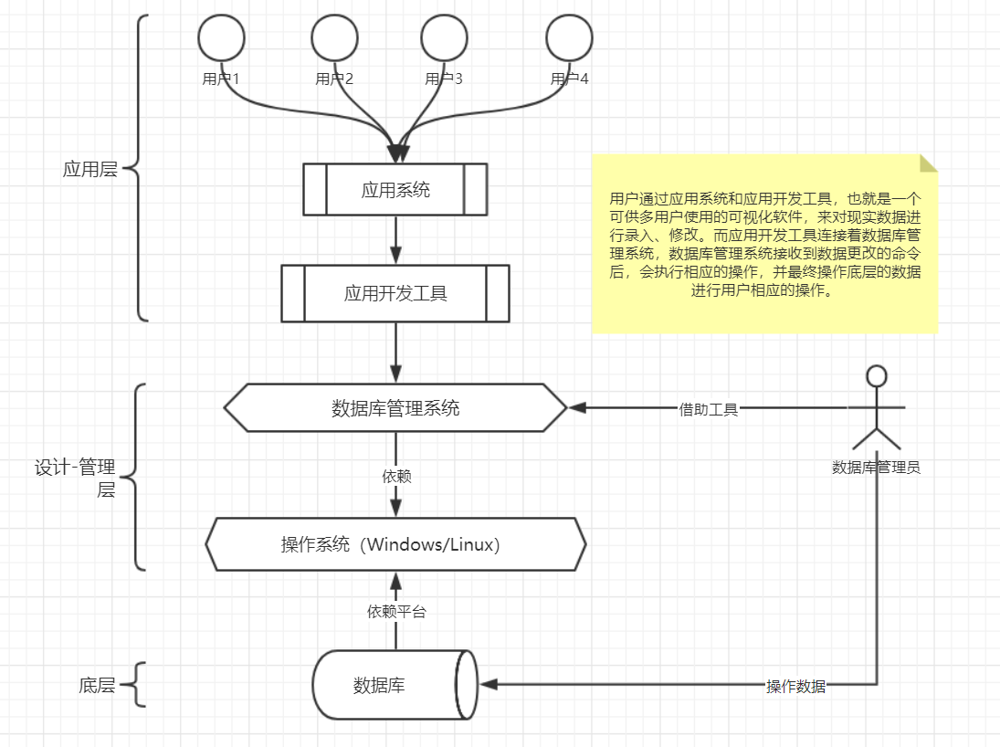

数据库系统在计算机的地位：

 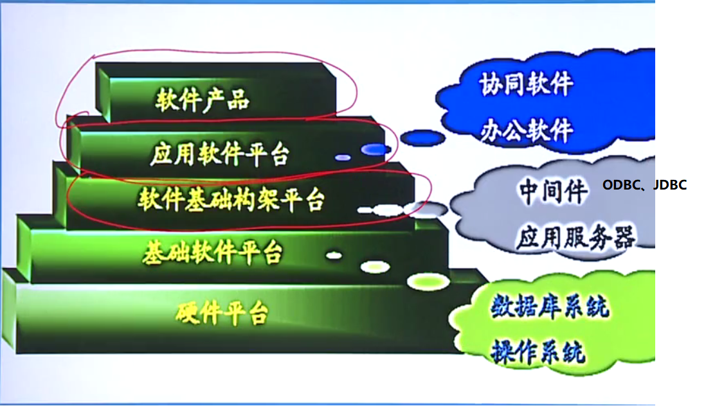

### 数据管理技术的产生和发展

数据管理技术的产生与发展是完全依赖于计算机系统发展的。

数据管理技术经历了**人工管理、文件系统、数据库系统** 3个阶段。

#### ① 人工管理阶段

特点如下：

（1）**数据不保存**。

```java
在早期阶段，计算机刚发明出来的时候，数据的存储是通过纸袋来进行规划的。一般会通过往纸袋上扣一个 o 孔出来代表0，没有 o 孔代表1。如此来输入到计算机中。所以基本上数据很难保存下来。
```

（2）**应用程序管理数据**

```java
早期的时候，由于数据无法保存下来。所以只有当有一个应用程序执行而需要数据时，这时候就需要人工进行输入数据，同时数据紧随着应用程序执行。当应用程序执行完毕或销毁之后，数据也就随之销毁了。【如今，是数据存储在数据库系统中单独存在，不管是否有应用程序，只要想取数据，直接从数据库中拿取即可。】
```

（3）**数据不共享**

```java
一个数据对应一个应用程序。早期的时候数据的输入凭据是依靠人工做出来的纸袋，当一个应用程序用完了一堆纸袋的数据后，这堆纸袋就报废了。如果另一个应用程序想要使用之前使用过的纸袋数据，就得重新做相应的纸袋。
```

（4）**数据不具有独立性**

- 缺点：

**当数据的逻辑结构和物理结构发生变化时，必须对相应的应用程序做出修改，这就加重了程序员的负担**。

```java
早期的数据是由纸袋做出来的，根据纸袋上的数据输入到计算机中，并执行相应的应用程序。而纸袋一旦写下来就无法再修改，如果执行的计划变了，如一开始的1-100，便成为100-1，这时候数据序列变了，想要修改就必须重新做纸袋。
```

#### ② 文件系统阶段

 此时，计算机出现了一些应用型的系统软件。这些系统软件的存储机制是以文件为单位来存储的，例如最早的DOC系统，相应的，数据管理技术也进入了文件系统阶段。

特点如下：

（1）**数据可以长期保存**

```java
将数据输入并保存到文件中，由文件系统来统一管理。
```

（2）**由文件系统管理数据**

- 缺点：

（1）**数据共享性差、冗余度大**

```java
文件系统管理的机制是，每个文件之间是相互独立的，不存在共享，这也就造成了数据库的冗余度大。
例如：文件A与文件B存储的数据是无法共享的，同时如果一个大型应用程序使用到A、B两个文件中的数据，但是由于文件之间独立、不共享，所以很有可能文件A、文件B两者的数据有存在大量重复的情况，例如文件A的数据对应的是成绩管理，文件B对应的是学籍管理，但是它们两者最基本的共同数据是学生信息数据，而这学生信息数据就是重复数据，或者说是冗余数据【多余】。
```

##### 数据冗余度大

[^说明]: 冗余度：指的是数据库的重复率。

- 好处：
  - 如果一个数据库中的数据丢失了，那么可以拿另外一个数据库作为其**备份**数据库来使用。
- 坏处：
  - 1、重复数据过多、造成**数据库容量过大**。
  - 2、**不利于数据增删改查**等操作。由于每个数据之间独立，如果一个数据发生了变化，相应的要将使用到此数据的每个地方都要进行修改。增加工作量。
  - 3、**数据完整性差、不同步**。由于一个数据更新要修改全部使用到此数据的地方，如果恰好某个地方的数据没有及时修改，那么在用户使用的过程中，很有可能出来的数据与想要的数据不同步。例如：A表用户姓名是张三，B表用户姓名更新成了张四。

（2）**数据独立性差**

```java
跟早期的人工管理阶段一样，文件系统中文件存储的数据与某个应用程序是相互绑定的，一个文件对应一个应用程序，并不是所有的应用程序都可以访问此文件中的数据。
如果另一个应用程序想要使用某个文件中的数据，需要重新建立一个属于自己的文件进行存储数据。
```

#### ③ 数据库系统阶段

特点如下：

（1）**数据结构化**

```java
将数据按照一定的结构进行存储、组织。便于使用。
例如：某个学生的个人信息包含哪些，同时会有相应的存储约束，就好比如今使用的表字段。
```

（2）**数据的共享性高、冗余度低、易扩充**

- 共享性高：一个数据库可以由多个应用程序访问取用。
- 冗余度低：表与表之间可以建立关系，一个表专门存储某种类型的数据，同时被其他主表进行索引，并最终使用联合查询将多表数据一并查出。
  - 例如：学生信息与对应的成绩信息，可以建立两张表，一个专门管学生信息，一个专门管成绩，同时学生表有对成绩表的外键索引，两者可以共和到一起组成最终的学生成绩信息，不需要在成绩表中单独建立学生的基本信息。
- 易扩充：数据库后期可以随时建立新的表来扩充数据库的完整性。

（3）**数据独立性高**

```java
每个数据库都是独立存在的，不与任何应用程序相互绑定，没有必然的联系。所有应用程序只要按照数据库的规则就可以进行访问。
```

（4）**数据由DBMS统一管理和控制**

DBMS：数据库管理系统。

#### 小结

三个阶段的特点归纳如下表：

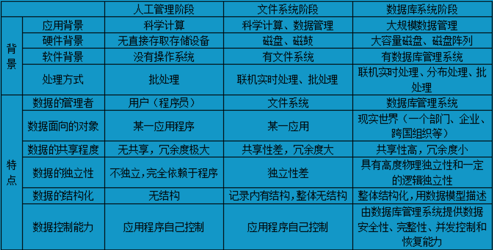

------

## 数据模型

数据模型（Data Model）也是一种模型。它是对**现实世界数据特征的抽象**。数据模型就是**对现实世界的模拟**。

> 例如：航模：是对现实中航天器的模型模拟。沙盘：是对现实中地理地貌的模拟。

> 而数据库就是针对现实生活中数据的特征，建立一个数据模型，并往其中存储数据。

首先建立一个数据模型应该满足以下三点要求：

① **能够比较真实客观地模拟或还原现实世界**

> 例如：现实生活中有个人叫张三，身高170，体重52Km等等。想要在计算机中模拟出这么一个人并参与互联网中的一些活动，就首先需要建立一个相应的数据模型以及相应的数据约束，并从中填充对应的数据，实现一个人的数据模拟。

② **容易为人所理解**

> 在设计数据库阶段，设计数据字段时，需要对字段的名称设定一个人能看懂的字面意思。例如姓名：Name等等。

③ **便于在计算机上实现**

> 如今最常用并易于计算机处理实现的数据模型是行列模式。就像是一张二维表，只有行列字段，这样比较好让计算机进行处理。

根据模型应用的不同目的，可分为两类：

### 概念模型

概念模型（Conceptual Model）也称为**信息模型**。它是**按用户的观点来对数据和信息建模，主要用于数据库设计阶段**。

> 也就是在数据库设计阶段，根据用户的角度对数据的理解来建立对应的数据库模型。

概念模型是**现实世界到机器世界的一个中间层次**，起到**承上启下**的**转换**作用。

> 也就是说从用户角度上看，设计现实世界的数据是什么样，之后到了机器世界中是什么样，而这个过程就是由概念模型来进行中间层转换的操作。它会把现实世界的数据转换成计算机可识别的数据，并由数据库系统存储到硬盘中。d

表现为：

① 概念模型**用于信息世界的建模**

② 现实世界到信息世界的**第一层抽象**

③ 数据库设计人员进行**数据库设计的有力工具**

④ 数据库设计人员与用户之间进行交流的语言

概念模型要求：

① 具有较强的语义表达能力

> 要二维地表达出模型中的数据在现实中是什么样子的。
>
> 就像二维关系表一样，行列之间能表示出字段之间的关系以及含义

② 能够方便、直接地表达应用中的各种语义知识

> 模型中的数据真实对应现实世界中的数据。

③ 简单、清晰、易于用户理解

> 模型的数据表字段名要能够第一时间被用户所理解出来。

#### 信息世界的基本概念

为了在建立模型时更好的理解所涉及到的一些概念关系。设计了一些基本概念以及名词

目的是为了能更好的将现实世界中的数据抽象成一个概念模型，并让数据库设计人员按照模型进行建模。

##### ① 实体 (Entity)

**客观存在并可相互区别的事物称为实体**。实体可以是人、事、物、也可以说抽象的概念或联系。

> 【例】一个部门、一个老师、一个学生、一门课等等都是实体。

##### ② 属性 (Attibute)

**实体所具有的某一特征称为属性。**一个实体可由若干个属性来描述、刻画。

> 【例】一个学生实体可以由学号、姓名、性别、出生日期、所在院系、年级等等属性来组成，且这些属性集的组成完整的刻画并描述了一个学生实体的特征。

##### ③ 码 (Key)

 又名：**关键字**。解释： **唯一标识实体的属性集称为码**。

它也是一个实体众多属性中的一种，只是比较特殊。

特征：**只要给定一个具体的值，就能确定一组唯一的数据**。

> 【例】学号就是学生实体的码。（可以通过学号来找到具体的某一个学生）

##### ④ 域 (Domain)

**域是一组具有相同数据类型的值的集合**。属性的取值范围来自某个域。

也就是说，域是作用是**规定字段的合理取值范围**。

> 【例】性别的域是（男、女），学生年龄的域为整数。考试成绩的域是0-100

##### ⑤ 实体型 (Entity Type)

**具有相同属性的实体必然具有共同的特征和性质**。

用其实体名和其属性名集合来抽象和刻画同类实体，称为实体类型。

也就是说**多个具有相同属性的实体可以被归纳为一个统一的实体类型**。

> 【例】学生是一个实体类型，由学号、姓名、性别、年龄等属性组成。有很多学生实体都具有这个特征。好比 Java 的 父类 > 子类

##### ⑥ 实体集 (Entity Set)

**同一实体类型的集合称为实体集**。

> 【例】全体学生就是一个实体集。

##### ⑦ 联系 (Relationship)

在现实世界中，**事物内部以及事物之间是有联系的**，这些联系在信息世界中反映为**实体(型)内部的联系和实体(型)之间的联系**。

> 如：事物之间：学生与教师两个实体之间存在着教与学的联系，学生与课程也存在着联系等等。
>
> 事物内部：一个班级中有班长来管理者班级上的学生，但同时班长本身也是学生。

- 实体内部的联系是指**组成实体的各属性之间的联系**。

- 实体之间的联系通常是指**不同实体集之间的联系**。

#### 两个实体型之间的联系

通常指两个实体型之间的联系。

##### 一对一联系(1: 1)

如果**对于实体集A中的每一个实体，实体集B中最多有一个(也可以没有)实体与之联系**，反之亦然。则称为实体集A与实体集B具有一对一联系。记为 1 : 1。

也就是说实体集A与实体集B之间的每个实体都是一一对应的。

**实体集A > 实体集B : 一对多 【一个班级 > 一个班长】**

**实体集B > 实体集A : 一对一 【一个班长 > 一个班级】**

> 【例】学校里面，一个班级只能有一个正班长，而一个班长也只能在一个班中任职。由于班级与班长是两个实体集，且它们两个之间在对方看来都是唯一、对应的，所以班级与班长之间具有一对一联系。

关系模型表示法：

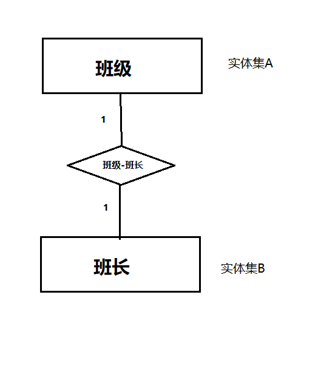

##### 一对多联系(1:n)

如果**对于实体集A中的每一个实体，实体集B中有n(n>=0)个实体与之联系**。（不过约定俗成之下，一般至少实体集B中**有两个以上**与实体集A中的某个实体对应，才叫一对多联系）。反之，对于实体集B中的每一个实体，实体集A中至少要有一个实体与之联系，则称实体集A与实体集B具有一对多联系，记为 1 : n。

**实体集A > 实体集B : 一对多 【一个班级 > 多个学生】**

**实体集B > 实体集A : 一对一 【一个学生 > 一个班级】**

所以，一对一联系也是一对多联系的特例。

> 【例】一个班级中有若干个学生，而每个学生只能在一个班级中学习，则班级与学生之间具有一对多联系。
>
> 在班级而言：班级由多个学生组成，所以是一对多。
>
> 在学生而言：一个学生只能在一个班级中学习，所以是一对一。

关系模型表示法：

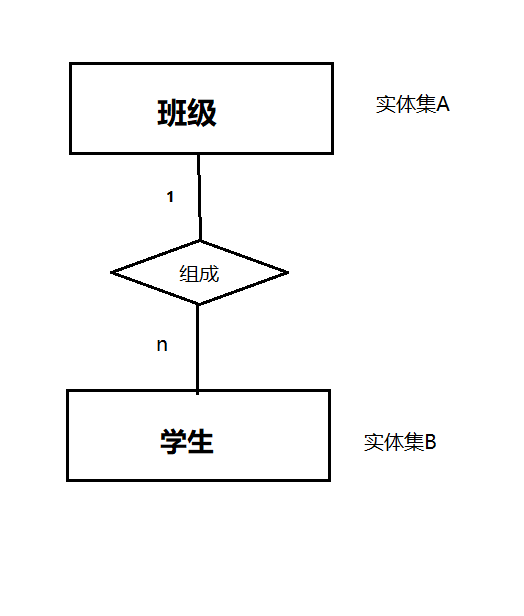

##### 多对多联系(m:n)

如果**对于实体集A中的每一个实体，实体集B中会有 n (n>=0) 个实体与之联系**。反之，对于实体集B中的每一个实体，实体集A中也有 m (m>=0) 个实体与之联系。则称实体集A与实体集B具有多对多联系。记为 m : n。

> 一对多联系也是多对多联系的特例。

**实体集A > 实体集B : 一对多 【一个学生 > 多们选课】**

**实体集B > 实体集A : 一对多 【一门选课 > 多个学生】**

> 【例】一门课程同时有多个学生选修，而一个学生也同时可以选修多门课程。则课程与学生之间具有多对多联系。

关系模型表示法：

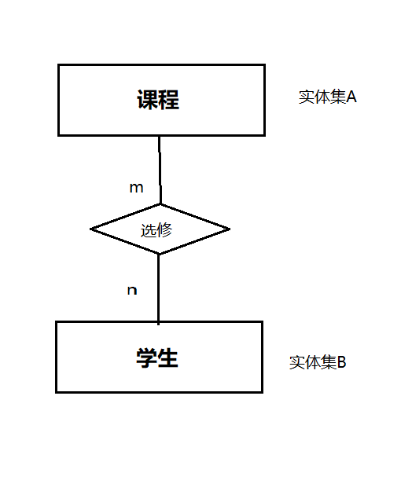

#### 两个以上实体型之间的联系

两个以上 的实体型之间也存在着一对一、一对多、多对多的联系。

##### 一对多联系(1:n)

若实体型 E1，E2，.... En 之间存在联系。对于实体型Ei 中给定的实体，最多只和Ei 中的一个实体相联系，则说 Ei 与 E1、E2 ... En之间的联系是一对多联系。

> 【例】对于课程、教师、参考书 这3个实体型。如果一门课程可以有多个老师来讲授，且多个老师会使用多本参考书，反之，每个老师只能讲授一门课程，每一本参考书也只提供一门课程使用。则课程、教师、参考书之间是一对多联系。

关系模型表示法：

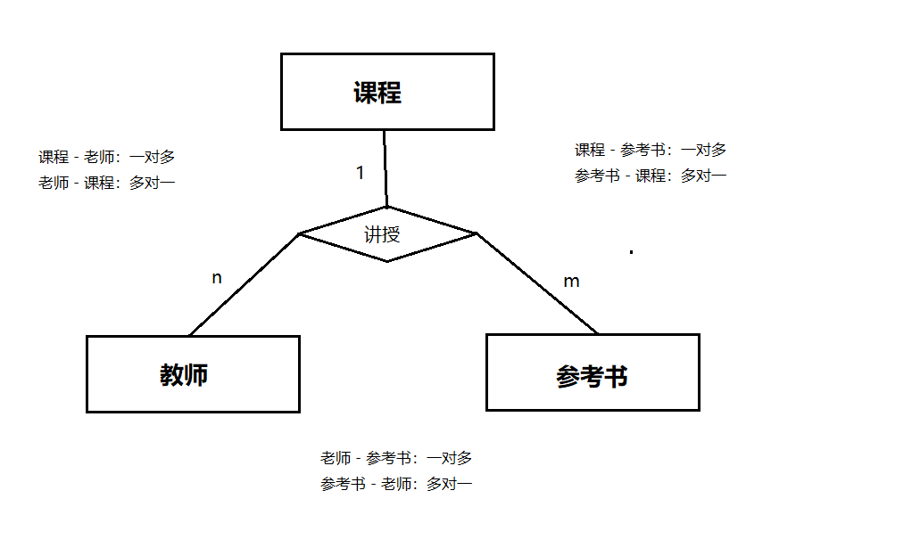

##### 多对多联系(m:n)

> 【例】有 3 个实体型：供应商、项目、零件。一个供应商可以供给多个项目多种零件，而每个项目可以使用多个供应商供应的零件，每个零件可由不同的供应商供给。得出供应商、项目、零件三者之间是多对多联系。

关系模型表示法：

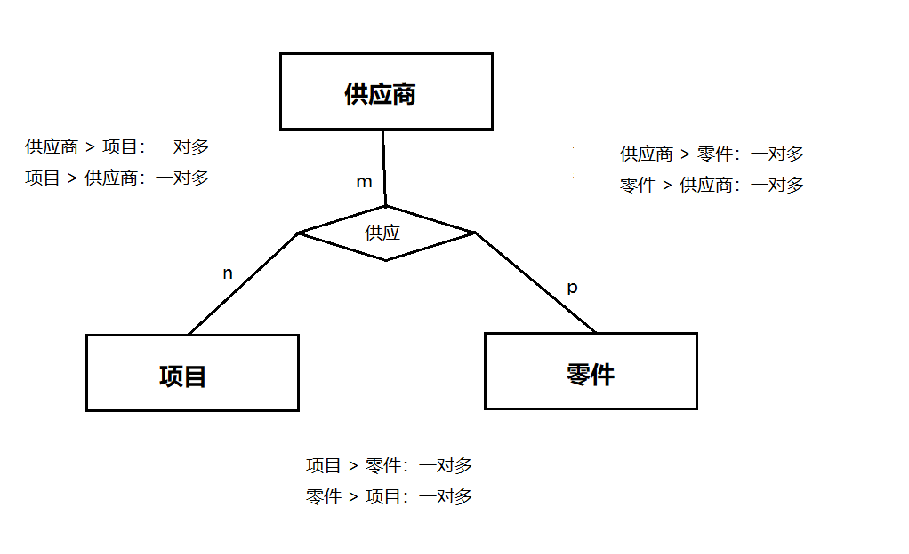

#### 单个实体型内的联系

同一实体集内的各实体之间也存在有一对一、一对多、多对多联系、

> 【例】以一个公司的所有职工实体型为例，职工与职工内部存在有领导与被领导的关系。如一个经理可以管理若干个职工，经理本身也是公司的职工，而一个职工仅被另外一个职工所管理。因此这是职工内部的一对多联系。

关系模型表示法：

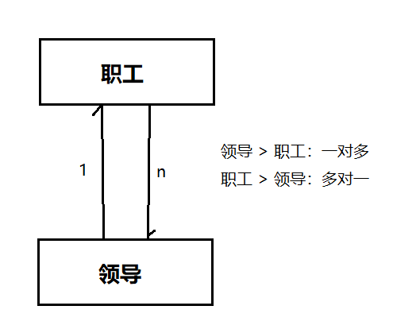


#### 实体-联系图(E-R图)

E-R图是概念模型的一种重要的表示方法，提供了表示**实体型、属性和实体之间的联系**。

实体型：用 **矩形** 表示。矩形内写明实体名。

属性： 用 **椭圆形** 表示。用无向边将其与相应的实体联系到一起。

实体之间的联系：用 **菱形** 表示。菱形框内写明联系名，并用无向边分别与有关实体型连接起来，同时在无向边标注上联系的类型（1:1, 1:n, m:n）。

注：**如果一个联系也具有属性，那么这些属性也要用无向边与联系连接起来**。

###### 实例

某个工程物资管理的E-R图：

涉及实体：

1、仓库。属性：仓库号、面积、电话号码；

2、零件。属性：零件号、名称、规格、单价、描述；

3、供应商。属性：供应商号、姓名、地址、电话号码、账号；

4、项目。属性：项目号、预算、开工日期；

5、职工。属性：职工号、姓名、年龄、职称。

实体与属性的E-R图：

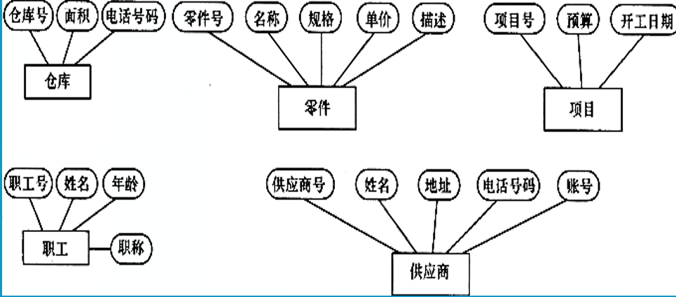

实体之间的联系如下：

(1) 一个仓库可以存放多个零件、一种零件可以存放在多个仓库。因此仓库与零件之间具有多对多联系。同时使用库存量来表示某种零件在某个仓库的数量。也就是联系的属性。

(2) 一个仓库中有多个职工当保管员，一个职工只能在一个仓库工作。因此仓库与职工具有一对多联系。

(3) 职工之间具有领导-被领导的关系。即仓库主任领导多个保管员。因此职工实体集内部有一对多联系。

(4) 项目、供应商、零件之间具有多对多联系。即一个供应商可以供多个项目多种零件，每个项目可以使用多个供应商供应的零件，一种零件可以供给多个项目使用。

实体及其联系的E-R图：

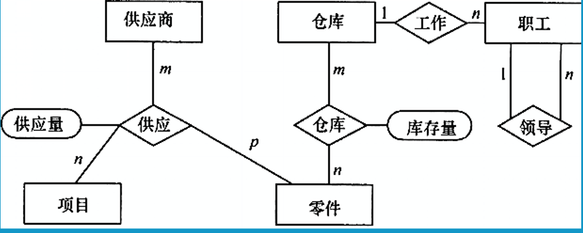

综合E-R图：

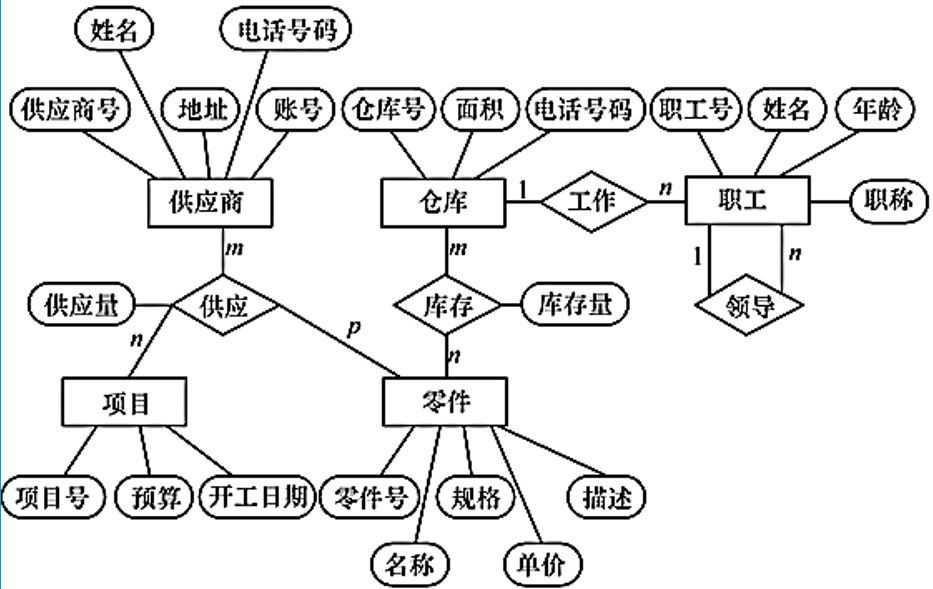

### 逻辑模型 & 物理模型

#### 逻辑模型

逻辑模型：**它是按计算机系统的观点对数据建模，主要用于DBMS的实现。**

也就是说，数据库是以什么样的结构在计算机中展现出来。

主要包括：

① **层次模型**（Hierarchical Model）

> 层次模型是以层次结构展现出来的。也就是 树状结构。例如：二叉树。

如图：

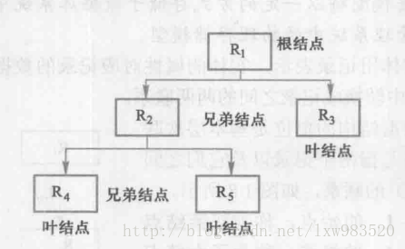

② **网状模型** （Network Model）

> 网状模型就好比UML中的时序图。它定义了一件事物的执行顺序以及事件之间的逻辑关系。
>
> 例如：什么时候执行事件1，事件1执行完后才执行下一步的事件2/事件3，依次类推。

如图：

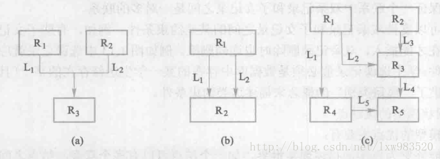

##### ③ **关系模型**（Relational Model）

> 关系模型：其实就是常见的二维行列模型。

###### 术语

1）**关系（Relation）**：一个关系对应通常说的**一张表**；
2）**元组（Tuple）**：数据表中的**一行**即为一个元组；
3）**属性（Attribute）**：数据表中的**一列**即为一个属性，给每一个属性起一个名称即属性名；
4）**码（Key）**：也称为码键，**表中的一列属性**，它可以**唯一确定一个元组**；
5）**域（Domain）**：一组具有相同数据类型的值的集合。**属性的取值范围**来自某个域；
6）**分量**：每个属性元组中的一个**属性值**。
7）**关系模式**：**对关系的描述**，一搬表示为：**关系名（属性1，属性2，…，属性n）**

关系表：**两表之间的联系表，必须至少有两个属性（表1、表2的键）**，此表其他的属性则是表1、2产生联系时所具备的属性。

如图：

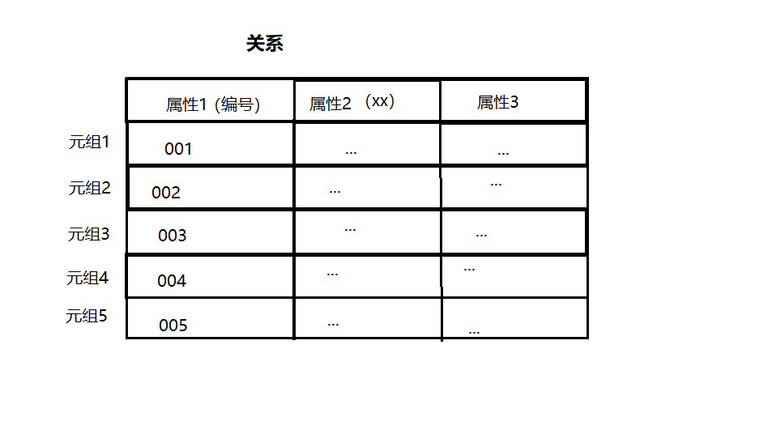

实体关系模型ER：

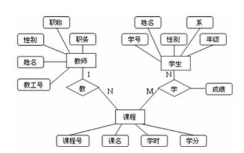

在数据库中的展现模型：

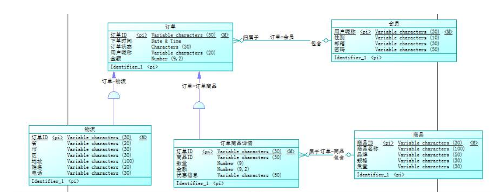


###### 操纵与完整性约束

关系数据模型的操作主要包括查询、删除、插入和修改数据。这些操作必须满足关系的**完整性约束条件**。【见下面“数据模型的组成要素--完整性约束”】

###### 优点

1、关系模型与格式化模型不同，它是**建立在严格的数学概念基础上**的。

2、关系模型的**概念单一**。就是一张二维表。

3、关系模型的**存取路径对用户透明** 【存取数据时不用管数据存在哪，怎么取，只管拿到数据即可】。从而具有更高的数据独立性、更好的安全保密、也简化了程序员的工作与数据库开发建模的工作。


④ **面向对象模型**（Object Oriented Model）

⑤ **对象关系模型**（Object Relational Model）


#### 物理模型

物理模型：是对数据最底层的抽象，它描述数据在计算机系统内部的**表示方式**和**存储方法**。

在**磁盘或磁带上的存储方式和存取方法**是**面向计算机系统硬件**的。	


#### 总结

【应用层】

概念模型：定义**应用程序想要获取什么结构的数据**。

【设计层】

逻辑模型：在设计数据库如何存取阶段中，定义**数据库中的数据是以什么结构来存储**的。

【底层】

物理模型：在设计完数据库模型后。定义**数据库中的数据是以什么形式存储到计算机硬盘中的，存储到什么位置，又是以什么形式来读取的**。【例如：以堆栈形式、数组形式存储到D盘。】

------

### 数据模型的组成要素

数据模型通常由**数据结构、数据操作、完整性约束** 三部分组成。

#### ① 数据结构

定义数据之间是以什么样的关系存在的。

数据结构描述**数据库的组成对象**以及**对象相互之间的联系**。

数据结构是所描述的对象类型的集合，是对系统**静态性**的描述。

#### ② 数据操作

在设计完数据库的数据结构后，定义在此数据结构的模型下有哪些操作。

数据库主要有**查询和更新（包括插入、删除、修改）**两大类操作。

数据操作是对系统**动态性**的描述。

#### ③ 完整性约束

定义**数据库中数据的存储以及读取条件**，并为此建立完整性约束。

数据的完整性约束条件是一组**完整性规则**，主要分为存储于读取时的规则。

> 例如：关系表之间的关系数据要同步，不可各自数据独立，出现数据不一致的情况。
>
> 同时在存储的过程中，身高/体重等信息必须是数字形式的数据等等类似约束。

【例】在**关系模型**中，所有关系都必须满足**实体完整性** 和 **参照完整性** 两个条件。

- **实体完整性**：为每组数据设定一个关键字，让其能够**唯一确定**。相当于是一组数据的**索引**。
  - 例如：人的身份证号。人的身份证号就是基本信息的关键字，能够索引其基本信息，且每个人的身份证号是唯一的，能够通过身份证号来确定一个人。
- **参照完整性**：一个实体的属性要参照另一个实体的属性来赋值。两张表之间所存储的关系数据必须是一致、同步的。
  - 就好比主从表的主外键数据必须一致一样。

- **用户定义的完整性： ** **根据用户实际应用场景来设定取值范围**。
  - 例如：员工退休不得低于65岁，属性赋值时就不能低于65。


## 数据库系统结构

### 数据库系统模式的概念

模式（Schema）是数据库中**全体数据的逻辑结构和特征的描述**。它仅仅涉及到对模型的描述，不涉及到具体的值。**模式的一个具体值称为一个实例，同一个模式可以有很多实例**。

模式是相对稳定的，而实例是相对变动的，因为数据库中的数据是在不断更新。**模式反映的是数据的结构及其联系，而实例反映的是数据库中某一时刻的状态**。

**模式是一个抽象的概念，它规定了一个东西应该包含哪些部分**。而具体到一个实例的时候，每个实例就会有所不同。也就是说每个实例都是遵循了该模式规范下所产生的，而相对于每个实例来说，每个实例的特征又会有所不一样，但是大体上是一致的。

比如现实生活中，一个人组成应该有鼻子、耳朵，眼睛等，而具体到某个人身上的时候，可能这个人眼睛比别人大，耳朵比别人小等等之类的不同。而在信息世界的数据库中，则是具体到某个实例记录表应该有哪些数据，这些数据是什么等等。

> 【例】在学生选课数据库模式中，规定学生选课的这个模式应该包含了学生记录表、课程记录表和学生选课记录表。则2003年有一个学生数据库的实例，该实例包含了2003年学校中所有学生的记录（如果某校有1000个，学生就应该有1000个学生记录）、学校开设的所有课程的记录和所有学生选课的记录。


### 三级模式结构

#### 前提

虽然实际的数据库管理系统产品种类很多，它们支持不同的数据模式，使用不同的数据库语言，建立在不同的系统之上，数据的存储结构也各不相同，但它们在体系结构上通常具有	相同的特征，即**采用三级模式结构并提供两级映射功能**。

数据库技术中**采用分级的方法，将数据库的结构划分为多个层次**。最著名的是三级模式结构。

#### 介绍

数据库系统的三级模式结构是指数据库系统是由**外模式、模式、内模式**三级构成。

三级模式结构如图：

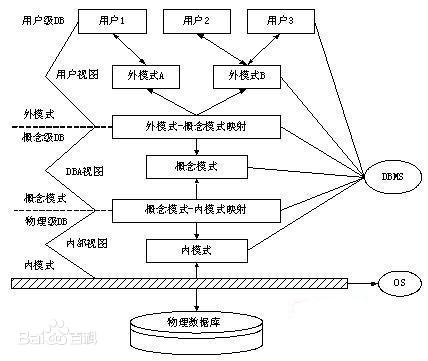

##### 外模式

也叫 **子模式或用户模式**。**指把数据库中的数据根据用户的需求反映给用户**。

它是**数据库用户能够直观的看见和使用的局部数据的逻辑结构和特征的描述，是数据库用户的数据视图，是与某一应用有关的数据的逻辑展示**。

> 当使用应用程序想要对数据库进行查询某个人的信息，数据库接收到此查询命令后，将数据库中的数据按照一定的格式返还给用户看，这一过程就叫做外模式。
>
> 它是应用程序在访问数据库的时候所应用到的模式。

注意：

- 外模式通常是模式的子集。外模式【应用】展示的数据只是模式层内【数据库】的局部数据。

- 一个数据库可以有多个外模式。应用程序都是和外模式打交道的。
- 同一外模式也可以为某个用户的多个应用程序所使用，但一个应用程序只能使用一个外模式

- 外模式是保证数据库安全性的一个有力措施。每个用户只能看见和访问所对应的外模式中的数据，数据库中的其余数据对他们是不可见的。


##### 模式

也叫 **逻辑模式或概念模式**。是**数据库中全体数据的逻辑结构和特征的描述，是所有用户的公共数据视图**。

模式实际上是数据库数据在逻辑级上的视图。**一个数据库只能有一个模式**。**定义模式时不仅要定义数据的逻辑结构，还要定义数据之间的联系，定义与数据相关的安全性、完整性要求**。

也就是说，模式是规定了数据库当中存储的所有数据是如何存储的，以什么结构存储，它们之间的联系、完整性约束是怎样的等等概念。

##### 内模式

也叫 **存储模式或物理模式**。它是**数据物理结构和存储方式的描述**，是**数据在数据库内部的表示方式**。也就是**规定数据是如何在硬盘上存储**的。一个数据库只有一个内模式。例如，记录的存储方式是顺序结构存储还是B树结构存储，索引按什么方式组织，数据是否压缩，是否加密，数据的存储记录结构有何规定等。

> 三级模式结构的层次渐进的顺序。外模式负责将用户需要的数据返给用户，模式负责规定数据库中的数据是如何存取的，内模式规定数据在硬盘上是如何存储的。

##### 二级映像

数据库管理系统在三级模式之间提供了两层映像：

两层映像保证了数据库系统中的数据能够具有较高的逻辑独立性和物理独立性。

###### 外模式/模式映像

**模式层描述的是数据的全局逻辑结构，外模式描述的是数据的局部逻辑结构**

外模式层与模式层之间的数据转换，体现在用户通过使用应用程序导入某条数据时，外模式的数据再传给模式层的数据库中进行存储。同理，反之，如果用户要拿取数据，则也是通过外模式层的应用程序向模式层内的数据库中调出数据并返给用户。

###### 模式/内模式映像

**数据库中只有一个模式，也只有一个内模式，所以模式/内模式映像是唯一的**，它定义了**数据全局逻辑结构和存储结构之间的对应关系**。

模式层与内模式层之间的数据转换，体现在用户在插入数据时，经由模式层存储到数据库中，再通过模式层的数据库存储到具体的硬盘上。反之同理，在想拿某一数据时，模式层从内模式取出数据并通过外模式返还给用户。

###### 物理独立性

当数据库的存储结构发生了改变（例如选用了另一条存储结构），由数据库管理员对模式/内模式映像做出相应改变，可以使模式保持不变，从而应用程序也不必改变。保证了数据与程序的物理独立性。


## 数据库系统的组成

数据库系统一般由数据库、数据库管理系统（及其开发工具）、应用系统和数据库管理员组成。

### 硬件平台及数据库

硬件资源要求：

（1）要有足够大的内存、存放操作系统（Windows/Linux）、DBMS的核心模块、数据缓冲区和应用程序。

（2）有足够大的磁盘或磁盘阵列等设备存放数据库，有足够的磁带（或光盘）作数据备份

（3）要求系统有较高的处理能力，以提高数据传输效率

### 软件

数据库系统的软件主要包括：

（1）DBMS。DBMS是为数据库的建立、使用和维护配置的系统软件。

（2）支持DBMS运行的操作系统。

（3）具有与数据库接口的高级语言及编译系统，便于开发应用程序

（4）以DBMS为核心的应用开发工具。【中间层：JDBC，ODBC】

（5）为特定应用环境开发的数据库应用系统。

### 人员

开发、管理和使用数据库系统的人员主要是：**数据库管理员、系统分析员、数据库设计人员、应用程序员和最终用户**。不同人员设计不用的数据抽象级别，具有不同的数据视图。

如下图：

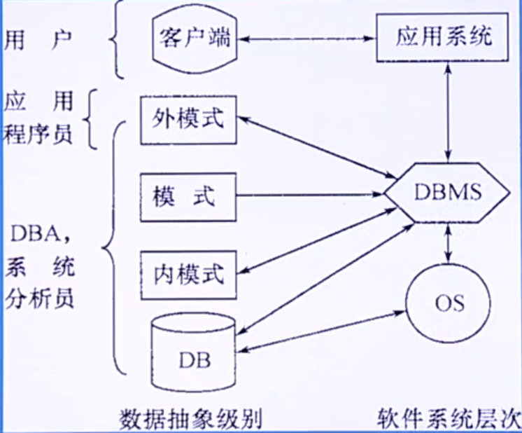

#### 数据库管理员 DBA

需要有专门的管理机构来监督和管理数据库系统。DBA则是这个结构的一个（组）人员。

**负责全面管理和控制数据库系统**。具体职责包括：

(1) 决定数据库中的信息内容和结构、数据库要存放哪些信息、DBA要参与决策；

(2) 决定数据库的存储结构和存取策略；

(3) 定义数据的安全性要求和完整性约束；

(4) 监控数据库的使用和运行；

(5) 数据库的改进和重组重构；

>  在数据库建立好之后，专门对数据库进行管理与维护【增删改查】

#### 系统分析员

**负责应用系统的需求分析和规范说明，要与用户和DBA相对接、沟通**，确定系统硬软件配置，并参与数据库系统的概要设计。

> 也就是对外与客户沟通，将客户所描述的现实中的应用场景归纳、抽象成一个模型，并作出相应的E-R图，同时，对内，与DBA沟通，做出的数据库系统分析是否合理。起到承上启下的作用。

#### 数据库设计人员

根据系统分析员作出的E-R图的模型基础上，进行数据库的建立。负责**数据库中数据库的确定、数据库各级模式的设计**。

#### 应用程序员

负责**开发与数据库相对应的应用程序，并进行调试和安装**，最终投放给用户使用。


