# 关系数据库

## 关系数据结构及形式化定义

### 关系

**单一的数据结构--关系**

**现实世界中的实体以及实体之间的各种联系均可使用关系来表示**。

**逻辑结构--二维表**

从用户角度上看，**关系模型中数据的逻辑结构就是一张二维表**。

关系模型是**建立在集合代数的基础上**。

#### 域(Domain)

域是**一组具有相同数据类型的值的集合**。就是实体属性的**取值范围**。

> 【例】整数、实数、介于某个取值范围的整数，{‘男’，‘女’}等等。

#### 笛卡尔积

给定一组域【取值范围】D1、D2、...、Dn，**这些域的取值类型可以是相同的**。

则D1、D2、....、Dn的笛卡尔积为：

**D1 * D2 * ... * Dn = { (d1,d2,...,dn) ...} 所有域的所有取值的一个组合。**

笛卡尔积的计算是**在现有的所有域集合的基础上，将每个域中的所有值都逐个进行一次全面的组合**。也就是**D1 的域的第一个值，与D2域的第二个值进行匹配，再与 Dn 域的值匹配，一条完整数据匹配出来之后，再接着重新到 D1 域的第二个值以此类推进行逐个匹配**。

最终得出若干个域集合可以取出的不重复的数据。但是，虽然笛卡尔积能有效地得出全部可能存取的值，但是很多情况下，笛卡尔积得出的所有数据中有部分数据是毫无实际意义的。

【例】

```java
D1 = 导师集合 SUPERVISOR = {张青梅、刘毅}

D2 = 专业集合 SPECIALITY = {计算机专业、信息专业}

D3 = 研究生集合 POSTGRADUATE = {李勇、刘晨、王敏}
```

则 D1、D2、D3的笛卡尔积为：

```java
D1 * D2 * D3= { 

 (张青梅、计算机专业、李勇)、 (张青梅、计算机专业、刘晨)、 (张青梅、计算机专业、王敏)、

 (张青梅、信息专业、李勇)、 (张青梅、信息专业、刘晨)、 (张青梅、信息专业、王敏)、

 (刘毅、计算机专业、李勇)、 (刘毅、计算机专业、刘晨)、 (刘毅、计算机专业、王敏)、

 (刘毅、信息专业、李勇)、 (刘毅、信息专业、刘晨)、 (刘毅、信息专业、王敏)

}
```

以上结果可以看出，虽然得出了3个域能匹配的所有结果，但是很多数据都是毫无意义的，例如：一个导师不能教授两个专业，同时一个研究生不能学习两个专业。

笛卡尔积取值过程如下图：

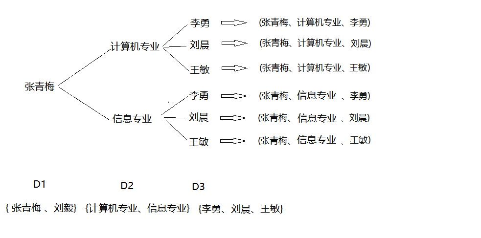

#### 元组(Tuple)

从**关系上**来看，**元组就是一行数据**。

从笛卡尔积上来看，**笛卡尔积中每一个元素（d1,d2...,dn）称作一个 n 元组(n-Tuple)，或简称元组(Tuple)**。也就是**匹配出来的每一条数据都是一个元组**。

> 【例】 (张青梅、信息专业、李勇) 、(张青梅、信息专业、王敏) 等都是元组。


#### 分量(Component)

**笛卡尔积元素（d1,d2,...,dn） 中的每一个值 di 称作一个分量**。【属性值】

也就是**匹配出来的每条数据中的每一个值都是分量**。

> 【例】 (张青梅、信息专业、李勇) 中 张青梅、信息专业、李勇 都是分量。


#### 基数

基数是针对于域来说的。指的是**一个域能存取几个值，那么这就是它的基数**。

- 域 = 字段的取值范围

> 【例】D1 = 导师集合 SUPERVISOR = {张青梅、刘毅} 
>
> D1 的取值范围只有两个，那么 D1 的基数 就是 2。

笛卡尔积的全部基数计算：**D1  的基数 * D2 的基数 * ... * Dn 的基数**。

> 【例】
>
> D1 = 导师集合 SUPERVISOR = {张青梅、刘毅}
>
> D2 = 专业集合 SPECIALITY = {计算机专业、信息专业}
>
> D3 = 研究生集合 POSTGRADUATE = {李勇、刘晨、王敏}
>
> 此笛卡尔积的全部基数 m 为 D1 * D2 * D3 = 2 * 2 * 3 = 12。


#### 笛卡尔积的表示方法

**笛卡尔积可表示为一张二维表。表中的每行对应一个元组，每列对应一个域。**

> 关系上：关系 = 表，元组 = 行，属性= 列
>
> 笛卡尔积上：笛卡尔积 = 表，元组 = 行，域 = 列

【例】

```java
D1 = 导师集合 SUPERVISOR = {张青梅、刘毅}

D2 = 专业集合 SPECIALITY = {计算机专业、信息专业}

D3 = 研究生集合 POSTGRADUATE = {李勇、刘晨、王敏}
```

D1、D2、D3 的笛卡尔积表示为：

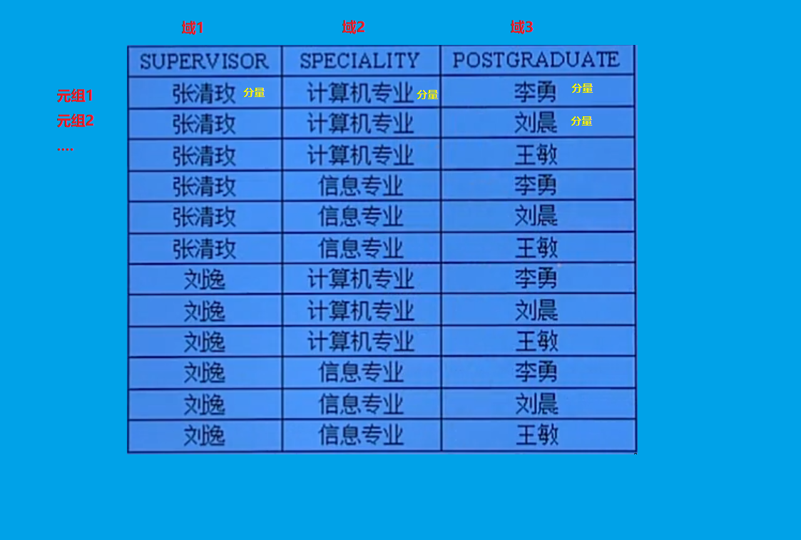


#### 关系(Relation)

##### ① 关系

**在域 (D1，D2，...Dn) 上笛卡尔积D1 * D2 * ... * Dn 的子集称为关系。表示为 R(D1,D2,...Dn)。**

**关系名使用 R 来表示，属性用 D**。如：R(D1,D2,...Dn) 。

**其中 n 表示关系的目 或 度 (Degree) ，也就是此关系中有 n 个属性**。 

> 【例】学生（学号、姓名、性别、年龄....）
>
> 目：5 个，R ： 学生，D1 ： 学号....


##### ② 元组

**关系中的每个元素是关系中的元组，通常用 t 表示**。

**t = 一行数据**。**t(1) = 第一行数据**


##### ③ 单元关系 & 二元关系

**当 n = 1时，称该关系为 单元关系；**

**当 n = 2时。称该关系为 二元关系。**

也就是说，**如果一个关系【表】中的属性只有 1 个，则是单元关系，如果有 2 个则是二元关系**。


##### ④ 关系的表示

**关系也是一个二维表**。表的每行对应一个元组，每列对应一个域、一个属性。

**行 = 元组**

**列 = 属性 ，域 = 属性的取值范围**


##### ⑤ 属性

**关系也是一张二维表，表的每行对应一个元组、每列对应一个域。由于不同列的域可以相同，为了加以区分，则给列起一个名字，称为 属性。**

**n 目关系必有 n 个属性。** 

**n  = 属性的个数**。

> 【例】R(D1,D2,D3)  此关系 R 的目为 3 ，属性也为 3 个。


##### ⑥ 码

码也是关系中的一个或多个属性，只不过比较特殊，它的值必须唯一，且能索引一条唯一的数据。

###### 候选码

------

**若关系中的某一属性组能惟一地标识一个元组，则称该属性组为候选码。**

也就是说，在关系中，不仅仅只有一个属性能够唯一确定一条元组数据，而这些**能够唯一确定一条元组数据的属性都称为 候选码**。

简单的情况：**候选码只包含一个属性**。

> 【例】一个学生表中有学号、姓名、身份证号、性别等属性。其中学号与身份证号都是唯一、非空的，都能唯一地确定一条学生的元组数据，在没有确定哪个才是最后的主码之前，学号与身份证号都是候选码。

###### 全码(All-key)

------

在有的时候，一个码可能无法唯一确定一条元组属性，可能会需要到**多个属性共同来构成一个码才能唯一确定一条数据**。

> 【例】学生选课成绩表（学号、课程号、成绩）
>
> 其中学号和课程号都是码，但是单独拿出来则无法确定一条学生选课成绩的元组数据，必须学号和课程号两个属性来同时组成一个码才能确定一条元组数据。

而全码，则是在最极端的情况：**关系模式的所有属性组都是这个关系模式的候选码，称为 全码**。

也就是说，一个表中的所有属性在其他表中单独拿出来都是能唯一确定一条元组的码，但是在某个表中，却无法做到，必须要其他属性一起组合构成一个码才能唯一确定一条元素数据，而恰好要构成这个码的所需属性就是这个表的所有属性，那么这张表的所有属性加一起构成的码就称为全码。

> 【例】 学生选课成绩表（学号、课程号）
>
> 其中学号和课程号都是候选码，在其他表都能唯一确定一条数据，但是在这单独拿出来却无法确定一条学生选课成绩的元组数据，必须学号和课程号两个属性来同时组成一个码才能确定一条元组数据。那 学号 + 课程号 = 一个全码。


###### 主码

**若一个关系中有多个候选码，则选定其中一个为主码（Primary key）**。

------

###### 主属性

**候选码 / 主码 就叫做一个表的主属性**。

------

###### 非主属性

**除了候选码  / 主码，其他都是非主属性 或 非码属性**。

------

###### 外部码

**设F 是基本关系 R 的一个或一组属性，但不是关系R的码，如果 F 与基本关系 S 的主码 Ks 相对应，则称 F 是基本关系 R 的外部码，简称外码 (Foreign key)**。【也就是表的外键】

> 它是某张表的一个属性，但不是此表的码，不过却与另一个表的主码是相关联的，可以通过此属性来将当前表与另一个表联系起来，进行联合查询等操作。

------


##### ⑦ 三类关系

关系表共有以下三类方式展示：

**基本关系（基本表或基表）**：**实际存在的表，是实际存储数据的逻辑表示**。

**查询表**：查询结果对应的表。是**基于基表之上查询结果的虚拟表**。

**视图表**：**由其他表或其他视图导出的表，都是虚表**。不对应实际存储的数据。


##### ⑧ 基本性质

(1) **列是同质的**。也就是说一个列中的数据拥有相同的类型、相同的域。

(2) **不同的列可出自同一个域**。其中每一列是一个属性，不同的属性要给予不同的属性名。

> 【例】姓名、性别虽然具体值不同，但是就取值范围而言，它们两个都是汉字，也可以说是出自一个取值范围。

(3) **列的顺序无所谓**。列的次序可以任意交换。

(4) **任意两个元组的候选码不能相同**。也就说任意两条的键值不能相同。

> 【例】两条学生记录的学号不能相同。

(5) **行的顺序无所谓**。行的次序可以任意交换。

(6) **分量必须取原子值**。这是规范条件中的最基本一条。

- 原子值：指存储的值已经是最小的单位了，不可再进行拆分。

也就是说**在数据处理当中，查询的结果必须是一张二维表，其中单元格不能再进行拆分成多个部分，每个列都是一个独立的单元格**。【第一范式】

不能出现如下图的表结构：

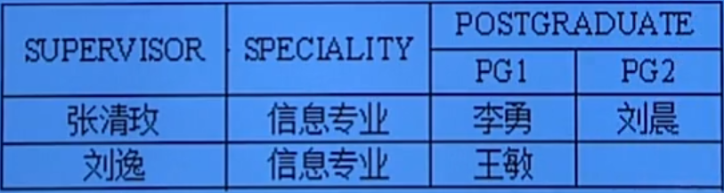

以上表图可以看出 POSTGRADUATE 这个属性又拆分成了两个属性值，在第一范式中，这是不可取的，如果一定要拆分，必须将要拆分的一个属性重新定义为两个单独的属性。


### 关系模式

模式：**指规定某件事物是如何构建的固定概念**。

>  就好比工厂的模具，模具规定了某个产品必须是什么样子的、

**关系模式 (Relation Schema ) 是对关系的描述。关系模式是型 <T> ，关系是值。**

#### 关系组成的特征

① **元组集合的结构**

一个元组由**不同的属性构成、属性的域【取值范围】、属性与域之间的映像关系** 三者构成。

② **一个关系通常由赋予它的元组语义定义**

一个表的整体内容是由其存储的元组数据的内容来表示的。

③ **现实的世界中还存在着完整性约束**

一个属性的值除了来自它的取值范围之外，还需要遵循与现实世界一致的完整性约束。

#### 定义关系模式

关系模式可以形式化地表示为 **R（U，D，DOM，F）**。

- **R：关系名**

- **U：组成该关系的属性名集合 (D1,D2,...Dn)**

- **D：属性组 U 中属性所来自的域**

- > 也就是其每个属性的取值范围。DOM (属性名 - 域)

- **DOM：属性向域的映像集合**

- > 也就是属性与其取值范围之间的映射

- **F：属性间的数据依赖集合**

  - > 能通过给定一个值x就推出一条元组数据。

> 【例】导师和研究生都是出自同一个域 —人。因此取不同的属性名，并在模式中定义属性向域的映像，即说明它们分别数字哪个域。
>
> DOM(导师 — Person) = DOM(研究生—Person) = Person

#### 关系模式与关系

**关系模式与关系：模具 - 产品 的关系 --> 表结构 - 查询结果表 的关系**。

- <span style="color:red">**关系模式是静态的、稳定的**</span>

* <span style="color:red">**关系是动态的、随时间不断变化的，因为关系操作在不断地更新着数据库中的数据。**</span>

> **关系模式：表结构，关系：在现有表结构的基础上不断变化的数据结果表。**
>
> 也就是说，**关系模式其实就是一开始建立的表结构，规定了这张表的字段及约束，而通过查询手段查出来的结果表【一张二维表】，就是其关系模式的关系体现**。

**关系是关系模式在某一时刻的状态或内容**，在实际应用中关系模式与关系统称为关系，需要通过上下文加以区别。


### 关系数据库

在给定的一个应用领域中，**所有关系表的集合构成了一个关系数据库**。

#### 关系数据库的型与值

（1）关系数据库的**型**：**关系数据库模式**，**对关系数据库的描述**。

（2） 关系数据库**模式**：**若干域的定义，在这些域上定义不同的关系模式**。

> 例如：学生的姓名的域在成绩表、住宿表等多个关系模式上应用。

（3）关系数据库的**值**：**关系模式在某一时刻对应的关系的集合**。

以上统称为关系数据库。

#### 关系模型的存储结构

1、有的关系数据库管理系统中一个表对应一个操作系统文件，并将物理数据组织交给操作系统完成。【也就是如何存放让操作系统来实现】
2、有的关系数据库管理系统从操作系统那里申请若干个大的文件，自己划分文件空间，组织表、索引等存储结构，并进行存储管理。


## 关系数据结构

### 基本关系操作集合

查询：选择、投影、并、差、连接、除、交等。其中投影、并、差、笛卡尔积是5种基本操作。

查询是其中最主要的部分。

<span style="color:red">**关系操作：查询、插入、删除、修改**</span>。

特点：

**集合操作方式：操作的对象和结果都是集合，一次一集合的操作方式**。

### 关系数据库语言的分类

#### ① 关系代数语言

<span style='color:red'>**用对关系的运算来表达查询要求**</span>。代表：ISBL

#### ② 关系演算语言

<span style='color:red'>**用谓词【真/假】来表达查询要求**</span>。

(1) **元组关系演算语言**：谓词单元的基本对象是**元组变量**。

代表：Aplha,Quel

(2) **域关系演算语言**：谓词单元的基本对象是**域变量**。

代表：QBF

#### ③ 有双重特点的语言

代表：SQL (Structure Query Language )


### 关系的完整性约束

关系模型中有三类完整性约束：**实体完整性、参照完整性、用户定义的完整性**。

其中<span style="color:red">**实体完整性、参照完整性是关系模型必须满足的完整性约束条件、称为关系的两个不变性**</span>，应该由关系系统自动支持。

用户定义的完整性是应用领域需要遵循的约束条件，体现了具体领域中的语义约束。

#### 实体完整性

实体完整性规则是指<span style='color:red'>**若属性 A 是基本关系 R 的主属性，则属性A不可取空值**</span>。

空值就是**“不知道”、“不存在” 或 “无意义” 的值**。

##### 规则说明

(1) 实体完整性规则是**针对基本关系而言的**。一个基本表对应现实世界的一个实体集。

(2) 现实世界中的实体是可区分的，即它们都有专属的唯一性标识。【如：身份证号】。

(3) 关系模型中**以主码为唯一性标识**。

(4) 主码中的属性即**主属性不能取空值**。

主属性取空值，就说明存在某个不可标识的实体，即不能区分的实体，这就与第 (2) 条相矛盾，因此这个规则称为实体完整性。

**【注意】实体完整性规则规定基本关系的所有主属性都不可取空值。**	

> 【例】 选修(学号、课程号、成绩) “学号、课程号“都是主码，所以不能给空值。
>
> 注：带下划线__ 的属性都是主属性。


#### 参照完整性

在关系模型中实体与实体之间的联系都是用关系来描述的，意味着存在有关系与关系间的引用。

所谓参照完整性指的是 **一个关系中含有对另一个关系的主码的引用，同时这个引用的值必须与它所引用的另一个关系的主码值保持一致**。

> 【例】学生实体、专业实体
>
> 学生（学号、姓名、专业号、性别、年龄）
>
> 专业（专业号、专业名）
>
> 学生关系引用了专业关系的 主码 “ 专业号”
>
> 学生关系中的 “专业号” 值必须是确实存在的专业的专业号，即专业关系中有该专业的记录。

##### 外码 (FK)

<span style="color:red">**设 F 是基本关系R的一个或一组属性，但并不是基本关系 R 的码，如果F与基本关系S的主码Ks 相对应，则称 F 是基本关系 R 的外码**。</span>

其中 基本关系 R 为 **参照关系** 。

基本关系S为**被参照关系 或 目标关系**。

> 【例】 学生关系 “专业号” 与  专业关系的“专业号”  相对应。
>
> 专业号属性是学生关系的外码。故学生关系是参照关系，专业关系是被参照关系。

##### 【说明】

① **基本关系 R 和 S 不一定是不同关系，也有可能是在同一个关系内**。

② **目标关系 S 的主码 Ks 和 参照关系的外码 F 必须在同一个(或一组)域上**。也就是主外码必须是同一个取值范围。

③ **外码并不一定要与相应的主码同名**，当外码与相应的主码处于不同关系时，往往取相同的名，以便于识别。

##### 规则

若属性(或属性组) F 是基本关系 R 的外码，它与基本关系 S 的主码 Ks 相对应（基本关系R 和 S 不一定是不同的关系），则对于 R 中每个元组在 F 上的值必须为：

- 要么取空值，表示该条元组还没确定与另外一条关系的引用。
  - 但前提条件是该 外部码属性不是其所在关系的主属性
- 要么等于基本关系 S 中某个元组的主码值。


#### 用户定义的完整性

**针对某一具体关系数据库的约束条件，反映某一具体应用所涉及的数据必须满足的语义要求**。

> 是用户自己按照实际应用场景对关系设定一些约束条件。

关系模型应提供定义和检验这类完整性的机制，以便用统一系统的方法处理它们，而不要由应用程序承担这一功能。

> 【例】 课程（课程号、课程名、学分）
>
> “课程号” 必须取唯一值、非主属性 “课程名” 也不能取空值、“学分” 属性只能取值 {1,2,3,4}


### 关系代数

关系代数是**一种抽象的查询语言**，是**对关系的运算来表达查询**。

关系代数是<span style='color:red'>**运算对象是关系**，**运算结果也是关系**</span>。

> 也就是用表来进行运算，得到的查询结果也是表

关系代数**按运算符的不同**可分为**集合运算**和**专门的关系运算**两类。

+ <span style='color:red'>**集合运算是从关系的水平方向【行】的角度来进行运算**</span>。

- <span style='color:red'>**专门的关系运算不仅涉及行，也涉及列**</span>。	

#### 集合运算符

如下：

| 运算符 | 含义     | 英文              |
| ------ | -------- | ----------------- |
| ∪      | 并       | Union             |
| −      | 差       | Difference        |
| ∩      | 交       | Intersection      |
| ×      | 笛卡尔积 | Cartesian Product |


##### 并∪(Union)

------

<span style="color:red">**关系 R 和 S 都具有相同的目n（即两个关系都有 n 个属性），相应的属性取自同一个域。【每个属性的取值范围都一样】**</span>

> **两张表的属性个数一样，名字一样，属性取值范围也一样【代表取的值也会是一样】**

以此前提条件下，才可进行并运算。

> **并运算其实就是将两张属性一样【个数，名字，取值范围】的表合并在一起运算，并实行去重，最后得到不重复的两张表的元组合并结果，类似于SQL  的联合查询去重。**

R 与 S 的并运算表示为 **R ∪ S **。

定义如下：
$$
R ∪ S = { t | t ∈ R ∨ t ∈ S }
$$

- **| : 说明**

- **∈ ： 属于**

- **∨ ： 或者**

译为：**R 与 S 并是  一条元组 | 属于 关系R 或 属于 关系S 的若干元组构成的集合。**

运算结果为：<span style="color:red">**n 目关系，由属于R 或 属于 S 的元组组成**</span>。

> n 目关系： 有 n 个属性的二维表。

并运算过程：

- 将 R 表与 S 表合并到一起
- 首先取 R 表的所有元组记录【行】，归纳到结果表中
- 之后再取 S 表的所有行，**以行为单位**，将 S 表的每个元组与 R 表的每个元素进行匹配
- 如果发现 S表的某一元组与 R 表的某一元组是完全重复的，则不计入运算
- 否则将不重复的元组计入到最后的结果表中。

【例】


> 从最后的 R ∪ S 结果可以看出，前三行都是来自 R 表，最后一行才是来自 S 表，这是因为S表中有两行与 R 表的元组是完全重复的，所以不计入结果表中。


##### 差 − (except)

------

<span style="color:red">**关系 R 和 S 都具有相同的目n（即两个关系都有 n 个属性），相应的属性取自同一个域。【每个属性的取值范围都一样】**</span>

在此前提条件下，R 表 与 S 表才可进行差运算。

> 差运算的逻辑：将两张表**以行为单位**进行**相减**，**最终结果是在R 表中，而不是 S 表中**。

R 与 S 的差运算表示为 **R−S**、

定义如下：
$$
R−S={t|t∈R∧t∉S}
$$
运算结果为：<span style="color:red">**n目关系，由属于 R 但不属于 S 的所有元组组成**</span>。

- **∧ ： 但**
- **∉ ： 不属于**

差运算过程：

- 以 R 表作为主表，S 表为次表
- **以行为单位**，将 R表的所有元组与S表的所有元组进行逐个匹配
- 如果 R 表的某个元组在 S 表，也就是R表的某个元组与S表的某个元组完全相等，则不计入结果集
- 否则，如果 R 表的某个元素不在 S 表中，则将 R表的此元组计入结果集中。

> 这就好比将一个东西与另一个东西进行重复匹配，如果重复则不计入，不重复则计入。

【例】


> 从以上结果可以看出，R 表的 {a1,b1,c1} 这条元组均不在 S表，所以计入到 R-S 的差运算结果集中，而R 表的另外两行元组，均在S表有相同记录，则不计入。


##### 交 ∩ (Intersection)

------

<span style="color:red">**关系 R 和 S 都具有相同的目n（即两个关系都有 n 个属性），相应的属性取自同一个域。【每个属性的取值范围都一样】**</span>

在此前提条件下，R 表 与 S 表才可进行交运算。

R 与 S 的交运算记为：**R ∩ S**。

定义如下：
$$
R∩S={t|t∈R∧t∈S}
$$

- **∧ ： 并且**

运算结果为：<span style="color:red">**n目关系，由既属于R 又 属于 S 的所有元组组成**</span>。

交运算过程：

- 以行为单位，首先看 R 表的某个元组是否也在S表中，如果两张表都有此元组，则计入结果集，否则不计入。

【例】


> 由以上结果可以看出，R 与 S 表都有 {a1,b2,c2} ，{a2,b2,c1} 两条元组。所有这两条元组都计入 R ∩ S 的结果集中。


##### 广义笛卡尔积

------

广义笛卡尔积：**所有的元组都可以参与运算**。

前提条件：<span style="color:red">**关系 R 与 S 的 目 和 元组都是可以不相等的。**</span>

> 也就是说，**两张列不一样，行不一样的表来进行笛卡尔积运算。**

前提：**R：n 目关系，K1 个元组。S：m 目关系，K2个元组**。

> 也就是**R表有 n 个属性，k1 条行，S 表有 m 个属性，K2 条行。** 行列可以不相同。

R 与 S 的笛卡尔积运算表示为：**R × S**。

定义如下：
$$
R×S={t|t=<(tn,tm)∧tn∈R∧tm∈S}
$$
译为：<span style="color:red">**两个分别为 n 目和 m 目的关系 R 和 S 的 笛卡尔积是一个 (n+m) 列的元组的集合。结果集的前 n 列属于关系 R，后 m 列属于关系 S**</span>

运算结果为：

- <span style="color:red">**行：K1 × K2 个元组。【R 表所有元组 × S表所有元组】**</span>

  - > R 、S 两表的所有元素进行逐个匹配组合，直至全部组合完毕。

- <span style="color:red">**列：(n+m) 列元组的集合。【R 表的列 + S 表的列】**</span>

- <span style="color:red">**其中元组的前 n 列属于关系 R，后 m 列属于关系 S**。</span>

  - > R 表与 S 表合并之后的元组记录，其中前部分的列属于 R 表，后部分的列属于 S 表。

如图示例：

列元组.png)

笛卡尔积运算过程：

- 以 R 表为基础，**以行为单位**，将R 表的第一行与 S 表的第一、二、三...行进行组合
- 以此类推，直到 R 表的第一行将 S 表的所有行组合完毕，之后再拿 R 表的第二行与S表的所有行进行组合，直到 R 表的所有行与S表的所有行组合完成，最终成了 R X S 表的所有行的集合。

【例】

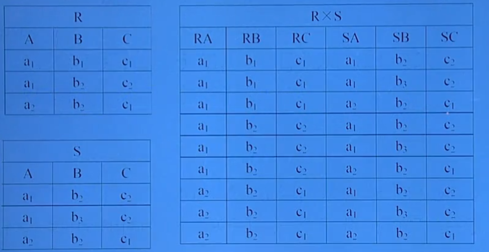

> 从以上 R X  S 结果集，可以看出
>
> - R 表 有 3 列，S 表 有 3 列 【两张表的列可以不同】
> - R 表 有 3 行，S 表 有 3 行
> - 之后先把两张表的列组合在一起，3 * 3 = 6列，前 3 列属于 R 表，后 3 列属于S表。
> - 然后将 R 表的第一行与S表的所有行，逐行进行组合。
> - 直到 R 表将S表的所有行组合完毕，最终结果集 为 3 * 3 =  9 行


#### **专门的关系运算符**

| 运算符 | 含义 | 英文       |
| :----- | :--- | :--------- |
| σ      | 选择 | Selection  |
| π      | 投影 | Projection |
| ⋈      | 连接 | Join       |
| ÷      | 除   | Division   |

##### 相关记号说明

① **关系模式为 R(A1,A2,...,An) ，表示它的一个关系为 R，有 A1-An 若干个属性**。

- **t ∈ R 表示 t 是R 的一个元组。**
- **t[1] 表示第一个分组。**
- **t[1.1] | t[11] 表示第一个分组的第一个分量。**
- **t[Ai] 则表示元组 t 中相对应属性 Ai 的一个分量。**

> 属性：列，元组：行，分量：第一个行列元素。

② 若属性 **A = {Ai1,Ai2,...Aik}** ，其中 Ai1 , Ai2 , ..., Aik 是 A1 , A2 , ... , An 中的一部分。

则 A 称为一个 **属性列 或 属性组**。

- 表示**属性列 A 中有 Ai1、Ai2、、..、Aik 等若干个分量**。

  - **注：每一个分量对应着一个属性【列】**

  - <span style="color:red">**属性组：一组具有相互联系的属性组合而成的、**</span>

    - > 属性是比如一张表格中的学号和姓名等。
      >
      > 一个事物（实体）有多个属性。学生有学号、姓名、班级、性别、年龄等属性。

  - <span style="color:red">**属性列：一个属性下的一列所有分量**</span>。

- 如图：

- 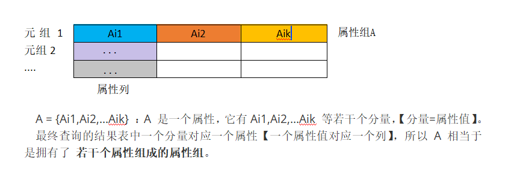

而**t[A] = (t[Ai1]、t[Ai2]、...、t[Aik])  表示元组 t 在属性列 A 上诸分量的集合**。

注意：结合上面的A = {Ai1,Ai2,...Aik} 可以看出，元组 t 包含了属性组 A，这就表明属性组A上的所有分量都是元组的分量成员。

> 就好比 A = {张青梅，刘毅} ，t[A] = {t[张青梅]、t[刘毅]}。 
>
> {张青梅，刘毅} 是属性列 A 的取值范围，也可以说是**未来的分量**。

如图所示：

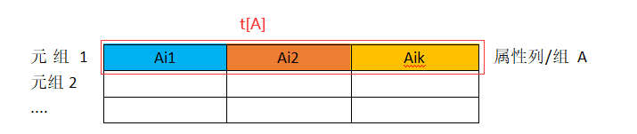

**ˉA 则表示 {A1,A2,..,An} 中去掉 {Ai1,Ai2,...,Aik} 后剩余的属性列**。

也就是说，**若 A = {Ai1,Ai2,...Aik}，那么 ˉA 则是去掉了A这个属性现有的分量之后剩余的属性列**。

也就是说，原先有 {A1,A2,..,An} 的属性组，ˉA就是 去掉了 A 这个属性，也就相当于是去掉了它所表示的 现有分量  {Ai1,Ai2,...,Aik}。

如图所示：

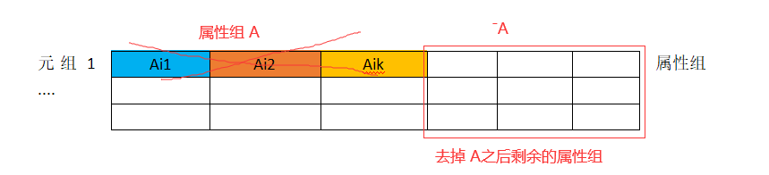

③ R为n 目关系，S为m目关系， tr ∈ R, ts ∈S，则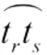称为**元组的连接**。是一个 n + m 列 元组，前 n 个分量为 R 的一个  n 元组，后 m 个分量为 S 中的一个 m 元组。【笛卡尔积】

> 也就说关系 R 有 n 个属性，S 有 m 个属性，元组 tr 属于 R表，元组 ts 属于 S 表。当 tr 和 ts 连接在一起时，则两个表的所有列与元组合并在一起，前 n 个分量是R表的元组组成，后 m 个分量是S 表的元组组成。

④ 假设给定一个关系 R （X,Z），X 和 Z 都为属性组。当 t[X] = x 时，x在R中的**象集（Images Set）**为  **Zx**。

- **Z ： 象集符号。**

> t[X] = x： x 值是元组t 上属性组 X 的分量。
>
> Zx：表示 x 这个分量的象集。要求谁的象集则写谁。

定义为：
$$
Z_x = {t[Z] | t ∈ R ，t[X] = x}
$$
<span style="color:red">**表示 R 中属性组 X 上值为 x 的每个元组在 Z 上分量的集合**</span>。

> t[X] ：元组 t 上的属性X 的交集分量。
>
> X 在 Z 上的象集是 元组 t 属于R，但是它的分量是 x。
>
> 也就是说，一个关系 R ，R 表中有 X ，Z 两个属性组（由若干个属性组成）。
>
> 当属于R表 的元组 t 上的 属性组 X 的值为 x 时，此 x 的每个元组其实都是 属性组 Z 的分量。 

【例】求x1、x2、x3在关系R上的象集。

<span style="color:red">**象集的求法：除了要求的这个集（X）本身之外，其他的属性列的分量值都是它的象集范围**。</span>

如图：

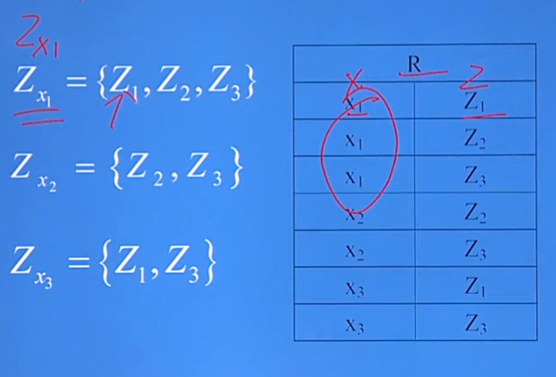

> 求 x1 的象集，则写为 Zx1 = {...}
>
> 关系 R 有X，Z两个属性组，当要求 x1 的象集时，在 Z 属性组中找 x1 **以行的形式对应的Z 集的元组**，而这些Z集的元组就是 x1 的象集。


##### 选择 σ (Selection)

------

选择又称为**限制**。<span style="color:red">**在关系R中选择满足给定条件的诸元组。【选择出符号条件的行】**</span>

定义为：
$$
σF(R)={t|t∈R∧F(t)=true}
$$

- **σ：罗马字符，代表选择。**

- **F：给定选择条件**。如 age > 19
  - 注：**筛选条件必须使用【英文、汉字】英文单引号来标注。【Dept=' IS '】**
  - **筛选的字段，除了使用字段名之外，也可以使用字段所处的列序号**。
    - 如：σSdept = 'IS' (Student)  或 σ5 = 'IS' (Student) 
      - 【对 Student 关系的 Sdept 字段进行筛选】

- **(R)：对 关系R进行筛选**

- **F(t)=true：保证选择条件为真。**
  - 其中 F 是一个表达式：**X1 θ Y1**。
    - 其中 **θ 表示比较运算符。它可以是 >、<、≧、≦、<>**。
    - **X1 和 Y1 等则是属性名、或为常量、或为函数、属性名可以用它的序号来代替**。
  - 也就是说： **F(t) = true是通过一个条件表达式 F 对 元组 t 进行筛选，如果条件为 true，则符合筛选，否则不符合**。

> 解释：**给定一个条件 F 对关系 R 的元组进行水平筛选，保证筛选条件为真，且筛选出的元组 t 属于 关系R**。

###### 条件运算符

比较运算符

- **﹥：大于**
- **﹤：小于**
- **≧：大于等于**
- **≦：小于等于**
- **=：等于**

- **<> ：不等于**

逻辑运算符

- **∧：与**
- **∨：或**
- **¬：非【取反】**
  - ¬男 = 女

【例】 查询年龄小于 20 的学生

筛选前记录如下：

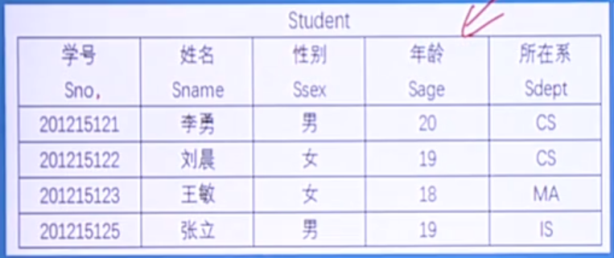

> σSage < 20 (Student)  或 σ4 < 20 (Student)

结果如图：

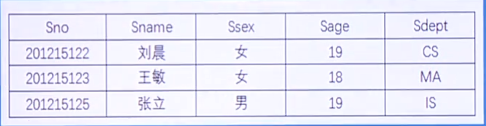

##### 投影 π (Projection)

------

<span style="color:red">**从 关系R 中选择出若干属性列组成新的关系。**</span>

> 也就是说，**以列的形式来筛选**，当使用投影来筛选表中指定的列时，其他的列则不显示。

定义为：
$$
π_A (R) = {t[A] | t ∈ R}
$$
其中：

- **π ： 代表投影。**
- **A：关系R中的属性列。【可以筛选一个或多个】**
  - **筛选的列，除了使用列名之外，也可以使用列所处的列序号**。【**多个列名 用 , 逗号隔开**】
    - 如：πSdept,Sage (Student)  或 π5,6 (Student) 
      - 【筛选出Student表中的 Sdept 和 Sage 列】
- **(R) ：对关系R 进行筛选列。**

> 解释：**筛选出 R 中的 A 属性列并展示出来。**【**以列的角度，来筛选出元组**】

投影的主要操作:

<span style="color:red">**从列的角度进行运算，投影之后不仅取消了原关系中某些列，而且还可能会取消某些元组（避免重复行）**</span>。

> 也就是说。以列的形式对关系进行筛选出此关系中的某些属性列，这就会导致此关系的其他列隐藏，【只看选中的指定列】，而且**如果筛选出的列的元组中，含有重复的值，则去重，只留下不重复的值**。

【列】查询学生的姓名和所在系，即求Student关系上学生姓名和所在系两个属性上的投影。

Student  关系：


> πSname,Sdept (Student) 或 π 2,5 (Student)

结果：

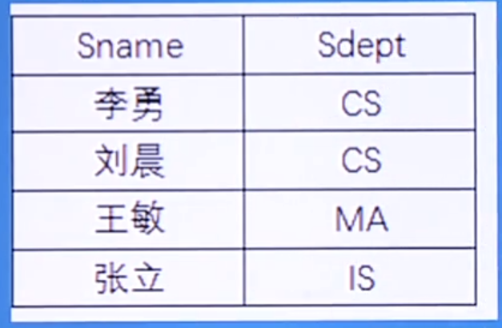


##### 连接 ⋈ (Join)

------

又称 **θ 连接【一般连接】**。表示<span style="color:red">**从两个关系的笛卡尔积中选择属性间满足一定条件的元组**</span>。

> θ ： 是一个比较运算符。 

 定义如下：


- R ⋈ S：当**R 与 S 在满足于 A θ B 条件下进行连接。**
- tr ∈ R ∧ ts ∈ B： 前提是**tr 元组 属于 关系 R，ts 元组 属于 关系 S。**
- tr[A] θ ts[B] ：**当 tr[A] 和 ts[B]满足于 θ 的条件时，将它们对应的元组合并在一起。**
  - A θ B：设定的连接条件
  - tr[A] ：R关系的元组t 与A属性的分量交集【属性值】。
  - **θ ： 是一个运算符【<,>,=....】**
    - **例如：如果 θ 是 > ，那么 A 属性值 必须大于 B属性值才满足条件**

- **A 和 B：分别为 R 和 S 上度数相等且可比的属性组。**
  - **度数相等：属性个数、类型相等。**

运算结果：

<span style="color:red">**从 R 和 S的广义笛卡尔积RXS 中选取（R关系）在A属性组上的值与（S关系）在B属性组上的值，两者值满足于比较关系 θ 的元组**</span>。

运算过程：

- 首先设定连接条件 ，如R表的 A < S表的B。【A属性列的值 < B属性列的值】
- 然后将R表A属性列的属性值 与S 表B属性列的属性值进行逐个比较
- 当 A 属性值 < B 属性值时，各自挑选出对应的那条元组，最后拼接到一起。
- 如果拼接而成的结果表中的属性列有重名，则使用 **S.B**，这样的形式来区分。

【例】运算关系R 和 关系S的一般连接。

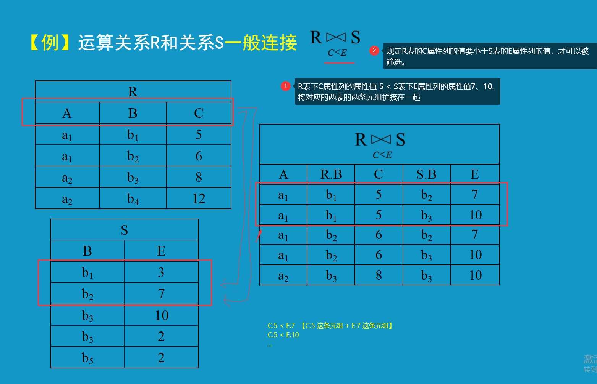


###### ① 等值连接

------

**当 θ 为 ‘ = ' 的连接称为等值连接**、

含义：<span style="color:red">**从关系R与S的广义笛卡尔积中选择A、B属性组中值相等的那些元组**</span>。

公式：

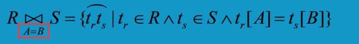

【例】运算关系 R 和关系S的等值连接

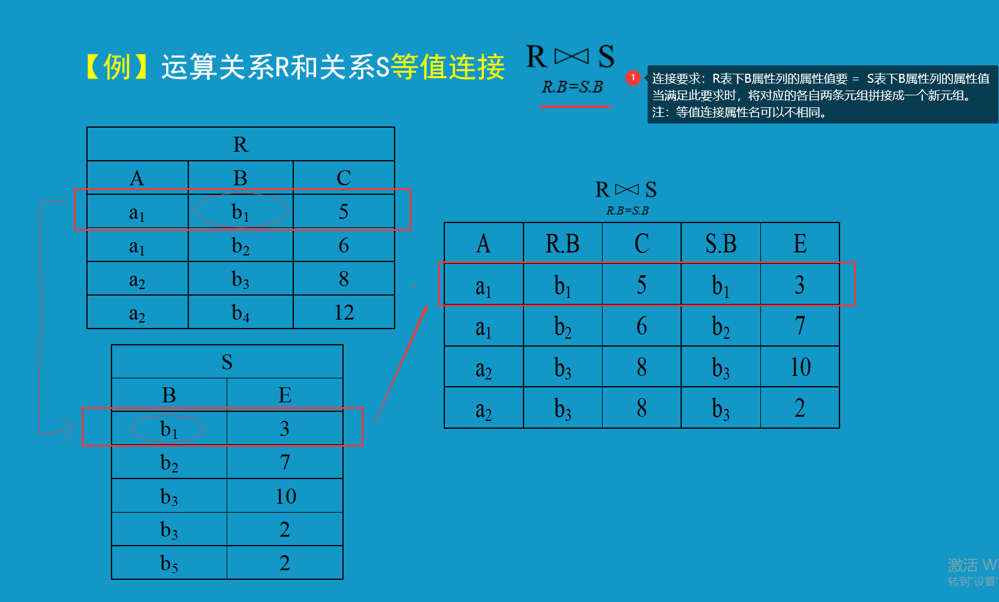


###### ② 自然连接

------

自然连接是一种**特殊的等值连接**。

表示<span style='color:red'>**两个关系中进行比较的分量【属性值】必须是相同属性列，且在结果中把重复的属性列去掉**</span>。

含义：<span style="color:red">**R 和 S 具有相同的属性组 A**</span>。

> 也就是说**R 与 S 两个关系的某个要比较的属性组必须是相同的，包括属性名【若R关系的某个属性列名叫 A ，与之对应，S关系的某个属性列名也要叫A，同时属性值也要相等，属性域也要相等】，所以将两个完全相等的属性列进行比较，最终得出的结果只需要一条属性列即可**。

公式：


> 例如：学生表，成绩表，两个表中都有学号这个属性，而两个关系的两个属性名和属性值都是相等的，那么学生表和成绩表两个关系就可以使用自然连接来比较运算学号这个属性租。

【注意】**自然连接还需要取消重复列，所以是同时从行和列的角度进行运算**。

运算过程：

- 前提条件：R与S两表必有至少一个属性名、属性值、属性域都相等的属性列才能进行自然连接
- 直接比较R表与S表完全相等的属性列，如果属性值一样，则将各自对应的元组拼接成新的元组
- 同时，在输出结果表的时候，只需要留两表其一的属性列即可。【因为属性列完全相等，没必要重复】。

【例】运算关系 R 和关系 S 自然连接

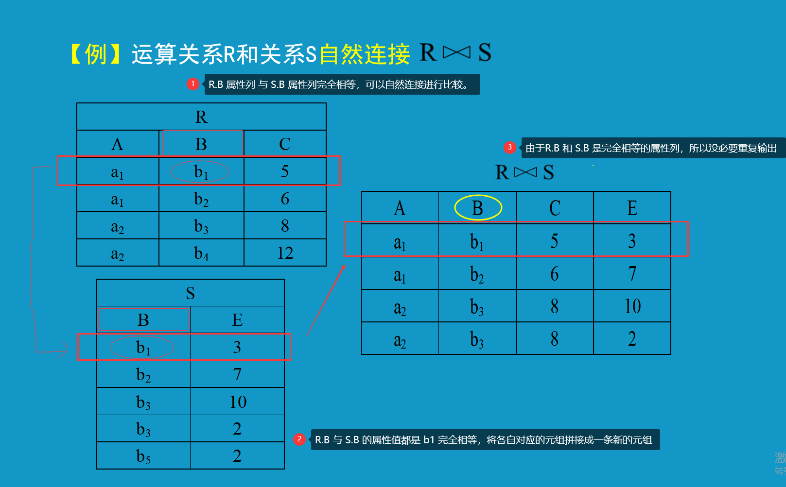


###### 悬浮元组

------

两个关系R和S**在自然连接时**，关系R和S中**被舍弃的元组称为悬浮元组**。

> **不符合自然连接条件的元组就是悬浮元组。**


###### 外连接

------

**如果把悬浮元组舍弃的元组也保存在结果关系中，而在其他属性上填空值（Null）**。这种连接就叫**外连接**。

> 也就是说，**在自然连接完成后，不符合条件被舍弃的其他元组也加入到结果集中，但是并不拼接成一个新元组，而是各自作为一条补充的元组填补到表上，同时按照对应的位置填充自己元组上有的值，其他位置则填 null**。

如图：

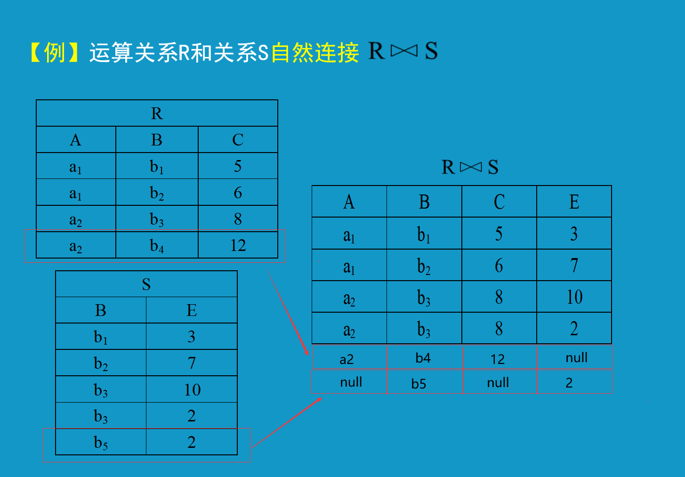

> 如上图所示，R表和S表的最后一行都是被舍弃的悬浮元组，但是可以使用外连接将这两行悬浮元组再填充到结果表中，只不过两条悬浮元组不拼接，而是各自为一条元组进行依次填补，同时元组上的分量值也只是填充自己元组上所对应的值。


###### 左外连接

**如果只保留左边关系R中的悬浮元组则叫做左外连接**。（Left Outer Join）

左边还是右边，取决于 ⋈ 符号。

> R ⋈ S： R 为左表，S为右表。

###### 右外连接

**如果只保留右边关系S中的悬浮元组则叫做右外连接**。（Right Outer Join）

【例】

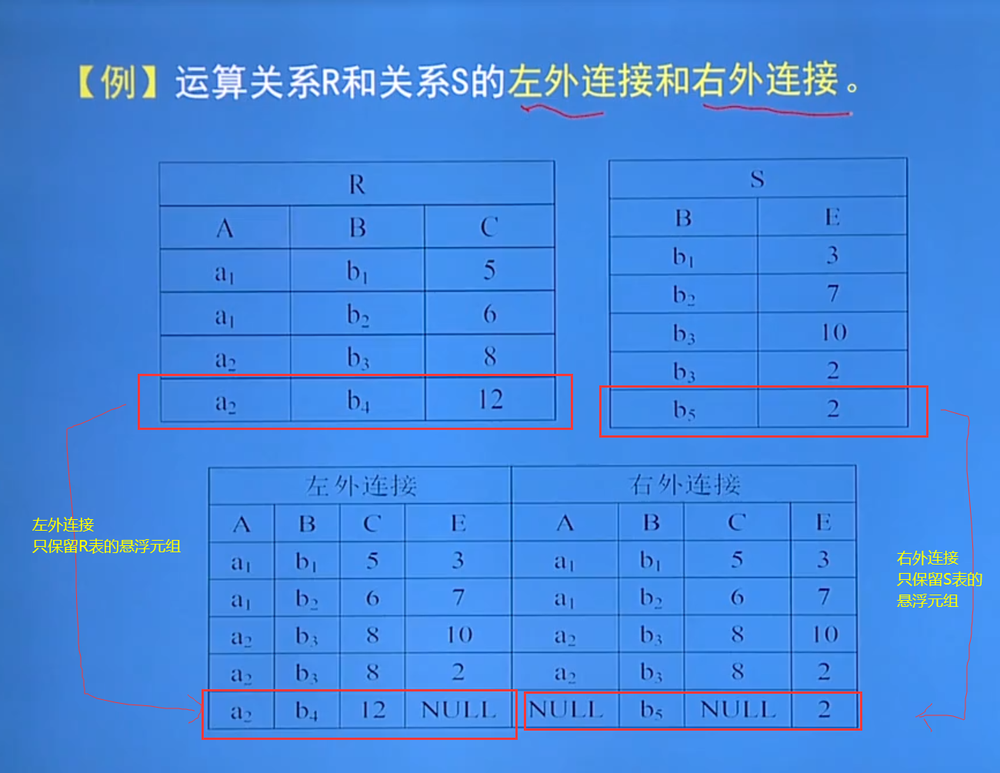


###### 外连接的意义

虽然外连接会将自然连接下不符合条件的悬浮元组也加入到最终的结果表中，但是还是有一定的实际意义的。

> 比如学生表与选课表，学生表与选课表之间都有学号这一个完全相等的属性列，则可以进行自然连接，筛选出所有已经选课的学生，而加了外连接之后，又可以将未选课的学生展示出来，这就起到了可以看到全班哪些学生选课了，哪些学生未选课的作用。


##### 除 ÷ (Division)

前提条件：**给定关系 R (X,Y) 和 S (Y,Z)，其中X，Y，Z都是属性组【有若干个属性】。R 中的 Y 与 S 中的 Y 可以有不同的属性名，但必须来自相同的域集【两个性质一样的事物来运算，(1+1=2) ，两个 1  都是性质相同的事物，才可以进行运算。】**。

> 好比学生表 R(学号，姓名)，成绩表 S (姓名，成绩) ，两张表都有姓名这个列，不过成绩表也可以将姓名改为“学生姓名” ，并不影响，但学生表R 和 成绩表 S 两者的姓名 列的取值范围都是一样的。

**R 与 S 的除运算会得到一个新的关系 P(X)，P 是R中满足下列条件的元组在 X 属性上的投影**：

> **【注意】两个关系运行除运算，得到的结果关系中的列数一定比给定的原关系少。**

<span style="color:red">**元组在属性 X上的分量值 x的象集 Yx 包含在 S 在 Y 上投影的集合。**</span>

定义为：
$$
R ÷ S = { t_r[X] | t_r ∈ R ∧ π Y（S）∈ Yx }
$$

- Yx ： x 在 R 中的象集
- x = tr[X] 
  - 【取出的象集值 x 是一条X属性列上的元组。】

**【注意】除操作是同时从行和列的角度进行运算的。**

运算过程：

- 例如给定一个关系 R （A,B,C），关系 S （B,C,D）
  - **注：S 表的 D 属性列可以忽略。【只看关系 R 以及 R 与 S 相同的属性组】**
- 首先 R 与 S 两个关系相同的属性组是 （B,C），**关系 S 的 （B,C）作为被除数待定**
- 然后取 R 的 A 属性列 在 R关系上的象集
  - 象集：**当 A  取某个值时对应的另外的属性列的元组上的分量，就是 A 的象集【也就是一条元组中除了 A 属性列的分量之外，其他所有属性列的分量都是 A 的象集】**
- 之后，根据 A 取出的象集排列，**看A 取出的所有（B,C）象集中，哪个象集中包含的（B,C）的分量值是与 S 表所有的（B,C）属性列的分量值是完全相符的**。
  - 也就是S表中（B,C）这两个属性在关系上所有的属性值。
- 如果完全相等，则**将此 A 象集所对应的分量值以及对应的属性列计入结果集中**，否则不计入。

【例】关系R、S的除运算 R ÷ S：

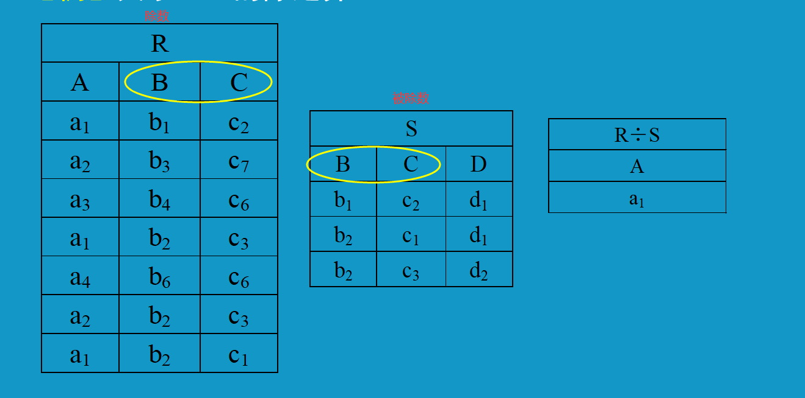

> 运算：
>
> ①  计算出 A 属性列在 关系 R 上的象集：
>
> 在关系R 中，属性列 A 可以取 4 个 值 {a1,a2,a3,a4}
>
> a1的象集：Za1 = {(b1,c2)、(b2,c3)、(b2,c1)}
>
> a2的象集：Za2 = {(b3,c7)、(b2,c3)}
>
> a3的象集：Za3 = {(b4,c6)}
>
> a4的象集：Za4 = {(b6,c6)}
>
> S 在 （B,C）上的投影是 {(b1,c2)、(b2,c3)、(b2,c1)}
>
> - πB,C (S) ： 在S表上取出所有 B,C的分量值。
>
> 由此可以看出，只有 a1 的象集是包含了 S 在 （B,C）属性组上的所有投影，所以 R ÷ S 为 {a1}

##### 口诀【重要】

关系代数 5 种基本演算的口诀：

<span style="color:red">**选择选行，投影选列，连接合并去残，笛卡尔积两两交合，自然连接笛卡尔积后选择等值然后去掉重复属性**</span>

#### 综合应用案例

有如下表：


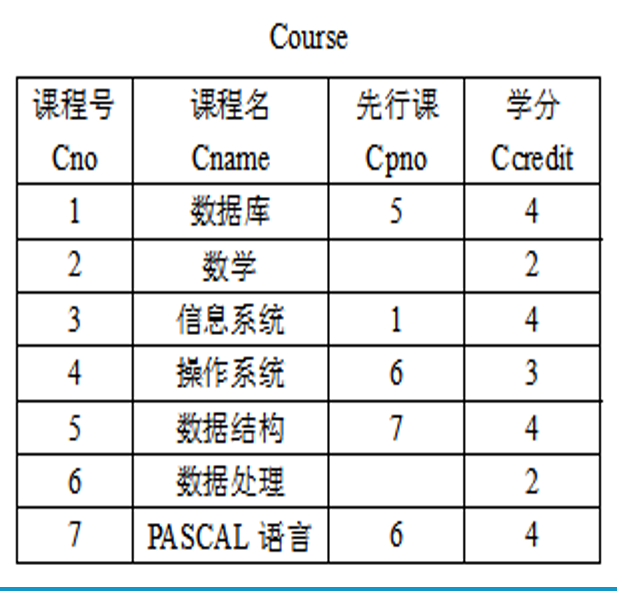

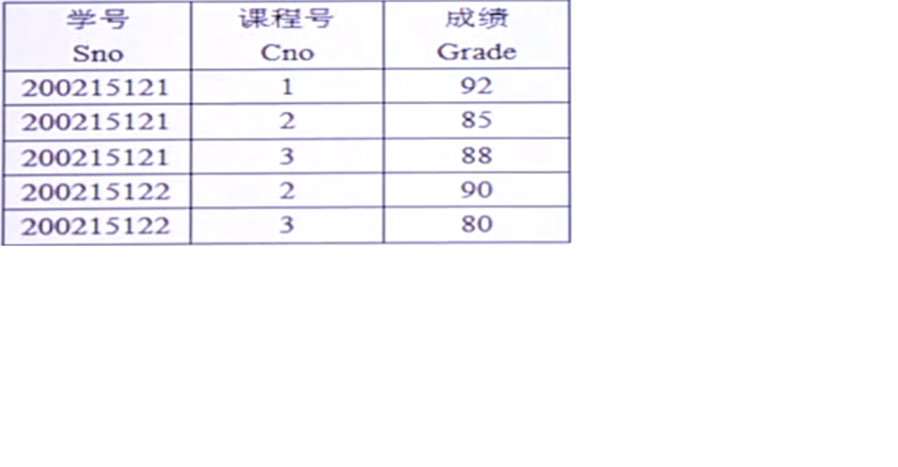

##### 【例题1】

题目：查询至少选修了1 号课程 和 3 号课程的学生号码。

> 要求：至少选修了1 号课程 和 3 号课程 ：求出的象集至少包含 1 、3
>
> 学生号码：求出的结果是学生号码

首先根据题意，一个临时关系 K 作为被除数待定。

K = Cno {1、3}

> 因为要求的是选修的课程，所以以 课程为查表目标，并其定义的关系的属性列要与原关系的属性列同名。这就相当于是将两个同名的属性列进行相除，最终只留下一个列【Sno】的结果。

定公式： **πSno,Cno (SC) ÷ K**

求解过程：

- πSno,Cno (SC) ：先对 SC 关系是（B、C）属性上进行投影。

  - > 得出投影结果：
    >
    > 200215121：{1、2、3}
    >
    > 200215122：{2、3}

- 再求出每一学生（Sno）的象集

  - > 得出象集：
    >
    > Z200215121 = {1、2、3}
    >
    > Z200215122 = {2、3}

- 最后依次检查这些象集是否包含 K

- 得出结果：{200215121} 此分量的象集 {1、2、3} 包含了 K {1、3}

- 最终：πSno,Cno (SC) ÷ K ，结果为 {200215121}

##### 【例题2】

题目：查询选修了 2 号课程的学生的学号

> 要求：查询选修了 2 号课程 【选择 σ 运算】
>
> 结果：学号 【投影 π 】

依据题意可以判断出：

- 结果是要学号，可以在运算之前可以对学号Sno这一列进行投影，只显示Sno这一列的属性值。

- 要针对 课程【Cno】这个列进行筛选，故可以对Cno属性进行选择运算来选出符合条件的行。

综合公式：**πSno ( σCno=‘2’（SC）)**

> 根据运算符等级，**先算 （）括号内的表达式**。

求解过程：

- 首先计算（）括号内的 σCno=‘2’（SC）

  - 对SC关系的Cno属性列的属性值进行条件筛选出对应的**行**。

  - > 根据 Cno=‘2’ ：属性值 = 2则符合条件
    >
    > 得出结果行：
    >
    > {(200215121，2，85)}
    >
    > {(200215122，2，90)}

- 然后计算 πSno ({(200215121,2)},{(200215122,2)}) 筛选出 **Sno 这一属性列**、

  - > 得出结果：{200215121，200215122}

##### 【例题3】

题目：查询至少选修了一门其直接先行课为 5 号课程的学生姓名。

拆解：

① 直接**先行课为 5 号**课程

只有 Course 这张表有 先行课 Cpno 这个属性列，同时条件为 5 号，所以可以用 选择运算  **σ**。

> **σCpno = '5' (Course)**
>
> 选择 Course 表中，Cpno 属性值为 5 的所有行。

此运算会得出一张表。如：

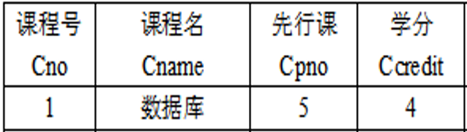

② 至少**选修**

说明要查询出与这门 5 号先行课程相对应的选课课程。

而让 课程表 Course 和 选课表 SC 能够连接的就是 两表共有的 Cno 属性。

想让两表连接，得出两表的组合内容，且两表拥有完全相同的某一个属性，故可以用 **自然连接 ⋈**

> **σCpno = '5' (Course) ⋈SC**
>
> 将 σCpno = '5' (Course) 得出的表与 SC 表进行连接。

此运算会得出一张组合表。如：

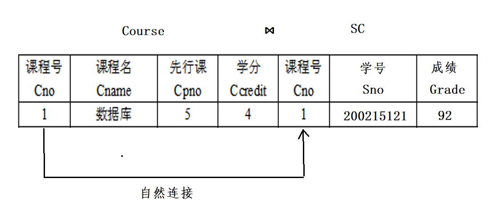

③ 查询**学生姓名**

结果要求是学生姓名，但是 σCpno = '5' (Course) ⋈SC 连接后得出的表并没有学生姓名 Sname 这一属性列。因为SC 表有 Sno 学号这一属性列，同时Student 表也有Sno学号这一属性列，所以还要将此结果表与 Student 表进行一次**自然连接⋈** 。

> **σCpno = '5' (Course) ⋈SC ⋈ πSno,Sname （Student）** 
>
> 将 σCpno = '5' (Course) ⋈SC 得出的表与经过 选择 π 运算将 Sno,Sname 两个属性列挑选出来的Student 表进行连接。

以上运算会得出一张表。如：

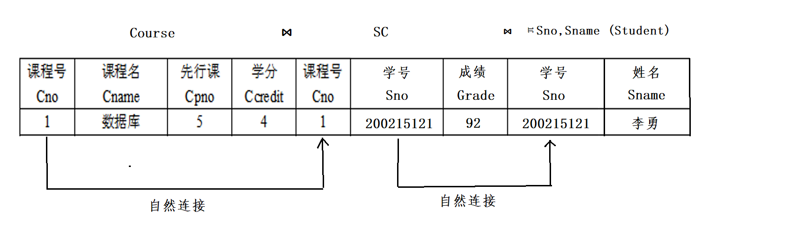

④ 最后得出结果：....的学生姓名

将上一步操作的结果表通过投影 π 只显示出 Sname 学生姓名这一列。

> **πSname ( σCpno = '5' (Course) ⋈SC ⋈ πSno,Sname （Student）)**
>
> 最终结果：{李勇}

也可以使用这一个公式：

**πSname ( πSno(σCpno = '5' (Course) ⋈SC ) ⋈ πSno,Sname （Student）)**

不过是换了下运算顺序。结果一致。

****

##### 【例题4】

题目：查询**选修**了**全部课程**的**学生学号**和**姓名**。

拆解：

① 全部课程

只想知道全部课程，可以通过对 课程表 Course 的Cno属性列进行投影 π 。

> **πCno (Course)**

得出结果表。如：

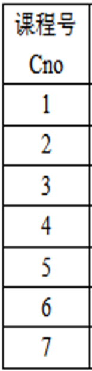

② **选修**了 全部课程

要想知道选修了什么课程，就得到选课表 SC 中进行查找。

同时结合后面的 - .. 的学生学号和姓名- 那么除了 课程号 Cno 这一列，也要 学号 Cno 这一列。则可以对 SC 表进行投影 π。

> **πSno,Cno（SC）**

得出结果表SC。如：

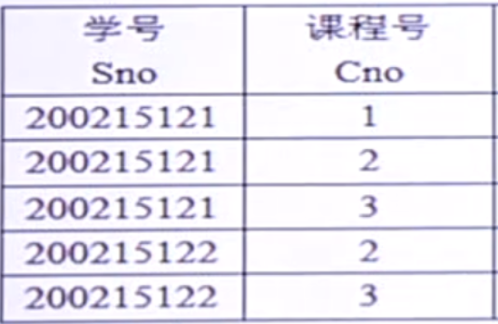

把对应的已经选修了的学生学号、课程号挑选出来后，那么要想知道谁选修了全部课程，意味着需要首先将所有课程号列出来。并设定一个临时关系 K 进行存储。

> 所有课程号 K = {1、2、3}

然后根据  πSno,Cno（SC） 所投影出来的所有选了课的学生进行一次**象集匹配**。

象集匹配使用 **除 ÷ 运算**。

**将 SC 的 Cno 与 Course 的Cno 进行相除，最后只剩下 SC 的Sno 这一列**。

> **πSno,Cno（SC）÷ πCno（Course）**
>
> 求出SC 表的所有属性值的象集：
>
> Z200215121 = {1、2、3}
>
> Z200215122 = {2、3}
>
> {1、2、3} ÷ {1、2、3} ，结果为 {200215121} 这个学号符合象集匹配。

③ 查询...的学生号码和姓名

通过除 ÷ 运算得知了选修了的全部课程的学号Sno 是 200215121 ，但是此结果并没有学生姓名 Sname 这一列，由于 SC 剩余的 Sno 与 Student 的 Sno 列完全相同，故两者之间可以使用 **自然连接 ⋈**，在连接的同时，从 Student 表中投影出结果需要的Sno 和 Sname 列即可。

> **πSno,Cno（SC）÷ πCno（Course）⋈ πSno,Sname (Student)**

得出结果。如：

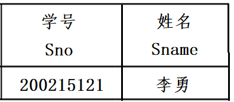


### 关系演算

关系演算是**以数理逻辑的谓词演算为基础**的【如离散数学】。

按谓词变元的不同，关系演算可分为**元组关系演算【以行为单位】和域关系演算【以表为单位】**。

#### 元组关系演算语言Alpha

> 由关系数据库的发明人 IBM.Cood 发明的。

Alpha 语言主要有GET、PUT、HOLD、UPDATE、DELETE、DROP 6 种语句。

- **GET：查询**
- **PUT：插入**
- **HOLD：并发查询【当有并发查询记录时，其他人员不能对此记录进行操作】**
- **UPDATE：更新**
- **DELETE：删除【小】**
- **DROP：放弃/删除【大】**

##### 基本格式

|---         <span style="color:red">**操作语句  工作空间名（表达式） ：操作条件**</span>

- **操作语句**：**GET、PUT、HOLD、UPDATE、DELETE、DROP**

- **工作空间名**：此次**操作的索引名【自定义】**。【类似于**方法名**】

- **表达式**：用于**说明要查询的结果**，它可以是**关系名**或（和）**属性名**。
- **操作条件**：是一个**逻辑表达式**。说明**查询条件要满足的条件，用于将操作结果限定在满足条件的元祖中**，**操作条件可以为空**。

此外，还可以在基本格式的基础上加上**排序要求 、定额要求**等。

##### 检索操作 GET

###### 简单检索

> 不带条件的查询

【例】查询所有课程的课程号

```java
GET W(表名.列名)
```

> 例：GET W(SC.Cno)         =【select Cno from SC】

【说明】W 为工作空间名。这里条件为空，表示没有限定条件。

【例】查询所有学生的数据

```java
GET W(表名)
```

> 例：GET W(Student) 		= 【select * from Student】

###### 限定检索

> 带条件的查询

【例】查询信息系（IS） 中年龄小于 20 岁的所有学生学号和姓名。

```java
GET W(表名.列名) : 表名.列名 条件运算符 条件
```

逻辑运算符：

- **∧ ：和**
- **∨：或**

> 例：GET W(Student.Cno,Student.Sname) : Student.Sdept = 'IS' ∧ Student.Sage < 20

###### 排序检索

- **DOWN ： 降序排序**
- **UP：升序【默认】**

```java
GET W(...) : UP/DOWN S.x
// 按 S.x 字段进行升序/降序排序
```

【例】查询计算机系（CS）学生的学号、年龄，结果按年龄降序排序

> GET W(Student.Sno,Student.Sage) : Student.Sdept = 'CS' DOWN Student.Sage

###### 指定返回行数

> 指定返回元组的个数

```java
GET W(num)(...) ...
// 取出 num 行的元组数据。默认第一行开始。
```

【例】取出一个信息系学生的学号

> GET W(1)(Student.Sno) : Student.Sdept = 'IS'

【例】查询信息系年龄最大的 3 个学生的学号和姓名，结果按年龄降序排序。

> GET W(3)(Student.Sno,Student.Sname) : Student.Sdept = 'IS' DOWN Student.Sage
>
> 说明：即使不提示降序排序，此处也要用到降序排序，因为W(3) 是取前 3 行，**表格默认是按从小到大的升序排列，所以要想拿到前 3 行最大的，就得使用降序排序**。


##### 元组变量检索

元组变量检索是在某一个范围内变化（所以也称为**范围变量**），**一个关系可以设定多个元组变量**。

用途如下：

① <span style="color:red">**简化关系名**</span>

如果变量的名字很长，编写语句起来会感到不方便，这时可以设定一个<span style="color:red">**别名**</span> 的元组变量来代替它。

② **操作条件中使用<span style="color:red">量词 </span>时必须用元组变量**。


###### 定义元组变量

Alpha 语言中使用 <span style="color:red">**RANGE** </span>来定义元组变量。

**当使用 RANGE 为某个表定义了元组变量后，那么在之后，此元组变量名都可以代替表名来操作**。

格式：

```sql
RANGE 表名 元组变量名
```

【例】查询信息系学生的名字

> RANGE Student X  
>
> GET W(X.Sname) : X.Sdept = 'IS'
>
> 【X 代表 Student 来操作。】


##### 量词

当用到**多表联合查询**时，都会使用量词。

###### 存在量词

------

<span style="color:red">**要求限定范围内的元组中只要有元组满足条件即可使用，即至少一个元组能使谓词 F(t) 为真**</span>。

**当想多表联合查询某个<span style="color:red">已存在</span>的记录时，就使用存在量词**。

- <span style="color:red">**∃ ：存在量词。用于判断后面查询出的结果是否至少有一个满足于条件**</span>。
- **∃ 后面必须是一个代替表的元组变量。**
  - **∃X(条件...) ：设定查询条件，查询存在于 X 表中且符合条件的记录。**
- **用存在量词的检索条件中使用量词时必须用元组变量**。
- 注：**当要多表查询时，只能有一个表用原名，其他的表都必须用元组变量来代替。**

------

【例】查询选修 2 号 课程的学生姓名 （两表查询）

此处要用到选课表 SC，学生表 Student，故要使用到量词来操作。

```java
RANGE SC X

GET W(Student.Sname) : ∃X(X.Sno = Student.Sno ∧ X.Cno = '2')
```

> 【说明】
>
> - 首先定义元组变量 X代表选课表 SC
> - 要查询选修记录，则将 ∃ 至于元组变量X之前，代表这条选修记录**存在于 X 选修表中**。
> - **∃X() 则代表要查询存在于 X 表中的元组，可以在其中设定元组的查询条件**。
> - 之后为其X、S两表设定连接条件 **X.Sno = S.Sno**
> - 最后设定查询条件 X.Cno = '2' 

【例】查询选修了这样课程的学生学号，其先行课是 6 号 课程。

> RANGE Course CX
>
> GET W(SC.Sno) : ∃CX(CX.Cno = SC.Cno ∧ CX.Cpno = 6)


【例】查询至少选修一门其先行课为 6 号课程的学生姓名。（三表查询）

涉及到 ：Course 课程表、Student 学生表、SC 选课表。

```java
RANGE Course CX
  	  SC	 SCX

GET W(Student.Sname) : 
	∃SCX (SCX.Sno = Student.Sno  ∧ ∃CX(CX.Cno = SCX.Cno ∧ CX.Pcno = '6'))
```

###### * 前束范式

元组演算公式也可以变换为 <span style="color:red">**前束范式** </span>的形式。

即 **∃X 量词在前，所有条件在后**。

```java
RANGE Course CX
  	  SC	 SCX
GET W(Student.Sname) : 
	∃SCX ∃CX (SCX.Sno = Student.Sno ∧ CX.Cno = SCX.Cno ∧ CX.Pcno = '6') 
```

> 【说明】
>
> - 首先为课程表 Course 、选课表SC 分别定义CS、SCX 两个元组变量来代替。
>
> - ∃SCX (SCX.Sno = Student.Sno ∧ ∃ CX(CX.Cno = SCX.Cno ∧ CX.Pcno = '6')
>
>   - 此记录存在于 选课表SCX，同时 SCX 选课表与 Student 学生表进行 Sno 学号连接，查询出所有选修了的学生信息。
>
>   - 由于 SCX 选修表没有先行课的记录，所以要与 CX 课程表进行连接，条件是 CX.Cno = SCX.Cno。查询出选修表与课程表连接的所有记录后。
>   - 根据 条件 CX.Pcno = '6' 查询出 CX 课程表中 先行课号为 6 的记录
>   - 之后联合前面SC 选课表与 Student 表联合查询出的学生信息组成最后的查询结果。
>   - 最终由GET W(Student.Sname)   导出来对应的学生姓名记录。


###### 带有多个关系的表达式的检索

【例】查询成绩在 90 分以上的学生姓名和课程名字

本查询要求的结果是学生名字和课程名字，分别在 Student 表 和 Course 两个关系中、

所以只需要设定一个元组变量给 SC 选课表即可【成绩在 SC 表中】。

```java
RANGE SC SCX

GET W(Student.Sname,Course.Cname) :
	∃SCX(SCX.Grade ≥ 90 ∧ SCX.Sno = Student.Sno ∧ Course.Cno = SCX.Cno)
```

> 【说明】
>
> SCX.Sno = Student.Sno ∧ Course.Cno = SCX.Cno = SC ⋈ Student ⋈ Couese 
>
> 【将三表的数据全部连接在一起】
>
> 最后在通过 条件 SCX.Grade ≥ 90 对连接结果表中进行筛选。


###### 全称量词

<span style="color:red">**要求限定范围内的元祖中所有元组都需要满足条件时使用。保证所有元组都要时谓词F(t) 为真**</span>。

指的是**所有的结果数据都要符合某个条件**。

> 存在量词是至少一个结果数据符合这个条件

- <span style="color:red">**∀ ：全称量词，用于判断后面查询出的元组结果是否全部满足条件。**</span>

------

【例】查询不选 1 号 课程的学生名字

> 反过来就是查询所有选了 1 号 课程或者未选课的学生。

解：

```java
RANGE SC SCX
GET W(Student.Sname) :
	∀SCX(SCX.Sno ≠ Student.Sno ∨ SCX.Cno ≠ '1') 
```

> 【说明】
>
> - 查询选修记录，所以要筛选的是 SC 表，故为 SC 表定义元组变量 SCX。
> - ∀SCX(SCX.Sno ≠ Student.Sno ∨ SCX.Cno ≠ '1') 
>   - 要求选出在 SCX 表中未选课 或者 不选 1 号课程的学生。
>   - 满足这两个条件其一的元组会被选出。


也可以用存在量词来表示：

```java
RANGE SC SCX

GET W(Student.Sname) :

 ¬∃SCX(SCX.Sno = Student.Sno ∧ SCX.Cno = '1')
```

> 【说明】
>
> - 查询选修记录，所以要筛选的是 SC 表，故为 SC 表定义元组变量 SCX。
>
> - 让 SCX 表与 Student 表进行自然连接，获取到 两表联合的所有元组，
> - 同时所有元组上进行条件筛选，满足于 SCX.Cno = '1' 条件的就会被选出 
>   - 【结果是选课为 1号课程】
> - 最后为其结果取反。【取反结果是不选 1  号 课程】


###### 用两种量词的检索

【例】查询选修了全部课程的学生姓名

```java
RANGE  Course CX

	   SC	  SCX

GET W(Student.Sname) : 

  ∀CX ∃SCX (SCX.Sno = Student.Cno ∧ SCX.Cno = CX.Cno)
```

> 【说明】
>
> - **除了最后要查询的结果的表外，其他的都要定义元组变量**，用于设定条件与连接关系
> - ∀CX ：表示要列出在 CX课程表上所有的数据【课程名】
> - ∃SCX：说明在选修记录中至少有一条记录是符合后面的条件。
> - SCX.Sno = Student.Cno：查询出所有的选修记录，及其相关的学生信息
> - SCX.Cno = CX.Cno：查询出所有的选修记录，及其相关的课程信息
> - 三表联合查询出所有的选课记录信息【包含了课程信息、学生信息】。
> - ∀CX 最后要求查询出的所有选修记录中都有与之对应的课程信息以及学生信息。
>   - 符合这些条件的元组，均表示选了所有课程的学生。
> - 最后 GET W(Student.Sname) 导出对应的学生姓名结果集。


##### 蕴涵检索

蕴涵：**给定一个条件 P，P 能根据条件推理出 Q，但 Q 不能反推出 P**。

- <span style="color:red">**→ ： 蕴涵。表示前后两者存在推理条件关系。**</span>

> 假设 条件P 为 “我来过北京“，从而推理出另一个条件 Q ”我来过中国“
>
> 但是反过来，“我来过中国” 不一定代表 “我去过北京” 。【P > Q  --  Q !< P】

------

【例】查询最少选修了 201215122 学生所选课程的学生学号

> 【说明】
>
> 条件：要找出指定的一些学生的学号。
>
> 也就是说，201215122  这个学生选修的课程，某些学生也选过。
>
> 反过来，查询出的结果这些学生选过的课，不一定也是 201215122 这个学生都选过的。
>
> 【就好比说报了同一个选修课的学生们，这些学生们肯定都选修了这个课程，但相对于每个人来说，不一定只选了这个课程，有可能还选了其他的课程。】

【解析】

对Course 中的所有课程，依次检查每一门课程，看 201215122 学生是否选修了该课程，如果选修了，则再看某一个学生是否也选修了该门课。如果对于 201215122 学生所选的每门课程该学生都选修了，则该学生为满足要求的学生。

```java
RANGE Course CX
      SC   SCX （注意：这里 SC 表定义了两个元组变量，分别用于不同的关系）
      SC   SCY
GET w(Student.Sno) : 
  ∀CX (∃SCX (SCX.Sno = '201215122' ∧ SCX.Cno = CX.Cno)) → ∃SCY (SCY.Sno = Student.Sno ∧ SCY.Cno = CX.Cno)
```

> 【步骤说明】
>
> - ∀CX (∃SCX (SCX.Sno = '201215122' ∧ SCX.Cno = CX.Cno))
>   - 首先查询出 201215122  这个学生所选过的所有课程。【∀ CX】
>   - 只要在这些选课记录中，至少有一条这个学生的选修记录则符合要求 【∃ SCX 】
> - →  表示前后两者有推理条件关系。
> - ∃SCY (SCY.Sno = Student.Sno ∧ SCY.Cno = CX.Cno)
> - 这里的 CX 是前面的 ∀ CX 【也就是 201215122 这个学生的选课记录】
>   - 在选课记录中，如果至少有一个学生与 201215122 学生的选课记录相符，则满足条件。并输出对应的结果集。


##### 聚集函数

作用：**在使用查询语言时，进行简单的计算。**

在关系数据库语言中建立了有关这类运算的标准函数库。这类函数通常称为**聚集函数** 或 **内置函数**。

如下：

###### COUNT()

------

功能：<span style="color:red">**计算元组个数**</span>。

注：<span style="color:red">**此函数会自动去重**</span>。

【例】查询学生所在系的数目。

> GET W( COUNT(Student.Sdept))


###### TOTAL()

------

功能：<span style="color:red">**求总和**</span>。

【例】查询所有学生的成绩总和，按成绩降序排列

> GET W（TOTAL（ SC.Grade ））:  SC.Sno = Student.Sno DOWN SC.Grade


###### MAX()

------

功能：<span style="color:red">**求最大值**</span>

【例】查询信息系最高分

> GET W( MAX(SC.Grade) ) : Student.Sdept = 'IS'


###### MIN()

------

功能：<span style="color:red">**求最小值。**</span>

【例】查询信息系最低分

> GET W( MIN(SC.Grade) ) : Student.Sdept = 'IS'


###### AVG()

------

功能：<span style="color:red">**求平均值**</span>。

【例】查询信息系学生的平均年龄

> GET W( AVG( Student.Sage ) ) : Student.Sdept = 'IS'


##### 更新操作

所有对已有数据的任何更改操作都统称为更新操作。

在Alpha 中，所有的更新操作都是先在工作空间中完成，之后再传入到数据库中。

###### 并发

由于数据库是可以共享的，可以由多人来共同操作同一个库，那么这在应用场景中会出现一个问题。就是当多个用户同时访问一条数据的时候，如果此时每个人都对其进行了修改，那么最终的结果就是数据会出错，出现数据不一致的情况，而这就是并发问题。

这也是在更新操作时要格外注意的问题。

> 实际场景：
>
> 用户A、B、C三个人**同时**要买同一列同一时间段的车票，这组车票原数据余票仅剩最后 1 张了，但是由于这三个人的操作时间几乎相差无几，这就导致了三个人同时想要修改一条数据，而票却不知道卖给谁，这时候就出现了数据一致性无法保证的并发问题。

而解决并发问题的实际办法：

就是通过采取并发控制来达到在一个人在对数据更新的时候，在此数据更新完之前其他人在这一段时间内不得对此数据进行操作，以达到维护数据一致性和完整性的目的。

##### 修改操作 UPDATE

在使用 UPDATE 之前，要先介绍下 HOLD 的作用。

------

###### HOLD

**HOLD** ： **作用与 GET 差不多，也是将表中的数据读取出来**。

区别：它**可以控制并发**，也就是**当使用 HOLD 来操作数据时，其他人不可在此期间对此数据进行操作，以保护数据的完整性**。

注：**HOLD 一次只能读取一个表的数据**。

------

修改操作使用 UPDATE 语句来实现。

其步骤是：

① **首先用 HOLD 语句将要修改的元组从数据库中读取到工作空间中。**

> 当 HOLD 将元组提取到某个工作空间中时，其他人不可对此空间作出操作。
>
> 相当于是给此工作空间 “加锁”。

② **然后用宿主语言修改工作空间中元组的属性。**

> 在此期间，工作的地点是创建的工作空间中，并没有在数据库中操作。

③ **最后用 UPDATE 语句将修改后的元组送回到数据库中**。

> 此时，工作空间 “解锁”

【注意】**单纯检索数据使用 GET 语句即可。但为修改数据而读取元组时必须使用 HOLD 语句，HOLD 语句是带上并发控制的 GET 语句**。


###### 基本格式

步骤 ① ：

```java
HOLD W(R.X) : 筛选条件
```

> 【说明】
>
> ⒈创建一个 W 工作空间并为其加锁
>
> ⒉将 R 表的 X 属性列读取出来放到工作空间中，以待设定条件筛选其对应的元组
>
> ⒊根据条件，筛选出 X 属性列下符合条件的元组，最终放入到工作空间中以待更新操作。

步骤 ②：

```sql
MOVE 更新内容 TO W.X 	（用宿主语言进行修改）
```

> 【说明】
>
> ⒈当把符合条件的元组放到 W 工作空间后，即可使用宿主语言 MOVE .. TO ... 来对其进行修改
>
> ⒉MOVE 将更新的内容 TO 传到 W 工作空间中与之对应的 X 属性列下的元组中进行修改。
>
> 注：**在此期间，一切的操作都是在 W 工作空间中，与数据库无关**。

步骤 ③ ：

```sql
UPDATE W
```

> 【说明】
>
> 将 W 工作空间中修改后的内容返回到对应的关系中。

【例】把 201215127 学生从计算机系转到信息系

```sql
HOLD W(Student.Cno,Student.Sdept) : Student.Cno  = '201215127'
   				【从Student关系中读出 201215127 学生的数据】
MOVE 'IS' TO W.Sdept 
UPDATE W 		【将修改后的元组返回 Student 关系中】
```


###### 注意点 *

------

① **如果修改操作涉及到两个关系的话，就需要执行两次 HOLD-MOVE-UPDATE 操作序列**。

② **在 Alpha 语言中**，**不允许修改关系主码**。

③ **如果需要修改主码值，只能先删除该元组，再将具有新主码值的元组重新插入到关系中**。


##### 插入操作 PUT

插入操作用 PUT 语句来实现。

其步骤是：

① **首先用宿主语言在工作空间中建立新元组**。

> 用 MOVE ..TO... 语句自定义创建一个新元组。也是在此期间创建属性对应的值

② **然后用 PUT 语句将该元组存入到指定的关系中**。

【注意】**PUT 语句一次只对一个关系操作，也就是说表达式必须是单个关系名**。


###### 基本格式

步骤 ①：

```java
MOVE 属性值 TO W.属性列
```

> 【说明】
>
> 将指定的属性值传给 W 工作空间中对应的属性列中，当做此列的值存在。
>
> 注：**一次只能操作一个属性列的值**。

步骤 ② ：

```java
PUT W(R)
```

> 【说明】
>
> 将 W 工作空间中现有的新元组插入到指定的 R 关系中。

【例】学校新开设了一门 2 学分的课程 “计算机组织与结构”，其课程号为 8 号，直接先行课为 6 号课程。插入该课程元组。

> 现有关系 Course (Cno、Cname、Cpno、Ceredit)

```java
MOVE '8' TO W.Cno
MOVE '计算机组织与结构' TO W.Cname
MOVE '6' TO W.Cpno
MOVE '2' TO W.Ceredit
PUT W(Course) 		【把 W 中的新元组插入到 Course 关系中】
```


##### 删除操作 DELETE

删除操作用DELETE 语句来实现。

> 由于 删除操作也涉及到并发问题，所以也需要 HOLD 来并发控制。

其步骤是：

① **用 HOLD 语句把要删除的元组从数据库读到工作空间中**。

② **直接用 DELETE 语句 将其删除**。

------

###### 基本格式

```java
HOLD W(R) : 筛选条件
```

> 【说明】
>
> ⒈首先将 R 表读到 工作空间中
>
> 2 然后根据筛选条件，将 R 表中符合条件的元组取出，以待删除。
>
> 3 在此期间，会将数据库中符合条件的元组 “加锁”。

```sql
DELETE W 
```

> 【说明】 直接将W 工作空间中的内容删除

【例】 201215122 学生因故退学，删除该学生元组

```java
HOLD W(Student) : Student.Sno = '201215122'
DELETE W
```


【小案例】将学号 201215121 改为 201215122

> Alpha 不支持修改主码值，只能先删除，再重新插入。

```sql
-- 先删除
HOLD W(Student) : Studnet.Sno = '201215121'
DELETE W

-- 再重新插入
MOVE '201215122' TO Student.Sno
MOVE '李勇' TO Student.Sname
MOVE '男' TO Student.Ssex
MOVE 'CS' TO Student.Sdept
PUT W(Student)
```


###### 关联删除

如果出现要删除的关系中的元组与其他关系中的元组之间具有**参照关系**，为保证数据完整性，**需要先删除另外一个参照关系中的元组，才能继而删除该关系中的元组**。

【例】删除全部学生

```java
HOLD W(Student)
DELETE W

HOLD W(SC)
DELETE W
```

> 由于 SC 表与Student 表之间具有参照关系，删除 Student 表 中元组也要对应地删除 SC 表中的元组。（手工删除 或由 DBMS 自动执行）


#### 元组关系演算

首先**假定关系（的基数）是无限的**，然后再对这种情况下定义的演算做适当修改，保证关系演算中的每个公式表示的是**有限关系**。<span style="color:red">**元组演算最终的结果是 真/假**。</span>

> 也就是说，首先假定关系中有无限个属性列，最终在关系演算下，关系会变为有限的列。

在关系演算系统中，称 **{ t | Φ (t) } 为关系演算表达式**。其中 **t 是元组变量【行】**， **Φ (t) 为关系演算公式** 简称公式。它是由**原子公式 和 运算符** 组成。

> 【例如】 age > 0 

##### 原子公式

<span style="color:red">**原子公式是最基本的公式，可在此基础进行扩充，最终表达出所有的可能性**</span>

###### ① R(t)

**R 是关系名，t 是元组变量【行】。R(t) 表示 t 是关系 R 中的元组**。

于是，**关系 R 可表示为 {t | R(t)}** 。

> R(t)：【如：Student(001)】 表示 Student 关系中 001 这一行的记录。

> **{t | R(t)} ：表示为一张二维表集合**。
>
> t ：表示为一个集合。
>
> R(t) ：代表 R 关系中所有的 t 元组。

###### ② t[i] θ u[j]

**t 和 u 是元组变量【行】，θ 是算术运算符**。

<span style="color:red">**t[i] θ u[i]  表示 “ 元组 t 的第 i 个分量与 元组 u 的第 i 个分量要满足关系 θ”**</span>

【例】t [2] < u[3] 。表示元组 t 的 第2 个分量要小于 元组 u 的第 3 个分量。

如图：

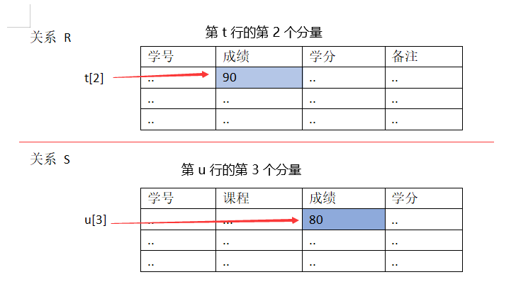

###### ③ t[i] θ c 或 c θ t[i]

这里的 c 是**常量**，表示：<span style="color:red">**元组 t 的第 i 个分量与常量 c 满足关系 θ**</span>。

【例】t[4] = 3 表示 元组 t 的第 4 个分量要等于 3 。


##### 自由元组变量 & 约束元组变量

在关系演算中定义了 “**自由元组变量**” 和 “**约束元组变量**” 两个概念。

**这些概念和谓词演算中的概念完全一样。**

<span style="color:red"> **若公式中的一个元组变量前有 “全称量词 ∀”  和 “存在量词 ∃” ，则称该元组变量为 约束元组变量，否则称自由元组变量。**</span>

> **在 Alpha 语言的谓词演算中，**
>
> **全称量词 ∀：必须所有元组都符合某个条件**
>
> **存在量词 ∃：只有有至少一个元组符合某个条件即可**
>
> **而如果将谓词演算的这个概念结合到关系演算里来，那么就相当于是给元组的筛选增加了约束条件，所以在关系演算中，这些元组就称之为约束元组变量。否则称为 自由元组变量，即没有约束条件**。


##### ④ 公式递归定义

根据前面原子公式的定义概念，公式可以**递归定义【按逻辑推理】**如下：

（1）**每个原子公式都是公式。【结果为真/假】**

（2）如果 **Φ1 和 Φ 2 是公式**，则 **Φ1 ∧ Φ2 ，Φ1 ∨ Φ2 ，﹁ Φ1** 都是公式。

分别为：

-  Φ1 ∧ Φ2：**如果  Φ1 和  Φ2 同时为真，才为真，否则为假**。 
   - 【true & ture】
-  Φ1 ∨ Φ2：**如果 Φ1 和  Φ2  其中一个为真，则为真。如果同时为假 ，则为假。** 
   - 【true | false】【false & false】
-  ﹁ Φ1：**若 Φ1 为真，则 ﹁ Φ1为假【取反】 。**

（3） **若 Φ 是公式，则 ∃t (Φ) 也是公式**。

表示：**若至少有一个元组 t 能使表达式 Φ 为真，则 ∃t (Φ)  为真，否则为假。**

（4） **若 Φ 是公式，则 ∀t (Φ) 也是公式**。

表示：**若全部元组 t 都能使表达式 Φ 为真，则 ∀t (Φ)  为真，否则为假**。


##### ⑤ 运算符优先级

在关系演算中，各种运算符优先次序如下：

① **算术比较运算符 优先级最高**。

> <、>、=、>=、<=...

② **量词次之，且存在量词 ∃ 的优先级高于全称量词 ∀**

③ **逻辑运算符最低**。 【与∧，或∨，非﹁】

**且非﹁ 的优先级高于 与 ∧，与∧ 的优先级高于 或 ∨。即 ﹁ >> ∧ >> ∨** 。

④ **加 () 括号时，括号内的优先计算，同一括号内的运算符优先级遵循 ① ② ③**


##### 小结

有限次地使用上述 5 条规则得到的公式才是关系演算公式，其他公式不是关系演算公式。

**一个元组演算表达式 {t | Φ(t) } 表示了能使 Φ(t) 为真的所有元组集合**。

##### 关系演算关系代数

*关系代数的运算可以由关系演算表达式来表示（反之亦然）*。

下面用关系演算表达式来表示关系代数的 5 种基本运算。

###### 并 

------

定义为：
$$
R ∪ S = {t | R(t) ∧ S(t) }
$$
**R ∪ S：将R表与S表的所有元组拼接在一起**

**R(t) ∧ S(t)：将 R 表的所有元组与S表的所有元组并在一起**。


###### 差

------

定义为：
$$
R — S = {R(t) ∨ ﹁S(t)}
$$


**R — S ：筛选出 在 R 表不在 S 表的所有元组。**

 **R(t) ∨ ﹁S(t)：R 表的所有元组 或 不是S表的所有元组。**


###### 笛卡尔积

------

定义为：
$$
R X S = {t (n+m) |( ∃ u (n) )( ∃ v (m) )(R(u) ∧ S(v) ∧ t[1]=u[1] ∧ ... ∧ t[n]=u[n] ∧ t[n+1]=v[1] ∧ ... ∧ t[n+m]=v[m])}
$$
R X S ：**将R 表与S 表的所有列组成一个新属性列【前 n 列 ∈ R，后 m 列 ∈ S】，同时将两表的所有元组进行匹配拼接到一起。即 R 表的元组依次与 S 表的元组进行匹配，R 表一个元组拼接S 表所有元组，依次类推，直到 R 表所有元组匹配完 S 表所有元组，最终组成一个R X S 的大表**。


###### 投影

------

定义为：
$$
π_{i1,i2,...,ik} (R) = {t(k) | (∃u) (R(u) ∧ t[1] ∧...∧t[k] = u[i_k])}
$$


**πi1,i2,..,ik ： 展示出选中的属性列。**


###### 选择

------

定义为：
$$
σ_F (R) = {t | R(t) ∧ F'}
$$
**σF (R) : 从关系 R 中筛选出符合条件 F 的所有元组。**

**{t | R(t) ∧ F'}** ：**当 关系R 中的 元组 t 符合条件 F’ 时，则该元组被挑选出来**。

**F' 是公式 F 用 t[i] 代替运算对象 i 得到的一个等价公式，即元组的筛选条件**，


##### 案例

【例】查询信息系（IS） 的全体学生。

定义为：
$$
S_{IS}  = {t | Student(t) ∧ t[5]= 'IS'}
$$
 **{...} ：表示结果是一个集合。**

**Sis ：表示查询的结果集命名。**

> 【说明】
>
> 表示查询应该是 **元组且属于 Student 表中的元组 t ，并且，该元组的第 5 个 分量【所在系】要为 “IS”** 的所有元组。

【例】查询年龄小于 20 岁的学生

定义为：
$$
S_{20} = {t | Student(t) ∧ t[4] < 20} 
$$

> 【说明】
>
> 表示查询应该是 **元组且属于 Student 表中的元组 t ，并且，该元组的第 4 个 分量【年龄】要小于20** 的所有元组。

【例】查询所有学生的姓名和所在系

> 这意味着要查询出两列的元组数据。

定义为：
$$
S_1 = {t^{(2)} | (∃u)(Student(u) ∧ t[1]=u[2] ∧ t[2] = u[5])}
$$

- **t(2) ： 查询的结果集有 2 列**

> 【说明】
>
> 表示查询的所有元组  t 都有 2 个列。【姓名、所在系】
>
> 而要查询的元组 u 是存在于 Student关系中的。
>
> 并且结果集的元组 t 的第 1 个分量 = Student 关系中所有元组 u 的第2 个分量，
>
> 并且结果集的元组 t 的第2 个分量 = Student 关系中所有元组 u 的第5 个分量
>
> 【因为结果集是 姓名 、所在系两列，而这两列在Student 关系中序号为 2 、5】

如图所示：

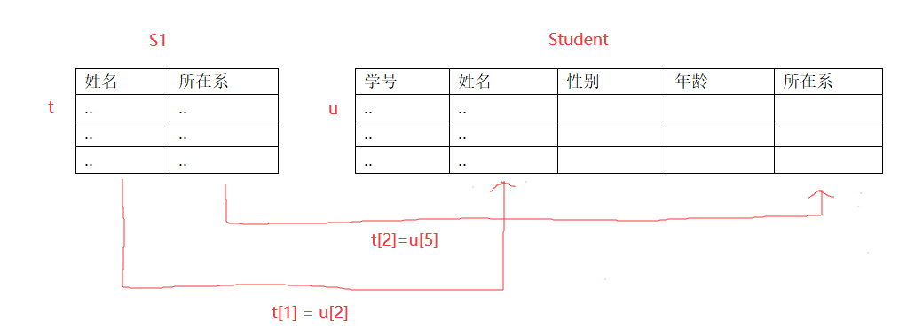


##### 安全限制

上述定义的关系演算中允许出现**无限关系**。

例如，<span style="color:red">**{ t | ﹁R(t)}**</span> ，**表示所有不属于 R 的元组（元组的目【例】数 = R 的目数）都符合条件**。

那么求出这些可能的元组是做不到的，所以**必须排除这类无意义的不安全表达式，把不产生关系的表达式称为安全表达式，所采取的的措施称为安全措施**。

<span style="color:red">**安全限制通常是定义一个有限的符号集 dom(Φ)，dom(Φ) 一定包括出现在 Φ  以及中间结果和最后结果的关系中的所有符号（实际上是各列值的汇集），dom(Φ) 不必是最小集。**</span>

> 也就是说为某个查询设定一个有限的集合，用于限定关系演算的筛选条件不得超过此有限集中的内容，同时在定义的有限集 dom(Φ) 中一定要包括要查询的各列值的汇集，并且此有限集可以扩充【不是最小集】。

------

当满足以下条件时，则元组演算表达式 {t | Φ (t) } 是安全的：

① **如果 t 能使 Φ (t) 为真，则 t 的每个分量是 dom (Φ) 中的元素**

> 也就是说在查询的时候，如果查询出的元组  t 是符合 Φ (t) 设定的条件，那么就证明存在于元组 t 中的每个分量，也同样存在于 dom(Φ) 这个有限集合中。

② **对于 Φ 中每一个如同 (∃u) (W (u)) 的子表达式，若 u 能使 W(u) 为真，则u 的每个分量是 dom(Φ)  中的元素**

> 也就是说，在原子公式 Φ 中，当设定存在条件 来查询 W 关系中的元组 u 时，如果 u 是属于 W 的【符合存在条件】，那么就证明存在于元组 u 中的每个分量，也同样存在于 dom(Φ) 这个有限集合中。

③ **对于 Φ 中每一个形如 (∀u) (W (u)) 的子表达式，若  u  能使 W(u) 为假，则 u 的每个分量必属于 dom(Φ) 。换言之，若 u 某一分量不属于 dom(Φ) ，则 W(u) 为真**

------

【例】设有关系 R 如下图，S = { t | ﹁R(t) } ，若不进行安全限制，则有可能是一个无限关系。

>  S = { t | ﹁R(t) } ：【S 关系是除了 R关系之外的所有元组集】

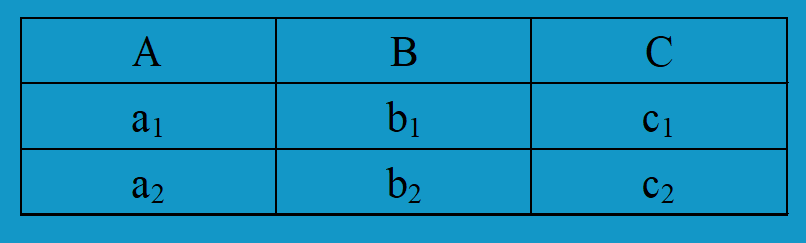

定义安全限制 dom(Φ) 为：
$$
dom(Φ) = π_A (R) ∧ π_B (R) ∧ π_C (R)
$$
**有限集 dom(Φ)  为：{ {a1、a2}，{b1、b2}、{c1、c2} }**

> dom(Φ) = πA (R) ∧ πB (R) ∧ πC (R) = { {a1、a2}，{b1、b2}、{c1、c2} }
>
> 【说明】
>
> 将 关系R中的 A、B、C属性列都分别投影出来，并将其现有的分量值列成一个个子集，最终成为限定关系演算的有限集。

那么基于此有限集下，则 S 是 **dom(Φ) 中各域值中元素的笛卡尔积 与 R 的差集**。

> dom(Φ) 中各域值中元素的笛卡尔积 与 R 的差集。
>
> 首先计算出 dom(Φ) 中所有子集的笛卡尔积：
>
> dom(Φ) = { {a1、a2}，{b1、b2}、{c1、c2} }
>
> dom(Φ)  的笛卡尔积为：
>
> { 
>
> {a1,b1,c1} 、{a1,b1,c2}、{a1,b2,c1}、{a1,b2,c2}
>
> {a2,b1,c1} 、{a2,b1,c2}、{a2,b2,c1}、{a2,b2,c2}
>
> }
>
> 再使用此笛卡尔积 — R 表现有的所有元组【相同的去除】。
>
> R 关系：
>
> { {a1,b1,c1} 、{a2,b2,c2} }  【在笛卡尔积中去除这两个子集，就是 S 的结果】

最终 S 结果如下图：

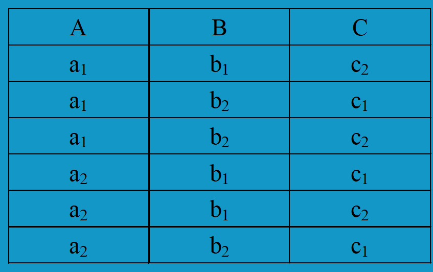


#### 域关系演算语言QBE

域关系演算是关系演算中的另一种形式。

<span style="color:red">**域关系演算以元组变量的分量即域分量作为谓词单位的基本对象进行运算。**</span>

> 也就是对某一行的某一个属性值作为对象来计算。

------

QBE 是 Query By Example（即通过用例进行查询）的简称。

它是<span style="color:red">**基于屏幕表格的查询语言**</span>，**用户通过终端屏幕编辑程序以填写表格的方式来构造查询要求，而查询结果也是以表格的形式显示的**。

> QBE 通过在一个表格中输入要操作的关系名，操作名， 属性名，属性值等等要素来进行操作。

<span style="color:red">**QBE 中用示例元素来表示查询结果可能的情况，示例元素实际上就是域变量。**</span>

------

##### QBE 操作框架

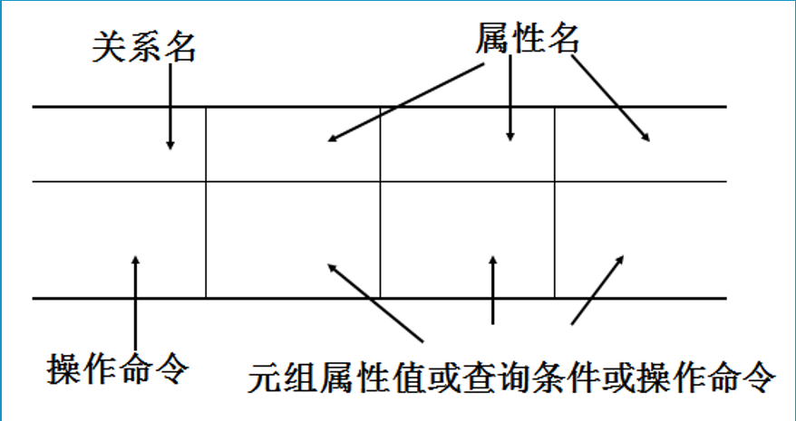

------

##### 检索操作 P.

###### 简单查询

QBE 的所有操作都是基于表格输入的形式来完成的。

【例】求信息系全体学生的姓名。其步骤为：

① **用户提出要求。【结果，条件】**

② **屏幕显示空白表格**

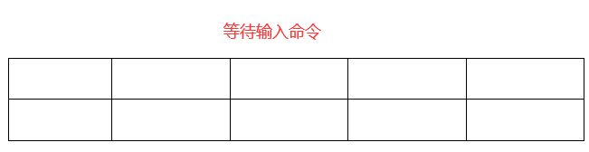

③ **用户在最左边一栏输入要操作的关系名** Student


④ **输入关系名之后，系统会显示该关系的所有属性名**。

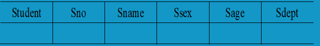

⑤ **用户在上面在指定格子上输入来构造查询要求**。

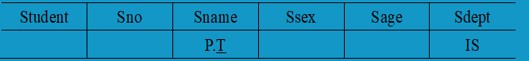

操作符 ：

- **P. ：表示打印（Print）该列的数据，实际上是显示。**
- **T：是示例变量即域变量。QBE 要求示例元素下面一定要加下划线，与其他查询条件区分。**
  - **这可以任意命名**。
    - 这就相当于举个输出的例子，只是告诉计算机输出这一列的数据。
  - **示例元素是这个域中可能的一个值，它不一定是查询结果中的元素**。
    - 例如要求信息系的学生，只要给出任意一个学生名即可，而不必真是该系的某个学生名
    - 如：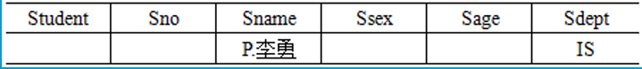
- **IS：查询条件，不用加下划线。【这个其实相当于 = IS，= 被省略了】**
  - **查询条件中可以使用比较运算符 > 、≧ 、<、≦、= 和 ≠。其中 = 可以省略**。

> 综合下来： 查询 Sdept 为 IS 的所有 Sname 属性列值，并打印出来。

⑥ **屏幕最终显示查询结果**

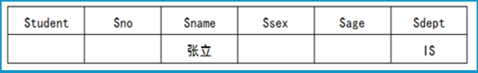

------

【例】查询全体学生的全部数据。

要想查询**某个关系下的全部数据**。有以下两种方式：

① **输入关系名后。在其所有属性列下输入 P.xxx ，以打印所有属性列的值**。

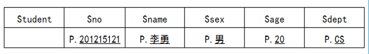

② **在输入关系名后，直接在关系名这一栏下输入 P. 来打印此关系的所有数据**。

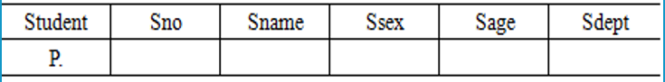

------

###### 条件查询

【例】求年龄大于19岁的学生的学号。

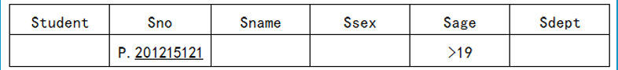

------

**与：**

【例】求计算机科学系年龄大于19 的学生的学号。

> 查询条件： Sdept= ‘CS ’ 和 Sage > 19 两个条件的 “**与**”。

在 QBE 中，表示两个条件的 “与” 有以下两种方式：

① **直接把两个条件写在同一行上**

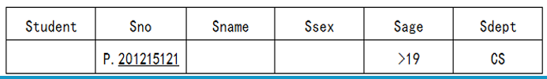

> 表示输出 Sno 学号这一列，条件是 Sage > 19，Sdept= ‘CS’

② **把两个条件写在不同行上，用相同的示例元素值**

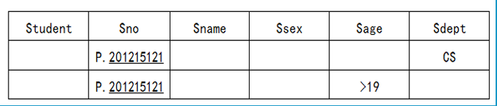

> 这里的两行其实是看做同一个关系，因为它们是相同的示例元素值。

**注意：两行的示例元素值必须一样，才能看做 ‘与’**

------

**或：**

【例】查询计算机科学系或者年龄 > 19岁的学生的学号。

> 查询条件：Sdept = 'CS' 或者 Sage > 19 

在QBE 中，**把两个条件写在不同行上，并且使用不同的示例元素值，即表示条件的 “或”**。

> **两条不同的示例元素值，即代表输出两个不同的关系**

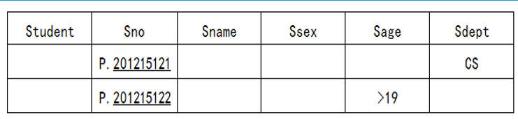

------

**同一列的与** ：

【例】查询既选了 1 号课程又选了 2 号课程的学生学号。

> 要求：Cno = 1 & Cno = 2

查询条件是在同一个属性列身上的 “与” 关系，它只能使用 “与” 条件的第 ② 种方式。

即**写两行，示例元素相同**。

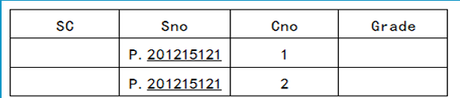

------

##### 多表联合

QBE 中的多表联合查询，有 n 个关系就需要填写 n 个表格。

同时**需要用到表之间的主码，即相同列，作为连接属性来连接表与表之间的所有元组数据**。

【例】查询选修了 1 号 课程的学生姓名

> 本查询涉及到了两个关系 ：SC 和 Student 。

在 QBE 中实现多表查询的方法是**通过相同的连接属性值把多个关系连接起来**。

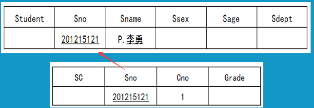

> 这里的示例元素 Sno 是连接属性，其值在两表中要相同。

**注：连接属性不需要输入 P. 。【因为它并不是要输出内容】**

------

**逻辑非** ：

【例】查询未选修 1 号课程的学生姓名

> 这里的查询条件用到了逻辑非。

**在QBE 中表示逻辑非的方法是将逻辑非  ﹁ 写在关系名下面，表示为将本次查询的结果取反展示**。

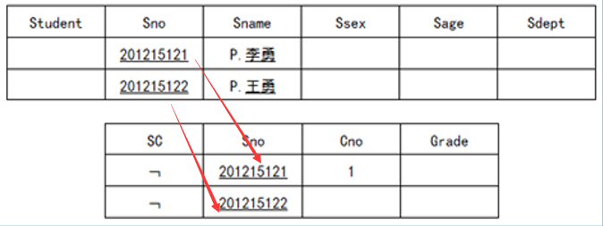

> 查询未选修 1 号课程的结果有两种：
>
> - 选了课，但是没选 1 号课程，即第一行的结果
> - 未选课，即第二行的结果。
>
> 在连接两张表后，将一张表的数据全部取反，则表明输出的是两张表之间没有任何联系的数据。【未选课】

------

**表内连接** ：

【例】查询有两个人以上选修的课程号

本查询是在一个表内连接。这个查询是要显示这样的课程1，它不仅要被 201215121 选修，也至少要被另一个学生 （﹁201215121）选修。【即除了 20215121 之外，看是否其他人】

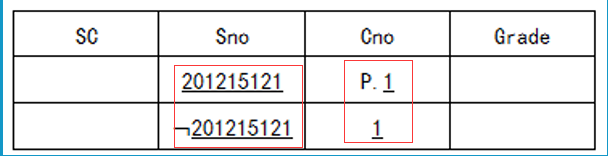

> 第一行输出的是 201215121 这个学号所选修的 课程号
>
> 第二行，则对 201215121  这个学号进行取反，也就是除了这个 201215121  学号之外，还有没有其他人。

------

##### 聚集函数

为了方便用户，QBE提供了一些聚集函数。包括 **CNT、SUM、AVG、MAX、MIN** 等。

如下：

| 函数名  | 功能           |
| ------- | -------------- |
| **CNT** | **对元组计数** |
| **SUM** | **求总和**     |
| **AVG** | **求平均值**   |
| **MAX** | **求最大值**   |
| **MIN** | **求最小值**   |

###### AVG

------

【例】查询信息系学生的平均年龄

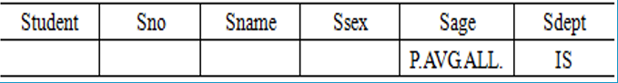

- **AVG ：求平均值**
- **ALL. ： 此属性列的所有属性值**

------

##### 结果排序

------

对查询结果进行排序的关键字如下：

- **AO. ：按某个属性值的升序排序**
- **DO. ：按某个属性值的降序排序**

如果要**多列排序**，即**第一个列值相同无法比较排序时，由第二列来决定其排序高低**。

- **AO(i) ：按某个属性值的升序排序，同时设定排序的优先级**
- **DO(i) ：按某个属性值的降序排序，同时设定排序的优先级**

**其中 i 是优先级，i 值越小、优先级越高。**

【例】查全体男生的姓名，要求结果按所在系升序排序，对相同系的学生按年龄降序排序。

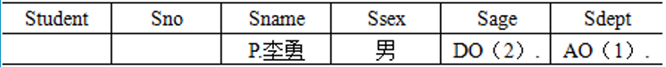

> 此查询结果会先按 Sdept 升序排序，如果Sdept 出现相同值，则按 Sage 降序排序。


##### 修改操作 U.

修改操作符为 “**U.**”。

在 QBE 中，**关系的主码不允许被修改**，如果需要修改某个元组的主码值，只能先删除该元组，然后再重新插入新的主码的元组。

------

【例】把 201215121 学生的年龄改为 16 岁。

这是修改操作不包含算术表达式，可以有两种表示方式：

① **把操作符 “U.” 放在要修改的属性列上**。

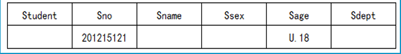

【注意】

- **必须写上要修改的元组的主码值**，也便让系统知道修改的是哪条元组的数据。
- **U. 标明后修改后的新值**
- **U. 后面要修改的值不需要加下划线_ ，因为其不是示例元素**。

② **将操作符 “U.” 放在关系上**

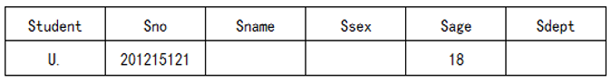

由于主码是不允许被修改的，系统并不会看主码这一列，也就不会混淆要修改的属性。

------

【例】把 201215121 学生的年龄增加 1 岁

这个**修改操作涉及到表达式，则只能将操作符 “U.” 放在关系上**。

如果要想修改一个未知列的值：

- 首先先将这个值查询出来。要求学号 = 201215121。
  - 注：**不是输出展示，只是查询给系统看的，故不用 P**. 
- 之后再使用 U. 对其进行相应的修改操作。
  - 因为 查询 和 修改 是不同的操作，需要分开进行。
- 但是 查询 和 U. 操作的必须是同一个关系，即同一个示例元素值。

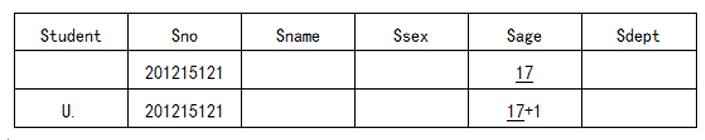

> 第一行将 201215121 学号对应的 Sage 信息查询出来，然后再在第二行使用 U. 对该同一示例元素对应的元组的 Sage 属性列的值进行修改操作。

-----

【例】 将计算机科学系所有学生的年龄都增加 1 岁。

> 要求：首先查询出条件为 Sdept = ‘CS’ 的年龄和学号两列数据
>
> 然后再在第二行对这些数据进行修改操作。
>
> 注：**查询和 U. 操作的学号示例元素值必须一致，这样才能让系统知道是同一个关系内的操作**。

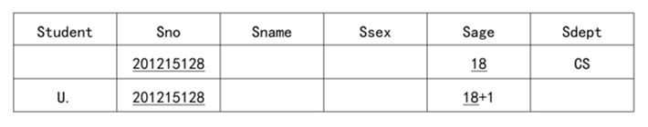

-----

##### 插入操作 I.

插入操作符为 " **I.** "，**写在要插入新元组的关系下**。

**新插入的元组必须具有主码值，其他属性值可以为空**。

【例】把信息系女生201215801、姓名张三、年龄17岁插入数据库中。

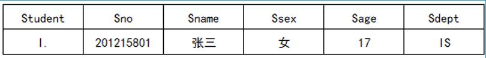

-----

##### 删除操作 D.

删除操作符为 “ **D.** ”，**写在要删除指定元组的关系下**。

【例】删除学生 201215189。

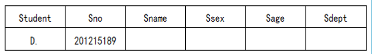

> 删除学号为 201215189 的元组记录。

由于 SC 关系与 Student 关系具有参照关系，为保证数据完整性，删除 201215189 记录之后，也要删除 201215189 在 SC 表上相应的选课记录。

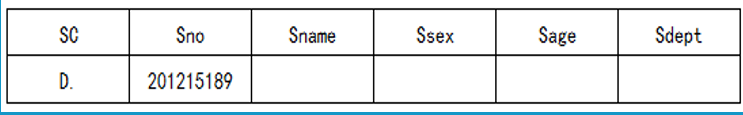


---

