# 关系数据库标准语言SQL

## SQL 概述

SQL（Structured Query Language）：**结构化查询语言，是关系数据库的标准语言**。

**SQL 是一个通用、功能极强的关系数据库语言**，**基于关系代数的理论基础的良好实现**。

> 以下使用的是 SQL 2011 标准语法。

### SQL 的特点

#### ① <span style="color:red">**综合统一**</span>

------

(1) **集数据定义语言（DDL），数据操纵语言（DML）、数据控制语言（DCL）功能于一体**。

(2) **可以独立完成数据库生命周期中的全部活动**：

定义关系模式、插入数据、建立数据库、对数据库中的行查询和更新、数据库重构和维护、数据库安全性、完整性控制等。

(3) **用户数据库投入运行后，可根据需要随时修改关系模式、不影响数据的运行**。

【即增加、删除列等】

(4) **数据操作符统一**。

【具有固定的语句来实现数据的操作】

#### ② <span style="color:red">**高度非过程化**</span>

------

> 非过程化：过程化指的是数据操作从一开始怎么操作，操作什么这一整个过程都是用户自己来定义，而非过程化则是**用户只需提供操作的要素即可， 剩下的操作过程由数据库内部自动完成**。

(1) **非关系数据模型的数据操纵语言都是“面向过程”的，必须指定存储路径**。

(2) **SQL 只要提出 “做什么” ，无需了解存取路径**

(3) 存取路径的选择以及SQL操作的过程由系统自动完成。

#### ③ <span style="color:red">**面向集合的操作方式**</span>

------

>  **面向集合：即以整个关系的很多元组作为统一单位进行操作。**

① **非关系数据模型采用面向记录的方式，操作对象是一条记录**

> 例如：树状结构，是根据层次性的节点一个个往下找的

② **SQL 采用集合操作方式**

- 操作对象、查找结构可以是元组的集合【表】
- 一次插入、删除、更新操作的对象也可以是元组的集合。

#### ④ <span style="color:red">以同一种语法结构提供多种使用方式</span>

(1) **SQL 是独立的语言**

能够独立地用于联机交互的使用方式。【即在数据库中独立运行】

(2) **SQL 又是嵌入式语言**

SQL 能够嵌入到高级语言（C、C++、Java）程序，给程序员设计程序时使用。

#### ⑤ <span style="color:red">语言简洁、易学易用</span>

> SQL 的查询语句与语法结构就如同日常说话的方式一样，**采用语义化的形式来编写 SQL**。
>
> 例如 从 x 表中查询 x 记录。直接Select ... From X 即可。 

SQL 功能极强，完成核心功能只用了 9 个动词。

| SQL功能      | 动词                              |
| ------------ | --------------------------------- |
| **数据查询** | **SELECT **【**相当于 π 投影**】  |
| **数据定义** | **CREATE、DROP、ALTER**           |
| **数据操纵** | **INSERT、DELETE、UPDATE**        |
| **数据控制** | **GRANT【授权】、REVOKE【回滚】** |

### SQL的基本概念

SQL 支持关系数据库三级模式结构。

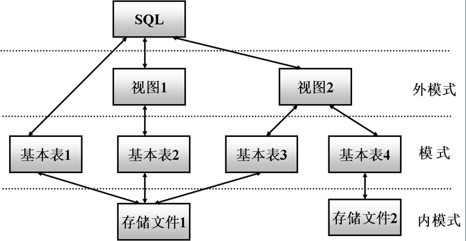

- **外模式：即用户可以看到的数据结果展现形式。**

> SQL 采用视图的形式向用户展现最终的查询结果。
>
> 视图：是一种虚拟表，可以将多个关系联合成一张表综合展示给用户查看，是外界与数据库之间对接的接口。

- **模式：即数据的逻辑结构和特征描述。**

> SQL 采用关系表的形式来定义数据的存储结构、完整性约束、表与表之间的关系等等概念

- **内模式：即数据的存储方式**

> SQL 采用文件的存储方式，存储到硬盘中，此过程由系统自动完成，不需要用户自己操作。

#### 基本表

① **本身独立存在的表**

② **SQL 中一个关系就对应一个基本表**

③ **一个（或多个）表对应一个存储文件**

④ **一个表可以带若干个索引**

>  索引：相当于是一个目录，它提供了以更快捷、查询效率更高为目的的方式来查询出表中想要的结果

#### 存储文件

① **逻辑结构上组成了关系数据库的内模式**

② **物理结构上是任意的，对用户透明**

> 即存储文件可以放在任意的位置，用户不需要知道其过程

#### 视图

① **是由一个或多个基本表导出的虚拟表**

② **数据库只存放视图的定义而不存放视图对应的数据**

> 即只存放视图的结构【查询什么】、而不是存放该视图查询出的结果数据。

③ **用户可以在视图上再定义视图**

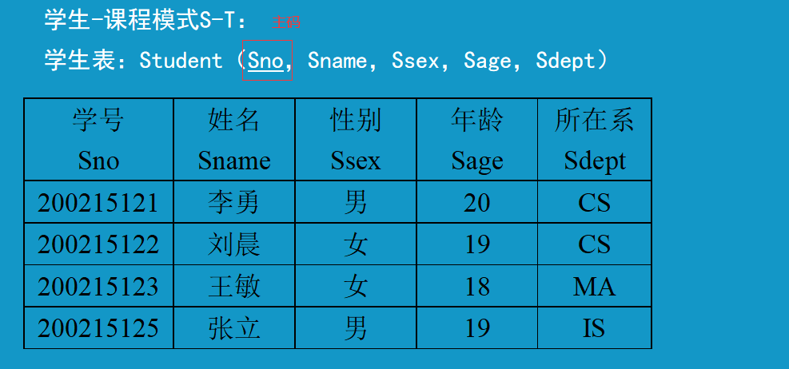

## 数据定义

SQL的数据定义功能：模式定义、表定义、视图和索引的定义。

| 操作对象           | 创建              | 删除            | 修改            |
| ------------------ | ----------------- | --------------- | --------------- |
| **模式【Schema】** | **CREATE SCHEMA** | **DROP SCHEMA** |                 |
| **表【TABLE】**    | **CREATE TABLE**  | **DROP TABLE**  | **AKTER TABLE** |
| **视图【VIEW】**   | **CREATE VIEW**   | **DROP VIEW**   |                 |
| **索引【INDEX】**  | **CREATE INDEX**  | **DROP INDEX**  | **ALTER INDEX** |

### 模式的定义和删除

#### 概念

模式：**是静态的、稳定的，设定了模式之后，可以在此模式之下建立表，而表就是模式的应用体现**。

> 就好比在一个大仓库中，有若干个房间，每个房间用于存放不同种类关系的工具，例如 1 号房间用于存储原材料之类的，2 号房间用于存储半成品之类的等等，同时又有若干个房间各自的管理员，他们可以各自管理各自的房间以及对房间内的工具进行更改操作。
>
> 这就相当于是**一个数据库中，可以定义若干个模式，这些模式都是基于现实世界中的某些存在关系而定义的，例如学生与课程 存在着关系，就可以设定一个模式 S-T ，且可以在此模式中建立相应的学生表、课程表之类的表，用于存储具体的实体数据。同时，模式还有权限的说法，即如果给定了一个数据库人员某个模式的操作权限，那么他就可以对此模式进行操作**。

#### 定义模式

##### 基本格式

```mysql
CREATE SCHEMA <模式名> AUTHORIZATION <用户名>;
```

> **建立一个模式，并将此模式的权限给予某个用户使用**。

【注意】

- **若没有指定模式名，则 <模式名> 默认为 <用户名>**。
- **执行创建模式语句必须拥有 DBA 权限，或者DBA 授予在 CREATE SCHEMA的权限**。
  - 因为模式涉及到数据库的管理，所以 SHCEMA 模式只有 DBA 【数据库管理员】才可以创建，或者由 DBA 授权给某个用户创建。当 DBA 创建好模式后，则可以将此 模式的权限下放给其他用户使用并维护。

------

【例】给用户 WANG 定义一个学生—课程模式 S-T。

```mysql
CREATE SCHEMA "S-T" AUTHORIZATION WANG;
CREATE SHCEMA AUTHORIZATION WANG; -- 模式名：WANG，用户名：WANG
```

> 给用户 WANG 定义了一个模式 S-T。

------

##### 定义子句

**在 CREATE SCHEMA 之后可以接受 CREATE TABLE、CREATE VIEW 和 GRANT 子句**。

格式如下：

```mysql
CREATE SCHEMA <模式名> AOTHORIZATION <用户名> 
[<表定义子句> | <视图定义子句> | <授权定义子句>]
```

这样，在建立模式的同时，可以相应的建立属于此模式的表、视图、授权等等。

------

【例】为用户 ZHANG 创建一个模式 TEST，并在其之下定义了一个表 TAB1。

```MYSQL
CREATE SCHEMA "TEST" AUTHORIZATION ZHANG;
CREATE TABLE TAB1 (
  COL1 SMALLINT,
  COL2 INT,
  COL3 DECIMAL(5,5),
  COL4 CHAR(20),
  COL5 NUMERIC(10,3)
);
```

------

#### 删除模式

##### 基本格式

```mysql
DROP SCHEMA <模式名> <CASCADE | RESTRICT>;
```

【说明】

① **CASCADE 和 RESTRICT 必须二选一**。

② **CASCADE (级联) ：删除模式的同时把该模式下所有数据库对象全部删除**。

> 即不管该模式下有没有数据，都彻底删除干净。

③ **RESTRICT (限制) ：如果该模式下定义了下属的数据库对象（如表、视图等），则拒绝该语句的执行。当该模式没有任何下属的对象时才能执行**。

> 即如果该模式下有数据，那么则会执行出错，必须要先将此模式下的所有数据删除完，才能删除该模式。

------

【例】将 ZHANG 模式下的所有数据删除【CASCADE】。

```mysql
DROP SCHEMA "ZHANG" CASCADE;
```

------

### 基本表的定义和删除

#### 定义基本表

##### 基本格式

```mysql
CREATE TABLE <表名>
(
	<列名> <数据类型> [<列级完整性约束>],
    ....
    [<表级完整性约束>]
);
```

【说明】

**如果完整性约束涉及到该表的多个列，在必须将该约束设定到表级上，否则即可以定义在列级，也可以定义在表级上**。

------

【例】建立学生表 Student，学号是主码，姓名取值唯一。

```mysql
CREATE TABLE Student
(
	Sno CHAR(8) PRIMARY KEY, /*列级约束，主码*/
    Sname CHAR(10) UNIQUE, /*唯一约束*/
    Sage SMALLINT,
    Ssex CHAR(2).
    Sdept CHAR(20)
);
```

【例】建立课程表 Course。

```mysql
CREATE TABLE Course
(
	Cno CHAR(2) PRIMARY KEY,
    Cname CHAR(20) UNIQUE,
    Cpno CHAR(4), -- 先行课号
    Ceredit SMALLINT,
    FOREIGN KEY(Cpno) REFERENCES Course(Cno)
    /*表级约束：先行课 - 课程 : 多对一关系，故 Cpno 引用 Cno。*/
    /* Cpno 是外码，被参照表是 Course，参照列是 Cno */
);
```

###### 外键约束

```mysql
FOREIGN KEY (外键列) REFERENCES 引用表名(引用主键)
```

【例】建立选课表 SC

```mysql
CREATE TABLE SC
(
  Cno CHAR(2),
  Sno CHAR(8),
  GRADE SMALLINT,
  PRIMARY KEY(Cno,Sno),  -- 主码由两个属性组成，必须作为表级完整新约束进行定义。
  FOREIGN KEY(Cno) REFERENCES Course(Cno), -- 选修课程号 - 课程号
  FOREIGN KEY(Sno) REFERENCES Student(Sno) -- 选修学号 - 学生学号
);
```

###### 主键约束

> 当主码由两个属性组成时，必须作为表级约束来进行定义。

```mysql
PRIMARY KEY(Cno,Sno)
```

-----

#### 数据类型

常用的数据类型如下表：

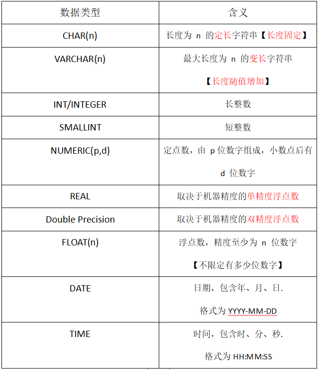

#### 模式与表

**每一个基本表都属于某一个模式，一个模式包含多个基本表**。

**创建基本表时，若没有指定模式，系统会根据<span style="color:red">搜索路径</span>来确定该对象所属的模式。**

#### 搜索路径

> 搜索路径：**用来确定某个基本表位于哪个模式之下的方式**。

① **显示当前的搜索路径**

```mysql
SHOW  search_path;
```

> 该语句执行完之后，会显示出你目前所处的位置。

② **搜索路径的当前默认值**：

```java
$user,PUBLIC;
```

> **$user ：表示目前已登录的用户的模式，或者是之前创建好的模式，这也是系统默认给表设定搜索路径的模式**。
>
> **PUBLIC：表示该模式是公共的，没有用户所属，所有用户都可以访问此模式下的所有基本表**。
>
> 实际在应用中，**$user 模式 = 用户名**。
>
> 【说明】
>
> **用户 A 登录进DBMS后 ，在此期间，如果用户A 被DBA赋予过某个模式的权限，那么搜素路径则会变为该模式，否则模式的搜索路径默认会变为用户A（即第一个模式 $user），这时所创建的所有基本表都属于用户 A 下的。而如果未登录任何用户就来建表，那么该模式就是公共的。（即第二个模式 PUBLIC）**

③ **DBA 用户可以设置搜索路径**

```mysql
SET search_path TO "S-T",PUBLIC;
```

> **将当前的搜索路径设置成 S-T 模式下，如果没有 S-T 模式，【没有 Create Schema】，那么系统会将此模式设置为 公共模式**。
>
> 执行此语句之后，创建的所有基本表都是属于 S-T 此模式的了。

- **若搜索路径的模式名都不存在，系统将给出错误**

> 即连 PUBLIC 模式都没有的话，这种情况很少见，因为现在基本上都是要用户登录。

- **若搜索路径中的存在模式，RDBMS会使用模式列表的第一个存在模式作为数据库对象的模式名**

> 即如果搜索路径中存在有模式的话，数据库系统默认使用第一个模式作为数据库对象的模式。

#### 模式下创建基本表

##### ① 创建表时给出模式名

这种情况是 **先创建模式，后创建表，在表创建的时候，为表指定其归属模式**。

```mysql
CREATE TABLE <模式名> .<表名>(...);
```

以定义一个学生-课程模式 S-T 为例：

```mysql
CREATE TABLE "S-T" .Student(....);
-- Student 表属于 S-T 模式下。
```

##### ② 创建模式的同时创建表

```mysql
CREATE SCHEMA "TEST" AUTHORIZATION ZHANG;
CREATE TABLE TAB1 (
  COL1 SMALLINT,
  COL2 INT,
  COL3 DECIMAL(5,5),
  COL4 CHAR(20),
  COL5 NUMERIC(10,3)
);
```

##### ③ 设置所属模式，在创建表中不必给出模式名

【例】DBA  用户设置搜索路径，然后定义基本表。

```mysql
SET search_path TO "S-T", PUBLIC;
CREATE TABLE Student(.....);
```

设置了所属模式的搜索路径后，代表之后创建的表都属于 S-T 此模式下。

#### 修改基本表

##### 基本格式

```mysql
ALTER TABLE <表名>...
```

##### 添加新列

```mysql
ALTER TABLE <表名> ADD [COLUMN] <新列名> <数据类型> <完整性约束>;
```

【例】向 Student 表增加 “入学时间” 列，其数据类型为 日期型。

```mysql
ALTER TABLE Student ADD [COLUMN] S_entrance DATE;
```

**注意：无论基本表中原来是否已有数据，新加入的列一律为空值【NULL】**。

-----

##### 添加约束

```mysql
ALTER TABLE <表名> [ADD <约束名(约束列)>]
```

【例】为课程名称增加必须取唯一值的约束条件

```mysql
ALTER TABLE Student ADD UNIQUE(Cname);
```

------

##### 删除列

```mysql
ALTER TABLE <表名> DROP [COLUMN] <列名> [CASCADE | RESTRICT];
```

- **CASCADE (级联)：当删除此列时，与此列相关的数据都会被删除。**

- **RESTRICT (限制)：如果此列有关联数据，则不可删除。**

-----

##### 删除完整性约束

```mysql
ALTER TABLE <表名> DROP CONSTRAINT <完整性约束名> [CASCADE | RESTRICT];
```

-----

##### 修改列

```mysql
ALTER TABLE <表名> ALTER COLUMN <列名> <数据类型>;
```

【例】将年龄的数据类型由字符型改为长整型。

```mysql
ALTER TABLE Student ALTER COLUMN Sage INT;
```

-----

#### 删除基本表

##### 基本格式

```mysql
DROP TABLE <表名> [RESTRICT | CASCADE]
```

【说明】

- **RESTRICT：删除表是有限制的。 要删除的表不能被其他表的约束所引用。如果存在依赖该表的对象，则此表不能被删除。**
- **CASCADE：删除该表没有限制。在删除基本表的同时，表的依赖对象一并删除。**
- **基本表定义被删除，数据被删除，表上建立的索引、视图、触发器等一般也将被删除**。

##### 处理策略

当 DROP TABLE  时，SQL2011 与其他 3 个 RDBMS【关系数据库】 的处理策略比较。

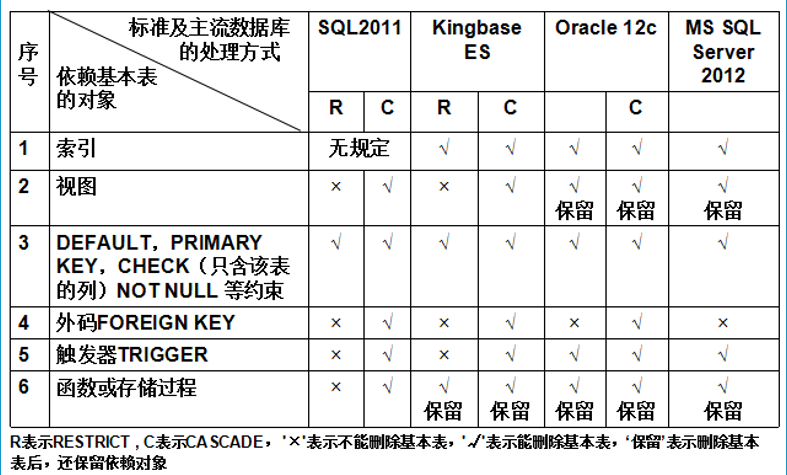


### 索引的建立与删除

#### 基本概念

① 建立索引的目的：**加快查询速度**。

> 索引：就好比一本书的目录，当想要看书中指定的哪个内容时，直接找目录就可以快速找到。

② 可以建立索引的单位：**DBA【数据库管理员】和 表的属主（建立表的人）**。

**注：DBMS 一般会在有 PRIMARY KEY 和 UNIQUE 约束的列上自动建立该列的索引**。

> 因为 PRIMARY  和 UNIQUE 是**唯一性质**的，很好查找，建立索引相对简单。

③ 维护索引：**由DBMS 自动索引维护**。

④ 使用索引：**DBMS自动选择是否使用索引或使用哪些索引**。

##### 其他知识点

- **RDBMS 中索引采用 B+ 树、HASH索引来实现**。

**B+ 树**具有**动态平衡**的优点，**HASH 索引**具有**快速查找**的优点。

采用 B+树 还是 HASH 索引具体由RDBMS 来决定。

- **索引是关系数据内部实现技术，即数据库自己运作，属于内模式范畴**。
- **CREATE INDEX 语句定义索引**时，可以定义为 **唯一索引、非唯一索引** 和 **聚簇索引** 这3类。

#### 建立索引

> 关系数据库一般只会在列是PRIMARY KEY 和 UNIQUE 约束上才会自动为其建立索引，其他情况则不会，需要自己建立。

##### 基本格式

```mysql
CREATE [UNIQUE] [CLUSTER] INDEX <索引名> ON <表名> (<列名>[<ASC | DESC>]...);
```

> **为指定表中的一个或多个列建立指定类型的索引，并为其索引设定顺序**。

- **UNIQUE：唯一索引。**

- **CLUSTER：聚簇索引。**

- **以上两者都不选：非唯一索引。**

  - ```mysql
    CREATE INDEX <索引名>...
    ```

- **ASC| DESC：规定索引按属性值的大小来升序/降序排列**。 **默认 ASC 升序**

##### 唯一索引

① **UNIQUE 表名此索引每一个索引值只对应唯一的数据**。

【例】为学生-课程数据库中的 Student、Course、SC 三个表建立索引。

```mysql
CREATE UNIQUE INDEX StuSno ON Student(Sno);
CREATE UNIQUE INDEX CouCno ON Course(Cno);
CREATE UNIQUE INDEX SCno ON SC(Sno ASC,Cno DESC); 
```

> Student 表按学号升序建立唯一索引。
>
> Course  表按课程号升序建立唯一索引。
>
> SC 表按学号升序、课程号降序建立唯一索引。
>
> 【因为 学号 和 课程号 两列组合在一起才是一个主码】

##### 聚簇索引

② **CLUSTER 表示要建立的索引是聚簇索引**。

聚簇索引是**指索引顺序与表中记录的物理顺序是一致的索引组织**。

> 【说明】
>
> 建立了聚簇索引后，在表中，索引的顺序记录是
>
> > 第 ① 个索引 --- C:\689
> >
> > 第 ② 个索引 --- D:\223
> >
> > 第 ③ 个索引 --- E:\886
>
> 不管从**逻辑顺序**，还是**物理顺序**，看上去都是符合正常逻辑的顺序排列。
>
> 这其实是归功于聚簇索引的作用。
>
> 其实在计算机中，为了能够充分利用硬盘上的物理空间，常常会将一份数据库表中的索引按照大小拆分成多分分别存放到不同的盘中，真实的索引顺序很可能是如下：
>
> > 第 ① 个索引 --- D:\223
> >
> > 第 ② 个索引 --- C:\689
> >
> > 第 ③ 个索引 --- E:\886
>
> 按照计算机的盘符顺序计算是，C > D > E ，而这样的话则索引的顺序就会被打乱成 ②①③ 。显然，②①③ 这样混乱的顺序记录放在表中，对于查询索引记录来说会妨碍查询效率，所以在计算机存储完索引后。
>
> **聚簇索引会将索引顺序按照表中记录的顺序一样，将物理顺序也设为与表中记录一致的顺序，使得索引顺序与其物理顺序是先后一致的**。
>
> 【即表中索引的顺序是 第 ① 个索引是 C:\689，那么在硬盘上也要是一致的】。
>
> 从而大大提高索引的查询效率。

▲ 在**频繁查询的列**上建立聚簇索引**能够提高查询效率**。【**聚簇索引的查询效率是最高的**】

▲ **经常更新的列不适合建立聚簇索引**

▲  **一个基本表**最多**只能建立一个聚簇索引**。

#### 删除索引

##### 基本格式

```mysql
DROP INDEX <索引名>;
```

> 【例】
>
> 删除 Student 表的Stusname 索引
>
> >  DROP INDEX Stusname; 

注：**删除索引时，系统会从数据字典中删去有关该索引的描述**。

### 数据字典

▲**数据字典是关系数据库管理系统内部的一组系统表**。

▲**数据字段记录了数据库中所有的定义信息，包括模式定义、视图定义、索引定义、完整性约束定义、各类用户对数据库的使用权限、统计信息等等**。

> 就好比一本新华字典，里面全都是详细描述了每个汉字的信息。
>
> 也就是说**数据字典就是用来描述整个关系数据库从大到小的所有已定义的信息**。

▲**RDBMS 执行 SQL 数据定义时，实际上是更新数据字典**。


## 数据查询

### 语句格式

```mysql
SELECT [ALL | DISTINCT] <目标列表达式>... FROM <表名|视图名>....
[WHERE <条件表达式>] 
[GROUP BY <列名1> [HAVING <条件表达式>]]
[ORDER BY <列名2> [ASC | DESC]]
```

名词解释：

- **ALL：查询表中全部数据**
- **DISTINCT：在查询的结果中去重**
- **WHERE <条件表达式>：根据给定条件查询数据**
- **GROUP BY <列名1> ：按指定列进行分组查询**
  - **HAVING <条件表达式>：并给予一定条件，是否有....**
- **ORDER BY <列名2>：结果按指定列排序**
  - **ASC | DESC：升序 | 降序**

### 单表查询

功能：**对一个表的内容进行查询**。

#### 查询指定列

格式：

```mysql
SELECT <列名1>,<列名2>... FROM <表名>;
```

【例】查询全体学生的学号和姓名。

```mysql
SELECT Sno,Sname FROM Student;
```

-----

#### 查询全部列

功能：**选出表中所有属性列**。

```mysql
select * from <表名>;
```

#### 查询经过计算的值

功能：**选出表中指定的属性列，并经过计算后输出**。

基本格式：

```mysql
SELECT <目标列表达式> FROM <表名>;
```

其中，<目标列表达式> 可以为：

##### ① 算术表达式

【例】查询全体学生的姓名和出生年份。【当前年份-年龄】

```mysql
SELECT Sname,2004 - Sage FROM Student;
```

-----

##### ② 字符串常量

【例】查询全体学生的姓名、出生年份、和所在系。

```mysql
SELECT Sname,'Year of Birth:',2004-Sage FROM Student;
```

>  【输出结果】 | Sname | 'Year of Birth' | Sage | ...

-----

##### ③ 函数

【例】查询所在系，以小写表示。

```mysql
SELECT LOWER(Sdept) FROM Student;
```

- **LOWER() ：转为小写**
- **UPPER() ：转为大写**

-----

##### ④ 列别名

格式：

```mysql
SELECT 列名1 <别名1>, ... FROM <表名>;
```

-----

#### 选择表中的若干元组

##### 全选 ALL 

ALL：**查询所有数据【包括重复】**。【通常省略】。

【例】查询选修了课程的学生学号

```mysql
SELECT ALL Sno FROM SC;
```

等价于

```mysql
SELECT Sno FROM SC;
```

-----

##### 去重 DISTINCT

去重：**消除查询结果中取值重复的行**。

*如果没有指定 DISTINCT 关键词，那么缺省【默认】会是 ALL。*

```mysql
SELECT DISTINCT <列名> FROM <表名>;
```

【例】查询考试成绩有不及格的学生学号

```mysql
SELECT DISTINCT Sno FROM Student WHERE Grade < 60;
```


-----

### 条件查询 where

查询满足条件的元组可以通过 where 子句来实现，where 常用的查询条件如下：

| 查询条件                 | 谓词                                                         |
| ------------------------ | ------------------------------------------------------------ |
| **比较**                 | **<、>、<=、>=、!=、<>、!>、!<、NOT + 比较符**               |
| **确定范围【值区间】**   | **BETWEEN AND 【在...和..之间】，NOT BETWEEN AND 【不在...和...之间】** |
| **确定集合【元素区间】** | **IN 【在于....】，NOT IN【不在于...】**                     |
| **字符匹配**             | **LIKE【模糊匹配】、NOT LIKE【模糊匹配取反】**               |
| **空值**                 | **IS NULL、IS NOT NULL**                                     |
| **多重条件（逻辑运算）** | **AND 并、OR 或 、NOT 非/反**                                |

**【注】WHERE 语句不可有聚集函数作为查询条件。**

-----

#### ① 确定范围

谓词：

- **BETWEEN …… AND …… 【在 ... 和 ... 之间】**
- **NOT BETWEEN ..... AND ..... 【不在 ... 和 ... 之间】**

【例】查询年龄在 20 和 23 岁之间（包括20和23）的学生姓名、系别和年龄。

```mysql
SELECT Sname,Sdept,Sage
FROM Student WHERE Sage BETWEEN 20 AND 23;
```

【例】查询年龄不在 20 和 23 岁之间（包括20和23）的学生姓名、系别和年龄。

```mysql
SELECT Sname,Sdept,Sage
FROM Student WHERE Sage NOT BETWEEN 20 AND 23;
```

-----

#### ② 确定集合

谓词：

- **IN (值1,值2...) ** ： **条件符合其中之一即可**
- **NOT IN (值1,值2...)**：必须条件都不在里面才能通过。

> 表示给定一组值集合，规定条件值是或都不是在此集合中的某一项即为符合条件。

【例】查询信息系（IS），数学系（MA），计算机科学系（CS）的学生的姓名和性别。

```mysql
SELECT Sname,Ssex
FROM Student WHERE Sdept IN ('IS','MA','CS');
-- 符合其中之一即可
```

【例】查询不是信息系（IS）、数学系（MA），也不是计算机科学系（CS）的学生的姓名和性别。

```mysql
SELECT Sname,Ssex
FROM Student WHERE Sdept NOT IN ('IS','MA','CS');
-- 所在系必须都不是这三项才符合条件。
```

-----

#### ③ 字符匹配

谓词：

- **[NOT] LIKE '匹配串'  [ESCAPE '<换码字符>']**
  - **模糊匹配某些可能会出现的字符串或字符。**

##### ▲ 当匹配串是**固定字符串**时

> 也就是知道要的条件是什么，所以等价于 = 。

【例】查询学号为 20121512122 的学生信息

```mysql
SELECT * FROM Student WHERE Sno LIKE '201215122';
/*等价于*/
SELECT * FROM Student WHERE Sno = '201215122';
```

-----

##### ▲ 当匹配串是含**通配符**的字符串时。

- **%：任意长度的字符串**
- **_ :  任意一个未知字符**

【例】查询所有姓刘的学生姓名、学号和性别。

```mysql
SELECT Sname,Sno,Ssex
FROM Student WHERE Sname LIKE '刘%';
-- % 可以是很多个任意字符
```

【例】查询名字中第二个字为 “阳” 字的学生学号姓名、学号和性别。

```mysql
SELECT Sname,Sno,Ssex
FROM Student WHERE Sname LIKE '_阳%';
```

【例】查询所有不姓刘的学生姓名、学号和性别。

```mysql
SELECT Sname,Sno,Ssex
FROM Student WHERE Sname NOT LIKE '刘%';
```

-----

##### ▲ 字符转义

**`\` x：将 x 通配符转义普通字符**，与 **ESCAPE 关键字**组合使用，**表示 `\` 为换码字符**。

- **在字符串中，有时可能出现于通配符一致的字符，为了避免系统识别成有功能的通配符。故需要使用 `\` ，并其后通过 ESCAPE 关键字声明 `\` 后面的是字符，不是通配符，即转义**。

【例】查询 DB_Design 课程的课程号和学分。

> DB_ 的 _ 是通配符，如果不进行转义，则系统很有可能会把它当成是 _ 通配符运作。

```mysql
SELECT Cno,Ceredit
FROM Course WHERE Cname LIKE 'DB\_Design' ESCAPE '\';
```

> 【说明】
>
> 'DB\\_Design' ： 将 _ 通配符转移为普通字符，同时使用 ESCAPE 为其声明换码功能。

-----

#### ④ 空值查询

谓词：

- **IS NULL   ： 列值为空**
- **IS NOT NULL ：列值不为空**

> “IS” 不能用 = 代替：因为 =  后面应该跟的是具体的值，而不是变量。

【例】查询没有成绩的学生学号、课程号。【成绩列为空】

```mysql
SELECT Sno,Cno FROM SC WHERE Grade IS NULL;
```

【例】查询有成绩的学生学号、课程号。【成绩列不为空】

```mysql
SELECT Sno,Cno FROM SC WHERE Grade IS NOT NULL;
```

-----

#### ⑤ 多重条件查询

用逻辑运算符 AND 和 OR 来联结多个查询条件。

**AND 的优先级高于 OR，可以用 () 括号来改变优先级**。

> 当一个语句的 WHERE 条件出现多个时，建立使用 () 括号弄清楚条件的分类以及优先级。

##### ▲AND 并

**必须满足所有条件。** 【条件顺序无所谓】

> 有时相当于 **BETWEEN...AND...**

【例】查询计算机系年龄在19岁以下的学生姓名。

```mysql
SELECT Sname FROM Student WHERE Sdept = 'IS' AND Sage < 19;
```

-----

##### ▲OR或

**满足其中之一条件即可。**

> 有时相当于 **IN**

【例】查询信息系（IS）、数学系（MA）、计算机科学系（CS）学生的姓名和性别。

```mysql
SELECT Sname,Ssex FROM Student WHERE Sdept IN('IS','MA','CS');
```

可改写为：

```mysql
SELECT Sname,Ssex FROM Student WHERE Sdept='IS' OR Sdept = 'MA' OR Sdept= 'CS';
```

-----

##### ▲NOT 非

**表示对条件取反**

【例】查询姓名是李勇且学号不是2006003的学生信息。

```mysql
SELECT * FROM Student WHERE NOT (Sname!='李勇' OR Sno='2006003');
```

相当于

```mysql
SELECT * FROM Student WHERE Sname ='李勇' AND Sno!='2006003';
```

### ORDER BY 排序

ORDER BY 子句可以按**一个或多个属性列排序**。

**升序：ASC 【缺省】**

**降序：DESC**

当排序列为**空值**时，**空值默认为最大值**。

- **ASC  ：排序列为空值的元组最后显示。**

- **DESC：排序列为空值的元组最先显示。**

【例】查询选修了 3 号 课程的学生的学号、成绩，结果按分数降序排序。 

```mysql
SELECT Sno,Grade FROM Student WHERE Sdept = '3' ORDER BY Grade DESC; 
```

【例】查询全体学生情况，结果按所在系的系号升序排序，同一系中的学生按年龄降序排序。

```mysql
SELECT * FROM Student ORDER BY Sdept [ASC] , Sage DESC;
-- 先按 Sdept 升序排序，后按Sage 降序排序。
```

### 聚集函数

- **DISTINCT ：去重之后再计算**
- **ALL：【默认】全部记录一起计算**

**【注意】聚集函数不能作为条件使用在 WHERE 后面的子句中，只能用于作为输出条件在 SELECT 后，或者作为分组条件使用在 GROUP BY 的HAVING 子句中**。

#### COUNT

##### 统计所有元组个数

```mysql
COUNT([DISTINCT|ALL] *)
```

##### 统计一列中值的个数

```mysql
COUNT([DISTINCT|ALL] <列名>)
```

【例】查询学生总人数

```mysql
SELECT COUNT(*) FROM Student;
```

【例】查询选修了课程的学生人数

```mysql
SELECT COUNT(DISTINCT Sno) FROM SC;
```

-----

#### SUM

作用：**计算一列值的总和（此列必须是数值型）。**

```mysql
SUM([DISTINCT|ALL] <列名>)
```

【例】查询学生 201215121 选修课程的总学分数。

```mysql
SELECT SUM(Grade) FROM SC,Course WHERE Sno='201215121' AND SC.Cno = Course.Cno;
```

----

#### AVG

作用：**计算一列值的平均值（此列必须是数值型）**。

```mysql
AVG([DISTINCT|ALL] <列名>)
```

【例】计算选修了 1 号课程的学生平均成绩

```mysql
SELECT AVG(Grade) FROM SC WHERE Cno = '1';
```

-----

#### MAX

作用：**计算一列值的最大值**。

```mysql
MAX([DISTINCT|ALL] <列名>)
```

【例】计算选修了 1 号课程的学生最高分

```mysql
SELECT MAX(Grade) FROM SC WHERE Cno = '1';
```

-----

#### MIN

作用：**计算一列值的最小值**。

```mysql
MIN([DISTINCT|ALL] <列名>)
```

-----

### GROUP BY 分组

基本格式：

```mysql
SELECT ... FROM <表名> GROUP BY <列名>... [HAVING <列名>...];
```

作用：**根据给定的条件将指定的一列或多列的值来分组、其中值相等的各自为一组，来细化聚集函数的操作对象**、

> 例如：按照学生的所在系为一组，其中计算机系为一组，信息系为一组，如此划分来查询相应的结果。

① **若未对查询结果分组，聚集函数将作用于整个查询结果**。

> 例：查询所在系的成绩最高分
>
> **未使用 GROUP BY时，聚集函数 MAX 是对整个系的所有学生成绩来进行计算一个系的最高分**。

② **若对查询结果分组，聚集函数将分别作用于每个组**

> 例：查询所在系的成绩最高分
>
> **使用 GROUP BY 后，根据分组条件，如按学号分组，则聚集函数 MAX 是对同一系下的每个人的所有成绩进行计算个人最高分**。

【注意】使用 GROUP BY 之后，SELECT 后面要查询的结果只能是两种：

- **使用 GROUP BY 分组的列**
- **使用聚集函数的信息**

**若出现，不在GROUP BY 的分组内，也没有使用聚集函数的列，那么执行语句会报错**。

-----

【例】求各个课程号及相应的选课人数

```mysql
SELECT Cno,COUNT(Sno) FROM SC GROUP BY Cno;
```

过程：

- 按课程号，使用 GROUP BY 将每个课程各自分为组。
- 使用聚集函数 COUNT 对每个课程组内的内容进行计算，得出最后每个课程对应的选课人数。

【执行结果】

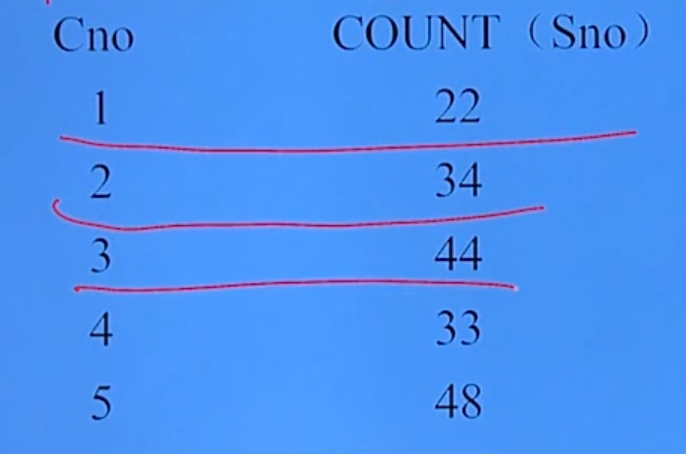

-----

#### HAVING 条件

作用：**在使用 GROUP BY 子句分组后，可以使用 HAVING 短语对分出来的组指定筛选条件**。

> **GROUP BY 后面要想对组的内容设定筛选条件，必须使用HAVING，不可使用WHERE。**
>
> **WHERE 是对整个查询结果设定条件，HAVING 是对分的每个组的内容设定条件。**

【例】查询选修了 3 门课程以上的学生学号。

```mysql
SELECT Sno FROM SC GROUP By Cno HAVING COUNT(*) > 3;
```

过程：

- 首先对SC 表的每个相同的学号进行分组，如 1 学号 为一组。
- 分组后，其每个学号组内包含的就是他选课的记录
- 最后使用 HAVING 对每个学号组设定查询条件，COUNT(*) > 3 ，即每个学号组的选课记录要 > 3 才符合查询条件。

如图：

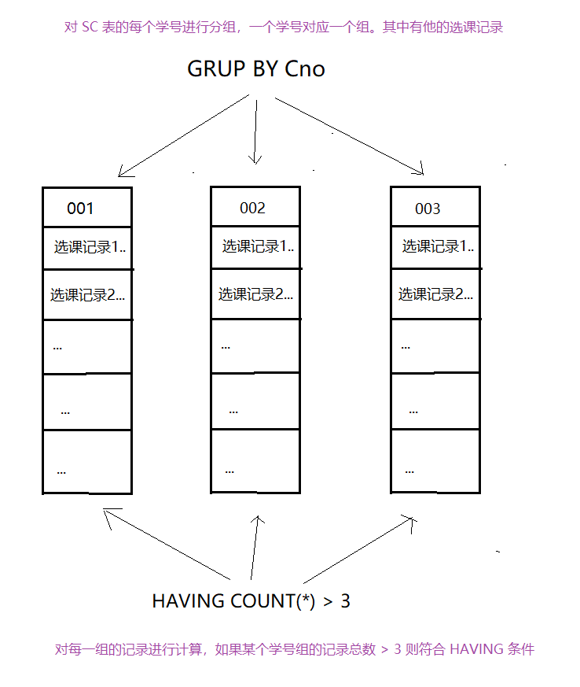

-----

#### HAVING 与 WHERE 的区别

① **作用对象不同**

- **WHERE 子句作用于基表或视图，从中选择满足条件的元组；**

- **HAVING 短语作用于组，从中选择满足条件的元组。**

② **WHERE子句是不能用聚集函数作为条件表达式的**

**【一旦需要使用聚集函数作为查询条件，一定要使用 GROUP BY 进行分组，并使用HAVING 结合聚集函数作为查询条件，筛选出符合条件的结果元组集】**

-----

【例】查询平均成绩 >= 90 的学生学号和成绩。

```mysql
SELECT Sno,AVG(Grade) FROM SC GROUP BY Sno HAVING AVG(Grade) >= 90;
```

-----

### 连接查询

连接查询：**即两个表以上的多表联合查询**。

基于多个表之间的**自然连接【R ⋈ S】**，即**多个表完全相同的列连接在一起，最终形成一个大表**。

【注】**连接查询所连接出来的表是逻辑上的虚拟表，只在查询中有效，一旦查询完毕，则会消失**。

#### 等值与非等值连接查询

连接查询的**WHERE子句中**用来连接两个表的条件称为**连接条件** 或 **连接谓词**。

##### 等值连接

指**两个表之间存在某个列的值完全相等 = ，即主表主键与从表外键之间的联系，可以并成一张大表**。

>  即**等值连接【R ⋈(A = B) S】**

##### 非等值连接

指**满足两个表中某个列之间的 θ 比较条件关系的元组，才可以并成一张大表**。

>  即**一般连接【R ⋈(A θ B) S】**

##### 基本格式

###### ① 格式一

```mysql
[<表名1>.]<列名1> <比较运算符> [<表名2>.]<列名2>;
```

其中 <比较运算符> 有 ： **=、>、<、<=、>=、!=**。

> 【例】 Student.Sno = SC.Sno;

###### ② 格式二

```mysql
[<表名1>.]<列名1> BETWEEN [<表名2>.]<列名2> AND [<表名2>.]<列名3>;
```

> 【例】Student.Sno BETWEEN Sc.Sno AND SC.Cno;

【注意】

① **当连接运算符为 “=” 称为等值连接，其他运算符称为非等值连接**。

② **连接谓词中的列名称为连接字段，并且各连接字段类型、值是可比的，但名字不必是相同的**。

-----

▲ **等值连接：直接输出两个表连接后有关联的所有数据。**

【例】查询每个学生及其选修课程的情况。

```mysql
SELECT Student.*,SC.* FROM Student,SC WHERE Student.Sno = SC.Sno;
```

【查询结果】

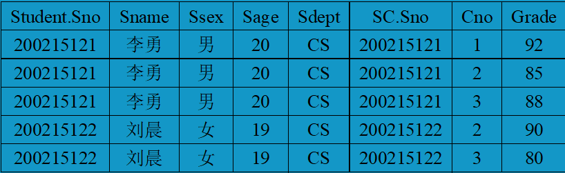

▲ **自然连接：若在等值连接中把目标列中重复的属性列去掉则为等值连接**。

```mysql
SELECT Student.Sno,Sname,Ssex,Sage,Sdept,Cno,Grade FROM Student,SC
WHERE Student.Sno = SC.Cno;
```

【注意】

在以上编码中，由于Cno,Grade不是 Student 表中的，所以不用加上其所属关系 SC。

但是在规范中，应该每个要输出的属性列都加上其所属关系名。

----

#### 嵌套循环法

嵌套循环法(NESTED-LOOP) **是连接操作的一种执行方法**。【**与关系代数中的 ⋈ 连接过程基本一致**】

过程：

a. 首先在表1 找到第一个元组，然后从头开始扫描表2，逐一查找满足条件的元组，如学号对应，找到后就将表1 的第一个元组与该元组拼接起来，形成结果集中第一个元组。

b. 表2全部查找完后，再找表1中第二个元组，然后重复上述操作，直到表1中的全部元组处理完毕。

具体过程如下：

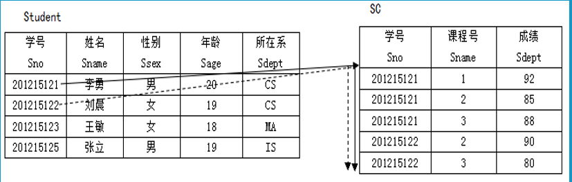

-----

#### 自身连接

【定义】**一个表与其自己进行连接，【两个相同的表进行连接】**。

【说明】

① **需要给每个表起别名加以区分**。

**② 由于所有属性名都是同名属性，因此必须使用起别名前缀。**

【例】查询每一门课的间接先行课（先行课的先行课）

如下表：

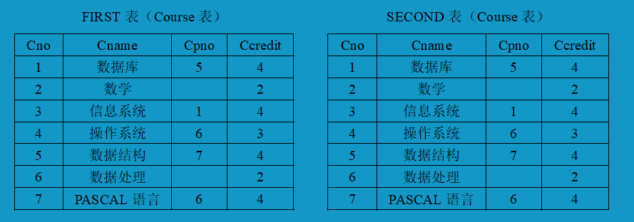

1 号课程【数据库】的先行课是 5 号课程【数据结构】，而 5 号课程的先行课则是7号课程【PASCAL语言】，以此类推...

> 也就是说，必须先学了PASCAL 语言才能学数据结构，之后才能学数据库....
>
> 由此，可以说 PASCAL 语言是数据库的间接先行课【先行课的先行课】。

基于此推理，则需要两个课程表相互之间进行连接。

为 Course 表取两个别名，一个是 `FIRST` ，一个是 `SECOND`，来进行两表之间的操作：

```mysql
SELECT FIRST.Cno ,SECOND.Cpno FROM Course FIRSE,Course SECOND 
WHERE FIRST.Cpno = SECOND.Cno;
```

> 【说明】
>
> 表1 FIRST 负责查找出 Cpno 这一列【课程的先行课】，与表2 SECOND 的Cno【课程号】这一列进行连接，最终就是 表1 【先行课】 = 表2 【课程】的结果。

#### 内连接

```mysql
INNER JOIN R ON R.x = S.x;
```

其实**内连接就等于 普通连接**。

```mysql
SELECT ... FROM WHERE R.x = S.x;
```

普通连接的作用与内连接的作用是一致的。

即<span style="color:red">**只输出满足符合条件的元组记录**</span> ，**其余不符合条件的悬浮元组则不计入结果集**。

#### 外连接

##### 普通连接与外连接的区别：

- 普通连接操作<span style="color:red">**只输出满足符合条件的元组记录**</span> ，**其余不符合条件的悬浮元组则不计入结果集**。

- 外连接操作**以指定表为主体**，<span style="color:red">**将此表中不满足连接条件的悬浮元组也一并输出**</span>，**只不过另外一张表的数据在结果集为 NULL 值**。

> 即 R ⋈ S，R为左表，S 表右表。如果以R表为主体，那么就将R 表中的悬浮元组也一并输出。

##### 普通连接

基本格式：

```mysql
WHERE R.x = S.x;
```

如图所示：

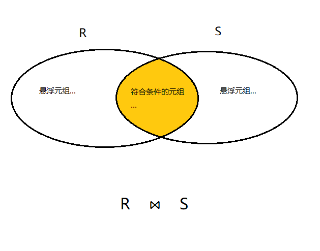

##### 左外连接

作用：**列出左边关系中所有的元组计入结果集中【包括悬浮元组】**

基本格式：

```mysql
SELECT ... FROM R LEFT OUT JOIN S ON (R.x = S.x);
```

如图所示：

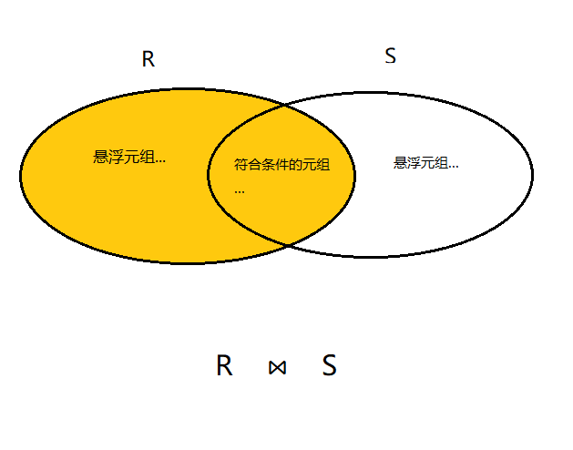

##### 右外连接

作用：**列出左边关系中所有的元组计入结果集中【包括悬浮元组】**

基本格式：

```mysql
SELECT ... FROM S RIGHT OUT JOIN R ON (S.x = R.x);
```

如图所示：

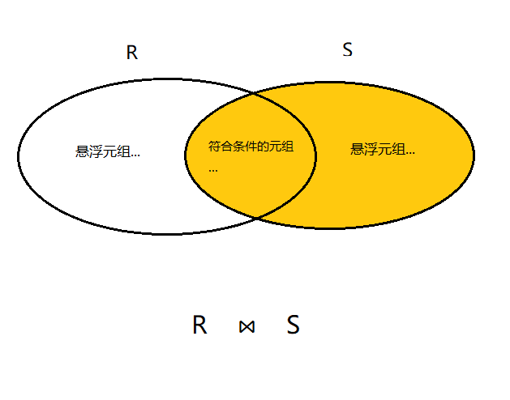

-----

【例】查询每个学生及其选修课程的情况

普通连接：

```mysql
SELECT Student.Sno,Sname,Ssex,Sage,Sdept,Cno,Grade FROM Student,SC
WHERE Student.Sno = SC.Cno;
```

可改为左外连接：

```mysql
SELECT Student.Sno,Sname,Ssex,Sage,Sdept,Cno,Grade FROM Student
LEFT OUT JOIN SC ON (Student.Sno = SC.Sno);
```

【查询结果】：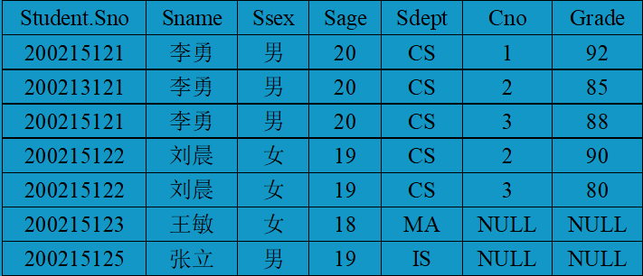

-----

#### 多表连接

【定义】连接操作是**两个以上的表进行连接**。

> 实际操作与两个表的连接是一样的。只不过看多个表之间的关系不同而设定不同的连接条件。

基本格式：

```mysql
SELECT ... FROM R,S,Z WHERE R.x = S.x AND S.x = Z.x;
```

【例】查询每个学生的学号、姓名、选修课程名和成绩。

> 连接 Student 表，Course 表，SC 表。
>
> Student > SC，SC > Course

```mysql
SELECT Student.Sno,Sname,Cname,Grade FROM Student,SC,Course
WHERE Student.Sno = SC.Cno AND SC.Cno = Course.Cno;
```

----

### 嵌套查询

**一个 SELECT-FROM-WHERE 语句称为一个查询块**。

【定义】**是指将一个查询块嵌套在另一个WHERE查询块子句或 HAVING 短语的条件中的查询。**

> 即将**一个查询语句的结果作为另一个查询语句的条件**，其中**被嵌套的查询语句叫做子查询**，**嵌套的查询语句叫做父查询。**

【说明】

① **子查询中不能使用 ORDER BY子句。即不能排序。**

**② 层层嵌套方式反映了 SQL 语言的结构化。**

**③ 有些嵌套语句可以用连接运算代替。**

**④ 外层查询（父查询），内层查询（子查询）**

【说明】

① **不相关子查询：子查询的查询条件不依赖于父查询**。

> 即每个子查询都是各自独立的，只是组合起来能够查询出一定的结果

② **相关子查询：子查询的条件依赖于父查询，整个查询语句称为 嵌套查询**。

-----

#### IN 谓词的子查询

在嵌套查询中，子查询的结果往往是个集合，**用 IN 谓词表示父查询的条件在子查询的结果集中**。

-----

##### 【例题1】

题目：查询与 “刘晨” 在同一个系的学生。

###### 方式一：子查询

① 确定 “刘晨” 所在系。

```mysql
SELECT Sdept FROM  Student WHERE Sname = '刘晨';
```

> 结果为 'CS'

② 根据所在的 CS 系 查出其所有学生。

```mysql
SELECT Sno,Sname,Sdept FROM Student WHERE Sdept = 'CS';
```

③ 将第一步查询结果作为子查询嵌套入第二步查询的条件中。

```mysql
SELECT Sno,Sname,Sdept FROM Student 
WHERE Sdept IN (SELECT Sdept FROM Student WHERE Sname = '刘晨');
-- 相当于 IN ('CS');
```

###### 方式二：自身连接

> 用一条语句实现，不用子查询。

```mysql
SELECT S1.Sno,S1.Sname,S1.Sdept
FROM Student S1,Student S2
WHERE S1.Sdept = S2.Sdept AND S2.Sname = '刘晨';
```

> 用两张相同的表来结合查询，S1表查询出所在系，并与S2表的所在系对接，并查询出 Sname是 ‘刘晨’ 的 所在系的相应记录。

----

##### 【例题2】

题目：查询选修了 “信息系统” 的学生学号和姓名。

> 涉及到 3 张表，即Course 课程表，SC 选修表，Student 学生表。

###### 方式一：子查询

```mysql
SELECT Sno,Sname FROM Student WHERe Sno IN (
    -- ③ 最后在 Student 关系中根据查询出的学号找出对应的学号以及姓名。
    SELECT Sno FROM SC WHERE Cno IN (
        -- ② 然后在 SC 关系中根据 Cno 找出选修了 3 号课程的学生学号
        SELECT Cno FROM Course WHERE Cname = '信息系统'
        -- ① 首先在 Course 关系中查询出 “信息系统” 的课程号，例如 3 号
    )
)
```

###### 方式二：连接查询

```mysql
SELECT Sno,Sname FROM Student,SC,Course 
WHERE Student.Sno = SC.Sno AND SC.Cno = Course.Cno AND Course.Sname = '信息系统';
```

> 直接把 Student,SC,Course  3张表合并成一张大表，在这个大表中找出课程名是 ‘信息系统’的记录即可。

-----

#### 比较运算符的子查询

当能确切知道**子查询返回单值**时，可用比较运算符【<、>、<=...】，而不用IN、

【例】找出每个学生超过他选修课程平均成绩的课程号。

```mysql
SELECT Sno,Cno FROM SC x WHERE Grade >= 
(SELECT AVG(Grade) FROM SC y WHERE x.Cno = y.Cno)
```

> 首先算出每门课程的平均成绩，然后根据成绩比较出符合条件，即超过平均成绩的对应课程号。

#### 带有ANY/SOME & ALL 谓词的子查询

谓词解释：

- **ANY / SOME :  任意一个值【∃】**
- **ALL ：所有值【∀】**

【注】**ANY/SOME、ALL 后面跟的是子查询**

需要配合使用比较运算符：

- **\> ANY / SOME ：大于子查询结果中的某个值。**
- **\> ALL ：大于子查询结果中的所有值。**
- <、<=、>=、=、!= 以此类推 ....

##### 【例题1】

题目：查询非计算机科学系中比计算机科学系**任意一个**学生年龄小的学生姓名和年龄

> 也就是说，在所有系当中，查询不是计算机科学系的学生中，比计算机科学系某一个学生年龄小的学生姓名和年龄。
>
> 假设查询出的计算机科学系 的年龄集为 (19,20,21)，那么非计算机科学系的学生只要小于 其中一个即符合条件，最终打印出符合这个条件的元组。
>
> 步骤：
>
> 首先查询出计算机科学系的所有学生的年龄集，假设构成一个集合 (19,20,21)
>
> > ```mysql
> > SELECT Sage FROM Student WHERE Sdept = 'CS';
> > ```
>
> 然后根据这个年龄结果集，进行存在条件筛选【ANY/SOME】，即小于年龄集中任何一个值即符合条件，并且所在系是非计算机科学系。
>
> > ```mysql
> > SELECT Sname,Sage FROM Student WHERE Sage < ANY (...) AND Sdept <> 'CS';
> > ```
>
> 注： AND Sdept <> 'CS' 是属于父查询的。
>
> ​		Sage  < ANY (...) ：指 Sage 只要小于 (...) 这个结果集中任意一个即符合条件。

```mysql
SELECT Sname,Sage FROM Student
WHERE 
Sage < ANY (SELECT Sage FROM Student WHERE Sdept = 'CS') AND Sdept <> 'CS';
```

也可以使用聚集函数实现上例：

```mysql
SELECT Sname,Sage FROM Student
WHERe Sage < (SELECT MAX(Sage) FROM Student WHERE Sdept ='CS') AND Sdept<>'CS';
```

> 执行步骤与上面的是一样的，只不过条件思路不一样，这里只要把计算机科学系的年龄最大的求出来即可，因为如果非计算机科学系的学生比这个年龄还大的话，那就不符合条件了。  

##### 【例题2】

题目：查询非计算机科学系中比计算机科学系**所有**学生年龄都小的学生姓名和年龄、

> 也就是说，可以先查询出计算机科学系所有学生的年龄
>
> > ```mysql
> > SELECT Sage FROM Student WHERE Sdept = 'CS';
> > ```
>
> 然后再使用 < ALL 代表小于这个结果集中的所有值，即符合条件。
>
> > ```mysql
> > SELECT Sname,Sage FROM Student WHERE Sage < ALL (...) AND Sdept <> 'CS';
> > ```

```mysql
SELECT Sname,Sage FROM Student 
WHERE Sage < ALL (SELECT Sage FROM Student WHERE Sdept = 'CS') AND Sdept<>'CS';
```

也可以使用聚集函数实现上例：

```mysql
SELECT Sname,Sage FROM Student
WHERe Sage < (SELECT MIN(Sage) FROM Student WHERE Sdept ='CS') AND Sdept<>'CS';
```

> 执行步骤与上面的是一样的，只不过条件思路不一样，这里只要把计算机科学系的年龄最小的求出来即可，因为如果非计算机科学系的学生比这个年龄还小的话，那就不符合条件了。  

----

##### 等价转换关系

用聚集函数实现子查询要比直接用 ANY、ALL 效率更高。

ANY、ALL谓词与聚集函数、IN 谓词等的等价转换关系如下表：

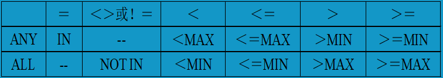

- **当 = ANY 时 ，等价于 IN。**
- **当 < ANY 时，等价于 < MAX()**
- 以此类推...

---

#### EXISTS 谓词

EXISTS 谓词**代表存在量词 ∃**，**带有 EXISTS 谓词的子查询只返回逻辑真值 “true” 和逻辑假值 ’false“**.

存在量词 ∃ 的执行思路：

**首先它会去要查询的关系中拿一条元组，放入存在量词 ∃ 中设定的条件进行比对。如果该元组符合存在量词的条件，则为 真【TRUE】，该条元组计入结果集中，否则为假【FALSE】，不计入结果集中，然后再去关系中寻找下一条，以此类推**。

-----

##### 【例题1】

题目：查询所有选修了 1 号课程的学生学号。

思路分析：

① 本查询涉及到了 Student 关系和 SC 关系。 

② 在 Student 表中依次选取 Sno 值，用此值去检查 SC 关系

③ 若 SC 表中存在与之对应的元组，其 Sno 值等于此 Student.Sno 并且该条记录中的 Cno= ‘1'，则取此 Student.Sname 送入结果关系中。

###### 方式一 连接运算

优点：**编码格式简洁、清晰**。

缺点：**执行效率较低、占用内存空间大**。

>  因为如果一旦要合并的两张表很大，那么合成的大表体量也会很打，这不仅占据了很多内存空间，同时也会为降低执行效率。

```mysql
SELECT Student.Sname FROM Student,SC WHERE Student.Sno = SC.Sno AND SC.Cno ='1'
```

> 【执行过程】
>
> - 首先会将 Student 表 与 SC 表以 Sno 这一相同属性列作为连接属性，**两张表连接成一张大表**
> - 然后根据条件，从这张大表里筛选出 对应的 Cno 属性列 值为 1 的记录并计入到结果集中。

###### 方式二 嵌套查询

优点：**执行效率较高、占用内存空间小**。

> 因为它不生成一张合并的大表，只是在原有两张表的基础上进行匹配查询，几乎不占额外空间。

缺点：**编码格式较难理解**。

```mysql
SELECT Sname FROM Student WHERE EXIXTS 
		(SELECT * FROM SC WHERE Sno = Student.Sno AND Cno = '1');
```

> 【执行过程】
>
> - 首先会拿 Student 表中的第一条记录，带去SC 表中进行查询，对接条件是两者的 Sno 列值要一致。
> - 如果 Sno 值一致对接上了，表明 Student 表中某条记录与 SC 表中有相应的关联记录。
> - 之后再查看对应的 SC 表这个元组上 Cno 这个属性列的值 是否 = 1、
>   - **如果这条元组符合条件，则放入存在量词中**，后返回逻辑真值 “TRUE” ,并计入结果集
>     - 【**存在量词返回 ’true‘ 的条件是非空，即有记录放入存在量词，它就会返回 ’true‘，前提是这条记录符合了条件**】
>   - **若该条元组不符合条件，没有记录放入存在量词**，则返回逻辑假值 “false”，不计入结果集中。

##### 【说明】

（1）使用存在量词 EXISTS 后，若**子查询结果非空**，则外层的 WHERE 子句**返回真值**，否则返回假值。

（2）**由 EXISTS 引出的子查询目标列表都用 *** ，因为带 EXISTS 的子查询只返回真/假，给出列名无实际意义。

> 因为存在量词是将两张**完整的表记录**来进行逐一条件的比对，只有当所有条件都通过，才返回给外层的存在量词中，并由存在量词返回 真值，计入结果集中。

----

#### NOT EXISTS 谓词

NOT EXISTS 谓词**代表 “不存在”，效果与 EXISTS 相反**。

【说明】

- 若内层查询结果**非空**，则外层的 WHERE 子句返回 **假值 ’false‘**。
- 若内层查询结果**为空**，则外层的 WHERE 子句返回 **真值 ’true‘** 。

---

【例题】查询没有选修 1 号课程的学生姓名。

```mysql
SELECT Sname FROM Student WHERE NOT EXISTS
	(SELECT * FROM SC WHERE Sno = Stuent.Sno AND Cno = '1');
```

> 【思路】
>
> NOT EXISTS 表示 “不存在”，即也就是没有返回记录时为真，返回记录为假。
>
> 故 NOT EXISTS 筛选的都是不满足条件的结果集。
>
> 【**将符合条件的元组去掉，其他不符合条件的元组都计入结果集中**】

-----

#### 不同形式的查询转换

① 一些带 EXISTS 或 NOT EXISTS 谓词的子查询**不能被其他形式的子查询等价替换**。

② 所有带 IN 谓词、比较运算符、ANY 或 ALL 谓词的子查询**可以被带 EXISTS 谓词的子查询等价替换**。

【例】查询与 “刘晨” 在同一个系学习的学生。

用带 EXISTS 谓词的子查询替换。

```mysql
SELECT Sno,Sname,Sdept
FROM Student S1
WHERE EXISTS 
	(SELECT * FROM Student S2 WHERE S2.Sdept = S1.Sdept AND S2.Sname = '刘晨');
```

> 【执行过程】
>
> - 首先为同一张 Student 表设定了两个 别名 S1，S2，这两个别名在数据库中指向同一张 Student 表
>
> - 之后首先取 S1 表中的学号与 S2 表中的学号进行对比，如果成立，则查看第二个条件、   【其实是自己与自己对比，也就是同一张表拿出同一条记录中的学号以及姓名进行对比，如果一条记录中有 刘晨，则视为这个是同一个系。否则不是。】
>
>   - > 这里的 S2.Sdept = S1.Sdept 其实等于 S2.Sdept= ‘CS’
>
> - 并且看这条记录是否有 “刘晨”，如果有，则返回真，否则返回假。

----

#### 用 EXISTS / NOT EXISTS 实现全称量词

SQL 语言中并没有 全称量词 ∀。

**可以把带有全称量词的谓词转行为等价的带有存在量词的谓词 ∃**。

定义为：
$$
(∀x) P = ﹁(∃x(﹁P))
$$
【解释】

假设 P 是一个条件【即元组集合】，当对 P 元组取反，那就等于 x ，再此进行取反 = P。

【例】查询选修了全部课程的学生姓名。

> 等价于：没有一门课是他选修的。

```mysql
SELECT Sname FROM Student
WHERE NOT EXISTS 
	(SELECT * FROM Course WHERE NOT EXISTS 
    	(SELECT * FROM SC WHERE SC.Sno = Student.Sno AND Sc.Cno = Course.Cno)
    )
```

> 【执行过程】
>
> 这个题设计到了 3 张表，Student 表、Course 表、SC 表。
>
> - 首先将 Student 的第一条元组带入到 SC 表当中比对，如果学号对应，则代表该学生有选课。
> - 然后再进行比对该学生在 SC 表当中的选课记录。
>   - 将 该学生的选课记录上的 Cno 列 再带入到 Course 表中与其 Cno 列进行比对，如果有，则代表选了一次课程，并借着扫描下一组，直到将 Course 现有的课程号全部比对完了之后。
>   - 返回给上一层，由于上一层设定的是 NOT EXISTS 【不存在】，所以该条记录会被返回为 false 假值，然后接着再返回到顶层，再接着被 NOT EXISTS 取反，最终得到一个真值 true。最终把这条为真的记录计入结果集中【**两次取反得真值**】。

----

#### 用 EXISTS / NOTEXISTS 实现逻辑蕴涵

蕴涵：**指 P 能推理出 Q，Q 是 P 的充分条件，但是 Q 无法反推出 P**。

> 例如：我来过北京，能推理出我来过中国，但是我来过中国不能推理出我来过北京。

SQL 语言中没有蕴涵逻辑运算，可以利用谓词演算将逻辑蕴涵等价转换为：
$$
p→q = ﹁p∨q
$$
【解释】p 与 q 的蕴涵逻辑 = p 这个条件取反，并上 q 这个推理出的条件。

【例】查询至少选修了 学生 201215122 选修的全部课程的学生学号。

> 等价于：不存在这样的课程 y，学生 201215122 选修了 y ，而学生 x 没有选

```mysql
SELECT DISTINCT Sno FROM SC SCX
WHERE NOT EXISTS
	(SELECT * FROM SC SCY WHERE SCY.Sno = '201215122' AND NOT EXISTS 
     	(SELECT * FROM SC SCZ WHERE SCZ.Sno = SCX.Sno AND SCZ.Cno = SCX.Cno)
    )
```

> 【执行过程】
>
> - 首先分为定义 3 个相同的 SC 表的别名，SCX、SCY、SCZ、都指向同一个 SC 表。
> - 首先 拿 SCX 表的第一条记录与 SCZ 中的学号进行比对【自己与自己学号的比对】，如果比对成功，有该记录，则再比对 Cno 课程号这一列，看是否选了全部的课程，即会将该学生在 SC 表的记录一一扫描，如果比对到最后，该学生选了全部的课程，则返回给上一层被 NOT EXISTS 取反，并上  SCY.Sno = '201215122'，也就是说 201215122 这个学生选了全部课程，该学生也选了，但是设定为假值，用于抛给上一层又一次取反为真，最终该学生结果为真，即也与 201215122 一样选修了他选修的全部课程。

----

### 集合查询

集合查询是指**对多个查询语句返回的结果集合进行操作**。

集合操作的种类：**并操作、交操作、差操作**。

- **并操作**：顾名思义，是**将两个查询语句得出的结果集并在一起**。

> 如：(1,2,3) 并 (4,5,6)  = (1,2,3,4,5,6)

- **交操作**：**对两个查询语句得出的结果，筛选出两者共有的子集**。

> 如：(1,2,3,4) 交 (4,5,6,7) ，= (4) ，4 是两个集合共有的子集。

- **差操作**：**对两个查询语句得出的结果，筛选出在 R 结果集，不在 S 结果集的子集。**

> 如：R 结果集：(1,2,3,4) ，S 结果集：（3,4,5） 。
>
> 对它们执行差操作，得出 （1,2），即 (1,2,3) - (3,4,5) = (1,2)。

---

#### 并操作 UNION

**UNION：将多个查询结果合并起来，系统自动去除重复元组。**

**UNION  ALL：将多个查询结果合并起来，保留重复元组。**

格式：

```mysql
<查询语句1>  UNION | UNION ALL  <查询语句2>;
```

【例】查询计算机科学系的学生及年龄不超过19岁的学生

方式一：并操作

```mysql
SELECT * FROM Student WHERE Sdept = 'CS'
UNION 
SELECT * FROM Student WHERE Sage <= 19;
```

方式二：

```mysql
SELECT DISTINCT * FROM Student WHERE Sdept = 'CS' OR Sage <= 19;
```

> **UNION 等价于 OR 条件**。

----

#### 交操作 INTERSECT

> **交操作 INTERSECT 等价于 AND 条件**。

【例】查询计算机科学系的学生与年龄小于 19 岁的学生的交集。

方式一：交操作

```mysql
SELECT * FROM Student WHERE Sdept = 'CS'
INTERSECT
SELECT * FROM Student WHERE Sage <= 19;
```

方式二：AND

```mysql
SELECT * FROM Student WHERE Sdept = 'CS' AND Sage <= 19;
```

----

【例】查询选修课程 1 的学生集合与选修课程2的学生集合的交集。

> 也就是说既选修了 1 号课程，又选修了 2 号课程。

方式一：交操作

```mysql
SELECT Sno FROM SC WHERE Cno = '1'
INTERSECT
SELECT Sno FROM SC WHERE Cno = '2';
```

> 【说明】
>
> 假设第一句查询语句的结果是 (1,2,5)
>
> 第二句查询结果为 (1,2,6,8)
>
> 那么两者的交集就是 1、2，也就是1、2号学生既选修了 1 号，也选修了 2 号课程。

方式二：IN 谓词 子查询

```mysql
SELECT Sno FROM SC 
WHERE Cno = '1' AND Sno IN (SELECT Sno FROM SC WHERE Cno = '2');
```

> 先查询出选了 2 号课程的学号，然后再返回给父查询，父查询查询出 选修了1 号课程的学号，并上选修了2 号课程的学号。

----

#### 查操作 EXCEPT

【例】查询计算机科学系的学生与年龄不大于 19 岁的学生的差集。

> 即是计算机科学系的学生，但是年龄大于 19岁【不在小于 19 岁的集合中】。

方式一：差操作

```mysql
SELECT * FROM Student WHERE Sdept = 'CS'
EXCEPT
SELECT * FROM Student WHERE Sage <= 19;
```

> 假设第一句查询结果为 （1,2,3,4）即计算机科学系的学生
>
> 第二句查询结果为 (1,3,5,4) 即 年龄小于 19 岁的学生
>
> (1,2,3,4)  - (1,3,5,4) = (2) ，2 号学生是计算机科学系，且大于 19岁
>
> 即在 R 表不在S表。

【说明】**参加集合操作的各查询结果的列数必须相同，查询结果的数据类型也必须相同**。

> 也就是说查询语句 1 与查询语句2 可以说是同一张表，同时两者查出来的结果也必须是同一个类型的值。

方式二：

```mysql
SELECT * FROM Student WHERE Sdept = 'CS' AND Sage > 19;
```

----

### 基于派生表的查询

子查询不仅可以出现在 WHERE 子句中，还可以出现在 FROM 子句中，**FROM 子句后面可以设定一个由子查询查出来的结果表，称为 临时派生表**，这时子查询生成的临时派生表**成为主查询的查询对象**。

格式：

```mysql
SELECT ... FROM (查询语句..) AS <派生表名>(字段1，字段2)...;
```

> - **FROM 后面设定的 (查询语句..) 会返回一个查询结果表，它是一个临时派生表**。
>   - 即新建了一个**虚拟的表**，不是物理存在的，**查询一旦结束，此表消失**、
> - **通过 AS 将此表起个名字，这样就可以通过 AS  起的别名，在后面进行操作使用**。
>   - 如果派生表的子查询中，**SELECT 后有聚集函数运算的字段，那么就必须为其列命名**、
>   - 若**没有聚集函数，派生表可以不指定属性列的命名**。
>     - **子查询 SELECT 子句后面的列名为其默认属性**。
> - 【注意】通过FROM 子句**生成派生表时**，**AS 关键字可以省略**，但**必须为派生关系指定一个别名**。而对于基本表，别名是可选项。

----

【例】找出每个学生超过他自己选修课程平均成绩的课程号。

```mysql
SELECT Sno,Cno FROM SC,
	(SELECT Sno,AVG(Grade) FROM SC GROUP BY Sno) AS Avg_sc(avg_sno,avg_grade)
WHERE SC.Sno = Avg_sc.avg_sno AND SC.Grade >= Avg_sc.avg_grade;
```

> 【执行过程】
>
> - 首先在 SC 表中按学号进行分组，找出每个学生的选修课程的平均成绩，并最终形成一个临时派生表，为其取个别名 Avg_sc ，并相应的为其结果集的字段命名
> - 然后将此派生表的 Sno  与 SC 选修表的 Sno 进行连接成一张大表
> - 也就是学号-平均成绩 与 选修记录进行拼接，然后从每条记录中找，如果 属于 SC 的Grade 列 的值 >= 属于 Avg_sc 表的 avg_grade ，则代表这个学生的这门选课成绩大于这门课程的平均成绩，即符合条件计入结果集中。

----

【例】查询所有选修了 1 号课程的学生姓名。

```mysql
SELECT Sname FROM Student,(SELECT Sno FROM SC WHERE Cno = '1') AS SC1
WHERE Student.Sno = SC1.Sno;
```

> 首先查询出所有选修了 1 号课程的学号，然后与 Student 表对接，最后输出结果集。

----

## 数据更新

### 插入操作

#### 插入元组

##### 基本格式

```mysql
INSERT INTO <表名> [(<属性列1>,<属性列2>)...] VALUES (<常量1>,<常量2>....);
```

功能：**将新元组插入指定表中**。

【说明】

- [(<属性列1>,<属性列2>)...] ：
  - 可有可无，**当要对表中的指定列插入数据**，**则在表名后定义要指定插入的列的列名** (xx,xx) 
    - 最后，再相应的插入数据即可。
- INTO 子句：**属性列的顺序可与表中的顺序不一致，没有指定属性列的默认插入全部**。
  - 如果指定了属性列，则可以自行定义属性列插入的顺序
  - 如果没有指定属性列，则默认插入的顺序与表中字段定义的顺序一一对应。
- VALUES 子句：**提供的值必须与 INTO 子句匹配，值与属性列的个数和值的类型要一致**。
- 如果表中属性列**未定义 NOT NULL 非空约束**，在插入新元组时，**未对此列插入新值**，则RDBMS 将**自动赋予此新列 NULL 空值**。

----

【例】将一个新学生元组（学号：201215122；姓名：陈东；性别：男；所在系：IS；年龄：18岁）插入到 Student 表中。

方式一：

```mysql
INSERT INTO Student (Sno,Sname,Ssex,Sdept,Sage) VALUES('201215122','陈东','男','IS',18);
```

方式二：

```mysql
INSERT INTO Student VALUES('201215122','陈东','男','IS',18);
```

---

【例】插入一条选课记录（‘201215121’，‘1’）

```mysql
INSERT INTO SC (Sno,Cno) VALUES('201215121','1');
```

RDBMS 将在新插入记录的 Grade 列上赋予空值。

```mysql
INSERT INTO SC VALUES ('201215121','1',NULL);
```

----

#### 插入子查询结果

当有不确定具体的数据，往往是通过查询之后所得出的结果，通常这种由查询得出的结果用于插入时，使用子查询来完成。

##### 基本格式

```mysql
INSERT INTO <表名> [(<属性列1>,<属性列2>...)] <子查询>;
```

功能：**将子查询结果插入指定表中**。

【说明】

- **SELECT 子句输出目标列必须与 INTO 子句匹配，值的个数、数据类型要一致**。

---

【例】对每一个系，求学生的平均年龄，并把结果存入数据库中。

建立表 Dept_age

```mysql
CREATE TABLE Dept_age
(
	Sdept CHAR(20),
    Avg_age SMALLINT
);
```

将查询出结果存入此表中：

```mysql
INSERT INTO Dept_age (Sdept,Avg_acg) 
SELECT Sdept,AVG(Sage) FROM Student GROUP BY Sdept;
```

> 将子查询的具有两列的结果集 Sdept,AVG(Sage) 插入到 Dept_age 这个表中。

---

### 修改操作

特性：**对已有的数据进行修改操作**。

#### 基本格式

```mysql
UPDATE <表名> SET <列名> = <新值>,... [WHERE <条件>];
```

功能：**修改指定表中满足WHERE 条件的元组**。

【说明】

① **SET 子句：指定修改方式、修改的列、修改后的值**。

② **WHERE 子句：指定要修改的元组、缺省【默认】代表修改所有元组**。

③ **在执行修改语句时会检查修改操作是否会破坏表中已有的完整性规则**。

> 包括参照完整性【主从表联系】、用户自定义完整性【约束等】、实体完整性【数据类型等】。

---

#### 修改一个元组

【例】将学生 201215121 的年龄改为 22 岁。

```mysql
UPDATE Student SET Sage = 22 WHERE Sno = '20215121';
```

#### 修改多个元组

【例】把所有学生的年龄增加 1 岁。

```mysql
UPDATE Student SET Sage = Sage + 1;
```

#### 带子查询的修改

定义：**在 WHERE 子句中根据子查询的结果对元组进行修改操作**。

【例】将计算机科学系全体学生的成绩置零。

```mysql
UPDATE SC SET Grade = 0 WHERE Sno IN 
		(SELECT Sno FROM Student WHERE Sdept = 'CS');
```

> 将所有计算机系的学生的学号查询出来，然后将这些学生的成绩 = 0。

---

### 删除操作

特性：**将已有的数据删除**。

#### 基本格式

```mysql
DELETE FROM <表名> [WHERE <条件>];
```

功能：**删除指定表中满足 WHERE 条件的元组**。

【注意】**删除记录时，系统会检查删除操作是否会破坏完整性规则**。

【说明】

WHERE 子句：**指定要删除的元组，缺省【默认】要删除表中的全部元组，表中的定义仍在**。

> 即不设定 WHERE 条件，代表删除整个表的所有数据。

#### 删除某一元组

【例】删除学号为 201215121 的学生记录

```mysql
DELETE FROM Student WHERE Sno = '201215121';
```

#### 删除多个元组

【例】删除所有学生的选课记录

```mysql
DELETE FROM SC;
```

---

#### 带子查询的删除

定义：**在 WHERE 子句中根据子查询的结果删除指定的元组**。

【例】删除计算机科学系所由学生的选课记录

```mysql
DELETE FROM SC WHERE Sno IN (SELECT Sno FROM Student WHERE Sdept 'CS');
```

> 将所有计算机系的学生的学号查询出来，然后删除这些学生 在 SC 表的选课记录 。

---

### 空值的处理

NULL 空值**表示不存在、无意义的值**。

空值的存在是因为取值有不确定性，对关系运算带来特殊的问题，所以需要做特殊的处理。

SQL 语言中允许某些元组的某些属性取空值，一般有以下 3 种情况：

① **该属性会有值，但当前还不知道它的具体值**。

② **该属性不应该有值**。

③ **由于某种原因不便于填写**。

#### 空值的产生

【例】向 SC 表插入一个元组，学号：201215122，课程号：1，成绩为空。

```mysql
INSERT INTO SC (Sno,Cno,Grade) VALUES('201215122','1',NULL);
```

```mysql
INSERT INTO SC (Sno,Cno) VALUES('201215122','1');
```

> 这种方式系统会自动赋予空值。

#### 空值的判断

**判断一个属性的值是否为空值，用 IS NULL 和 IS NOT NULL 来表示**。

【例】从 Student 表中找出漏填了数据的学生

```mysql
SELECT * FROM Student WHERE Sname IS NULL OR Sage IS NULL OR Sdept IS NULL;
```

#### 空值的约束条件

以下 3 种情况，属性都不能取空值：

① **属性定义（或域定义）中有 NOT NULL 约束条件**的不能取空值。

② **加了 UNIQUE 限制的属性**不能取空值

③ **码属性**不能取空值

#### 空值算术运算

算术运算：**如果空值与另一个值（包括另一个空值）进行算术运算，结果仍为空值**。

> 即 NULL + 1 = NULL

#### 空值比较运算

比较运算：**如果空值与另一个值（包括另一个空值）进行比较运算，结果为 UNKNOWN**。

> 即 NULL > 19 = UNKNOWN

#### 空值逻辑运算	

逻辑运算规则如下表：


- T ：表示 TRUE。逻辑真值。
- F ：表示 FALSE。逻辑假值。
- U ：表示 UNKNOWN。逻辑未知值。

> 【解读】
>
> 第一行：当 X 为 T、Y 为 T，则 X 、Y 的 AND 运算为 T，OR 运算为 T，对 X 取反为 F。
>
> 第二行：当 X 为 T，Y 为 U，则 X、Y 的 AND 运算为 U，OR 运算为 T，对 X  取反仍为 U。
>
> > 即两个值其中一个为 U，AND 为 U，OR 为 T，**U 取反还是 U**。
>
> 以此类推....

【例】找出选修 1 号课程的不及格的学生以及学考的学生。

方式一：

```mysql
SELECT Sno FROM SC WHERE Grade < 60 AND Cno = '1'
UNION
SELECT Sno FROM SC WHERE Grade IS NULL;
```

方式二：

```mysql
SELECT Sno FROM Student WHERE Cno = '1' AND (Grde < 60 OR Grade IS NULL);
```

----

## 视图 VIEW

### 特点

① **视图是虚表，是从一个或多个基本表（或视图）导出来的结果集**。

② **数据库只存放视图的定义结构，不存放视图对应的数据**。

> 视图的数据在基本表中，只要一执行视图，就会按照视图的定义查询一个或多个基本表的某些数据组合的结果集。

③ **原表中的数据发生变化，视图中查询的结果也会随之变化**。

### 定义视图

#### 基本格式

```mysql
CREATE VIEW <视图名> [(<列名1>,<列名2>)] AS <子查询> [WITH CHECK OPTION];
```

- **WITH CHECK OPTION 【受限更新】：**
  - **当想要对已定义的视图进行更新操作时，基于视图定义时给定的条件来进行更新操作**。

【说明】

① **组成视图的属性列名：全部省略或全部指定**。

② **子查询中不允许有 ORDER BY 子句 和 DISTINCT 短语**。

> ORDER  BY 和 DISTINCT 语句都是对实际的物理表进行操作的。

③ **RDBMS 执行 CREATE VIEW 语句时，只是把视图定义存入到数据库中，并不执行其中的语句**。

④ **在对视图查询时，实际上是按视图的定义从基本表中将数据查出**。

【例】建立信息系学生的视图

```mysql
CREATE VIEW IS_Student AS SELECT * FROM Student WHERE Sdept = 'IS';
```

【例】建立信息系学生的视图，并要求进行修改和插入操作时，仍需保证该视图只有信息系的学生。

```mysql
CREATE VIEW IS_Student (Sno,Sname,Sage) AS SELECT Sno,Sname,Sage FROM Student WHERE Sdept = 'IS' WITH CHECK OPTION;
```

上例中因为加入了 “WITH CHECK OPTION” ，所有 DBMS 对 IS_Student 视图的更新操作：

▲ 修改、删除操作：自动加上 Sdept = ‘IS’ 条件。

▲ 插入操作：自动检查 Sdept 属性值是否为 ‘IS’ ，如果不是则拒绝该插入操作，如果没有提供 Sdept 属性值，则自动定义 Sdept 为 ‘IS’ 。

----

#### 基于视图的视图

> 即**视图查询的对象表是一个已建立的视图**

【例】建立信息系选修了 1 号课程且成绩在 90 分以上的学生的视图。

```mysql
CREATE VIEW IS_S2 AS SELECT Sno,Sname,Grade FROM IS_S1 WHERE Grade >= 90;
```

> IS_S1 是一个已建立的视图。

----

#### 带表达式的视图

【例】定义一个反映学生出生年份的视图。

```mysql
CREATE VIEW BT_S (Sno,Sname,Sbirth) AS SELECT Sno,Sname,2004-Sage FROM Student;
```

---

#### 分组视图

【例】将学生的学号及他的平均成绩定义为一个视图。

假设 SC 表中 “成绩”  列 Grade为数字型

```mysql
CREATE VIEW S_G (Sno,Gavg) AS SELECT Sno,AVG(Sage) FROM SC GROUp BY Sno;
```

----

#### 不指定属性列

> 即**视图所持有的属性列名，与基本表的属性列名不一致**。

【例】将 Student 表中所有女生记录定义为一个视图。

```MYSQL
CREATE VIEW F_Student (F_Sno,name,sex,age,dept) AS
SELECT * FROM Student WHERE Ssex = '女';
```

【注意】本例中，修改基本表 Student 的属性列结构后，Student 表与 F_Student 视图的映像关系则会被破坏，则会导致该视图不能工作。

----

### 删除视图

#### 基本格式

```mysql
DROP VIEW <视图名> [CASCADE];
```

【说明】

① **该语句会从数据字典中删除指定的视图定义**。

② **如果该视图上还导出了其他视图，使用 CASCADE 级联删除语句，则会把该视图和由它导出的所有视图一并删除**。

③ **删除基本表时，由该基本表导出的所有视图定义必须显式地使用 DROP VIEW 语句删除**。

> 即在删除基本表后，系统不会删除与之关联的视图，必须我们自己手动删除这些视图定义。

【例】

（1） 删除没有关联的视图 BT_S：

```mysql
DROP VIEW BT_S;
```

（2） 删除有关联的视图 IS_S1：

```mysql
DROP VIEW IS_S1 CASCADE;
```

---

### 查询视图

视图定义后，用户就可以像基本表一样对视图进行查询了。

#### 视图消解法

视图消解法——RDBMS 实现视图查询的方法。

第一步：**进行有效性检查**

> 先检查视图的有效性，是否还可用，即使用 SELECT 语句执行视图。

第二步：**转换成等价的对基本表的查询**

> 将视图的查询转换成基本表的查询。
>
> 即**将视图AS 后面的子查询语句，作为对基本表的查询语句的主查询**。
>
> 也就是，例如 CREATE VIEW ISs AS SELECT * FROM Student WHERE Sdept = 'IS';
>
> SELECT * FROM Student WHERE Sdept = 'IS'; 就是 视图 ISs 的查询结构，
>
> 转换为基本表查询：SELECT * FROM Student  WHERE Sdept = 'IS';
>
> 同时，**视图的条件也会相应的转换到 基本表时的WHERE 子句中**。
>
> 换句话说，其实就是把**视图映射的查询语句给挑出来即可**。

第三步：**执行修正后的查询**

----

信息系学生的视图：

```mysql
CREATE VIEW IS_Student AS SELECT * FROM Student WHERE Sdept = 'IS';
```

【例】在信息系学生的视图中找出年龄小于 20 岁的学生。

基于视图的查询：

```mysql
SELECT Sno,Sage FROM IS_Student WHERE Sage < 20;
```

用视图消解法转换后的查询语句：

```mysql
SELECT Sno,Sage FROM Student WHERE Sdept = 'IS' AND Sage < 20;
```

> 即：把 IS_Student 视图对应的查询语句 SELECT * FROM Student WHERE Sdept = 'IS'
>
> 转换为基本表查询，再加上题目的条件。

---

【例】查询选修了 1 号课程的信息系学生。

```mysql
SELECT IS_Student.Sno,Sname FROM IS_Student,SC WHERE SC.Sno = IS_Student.Sno AND SC.Cno = '1';
```

----

##### 局限性

视图消解法在有些情况下，视图消解法不能生成正确查询。

【例】在 S_G 视图中查询平均成绩在 90 分以上的学生学号和平均成绩。

S_G 视图：

```mysql
CREATE VIEW S_G (Sno,Gavg) AS SELECT Sno,AVG(Sage) FROM SC GROUp BY Sno;
```

基于视图的查询：

```mysql
SELECT * FROM S_G WHERE Gavg >= 90;
```

S_G 的子查询如下：

```mysql
SELECT Sno,AVG(Sage) FROM SC GROUp BY Sno;
```

结合后形成下列查询语句：

```mysql
SELECT Sno,AVG(Sage) FROM SC WHERE AVG(Sage) >= 90 GROUP BY Sno;
```

>  从以上转换后的查询语句可以看出，这是一个错误的转换，题目给定的条件是 平均成绩 >= 90，**按照视图消解法惯例**，**视图的条件会转换到 WHERE 子句中**。
>
>  那就是 AVG(Sage) >= 90，但是聚集函数不能作为 WHERE 子句的查询条件，所以这种情况，视图消解法不能正确地转换相应的查询语句。

正确的转换应该是：

```mysql
SELECT Sno,AVG(Sage) FROM SC GROUP BY Sno HAVING AVG(Sage) >= 90;
```

> 以每个学号来分组，对每个学生的成绩进行平均成绩的求值，再设定比较条件 >= 90 。

----

### 更新视图

更新视图是指通过视图来实现插入、删除、和修改数据操作，**因为视图不适宜存储数据，因此对视图的更新操作将通过视图消解，转换为对实际表的更新操作**。

【注意】**为防止在更新视图时出错，定义视图时要加上 WITH CHECK OPTION 子句**。

----

IS_Student 视图的建立：

```mysql
CREATE VIEW IS_Student AS SELECT * FROM Student WHERE Sdept = 'IS' WITH CHECK OPTION;
```

#### 修改

【例】将信息系学生视图 IS_Student 中学号 201215122 的学生姓名改为 “刘晨“。

基于视图的执行：

```mysql
UPDATE IS_Student SET Sname = '刘晨' WHERE Sno = '201215122';
```

> 因为 IS_Student 就是基于 Sdept = ‘IS’ 条件所建立的结果集，所以不需要再增加此条件了。

视图消解转化后的语句：

```mysql
UPDATE Student SET Sname = '刘晨' WHERE Sno = '201215122' AND Sdept = 'IS';
```

----

#### 插入

【例】向信息系学生视图中插入一个新的学生记录：201215129，赵信，20岁。

基于视图的执行：

```mysql
INSERT INTO IS_Student VALUES ('201215129','赵信','20');
```

> 因为 IS_Student 就是基于 Sdept = ‘IS’ 条件所建立的结果集。
>
> 所以相当于就是在为信息系学生记录插入新元组。

视图消解转化后的语句：

```mysql
INSERT INTo IS_Student (Sno,Sname,Sage,Sdept) VALUES('201215129','赵信','20','IS');
```

> **基本表的查询面对的是整个原表的记录，所以必须重新设定条件。**
>
> **而视图面对的是已经通过一定条件从原表中查询出的结果集，所以直接插入新值即可。**

---

#### 删除

【例】删除信息系学生视图 IS_Student 中学号为 200215129 的记录

基于视图的执行：

```mysql
DELETE FROM IS_Student WHERE Sno = '200215129';
```

视图消解转化后的语句：

```mysql
DELETE FROM Student WHERE Sno = '200215129' AND Sdept = 'IS';
```

---

#### 局限性

更新视图的限制：

**一些视图是不可更新的，因为对这些视图的更新不能有意义地转换为相应基本表的更新**。

【例】对视图 S_G 中学号 201215121 学生的平均成绩改为 90分。

视图 S_G 的建立：

```mysql
CREATE VIEW S_G (Sno,Gavg) AS SELECT Sno,AVG(Grade) FROM SC GROUP BY Sno;
```

基于视图 S_G 的更新：【不能更新】

```mysql
UPDATE S_G SET Gavg = 90 WHERE Sno = '201215121';
```

> 这条语句在逻辑上看上去是没错的，但实际上是不能更新的。
>
> 因为在视图 S_G 中的平均成绩 Gavg 是基于原表的每科成绩的数据计算出来的，在原表上压根没有平均成绩这一列，同时，系统也没法对原表中通过修改每科成绩来达到平均成绩，使其达到 90 分，所以这条语句实际上是不能作用到原表上的。

----

### 视图的作用

核心概念：**视图是一张虚表，它的实际数据是来源于原表的。**

① <span style="color:red">**视图可以简化用户的操作**</span>

> 一次建立，多次使用。

② <span style="color:red">**视图使用户能以多种角度看待同一种数据**</span>

> 一个数据可以应用在不同的场景中。

③  <span style="color:red">**视图对于重构数据库提供了一定程度的逻辑独立性**</span>

> 视图是基于原表数据产生的，若原表数据发生变化，视图也会随之发生变化。

④   <span style="color:red">**视图能对机密数据提供安全保护**</span>

> 即**用户只能查看某个表上的视图数据，不能直接查看原表**。
>
> 例如：学生的信息中有学生的身份证号，当老师想要查看某个学生的信息时，由于身份证号以及其他学生的隐私信息没有必要或不允许给老师查看，那么就可以基于学生表建立一个视图，该视图上只展示了老师能够看的信息，同时给予老师这个视图的查看权限， 但是老师不能直接查看原表的数据。

⑤ <span style="color:red">**适当的利用视图可以更清晰的表达查询**</span>

> 经过一定条件建立的视图，在其他应用场景中，不需要设定额外的条件来执行查询。
>
> 也可以说是**简化查询语句的条件结构**。

---