# 数据库安全性

问题的提出：

- 数据库的一大特点是**数据可以共享**
- 数据共享必然带来数据库的安全性问题，
- 数据库系统中的数据库不是无条件共享的。

## 介绍

数据库的安全性是指 <span style="color:red">**保护数据库以防止被不合法使用所造成的的数据泄露、更改或破坏**。</span>

**系统安全保护措施是否有效是数据库系统主要的性能指标之一**。

> 保护措施以**策略、技术手段**两个方面来伸展。
>
> 策略：给每个用户提供不同的权限，防止用于随意更改数据。
>
> 技术手段：
>
> - 给数据加密
> - 审计日志

## 安全性概述

### 数据库的不安全因素

#### 1、<span style="color:red">**非授权用户对数据库的恶意存取和破坏**</span>

> 一些黑客和犯罪分子在用户存取数据库时猎取用户名和用户口令、然后假冒合法用户偷取、修改甚至破坏用户数据。

数据库管理系统提供的安全措施是**用户身份鉴别、存取控制**和**视图**等技术。

> 存取控制：给定用户权限，只有有权限的用户才能访问某些数据，并对其操作。

#### 2、<span style="color:red">数据库中重要或敏感的数据被泄漏</span>

数据库管理系统提供的主要技术有**强制存取控制、数据加密存储、加密传输**等。

> 强制存取控制：给某些重要机密数据贴上标签，例如“保密” ，只有特定的用户才能访问这些保密数据。
>
> 加密传输-手段：
>
> > 数据摘要：指的是在传输数据的同时，将部分重要的数据抽取出来，与其他不太重要的数据以一定的数学公式加密成其他不相关的内容，只要该数据段某一个地方被修改，相应的重要的数据部分也会被修改，之后当发送给接收方的时候，只要接收方通过函数翻译出来发现数据不对就可以知道这个数据被中途截取下来修改过。

安全要求较高的系统会提供**审计日志分析**。对潜在的威胁提前采取措施加以防范。

> 审计日志分析：
>
> 优点：对某个用户从登录、直到操作结束的这一整个过程，所做的每一件事都记录下来。
>
> 缺点：
>
> - 占据空间大
>   - 每条记录都会存在表中，这就意味着会单独占据一个比较大的空间
>
> - 损耗一定的CPU 资源
>   - 用户每次做出操作，都需要进行记录，这就会导致CPU 频繁的操作日志记录。
>
> - 增加人力成本
>   - 专门为日志分配一名审计人员来检查日志

#### 3、<span style="color:red">安全环境的脆弱性</span>

数据库的安全性与计算机系统的安全性紧密联系。

主要包括**计算机硬件、操作系统、网络系统**等的安全性。

为此，在计算机安全方面需要建立一套可信的计算机系统安全性的概念和标准。

> 即达到了某个标准，这个计算机系统才算是安全的。

---

### 安全标准

#### 发展历史

① TCSEC是指1985年美国国防部正式颁布的《可信计算机系统评估准则》（简称 TCSEC）。 

在TCSEC推出后的十年里，不同国家都开始开发建立在TCSEC概念上的评估准则，如欧洲 

的信息技术安全评估准则（ITSEC）、加拿大的可信计算机产品评估准则（CTCPEC）、美国的 

信息技术安全联邦标准（FC）草案等。 

② CTCPEC、FC、TCSEC和ITSEC的发起组织于l993年起开始联合行动，解决原标准中概 念和技术上的

差异，将各自独立的准则集合成一组单一的、能被广泛使用的IT安全准则，这一行动被称为CC项目。CC 

V2.1版于1999年被ISO采用为国际标准，2001年被我国采用为国家标准。

目前CC已经基本取代了TCSEC，成为评估信息产品安全性的主要标准。 

如图所示：

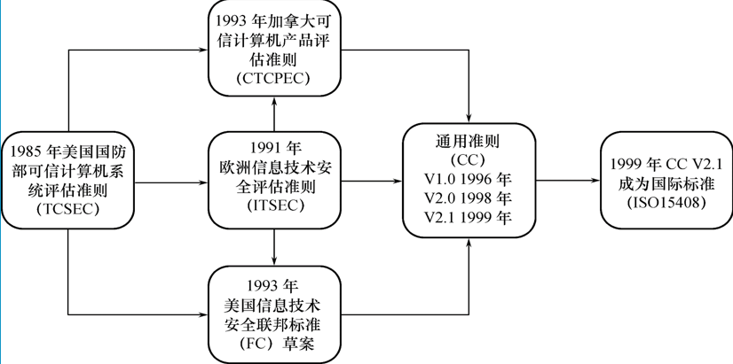

分为：

> - **FC：美国信息技术安全联邦标准**
> - **CTCPEC：加拿大可信计算机产品评估准则**
> - **ITSEC：欧洲信息技术安全评估准则**

#### TCSEC 标准

##### 介绍

1991年 4 月美国 NCSC 颁布了《可新技术算计系统评估标准关系与可信数据库系统的解释》，简称【**TDI**】

**TDI 又称紫皮书，它将TCSEC【可信计算机评估标准】扩展到了数据库管理系统**，定义了数据库管理系统的设计与实现中需满足和用以进行安全级别评估的标准。

##### 安全等级划分

TCSEC/TDI 从安全策略、责任、保证、文档四个方面爱描述安全性级别划分的指标。

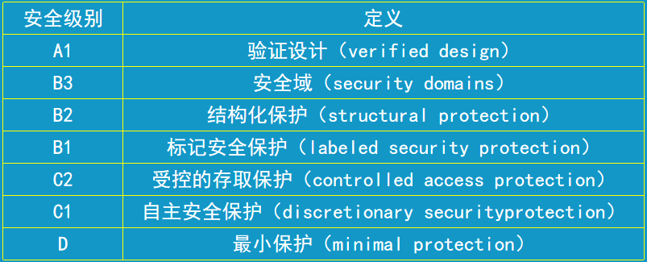

分为四组七个等级：D、C(C1、C2)、B(B1、B2、B3)、A(A1)。

**各个安全等级具有一种偏序向下兼容的关系**。即较高的安全性级别提供的安全性保护要包含较低级别的所有保护要求，同时提供更多的或更完善的保护能力。

###### 安全性级别介绍

**D级：将一切不符合更高标准的系统均归于 D 组。**

> 典型例子：DOS 是安全标准为 D 的操作系统。【DOS 命令窗口】
>
> DOS 在安全性方面几乎没有什么专门的机制来保障。

**C1 级：非常初级的自主安全保护。**

> 能够实现用户和数据的分离，进行**自主存取控制【DAC】**，保护或限制用户权限的传播。
>
> 典型例子：现有的商业系统稍作改进即可满足。

**C2 级：安全产品的最低档次**。

> 提供受控的存取保护，将 C1 级的DAC 进一步细化，以个人身份注册负责，并实施审计和资源隔离，达到 C2 级的产品在其名称中往往不突出 “安全”  这一特色、
>
> 典型例子：Windows2000、Oracle 7

**B1 级：标记安全保护**。

> “安全” “可信的” 产品。对系统的数据加以标记，对标记的主体或客体实时**强制存取控制【MAC】**，审计等安全机制。
>
> 典型例子：
>
> 操作系统：惠普公司的 HP-UX..
>
> 数据库：Oracle 的 Trusted Oracle 7、Sybase 的Secure SQL Server v11.0.6

**B2 级：结构化保护**。

> 建立形式化的安全策略模型并对系统内所有主体和客体实施 DAC 和 DMC。

**B3 级：安全域**。

> 该级的TCB 必须满足访问监控器的要求，审计跟踪能力更强，并**提供系统恢复**过程。
>
> > 好比数据库备份。

**A1 级：验证设计**。

> 在提供 B3 级保护的同时给出系统的形式化设计说明和验证以确信各安全保护真正实现。
>
> > 即审计 DAC 和 MAC 是否正在运行。

---

#### CC 标准

CC 标准：提出国际公认的表述信息技术安全性的结构，把信息产品的安全性要求分为**安全功能要求、安全保证要求**。

保证级用于评估系统是否安全、可信的。

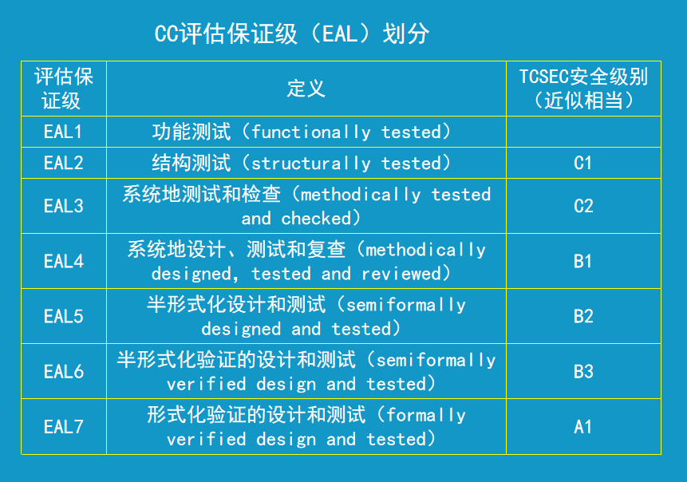

TDI 和 CC 标准区别：

TDI ：告诉你怎么做才是安全的。

CC ： 你自己做完，由CC 来评估是否标准。

----

## 数据库安全性控制

### 非法使用数据库的情况

（1）编写合法程序绕过数据库管理系统及其授权控制

（2）直接编写应用程序执行非授权操作。例如暴力破解。

（3）通过多次合法查询数据库的数据，从中推导出机密数据。

### 计算机系统的安全模型

计算机系统的安全措施是一级一级层层设置的。具体模型如下：

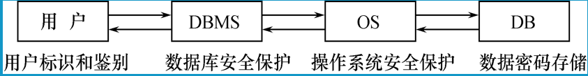

>  用户层：用户标识和鉴别。即对每个使用的用户进行身份验证，设置存取权限等等措施。
>
>  DBMS 层：数据库安全保护。给数据标注标签，设定存取控制【DAC、MAC】，审计日志等。
>
>  OS 层：操作系统安全保护。设定不同用户，分别有不同权限，设定审计日志等等。
>
>  DB 层：数据密码存储。即数据加密存储。

### 数据库有关的安全性

数据库安全性主要包括：**用户身份验证、多层存取控制、视图、审计、数据加密**等安全技术。

数据库管理系统安全性控制模型如下图：

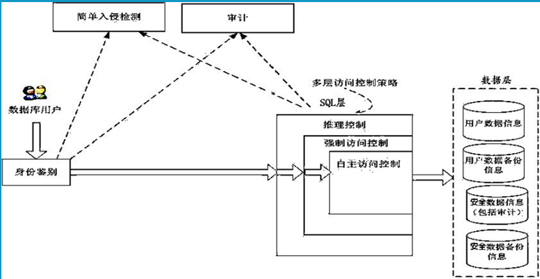

> 存取控制流程：
>
> ​	首先、数据库管理系统对提出 SQL 访问请求的数据库用户进行身份鉴别，防止不可信用户使用系统。
>
> ​	然后，在 SQL 处理层进行自主存取控制和强制访问控制，进一步可以进行推理控制。
>
> > 看你是否具备访问重要数据的权限，同时查看你当前的权限能访问哪些数据。然后根据你在数据库中的操作过程中推理出你是否可能会有破坏数据的行为。
>
> 还可以对用户访问行为和系统关键操作进行审计，对异常用户行为进行简单入侵检测。

----

### 用户身份鉴别

#### 用户身份鉴别概念

用户身份鉴别是指每个用户在系统中都有一个**用户标识**，每次用户要求进入系统时，由系统核对是否是合法用户，通过鉴定后提供数据库管理系统的使用权。它是**系统提供的最外层安全保护措施**。

#### 用户标识组成

用户表示由**用户名**和**用户标识号**组成，用户标识号在整个系统的生命周期内**唯一**。

#### 用户身份鉴别的方法

> 口令 ： 密码。

##### ① 静态口令鉴别

静态口令一般由**用户自定义**，这些口令是**静态不变**的。

##### ② 动态口令鉴别

口令是**动态变化**的，每次鉴别均需使用动态产生的新口令来登录数据库管理系统，即采用**一次一用**的方法。

##### ③ 生物特征鉴别

**通过生物特征进行认证的技术**，生物特征如指纹、虹膜、掌纹等。

##### ④ 智能卡鉴别

智能卡是一种**不可复制的硬件**，内置集成电路的芯片，具有**硬件加密**的功能。

---

### 存取控制

**用户权限定义** 和 **合法权限检查机制** 一起组成了数据库管理系统的存取控制子系统。

> 即用户在登录之后查看用户的权限能访问什么数据，并同时禁止用户实行越权的操作。

（1）**定义用户权限，并将用户权限记录到数据字典中**。

> 权限是指用户对某一数据对象的操作权利
>
> DBMS 提供了适当的语言来定义用户权限，存放在数据字典中，称作 **安全规则** 或 **授权规则**。

（2）**合法权限检查**

用户发出存取数据的请求后，DBMS 在数据字典中查找，此用户是否有对应的操作权限。即合法权限检查。

#### 常用存取控制方法

##### 自助存取控制 

简称【DAC】：

**用户对不同的数据对象有不同的存取权限，不同的用户对同一对象也有不同的操作权限，用户可将其所拥有的存取权限转授给其他用户**。

> C2 级的DBMS 支持自主存取控制。

##### 强制存取控制

简称【MAC】：

**每一个数据对象都被标以一定的密级，每一个用户也被授予某一个级别的许可证，对于任意一个对象，只有具有合法许可证的用户才可以存取**。

> B1 级的DBMS 支持强制存取控制。

##### 存取控制对象权限表

关系数据库系统中存取控制对象权限如下表：

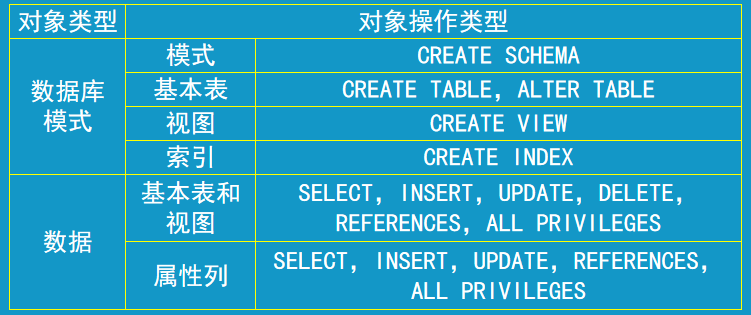

> 即**针对于左边某个数据对象可以采取的哪些类型的操作**。

#### 自主存取控制方法

SQL 标准的通过 **GRANT** 语句 和 **REVOKE** 语句**实现自主存取控制**。

> 即**给定用户授权 【GRANT】**，并可以对其**收回 【REVOKE】**。

##### 用户权限概念

定义用户存取权限就是**定义用户在哪些数据库对象上进行哪些类型的操作**。

> 数据库对象：模式、表示、视图、索引、基本表数据、视图、属性列。
>
> 对象操作类型：创建、修改、插入、删除、引用等。

定义存取权限称为**授权**。

##### 用户权限组成

用户权限的组成就是**数据对象、操作类型**。

##### 关系数据库系统中存取控制对象

> 能操作的数据对象：模式、表示、视图、索引、基本表数据、视图、属性列。

### 授权：授予与回收

SQL 通过 **GRANT 和 REVOKE 实现向用户授予或回收对数据的操作权限**。

#### GRANT 授予

**GRANT：对指定操作对象的指定操作权限授予给指定用户**。

##### 一般格式

```mysql
GRANT <权限1>,<权限2>.. ON <对象类型1> <对象名1>,... TO <用户1>,<用户2>..
[WITH GRANT OPTION];
```

> **将指定对象类型的指定操作权限授予给指定用户**。

- **权限：CREATE 、SELECT、INSERT 、UPDATE 、DELETE、DROP、ALTER、REFERENCES**
- **对象类型：SCHEMA【模式】、TABLE【表】、VIEW【视图】、INDEX【索引】、COLUMN【属性列】**

【说明】

① 可以发出 GRANT 的是**数据库管理员，数据库对象创建者（即属主 Owner）、拥有该权限的用户**。

② **接受权限**的用户可以是**一个或多个具体用户、PUBLIC（全体用户）**。

③ **WITH GRANT OPTION** 子句：

- **有，表示该权限可以再授予给其他用户**

  - > 假设 A 将权限给来 B，那么B 还可以将此权限再赋予给 C。

- **没有，表示该权限不可以再授予给其他用户**。

④ SQL 标准**不允许循环授权**。

> 即 U1 授权给 U2，U2 授权给 U3，U3 授权给 U4，但 U4不可授权给 U1。

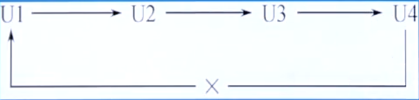

---

【例】把查询 Student 表的权限授予给 U1 用户。

```mysql
GRANT SELECT ON TABLE Student TO U1;
```

【例】把对 SC 表的查询权限授予给所有用户。

```mysql
GRANT SELECT ON TABLE SC TO PUBLIC;
```

- **PUBLIC：所有用户。**

【例】把 查询 Student 表和修改学生学号的权限授予给用户 U4。

```mysql
GRANT UPDATE(Sno),SELECT ON TABLE Student TO U4;
```

注：**对属性列的授权必须明确指出其属性列名**。

【例】把 SC 表的 INSERT 权限授予给用户 U5，**并允许它再将此权限授予给其他用户**。

```mysql
GRANT INSERT ON TABLE SC TO U5 WITH GRANT OPTION;
```

> 执行此句后，U5用户不仅拥有了对 Student 表的 INSERT 权限，还可以传播此权限。

---

权限变化示意：

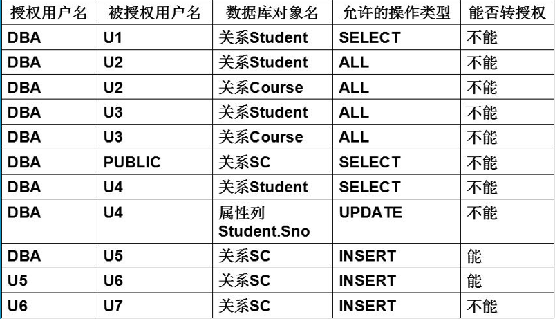

---

#### REVOKE  回收

**REVOKE**：**授予的权限可以由 数据库管理员 或 其他授权者 用 REVOKE 语句收回**。

##### 一般格式

```mysql
REVOKE <权限1>,<权限2>... ON <对象类型1> <对象名1>... FROM <用户1>,<用户2>...
[CASCADE | RESTRICT]
```

【例】把 用户 U4 修改学生学号的权限收回。

```mysql
REVOKE UPDATE(Sno) ON TABLE Student FROM U4;
```

【例】收回所有用户对 SC 表的查询权限。

```mysql
REVOKE SELECT ON TABLE SC FROM PUBLIC;
```

【例】把 用户 U5 对 SC 表的 INSERT 权限收回、

```mysql
REVOKE INSERT ON TABLE SC FROM U5 CASCADE;
```

> 【说明】
>
> 由于  DBA 在授予 U5 权限时，定义了可以让 U5 再将权限授予给其他人，即 WITH GRANT OPTION，所以也要对应的回收从 U5 处获得的 INSERT  权限的用户相应权限。即 加上 CASCADE，否则拒绝执行此语句。

---

#### 总结

① **数据库管理员的授权**。

> 拥有所有对象的所有权限。
>
> 可根据实际情况将不同的权限授予给不同的用户。

② **用户的授权**。

> 拥有自己建立的对象的全部的操作权限。
>
> 可以使用 GRANT，把权限授予给其他用户。

③ **被授权用户的权限**

> 如果具有 “继续授权” 的许可，即 WITH GRANT OPTION，可以把获得的权限再授予给其他用户。

④ **所有授予出去的权限在必要时都可用 REVOKE 语句收回**。

---

### 创建数据库模式的权限

数据库管理员 DBA 在创建用户时实现对创建数据库模式的权限。

> 即在**创建用户时，给用户设定相应的权限**。

#### 创建用户

##### 一般格式

```mysql 
CREATE USER <用户名> [WITH] [DBA | RESOURCE | CONNECT];
```

【说明】

①  **只有系统的超级用户【DBA】才有权创建一个新的数据库用户**。

② 新创建的数据库用户可以有三种权限：**CONNECT、RESOURCE、DBA**。

**若没有指定用户的权限，则默认为 CONNECT**。

③ **CONNECT 权限：不能创建用户、模式、基本表、只能登录数据库。**

**④ RESOURCE 权限 ：能创建基本表和视图，并成为所创建数据对象的属主，但不能创建模式和用户。**

**⑤ DBA 权限：是系统的超级用户，可以创建新用户、模式、基本表、视图等所有权限。同时拥有对数据库的存取控制，还可以把这些权限授予给一般用户**。

如图所示：

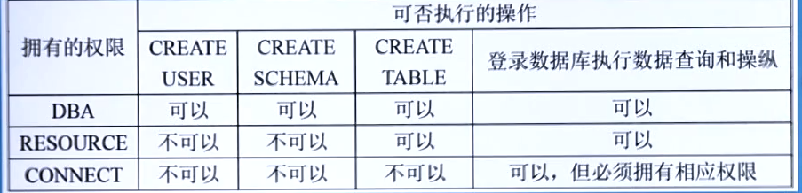

---

### 数据库角色

数据库角色是指**被命名的一组与数据库相关的权限**，**角色是权限的集合**。

**可以为一组具有相同权限的用户创建一个角色，简化授权的过程**。

> 即定义一个角色，并赋予一定的权限，让若干个用户都成为这个角色，这样可以实现**多个用户可以一次性被赋予某个权限的操作**。
>
> 比如学生这个角色，如果把一个学生看做一个用户，并赋予一定的权限，即可以查看Student 表，需要给每个学生创建对应的用户并赋予权限或修改权限，那么这个操作步骤会很繁琐。
>
> 而如果通过定义一个学生角色，让若干个学生一并充当这个角色，那么只需要对学生这个角色赋予一定的权限，或者修改这个角色的权限，即可以达到**修改一个角色，多个用户一并被修改**的目的。

SQL 语言**使用 CREATE ROLE 语句来创建角色**，然后**用 GRANT 语句授权**，**用 REVOKE 收回赋予角色的权限**。

#### 创建角色

##### 一般格式

```mysql
CREATE ROLE <角色名>;
```

#### 给角色授权

##### 一般格式

```mysql
GRANT <权限1>..  ON <对象类型> <对象名> TO  <角色名>..;
```

#### 角色之间授权

将一个角色授权给其他角色或用户。

> 即 **一个用户具有多个角色**。

```mysql
GRANT <角色1>,<角色2>... TO <角色1>,<用户2>... [WITH ADMIN OPTION];
```

【说明】

① **该语句是把角色授予给某用户，或授予给另一个角色**。

② **授予者是角色创建者 或 拥有在这个角色上的 ADMIN OPTION 权限**。

> 能够具有授权这个角色的只能是该角色的创建者，或者是被赋予了这个角色的 ADMIN OPTION 权限，即管理权限。

③ **指定了 WITH ADMIN OPTION 则获得某种权限的角色后用户可以把这种权限再授予给其他角色**。

> 即 角色1 可以将权限授予给角色2。

#### 角色权限的收回

##### 一般格式

```mysql
REVOKE <权限1>,<权限2>.. ON <对象类型> <对象名>.. FROM <角色1>,<角色2>...;
```

【说明】

① **用户可以回收角色的权限，从而修改角色拥有的权限。**

② **REVOKE 的执行者必须是：角色创建者、拥有该角色上的 ADMIN OPTION 权限。**

---

【例】通过角色来实现将一组权限授予给多个用户。

> 则该多个用户属于一个角色组。

（1）创建角色 R1：

```mysql
CREATE ROLE R1;
```

（2）通过GRANT 语句 赋予角色一定的权限：

```mysql
GRANT SELECT,INSERT,UPDATE ON TABLE Student TO R1;
```

（3）将该角色赋予给王平、张明、王玲。使他们具有 R1 这个角色所包含的所有权限：

```mysql
GRANT R1 TO 王平,张明,王玲;
```

（4）也可以通过 REVOKE 语句收回 王平 的这 3 个权限：

```mysql
REVOKE R1 FROM 王平;
```

> 则王平不再属于 R1 这个角色。

----

### 强制存取控制方法

#### 自主存取控制的缺点

缺点：可能存在**数据 “无意泄漏”  的风险**。

原因：**这种机制仅仅通过对数据的存取权限来设定限制，而数据本身并无安全标记**。

解决：**对系统控制下的所有主客体实时强制存取控制策略**。【DAC 和 MAC 合并使用】

> 自主存取控制是对每个用户设定操作数据的权限，只有具有了指定的权限才能操作指定的数据，但是这种方式可以被一些不法分子通过一些途径来获取到某个用户的用户口令，从而登录到数据库中进行不合法操作。
>
> 而加入了 MAC 【强制存取控制】之后，即便盗取了合法用户的信息，但也不一定就能对数据进行操作。因为数据已经被 MAC 标注上了安全标记，用户不能直接操作数据。

#### 强制存取控制

简称【MAC】。

作用：**保证更高程度的安全性，用户不能直接感知或控制敏感的数据**。

##### 实体分类

在强制存取控制当中，作用的实体分为：

###### ① 主体

**主体是系统的活动实体**。包括数据库管理系统的实际用户、代表用户的各种进程等。

###### ② 客体

**客体是系统中的被动实体**。包括受主体操纵的基本表、索引、视图等。

##### 敏感度标记

对于主体和客体，DBMS 为它们的实例（值）都会指派一个敏感度标记。

> 即**对每个访问的用户、表等数据载体都会标注相应的密级标记**。

###### 标记级别

敏感度标记分为以下若干级别：

**绝密（Top Secret > TS）、机密（Secret  > S）、可信（Confidential > C）、公开（Public > P）**

密级次序：**TS >= S >= C >= P**

- **主体**的敏感度标记称为 **许可证级别**

- **客体**的敏感度标记称为 **密级**。

##### 规则

**读取、访问**数据对象：

① **仅当主体的许可证级别大于或等于客体的密级时，主体才能读取相应的客体**。

> 即，若主体的许可证级别是 TS【绝密】，那么他可以**访问**密级为 TS、S、C、P 的所有级别的表、视图、索引等数据对象。
>
> > **首先当用户访问数据时，自主存取控制会查看当前用户是否具有权限访问，之后强制存取控制再根据用户的许可证级别来判断该用户能访问哪些级别的数据对象**。

**改写**数据对象：

② **仅当主体的许可证级别小于或等于客体的密级时，该主体才能写相应的客体**。

> 即，若主体的许可证级别为 P 【公开】级，那么他可以写 TS【绝密】级的数据，与之对应的，若许可证级别为TS 【绝密】，那么它则不可以写 S 【机密】级别的数据。
>
> > 这是因为，**如果一个主体同时具备了访问、改写某一级别的数据，那么他在编写数据的同时也可以对数据的级别进行更改，使得机密数据公开化，造成数据泄露。**
> >
> > >  例如将 S 级别的机密数据改成 P 级的公开数据，那么相对于 P 级用户，本来不能查看 S 级的机密数据，却能够查看了，这就会导致数据泄露的问题。
> >
> > 而通过这个编写机制，若主体是 P 级，就算能改写 TS 级的数据，但是他却并不能访问 TS 级的数据，在一定程度上能够保证机密数据不被公开化，泄露。

【说明】

（1）**强制存取控制（MAC）是对数据本身进行密级标记，无论数据如何复制，标记与数据都是密不可分的一个整体，只有符合密级标记要求的主体才可以操纵数据**。

（2）**实现强制存取控制时要首先实现自主存取控制**。

原因：较高安全性级别提供的安全保护要包含较低级别的所有保护。

（3）**自主存取控制【DAC】 与 强制存取控制 【MAC】共同构成数据库管理系统的安全机制**。

##### DAC+MAC安全检查

如图所示：

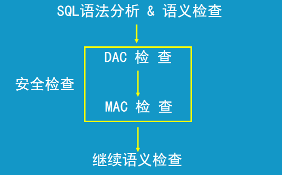

> 首先系统会对要登录的用户所编写的 SQL 语句进行语义检查。
>
> 登录成功之后，若用户需要查看某个表，则首先对该用户进行自主存取控制检查，确定该用户的级别是否具有权限来访问此表。
>
> 若该用户有足够的权限访问该表，则再通过强制存取控制对用户检测，该用户的许可证级别是否允许查看该表上的机密级别的相应列数据，例如【用户密码、身份证号等】。
>
> 最后，系统会时时检测该用户在访问过程中，所编写的所有 SQL 语句进行语义检查，看是否会破坏系统数据。

----

## 视图机制

### 视图对数据库安全的作用

① **把要保密的数据对无权存取这些数据的用户隐藏起来，对数据提供一定程度的安全保护**。

> 即，有一张 Student 表，表中有学生的登录密码、身份证号 这两列重要的机密数据，不能随便给其他用户查看到，那么就可以为 Student 表建立一个视图，该视图中会屏蔽 Student 表的机密数据列，不让其输出到视图结果中，最后将该视图的权限赋予给一些等级不高，但是需要查看 Student 表信息的低级别用户，从而对学生的密码和身份证号的数据起到一定程度的物理隔离。

② **间接地实现支持存取谓词的用户权限定义**。

> 即实现存在量词 ∃ 的应用环境。
>
> 如：有这样一个用户： 王平老师只能检索计算机系学生的信息。而也有这样一个用户： 系主任，他可以检索和增删改计算机系学生信息的所有权限。在数据库系统中可以用视图实现该功能。

---

【例】建立计算机系学生的视图，把对该视图的 SELECT 权限授予王平，把该视图上的所有权限授予张明。

第一步：建立视图 SC_Student：

```mysql
CREATE VIEW SC_Student AS SELECT * FROM Student WHERE Sdept = 'CS';
```

第二步：将 SELECT 权限授予 王平：

```mysql
GRANT SELECT ON SC_Student TO 王平;
```

第三步：将所有权限授予张明：

```mysql
GRANT ALL PRIVILIGES ON SC_Student TO 张明;
```

----

## 审计

### 什么是审计

（1）**审计日志**：启用一个专门的审计日志，将用户对数据库的所有操作都记录在上面。

（2）**审计员**：审计员利用审计日志监控数据库中各种不合理的行为，找出非法存取数据的人、时间和内容。

（3）**C2 以上安全级别的 DBMS 必须具有审计功能**。

> 审计是很消耗资源的，所以一般只有安全级别较高的系统才会具备。

### 审计功能的可选性

> 审计功能是可以选择打开或关闭的。

（1）审计很费时间和空间。

（2）DBA 可以根据应用对安全性的要求，灵活地打开或关闭审计功能。

（3）审计功能主要用于安全性要求较高的部门。

### 审计事件

> 当在以下情况时，才会进行审计。

（1）**服务器事件**：审计数据库服务器发生的事件。

（2）**系统权限**：对系统拥有的结构或模式对象进行操作的审计，要求该操作的权限是通过系统权限获得的、

（3）**语句事件**：对 SQL 语句，如 DDL【数据定义】、DQL【数据查询】、DML【数据操纵】、DCL【数据控制】进行审计。

（4）**模式对象事件**：对特定模式对象上进行的 SELECT 或 DML 操作的审计。

### 审计的功能

（1）**基本功能**：提供多种审计查阅方式

（2）**多套审计规则**。

（3）**提供审计分析和报表功能**。

（4）**审计日志管理功能**。

（5）**提供查询审计设置和审计记录信息的专门功能**。

### 审计分类

审计分为**用户级审计**和**系统级审计**。

##### （1）用户级审计

任何用户都可设置的审计，主要是用户针对自己创建的数据和视图进行审计。

##### （2）系统级审计

只能由数据库管理员设置，监测成功或失败的登录要求，监测授权和收回操作以及其他数据库级权限下的操作。

### AUDIT / NOAUDIT

**AUDIT 语句：用于设置审计功能。**

一般格式：

```mysql
AUDIT <权限1>,<权限2>... ON <对象名>;
```

> **对 指定数据对象 开启指定操作的审计功能。**

**NOAUDIT 语句：用于取消审计功能**。

一般格式：

```mysql
NODUAIT <权限1>,<权限2>... ON <对象名>;
```

> **取消 指定数据对象 已开启的指定操作的审计功能。**

---

【例】对修改 SC 表结构或 修改 SC 表数据的操作进行审计。

```mysql
AUDIT ALTER,UPDATE ON SC;
```

【例】取消 对 SC 表的一切审计。

```mysql
NOAUDIT ALTER,UPDATE ON SC;
```

---

【说明】

① **审计设置和审计日志**一般**存储在数据字典中**。

② **必须打开审计开关，系统参数 audit_trail 设为 true，才能在系统表 SYS_AUDITTRAIL 中看到审计信息**。

③  **数据库安全审计系统提供的是一种事后检查的安全机制**。

> 即 执行后才进行检查。

---

## 数据加密

数据加密是**防止数据库中数据在存储和传输中失密的有效手段**。

加密是基本思想是**通过一定的算法将原始数据—明文变换为不可直接识别的格式—密文**。

数据加密包括**存储加密**和**传输加密**。

### 存储加密

#### 透明存储加密

> 透明：指的是运算的过程，用户可以不需要深入的参与，只需要知道要素和结果就行。
>
> 明文 > 密文：加密 ；密文 > 明文：解密；密钥：即加密算法在加密过程中怎么转换的关键字。

① 内核级加密保护方式，对用户完全透明。

② 将数据在写到磁盘时对数据进行加密，授权用户读取数据再对其进行解密。

③ 访问数据库的应用程序不需要做任何修改，只需要在创建表语句时说明需加密的字段即可。

④ 内核级加密方法：**性能较好、安全完备性高**。

#### 非透明存储加密

通过多个加密函数来实现，用户自己来加密，之后再存在数据库中。

### 传输加密

> 在传输的过程中，对数据进行加密。

#### 链路加密

① **在链路层进行加密**。

② 传输信息主要由 **报头 和 报文** 两部分组成，报文和报头均加密。

> 类似于 HTTP协议，报头是要传输的数据的附加属性信息，报文是要发送的实际数据。

#### 端到端加密

> **建立在链路层加密的基础上**。

① 在 **发送端加密，接收端解密**。

②  **只加密报文，不加密报头**。

③ 所需密码设备数量相对较少，**容易被非法人员获取敏感信息**。

#### 数据库管理系统可信传输

如图所示：

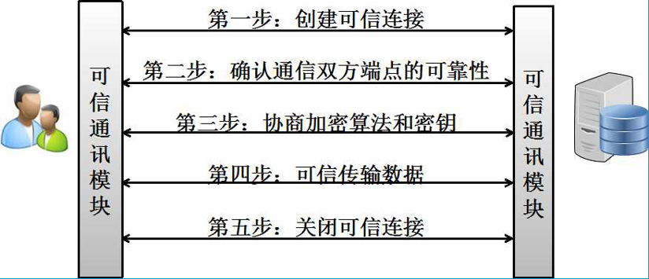

① 确认通信双方端点的可靠性

采用基于数字证书【CA】的服务器和客户端认证方式。通信时均首先向对方提供己方证书，然后使用本地的 CA 信任列表 和 证书撤销列表对接收到的对方证书进行验证。

② 协商加密算法和密钥

确认双方端点的可靠性后，通信双方协商本次会话的加密算法与密钥。

③ 可信传输数据

数据在被发送前用某一组特定密钥进行加密和消息摘要计算，以密文形式在网络上传输。数据被接收的时候，需用相同一组特定的密钥进行解密和摘要计算。

---

## 其他安全性措施

### 推理控制

> 即非法分子可以通过一些已知的数据推理出与之相联系的机密数据。

处理强制存取控制未解决的问题，**避免用户利用能够访问的数据推知出更高密级的数据**。

常用方法：**基于函数依赖的推理控制，基于敏感关联的推理控制**。

### 隐蔽信道

处理强制存取控制未解决的问题。

如 **利用合法的信道传输非法的信息**。

> 例如 
>
> 假设有一张 Student 表，表的 Sno 字段是唯一的。
>
> ​		同时有一个用户 A ，A 的用户级别是 TS，一个用户 B ，B 的用户级别是 P。
>
> 他们两个都可以访问以及插入数据到 Student 表中，在原则上，一旦 A 用户 插入了一条 Sno 为张三的数据，那么用户 B再插入相同的数据时，会返回  0 【代表插入失败】，反之 用户A 没有插入过此数据，则会返回 1 【代表插入成功】。
>
> 而如果 用户 A 与用户 B是一堆非法分子，用户A 能够看到 Student 表中有数据的表示就是 1010 这样的数值，那么 A、B 两个用户之间就可以通过以上的方式来告知对方机密数据的具体信息。
>
> 例如，用户A看到了有一个机密信息 是 101，用户 B 看不到，A、B 两个用户则交流约定，用插入失败、成功会返回 0、1 的方式来告知 用户 B 用户 A 看到的机密数据。
>
> 这种通过合法的方式来传递不合法的信息，就称为 **隐蔽信道**。

---

#### 数据隐私保护

是一种 **描述个人控制其不愿他人知道或他人不便知道的个人数据的能力**。

主要用于**数据收集存储处理**和**数据发布**等各个阶段。

