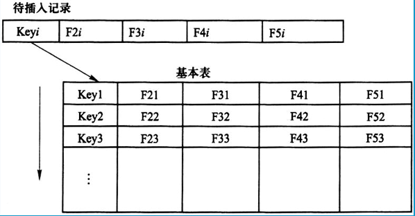
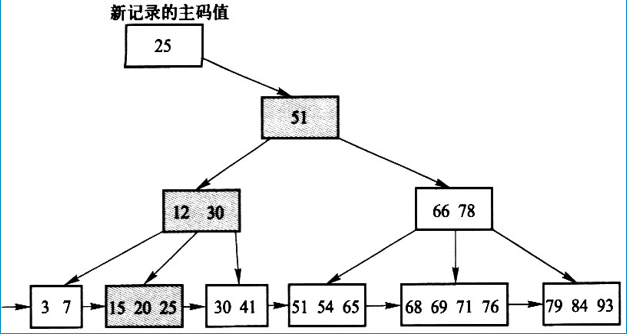
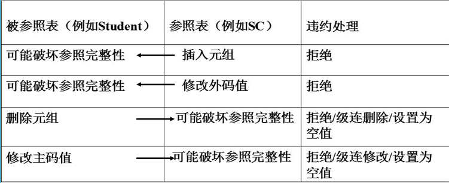

# 数据库完整性

## 介绍

数据库完整性是指**数据的正确性和相容性**。

> 即**在符合安全性条件的情况下，用户对表进行更新操作时如何保证数据的完整性**。

**数据的正确性**：**是指符合现实世界语义，反映了当前实际状况的**。

> 例如，学生的学号必须唯一，性别只能是男或女等。

**数据的相容性**：**是指数据库的同一对象在不同关系表中的数据是符合逻辑的**。

> 例如：学生所选的课程必须是学校开设的课程，学生所在的院系必须是学校已成立的院系等。不能出现在一个表中数据是 A，但是在另一个表中 数据是 B的情况。

## 完整性和安全性的概念

> ##### 简要概述
>
> 数据的完整性和安全性是两个不同的概念，但是有一定的联系。数据的完整性是为了防止数据库中存在不符合语义的数据，也就是防止数据库中存在不正确的数据。数据的安全性是保护数据库防止恶意的破坏和非法的存取。因此，完整性检查和控制的防范对象是不合语义 的、不正确的数据，防止它们进入数据库。安全性控制的防范对象是非法用户和非法操作，防止他们对数据库数据的非法存取

### 数据库的完整性

防止数据库中存在**不符合语义的数据**，也就是**防止数据库中出现不正确的数据。**

防范对象：不合语义的、不正确的数据。

### 数据库的安全性

保护数据库**防止被恶意的破坏和非法的存取**。

防范对象：非法用户、非法操作。

### 数据库完整性应具备的功能

#### ① <span style="color:red">提供定义完整性约束条件的机制</span>

完整性约束条件也称为**完整性规则**，是数据库中必须满足的**语义约束条件**。

SQL 标准通过**数据定义语言**来描述完整性包括**关系模型的实体完整性、参照完整性和用户定义完整性**

**数据库管理系统检查数据是否满足完整性约束条件叫做完整性检查。**

一般**在 INSERT、UPDATE、DELETE 语句执行后检查**，也可以在**事务提交时检查**。

#### ③ <span style="color:red">违约处理</span>

数据库管理系统若发现用户的操作违背了完整性约束。

就会采取 **拒绝（NO ACTION）**执行该操作 、**级联（CASCADE）**执行其他操作方式、**取空值（NULL）**来保证完整性。

---

## 实体完整性

实体完整性关心的是数据的正确性。

即 **指符合现实世界语义，反映了当前实际状况的**。

### 实体完整性定义

实体是现实世界中一个物体的概念模型的抽象，每个实体都是独一无二的，都具有自己的属性，一个实体能够完全区分于其他实体。

> 在数据库中，就是要通过完整性约束描述一个实体的特征组成，同时每个实体的实例【元组】在表中都是独一无二的，具有自己的专属编号，不能出现两行记录是完全一样的情况。

#### 关系模型的实体完整性

在**关系模型中，通过为每个实体设置一个主码，让每条记录都是相互可区分的**。

即在 SQL 中 在 CREATE TABLE 中用 **PRIMARY KEY** 定义。

主码又分为 **单属性的主码** 和 **多属性的主码**。	

##### 单属性主码

单属性主码的定义可以有 **列级约束条件**  和 **表级约束条件** 两种方式定义。

##### 多属性主码

多属性主码的定义只能是通过 **表级约束条件** 来定义。

### 实体完整性检查和违约处理

> 即当实体完整性出现问题时，如何处理。

关系数据库管理系统会**按照实体完整性规则自动进行检查**。

检查内容如下：

单属性的主码：

① **检查主码值是否唯一，如果不唯一则拒绝插入或修改**。

> 例如，Student 表的 Sno 主码，它**既是主码，也是主属性**，如果它不唯一代表表中已经有相应的记录了，违反了实体完整性的规则，系统会拒绝插入。

② **检查主码的各个主属性是否为空，只要有一个主属性为空则拒绝插入或修改**。

> 例如，SC 表的 Sno，Cno 两个都是主属性，SC 表的主码是 Sno ，Cno 两个主属性组成的主码。

#### 检查主码值的方法

检查记录中主码值是否唯一的一种方法就是**全表扫描**。

即 **依次判断表中每一条记录的主码值与插入记录上的主码值（或修改的新主码值）是否相同**。

> 在插入数据的时候，首先会扫描表中的所有元组，看其中是否有元组的相应主码值是与要插入到新元组的主码值是一样的，如果是一样的，系统则会拒绝插入。



【说明】

① **全表扫描的缺点是十分耗时**。

> 每次插入新纪录时，都要对表中的所有记录进行逐个检查，非常消耗资源。

② 为避免对基本表进行全表扫描，RDBMS 核心一般都在主码值上自动建立一个索引。

例如 **B+ 树索引**。

B+ 树索引的查找方式使得主码值检索的效率大大提高。

##### B+ 树索引结构

B+ 树结构：以**叶子节点**的形式分布为**树状结构**，设有**根节点、父节点、子节点**，每个父节点与子节点之间都有联系，B+ 树结构里面节点的插入顺序**有点像 二叉树**，即**比父节点小的放左边，反之比父节点大的放右边，从左到右，依次排列**。同时一个子节点中可以有多个值存在，代表一个选择区域，这个选取区域当中也是将值按照从小到大的左右排序，依次排列形成一个**三角形状的树状结构**。

如图所示：



> 从以上树状结构可以得知。当要插入新纪录时，新纪录的主码值是 25，首先会找根节点 【51】，一看新纪录的值是 25 ，比 50 要小，则会去左边查找，一次性节省一半的资源查找消耗，然后再根据左边的子节点里的值进行比较，发现左子节点的值域为 12 - 30，25 正好在这个范围内，再接着往下找，【25 比 12 大所以是往右边找】，又找到一个子节点，里面的值刚好有 25 ，说明 25 主码值已经有相应的记录了，则系统拒绝插入此新纪录。

---

## 参照完整性

参照完整性主要关心的是数据的相容性。

即 **指数据库的同一对象在不同关系表中的数据是符合逻辑的**。

参照完整性的定义：**在 CREATE TABLE 中 用 FOREIGN KEY 语句定义哪些列为外码，用 REFERENCES 短语指明这些外码参照哪些表的主码**。

> 例如关系 SC 中（Sno，Cno）是主码。Sno，Cno 分别对应Student 表的主码 和 Course 表的主码，当Course 表中某个主码值是空值时，该记录不可能出现在 SC 表中，否则就是违反了参照完整性约束的规则，SC 表的 Cno 的值要参照 Course 的 Cno 列的值。

【例】定义 SC 表中的参照完整性。

```mysql
CREATE TABLE SC
(
	Sno CHAR(9) NOT NULL,
    Cno CHAR(4) NOT NULL,
    Grade SMALLINT,
    PRIMARY KEY (Sno,Cno), /*在表级定义实体完整性*/
    FOREIGN KEY (Sno) REFERENCES Student(Sno),
    FOREIGN KEY (Cno) REFERENCES Course(Cno)
    /*在表级定义参照完整性*/
);
```

### 参照完整性检查和违约处理

**参照完整性 通过 外码 将两张表的相应元组联系起来**，对**被参照表和参照表**进行**增删改查**操作时都有可能破坏参照完整性，必须进行完整性检查。

参照完整性检查主要面向两个对象：**被参照表和参照表**。

如图所示：



当**参照表**这边做出 **插入**新元组或**修改**主码值时，系统会在被参照表中查找参照表中相应的新元组记录中的主码值是否存在，如果不存在则代表参照表插入或修改成了一个不存在的元组记录，这就会破坏完整性约束，系统会**拒绝**此插入或修改操作。

当**被参照表**这边做出 **删除元组 或 修改主码值**时，系统会**首先查询参照表这边是否存在要被删除或修改的主码值的相应记录**，如果有，系统会采取**拒绝、级联删除/修改、设置为空值** 3 种方式来保证两表的参照完整性。

> 当被参照表要**删除**某一元组时，如果参照表有相应的记录，那么系统：
>
> - 要么**直接拒绝**。
> - 要么会要求**必须先删除参照表中的相应记录，被参照表才能继续删除某一元组**。
> - **要么在外码不是主属性的情况下，将参照表的外码设置为 NULL 值**。
>
> 当被参照表要**修改**某一元组时，如果参照表有相应的记录，那么系统
>
> - 要么**直接拒绝**
> - 要么**会将两表的相应记录内容一并级联修改**。
> - **要么在外码不是主属性的情况下，将参照表的外码设置为 NULL 值**。

---

### 违约处理规则

① **拒绝（NO ACTION）执行**。不允许该操作执行。该策略一般设置为默认策略。

② **级联（CASCADE）操作**。当删除或修改被参照表（Student）的一个元组造成了与参照表（SC）的不一致，则删除或修改参照表中的所有造成不一致的元组。

③ **设置为空值（SET-NULL）**。当删除或修改被参照表的一个元组时造成了不一致，则将参照表中的所有造成不一致的元组的对应属性设置为空值。

### 定义违约处理

在创建表的时候，为保证该表在引用其他表时，所产生的参照完整性不被破坏，需要提前在表中定义参照完整性检查处理。针对的对象是 该表的**外码**。

#### 一般格式

```mysql
CREATE TABLE <表名X>
(
 ....
 FOREIGN KEY (Z) REFERENCES <表名Y>(z)
 ON DELETE NO ACTION / CASCADE
 ON UPDATE CASCADE,
);
```

>  **ON DELETE [NO ACTION / CASCADE]**：
>
> > 当对参照表 X 进行 DELETE 删除 某个元组时，如果破坏了 参照表 X 与被参照表 Y 之间的参照完整性，那么则 拒绝执行 【NO ACTION】 或 级联删除【CASCADE】，就是将两张表对应的记录一并删除。
>
> **ON UPDATE CASCADE**：
>
> > 当对参照表 X 进行 UPDATE 修改某个元组记录时，如果破坏了 参照表 X 与被参照表 Y 之间的参照完整性，那么则进行级联修改【CASCADE】操作，就是将两张表对应的记录一并修改成一致。

此定义通常**应用于有外码的参照表中**。

【例】显式地说明参照完整性的违约处理示例。

```MYSQL
CREATE TABLE SC
(
	Sno CHAR(9) NOT NULL,
    Cno CHAR(4) NOT NULL,
    Grade SMALLINT,
    PRIMARY KEY(Sno,Cno),
    FOREIGN KEY (Sno) REFERENCES Student (Sno)
    ON DELETE CASCADE /*级联删除 SC 表中相应的元组*/
    ON UPDATE CASCADE, /*级联更新 SC 表中相应的元组*/
    FOREIGN KEY (Cno) REFERENCES Course (Cno)
    ON DELETE NO ACTION
    /*当删除 Course 表中的元组造成了与 SC 表不一致时拒绝删除 */
    ON UPDATE CASCADE
    /*当更新 Course 表中的 Cno 时，级联更新 SC 表中相应的元组*/
);
```

----

## 用户定义的完整性

用户定义的完整性：**针对某一具体应用的数据必须满足的语义要求**。

用户定义完整性由**关系数据库管理系统提供了定义和检验用户定义完整性的机制，不必由应用程序承担**

> 即在操作数据时，会第一时间在数据库中进行检测是否符合用户定义的完整性条件。

### 属性的约束条件

#### 属性约束条件的定义

在 CREATE TABLE 时定义属性上的约束条件包括：

- **列值非空（NOT NULL）**
- **列值唯一（UNIQUE）**
- **检查列值是否满足某一条件表达式（CHECK）**

##### 非空 NOT NULL

【例】在定义 SC 表时说明 Sno、Cno、 Grade属性不可为空值。

```mysql
CREATE TABLE SC
(
	Sno CHAR(9) NOT NULL,
    Cno CHAR(4) NOT NULL,
    Grade SMALLINT NOT NULL
    ...
);
```

##### 唯一 UNIQUE

【例】建立部门表 Dept ，要求部门名称 Dname 列值取唯一。

```mysql
CREATE TABLE Dept
(
	Deptno NUMRIC(2),
    Dname CHAR(9) UNIQUE NOT NULL,
    /* 非空、唯一*/
    ...
);
```

##### 检查约束 CHECK

【例】定义 Student 表的 Ssec 属性列值只能去 “男”  或 “女”。

```mysql
CREATE TABLE Student
(
	Sno CHAR(9) PRIMARY KEY,
    Sname CHAR(8) NOT NULL,
    Ssex CHAR(2) CHECK( Ssex IN('男','女') ),
    /* 性别只能取男 、女 */
    Grade SMALLINT CHECK(Grade >= 0 AND  Grade <= 100)
    /*成绩在 0 ~ 100 之间*/
    ...
);
```

----

#### 属性约束检查和违约处理

**插入** 或 **修改** 属性值时，关系数据库管理系统检查属性上的约束条件是否被满足，如果不满足则操作被**拒绝执行**。

---

### 元组的约束条件

① 在 **CREATE TABLE** 时可以用 **CHECK** 短语**定义元组上的约束条件**，即**元组级的限制**。

② 元组级的限制**可以设置不同属性之间的取值的相互约束条件**。

> 即多个属性之间有相互的约束条件，若不能满足 属性1 或 属性2 的条件，则不能插入该条记录。

通常**以表级约束来定义这多个属性的约束条件**。

【例】当学生的性别是 男 时，其名字不能以 Ms. 开头。

```mysql
CREATE TABLE Student
(
	Sno CHAR(9),
    Sname CHAR(8) NOT NULL,
    Ssex CHAR(2),
    Sage SMALLINT,
    Sdept CHAR(20),
    PRIMARY KEY(Sno),
    /*性别是女的元组都能通过该项检查，因为 Ssex = ‘女’ 成立，
    当性别是男性时，要通过检查则名字一定不能以 Ms. 开头*/
    CHECK (Ssex = '女' OR Sname NOT LIKE 'Ms.%')
    /*定义了元组中 Sname 和 Ssex 两个属性值之间的约束条件。*/
);
```

---

#### 元组约束条件和违约处理

**插入元组** 或 **修改属性值**时，关系数据库管理系统会**检查元组上的约束条件是否被满足**，如果**不满足**则操作被**拒绝执行**。

---

## 完整性约束命名子句

完整性约束命名子句

在 SQL 中，可以单独使用 **CONSTRAINT** 关键字来定义一个单独的约束条件，并为其他属性列所引用。

#### 一般格式

```mysql
CONSTRAINT <完整性约束条件名> <完整性约束条件>;
```

> 单独设定一个完整性约束条件，并提供一个命名来索引此约束条件。

- **<完整性约束条件>** 包括：**NOT NULL、UNIQUE、PRIMARY KEY 短语【实体完整性】、FOREIGN KEY 短语【参照完整性】、CHECK 短语【‘用户定义完整性】**。

【例】建立学生登记表 Student，要求学号在 90000 ~ 99999 之间，姓名不能取空值，年龄小于 30，性别只能是 “男” 或 “女”。

```mysql
CREATE TABLE Student
(
	Sno CHAR(6),
    CONSTRAINT C1 CHECK (Sno BETWEENT 90000 AND 99999),
    Sname CHAR(20) CONSTRAINT C2 NOT NULL,
    Sage NUMRIC(2) CONSTRAINT C3 CHECK (Sage < 30),
    Ssex CHAR(2) CONSTRAINT C4 CHECK (Ssex IN ('男','女')),
    CONSTRAINT StudentKey PRIMARY KEY(Sno)
);
```

> 在 Student 表中建立了 5 个约束条件，包括主码约束（StudentKey）以及 C1、C2、C3、C4 四个 列级约束。

---

#### 修改表中的完整性限制

使用 **ALTER TABLE** 语句来修改表中的完整性限制，最好的方法就是**先删除已有的完整性限制，再重新建立一个新的完整性限制**。

##### 一般格式

```mysql
ALTER TABLE <表名> DROP CONSTRAINT <完整性约束条件名>;
```

【例】去掉 Student 表中对性别的限制 （C4）

```mysql
ALTER TABLE Student DROP CONSTRAINT C4;
```

#### 增加表的完整性限制

使用 ALTER TABLE 语句来增加指定表中的完整性限制。

##### 一般格式

```mysql
ALTER TABLE <表名> ADD CONSTRAINT <完整性约束条件名> <完整性约束条件>;
```

【例】修改表 Student 中的约束条件。要求学号改为 900000 ~ 999999 之间，年龄由 < 30 改为 < 40.

> 可以先删除原有的完整性约束条件，再增加新的约束条件。

```mysql
ALTER TABLE Student DROP CONSTRAINT C1;
ALTER TABLE Student ADD CONSTRAINT C1 CHECK (Sno BETWEEN 900000 AND 999999);
ALTER TABLE Student DROP CONSTRAINT C4;
ALTER TABLE Student ADD CONSTRAINT C4 CHECK (Sage < 40);
```

---

## 域中的完整性限制

域：**是一组具有相同数据类型的值的集合，即属性的取值范围**。

SQL 可以用 **CREATE DOMAIN** 语句来**建立一个域以及域应该满足的完整性约束条件**，然后**用域定义属性**

好处：**通过为属性列建立一个域，在域中设定相应的取值范围，这样当想要改变某个属性列的约束条件时，直接改域中的取值范围即可**。

### 建立域

#### 一般格式

```mysql
CREATE DOMAIN <域名> <取值类型> <约束条件> (VALUE IN (<取值范围..>));
```

在表外建立一个域，这样就可以为所有表的某个字段所引用。

```mysql
CREATE TABLE XX
(
	Ssex <域名>, /*直接引用值域即可*/
);
```

【例】建立一个性别域 ，并声明性别域的取值范围。

```mysql
CREATE DOMAIN GenderDomain CHAR(2) CHECK(VALUE IN('男','女'));

/*表内*/
CREATE Student 
(
 ...
 Ssex GenderDomain, /* 引用 GenderDomain 值域中的取值范围*/
 ...
);
```

【例】建立一个性别域 GenderDomain，并对其中的限制命名。

```mysql
CREATE DOMAIN GenderDomain CHAR(2) CONSTRAINT DG CHECK(VALUE IN ('男','女'));
```

> GenderDomain 是一个值域，DG 是 GenderDomain 这个值域中的完整性条件名。
>
> **可以把 域 看作是一个集合，里面存储的是一个完整性约束条件，即取值范围，命名为 DG** 。

---

### 删除域的限制条件

**当为域中定义了限制条件后【已命名】，可以通过 ALTER DOMAIN 语句来删除域中的完整性约束条件，即取值范围，删除了域中的取值范围后，那么这个 域 就变成了一个空集**。

想要**修改 域 中的限制条件**：**需先删除限制条件，再重新为其添加一个限制条件**。

#### 一般格式

```mysql
ALTER DOAMIN <域名> DROP CONSTRAINT <完整性约束条件名>;
```

【例】删除域 GenderDomain 的限制条件 GD。

```mysql
ALTER DOMAIN GenderDomain  DROP CONSTRAINT GD;
```

### 为域增加限制条件

**当已有的一个域是一个空集，即没有定义限制条件【取值范围】时，可以使用 ADD CONSTRAINT 来为其添加一个限制条件**。

#### 一般格式

```mysql
ALTER DOMAIN <域名> ADD CONSTRAINT <完整性约束条件名> <约束条件> (VALUE IN (<取值范围..>));
```

【例】在 域 GenderDomain  上增加性别的限制条件 GDD。

```MYSQL
ALTER DOMAIN GenderDomain ADD CONSTRAINT GDD CHECK(VALUE IN ('1','0'));
```

> 通过以上例子，可以把属性的取值范围由 （'男','女'） 改为 （’1‘，’0‘）。

---

## 断言

在 SQL 中，可以使用数据定义语言【DDL】中的 **CREATE ASSERTION** 语句，**通过声明性断言来指定更具一般性的约束条件**。可以**定义涉及多个表或聚集函数操作的比较复杂的完整性约束条件**。

断言创建之后，任何对断言中所涉及到的关系的操作都会触发关系数据库管理系统对断言的检查，任何使断言不为真的操作都会被拒绝执行。

> 【说明】
>
> **断言是为指定表定义了一个前提条件功能，当想要对断言中指定的表进行操作时，首先会触发断言，并执行断言中的条件，如果断言的条件返回的结果为真，代表当前用户对表的操作是可以进行的，否则系统会拒绝对这个表的操作**。

### 创建断言

#### 一般格式

```mysql
CREATE ASSERTION <断言名> <CHECK 子句(子查询...)>;
```

> **创建一个断言，并为此断言设定一个约束条件。**

**每个断言都应被赋予一个名字，<CHECK\> 子句中的约束条件与 WHERE 子句的条件表达式类似**。

> 也就是说**断言中的约束条件 = 查询语句中的 WHERE 的条件是一致的**。

- **<CHECK 子句> ：是一个条件表达式，其中包含 SELECT 子查询**。

---

【例】限制数据库课程最多有 60 名学生选修。

```mysql
CREATE ASSERTION ASSE_SC_DB_SUM CHECK 
(60 >= (SELECT COUNT(*) FROM Course,SC WHERE SC.Cno = Course.Cno AND Course.Cname = '数据库'));
-- 此断言的谓词设计聚集操作 COUNT 的SQL语句。
```

> 该断言为 SC 表设定了一个**前提条件**，即数据库课程的选修记录不可超过 60 条。**一旦用户想要对此表插入数据库课程的选修记录时，首先会触发此断言，并执行断言中的条件**：
>
> - 执行条件中的子查询语句，返回数据库的选课记录，并判断是否 <= 60
>
> 如果数据库课程的选修记录 <= 60，则断言条件为真，即为该表**解锁**，该用户可以对此表插入数据库课程选修的新记录。

---

【例】限制每一门课程最多 60 名 学生选修。

```mysql
CREATE ASSERTION ASSE_SC_DB_SUM CHECK 
(60 >= ALL (SELECT COUNT(*) FROM SC GROUP BY Sno));
```

> 为 SC 表设定一个前提条件，当想要对该表插入数据时，首先会触发断言、并执行条件：
>
> - 首先查询出SC 表中每个学生的选课记录的**集合 (11,22,33..)**。并通过 ALL 来归结到一个集合当中，并使用 60 分别比较，如果 ALL 集合里面的值**全部** 小于 60 则通过条件。
>
> 那么用户就可以对SC 表进行插入操作。

---

【例】限制每个学期每一门课程最多有 60 名学生选修。

首先需要修改 SC 表的模式。即给 SC 表增加一个 “学期” TEAM 属性。

```mysql
ALTER TABLE SC ADD TEAM DATE;
```

然后，为 SC 表定义断言：

```mysql
CREATE ASSERTION ASSE_SC_CNUM2 CHECK 
( 60 >= ALL (SELECT COUNT(*) FROM SC GROUP BY Cno,TEAM;))
```

---

### 删除断言

#### 一般格式

```mysql
DROP ASSERTION <断言名>;
```

虽然断言能使得数据库中的表完整性约束更强大，但是**由于断言比较复杂，系统在检查和维护断言的过程中开销会比较大**，所以在使用断言时应该注意资源消耗问题。

---

## 触发器

**触发器（Trigger）**定义：**触发器是用户定义在关系表上的一类由事件驱动的特殊过程。**

> 即**当发生了某个事件就会触发某种状态的过程**。【基于事件】

【说明】

**① 触发器保存在数据库服务器中。**

**② 任何用户对表的增、删、改、查操作都会由服务器自动激活相应的触发器。**

**③ 触发器可以实施更为复杂的检查操作，具有更精细、更强大的数据控制能力。**

> 触发器内可以编写一些程序，来实现更复杂的检查操作。
>
> 数据库管理员可以在服务器中定义一些触发器，以减少应用程序对数据的控制能力。

### 定义触发器

触发器又叫**事件-条件-动作（event-condition-action）规则**。

> 即**当发生了某个操作如删除，触发了某个事件，并满足于某个条件时，会产生相应的动作**。

#### 语句格式

```mysql
CREATE TRIGGER <触发器名> {BEFORE | AFTER} <触发事件> ON <表名>
REFERENCING NEW | OLD ROW AS <变量>
FOR EACH {ROW | STATEMENT}
[WHEN <触发条件>] <触发动作体>;
```

- 创建一个触发器，【CREATE TRIGGER <触发器名> 】
- **BEFORE**：这个触发器是**在某个事件发生之前触发**。
- **AFTER**：这个触发器是**在某个事件发生之后触发**。
- **ON <表名> ：该触发器作用于哪个表。**
- **REFERENCING NEW | OLD ROW AS <变量>：**
  - **该触发器参考于修改之后的新元组数据 | 修改之前的旧元组数据，将数据赋予某个变量。**
- **FOR EACH {ROW | STATEMENT}：**
  - **触发器分为 基于行的触发器 【ROW】和  基于域的触发器 【STATEMENT】**
- **[WHEN <触发条件>] <触发动作体>;**
  - **这个触发器基于什么条件来触发相应的动作**。

【说明】

**当特定的系统事件发生时，首先会对触发器规则中的条件进行检查，如果触发条件成立则执行规则中定义的动作，否则不执行该动作**。规则中的动作可以很复杂，通常是一段 SQL 存储过程。

#### 语法说明

##### ① **表的拥有者才能在表上创建触发器** 

##### ② **触发器名**

> 触发器名**可以包含模式名，也可以不包含模式名**。
>
> 同一模式下，**触发器名必须是唯一的**。
>
> **触发器名和表名必须在同一模式下**。

##### ③ **表名**

> 触发器**只能定义在基本表上，不能定义在视图上**。
>
> **当基本表的数据发生变化时，将激活定义在该表上相应处罚事件的触发器**。

##### ④ 触发事件

> （1）**INSERT、DELETE、或 UPDATE ，也可以是这几个事件的组合。**
>
> （2）**UPDATE OF <触发列，...> ，即进一步指明修改哪些列时会激活触发器。**
>
> （3）**AFTER / BEFORE 是触发的时机**
>
> - **AFTER  表示在触发事件的操作执行之后激活触发器。**
>
>   - > 例如，在删除完数据之后才激活触发器
>
> - **BEFORE 表示在触发事件的操作执行之前激活触发器。**
>
>   - > 例如，在删除数据之前激活触发器

##### ⑤ 触发器类型

- **行级触发器【FOR EACH ROW】**：**对每一行进行检测。**
- **语句级触发器【FOR EACH STATEMENT】** ： **对每一个执行的SQL 语句进行检测**。

【例】在上例建立 TEACHER 时，表上创建一个 AFTER UPDATE 触发器【更新之后触发】，触发事件是 UPDATE 语句。

```mysql
UPDATE Student SET Sdept = '5';
```

> 假设表中有  1000 行数据。

> 如果是
>
> - 语句级触发器：那么执行完 该 SQL 语句后，触发动作只发生一次。
>   - 即当该 UPDATE 更新语句执行完 1000 行的更新操作后，再触发动作。
>
> - 行级触发器：触发动作将执行 1000 次。即每一行更新完后就触发一次动作。

##### ⑥ 触发条件

> **[WHEN <触发条件>] <触发动作体>;**

**当触发器被激活后，只有当触发条件为真时触发动作体才会执行，否则触发动作不执行。**

> 例如，在 SC 表定义了一个触发器，触发事件为 AFTER UPDATE ，即为该表更新完数据之后激活触发器，然后下一步判断触发条件，如果触发条件返回真的话，那么再执行触发动作。

**如果省略 WHEN 触发条件，则触发动作在触发器激活后立即执行。**

##### ⑦ 触发动作体

Ⅰ. 触发动作体可以**是一个结构化的匿名 PL / SQL 过程块**，也可以是**对已创建存储过程的调用**。

> 结构化的匿名 PL / SQL 过程块：即有循环结构、分支结构等语句的编程体。

Ⅱ. **如果是行级触发器，用户都可以在过程体中使用 NEW 和 OLD 引用事件之后的新值和事件之前的旧值**。

> 即 **如果是针对于每一行记录的触发器，那么在触发器的触发动作体中的过程体中可以引用每一行在触发事件之前 和 之后的两行之中的值来操作**。

Ⅲ. 如果是**语句级触发器，则不能在触发动作体中使用 NEW 和 OLD 进行引用**。

Ⅳ. 如果**触发动作体执行失败，激活触发器的事件就会终止执行，触发器的目标表或触发器可能影响的其他对象不发生任何变化**。

> 即 假设 UPDATE 更新操作是该触发器的触发事件，如果触发动作体执行失败后，那么该 UPDATE 操作也会被终止执行，并且该触发器所设计到的表都不会发生任何变化，即全部停止执行操作。

【注意：不同的 RDBMS 产品触发器语法各不相同】。

---

#### 【例题1】

题目：设计一个触发器 SC_T，该触发器的操作对象是表 SC，当对 表 SC 的 Grade 属性进行修改时 【激活触发器】，若分数增加了 10% 【触发条件】，则将此次操作记录到下面表中【触发动作体】。

> SC_U （Sno，Cno，Oldgrade，Newgrade）;
>
> 其中 Oldgrade 是修改前的分数，Newgrade 是修改后的分数。【引用列】【行级触发器】

如下：

```mysql
CREATE TRIGGER SC_T ALTER UPDATE OF Grade ON SC
-- 创建一个 SC 表的触发器 SC_T，当对 SC 表的 Grade 列 进行更新之后激活该触发器。

REFERENCING OLD ROW AS OldTuple, NEW ROW AS NewTuple
-- 定义两个虚拟的变量，用于暂时存放 表 SC 中更新之前的旧元组，和 更新之后的 新元组、
-- 引用该表更新之前的旧记录存放到 OldTuple 变量中，更新之后的新值存放到 NewTuple 变量中。

FOR EACH ROW
-- 定义为行级触发器，即当表 SC 的每一行记录都更新时，激活触发器并判断下面的触发条件

WHEN (NewTuple.Grade >= 1.1 * OldTuple.Grade)
-- 触发条件，当新值的成绩分数大于等于旧值的1.1倍，即提高了10%，则条件为真，执行下面的触发动作体。

INSERT INTO SC_U (Sno,Cno,Oldgrade,Newgrade) VALUES(OldTuple.Sno,NewTuple.Cno,OldTuple.Grade,NewTuple.Grade);
-- 触发动作体，将旧元组的学号值、新元组的课程号值，旧元组的成绩值，新元组的成绩值一一插入到表 SC_U 中。
```

---

#### 【例题2】

题目：将每次对表 Student 的插入操作所增加的学生个数记录到表 StudentInsertLog 中。

> 即，当每次对表 Student 插入数据时，将插入的新元组记录到另外一个表 StudentInsertLog  中。

> StudentInsertLog （Numbers）
>
> Numbers ：Student 表的元组记录总数。

过程：

```mysql
CREATE TRIGGER Student_Count AFTER INSERT ON Student
-- 给表 Student 定义一个触发器 Student_Count ，当对表 Student 执行插入语句之后，则激活该触发器。

REFERENCING TABLE AS DELTA
-- 将插入新纪录后 Student 表的所有记录存放到 DELTA 变量中。

FOR EACH STATEMENT
-- 将其定义为语句级触发器，即每次执行 SQL 语句时，则激活一次触发器，并执行相应的动作体。

INSERT INTO StudentInsertLog VALUES(Numbers) 
SELECT COUNT(*) FROM DELTA;
-- 查询出变量 DELTA 中所有记录的总数，将此总数值插入到 StudentInsertLog 表的 Numbers 列中。
-- DELTA 变量存放的是 Student 表插入新纪录之后的所有记录，即整个表的数据，所以这相当于是将 Student表 所有的元组记录总数存放到 StudentInsertLog 表中、
```

---

#### 【例题3】

题目：定义一个 BEFORE 行级触发器，为教师表 Teacher 定义完整性。“ 教授工资不得低于 4000 元，如果低于 4000 元，自动改为 4000 元 ”。

> 分析：
> 为教师表 Teacher  定义一个 BEFORE 行级触发器，当低于 教师表 Teacher  插入或修改元组记录之前，则激活该触发器。并将这条新插入，或更新之后的新记录存放到变量 newTuple 中，并将其定义为行级触发器，即每次当对 教师表 Teacher 插入或修改一条记录时，则触发动作体。
>
> 触发动作体中根据题意，“ 教授工资不得低于 4000 元，如果低于 4000 元，自动改为 4000 元 ”
>
> 也就是说，如果教授工资 < 4000 元，则将其工资改为 4000 元即可。
>
> 由于是 分支语句，涉及到多条语句，所以需要结合事务来操作，将每条 分支语句一起执行。

如下：

```mysql
CREATE TRIGGER Insert_OR_Update_Sal BEFORE INSERT OT UPDATE ON Teacher
-- 为表 Teacher 定义一个触发器 Insert_OR_Update_Sal，当想要对该表插入或修改元组之前，则激活该触发器

REFERENCING NEW ROW AS newTuple
-- 将插入或修改的每一条新元组记录，存放到 newTuple 变量中。

FOR EACH ROW
-- 将其定义为 行级触发器，即当每次对该表的元组记录修改，或插入一条新元组记录时，则触发下面的动作体。

-- 定义事务
BEGIN
	IF (newTuple.Job = '教授') AND (newTuple.Sal < 4000)
	-- 如果变量中的职位是教授，并且工资 < 4000，则符合条件，语句 IF 语句体 THEN的内容。
	THEN newTuple.Sal := 4000;
	-- 当符合IF 条件时，则进入 THEN 语句体中，将 该变量中 Sal 列的值改为 4000
	END IF;
	-- 结束 IF 语句块。
END;
```

---

### 激活触发器

触发器的执行，是**由触发事件激活**的，并**由数据库服务器自动执行**。

**若一个数据表上定义了多个触发器**，那么触发器的执行顺序如下：

**① 首先执行该表上的 BEFORE 触发器**

**② 然后，执行激活触发器的 SQL 语句**

**③ 最后，执行该表上的 AFTER 触发器。**

> 即**在插入语句执行之前激活 BEFORE 触发器，然后执行 该插入语句，最后激活 插入语句执行后的 AFTER 触发器**。

---

### 删除触发器

SQL语法：

```mysql
DROP TRIGGER <触发器名> ON <表名>;
```

> **删除某个表上的指定触发器**。

触发器必须是一个已创建的触发器，并且只能由具有该权限的用户来删除。

---

## 小结

1. 数据库的完整性是为了保证数据库中存储的数据是正确的。最重要的完整性是实体完整体和参照完整性。
2. 完整性定义一般由 SQL 的数据定义语言【DDL】来完成。目前数据库提供了完整性的定义和检查。
3. 违背完整性约束条件时，RDBMS 一般采取默认动作，即拒绝执行。
4. 触发器是保证数据库完整性一个重要的方法。

