#  关系数据库理论

## 关系模式的表示

关系模式由五部分组成，是一个五元组 **R（U,D,DOM,F）**。

**① <span style="color:red">关系 R 是符号化的元组语义。【关系名】</span>**

**② <span style="color:red">U 为一组属性。【该关系中所有的属性组】</span>**

> Student（Sno,Cno,Grade..）

**③ <span style="color:red">D 为属性组 U中 的属性所来自的域。【每个属性的取值范围】</span>**

> Student（Sno,Cno,Grade...,[INT，SMALLINT...]）

**④ <span style="color:red"> DOM 为属性到域的映射。【每个属性与其取值范围之间的体现，即属性值】</span>**

> 例如，Sno  的取值范围是 INT 整数类型中的值范围，那么 Sno 的属性取值为 1 ，1 就是属性 Sno 与其取值范围之间的映射体现。

**⑤  <span style="color:red">F 为属性组 U 上的一组数据依赖。</span>**

【说明】

（1）由于 **D、DOM 与模式设计关系不大**，本章会省略，因此暂时把关系模式看做一个三元组 R<U,F>。

> D【属性的取值范围】 与 DOM【属性值】具体是在关系建立好之后，开始操作数据时才真正体现其作用。

（2）**当且仅当 U 上的一个关系 r 满足 F 时，r 称为关系模式 R<U,F> 的一个关系**。

> 模式是一个模型，定义了表的组成结构【属性、取值范围、数据依赖等】
>
> 也就是说，拿模式的一个属性组 U，来取值。将属性组上的所有属性都取值，【形成了一行记录】，同时当所有属性的取值都满足了该模式定义的 F 数据依赖，那么就构成了一个完整的元组，然后就形成了一张关系表 r，这关系表 r 就是该关系模式 R<U,F> 下的一个实例对象。

（3）作为**二维表**，关系要符合一个最基本的条件：**每个分量必须是不可再拆分的数据项。【取原子值】满足了这个条件的关系模式就属于第一范式（1NF）**。

> **二维表 = 第一范式（1NF）**

> **第一范式（1NF）：是关系模型中最基本的条件，定义了关系表最基本的组成结构。即单元格不可再分。**  
>
> 之后的第二范式 和 第三范式也是基于第一范式的基础上进行延伸的。

---

## 数据依赖

数据依赖是**一个在关系内部属性与属性之间的一种约束关系，是通过属性间值的相等与否体现出来的数据间相互关系**。

> 即 按照属性 A 的值推理出属性B的值，被推理出的属性B是依赖于属性 A 的依赖关系。
>
> 例如：Student 表中的 Sno 学号列，知道了学号就可以推出该学号 对应的 Sname 学生姓名，同时 学生姓名是依赖于学号的。

数据依赖的主要分为：

- **函数依赖【FD】：通过函数定义得出一个结果。**

  - > 函数 y = f(x)  给 f 函数中传入一个 x 值得出结果 y。

- **多值依赖【MVD】：通过函数定义得出多个结果**。

### 函数依赖在现实生活中的体现

【例】描述一个学生关系，可以有学号、姓名、系名等属性。

> 一个学号只对应一个姓名，一个学生只在一个系中学习。
>
> 故当 “学号”  确定后，学生的姓名和所在系的值就会被唯一确定。

用函数依赖的关系来表示即为：

- **Sname = f(Sno)： 即 Sno 函数决定【推出】 Sname，Sname 函数依赖于 Sno，记为 Sno → Sname**。

  - > 举例：Sname = f(Sno) ：给 f () 函数传递一个 100 表示学生学号的值，然后根据依赖关系，得出结果 张三【Sname】。即 ‘张三’ = f(100)

-  **Sdept = f(Sno)：即 Sno 函数决定【推出】 Sdept ，Sdept 函数依赖于 Sno，记为 Sno → Sdept**。

---

【例】建立一个描述学校教务的数据库。

涉及到的对象包括：

学生的学号（Sno）、所在系（Sdept）、系主任姓名（Mname）、课程号（Cno）、成绩（Grade）。

---

假设学校教务的数据库模式用一个单一的关系模式 Student 表来表示，则该关系模式的属性集合为：

> **U = {Sno、Sdept、Mname、Cno、Grade};**

---

根据现实世界的已知事实（语义）：

  一个系有若干个学生，但一个学生只属于一个系；

  一个系只有一名（正职）负责人；

  一个学生可以选修多门课程，每门课程有若干个学生选修；

  每个学生学习每一门课程都有一个成绩。

  由此可得到属性组 U 上的一组函数依赖 F：

> **F = {Sno → Sdept、Sdept → Mname、（Sno、Cno） → Grade}**

表示为：

> - Sno → Sdept：Sno 函数决定 Sdept，Sdept 函数依赖于 Sno
>   - 即 知道学生的学号可以退出学生的所在系。
>
> - Sdept → Mname：Sdept 函数决定 Mname，Mname 函数依赖于 Sdept
>   - 即 知道所在系可以推出系主任。
>
> - （Sno、Cno） → Grade： （Sno、Cno）函数决定 Grade，Grade 函数依赖于 （Sno、Cno）
>   - 知道学生的学号和课程的课程号可以推出成绩。

关系图为：

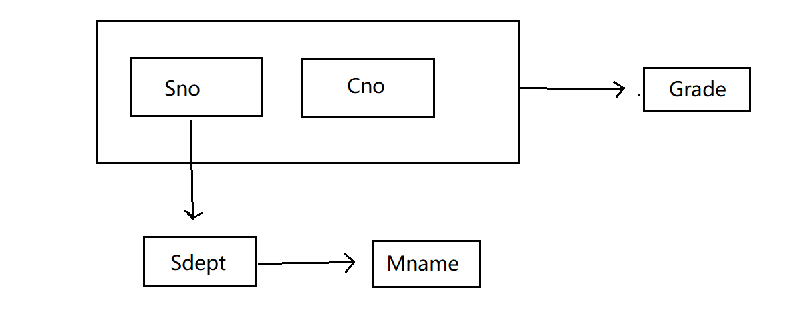

> 由以上关系图可以看出，Sno 可以 推理出 Sdept ，由此 Sdept 可以推理出 Mname。
>
> 可以说 **Mname 间接函数依赖于 Sno**，这种关系叫做**传递函数依赖**。

----

### 函数依赖存在的问题

关系模式 Student <U,F> 中存在的问题：

#### ① 数据冗余

假设如果每一个学生选修了 10 门课程，一个系有 500 个学生，那么相应的在 Student 表中就会出现 5000 条选修记录，在这 5000 条选修记录中，系主任 Mname 这个属性列的值都是一样的，重复出现了 5000 次，这相对于属性列来说，就浪费了大量的存储空间。

#### ② 更新异常

**在数据冗余的情况下，更新数据时，维护数据完整性代价大**。

如 若某系更换系主任后，相应的必须修改与该系学生有关的每一条元组，否则会出现数据不一致的异常。

#### ③ 插入异常

如果一个系刚成立，尚无学生，则无法把这个系及其系主任的信息存入数据库。

因为在 Student 这个关系模式中，属性组 U 为 {Sno、Sdept、Mname、Cno、Grade} 。这就代表如果没有学号，课程号，成绩这三列数据，是没办法插入该模式中的。

#### ④ 删除异常

如果某个系的学生毕业了，则在删除该系学生信息的同时，连带着这个系及其系主任的信息也会被删除。

【说明】

（1） Student 并不是一个 “好” 的关系模式。**一个 “好” 的关系模式应当不会发生插入异常、更新异常、删除异常，同时数据冗余应尽量少**。

（2）存在以上的问题的原因 是由存在于模式中的数据依赖引起的。

（3）解决方法是 **用规范化理论改造关系模式来消除其中不合适的数据依赖**。

---

### 函数依赖的解决方式

> 在设计数据库模式结构的初期，应当将一类事务划分为一个模式，不能将多类事务混杂在同一个模式下，这就会造成数据冗余，以及依赖问题了。就好比上个例子的 Student <U,F> 模式。

可以将 Student 这个单一的模式分成三个模式：

> 每个模式负责记录一类信息，并保持一定的联系。

- S（Sno,Sdept, Sno → Sdept） 【学生信息】

- SC（Sno，Cno，Grade，（Sno，Cno → Grade）） 【选修信息】

- DEPT（Sdept，Mname，Sdept → Mname） 【院系信息】

这三个模式都不会发生插入、删除、更新异常的问题，且数据冗余也得到了了控制，

---

## 规范化

规范化的出现是为了避免在数据库设计初期，由于数据依赖关系导致模式中出现的各种问题，而通过规范化处理后可以有效地解决此类问题。

> 不同的规范化用于解决不同的函数依赖。

### 函数依赖

【定义1】**设 R(U) 是属性集 U 上的关系模式，X、Y 是属性组 U 的子集，即 U 有 X、Y 两个属性。**

**若对于 R(U) 这个模式下任意一个可能的关系表 r，关系 r 中不存在两个元组，其在 X 上的属性值相等，而在 Y 上的属性值不等**，则称 **“X 函数确定 Y**”  或 “**Y 函数依赖于 X**” 。记住 **X → Y**。

> 即，例如 Student( Sno,Sname ) 这个关系表，假设 Sno 为 100，Sname 为 张三。在 Student 这个表中，可以通过学号 100 找到学生姓名为 张三 这个属性值，则称为 Sname 函数依赖于 Sno。但是不可能出现第二条 Sno 为 100 但是却找出 李四的情况，这就不属于函数依赖了。
>
> **函数依赖是用于一对一关系的**。

由此可以得知，**表中的 主码/候选码 与其他列一定存在有函数依赖关系**。

【例】 假设有一个关系模式 Student（Sno，Sname，Ssex，Sage，Sdept）

则该表的数据依赖为：

```mysql
Sno → Sname, Sno → Ssex, Sno → Sage, Sno → Sdept
```

假设不能重名，即 Sname 是唯一的。

则该表的数据依赖也可以为：

```mysql
Sno ←→ Sname -- Sno  和 Sname 可以互相推理出依赖关系
Sname → Ssex, Sname → Sage, Sname → Sdept
```

#### 非平凡/平凡函数依赖

① **若 X → Y，但 Y ∉ X 这个集合**，则称 X → Y 为 **非平凡的函数依赖**。

> 例如 X → Y ：（Sno,Cno） → Grade。
>
> **（Sno,Cno） 能推理出 Grade**。**但是** **Grade 不属于 （Sno,Cno） 这个集合里面的一员，则称 （Sno,Cno） → Grade 为 非平凡的函数依赖**。

② **若 X → Y，但 Y ∈ X 这个集合**，则称 X → Y 为 **平凡的函数依赖**。

> 例如 X → Y ：Sno → （Sno,Cno）。 
>
> **Sno 能推理出 （Sno,Cno），且 Sno 属于（Sno,Cno）中的一员，则称 Sno → （Sno,Cno） 为平凡的函数依赖**。

> 对于任一关系模式，平凡函数依赖都是必然存在的。

③ 若 **X → Y**，则称 **X 为这个函数依赖的决定属性组**，也称为**决定因素**。

④ 若 **X → Y**，并且 **Y ← X**，则记为 **X ←→ Y**。

⑤ 若 **Y 不函数依赖于 X**，则记为 **X /→ Y**。

---

#### 完全/部分 函数依赖

##### 完全函数依赖

**在 R(U) 模式中，如果 X → Y，并且对于 X 的任何一个真子集 X' ，都有 X' /→ Y，则成 Y 对 X 完全函数依赖**。记为
$$
X →^F Y
$$

> 即 在 R(U) 这个模式中，如果 X 能推理出 Y，并且 X 中每个子集【每个属性】。X‘ 都能 推理出 Y，那么 Y 对 于 X 就是完全函数依赖，即 **Y 对于 X 的任何一个属性都缺一不可，即需要知道 X 中所有的属性， X 才可以推理出 Y，否则无法推理出**。

**若 X → Y，但 Y 不完全函数依赖于 X，则称 Y 对 X 部分函数依赖**。记为：
$$
X →^P Y
$$

> 即 **只需知道 X 中部分属性，X 就可以推理出 Y ，不需要知道全部属性**。那么 Y 对于 X 来说就是 不完全依赖与 X，也叫 部分函数依赖。

---

【例】在 关系 SC（Sno，Cno，Grade） 中。

由于 ：Sno /→ Grade ，Cno  /→ Grade。

> 一个 Sno 不能推理出 Grade，一个 Cno 也不能推理出 Grade

因此：

（Sno，Cno） →F Grade

> **完全函数依赖**，必须同时知道 Sno  和 Cno  这两个属性才能知道 Grade 成绩这一列的值。

（Sno，Cno） →P Sno

（Sno，Cno） →P Cno

> **部分函数依赖**，只需要知道部分属性 Sno / Cno 即可推理出 Sno / Cno。

（Sno，Cno） →P Sname

> 部分函数依赖，只需要知道 Sno 就可以推理出 Sname。

---

#### 传递依赖函数

【定义3】**在 R(U) 中，如果 X → Y （Y ∉ X），Y /→ X，Y → Z，Z  ∉ Y，则称 Z 对 X 是传递函数依赖**。

记为：
$$
X →^{传递} Z
$$

> 即 在 R(U) 这个模式中，**如果 X 能推出 Y【Y 不属于 X 集合中的任何值，且 Y 不函数依赖于 X】，但 Y 能推理出 Z 【且 Z  不属于 Y】。那么就相当于  X → Y ，Y → Z，可以说 X 间接函数确定了 Z ，那么 Z 传递函数依赖于 X**。

【注意】**如果 Y → X，即 X ←→ Y，则 Z 直接依赖于 X，而不是传递函数依赖**。

> 即 **在 X 能推出 Y 的前提下，Y 也能推出 X，则代表 X、Y之间是相互依赖关系【两个唯一的属性】。那么 Z 直接依赖于 X 与 Z 直接依赖于 Y 是一样的**。

---

【例】在关系 Std（Sno，Sdept，Mname） 中，有 Sno → Sdept，Sdept → Mname，则 Mname 传递函数依赖于 Sdept。

> 即学号能推出学生所在系，所在系能推出系主任，那么学生学号与系主任之间就是传递函数依赖

---

### 码

> 也叫 **关键字、键**。

【定义】**设 K 为 R<U,F> 中的属性或属性组合。若 K →F U，则 K 称为 R 的一个候选码**。

> 即，**K 是关系R 中的一个属性或属性组，K 这个属性（组） 可以推理关系 R 的所有属性组 U，即一条记录，则 U 完全函数依赖于 K**。这个 K 就是一个候选码，可以通过一个候选码唯一确定一条记录。

若 关系模式 R 有多个候选码，则选定其中一个为 **主码【Primary Key】**。

**若 U 部分函数依赖于 K，即 K →P U，则 K 称为 超码**，**候选码是最小的超码**，即 **K 的任意一个真子集都不是候选码**。

> 即，**关系 R 中的 U 所有属性列，可以通过 K 这个集合中的某一部分的码就可以推出来，则K →P U，那么K这整个集合就称为 超码**。
>
> 例如：（Sno，Sage），Sno 是一个主码，又加了其他属性 Sage，那么这个 集合 就是一个超码。换句话说，就是**只要是含有主码的属性集合 都是超码**。而若 **属性集合里面还有候选码，那么在这个集合中 候选码就是最小的超码**。

#### 主属性/非主属性

- **主属性：包含在任何一个候选码中的属性。【任何候选码都是主属性】**

- **非主属性：不包含在任何码中的属性。【即 除了 码 的其他属性】**

- **全码：整个属性组加在一起合成的码，叫做 全码【All Key】**

---

【例】S(Sno,Sname,Sdept) ，单个属性 Sno 是码。

SC(Sno,Cno,Grade) ，（Sno,Cno） 是码。

---

【例】关系模型中 R(P,W,A)

> P: 演奏者，W：作品，A：听众

>  逻辑关系：
>
> 一个演奏者可以演奏多个作品。
>
> 一个作品可以被多个演奏者演奏。
>
> 听众可以欣赏不同演奏者的不同作品。

结合上面的逻辑关系可以发现，每一个属性单独拿出来都不能作为 码：

> 演奏者，会有多个作品记录
>
> 作品，会有多个演奏者记录
>
> 听众，会有多个欣赏记录

故将三个属性合并在一起 （P,W,A）即全码。

能确定一条由某个听众欣赏的由某个演奏者演奏的某个作品，

----

##### 外码

【定义】**在关系模式 R 中有个属性或属性组 X ，X 并非 R 的码，但 X 是另一个关系模式的码，则称 X 是 R 的外部码，也叫外码**。

【例】SC(Sno,Cno,Grade) 中，Sno 不是码，Sno 是 S(Sno,Sname,Sdeot) 的码，则 Sno 是 SC 的外码。

**主码与外部码一起提供了表示关系之间联系的手段**。

---

### 范式 * 

范式是**定义数据库设计时的一种规范化规则**。

<span style="color:red"> **范式是符合某一种级别的关系模式的集合** </span>

关系数据库中的关系必须满足一定的要求，**满足不同程度要求的关系称为不同级别的范式**。

范式分类：

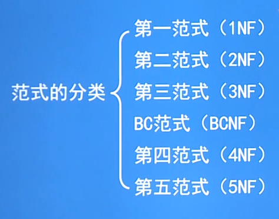

> 从**第一范式  >  第五范式对关系模式规范化的要求程度由低到高**。
>
> **第一范式是关系模型最基本的条件**。

#### 各个范式的联系

各范式联系如图：

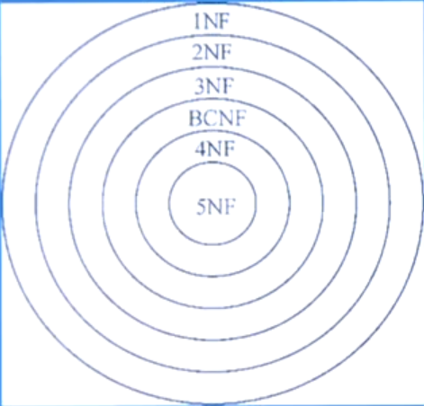

**5NF ⊂ 4NF ⊂ BCNF ⊂ 3NF ⊂ 2NF ⊂ 1NF**

- **⊂ ： 包含**。

> **每个范式之间是递进的关系**，**即 5 NF 包含了 4,BC,3,2,1 范式，4NF 包含了 BC,3,2,1NF 以此类推...**
>
> **第一范式是所有范式的基础，除了第一范式之外，其他范式都是在其后面的范式的基础上细化的**。

某一**关系模式 R 为 第 n 范式**，可简记 **R ∈ nNF**。

**规范化：是指把一个低一级范式的关系模式，通过模式分解为若干个高一级范式的关系模式集合的过程**。

> 即，将一个模式分解成三个模式，细化模式.....

#### 第一范式 1NF

第一范式：

<span style="color:red">**每个分量必须是不可再拆分的数据项【取原子值】，满足了这个条件的关系模式就属于第一范式（1NF）**</span>

> 表中的每一个属性都是独立的，不可再分的。
>
> **二维表 = 第一范式**

#### 第二范式 2NF

<span style="color:red">**若关系模式 R ∈ 1NF，并且每一个非主属性都完全函数依赖于任何一个获选码，则 R ∈ 2NF。**</span>

> 即**在关系 R 中，给定关系 R 的任一各候选码就可以推出一个属性来**。
>
> 例如：根据学号 Sno  属性（候选码）可以推理出该生的所在系 Sdept 属性。

---

##### 【例题】

有一个关系 S-L-C（Sno，Sdept，Sloc，Cno，Grade），Sloc 为学生的住处，并且每个系的学生住在同一个地方。S-L-C 的码为（Sno，Cno）。Sno 是一个候选码。

###### 该关系的函数依赖：

- (Sno,Cno) →F  Grade： 

  - Grade 完全函数依赖于（Sno,Cno）

    > 即需要结合 学生的学号和课程号才能找出相应的成绩

- Sno → Sdept ，(Sno,Cno)  →P Sdept：

  - Sdept 完全函数依赖于 Sno，部分函数依赖于  (Sno,Cno) 

    > 即知道学生学号可以知道他的所在系
    >
    > 学生号与课程号这个主码中，只需要知道学生号即可知道他的所在系

- Sno → Sloc ，(Sno,Cno)  →P Sloc ：

  - Sloc 完全函数依赖于 Sno，部分函数依赖于 (Sno,Cno) 

    > 即知道学生学号可以找到他的住处。
    >
    > 学生号与课程号这个主码中，只需要知道学生号即可知道他的住处

- Sdept →F Sloc：

  - Sloc 完全函数依赖于 Sdept

    > 即通过所在系可以知道学生的住处。

###### 函数依赖关系如下：

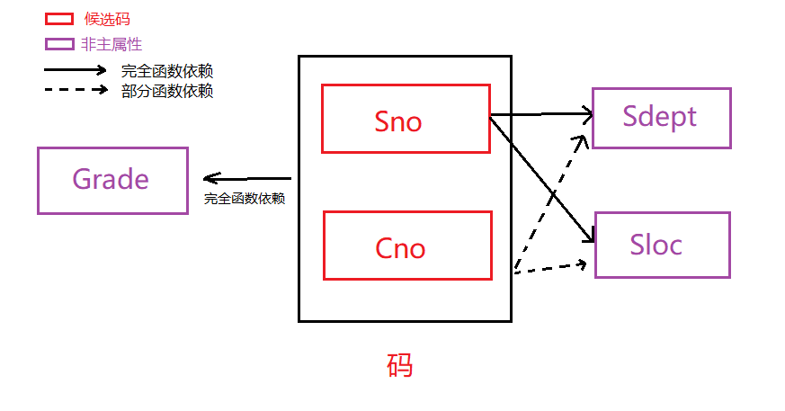

> 由图中可以看出，**非主属性Sdept、Sloc 并不完全依赖于码，故关系模式 S-L-C 不属于 2NF**。

###### 一个关系模式不属于 2NF，会产生以下问题：

① **插入异常**

​	如果插入一个新学生，但该生未选课，即没有Cno 这一列的值，由于插入元组时，必须给定码值，因此会插入失败。

② **删除异常**

​	 如果 S4 只选了一门课 C3，现在他不选这门课了，则在删除课程 C3 后，会连带关于这个学生的唯一一条元组给删除了，这就导致这个学生最后会没有信息记录。

③ **修改复杂**

​	如果一个学生选了很多门课程，则Sdept、Sloc 会被存储很多次，并且是重复的数据冗余。Sdept 所在系与 Sloc 住处理应存储一次即可。同时，如果该生转系，则需要修改所有相关的 Sdept 和 Sloc ，造成修改的复杂化。

###### 解决方法

**用投影分解把关系模式 S-L-C 分解成两个关系模式**。

> 想要解决 2NF 的问题，就是通过模式分解的方式，根据整个表属性之间的关系来判断哪些属性应该需要独立建表，并设定表之间的关联。

- SC(Sno,Cno,Grade)

  > 非主属性 Grade 对 主码(Sno,Cno) 是完全函数依赖关系。

- S-L(Sno,Sdept,Sloc)

  > 非主属性 Sdept 与 Sloc 都是对 主码 Sno  是完全函数依赖关系

这样，这两张表都符合了 2NF 的要求，即 SC ∈ 2NF，S-L ∈ 2NF。

###### 函数依赖如图：

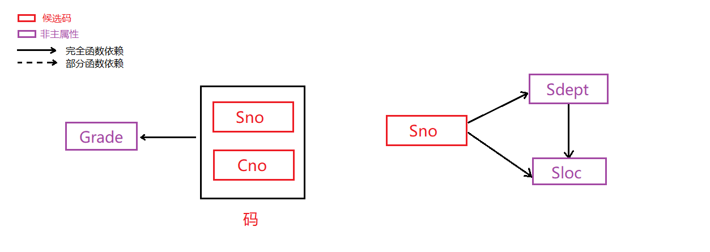

----

> 判断 Y 是否完全函数依赖于 X，就看 X 与 Y 的值是否对应唯一。
>
> 例如，学生 X  与 所在系 Y，学生的学号是唯一的，一个学生只能对应一个系，故 学号 与 所在系 两个的关系是 所在系 Y 完全函数依赖于 X，即通过 X 可以找到他唯一的所在系。

---

#### 第三范式 3NF

**设关系模式 R<U,F>  ∈ 1NF，若 R 中不存在这样的码 X、属性组 Y 和非主属性 Z（Z ∉ Y），使得 X → Y，Y→ Z 成立，Y /→ X，则称 R<U,F>  ∈ 3NF**。

> 即 **关系R 不存在有传递函数依赖，则R ∈ 3NF**。

---

【例】设有以下两个关系模式

- SC(Sno,Cno,Grade)

- S-L(Sno,Sdept,Sloc) 
  - Sloc：学生住处，Sdept ：所在系。【同一个系住在一个地方】

SC 没有传递函数依赖，故 SC ∈ 3NF。

而 S-L 中：

> Sno → Sdept （Sdept /→ Sno） ，Sdept → Sloc 
>
> 可得 Sno  → 传递 Sloc
>
> 故 S-L-C ∉ 3NF。

解决的办法：**将具有传递函数依赖的非主属性剥离出来单独建表，并与其他表建立主从关联**。

将 S-L  表分解成：

- S-D(Sno,Sdept)  ∈ 3NF
- S-L(Sdept,Sloc)  ∈ 3NF

----

#### BC 范式

BCNF (Boyce Codd Normal Form) 是由 Boyce 和 Codd 提出的，比 3NF 更进了一步。

通常认为 **BCNF 是修正的 3NF，或 扩充的第三范式**。

【定义】**设关系模式 R<U,F> ∈ 1NF，若 X → Y ，且 Y ∉ X时，X 必须包含有码，则 R<U,F> ∈ BCNF**。

> 即 **X 是一个属性/属性集，当 X 能推出 Y 时，则 X 必须是码或者全部是码。**
>
> 例如：R(Sno,Sname,Sdept)。
>
> Sno , Sname 都是唯一性质的码，通过 Sno | Sname 可推出该学生的所在系 Sdept，则 R ∈ BCNF。

换言之，**若在关系模式 R<U,F> 中每一个决定属性集都包含候选码，则 R ∈ BCNF**。

> **决定属性集：能唯一、确定一条记录的码【属性】的集合**。

##### BC 范式的性质

① **所有非主属性都完全函数依赖于每个候选码**。

> 即 **X 必须为一个码/码集，则 X → Y，Y 可以是主属性/非主属性**。

② **所有主属性都完全函数依赖于不包含它的候选码**。

> 即设定 R(Sno,Sname)，Sno 、Sname 都是唯一性质的码，**Sno ←→ Sname**。
>
> Sno 与 Sname 两个主属性都能完全函数依赖于不包含它的候选码【主属性】。

③ **没有任何属性可以完全函数依赖于非码的任何一组属性**。

> 即 设定 R(Sno,Sname,Sdept,Mname)。
>
> Sdept 是非主属性【非码】，但是 Sdept 可以推出 Manam 系主任。即 Sdept → Mname。
>
> 故 关系模式 R ∉ BCNF。

如果一个关系数据库中的所有关系模式都属于 BCNF，那么在函数依赖范畴内，它已实现了模式的彻底分解，达到了最高的规范化程度，消除了插入异常、删除异常。

----

##### 【例题1】

考察关系模式 C(Cno,Cname,Pcno)，它只有一个码 Cno，且没有任何属性对 Cno 部分函数依赖 和 传递函数依赖，即 Cno  → Cname，Cno → Pcno，故 关系 C ∈ 3NF，同时 Cno 又这个表中的码，即 X → Y【X 必须是码】，故 关系 C ∈ BCNF。

----

##### 【例题2】

​	关系模式 SJP(S,J,P) 中，S 是学生，J 是课程，P 是名次。每一个学生选修每一门课程都有相应的名次，每一门课程的每一名词对应一个学生【无并列名次】。

> 可以看出学生 - 课程 - 名次：一对一关系，即一个学生在一门课程只能有一个名次。

​	由语义上可以得出函数依赖：

- (S,J) → P：通过学生及其选修课程能得出这个学生这门课程的名次
- (J,P) → S：通过课程和名次能够得出某个具体选修了这门课程的学生。

(S,J)  和 (J,P)  都是候选码，并且都是完全函数依赖。并不能只靠一个属性就可以得出另一个属性的值。

关系模式 SJP 中没有属性间的传递函数依赖和部分函数依赖，故 SJP ∈ 3NF。

同时除了 (S,J) 与 (J,P) 以外，其他都是非主属性，即 X → Y【X 必须为码】，故 SJP ∈ BCNF。

----

##### 【例题3】

设有 关系模式 S(Sno,Sname,Sdept,Sage) ，假定 Sname 也具有 唯一性，那么 S 就有两个码，这两个码都由单一属性组成，彼此不相交。同时其他属性也不存在对码的传递依赖与部分依赖，所以 S ∈ 3NF。

同时 S 中除了 Sno，Sname之外无其他决定因素，故 S ∈ BCNF。

---

##### 【例题4】

设 关系模式 STJ(S,T,J) ，S 是学生，T是教师，J 是课程。

每一个教师只能教一门课程。每门课程可以有若干个教师，某一个学生选定一门课程，就对应一个固定的教师。

故由语义得出以下函数依赖：

> （S,T）→ J ：通过 学生和 教师可以知道对应的课程
>
> （S,J） → T：通过 学生和课程可以知道对应的教师。
>
> T → J：由于教师 - 课程是一对一关系，故知道教师就可以知道课程

因为没有任何属性对码（S,T）、（S,J）具有传递依赖和 部分依赖，故 STJ ∈ 3NF。

> 学生推出教师，但是教师不能推出 课程【课程可以有若干个教师】...

但是虽然 T → J 教师可以推出对应的课程，但是课程可由多个教师来教，故 J 不完全函数依赖于 T。

由此可得，因为 T 是决定因素【唯一性质的主属性】，但 T 并不是码【不能唯一、确定一条记录】。

则不符合 X → Y，X 必须是码的要求，故 STJ ∉ BCNF。

关系如图：

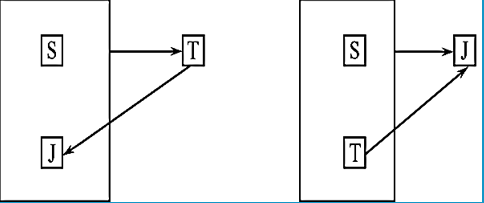


----

##### 【说明】

① **对于不是 BCNF 的关系模式，仍然存在不合适的地方。非 BCNF 的关系模式可以通过模式分为成 BCNF**

例如。STJ 可分解为 ST(S,T)，TJ(T,J) ，它们都是BFNF。

> ST(S,T)：S → T：学生能推出教师。 S  是码。
>
> TJ(T,J)：T → J：教师能推出课程。T 是码。

② **3NF 和 BCNF 是在函数依赖的条件下对模式分解所能达到的分离程度的测度**。

​	一个模式中的关系模式如属于 BCNF，那么在函数依赖范畴中，它已实现了彻底的分离，消除了插入、删除异常。

​	3NF 的 “不彻底” 性表现在可能存在主属性对码的部分依赖和传递依赖。

---

#### 多值依赖

【例】学校中某一门课程由多个教师讲授，他们使用相同的一套参考书。每一个教员可以讲授多门课程。每一种参考书可以供多门课程使用。

> 课程-教师：一对多关系。	教师- 课程：一对多关系
>
> 课程-参考书：一对多关系。	教师-参考书：一对多关系

​	用关系模式 Teaching(C,T,B) 来表示 ，课程 C 、教师 T 和 参考书 B 之间的关系。非规范化关系如下：

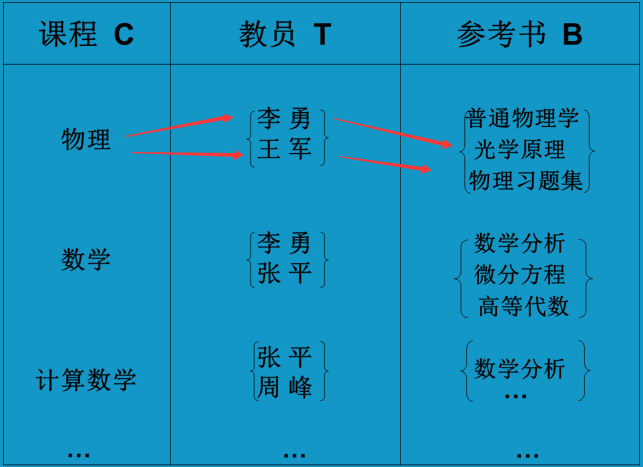

​	物理关系如下：

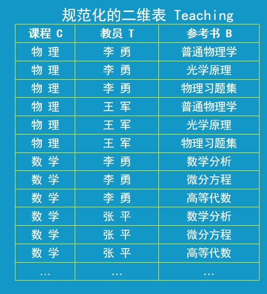

从以上关系表可以看出，Teaching 表中的任何一个属性都不能唯一确定一条记录，需要 3 个属性 C,T,B 合并时才能唯一确定一条记录，故 Teaching 的唯一候选码是 （C,T,B）即全码。

同时 Teaching 表没有传递函数依赖与部分函数依赖，故 Teaching ∈ BCNF。

以上关系存在以下问题：

① 数据冗余度大：有多少名教师，参考书就要存储多少次。

② 增加操作复杂：当某一课程增加一门教师时，该课程有多少本参考书，就要插入多少次记录。

③ 删除操作复杂：某一门课要去掉一本参考书，该课程有多少名教师，就必须删除多少条元组。

④ 修改操作复杂：某一门课要修改一本参考书，该课程有多少名教师，就必须修改多少条元组、

##### 多值依赖的定义

>  **多值依赖用于一对多关系**。即**给定一个值可以推出多个值出来**。

**设 关系模型 R(U) 是属性集 U 上的一个关系模式。X、Y、Z是 U 的子集，并且 Z = U- X- Y。关系模式 R(U) 中多值依赖 X →→ Y，当且仅当对 R(U) 的任一关系 r，给定的一对 (x,z) 值，有一组 Y 的值，这组值仅仅决定于 x 值，而与 z 值无关**。即 <span style='color:red'>**(X,Z) → Y，但 Y 的值取决于 X。**</span>

【例】在 关系 Teaching(C,T,B) 中，对于 课程 C 的每一个值，教师 T 都有一组值与之对应，而不论 B 取什么值。因此 T 多值依赖于 C，即 C  →→  T。

```mysql
例如：给定一个物理，能够推出教师组 {李勇，王军}。
```

##### 【说明】

> 即 ，属性集 U 是由 X、Y、Z 三者组成，X、Y、Z可能各自代表一个属性，或一个属性组。它们加起来 共同组成了属性集 U，【U = X+Y+Z】，同时 X 与 Y 具有多值依赖关系【 X →→ Y】。
>
> > **多值依赖（给定 X 能推出 多个 Y 的值），那么 Y 就多值依赖于 X**。不过 X 可能会是一个属性/属性组，即X = 一个属性/属性组，若 X 是一个属性，那么直接推出 Y，若 X 是一个属性组，那么就将多个属性合并在一起组成 X 来推出 Y。
>
> ```mysql
> 结合上例 Teaching 关系中，给定一个课程 C 能找出对应的课程的一套参考书【一对多】，
> 但也可以将课程C 与教师T结合在一起【X】，也能确定相应的参考书【Y】。
> ```
>
> > **多值依赖的先行条件：给定一对 （x,z）值，其中 Y 的值取决于 X 而非 Z**。
> >
> > 即，**(X,Z) 合并能推出  Y 值 ，但只要 X 的值确定了，Y 的值也随之确定，与 Z 无关**。
>
> ```mysql
> 结合上例 Teaching 中，
> 课程 C 与 教师 T 组合能确定相应的参考书B，【(X,Z) → Y】
> 但其实只要给定课程 C 的值【X】，就能确定课程对应的参考书B有哪些【Y】，但是这个过程与教师 T【Z】这个属性无关，那么参考书 B 就是多值依赖于课程 C。【C →→ B】
> ```

----

##### 另一个等价的定义

**在 R(U) 的任意关系 r 中，如果存在元组 t、s 使得 t[X] = s[X]，那么就必然存在元组 w、v ∈ r（w、v 可以与 s、t 相同），使得 w[X] = v[X] = t[X]，而 w[Y] = t[Y]，w[Z] = s[Z]，v[Y] = s[Y]，v[Z] = t[Z] 。**

**（即交换 s、t 元组的 Y 值所得的两条元组比在关系 r 中，则 Y 多值依赖于 X，记为 X →→ Y。这里的 X、Y 是 U 的子集，Z= U- X- Y）**。

> **相当于是将元组 t ，s 的 Y 值交换后 ，产生两条新元组，这两条新元组如果还在关系 r 中，那么则 Y 多值依赖于 X**、
>
> > 即，关系表 r 中有两条 X 属性列值一样的元组 t,s，那么关系 r 中 就必然还会有两条元组 w，v，且元组w、v、t 的 X 属性列一致，元组 w 与 t 的 Y 属性列一致，元组 w 与 t  的 Z 属性列一致，元组 v 与 s 的 Y 属性列一致，元组 v 与 t 的 Z 属性列一致。

---

##### 平凡/非平凡多值依赖

**若 X →→ Y，而 Z =  ∅，即 Z 为空，则称 X →→ Y  是平凡多值依赖，否则称 X →→ Y 为 非平凡多值依赖**

【例】关系模式 WSC(W,S,C) 中，W 是 仓库，S 是保管员，C 是商品。

假设每一个仓库有若干个保管员、有若干种商品。每个保管员保管所在仓库的所有商品，每种商品都被保管员所保管。

> 关系：仓库 -  保管员：一对多关系 ，	仓库 - 商品：一对多关系，	 保管员-商品：一对多关系

关系表如下：

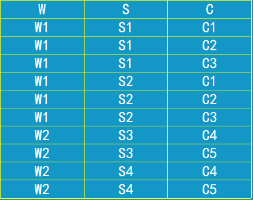

按照语义约束，可以得出：

> 对于W 的每一个值，S 都会有一个值的集合与之对应，而不用管 C 取什么值，且 商品 C 取什么值与保管员 S 无关，由 仓库 W 来取决。
>
> 构成了 X →→ Y ，但 Y值的确定取决于 X 值，与 Z 无关。故 W →→ S 【S 多值依赖于 W】

关系如图：

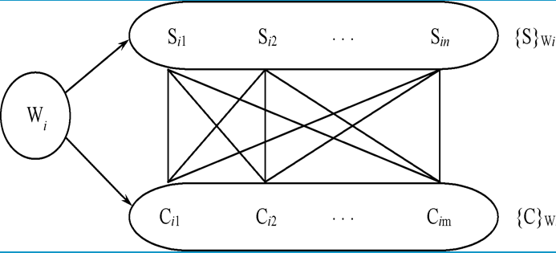

> 由以上关系图可以看出，
>
> W 可以对应 多个 C 值，以及 多个 S 值。
>
> 即 C 的值取决于 W，S 的值也取决于 W。【**S 与 C 的值对称于 W 的值**】
>
> 但 C 的值不取决于 S，故 (W,S) → C，W → C 【C 多值依赖于 W，但 C 的值取决于 W，与 S 无关】

【说明】

① **对应 W 的某一个值 Wi 的全部 S 值记为 {S}Wi。【表示此仓库工作的全部保管员】**

② **全部 C 值记为 {C}Wi。【表示此仓库所存放的所有商品】**

③ **应当有 {S}Wi 中的每一个值和 {C}Wi 的每一个值 C 对应**。

> 即，每一个管理员 Si，都对应着该仓库的每一种商品 {C}Wi。

④ **于是 {S}Wi 与 {C}Wi 正好形成了一张二分图，故 W →→ S**。

> 即，每一个仓库都有若干个保管员，若干个商品，保管员可以保管所有商品，但不具备存在关系。
>
> 故 保管员 S 多值依赖于 仓库 W。

⑤ **由于 S 和 C  的完全对称性，必然有 W →→ C**。

> 由于 保管员S 与 商品C 之间都对仓库有多值依赖关系，换言之即，没有仓库就没有保管员和商品，所以保管员与商品构成了对称关系，所以 商品C 也多值依赖于 仓库W。

---

##### 多值依赖的性质

①  <span style="color:red">**多值依赖具有对称性。**</span>

**若 X →→ Y，则 X →→ Z，其中 Z = U - X - Y**。

> 即，**如果 Y 多值依赖于 X，Z 也多值依赖于 X，那么 Z 属性列的值就是 整个属性集 U 与 X 、Y 两列之间的差集。【除去 X、Y、U 三个集合的值，剩下的就是 Z 值】**

从上例可以看出，因为每个保管员保管所有商品，同时每种商品被所有保管员保管，显然若 W →→ S，必然有 W →→ C。【保管员多值依赖于仓库，必然商品也多值依赖于仓库】。

② <span style="color:red">**多值依赖具有传递性**</span>

**若 X →→ Y，Y →→ Z ，则 X →→ Z-Y**。

> 即**如果 Y 多值依赖于 X，Z 多值依赖于 Y，那么 Z 与 Y 的差集就多值依赖于 X**。
>
> Z-Y 差集：**值在 Z 集，不在 Y 集**。

③ <span style="color:red">**函数依赖是多值依赖的特殊情况**</span>

**若 X → Y，则 X →→ Y**。

> **函数依赖：一对一关系。 多值依赖：多对多关系。【一对一是一对多的特例】**
>
> **如果 X 能推出 Y，那么必定 Y 可以多值依赖于 X**。

④ <span style="color:red">**若 X →→ Y，X →→ Z，则 X →→ YZ【Y ∪ Z】**</span>

> **如果 Y 多值依赖于 X，Z 也多值依赖于 X，那么 Y 与 Z 的并集 也多值依赖于 X。**
>
> 并集**：将两个值合并在一起**。

⑤ <span style="color:red">**若 X →→ Y，X →→ Z，则 X →→ Y ∩ Z**</span>

> **如果 Y 多值依赖于 X，Z 也多值依赖于 X，那么 Y 与  Z 的交集 也多值依赖于 X。**
>
> 交集：**值即在 Y 集，又在 Z 集**。

⑥ <span style="color:red">**若 X →→ Y，X →→ Z，则 X →→ Z- Y，X →→ Y- Z**</span>

> **如果 Y 多值依赖于 X，Z 也多值依赖于 X，那么 Y 与 Z 的差集，以及 Z 与 Y  的差集 也多值依赖于 X**
>
> 即 **在 Y 不在 Z 里面的值集，与 在 Z 不在 Y 的值集，都多值依赖于 X**。

---

##### 多值依赖和函数依赖的区别

① **多值依赖的有效性与属性集的范围有关**。

###### 多值依赖

**若 X →→ Y 在属性集 U 上成立，则在 W【U的子集】（X∪Y ∈ W ∈ U）上一定成立。**

**反之则不然，即 X →→  Y 在 W（W∈U）上成立，在 U上并不一定成立**。

**原因：多值依赖的定义中不仅涉及属性组 X 和 Y，还涉及到 U 中的 Z**。【**U = X ∪ Y ∪ Z**】

一般地，**在 R(U) 上若有 X →→ Y 在 W（W∈U）上成立，则称 X →→ Y 为 R(U) 的嵌入型多值依赖**。

> 即 **如果 Y 多值依赖于 X 这个关系，在属性集U 上成立，那么在 W 子集上也一定成立。**
>
> **【X 和 Y 的并集属于 W，而 W 是 U 的子集】**
>
> **相反，在 W 子集上成立，而在 属性集 U 上不一定成立**。
>
> 因为 **多值依赖的前提条件是 属性集 U 是 X、Y、Z 的并集组成的，若 只有W 子集中只有 X、Y 两个属性，那么则无法构成多值依赖关系**。
>
> **在关系模式 R(U) 上，如果 Y 多值依赖于 X 的关系在 W 子集上成立，那么相当于是 W 子集嵌入到 U 属性集中，而 W 的这个 X →→ Y 也叫 嵌入型多值依赖**。

###### 函数依赖

**函数依赖 X → Y 的有效性仅取决于 X、Y 这两个属性集的值。**

**只要在关系模式 R(U) 的任一关系 r 中，元组在属性列 X 和 Y 的值满足【给定 X 一个值能唯一确定 Y 的一个值】 这个条件，则函数依赖 X → Y 在任何属性集 W(X∪Y ∈ W ∈ U) 上都成立**。

---

②**若函数依赖 X → Y 在R(U) 上成立，则对于 任何 Y' ∈ Y 均有 X → Y' 成立。**

多值依赖 X  →→  Y 若在 R(U) 上成立，也不能保证对于任何 Y' ∈ Y 有 X →→ Y' 成立。

> 即，**如果 在 关系 R(U) 上 属性 Y 函数依赖于X，那么 Y的子集 Y' 也会函数依赖于 X**。
>
> 而如果是 Y 多值依赖于 X，但也不能保证 Y 的子集 Y' 也会多值依赖于 X。

【例】关系 R(A,B,C,D) ，A →→ BC 成立，也有 A →→ D 成立。

有一个 R 的关系实例表 r 如下，在此实例上 A →→ B 是不成立的。

> A 【X】→→ BC【Y】：BC 两个属性集组成 Y ，属性集 A 为 X。即 BC 的组合值 多值依赖于 A
>
> A →→ D ： D 多值依赖于 A
>
> A →→ B： B 是 Y 中BC 的一个子集，即 Y'【B】 属于 Y【BC】

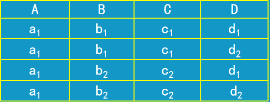

> 首先，A →→ BC 成立 与   A →→ D 成立 ：
>
> >  当 A = a1 时，BC = { {b1,c1},{b2,c2} }，D = {d1,d2}。
> >
> > A 、BC、D 属性列的分量值，都是一一对应的，即 b2 - c2...。
>
> 之所以 BC 的子集 多值依赖于 A 这个关系在此实例上不成立，是因为：
>
> 若拿 B 作为 Y，那么 CD 就得 作为 Z。
>
> > 当 A = a1 时，B = {b1,b2}，CD = { {c1,d2},{c2,d1} }
> >
> > 可以发现，若 B 作为 Y ，那么 作为 Z 的CD属性集 所取的值就不对应了，则 B 不能多值依赖于 A

---

#### 第四范式 4NF

> 第四范式就是根据多值依赖的理论来细分的。

【定义】**关系模式 R<U,F> ∈ 1NF，如果对于 R 的每个非平凡多值依赖 X →→ Y （X ∉ Y），X 必须为码，则 R<U,F> ∈ 4NF**。

> 即，**在非平凡多值依赖的前提下，即 Z 不能为空， Y 多值依赖于 X，那么 X 必须为码**。

【说明】

① **4NF 是限制关系模式的属性之间不允许有非平凡且非函数依赖的多值依赖。4NF 所允许的非平凡多值依赖实际是函数依赖**。

> 即，**4NF 允许属性之间有非平凡多值依赖，而这个多值依赖实际是函数依赖，即一对一关系**。

② **如果一个关系模式是 4NF，则必为 BCNF**。

> BCNF 是函数依赖【一对一】，4NF 是多值依赖【一对多】。

③ 在上例的关系 WSC 中，W →→ S，W →→ C，它们都是非平凡多值依赖【Z不为空】，但 W 不是码，关系模式 WSC 的码是（W,S,C）全码，因此 WSC ∉ 4 NF。

可以把 WSC 分解成 WS(W,S) 【W →→ S】，WC(W,C) 【W →→ C】，WS ∈ 4 NF，WC ∈ 4NF。

---

### 小结

1. 在关系数据库中，**对关系模式的基本要求是第一范式**。
2. 规范化程度过低的关系不一定能够很好地描述现实世界。可能存在插入、删除异常，修改复杂、数据冗余等问题，解决方法就是对其进行规范化，转换为高级范式。
3. 一个低一级范式的关系模式，通过**模式分解**可以转换为若干个高一级范式的关系模式集合，这种过程叫做**关系模式的规范化**。
4. **关系数据库的规范化理论是数据库理论设计的工具**。

### 规范化的基本思想

① **逐步消除数据依赖中不合适的部分，使模式中的各关系模式达到某种程度的 “分离”。**

② **采用 “一事一地” 的模式设计原则**。

**让一个关系描述一个概念、一个实体或者实体间的一种联系。若多于一个概念就把它分离出去。**

**因此规范化实质上是概念的单一化**。

---

不能说规范化程度越高的关系模式就约好。

必须对现实世界的实际情况和用户应用需求作进一步分析，确定一个合适的、能够反映现实世界的模式。

---

### 规范化的过程

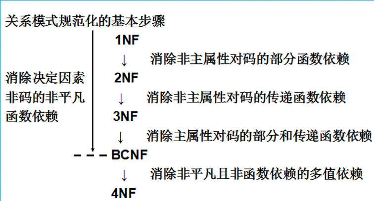

----

## 数据依赖的公理系统

【定义】**对于满足一组函数依赖 F 的关系模式 R<U,F>，任何一个关系 r，若函数依赖 X → Y 成立（即 r 中任意两个元组t、s，若 t[X] = s[X]，则 t[Y] = s[Y]），则称 F 逻辑蕴涵 X → Y**。

> 即，**假设在关系模式 R<U,F>中，F 中显式存在一种函数依赖关系【X → A，X → B】，根据{X→，X → B} =>  X → AB【并集】，故 X → AB 这个函数依赖关系是隐式蕴涵在 F 中**。 

### Armstrong 公理系统

Armstrong 公理系统：**是一套推理规则，是模式分解算法的理论基础。主要用于求给定模式的码，从一组显式的函数依赖中求得蕴涵的函数依赖**。

Armstrong 公理系统  设 U 为属性集总体，F 是 U 上的一组函数依赖，于是有关系模式 R<U,F>，对 R<U,F> 有以下的推理规则：

#### A1自反律

**若  Y ∈ X ∈ U，则 X → Y 为  F 所蕴涵。**

> 即**若 Y 属于 X 的子集，X 属于 U 的子集，那么 X → Y 能成立**。
>
> 其实就是**平凡函数依赖**。
>
> 即 (Sno,Sname) → Sno。（Sno,Sname） 是 X  ，Sno 是 Y，它必然能推出 Sno 这个属性 X。

【注意】**由自反律所得到的均是平凡的函数依赖，自反律的使用并不依赖于 F。**

#### A2 增广律

**若 X → Y 为 F 所蕴涵，且 Z ∈ U，则 XZ → YZ 为 F 所蕴涵**。

> 即 **U 上有 X、Y、Z 三个属性集，Y 函数依赖于 X，那么相对的 X 与 Z 的并集能够推出 Y 与 Z 的并集，这个关系也会成立**
>
> 例 U（Sno，Sname，Sdept） ，Sno → Sname。（Sno,Sdept） →  （Sname,Sdept）

#### A3 传递律

**若 X → Y，Y→ Z为 F 所蕴涵，则 X → Z 也为F 所蕴涵**。

> 即 **X 能推出 Y，Y 能推出 Z，那么 X 能间接推出 Z 也能成立**。
>
> 例 U(Sno,Sdept,Mname) ,Sno → Sdept，Sdept → Mname，故 Sno → Mname。

---

##### 【定理证明】

Armstrong 推理规则是正确的。下面从定义出发证明推理规则的正确性：

证明：

###### ① 设 Y ∈ X ∈ U

**对 R<U,F> 的任一关系 r 中的任意元组 t、s：若 t[X] = t[X] ，由于 Y ∈ X ，则有 t[Y] = s[Y] ，所以 X → Y 成立，自反律得证**。

> 例，X （学生姓名，年龄），Y ：年龄
>
> t[x] = s[x]  ：t[张三]  = t[张三] 
>
> t[Y] = s[Y]：t[19] = s[19] 【t、s 取的都是 X 集合里的 年龄 列值。】
>
> 故：X → Y = （学生姓名，年龄） → 年龄。

###### ② 设 X → Y 为 F 所蕴涵，且 Z ∈ U

**设 R<U.F> 的任一关系 r 的两条元组 t、s：若 t[XZ] = s[XZ] ，则有 t[X] = s[X] ，t[Z] = s[Z]。由于 X → Y，于是有 t[Y] = s[Y]，所以 t[YZ] = s[YZ]，故 XZ →  YZ 为 F 所蕴涵，增广律得证**。

> 例 ：（学生姓名，年龄），X ： 学生姓名，Y：年龄。
>
> t[XZ] = s[XZ] ：t[张三，19]  = s[张三，19]
>
> 则 t[X] = s[X] ：t[张三] = s[张三]，t[Y] = s[Y] ：t[19] = s[19] 
>
> 由于，X → Y，若 学生姓名 → 所在系。即 张三 → 医学系
>
> 故 t[医学系]  = s[医学系]，则 t[医学系，19] = s[医学系，19]，
>
> 根据 学生姓名 → 所在系，故 （学生姓名，年龄）→ （所在系，年龄）成立。

###### ③ 设 X → Y，Y → Z 为 F 所蕴涵

**对 R <U,F> 的任一关系 r 中的任意元组 t、s：若 t[X] = s[X]，由于 X → Y ，有 t[Y] = s[Y]；再由 Y → Z，有 t[Z] = s[Z] ，所以 X → Z 为 F 所蕴涵，传递率得证**。

> 即，假设 X、Y、Z 为 (姓名,年龄,出生日期)
>
> >  X → Y，Y → Z ：姓名 →  年龄，年龄 → 出生日期
>
> 假设 X：张三，Y：19，出生日期：2004
>
> 若 t[张三] = s[张三]，由于 姓名 → 年龄，有t[19] = s[19]，及年龄 → 出生日期，有 t[2004] = s[2004]
>
> > 即 X 	Y 	  Z
> >
> > t 张三  19  2004
> >
> > s 张三 19  2004
>
> 所以，X → Z，成立。

----

#### 扩展推理规则

根据A1、A2、A3 这 三条推理规则可以再次得到下面三条推理规则：

##### 合并规则

**由于 X → Y，X → Z，故 X → Y∪Z**。

> 即，**由于 X 能推出 Y，X  也能推出 Z，那么 X 就能推出 Y 与 Z 的并集**。
>
> 例：(Sno,Sname,Sdept)，Sno → Sname，Sno → Sdept ,。故 Sno  → （Sname,Sdept）

##### 伪传递规则

**由于 X → Y，WY → Z，则 XW → Z**。

> 即，由于 X 能推出 Y【相当于 X = Y 】，那么 W ∪ Y 能推出 Z，相同的， X ∪ W 也能推出 Z。
>
> 例：(Sno,Sname,Sdept,Dormitory) ：Dormitory 宿舍号。
>
> Sno → Sname，(Sdept,Sname) → Dormitory    = （Sno,Sdept） → Dormitory。

##### 分解规则

**由于 X → Y ，Z ∈ Y。则有 X → Z**。

> 即，**X能推出Y 属性集，那么属于 Y 的子集 Z，也能被 X 推出**

##### 【引理1】 

**X → A1A2....Ak  成立的充分必要条件是 X → Ai 成立（i = 1,2，...，k）**。

> 即 **若 X 能推出 A1A2...Ak 所有的并集，那么 X 必然能推出其中的 A1、A2、..、Ak 每个子集**

#### 【定义12】

**在关系模式 R<U,F> 中为 F 所蕴涵的函数依赖的全体叫做 F 的闭包，记为 F+。**

> 即 **能被 F 所推理出来的所有函数依赖关系统称为 F 的闭包。【自反律，增广律，传递率....】**

【说明】

① **自反律、传递率、增广律 称为 Armstrong 公理系统。**

② Armstrong 公理系统具有**有效性**和**完备性**。

- **有效性：是指由F 出发 根据 Armstrong 公理系统推理出来的数据依赖一定存在于 F+ 中。**

- **完备性：是指 F+ 中的每一个函数依赖，必定可以由  F 出发 根据 Armstrong 公理系统推导出来。**

>  **有效性：Armstrong 公理系统能推导出来函数依赖。**
>
> **完备性**：**F 中的所有函数依赖都能通过 Armstrong 公理系统推理出来。**

#### 【定义13】

**设 F 为属性集 U 上的一组函数依赖，X、Y ∈ U，X+F = {A | X → A 能由 F 根据 Armstrong 公理系统导出}，X+F 称为属性集 X 关于函数依赖集 F  的闭包。**

> **X+F ： X 这个属性在 F 上所有的函数依赖【X 的闭包】**
>
> 即，**X 这个属性集可以根据在 F上已有的X 的函数依赖，通过 Armstrong 公理系统来推导出其所有的函数依赖**。
>
> 假设：(AB)+F ，(AB)+F 里面的 AB 两个属性集的所有函数依赖可以通过，F(A → C，B → D) 中 A → C，B → D 这些依赖推导出 AB 其他的函数依赖全体【即 闭包】。

##### 【引理2】

**设 F 为属性集 U 上的一组函数依赖，X、Y ∈ U，X → Y 能由 F 根据 Armstrong 公理导出的充分必要条件是 Y ∈X+F**。

> 即，**若 X、Y 属于 属性集U，且 X 能推出 Y，则 X → Y 这个关系所能推导出的依据是 Y 是属于 X 在 F 上的函数依赖集合的**。
>
> 例如，假设 F(X → Y，X → B)，（X → Y，X → B） 是 X 在 F 上的函数依赖集合，即 X+F，所以，若想要 让 X → Y 这个关系成立，则 Y 是必然属于 X 在 F 上的函数依赖集合中。


