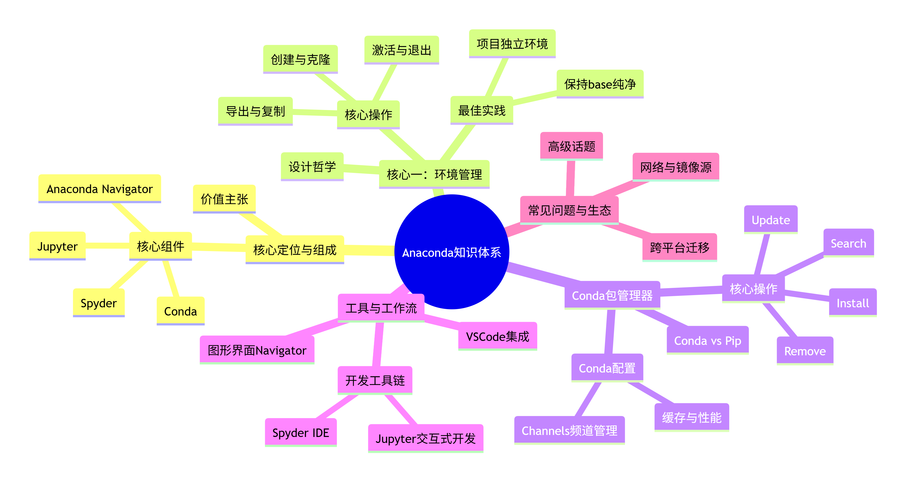
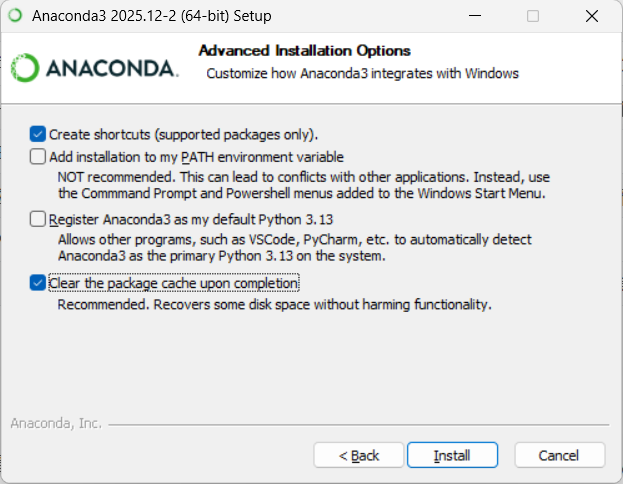

# 环境管理

> [!NOTE]
>
> 现代 Python 的环境管理主要分为 2 种方式：
>
> - **原生 Python 环境管理**：需要不同的插件工具共同分工。
>
>   - **`pyenv` 版本管理工具**
>   - **`pip` 包管理工具**
>   - **`venv` 虚拟环境管理工具**
>
>   是最**原始**的 Python 环境管理方式
>
> - **`Anaconda` 集成平台**：综合了**包管理、虚拟环境管理、Python 版本管理**等工具为一体的平台，此外还额外提供了 ：
>
>   - **`Anaconda Navigator` 图形化界面**
>   - **`Jupyter Notebook/Lab` Web 交互式开发环境**
>   - **`Spyder` 专为科学计算设计的 IDE**
>
>   是现如今 Python 应用**最广泛、最强大、功能最全**的环境集成平台。

## 原生 Python 环境管理

### pyenv 版本管理

`pyenv` 是一款轻量级的 **Python 版本管理工具**，它能让你在同一台电脑上方便地安装、切换和管理多个 Python 版本，并且**不会干扰系统自带的 Python 环境**。

#### 为什么需要 pyenv ？

主要是为了管理用户本地系统与遗留项目的 Python 版本。

```
项目A：需要 Python 3.8（遗留系统）
项目B：需要 Python 3.10
项目C：需要 Python 3.12（最新特性）
系统：默认 Python 3.11

没有 pyenv：频繁卸载重装 Python 版本
有 pyenv：一键切换！
```

#### 工作原理

```
pyenv 接管 PATH 环境变量
    ├── ~/.pyenv/versions/
    │   ├── 3.8.18/（项目A使用）
    │   ├── 3.10.13/（项目B使用）
    │   ├── 3.11.8/（系统默认）
    │   └── 3.12.0/（项目C使用）
    └── shims/（拦截 python 命令）
```

每个通过 `pyenv` 安装的 Python 版本都有**完全独立**的包目录：

```
~/.pyenv/versions/
├── 3.11.0/
│   ├── Lib/site-packages/    # 3.11.0 的包
│   └── Scripts/              # 3.11.0 的可执行文件
├── 3.12.0/
│   ├── Lib/site-packages/    # 3.12.0 的包
│   └── Scripts/
└── 3.14.3/
    ├── Lib/site-packages/    # 3.14.3 的包
    └── Scripts/
```

切换 Python 版本后**包不会共享**：

```bash
$pyenv global 3.11.0
$pip list    # 显示 3.11.0 安装的包

$pyenv global 3.14.3
$pip list    # 显示 3.14.3 安装的包（不同的列表）
```

#### pyenv-win （Windows）

由于原生的 `pyenv` 不支持 Windows，你需要安装其移植版本 **`pyenv-win`**。

##### 1. 运行安装脚本

这是官方最推荐的安装方式，通过 PowerShell 一键完成。

1. 右键点击“开始”菜单，选择 **Windows PowerShell (管理员)** 或 **终端 (管理员)**。

   > 注意：按下键盘上的 `Win` 键，在搜索框中输入 `PowerShell`，在搜索结果中，**右键点击** “Windows PowerShell”，选择 **“以管理员身份运行”**。

2. **先解除脚本执行限制**：复制粘贴以下命令，回车执行（输入 `Y` 确认）：

   ```bash
   Set-ExecutionPolicy RemoteSigned -Scope LocalMachine
   ```

3. **执行安装命令**：接着复制粘贴以下完整命令，回车运行：*(这个脚本会自动下载并配置好环境变量)*

   ```bash
   Invoke-WebRequest -UseBasicParsing -Uri "https://raw.githubusercontent.com/pyenv-win/pyenv-win/master/pyenv-win/install-pyenv-win.ps1" -OutFile "./install-pyenv-win.ps1"; &"./install-pyenv-win.ps1"
   ```

4. **验证是否安装成功**：`pyenv-win` 默认会安装到 Windows 的 `C:\<用户名>\.pyenv\pyenv-win` 目录

   ```bash
   $pyenv --version
   
   # pyenv 3.1.1
   ```

##### 2. 配置 PATH 环境变量

`pyenv` 的工作原理是在 `PATH` 中插入两个特殊目录（**`shims` 和 `bin`**），用于**拦截所有 `python` 命令**。

> `pyenv` 会默认安装到 `C:\Users\<用户名>\.pyenv\pyenv-win` 目录下

###### 配置环境变量

按 `Win + S` 搜索“编辑系统环境变量” → 点击“环境变量”：

- 在 **用户变量** 或 **系统变量** 中，找到 `Path`，点击编辑。

- 添加以下两行（把 `你的用户名` 换成你的实际用户名）：

  > 注意一定是 `\shims` 目录路径在前，`\bin` 目录路径在后

```
%USERPROFILE%\.pyenv\pyenv-win\shims
%USERPROFILE%\.pyenv\pyenv-win\bin
```

###### 关闭 Windows 应用执行别名

这是 Windows 10/11 上一个很隐蔽的干扰源。系统自带的 `python.exe` 别名会跳转到 Microsoft Store 应用商店，这一步是**抢在 pyenv 之前截获命令**。

**操作步骤：**

1. 按 `Win + I` 打开 **设置**。
2. 搜索 **“应用执行别名”**（或依次进入：应用 → 高级应用设置 → 应用执行别名）。
3. 在列表中找到 **Python** 和 **Python3**，把它们的开关 **关闭**。

##### 3. 安装指定 Python 版本

打开 `cmd`：

- 查看所有可安装的 Python 版本列表：

  ```bash
  pyenv install --list
  ```

- 安装指定 Python 版本：*（将 3.14.4 设为系统默认）*

  ```bash
  pyenv install 3.14.4
  ```

- 设置并激活全局 Python 版本：

  ```bash
  pyenv global 3.12.0
  ```

- 验证生效：

  ```bash
  python --version
  ```

#### 版本切换

`pyenv` 通过 **`global`、`local`、`shell`** 三个命令提供了不同粒度的版本控制，其优先级为：**shell > local > global**。

| 命令                    | 作用范围              | 说明                                                         |
| :---------------------- | :-------------------- | :----------------------------------------------------------- |
| `pyenv global <版本号>` | **全局**级别          | 为当前**用户**设置默认版本，影响该用户下所有的 `cmd`终端会话。 |
| `pyenv local <版本号>`  | **项目/目录**（局部） | 在当前项目**目录**下生成一个 `.python-version` 文件，每次进入该目录时会自动切换。 |
| `pyenv shell <版本号>`  | **当前会话**（临时）  | 仅在**当前终端窗口**临时生效，优先级最高。                   |

作用：当项目使用了不同版本的 Python，又不想重装系统的 Python 时，可以通过 `pyenv` 提供的版本切换功能来实现 **在不同环境的Python 版本管理**。

```bash
# 1. 安装两个版本用于测试
pyenv install 3.14.4
pyenv install 3.11.0

# 2. 设置全局版本（系统默认使用 3.14.4）
pyenv global 3.14.4
python --version  # 输出: Python 3.14.4

# 3. 进入项目 A，为该项目单独锁定 3.11.0
cd ~/project-A
pyenv local 3.11.0
python --version  # 输出: Python 3.11.0 (因为该目录下有 .python-version 文件)

# 4. 回到用户目录，版本恢复为全局的 3.14.4
cd ~
python --version  # 输出: Python 3.14.4
```

#### 常用命令

##### pyenv versions

作用：列出所有**已安装**的 Python 版本，**带 `*` 星号**的是**当前激活的版本**。

```bash
pyenv versions

# * 3.14.3 (set by C:\Users\win\.pyenv\pyenv-win\version)
```

##### pyenv which python

作用：查看**当前激活**的 Python 的安装位置。

```bash
pyenv which python

# C:\Users\win\.pyenv\pyenv-win\versions\3.14.3\python.exe
```

##### pyenv install --list

作用：列出所有可以安装的 Python 版本，通常需要配合 `grep` 来查找。

##### pyenv install <版本号>

作用：安装指定版本的 Python，例如 `pyenv install 3.14.4`。

##### pyenv uninstall <版本号>

作用：卸载指定版本，以释放磁盘空间。

### pip 包管理工具

`pip`是 Python 的**官方包管理工具**，负责从 Python 包索引（PyPI 官网）上下载、安装、卸载和管理第三方库。

通常情况下，**Python 3.4 及以上版本**会自动安装 pip。可以在终端（命令提示符或 PowerShell）中输入以下命令来确认：

```bash
pip --version
```

升级 `pip`：

```bash
python -m pip install --upgrade pip
```

#### pip 常用命令

以下是一些最常用的 pip 命令，覆盖了日常开发的大部分需求：

| 操作类型           | 命令示例                          | 说明                                           |
| :----------------- | :-------------------------------- | :--------------------------------------------- |
| **安装包**         | `pip install <包名>`              | 安装最新版本                                   |
|                    | `pip install <包名>==1.0.4`       | 安装指定版本（例如 1.0.4）                     |
|                    | `pip install package>=1.0,<2.0`   | 安装指定范围版本的包                           |
|                    | `pip install -r requirements.txt` | **批量安装**文件中列出的所有包                 |
| **卸载包**         | `pip uninstall <包名>`            | 卸载已安装的包                                 |
| **查看包**         | `pip list`                        | 列出当前环境所有已安装的包                     |
|                    | `pip list -v`                     | 列出当前环境所有已安装的包信息（包括存储位置） |
|                    | `pip show <包名>`                 | 查看某个包的详细信息                           |
| **升级包**         | `pip install --upgrade <包名>`    | 将指定包升级到最新版本                         |
| **搜索包**         | `pip search <关键词>`             | 在 PyPI 仓库中搜索包（部分源可能已禁用）       |
| **导出依赖包列表** | `pip freeze > requirements.txt`   | 将当前环境的包列表导出到文件，用于项目依赖管理 |

#### requirements.txt 包列表文件

由于 Python 项目只能通过 `pip list` 命令查看当前项目环境所有已安装的依赖包。

为了方便查看包列表，可通过 **`pip freeze`** 命令将所有依赖包**导出**到 **`requirements.txt`** 文件中查看：

```bash
# 包名 == 包版本
# 直接指定版本
Django==4.2.0
requests==2.31.0

# 版本范围
numpy>=1.20.0,<2.0.0

# Git 仓库
git+https://github.com/psf/requests.git

# 本地包
./packages/mypackage-1.0.0.tar.gz
```

#### 配置相关

##### 配置层级

`pip` 的配置管理采用**分层优先级**结构，从最通用到最具体依次为：**全局 (global) → 用户 (user) → 站点 (site)**。**层级越具体，优先级越高**。

| 层级              | 作用范围                                                     | 配置文件名 (Windows)                                         |
| :---------------- | :----------------------------------------------------------- | :----------------------------------------------------------- |
| **全局 (global)** | 计算机上的**所有用户**和所有环境。通常需要管理员权限才能修改。 | `C:\ProgramData\pip\pip.ini`                                 |
| **用户 (user)**   | **当前登录的用户**，作用于其所有Python环境。这是最常用的配置层级。 | `%APPDATA%\pip\pip.ini` (如 `C:\Users\你的用户名\AppData\Roaming\pip\pip.ini`) |
| **站点 (site)**   | **单个虚拟环境**，优先级最高，专用于覆盖其他配置。           | `%VIRTUAL_ENV%\pip.ini`                                      |

优先级：**`site 当前虚拟环境 > use 用户 > global 全局`**。

- **指定配置层级进行设置**：

  可以通过 **`--global`、`--user`、`--site`** 参数指定将配置写入哪个文件。

  ```bash
  # 写入全局配置（可能需要管理员权限）
  pip config --global set global.index-url https://mirrors.aliyun.com/pypi/simple/
  
  # 写入当前虚拟环境的配置
  pip config --site set global.index-url https://mirrors.aliyun.com/pypi/simple/
  ```

##### 常用配置命令

- 添加配置项：

  ```bash
  pip config set [global].xxx=yyy
  ```

- 获取配置项

  ```bash
  pip config get [global].xxx
  
  # > pip config get global.index-url
  #   https://pypi.tuna.tsinghua.edu.cn/simple/
  ```

- 列出所有配置：

  ```bash
  pip config list
  ```

##### 镜像加速

由于默认的 PyPI 官方源在国外，下载速度可能很慢甚至失败。建议配置国内的镜像源，下载速度会快很多。

- **临时使用**（以清华源为例）：

```bash
# 在安装包时临时指定替换镜像源：
pip install <包名> -i https://pypi.tuna.tsinghua.edu.cn/simple

# 添加额外索引源而不替换默认源：
pip install <包名> --extra-index-url https://mirrors.aliyun.com/pypi/simple/

# 使用 -i 或 --index-url 时，pip 只会从指定源查找包；使用 --extra-index-url 时，会同时从默认源和额外源查找。 
```

- **永久配置**：

  - 一键设置命令：

    > 该命令会自动在 `C:\Users\用户名\AppData\Roaming\pip` 目录下创建 `pip.ini` 配置文件，并写入配置。
    >
    > ```
    > [global]
    > index-url = https://pypi.tuna.tsinghua.edu.cn/simple/
    > ```

    ```bash
    pip config set global.index-url https://pypi.tuna.tsinghua.edu.cn/simple/
    ```

  - 手动配置（如命令无效）：

    - **Windows**：在 `C:\Users\你的用户名\pip\`目录下创建 `pip.ini` 文件，写入以下内容：

    ```
    [global]
    index-url = https://pypi.tuna.tsinghua.edu.cn/simple/
    
    [install]
    trusted-host = pypi.tuna.tsinghua.edu.cn
    ```

  - 验证配置：

    ```bash
    pip config list
    
    # global.index-url='https://pypi.tuna.tsinghua.edu.cn/simple/'
    ```

**常用国内镜像源地址**：

- **清华大学**： `https://pypi.tuna.tsinghua.edu.cn/simple`
- **阿里云**： `https://mirrors.aliyun.com/pypi/simple/`
- **华为云**： `https://repo.huaweicloud.com/repository/pypi/simple`

### venv 虚拟环境隔离

#### 什么是虚拟环境？

**虚拟环境**是 Python 的一个**独立的环境管理工具**，它可以在**同一台机器上创建多个互相隔离的 Python 运行环境**。

- venv 是 Python 3.3+ 内置的虚拟环境工具，无需额外安装，是最基础和最常用的选择。

#### 为什么需要它？

```bash
# 项目A 需要 Django 2.2
# 项目B 需要 Django 4.0
# 如果没有虚拟环境，全局只能安装一个 Django 版本，会造成冲突

项目A: Django 2.2
项目B: Django 4.0  ← 冲突！无法同时安装
```

#### 核心概念

1. **隔离性**
   - **每个虚拟环境有自己的 Python 解释器**
   - **独立的包安装目录**
   - **不影响系统全局 Python 环境**
2. **独立性**
   - **项目 A 的依赖不会影响项目 B**
   - **可以指定不同的 Python 版本**
   - **每个项目有自己的依赖版本**

注意：虚拟环境的核心目的是**为了隔离多个 Python 项目之间安装的第三方依赖包**，但**所有项目的虚拟环境都会共享全局 Python 环境的标准库**。


#### 基本使用

为当前 Python 项目创建并激活虚拟环境。

```bash
# 1. 创建虚拟环境
python -m venv <虚拟环境目录名>

# 2. 激活虚拟环境
# Windows:
<虚拟环境目录名>\Scripts\activate
# Linux/Mac:
source <虚拟环境目录名>/bin/activate

# 3. 退出虚拟环境
deactivate

# 4. 删除虚拟环境（直接删除文件夹）
rm -rf myproject_env  # Mac/Linux
rmdir /s myproject_env  # Windows
```

激活后，终端前缀会显示环境名，这时**再用 `pip install` 安装的第三方包都会被隔离在当前项目的 `./<虚拟环境名>/Lib/site-package/`目录下**，互不干扰。

#### 工作原理

为当前 Python 项目创建了虚拟环境后，会**在当前目录**自动生成一个**自定义名称的虚拟环境文件夹**，表示 **`site` 站点级别的作用范围**。

```
全局 Python（系统级）
    ├── 项目A虚拟环境（独立）
    │   ├── Django 2.2
    │   └── requests 2.28
    ├── 项目B虚拟环境（独立）
    │   ├── Django 4.0
    │   └── numpy 1.24
    └── 项目C虚拟环境（独立）
        └── flask 2.3
```

目录结构：

```bash
<自定义虚拟目录>/
├── Include/          # C 语言头文件（Windows 下常见，Unix 系统可能叫 include/）
├── Lib/              # Python 包存放位置
│   └── site-packages/   # 所有通过 pip 安装的第三方库都在这里
├── Scripts/          # Windows：可执行文件（激活脚本、pip、python.exe 等）
│   ├── activate
│   ├── activate.bat
│   ├── Activate.ps1
│   ├── python.exe
│   └── pip.exe
└── pyvenv.cfg        # 配置文件（记录 Python 版本、虚拟环境路径等信息）
# ---------------------- macOS/Linux -------------------------------------
├── bin/              # macOS/Linux：可执行文件（激活脚本、pip、python 等）
│   ├── activate
│   ├── python
│   ├── pip
│   └── ...
└── lib/              # macOS/Linux：Python 包存放位置（具体到 Python 版本，如 lib/python3.10/）
    └── python3.x/
        └── site-packages/
```


#### 与 pyenv 集成

推荐安装 `pyenv-virtualenv` 插件，将版本管理与依赖隔离结合，实现项目环境的完全独立。

**1. 安装插件**
如果使用 `pyenv-installer` 脚本，该插件已默认安装。若未安装，可手动克隆：

```
git clone https://github.com/pyenv/pyenv-virtualenv.git $(pyenv root)/plugins/pyenv-virtualenv
```

**2. 配置**
将以下内容也添加到你的 shell 配置文件中（`~/.bashrc` 或 `~/.zshrc`）：

```
eval "$(pyenv virtualenv-init -)"
```

**3. 使用示例**

```bash
# 基于 Python 3.11.0 版本创建一个名为 "myproject" 的虚拟环境
pyenv virtualenv 3.11.0 myproject

# 进入项目目录，并设置 local 为该虚拟环境
cd ~/myproject
pyenv local myproject

# 现在，进入此目录会自动激活虚拟环境
# 通过 pip 安装的包会隔离在此环境中
```

## Anaconda 集成平台

### 介绍

`Anaconda` 是一个专为数据科学和机器学习设计的 Python/R 发行版，其知识体系可以围绕**核心定位、环境管理、包管理、工具链、工作流程**五个维度来构建。

> 官网：https://www.anaconda.com/



#### 核心定位与组成

Anaconda 不仅仅是一个 Python 解释器，而是一个完整的科学计算平台。其核心价值在于解决了传统 Python 开发中的两大痛点：**包依赖冲突**和**多版本隔离困难**。

- **`Conda`**：核心**包管理工具**与 **Python 环境管理器**，是 `Anaconda` 的 “大脑”

  > Conda 是 **跨语言** 的包管理系统和环境管理系统，最初为 Python 数据科学开发，但现在支持 C/C++、R、Ruby、Lua 等多种语言。
  >
  > **核心定位**：解决科学计算中的依赖地狱问题。
  >
  > 核心优势：它解决了 `pip` 的一个主要限制：**不仅管理 Python 包，还能管理系统级的库**（如 CUDA、OpenCV 的 C++ 依赖）。

- **`Anaconda Navigator`**：**GUI 图形化界面**；适合不习惯命令行的用户进行可视化管理

- **`Jupyter Notebook/Lab`**：**基于 Web 的交互式开发环境**；可以在浏览器上进行 Python 代码片段的数据分析、教学演示

- **`Spyder`**：专为科学计算设计的 **IDE 工具**，界面风格类似 MATLAB

#### 安装、下载

Anaconda 平台的安装与下载需要访问其[官网](https://www.anaconda.com/download/success)，选择对应的系统版本下载 `.exe` 程序。

目前 Anaconda 集成平台分为 2 种：

- **`Anaconda Distribution`**：全家桶版本
- **`Miniconda`**：`Anaconda` 的**轻量级版本**；仅包含包管理器与核心依赖

| **特性**             | **Anaconda**                                                 | **Miniconda**                              |
| -------------------- | ------------------------------------------------------------ | ------------------------------------------ |
| **定位**             | 全功能的数据科学与机器学习平台                               | 轻量级的 Conda 最小化发行版                |
| **包含内容**         | Python + Conda + **250+ 预装科学计算包** + Navigator 图形界面 | Python + Conda + **仅基础核心依赖**        |
| **安装包体积**       | 较大（通常 > 3 GB）                                          | 较小（通常约 50-100 MB）                   |
| **对系统资源的消耗** | 较高（占用大量磁盘空间）                                     | 极低（按需安装，保持环境纯净）             |
| **操作界面**         | 支持 **Anaconda Navigator 图形界面**和命令行                 | **纯命令行**操作                           |
| **灵活性**           | 较低（开箱即用，但包含大量你可能永远用不到的包）             | 极高（从零构建，自由度完全掌握在自己手里） |

##### 安装流程



- [x] **Create shortcuts (supported packages only).** 创建快捷方式（仅限支持的的软件包）

- [ ] **Add installation to my PATH environment variable** 将安装路径添加到我的 PATH 环境变量

  > **NOT recommended. This can lead to conflicts with other applications. Instead, use the Command Prompt and Powershell menus added to the Windows Start Menu.** 
  >
  > **不推荐！！！**。这可能会干扰系统中已安装的其他软件（比如某些依赖特定 Python 版本的程序）。相反，请使用添加到 Windows 开始菜单中的命令提示符（Command Prompt）和 Powershell 菜单。

- [ ] **Register Anaconda3 as my default Python 3.13** 将 Anaconda3 注册为我的默认 Python 3.13

  > **Allows other programs, such as VSCode, PyCharm, etc. to automatically detect Anaconda3 as the primary Python 3.13 on the system.** 
  >
  > **不推荐！！！**。允许其他程序（如 VSCode、PyCharm 等）自动检测到 Anaconda3 作为系统上的主要 Python 3.13。

  - 建立勾选：

    由于每个 IDE （VSCode、PyCharm、Cursor...）都会默认有一个 Python 版本，每次启动时都会优先选择 IDE 内的 Python 版本，若想把 Anaconda 里的 Python 版本识别为系统默认的 Python 环境（覆盖了 IDE 工具内的 Python 环境），则建议勾选

  - 不建议勾选：如果用户自定义在操作系统提取安装了一个全局的 Python，且希望让提前安装的 Python 全局版本作为第一默认选择（覆盖了 IDE 工具内的 Python 环境），则不建议勾选

- [x] **Clear the package cache upon completion** 完成后清除包缓存

  > **Recommended. Recovers some disk space without harming functionality.** 
  >
  > 推荐。在不损害功能的前提下回收部分磁盘空间。

之后一路 Next... 即可。

#### Anaconda Prompt 命令行工具

在安装好 Anaconda 程序之后，会自动向操作系统注入一个 `Anaconda Prompt` 命令行工具；

通常所有**关于 `Anaconda` 的操作都是通过 `Anaconda Prompt` 来完成**的。

- **Windows 开始菜单 → 搜索 "Anaconda Prompt" → 打开后直接使用 `conda` 命令** 


> 注：操作系统的 `Power Shell` 无法识别到 `conda` 命令，必须使用 `Anaconda Prompt` 工具！

### 环境管理系统（Conda）

> [!NOTE]
>
> **为什么需要环境管理？**
>
> 假设同时参与三个项目：
>
> | 项目              | Python版本  | 依赖库     | 版本要求             |
> | :---------------- | :---------- | :--------- | :------------------- |
> | 项目A：旧系统维护 | Python 3.7  | Django     | 2.2                  |
> | 项目B：新Web开发  | Python 3.11 | Django     | 4.2                  |
> | 项目C：机器学习   | Python 3.9  | TensorFlow | 2.12（需要特定CUDA） |
>
> **如果没有环境管理**：
>
> - 全局只能安装一个Python版本
> - Django 2.2 和 4.2 无法共存
> - 升级TensorFlow可能导致其他项目崩溃
>
> **有了环境管理**：
>
> - 每个项目有独立的Python解释器和包集合
> - 互相隔离，互不干扰
> - 一个环境出问题不影响其他环境

#### 与 pyenv 的区分使用

当操作系统同时安装了 `pyenv` 和 `Anaconda` 两套环境管理工具后，推荐**完全卸载 `pyenv`，直接使用 `Anaconda` **！

核心优势：Conda 不仅能管理不同版本的 Python，还能管理不同项目的依赖隔离，功能比 `pyenv + venv` 的组合更强大。

| 功能                     | pyenv + venv | Anaconda       |
| :----------------------- | :----------- | :------------- |
| 管理不同 Python 版本     | ✅            | ✅              |
| 项目依赖隔离             | ✅            | ✅              |
| 管理非 Python 包（CUDA） | ❌            | ✅              |
| 跨平台一致性             | ⚠️ 需手动     | ✅ 自动         |
| 科学计算包预编译         | ❌            | ✅              |
| 环境导入导出             | ✅ pip freeze | ✅ yml 格式更好 |
| Windows 支持             | ⚠️ 较弱       | ✅ 原生         |

示例：

```bash
# 项目A：老项目需要 Python 3.8
conda create -n project_old python=3.8
conda activate project_old
python --version  # Python 3.8.x

# 项目B：新项目需要 Python 3.11  
conda create -n project_new python=3.11
conda activate project_new
python --version  # Python 3.11.x

# 项目C：AI 项目需要 Python 3.10
conda create -n ai_project python=3.10
conda activate ai_project
```

#### 核心理念

Anaconda 最核心的功能，其设计哲学是**“隔离”**与**“复现”**。每个项目都应拥有独立的环境，就像为不同任务准备独立的工具箱。

**核心理念**：

- **保持 `base` 环境干净**：`base` 环境相当于系统内核，建议不要在其中安装业务代码包，仅用于存储 Conda 和 Navigator 本身
- **项目即环境**：每开始一个新项目（如一个爬虫项目、一个图像识别项目），就创建一个全新的环境

#### 核心原理

##### 物理隔离

Conda 在硬盘上为每个环境创建独立的文件夹：

```python
Anaconda安装目录/
├── envs/                    # 所有虚拟环境的根目录
│   ├── project_a/          # 项目A的环境
│   │   ├── python.exe
│   │   ├── Lib/            # Python标准库
│   │   └── Lib/site-packages/  # 第三方包
│   ├── project_b/          # 项目B的环境
│   └── ml_project/         # 机器学习环境
├── pkgs/                    # 全局包缓存（所有环境共享）
└── python.exe               # base环境的Python
```

##### 虚拟路径切换

当执行 **`conda activate <其他项目子环境>` 创建一个虚拟环境**时：

1. **修改环境变量** `PATH`：
   - 原来：`/<Anaconda安装目录>/bin` → `/usr/local/bin` → ...
   - 修改后：`/<Anaconda安装目录>/envs/<其他项目子环境>/bin` → `/<Anaconda安装目录>/bin` → ...
2. **设置环境变量**：
   - `CONDA_DEFAULT_ENV=<其他项目子环境>`
   - `CONDA_PREFIX=/<Anaconda安装目录>/envs/<其他项目子环境>`
3. **Python解释器指向**：
   - 所有 `python` 命令现在指向 `<其他项目子环境>` 的Python

> 注意点：以上步骤都是 `Anaconda` 内部自动执行的，对用户不可见。

#### 环境设计模式

Anaconda 把整个系统的环境分为 2 种：

- **基础根环境（base）**
- **其他项目子环境**

> [!IMPORTANT]
>
> **注意点**：
>
> - **`base` 根环境可以使用**，但**不建议用于项目开发**
>
> - **`conda` 命令只有一个，所有环境（`base` 根环境，其他项目子环境）共享**
>
>   ```bash
>   (base) $ conda --version
>   conda 24.1.2
>   
>   (project_a) $ conda --version
>   conda 24.1.2  # 完全相同
>   ```
>
> - 删除环境只会删除 `envs/项目名/` 目录，**不影响 `base` 根环境**
>
> - **`base` 根目录的包不可被 `<其他项目子环境>` 内引用**【每个环境的 `site-packages` 目录完全隔离】
>
> | 场景                    | 使用哪个环境     |
> | :---------------------- | :--------------- |
> | 更新 Conda              | base             |
> | 安装 Anaconda Navigator | base             |
> | 临时测试小脚本          | base 或 临时环境 |
> | 正式项目开发            | 创建新环境       |
> | 项目依赖管理            | 创建新环境       |
> | 团队协作复现            | 创建新环境       |
>
> 核心结论：**除了 Conda 自身，什么都不要装在 `base` 根环境里。**

##### 基础环境（base）

base 环境是 **Anaconda 安装时自动创建的根环境**，所有其他环境都是它的"子环境"。

核心要点：`base` 环境是一个默认根环境，可以**在 `base` 根环境中**通过 **`conda create` 创建并激活某个项目子环境**进行**隔离**。


- 与其他环境的区别：

| 对比维度     | base 环境                    | 其他环境（如 myenv）               |
| :----------- | :--------------------------- | :--------------------------------- |
| **创建方式** | 自动创建（安装时）           | 手动创建 `conda create -n myenv`   |
| **删除权限** | ❌ 不可删除                   | ✅ 可删除                           |
| **默认激活** | ✅ 终端启动时自动激活         | ❌ 需手动 `conda activate`          |
| **预装包**   | 约 1500+ 个科学计算包        | 最少（仅 Python + pip）            |
| **安装位置** | `~/<Anaconda安装目录>/`      | `~/<Anaconda安装目录>/envs/myenv/` |
| **存储空间** | 大（2-5GB）                  | 小（几十到几百 MB）                |
| **角色定位** | 管理工具 + 基础设施          | 项目工作区                         |
| **建议用途** | 存储 Conda、Navigator 等工具 | 安装业务代码和项目依赖             |

##### 文件系统位置

- `base` 根环境：

  ```python
  # base 环境路径
  ~/<Anaconda安装目录>/
  ├── bin/              # 可执行文件（conda, python, pip）
  ├── lib/              # Python 标准库
  ├── lib/python3.x/site-packages/  # base 的第三方包
  ├── envs/             # 其他所有环境都在这！
  │   ├── <其他项目子环境a>/
  │   ├── <其他项目子环境b>/
  │   └── <其他项目子环境c>/
  └── pkgs/             # 所有环境共享的包缓存
  ```

- 其他项目子环境：

  ```python
  # 其他环境路径（示例）
  ~/<Anaconda安装目录>/envs/<其他项目子环境>/
  ├── bin/              # 该环境的 Python 解释器
  ├── lib/              # 该环境的 Python 库
  └── lib/python3.x/site-packages/  # 该环境的第三方包
  ```

**关键点**：所有**其他项目子环境**都物理**存储在 `base` 的 `envs/` 子目录**下。


##### PATH 环境变量差异

- `base` 根环境：

  ```python
  # 激活 base 环境后
  PATH = ~/<Anaconda安装目录>/bin : ~/<Anaconda安装目录>/condabin : /usr/local/bin : /usr/bin
  ```

- 其他项目子环境：

  ```python
  # 激活 project_a 环境后
  PATH = ~/<Anaconda安装目录>/envs/project_a/bin : ~/<Anaconda安装目录>/bin : /usr/local/bin : /usr/bin
  #       ↑ 其他环境的 bin 被插入到 base 之前
  ```

##### Python 解释器的不同

在使用 `Anaconda Prompt` 打开的命令行工具界面：

- `base` 根环境：

  ```bash
  # base 环境
  (base) $ where python
  ~/<Anaconda安装目录>/bin/python
  
  # 如果有其他工具混用（pyenv）
  # D:\Environment\<Anaconda安装目录>\python.exe 	# 优先使用！
  # C:\Users\win\.pyenv\pyenv-win\shims\python
  # C:\Users\win\.pyenv\pyenv-win\shims\python.bat
  ```

- 其他项目子环境：

  ```bash
  # 其他环境
  (project_a) $ where python  
  ~/<Anaconda安装目录>/envs/project_a/bin/python
  ```

##### 全局 Conda 的共享

核心要点：**`base` 根环境** 和 **其他项目子环境**  的 **共用同一个`conda` 实例**；后者继承前者。

```bash
# conda 命令始终来自 base 环境
(base) $ where conda
D:\Environment\Anaconda\Library\bin\conda.bat
D:\Environment\Anaconda\Scripts\conda.exe
D:\Environment\Anaconda\condabin\conda.bat

# 项目子环境
(project_a) $ where conda
D:\Environment\Anaconda\Library\bin\conda.bat # 仍然是同一个！
D:\Environment\Anaconda\Scripts\conda.exe
D:\Environment\Anaconda\condabin\conda.bat  

# 验证：所有环境共享同一个 conda 可执行文件
```

##### 工具可用性差异

- `base` 根环境：可以**使用所有预装工具**

  ```bash
  # base 环境：所有 Anaconda 工具都可用
  (base) $ conda --version        # ✅ 可用
  (base) $ jupyter notebook       # ✅ 可用（预装）
  (base) $ spyder                 # ✅ 可用（预装）
  ```

- 其他项目子环境：**仅可使用 `conda` 命令**

  ```bash
  # 其他环境：只有 Conda 命令一定可用
  (project_a) $ conda --version   # ✅ 可用（继承自 base）
  (project_a) $ jupyter notebook  # ❌ 未安装
  (project_a) $ spyder            # ❌ 未安装
  ```

##### 包存在性差异

核心定义：`base` 根环境预装了大量包，可以直接使用；额外创建的**`<其他项目子环境>`只有一些 `python`、`pip` 等基础包**。

- `<其他项目子环境>` **不可**使用 `base` 根环境的包

```bash
# base 环境已预装大量包
(base) $ conda list | wc -l
1500+  # 很多包

# 新创建的环境几乎为空
(project_a) $ conda list | wc -l  
5      # 只有 Python、pip 等基础

# 尝试运行 pandas（base 有，project_a 无）
(base) $ python -c "import pandas"  # ✅ 成功
(project_a) $ python -c "import pandas"  # ❌ ModuleNotFoundError
```

##### 注意点

- ✅ 应该做的事

| 实践                | 说明                                                         |
| :------------------ | :----------------------------------------------------------- |
| **保持 base 纯净**  | 不安装业务代码，只保留 Conda 和 Navigator                    |
| **为项目创环境**    | 每个项目独立环境，用 `conda create -n 项目名`                |
| **base 只做更新**   | 仅在 base 执行 `conda update conda`、`conda update conda-build` |
| **快速测试用 base** | 临时运行一句话脚本可以，正式项目不要                         |

- ❌ 不应做的事

| 避免                         | 原因                            |
| :--------------------------- | :------------------------------ |
| **在 base 安装 pandas**      | 污染 base，导致不同项目依赖冲突 |
| **在 base 安装特定版本**     | 一个项目的版本锁定会影响所有    |
| **删除 base**                | 会导致所有环境失效              |
| **修改 base 的 Python 版本** | 可能破坏 Conda 自身             |

#### 相关命令

##### `create` 创建环境

###### 基础创建

```bash
$conda create -n <子环境名> # 创建一个简单的项目子环境

$conda create -n <子环境名> python=<x.x.x 版本号> # 创建一个基于 Python 版本为 x.x.x 的项目子环境

$conda create -n <子环境名> python=<x.x.x 版本号> <包名,...> 
# 创建一个基于 Python 版本为 x.x.x 的项目子环境，并直接安装一系列指定的包...
```

###### 克隆-创建当前子环境

```bash
$conda create -n <新的子环境名> --clone <旧的子环境名>
```

作用：在**当前 `conda` 实例**下， 将 **`<旧的子环境名>`** **完整克隆复制一份**，并**重新命名为 `<新的子环境名>`**。

###### **命名规范建议**

- 使用项目名：`conda create -n sales_dashboard`
- 使用技术栈：`conda create -n pytorch_gpu`
- 使用实验标识：`conda create -n experiment_v2`

##### `activate` 激活环境

```bash
$conda activate <子环境名> # 进入指定的子环境中
```

##### `deactivate` 退出环境

```bash
$conda deactivate # 退出当前环境，回到 base 根环境

$conda deactivate --stack # 完全退出 conda 环境，回到系统 Python
```

##### `remove` 删除环境

```bash
$conda remove -n <子环境名> --all # 彻底移除某个子环境
```

##### 查看与管理

###### **`env` 查看已有环境列表**

```bash
$conda env list # 列出所有环境及路径
```

###### **`info`  查看环境信息**

- 查看**所有**环境信息

  ```bash
  $conda info --envs  # * 标记当前激活的环境
  $echo $CONDA_DEFAULT_ENV  # 显示当前环境名
  
  # * -> active
  # + -> frozen
  #                          C:\Users\win\.codegeex\mamba\envs\codegeex-agent
  # base                 *   D:\Environment\Anaconda
  # demo                     D:\Environment\Anaconda\envs\demo
  ```

- 查看**当前**环境信息

  ```bash
  $conda info # 查看当前子环境的详细信息
  ```

  ```shell
  (base) C:\Users\win>conda info
   active environment : base
      active env location : D:\Environment\Anaconda
              shell level : 1
         user config file : C:\Users\win\.condarc
   populated config files : D:\Environment\Anaconda\.condarc
                            D:\Environment\Anaconda\condarc.d\anaconda-auth.yml
            conda version : 25.11.1
      conda-build version : 25.11.1
           python version : 3.13.9.final.0
                   solver : libmamba (default)
         virtual packages : __archspec=1=icelake
                            __conda=25.11.1=0
                            __cuda=12.8=0
                            __win=10.0.26200=0
         base environment : D:\Environment\Anaconda  (writable)
        conda av data dir : D:\Environment\Anaconda\etc\conda
    conda av metadata url : None
    ...
  ```

##### 环境迁移（团队协作）

Conda 支持当前用户通过一个 **`environment.yml` 环境配置文件**将**整个环境迁移**到别的位置上。

###### `export` 导出当前环境

- 导出**当前环境的完整信息**（包含精确版本号）

  ```bash
  $conda export > environment.yml
  ```

  作用：**将当前 `conda` 实例下所有的项目子环境（预装包 + 用户手动安装的包）都导出到 `environment.yml` 环境配置文件中，用于后续到另一个机器上复现**。

- 导出**当前环境中仅用户手动安装的包信息**（推荐）

  ```bash
  $conda env export --from-history > environment.yml
  ```

  作用：**将当前 `conda` 实例下所有的项目子环境（仅用户手动安装的包）都导出到 `environment.yml` 环境配置文件中，用于后续到另一个机器上复现**。

| 方式               | 内容                              | 文件大小 | 适用场景           |
| :----------------- | :-------------------------------- | :------- | :----------------- |
| `conda env export` | **所有包+依赖+精确版本+构建hash** | 大       | 完全复现，生产部署 |
| `--from-history`   | **仅手动安装的包**                | 小       | 跨平台，开发环境   |

###### **environment.yml** 环境配置文件

定义：从来源机器上生成一个 `yml` 文件，并拷贝 `yml` 文件到目标机器，用于目标机器通过 `conda create -f` 命令复现环境。

```bash
name: ml_project          # 环境名
channels:                 # 下载源
  - conda-forge
  - defaults
dependencies:             # conda安装的包
  - python=3.9
  - numpy=1.21
  - pandas=1.4
  - pip                    # 允许使用pip
  - pip:                   # pip安装的包
    - requests==2.28.0
    - my-private-lib
```

###### `create -f` 导入

定义：在其他机器上，通过 **`create -f <yml 文件>` 命令，从 <yml 文件> 中复现一个环境**。

- 标准方式

  ```bash
  $conda env create -f environment.yml
  ```

- **复现环境**的同时，**指定**一个**新的子环境名**

  ```bash
  $conda env create -f environment.yml -n <新的子环境名>
  ```

###### 跨平台迁移注意事项

```bash
# 如果目标机器是不同操作系统，必须排除平台特定包
conda env export --no-builds > environment.yml
# --no-builds 去掉构建标识（如 py39hc8dfbb8_0）

# 或使用更通用的导出
conda env export --from-history > environment.yml
```

### 包管理系统（Conda）

#### Channels 频道

Anaconda 中的 Conda 自带一个 `Channels`（频道），可以理解为 `Channels` 是 **Conda 获取包的源地址**。类似于 pip 的 PyPI 平台。

##### **常用频道**

- **`defaults` ：Anaconda 官方**（速度慢，包较旧）
- **`conda-forge` ： 社区维护**（推荐，包最全最新）
- **`bioconda` ：生物信息学专用**
- **清华/中科大镜像 - 国内加速**

默认频道在国外，下载较慢，通常需要添加国内镜像源（如清华源 `conda-forge`）。

- 通用做法是将 `conda-forge` 设置为最高优先级频道，因为它包含的包最全且更新最快。

##### 配置包的频道

###### `config -add` 添加频道

```bash
$conda config --add channels conda-forge  # 添加频道
```

###### `config --set` 设置优先级

```bash
# 设置频道优先级
conda config --set channel_priority strict
```

#### 与 pip 对比

核心要点：

- **Conda**：跨语言包管理器，能解决复杂的二进制依赖，适合科学计算环境
- **Pip**：Python 专用包管理器
- **建议**：**优先使用 `conda install`**；如果 Conda **找不到该包**，**再用 `pip install`**

| 对比项         | Conda                         | Pip                      |
| :------------- | :---------------------------- | :----------------------- |
| **管理范围**   | 任意语言软件（Python/C/R等）  | 仅 Python 包             |
| **二进制依赖** | ✅ 自动处理（如 CUDA、OpenCV） | ❌ 需要系统预装           |
| **环境管理**   | ✅ 内置                        | ❌ 需配合 virtualenv/venv |
| **依赖解析**   | 严格，确保兼容性              | 宽松，可能产生冲突       |
| **包数量**     | 约 1500+（Anaconda 仓库）     | PyPI 50万+               |
| **安装方式**   | 二进制预编译                  | 源码或 wheel             |

#### 相关包命令

##### `install` 安装包

作用：为**某个环境安装第三方包**，会存储到 **`~/<Anaconda安装目录>/envs/<其他项目子环境>/lib/<Python 版本>/site-packages/` 目录下**。

###### conda 安装

Conda 安装包分 2 种情况：

- **激活环境后**

  ```bash
  # 激活环境后安装
  $conda activate <项目子环境名>
  $conda install <包名>
  ```

- **不激活环境，直接通过 `-n` 参数，批量安装**

  ```bash
  # 不激活环境直接安装（使用-n指定）
  $conda install -n <项目子环境名> <包名,...>
  ```

###### pip 安装

定义：`pip` 在 `conda` 环境中也可用；且必须先**激活环境**后，在激活的环境中**通过 `pip install` 安装指定包**。

```bash
# 先激活环境
$conda activate <项目子环境名>

# 简单安装
$pip install <包名,...>

# 从 requirements.txt 安装
$pip install -r requirements.txt  # 注意：
```

##### `update` 更新包

```bash
$conda update <包名>
```

##### `search` 查找包

```bash
$conda search <包名>
```

##### `remove` 卸载包

```bash
$conda remove <包名>
```

##### `list` 查看包列表

```bash
# 查看某个环境的所有包
$conda list -n myenv
$conda list              # 查看当前环境
```

### 其他命令

#### --help 帮助

```bash
$conda --help # 获取当前 conda 的帮助指令
```

#### --version

```bash
$conda --version # 输出当前 conda 的版本号
# conda 25.11.1
```

#### `config` 配置管理

```bash
$conda config --show # 查看 conda 的配置信息
```

#### `clean` 清理缓存

```bash
$conda clean --all # 清理 conda 的包缓存
```

### 标准工作流

```bash
# 1. 默认进入 base（可以工作）
(base) $ conda --version

# 2. 创建项目专用环境
(base) $ conda create -n web_app python=3.11 django

# 3. 切换到项目环境
(base) $ conda activate web_app

# 4. 在项目中工作
(web_app) $ pip install requests
(web_app) $ python manage.py runserver

# 5. 完成，切回 base
(web_app) $ conda deactivate
(base) $ 
```

### 常见问题与生态

1. **下载慢或报错**：通常是网络问题。建议配置国内镜像源（如清华、中科大源）。如果安装某个包一直卡住，可以尝试用 `conda clean --all` 清除缓存后重试。
2. **环境冲突 (`Solving environment` 失败)**：Conda 的依赖解析非常严格。可以尝试使用 `mamba` 命令（需安装）替代 `conda`，它是用 C++ 重写的解析器，速度极快且成功率更高。
3. **跨平台迁移**：通过 `environment.yml` 文件，可以非常方便地在 Windows、Mac、Linux 之间复制完全一样的开发环境。
4. **Miniconda**：Anaconda 的“精简版”。如果你硬盘空间有限，或不需要 Anaconda 预装的 1500+ 个包，可以安装 Miniconda（仅包含 Conda 和 Python），需要什么包再手动装。

## 冲突解决

当操作系统中同时安装了 `pyenv` 和 `Anaconda` 工具时，为避免全局 `python.exe` 的查找会产生逻辑混淆，需要将 `pyenv` 完全卸载。

- 后续 Python 项目与 IDE 的默认 Python 环境支持都以 `Anaconda` 为主。

### 完全卸载 `pyenv`

在Windows上完全卸载`pyenv`（Windows版通常称为`pyenv-win`），需要**删除程序文件、清理环境变量、移除注册表信息**三步。

- **步骤一、完全卸载 `pyenv` 安装的所有 Python 版本**：

> 注：命令行工具需要使用管理员权限。

```bash
# 查看已安装的所有版本
pyenv versions

# 卸载所有已安装的版本（-f 强制无需确认，-a 所有版本）
pyenv uninstall --all -f

# 或者逐个卸载特定版本
pyenv uninstall 3.11.5
pyenv uninstall 3.10.0
```

**说明**：`pyenv uninstall --all` 会删除 `~\.pyenv\versions\` 目录下的所有 Python 版本文件夹，并自动清理这些版本在 Windows 注册表中的条目。

- **步骤二、删除 pyenv-win 程序目录**。通常在 `C:\Users\win` 目录下

- **步骤三、清理环境变量 PATH**

  即使删除了文件，如果 `PATH` 中还残留 `pyenv` 的路径，命令行仍可能报错或产生冲突。

  1. **打开环境变量编辑窗口**：
     - 按 `Win + R`，输入 `sysdm.cpl` 并回车
     - 切换到 **高级** 标签页 → 点击 **环境变量**
  2. **编辑 PATH 变量**：
     - 在 **用户变量** 区域找到并选中 `Path`，点击 **编辑**
     - 删除以下条目（如果存在）：
       - `%USERPROFILE%\.pyenv\pyenv-win\bin`
       - `%USERPROFILE%\.pyenv\pyenv-win\shims`
       - 任何其他指向 `.pyenv` 文件夹的路径
  3. **同样检查系统变量**中的 `Path`，移除相关条目。
  4. **点击确定保存**。

- **步骤四、清理注册表（不建议、风险较高）**

  `pyenv-win` 在安装 Python 版本时会在注册表中写入信息，卸载程序目录后这些残留条目建议一并删除。

  1. **打开注册表编辑器**：按 `Win + R`，输入 `regedit` 并回车

  2. **导航到以下路径**：

     ```
     HKEY_CURRENT_USER\SOFTWARE\Python\PythonCore
     ```

  3. **删除对应项**：

     - 展开 `PythonCore` 文件夹
     - 你会看到多个以版本号命名的子键（如 `3.11`、`3.10` 等）
     - **仅删除**你通过 `pyenv` 安装的那些版本对应的键
     - ⚠️ **不要删除** `HKEY_LOCAL_MACHINE` 下系统级的 Python 注册表项（除非你确定那是多余的安装）

- **步骤五、重启终端并验证**

  1. **关闭所有已打开的 PowerShell 或命令提示符窗口**

  2. **重新打开一个新的 PowerShell 窗口**

  3. **验证 `pyenv` 命令是否已失效**：

     ```bash
     pyenv --version
     # 预期输出：无法将“pyenv”项识别为 cmdlet、函数、脚本文件或可运行程序的名称
     ```

### PATH 配置的原理

在 Windows 中，基本都是到 **PATH 环境变量查找 Python 可执行文件**，并以找到的第一个为准（优先级最高）。

Python 解释器的选择完全由系统 `PATH` 环境变量的顺序决定。当在终端输入 `python` 时，系统会从上到下搜索 PATH 中的每个路径，**使用第一个找到的 `python.exe`**。

```bash
# 查看 python 命令的实际路径
$where python

# 示例输出（如果 Anaconda 在 PATH 最前面）：
# C:\Users\你的用户名\anaconda3\python.exe
# C:\Python312\python.exe

# 查看 Python 版本和路径
$python --version
$python -c "import sys; print(sys.executable)"
```

**输出解读**：

- `where python` 列出的**第一个**路径就是当前使用的 Python
- 如果只显示一个，说明系统只找到了这一个 Python

### IDE 配置（Cursor）

conda search --full-name python
