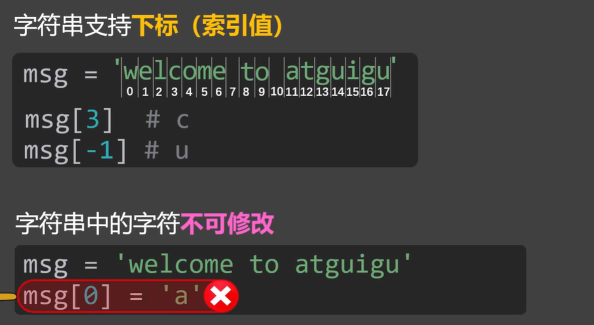
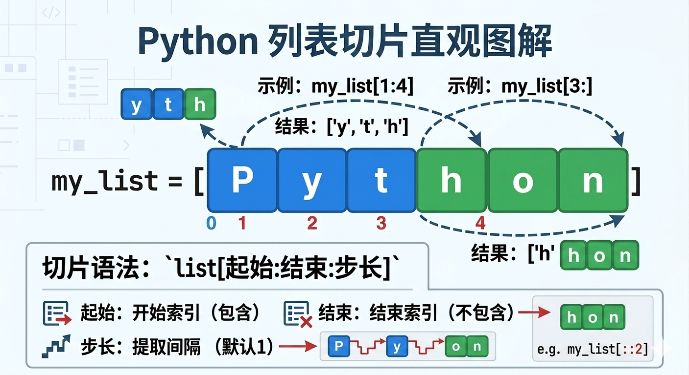
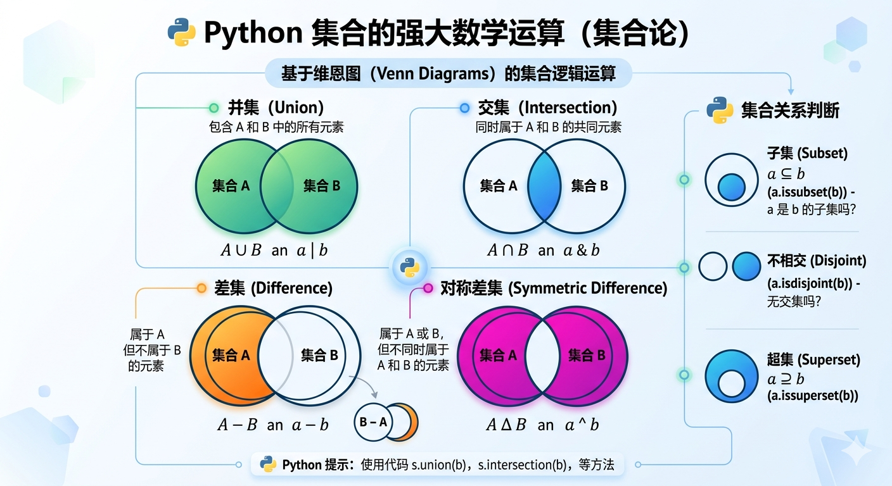
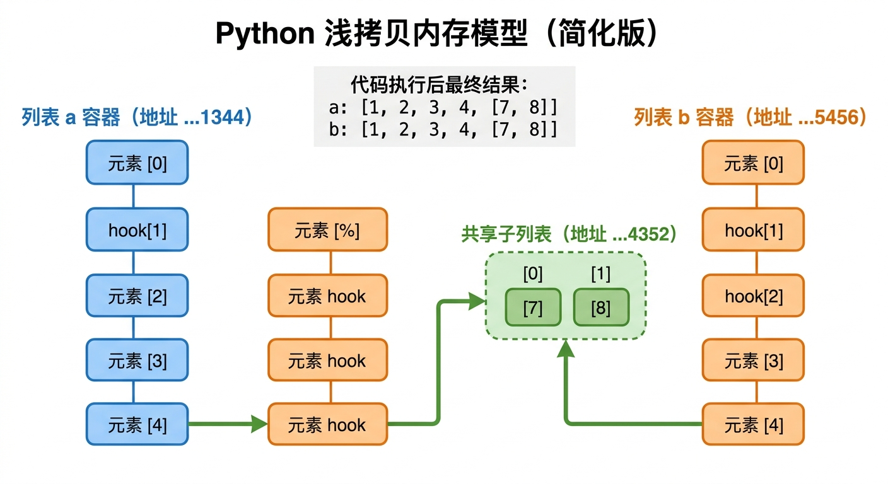
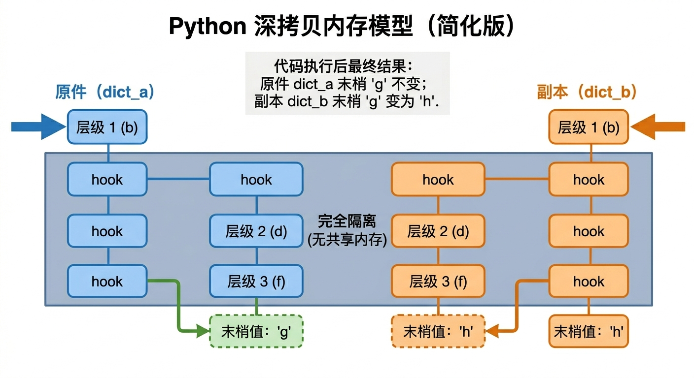
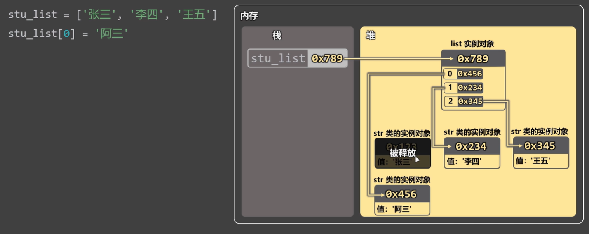
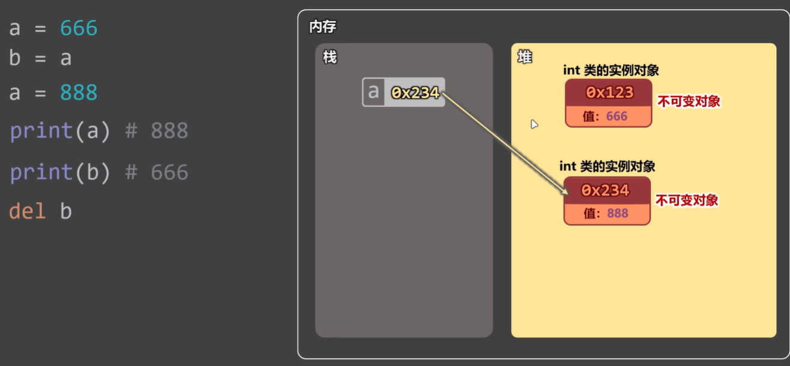

## 数据类型

Python 的数据类型非常丰富且强大，它们规定了变量可以存储什么样的数据以及能对这些数据进行什么操作。

Python 的数据类型分为 **基本数据类型** 和 **容器（集合）数据类型** 两大类：

### 基本数据类型（不可变）

这些是构建程序的最基础单元，通常是**不可变的（Immutable）**。

| 类型名称   | 关键字         | 示例         |
| ---------- | -------------- | ------------ |
| **整数**   | **`int`**      | 10，-5       |
| **浮点数** | **`float`**    | 0.15, -1.5   |
| **字符串** | **`str`**      | "Hello"      |
| **布尔值** | **`bool`**     | True , False |
| **空值**   | **`NoneType`** | None         |
| **字节串** | `byte`         | b"123456"    |

#### int 整数

表示一个**整数类型的值**，理论上支持无限大的整数，**无溢出限制**。

```python
age = 18    # 正整数（简写）
age_1 = +18 # 正整数
age_2 = -18 # 负整数
```

##### 1_000 **大整数分组**

描述：如果一个数值很大，可以**使用 `_` 下划线 根据百/千/万等分位**对数字**进行分组**，从而提高可读性。

```python
# 未分组前
big_int = 100000000 # 一亿

# 分组后
big_int = 100_000_000 # 一亿

print(bit_int) # 100000000 最后会将 _ 下划线去掉，并拼接前后的数字
```

#### float 浮点数

表示一个**带小数点的双精度数值**，存在精度误差。

```python
price = 78.36
```

- **科学计数法**：使用 **`e`** 或 **`E`** 表示

  ```python
  x = 1.5e3       # 1500.0   (1.5 × 10³)
  y = 3E-2        # 0.03     (3 × 10⁻²)
  z = -2.5e4      # -25000.0
  ```

##### 保留小数点后 n 个数值

可以使用 `%f` 占位符来实现浮点数的保留小数点后 n 个数值处理，`%f`是一个字符串格式化占位符。

**`%f`浮点数**：**保留小数点后前 n 个数字**，默认**最后一位数字 >6 则四舍五入**

```python
# 浮点数
m_n_float = '%.2f' % 156.6689  # 156.67
```

#### bool 布尔值

表示 **`True / False`** 的值，用于**逻辑判断（本质上 True=1, False=0）**。

注：`bool` 类型实质**是数值类型 `1` 和 `0` 的子类**。

```python
# bool 布尔值
is_student = True
is_student_1 = False

print(is_student, is_student_1)

print(True == 1, False == 0)  # True True
```

#### None 空值

表示**空值**或**无值**的特殊对象，常用于**变量、函数参数占位或初始化**。属于 **`NoneType` 类型。**

> 等价于 `null` 或 `undefined`

```python
name = None
```

- None 是一个特殊的字面量，表示空值/无值/无意义，不能参与数学运算，也不能与字符串拼接
- 在函数未使用 `return` 显式返回值时，默认返回 `None`

##### 核心特性

| 特性         | 说明                                         |
| :----------- | :------------------------------------------- |
| **唯一性**   | 整个 Python 解释器中**只有一个 `None` 对象** |
| **单例模式** | **所有 `None` 都指向同一内存地址**           |
| **布尔值**   | 在布尔上下文中被视为 **`False`**             |
| **类型**     | `type(None)` → **`<class 'NoneType'>`**      |

#### str 字符序列

> [!NOTE] 
>
> 标量序列：
>
> ​	指的是**既具有基本数据类型的特征，但在结构上又属于序列容器类型**，这种**同时拥有两种特征的数据类型**从细致化角度上来说，称之为标量序列。例如 **`str` 字符串、`bytes` 字节串**，两个特征一致，属于 “亲兄弟”。
>
> - 基本数据类型的特征：
>
>   - **不可变**：一旦创建，不可原地修改，必须重新赋值
>   - **存储结构单一**：只能存储一种类型的值，如字符、字节
>
> - 序列容器类型的特征：
>
>   - **有序、可重复、可使用 `[]` 索引下标访问元素、可使用 `[::]` 切片操作**
>
>     - （**可以 `[]`访问，但不能 `[]`修改**）
>
>       
>
>   - 可使用 `len()` 获取长度等**通用内置函数**
>
>   - 具有**迭代性**：可使用 `for ... in` 迭代元素、`in` 关键字提取单个元素

Python 中的字符串有多种定义方式，使用 **`''`单引号、 `""` 双引号、`'''` 单三引号、`"""` 双三引号**括起来的**字符序列**，**不可原地修改**。

这些定义方式的区别在于 **不可直接换行** 与 **可直接换行**。

| 特性             | 定义方式         | 适用场景                                             |
| ---------------- | ---------------- | ---------------------------------------------------- |
| **不可直接换行** | **`''` 和 `""`** | **字符串字面量定义**                                 |
| **可直接换行**   | **`'''`**        | **多行注释、长文本字符串字面量**                     |
|                  | **`"""`**        | **多行注释、Docstring 文档说明、长文本字符串字面量** |

##### 创建方式

###### '' | "" 不可直接换行

Python 规定使用 **`''`单引号、 `""` 双引号** 声明的字符串**不能直接换行**，通常用于**定义字符串字面量**，**被其他变量引用**。

```python
str_1 = "Hello, Alice"
str_2 = 'Hello, Alice'
```

若强制换行，需要在字符串**开头与结尾添加 () 双括号**用于保护：

```python
str_3 = ('Hello,'
         'Alice')
```

###### ''' | """ 可直接换行

Python 规定使用 **`'''` 单三引号、`"""` 双三引号** 定义的字符串**可以直接换行**，**不需要添加 `()` 括号保护**，通常用于**多行注释、声明 Docstring 文档说明、长文本变量引用**。

```python
'''
这是一个多行注释
我可以直接换行，不需要 () 括号保护
'''

"""
我也是一个多行注释，并且我能作为 Docstring 文档声明
"""

# ''' 和 """ 定义的字面量字符串也能被变量引用，只不过不建议
```

如果一段字符串很长，为了代码可读性，可以使用 **`'''` 或 `"""`** 来定义**长文本字符串字面量**，并被其他变量引用。

```python
str_4 = '''
这是一个多行注释
我可以直接换行，不需要 () 括号保护
'''

str_5 = """
我也是一个多行注释，并且我能作为 Docstring 文档声明
"""
```

注：当 **`'''` 和 `"""`** 字符串字面量**被变量引用**时，便**不再作为 Docstring 文档说明**了。

##### + 字符串拼接

Python 中可以通过 **`+`** 运算符为多个**字符串字面量、字符串类型的变量、返回字符串的表达式**进行**拼接**，最后**组成一个完整的字符串**。

> [!WARNING]
>
> 字符串拼接**不可以插入其他类型（整数、浮点数、布尔值...），强制插入需要类型内置包装函数 `str()` 强制转换为字符串** 。

```python
# 字符串拼接
name = "Alice"
total_str = '我是' + name + '，' + '今年' + str(18) + '岁'
print(total_str)  # 我是Alice，今年18岁
```

##### \ 转义字符

在 Python 中，**反斜杠 `\`** 是**转义字符**，用来表示**特殊含义的字符**，或者**将特殊字符“转义”为普通字符**。

| 转义序列     | 含义              | 示例                                  |
| :----------- | :---------------- | :------------------------------------ |
| `\'`         | 单引号            | `'It\'s OK'` → `It's OK`              |
| `\"`         | 双引号            | `"He said \"Hi\""` → `He said "Hi"`   |
| `\\`         | 反斜杠本身        | `"C:\\Users\\name"` → `C:\Users\name` |
| `\n`         | 换行符（LF）      | `"a\nb"` → 输出两行                   |
| `\r`         | 回车符（CR）      | `"a\rb"` → `b`（覆盖前面的 `a`）      |
| `\t`         | 水平制表符（Tab） | `"a\tb"` → `a b`                      |
| `\b`         | 退格              | `"abc\bd"` → `abd`（删除 `c`）        |
| `\f`         | 换页符            | 常用于打印机控制                      |
| `\v`         | 垂直制表符        | 较少使用                              |
| `\0`         | 空字符（NULL）    | 字符串结束标志                        |
| `\ooo`       | 八进制字符        | `"\101"` → `'A'`（八进制 101 = 65）   |
| `\xhh`       | 十六进制字符      | `"\x41"` → `'A'`（十六进制 41 = 65）  |
| `\uhhhh`     | 16位 Unicode      | `"\u4e2d"` → `'中'`                   |
| `\Uhhhhhhhh` | 32位 Unicode      | `"\U0001f600"` → `'😀'`                |

示例：

```python
# 1. 引号嵌套
print('She said, "Hello"')      # 不用转义，双引号在单引号内
print("She said, \"Hello\"")    # 需要转义
print('It\'s raining')          # 需要转义

# 2. 文件路径（Windows）
path = "C:\\Users\\Admin\\Desktop\\file.txt"
# 或者用原始字符串避免转义
path = r"C:\Users\Admin\Desktop\file.txt"

# 3. 换行和制表符
print("Line1\nLine2\n\tIndented")

# 4. Unicode 字符
print("\u4e2d\u6587")   # 中文
print("\U0001F600")     # 😀
```

##### r 转义字符串

当**不想让 `\` 作为转义字符**时，在**字符串前加 `r`**：

```python
path = "C:\new\test"
# C:
# ew      est

r_str = r"C:\new\test"  # C:\new\test
```

##### 格式化输出字符串

- **格式化输出**：按照预先定义的**格式**，将**变量或计算结果**，**插入**到**字符串**中并输出。

Python 为 `str` 类型提供了多种格式化输出的方式，每种都有其特点和适用场景。

######  **% 占位符值引用**

语法：

```python
"%s" % (值1,值2,...)
```

作用：把**字符串**中的**`%s` 占位符**按**从左到右**的顺序**替换**为 **`%` 右边的值** ，值可以是**变量值、字面量、计算表达式**。

- **单个值：计算表达式需要使用 `()` 包裹**

  ```python
  # 单个值
  name_1 = "Hello, %s" % name     # Hello, Alice
  name_2 = "Hello, %s" % "Alice"  # Hello, Alice
  name_3 = "我 %s 岁了" % (16 + 8) # 我 24 岁了
  ```

- **多个值：需要使用 `()` 包裹**

  ```python
  # 多个值
  name = "Alice"
  age = 25
  desc = "Name: %s, Age: %d" % (name, age)  # Name: Alice, Age: 25
  
  desc_2 = "Name: %s, Age: %d" % ('Alice', 18)  # Name: Alice, Age: 25
  ```

常用格式化符号：

| 符号   | 说明              | 示例                           |
| :----- | :---------------- | :----------------------------- |
| `%s`   | 字符串            | `"%s" % "hello"`               |
| `%d`   | 整数              | `"%d" % 123`                   |
| `%f`   | 浮点数            | `"%f" % 3.14`                  |
| `%.2f` | 浮点数（2位小数） | `"%.2f" % 3.14159` → `3.14`    |
| `%x`   | 十六进制（小写）  | `"%x" % 255` → `ff`            |
| `%X`   | 十六进制（大写）  | `"%X" % 255` → `FF`            |
| `%o`   | 八进制            | `"%o" % 8` → `10`              |
| `%e`   | 科学计数法        | `"%e" % 1234` → `1.234000e+03` |

- **`%<m>.<n>[s|f|d]` 精度控制**运算符：

  - **`<m>`**：给定一个**数值**，限制**插入字符串的最小长度位数**

    - 当位数**不够**时使用**空格字符补全**，位数**小于插入字符串的长度**时则**不起作用**

    - 规则：

      - **正整数**：**字符串右对齐，向右补全空白字符**

        ```python
        m_name = 'Alice'
        m_str = '我叫%10s, 今年18岁' % m_name # 我叫     Alice, 今年18岁
        # 正整数：由于插入的字符串 'Alice' 总长度是 5 位，位数不够，所以 %10 会向 Alice 左边补全 5 个空格字符，从而文字会展示右对齐
        ```

      - **负整数**：**字符串左对齐，向左补全空白字符**

        ```python
        m_name = 'Alice'
        m_str = '我叫%-10s, 今年18岁' % m_name # 我叫Alice     , 今年18岁
        # 负整数：由于插入的字符串 'Alice' 总长度是 5 位，位数不够，所以 %10 会向 Alice 右边补全 5 个空格字符，从而文字会展示左对齐
        ```

  - **`<n>`**：给定一个**数值**，限制**插入字符串的长度控制**

    - 当**位数小于插入字符串的总长度**时，则**删除**。可以理解为**保留前 n 个字符**

      > 注意：需要在 **`%` 字符后加入 `.` 字符表示使用 `n` 精度控制规则**。即 **`%.n`**

    ```python
    n_name = 'Alice'
    n_str = '我叫%.2s, 今年18岁' % n_name # 我叫Al, 今年18岁
    
    # %.2：只保留插入字符串 Alice 的前 2 个字符
    ```

- 混合使用：**先计算 `n` ，再计算 `m`**

  ```python
  m_n_name = 'Alice'
  m_n_str = '我叫%10.2s, 今年18岁' % m_n_name # 我叫        Al, 今年18岁
  
  # 保留前 2 个字符，并向左插入 5 个空格字符
  ```

精度控制规则适用于以上任何格式化占位符，如：

- **`%f`浮点数**：**保留小数点后前 n 个数字**，默认**最后一位数字 >6 则四舍五入**

  ```python
  # 浮点数
  m_n_float = '%.2f' % 156.6689  # 156.67
  ```

- **`%d`整数：整数前补0**

  ```python
  # 正整数
  m_n_int = '%.10d' % 156789  # 0000156789
  ```

######  **str.format() 格式化**

> 注：在 Python 中，字符串本身也是一个字面量类型，

语法：

```python
"{}".format("Alice")
```

作用：调用 **`str` 字符串字面量自带**的 **`format`方法**，把字符串中的**`{}` 占位符**一个个**替换**为 **.format() 传入的值** 。

- 按从**左到右**的书写顺序替换：

  ```python
  print("姓名: {}, 年龄: {}".format(name, age))  # 输出：姓名: Jack, 年龄: 18
  ```

- 按**索引**替换：`format()` 方法内部会将传入的值转为**数组**的形式，通过**数组索引**可**拿到传入的具体实参值**

  ```python
  print("姓名: {1}, 年龄: {0}".format(name, age))  # 输出：姓名: 18, 年龄: Jack
  ```

- 按**变量名**替换：`format()` 方法**显式声明形参并传入实参值**，**`{}` 占位符可拿取并替换**

  ```python
  print("姓名: {name}, 年龄: {age}".format(name='Jack', age=18))  # 输出：姓名: Jack, 年龄: 18
  ```

- 混合使用：**实参值必须在声明形参之前传入**

  ```python
  print("我是一个 {student}, 我叫 {name}, 今年 {0} 岁".format(18, student='学生', name='Jack')) 
  # 我是一个 学生, 我叫 Jack, 今年 18 岁
  ```

######  **f"{}" 模板字符串**

语法：

```python
f"{}"
# 类似于 JS 的 `${}`
```

作用：**执行获取 `{}` 占位符内的值并格式化输出为字符串**。可以直接理解为它本质上是一个**字符串字面量**。

核心本质：`f""` 不是一个独立的类型，而是一个**字符串字面量前缀**，告诉 Python 解释器在**运行时**对这个字符串进行**格式化处理**，最终**生成一个普通的 `str` 对象**，可以被**变量引用、函数返回、直接 `print()` 输出。**

- 变量引用：

  ```python
  f_str_1 = f"Python is great"
  
  print(f_str_1)  # 输出：Python is great
  
  str2 = 'Python'
  f_str_2 = f"{str2} is great"
  print(f_str_2)  # 输出：Python is great
  
  # 多行 s-string
  message = (f"姓名: {name}\n" f"年龄: {age}")
  
  print(message)
  # 输出：
  # 姓名: Jack
  # 年龄: 18
  ```

- 函数返回：

  ```python
  def get_str_f():
      return f'Python is great'
  
  
  str_f = get_str_f()
  print(str_f)  # 输出：Python is great
  
  # 调用函数
  def greet(param: str) -> str:
      return f"Hello, {param}"
  
  a_name = "Alice"
  print(f"{greet(a_name)}")
  ```

- 直接 `print()` 输出：

  ```python
  # 引用变量
  name = 'Jack'
  age = 18
  print(f"姓名: {name}, 年龄: {age}")  # 输出：姓名: Jack, 年龄: 18
  
  # 表达式
  print(f"2 + 2 = {2 + 2}")  # 输出：2 + 2 = 4
  print(f"10 / 3 = {10 / 3:.2f}")     # 10 / 3 = 3.33  (:.2f 扩展 2 个 float 浮点数)
  
  # if/else 条件表达式
  print(f"{'A' if 1 > 0 else 'B'}")  # 输出：A
  ```

- 格式化规范：

  ```python
  name = "Python"
  version = 3.11
  pi = 3.14159
  number = 1234567
  
  # 对齐
  print(f"{name:<10}")    # 左对齐: 'Python    '
  print(f"{name:>10}")    # 右对齐: '    Python'
  print(f"{name:^10}")    # 居中: '  Python  '
  print(f"{name:=^10}")   # 填充: '==Python=='
  
  # 数字格式化
  print(f"{pi:.2f}")      # 3.14
  print(f"{pi:.4f}")      # 3.1416
  print(f"{pi:10.2f}")    # '      3.14'
  print(f"{number:,}")    # 1,234,567
  print(f"{number:_}")    # 1_234_567
  
  # 百分比
  rate = 0.875
  print(f"{rate:.2%}")    # 87.50%
  
  # 进制
  num = 255
  print(f"{num:b}")       # 11111111（二进制）
  print(f"{num:o}")       # 377（八进制）
  print(f"{num:x}")       # ff（十六进制）
  print(f"{num:X}")       # FF（十六进制大写）
  
  # 切片
  s = "Hello_World"
  print(s[0:5])   # 输出: 'Hello' (从索引0到4)
  print(s[:5])    # 输出: 'Hello' (省略start，默认从头开始)
  print(s[6:])    # 输出: 'World' (从索引6开始到结束)
  print(s[:])     # 输出: 'Hello_World' (获取完整拷贝)
  print(s[-5:])   # 输出: 'World' (最后5个字符)
  print(s[6:-1])  # 输出: 'Worl' (从索引6到倒数第2个)
  print(s[::2])   # 输出: '13579' (每隔一个取一个)
  print(s[::-1])  # 输出: '987654321' (步长为负数，实现字符串反转)
  ```

######  **Template() 模板字符串**

描述：通过 **`from string import Template`** 从 `string` 模块中导入 **`Template` 函数**，该函数可以**声明模板字符串**。

语法：

```python
Template('$xxx') | Template('${xxx}')
```

描述：`Template()` 函数用于声明一个包含 `$xxx` 引用变量占位符的**字符串字面量**，并返回一个 `t` 对象，该对象包含专门用于引用、**解析 `$xxx` 变量占位符**并**替换为同名实参值**的方法 **`substitute()`** 和 **`safe_substitute()`**，该方法会**引用传入的同名形参值**，并整个**转化为字符串字面量输出**。

示例：

```python
# 1. 使用 $ 符号表示变量
t = Template('姓名: $name, 年龄: $age')
print(t.substitute(name='Jack', age=18))  # 输出：姓名: Jack, 年龄: 18

# 2. 使用字典
t = Template('姓名: $name, 年龄: $age')
print(t.safe_substitute({'name': 'Jack', 'age': 18}))  # 输出：姓名: Jack, 年龄: 18
```

##### 常用方法

```python
str = "hello world"
print(str.capitalize())  # 首字母大写
print(str.upper())  # 全部大写
print(str.lower())  # 全部小写
print(str.swapcase())  # 大小写互换
print(str.title())  # 每个单词首字母大写
print(str.count('l'))  # 统计字符出现次数
print(str.find('l'))  # 查找字符首次出现的位置
print(str.index('l'))  # 查找字符首次出现的位置，不存在会报错
print(str.replace('l', 'x'))  # 替换字符
print(str.split(' '))  # 按照指定字符分割字符串
```

#### bytes 不可变字节序列

**`bytes`** 是一种专门用于**处理二进制数据**的**不可变序列**。可以把它想象成 **0-255 之间的整数组成的元组**，或者**纯粹的 01 二进制数据流**。

> 整数 > 字节：在 Python 中，**每个 `byte` 字节都可以通过 `int`整数来表示，且范围在 0-255 之间。**

##### 创建方式

-  **`b""`** **模板字节串**：

```python
# 字面量 (b 前缀)
b1 = b'Hello'
b2 = b'\x48\x65'   # \x 是 16 进制转义，对应 'He'
```

- **`bytes()` 构造函数（强转类型）**：

```python
# bytes() 构造函数
b3 = bytes([65, 66, 67])       # 传入 0-255 范围的整数列表 -> b'ABC'
b4 = bytes('你好', 'utf-8')    # 从字符串编码 -> b'\xe4\xbd\xa0\xe5\xa5\xbd' -> 你好

# 特殊：生成全零或全填充
b5 = bytes(5)                  # b'\x00\x00\x00\x00\x00'
```

##### [] 索引访问

`bytes` 本质上是一个**数组形式的字节序列**，可以**通过 `[]` 索引的方式访问字节序列中的指定字节元素**，但**不可对其修改**操作。

```python
by = b"ABCD"

print(by[0]) # 65
```

> [!NOTE]
>
> 通过 `[]`索引访问时会**输出对应字符转成的字节所表示的 `0-255` 整数（包含 127位 的字符 ASCII码、特殊字符）**
>
> - 根据**索引**返回指定字节的 **ASCII 码**：
>
>   > `bytes` 本质上是一个字节串，类似于字符串，可以通过 `[]` 来像数组一样访问某个字节串成员。（但不能修改）
>
>   ```python
>   b = b'Hello'
>   b_1 = b[0]
>   print(b_1)  # 72 （H 的 ASCII 码）
>   ```

##### 核心特征

- **不可变**：一旦创建，**内容无法修改**

  ```python
  b3 = bytes([65, 66, 67])
  
  # b3[0] = 58 # 报错
  ```

- 与 `str` 字符串的本质区别：**`str` 是给人看的文本（Unicode 字符），`bytes` 是给机器处理的原始字节**

##### 切片 [start:stop:step]

| 操作     | 代码示例 `b = b'Hello'` | 返回值类型  | 结果   |
| :------- | :---------------------- | :---------- | :----- |
| **索引** | `b[0]`                  | **`int`**   | `72`   |
| **切片** | `b[0:1]`                | **`bytes`** | `b'H'` |

Python 支持根据索引的切片规则对字节序列进行**截取某一段字节、反转字节序列**等操作 ，且会**返回一个新字节串，原字节串不会改变**

###### 基本语法

```python
result = <字节串变量>[start?:stop?:step]
```

> 注：`start`、`stop`、`step`参数都是**可选的**

参数说明：

- **`start?`：从 `start` 索引下标开始截取**，默认**不填为 0**
- **`stop?`：截取到 `stop` 索引下标**，默认**不填为字节串总长度 - 1**
- **`step?`：**两个作用
  - **正数值：截取间隔，默认步长为 1，隔 1 个截取一个字节**
  - **负数值 -1：反转字节串**

###### 常用方式

- **`<字节串>[start:stop:step]`**：截取**从 `start` 到`stop-1`(字节串总长度 - 1) 索引，步长为 `step`的字节串**

  ```python
  b_bytes = b"0123456789"
  
  print(b_bytes[1:3:1])  # b'12'
  ```

- **`<字节串>[start:stop]`**：截取**从 `start` 到`stop-1`(字节串总长度 - 1) 索引的字节串**

  ```python
  b_bytes = b"0123456789"
  
  print(b_bytes[0:3])  # b'012' # 截取 b_bytes[0]、b_bytes[1]、b_bytes[2] 的字节
  print(b_bytes[3:6])  # b'345' # 截取 b_bytes[3]、b_bytes[4]、b_bytes[5] 的字节
  ```

- **`<字节串>[:stop]`**：截取**从 0 到 `stop-1`(字节串总长度 - 1) 索引的字节串**

  ```python
  b_bytes = b"0123456789"
  
  print(b_bytes[:6])  # b'012345' # 从头开始，截取到 b_bytes[5] 的字节
  print(b_bytes[:3])  # b'012' # 从头开始，截取到 b_bytes[2] 的字节
  ```

- **`<字节串>[start:]`**：截取 **`start` 索引之后的所有字节串**

  ```python
  b_bytes = b"0123456789"
  
  print(b_bytes[2:]) # b'23456789' # 从 b_bytes[2] 开始，截取到末尾
  print(b_bytes[6:]) # b'6789' # 从 b_bytes[6] 开始，截取到末尾
  ```

- **`<字节串>[::step]`**：从头开始，**每隔 `step` 个字节截取一次**，并组成字节串返回

  ```python
  b_bytes = b"0123456789"
  
  print(b_bytes[::2])  # b'02468' # 从头开始，每隔 2 个字节截取一次
  print(b_bytes[::3])  # b'0369' # 从头开始，每隔 3 个字节截取一次
  ```

- **`<字节串>[::-1]`**：**反转字节序列**

  ```python
  b_bytes = b"0123456789"
  
  print(b_bytes[::-1]) # b'9876543210' 反转字节序列
  ```

- **`<字节串>[::]`：截取整个字节串**

  ```python
  b_bytes = b"0123456789"
  
  print(b_bytes[::]) # b"0123456789"
  ```

##### 核心 API

###### decode(code) 解码

作用：将 `bytes` 类型的字节串**按 `code` 编码集规则解码成 `str` 字符串**

```python
# str -> bytes
b4 = "你好".encode('utf-8') 	 # “你好” -> encode编码 -> b'\xe4\xbd\xa0\xe5\xa5\xbd'
b4 = bytes('你好', 'utf-8')    # “你好” -> encode编码 -> b'\xe4\xbd\xa0\xe5\xa5\xbd'

# bytes -> str
b4.decode('utf-8') # b'\xe4\xbd\xa0\xe5\xa5\xbd' -> decode 解码 -> “你好”
```

###### find(byte) 查找索引

作用：**查找 `byte` 字节在字节串序列中的索引位置**

```python
b1 = bytes([65,66,67])
b1.find(66) # 1

b2 = b"ABCD"
b2.find(b"A") # 0
```

#### bytearray 可变字节序列

**`bytearray` 是 `bytes` 的可变孪生兄弟**。它**解决了 `bytes`无法原地修改的痛点**，非常适合处理需要**动态组装、修改或过滤**的**二进制数据流**。

##### 与 `bytes` 的对比

| 特性         | `bytes`                               | `bytearray`                |
| :----------- | :------------------------------------ | :------------------------- |
| **可变性**   | ❌ 不可变  => `b"abc"[0] = 'd'` 会报错 | ✅ **可变**（可原地增删改） |
| **字面量**   | `b"abc"`                              | `bytearray(b"abc")`        |
| **元素类型** | 整数 (0-255)                          | 整数 (0-255)               |
| **适用场景** | 固定密钥、哈希结果                    | 网络缓冲区、串口数据拼接   |

- **`bytes` 和 `bytearray`** 两者本质上是**同一种类型**，都用来表示**`byte`字节序列，且字节元素类型是 0-255 的整数**，只不过 **`bytearray` 是可变的，可以根据索引对具体字节进行增删改操作**，而 **`bytes` 是不可变的**。

##### 创建方式

`bytearray` 类型**通过 `bytearray()` 构造函数来创建**，它根据不同参数分别有 5 种创建方式：

- **`bytearray(bytes)`**：将 **`bytes` 字节串** 转换为 **`bytearray` 可变字节数组**

  ```python
  # bytes不可变字节串 转为 bytearray可变字节数组
  bytes_a = b"ABCD"
  bytearray_a = bytearray(bytes_a) # bytearray(b'ABCD')
  ```

- **`bytearray(str,code)`**：将 **`str` 字符串通过指定字符编码 `code`**转换为 **`bytearray` 可变字节数组**

  ```python
  bytearray_str = bytearray("你好", 'utf-8')
  print(bytearray_str) # bytearray(b'\xe4\xbd\xa0\xe5\xa5\xbd')
  ```

- **`bytearray(number)`**：**指定 `bytearray` 字节数组的长度，全用 0 补全**

  ```python
  bytearray_init = bytearray(5)  # bytearray(b'\x00\x00\x00\x00\x00') 补 5 个 0
  ```

- **`bytearray([numbers...])`**：**将用来表示字节的整数数组转为 `bytes` 字节串**，并**通过 `bytearray()` 函数添加 可变特性**

  ```python
  bytearray_numbers = bytearray([65, 66, 67])  # bytearray(b'ABC')
  ```

- **`bytearray().fromhex(hex)`**：通过**调用 `fromhex(hex)` 传入 `hex` 16进制字符串**，并**转为 `bytearray` 可变字节数组**

  ```python
  bytearray_from_hex = bytearray.fromhex('414243')      # bytearray(b'ABC')
  ```

##### [] 索引访问、删改

`bytesarray` 本质上是一个**数组形式的字节序列**，可以**通过 `[]` 索引的方式访问字节序列中的指定字节元素**，且**可对其进行增删改**操作。

- 访问：通过 `[]`索引**访问某个字节元素**，会**输出字节对应的 `0-255` 范围内的整数数值**

  ```python
  by = bytearray(b"ABCD")
  
  print(by[0]) # 65
  ```

- 修改：**通过 `[]`索引对某个字节元素修改，字节元素值一定要是 `0-255` 范围内的整数数值**

  ```python
  by = bytearray(b"ABCD")
  by[1] = 69
  
  print(by) # bytearray(b'AECD')
  ```

- 删除：**通过 `del` 关键字删除 `[]` 某个索引对应的字节元素**

  ```python
  by = bytearray(b"ABCD")
  
  del by[1]
  print(by) # bytearray(b'ACD')
  ```

##### 切片 [start:stop:step]

这是 `bytearray` 与 `bytes` 最大的区别：**`bytearray` 支持通过索引、切片方式对字节序列中的元素进行赋值、修改、删除操作**。

- **`<字节数组>[start:stop] = <bytes | bytearray>` 切片替换**：

  将**字节数组中 从 `start` 到 `stop` 索引的字节元素替换为一段 `bytes`或 `bytearray` 字节序列**。

  ```python
  ba = bytearray(b'Python')
  
  ba[1:4] = b'ava'  # 从 ba[1] 到 ba[3] 替换 'yth' -> 'ava'
  print(ba)         # bytearray(b'Pavaon')
  ```

- **`del` 关键字删除**：

  ```python
  ba = bytearray(b'Python')
  
  del ba[4:6]       # 删除 'on'
  print(ba)         # bytearray(b'Java')
  ```

##### 核心 API （增删改查）

`bytearrat` 本质上是一个**可变的序列**，所以它支持 **`list` 列表的方法**对字节序列进行**增删改查**操作。

###### append([number | bytes]) 增加

```python
by = bytearray(b"ABCD")

# 追加（追加整数或单个字节的 bytes）
by.append(68)           # bytearray(b'ABCD')
by.append(ord('E'))     # bytearray(b'ABCDE')
```

###### extend(bytes) 扩展

```python
by = bytearray(b"ABCD")
# 扩展（拼接另一个 bytes 或 bytearray）
by.extend(b'FG')        # bytearray(b'ABCDEFG')
```

###### insert(index,byte) 插入

```python
by = bytearray(b"ABCD")
by.insert(3, 45)        # 在下标3插入 '-' (ASCII 45)
```

###### 删除

- **`pop()`**：

  ```python
  by = bytearray(b"ABCD")
  
  # 移除
  by.pop()                # 弹出最后一个 71 ('G')
  ```

- **`remove(number)`**：

  ```python
  by = bytearray(b"ABCD")
  
  by.remove(45)           # 移除第一个值为 45 的字节 ('-')
  ```

#### 通用内置函数

Python 为基本数据类型提供了以下通用内置函数：

##### 数学运算相关

###### abs(num) 取绝对值

```python
print(-1) # 1
```

###### round() 四舍五入

```python
print(round(1.234567, 3))  # 1.235 截取小数点后3位并四舍五入
```

###### pow() 幂运算

```python
print(pow(2, 3))  # 2 的 3 次方 = 8 （2 * 2 * 2） 
# 等价于 2**3 幂运算符
```

###### divmod() 获取商和余数

```python
print(divmod(10, 3))  # 返回商和余数
# 10 / 3 = 3 ，余数 1
```

##### 字符串相关

###### ord(chat) 获取Unicode编码

作用：获取**`char` 字符的 Unicode 编码值**

```python
print(ord("h")) # 104
```

###### chr(code) 转码

作用：将 `code` 传入的**Unicode 编码值转为字符串**

```python
print(chr(104)) # h
```

### 容器数据类型（序列/字典/集合）

数据容器：一种能**存放多个不同类型数据的数据类型**，可以更高效的管理成批的数据，且便于存储、访问。

根据存储的数据特性，容器数据类型根据 **是否有序** 、 **是否可变**、**元素是否唯一** 分为 3 大类：

- **序列**：
  - **基本序列**：
    - **`list` 列表 `[]`**：**有序、可变**的**序列**容器，存储的**元素类型可以不同**
    - **`tuple` 元组 `()`**：**有序、不可变**的**序列**容器，存储的**元素类型可以不同**，且比 `list` 列表更轻量、性能略高 

  - **标量序列**：**有序、不可变**的**序列**容器，存储的**元素类型必须唯一**
    - **`str` 字符串 `""`**
    - **`bytes/bytearray` 字节串 `b""`**
- **集合**：**无序、元素值强制唯一**的容器，存储的**元素类型可以不同**
  - **`set` 集合 `{}`：可变**
  - **`forzenset`集合 `{}`：不可变**
- **`dict`字典 `{ k:v }`**：**插入有序、可变、`key`键唯一（不可变）、`value`值可以存储任意类型数据** 的**键值对映射**容器

> [!NOTE]
>
> 关于**索引下标**：它是 **序列 的专属**；集合因为无序，故没有索引下标
>
> 关于 **`key` 键**：
>
> - **`set` 集合只有 `key` 唯一键**
> - **`dict` 字典同时具有 `key`唯一键 与 `value` 值的映射**

> 序列 和 集合 最本质的区别：
>
> - **列表 (list、tuple、str、bytes/bytearray)**：本质是**数组**。
>
>   当判断 **`x in list`** 时，Python 必须**从头开始一个一个比对，直到找到 `x` 或者翻遍整个列表**。
>
>   如果列表有 n 个元素，最坏情况要找 n 次。
>
> - **集合 (set、frozenset)**：本质是**哈希表 (Hash Table)**。
>
>   当判断 **`x in set`** 时，Python 会**对 `x` 进行哈希运算，直接计算出它的"内存住址”**。
>
>   无论集合里有 10 个还是 1000 万个元素，定位速度几乎是一样的。

#### list 列表 【可变序列】

*类似于 Java 的 ArrayList*

描述：可以创建一个**有序、可变、可重复、长度不固定、且可以存储任意类型数据**的**动态序列数组**。

##### 创建方式

核心要点：**列表用中括号 `[]` 表示，元素之间用 `,` 逗号分隔**。

Python 的列表有 2 种创建方式：

###### [...] 字面量

```python
# 创建列表
arr = []
arr_1 = ["apple", "banana", "cherry"]
arr_2 = [1, "Hello", 3.14, [1, 2]]  # 列表可以嵌套，类型可以混杂
```

###### list([]) 构造函数

描述：**`list()` 函数可以接收一个数组，将数组转化为列表**

```pyth
arr_3 = list([1, 2, 3, 4])
print(arr_3)  # [1, 2, 3, 4]
```

###### 列表推导式

> [!NOTE]
>
> `list` 列表的所属类型是 **`<class list>`**
>
> ```python
> print(type(arr_3))  # <class 'list'>
> ```

##### 索引下标

跟其他语言一样，Python 的 `list` 也具备**索引下标**的概念，可**通过索引来访问、修改、删除列表中的成员**。

Python 的 `list` 列表索引访问方式分为 **正向索引** 和 **负向索引**。


###### **正向索引**

描述：**从左往右，从 0 开始到 `len(list) - 1`（列表的长度 - 1），可访问已知位置的元素**

```python
# 正向索引：从 0 开始到列表长度 -1

arr_1 = ["apple", "banana", "cherry"]

# 从左到右 访问
print(arr_1[0], arr_1[1], arr_1[2])  # apple banana cherry
print(arr_1(len(arr_1) - 1)) # 数组长度- 1，访问列表最后一个元素 cherry

# 修改
arr_1[0] = "orange"
print(arr_1)  # ['orange', 'banana', 'cherry']
```

###### **负向索引**

描述：**从右往左，从 -1 开始到 -数组长度（数组长度为 5 ，则最后一个元素是 -1，第一个元素就是 -5）越往前索引值减 1**

用于**非固定长度列表的成员访问**，想要**直接获取末尾索引成员**时，不需要写 `list[len(list) - 1]`

```python
# 反向索引：从 -1 开始到 -列表长度，-1 是最后一个元素，-数组长度是第一个元素
arr_1 = ["apple", "banana", "cherry"]

# 从右到左 访问
print(arr_1[-1], arr_1[-2], arr_1[-3])  # cherry banana apple
print(arr_1[-(len(arr_1))])  # -数组长度（-3），直接访问列表第一个元素 apple

# 修改
arr_1[-1] = "orange"
print(arr_1)  # ['apple', 'banana', 'orange']
```

###### del 删除元素后的行为

在 Python 中，当使用 **`del` 关键字删除列表中某个下标的元素后**，**后续所有元素的下标都会自动减 1，且元素顺序位置自动往前/后移动一位**。

*在 JavaScript 当中，删除数组某个下标的元素后，会自动使用 `empty` 空占位符填充，且元素位置顺序不变*

```python
# del 删除某个下标的元素后，后续所有元素的下标自动减 1 ，且元素顺序位置自动往前/ 后移动一位

nums = [10, 20, 30, 40]
del nums[2]  # 删掉 30
print(nums[2])  # 40，不会报错
print(nums)  # [10, 20, 40]
```

###### 索引的边界规则

无论正向还是负向，一旦超出范围，Python 都会抛出 `IndexError` 下标越界错误。

`letters = ['A', 'B', 'C', 'D']`：

- `letters[4]` --> **报错**（最大索引是 3）
- `letters[-5]` --> **报错**（最小索引是 -4）

##### 切片 [start:stop:step]

Python 支持根据索引的切片规则对列表进行**截取某一段子列表、反转列表**等操作，且**会返回一个截取后的新列表，原列表不会改变**。

###### 基本语法

```python
result = <列表变量>[start?:stop?:step?]
```

> 注：`start`、`stop`、`step`参数都是**可选的**

参数说明：

- **`start?`：截取起始下标**，默认**不填为 0**
- **`stop?`：截取结束下标**，默认**不填为列表总长度 - 1**
- **`step?`：**两个作用
  - **正数值：截取间隔，默认步长为 1，隔 1 个截取一个列表成员**
  - **负数值 -1：反转列表**



###### 常用方式

- **`<列表>[start:stop:step]`**：截取**从 `start` 到`stop-1`(列表总长度 - 1) 索引，步长为 `step`的列表成员**

  ```python
  nums = [10, 20, 30, 40]
  
  print(nums[1:3:1])  # [20, 30]，截取 nums[1] 到 nums[2] 的元素，步长为 1
  ```

- **`<列表>[start:stop]`**：截取**从 `start` 到`stop-1`(列表总长度 - 1) 索引的列表成员**

  ```python
  nums = [10, 20, 30, 40]
  
  print(nums[1:3])  # [20, 30]，截取 nums[1] 到 nums[2] 的元素
  ```

- **`<列表>[:stop]`**：截取**从 0 到 `stop-1`(字节串总长度 - 1) 索引的列表成员**

  ```python
  nums = [10, 20, 30, 40]
  
  print(nums[:3])  # [10, 20, 30] ，截取 nums[0] 到 nums[3 - 1] 的元素
  ```

- **`<列表>[start:]`**：截取 **`start` 索引之后的所有列表成员**

  ```python
  nums = [10, 20, 30, 40]
  
  print(nums[1:])  # [20, 30, 40]，截取 nums[1] 到 nums[len(nums) - 1] 的元素
  ```

- **`<列表>[::step]`**：**截取从 0 到列表末尾的元素，步长为 step**

  ```python
  nums = [10, 20, 30, 40]
  
  print(nums[::2])  # [10, 30]，截取 nums[0] 到 nums[len(nums) - 1] 的元素，步长为 2
  ```

- **`<列表>[::-1]`**：**反转整个列表**

  ```python
  nums = [10, 20, 30, 40]
  
  print(nums[::-1])  # [40, 30, 20, 10]
  ```

- **`<列表>[::]`：截取整个列表**

  ```python
  nums = [10, 20, 30, 40]
  
  print(nums[::]) # [10, 20, 30, 40]
  ```

##### 常用方法

Python 中的列表是**可变类型**，这意味着**可以直接在原地修改它**。

###### 查询

Python 为 `list` 类型实例提供了以下方法用于查询列表：

- **`index(item)`：返回 `item` 指定元素的下标，如果元素不存在，则抛出异常**

  ```python
  arr = ['red', 'yellow', 'blue']
  
  print(arr.index("yellow"))  # 1
  ```

###### 增加

Python 为 `list` 类型实例提供了以下方法用户为列表追加元素：

- **`append(item)`**：在**列表末尾追加一个 `item`元素**

  ```python
  arr = ['red', 'yellow', 'blue']
  
  arr.append("orange")
  
  print(arr)  # ['red', 'yellow', 'blue', 'orange']
  ```

- **`insert(index, item)`**：在**列表指定索引下标`index` 处插入一个 `item`元素**

  ```python
  arr = ['red', 'yellow', 'blue']
  
  arr.insert(1, "green")  # 在 arr[1] 处插入 "green"
  
  print(arr)  # ['red', 'green', 'yellow', 'blue']
  ```

- **`extend(iterable)`**：**合并另一个序列（list 列表、tuple 元组、str 字符串），以此扩展原列表**

  > 注：扩展**字符串**时，会**遍历提取出字符串的每一个字符并追加到列表末尾**

  ```python
  arr = ['red', 'yellow', 'blue']
  
  arr.extend(["purple", "pink"])  # 列表
  print(arr)  # ['red', 'yellow', 'blue', 'purple', 'pink']
  
  arr.extend(("black", "white"))  # 元组
  print(arr) # ['red', 'green', 'blue', 'purple', 'pink', 'black', 'white']
  
  arr.extend("gray")  # 字符串
  print(arr) # ['red', 'yellow', 'blue', 'purple', 'pink', 'black', 'white', 'g', 'r', 'a', 'y']
  ```

###### 删除

- **`remove(item)`：删除列表中第一个匹配 `item` 的元素**【因为列表是可重复的，故需要传入匹配】

  ```python
  arr = ['red', 'yellow', 'blue', 'red']
  
  arr.remove('red')
  
  print(arr)  # ['yellow', 'blue', 'red']
  ```

- **`pop(index)`：删除并返回 `index` 指定下标索引的元素，默认弹出最后一个元素**

  ```python
  arr = ['red', 'yellow', 'blue']
  
  print(arr.pop(2))  # blue
  
  print(arr)  # ['red', 'yellow']
  
  arr.pop() # 弹出最后一个元素 'yellow'
  
  print(arr) # ['red']
  ```

- **`clear()`：清空列表**

  ```python
  arr = ['red', 'yellow', 'blue', 'red']
  
  arr.clear()
  
  print(arr)  # []
  ```

###### 其他方法

- **`count(item)`：统计列表中 `item` 元素出现的次数**

  ```python
  arr = ['red', 'yellow', 'blue', 'red']
  
  print(arr.count('red'))  # 2 
  ```

- **`reverse()`：原地反转整个列表**，等价于 **`[::-1]` 切片操作**

  ```python
  arr = ['red', 'yellow', 'blue']
  
  arr.reverse() # 原地反转
  
  print(arr)  # ['blue', 'yellow', 'red']
  ```

- **`sort()`：对列表进行排序，默认升序，会修改原列表**

  ```python
  arr = ['red', 'yellow', 'blue']
  
  arr.sort()
  
  print(arr)  # ['blue', 'red', 'yellow'] 按字母顺序排序
  ```

- **`copy()`：浅拷贝列表，并返回一个新列表，对新列表的修改不会影响到原列表**，等价于 **`[:]`切片操作**

  > **浅拷贝问题**：使用 `list2 = list1` 只是增加了一个引用。
  >
  > 如果想复制一份互不影响的列表，应该用 `list2 = list1.copy()` 或 `list1[:]`。

  ```python
  arr = ['red', 'yellow', 'blue']
  
  arr_copy = arr.copy()  # 浅拷贝列表
  
  print(arr_copy)  # ['red', 'yellow', 'blue', 'red']
  
  arr[0] = 'A' # 修改原列表
  
  # ['A', 'yellow', 'blue', 'red'] ['red', 'yellow', 'blue', 'red']
  print(arr, arr_copy)
  ```

##### 常用技巧

###### 遍历列表

描述：通过 **`for i in list` 遍历出列表中的每个成员并赋值给另一个变量 `i`**

```python
# for...in 循环
languages = ['Python', "JavaScript", "Java", "C++", "Go"]
for lang in languages:
    print(lang)  # 'Python' "JavaScript" "Java" "C++" "Go"
    
# while 循环
index = 0
while index < len(languages):
    print(f"{index} : {languages[index]}")
    if index >= len(languages) - 1:
        break
    index += 1

# for 循环 + range() 简化
for i in range(len(languages)):
    print(f"{index} : {languages[i]}")
  
# enumerate() 遍历出列表的 index 索引和 value 值
for index, item in enumerate(languages):
    print(f"{index} : {item}")
  
# 列表推导式
result = [language for language in languages if language != '']
print(result)
```

###### 嵌套列表

在遍历的过程中，由于列表**可以包含任意类型成员**，需**通过 `isinstance()` 方法判断元素的类型，若为序列/集合则遍历出它的元素**：

```python
list_ = [1, 2, 3, (4, 5, 6), [7, 8, 9]]  # 列表嵌套列表、元组
print(list_[3])  # (4, 5, 6)

for i in list_:
    print(i)
    if isinstance(i, tuple):
        for j in i:
            print(j)
    if isinstance(i, list):
        for k in i:
            print(k)
# 1
# 2
# 3
# (4, 5, 6)
# 4
# 5
# 6
# [7, 8, 9]
# 7
# 8
# 9
```

###### in 成员判断

描述：**通过 `in` 关键字判断某个元素是否存在于列表中，返回一个布尔值**

```python
languages = ['Python', "JavaScript", "Java", "C++", "Go"]

print('Python' in languages_list)  # True
```

###### * 重复生成

描述：**通过 `[...] * <number>` 的语法，生成一个有 `number` 个 `[...]` 成员的列表，用于列表快速初始化**。

```python
numbers_list = [0] * 5

print(numbers_list)  # [0, 0, 0, 0, 0]

strs_list = ['A', 'B', 'C'] * 3

print(strs_list)  # ['A', 'B', 'C', 'A', 'B', 'C', 'A', 'B', 'C]
```

###### + 列表拼接

描述：**通过 `+` 运算符将多个列表拼接在一起**。

```python
num_1 = [1, 2, 3, 4]
num_2 = [5, 6, 7, 8]

num_3 = num_1 + num_2

print(num_3)  # [1, 2, 3, 4, 5, 6, 7, 8]
```

##### * 解包展开

*类似于 JavaScript 的 [...args] 展开运算符*

语法：

```python
res = [*a,*b]
```

作用：**把 列表`a` 与 列表`b`的全部内容解包展开，将两者合并创建一个新列表**。

```python
a = [1,2,3,4]
b = [5,6,7,8]

print(*a) # 1 2 3 4
print(*b) # 5 6 7 8

ab = [*a, *b]
print(ab)  # [1,2,3,4,5,6,7,8]
```

##### 解构赋值

*类似于 JavaScript 的解构赋值*

描述：**将列表中的成员按照定义顺序解构出来并赋值给 `=` 左边的变量**

语法：

```python
languages_list = ['Python', 'Java', 'C++']

# 两种写法一致
a, b, c = languages_list
[a, b, c] = languages_list


print(a, b, c)  # Python Java C++
```

> [!WARNING]
>
> **解构失衡问题：**
>
> ​	解构赋值**要么将列表内按成员个数全部都解构出来**，否则 Python 会报错*`ValueError: too many values to unpack`*。直白的说就是 “**你试图用 3 个变量去接收 4 个元素，Python 不知道多出来的那一个该放哪儿。**”
>
> 如：
>
> ```python
> languages_list = ['Python', 'Java', 'C++', 'JavaScript'] # 有 4 个成员
> 
> a, b, c = languages_list # 但只解构了前 3 个
> 
> print(a, b, c)  # 报错：ValueError: too many values to unpack
> ```
>
> 解决办法：**使用 `*`星号表达式声明一个变量，该变量会收集列表中未解构出来的剩余元素，并组成一个新列表返回**
>
> > 如果你**只想拿前两个，剩下的“打包”带走**，可以给**最后一个变量加上 `*`**。这样它就会**变成一个列表，接收所有剩下的元素**。
>
> ```python
> languages_list = ['Python', 'Java', 'C++', 'JavaScript']
> 
> a, b, c, *d = languages_list
> 
> print(a, b, c, d)  # Python Java C++ ['JavaScript']
> ```

#### tuple 元组【不可变序列】

*类似于 TypeScript 的 Tuple 元组，长度不固定，元素不可变*

描述：可以创建一个**有序、不可变、可重复、长度不固定、且可以存储任意类型数据**的**动态序列数组**。

核心要点：元组的特征、行为**与 `list` 列表**类似，唯一的区别在于**元组内的元素不可变**，且元组比 `list` 列表更轻量、性能略高。

##### 创建方式

核心要点：**元组用中括号 `()` 表示，元素之间用 `,` 逗号分隔**。

Python 的元组有 2 种创建方式：

###### (...) 字面量

```python
# 创建元组
arr = ()  # 空元组
arr_1 = ("apple", "banana", "cherry")
arr_2 = (1, "Hello", 3.14, (1, 2))  # 元组可以嵌套，类型可以混杂

# 也可以省略括号（但不建议，可读性较差）
colors = "red", "green", "blue"

# () ('apple', 'banana', 'cherry') (1, 'Hello', 3.14, (1, 2))
print(arr, arr_1, arr_2)
```

###### tuple(()) 构造函数

描述：**`tuple()` 函数可以接收一个数组，将数组转化为列表**

```pytho
position = tuple(('A', 'B', 'C'))

print(position)  # ('A', 'B', 'C')
```

> [!NOTE]
>
> `tuple` 列表的所属类型是 **`<class tuple>`**
>
> ```python
> print(type((1, 'A')))  # <class 'tuple'>
> ```
>
> > 注意点：
> >
> > 由于 `()`圆括号的特殊性，为了**区分其他类型**，当**元组只有一个成员时，需在后面加一个 `,`逗号**：
> >
> > ```python
> > # ⚠️ 注意：定义只有一个元素的元组时，必须加逗号！
> > single = (5,)  # 这是一个元组
> > print(type(single)) # <class 'tuple'>
> > 
> > str_ = ('hello')  # 带括号的 str
> > int_ = (5)  # 带括号的 int
> > bool_ = (True)  # 带括号的 bool
> > list_ = ([1, 2, 3])  # 带括号的 list
> > ```

##### 索引下标

与 `list` 列表一样，可以**通过 `[]`索引下标的方式访问元组元素**：

```python
position = tuple(('A', 'B', 'C'))

# 正向索引
print(position[0])  # A
print(position[1])  # B

# 负向索引
print(position[-1])  # C
print(position[-(len(position))])  # A
```

##### 核心特性

元组与列表最大的区别在于，**元组内容是不可变的**。

一旦创建，便不能：

- 修改元素：`t[0] = 99` → **报错**

- 添加元素：没有 `append()` 方法

- 删除元素：不能使用 `del`关键字删除 `t[x]` 元组元素、没有 `remove()` 或 `pop()` 方法

  ```python
  point = (22.5, 138.3)
  # # 修改元组
  # point[0] = 100 # TypeError: 'tuple' object does not support item assignment
  
  # 删除元组
  # del point[0] # TypeError: 'tuple' object doesn't support item deletion
  ```

###### 为什么需要不可变？

1. **数据安全**：有些数据（如经纬度、配置参数）**不希望被程序的其他部分意外修改**
2. **作为字典的 Key 键**：因为元组不可变，它的**哈希值是固定的**。**只有不可变对象才能作为 `dict` 的键或 `set` 的元素**
3. **性能优势**：Python 内部对元组做了优化，**创建和遍历元组的速度通常比列表稍快，且占用内存更小**

##### 切片 [start:stop:step]

所有操作与 `list` 列表一样：

```python
point = (22.5, 138.3)

# (22.5,) (22.5, 138.3) (138.3, 22.5) (22.5,)
print(point[0:1], point[::], point[::-1], point[:1]) 
```

##### 常用方法

元组基本上只能使用 **`count()` 、`index()`** 之类的**不会修改元素的查询函数**：

```python
languages_list = ('Python', 'Java', 'C++')

# count() 计数
print(languages_list.count('Python'))  # 1

# index() 查询元组元素
print(languages_list.index('C++'))  # 2
```

##### 常用技巧

###### 遍历元组

注意：**`list` 列表与 `tuple` 元组共用一个 `[xx for .. in X if y]` 列表推导式语法。**

```python
# for...in 循环
languages = ('Python', "JavaScript", "Java", "C++", "Go")
for lang in languages:
    print(lang)  # 'Python' "JavaScript" "Java" "C++" "Go"

# while 循环
index = 0
while index < len(languages):
    print(f"{index} : {languages[index]}")
    if index >= len(languages) - 1:
        break
    index += 1

# for 循环 + range() 简化
for i in range(len(languages)):
    print(f"{index} : {languages[i]}")

# enumerate() 遍历出列表的 index 索引和 value 值
for index, item in enumerate(languages):
    print(f"{index} : {item}")

# 列表推导式
result = [language for language in languages if language != '']
print(result)
```

###### 嵌套元组

在遍历的过程中，由于元组**可以包含任意类型成员**，需**通过 `isinstance()` 方法判断元素的类型，若为序列/集合则遍历出它的元素**：

```python
tuple_ = (1, 2, 3, (4, 5, 6), [7, 8, 9]) # 元组嵌套元组、列表
print(tuple_[3])  # (4, 5, 6)

for i in tuple_:
    print(i)
    if isinstance(i, tuple):
        for j in i:
            print(j)
    if isinstance(i, list):
        for k in i:
            print(k)
# 1
# 2
# 3
# (4, 5, 6)
# 4
# 5
# 6
# [7, 8, 9]
# 7
# 8
# 9
```

> [!NOTE]
>
> 如果元组里面嵌套着一个可变列表，那**元组内嵌套列表里的内容是可以改的**。
>
> ```python
> tuple_ = (1, 2, 3, [7, 8, 9])
> 
> # 根据索引找到嵌套的列表元素
> tuple_[3][0] = 100
> 
> print(tuple_)  # (1, 2, 3, [100, 8, 9])
> ```
>
> **底层解释**：**元组只保证它指向的那个“对象的引用”不变**。**修改元组内嵌套列表时，列表的引用没变，但列表内部的状态变了**。

###### in 成员判断

描述：**通过 `in` 关键字判断某个元素是否存在于列表中，返回一个布尔值**

```python
languages = ('Python', "JavaScript", "Java", "C++", "Go")

print('Python' in languages_list)  # True
```

###### + 列表拼接

描述：**通过 `+` 运算符将多个元组拼接在一起**。

```python
new_tuple = (1, 2, 3) + (4, 5, 6)

print(new_tuple)  # (1, 2, 3, 4, 5, 6)
```

##### 解构赋值

描述：**将元组中的成员按照定义顺序解构出来并赋值给 `=` 左边的变量**

语法：

```python
languages_list = ('Python', 'Java', 'C++')

# 两种写法一致
a, b, c = languages_list
[a, b, c] = languages_list


print(a, b, c)  # Python Java C++
```

##### list 列表  vs tuple 元组

在 Python 的世界里，列表（List）和元组（Tuple）长得很像，都是用来装一组数据的容器。

但它们的本质区别可以用一句话概括：**列表是“可变的数组”，而元组是“不可变的记录”。**

- 核心区别：**可变性 (Mutability)**
  - **列表 (`list`) 是可变的**：可以在程序运行过程中随时向列表里添加、删除或修改元素。它就像一块**白板**，内容写了擦，擦了写。
  - **元组 (`tuple`) 是不可变的**：一旦创建，它在内存中的内容就固定了。不能修改它的大小，也不能更换其中的元素。它就像是**刻在石头上的字**。
- 性能对比：
  - **内存开销**：列**表为了支持“扩容”，通常会预分配多余的内存空间；而元组大小固定，内存分配极其紧凑**。
  - **运行速度**：Python 对元组做了**底层优化**。**创建元组的速度比列表快得多，遍历元组也略快**。
  - **安全性（哈希性）**：因为**元组不可变**，所以它是**可哈希（Hashable）**的。这意味着**元组可以作为字典的 `Key` 或者集合（Set）的元素，而列表不行**。

综合对比：

| **特性**                 | **列表 (List)**                      | **元组 (Tuple)**                 |
| ------------------------ | ------------------------------------ | -------------------------------- |
| **定义符号**             | `[1, 2, 3]` (中括号)                 | `(1, 2, 3)` (圆括号)             |
| **可变性**               | **可变 (Mutable)**                   | **不可变 (Immutable)**           |
| **内存占用**             | 较大 (有冗余预分配)                  | **较小 (紧凑)**                  |
| **性能**                 | 插入和删除较慢                       | **创建和访问极快**               |
| **内置方法**             | 丰富 (如 `append`, `pop`, `sort`...) | 极少 (只有 `count`, `index`)     |
| **作为 Dict 字典的 Key** | **不可以** (Unhashable)              | **可以** (Hashable)              |
| **典型语义**             | 一组**同质**的数据（如待办清单）     | 一条**异质**的记录（如用户信息） |

#### set 可变集合

> 如果说列表（List）是**排好队的队列**，那么 Python 的**集合（Set）**就是一个**“有魔法的麻袋”**。
>
> 在集合里，没有第一、第二的概念（**无序**），且袋子里永远不会出现两个一模一样的苹果（**唯一**）。

Python 的**集合（Set）**是基于哈希表实现的**无序、可变的、存储不同类型元素、元素值唯一**的容器。它专为**去重**和**数学集合运算**（交、并、差）而生。

核心特性理解：

1. **无序性**：集合中的**元素排列没有顺序**，它内部是**按哈希值乱序排列**的，每次插入、打印出来的顺序可能都不一样，故**不能通过索引下标访问集合元素**，内部是**哈希表实现**
2. **可变的**：**集合中的元素可以原地添加、删除**
3. **元素值强制唯一、自动去重**：集合中的元素不能重复，**重复元素会被自动过滤**
4. `set` 集合中**可以存储不同类型的数据**，但必须是**可哈希的、不可变类型**，如：**int、str、tuple、float、bool**

##### 创建方式

核心要点：**集合用中括号 `{}` 表示，元素之间用 `,` 逗号分隔**。

Python 的集合有 2 种创建方式：

###### {key...} 字面量

```python
# 创建集合
set1 = {1, 2, 3, 4, 5, 5, 5}  # {1, 2, 3, 4, 5} 重复的 5 被去掉了

set2 = {(22.5, 189.3), 'A', 1, True, 689.33}  # {1, 689.33, 'A', (22.5, 189.3)}
```

###### set({}) 构造函数

描述：**`set()` 函数可以接收一个可迭代对象，并将其转为 `set{}` 集合容器类型**

```python
# 集合转集合
set4 = set([1, 2, 3, 4, 5, 5, 5])  # {1, 2, 3, 4, 5}
print(set4)

# 其他可迭代对象
# 字符串转存集合
set5 = set('hello')  # {'o', 'h', 'l', 'e'} # 字符串拆解去重
print(set5)

# 字节串转存集合
set6 = set(b'hello')  # {104, 101, 108, 108, 111}
print(set6)

# tuple 元祖转存集合
set7 = set((1, 2, 3, 4, 5, 5, 5))  # {1, 2, 3, 4, 5}
print(set7)
```

> [!NOTE]
>
> `set` 集合的所属类型是 **`<class set>`**
>
> ```python
> print(type({ 1, 2 }))  # <class 'set'>
> ```

###### 集合推导式

###### 注意点

- 字符串转存集合：当 `set()` 集合中**存入的是 `str` 字符串**时，它**会将字符串拆解去重**；且由于集合是**无序**的，所以每次**输出的字符顺序都可能是不一样的**

  ```python
  s3 = set("hello") # {'h', 'e', 'l', 'o'}  字符串拆解去重
  ```

- **定义空集合**：需**使用 `set()` 构造函数**来实现，**不能使用 `{}`**，因为 **Python 会优先认为 `{}`是一个`dict`类型的空字典**。

  ```python
  # ⚠️ 注意：定义空集合必须用 set()，不能用 {} (那是空字典)
  empty_set = set()
  print(type(empty_set))  # <class 'set'>
  
  empty_set_1 = {}
  print(type(empty_set_1))  # <class 'dict'>
  ```

- **for..in 遍历集合**：

  `set` 集合**只能通过 `for..in` 循环遍历**，**因为 `while` 循环是通过索引下标来访问元素的**，而`set` 集合无序、没有索引下标。

  ```python
  # set 集合只能通过 for..in 循环遍历，不能通过下标索引访问
  set_for_ = {1, 2, 3, 4, 5, 6, 7, 8, 9}
  
  for item in set_for_:
      print(item)
  ```

##### 数学集合论运算

集合最强大的地方在于其内置的**数学集合论运算**，这在**处理数据去重和逻辑筛选数据**时非常高效。

###### 基本概念

Python 支持的集合论运算共分为：




- **并集 Union**：**包含 集合A 和 集合B 的所有元素**
- **交集 Intersection：同时出现在 集合A 和 集合B 中的元素**
- **差集 Difference：在 集合A 但不在 集合B 中的元素**
- **对称差集 Symmetric Difference：只在 集合A 或 集合B 中的元素**

###### | 并集运算

> 概念：两个集合**合并、去重后的所有元素**就是**并集元素**
>
> 简单理解：（**两边合并之后去重**）

Python 提供了 2 种写法：

- **`|` 并集运算符**：

  ```python
  set1 = {1, 2, 3, 4, 5}
  set2 = {4, 5, 6, 7, 8}
  
  print(set1 | set2)  # {1, 2, 3, 4, 5, 6, 7, 8} 合并、去重
  ```

- **`a.union(b)`方法**：

  ```python
  set1 = {1, 2, 3, 4, 5}
  set2 = {4, 5, 6, 7, 8}
  
  print(set1.union(set2))  # {1, 2, 3, 4, 5, 6, 7, 8} 合并、去重
  ```

作用：**求出 集合`a` 与 集合`b` 合并、去重后的所有元素**。

###### & 交集运算

> 概念：两个集合**交叉重叠后，都出现的元素**就是它们的**交集元素**
>
> 简单理解：（**两边都有的**）=> （**交集 = A & B**）

Python 提供了 2 种写法：

- **`&` 交集运算符**：

  ```python
  set3 = {1, 2, 3, 4}
  set4 = {3, 4, 5, 6}
  
  print(set3 & set4)  # 两个集合都有 3、4 元素，所以它们的交集是 {3,4}
  ```

- **`a.intersection(b)`方法**：

  ```python
  set3 = {1, 2, 3, 4}
  set4 = {3, 4, 5, 6}
  
  print(set3.intersection(set4)) # 两个集合都有 3、4 元素，所以它们的交集是 {3,4}
  ```

作用：**求出 集合`a` 与 集合`b` 之间都包含的所有元素，并进行去重**。

###### - 差集运算

> 概念：两个集合**交叉重叠得到两者的交集之后，以集合A 为主体，减去交集，找出集合A不在交集中的元素**就是它们的**差集元素**
>
> 简单理解：（**`a` 有，而 `b`没有的**） => （**差集 = A - (A & B)**）

Python 提供了 2 种写法：

- **`-` 差集运算符**：

  ```python
  set5 = {1, 2, 3, 4}
  set6 = {3, 5, 6, 8}
  print(set5 - set6)  # {1,2,4}
  
  '''
  计算步骤：
  1、先计算出两者之间的交集，即它们都有 {3}
  2、再由 set5 集合减去交集，即 {1,2,3,4} - {3}
  3、得到结果 {1, 2, 4}
  '''
  ```

- **`a.difference(b)`方法**：

  ```python
  set5 = {1, 2, 3, 4}
  set6 = {3, 5, 6, 8}
  print(set6.difference(set5))  # {5,6,8}
  
  '''
  计算步骤：
  1、先计算出两者之间的交集，即它们都有 {3}
  2、再由 set6 集合 {3,5,6,8} - {3}
  3、得到结果 {5,6,8}
  '''
  ```

作用：**求出 集合`a` 有，但 集合`b` 没有的所有元素，并进行去重**。

###### ^ 对称差集运算

> 概念：两个集合**交叉重叠得到两者的交集之后，两个集合互相减去它们的交集，得到差集，最后将差集合并相加后的元素**就是它们的**对称差集元素**
>
> 简单理解：（**只在A与B出现过的**） => （**对称差集 = (A - (A & B)) + (B - (A & B))**）
>
> 用最通俗的话来说，对称差集就是：**“除去咱俩共同有的，剩下咱俩各自持有的全部。”**

Python 提供了 2 种写法：

- **`^` 对称差集运算符**：

  ```python
  set7 = {1, 2, 3, 4}
  set8 = {3, 5, 6, 8}
  print(set7 ^ set8)  # {1, 2, 4, 5, 6, 8}
  
  '''
  计算步骤：
  1、先计算出两者之间的交集，即它们都有 {3}
  2、再由 set7 集合减去交集 {3}，得到差集 => {1, 2, 3, 4} - {3} = {1, 2, 4}
  3、再由 set8 集合减去交集 {3}，得到差集 => {3, 5, 6, 8} - {3} = {5, 6, 8}
  4、最后将两个差集合并相加 => {1, 2, 4} + {5, 6, 8} = {1, 2, 4, 5, 6, 8}
  '''
  ```

- **`a.symmetric_difference(b)`方法**：

  ```python
  set9 = {11, 36, 8, 9}
  set10 = {36, 35, 9, 6}
  
  print(set9.symmetric_difference(set10))  # {11,8,35,6}
  ```

作用：**求出 集合`a` 与 集合`b`都各自持有、不重叠的所有元素，并进行去重**。

###### 子集与超集判断

```python
small = {1, 2}
large = {1, 2, 3, 4}

print(small <= large)       # True  small 是子集
print(small.issubset(large))# True

print(large >= small)       # True  large 是超集
print(large.issuperset(small)) # True

print(small < small)        # False 真子集（不相等）
print(small <= small)       # True  子集（可相等）
```

##### 增删查操作

Python 的 `set` 集合是**可变**的，可通过 `set` 集合类提供的一系列方法来对集合实现**增删查**操作。

###### in 关键字查询

由于 `set` 集合是**无序的、没有索引下标**，所以**只能通过 `in` 关键字检测集合内的某个成员是否存在**。

```python
set_example_1 = {'Apple', 'Red', 1, 2, 3, ('A', 'B')}

print(1 in set_example_1)  # True
print('Apple' in set_example_1)  # True
print(('A', 'B') in set_example_1)  # True
print(4 in set_example_1)  # False

if 'Red' in set_example_1:
    print("存在")
```

> [!NOTE]
>
> 注意：由于 `set` 集合是无序的，所以**对它进行解构赋值是无意义的**。
>
> ```python
> set_example_5 = {1, 2, 5, 8, 6, 66, 85}
> 
> [a, b, c, d, e, *f] = set_example_5
> 
> print(a, b, c, d, e, f)  # 1 2 66 5 6 [85, 8]
> ```

###### 增加

- **`add(key)`：添加一个不可变的数据 `key` 到集合内**

  ```python
  set_example_2 = set()
  
  set_example_2.add('A')
  set_example_2.add('B')
  set_example_2.add('C')
  
  print(set_example_2)  # {'B', 'A', 'C'}
  ```

- **`update(keys...)`：接收一个可迭代对象 `keys`，Python 会迭代 `keys` 并逐个将其元素添加到集合中，最后进行自动去重**

  ```python
  # str 字符串
  set_example_3 = set()
  set_example_3.update('hello') # 将字符串逐个拆解成一个个字符，去重存储到集合内
  print(set_example_3)  # {'o', 'h', 'l', 'e'}
  
  # bytes/bytearray 字节串
  set_example_4 = set()
  set_example_4.update(b'hello') # 将字节串逐个拆解一个个字节，去重存储到集合内
  print(set_example_3)  # {'h', 'l', 'o', 'e'}
  
  # list 列表
  set_example_5 = set()
  set_example_5.update([('A', 'B'), ('C', 'D'), ('E', 'F'), 1, 2, 3, 'A'])
  print(set_example_5)  # {1, 2, ('A', 'B'), 3, 'A', ('C', 'D'), ('E', 'F')}
  
  # tuple 元组
  set_example_6 = set()
  set_example_6.update([1, 2, 3, 4, 5, 5, 5])
  print(set_example_6)  # {1, 2, 3, 4, 5}
  ```

###### 删除

- **`pop()`**：**随机弹出并删除一个元素（集合无序，无法预测）**

  ```python
  set_example_1 = {'Apple', 'Red', 1, 2, 3, ('A', 'B')}
  
  elm = set_example_1.pop()
  print(elm) # 'Apple' 
  print(set_example_1) # {'Red', 1, 2, 3, ('A', 'B')}
  
  elm = set_example_1.pop()
  print(elm) # 1 
  print(set_example_1) # {'Red', 2, 3, ('A', 'B')}
  
  elm = set_example_1.pop()
  print(elm) # ('A','B') 
  print(set_example_1) # {'Red', 2, 3}
  ```

- **`remove(key)`：根据 `key` 键删除集合内的某个元素，如果元素不存在会抛出 `KeyError` 错误**

  ```python
  set_example_1 = {'Apple', 'Red', 1, 2, 3, ('A', 'B')}
  
  # remove() 根据 `key` 删除集合内的某个元素，如果 `key` 不存在，则抛出 `KeyError` 异常
  set_example_1.remove('Red')
  print(set_example_1)  # {'Apple', 1, 2, 3, ('A', 'B')}
  ```

- **`discard(key)`：与 `remove()` 作用一致，但不会报错**

  ```python
  set_example_1 = {'Apple', 'Red', 1, 2, 3, ('A', 'B')}
  
  # discard() 根据 `key` 删除集合内的某个元素，如果 `key` 不存在，则忽略，不会抛出异常
  set_example_1.discard('Red')
  
  print(set_example_1)  # {'Apple', 1, 2, 3, ('A', 'B')}
  ```

- **`clear()`**：**清空集合中的所有元素，变为一个 `set()`空集合**

  ```python
  set_example_1 = {'Apple', 'Red', 1, 2, 3, ('A', 'B')}
  
  set_example_1.clear()
  
  print(set_example_1)  # set()
  ```

##### 使用示例

```python
# 列表去重
lst = [1, 2, 4, 3, 2, 5]

set_lst = set(lst)  # {1, 2, 3, 4, 5}

lst = list(set_lst)  # [1, 2, 3, 4, 5]

# 数据清洗
data_1 = ['name', 'tom', 'alice', 'jack', 'jack', 'switch', 'swift', 'tom']
data_2 = ['Python', 'Java', 'alice', 'Python', 'JavaScript', 'swift', 'name']

set_data_1 = set(data_1)  # {'name', 'jack', 'tom', 'switch', 'swift', 'alice'}
# {'name', 'Python', 'Java', 'swift', 'JavaScript', 'alice'}
set_data_2 = set(data_2)

# 根据 set_data_1 找出两个数据集之间的非共同项，并删除
list_1 = list(set_data_1 - set_data_2)  # ['jack', 'switch', 'tom']

for item in list_1:
    print(item)
    for key in set_data_1.copy():
        if item == key:
            print(key)
            set_data_1.remove(key)
            
print(set_data_1)  # {'alice', 'swift', 'name'}
```

##### frozenset 不可变集合

Python 推出了 **`frozenset` 集合类型**，它是 **`set` 集合的不可变版本**。

核心概念：**一旦创建，便不可增删改**，它的**元素强制唯一**，因此是**可哈希的**，可以**作为 `set` 集合元素或 `dict` 的 `key`键**。

###### frozenset() 创建

`frozenset` 不可变集合没有字面量语法，**只能通过 `frozenset()`构造函数来创建**：

```python
frozen_set = frozenset([6489, 4, 2, 3, 3, 4, 2, 9])

print(frozen_set)  # frozenset({2, 3, 4, 9, 6489}) 依然可以自动去重
```

###### 与 set 的区别

| **特性**         | **set (可变集合)**          | **frozenset (不可变集合)**   |
| ---------------- | --------------------------- | ---------------------------- |
| **可变性**       | 可变 (Mutable)              | **不可变 (Immutable)**       |
| **增删操作**     | 支持 `add`, `remove`, `pop` | **不支持**，一旦创建无法修改 |
| **哈希性**       | 不可哈希 (Unhashable)       | **可哈希 (Hashable)**        |
| **作为字典键**   | **不能**作为键              | **可以**作为键               |
| **作为集合元素** | **不能**嵌套在集合里        | **可以**作为另一个集合的元素 |

###### 使用场景

`frozenset` 不可变集合的存在主要是为了解决 **“安全”** 和 **“嵌套”** 的问题：

- **作为字典的键**：Python 要求 **`dict` 字典的 `key` 键必须是不可变的**。

  如果想用一组标签作为键，`set` 集合会报错，此时便可以使用 `frozenset`不可变集合来存储：

  ```python
  key = frozenset(['name', 'value'])
  
  dict_example = {key: 'hello'}
  # 错误示范：dict_example = {{1, 2}: "value"} -> 报错 TypeError
  
  print(dict_example)  # {frozenset({'name', 'value'}): 'hello'}
  ```

- **集合的嵌套**：**`set` 集合不能包含另一个 `set` 集合，但可以包含 `frozenset` 集合**

  ```python
  # 集合嵌套，set 不能包含另一个 set，但可以包含 frozenset
  set_example_7 = {1, 2, 3, frozenset([4, 5, 6])}
  
  print(set_example_7)  # {1, 2, 3, frozenset({4, 5, 6})}
  
  # TypeError: cannot use 'set' as a set element (unhashable type: 'set')
  # set_example_7 = {1, 2, 3, {4, 5, 6}}
  ```

#### dict 字典

*类似于 Java 的 Map*

Python 中的**字典 `dict`**是**基于哈希表**实现的**有序、可变、`key`键唯一**的一个**存储多组 `key:value` 键值对形式的映射容器**。

- **`dict` 字典**是 Python 中**唯一内置的映射类型**。

##### 核心特征理解

- **键值对 (Key-Value Pairs)**：数据**以 `key: value` 的形式存储**；类似于现实生活中的（dictionary） 字典，用来**体现一组对应关系**，例如 “学号”: "学生名"...

- **有序性**：从 Python 3.7 开始，字典会保存元素的**插入顺序**，可以**通过 `[]` 索引下标访问元素**；但它又是**底层基于哈希表实现**，所以**底层逻辑是散列的，查找速度极快**

  > 如果把列表（List）比作一个按顺序排列的货架，那么字典就是一个巨大的**查字典过程**：你不需要数它是第几个，只需要知道它的“字头”（键），就能直接找到对应的“解释”（值）。

- **`key`键的唯一性**：**字典中的 `key`键必须是唯一的，且必须是不可变类型（`int/float`、`tuple`、`frozenset`、`str`...）**

  > 如果**有重复的 `key`键**，则**后面的同名 `key` 键覆盖前面的同名 `key` 键（连带着 `value`值一起覆盖）**

  - **`value`值可以存储任意类型的数据**

- **可变性**：可以随时原地**添加、删除、修改字典里的内容**

综合理解：`dict` 字典是介于 “序列” 与 “集合” 之间的容器。既**有集合的特征（键值对存储，哈希实现）**、又**有序列的特征（元素按添加顺序排列、可以使用 `[]`索引下标访问元素）**

| 特性                 | 说明                            | 代码体现                        |
| :------------------- | :------------------------------ | :------------------------------ |
| **键值映射**         | 每个元素是一对 `key: value`     | `{"name": "Alice", "age": 25}`  |
| **键唯一**           | 重复的键后值覆盖前值            | `{"a": 1, "a": 2}` → `{"a": 2}` |
| **键可哈希**         | 键必须不可变（str, int, tuple） | 列表做键 ❌ TypeError            |
| **Python 3.7+ 有序** | 严格保持**插入顺序**            | 迭代顺序 = 添加顺序             |
| **可变**             | 可原地增删改                    | `d["new"] = "val"`              |
| **查找极快**         | 哈希表 O(1)                     | 百万数据 `in` 判断瞬间完成      |

###### 字典快的底层原理

字典之所以查询速度极快（时间复杂度接近 O(1)），是因为它利用了 **哈希表 (Hash Table)**。

1. 当你存入一个键时，Python 会对键进行 **Hash 运算**，得到一个数字。
2. 这个数字对应内存中的一个特定位置。
3. 下次寻找该键时，Python 直接计算 Hash 值并跳转到那个位置，而不是像列表那样从头到尾挨个比对。

##### 创建方式

核心要点：**字典用中括号 `{}` 表示，元素之间用 `,` 逗号分隔**。

Python 的字典有 3 种创建方式：

###### {key:value...} 字面量

```python
dict_1 = {'name': 'jack', 'age': 18, frozenset('i'): id('166899'), 'gender': True}
print(dict_1) # {'name': 'jack', 'age': 18, frozenset({'i'}): 1252912600896, 'gender': True}

dict_2 = {}  # 注意：{} 是空字典，不是空集合，空集合需使用 `set()`
print(dict_2)  # {}
```

###### dict() 构造函数

它有两种语法：

- **`dict(<key>=,<value>=...)`**：以**函数显式传递关键字参数**的形式，将**传入的参数转成 `{key:value}` 的映射关系存储到字典中**

  ```python
  # 显式传参
  dict_3 = dict(name='tom', age=20, gender=False) 
  
  print(dict_3)  # {'name': 'tom', 'age': 20, gender: False}
  ```

- **`dict([(<key>,<value>)...])`：传入一个可迭代的元组列表，且列表中每个元组长度必须是 2 个，分别代表 `key` 键和 `value`值的映射关系存储到字典中**

  > Python 会**逐个迭代每个元组元素**，并分别取出**元组第一个参数代表 `key`，第二个参数代表 `value`**，来**批量构造**多组映射关系。

  ```python
  # 传入一个可迭代的元组列表对象，列表中每个元组元素必须是键值对的映射关系
  dict_4 = dict([('name', 'jerry'), ('age', 22), ('gender', True)])
  
  print(dict_4)  # {'name': 'jerry', 'age': 22, 'gender': True}
  ```

###### dict.fromkeys() 类方法构造

Python 为 `dict` 类提供了 **`fromkeys()` 实例方法**，可以通过它来**返回一个字典**。【**批量生成同值字典**】

语法：

```python
dict.fromkeys([keys...], <value>)
```

参数：

- **`[keys...]`：可迭代对象，代表多个 `key`键**
- **`value`：`key`键对应的值**

作用：**Python 会逐个迭代 `[keys...]`中的每个元素，作为 `key`键，并为它赋予 `value`值**。【即**多个 `key` 键共用一个 `value`值**】

调用方式：

- **`dict`类调用**：

  ```python
  dict_5 = dict.fromkeys(['k1', 'k2', 'k3'], 'v')
  
  print(dict_5)  # {'k1': 'v', 'k2': 'v', 'k3': 'v'}
  ```

- **`dict` 类实例调用**：

  ```python
  dict_res = {}.fromkeys(['k1', 'k2', 'k3'], 'v')
  
  print(dict_res)  # {'k1': 'v', 'k2': 'v', 'k3': 'v'}
  ```

###### 字典推导式

> [!NOTE]
>
> `dict` 字典的所属类型是 **`<class dict>`**
>
> ```python
> print(type({ 'name': 'jack', 'age': 18 }))  # <class 'dict'>
> ```

##### [] 索引操作

由于 `dict` 字典是**有序**的，所以**支持通过 `[]`索引下标访问元素**进行**增删改查**操作。

###### [key] 访问查询

语法：

```python
<字典变量>[key]
```

作用：**根据 `key` 键获取对应的 `value`值**。

```python
dict_1 = {'name': 'Jack', 'age': 18, 'id': id('166899'),'gender': True, 'position': (33.5, 105.4)}

# [key] 根据 key 键获取对应的 value 值
print(dict_1['name'])  # Jack
print(dict_1['age'])  # 18
print(dict_1['id'])  # 2573554358080
print(dict_1['gender'])  # True
print(dict_1['position'])  # (33.5, 105.4)
```

###### [key]=value 增加/修改

语法：

```python
<字典变量>[key] = <value>
```

作用：

- **修改**：如果 **`key` 键存在**则**修改为 `value` 值**
- **增加**：如果 **`key` 键不存在**则**添加，并赋予 `value`值**

```python
# [key] = value 增加/修改
dict_1 = {'name': 'Jack', 'age': 18, 'gender': True}

# key 键不存在，添加并赋予 value 值
dict_1['set_key'] = set({'A'})
print(dict_1) # {'name': 'Jack', 'age': 18, 'gender': True, 'set_key': {'A'}}

# key 键存在，修改对应的 value 值
dict_1['name'] = 'Tom'
print(dict_1) # {'name': 'Tom', 'age': 18, 'gender': True, 'set_key': {'A'}}
```

###### del [key] 删除

语法：

```python
del <字典变量>[key]
```

作用：**删除指定 `key` 键对应的键值对**。若 `key` 键不存在抛 `KeyError`错误

```python
dict_1 = {'name': 'Jack', 'age': 18, 'gender': True, 'set_key': {'A'}}

del dict_1['set_key']

print(dict_1)  # {'name': 'Tom', 'age': 18, 'gender': True}
```

##### 核心方法

Python 为 `dict` 字典类型实例提供了以下方法用于增删改查操作：

###### get(key,default) 查询

作用：**根据 `key` 键获取对应的 `value`值，若 `key`键不存在则返回 `default` 默认值**。

```python
dict_1 = {'name': 'Jack', 'age': 18, 'gender': True}

print(dict_1.get('name'))  # Jack
print(dict_1.get('age'))  # 18
print(dict_1.get('gender'))  # True

# `set_key` 键不存在，返回默认值 default_value
print(dict_1.get('set_key', 'default_value'))
```

###### setdefault(key,value) 增加

作用：**若 `key` 键不存在则添加并赋予 `value` 值，若 `key` 键存在返回对应的 `value` 值**。【缺则加，不缺则取】

```python
dict_1 = {'name': 'Jack', 'age': 18, 'gender': True}

# name 键存在，返回对应的值 Jack，不做修改
name = dict_1.setdefault('name', 'Tom')
print(name)  # Jack

# set_v 键不存在，添加并赋予 set_v 键对应的值 {'v'}
dict_1.setdefault('set_v', set({'v'}))

print(dict_1)  # {'name': 'Jack', 'age': 18, 'gender': True, 'set_v': {'v'}}
```

###### update(dict) 批量增加/修改

作用：**用另一个字典来更新当前字典（剩余的值则合并在一起）**。

```python
dict_1 = {'name': 'Jack', 'age': 18, 'gender': True}

dict_1.update({'name': 'Tom', 'id': id('1689'), 'gender': False})
# dict_1 没有 `id` 键，添加并赋予 `id` 键对应的值
# dict_1 有 `name` 键，修改 `name` 键对应的值
# dict_1 有 `gender` 键，修改 `gender` 键对应的值

print(dict_1) # {'name': 'Tom', 'age': 18, 'gender': False, 'id': 1432511943600}
```

###### 删除

Python 为 `dict` 字典提供了以下实例方法用于删除处理：

- **`pop(key,default?)`**：

  作用：**根据 `key` 键删除对应的键值对，并返回对应的 `value` 值；若 `key` 键不存在则返回 `default` 默认值**。

  > 描述：**若 `key` 键不存在则抛出 `KeyError` 错误，可指定 `default` 默认值返回，用于安全删除**

  ```python
  dict_1 = {'name': 'Jack', 'age': 18, 'gender': True}
  
  elm = dict_1.pop('age') # 18
  
  print(dict_1)  # {'name': 'Jack', 'gender': True}
  
  # elm_2 = dict_1.pop('set_v') # 抛出异常：KeyError: 'set_v'
  elm_2 = dict_1.pop('set_v', None)  # 安全删除，若 key 键不存在就返回 None
  
  print(elm_2)  # None
  ```

- **`popitem()`：删除并返回最后插入的一个键值对**

  ```python
  dict_1 = {'name': 'Jack', 'age': 18, 'gender': True}
  
  elm = dict_1.popitem()
  
  print(elm)  # ('gender', True)
  print(dict_1)  # {'name': 'Jack', 'age': 18}
  ```

- **`clear()`：清空字典**

  ```python
  dict_1 = {'name': 'Jack', 'age': 18, 'gender': True}
  
  dict_1.clear()
  
  print(dict_1)  # {}
  ```

###### keys() 获取所有 key 键

作用：**返回字典中所有的 `key`` 键，用于 for..in 循环迭代**

```python
dict_1 = {'name': 'Jack', 'age': 18, 'gender': True}

keys = dict_1.keys() # dict_keys(['name', 'age', 'gender'])

for key in keys:
    print(key, end=" ")  # name age gender
```

###### values() 获取所有 value 值

作用：**返回字典中所有的 `value` 值，用于 for..in 循环迭代**

```python
dict_1 = {'name': 'Jack', 'age': 18, 'gender': True}

values = dict_1.values() # dict_values(['Jack', 18, True])

for value in values:
    print(value, end=" ")  # Jack 18 True
```

###### items() 获取所有键值对

作用：**返回字典中所有的键值对，用于 for..in 循环迭代**

```python
dict_1 = {'name': 'Jack', 'age': 18, 'gender': True}

items = dict_1.items() # dict_items([('name', 'Jack'), ('age', 18), ('gender', True)])

for key, value in items:
    print(f"{key}:{value}", end=" ")  # name:Jack age:18 gender:True
```

##### 字典合并

Python 提供了以下方式来实现**多个字典之间的合并**操作：

###### a | b 并集运算符

作用：**将 字典`a` 与 字典`b` 合并在一起并返回一个新字典，不会影响 `a`、`b`原字典数据。**

核心原则：【**后者覆盖前者**】

- **`a | b`：以字典`b`为主，它的同名 `key` 键会覆盖 字典`a`** 
- **`b | a`：反过来，以字典`a` 为主，它的同名 `key` 键会覆盖 字典`b`** 

```python
dict_1 = {'name': 'Jack', 'age': 18}
dict_2 = {'name': 'Tom', 'id': id('1689')}

print(dict_1 | dict_2)  # {'name': 'Tom', 'age': 18, 'id': 1963780772832}
print(dict_2 | dict_1)  # {'name': 'Jack', 'age': 18, 'id': 1600813634480}
```

###### a |= b 并集运算符

核心原则：与 `|` 最大的差异就是，它**会影响原字典数据**。

作用：**把 字典`b`  的元素更新到字典 `a`，剩余的合并在一起**

```python
dict_1 = {'name': 'Jack', 'age': 18}
dict_2 = {'name': 'Tom', 'id': id('1689')}

dict_1 |= dict_2  # dict_1 与 dict_2 合并，且 dict_1 被修改
print(dict_1)  # {'name': 'Tom', 'age': 18, 'id': 1963780772832}
```

###### **a 解包展开

*类似于 JavaScript 的 {...args} 展开运算符*

语法：

```python
res = {**a,**b}
```

作用：**把 字典`a` 与 字典`b`的全部内容解包展开，将两者合并创建一个新字典**。

```python
a = {'x': 1, 'y': 2}
b = {'y': 3, 'z': 4}

ab = {**a, **b} # 把字典a、b 的内容全部解包展开，后者覆盖前者的同名 `key` 键值对，并创建一个新字典返回
print(ab)  # {'x': 1, 'y': 3, 'z': 4}
```

###### update(dict)

作用：**用另一个字典来更新当前字典，剩余的合并在一起**。

```python
dict_1 = {'name': 'Jack', 'age': 18, 'gender': True}

dict_1.update({'name': 'Tom', 'id': id('1689'), 'gender': False})
# dict_1 没有 `id` 键，添加并赋予 `id` 键对应的值
# dict_1 有 `name` 键，修改 `name` 键对应的值
# dict_1 有 `gender` 键，修改 `gender` 键对应的值

print(dict_1) # {'name': 'Tom', 'age': 18, 'gender': False, 'id': 1432511943600}
```

#### 通用内置函数

Python 为**序列/集合**之类的容器数据类型**（str、bytes、list、tuple、dict、set...）**提供了一系列的通用内置函数，方便编码，只要对象是**可迭代的（Iterable）**，它们就能发挥作用。

##### len(iterator) 长度

作用：返回**序列/集合的总长度**。

```python
# str 字符串
print(len("Python"))  # 6

# bytes / bytearray 字节串
print(len(b"123"), len(bytearray(b"123")))  # 3 3

# list 列表
print(len([1, 2, 3]))  # 3

# tuple 元组
print(len((1, 2)))  # 2

# dict 字典
print(len({"name": "Tom", "age": 18}))  # 2

# set 集合
print(len({1, 2, 3}))  # 3
```

##### max(iterator,key) 返回最大值

作用：返回**序列/集合中的最大值元素**。（序列/集合内必须存储同一类型数据，不能同时包含字符串、数字）

它有 2 种写法：

- **一个序列/集合变量内比较**：

  ```python
  # str 字符串
  print(max("Python"))  # y 按 Unicode 编码大小值比较
  
  # bytes / bytearray 字节串
  print(max(b"123"), max(bytearray(b"123")))  # [49, 50, 51] [49, 50, 51] => 51 51
  
  # list 列表
  print(max([1, 3, 2]))  # 3
  
  # tuple 元组
  print(max((6, 25, 6)))  # 25
  
  # dict 字典
  print(max({"name": "Tom", "age": 18}))  # name 
  
  # set 集合
  print(max({9, 2, 3}))  # 9
  ```

- **接收多个值，筛选出最大值**：

  ```python
  # 全是数字
  print(max(48, 94, 89, 784, 333, 7))  # 784
  ```

- **比较字典的 `value` 值**：

  默认情况下，`max()` 传入字典时，是**拿取字典元素的 `key` 键首字母进行比较**，如果想让 `max` 比较字典元素的 `value` 值，需传入**第二个参数 `key=<dict>.get`**，表示一个预处理，更改 `max()` 函数的默认行为**从拿取字典元素的 `key` 键比较变成拿取 `value` 值去比较**。

  ```python
  fruit_dict = {
      "apple": 3.5,
      "banana": 2.0,
      "orange": 4.0,
      "watermelon": 8.0,
      "grape": 5.5
  }
  
  # 比较字典元素的 value 值
  print(max(fruit_dict, key=fruit_dict.get)) # watermelon
  ```

##### min(iterator) 返回最小值

作用：返回**序列/集合中的最小值元素**。（序列/集合内必须存储同一类型数据，不能同时包含字符串、数字）

它有 2 种写法：

- **一个序列/集合变量内比较**：

  ```python
  # str 字符串
  print(min("Python"))  # P 按 Unicode 编码大小值比较
  
  # bytes / bytearray 字节串
  # [49, 50, 51] [49, 50, 51] => 49 49
  print(min(b"123"), min(bytearray(b"123")))
  
  # list 列表
  print(min([1, 3, 2]))  # 1
  
  # tuple 元组
  print(min((6, 25, 6)))  # 6
  
  # dict 字典
  print(min({"name": "Tom", "age": 18}))  # age
  
  # set 集合
  print(min({9, 2, 3}))  # 2
  ```

- **接收多个值，筛选出最小值**：

  ```python
  # 全是数字
  print(min(48, 94, 89, 784, 333, 7))  # 7
  ```

##### sum(iterator) 元素之和

作用：对**只包含数值的序列/集合求元素值之和**

```python
# bytes / bytearray 字节串
print(sum(b"123"), sum(bytearray(b"123"))) # [49, 50, 51] [49, 50, 51] => 150 150
print(sum(b"abc"), sum(bytearray(b"abc"))) # [97, 98, 99] [97, 98, 99] => 294 294

# list 列表
print(sum([1, 3, 2]))  # 6

# tuple 元组
print(sum((6, 25, 6)))  # 37

# set 集合
print(sum({9, 2, 3}))  # 14
```

##### enumerate(iter) 获取键值对

描述：Python 提供的内置函数，专门**用于 `for` 循环遍历**时**获取变量的键值对**数据。

参数：

- **`iter`** ：要**解构键值的序列/集合/字典容器**。

核心要点：

- **序列（list、str、tuple、range...）**：同时**获取序列中的 `index,value` 索引和值**
- **集合容器（dict、set）**：同时**获取集合容器中的 `key,value` 键和值**

语法：

```python
for <index>,<value> in enumerate(<序列>) # index 索引，value 值

for <key>,<value> in enumerate(<集合>) #  key 键，value 值
```

> `for i, v in enumerate(['A', 'B']):` --> 得到 `(0, 'A'), (1, 'B')`

示例：

- 序列（list、str、tuple、range...）：

  ```python
  # enumrate() 内置函数，同时获取索引和值
  # str
  for index, char in enumerate('Jack'):
      print(index, char)
  '''
  输出：
  0 J
  1 a
  2 c
  3 k
  '''
  
  # list
  languages = ['Python', "JavaScript", "Java", "C++", "Go"]
  for index, item in enumerate[str](languages): # [str] 泛型，表示列表中元素存储的 value 值类型是 str 字符串类型
      print(index, item)
  '''
  输出：
  0 Python
  1 JavaScript
  2 Java
  3 C++
  4 Go
  '''
  
  # range() 固定范围数值
  for index, char in enumerate(range(5)):
      print(index, char)
  '''
  输出：
  0 0
  1 1
  2 2
  3 3
  4 4
  '''
  ```

- 集合容器（dict、set）：

  ```python
  dict_1 = {'name': 'Jack', 'age': 18, 'gender': 'male'}
  for index, item in enumerate[str](map_1):
      print(index, item)
  '''
  输出：
  0 name
  1 age
  2 gender
  '''
  ```

##### zip(IterA,IterB) 合并容器并行处理

作用：

- 序列：**取出 `IterA` 和 `IterB`序列的 `value` 值，按顺序对应分别作为 `key:value` 合并到一个整体容器中并行处理输出**

  ```python
  keys = ["name", "age"] # 把 keys 序列的 value 值一一取出，对应合并后容器的 key 键
  values = ["Gemini", 1, 0] # 把 values 序列的 value 值一一取出，对应合并后容器的 value 值
  for k, v in zip(keys, values):
      print(f"{k}: {v}")
      
  '''
  输出：
  name: Gemini
  age: 1
  '''
  ```

- 集合/容器：**取出 `IterA` 和 `IterB` 集合/容器的 `key`键，按顺序对应分别作为 `key:value`合并到一个整体容器中并行处理输出**

  ```python
  keys_dict = {'name': 'Jack'} # 把 keys 序列的 key 键一一取出，对应合并后容器的 key 键
  values_dict = {'age': '18'} # 把 values 序列的 key 键一一取出，对应合并后容器的 value 值
  for k, v in zip(keys_dict, values_dict):
      print(f"{k}: {v}")
  '''
  输出：
  name: age
  '''
  ```

##### 处理大量数据的逻辑判断

​	当想要**对一个包含大量数据的序列/集合，判断其中是否有不符合条件的元素**时，通常使用传统的 `for/while`循环遍历来解决，但这样会比较消耗性能，且编码复杂。

​	于是，Python 提供了 **`any()` 和 `all()` 内置函数**，它们能**将一个容器内的所有元素都通过 `bool()` 强转为布尔值，并压缩成一个最终的 `True` 或 `False`，以此用于 `if` 逻辑判断**，可以看做是 **`or` 和 `and` 运算符在处理大量数据集合时的“增强版”**。

> [!NOTE]
>
> 性能优化：
>
> - 传统的 `for/while` 循环遍历：需要对序列/集合内的**所有元素都遍历判断一次**
> - 序列/集合的`any()` 和 `all()`内置函数：两者具有**短路求值机制**，它们**不需要跑完整个序列/集合**
>   - **`all()` 的短路**：一旦遇到第一个 `False`，它就立刻停止遍历并返回 `False`
>   - **`any()` 的短路**：一旦遇到第一个 `True`，它就立刻停止遍历并返回 `True`
>
> > **实验对比：** 假设你要检查 100 万个数据中是否有大于 10 的数，而第 5 个数就是 11：
> >
> > - **传统 Loop**：如果你不手动写 `break`，它会跑完 100 万次。
> > - **`any()`**：在第 5 次计算后就直接收工了。

###### any(iterator) 逻辑 or

核心逻辑：**只要可迭代对象中有一个元素为真，就返回 `True`；全为假才返回 `False`**。【**只要有一个就行**】

它有 2 种写法：

- **直接判断可迭代对象（序列/集合）**：

  ```python
  # 权限判断，只要有一个权限为 True，则返回 True
  has_ticket = True
  has_id = False
  is_vip = False
  
  condition = [has_ticket, has_id, is_vip]
  
  print(any(condition))  # True
  
  if any(condition):
      print('准许进入')
  ```

- **`for` 循环的序列/集合推导式**：

  ```python
  forbidden_chars = ['$', '#', '*', '%']
  username = "user_python$77"
  
  if any(char in username for char in forbidden_chars):
      print('用户名包含非法字符！')
  ```

  > 执行步骤：
  >
  > 1. 先执行 `for char in forbidden_chars` 遍历出 `char`列表元素
  > 2. 再拿到 `char in username` 中判断是否存在，依次返回 True/False，最终压缩成一个布尔值
  > 3. 根据 `any()` 的 `or` 逻辑与规则，得到结果 True。

###### all(iterator) 逻辑 and

作用：只有**当所有元素都为真时，才返回 `True`；只要有一个为假，就返回 `False`**。【**全部都得行**】

> 注意点：**`all([])` -->`True`**：可以理解为：因为找不到任何一个为“假”的证据，所以它默认是真的。

它有 2 种写法：

- **直接判断可迭代对象（序列/集合）**：

  ```python
  # 检查表单提交项是否都已填写
  form_data = {
      "account": "Jack",
      "email": "zhangsan@qq.com",
      "phone": ""
  }
  
  # values(): 返回集合中所有 `value` 值组成的列表
  print(form_data.values())  # dict_values(['Jack', 'zhangsan@qq.com', ''])
  
  # all() 遍历上面这个列表，并通过 bool() 强制转为布尔值，得到结果 [True, True, False]，只要有一个为 False，则返回 False
  print(all(form_data.values()))  # False
  
  if all(form_data.values()):
      print('表单已填写完整')
  else:
      print('表单未填写完整')
  ```

- **`for` 循环的序列/集合推导式**：

  ```python
  # 检查一组数据是否在安全范围内
  temperatures = [22.5, 31, 36.8, 16.3]
  
  if all(t < 30 for t in temperatures):
      print('所有温度都在安全范围内')
  else:
      print('存在温度不在安全范围内')
  ```

  > 执行步骤：
  >
  > 1. 先执行 `for t in temperatures` 遍历出 `t`列表元素
  > 2. 再拿到 `t < 30` 中判断，依次返回 True/False，最终压缩成一个布尔值
  > 3. 根据 `all()` 的 `and` 逻辑与规则，得到结果 False。

##### 数据处理相关

###### map(cb,iterator) 映射

作用：**迭代遍历 `iterator` 容器中的元素，统一执行 `cb(x)` 回调函数的加工处理**，并**返回一个新的迭代器对象**。

参数：

- **`cb(x)`回调函数**：**对可迭代对象中遍历出来的元素进行加工处理**的回调函数。
  - 可以是 **`lamdba` 匿名函数**，也可以是 **`def` 定义的具名函数**
  - **`cb(x)`**：**接收由 `map()`函数迭代出 `iterator` 容器中的元素 `x` ，并返回一个加工处理后的值给 `map()` 主函数进行生成**
- **`iterator`可迭代对象**：要**遍历**的可迭代对象（`list`列表、`tuple`元组、`set`集合、`dict`字典）

特性：

- `map()` 函数返回的是一个**迭代器对象**，需要对其**手动迭代**或通过`list()`、`tuple()`...等类型转换函数**强制转换为容器数据类型（内部也是对迭代器对象进行遍历迭代转换）**
  - 注：**该迭代器对象一旦被遍历完成，迭代器对象内的数据会被实时清空**，即**只能使用一次，要长久保存，需要实时计算**
- `map()` 函数是**惰性计算**的
  - 即 `map()`函数**不会立即执行计算**，而是**先返回一个迭代器对象**，当**外部真正开始使用返回的这个迭代器对象（需要结果）**时，`map()` **才会实时计算并返回结果**
- **不会影响原件**

示例：

```python
def f(x):
    return x * x

list_num = [1, 2, 3, 4, 5, 6, 7, 8, 9, 10]

result = map(f, list_num)  # 这里只是返回一个迭代器，并没有执行函数

print(list(result))  # 手动遍历迭代器，[1, 4, 9, 16, 25, 36, 49, 64, 81, 100]

# 当 map() 函数返回的迭代器被遍历完后，会被实时清空
print(list(result))  # []
print(list(result))  # []
print(list(result))  # []

# 解决办法：利用 map() 函数的惰性计算特性，实时计算出结果值，并将结果值赋给外部变量引用
# arr = list(map(f, list_num)) # 具名函数
arr = list(map(lambda x: x * x, list_num))  # lambda 表达式
print(arr)  # [1, 4, 9, 16, 25, 36, 49, 64, 81, 100]
print(arr)  # [1, 4, 9, 16, 25, 36, 49, 64, 81, 100]
print(arr)  # [1, 4, 9, 16, 25, 36, 49, 64, 81, 100]
```

```python
# ----set 集合操作----
set_strs = {'1', '2', '3', '4', '5', '6', '7', '8', '9', '10'}

result = set(map(lambda x: int(x), set_strs)) # 将集合中的每个数据都转为 int 类型

print(result)  # {1, 2, 3, 4, 5, 6, 7, 8, 9, 10}

# ----tuple 元组操作----
positions = (22.536, 135.688, 36.633, 1.01)

result = tuple(map(lambda x: f"{x:.1f}", positions)) 
# 将元组中每个数据都转为 float 类型并只保留四舍五入后的小数点后1位

print(result)  # ('22.5', '135.7', '36.6', '1.0')

# ----dict 字典操作----
keys_set = {'Alan', 'Bob', 'Cathy', 'David', 'Eva'}
dict_items = {key: f"{random.randint(15, 30)}岁" for key in keys_set}
# 根据 keys_set 生成一个字典，字典的 key 为 keys_set 中的元素，字典的 value 为随机生成的15-30之间的整数

print(dict_items)
# {'David': '22岁', 'Alan': '25岁', 'Eva': '24岁', 'Cathy': '17岁', 'Bob': '18岁'}

result = dict(map(lambda x: (x[0].upper(), f"{x[1][0:2]}"), dict_items.items()))
# 遍历 dict_items 中的每个元素，并重新设置 key 键名为大写，value 值只保留前两位字符

print(result)
# {'ALAN': '20', 'DAVID': '20', 'BOB': '29', 'EVA': '15', 'CATHY': '29'}
```

###### filter(cb,iterator) 过滤

作用：`filter()` 函数接收两个参数，一个是 `cb(x)` 过滤回调函数，一个是 `iterator` 序列。**`filter()` 函数把传入的 `cb(x)`回调函数依次作用于每个元素，然后根据返回值是True还是False决定保留还是丢弃该元素**，并最终返回一个**新的迭代器对象**。

参数：

- **`cb`回调函数**：**对可迭代对象中遍历出来的元素进行过滤处理**的回调函数。
  - 可以是 **`lamdba` 匿名函数**，也可以是 **`def` 定义的具名函数**
  - **`cb(x)`**：**接收由 `filter()`函数迭代出 `iterator` 容器中的元素 `x` ，并返回一个布尔值给 `filter()` 主函数进行判断过滤**
- **`iterator`可迭代对象**：要**遍历**的可迭代对象（`list`列表、`tuple`元组、`set`集合、`dict`字典）

特性：

- `filter()` 函数返回的是一个**迭代器对象**，需要对其**手动迭代**或通过`list()`、`tuple()`...等类型转换函数**强制转换为容器数据类型（内部也是对迭代器对象进行遍历迭代转换）**
  - 注：**该迭代器对象一旦被遍历完成，迭代器对象内的数据会被实时清空**，即**只能使用一次，要长久保存，需要实时计算**
- `filter()` 函数是**惰性计算**的
  - 即 `filter()`函数**不会立即执行计算**，而是**先返回一个迭代器对象**，当**外部真正开始使用返回的这个迭代器对象（需要结果）**时，`filter()` **才会实时计算并返回结果**
- **不会影响原件**

```python
nums = [10, 20, 30, 40, 50]

result = filter(lambda x: x > 30, nums)

print(list(result))  # [40,50]
print(list(result))  # []
print(list(result))  # []

# 换成实时计算，确保每次都能拿到最新的数据
result = list(filter(lambda x: x > 30, nums))

print(result)  # [40,50]
print(result)  # [40,50]
print(result)  # [40,50]
```

注意点：

- 当**不给 `filter()` 函数传递 `cb(x)` 过滤回调函数**时，它会**自动过滤掉序列中的所有假值**（False、None、0、空字符串、空容器等）

```python
list_arr = [1, 0, 'A', '', None, 'B', False, 'C', [], {}]

result = filter(None, list_arr)
print(list(result))  # [1, 'A', 'B', 'C']
```

###### sorted(iterator,key,reverse) 排序

描述：**由于序列/集合类型自带的`sort()` 方法会修改原序列/集合**，Python 提供了 **`sorted()` 内置函数**

语法：

```python
sorted(<可迭代对象>, key?=<排序依据函数>, reverse?=True/False)
```

作用：它**不会修改**原序列/集合，而是会**根据 `key` 排序依据函数的返回值对 `iterator` 序列/集合进行重排序**，最终**返回一个排序后的新序列/集合**

特性：当**不传入 `key` 排序依据函数**时，`sorted()` 函数**默认以升序**进行排序（`reverse=False`）。

参数：

- **`<可迭代对象>`**：要排序的**序列/集合容器**
- **`key`**：**排序依据函数**；可以传入**一个有返回值的函数（`lambda` 匿名函数，`def` 定义的具名函数）**
  - `sorted()` 函数内**依次遍历出 `<可迭代对象>` 中的每个元素，并作为参数传给 `key` 函数**
  - 最终**根据传入的 `key` 函数返回的值对`<可迭代对象>` 中每个元素通过 `< | >` 比较运算符去比较值大小**，以此进行排序

- **`reverse=True / False`**：
  - **`True`**：**降序**排序（**`>` 比较，从大到小**）
  - **`False`**：**升序**排序（**`<` 比较，从小到大**）【默认】


> [!WARNING]
>
> 扩展：（`max()` 和 `min()` 函数也通用这个规则）
>
> - **`str` 字符串序列、`bytes/bytearray` 字节串序列：按 Unicode 编码值大小进行排序**
>
> - 容器**必须只能存储同一种类型的数据**，**不能同时包含字符串、数字这种互相不能通过`<>` 运算符比较的类型数据**，否则会报错！
>
>   *`TypeError: '<' not supported between instances of 'int' and 'str'`*（“int”和“str”实例之间不支持“<”）

示例：

- 不传入 key 函数：

  ```python
  # -------------- 不传入 key -------------
  # str 字符串
  print(sorted("Python"))  # ['P', 'h', 'n', 'o', 't', 'y'] 按 Unicode 编码值大小升序排序
  
  # bytes / bytearray 字节串
  print(sorted(b"123"), sorted(bytearray(b"123")))  # [49, 50, 51] [49, 50, 51] 按 Unicode 编码值大小升序排序
  
  # list 列表
  print(sorted([1, 3, 2], reverse=True))  # [3, 2, 1] 降序排序
  
  # tuple 元组
  print(sorted((6, 25, 6)))  # [6, 6, 25]
  
  # dict 字典
  print(sorted({"name": "Tom", "age": 18}))  # ['age', 'name'] 按 key 键的字母顺序升序排序
  
  # set 集合
  print(sorted({9, 2, 3}))  # [2,3,9]
  
  # 同时存在字符串、数字这种互相不能通过 <> 运算符比较大小的类型数据
  print(sorted([1, 3, 2, 'A'])) # TypeError: '<' not supported between instances of 'int' and 'str'
  ```

- 传入 key 函数进行自定义排序依据：

  - 传入 `def` 具名函数：

  ```python
  # ---------------- 传入 key ------------------
  # 传入具名函数，会依次迭代出元素并通过 key 函数进行排序
  # list 列表
  list_arr = ['javascript', 'go', 'python', 'java', 'c++']
  
  result = sorted(list_arr, key=len)
  # 按照每个元素 len() 返回的长度大小进行排序，默认升序，即从小到大
  
  print(result)  # ['go', 'c++', 'java', 'python', 'javascript']
  
  result2 = sorted(list_arr, key=len, reverse=True)
  print(result2)  # ['javascript', 'python', 'java', 'c++', 'go']
  
  # dict 字典
  dict_arr = {'javascript': 7, 'go': 4, 'python': 13, 'java': 40, 'c++': 5}
  
  def sort_dict(dict_item):
      return dict_item[1]
  
  result = sorted(dict_arr.items(), key=sort_dict) # 按照每个元素 x[1] 的值进行排序，默认升序，即从小到大
  
  print(result) # [('go', 4), ('c++', 5), ('javascript', 7), ('python', 13), ('java', 40)]
  ```

  - 传入 `lambda` 匿名函数：

  ```python
  # ---------------- 传入 key ------------------
  # 传入 lamdba 匿名函数，会依次迭代出元素并通过 key 函数进行排序，更加灵活
  person_list = [
      {'sex': '男'},
      {'sex': '女'},
      {'sex': '男'},
      {'sex': '女'},
      {'sex': '女'},
      {'sex': '男'},
  ]
  
  result = sorted(person_list, key=lambda x: 1 if x['sex'] == '男' else 0)
  # 按照每个字典中的性别进行排序，如果是如果是男，则返回1，否则返回0，默认升序，即从小到大（0 < 1 '女'排在前面）
  
  print(result)
  # [{'sex': '女'}, {'sex': '女'}, {'sex': '女'}, {'sex': '男'}, {'sex': '男'}, {'sex': '男'}]
  ```

###### reduce() 累加合并

`reduce()` 函数属于**归约（Reduction）**类操作。是由 `functools` 模块中引入的，需导入它：

```python
from functools import reduce
```

语法：

```python
result = reduce(function, iterable[, initializer])
```

参数：

- **`function`**：一个接受两个参数的函数

- **`iterable`**：可迭代对象（如列表、元组）

- **`initializer` (可选)**： 初始值。如果提供了，它会作为计算的第一个元素。

工作原理：

1. 取出序列的前两个元素，传给 `function` 进行计算
2. 将上一步计算的结果与序列的**下一个**元素再次传给 `function`，依次进行**累加**操作
3. 重复此过程，直到序列中没有元素，返回最终结果

示例：

```python
nums = [1, 2, 3]

result = reduce(lambda x, y: x+y, nums, 10)

print(result) # 输出: 16 (10 + 1 + 2 + 3)
```

计算过程：

1. 第一步：`10(x 初始值) + 1(y) = 11` 
2. 第二步：`11(上一次计算结果 x) + 2(y) = 13`
3. 第三步：`13(上一次计算结果 x) + 3(y) = 16`

#### 深浅拷贝

拷贝指的是将容器对象中的内容复制一份副本出来给外部其他变量引用。根据复制的层次不同划分为**浅拷贝**与**深拷贝**。

##### 浅拷贝（copy()、[:] 切片）

浅拷贝会创建一个新容器对象，但容器内部的元素仍然是原始对象中元素的**引用**。

核心理解：把对象中的**各个属性进行依次复制**成一个副本给外部引用，如果**嵌套元素是引用类型，复制的是引用类型地址**。

**表现**：

- 如果嵌套的元素是**不可变类型**（如数字、字符串、元组），修改副本不会影响原件
- 如果嵌套的元素是**可变类型**（如嵌套列表、字典），修改副本中的子对象，**原件会跟着变**

操作方法：**`list.copy()`、`copy.copy()`、`[:]` 切片操作**。

```python
import copy
# 浅拷贝
a = [1, 2, 3, 4, [5, 6]]

# 把 列表容器a 的所有元素都浅拷贝一份给 列表容器b
b = a.copy() 
# b = a[::]  
# b = copy.copy()

# 查看两者的内存地址
print(id(a), id(b))  # 2004015561344 2004016315456
print(id(a[4]), id(b[4]))  # 两者嵌套元素的引用内存地址一致：2004015444352 2004015444352

# 副本b修改嵌套元素的值
b[4][0] = 7
b[4][1] = 8

# 原件与副本的元素值都变了
# [1, 2, 3, 4, [7, 8]] [1, 2, 3, 4, [7, 8]]
print(a, b)
```



- 深层对象浅拷贝：

```python
# 深层浅拷贝
dict_a = {
    "a": "a",
    "b": {
        "c": "c",
        "d": {
            "e": "e",
            "f": {
                "g": "g"
            }
        }
    }
}

dict_b = copy.copy(dict_a)

dict_b["b"]["d"]["f"]["g"] = "h"

# {'a': 'a', 'b': {'c': 'c', 'd': {'e': 'e', 'f': {'g': 'h'}}}}
print(dict_a)
# {'a': 'a', 'b': {'c': 'c', 'd': {'e': 'e', 'f': {'g': 'h'}}}}
print(dict_b)
```

##### 深拷贝（deepcopy()）

深拷贝会**递归地拷贝**容器中的所有对象。它不仅创建了最外层的容器，连**内部嵌套的所有子对象都会重新创建一份**。

操作方法：**`copy.deepcopy()`**

**表现**：副本与原件**完全独立**。无论你如何**修改副本（包括嵌套结构）**，都**不会影响原件**。

```python
# 深拷贝
dict_a = {
    "a": "a",
    "b": {
        "c": "c",
        "d": {
            "e": "e",
            "f": {
                "g": "g"
            }
        }
    }
}

dict_b = copy.deepcopy(dict_a)

dict_b["b"]["d"]["f"]["g"] = "h"


# {'a': 'a', 'b': {'c': 'c', 'd': {'e': 'e', 'f': {'g': 'h'}}}} 副本变了
print(dict_b)

# {'a': 'a', 'b': {'c': 'c', 'd': {'e': 'e', 'f': {'g': 'g'}}}} 原件没变
print(dict_a)
```



##### 总结

- **浅拷贝**：只买了一个新外壳，里面的抽屉还是共用的。
- **深拷贝**：连外壳带里面的所有抽屉，全部重新造了一套新的。

#### 经典错误

- `RuntimeError: Set changed size during iteration`：

Python 不允许在**遍历序列/集合的同时修改序列/集合的大小**（增加或删除元素），Python 会立即抛出此异常来保护数据一致性。

解决办法：

- 通过 **`copy()` 方法、构造函数、`[:]`切片** 复制一份序列/集合的副本（最常用、最安全），**通过遍历序列/集合的副本，修改真实的序列/集合**：

  ```python
  s = [1, 2, 3, 4, 5]
  for item in s.copy():  # 或 list(s) 或 s[::]
      if item % 2 == 0:
          s.remove(item)
  print(s)  # {1, 3, 5}
  ```

- 利用**列表\集合推导式进行过滤（创建新序列/集合）**：

  ```python
  s = {1, 2, 3, 4, 5}
  s = {item for item in s if item % 2 != 0}  # 保留奇数
  # 或用 filter: set(filter(lambda x: x%2!=0, s))
  print(s)  # {1, 3, 5}
  ```

### 数据类型的特性区分

在 Python 中，根据**不同维度特征、不同功能**将所有数据类型分类如下：

#### 核心维度（有序性、可变性、唯一性）

**（有序性、可变性、唯一性）** 是 Python 数据类型最基本的原子特征。

##### 维度特征理解

- **可变 &  不可变**：**修改内容时，内存地址（`id()`）是否变化？**

  - **可变：在原内存空间上原地增删改，内存地址不变**

    

  - **不可变：修改即创建新对象，内存地址变了**

    

- **有序性**：

  - **元素是否按添加顺序排列**：
    - 序列：**可以；天生有序，按索引排列**
    - `dict`字典：**可以**（在 Python 3.7+ 版本后实现有序性）
    - `set` 集合、`frozenset` 集合：**不可以**；它是**哈希结构，永远无序**的
  - **能否通过 `[0]` 索引下标操作数据**：
    - 序列、`dict` 字典：**可以**
    - `set`集合、`frozenset `集合：**不可以**

- **唯一性**：

  - 序列：**元素允许重复**
  - `dict` 字典：**`Key` 键强制唯一**
  - `set`集合、`frozenset` 集合：**元素值强制唯一、可以存不同类型的元素**

##### 综合对比表

| 数据类型                     | 可变性 | 有序性       | 唯一性                             | 底层逻辑                                               |
| ---------------------------- | ------ | ------------ | ---------------------------------- | ------------------------------------------------------ |
| **整数/浮点数 `int/float`**  | 不可变 | -            | -                                  | **原子类型**，修改即创建新对象                         |
| **布尔值 `bool`**            | 不可变 | -            | -                                  | **原子类型**，修改即创建新对象                         |
| **空值/未定义 `None`**       | 不可变 | -            | -                                  | **原子类型**，修改即创建新对象                         |
| **字符串 `str`**             | 不可变 | 有序         | 允许重复                           | 字符的**标量序列**，紧凑存储；**原子类型**，修改即新建 |
| **字节串 `bytes/bytearray`** | 不可变 | 有序         | 允许重复                           | 字节的**标量序列**，紧凑存储；**原子类型**，修改即新建 |
| **列表 `list`**              | 可变   | 有序         | 允许重复                           | **动态数组（基本序列）**，支持原地修改                 |
| **元素 `tuple`**             | 不可变 | 有序         | 允许重复                           | 不可变的“记录”**（基本序列），哈希固定**               |
| **字典 `dict`**              | 可变   | **插入有序** | **`Key` 键唯一、`value` 值可重复** | **键值对映射，哈希表实现**                             |
| **集合 `set`**               | 可变   | **无序**     | **强制唯一**                       | **只有 `Key` 键的哈希表，自动去重**                    |
| **集合 `frozenset`**         | 不可变 | **无序**     | **强制唯一**                       | **只有 `Key` 键的哈希表，自动去重**                    |

> **注**：从 Python 3.7+ 开始，`dict` 内部会维护元素的插入顺序，但**在逻辑归类上 `dict`仍属于“映射”而非“序列”**。

##### 总结

从以上综合对比可以看出：

- **`str` 字符串、`bytes/bytearray` 字节串：不可变原子 与 序列 的结合**
  - 即**属于不可变的原子类型，修改即创建新对象**；
  - 又**属于序列容器类型，可以存储单一类型的值（字符、字节），可通过 `[]` 索引下标访问元素，可使用序列的 `[]`切片操作**...
  - 两者是**特殊的原子与容器结合的特殊类型（标量序列）**
- **`dict` 字典：集合 与 序列 的结合**
  - 既**有集合的特征（键值对存储，哈希实现）**、又**有序列的特征（元素按添加顺序排列、可以使用 `[]`索引下标访问元素）**
  - `dict` **属于序列与集合的临界点，故被称之为 “字典”**

#### 容器功能分类维度

综上所述，根据数据的组织方式，Python 的**容器数据类型**有 ：

- 序列：分为**基本序列（`list`、`tuple`）、标量序列（`str`、`bytes/bytearray`）**
- **`dict` 字典**
- **`set`集合**

以上三大类，每一类都有其特定的内置函数支持（如切片、成员检测等）

##### 序列类型

核心特征：**元素按添加顺序排列，按元素排列顺序查找，支持通过 `[]` 索引下标访问，支持 `[::]`切片操作**

| **类型**    | **是否可变** | **典型应用场景**                                    |
| ----------- | ------------ | --------------------------------------------------- |
| **`list`**  | 可变         | 需要**频繁增删改的列表**（如购物车、任务队列）      |
| **`tuple`** | 不可变       | **固定结构的数据记录**（如坐标 `(x, y)`、数据库行） |
| **`str`**   | 不可变       | **文本处理，具有容器特征的原子对象**                |
| **`bytes`** | 不可变       | **原始二进制数据序列**（网络传输、图片读写）        |

##### 映射（字典）& 集合类型

特点：基于**哈希表**实现。查找效率极高 (O(1))，且**查找机制不依赖元素位置顺序**。

| **类型**        | **分类** | **特点**                                         |
| --------------- | -------- | ------------------------------------------------ |
| **`set`**       | 集合     | **自动去重，常用于集合运算（并集、交集、差集）** |
| **`dict`**      | 映射     | **通过唯一的 Key 映射 Value，极速检索信息**      |
| **`frozenset`** | 集合     | **`set` 的不可变版本，可以作为字典的 Key**       |

###### 查找性能对比

在编写高性能代码时，选择哪种容器往往取决于需要多快的“成员检测”。

| 操作                 | list / tuple / str / bytes 序列 | dict 字典、set 集合      |
| -------------------- | ------------------------------- | ------------------------ |
| **成员检测（`in`）** | O(n) 「**需从头遍历**」         | O(1) 「**哈希直达**」    |
| **访问/索引**        | O(1) 「**通过 `[]` 下标**」     | O(1) 「**通过`key`键**」 |
| **空间开销**         | **较小**，按序排列              | **较大**，需预留哈希槽位 |