## 函数

### 基本概念

在 Python 中，**函数（Function）** 是组织好的、可重复使用的、用来实现单一或相关联功能的代码段。它能提高应用的模块性，和代码的复用率。

可以把函数想象成一个**“加工机器”**：你塞入原材料（输入参数），机器内部进行处理，最后吐出产品（返回值）。

核心特性：

- **解耦**：把复杂的任务拆分成一个个小任务
- **复用**：写一次，到处调
- **易维护**：改一个地方，所有调用的地方都同步生效

#### 函数 vs 方法

简单来说，**“函数” (Function) 是独立存在的代码块，而“方法” (Method) 是依附于对象或类的代码块**。

核心定义：

- **函数 (Function)**

  函数是一段**独立**的代码，通过名称来调用。它可以接收输入（参数）并产生输出（返回值）。

  - **地位**：它是“一等公民”，不依赖于任何特定的类或对象

  - **调用方式**：通过函数名直接调用

  - **数据操作**：函数通常操作传入它的参数

- **方法（Method）**

  方法是**与类或对象关联**的函数。它是面向对象编程的核心概念。

  - **地位**：它是类（Class）的一部分
  - **调用方式**：通过对象或类名来调用（例如 `object.method()`）
  - **数据操作**：方法不仅能操作参数，还能直接访问并操作该对象内部的数据（即成员变量/属性）

| **特征**     | **函数 (Function)**          | **方法 (Method)**                                         |
| ------------ | ---------------------------- | --------------------------------------------------------- |
| **所属关系** | 独立存在，全局或局部作用域   | 属于类或对象的成员                                        |
| **调用语法** | `function_name(args)`        | `object.method_name(args)`                                |
| **隐式参数** | 无                           | 包含一个隐性参数（如 Python 的 `self` 或 Java 的 `this`） |
| **侧重点**   | 侧重于**逻辑处理**和计算     | 侧重于**描述对象的行为**                                  |
| **典型语言** | C, JavaScript (非对象内), Go | Java, C#, Ruby, Python (类内部)                           |

### 基本语法

Python 函数用 **`def` 关键字定义**，是组织代码、消除重复的基本单元。

> 注：Python 严格按照**缩进规范定义代码块作用域（默认 4 个空格）**。

```python
# 定义函数（先定义后调用）
def 函数名(参数1, 参数2=默认值...):
    """文档字符串（可选，help() 可见）"""
    # 函数体（执行的逻辑）
    return 返回值

# 调用函数
函数名()
```

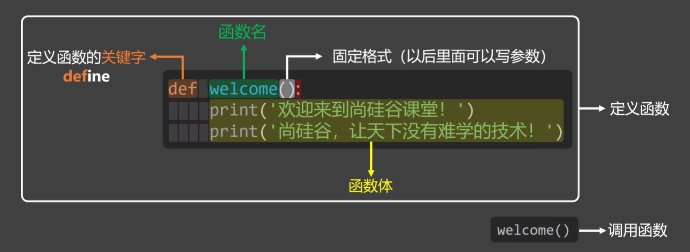

关键要素：

- **`def` 关键字**：告诉 Python “我要开始定义一个函数了”
- **函数参数 (Arguments)**：外界传递给函数的信息
- **`return` 语句**：**强制结束函数执行，返回一个值给函数外部接收，后续代码不再生效**。如果**没有 `return`，函数默认返回 `None`**

### 函数参数

Python 函数的参数系统非常强大且灵活。如果把函数比作一台**加工机**，参数就是你投入的**原材料**。

根据不同功能应用，函数的参数分为 5 大类：

| 类别           | 语法              | 关键点                         |
| :------------- | :---------------- | :----------------------------- |
| **位置参数**   | `def f(a, b)`     | 按顺序传入                     |
| **默认参数**   | `def f(a, b=10)`  | 调用时可省略                   |
| **可变位置**   | `def f(*args)`    | 接收多余位置参数，打包为元组   |
| **关键字限定** | `def f(*, a, b)`  | `*` 之后必须用关键字传         |
| **可变关键字** | `def f(**kwargs)` | 接收多余关键字参数，打包为字典 |

#### 位置参数

这是最基础的形式。在调用函数时，**实参的数量和顺序必须与定义的形参完全一致**。

核心概念：在调用函数时，**根据参数在函数中定义的顺序，将实参的值依次传递给对应的形参**，这种就叫**位置参数**。

注意点：

- 函数实参**不可以少传或多传**
- 传递实参时**不能跳过某个位置的参数，去给后面的形参赋值**

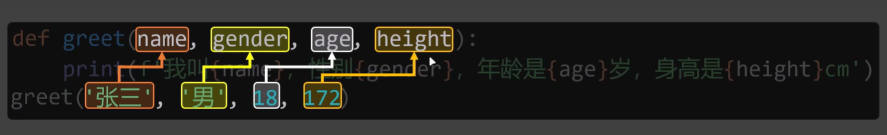

```python
def greet(name, age):
    print(name, age)

# 正确示例
greet('name', 'jack') # name jack

# 错误示例
greet('name')  # 少传了，抛出 TypeError: greet() missing 1 required positional argument: 'age'
greet('name', 'tom', 18) # 多传了，抛出 TypeError: greet() takes 2 positional arguments but 3 were given
```

#### 关键字参数

由于位置参数的限制（**调用函数时传递的实参顺序、数量必须与位置参数定义时保持一致**），Python 又提供了 **关键字参数**。

核心概念：在**调用函数**时，**将实参值显式传递给具体某个形参名。（指名道姓的传递给某个具体形参）**

##### 基本语法

- **调用函数**时，使用 **`<函数名>(形参名=实参值)`** 的形式传递实参值

```python
# 定义位置形参
def greet(name,age,gender):
    pass

# 调用函数时，给指定形参名传递实参值
greet('jack', age=18, gender=True)

greet(age=18, gender=True, name="jack") # 无需关心位置参数的定义顺序
```

- 核心优势：**如果全部写关键字参数，则无需关心位置参数的定义顺序，关键字参数可以不按照顺序传递**

  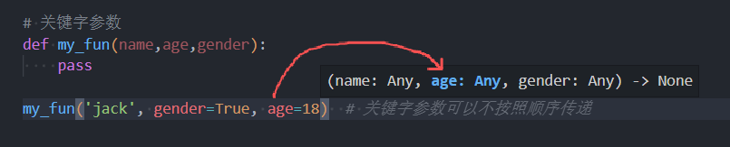

##### 注意点

- **关键字参数与位置参数混用**时，**位置参数必须写在关键字参数前面**

  ```python
  def my_fun(name, age, gender):
      pass
  
  # 错误示例，关键字参数必须在位置参数后面
  my_fun(age=18, 'jack', gender=True)  # 抛出异常 SyntaxError: positional argument follows keyword argument
  my_fun(name='jack', 18, gender=True)  # 抛出异常 SyntaxError: positional argument follows keyword argument
  ```

- 关键字参数**不可以重复传递**

  ```python
  def my_fun(name, age, gender):
      pass
  
  my_fun('jack', gender=True, age=18, age=19)  # 抛出异常 SyntaxError: keyword argument repeated: age
  ```

- **不可以传递未定义的形参**

  ```python
  def my_fun(name, age, gender):
      pass
  
  # 抛出异常 TypeError: my_fun() got an unexpected keyword argument 'school'
  my_fun('jack', gender=True, age=18, school='beijing')
  ```

- **覆盖参数的默认值**

  ```python
  def my_fun(name, age=0, gender=False):
      print(name, age, gender)
  
  # 覆盖默认值
  my_fun(name='jack', age=18, gender=True)  # jack 18 True
  ```

##### / * 限制传参方式

Python 提供了 **`/` 和 `*`**两个运算符来**在定义函数、声明形参时，限制实参的传递方式**

- **`/`：前面只能用位置参数**
- **`*`：后面只能用关键字参数**
- **位于 `/` 和 `*` 之间的参数，可同时使用位置参数与关键字参数**

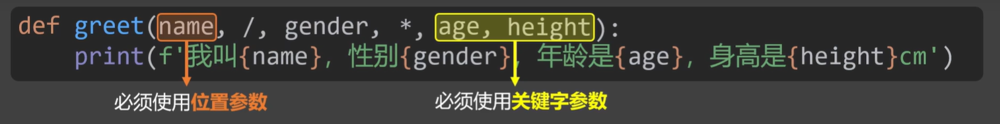

```python
def myfun(name, /, age, *, gender, city)
# / 之前的： name 必须使用位置参数

# / 与 * 夹在中间的：age 可以使用位置参数，也可以使用关键字参数

# * 后面的：gender、city 必须使用关键字参数
```

示例：

```python
# / * 限制传参方式
def my_fun(name, /, age, *, gender, city):
    print(name, age, gender, city)

my_fun('jack', 18, gender='male', city='shanghai')  # jack 18 male shanghai
my_fun('jack', age=18, city='shanghai', gender='male')  # jack 18 male shanghai
```

> 一般第三方库的 API 都会使用 **`func(*, name, age)` 的形式给外部使用，防止传错位置**。

#### 参数默认值（可选参数）

核心概念：**定义函数**时，通过 **`形参名=值`** 的形式，**为函数形参定义一个默认值**。

特性：当调用函数时，若**没有传递对应的实参值，则使用默认值，否则使用传递的关键字实参值**。

> 注：**通过关键字参数传递的形式去覆盖参数默认值**。

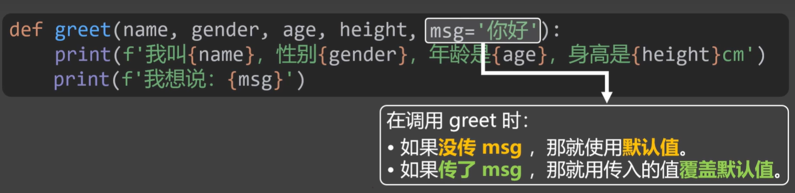

```python
def greet(name, age=18, gender=True):
    print(name, age)

greet('jack') # jack 18 True
greet('tom', 20) # tom 20 True
greet('tom', 20, gender=False) # tom 20 False => gender=False 关键字传递覆盖默认值
```

##### 可选参数特性

当**函数形参设定了默认值之后，它会变成可选参数**，即**可传可不传**

- 要么必须**放在所有必选参数的后面**，否则会报错
- 要么**可选形参后面的所有形参，都必须加上默认值**

```python
# def my_fun(name, gender='male', age, address='beijing'): 
# 报错 SyntaxError: parameter without a default follows parameter with a default

def my_fun(name, age, gender='male', address='beijing'):
    print(name, age, gender, address)


my_fun('name', 18)  # name 18 male beijing
```

##### 不要设定为可变对象

函数的**默认参数只求值一次**，所以**参数的默认值不要设定为可变对象**。

原因：这是因为**参数传递的本质是引用传递**，如果参数的默认值**使用可变对象，可变对象通常为容器类型（列表、字典、集合）**，在**初次调用函数后，会在内存中创建一个该容器（形参）的引用地址**，并长久持有，**后续再调用该函数时，使用的都是同一个内存中的容器对象（形参）**。

> 如果需要在函数中使用可变对象，**应该将其设定为局部变量或全局变量使用**，放在形参上会引发歧义。

错误示例：

```python
def my_func_8(name, school=[]):
    school.append(name)
    print(school)


my_func_8('jack')  # ['jack']
my_func_8('tom')  # ['jack', 'tom']
my_func_8('kally')  # ['jack', 'tom', 'kally']
```

正确示例：

```python
def my_func_9(name, school=None):
    if school is None:
        school = []
    school.append(name)
    print(school)


my_func_9('jack')  # ['jack']
my_func_9('tom')  # ['tom']
my_func_9('kally')  # ['kally']
```

#### 可变参数

*类似于 JavaScript 的 ...args 剩余参数*

核心定义：当**外部调用函数，不知道传递多少个实参**时，可以**使用可变参数来一起收集并打包**到一起

可变参数分为：

- ***args 可变位置参数**：**接收任意多个位置参数，打包成一个元组列表**

  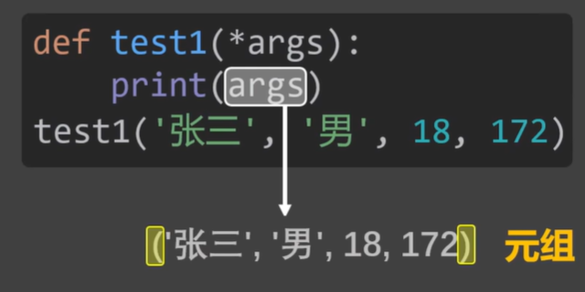

- **\**kwargs 可变关键字参数**：**接收任意多个关键字（即 `key=value` 形式）参数，打包成一个字典**

  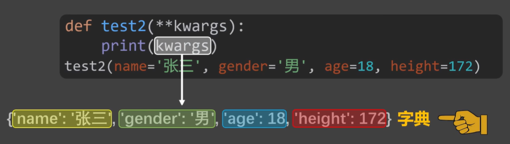

> 可以把 `*args` 想象成一个**大布袋**，不管来多少零碎东西都往里装；把 `**kwargs` 想象成一个**带标签的收纳盒**，每个东西进来都得贴个名字。

##### * 可变位置参数

语法：

```python
def myfun(name, age, *totalArgs):
    pass
```

作用：**调用函数**时，**接收除了 `name`、`age` 位置参数之外，其他多余传递的位置参数**，并收集在一起**打包成一个元组**列表。

```python
def my_func(name, age, *args):
    print(name, age, args)

my_func('jack', 18, 'beijing', 'shanghai')  # jack 18 ('beijing', 'shanghai')


def my_func_1(*args):
    print(args)

my_func_1('jack', 18, 'beijing', 'shanghai') # ('jack', 18, 'beijing', 'shanghai')
```

##### ** 可变关键字参数

语法：

```python
def myfun(name, age, **totalKWArgs):
    pass
```

作用：**调用函数**时，**接收除了 `name`、`age`关键字参数之外，其他多余传递的关键字参数**，并收集在一起**打包成一个字典**。

```python
def my_func_2(**kwargs):
    print(kwargs)

# {'name': 'jack', 'age': 18, 'city': 'beijing', 'school': 'shanghai'}
my_func_2(name='jack', age=18, city='beijing', school='shanghai')


def my_func_3(name, age, **kwargs):
    print(name, age, kwargs)

# jack 18 {'city': 'beijing', 'school': 'shanghai'}
my_func_3('jack', 18, city='beijing', school='shanghai')
```

注：由于**关键字参数传递实参值时不关心形参定义的顺序**，它**只关注是否定义了这个形参名**，所以两者混用时，**可变关键字参数只会接收未定义的形参名及值**。

```python
def my_fun_7(name, age, **kwargs):
    print(name, age)  # jack 18
    print(kwargs)  # {'city': 'beijing', 'school': 'shanghai'}


my_fun_7(name='jack', city='beijing', age=18, school='shanghai')
```

##### 两者混用

```python
def my_func_4(*args, **kwargs):
    print(args)  # ('jack', 18)
    print(kwargs)  # {'gender': True, 'city': 'beijin'}

my_func_4('jack', 18, gender=True, city="beijin")


def my_func_5(name, age, *args, gender, city, **kwargs):
    # 固定位置参数
    print(name, age)  # jack 18
    # 可变位置参数
    print(args)  # ('beijing', 'shanghai')
    # 固定关键字参数
    print(gender, city)  # True beijing
    # 可变关键字参数
    print(kwargs)  # {'school': 'shanghai'}

my_func_5('jack', 18, 'beijing', 'shanghai', gender=True, city="beijing", school='shanghai')
```

#### 多种参数混用

当函数中定义了多种类型的参数时，需按照如下规则：

- **位置参数在最前面，可变位置参数紧随其后**
- **默认值参数在中间**
- **关键字参数在后面，可变关键字参数紧随其后**

```
def func(a, b, *args, c=10, **kwargs):
         ↑  ↑    ↑       ↑       ↑
         │  │    │       │       └── 可变关键字参数（打包剩余关键字 → dict）
         │  │    │       └── 关键字参数（默认值）
         │  │    └── 可变位置参数（打包多余位置 → tuple）
         │  └── 位置参数
         └── 位置参数
```

注意点：在**使用关键字参数覆盖参数的默认值**时，由于**关键字参数是指名道姓的给**，所以**不会被 `**kwargs` 可变关键字参数收集**。

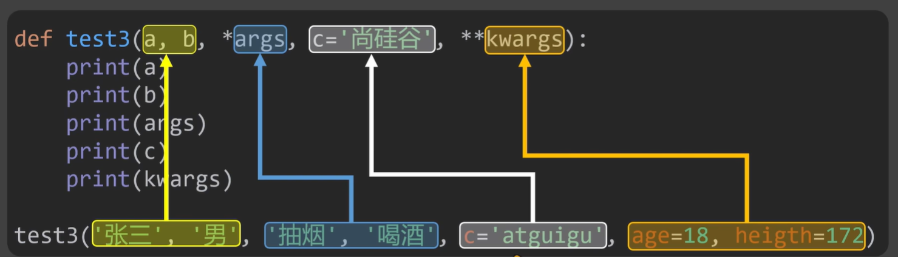

示例：

```python
def my_func_6(name, age, *args, gender=True, city='beijing', **kwargs):
    # 位置参数
    print(name, age)  # jack 18
    # 可变位置参数
    print(args)  # ('1046@qq.com', 'shanghai')
    # 参数默认值（关键字参数）
    print(gender, city)  # False hunan
    # 可变关键字参数
    print(kwargs)  # {'school': 'shanghai'}

my_func_6('jack', 18, '1046@qq.com', 'shanghai', gender=False, school='shanghai', city='hunan')
```

#### 参数的打包与解包

序列与字典容器类型都提供了 `*` 和 `**`解包语法，相当于**把列表与字典内容展开输出**，可以通过这种语法在调用函数时，**一次性传递多个实参值**。

- **`list` 列表、 `tuple` 元祖 **： **`*`解包展开**传递给**位置参数**
- **`dict` 字典 **：**`**` 解包展开**传递给**关键字参数**

```python
# 可变参数打包接收
def my_func_10(name, age, *args, school, **kwargs):
    # 位置参数
    print(name, age)  # jack 18

    # 可变位置参数
    print(args)  # ('1046@qq.com', 'shanghai')

    # 解包可变位置参数
    email, address = args  
    print(email, address) # '1046@qq.com' 'shanghai'
    
    # 参数默认值（关键字参数）
    print(school)  # 上海财经学院

    # 可变关键字参数
    print(kwargs)  # {'address': '上海', 'gender': '男'}

    # 解包可变关键字参数
    addressItem, genderItem = kwargs.items()
    print(addressItem, genderItem)  # ('address', '上海') ('gender', '男')


arg_list = ['jack', 18, '1046@qq.com', id('1569')]
arg_dict = {'school': '上海财经学院', 'address': '上海', 'gender': '男'}

# 参数打包传递
my_func_10(*arg_list, **arg_dict)
```

#### 函数参数传递的本质

函数参数传递的**本质就是变量之间的引用传递**。在函数体内部**函数参数就是函数内的一个局部变量**。

核心概念：函数参数的传递是**在函数体内部以 `形参名（局部变量） = 实参值（外部变量）`的形式，重新赋值指向新对象**

局部变量的生命周期：**函数执行结束，函数内的局部变量立即销毁**

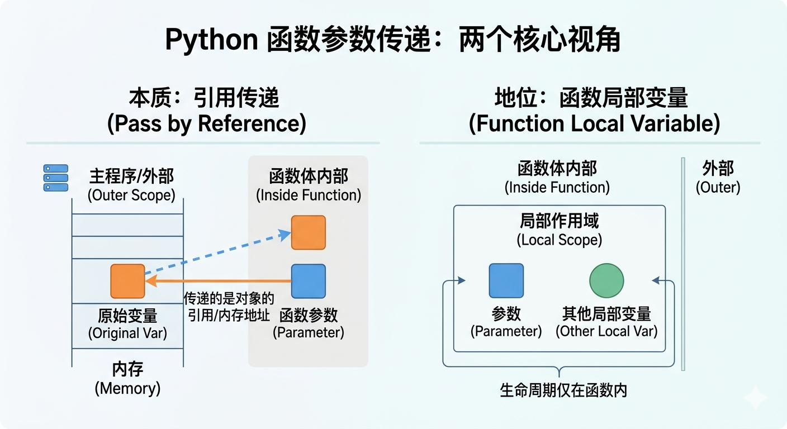

拿到引用后，外部数据会不会被函数修改，**完全取决于对象本身是可变的还是不可变的**：

##### 不可变类型 (int, str, tuple...)

描述：相当于是**`=`重新赋值，创建一个新对象，与外部变量断开联系**，所以**不会影响函数外部变量值**

```python
a = 666

def welcome(data):
    # 其实内部就是 data = a
    print(data) # 666 修改前
    data = 888
    print(data) # 888 修改后

print(a) # 函数调用前 666
welcome(a)
print(a) # 函数调用后 666
```

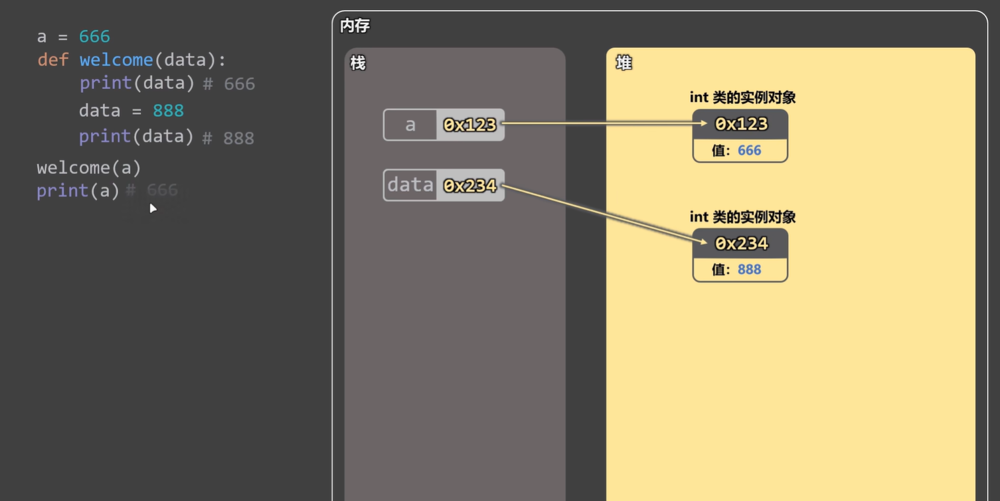

##### 可变类型 (list, dict, set)

描述：相当于是**修改对象，与外部变量保持联系**，所以**会影响函数外部变量值**

```python
a = [10, 20, 30]

def welcome(data):
    # 其实内部就是 data = a
    print(data) # [10, 20, 30] 修改前
	data[2] = 99
    print(data) # [10, 20, 99] 修改后

print(a)  # 函数调用前 [10, 20, 99]    
welcome(a)
print(a)  # 函数调用后 [10, 20, 99]
```

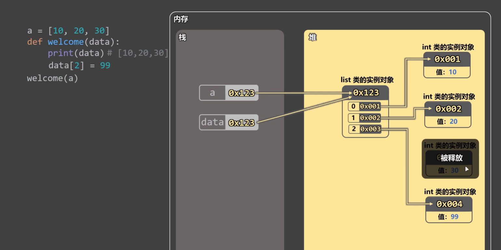

##### `=` 赋值 vs 原地修改

```python
def killer(lst):
    lst = lst + [4]   # ⚠️ 这会创建新列表，并让 lst 指向它！

def survivor(lst):
    lst += [4]        # ⚠️ 这是原地修改，等同于 extend

my_list = [1, 2, 3]
killer(my_list)
print(my_list)  # [1, 2, 3] → 没变！(killer 里面 lst 断了)

survivor(my_list)
print(my_list)  # [1, 2, 3, 4] → 变了！
```

##### 人为 “屏蔽” 引用传递

如果**想将外部可变对象变量安全的传递给函数，使得函数内部修改不会影响外部变量**，可以**通过容器的实例方法 `copy()` 浅拷贝一份外部容器变量的副本传递给函数参数**：

```python
a = ['A', 'B']

def func(arg):
    # 其实内部就是 arg = a
    arg.append('C')
    print(arg)  # ['A', 'B', 'C']

func(a.copy())  # 拷贝 a 的副本给函数参数 arg

print(a)  # ['A', 'B']
```

### 函数的返回值

函数的返回值：函数执行完毕后，会把执行结果交给调用者，这个**执行结果就是函数的返回值。**

要想指定函数的返回值需使用 `return` 关键字。

**`return`关键字**：

- **直接结束函数执行，返回一个具体的值作为函数的返回值给外部调用者**
- **没有 `return` 关键字，函数默认返回 `None`**

```python
# 有 return 的返回值
def my_func_11():
    return 'hello world'

msg = my_func_11()
print(msg)  # hello world

# 无 return 的默认返回值
def my_func_12():
    pass

msg_2 = my_func_12() # None
```

#### 返回 x,y 多个值

当函数**通过 `return` 一次性返回多个值**时，实质是**返回一个元组**：

```python
def my_func_13():
    return 'hello', 'world'

msg_3 = my_func_13()
print(msg_3)  # ('hello', 'world')

# 元组解包
a, b = msg_3
print(a, b)  # hello world
print(*msg_3)  # hello world
```

### 函数的对象特性

#### 函数的类型

在 Python 中，万物皆对象，函数本质上其实也是一个对象，类型是 **`<class 'function'>`**  。

- 函数的类型对象在底层定义为 **`types.FunctionType`**

要想引用这个类型，必须通过 **`import types` 模块**，或者使用 **`type(lambda: None)` 这种方式即时获取**。

##### types.FunctionType

描述：它是 Python 在**底层定义**的**函数实例的所属类型**。

> 因为**函数通常通过 `def` 或 `lambda` 语法糖来创建**。所以 Python 并**没有提供 `function` 关键字**。

```python
# 函数的类型是 types.FunctionType，它对外不可见，只能通过 types 模块来引入
import types

print(types.FunctionType)  # <class 'function'>

def func(): pass

print(type(func) is types.FunctionType)  # True
```

##### 函数 & object & type 的关系

在 Python 中，**一切类都是由 `type` 元类构造的（所有类都是 `type` 元类的实例），一切类都是继承自 `object` 基类（所有类都是 `object` 基类的子类，所有类的实例也是 `object` 基类的实例）**。

所以：

- **`types.FunctionType` 函数类型**是 **`type` 元类构造的实例**、也是**`object` 基类的子类**  
- **`function` 函数**是**`types.FunctionType`类型的函数类实例**
  - 所以 **`function` 函数实例也是 `object` 类的实例**

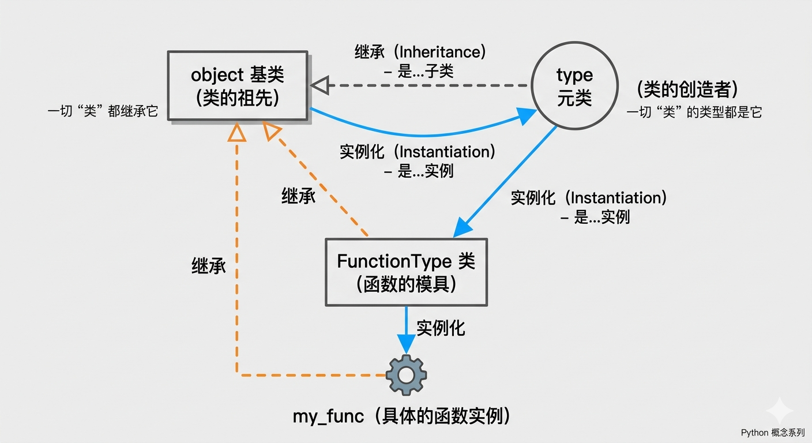

```python
import types

def func(): pass

# 检查函数实例 与 types.FunctionType 函数类的关系
print(type(func) is types.FunctionType)  # True
print(type(func))  # <class 'function'> 函数的类型

# 检查 函数 与 object基类 的关系
print(isinstance(func, object))  # True 检查函数是否是 object 类的实例
print(issubclass(type(func), object))  # True 检查 function 函数类型是否继承自 object
print(func.__class__)  # <class 'function'>
print(func.__class__.__bases__)  # (<class 'object'>,)

# 检查 函数 与 type元类 的关系
print(issubclass(type(func.__class__), type))  # True
print(func.__class__.__class__)  # <class 'type'>
```

#### 对象特性

既然函数也是继承自 `object` 基类的，那么它也具备对象的一切特性，函数对象也可以有如下操作：

- 访问 `__dict__`、`__class__`、`__bases__` ...等魔术属性
- 为函数对象**动态添加属性**
- 可以**赋值给变量**，也可以**作为参数传递给其他函数**
- 也可以**作为返回值给其他变量接收**
- ...

> 注意：与其他对象不同的是，在 CPython 的底层实现中，`function` 函数对象的许多内置魔术属性方法（如 `__str__`, `__repr__`, `__call__`）是**只读**的，不允许动态修改（重写）。

示例：

```python
def func(): pass

print(func.__dict__)  # {}
print(func.__name__)  # func
print(func.__module__)  # __main__
```

##### 为函数动态添加属性

```python
def welcome():
    print('你好啊')

# 动态添加属性
welcome.desc = '这是一个打招呼的函数'
welcome.version = 1.0

# 查看 welcome 函数实例对象的空间字典
print(welcome.__dict__)  # {'desc': '这是一个打招呼的函数', 'welcome': 1.0}

# 访问函数属性
print(welcome.desc)  # 这是一个打招呼的函数
print(welcome.version)  # 1.0
```

函数对象在内存中的结构：

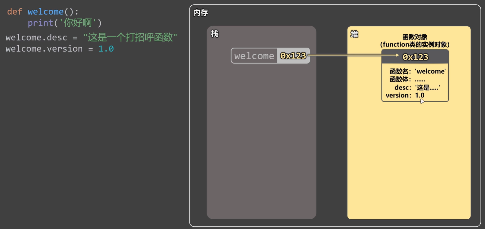

##### 将函数赋值给变量

函数本身也是一个对象，可以赋值给变量，本质上是**将函数对象的内存地址引用传递给了其他变量**。

```python
def welcome():
    print('你好啊')

welcome.desc = '这是一个打招呼的函数'
welcome.version = 1.0

print(welcome.__dict__)  # {'desc': '这是一个打招呼的函数', 'welcome': 1.0}
print(welcome.desc)  # 这是一个打招呼的函数
print(welcome.version)  # 1.0

# 函数本身也是一个对象，可以赋值给变量，本质上是将函数对象的内存地址引用传递给了其他变量
say_hi = welcome
say_hi()
print(say_hi.__dict__)  # {'desc': '这是一个打招呼的函数', 'welcome': 1.0}
print(say_hi.desc)  # 这是一个打招呼的函数
print(say_hi.version)  # 1.0
```

#### 高阶函数

高阶函数指的就是当一个函数的**接受参数是一个函数**，**返回值是一个函数**，则它就是一个高阶函数。

意义：

- **代码复用性高**：可以把**行为 “独立出去”**，传入**不同函数实现不同逻辑**
- 让函数更灵活、更实用
- 构成**装饰器、闭包**的基础

##### 函数作为参数传递

```python
# 函数作为参数传递
def add(x, y):
    return x + y

def apply_func(func, x, y):
    return func(x, y)

result = apply_func(add, 1, 1)
print(result) # 2
```

##### 函数作为返回值（局部函数）

在 Python 中，函数可以嵌套定义，即在函数内通过 `def` 关键字再定义若干个函数；

- **局部函数**：指**在函数内嵌套定义的函数，外部不可调用，但可以作为返回值给外部引用**。

  > 注意：将函数作为返回值给外部引用，会导致**闭包**行为。*跟 JavaScript 的特性一样*
  >
  > > **闭包**：是指**当外层函数结束时，内层函数还在因为引用外部变量，而无法及时释放内存**的一种行为。

```python
# 函数作为返回值
def outer():
    def inner():
        print('inner')

    return inner


outer()()  # inner => 外层函数() 调用，返回 inner 函数的引用，再调用 inner 函数

func = outer()  # 这里其实是 inner 函数的引用
func()  # inner
```

### 函数调用栈（Call Stack）

#### 基本概念

调用栈（Call Stack）是 Python 解释器**跟踪函数调用顺序和局部变量**的机制；

- **调用栈结构**：**先进后出（LIFO, Last In, First Out）**。最后调用的函数最先执行完。
  - **入栈（Push）：** **调用函数**时，新的栈帧被压入
  - **出栈/弹栈（Pop）：** **函数执行完毕**（遇到 `return` 或执行结束），对应的栈帧被弹出，**控制权交回给上一个函数**
- **栈帧容器（执行上下文）**：每当一个函数被调用，系统都会创建一个栈帧（Stack Frame）并将调用的函数推入函数调用栈栈顶
  - 这个栈帧（函数执行上下文）包含了该函数的**作用域链、局部变量、参数、返回地址、冻结语句等等...**
  - 当栈帧容器中全部函数执行完毕，释放内存引用后，会**立即销毁**
  - 每个栈帧都有自己的局部变量，互不干扰（即使是递归调用同名函数）

> 注意：栈的空间是有限的。如果递归太深且没有停止条件，会导致 **RecursionError**（即栈溢出 Stack Overflow）

##### Traceback 快照

当 Python 代码报错时，终端显示的 **Traceback** 其实就是当前**调用栈的快照**。它按顺序告诉你：错误发生在哪一行，以及它是通过哪些函数一层层调用到这里的。

#### 核心理解（出栈、弹栈）

在 Python 执行程序时，代码是**从上向下逐行同步执行**的；

假设当前 `.py` 全局模块中有三层结构：**`全局` -> `全局外层函数A` -> `嵌套内层函数B` -> `函数B中嵌套内层函数C`**。

​	当 Python 在**当前全局模块（全局作用域）中读取到函数执行**时，系统就会立即**创建一个栈帧（Stack Frame）容器**；接着立即**冻结**全局模块中**调用函数当前行的后续代码语句**，随后**将当前全局模块压入栈底**，**等待全局函数`A`执行完毕**或遇到 `return` 返回值后**才继续执行**；

​	Python 解释器**开始进入**全局函数`A`中执行函数体。

​	在全局函数内部执行过程中，每当 Python 解释器**再次读取到一个嵌套内层函数`B`被调用**，系统就会**立即冻结**全局外层函数`A`中**调用函数`B`当前行的后续代码语句**，**等待嵌套内层函数`B`执行完毕**或遇到 `return` 返回值后**才继续执行**；

​	接着 Python **进入嵌套内层函数`B`中**执行；如果在嵌套内层函数`B`中**也遇到了嵌套内层函数`C`的调用**，则继续**将当前嵌套内层函数`B`压入栈帧容器中**，并**冻结调用函数`C`当前行的后续代码语句**，**等待嵌套内层函数`C`执行完毕**或遇到`return`返回值后**才继续执行**；

​	此时栈帧容器已经有了**全局模块（栈底） >   全局外层函数`A`（栈中）>  嵌套内层函数`B`（栈顶）**；

​	接着 Python 解释器**进入**嵌套内层函数`C`中执行代码...以此类推；

​	当第三层嵌套内层函数执行完毕并返回值后；

​	Python 解释器**立即跳出**嵌套内层函数`C`，**释放内存引用**，随后**进入栈帧容器中**，依次**从上往下取出嵌套内层函数`B`（弹栈）**，并**继续执行**当初压栈时**冻结的后续代码语句**；

​	当**位于栈顶**的嵌套内层函数`B`**执行完毕并返回值后**，Python 解释器**立即跳出并释放内存引用**，随后**再次进入栈帧容器中**；接着**取出此时位于栈顶的外层全局函数`A`**，并**继续执行**当初压栈时**冻结的后续代码语句**；

​	直到外层全局函数`A`的代码执行完毕；整个嵌套函数调用栈过程就**结束**了，最后**将外层全局函数`A`的返回值，返回给当前模块**。

​	最终**栈帧容器销毁**，接着**继续执行**当前模块中全局作用域内**剩余的后续代码**。

| **步骤** | **动作**     | **栈容器状态（顶部为当前执行环境）**                         | **状态描述**                           |
| -------- | ------------ | ------------------------------------------------------------ | -------------------------------------- |
| 1        | 执行全局代码 | `[ 全局模块 ]`                                               | 全局变量初始化中                       |
| 2        | 调用 `函数A` | `[ 函数A ]` `[ 全局模块 (已冻结) ]`                          | 全局模块在调用行被“冻结”，A 进入活跃态 |
| 3        | 调用 `函数B` | `[ 函数B ]` `[ 函数A (已冻结) ]` `[ 全局模块 (已冻结) ]`     | A 在调用行被“冻结”，B 是当前活跃栈帧   |
| 4        | 调用`函数C`  | `[函数C]` `[函数B （已冻结]` `[函数A (已冻结)]` `[全局模块 (已冻结)]` | B 在调用行被“冻结”，C 是当前活跃栈帧   |

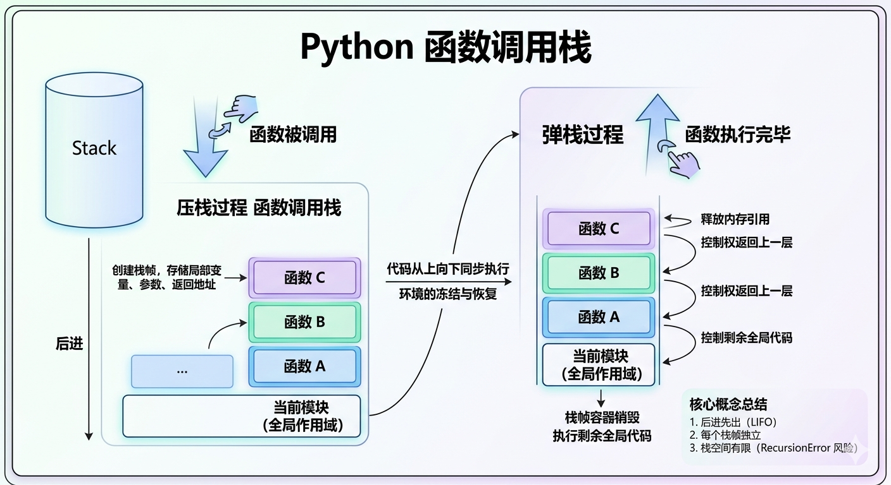

##### 关键点

- **“冻结语句”的本质：** 在计算机科学中通常由 **程序计数器（Program Counter）** 实现。它记录了当前函数执行到了哪一行。当函数返回时，解释器根据这个“书签”精准回到刚才停下的地方。

- **内存释放：** 当一个函数（栈帧）被弹出（Pop）时，该函数内部定义的**局部变量**如果没有被外部引用（比如闭包），通常会立即变为垃圾回收的目标。这也是为什么函数执行完后，你无法再访问其内部局部变量的原因。

- **异常回溯：** 这种“嵌套”结构解释了为什么报错时 Traceback 是层级状的。如果 `函数B` 报错了，Python 会查看栈容器，发现它是由 `函数A` 调用的，而 `函数A` 又是由 `全局` 调用的，从而拼凑出完整的错误路径。

#### 核心流程

##### 1、压栈阶段（Push）：冻结与深入

当 Python 执行到一个函数调用语句时：

- **创建容器：** 立即在内存中为该函数开辟一个**栈帧（Stack Frame）**，存入局部变量和参数。
- **冻结现场：** 暂停（冻结）当前函数的后续代码，记录下“执行到了哪一行”。
- **入栈存储：** 将这个栈帧压入调用栈的顶部。
- **转移控制：** 解释器的注意力转移到新压入的函数内部，开始从头执行。

##### 2、执行阶段（Executing）：层层嵌套

- 如果函数 A 里面又调用了函数 B，过程会**重复上演**。
- 栈会变得越来越深，就像叠罗汉一样：`[栈顶：函数B] -> [函数A] -> [栈底：全局模块]`。
- 此时，只有处于**栈顶**的函数是活跃的，下层的函数都在“冻结”等待中。

##### 3、弹栈阶段（Pop）：释放与回归

当函数遇到 `return` 或执行完毕时：

- **结果交接：** 将返回值（如果有）传给下方等待的函数。
- **销毁容器：** 该栈帧从栈顶弹出，并**释放内存引用**。
- **激活现场：** 解释器回到下方函数的“冻结位置”，继续执行剩余代码。
- **最终回归：** 直到所有函数弹出，回到全局作用域，程序结束。

#### 函数嵌套调用案例

```python
def test1():
    print('进入 test1 函数')
    test2()
    print('退出 test1 函数')


def test2():
    print('进入 test2 函数')
    test3()
    print('退出 test2 函数')


def test3():
    print('进入 test3 函数')
    print('正在执行 test3 函数')
    print('退出 test3 函数')


test1()

# 输出：
# 进入 test1 函数
# 进入 test2 函数
# 进入 test3 函数
# 正在执行 test3 函数
# 退出 test3 函数
# 退出 test2 函数
# 退出 test1 函数
```


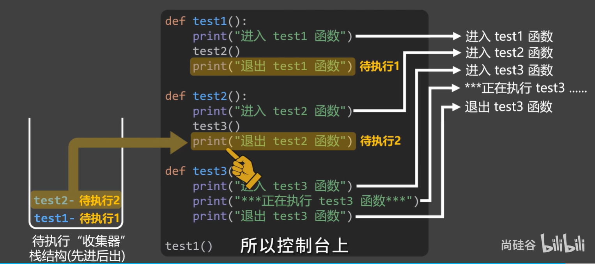

#### 函数递归调用

函数的递归调用是最能体现函数调用栈的实现。

```python
# 递归调用
def factorial(num):
    if num == 1:
        return 1
    else:
        return num * factorial(num - 1)


print(factorial(5))  # 输出 120
```


### lambda 匿名函数

在 Python 中，**匿名函数**（Anonymous Function）又被称为 **lambda 表达式**。*类似于 JavaScript 的 () => 匿名函数*

简单来说，它是一种**不需要使用 `def` 关键字、没有函数名字**、只能包含**一条表达式**的简易函数。

核心功能：它通常用于需要**临时定义一个小逻辑，且以后不再复用**的场景。

#### 基本语法

它的结构非常精简：

```python
# 有参
lambda <形参1>,<形参2>,...: <表达式>

# 无参
lambda: <表达式>
```

解释：

- **lambda**：关键字，告诉 Python 这是一个匿名函数
- **参数**：可以有多个，用逗号隔开，也可以没有
- **冒号**：分隔参数和表达式
- **表达式**： 函数的核心逻辑（**匿名函数体**），**表达式执行结果会自动返回**（不需要写 `return`）

##### 注意点

- 匿名函数整体**只能写一行代码，不可写多行代码**

- **`<表达式>` 内不可写代码块（`if`、`while`、`for`）**，但是它可以写 `if...else` 三元运算符（它没有代码块）

  ```python
  lambda a, b: "A" if a + b == 2 else "B"
  ```

- **永远不要将 lambda 表达式赋值给一个变量**

  它的设计初衷是作为**匿名函数**使用的（即用完即弃，不需要名字）。如果给它起了一个名字，那么它就违背了“匿名”的本意。

示例：

```python
sum = lambda a, b: a + b
print(sum(1, 2))  # 输出：3

square = lambda x: x ** 2

# 等价于
def sum(a, b): return a + b
print(sum(1, 2))  # 输出：3

def square(x): return x ** 2
```

#### 执行流程（控制反转）

`lambda` 匿名函数的执行流程是一种 **“控制反转”** 模式。

当 `lambda` 匿名函数在作为参数传递给高阶函数体里执行时，**`lambda`  所传入的参数就是一个 Call Back 回调函数**。

```python
def 主函数(数据, 回调函数):
    print("1. 主函数开始处理前置逻辑...")
    新数据 = 数据 + 10
    
    print("2. 到了触发点，开始调用 Lambda（回调）...")
    结果 = 回调函数(新数据)  # 这里才真正执行 Lambda
    
    print(f"3. 拿到 Lambda 的计算结果了: {结果}")

# 调用处
主函数(5, lambda x: x ** 2)

# 这里的 lambda 就是【回调函数】
# x 是主函数传给 lambda 的参数
result = map(lambda x: x * 2, [1, 2, 3])
```


##### 示例

```python
# 匿名函数拿取外部传递的参数进行计算，返回结果值给函数内部使用
def calculate(callback, x, y):
    return callback(x, y) # callback : (lambda x,y: x + y)

result = calculate(lambda x, y: x + y, 30, 10)

print(result)  # 40 20

# 对应 JavaScript 
# function add(callback,a,b) {
#    return callback(a,b)
# }
#
# add((x,y) => x + y,30,10)
```

详细执行流拆解：

1. **入场阶段**：调用 `calculate` 函数。此时，`lambda` 对象被赋值给变量 `callback` 回调函数，`30` 给 `x`，`10` 给 `y`
2. **调用阶段**：执行到 `return callback(x, y)`
   - Python 解释器发现 `callback` 回调函数实际上指向那个 `lambda` 匿名函数
   - 于是，它暂时“离开” `calculate`回调函数的主线，跳转到 `lambda` 匿名函数定义的逻辑
3. **求值阶段**：`lambda` 匿名函数接收到 `30` 和 `10`，执行表达式 `30 + 10`
4. **返回阶段**：
   - `lambda` 将计算结果 `40` 返回给 `callback(x, y)` 回调函数所在的那个位置
   - `calculate` 函数拿到这个 `40`，再通过自己的 `return` 将其送回给最外层的调用者

#### 常见应用场景

匿名函数通常被用来**作为参数传递给其他高阶函数临时使用（回调函数）**。

- **作为函数返回值给外部使用**：*会导致闭包*

  ```python
  def outer():
  
      return lambda x, y: x + y
  
  print(outer()(1, 2))  # 输出：3
  ```

- 作为参数传递给高阶函数使用：

  ```python
  # 接收一个函数，函数执行后会返回一个布尔值，根据布尔值来生成函数对应的返回值
  def func(callback):
      if callback() is not None:
          return callback()
      else:
          return "callback is None"
  
  print(func(lambda: "hello world"))  # 输出：hello world
  ```

- **列表排序（`sort()` / `sorted()`）**：

  ```python
  students = [('Alice', 25), ('Bob', 23), ('Jack', 21), ('Kally', 28)]
  
  students.sort(key=lambda x: x[1])  # 按照年龄排序
  
  print(students)  # 输出：[('Jack', 21), ('Bob', 23), ('Alice', 25), ('Kally', 28)]
  ```

- **数据过滤（`filter()`）**：

  ```python
  nums = [1, 2, 3, 4, 5, 6]
  
  even_nums = list(filter(lambda x: x % 2 == 0, nums)) # 过滤出所有偶数
  
  print(even_nums)  # 输出：[2, 4, 6]
  ```

- **数据映射（`map()`）**：

  ```python
  nums = [1, 2, 3, 4, 5, 6]
  
  squared_nums = list(map(lambda x: x ** 2, nums))
  
  print(squared_nums)  # 输出：[1, 4, 9, 16, 25, 36]
  ```


