# Python

> [!NOTE]
>
> ### 程序设计语言
>
> 程序设计语言：计算机语言，是用于**描述计算机所执行的操作的语言**。从计算机产生到现在，计算机语言本身经历了 **`机器语言`、`汇编语言`、`高级语言`** 三个阶段。
>
> - 机器语言：**采用计算机指令格式并以二进制编码表达各种操作的语言**。计算机能够直接识别。如 010100100...
>
>   > 优点：执行速度最快、占用存储空间最小、但最难读、难记、编程难度大、调试麻烦，且不同型号的计算机具有不同的机器指令系统。
>
> - 汇编语言：**一种符号语言，它采用助记符来表达指令功能**。只有 **增删改查** 4 种操作符。（**一个助记符可代表一个二进制的运算操作**）
>
>   > 加法 INC --编译器--> 0100 0000 减法 DEC 0100 1000 乘法 MUL 0100 1000 0100 1000 除法 DIV 0100 1000 0100 1000
>
>   > **汇编语言不能被计算机直接识别和执行，需要由一种汇编程序将助记符翻译成机器语言程序，计算机才能执行**，这个过程称之为 “汇编”。
>
> - 高级语言：**是面向问题的语言，它比较接近于人类的自然语言**。
>
>   > **用高级语言编写的程序（源程序）需要经过编译程序翻译成机器语言程序后才能执行，高级语言的翻译程序分为编译程序和解释程序两种。**
>
> #### 编译与解释
>
> 按照计算机的执行方式，高级语言分为**静态语言**和**脚本语言**两种，也相对应的有**编译器 Compiler** 和 **解释器 Interpreter 程序**。
>
> - 静态语言：采用**编译执行**的方式
>
>   - 编译：将源代码转换成目标代码的过程。源代码是计算机高级语言的源代码，而目标代码是机器语言的代码。（编译器程序 Compiler）
>
>     - **一次性编译，程序被编译后，运行时就不再需要源代码**
>
> - 脚本语言：采用**解释执行**的方式
>
>   - 解释：将源代码逐条转换成目标代码，同时逐条运行目标代码的过程。（解释器程序 Interpreter ）
>
>     - **在每次程序运行时都需要解释器和源代码逐行解释运行**
>
> > 常见的静态语言：Java、C#、C...
>>
> > 常见的脚本语言：PHP、JavaScript、Python

## 简介

Python 是一种**解释型、面向对象、动态强类型数据**的高级程序设计语言。由 Guido van Rossum 于 1989 年底发明，第一个公开发行版于 1991 年发布。

**核心特性：**

- **简单易学**  语法简洁清晰，接近自然语言
- **解释型语言**（非编译型）
- **动态强类型**（**运行时确定类型**，但类型敏感）
- **多范式**（面向对象、函数式、过程式）
- **垃圾回收**（自动内存管理）
- **GIL 限制**（全局解释器锁）
- **跨平台**  Windows、macOS、Linux 均可运行
- **面向对象**  支持类和对象，也支持函数式编程
- **丰富的库**  标准库强大，第三方库海量

**核心优缺点：**

| 维度           | 评价  | 说明                    |
| :------------- | :---- | :---------------------- |
| **开发效率**   | ⭐⭐⭐⭐⭐ | 最大优势，代码量少3-5倍 |
| **学习曲线**   | ⭐⭐⭐⭐⭐ | 最适合初学者的语言      |
| **生态丰富度** | ⭐⭐⭐⭐⭐ | 几乎覆盖所有领域        |
| **执行速度**   | ⭐⭐    | 最大劣势，比C慢30-100倍 |
| **并发能力**   | ⭐⭐    | GIL限制，多线程受限     |
| **内存占用**   | ⭐⭐⭐   | 对象开销大              |
| **移动端支持** | ⭐     | 几乎不可用              |

**应用领域：**

- 🌐 **Web 开发**：Django、Flask、FastAPI
- 📊 **数据分析**：Pandas、NumPy、Matplotlib
- 🤖 **人工智能/机器学习**：TensorFlow、PyTorch、scikit-learn
- 🔬 **科学计算**：SciPy、Jupyter
- 🕷️ **爬虫开发**：Requests、Scrapy、BeautifulSoup
- 🛠️ **自动化运维/脚本**：日常任务自动化
- 🎮 **游戏开发**：Pygame
- 🖥️ **桌面应用**：Tkinter、PyQt、Kivy

### 安装、下载

> Python 中文教程：https://docs.python.org/zh-cn/3.13/contents.html

> 官网：https://www.python.org/，直接下载环境安装即可

### Python 解释器

​	在安装好 Python 后自带一个程序解释器，**Python 解释器**是一个将 Python 代码逐行翻译并执行的程序。

​	Python 是一种**解释型语言**，这意味着代码不需要预先编译成机器码，而是由解释器在运行时动态执行。

​	当我们编写Python代码时，我们得到的是一个包含Python代码的以`.py`为扩展名的文本文件。要运行代码，就需要Python解释器去执行`.py`文件。

​	由于整个Python语言从规范到解释器都是开源的，所以理论上，只要水平够高，任何人都可以编写Python解释器来执行Python代码（当然难度很大）。事实上，确实存在多种Python解释器。

- 解释型 vs 编译型：

| 特性       | 解释型语言（Python）     | 编译型语言（C/C++） |
| :--------- | :----------------------- | :------------------ |
| 执行方式   | 逐行翻译执行             | 一次性编译成机器码  |
| 执行速度   | 相对较慢                 | 快                  |
| 跨平台性   | 好（需要解释器）         | 差（需重新编译）    |
| 调试便利性 | 方便（边执行边检查）     | 相对复杂            |
| 典型语言   | Python、Ruby、JavaScript | C、C++、Go          |

#### CPython 官方

当我们从[Python官方网站](https://www.python.org/)下载并安装好Python 3.x后，我们就直接获得了一个官方版本的解释器：**CPython**。这个解释器是用C语言开发的，所以叫CPython。在命令行下运行`python`就是启动CPython解释器。

- CPython是使用最广的Python解释器。

安装好 Python 之后，打开 `cmd` 控制台即可输入验证是否安装成功：

```shell
# 安装后默认就是 CPython
python --version
# 输出：Python 3.12.0 (默认就是CPython)
```

##### 工作原理

**虚拟机（PVM）**：CPython 的核心是一个基于栈的虚拟机（Python Virtual Machine）。它逐条解释这些字节码指令并调用对应的 C 语言函数来执行。

```
Python 源代码 (.py)
       ↓
   词法分析 → 生成 Token
       ↓
   语法分析 → 生成 AST（抽象语法树）
       ↓
   编译 → 生成字节码 (.pyc)
       ↓
   Python 虚拟机 (PVM) 执行字节码
       ↓
      结果
```

##### .pyc 字节码文件

Python 并不是直接由机器执行的，也不是像 C++ 那样直接编译成机器码。它采用的是字节码（Bytecode）机制。

- 首次运行 `.py` 文件时，会生成 **`__pycache__/`** 目录
- 里面存放 **`.pyc` 字节码文件**
- 第二次运行直接加载 `.pyc`，提高启动速度

```bash
# 手动生成字节码
python -m compileall ./

# 查看字节码
python -m dis test.py
```

##### 常用命令

```bash
# 交互式模式
python

# 输出当前 Python 版本
python --version

# 执行脚本
python script.py

# 执行模块
python -m http.server 8000

# 进入调试模式
python -m pdb script.py

# 打印语法树（AST）
python -m ast script.py

# 检查语法错误
python -m py_compile script.py

# 打印帮助信息
python -h
```

#### 其他解释器

##### IPython

IPython 是基于CPython之上的一个交互式解释器，也就是说，IPython只是在交互方式上有所增强，但是执行Python代码的功能和CPython是完全一样的。

CPython用`>>>`作为提示符，而IPython用`In [序号]:`作为提示符。

##### PyPy

PyPy是另一个Python解释器，它的目标是执行速度。PyPy采用[JIT技术](http://en.wikipedia.org/wiki/Just-in-time_compilation)，对Python代码进行动态编译（注意不是解释），所以可以显著提高Python代码的执行速度。

绝大部分Python代码都可以在PyPy下运行，但是PyPy和CPython有一些是不同的，这就导致相同的Python代码在两种解释器下执行可能会有不同的结果。如果你的代码要放到PyPy下执行，就需要了解[PyPy和CPython的不同点](http://pypy.readthedocs.org/en/latest/cpython_differences.html)。

##### Jython

Jython是运行在Java平台上的Python解释器，可以直接把Python代码编译成Java字节码执行。

##### IronPython

IronPython和Jython类似，只不过IronPython是运行在微软.Net平台上的Python解释器，可以直接把Python代码编译成.Net的字节码。

### 交互式环境

安装好 Python 环境之后，可以在 `cmd` 控制台输入 `python` 进入交互式环境，进行简单的基础编码：

```shell
PS C:\Users\win> python
Python 3.13.9 (tags/v3.13.9:8183fa5, Oct 14 2025, 14:09:13) [MSC v.1944 64 bit (AMD64)] on win32
Type "help", "copyright", "credits" or "license" for more information.
>>> print("hello world")
hello world
>>>
```

#### 交互式模式快捷键

| 快捷键                                    | 功能         |
| :---------------------------------------- | :----------- |
| `Ctrl+D` (Linux/Mac) / `Ctrl+Z` (Windows) | 退出解释器   |
| `Ctrl+C`                                  | 中断当前执行 |
| `Ctrl+L`                                  | 清屏         |
| `↑` / `↓`                                 | 浏览历史命令 |
| `Tab`                                     | 自动补全     |
| `help()`                                  | 进入帮助系统 |
| `exit()`                                  | 退出         |

## 环境管理

### pyenv 版本管理

`pyenv` 是一款轻量级的 **Python 版本管理工具**，它能让你在同一台电脑上方便地安装、切换和管理多个 Python 版本，并且**不会干扰系统自带的 Python 环境**。

#### 为什么需要 pyenv ？

主要是为了管理用户本地系统与遗留项目的 Python 版本。

```
项目A：需要 Python 3.8（遗留系统）
项目B：需要 Python 3.10
项目C：需要 Python 3.12（最新特性）
系统：默认 Python 3.11

没有 pyenv：频繁卸载重装 Python 版本
有 pyenv：一键切换！
```

#### 工作原理

```
pyenv 接管 PATH 环境变量
    ├── ~/.pyenv/versions/
    │   ├── 3.8.18/（项目A使用）
    │   ├── 3.10.13/（项目B使用）
    │   ├── 3.11.8/（系统默认）
    │   └── 3.12.0/（项目C使用）
    └── shims/（拦截 python 命令）
```

每个通过 `pyenv` 安装的 Python 版本都有**完全独立**的包目录：

```
~/.pyenv/versions/
├── 3.11.0/
│   ├── Lib/site-packages/    # 3.11.0 的包
│   └── Scripts/              # 3.11.0 的可执行文件
├── 3.12.0/
│   ├── Lib/site-packages/    # 3.12.0 的包
│   └── Scripts/
└── 3.14.3/
    ├── Lib/site-packages/    # 3.14.3 的包
    └── Scripts/
```

切换 Python 版本后**包不会共享**：

```
pyenv global 3.11.0
pip list    # 显示 3.11.0 安装的包

pyenv global 3.14.3
pip list    # 显示 3.14.3 安装的包（不同的列表）
```

#### pyenv-win （Windows）

由于原生的 `pyenv` 不支持 Windows，你需要安装其移植版本 **`pyenv-win`**。

##### 1. 运行安装脚本

这是官方最推荐的安装方式，通过 PowerShell 一键完成。

1. 右键点击“开始”菜单，选择 **Windows PowerShell (管理员)** 或 **终端 (管理员)**。

   > 注意：按下键盘上的 `Win` 键，在搜索框中输入 `PowerShell`，在搜索结果中，**右键点击** “Windows PowerShell”，选择 **“以管理员身份运行”**。

2. **先解除脚本执行限制**：复制粘贴以下命令，回车执行（输入 `Y` 确认）：

   ```bash
   Set-ExecutionPolicy RemoteSigned -Scope LocalMachine
   ```

3. **执行安装命令**：接着复制粘贴以下完整命令，回车运行：*(这个脚本会自动下载并配置好环境变量)*

   ```bash
   Invoke-WebRequest -UseBasicParsing -Uri "https://raw.githubusercontent.com/pyenv-win/pyenv-win/master/pyenv-win/install-pyenv-win.ps1" -OutFile "./install-pyenv-win.ps1"; &"./install-pyenv-win.ps1"
   ```

4. **验证是否安装成功**：`pyenv-win` 默认会安装到 Windows 的 `C:\<用户名>\.pyenv\pyenv-win` 目录

   ```bash
   pyenv --version
   
   # pyenv 3.1.1
   ```

##### 2. 配置 PATH 环境变量

`pyenv` 的工作原理是在 `PATH` 中插入两个特殊目录（**`shims` 和 `bin`**），用于**拦截所有 `python` 命令**。

> `pyenv` 会默认安装到 `C:\Users\<用户名>\.pyenv\pyenv-win` 目录下

###### 配置环境变量

按 `Win + S` 搜索“编辑系统环境变量” → 点击“环境变量”：

- 在 **用户变量** 或 **系统变量** 中，找到 `Path`，点击编辑。

- 添加以下两行（把 `你的用户名` 换成你的实际用户名）：

  > 注意一定是 `\shims` 目录路径在前，`\bin` 目录路径在后

```
%USERPROFILE%\.pyenv\pyenv-win\shims
%USERPROFILE%\.pyenv\pyenv-win\bin
```

###### 关闭 Windows 应用执行别名

这是 Windows 10/11 上一个很隐蔽的干扰源。系统自带的 `python.exe` 别名会跳转到 Microsoft Store 应用商店，这一步是**抢在 pyenv 之前截获命令**。

**操作步骤：**

1. 按 `Win + I` 打开 **设置**。
2. 搜索 **“应用执行别名”**（或依次进入：应用 → 高级应用设置 → 应用执行别名）。
3. 在列表中找到 **Python** 和 **Python3**，把它们的开关 **关闭**。

##### 3. 安装指定 Python 版本

打开 `cmd`：

- 查看所有可安装的 Python 版本列表：

  ```bash
  pyenv install --list
  ```

- 安装指定 Python 版本：*（将 3.14.4 设为系统默认）*

  ```bash
  pyenv install 3.14.4
  ```

- 设置并激活全局 Python 版本：

  ```bash
  pyenv global 3.12.0
  ```

- 验证生效：

  ```bash
  python --version
  ```

#### 版本切换

`pyenv`通过 **`global`、`local`、`shell`** 三个命令提供了不同粒度的版本控制，其优先级为：**shell > local > global**。

| 命令                    | 作用范围              | 说明                                                         |
| :---------------------- | :-------------------- | :----------------------------------------------------------- |
| `pyenv global <版本号>` | **全局**级别          | 为当前**用户**设置默认版本，影响该用户下所有的 `cmd`终端会话。 |
| `pyenv local <版本号>`  | **项目/目录**（局部） | 在当前项目**目录**下生成一个 `.python-version` 文件，每次进入该目录时会自动切换。 |
| `pyenv shell <版本号>`  | **当前会话**（临时）  | 仅在**当前终端窗口**临时生效，优先级最高。                   |

作用：当项目使用了不同版本的 Python，又不想重装系统的 Python 时，可以通过 `pyenv` 提供的版本切换功能来实现 **在不同环境的Python 版本管理**。

```bash
# 1. 安装两个版本用于测试
pyenv install 3.14.4
pyenv install 3.11.0

# 2. 设置全局版本（系统默认使用 3.14.4）
pyenv global 3.14.4
python --version  # 输出: Python 3.14.4

# 3. 进入项目 A，为该项目单独锁定 3.11.0
cd ~/project-A
pyenv local 3.11.0
python --version  # 输出: Python 3.11.0 (因为该目录下有 .python-version 文件)

# 4. 回到用户目录，版本恢复为全局的 3.14.4
cd ~
python --version  # 输出: Python 3.14.4
```

#### 常用命令

##### pyenv versions

作用：列出所有**已安装**的 Python 版本，**带 `*` 星号**的是**当前激活的版本**。

```bash
pyenv versions

# * 3.14.3 (set by C:\Users\win\.pyenv\pyenv-win\version)
```

##### pyenv which python

作用：查看**当前激活**的 Python 的安装位置。

```bash
pyenv which python

# C:\Users\win\.pyenv\pyenv-win\versions\3.14.3\python.exe
```

##### pyenv install --list

作用：列出所有可以安装的 Python 版本，通常需要配合 `grep` 来查找。

##### pyenv install <版本号>

作用：安装指定版本的 Python，例如 `pyenv install 3.14.4`。

##### pyenv uninstall <版本号>

作用：卸载指定版本，以释放磁盘空间。

### pip 包管理工具

`pip`是 Python 的**官方包管理工具**，负责从 Python 包索引（PyPI 官网）上下载、安装、卸载和管理第三方库。

通常情况下，**Python 3.4 及以上版本**会自动安装 pip。可以在终端（命令提示符或 PowerShell）中输入以下命令来确认：

```bash
pip --version
```

升级 `pip`：

```bash
python -m pip install --upgrade pip
```

#### pip 常用命令

以下是一些最常用的 pip 命令，覆盖了日常开发的大部分需求：

| 操作类型           | 命令示例                          | 说明                                           |
| :----------------- | :-------------------------------- | :--------------------------------------------- |
| **安装包**         | `pip install <包名>`              | 安装最新版本                                   |
|                    | `pip install <包名>==1.0.4`       | 安装指定版本（例如 1.0.4）                     |
|                    | `pip install package>=1.0,<2.0`   | 安装指定范围版本的包                           |
|                    | `pip install -r requirements.txt` | **批量安装**文件中列出的所有包                 |
| **卸载包**         | `pip uninstall <包名>`            | 卸载已安装的包                                 |
| **查看包**         | `pip list`                        | 列出当前环境所有已安装的包                     |
|                    | `pip list -v`                     | 列出当前环境所有已安装的包信息（包括存储位置） |
|                    | `pip show <包名>`                 | 查看某个包的详细信息                           |
| **升级包**         | `pip install --upgrade <包名>`    | 将指定包升级到最新版本                         |
| **搜索包**         | `pip search <关键词>`             | 在 PyPI 仓库中搜索包（部分源可能已禁用）       |
| **导出依赖包列表** | `pip freeze > requirements.txt`   | 将当前环境的包列表导出到文件，用于项目依赖管理 |

#### requirements.txt 包列表文件

由于 Python 项目只能通过 `pip list` 命令查看当前项目环境所有已安装的依赖包。

为了方便查看包列表，可通过 **`pip freeze`** 命令将所有依赖包**导出**到 **`requirements.txt`** 文件中查看：

```bash
# 包名 == 包版本
# 直接指定版本
Django==4.2.0
requests==2.31.0

# 版本范围
numpy>=1.20.0,<2.0.0

# Git 仓库
git+https://github.com/psf/requests.git

# 本地包
./packages/mypackage-1.0.0.tar.gz
```

#### 配置相关

##### 配置层级

`pip` 的配置管理采用**分层优先级**结构，从最通用到最具体依次为：**全局 (global) → 用户 (user) → 站点 (site)**。**层级越具体，优先级越高**。

| 层级              | 作用范围                                                     | 配置文件名 (Windows)                                         |
| :---------------- | :----------------------------------------------------------- | :----------------------------------------------------------- |
| **全局 (global)** | 计算机上的**所有用户**和所有环境。通常需要管理员权限才能修改。 | `C:\ProgramData\pip\pip.ini`                                 |
| **用户 (user)**   | **当前登录的用户**，作用于其所有Python环境。这是最常用的配置层级。 | `%APPDATA%\pip\pip.ini` (如 `C:\Users\你的用户名\AppData\Roaming\pip\pip.ini`) |
| **站点 (site)**   | **单个虚拟环境**，优先级最高，专用于覆盖其他配置。           | `%VIRTUAL_ENV%\pip.ini`                                      |

优先级：**`site 当前虚拟环境 > use 用户 > global 全局`**。

- **指定配置层级进行设置**：

  可以通过 **`--global`、`--user`、`--site`** 参数指定将配置写入哪个文件。

  ```bash
  # 写入全局配置（可能需要管理员权限）
  pip config --global set global.index-url https://mirrors.aliyun.com/pypi/simple/
  
  # 写入当前虚拟环境的配置
  pip config --site set global.index-url https://mirrors.aliyun.com/pypi/simple/
  ```

##### 常用配置命令

- 添加配置项：

  ```bash
  pip config set [global].xxx=yyy
  ```

- 获取配置项

  ```bash
  pip config get [global].xxx
  
  # > pip config get global.index-url
  #   https://pypi.tuna.tsinghua.edu.cn/simple/
  ```

- 列出所有配置：

  ```bash
  pip config list
  ```

##### 镜像加速

由于默认的 PyPI 官方源在国外，下载速度可能很慢甚至失败。建议配置国内的镜像源，下载速度会快很多。

- **临时使用**（以清华源为例）：

```bash
# 在安装包时临时指定替换镜像源：
pip install <包名> -i https://pypi.tuna.tsinghua.edu.cn/simple

# 添加额外索引源而不替换默认源：
pip install <包名> --extra-index-url https://mirrors.aliyun.com/pypi/simple/

# 使用 -i 或 --index-url 时，pip 只会从指定源查找包；使用 --extra-index-url 时，会同时从默认源和额外源查找。 
```

- **永久配置**：

  - 一键设置命令：

    > 该命令会自动在 `C:\Users\用户名\AppData\Roaming\pip` 目录下创建 `pip.ini` 配置文件，并写入配置。
    >
    > ```
    > [global]
    > index-url = https://pypi.tuna.tsinghua.edu.cn/simple/
    > ```

    ```bash
    pip config set global.index-url https://pypi.tuna.tsinghua.edu.cn/simple/
    ```

  - 手动配置（如命令无效）：

    - **Windows**：在 `C:\Users\你的用户名\pip\`目录下创建 `pip.ini` 文件，写入以下内容：

    ```
    [global]
    index-url = https://pypi.tuna.tsinghua.edu.cn/simple/
    
    [install]
    trusted-host = pypi.tuna.tsinghua.edu.cn
    ```

  - 验证配置：

    ```bash
    pip config list
    
    # global.index-url='https://pypi.tuna.tsinghua.edu.cn/simple/'
    ```

**常用国内镜像源地址**：

- **清华大学**： `https://pypi.tuna.tsinghua.edu.cn/simple`
- **阿里云**： `https://mirrors.aliyun.com/pypi/simple/`
- **华为云**： `https://repo.huaweicloud.com/repository/pypi/simple`

### venv 虚拟环境隔离

#### 什么是虚拟环境？

**虚拟环境**是 Python 的一个**独立的环境管理工具**，它可以在**同一台机器上创建多个互相隔离的 Python 运行环境**。

- venv 是 Python 3.3+ 内置的虚拟环境工具，无需额外安装，是最基础和最常用的选择。

#### 为什么需要它？

```bash
# 项目A 需要 Django 2.2
# 项目B 需要 Django 4.0
# 如果没有虚拟环境，全局只能安装一个 Django 版本，会造成冲突

项目A: Django 2.2
项目B: Django 4.0  ← 冲突！无法同时安装
```

#### 核心概念

1. **隔离性**
   - **每个虚拟环境有自己的 Python 解释器**
   - **独立的包安装目录**
   - **不影响系统全局 Python 环境**
2. **独立性**
   - **项目 A 的依赖不会影响项目 B**
   - **可以指定不同的 Python 版本**
   - **每个项目有自己的依赖版本**

注意：虚拟环境的核心目的是**为了隔离多个 Python 项目之间安装的第三方依赖包**，但**所有项目的虚拟环境都会共享全局 Python 环境的标准库**。

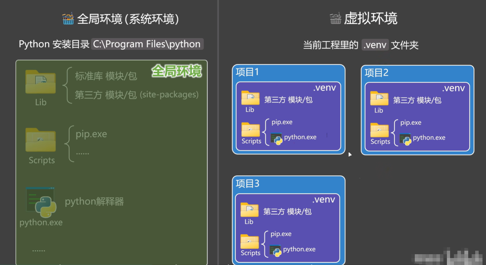

#### 基本使用

为当前 Python 项目创建并激活虚拟环境。

```bash
# 1. 创建虚拟环境
python -m venv <虚拟环境目录名>

# 2. 激活虚拟环境
# Windows:
<虚拟环境目录名>\Scripts\activate
# Linux/Mac:
source <虚拟环境目录名>/bin/activate

# 3. 退出虚拟环境
deactivate

# 4. 删除虚拟环境（直接删除文件夹）
rm -rf myproject_env  # Mac/Linux
rmdir /s myproject_env  # Windows
```

激活后，终端前缀会显示环境名，这时**再用 `pip install` 安装的第三方包都会被隔离在当前项目的 `./<虚拟环境名>/Lib/site-package/`目录下**，互不干扰。

#### 工作原理

为当前 Python 项目创建了虚拟环境后，会**在当前目录**自动生成一个**自定义名称的虚拟环境文件夹**，表示 **`site` 站点级别的作用范围**。

```
全局 Python（系统级）
    ├── 项目A虚拟环境（独立）
    │   ├── Django 2.2
    │   └── requests 2.28
    ├── 项目B虚拟环境（独立）
    │   ├── Django 4.0
    │   └── numpy 1.24
    └── 项目C虚拟环境（独立）
        └── flask 2.3
```

目录结构：

```bash
<自定义虚拟目录>/
├── Include/          # C 语言头文件（Windows 下常见，Unix 系统可能叫 include/）
├── Lib/              # Python 包存放位置
│   └── site-packages/   # 所有通过 pip 安装的第三方库都在这里
├── Scripts/          # Windows：可执行文件（激活脚本、pip、python.exe 等）
│   ├── activate
│   ├── activate.bat
│   ├── Activate.ps1
│   ├── python.exe
│   └── pip.exe
└── pyvenv.cfg        # 配置文件（记录 Python 版本、虚拟环境路径等信息）
# ---------------------- macOS/Linux -------------------------------------
├── bin/              # macOS/Linux：可执行文件（激活脚本、pip、python 等）
│   ├── activate
│   ├── python
│   ├── pip
│   └── ...
└── lib/              # macOS/Linux：Python 包存放位置（具体到 Python 版本，如 lib/python3.10/）
    └── python3.x/
        └── site-packages/
```

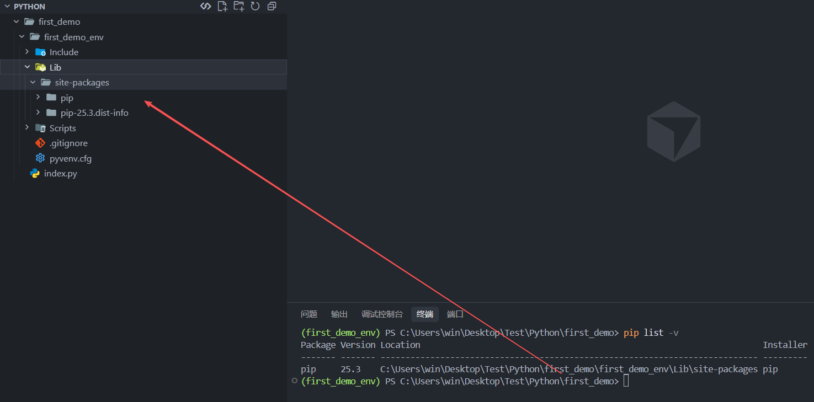

#### 与 pyenv 集成

推荐安装 `pyenv-virtualenv` 插件，将版本管理与依赖隔离结合，实现项目环境的完全独立。

**1. 安装插件**
如果使用 `pyenv-installer` 脚本，该插件已默认安装。若未安装，可手动克隆：

```
git clone https://github.com/pyenv/pyenv-virtualenv.git $(pyenv root)/plugins/pyenv-virtualenv
```

**2. 配置**
将以下内容也添加到你的 shell 配置文件中（`~/.bashrc` 或 `~/.zshrc`）：

```
eval "$(pyenv virtualenv-init -)"
```

**3. 使用示例**

```bash
# 基于 Python 3.11.0 版本创建一个名为 "myproject" 的虚拟环境
pyenv virtualenv 3.11.0 myproject

# 进入项目目录，并设置 local 为该虚拟环境
cd ~/myproject
pyenv local myproject

# 现在，进入此目录会自动激活虚拟环境
# 通过 pip 安装的包会隔离在此环境中
```

## Python 语法规范

Python 的语法规范主要突出简洁、可读性高的特性，所以它与其他语言在语法风格上有很大不同，需重点注意。

### 语法规范

1. Python 字符串**不区分单双引号**

   ```python
   name_str = "Jack"
   name_str2 = 'Jack'
   
   # 两者是一致的
   ```

2. 每行代码**结尾不需要加 `;` 分号**

   ```python
   name = "Jack"
   age = 18
   def my_function(name: str) -> None:
       print("hello world", name)
   ```

3. Python 规定**使用 `Tab | Spaces` 字符缩进**来**表示代码块的作用域**。

   ```python
   # 变量作用域
   global_var = "全局变量"
   
   print(global_var)  # 输出：全局变量
   
   
   def my_function():
       # 按照缩进来判断作用域
       local_var = "局部变量"
   
       print(local_var)  # 输出：全局变量 局部变量
   
   
   my_function()
   
   # 全局作用域访问局部变量 local_var 会报错
   # print(local_var)  # NameError: name 'local_var' is not defined
   ```


### 命名规范

**Python 官方规范**：**PEP 8**（Python Enhancement Proposal 8）

核心命名规范：

| 类型               | 命名规范             | 示例                              | 公开/私有        |
| :----------------- | :------------------- | :-------------------------------- | :--------------- |
| **变量**           | 小写字母 + 下划线    | `user_name`, `total_count`        | 公开             |
| **常量**           | 全大写 + 下划线      | `MAX_SIZE`, `PI`                  | 公开             |
| **函数**           | 小写字母 + 下划线    | `get_user()`, `calculate_sum()`   | 公开             |
| **类**             | 大驼峰（PascalCase） | `UserManager`, `CarModel`         | 公开             |
| **模块**           | 小写字母 + 下划线    | `user_utils.py`, `data_parser.py` | 公开             |
| **包**             | 小写字母（无下划线） | `mypackage`, `utils`              | 公开             |
| **私有属性**       | 单下划线前缀         | `_internal_var`                   | 受保护           |
| **私有属性（强）** | 双下划线前缀         | `__private_var`                   | 私有（名称修饰） |
| **特殊方法**       | 双下划线包裹         | `__init__`, `__str__`             | 魔术方法         |

#### 示例

##### 变量命名

```python
# ✅ 正确：小写 + 下划线
user_name = "Alice"
total_count = 100
is_active = True
user_list = [1, 2, 3]

# ❌ 错误
userName = "Alice"      # 驼峰命名（这是Java风格）
UserName = "Alice"      # 首字母大写（像类名）
u = "Alice"            # 单字母（除了循环变量）
user-name = "Alice"     # 中划线（Python不支持）
```

单字母变量：

```python
# ✅ 允许：短循环变量
for i in range(10):
    print(i)

# ✅ 允许：坐标
x, y = 10, 20

# ✅ 允许：数学公式中的临时变量
for _ in range(5):      # _ 表示不需要的值
    print("Hello")
```

##### 常量命名

```python
# ✅ 正确：全大写 + 下划线
MAX_CONNECTIONS = 100
PI = 3.14159
DATABASE_URL = "postgresql://localhost"

# 模块级别常量
DEFAULT_TIMEOUT = 30

# ❌ 错误
maxConnections = 100   # 小写看起来像变量
MAXConnections = 100   # 大小写混乱
```

##### 函数与方法命名

```python
# ✅ 正确：小写 + 下划线
def calculate_average(scores):
    return sum(scores) / len(scores)

def get_user_by_id(user_id):
    # 查询用户
    pass

def is_valid_email(email):
    return '@' in email

# ❌ 错误
def CalculateAverage(scores):  # 大驼峰（应该用于类）
    pass

def getUserById(user_id):      # 驼峰命名
    pass
```

**特殊函数命名：**

```python
# 谓词函数（返回布尔值）- 通常以 is/has/can 开头
def is_authenticated(user):
    return user.token is not None

def has_permission(user, action):
    return action in user.permissions

def can_edit(user, document):
    return user.id == document.author_id
```

##### 类命名

```python
# ✅ 正确：大驼峰（每个单词首字母大写）
class UserAccount:
    pass

class CarModel:
    pass

class HTTPSConnection:    # 缩略词可以全大写
    pass

# ❌ 错误
class userAccount:        # 小写开头
    pass

class user_account:       # 下划线分隔
    pass
```

##### 模块与包命名

```python
# 模块文件（.py 文件）：
# ✅ 正确
user_utils.py
data_parser.py
db_connection.py

# ❌ 错误
UserUtils.py    # 不要用驼峰
user-utils.py   # 不要用中划线
utils.py        # 太通用，容易冲突

# 包（目录）：
# ✅ 正确
mypackage/
utils/
database/

# ❌ 错误
my-package/     # 不要用中划线
MyPackage/      # 不要用大写
```

##### 私有成员命名

```python
class User:
    def __init__(self, name, password):
        self.name = name           # 公开属性
        self._age = 0              # 受保护属性（单下划线）
        self.__password = password # 私有属性（双下划线）
    
    def get_info(self):
        """公开方法"""
        return self.name
    
    def _internal_method(self):
        """受保护方法（内部使用）"""
        pass
    
    def __encrypt_password(self):
        """私有方法（名称修饰）"""
        pass

# 单下划线：约定"不要直接访问"
user = User("Alice", "123")
print(user._age)      # 可以访问，但不推荐

# 双下划线：名称修饰（name mangling）
print(user._User__password)  # 实际被重命名为 _User__password
```

**名称修饰（Name Mangling）示例：**

```python
class MyClass:
    def __init__(self):
        self.__private = 42

obj = MyClass()
print(dir(obj))  # 可以看到 '_MyClass__private'
# print(obj.__private)  # AttributeError
print(obj._MyClass__private)  # 42（可以访问，但不应该）
```

##### 魔术方法

```python
class MyClass:
    # ✅ 正确：双下划线包裹
    def __init__(self):
        pass
    
    def __str__(self):
        return "MyClass instance"
    
    def __len__(self):
        return 0
    
    def __enter__(self):
        # 上下文管理器
        return self
    
    def __exit__(self, exc_type, exc_val, exc_tb):
        pass

# ❌ 错误：不要自定义这种命名
def __my_custom__(self):  # 只有Python内置的魔术方法才能这样
    pass
```

#### 特殊场景规范

##### 异常类命名

```python
# ✅ 正确：以 Error/Exception 结尾
class ValidationError(Exception):
    pass

class DatabaseConnectionError(Exception):
    pass

class UserNotFoundError(Exception):
    pass

# 使用
raise ValidationError("Invalid email format")
```

##### 全局变量

```python
# 模块级全局变量
_module_counter = 0      # 单下划线：模块私有
PUBLIC_CONFIG = "value"  # 全大写：公开常量

def increment_counter():
    global _module_counter
    _module_counter += 1
```

##### 类型变量（泛型）

```python
from typing import TypeVar, Generic

# ✅ 正确：单个大写字母或加上 _co/_contra
T = TypeVar('T')           # 常用
K = TypeVar('K')           # Key 类型
V = TypeVar('V')           # Value 类型
T_co = TypeVar('T_co', covariant=True)

class Stack(Generic[T]):
    def __init__(self):
        self.items: list[T] = []
    
    def push(self, item: T) -> None:
        self.items.append(item)
```

##### 测试函数命名

```python
# ✅ 测试函数：test_ 前缀 + 描述性名称
def test_user_creation():
    pass

def test_calculate_average_with_empty_list():
    pass

def test_login_with_valid_credentials():
    pass

def test_should_raise_error_when_user_not_found():
    pass
```

#### 错误示例

```python
# ❌ 1. 使用关键字作为变量名
class = "Python"     # SyntaxError
def = 123           # SyntaxError
from = "abc"        # SyntaxError

# ✅ 解决方法：加下划线
class_ = "Python"
def_ = 123
from_ = "abc"

# ❌ 2. 混淆相似的名称
l = 1              # 容易看成数字 1
O = 0              # 容易看成数字 0
I = 1              # 容易看成数字 1

# ✅ 避免使用
length = 1
value = 0
index = 1

# ❌ 3. 使用双下划线开头和结尾（除了魔术方法）
__myvar__ = 42     # 看起来像魔术方法，但实际不是

# ❌ 4. 过于通用的名称
data = "something"
temp = 42
foo = calculate()  # foo/bar/baz 只在极简示例中使用

# ✅ 使用描述性名称
user_input = "something"
retry_count = 42
result = calculate()
```

### 缩进规范

**缩进是 Python 的灵魂** - 与其他语言使用花括号 `{}` 表示代码块不同，Python **强制使用缩进**来表示**代码的层次结构**。

即**缩进 = 代码块作用域**。在编写多层嵌套代码块时，IDE 编辑器也会自动在下一行进行缩进。

注：如果在编写代码过程中，代码前没有缩进，那么则无法识别出它的作用域。

> [!WARNING]
>
> Python **对缩进要求严格**，**混用空格和 Tab** 是**导致缩进错乱**的最常见原因。

```python
# Python：使用缩进表示代码块
if True:
    print("这是缩进")
    print("这也是同一个代码块")
print("这是外层代码")
```

```javascript
// JavaScript：使用花括号
if (true) {
    console.log("这是代码块");
    console.log("这也是同一个代码块");
}
console.log("这是外层代码");
```

```java
// Java：使用花括号表示代码块
if (true) {
    System.out.println("这是代码块");
    System.out.println("这也是同一个代码块");
}
System.out.println("这是外层代码");
```

- 嵌套代码块

```python
# 多层嵌套（最多建议3-4层）
def outer_function():
    x = 10
    
    if x > 0:
        for i in range(3):
            if i % 2 == 0:
                print(f"偶数：{i}")
            else:
                print(f"奇数：{i}")
    
    return x

# 缩进级别计数：
# 0级：函数定义
# 1级：if 语句
# 2级：for 循环
# 3级：if/else 语句
```

#### 基本规则

| 规则          | 说明                       | 示例                 |
| :------------ | :------------------------- | :------------------- |
| **统一数量**  | **同一代码块缩进必须一致** | 都是4空格或都是2空格 |
| **推荐4空格** | PEP 8 官方推荐             | 使用4个空格          |
| **禁止混用**  | **不能混用空格和Tab**      | ❌ 空格+Tab           |
| **冒号触发**  | **`:` 后下一行必须缩进**   | `if x > 0:`          |

#### 规范示例

```python
# 1. if/elif/else 语句
if condition:
    print("缩进")  # 必须缩进
else:
    print("也要缩进")

# 2. for/while 循环
for i in range(3):
    print(i)  # 必须缩进

# 3. 函数定义
def my_function():
    return "缩进"  # 必须缩进

# 4. 类定义
class MyClass:
    def method(self):
        pass  # 必须缩进

# 5. with 语句
with open('file.txt') as f:
    content = f.read()  # 必须缩进

# 6. try/except/finally
try:
    risky_code()  # 必须缩进
except Exception:
    handle_error()  # 必须缩进
```

#### 错误示例

```python
# ❌ 错误1：忘记缩进
if True:
print("没有缩进")  # IndentationError

# ❌ 错误2：缩进不一致
if True:
    print("4个空格")
  print("2个空格")  # IndentationError

# ❌ 错误3：混用空格和Tab
if True:
    print("空格")  # 假设这里是4个空格
	print("Tab")   # 这里是Tab - 错误！

# ❌ 错误4：多余缩进
print("不应该缩进")  # 顶格写
    print("多余缩进")  # IndentationError
```

#### 缩进规则配置

##### .editorconfig 项目统一配置

```bash
# ✅ 整个项目统一使用4空格
# 在项目根目录创建 .editorconfig
root = true

[*]
indent_style = space
indent_size = 4
end_of_line = lf
charset = utf-8
trim_trailing_whitespace = true
insert_final_newline = true

[*.py]
indent_size = 4
```

##### Cursor 修改缩进规则

如果只想为 Python 修改缩进规则：

1. 可以通过 `Ctrl + Shift + P` 打开命令面板，输入`settings.json` 
2. 进入 **`settings.json` 用户配置**模式
3. 添加或修改以下配置，这能确保 Python 文件始终使用 4 个空格：

```json
{
  "[python]": {
    "editor.tabSize": 4, // 缩进字符个数
    "editor.insertSpaces": true // 是否插入 space 空格字符
  }
}
```

##### Cursor 缩进字符可视化

如果觉得使用缩进代替 `{}` 代表代码块会比较容易混淆，可以通过 IDE 编辑器自带的缩进字符可视化功能来优化视觉效果。

可以让编辑器将看不见的缩进符号（空格或制表符）显示出来，这在排查因混用空格和 Tab 导致的错误时非常有用。

- 使用快捷键 `Ctrl + Shift + P`。
- 输入 `Toggle Render Whitespace` 并执行。
- **效果**：开启后，所有空格会显示为淡灰色的点 `·`，制表符会显示为 `→`。

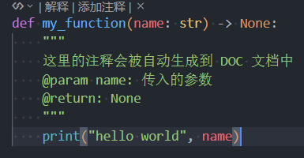

#### 代码自动格式化工具

Cursor 支持通过**`black`** 和 **`autopep8`** 依赖包 和相应的 **IDE 插件**来配置两种方式。

区别在于：

- **依赖包**：需要每次都通过控制台来**手动代码格式化**
- **IDE 插件**：可以通过配置来实现 **`Ctrl + S`** 或 **`Shift + Alt + F`自动代码格式化**

##### black 代码格式化

###### black 依赖包

作用：用于**格式化某个 `.py` 文件或者整个 Python 项目的代码规范**。

- 通过 `pip` 安装：

  ```bash
  # 安装 black（自动格式化）
  >>> pip install black
  ```

- 使用：

  ```bash
  # 格式化单个文件
  >>> black myfile.py
  
  # 格式化整个项目
  >>> black .
  ```

> [!WARNING]
>
> 注：`black` **只能对代码进行格式化**，**无法检查并修复缩进规范**。可以通过 `autopep8` 依赖包来实现。

###### Black Formatter (IDE 插件)

在插件市场中搜索 `Black Formatter` 插件并安装，之后便不再需要手动检查代码规范了。

> 这个插件其实内部使用的就是 `black` 依赖包的规则，相当于格式化方式从控制台变成了快捷键。

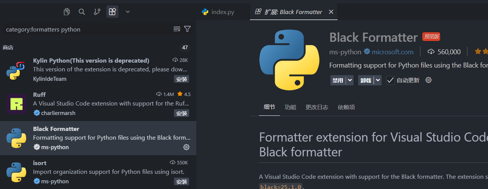

##### autopep8 修复缩进

**Python 官方规范**：**PEP 8**（Python Enhancement Proposal 8）

###### autopep8 依赖包

作用：用于**修复某个 `.py` 文件的缩进错误**。

- 通过 `pip` 安装：

  ```bash
  # 安装 autopep8（修复缩进）
  >>> pip install autopep8
  ```

- 使用：

  ```bash
  # 修复缩进问题
  autopep8 --in-place --aggressive myfile.py
  ```

###### autopep8 (IDE 插件)

在插件市场中搜索 `autopep8` 插件并安装。

> 这个插件其实内部使用的就是 `autopep8` 依赖包的规则，相当于格式化方式从控制台变成了快捷键。

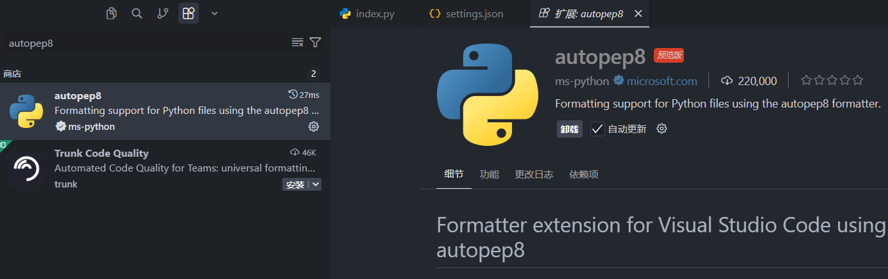

##### Ruff  (IDE 插件)

在插件市场中搜索 `Ruff` 插件并安装，目前 Python 社区更推荐使用 **Ruff** 来取代 `autopep8`。它不仅能做格式化，还集成了代码检查（Linting）功能，速度极快，正逐渐成为主流的 Python 开发工具。

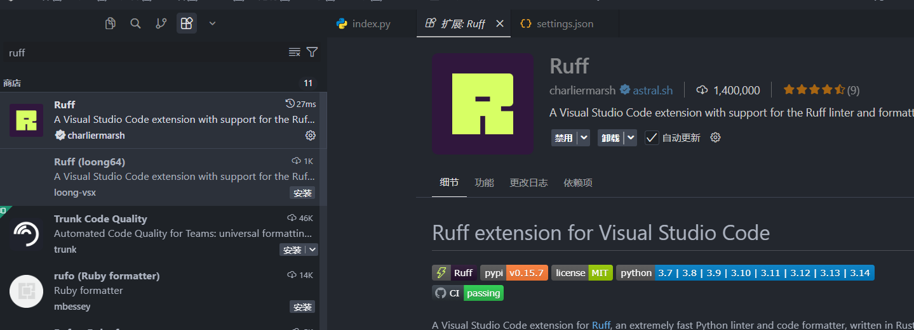

##### 配置插件

安装好插件之后，可通过 `Shift + Alt + F`  手动进行代码格式化，如果没有配置，Cursor 会进行提示：

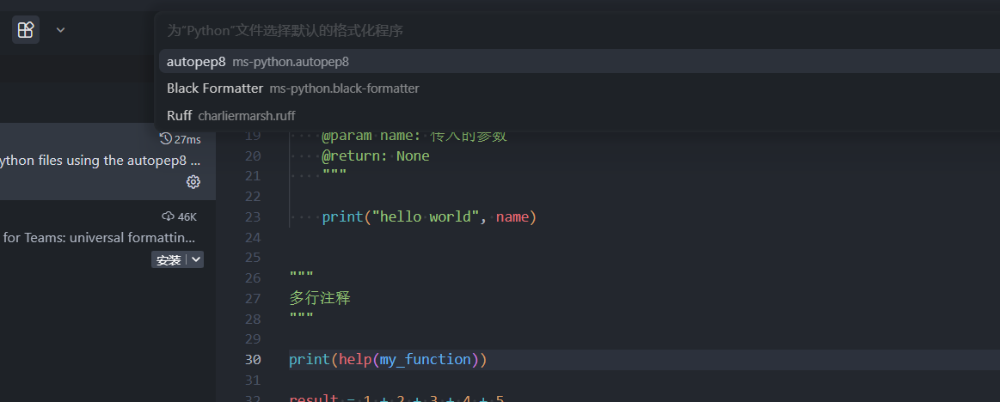

也可以在 **`settings.json` 用户配置**中手动编写配置 `"editor.defaultFormatter"` ：


> 跟 VS Code 使用一致。

##### Cursor 配置保存时自动格式化

如果不想通过 `Shift + Alt + F`  手动进行代码格式化，而是通过 `Ctrl + S` 保存文件时自动对进行代码格式化。

1. 可以通过 `Ctrl + Shift + P` 打开命令面板，输入`settings.json` 
2. 在 **`settings.json` 用户配置**中配置 `"editor.formatOnSave": true`


### # 注释

**注释** 是代码中用于解释说明的文字，**不会被 Python 解释器执行**。

| 作用             | 说明                                 |
| :--------------- | :----------------------------------- |
| **解释代码逻辑** | 让其他人（或未来的自己）理解代码意图 |
| **调试代码**     | 临时禁用某些代码段                   |
| **生成文档**     | 配合工具自动生成 API 文档            |
| **TODO 标记**    | 标记待完成的功能                     |

以下是 Python 常用的注释类型：

#### 普通注释

- **单行注释：**

  ```python
  # 这是单行注释
  print("Hello World")  # 行尾注释
  
  # 可以有多行连续的注释
  # 这是第二行注释
  # 这是第三行注释
  ```

- **行尾注释：**

  ```python
  print("Hello World")  # 行尾注释
  ```

- **多行注释：**

  - **连续 `#` 单行注释（推荐）**：

    ```python
    # 这是推荐的多行注释方式
    # 每行都以 # 开头
    # 清晰明了，符合 PEP 8 规范
    def my_function():
        pass
    ```

  - **三引号字符串（不推荐）：**

    ```python
    """
    这是三引号字符串
    实际上是一个字符串字面量
    不会被赋值给任何变量
    """
    print("Hello")
    
    '''
    也可以使用三个单引号
    同样不会被执行
    '''
    ```

    > 三引号字符串并不是真正的注释，它本质上是一个**字符串字面量**，它会被 Python 解析器解析，只是没有被任何变量引用，不产生实际效果。
    >
    > 因此：
    >
    > - 会占用一定的解析时间
    > - 在字节码中仍然存在
    > - 可能干扰文档字符串（docstring）

- **注释的缩进：**

  ```python
  def my_function():
      # 注释与代码保持相同缩进级别
      if condition:
          # 缩进4个空格
          do_something()
          
          # 空行后的注释也保持相同缩进
          do_another()
  ```

#### 特殊注释

- **TODO：注释**：标记**待完成的任务**

  ```python
  # TODO: 添加错误处理
  # TODO(zhangsan): 优化查询性能
  def get_user_data():
      pass
  ```

- **FIXME：注释**：标记**此处存在问题，需要修复**

  ```python
  # FIXME: 这里存在内存泄漏问题
  def leaky_function():
      large_list = [0] * 10000000
      return large_list  # 返回后未释放
  ```

- **BUG：注释**：标记**此处的函数执行会有某个 BUG**

  ```python
  # BUG: 当输入为负数时会崩溃
  # 原因：sqrt() 函数不支持负数
  # 临时方案：添加输入验证
  def calculate_sqrt(x):
      return x ** 0.5  # 负数会出错
  ```

- **HACK：注释**：标记**此处使用了一个 HACK 写法，需要后续优化**

  ```python
  # HACK: 临时解决方案，等待官方修复
  # 绕过第三方库的 bug
  def workaround():
      pass
  ```

#### 文件编码声明

##### Shebang

**Shebang**（也称为 Hashbang）是一个由 `#!` 开头的特殊注释，用于**指定脚本的解释器路径**。

```python
#!/usr/bin/env python3
# 告诉系统用哪个解释器执行此脚本

print("Hello World")
```

##### 编码声明

声明文件编码（Python 3 默认 utf-8，通常不需要）

```python
# -*- coding: utf-8 -*-
# 或
# coding: utf-8

print("Hello World")
```

#### Docstring 文档字符串（用户手册）

Docstring 文档是**紧贴在模块、类、函数或方法定义后的第一行说明的字符串字面量，且没有被变量引用**，这种 docstring 会作为**当前类、函数对象的`__doc__`属性**，用于生成 API Doc 官方文档作为用户手册。

```python
def my_function(name: str) -> None:
  """
  这里的注释会被自动生成到 DOC 文档中
  :param name: 传入的参数
  :return -> None
  """
  print('hello world', name)
```

IDE 会自动根据Docstring 生成内容，当用鼠标悬停在类名、函数名时可以看到：


##### 编写规范

- **Sphinx/reStructuredText (标准库风格)**：Python 官方文档以及众多大型开源项目（如 Django、Requests）的首选

  使用 **`:param`** 和 **`:return`** 等标记，虽然机器解析友好，但纯文本阅读体验稍逊。

  | **标记**             | **用途**             | **示例**                             |
  | -------------------- | -------------------- | ------------------------------------ |
  | **`:param <name>:`** | 定义参数描述         | `:param path: 文件的绝对路径`        |
  | **`:type <name>:`**  | 指定参数的类型       | `:type path: str`                    |
  | **`:returns:`**      | 描述返回值           | `:returns: 处理后的字符串列表`       |
  | **`:rtype:`**        | 指定返回值的类型     | `:rtype: list`                       |
  | **`:raises <Err>:`** | 声明可能抛出的异常   | `:raises ValueError: 当路径不存在时` |
  | **`:var <name>:`**   | 描述类变量或成员变量 | `:var status: 当前连接状态`          |

  ```python
  def fetch_user_data(user_id, timeout=10):
      """
      通过 API 获取用户信息。
  
      :param user_id: 用户的唯一识别 ID。
      :type user_id: int
      :param timeout: 请求超时时间（秒），默认为 10。
      :type timeout: int
  
      :returns: 包含用户数据的字典。
      :rtype: dict
  
      :raises ConnectionError: 当 API 无法访问时抛出。
      :raises ValueError: 当 user_id 格式错误时抛出。
  
      .. note::
         此函数需要有效的网络连接和 API Key。
  
      .. versionadded:: 2.0
      """
      pass
  ```

###### autoDocstring 插件

这是目前最主流的解决方案。VS Code (Cursor) 自带的 Python 插件虽然支持基础功能，但这个专用扩展能提供更精细的风格控制。

1. 在 Cursor 的插件市场搜索并安装 **"Python Docstring Generator"** (作者是 Nils Werner)。
2. 进入插件设置（`Ctrl+,` 然后搜索 `autoDocstring.docstringFormat`）。
3. 将选项从 `google` 修改为 **`sphinx`**。

> **输入触发**：在函数定义的下一行输入三个引号 `"""` 然后按下 `Enter`，可以**根据当前函数自动生成 Docstring**

##### 输出 API Doc

- 通过**`print(my_function.__doc__)`** 输出函数的 API Doc

```python
print(my_function.__doc__)
# 输出：
# 这里的注释会被自动生成到 DOC 文档中
# :param name: 传入的参数
# :return -> None
```

- 通过 **`help(my_function)`** 输出函数的 API Doc

```python
help(my_function)
# Help on function my_function in module __main__:
#
# my_function(name: str) -> None
#   :param name: 传入的参数
#   :return -> None
#
# None
```

### 代码检查工具

#### pylint 检查风格

作用：可以对指定 `.py` 文件的**代码规范进行检查**，并给出评分。

```bash
# 安装、下载
pip install pylint

# pylint 检查缩进
pylint myfile.py
```

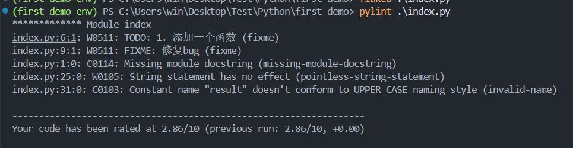

##### .pylintrc 自定义统一规则

```bash
# .pylintrc
[BASIC]
# 变量名最小长度
variable-rgx=[a-z_][a-z0-9_]{1,30}$
# 常量名格式
const-rgx=(([A-Z_][A-Z0-9_]*)|(__.*__))$
# 函数名格式
function-rgx=[a-z_][a-z0-9_]{2,30}$
# 类名格式
class-rgx=[A-Z_][a-zA-Z0-9]+$
```

#### flake8 代码规范检查

作用：可以对指定 `.py` 文件的**代码规范进行检查**，并给出相应错误提示。

- 通过 `pip` 安装到本地项目

```bash
# 安装、下载
pip install flake8

# 使用
flake8 myfile.py
```

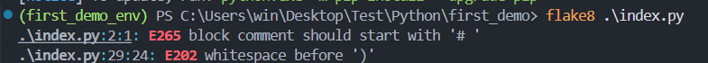

#### IDE settings.json 配置

`settings.json` 用户配置：

```json
{
    "python.linting.enabled": true,
    "python.linting.pylintEnabled": true,
    "python.linting.flake8Enabled": true,
    "editor.rulers": [79],  // PEP 8 建议每行79字符
    "python.formatting.provider": "black"
}
```

## IO 操作

**IO（Input/Output）** 指程序与外部设备（文件、网络、控制台等）之间的数据交互。

IO 操作分类：

| 类型          | 说明         | 示例                          |
| :------------ | :----------- | :---------------------------- |
| **控制台 IO** | 与用户交互   | `print()`, `input()`          |
| **文件 IO**   | 读写磁盘文件 | `open()`, `read()`, `write()` |
| **内存 IO**   | 在内存中读写 | `StringIO`, `BytesIO`         |
| **网络 IO**   | 网络数据传输 | `socket`, `requests`          |

### 控制台 IO

#### print() 输出

Python 提供了 **`print()`** 函数用于**将值输出到控制台。**

##### 基本用法

- 单个输出：

  ```python
  print("hello world")  # 输出字符串
  print(123)  # 输出整数
  print(1.23)  # 输出浮点数
  print(True)  # 输出布尔值
  print(False)  # 输出布尔值
  print(None)  # 输出None
  
  hello_str = 'hello world'
  print(hello_str)  # 输出变量值
  ```

  > 注意点：`print()` 函数在打印数字时，Python 解释器内部**会将数字转换为字符串类型再打印**，且默认上限是 **`4300` 位**。

- 多个输出：会以空格字符进行分割

  ```python
  # 多个输出
  print("hello", "world") # hello world
  ```

##### 带参数的用法

`print()` 本质是一个**函数**，可以**接收相关参数**设置输出规则。

###### end 参数 

描述：`print()` 函数默认**以 \n 换行符结尾**，所以**多个 print() 输出会换行**，如果**不想换行**，可以将 **end 参数设置为其他字符串并一起输出**。

```python
# 无 end 参数
print("Hello")
print("World")
# Hello
# World

# 有 end 参数
print("Hello", end=",")
print("World")  
# Hello,World
```

###### sep 参数 

作用：默认情况下，**`print('','')` 多个输出**会使用**空白字符进行分割**，可**使用 `setp` 参数替换为其他字符**。

```python
print("hello", "world", sep=",")  # 等价于 print('hello,world')
print("hello", "world", sep="")  # 等价于 print('hellowrold')
```

###### flush 参数

> Python 内部有个机制，它会先将程序中一连串的 `print()` 语句收集起来存入缓存中，直到没遇到 `print()` 语句才会一次性将所有 `print()` 执行并输出。这会导致如果中间遇到了 `time.sleep()` 程序休眠代码，就会造成无法及时输出。
>
> 而 `flush` 参数就是让 Python 刷新缓存区，不等待它收集完成，而是直接立即输出。

作用：刷新缓冲区，默认为 False，表示不立即输出，而是等待缓冲区满时才输出，如果设置为 True，则**每次 print() 都会立即输出**。

```python
# 终端进度条
print('加载中', end='')
for index in range(1, 10):
    print('.', end='', flush=True)
    time.sleep(0.1)
print('\n加载完成')

# 效果：
# 加载中.....
# 加载完成
```

###### file 参数

作用：将 `print()` 函数打印的字符串**写入到指定文件中**。

- `file` 参数接收一个**文件二进制流对象**

```python
f = open('log.txt', 'w', encoding='utf-8')

print('Hello World', sep='-', file=f)
```

#### input() 输入

Python 提供了 **`input()`** 内置函数用于**接收并返回从控制台输入的值，需要一个变量接收，或者直接通过 `print()` 输出到控制台。**

##### 基本用法

```python
input('请输入姓名：')
```

作用：`input()` 会调取控制台的 IO 输入，**先将传入的字符串输出到控制台**，并要求用户**输入一个值**，最后**返回用户在控制台输入的值**。

 输入展示.png)

### 文件操作 IO

在 Python 中，针对磁盘文件的操作处理提供了一系列的内置函数：`open()`、`read()`、`write()`、`close()`...

#### 基本步骤

Python 的文件操作主要分为以下 3 个步骤：

1. **打开文件，创建一个文件对象：`open()`**
2. **读取/写入文件内容：`read()`、`write()`**
3. **释放文件系统资源：`close()`**

#### open() 打开文件

核心定义：**`open()` 函数会根据传入的路径打开一个文件，并创建一个文件对象返回**。

##### 基本语法

```python
file = open(file, mode='r', buffering=-1, encoding=None, errors=None, newline=None, closefd=True, opener=None)

# file: 文件路径
# mode: 打开文件的模式，默认是只读模式
# buffering: 缓冲区大小，-1表示使用系统默认缓冲区大小
# encoding: 文件编码，默认是系统默认编码
# errors: 错误处理方式，默认是忽略错误
# newline: 换行符处理方式，默认是系统默认换行符
# closefd: 是否关闭文件描述符，默认是True
# opener: 自定义打开文件的方式
```

作用：**传入指定的 `<file>` 文件本地路径，指定 `mode`打开文件的模式**，最终**返回一个文件对象（存储的是打开的文件内容）**。

##### 常用参数

###### file 文件路径（必选）

支持以下 2 种格式：

- **相对路径：`./xxx/xx.yy`**
- **绝对路径：`D:/A/B/C/xx.yy`**

```python
f = open(file='./test.txt')

f = open('./test.txt) # 由于 file 是第一个位置参数，所以可以不写关键字参数 file
```
作用：**打开 `file` 指定路径下的文件**。

###### mode 打开模式（可选）

描述：`open()` 函数提供的 `mode` 参数**决定了后续如何操作该文件的权限**。

```python
f = open(file='./test.txt', mode='rt')
# 基本语法
f = open('file.txt', 'r')  # 只读模式
f = open('file.txt', 'w')  # 只写模式（覆盖）
f = open('file.txt', 'a')  # 追加模式
f = open('file.txt', 'x')  # 独占创建模式

# 二进制模式
f = open('file.jpg', 'rb')   # 二进制读取
f = open('file.jpg', 'wb')   # 二进制写入
```

作用：打开一个文件，**`rt` 是文件的默认打开模式**，表示要**读取一个文本文件（`r` 读取文件，`t` 声明是一个文本文件）。**

- 主模式如下：

| 主模式             | 描述               | 作用                                                         |
| ------------------ | ------------------ | ------------------------------------------------------------ |
| **`'r'`（read）**  | **只读（默认）**   | **若文件不存在，则抛出 `FileNotFoundError` 错误**            |
| **`'w'`（write）** | **只写**           | **会覆盖**原文件内容；若**文件不存在则创建**                 |
| **`a`（append）**  | **追加**           | **在文件末尾追加内容，不覆盖**原内容；若文件不存在，则**创建并填充内容** |
| **`x`（create）**  | **排他性创建文件** | 如果**文件已存在，则创建失败（报错）**                       |

- 模式修饰符如下：

| 模式修饰符              | 描述                 | 作用                                                         |
| ----------------------- | -------------------- | ------------------------------------------------------------ |
| **`b`（bytes）**        | **二进制模式**       | 以**二进制形式打开文件**，用于处理图片、视频等非文本文件 (如 `'rb'`, `'wb'`) |
| **`t`（text）**         | **文本模式（默认）** | 以**文本形式打开文件**                                       |
| **`+`（read + write）** | **读写模式**         | **使文件同时具备“读取”和“写入”的能力 (如 `'r+'`)**           |

主模式可以与模式修饰符都**组合**（**模式修饰符 `b`、`t`、`+` 不可单独使用**，**主模式之间不可组合**），表示**对不同类型文件实现不同的权限操作**：

- **`r` 读取主模式**相关：

  | 组合模式         | 作用描述                           |
  | ---------------- | ---------------------------------- |
  | **`rt`、`r`（默认）** | 以**只读形式打开一个文本**文件     |
  | **`rb`**         | 以**只读形式打开一个二进制**文件   |
  | **`r+`、`+r`**    | 在**可读的基础上，增加写入能力（默认文本形式）**（只读 + 只写） |
  | **`rt+`、`r+t`、`+rt`** | 强制**要求以文本形式读取、写入**文件内容 |
  | **`rb+`、`r+b`、`+rb`** | 强制**要求以二进制形式读取、写入**文件内容 |

- **`w` 写入主模式**相关：

  | 组合模式         | 作用描述                           |
  | ---------------- | ---------------------------------- |
  | **`wt`、`w`**（默认）         | 以**只写形式打开一个文本**文件 |
  | **`wb`**         | 以**只写形式打开一个二进制**文件   |
  | **`w+`、`+w`**         | 在**可写的基础上，增加读取能力（默认文本形式）**（只写 + 只读） |
  | **`wt+`、`w+t`、`+wt`** | 强制**要求以文本形式读取、写入**文件内容 |
  | **`wb+`、`w+b`、`+wb`** | 强制**要求以二进制形式读取、写入**文件内容 |

- **`a` 追加写入主模式**相关：

  | 组合模式         | 作用描述                           |
  | ---------------- | ---------------------------------- |
  | **`at`、`a`** （默认）        | 以**文本形式追加**文件内容         |
  | **`ab`**         | 以**二进制形式追加**文件内容       |
  | **`a+`、`+a`**         | 在**可写的基础上，增加读取能力（默认文本形式）**（只写 + 只读） |
    | **`at+`、`a+t`、`+at`** | 强制**要求以文本形式读取、写入追加**文件内容 |
  | **`ab+`、`a+b`、`+ab`** | 强制**要求以二进制形式读取、写入追加**文件内容 |

- **`x`：排他性创建文件主模式**相关：

  | 组合模式         | 作用描述                           |
  | ---------------- | ---------------------------------- |
  | **`xt`、`x`**（默认） | 排他性**创建并写入一个文本文件**   |
  | **`xb`**         | 排他性**创建并写入一个二进制文件** |
  | **`x+`、`+x`**       | 在**可写的基础上，增加读取能力（默认文本形式）**（只写 + 只读） |
  | **`xt+`、`x+t`、`+xt`** | 强制**要求以文本形式读取、写入追加**文件内容 |
  | **`xb+`、`x+b`、`+xb`** | 强制**要求以二进制形式读取、写入追加**文件内容 |

> [!NOTE]
>
> 以上 `+` 读写模式有很多重复性的功能，真实的**底层区别在于文件指针的位置**：
>
> - **`r+`**... 相关：以**读取为主模式**，文件指针**在文件开头位置**
> - **`w+`**... 相关：以**写入为主模式**，文件指针**在文件开头位置**
> - **`a+`**... 相关：以**写入追加为主模式**，文件指针**在文件末尾位置**
> - **`x+`**... 相关：以**创建写入为主模式**，文件指针**在文件开头位置**
>
> 以上模式，可以**通过 `f.seek()` 方法来动态调整文件指针的位置**。

###### encoding 字符编码（可选）

作用：仅用于 `t`文本模式打开的文本文件，表示**以 `encoding` 字符编码集解析并打开一个文本文件**。

```python
f = open('./test.txt', 'r', encoding='utf-8')
```

注意：由于 `encoding` 是第 4 个位置参数，所以需要**使用关键字参数来传入**。

##### 模式权限检测方法

Python 为 `open()` 函数打开的文件对象提供了 `readable()` 和 `writable()` 方法用于检测文件对象具备的权限是可读、还是可写。

###### f.readble() 是否可读

作用：用于**检测当前打开的文件流是否是可读模式**。**仅限于 `r` 、`+` 模式有效**

返回值：

- **`True`：可读的**
- **`False`：不可读的**

```python
# 单向数据流- r 只读模式
f = open('./《登黄鹤楼》.txt', 'r', encoding='utf-8')

print(f.read())

print(f.readable())  # True 可读

f.close()

# w 只写模式是无效的
f = open('./《登黄鹤楼》.txt', 'w', encoding='utf-8')

print(f.read())

print(f.readable())  # False 不可读

f.close()
```

###### f.writable() 是否可写

作用：用于**检测当前打开的文件流是否是可读模式**。**仅限于 `w` 、`+` 模式有效**

返回值：

- **`True`：可写的**
- **`False`：不可写的**

```python
# 单向数据流- w 只写模式
f = open('./《登黄鹤楼》.txt', 'w', encoding='utf-8')

print(f.read())

print(f.writable())  # True 可写

f.close()

# r 只读模式是无效的
f = open('./《登黄鹤楼》.txt', 'r', encoding='utf-8')

print(f.read())

print(f.readable())  # False 不可写

f.close()
```

#### 文件流管道机制

描述：当 `open()`打开一个文件后，会开启一个**文件流管道**，在该文件流中通过 `open()` 函数**返回的文件对象对文件流进行读写操作**。

##### 底层机制（文件指针）

当使用 `open()` 打开文件时，系统会为该文件句柄维护一个**内部计数器（即文件指针【鼠标光标】）**。

- **初始状态**：在 `'r'` 或 `'w'` 模式下，**指针默认指向文件的起始位置（偏移量为 0）**

- **读取过程**：当**调用 `read(size)` 进行流操作**时，**指针会从当前位置向后移动 `size` 个单位**

- **记录位置**：**文件指针移动停止的地方就是下一次 `read(size)` 读取的起点**


可以通过 `f.tell()` 方法**查看当前文件流中文件指针的位置**。

##### **f.tell() **查看当前文件指针

描述：返回一个**整数**，表示**从文件开头算起的字符、字节偏移量**。

作用：用于**查看当前文件流中文件指针的位置**

```python
f = open('./《登黄鹤楼》.txt', 'r', encoding='utf-8')

# 文件指针，文件读取的位置
print(f.tell())  # 0

r1 = f.read(5)  # 读取文件的前5个字符
print(r1)
'''
白日依山尽
'''

print(f.tell())  # 5


r2 = f.read(3)  # 读取文件的第 5-8 位字符
print(r2)
'''
， 【这里有个隐式的字符 \n 换行符，也算一个字符】
黄
'''
print(f.tell())  # 8


r3 = f.read()  # 读取文件的第 8 位字符到最后剩余的所有字符内容
print(r3)
'''
河入海流，
欲穷千里目，
更上一层楼。
'''

print(f.tell())  # 23


f.close()
```

这种**“中断并记录”的流式操作（Streaming）**的设计初衷是为了**节省内存**：

1. **处理超大文件**：如果有一个 10GB 的日志文件，内存只有 8GB，无法一次性 `read()` 全部内容。通过分段续读，你可以每次只加载 1MB 进内存，处理完后再读下一段。
2. **低延迟响应**：在网络传输或实时数据处理中，数据是流式到达的。程序可以边读边处理，而不需要等待整个管道传输完毕。

##### f.seek(offset,whence) 操作文件指针

描述：在 Python 操作的文件流中，**一切 `read()` 、`write()` 方法都以文件指针（鼠标光标）位置为准进行读写操作**。

> 文件指针默认的初始位置根据 `open()` 函数提供的 `mode` 模式参数决定：
>
> - **`r`、`r+`**... 相关：以**读取为主模式**，文件指针**在文件开头位置**
> - **`w`、`w+`**... 相关：以**写入为主模式**，文件指针**在文件开头位置**
> - **`a`、`a+`**... 相关：以**写入追加为主模式**，文件指针**在文件末尾位置**
> - **`x`、`x+`**... 相关：以**创建写入为主模式**，文件指针**在文件开头位置**
>
> 以上模式，都可以**通过 `f.seek()` 方法来动态调整文件指针的位置**。

###### 基本语法

```python
f = open(<file>, <mode>,...)

# 文件操作

f.seek(offset,whence) # 操作文件指针（鼠标光标），后续的 read() \ write() 都会受影响

f.close()
```

核心作用：**改变当前文件流中文件指针（鼠标光标）的位置，可灵活性的控制读取、写入文件内容位置**。

参数：

- **`offset`：偏移量；文件指针（鼠标光标）要移动的距离（以字节为单位，一个字符 = 3 个字节、1 个字母\特殊符号 = 1 个字节）**

   注意：在操作字符文件时，必须牢记（一个字符 = 3 个字节、1 个字母\特殊符号 = 1 个字节），否则容易读取/写入一个乱码

- **`whence`：偏移起始点；文件指针（鼠标光标）从哪个位置开始偏移**

  - **`0` 绝对位置：从文件开头位置开始【默认值】（`r`、`w`、`x` 模式默认的起始位置）**
  - **`1` 相对位置：从当前位置开始（会随着 `read()`、`write()` 读写操作动态改变）**
  - **`2` 末尾位置：从文件末尾位置开始（`a` 模式默认的起始位置）**

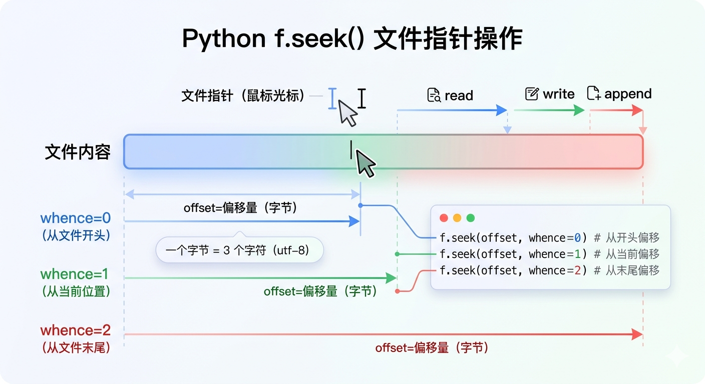

> [!NOTE]
>
> 注意点：在 Python 的文件操作中，`f.seek(offset, whence)` 的行为高度依赖于**打开文件的方式**。
>
> - **文本模式（'t'）的限制**：
>   - 当使用 `open(filename, 'w', encoding='utf-8')` 或默认的 `'r'` 模式打开文件时，这是**文本模式**。
>     - **限制**：在文本模式下，Python 对 `seek()` 的操作有严格规定。除了偏移到开头（`0, 0`）或末尾（`0, 2`），其他的偏移量必须是 `f.tell()` 返回的值。
>     - **现象**：如果在文本模式下尝试 `f.seek(12, 2)`（在末尾往后再偏 12 字节），Python 的处理机制可能不会报错，但它**无法准确计算**字符边界（因为 UTF-8 字符长度不一），导致指针并没有如预期般移动。
> - **二进制模式（'b'）才是真正的“字节偏移”**

###### 示例

- 普通的 `r`、`w`、`x`、`a` 模式操作：

  - **`r`：读取操作（默认从文件开头位置【文件指针为 0】 开始读取）**

    ```python
    # r 读取操作（默认从文件开头位置【文件指针为 0】 开始读取）
    with open('./《登黄鹤楼》.txt', 'r', encoding='utf-8') as f:
        print(f.tell())   # 0
        print(f.read(3))  # 白日依 （从 0 位置开始读取 3 个字符）
        print(f.tell())   # 9 (3 个字符 = 9 个字节)
    
        f.seek(0, 0)  # 将文件指针（鼠标光标）调整回到文件开头位置重新读取
    
        print(f.read(3))  # 白日依
        print(f.tell())  # 9
    
        # 注意：在读取时，由于鼠标光标是流向读取的，所以当前位置与末尾位置是无法直接设置读取的（因为文件指针本来就是在末尾位置）
        # f.seek(3, 2)  # 从当前位置偏移 3 个字节
    
        print(f.read(3))  # 继续往后读取：山尽，
        print(f.tell())  # 18 （【白日依山尽，\n】 6 个字符 + 1 个换行符 = 【(6 * 5) + 1 = 18 个字节】）
    ```

    

  - **`w`：写入操作（默认从文件开头位置【文件指针为 0】 开始写入覆盖）**

    ```python
    # w 写入操作：（默认从文件开头位置【文件指针为 0】 开始写入覆盖）
    def write_file():
        with open('./《登黄鹤楼》1.txt', 'w', encoding='utf-8') as f:
            print(f.tell())   # 0
    
            f.write('白')
            print(f.tell())  # 3 【白】
    
            f.seek(0, 0)  # 将文件指针（鼠标光标）调整回到文件开头位置重新写入覆盖（把 “白” 覆盖了）
            print(f.tell())  # 0
    
            f.write('日')
            print(f.tell())  # 3 【日】
    
            f.write('依')
            print(f.tell())  # 6 【日依】
    
            f.write('山')
            print(f.tell())  # 9 【日依山】
    
            f.seek(6, 0)
            print(f.tell())  # 6 把【日依山】中的光标移动到 “依” 的位置（日 = 123，依 = 456）【6 个字节】
    
            f.write('尽')
    
            # 最终写入：日依尽
    ```

    

  - **`a`：写入操作（默认从文件末尾位置【文件指针为 n】 开始写入追加）**

    ```python
    # a 写入追加操作：（默认从文件末尾位置【文件指针为 n】 开始写入追加）
    def append_file():
        with open('./《登黄鹤楼》1.txt', 'a', encoding='utf-8') as f:
            # 已有内容：日依尽
            print(f.tell())   # 9
    
            f.write('，')
            print(f.tell())  # 12 【日依尽，】
    
            f.seek(6, 0)  # 将文件指针（鼠标光标）调整回到文件最初末尾的位置重新写入追加
    
            f.write('黄河')
            print(f.tell())  # 18 【日依尽，黄河】
    ```

- 可读写模式操作：

```python
# r+ 等价于 rt+ ：以文本模式打开文件读取，以文本形式写入文件内容，文件指针在文件开头位置
def read_and_write_of_text():
    with open('read_and_write_text.txt', 'r+', encoding='utf-8') as f:
        f.write('hello')
        print(f.tell())  # 5
        print(f.read())  # 空字符串，因为光标在文件末尾

        f.seek(0, 0)  # 将光标移动到文件开头位置，从头开始读取

        print(f.read())  # hello

        f.write(' world')
        print(f.tell())  # 11
        print(f.read())  # 空字符串，因为光标在文件末尾

        f.seek(5, 0)  # 将光标移动到 hello 第5个字节处开始读取
        print(f.tell())  # 5
        print(f.read())  # world

        f.write(',python')
        print(f.tell())  # 18

        f.seek(0, 0)
        print(f.read())  # hello world,python
```


##### 按需授权机制

描述：**调用一次 `open()` 只会开启一个文件流管道**，要么**只读`r`、要么只写`w、a`，要么可读写`+`**。

> 这种“一次 open 一个管道”的设计，确保了数据传输的**有序性**。就像单行道，虽然窄，但不会撞车。

> [!NOTE]
>
> 虽然 `open()` 函数支持 `+` 可读写模式，但还是要明确区分出 只读`r` 和  只写`w、a` 两个模式。
>
> 这涉及软件设计的两个重要原则：
>
> 1. **安全性（Security）**：**防止误操作**。如果程序只想读取配置，却用了读写模式，万一程序逻辑写错（比如写了个 `f.write("")`），原本的数据可能就丢了。
> 2. **性能（Performance）**：**只读模式下，操作系统可以进行更激进的缓存优化（Caching）**，因为它知道文件内容不会被程序改变，读取速度会更快。

###### **单向数据流**管道

- **`r`：只读模式**

  只能调用 `read()`、`readline()`、`readlines()` 读取方法，**不可调用 `write()` 相关的写入方法**

  ```python
  # 单向数据流- r 只读模式
  f = open('./《登黄鹤楼》.txt', 'r', encoding='utf-8')
  
  print(f.read())
  
  # f.write('Hello World!')  # 报错：io.UnsupportedOperation: not writable
  print(f.readable())  # True 是否可读
  print(f.writable())  # False 是否可写
  
  f.close()
  ```

- **`w` 只写模式、`a` 追加模式：**

  只能调用 `write()` 相关的写入方法，**不可调用 `read()` 相关的读取方法**

  ```python
  # 单向数据流 - w 只写模式
  f = open('./《登黄鹤楼》.txt', 'w', encoding='utf-8')
  
  f.write('Hello World!')
  
  # print(f.readline())  # 报错：io.UnsupportedOperation: not readable 不可读
  print(f.readable())  # False 是否可读
  print(f.writable())  # True 是否可写
  
  f.close()
  
  # 单向数据流 - a 追加模式
  f = open('./《登黄鹤楼》.txt', 'a', encoding='utf-8')
  
  f.write('Hello World!')
  # print(f.read())  # io.UnsupportedOperation: not readable
  
  print(f.readable())  # False 是否可读
  print(f.writable())  # True 是否可写
  
  f.close()
  ```

###### **双向数据流**管道

- **`+`：可读写模式**

  可**同时调用 `read()` 读取 和 `write()` 写入的方法**

  ```python
  # 双向数据流 - + 可读写模式
  f = open('./《登黄鹤楼》.txt', 'rt+', encoding='utf-8')
  
  f.write('Hello World!')
  print(f.read())
  
  
  print(f.readable())  # True 是否可读
  print(f.writable())  # True 是否可写
  
  f.close()
  ```

> [!NOTE]
>
> 注意：在真实编码中，输入 `mode` 模式参数时，可能会出现 **`r+`、`+r`、`rt+`、`r+t`、`+rt` 之类的字符参数**，但是**其实这几个都是同一个作用**，只是面对大众的书法习惯不同而已。
>
> 只需要关注`r`、`t`、`+`  这 3 个核心字符即可，无需关心它们之间的排列顺序。
>
> - **`r` (read):** 读取模式（文件必须存在）
> - **`+` (plus):** 更新模式（让原本只能读的变成“可读可写”，原本只能写的变成“可写可读”）
> - **`t` (text):** 文本模式（默认模式，会自动处理换行符 `\n`）
>
> 综合组成：**以文本形式打开并读取**一个文件，对该文件进行**可读写操作**，且必须是**写入文本形式的内容**。

###### 底层原理

之所以**每次调用 `open()` 函数打开文件时只能选择一种权限模式（只读、只写、可读写）**是因为**系统为了保证数据安全性**而提出的**“文件访问权限（Access Permissions）”** 与 **“操作系统句柄（OS File Handle）”** 的约束机制。

这不仅仅是 Python 的规定，而是 **Python 向操作系统（Windows, Linux, macOS）申请的一张“通行证”**。

- **权限分配机制：通行证原理**：

  当**调用 `open(file, mode)` **时，Python 实际上是在**向操作系统发起一个系统调用**（System Call）。

  操作系统会检查：

  1. **程序身份**：是否有权限打开这个文件？
  2. **程序目的**：申请的是什么权限？

  - **只读 (`r`)**：操作系统给 Python 程序发一张“准读证”。

    ​    如果尝试调用 `write()`，Python 解释器在底层还没发请求给硬盘，就会直接拦截并抛出 `UnsupportedOperation` 报错。

  - **只写 (`w`/`a`)**：发一张“准写证”。尝试 `read()` 也会被拦截。

  - **读写 (`r+`/`w+`)**：发一张“全能证”。此时操作系统**允许程序对该文件流的缓冲区进行双向操作**。

- **文件指针共享机制**

  在可读写模式（如 `r+`）下：**读和写共用同一个“文件指针（File Pointer）”**。

  这就像磁带播放机，只有一个磁头：

  - 当程序 **读取** 了 10 个字节，磁头向右移动 10 格
  - 此时程序立刻调用 **写入** 动作，磁头会从当前第 11 格的位置开始覆盖写入

  这种共享机制意味着程序不能“随心所欲”地同时读写，必须**通过 `f.seek()` 手动拨动磁头位置**，否则**读写位置会互相干扰**。

- **互斥锁与保护机制（File Locking）**

  虽然 `open('xxx','r+')` 开启了一个可读写的流，但操作系统为了保护数据安全，还有一套 **锁定机制**：

  - **独占性**：当 `open()`函数以 `w`（只写）模式打开一个文件时，操作系统通常会给文件加一个“排他锁”（取决于系统实现），防止其他程序同时修改它，导致数据损坏
  - **并发控制**：多个程序可以同时以 `r`（只读）模式打开同一个文件，因为“读”不会改变内容；但通常只允许一个流以可写模式存在

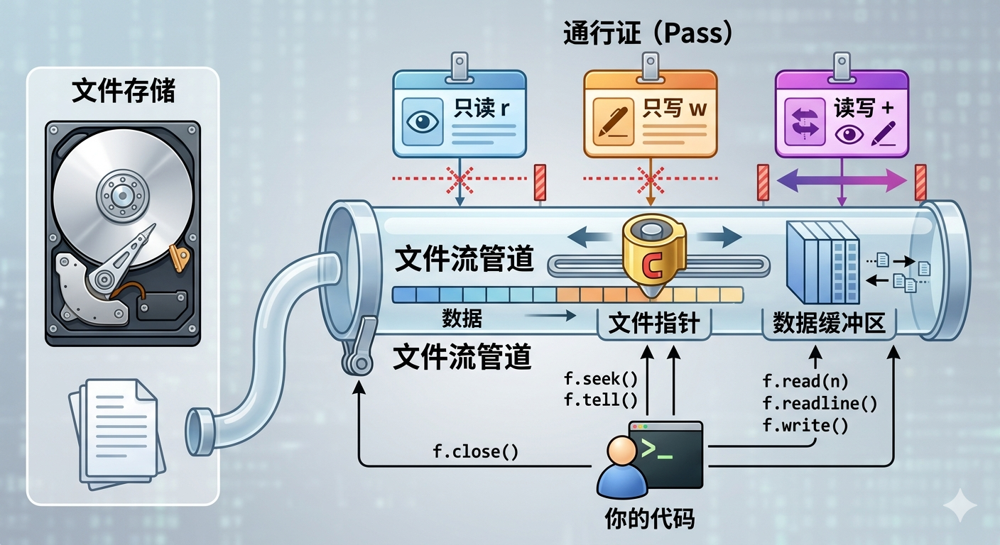

#### read(size) 读取文件

##### r 只读模式

描述：**读取 `open()` 打开的文件对象内容**。若文件不存在则报错。

```python
f = open('./test.txt', 'r', encoding='utf-8')

f.read() # 读取文件的所有内容

f.close()
```

###### 模式权限

`read()` 方法读取的文件内容输出形式，取决于 `open()` 函数的 `mode` 模式参数：

- **`r`、`rt`**：将文件内容**以文本形式读取**（`r` =  `rt`）
- **`rb`**：将文件内容**以二进制形式读取**
- **`r+`、`+r`** **可读写模式**：**在可读的能力上，增加可写的能力**（文件指针在文件开头位置）
  - **`+rt`、`rt+`、`r+t`、`t+r`**：**以文本形式读取，以文本形式写入**文件内容
  - **`+rb`、`rb+`、`r+b`、`b+t`**：**以二进制形式读取，以二进制形式写入**文件内容


```python
# r 只读模式，等价于 rt 模式，将文件内容以文本形式读取
def read_file():
    f = open('./desc.txt', 'r')
    print(f.read())  # Hello World!


# rt 只读模式，将文件内容以文本形式读取
def read_file2():
    f = open('./desc.txt', 'rt')
    print(f.read())  # Hello World!


# rb 只读模式，将文件内容以二进制形式读取
def read_file3():
    f = open('./desc.txt', 'rb')
    print(f.read())  # b'Hello World!'

    
# r+ 等价于 rt+ ：以文本模式打开文件读取，以文本形式写入文件内容，文件指针在文件开头位置
def read_and_write_of_text():
    with open('read_and_write_text.txt', 'r+', encoding='utf-8') as f:
        f.write('hello')
        print(f.tell())  # 5
        print(f.read())  # 空字符串，因为光标在文件末尾

        f.seek(0, 0)  # 将光标移动到文件开头位置，从头开始读取

        print(f.read())  # hello

        f.write(' world')
        print(f.tell())  # 11
        print(f.read())  # 空字符串，因为光标在文件末尾

        f.seek(5, 0)  # 将光标移动到 hello 第5个字节处开始读取
        print(f.tell())  # 5
        print(f.read())  # world

        f.write(',python')
        print(f.tell())  # 18

        f.seek(0, 0)
        print(f.read())  # hello world,python

if __name__ == '__main__':
    read_file()
    read_file2()
    read_file3()
    read_and_write_of_text()
```

###### size 参数

作用：**每次读取文件内容中 `size` 固定长度的字符、字节个数**。

取值：

- **不写 / `-1`**：**读取文件中的所有内容**（注意内存占用）

  ```python
  f = open('./《登黄鹤楼》.txt', 'r', encoding='utf-8')
  
  # read(size=-1) 读取文件内容，size表示读取的字符、字节数，不写 或 -1表示读取全部内容
  result = f.read()  # 读取文件的所有内容
  print(result)
  
  # result = f.read(-1)  # 读取文件的所有内容
  # print(result)
  
  '''
  白日依山尽，
  黄河入海流，
  欲穷千里目，
  更上一层楼。
  '''
  ```

- **`size`**：表示**读取文件中指定 `size` 个数的字符、或指定 `size` 大小的字节数**（由于 UTF-8 编码，**一个中文字符会占用 3 个字节、1 个字母/特殊符号 = 1 个字节**）

  > **分段续读**：
  >
  > 每一次读取完指定 `size` 个字符、字节个数后，Python 会**中断文件流并通过文件指针来记录上一次读取文件时的文件位置**；
  >
  > 当**连续调用 `read(size)` 函数时会从上一次 `read(size)` 读取的文件继续读取，若到达文件末尾，则返回空字符串**。

  ```python
  # read(size) 分段读取文件内容，n表示每次读取的字符、字节数
  r1 = f.read(5)  # 读取文件的前5个字符
  print(r1)
  
  '''
  白日依山尽
  '''
  
  r2 = f.read(3) # 读取文件的第 5-8 位字符
  print(r2)
  
  '''
  ， 【这里有个隐式的字符 \n 换行符，也算一个字符】
  黄
  '''
  
  r3 = f.read()  # 读取文件的第 8 位字符到最后剩余的所有字符内容
  print(r3)
  '''
  河入海流，
  欲穷千里目，
  更上一层楼。
  '''
  ```

##### readline(size) 按行读取

描述：**以 “行” 为单位，逐行读取 `open()` 打开的文件对象内容**。

```python
f = open('./《登黄鹤楼》.txt', 'r', encoding='utf-8')

r1 = f.readline()  # 读取第一行
print(r1)
```

###### size 参数

作用：**读取文件内容中每行 `size` 固定长度的字符、字节个数**。

取值：

- **不写 / `-1`**：**以 “行” 为单位，逐行读取文件中的所有内容**（注意内存占用）

  ```python
  # size = -1 表示读取整行
  f = open('./《登黄鹤楼》.txt', 'r', encoding='utf-8')
  
  r1 = f.readline()  # 读取第一行
  print(r1)
  '''
  白日依山尽，
  '''
  
  r2 = f.readline()  # 读取第二行
  print(r2)
  '''
  黄河入海流，
  '''
  
  r3 = f.readline()  # 读取第三行
  print(r3)
  '''
  欲穷千里目，
  '''
  
  r4 = f.readline()  # 读取第四行
  print(r4)
  '''
  更上一层楼。
  '''
  
  f.close()
  ```

- **`size`**：表示**读取文件的当前行中指定 `size` 个数的字符、或指定 `size` 大小的字节数**（由于 UTF-8 编码，**一个中文字符可能占用 3 个字节，1 个字母 = 1 个字节**）；

  读取机制：

  - 若**当前行未读取完**，则**下一次 `readline(size)` 从上一行读取截断的文件指针位置继续读取**
  - **若上一次 `readline()` 读完了一行，则下一次的 `readlines()` 开始从下一行读取**，以此类推...

  ```python
  # readline(size): 每次按当前行的字符数读取，size表示每行读取的字符数
  print('---------------------- readline(size) ------------------------')
  f = open('./《登黄鹤楼》.txt', 'r', encoding='utf-8')
  
  r1 = f.readline(2)  # 读取第一行前 2 个字符
  print('r1:', r1, end='')
  
  r2 = f.readline(3)  # 从上一行未读取完的第 3 个字符开始，读取第一行的 3-6 个字符
  print('r2:', r2, end='')
  
  r3 = f.readline(10)  # 由于长度 10 超过了第一行的内容，所以会读取完第一行的剩余内容
  print('r3:', r3, end='')
  
  r4 = f.readline(8)  # 第一行已经读取完，从第二行开始读取，读取第二行的前 8 个字符
  print('r4:', r4, end='')
  
  r5 = f.readline(4)  # 读取第三行的前 4 个字符
  print('r5:', r5, end='')
  
  # ...
  
  '''
  r1: 白日
  r2: 依山尽
  r3: ，
  r4: 黄河入海流，
  r5: 欲穷千里
  '''
  ```

###### 注意点（生成器机制）

描述：

​	文件流的读取是**单向**的，**依靠文件指针移动来记录文件读取的文件位置**；

​	它就**像生成器一样每次读取一段，对外产生一段内容**，当**文件内容被读取完**后，后续**再调用 `read()` 是不会产生任何文件内容**的，因为**文件指针已经指向了文件末尾**，**返回的都会是空字符串**。

```python
f = open('./《登黄鹤楼》.txt', 'r', encoding='utf-8')

r1 = f.read(5)  # 读取文件的前5个字符
print(r1)
'''
白日依山尽
'''

r2 = f.read(3)
print(r2)
'''
， 【这里有个隐式的字符 \n 换行符，也算一个字符】
黄
'''

r3 = f.read()  # 读取剩余的所有内容
print(r3)
'''
河入海流，
欲穷千里目，
更上一层楼。
'''

r4 = f.read()
print(r4)  # 无输出，因为文件已经读取完毕，文件指针已经指向文件末尾

f.close()
```

##### readlines(hint) 按行读取全部

描述：**一次性按 “行” 为单位读取完 `open()` 打开的文件对象内容**，并**返回一个列表，列表中的每个元素是文件中的一行**。

```python
f = open('./《登黄鹤楼》.txt', 'r', encoding='utf-8')

lines = f.readlines()  # 一次性按行读取完文件的所有内容，返回一个列表，列表中的每个元素是文件中的一行

print(lines)  # ['白日依山尽，\n', '黄河入海流，\n', '欲穷千里目，\n', '更上一层楼。']
```

> 注意：由于 `readlines()` 是一次性按 “行” 读完文件的所有内容，所以**不适合读取体积较大的文件**。

###### hint 参数

作用：**读取文件内容中每行 `hint` 固定长度的字符、字节个数**。

取值：

- **不写 / `-1`**：**以 “行” 为单位，一次性读取完文件中的所有内容，并返回一个列表**（注意内存占用）

  ```python
  f = open('./《登黄鹤楼》.txt', 'r', encoding='utf-8')
  
  lines = f.readlines()  # 一次性按行读取完文件的所有内容，返回一个列表，列表中的每个元素是文件中的一行
  
  print(lines)  # ['白日依山尽，\n', '黄河入海流，\n', '欲穷千里目，\n', '更上一层楼。']
  ```

- **`hint`**：表示**读取的每行行数字符、字节长度**。

  读取机制：

  - 如果 **`hint` 小于当前行的字符、字节总长度**，则**只读取当前行**
  - 如果 **`hint` 大于当前行的字符、字节总长度**，则**文件指针会后移到下一行，根据 `（当前行的字符、字节个数 - hint）` 长度继续后移，直到 `hint` 剩余长度超出为止**，**截取文件指针所经过的 `n` 行**

  ```python
  f = open('./《登黄鹤楼》.txt', 'r', encoding='utf-8')
  
  line1 = f.readlines(5)  # 第一行有 6 个字符，hint 小于文件中第一行的字符总长度，所以只读取第一行
  print(line1)  # ['白日依山尽，\n']
  
  line2 = f.readlines(8)  # 第二行开始，hint 大于文件中第二行的字符总长度，接着文件指针移动到第三行，会读取第二行和第三行的内容
  print(line2)  # ['黄河入海流，\n', '欲穷千里目，\n']
  
  # ...
  
  f.close()
  ```

##### 循环读取文件内容

描述：可以使用 `while` 、`for` 循环来读取文件中的内容。

`while` 循环与 `for` 循环读取文件内容也有不同的机制：

- **`while` 循环：没有单位**，根据**调用的读取方法（`read(size)` | `readline()`）来决定遍历读取单位（按固定块长度 | 按行）**
- **`for` 循环**：**每次以行为单位**进行遍历读取

###### while 循环

`while` 循环本身**没有单位**，它的**读取单位取决于在循环体内调用了哪个函数**。

- **调用 `read(size)` 函数：按 `size` 个固定长度的字符、字节块为单位**进行读取

  ```python
  # while 循环：根据调用的方法，按行或按字符读取
  # read(n) 按固定长度的字符、字节块读取
  f = open('./《登黄鹤楼》.txt', 'r', encoding='utf-8')
  while True:
      chunk = f.read(7)  # 每次读取 7 个字符 （要加上 \n 换行字符）
      print(chunk, end="")
  
      if not chunk:
          break
  
  '''
  更上一层楼。
  白日依山尽，
  黄河入海流，
  欲穷千里目，
  更上一层楼。
  '''
  ```

- **调用 `readline()` 方法**：**按行为单位**进行读取

  ```python
  # readline() 按行读取
  f = open('./《登黄鹤楼》.txt', 'r', encoding='utf-8')
  
  while True:
      line = f.readline()  # 每次读取一行
      print(line, end="")
  
      if not line:
          break
  
  '''
  更上一层楼。
  白日依山尽，
  黄河入海流，
  欲穷千里目，
  更上一层楼。
  '''
  ```

- **调用 `readlines()` 方法**：**按 “行” 为单位一次性读完**文件的所有内容

  ```python
  f = open('./《登黄鹤楼》.txt', 'r', encoding='utf-8')
  
  while True:
      line_arr = f.readlines()
      print(line_arr)
      if not line_arr:
          break
  '''
  ['白日依山尽，\n', '黄河入海流，\n', '欲穷千里目，\n', '更上一层楼。']
  []
  '''
  f.close()
  
  f2 = open('./《登黄鹤楼》.txt', 'r', encoding='utf-8')
  
  while True:
      line_arr2 = f2.readlines(5)
      print(line_arr2)
      if not line_arr2:
          break
  '''
  ['白日依山尽，\n']
  ['黄河入海流，\n']
  ['欲穷千里目，\n']
  ['更上一层楼。']
  []
  '''
  f.close()
  ```

###### for 循环-按行读取

在 Python 中，文件对象是一个**可迭代对象**，它被设计为**按行迭代**。 

当直接对文件对象使用 `for` 循环时，Python 内部会**自动调用类似 `readline()` 的机制**，以**换行符 (`\n`)** 为边界进行输出。

```python
# for 循环：按行为单位遍历读取
f = open('./《登黄鹤楼》.txt', 'r', encoding='utf-8')

# 按行迭代读取
for line in f:
    print(line, end="")
'''
白日依山尽，
黄河入海流，
欲穷千里目，
更上一层楼。
'''

f2 = open('./《登黄鹤楼》.txt', 'r', encoding='utf-8')

# 遍历一行，按字符单位读取
line = f2.readline()
for line in line:
    print(line)
'''
白
日
依
山
尽
，
'''


f3 = open('./《登黄鹤楼》.txt', 'r', encoding='utf-8')

# 遍历一个总行列表，按行为单位读取
lines = f3.readlines()
for line in lines:
    print(line, end="")
'''
白日依山尽，
黄河入海流，
欲穷千里目，
更上一层楼。
'''
```

###### 注意点

无论是 `for` 还是 `while` 配合 `readline()`，它们都在寻找**\n 换行符**。如果文件只有一行（比如一个压缩后的巨型 JSON 文件），按行读取会尝试将这整整一个大对象全部加载进内存，这可能导致**内存溢出 (OOM)**。

所以在处理非结构化的大型数据时，**`while + read(n)`**（管道续读）是更稳健的选择。

#### write(content) 写入文件

Python 中对于写入文件的 IO 操作，**由 `open()` 函数的 `mode` 模式参数来控制打开的文件写入权限**，主要有以下几种模式：

##### w 只写覆盖模式

描述：向 `open()` 函数打开的文件**写入内容，会覆盖原内容（文件指针会重置到文件开头位置）**。若文件不存在则报错。

```python
f = open('./desc2.txt', 'w')

f.write('Hello World')

f.close()
```

###### 模式权限

`write()` 方法写入的文件内容形式，取决于 `open()` 函数的 `mode` 模式参数：

- **`w`、`wt`**：将文件内容**以文本形式写入文件内容，不可写入二进制形式数据**（`r` =  `rt`）
- **`wb`**：将文件内容**以二进制形式写入文件内容**
- **`w+`、`+w`** **可读写模式**：**在可写的能力上，增加可读的能力**（文件指针在文件开头位置）
  - **`+wt`、`wt+`、`w+t`、`t+w`**：**以文本形式读取，以文本形式写入**文件内容
  - **`+wb`、`wb+`、`w+b`、`b+w`**：**以二进制形式读取，以二进制形式写入**文件内容

```python
# w 只写模式，等价于 wt 模式，以文本形式写入文件内容，不可写入二进制形式数据
def write_file():
    f = open('./desc2.txt', 'w')
    f.write('Hello World')

    # 报错 TypeError: write() argument must be str, not bytes
    # f.write(b'Hello World')

    f.close()


# wt 只写模式，以文本形式写入文件内容
def write_file2():
    f = open('./desc2.txt', 'wt')
    f.write('Hello World')

    # 报错 TypeError: write() argument must be str, not bytes
    # f.write(b'Hello World')

    f.close()


# wb 只写模式，以二进制形式写入文件内容
def write_file3():
    f = open('./desc2.txt', 'wb')
    f.write(b'Hello World')

    # 报错 TypeError: a bytes-like object is required, not 'str'
    # f.write('Hello World')

    f.close()


if __name__ == '__main__':
    write_file()
    write_file2()
    write_file3()
```

##### a 追加写入模式

描述：

- 若 `open()` 函数打开的**文件已存在**，则**在文件末尾追加内容**（文件指针在文件末尾位置）

- 若 `open()` 函数打开的**文件不存在**，则**创建一个文件**并**在文件开头位置写入内容**（文件指针在文件开头位置）

  （`a` 模式是**不可读的**，因为**只有真实写入到磁盘中的文件，文件才能被读取，但此时写入的数据还在缓冲区**）

```python
# a 追加内容模式，若文件不存在则创建文件，并在文件开头位置写入内容，若文件存在则在文件末尾追加内容
def append_file_write():
    f = None
    f2 = None
    try:
        f = open('append_test.txt', 'a', encoding='utf-8')
        f.write('写入内容\n')

        f2 = open('append_test.txt', 'a', encoding='utf-8')
        f2.write('追加内容\n')

        print(f.readable())  # False
        print(f.writable())  # True
    except Exception as e:
        print(e)
    finally:
        if f and f2:
            f.close()
            f2.close()


if __name__ == '__main__':
    append_file_write()
```

###### 模式权限

- **`a`、`at`**：仅支持**写入文本**内容
- **`ab`**：仅支持**写入二进制数据**内容
- **`a+`、`+a`** **可读写模式**：**在可写的能力上，增加可读的能力**（文件指针在文件末尾位置）
  - **`+at`、`at+`、`a+t`、`t+a`**：**以文本形式读取，以文本形式写入追加**文件内容
  - **`+ab`、`ab+`、`a+b`、`b+a`**：**以二进制形式读取，以二进制形式写入追加**文件内容

```python
# a 追加内容模式，仅能写入文本数据
def append_file_write():
    f = None
    f2 = None
    try:
        f = open('append_test.txt', 'a', encoding='utf-8')
        f.write('写入内容\n')

        f2 = open('append_test.txt', 'a', encoding='utf-8')
        f2.write('追加内容\n')

        print(f.readable())  # False
        print(f.writable())  # True
    except Exception as e:
        print(e)
    finally:
        if f and f2:
            f.close()
            f2.close()


# at 追加内容模式，只能写入文本数据
def append_file_write2():
    f = None
    try:
        f = open('./append_test.txt', 'at', encoding='utf-8')
        f.write('李白乘舟将欲行，\n')
        f.write('忽闻岸上踏歌声。\n')
        f.write('桃花潭水深千尺，\n')
        f.write('不及汪伦送我情。')
        # f.write(b"ABC")  # 报错，不能写入二进制数据
    except FileExistsError as e:
        print(e)  # File exists 文件已存在
    finally:
        if f is not None:
            f.close()


# ab 追加内容模式，只能写入二进制数据
def append_file_write3():
    f = None
    try:
        f = open('./append_test', 'ab')
        f.write(b"ABC")
        f.write(bytearray((97, 98, 99)))
        # f.write('ABC')  # 报错，不能写入文本数据
    except FileExistsError as e:
        print(e)  # File exists 文件已存在
    finally:
        if f is not None:
            f.close()


if __name__ == '__main__':
    append_file_write()
    append_file_write2()
    append_file_write3()
```

##### x 排他性创建文件模式

描述：

- 若 `open()` 函数打开的**文件已存在**，则**报错（`FileExistsError`）**

- 若 `open()` 函数打开的**文件不存在**，则**创建一个文件**并**开始写入**操作

  （`x` 模式是**不可读的**，因为**只有真实写入到磁盘中的文件，文件才能被读取，但此时写入的数据还在缓冲区**）

```python
# x 排他性创建模式
def create_file_write():
    f = None
    try:
        f = open('./《静夜思》.txt', 'x', encoding='utf-8')
        f.write('床前明月光，疑是地上霜。\n')
        f.write('举头望明月，低头思故乡。')
        print(f.readable())  # False
        print(f.writable())  # True
    except FileExistsError as e:
        print(e)  # File exists 文件已存在
    finally:
        if f is not None:
            f.close()


if __name__ == '__main__':
    create_file_write()
```

###### 模式权限

- **`x`、`xt`**：仅支持**写入文本**内容
- **`xb`**：仅支持**写入二进制数据**内容
- **`x+`、`+x`** **可读写模式**：**在可写的能力上，增加可读的能力**（文件指针在文件开头位置）
  - **`+xt`、`xt+`、`x+t`、`t+x`**：**以文本形式读取，以文本形式写入**文件内容
  - **`+xb`、`xb+`、`x+b`、`b+x`**：**以二进制形式读取，以二进制形式写入**文件内容

```python
# x 排他性创建模式
def create_file_write():
    f = None
    try:
        f = open('./《静夜思》.txt', 'x', encoding='utf-8')
        f.write('床前明月光，疑是地上霜。\n')
        f.write('举头望明月，低头思故乡。')
        # f.write(b"ABC")  # 报错，不能写入二进制数据
    except FileExistsError as e:
        print(e)  # File exists 文件已存在
    finally:
        if f is not None:
            f.close()


# xt 排他性创建模式，只能写入文本数据
def create_file_write2():
    f = None
    try:
        f = open('./《赠汪伦》.txt', 'xt', encoding='utf-8')
        f.write('李白乘舟将欲行，\n')
        f.write('忽闻岸上踏歌声。\n')
        f.write('桃花潭水深千尺，\n')
        f.write('不及汪伦送我情。')
        # f.write(b"ABC")  # 报错，不能写入二进制数据
    except FileExistsError as e:
        print(e)  # File exists 文件已存在
    finally:
        if f is not None:
            f.close()


# xb 排他性创建模式，只能写入二进制数据
def create_file_write3():
    f = None
    try:
        f = open('./test', 'xb')
        f.write(b"ABC")
        f.write(bytearray((97, 98, 99)))
        # f.write('ABC')  # 报错，不能写入文本数据
    except FileExistsError as e:
        print(e)  # File exists 文件已存在
    finally:
        if f is not None:
            f.close()


if __name__ == '__main__':
    create_file_write()
    create_file_write2()
    create_file_write3()
```

#### close() 关闭系统资源

作用：`close()` 函数是最后必须要写的，若不手动关闭文件操作资源，则打开的文件对象会一直存在内存中，消耗内存资源。

```python
f = open('./test.txt', 'r', encoding='utf-8')

f.close()
```

##### try-finally 安全处理

为了**保证即使发生异常，文件资源也能及时关闭**，一定要添加 **`try-finally`** 语法结构包裹 `open()`文件操作：

```python
try:
    f = open('./《登黄鹤楼》.txt', 'r', encoding='utf-8')
    r1 = f.readline()

except Exception as e:
    print(e)
finally:
    f.close()
```

#### 缓冲区

##### 基本概念

缓冲区：是**内存空间中预留的一块区域**。在**数据从源头（比如键盘或网络）流向目的地（比如显示器或磁盘文件）的过程中**，数据会**先在缓冲区积攒，等到合适的时机再被一次性发送或处理**。

- 缓冲区本质上是**一个 “批处理” 流程**。

##### 核心价值

**减少系统调用**，每次将数据写入磁盘，操作系统都要进行一次“系统调用”。这是非常沉重的操作。

- **无缓冲区：** 写 1000 次，调用 1000 次系统接口。
- **有缓冲区：** 把 1000 次写入攒在一起，满了一次性调用，效率提升千百倍。

> [!NOTE]
>
> 在 Python 中，**所有对磁盘文件的`write()` 写入操作，都会先存入内存中的 “缓冲区” 中缓存，等到缓冲区内的数据满了，或者主动调用 `close()` 方法时，程序才会将缓冲区内的数据写入到真实的磁盘文件中**。
>
> 对比：
>
> - 如果不添加缓冲区，而是每一次 `write()` 都进行一次真实的写入操作，那么会产生大量的磁盘资源 IO，非常消耗 CPU 资源
>
> - 如果加入了缓冲区，可以**先将 `write()` 写入的数据先放在内存中的 “缓冲区” 内**，等到**某个特定时机**：
>
>   1. **缓冲区满了**
>   2. **主动调用 `close()` 或 被动调用 `close()` 方法**【程序报错，中断程序执行会默认调用一次 `close()` 方法】
>
> - **才会执行一次写入磁盘资源文件的 IO 操作**
>
>   这极大的节省了 CPU 及磁盘资源的消耗，且保证了数据的安全性
>
> 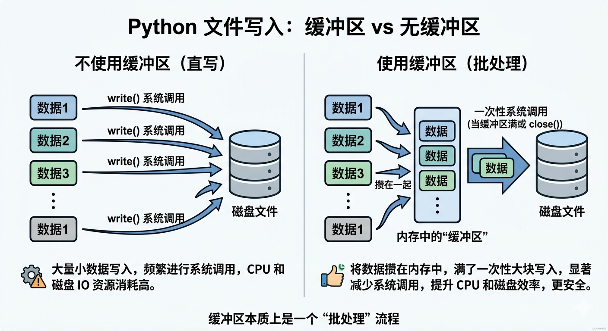

潜在风险：虽然缓冲区能极大提升性能，但也带来了一个风险：**数据丢失**。 如果程序突然崩溃或电脑意外断电，而缓冲区里的数据还没来得及刷新到磁盘，这部分数据就会直接丢失。

##### 缓冲区的分类

在 Python 中，文件缓冲区其实分为三个层次，数据并不是直接从代码跳到磁盘的：

- **Python 应用级缓冲区：** 由 Python 解释器维护
- **操作系统内核缓冲区（OS Page Cache）：** 这是最隐蔽的一层。即使 Python 输出了数据，操作系统通常也会先把它存在自己的内存里，等合适的时机再写盘
- **磁盘硬件缓存：** 现代硬盘自带一小块内存，用于最后的物理写入优化

##### open() 函数控制缓冲区行为

###### buffering 参数

可以通过 **`open()` 函数的 `buffering` 参数来手动控制缓冲策略**：

| **参数值**         | **缓冲模式**     | **说明**                                                     |
| ------------------ | ---------------- | ------------------------------------------------------------ |
| `buffering=0`      | **无缓冲**       | **仅限二进制模式**。每次 `write()` 直接触发系统调用写入      |
| `buffering=1`      | **行缓冲**       | **仅限文本模式**。遇到 `\n` 换行符时立即刷入磁盘             |
| `buffering=[size]` | **固定大小缓冲** | **指定缓冲区的大小（单位：`size`字节）**                     |
| `None` (默认)      | **自动**         | 等价于 `-1`，交互式终端通常为行缓冲，普通文件通常为固定大小缓冲（一般是 4096 或 8192 字节）。 |

```python
import time

# buffering=0 无缓冲，每次 write() 都会直接写入到文件中（仅限二进制模式）
def write_file_buffering_0():
    with open('./test', 'wb', buffering=0) as f:
        f.write(b'hello world')
        time.sleep(5)

# buffering=-1 行缓冲【等价于 None】，每次 write() 时遇到 \n 换行符就会直接写入到文件中（仅限文本模式）
def write_file_buffering_str():
    with open('./desc.txt', 'wt', buffering=-1) as f:
        f.write('hello \n')
        time.sleep(5)
        f.write('world \n')
        
# buffering=[size] 缓冲区大小，每次 write() 时达到 size 时就会写入到文件中（仅限二进制模式）
def write_file_buffering_bytes_size():
    with open('./test', 'wb', buffering=10) as f:
        f.write(b'hello world hello world hello world')
        time.sleep(5)

if __name__ == '__main__':
    write_file_buffering_0()
    write_file_buffering_str()
    write_file_buffering_bytes_size()
```

##### 手动刷新缓冲区

> [!NOTE]
>
> 缓冲区里的数据不是永远待在那里的，它会在以下几种情况下被“冲洗”到目的地：
>
> 1. **缓冲区满了：** 自动触发写入
> 2. **强制刷新：** 比如在代码中手动调用 `file.flush()`
> 3. **关闭流：** 程序执行完毕或手动调用 `file.close()` 时，会将剩余数据最后一次性写出
> 4. **遇到特定字符：** 比如“行缓冲”模式下，遇到换行符 `\n` 就会触发写入

###### f.flush()

作用：**将 `flush()` 之前 `write()` 写入到缓冲区的数据立即刷新到真实磁盘文件中**。

```python
import time


# 缓冲区操作
# flush 手动刷新缓冲区
def write_file_flush():
    f = None
    try:
        f = open('./desc.txt', 'wt', encoding='utf-8')
        f.write('hello world')
        # 这里的数据会被写入到缓冲区中，并不会立即写入到文件中
        
        f.flush()
        # 手动刷新缓冲区，将数据写入到文件中
        
        time.sleep(5) # 如果前面不添加 flush()，则程序会等 5秒，且程序关闭后才会写入到磁盘文件中
    except FileExistsError as e:
        print(e)
    finally:
        if f is not None:
            f.close()


if __name__ == '__main__':
    write_file_flush()
```

###### os.fsync(fd)

核心定义：`os.fsync()` 是一个比文件对象的 `flush()` 方法更底层、更“硬核”的操作。

数据的层级缓存：当调用 `write()` 写入数据时，数据会经历以下过程：

1. **第一步：** `f.flush()` —— 将数据从 **Python 的内部缓冲区** 推送到 **操作系统的内核缓冲区**（OS Page Cache）。此时，数据还在内存里，没进硬盘。
2. **第二步：** `os.fsync()` —— 强制**操作系统**将内核缓冲区里的脏数据（Dirty Pages）立即写入**物理磁盘硬件**。

与 `f.flush()` 的区别：

| **特性**   | **f.flush()**                    | **os.fsync(fd)**               |
| ---------- | -------------------------------- | ------------------------------ |
| **层级**   | Python 应用层                    | 操作系统/硬件层                |
| **目的地** | 操作系统内存 (Page Cache)        | 物理磁盘硬件                   |
| **速度**   | 极快                             | 较慢（受限于磁盘 IO 物理速度） |
| **安全性** | 进程崩溃可保住数据，系统断电会丢 | 系统断电也能保住数据           |

核心概念：需要**先调用 `f.flush()` 将 `write()` 写入的数据从 Python 内部的缓冲区中刷入到操作系统的内核缓冲区**，再**调用 `os.fsync()` 方法，将操作系统的内核缓冲区数据写入到真实的磁盘文件中**。这才是真实的写入步骤。

基本用法：

- `os.fsync()` 需要一个文件描述符（File Descriptor, fd）作为参数，而不是文件对象本身。可以通过 **`f.fileno()` 获取**

```python
# 使用 os.fsync(fd) 方法手动将操作系统内核缓冲区的数据写入到真实磁盘文件中
def write_file_os_fsync():
    with open('./desc.txt', 'wt', encoding='utf-8') as f:
        f.write('hello world')  # 写入数据到 Python 内部缓冲区

        f.flush()  # 将 Python 内部缓冲区的数据写入到操作系统内核缓冲区

        fd = f.fileno()  # 获取文件 描述符

        os.fsync(fd)  # 将操作系统内核缓冲区的数据写入到真实磁盘文件中

if __name__ == '__main__':
    write_file_os_fsync()
```

###### 使用 with 语句

作用：**`with` 语句会自动调用 `f.close()` 方法**，当程序跳出时会自动将 `write()` 写入的数据刷新到缓冲区中。

```python
import time

def write_file_with():
    with open('./desc.txt', 'wt', encoding='utf-8') as f:
        f.write('hello world')
        time.sleep(5)


if __name__ == '__main__':
    write_file_with()
```

#### 配合 with 完成最佳实践

Python 中的 `with` 关键字用于管理一个上下文资源环境，任何具有 “进入” / “离开” 的流程操作都可以交给 `with` 关键字去管理。

这跟文件操作的流程很像：“进入” -> `open()`， “离开” -> `close()`。

所以，一个文件操作的整个流程都可以交给 `with` 去管理，**`with`代码块内只需编写文件具体的读写逻辑即可，`with` 内部会自动完成 `close()` 的调用**。

```python
# 传统写法需要手动关闭
f = open('file.txt', 'r')
try:
    content = f.read()
finally:
    f.close()

# 使用 with，自动关闭
with open('file.txt', 'r') as f:
    content = f.read()
# 离开 with 代码块后，文件自动关闭

# 处理多个文件资源
with open('input.txt', 'r') as infile, open('output.txt', 'w') as outfile:
    outfile.write(infile.read())
```

### 文件/目录操作（os 模块）

Python 的 `os` 模块是标准库中用于与**操作系统**进行交互的核心工具。它提供了一种不依赖于具体平台（Windows, Linux, macOS）的方式来使用操作系统的功能，比如文件管理、目录操作和环境变量访问。

#### 目录操作

##### 创建目录

###### os.mkdir(path) 创建单级目录
作用：**在 `path` 路径下创建一个单层目录**。**若 `path` 路径已有该目录，则报错。**
```python
import os

os.mkdir('./aa')
```

###### os.makedirs(path) 创建多级目录
作用：**在 `path` 路径下递归创建多层目录**。**若 `path` 路径已有最后的子目录，则报错。**
```python
import os

# 会检查 /aa 下是否有 /bb，没有则创建 /bb ，接着到 /bb 目录检测是否有 /cc 子目录，没有则创建 /cc 子目录...
os.makedirs('./aa/bb/cc')
```

##### 删除目录

###### os.rmdir(path) 删除空目录
作用：**删除 `path` 路径指定的空目录。若 `path` 不是空目录，则报错**。

```python
import os

# 只会删除 /bb 目录，不会删除 /aa 目录，因为 /aa 目录下还有 /bb 目录
os.rmdir('./aa/bb')
```

###### os.removedirs(path) 递归删除空目录
作用：**递归删除 `path` 路径指定的空目录。**

特性：**在成功删除 `path` 路径下的末尾一级子目录后，会 “向上” 递归尝试删除父目录（直到父目录不是空目录）**。

```python
import os

# 会删除 /bb 目录，随后递归回到 /aa 目录，发现 /aa 目录下没有其他内容，所以也会删除
os.removedirs('./aa/bb')
```

###### shutil.rmtree() 删除有内容的目录

> 危险操作，谨慎使用！

`os` 模块并没有关于删除有内容的实体目录的方法。需**通过 Python 提供的 `shutil` 标准库的 `rmtree()` 方法来实现**。

核心作用：**删除指定 `path` 路径下的文件树（包含文件、无论是否为空目录）**。

```python
import shutil

shutil.rmtree('C:/Users/win/Desktop/Test/Python/first_demo/dir_demo/aa')
```

##### 扫描目录

###### os.scandir(path) 扫描单层目录
作用：**扫描指定 `path` 路径的目录内容，包含文件、子目录对象信息**。

返回值：返回一个 **`ScandirIterator` 迭代器对象**，可**使用 `for`、`while` 循环获取文件/子目录对象信息**。

> 注意点：**`os.scandir()` 方法不会递归遍历子目录**。

参数：

- **`path`：**
  - **不传：默认扫描当前目录**
  - **指定路径：扫描指定 `path` 目录下的所有文件和子目录对象信息**

迭代项目：**文件/目录对象 `DirEntry`**

- **`name`：文件/目录名**
- **`path`：相对于 `path` 路径的路径**
- **`is_file()`：当前项是否为一个文件**
- **`is_dir()`：当前项是否为一个目录**

```python
import os

# 不传入任何参数，则默认扫描当前目录
scandir_arr = os.scandir()
print(scandir_arr)  # <nt.ScandirIterator object at 0x000002326F4184B0> 迭代器对象
for i in scandir_arr:
    # i 文件/目录对象，i.name 文件/目录名称，i.path 文件/目录路径
    print(i, i.name, i.path, i.is_dir(), i.is_file())

'''
<nt.ScandirIterator object at 0x0000017FE2730190>
<DirEntry 'aa'> aa ./aa True False
<DirEntry 'demo1.py'> demo1.py .\demo1.py False True
<DirEntry 'demo2.py'> demo2.py .\demo2.py False True
<DirEntry 'demo3.py'> demo3.py .\demo3.py False True
<DirEntry 'test.txt'> test.txt ./test.txt False True
'''

# 传入参数，则扫描指定目录
scandir_arr = os.scandir('C:\\Users\\win\\Desktop\\Test\\Python\\first_demo')
print(scandir_arr)  # <nt.ScandirIterator object at 0x000002326F4184B0> 迭代器对象
for i in scandir_arr:
    # i 文件/目录对象，i.name 文件/目录名称，i.path 文件/目录路径
    print(i, i.name, i.path)

'''
<nt.ScandirIterator object at 0x0000017DC2D61D90>
<DirEntry '.cursorrules'> .cursorrules C:\Users\win\Desktop\Test\Python\first_demo\.cursorrules
<DirEntry '.mypy_cache'> .mypy_cache C:\Users\win\Desktop\Test\Python\first_demo\.mypy_cache
<DirEntry 'annotation.py'> annotation.py C:\Users\win\Desktop\Test\Python\first_demo\annotation.py
<DirEntry 'anonymous_function.py'> anonymous_function.py C:\Users\win\Desktop\Test\Python\first_demo\anonymous_function.py
<DirEntry 'built_in_function.py'> built_in_function.py C:\Users\win\Desktop\Test\Python\first_demo\built_in_function.py
<DirEntry 'call_stack.py'> call_stack.py C:\Users\win\Desktop\Test\Python\first_demo\call_stack.py
<DirEntry 'class_.py'> class_.py C:\Users\win\Desktop\Test\Python\first_demo\class_.py
...
'''
```

###### os.walk(path) 递归扫描多层目录
作用：**递归扫描指定 `path` 路径的目录内容，包含文件、子目录**。

返回值：返回一个 **`generator` 生成器对象**，可**使用 `for`、`while` 循环或直接调用 `next()` 函数获取文件/子目录对象信息**。

> 注意点：**`os.walk()` 方法会递归遍历子目录**。

迭代项目：**包含当前目录路径、子目录名称列表、文件名列表的元组**

- **`dir_path`：所递归遍历的当前目录路径**
- **`dir_names`：子目录名列表**
- **`file_names`：文件名列表**

注意：**必须使用 `dir_path, dir_names, file_names` 3 个属性名来解构赋值获取**。

```python
import os

# os.walk(): 递归遍历目录
walk_dir_arr = os.walk('../dir_demo')

print(walk_dir_arr)  # <nt.ScandirIterator object at 0x000002326F4184B0> 迭代器对象
print(next(walk_dir_arr))
# ('../dir_demo', ['aa'], ['demo1.py', 'demo2.py', 'demo3.py', 'test.txt'])

for dir_path, dir_names, file_names in walk_dir_arr:
    # dir_path 所遍历的目录路径
    # dir_names 子目录名列表
    # file_names 文件名列表

    print(dir_path, dir_names, file_names)

    # ../dir_demo\aa ['bb'] []
    # ../dir_demo\aa\bb [] []
```

##### 其他目录操作

###### os.getcwd() 获取当前目录

作用：返回**当前工作目录的绝对路径**。
```python
import os

print(os.getcwd())  # C:\Users\win\Desktop\Test\Python\first_demo\dir_demo
```

###### os.chdir(path) 切换当前目录
作用：**切换当前工作目录为 `path` 目录。`os.getcwd()` 目录的值也会随之改变**
```python
import os

os.chdir('C:\\Users\\win\\Desktop\\Test\\Python')  # 切换当前工作目录

print(os.getcwd())  # C:\Users\win\Desktop\Test\Python
```

###### os.listdir(path) 获取目录内容

参数：

- **`path`：**
  - **不传：默认获取当前目录**
  - **指定路径：获取指定 `path` 目录下的所有文件和子目录名**

返回值：返回一个**包含 `path` 目录下的所有文件和子目录名组成的列表**

注意：**`os.listdir()` 方法只会获取一层目录的信息，不会递归获取子目录内的信息**

```python
import os

# 获取当前目录的所有文件和目录名
current_dir_list = os.listdir()
print(current_dir_list)  # ['aa', 'demo1.py', 'demo2.py', 'test.txt']

# 获取指定目录的所有文件和目录名
dir_list = os.listdir('C:\\Users\\win\\Desktop\\Test\\Python\\first_demo')
print(dir_list)  # ['dir_demo', 'file_demo', 'module_demo', 'test_demo',...]
```

#### os.path 路径操作子模块

##### 方法

###### join(path, *paths) 路径拼接

作用：**将 `path` 与 多个 `*paths` 路径拼接成一个完整的路径**。（自动处理不同系统的斜杠 `/` 或 `\`）

```python
import os
# os.path 路径操作
path = 'C:/Users/win/Desktop/Test/Python/first_demo/demo'


# os.path.join(path, *paths): 将多个路径组合后返回，第一个绝对路径之前的参数将被忽略
resolve_path = os.path.join(path, 'index.py')
print(resolve_path)  # C:/Users/win/Desktop/Test/Python/first_demo/demo\index.py
```

###### exists(path) 路径是否存在
作用：**如果 `path` 路径（文件/目录）存在，返回 True；否则返回 False**。
```python
import os.path as path

print(path.exists('C:/Users/win/Desktop/Test/Python/first_demo/demo/index.py'))  # True
print(path.exists('C:/aa/bb/cc'))  # False
```

###### isfile(path) 是否为文件
作用：**如果 `path` 路径是一个文件且存在，返回 True；否则返回 False**。
```python
import os.path as path

print(path.isfile('C:/Users/win/Desktop/Test/Python/first_demo/demo/index.py'))  # True
print(path.isfile('C:/Users/win/Desktop/Test/Python/first_demo/demo'))  # False
```

###### isdir(path) 是否为目录
作用：**如果 `path` 路径是一个目录且存在，返回 True；否则返回 False**。
```python
import os.path as path

print(path.isdir('C:/Users/win/Desktop/Test/Python/first_demo/demo'))  # True
print(path.isdir('C:/Users/win/Desktop/Test/Python/first_demo/demo/index.py'))  # False
```

###### split(path) 路径拆分
作用：将 **`path` 路径拆分为一个 (目录, 文件名) 元组**
```python
import os.path as path

abs_path = 'C:/Users/win/Desktop/Test/Python/first_demo/demo/index.py'
tuple_path = path.split(abs_path)
print(tuple_path)  # ('C:/Users/win/Desktop/Test/Python/first_demo/demo', 'index.py')
```

###### splitext(path) 文件/目录名分离
作用：**分离文件名与扩展名**（如 `test.py` 变为 `('test', '.py')`）
```python
import os.path as path

abs_path = 'C:/Users/win/Desktop/Test/Python/first_demo/demo/index.py'

print(path.splitext(abs_path)) # ('C:/Users/win/Desktop/Test/Python/first_demo/demo/index', '.py')

file_name, file_ext = path.splitext(abs_path)
print(file_name)  # C:/Users/win/Desktop/Test/Python/first_demo/demo/index
print(file_ext)  # .py
```

###### abspath(path) 绝对路径

作用：返回 `path` 路径的**绝对路径**。

```python
import os.path as path

print(path.abspath('./demo1.py'))
# C:\Users\win\Desktop\Test\Python\first_demo\dir_demo\demo1.py
```

###### dirname(path) 获取目录部分

作用：获取 `path` 绝对路径的**目录部分**

```python
import os.path as path

print(path.dirname('C:/Users/win/Desktop/Test/Python/first_demo/demo/index.py'))
# C:/Users/win/Desktop/Test/Python/first_demo/demo
```

##### 属性

#### 文件操作

> 创建文件最好使用 `open()` 函数来完成。

##### 方法

###### os.rename(src,dist) 重命名文件/目录

作用：**重命名 `src` 源文件的名称为 `dist` 新名称**。

```python
os.rename('./text.txt', './test.txt')
# 将当目录下的 text.txt 重命名为 test.txt
```

###### os.remove(path) 删除文件

作用：**删除指定路径 `path` 的文件**。若文件不存在则报错。

```python
os.remove('./test.txt')
os.remove('C:/Users/win/Desktop/Test/Python/first_demo/demo/index.py')
```

###### os.stat(path) 获取文件/目录信息

作用：**返回 `path` 指定路径下的文件/目录信息**。

```python
print(os.stat('C:/Users/win/Desktop/Test/Python/first_demo/demo/index.py'))
# 返回：os.stat_result(st_mode=33206, st_ino=0, st_dev=0, st_nlink=1, st_uid=0, st_gid=0, st_size=0, st_atime=0, st_mtime=0, st_ctime=0)

# 具体信息：
# st_mode: 文件权限
# st_ino: inode 编号
# st_dev: 设备编号
# st_nlink: 硬链接数
# st_uid: 用户 ID
# st_gid: 组 ID
# st_size: 文件大小
# st_atime: 最后访问时间
# st_mtime: 最后修改时间
# st_ctime: 创建时间
# os.stat(path).st_size: 获取文件大小

print(os.stat('C:/Users/win/Desktop/Test/Python/first_demo/demo/index.py').st_size)  # 0
```


#### 系统信息与环境变量

##### 方法

##### 属性

###### os.name 当前系统

作用：**返回当前使用的平台（`'nt'` 表示 Windows，`'posix'` 表示 Linux/macOS）**。

```python
import os

print(os.name)  # nt 操作系统名称
```

###### os.environ 查看环境变量
作用：**返回一个字典，包含系统所有的环境变量**。
- 获取特定变量：`os.environ.get('PATH')`
```python
import os

print(os.environ)  # 获取环境变量列表
# environ({'ALLUSERSPROFILE': 'C:\\ProgramData', 'APPDATA': 'C:\\Users\\win\\AppData\\Roaming', 'CHOCOLATEYINSTALL': 'C:\\ProgramData\\chocolatey', 'CHOCOLATEYLASTPATHUPDATE': '134208191398...})

# 获取 ALLUSERSPROFILE 环境变量 C:\ProgramData
print(os.environ.get('ALLUSERSPROFILE'))
```

## 核心基础

### 字面量

**字面量（Literal）** 是**在源代码中直接写出的固定值**，用于表示**数据本身**，而不是变量或表达式。

```python
# 这些都是字面量
42          # 整数字面量
3.14        # 浮点字面量
"Hello"     # 字符串字面量
True        # 布尔字面量
None        # 空值字面量
[1, 2, 3]   # 列表字面量
{"a": 1}    # 字典字面量
```

#### 字符串字面量

在 Python 中，定义**字符串字面量**有多种写法：

- **单双引号**

  ```python
  'Jack'
  "Jack"
  ```

- **单双三引号**

  ```python
  ''' Jack '''
  """ Jack """
  ```

  > 注：如果三引号字符串字面量**没有被变量引用**，且**在 `.py`模块、类、函数的第一行**，则**会被视为 API Doc 文档字符串**作为类、函数、模块的 API Doc 文档描述信息。
  >
  > ```python
  > ''' 这是一个 py 模块 '''
  > 
  > def hello():
  >     ''' 这是一个 hello 方法 '''
  >     
  > class Person:
  >     ''' 这是一个 Person 类 '''
  > ```

- **`f""` 模板字符串**

  ```python
  f"I am {"Jack"}"
  ```

#### 与变量的区别

```python
# 字面量：直接写出的值
42          # 字面量

# 变量：指向值的名字
x = 42      # 42 是字面量，x 是变量
```

#### 核心要点

| 要点                             | 说明                     |
| :------------------------------- | :----------------------- |
| **字面量是直接写出的值**         | 不需要计算或引用         |
| **每种类型都有对应的字面量语法** | 数值、字符串、容器等     |
| **字面量是不可变的**             | 但容器字面量本身可变     |
| **f“” 模板表达式是字面量**       | 运行时求值的字符串字面量 |

### 变量

> 在 Python 中，**变量（Variable）** 是用来存储数据的“容器”或“标签”。
>
> Python 的变量机制与其他语言（如 C++ 或 Java）相比非常灵活，主要特点是**动态类型**和**对象引用**。
>
> Python 的变量非常智能：它们**不需要预先声明**，**类型随值而变**，本质上是**指向内存对象的标签**。
>
> 理解了“**引用**”这一概念，就掌握了 Python 变量的精髓。

在 Python 中，变量的声明**不需要关键字**，直接 **`<变量名> = <值>`** 即可，**赋值即创建**：

```python
name = "张三"      # 字符串
age = 25          # 整数
height = 1.75     # 浮点数
is_student = True # 布尔值
```

注：Python 在**运行时**会**根据值的类型来动态决定变量的类型**。（跟 JavaScript 一样）

#### 命名规范

- **允许字符**：字母、数字、下划线 `_`
- **首字符限制**：不能以数字开头（例如 `1person` 是非法的）
- **大小写敏感**：`Age` 和 `age` 是两个完全不同的变量
- **禁止关键字**：不能使用 Python 的内置关键字（如 `if`, `for`, `class`, `def` 等）
- 使用**小写字母，单词之间用下划线分隔**（即 **snake_case**），例如：`user_profile_name`
- 定义变量**必须初始化值**

#### 基本用法

##### 动态类型特性

变量在**运行时**可以**随时改变类型**：

```python
x = 10       # 整数
x = "Hello"  # 变成字符串
x = [1, 2, 3] # 变成列表
```

##### `a,b = <值1>,<值2>`多变量赋值

描述：按照**定义顺序**同时**为多个变量赋值**：

```python
# 同时为多个变量赋值赋值
a, b, c = 1, True, '123'
print(a, b, c) # 1 True 123
```

##### `x = y = z = <值>` 相同赋值

描述：**`x = y = z = <值>` 创建多个变量并赋予相同值 **

```python
# 相同值
x = y = z = 0
print(x,y,z) # 0 0 0

# 交换变量（Python 特色）
a, b = b, a
```

##### `a,b=b,a` 交换变量

描述：为**多个变量之间交换变量值（不需要中间变量）**。例如**`a,b=b,a` => `a` 变量值变为 `b` 变量值，`b` 变量值变为 `a` 变量值**

```python
# 交换变量，
w = 'W'
q = 'Q'
print(q, w)  # 未交换前：Q W

q, w = w, q

print(q, w)  # 交换之后：W Q
```

### 常量

> **常量就是"不会改变的量"** —— 就像数学里的 π (圆周率) 永远是 3.14159...

在 Python 中没有真正的常量（无法强制只读），常量是一种**约定俗成的命名规范**：

> Python 并没有真正的常量概念，因为 Python 是一种**动态类型语言**，变量的值可以在**运行时改变**。
>
> 因此，虽然我们使用全大写字母来表示常量，但这只是一个约定，Python 解释器并不会强制执行这个约定。

```python
# 约定：全大写字母表示常量
MAX_SIZE = 100
PI = 3.14159

# 实际上仍然可以修改（但不应这样做）
MAX_SIZE = 200  # 语法上允许，但违反约定
```

> 注：Python 的常量是**君子协定**，依靠程序员的自律，而非语言的强制约束。

- 可以理解为：Python 的**常量**本质上就是一个**约定全大写字母命名的变量**

#### 命名规范

```python
# ✅ 推荐的常量命名
MAX_RETRY_COUNT = 3
DEFAULT_PORT = 8080
API_BASE_URL = "https://api.example.com"

# 私有常量（模块内部使用，只在当前文件内使用）
_INTERNAL_CONFIG = "secret"
_BACKUP_PATH = "/tmp/backup"

# 多个单词用下划线分隔
USER_AUTH_TOKEN_TIMEOUT = 3600

# 常量模块通常全大写
# const.py
DATABASE_CONFIG = {
    "HOST": "localhost",
    "PORT": 5432,
    "NAME": "mydb"
}

# ❌ 错误的命名（看起来像变量）
maxValue = 100  # 驼峰命名不适合常量
DefaultColor = "red"  # 首字母大写也不规范
```

#### 总结

1. **Python 没有真正的常量**，全大写只是"约定"
2. **常量就是不应该改变的值**（虽然可以改，但别改）
3. **全大写 + 下划线** = 常量命名规范
4. **使用常量让代码更易读、易维护**
5. **把常量放在文件顶部**，方便统一修改

**简单记忆：**

- 变量 = `lower_case`（小写）
- 常量 = `UPPER_CASE`（大写）

## 数据类型

Python 的数据类型非常丰富且强大，它们规定了变量可以存储什么样的数据以及能对这些数据进行什么操作。

Python 的数据类型分为 **基本数据类型** 和 **容器（集合）数据类型** 两大类：

### 基本数据类型（不可变）

这些是构建程序的最基础单元，通常是**不可变的（Immutable）**。

| 类型名称   | 关键字         | 示例         |
| ---------- | -------------- | ------------ |
| **整数**   | **`int`**      | 10，-5       |
| **浮点数** | **`float`**    | 0.15, -1.5   |
| **字符串** | **`str`**      | "Hello"      |
| **布尔值** | **`bool`**     | True , False |
| **空值**   | **`NoneType`** | None         |
| **字节串** | `byte`         | b"123456"    |

#### int 整数

表示一个**整数类型的值**，理论上支持无限大的整数，**无溢出限制**。

```python
age = 18    # 正整数（简写）
age_1 = +18 # 正整数
age_2 = -18 # 负整数
```

##### 1_000 **大整数分组**

描述：如果一个数值很大，可以**使用 `_` 下划线 根据百/千/万等分位**对数字**进行分组**，从而提高可读性。

```python
# 未分组前
big_int = 100000000 # 一亿

# 分组后
big_int = 100_000_000 # 一亿

print(bit_int) # 100000000 最后会将 _ 下划线去掉，并拼接前后的数字
```

#### float 浮点数

表示一个**带小数点的双精度数值**，存在精度误差。

```python
price = 78.36
```

- **科学计数法**：使用 **`e`** 或 **`E`** 表示

  ```python
  x = 1.5e3       # 1500.0   (1.5 × 10³)
  y = 3E-2        # 0.03     (3 × 10⁻²)
  z = -2.5e4      # -25000.0
  ```

##### 保留小数点后 n 个数值

可以使用 `%f` 占位符来实现浮点数的保留小数点后 n 个数值处理，`%f`是一个字符串格式化占位符。

**`%f`浮点数**：**保留小数点后前 n 个数字**，默认**最后一位数字 >6 则四舍五入**

```python
# 浮点数
m_n_float = '%.2f' % 156.6689  # 156.67
```

#### bool 布尔值

表示 **`True / False`** 的值，用于**逻辑判断（本质上 True=1, False=0）**。

注：`bool` 类型实质**是数值类型 `1` 和 `0` 的子类**。

```python
# bool 布尔值
is_student = True
is_student_1 = False

print(is_student, is_student_1)

print(True == 1, False == 0)  # True True
```

#### None 空值

表示**空值**或**无值**的特殊对象，常用于**变量、函数参数占位或初始化**。属于 **`NoneType` 类型。**

> 等价于 `null` 或 `undefined`

```python
name = None
```

- None 是一个特殊的字面量，表示空值/无值/无意义，不能参与数学运算，也不能与字符串拼接
- 在函数未使用 `return` 显式返回值时，默认返回 `None`

##### 核心特性

| 特性         | 说明                                         |
| :----------- | :------------------------------------------- |
| **唯一性**   | 整个 Python 解释器中**只有一个 `None` 对象** |
| **单例模式** | **所有 `None` 都指向同一内存地址**           |
| **布尔值**   | 在布尔上下文中被视为 **`False`**             |
| **类型**     | `type(None)` → **`<class 'NoneType'>`**      |

#### str 字符序列

> [!NOTE] 
>
> 标量序列：
>
> ​	指的是**既具有基本数据类型的特征，但在结构上又属于序列容器类型**，这种**同时拥有两种特征的数据类型**从细致化角度上来说，称之为标量序列。例如 **`str` 字符串、`bytes` 字节串**，两个特征一致，属于 “亲兄弟”。
>
> - 基本数据类型的特征：
>   - **不可变**：一旦创建，不可原地修改，必须重新赋值
>   - **存储结构单一**：只能存储一种类型的值，如字符、字节
>   
> - 序列容器类型的特征：
>   - **有序、可重复、可使用 `[]` 索引下标访问元素、可使用 `[::]` 切片操作**
>   
>     - （**可以 `[]`访问，但不能 `[]`修改**）
>   
>       
>   
>   - 可使用 `len()` 获取长度等**通用内置函数**
>   
>   - 具有**迭代性**：可使用 `for ... in` 迭代元素、`in` 关键字提取单个元素

Python 中的字符串有多种定义方式，使用 **`''`单引号、 `""` 双引号、`'''` 单三引号、`"""` 双三引号**括起来的**字符序列**，**不可原地修改**。

这些定义方式的区别在于 **不可直接换行** 与 **可直接换行**。

| 特性             | 定义方式         | 适用场景                                             |
| ---------------- | ---------------- | ---------------------------------------------------- |
| **不可直接换行** | **`''` 和 `""`** | **字符串字面量定义**                                 |
| **可直接换行**   | **`'''`**        | **多行注释、长文本字符串字面量**                     |
|                  | **`"""`**        | **多行注释、Docstring 文档说明、长文本字符串字面量** |

##### 创建方式

###### '' | "" 不可直接换行

Python 规定使用 **`''`单引号、 `""` 双引号** 声明的字符串**不能直接换行**，通常用于**定义字符串字面量**，**被其他变量引用**。

```python
str_1 = "Hello, Alice"
str_2 = 'Hello, Alice'
```

若强制换行，需要在字符串**开头与结尾添加 () 双括号**用于保护：

```python
str_3 = ('Hello,'
         'Alice')
```

###### ''' | """ 可直接换行

Python 规定使用 **`'''` 单三引号、`"""` 双三引号** 定义的字符串**可以直接换行**，**不需要添加 `()` 括号保护**，通常用于**多行注释、声明 Docstring 文档说明、长文本变量引用**。

```python
'''
这是一个多行注释
我可以直接换行，不需要 () 括号保护
'''

"""
我也是一个多行注释，并且我能作为 Docstring 文档声明
"""

# ''' 和 """ 定义的字面量字符串也能被变量引用，只不过不建议
```

如果一段字符串很长，为了代码可读性，可以使用 **`'''` 或 `"""`** 来定义**长文本字符串字面量**，并被其他变量引用。

```python
str_4 = '''
这是一个多行注释
我可以直接换行，不需要 () 括号保护
'''

str_5 = """
我也是一个多行注释，并且我能作为 Docstring 文档声明
"""
```

注：当 **`'''` 和 `"""`** 字符串字面量**被变量引用**时，便**不再作为 Docstring 文档说明**了。

##### + 字符串拼接

Python 中可以通过 **`+`** 运算符为多个**字符串字面量、字符串类型的变量、返回字符串的表达式**进行**拼接**，最后**组成一个完整的字符串**。

> [!WARNING]
>
> 字符串拼接**不可以插入其他类型（整数、浮点数、布尔值...），强制插入需要类型内置包装函数 `str()` 强制转换为字符串** 。

```python
# 字符串拼接
name = "Alice"
total_str = '我是' + name + '，' + '今年' + str(18) + '岁'
print(total_str)  # 我是Alice，今年18岁
```

##### \ 转义字符

在 Python 中，**反斜杠 `\`** 是**转义字符**，用来表示**特殊含义的字符**，或者**将特殊字符“转义”为普通字符**。

| 转义序列     | 含义              | 示例                                  |
| :----------- | :---------------- | :------------------------------------ |
| `\'`         | 单引号            | `'It\'s OK'` → `It's OK`              |
| `\"`         | 双引号            | `"He said \"Hi\""` → `He said "Hi"`   |
| `\\`         | 反斜杠本身        | `"C:\\Users\\name"` → `C:\Users\name` |
| `\n`         | 换行符（LF）      | `"a\nb"` → 输出两行                   |
| `\r`         | 回车符（CR）      | `"a\rb"` → `b`（覆盖前面的 `a`）      |
| `\t`         | 水平制表符（Tab） | `"a\tb"` → `a b`                      |
| `\b`         | 退格              | `"abc\bd"` → `abd`（删除 `c`）        |
| `\f`         | 换页符            | 常用于打印机控制                      |
| `\v`         | 垂直制表符        | 较少使用                              |
| `\0`         | 空字符（NULL）    | 字符串结束标志                        |
| `\ooo`       | 八进制字符        | `"\101"` → `'A'`（八进制 101 = 65）   |
| `\xhh`       | 十六进制字符      | `"\x41"` → `'A'`（十六进制 41 = 65）  |
| `\uhhhh`     | 16位 Unicode      | `"\u4e2d"` → `'中'`                   |
| `\Uhhhhhhhh` | 32位 Unicode      | `"\U0001f600"` → `'😀'`                |

示例：

```python
# 1. 引号嵌套
print('She said, "Hello"')      # 不用转义，双引号在单引号内
print("She said, \"Hello\"")    # 需要转义
print('It\'s raining')          # 需要转义

# 2. 文件路径（Windows）
path = "C:\\Users\\Admin\\Desktop\\file.txt"
# 或者用原始字符串避免转义
path = r"C:\Users\Admin\Desktop\file.txt"

# 3. 换行和制表符
print("Line1\nLine2\n\tIndented")

# 4. Unicode 字符
print("\u4e2d\u6587")   # 中文
print("\U0001F600")     # 😀
```

##### r 转义字符串

当**不想让 `\` 作为转义字符**时，在**字符串前加 `r`**：

```python
path = "C:\new\test"
# C:
# ew      est

r_str = r"C:\new\test"  # C:\new\test
```

##### 格式化输出字符串

- **格式化输出**：按照预先定义的**格式**，将**变量或计算结果**，**插入**到**字符串**中并输出。

Python 为 `str` 类型提供了多种格式化输出的方式，每种都有其特点和适用场景。

######  **% 占位符值引用**

语法：

```python
"%s" % (值1,值2,...)
```

作用：把**字符串**中的**`%s` 占位符**按**从左到右**的顺序**替换**为 **`%` 右边的值** ，值可以是**变量值、字面量、计算表达式**。

- **单个值：计算表达式需要使用 `()` 包裹**

  ```python
  # 单个值
  name_1 = "Hello, %s" % name     # Hello, Alice
  name_2 = "Hello, %s" % "Alice"  # Hello, Alice
  name_3 = "我 %s 岁了" % (16 + 8) # 我 24 岁了
  ```

- **多个值：需要使用 `()` 包裹**

  ```python
  # 多个值
  name = "Alice"
  age = 25
  desc = "Name: %s, Age: %d" % (name, age)  # Name: Alice, Age: 25
  
  desc_2 = "Name: %s, Age: %d" % ('Alice', 18)  # Name: Alice, Age: 25
  ```

常用格式化符号：

| 符号   | 说明              | 示例                           |
| :----- | :---------------- | :----------------------------- |
| `%s`   | 字符串            | `"%s" % "hello"`               |
| `%d`   | 整数              | `"%d" % 123`                   |
| `%f`   | 浮点数            | `"%f" % 3.14`                  |
| `%.2f` | 浮点数（2位小数） | `"%.2f" % 3.14159` → `3.14`    |
| `%x`   | 十六进制（小写）  | `"%x" % 255` → `ff`            |
| `%X`   | 十六进制（大写）  | `"%X" % 255` → `FF`            |
| `%o`   | 八进制            | `"%o" % 8` → `10`              |
| `%e`   | 科学计数法        | `"%e" % 1234` → `1.234000e+03` |

- **`%<m>.<n>[s|f|d]` 精度控制**运算符：

  - **`<m>`**：给定一个**数值**，限制**插入字符串的最小长度位数**

    - 当位数**不够**时使用**空格字符补全**，位数**小于插入字符串的长度**时则**不起作用**

    - 规则：

      - **正整数**：**字符串右对齐，向右补全空白字符**

        ```python
        m_name = 'Alice'
        m_str = '我叫%10s, 今年18岁' % m_name # 我叫     Alice, 今年18岁
        # 正整数：由于插入的字符串 'Alice' 总长度是 5 位，位数不够，所以 %10 会向 Alice 左边补全 5 个空格字符，从而文字会展示右对齐
        ```

      - **负整数**：**字符串左对齐，向左补全空白字符**

        ```python
        m_name = 'Alice'
        m_str = '我叫%-10s, 今年18岁' % m_name # 我叫Alice     , 今年18岁
        # 负整数：由于插入的字符串 'Alice' 总长度是 5 位，位数不够，所以 %10 会向 Alice 右边补全 5 个空格字符，从而文字会展示左对齐
        ```

  - **`<n>`**：给定一个**数值**，限制**插入字符串的长度控制**

    - 当**位数小于插入字符串的总长度**时，则**删除**。可以理解为**保留前 n 个字符**

      > 注意：需要在 **`%` 字符后加入 `.` 字符表示使用 `n` 精度控制规则**。即 **`%.n`**

    ```python
    n_name = 'Alice'
    n_str = '我叫%.2s, 今年18岁' % n_name # 我叫Al, 今年18岁
    
    # %.2：只保留插入字符串 Alice 的前 2 个字符
    ```

- 混合使用：**先计算 `n` ，再计算 `m`**

  ```python
  m_n_name = 'Alice'
  m_n_str = '我叫%10.2s, 今年18岁' % m_n_name # 我叫        Al, 今年18岁
  
  # 保留前 2 个字符，并向左插入 5 个空格字符
  ```

精度控制规则适用于以上任何格式化占位符，如：

- **`%f`浮点数**：**保留小数点后前 n 个数字**，默认**最后一位数字 >6 则四舍五入**

  ```python
  # 浮点数
  m_n_float = '%.2f' % 156.6689  # 156.67
  ```

- **`%d`整数：整数前补0**

  ```python
  # 正整数
  m_n_int = '%.10d' % 156789  # 0000156789
  ```

######  **str.format() 格式化**

> 注：在 Python 中，字符串本身也是一个字面量类型，

语法：

```python
"{}".format("Alice")
```

作用：调用 **`str` 字符串字面量自带**的 **`format`方法**，把字符串中的**`{}` 占位符**一个个**替换**为 **.format() 传入的值** 。

- 按从**左到右**的书写顺序替换：

  ```python
  print("姓名: {}, 年龄: {}".format(name, age))  # 输出：姓名: Jack, 年龄: 18
  ```

- 按**索引**替换：`format()` 方法内部会将传入的值转为**数组**的形式，通过**数组索引**可**拿到传入的具体实参值**

  ```python
  print("姓名: {1}, 年龄: {0}".format(name, age))  # 输出：姓名: 18, 年龄: Jack
  ```

- 按**变量名**替换：`format()` 方法**显式声明形参并传入实参值**，**`{}` 占位符可拿取并替换**

  ```python
  print("姓名: {name}, 年龄: {age}".format(name='Jack', age=18))  # 输出：姓名: Jack, 年龄: 18
  ```

- 混合使用：**实参值必须在声明形参之前传入**

  ```python
  print("我是一个 {student}, 我叫 {name}, 今年 {0} 岁".format(18, student='学生', name='Jack')) 
  # 我是一个 学生, 我叫 Jack, 今年 18 岁
  ```

######  **f"{}" 模板字符串**

语法：

```python
f"{}"
# 类似于 JS 的 `${}`
```

作用：**执行获取 `{}` 占位符内的值并格式化输出为字符串**。可以直接理解为它本质上是一个**字符串字面量**。

核心本质：`f""` 不是一个独立的类型，而是一个**字符串字面量前缀**，告诉 Python 解释器在**运行时**对这个字符串进行**格式化处理**，最终**生成一个普通的 `str` 对象**，可以被**变量引用、函数返回、直接 `print()` 输出。**

- 变量引用：

  ```python
  f_str_1 = f"Python is great"
  
  print(f_str_1)  # 输出：Python is great
  
  str2 = 'Python'
  f_str_2 = f"{str2} is great"
  print(f_str_2)  # 输出：Python is great
  
  # 多行 s-string
  message = (f"姓名: {name}\n" f"年龄: {age}")
  
  print(message)
  # 输出：
  # 姓名: Jack
  # 年龄: 18
  ```

- 函数返回：

  ```python
  def get_str_f():
      return f'Python is great'
  
  
  str_f = get_str_f()
  print(str_f)  # 输出：Python is great
  
  # 调用函数
  def greet(param: str) -> str:
      return f"Hello, {param}"
  
  a_name = "Alice"
  print(f"{greet(a_name)}")
  ```

- 直接 `print()` 输出：

  ```python
  # 引用变量
  name = 'Jack'
  age = 18
  print(f"姓名: {name}, 年龄: {age}")  # 输出：姓名: Jack, 年龄: 18
  
  # 表达式
  print(f"2 + 2 = {2 + 2}")  # 输出：2 + 2 = 4
  print(f"10 / 3 = {10 / 3:.2f}")     # 10 / 3 = 3.33  (:.2f 扩展 2 个 float 浮点数)
  
  # if/else 条件表达式
  print(f"{'A' if 1 > 0 else 'B'}")  # 输出：A
  ```

- 格式化规范：

  ```python
  name = "Python"
  version = 3.11
  pi = 3.14159
  number = 1234567
  
  # 对齐
  print(f"{name:<10}")    # 左对齐: 'Python    '
  print(f"{name:>10}")    # 右对齐: '    Python'
  print(f"{name:^10}")    # 居中: '  Python  '
  print(f"{name:=^10}")   # 填充: '==Python=='
  
  # 数字格式化
  print(f"{pi:.2f}")      # 3.14
  print(f"{pi:.4f}")      # 3.1416
  print(f"{pi:10.2f}")    # '      3.14'
  print(f"{number:,}")    # 1,234,567
  print(f"{number:_}")    # 1_234_567
  
  # 百分比
  rate = 0.875
  print(f"{rate:.2%}")    # 87.50%
  
  # 进制
  num = 255
  print(f"{num:b}")       # 11111111（二进制）
  print(f"{num:o}")       # 377（八进制）
  print(f"{num:x}")       # ff（十六进制）
  print(f"{num:X}")       # FF（十六进制大写）
  
  # 切片
  s = "Hello_World"
  print(s[0:5])   # 输出: 'Hello' (从索引0到4)
  print(s[:5])    # 输出: 'Hello' (省略start，默认从头开始)
  print(s[6:])    # 输出: 'World' (从索引6开始到结束)
  print(s[:])     # 输出: 'Hello_World' (获取完整拷贝)
  print(s[-5:])   # 输出: 'World' (最后5个字符)
  print(s[6:-1])  # 输出: 'Worl' (从索引6到倒数第2个)
  print(s[::2])   # 输出: '13579' (每隔一个取一个)
  print(s[::-1])  # 输出: '987654321' (步长为负数，实现字符串反转)
  ```

######  **Template() 模板字符串**

描述：通过 **`from string import Template`** 从 `string` 模块中导入 **`Template` 函数**，该函数可以**声明模板字符串**。

语法：

```python
Template('$xxx') | Template('${xxx}')
```

描述：`Template()` 函数用于声明一个包含 `$xxx` 引用变量占位符的**字符串字面量**，并返回一个 `t` 对象，该对象包含专门用于引用、**解析 `$xxx` 变量占位符**并**替换为同名实参值**的方法 **`substitute()`** 和 **`safe_substitute()`**，该方法会**引用传入的同名形参值**，并整个**转化为字符串字面量输出**。

示例：

```python
# 1. 使用 $ 符号表示变量
t = Template('姓名: $name, 年龄: $age')
print(t.substitute(name='Jack', age=18))  # 输出：姓名: Jack, 年龄: 18

# 2. 使用字典
t = Template('姓名: $name, 年龄: $age')
print(t.safe_substitute({'name': 'Jack', 'age': 18}))  # 输出：姓名: Jack, 年龄: 18
```

##### 常用方法

```python
str = "hello world"
print(str.capitalize())  # 首字母大写
print(str.upper())  # 全部大写
print(str.lower())  # 全部小写
print(str.swapcase())  # 大小写互换
print(str.title())  # 每个单词首字母大写
print(str.count('l'))  # 统计字符出现次数
print(str.find('l'))  # 查找字符首次出现的位置
print(str.index('l'))  # 查找字符首次出现的位置，不存在会报错
print(str.replace('l', 'x'))  # 替换字符
print(str.split(' '))  # 按照指定字符分割字符串
```

#### bytes 不可变字节序列

**`bytes`** 是一种专门用于**处理二进制数据**的**不可变序列**。可以把它想象成 **0-255 之间的整数组成的元组**，或者**纯粹的 01 二进制数据流**。

> 整数 > 字节：在 Python 中，**每个 `byte` 字节都可以通过 `int`整数来表示，且范围在 0-255 之间。**

##### 创建方式

-  **`b""`** **模板字节串**：

```python
# 字面量 (b 前缀)
b1 = b'Hello'
b2 = b'\x48\x65'   # \x 是 16 进制转义，对应 'He'
```

- **`bytes()` 构造函数（强转类型）**：

```python
# bytes() 构造函数
b3 = bytes([65, 66, 67])       # 传入 0-255 范围的整数列表 -> b'ABC'
b4 = bytes('你好', 'utf-8')    # 从字符串编码 -> b'\xe4\xbd\xa0\xe5\xa5\xbd' -> 你好

# 特殊：生成全零或全填充
b5 = bytes(5)                  # b'\x00\x00\x00\x00\x00'
```

##### [] 索引访问

`bytes` 本质上是一个**数组形式的字节序列**，可以**通过 `[]` 索引的方式访问字节序列中的指定字节元素**，但**不可对其修改**操作。

```python
by = b"ABCD"

print(by[0]) # 65
```

> [!NOTE]
>
> 通过 `[]`索引访问时会**输出对应字符转成的字节所表示的 `0-255` 整数（包含 127位 的字符 ASCII码、特殊字符）**
>
> - 根据**索引**返回指定字节的 **ASCII 码**：
>
>   > `bytes` 本质上是一个字节串，类似于字符串，可以通过 `[]` 来像数组一样访问某个字节串成员。（但不能修改）
>
>   ```python
>   b = b'Hello'
>   b_1 = b[0]
>   print(b_1)  # 72 （H 的 ASCII 码）
>   ```

##### 核心特征

- **不可变**：一旦创建，**内容无法修改**

  ```python
  b3 = bytes([65, 66, 67])
  
  # b3[0] = 58 # 报错
  ```

- 与 `str` 字符串的本质区别：**`str` 是给人看的文本（Unicode 字符），`bytes` 是给机器处理的原始字节**

##### 切片 [start:stop:step]

| 操作     | 代码示例 `b = b'Hello'` | 返回值类型  | 结果   |
| :------- | :---------------------- | :---------- | :----- |
| **索引** | `b[0]`                  | **`int`**   | `72`   |
| **切片** | `b[0:1]`                | **`bytes`** | `b'H'` |

Python 支持根据索引的切片规则对字节序列进行**截取某一段字节、反转字节序列**等操作 ，且会**返回一个新字节串，原字节串不会改变**

###### 基本语法

```python
result = <字节串变量>[start?:stop?:step]
```

> 注：`start`、`stop`、`step`参数都是**可选的**

参数说明：

- **`start?`：从 `start` 索引下标开始截取**，默认**不填为 0**
- **`stop?`：截取到 `stop` 索引下标**，默认**不填为字节串总长度 - 1**
- **`step?`：**两个作用
  - **正数值：截取间隔，默认步长为 1，隔 1 个截取一个字节**
  - **负数值 -1：反转字节串**

###### 常用方式

- **`<字节串>[start:stop:step]`**：截取**从 `start` 到`stop-1`(字节串总长度 - 1) 索引，步长为 `step`的字节串**

  ```python
  b_bytes = b"0123456789"
  
  print(b_bytes[1:3:1])  # b'12'
  ```

- **`<字节串>[start:stop]`**：截取**从 `start` 到`stop-1`(字节串总长度 - 1) 索引的字节串**

  ```python
  b_bytes = b"0123456789"
  
  print(b_bytes[0:3])  # b'012' # 截取 b_bytes[0]、b_bytes[1]、b_bytes[2] 的字节
  print(b_bytes[3:6])  # b'345' # 截取 b_bytes[3]、b_bytes[4]、b_bytes[5] 的字节
  ```

- **`<字节串>[:stop]`**：截取**从 0 到 `stop-1`(字节串总长度 - 1) 索引的字节串**

  ```python
  b_bytes = b"0123456789"
  
  print(b_bytes[:6])  # b'012345' # 从头开始，截取到 b_bytes[5] 的字节
  print(b_bytes[:3])  # b'012' # 从头开始，截取到 b_bytes[2] 的字节
  ```

- **`<字节串>[start:]`**：截取 **`start` 索引之后的所有字节串**

  ```python
  b_bytes = b"0123456789"
  
  print(b_bytes[2:]) # b'23456789' # 从 b_bytes[2] 开始，截取到末尾
  print(b_bytes[6:]) # b'6789' # 从 b_bytes[6] 开始，截取到末尾
  ```

- **`<字节串>[::step]`**：从头开始，**每隔 `step` 个字节截取一次**，并组成字节串返回

  ```python
  b_bytes = b"0123456789"
  
  print(b_bytes[::2])  # b'02468' # 从头开始，每隔 2 个字节截取一次
  print(b_bytes[::3])  # b'0369' # 从头开始，每隔 3 个字节截取一次
  ```

- **`<字节串>[::-1]`**：**反转字节序列**

  ```python
  b_bytes = b"0123456789"
  
  print(b_bytes[::-1]) # b'9876543210' 反转字节序列
  ```

- **`<字节串>[::]`：截取整个字节串**

  ```python
  b_bytes = b"0123456789"
  
  print(b_bytes[::]) # b"0123456789"
  ```

##### 核心 API

###### decode(code) 解码

作用：将 `bytes` 类型的字节串**按 `code` 编码集规则解码成 `str` 字符串**

```python
# str -> bytes
b4 = "你好".encode('utf-8') 	 # “你好” -> encode编码 -> b'\xe4\xbd\xa0\xe5\xa5\xbd'
b4 = bytes('你好', 'utf-8')    # “你好” -> encode编码 -> b'\xe4\xbd\xa0\xe5\xa5\xbd'

# bytes -> str
b4.decode('utf-8') # b'\xe4\xbd\xa0\xe5\xa5\xbd' -> decode 解码 -> “你好”
```

###### find(byte) 查找索引

作用：**查找 `byte` 字节在字节串序列中的索引位置**

```python
b1 = bytes([65,66,67])
b1.find(66) # 1

b2 = b"ABCD"
b2.find(b"A") # 0
```

#### bytearray 可变字节序列

**`bytearray` 是 `bytes` 的可变孪生兄弟**。它**解决了 `bytes`无法原地修改的痛点**，非常适合处理需要**动态组装、修改或过滤**的**二进制数据流**。

##### 与 `bytes` 的对比

| 特性         | `bytes`                               | `bytearray`                |
| :----------- | :------------------------------------ | :------------------------- |
| **可变性**   | ❌ 不可变  => `b"abc"[0] = 'd'` 会报错 | ✅ **可变**（可原地增删改） |
| **字面量**   | `b"abc"`                              | `bytearray(b"abc")`        |
| **元素类型** | 整数 (0-255)                          | 整数 (0-255)               |
| **适用场景** | 固定密钥、哈希结果                    | 网络缓冲区、串口数据拼接   |

- **`bytes` 和 `bytearray`** 两者本质上是**同一种类型**，都用来表示**`byte`字节序列，且字节元素类型是 0-255 的整数**，只不过 **`bytearray` 是可变的，可以根据索引对具体字节进行增删改操作**，而 **`bytes` 是不可变的**。

##### 创建方式

`bytearray` 类型**通过 `bytearray()` 构造函数来创建**，它根据不同参数分别有 5 种创建方式：

- **`bytearray(bytes)`**：将 **`bytes` 字节串** 转换为 **`bytearray` 可变字节数组**

  ```python
  # bytes不可变字节串 转为 bytearray可变字节数组
  bytes_a = b"ABCD"
  bytearray_a = bytearray(bytes_a) # bytearray(b'ABCD')
  ```

- **`bytearray(str,code)`**：将 **`str` 字符串通过指定字符编码 `code`**转换为 **`bytearray` 可变字节数组**

  ```python
  bytearray_str = bytearray("你好", 'utf-8')
  print(bytearray_str) # bytearray(b'\xe4\xbd\xa0\xe5\xa5\xbd')
  ```

- **`bytearray(number)`**：**指定 `bytearray` 字节数组的长度，全用 0 补全**

  ```python
  bytearray_init = bytearray(5)  # bytearray(b'\x00\x00\x00\x00\x00') 补 5 个 0
  ```

- **`bytearray([numbers...])`**：**将用来表示字节的整数数组转为 `bytes` 字节串**，并**通过 `bytearray()` 函数添加 可变特性**

  ```python
  bytearray_numbers = bytearray([65, 66, 67])  # bytearray(b'ABC')
  ```

- **`bytearray().fromhex(hex)`**：通过**调用 `fromhex(hex)` 传入 `hex` 16进制字符串**，并**转为 `bytearray` 可变字节数组**

  ```python
  bytearray_from_hex = bytearray.fromhex('414243')      # bytearray(b'ABC')
  ```

##### [] 索引访问、删改

`bytesarray` 本质上是一个**数组形式的字节序列**，可以**通过 `[]` 索引的方式访问字节序列中的指定字节元素**，且**可对其进行增删改**操作。

- 访问：通过 `[]`索引**访问某个字节元素**，会**输出字节对应的 `0-255` 范围内的整数数值**

  ```python
  by = bytearray(b"ABCD")
  
  print(by[0]) # 65
  ```

- 修改：**通过 `[]`索引对某个字节元素修改，字节元素值一定要是 `0-255` 范围内的整数数值**

  ```python
  by = bytearray(b"ABCD")
  by[1] = 69
  
  print(by) # bytearray(b'AECD')
  ```

- 删除：**通过 `del` 关键字删除 `[]` 某个索引对应的字节元素**

  ```python
  by = bytearray(b"ABCD")
  
  del by[1]
  print(by) # bytearray(b'ACD')
  ```

##### 切片 [start:stop:step]

这是 `bytearray` 与 `bytes` 最大的区别：**`bytearray` 支持通过索引、切片方式对字节序列中的元素进行赋值、修改、删除操作**。

- **`<字节数组>[start:stop] = <bytes | bytearray>` 切片替换**：

  将**字节数组中 从 `start` 到 `stop` 索引的字节元素替换为一段 `bytes`或 `bytearray` 字节序列**。

  ```python
  ba = bytearray(b'Python')
  
  ba[1:4] = b'ava'  # 从 ba[1] 到 ba[3] 替换 'yth' -> 'ava'
  print(ba)         # bytearray(b'Pavaon')
  ```

- **`del` 关键字删除**：

  ```python
  ba = bytearray(b'Python')
  
  del ba[4:6]       # 删除 'on'
  print(ba)         # bytearray(b'Java')
  ```

##### 核心 API （增删改查）

`bytearrat` 本质上是一个**可变的序列**，所以它支持 **`list` 列表的方法**对字节序列进行**增删改查**操作。

###### append([number | bytes]) 增加

```python
by = bytearray(b"ABCD")

# 追加（追加整数或单个字节的 bytes）
by.append(68)           # bytearray(b'ABCD')
by.append(ord('E'))     # bytearray(b'ABCDE')
```

###### extend(bytes) 扩展

```python
by = bytearray(b"ABCD")
# 扩展（拼接另一个 bytes 或 bytearray）
by.extend(b'FG')        # bytearray(b'ABCDEFG')
```

###### insert(index,byte) 插入

```python
by = bytearray(b"ABCD")
by.insert(3, 45)        # 在下标3插入 '-' (ASCII 45)
```

###### 删除

- **`pop()`**：

  ```python
  by = bytearray(b"ABCD")
  
  # 移除
  by.pop()                # 弹出最后一个 71 ('G')
  ```

- **`remove(number)`**：

  ```python
  by = bytearray(b"ABCD")
  
  by.remove(45)           # 移除第一个值为 45 的字节 ('-')
  ```

#### 通用内置函数

Python 为基本数据类型提供了以下通用内置函数：

##### 数学运算相关

###### abs(num) 取绝对值

```python
print(-1) # 1
```

###### round() 四舍五入

```python
print(round(1.234567, 3))  # 1.235 截取小数点后3位并四舍五入
```

###### pow() 幂运算

```python
print(pow(2, 3))  # 2 的 3 次方 = 8 （2 * 2 * 2） 
# 等价于 2**3 幂运算符
```

###### divmod() 获取商和余数

```python
print(divmod(10, 3))  # 返回商和余数
# 10 / 3 = 3 ，余数 1
```

##### 字符串相关

###### ord(chat) 获取Unicode编码

作用：获取**`char` 字符的 Unicode 编码值**

```python
print(ord("h")) # 104
```

###### chr(code) 转码

作用：将 `code` 传入的**Unicode 编码值转为字符串**

```python
print(chr(104)) # h
```

### 容器数据类型（序列/字典/集合）

数据容器：一种能**存放多个不同类型数据的数据类型**，可以更高效的管理成批的数据，且便于存储、访问。

根据存储的数据特性，容器数据类型根据 **是否有序** 、 **是否可变**、**元素是否唯一** 分为 3 大类：

- **序列**：
  - **基本序列**：
    - **`list` 列表 `[]`**：**有序、可变**的**序列**容器，存储的**元素类型可以不同**
    - **`tuple` 元组 `()`**：**有序、不可变**的**序列**容器，存储的**元素类型可以不同**，且比 `list` 列表更轻量、性能略高 

  - **标量序列**：**有序、不可变**的**序列**容器，存储的**元素类型必须唯一**
    - **`str` 字符串 `""`**
    - **`bytes/bytearray` 字节串 `b""`**
- **集合**：**无序、元素值强制唯一**的容器，存储的**元素类型可以不同**
  - **`set` 集合 `{}`：可变**
  - **`forzenset`集合 `{}`：不可变**
- **`dict`字典 `{ k:v }`**：**插入有序、可变、`key`键唯一（不可变）、`value`值可以存储任意类型数据** 的**键值对映射**容器

> [!NOTE]
>
> 关于**索引下标**：它是 **序列 的专属**；集合因为无序，故没有索引下标
>
> 关于 **`key` 键**：
>
> - **`set` 集合只有 `key` 唯一键**
> - **`dict` 字典同时具有 `key`唯一键 与 `value` 值的映射**

> 序列 和 集合 最本质的区别：
>
> - **列表 (list、tuple、str、bytes/bytearray)**：本质是**数组**。
>
>   当判断 **`x in list`** 时，Python 必须**从头开始一个一个比对，直到找到 `x` 或者翻遍整个列表**。
>
>   如果列表有 n 个元素，最坏情况要找 n 次。
> - **集合 (set、frozenset)**：本质是**哈希表 (Hash Table)**。
>
>   当判断 **`x in set`** 时，Python 会**对 `x` 进行哈希运算，直接计算出它的"内存住址”**。
>
>   无论集合里有 10 个还是 1000 万个元素，定位速度几乎是一样的。

#### list 列表 【可变序列】

*类似于 Java 的 ArrayList*

描述：可以创建一个**有序、可变、可重复、长度不固定、且可以存储任意类型数据**的**动态序列数组**。

##### 创建方式

核心要点：**列表用中括号 `[]` 表示，元素之间用 `,` 逗号分隔**。

Python 的列表有 2 种创建方式：

###### [...] 字面量

```python
# 创建列表
arr = []
arr_1 = ["apple", "banana", "cherry"]
arr_2 = [1, "Hello", 3.14, [1, 2]]  # 列表可以嵌套，类型可以混杂
```

###### list([]) 构造函数

描述：**`list()` 函数可以接收一个数组，将数组转化为列表**

```pyth
arr_3 = list([1, 2, 3, 4])
print(arr_3)  # [1, 2, 3, 4]
```

###### 列表推导式

> [!NOTE]
>
> `list` 列表的所属类型是 **`<class list>`**
>
> ```python
> print(type(arr_3))  # <class 'list'>
> ```

##### 索引下标

跟其他语言一样，Python 的 `list` 也具备**索引下标**的概念，可**通过索引来访问、修改、删除列表中的成员**。

Python 的 `list` 列表索引访问方式分为 **正向索引** 和 **负向索引**。


###### **正向索引**

描述：**从左往右，从 0 开始到 `len(list) - 1`（列表的长度 - 1），可访问已知位置的元素**

```python
# 正向索引：从 0 开始到列表长度 -1

arr_1 = ["apple", "banana", "cherry"]

# 从左到右 访问
print(arr_1[0], arr_1[1], arr_1[2])  # apple banana cherry
print(arr_1(len(arr_1) - 1)) # 数组长度- 1，访问列表最后一个元素 cherry

# 修改
arr_1[0] = "orange"
print(arr_1)  # ['orange', 'banana', 'cherry']
```

###### **负向索引**

描述：**从右往左，从 -1 开始到 -数组长度（数组长度为 5 ，则最后一个元素是 -1，第一个元素就是 -5）越往前索引值减 1**

用于**非固定长度列表的成员访问**，想要**直接获取末尾索引成员**时，不需要写 `list[len(list) - 1]`

```python
# 反向索引：从 -1 开始到 -列表长度，-1 是最后一个元素，-数组长度是第一个元素
arr_1 = ["apple", "banana", "cherry"]

# 从右到左 访问
print(arr_1[-1], arr_1[-2], arr_1[-3])  # cherry banana apple
print(arr_1[-(len(arr_1))])  # -数组长度（-3），直接访问列表第一个元素 apple

# 修改
arr_1[-1] = "orange"
print(arr_1)  # ['apple', 'banana', 'orange']
```

###### del 删除元素后的行为

在 Python 中，当使用 **`del` 关键字删除列表中某个下标的元素后**，**后续所有元素的下标都会自动减 1，且元素顺序位置自动往前/后移动一位**。

*在 JavaScript 当中，删除数组某个下标的元素后，会自动使用 `empty` 空占位符填充，且元素位置顺序不变*

```python
# del 删除某个下标的元素后，后续所有元素的下标自动减 1 ，且元素顺序位置自动往前/ 后移动一位

nums = [10, 20, 30, 40]
del nums[2]  # 删掉 30
print(nums[2])  # 40，不会报错
print(nums)  # [10, 20, 40]
```

###### 索引的边界规则

无论正向还是负向，一旦超出范围，Python 都会抛出 `IndexError` 下标越界错误。

`letters = ['A', 'B', 'C', 'D']`：

- `letters[4]` --> **报错**（最大索引是 3）
- `letters[-5]` --> **报错**（最小索引是 -4）

##### 切片 [start:stop:step]

Python 支持根据索引的切片规则对列表进行**截取某一段子列表、反转列表**等操作，且**会返回一个截取后的新列表，原列表不会改变**。

###### 基本语法

```python
result = <列表变量>[start?:stop?:step?]
```

> 注：`start`、`stop`、`step`参数都是**可选的**

参数说明：

- **`start?`：截取起始下标**，默认**不填为 0**
- **`stop?`：截取结束下标**，默认**不填为列表总长度 - 1**
- **`step?`：**两个作用
  - **正数值：截取间隔，默认步长为 1，隔 1 个截取一个列表成员**
  - **负数值 -1：反转列表**


###### 常用方式

- **`<列表>[start:stop:step]`**：截取**从 `start` 到`stop-1`(列表总长度 - 1) 索引，步长为 `step`的列表成员**

  ```python
  nums = [10, 20, 30, 40]
  
  print(nums[1:3:1])  # [20, 30]，截取 nums[1] 到 nums[2] 的元素，步长为 1
  ```
  
- **`<列表>[start:stop]`**：截取**从 `start` 到`stop-1`(列表总长度 - 1) 索引的列表成员**

  ```python
  nums = [10, 20, 30, 40]
  
  print(nums[1:3])  # [20, 30]，截取 nums[1] 到 nums[2] 的元素
  ```
  
- **`<列表>[:stop]`**：截取**从 0 到 `stop-1`(字节串总长度 - 1) 索引的列表成员**

  ```python
  nums = [10, 20, 30, 40]
  
  print(nums[:3])  # [10, 20, 30] ，截取 nums[0] 到 nums[3 - 1] 的元素
  ```

- **`<列表>[start:]`**：截取 **`start` 索引之后的所有列表成员**

  ```python
  nums = [10, 20, 30, 40]
  
  print(nums[1:])  # [20, 30, 40]，截取 nums[1] 到 nums[len(nums) - 1] 的元素
  ```

- **`<列表>[::step]`**：**截取从 0 到列表末尾的元素，步长为 step**

  ```python
  nums = [10, 20, 30, 40]
  
  print(nums[::2])  # [10, 30]，截取 nums[0] 到 nums[len(nums) - 1] 的元素，步长为 2
  ```

- **`<列表>[::-1]`**：**反转整个列表**

  ```python
  nums = [10, 20, 30, 40]
  
  print(nums[::-1])  # [40, 30, 20, 10]
  ```

- **`<列表>[::]`：截取整个列表**

  ```python
  nums = [10, 20, 30, 40]
  
  print(nums[::]) # [10, 20, 30, 40]
  ```

##### 常用方法

Python 中的列表是**可变类型**，这意味着**可以直接在原地修改它**。

###### 查询

Python 为 `list` 类型实例提供了以下方法用于查询列表：

- **`index(item)`：返回 `item` 指定元素的下标，如果元素不存在，则抛出异常**

  ```python
  arr = ['red', 'yellow', 'blue']
  
  print(arr.index("yellow"))  # 1
  ```

###### 增加

Python 为 `list` 类型实例提供了以下方法用户为列表追加元素：

- **`append(item)`**：在**列表末尾追加一个 `item`元素**

  ```python
  arr = ['red', 'yellow', 'blue']
  
  arr.append("orange")
  
  print(arr)  # ['red', 'yellow', 'blue', 'orange']
  ```

- **`insert(index, item)`**：在**列表指定索引下标`index` 处插入一个 `item`元素**

  ```python
  arr = ['red', 'yellow', 'blue']
  
  arr.insert(1, "green")  # 在 arr[1] 处插入 "green"
  
  print(arr)  # ['red', 'green', 'yellow', 'blue']
  ```

- **`extend(iterable)`**：**合并另一个序列（list 列表、tuple 元组、str 字符串），以此扩展原列表**

  > 注：扩展**字符串**时，会**遍历提取出字符串的每一个字符并追加到列表末尾**

  ```python
  arr = ['red', 'yellow', 'blue']
  
  arr.extend(["purple", "pink"])  # 列表
  print(arr)  # ['red', 'yellow', 'blue', 'purple', 'pink']
  
  arr.extend(("black", "white"))  # 元组
  print(arr) # ['red', 'green', 'blue', 'purple', 'pink', 'black', 'white']
  
  arr.extend("gray")  # 字符串
  print(arr) # ['red', 'yellow', 'blue', 'purple', 'pink', 'black', 'white', 'g', 'r', 'a', 'y']
  ```

###### 删除

- **`remove(item)`：删除列表中第一个匹配 `item` 的元素**【因为列表是可重复的，故需要传入匹配】

  ```python
  arr = ['red', 'yellow', 'blue', 'red']
  
  arr.remove('red')
  
  print(arr)  # ['yellow', 'blue', 'red']
  ```

- **`pop(index)`：删除并返回 `index` 指定下标索引的元素，默认弹出最后一个元素**

  ```python
  arr = ['red', 'yellow', 'blue']
  
  print(arr.pop(2))  # blue
  
  print(arr)  # ['red', 'yellow']
  
  arr.pop() # 弹出最后一个元素 'yellow'
  
  print(arr) # ['red']
  ```

- **`clear()`：清空列表**

  ```python
  arr = ['red', 'yellow', 'blue', 'red']
  
  arr.clear()
  
  print(arr)  # []
  ```

###### 其他方法

- **`count(item)`：统计列表中 `item` 元素出现的次数**

  ```python
  arr = ['red', 'yellow', 'blue', 'red']
  
  print(arr.count('red'))  # 2 
  ```

- **`reverse()`：原地反转整个列表**，等价于 **`[::-1]` 切片操作**

  ```python
  arr = ['red', 'yellow', 'blue']
  
  arr.reverse() # 原地反转
  
  print(arr)  # ['blue', 'yellow', 'red']
  ```

- **`sort()`：对列表进行排序，默认升序，会修改原列表**

  ```python
  arr = ['red', 'yellow', 'blue']
  
  arr.sort()
  
  print(arr)  # ['blue', 'red', 'yellow'] 按字母顺序排序
  ```

- **`copy()`：浅拷贝列表，并返回一个新列表，对新列表的修改不会影响到原列表**，等价于 **`[:]`切片操作**

  > **浅拷贝问题**：使用 `list2 = list1` 只是增加了一个引用。
  >
  > 如果想复制一份互不影响的列表，应该用 `list2 = list1.copy()` 或 `list1[:]`。

  ```python
  arr = ['red', 'yellow', 'blue']
  
  arr_copy = arr.copy()  # 浅拷贝列表
  
  print(arr_copy)  # ['red', 'yellow', 'blue', 'red']
  
  arr[0] = 'A' # 修改原列表
  
  # ['A', 'yellow', 'blue', 'red'] ['red', 'yellow', 'blue', 'red']
  print(arr, arr_copy)
  ```

##### 常用技巧

###### 遍历列表

描述：通过 **`for i in list` 遍历出列表中的每个成员并赋值给另一个变量 `i`**

```python
# for...in 循环
languages = ['Python', "JavaScript", "Java", "C++", "Go"]
for lang in languages:
    print(lang)  # 'Python' "JavaScript" "Java" "C++" "Go"
    
# while 循环
index = 0
while index < len(languages):
    print(f"{index} : {languages[index]}")
    if index >= len(languages) - 1:
        break
    index += 1

# for 循环 + range() 简化
for i in range(len(languages)):
    print(f"{index} : {languages[i]}")
  
# enumerate() 遍历出列表的 index 索引和 value 值
for index, item in enumerate(languages):
    print(f"{index} : {item}")
  
# 列表推导式
result = [language for language in languages if language != '']
print(result)
```

###### 嵌套列表

在遍历的过程中，由于列表**可以包含任意类型成员**，需**通过 `isinstance()` 方法判断元素的类型，若为序列/集合则遍历出它的元素**：

```python
list_ = [1, 2, 3, (4, 5, 6), [7, 8, 9]]  # 列表嵌套列表、元组
print(list_[3])  # (4, 5, 6)

for i in list_:
    print(i)
    if isinstance(i, tuple):
        for j in i:
            print(j)
    if isinstance(i, list):
        for k in i:
            print(k)
# 1
# 2
# 3
# (4, 5, 6)
# 4
# 5
# 6
# [7, 8, 9]
# 7
# 8
# 9
```

###### in 成员判断

描述：**通过 `in` 关键字判断某个元素是否存在于列表中，返回一个布尔值**

```python
languages = ['Python', "JavaScript", "Java", "C++", "Go"]

print('Python' in languages_list)  # True
```

###### * 重复生成

描述：**通过 `[...] * <number>` 的语法，生成一个有 `number` 个 `[...]` 成员的列表，用于列表快速初始化**。

```python
numbers_list = [0] * 5

print(numbers_list)  # [0, 0, 0, 0, 0]

strs_list = ['A', 'B', 'C'] * 3

print(strs_list)  # ['A', 'B', 'C', 'A', 'B', 'C', 'A', 'B', 'C]
```

###### + 列表拼接

描述：**通过 `+` 运算符将多个列表拼接在一起**。

```python
num_1 = [1, 2, 3, 4]
num_2 = [5, 6, 7, 8]

num_3 = num_1 + num_2

print(num_3)  # [1, 2, 3, 4, 5, 6, 7, 8]
```

##### * 解包展开

*类似于 JavaScript 的 [...args] 展开运算符*

语法：

```python
res = [*a,*b]
```

作用：**把 列表`a` 与 列表`b`的全部内容解包展开，将两者合并创建一个新列表**。

```python
a = [1,2,3,4]
b = [5,6,7,8]

print(*a) # 1 2 3 4
print(*b) # 5 6 7 8

ab = [*a, *b]
print(ab)  # [1,2,3,4,5,6,7,8]
```

##### 解构赋值

*类似于 JavaScript 的解构赋值*

描述：**将列表中的成员按照定义顺序解构出来并赋值给 `=` 左边的变量**

语法：

```python
languages_list = ['Python', 'Java', 'C++']

# 两种写法一致
a, b, c = languages_list
[a, b, c] = languages_list


print(a, b, c)  # Python Java C++
```

> [!WARNING]
>
> **解构失衡问题：**
>
> ​	解构赋值**要么将列表内按成员个数全部都解构出来**，否则 Python 会报错*`ValueError: too many values to unpack`*。直白的说就是 “**你试图用 3 个变量去接收 4 个元素，Python 不知道多出来的那一个该放哪儿。**”
>
> 如：
>
> ```python
> languages_list = ['Python', 'Java', 'C++', 'JavaScript'] # 有 4 个成员
> 
> a, b, c = languages_list # 但只解构了前 3 个
> 
> print(a, b, c)  # 报错：ValueError: too many values to unpack
> ```
>
> 解决办法：**使用 `*`星号表达式声明一个变量，该变量会收集列表中未解构出来的剩余元素，并组成一个新列表返回**
>
> > 如果你**只想拿前两个，剩下的“打包”带走**，可以给**最后一个变量加上 `*`**。这样它就会**变成一个列表，接收所有剩下的元素**。
>
> ```python
> languages_list = ['Python', 'Java', 'C++', 'JavaScript']
> 
> a, b, c, *d = languages_list
> 
> print(a, b, c, d)  # Python Java C++ ['JavaScript']
> ```

#### tuple 元组【不可变序列】

*类似于 TypeScript 的 Tuple 元组，长度不固定，元素不可变*

描述：可以创建一个**有序、不可变、可重复、长度不固定、且可以存储任意类型数据**的**动态序列数组**。

核心要点：元组的特征、行为**与 `list` 列表**类似，唯一的区别在于**元组内的元素不可变**，且元组比 `list` 列表更轻量、性能略高。

##### 创建方式

核心要点：**元组用中括号 `()` 表示，元素之间用 `,` 逗号分隔**。

Python 的元组有 2 种创建方式：

###### (...) 字面量

```python
# 创建元组
arr = ()  # 空元组
arr_1 = ("apple", "banana", "cherry")
arr_2 = (1, "Hello", 3.14, (1, 2))  # 元组可以嵌套，类型可以混杂

# 也可以省略括号（但不建议，可读性较差）
colors = "red", "green", "blue"

# () ('apple', 'banana', 'cherry') (1, 'Hello', 3.14, (1, 2))
print(arr, arr_1, arr_2)
```

###### tuple(()) 构造函数

描述：**`tuple()` 函数可以接收一个数组，将数组转化为列表**

```pytho
position = tuple(('A', 'B', 'C'))

print(position)  # ('A', 'B', 'C')
```

> [!NOTE]
>
> `tuple` 列表的所属类型是 **`<class tuple>`**
>
> ```python
> print(type((1, 'A')))  # <class 'tuple'>
> ```
>
> > 注意点：
> >
> > 由于 `()`圆括号的特殊性，为了**区分其他类型**，当**元组只有一个成员时，需在后面加一个 `,`逗号**：
> >
> > ```python
> > # ⚠️ 注意：定义只有一个元素的元组时，必须加逗号！
> > single = (5,)  # 这是一个元组
> > print(type(single)) # <class 'tuple'>
> > 
> > str_ = ('hello')  # 带括号的 str
> > int_ = (5)  # 带括号的 int
> > bool_ = (True)  # 带括号的 bool
> > list_ = ([1, 2, 3])  # 带括号的 list
> > ```

##### 索引下标

与 `list` 列表一样，可以**通过 `[]`索引下标的方式访问元组元素**：

```python
position = tuple(('A', 'B', 'C'))

# 正向索引
print(position[0])  # A
print(position[1])  # B

# 负向索引
print(position[-1])  # C
print(position[-(len(position))])  # A
```

##### 核心特性

元组与列表最大的区别在于，**元组内容是不可变的**。

一旦创建，便不能：

- 修改元素：`t[0] = 99` → **报错**

- 添加元素：没有 `append()` 方法

- 删除元素：不能使用 `del`关键字删除 `t[x]` 元组元素、没有 `remove()` 或 `pop()` 方法

  ```python
  point = (22.5, 138.3)
  # # 修改元组
  # point[0] = 100 # TypeError: 'tuple' object does not support item assignment
  
  # 删除元组
  # del point[0] # TypeError: 'tuple' object doesn't support item deletion
  ```

###### 为什么需要不可变？

1. **数据安全**：有些数据（如经纬度、配置参数）**不希望被程序的其他部分意外修改**
2. **作为字典的 Key 键**：因为元组不可变，它的**哈希值是固定的**。**只有不可变对象才能作为 `dict` 的键或 `set` 的元素**
3. **性能优势**：Python 内部对元组做了优化，**创建和遍历元组的速度通常比列表稍快，且占用内存更小**

##### 切片 [start:stop:step]

所有操作与 `list` 列表一样：

```python
point = (22.5, 138.3)

# (22.5,) (22.5, 138.3) (138.3, 22.5) (22.5,)
print(point[0:1], point[::], point[::-1], point[:1]) 
```

##### 常用方法

元组基本上只能使用 **`count()` 、`index()`** 之类的**不会修改元素的查询函数**：

```python
languages_list = ('Python', 'Java', 'C++')

# count() 计数
print(languages_list.count('Python'))  # 1

# index() 查询元组元素
print(languages_list.index('C++'))  # 2
```

##### 常用技巧

###### 遍历元组

注意：**`list` 列表与 `tuple` 元组共用一个 `[xx for .. in X if y]` 列表推导式语法。**

```python
# for...in 循环
languages = ('Python', "JavaScript", "Java", "C++", "Go")
for lang in languages:
    print(lang)  # 'Python' "JavaScript" "Java" "C++" "Go"

# while 循环
index = 0
while index < len(languages):
    print(f"{index} : {languages[index]}")
    if index >= len(languages) - 1:
        break
    index += 1

# for 循环 + range() 简化
for i in range(len(languages)):
    print(f"{index} : {languages[i]}")

# enumerate() 遍历出列表的 index 索引和 value 值
for index, item in enumerate(languages):
    print(f"{index} : {item}")

# 列表推导式
result = [language for language in languages if language != '']
print(result)
```

###### 嵌套元组

在遍历的过程中，由于元组**可以包含任意类型成员**，需**通过 `isinstance()` 方法判断元素的类型，若为序列/集合则遍历出它的元素**：

```python
tuple_ = (1, 2, 3, (4, 5, 6), [7, 8, 9]) # 元组嵌套元组、列表
print(tuple_[3])  # (4, 5, 6)

for i in tuple_:
    print(i)
    if isinstance(i, tuple):
        for j in i:
            print(j)
    if isinstance(i, list):
        for k in i:
            print(k)
# 1
# 2
# 3
# (4, 5, 6)
# 4
# 5
# 6
# [7, 8, 9]
# 7
# 8
# 9
```

> [!NOTE]
>
> 如果元组里面嵌套着一个可变列表，那**元组内嵌套列表里的内容是可以改的**。
>
> ```python
> tuple_ = (1, 2, 3, [7, 8, 9])
> 
> # 根据索引找到嵌套的列表元素
> tuple_[3][0] = 100
> 
> print(tuple_)  # (1, 2, 3, [100, 8, 9])
> ```
>
> **底层解释**：**元组只保证它指向的那个“对象的引用”不变**。**修改元组内嵌套列表时，列表的引用没变，但列表内部的状态变了**。

###### in 成员判断

描述：**通过 `in` 关键字判断某个元素是否存在于列表中，返回一个布尔值**

```python
languages = ('Python', "JavaScript", "Java", "C++", "Go")

print('Python' in languages_list)  # True
```

###### + 列表拼接

描述：**通过 `+` 运算符将多个元组拼接在一起**。

```python
new_tuple = (1, 2, 3) + (4, 5, 6)

print(new_tuple)  # (1, 2, 3, 4, 5, 6)
```

##### 解构赋值

描述：**将元组中的成员按照定义顺序解构出来并赋值给 `=` 左边的变量**

语法：

```python
languages_list = ('Python', 'Java', 'C++')

# 两种写法一致
a, b, c = languages_list
[a, b, c] = languages_list


print(a, b, c)  # Python Java C++
```

##### list 列表  vs tuple 元组

在 Python 的世界里，列表（List）和元组（Tuple）长得很像，都是用来装一组数据的容器。

但它们的本质区别可以用一句话概括：**列表是“可变的数组”，而元组是“不可变的记录”。**

- 核心区别：**可变性 (Mutability)**
  - **列表 (`list`) 是可变的**：可以在程序运行过程中随时向列表里添加、删除或修改元素。它就像一块**白板**，内容写了擦，擦了写。
  - **元组 (`tuple`) 是不可变的**：一旦创建，它在内存中的内容就固定了。不能修改它的大小，也不能更换其中的元素。它就像是**刻在石头上的字**。
- 性能对比：
  - **内存开销**：列**表为了支持“扩容”，通常会预分配多余的内存空间；而元组大小固定，内存分配极其紧凑**。
  - **运行速度**：Python 对元组做了**底层优化**。**创建元组的速度比列表快得多，遍历元组也略快**。
  - **安全性（哈希性）**：因为**元组不可变**，所以它是**可哈希（Hashable）**的。这意味着**元组可以作为字典的 `Key` 或者集合（Set）的元素，而列表不行**。

综合对比：

| **特性**                 | **列表 (List)**                      | **元组 (Tuple)**                 |
| ------------------------ | ------------------------------------ | -------------------------------- |
| **定义符号**             | `[1, 2, 3]` (中括号)                 | `(1, 2, 3)` (圆括号)             |
| **可变性**               | **可变 (Mutable)**                   | **不可变 (Immutable)**           |
| **内存占用**             | 较大 (有冗余预分配)                  | **较小 (紧凑)**                  |
| **性能**                 | 插入和删除较慢                       | **创建和访问极快**               |
| **内置方法**             | 丰富 (如 `append`, `pop`, `sort`...) | 极少 (只有 `count`, `index`)     |
| **作为 Dict 字典的 Key** | **不可以** (Unhashable)              | **可以** (Hashable)              |
| **典型语义**             | 一组**同质**的数据（如待办清单）     | 一条**异质**的记录（如用户信息） |

#### set 可变集合

> 如果说列表（List）是**排好队的队列**，那么 Python 的**集合（Set）**就是一个**“有魔法的麻袋”**。
>
> 在集合里，没有第一、第二的概念（**无序**），且袋子里永远不会出现两个一模一样的苹果（**唯一**）。

Python 的**集合（Set）**是基于哈希表实现的**无序、可变的、存储不同类型元素、元素值唯一**的容器。它专为**去重**和**数学集合运算**（交、并、差）而生。

核心特性理解：

1. **无序性**：集合中的**元素排列没有顺序**，它内部是**按哈希值乱序排列**的，每次插入、打印出来的顺序可能都不一样，故**不能通过索引下标访问集合元素**，内部是**哈希表实现**
2. **可变的**：**集合中的元素可以原地添加、删除**
3. **元素值强制唯一、自动去重**：集合中的元素不能重复，**重复元素会被自动过滤**
4. `set` 集合中**可以存储不同类型的数据**，但必须是**可哈希的、不可变类型**，如：**int、str、tuple、float、bool**

##### 创建方式

核心要点：**集合用中括号 `{}` 表示，元素之间用 `,` 逗号分隔**。

Python 的集合有 2 种创建方式：

###### {key...} 字面量

```python
# 创建集合
set1 = {1, 2, 3, 4, 5, 5, 5}  # {1, 2, 3, 4, 5} 重复的 5 被去掉了

set2 = {(22.5, 189.3), 'A', 1, True, 689.33}  # {1, 689.33, 'A', (22.5, 189.3)}
```

###### set({}) 构造函数

描述：**`set()` 函数可以接收一个可迭代对象，并将其转为 `set{}` 集合容器类型**

```python
# 集合转集合
set4 = set([1, 2, 3, 4, 5, 5, 5])  # {1, 2, 3, 4, 5}
print(set4)

# 其他可迭代对象
# 字符串转存集合
set5 = set('hello')  # {'o', 'h', 'l', 'e'} # 字符串拆解去重
print(set5)

# 字节串转存集合
set6 = set(b'hello')  # {104, 101, 108, 108, 111}
print(set6)

# tuple 元祖转存集合
set7 = set((1, 2, 3, 4, 5, 5, 5))  # {1, 2, 3, 4, 5}
print(set7)
```

> [!NOTE]
>
> `set` 集合的所属类型是 **`<class set>`**
>
> ```python
> print(type({ 1, 2 }))  # <class 'set'>
> ```

###### 集合推导式

###### 注意点

- 字符串转存集合：当 `set()` 集合中**存入的是 `str` 字符串**时，它**会将字符串拆解去重**；且由于集合是**无序**的，所以每次**输出的字符顺序都可能是不一样的**

  ```python
  s3 = set("hello") # {'h', 'e', 'l', 'o'}  字符串拆解去重
  ```

- **定义空集合**：需**使用 `set()` 构造函数**来实现，**不能使用 `{}`**，因为 **Python 会优先认为 `{}`是一个`dict`类型的空字典**。

  ```python
  # ⚠️ 注意：定义空集合必须用 set()，不能用 {} (那是空字典)
  empty_set = set()
  print(type(empty_set))  # <class 'set'>
  
  empty_set_1 = {}
  print(type(empty_set_1))  # <class 'dict'>
  ```

- **for..in 遍历集合**：

  `set` 集合**只能通过 `for..in` 循环遍历**，**因为 `while` 循环是通过索引下标来访问元素的**，而`set` 集合无序、没有索引下标。

  ```python
  # set 集合只能通过 for..in 循环遍历，不能通过下标索引访问
  set_for_ = {1, 2, 3, 4, 5, 6, 7, 8, 9}
  
  for item in set_for_:
      print(item)
  ```

##### 数学集合论运算

集合最强大的地方在于其内置的**数学集合论运算**，这在**处理数据去重和逻辑筛选数据**时非常高效。

###### 基本概念

Python 支持的集合论运算共分为：


- **并集 Union**：**包含 集合A 和 集合B 的所有元素**
- **交集 Intersection：同时出现在 集合A 和 集合B 中的元素**
- **差集 Difference：在 集合A 但不在 集合B 中的元素**
- **对称差集 Symmetric Difference：只在 集合A 或 集合B 中的元素**

###### | 并集运算

> 概念：两个集合**合并、去重后的所有元素**就是**并集元素**
>
> 简单理解：（**两边合并之后去重**）

Python 提供了 2 种写法：

- **`|` 并集运算符**：

  ```python
  set1 = {1, 2, 3, 4, 5}
  set2 = {4, 5, 6, 7, 8}
  
  print(set1 | set2)  # {1, 2, 3, 4, 5, 6, 7, 8} 合并、去重
  ```

- **`a.union(b)`方法**：

  ```python
  set1 = {1, 2, 3, 4, 5}
  set2 = {4, 5, 6, 7, 8}
  
  print(set1.union(set2))  # {1, 2, 3, 4, 5, 6, 7, 8} 合并、去重
  ```

作用：**求出 集合`a` 与 集合`b` 合并、去重后的所有元素**。

###### & 交集运算

> 概念：两个集合**交叉重叠后，都出现的元素**就是它们的**交集元素**
>
> 简单理解：（**两边都有的**）=> （**交集 = A & B**）

Python 提供了 2 种写法：

- **`&` 交集运算符**：

  ```python
  set3 = {1, 2, 3, 4}
  set4 = {3, 4, 5, 6}
  
  print(set3 & set4)  # 两个集合都有 3、4 元素，所以它们的交集是 {3,4}
  ```

- **`a.intersection(b)`方法**：

  ```python
  set3 = {1, 2, 3, 4}
  set4 = {3, 4, 5, 6}
  
  print(set3.intersection(set4)) # 两个集合都有 3、4 元素，所以它们的交集是 {3,4}
  ```

作用：**求出 集合`a` 与 集合`b` 之间都包含的所有元素，并进行去重**。

###### - 差集运算

> 概念：两个集合**交叉重叠得到两者的交集之后，以集合A 为主体，减去交集，找出集合A不在交集中的元素**就是它们的**差集元素**
>
> 简单理解：（**`a` 有，而 `b`没有的**） => （**差集 = A - (A & B)**）

Python 提供了 2 种写法：

- **`-` 差集运算符**：

  ```python
  set5 = {1, 2, 3, 4}
  set6 = {3, 5, 6, 8}
  print(set5 - set6)  # {1,2,4}
  
  '''
  计算步骤：
  1、先计算出两者之间的交集，即它们都有 {3}
  2、再由 set5 集合减去交集，即 {1,2,3,4} - {3}
  3、得到结果 {1, 2, 4}
  '''
  ```

- **`a.difference(b)`方法**：

  ```python
  set5 = {1, 2, 3, 4}
  set6 = {3, 5, 6, 8}
  print(set6.difference(set5))  # {5,6,8}
  
  '''
  计算步骤：
  1、先计算出两者之间的交集，即它们都有 {3}
  2、再由 set6 集合 {3,5,6,8} - {3}
  3、得到结果 {5,6,8}
  '''
  ```

作用：**求出 集合`a` 有，但 集合`b` 没有的所有元素，并进行去重**。

###### ^ 对称差集运算

> 概念：两个集合**交叉重叠得到两者的交集之后，两个集合互相减去它们的交集，得到差集，最后将差集合并相加后的元素**就是它们的**对称差集元素**
>
> 简单理解：（**只在A与B出现过的**） => （**对称差集 = (A - (A & B)) + (B - (A & B))**）
>
> 用最通俗的话来说，对称差集就是：**“除去咱俩共同有的，剩下咱俩各自持有的全部。”**

Python 提供了 2 种写法：

- **`^` 对称差集运算符**：

  ```python
  set7 = {1, 2, 3, 4}
  set8 = {3, 5, 6, 8}
  print(set7 ^ set8)  # {1, 2, 4, 5, 6, 8}
  
  '''
  计算步骤：
  1、先计算出两者之间的交集，即它们都有 {3}
  2、再由 set7 集合减去交集 {3}，得到差集 => {1, 2, 3, 4} - {3} = {1, 2, 4}
  3、再由 set8 集合减去交集 {3}，得到差集 => {3, 5, 6, 8} - {3} = {5, 6, 8}
  4、最后将两个差集合并相加 => {1, 2, 4} + {5, 6, 8} = {1, 2, 4, 5, 6, 8}
  '''
  ```

- **`a.symmetric_difference(b)`方法**：

  ```python
  set9 = {11, 36, 8, 9}
  set10 = {36, 35, 9, 6}
  
  print(set9.symmetric_difference(set10))  # {11,8,35,6}
  ```

作用：**求出 集合`a` 与 集合`b`都各自持有、不重叠的所有元素，并进行去重**。

###### 子集与超集判断

```python
small = {1, 2}
large = {1, 2, 3, 4}

print(small <= large)       # True  small 是子集
print(small.issubset(large))# True

print(large >= small)       # True  large 是超集
print(large.issuperset(small)) # True

print(small < small)        # False 真子集（不相等）
print(small <= small)       # True  子集（可相等）
```

##### 增删查操作

Python 的 `set` 集合是**可变**的，可通过 `set` 集合类提供的一系列方法来对集合实现**增删查**操作。

###### in 关键字查询

由于 `set` 集合是**无序的、没有索引下标**，所以**只能通过 `in` 关键字检测集合内的某个成员是否存在**。

```python
set_example_1 = {'Apple', 'Red', 1, 2, 3, ('A', 'B')}

print(1 in set_example_1)  # True
print('Apple' in set_example_1)  # True
print(('A', 'B') in set_example_1)  # True
print(4 in set_example_1)  # False

if 'Red' in set_example_1:
    print("存在")
```

> [!NOTE]
>
> 注意：由于 `set` 集合是无序的，所以**对它进行解构赋值是无意义的**。
>
> ```python
> set_example_5 = {1, 2, 5, 8, 6, 66, 85}
> 
> [a, b, c, d, e, *f] = set_example_5
> 
> print(a, b, c, d, e, f)  # 1 2 66 5 6 [85, 8]
> ```

###### 增加

- **`add(key)`：添加一个不可变的数据 `key` 到集合内**

  ```python
  set_example_2 = set()
  
  set_example_2.add('A')
  set_example_2.add('B')
  set_example_2.add('C')
  
  print(set_example_2)  # {'B', 'A', 'C'}
  ```

- **`update(keys...)`：接收一个可迭代对象 `keys`，Python 会迭代 `keys` 并逐个将其元素添加到集合中，最后进行自动去重**

  ```python
  # str 字符串
  set_example_3 = set()
  set_example_3.update('hello') # 将字符串逐个拆解成一个个字符，去重存储到集合内
  print(set_example_3)  # {'o', 'h', 'l', 'e'}
  
  # bytes/bytearray 字节串
  set_example_4 = set()
  set_example_4.update(b'hello') # 将字节串逐个拆解一个个字节，去重存储到集合内
  print(set_example_3)  # {'h', 'l', 'o', 'e'}
  
  # list 列表
  set_example_5 = set()
  set_example_5.update([('A', 'B'), ('C', 'D'), ('E', 'F'), 1, 2, 3, 'A'])
  print(set_example_5)  # {1, 2, ('A', 'B'), 3, 'A', ('C', 'D'), ('E', 'F')}
  
  # tuple 元组
  set_example_6 = set()
  set_example_6.update([1, 2, 3, 4, 5, 5, 5])
  print(set_example_6)  # {1, 2, 3, 4, 5}
  ```

###### 删除

- **`pop()`**：**随机弹出并删除一个元素（集合无序，无法预测）**

  ```python
  set_example_1 = {'Apple', 'Red', 1, 2, 3, ('A', 'B')}
  
  elm = set_example_1.pop()
  print(elm) # 'Apple' 
  print(set_example_1) # {'Red', 1, 2, 3, ('A', 'B')}
  
  elm = set_example_1.pop()
  print(elm) # 1 
  print(set_example_1) # {'Red', 2, 3, ('A', 'B')}
  
  elm = set_example_1.pop()
  print(elm) # ('A','B') 
  print(set_example_1) # {'Red', 2, 3}
  ```

- **`remove(key)`：根据 `key` 键删除集合内的某个元素，如果元素不存在会抛出 `KeyError` 错误**

  ```python
  set_example_1 = {'Apple', 'Red', 1, 2, 3, ('A', 'B')}
  
  # remove() 根据 `key` 删除集合内的某个元素，如果 `key` 不存在，则抛出 `KeyError` 异常
  set_example_1.remove('Red')
  print(set_example_1)  # {'Apple', 1, 2, 3, ('A', 'B')}
  ```

- **`discard(key)`：与 `remove()` 作用一致，但不会报错**

  ```python
  set_example_1 = {'Apple', 'Red', 1, 2, 3, ('A', 'B')}
  
  # discard() 根据 `key` 删除集合内的某个元素，如果 `key` 不存在，则忽略，不会抛出异常
  set_example_1.discard('Red')
  
  print(set_example_1)  # {'Apple', 1, 2, 3, ('A', 'B')}
  ```

- **`clear()`**：**清空集合中的所有元素，变为一个 `set()`空集合**

  ```python
  set_example_1 = {'Apple', 'Red', 1, 2, 3, ('A', 'B')}
  
  set_example_1.clear()
  
  print(set_example_1)  # set()
  ```

##### 使用示例

```python
# 列表去重
lst = [1, 2, 4, 3, 2, 5]

set_lst = set(lst)  # {1, 2, 3, 4, 5}

lst = list(set_lst)  # [1, 2, 3, 4, 5]

# 数据清洗
data_1 = ['name', 'tom', 'alice', 'jack', 'jack', 'switch', 'swift', 'tom']
data_2 = ['Python', 'Java', 'alice', 'Python', 'JavaScript', 'swift', 'name']

set_data_1 = set(data_1)  # {'name', 'jack', 'tom', 'switch', 'swift', 'alice'}
# {'name', 'Python', 'Java', 'swift', 'JavaScript', 'alice'}
set_data_2 = set(data_2)

# 根据 set_data_1 找出两个数据集之间的非共同项，并删除
list_1 = list(set_data_1 - set_data_2)  # ['jack', 'switch', 'tom']

for item in list_1:
    print(item)
    for key in set_data_1.copy():
        if item == key:
            print(key)
            set_data_1.remove(key)
            
print(set_data_1)  # {'alice', 'swift', 'name'}
```

##### frozenset 不可变集合

Python 推出了 **`frozenset` 集合类型**，它是 **`set` 集合的不可变版本**。

核心概念：**一旦创建，便不可增删改**，它的**元素强制唯一**，因此是**可哈希的**，可以**作为 `set` 集合元素或 `dict` 的 `key`键**。

###### frozenset() 创建

`frozenset` 不可变集合没有字面量语法，**只能通过 `frozenset()`构造函数来创建**：

```python
frozen_set = frozenset([6489, 4, 2, 3, 3, 4, 2, 9])

print(frozen_set)  # frozenset({2, 3, 4, 9, 6489}) 依然可以自动去重
```

###### 与 set 的区别

| **特性**         | **set (可变集合)**          | **frozenset (不可变集合)**   |
| ---------------- | --------------------------- | ---------------------------- |
| **可变性**       | 可变 (Mutable)              | **不可变 (Immutable)**       |
| **增删操作**     | 支持 `add`, `remove`, `pop` | **不支持**，一旦创建无法修改 |
| **哈希性**       | 不可哈希 (Unhashable)       | **可哈希 (Hashable)**        |
| **作为字典键**   | **不能**作为键              | **可以**作为键               |
| **作为集合元素** | **不能**嵌套在集合里        | **可以**作为另一个集合的元素 |

###### 使用场景

`frozenset` 不可变集合的存在主要是为了解决 **“安全”** 和 **“嵌套”** 的问题：

- **作为字典的键**：Python 要求 **`dict` 字典的 `key` 键必须是不可变的**。

  如果想用一组标签作为键，`set` 集合会报错，此时便可以使用 `frozenset`不可变集合来存储：

  ```python
  key = frozenset(['name', 'value'])
  
  dict_example = {key: 'hello'}
  # 错误示范：dict_example = {{1, 2}: "value"} -> 报错 TypeError
  
  print(dict_example)  # {frozenset({'name', 'value'}): 'hello'}
  ```

- **集合的嵌套**：**`set` 集合不能包含另一个 `set` 集合，但可以包含 `frozenset` 集合**

  ```python
  # 集合嵌套，set 不能包含另一个 set，但可以包含 frozenset
  set_example_7 = {1, 2, 3, frozenset([4, 5, 6])}
  
  print(set_example_7)  # {1, 2, 3, frozenset({4, 5, 6})}
  
  # TypeError: cannot use 'set' as a set element (unhashable type: 'set')
  # set_example_7 = {1, 2, 3, {4, 5, 6}}
  ```

#### dict 字典

*类似于 Java 的 Map*

Python 中的**字典 `dict`**是**基于哈希表**实现的**有序、可变、`key`键唯一**的一个**存储多组 `key:value` 键值对形式的映射容器**。

- **`dict` 字典**是 Python 中**唯一内置的映射类型**。

##### 核心特征理解

- **键值对 (Key-Value Pairs)**：数据**以 `key: value` 的形式存储**；类似于现实生活中的（dictionary） 字典，用来**体现一组对应关系**，例如 “学号”: "学生名"...

- **有序性**：从 Python 3.7 开始，字典会保存元素的**插入顺序**，可以**通过 `[]` 索引下标访问元素**；但它又是**底层基于哈希表实现**，所以**底层逻辑是散列的，查找速度极快**

  > 如果把列表（List）比作一个按顺序排列的货架，那么字典就是一个巨大的**查字典过程**：你不需要数它是第几个，只需要知道它的“字头”（键），就能直接找到对应的“解释”（值）。

- **`key`键的唯一性**：**字典中的 `key`键必须是唯一的，且必须是不可变类型（`int/float`、`tuple`、`frozenset`、`str`...）**

  > 如果**有重复的 `key`键**，则**后面的同名 `key` 键覆盖前面的同名 `key` 键（连带着 `value`值一起覆盖）**

  - **`value`值可以存储任意类型的数据**

- **可变性**：可以随时原地**添加、删除、修改字典里的内容**

综合理解：`dict` 字典是介于 “序列” 与 “集合” 之间的容器。既**有集合的特征（键值对存储，哈希实现）**、又**有序列的特征（元素按添加顺序排列、可以使用 `[]`索引下标访问元素）**

| 特性                 | 说明                            | 代码体现                        |
| :------------------- | :------------------------------ | :------------------------------ |
| **键值映射**         | 每个元素是一对 `key: value`     | `{"name": "Alice", "age": 25}`  |
| **键唯一**           | 重复的键后值覆盖前值            | `{"a": 1, "a": 2}` → `{"a": 2}` |
| **键可哈希**         | 键必须不可变（str, int, tuple） | 列表做键 ❌ TypeError            |
| **Python 3.7+ 有序** | 严格保持**插入顺序**            | 迭代顺序 = 添加顺序             |
| **可变**             | 可原地增删改                    | `d["new"] = "val"`              |
| **查找极快**         | 哈希表 O(1)                     | 百万数据 `in` 判断瞬间完成      |

###### 字典快的底层原理

字典之所以查询速度极快（时间复杂度接近 O(1)），是因为它利用了 **哈希表 (Hash Table)**。

1. 当你存入一个键时，Python 会对键进行 **Hash 运算**，得到一个数字。
2. 这个数字对应内存中的一个特定位置。
3. 下次寻找该键时，Python 直接计算 Hash 值并跳转到那个位置，而不是像列表那样从头到尾挨个比对。

##### 创建方式

核心要点：**字典用中括号 `{}` 表示，元素之间用 `,` 逗号分隔**。

Python 的字典有 3 种创建方式：

###### {key:value...} 字面量

```python
dict_1 = {'name': 'jack', 'age': 18, frozenset('i'): id('166899'), 'gender': True}
print(dict_1) # {'name': 'jack', 'age': 18, frozenset({'i'}): 1252912600896, 'gender': True}

dict_2 = {}  # 注意：{} 是空字典，不是空集合，空集合需使用 `set()`
print(dict_2)  # {}
```

###### dict() 构造函数

它有两种语法：

- **`dict(<key>=,<value>=...)`**：以**函数显式传递关键字参数**的形式，将**传入的参数转成 `{key:value}` 的映射关系存储到字典中**

  ```python
  # 显式传参
  dict_3 = dict(name='tom', age=20, gender=False) 
  
  print(dict_3)  # {'name': 'tom', 'age': 20, gender: False}
  ```

- **`dict([(<key>,<value>)...])`：传入一个可迭代的元组列表，且列表中每个元组长度必须是 2 个，分别代表 `key` 键和 `value`值的映射关系存储到字典中**

  > Python 会**逐个迭代每个元组元素**，并分别取出**元组第一个参数代表 `key`，第二个参数代表 `value`**，来**批量构造**多组映射关系。

  ```python
  # 传入一个可迭代的元组列表对象，列表中每个元组元素必须是键值对的映射关系
  dict_4 = dict([('name', 'jerry'), ('age', 22), ('gender', True)])
  
  print(dict_4)  # {'name': 'jerry', 'age': 22, 'gender': True}
  ```

###### dict.fromkeys() 类方法构造

Python 为 `dict` 类提供了 **`fromkeys()` 实例方法**，可以通过它来**返回一个字典**。【**批量生成同值字典**】

语法：

```python
dict.fromkeys([keys...], <value>)
```

参数：

- **`[keys...]`：可迭代对象，代表多个 `key`键**
- **`value`：`key`键对应的值**

作用：**Python 会逐个迭代 `[keys...]`中的每个元素，作为 `key`键，并为它赋予 `value`值**。【即**多个 `key` 键共用一个 `value`值**】

调用方式：

- **`dict`类调用**：

  ```python
  dict_5 = dict.fromkeys(['k1', 'k2', 'k3'], 'v')
  
  print(dict_5)  # {'k1': 'v', 'k2': 'v', 'k3': 'v'}
  ```

- **`dict` 类实例调用**：

  ```python
  dict_res = {}.fromkeys(['k1', 'k2', 'k3'], 'v')
  
  print(dict_res)  # {'k1': 'v', 'k2': 'v', 'k3': 'v'}
  ```

###### 字典推导式

> [!NOTE]
>
> `dict` 字典的所属类型是 **`<class dict>`**
>
> ```python
> print(type({ 'name': 'jack', 'age': 18 }))  # <class 'dict'>
> ```

##### [] 索引操作

由于 `dict` 字典是**有序**的，所以**支持通过 `[]`索引下标访问元素**进行**增删改查**操作。

###### [key] 访问查询

语法：

```python
<字典变量>[key]
```

作用：**根据 `key` 键获取对应的 `value`值**。

```python
dict_1 = {'name': 'Jack', 'age': 18, 'id': id('166899'),'gender': True, 'position': (33.5, 105.4)}

# [key] 根据 key 键获取对应的 value 值
print(dict_1['name'])  # Jack
print(dict_1['age'])  # 18
print(dict_1['id'])  # 2573554358080
print(dict_1['gender'])  # True
print(dict_1['position'])  # (33.5, 105.4)
```

###### [key]=value 增加/修改

语法：

```python
<字典变量>[key] = <value>
```

作用：

- **修改**：如果 **`key` 键存在**则**修改为 `value` 值**
- **增加**：如果 **`key` 键不存在**则**添加，并赋予 `value`值**

```python
# [key] = value 增加/修改
dict_1 = {'name': 'Jack', 'age': 18, 'gender': True}

# key 键不存在，添加并赋予 value 值
dict_1['set_key'] = set({'A'})
print(dict_1) # {'name': 'Jack', 'age': 18, 'gender': True, 'set_key': {'A'}}

# key 键存在，修改对应的 value 值
dict_1['name'] = 'Tom'
print(dict_1) # {'name': 'Tom', 'age': 18, 'gender': True, 'set_key': {'A'}}
```

###### del [key] 删除

语法：

```python
del <字典变量>[key]
```

作用：**删除指定 `key` 键对应的键值对**。若 `key` 键不存在抛 `KeyError`错误

```python
dict_1 = {'name': 'Jack', 'age': 18, 'gender': True, 'set_key': {'A'}}

del dict_1['set_key']

print(dict_1)  # {'name': 'Tom', 'age': 18, 'gender': True}
```

##### 核心方法

Python 为 `dict` 字典类型实例提供了以下方法用于增删改查操作：

###### get(key,default) 查询

作用：**根据 `key` 键获取对应的 `value`值，若 `key`键不存在则返回 `default` 默认值**。

```python
dict_1 = {'name': 'Jack', 'age': 18, 'gender': True}

print(dict_1.get('name'))  # Jack
print(dict_1.get('age'))  # 18
print(dict_1.get('gender'))  # True

# `set_key` 键不存在，返回默认值 default_value
print(dict_1.get('set_key', 'default_value'))
```

###### setdefault(key,value) 增加

作用：**若 `key` 键不存在则添加并赋予 `value` 值，若 `key` 键存在返回对应的 `value` 值**。【缺则加，不缺则取】

```python
dict_1 = {'name': 'Jack', 'age': 18, 'gender': True}

# name 键存在，返回对应的值 Jack，不做修改
name = dict_1.setdefault('name', 'Tom')
print(name)  # Jack

# set_v 键不存在，添加并赋予 set_v 键对应的值 {'v'}
dict_1.setdefault('set_v', set({'v'}))

print(dict_1)  # {'name': 'Jack', 'age': 18, 'gender': True, 'set_v': {'v'}}
```

###### update(dict) 批量增加/修改

作用：**用另一个字典来更新当前字典（剩余的值则合并在一起）**。

```python
dict_1 = {'name': 'Jack', 'age': 18, 'gender': True}

dict_1.update({'name': 'Tom', 'id': id('1689'), 'gender': False})
# dict_1 没有 `id` 键，添加并赋予 `id` 键对应的值
# dict_1 有 `name` 键，修改 `name` 键对应的值
# dict_1 有 `gender` 键，修改 `gender` 键对应的值

print(dict_1) # {'name': 'Tom', 'age': 18, 'gender': False, 'id': 1432511943600}
```

###### 删除

Python 为 `dict` 字典提供了以下实例方法用于删除处理：

- **`pop(key,default?)`**：

  作用：**根据 `key` 键删除对应的键值对，并返回对应的 `value` 值；若 `key` 键不存在则返回 `default` 默认值**。

  > 描述：**若 `key` 键不存在则抛出 `KeyError` 错误，可指定 `default` 默认值返回，用于安全删除**

  ```python
  dict_1 = {'name': 'Jack', 'age': 18, 'gender': True}
  
  elm = dict_1.pop('age') # 18
  
  print(dict_1)  # {'name': 'Jack', 'gender': True}
  
  # elm_2 = dict_1.pop('set_v') # 抛出异常：KeyError: 'set_v'
  elm_2 = dict_1.pop('set_v', None)  # 安全删除，若 key 键不存在就返回 None
  
  print(elm_2)  # None
  ```

- **`popitem()`：删除并返回最后插入的一个键值对**

  ```python
  dict_1 = {'name': 'Jack', 'age': 18, 'gender': True}
  
  elm = dict_1.popitem()
  
  print(elm)  # ('gender', True)
  print(dict_1)  # {'name': 'Jack', 'age': 18}
  ```

- **`clear()`：清空字典**

  ```python
  dict_1 = {'name': 'Jack', 'age': 18, 'gender': True}
  
  dict_1.clear()
  
  print(dict_1)  # {}
  ```

###### keys() 获取所有 key 键

作用：**返回字典中所有的 `key`` 键，用于 for..in 循环迭代**

```python
dict_1 = {'name': 'Jack', 'age': 18, 'gender': True}

keys = dict_1.keys() # dict_keys(['name', 'age', 'gender'])

for key in keys:
    print(key, end=" ")  # name age gender
```

###### values() 获取所有 value 值

作用：**返回字典中所有的 `value` 值，用于 for..in 循环迭代**

```python
dict_1 = {'name': 'Jack', 'age': 18, 'gender': True}

values = dict_1.values() # dict_values(['Jack', 18, True])

for value in values:
    print(value, end=" ")  # Jack 18 True
```

###### items() 获取所有键值对

作用：**返回字典中所有的键值对，用于 for..in 循环迭代**

```python
dict_1 = {'name': 'Jack', 'age': 18, 'gender': True}

items = dict_1.items() # dict_items([('name', 'Jack'), ('age', 18), ('gender', True)])

for key, value in items:
    print(f"{key}:{value}", end=" ")  # name:Jack age:18 gender:True
```

##### 字典合并

Python 提供了以下方式来实现**多个字典之间的合并**操作：

###### a | b 并集运算符

作用：**将 字典`a` 与 字典`b` 合并在一起并返回一个新字典，不会影响 `a`、`b`原字典数据。**

核心原则：【**后者覆盖前者**】

- **`a | b`：以字典`b`为主，它的同名 `key` 键会覆盖 字典`a`** 
- **`b | a`：反过来，以字典`a` 为主，它的同名 `key` 键会覆盖 字典`b`** 

```python
dict_1 = {'name': 'Jack', 'age': 18}
dict_2 = {'name': 'Tom', 'id': id('1689')}

print(dict_1 | dict_2)  # {'name': 'Tom', 'age': 18, 'id': 1963780772832}
print(dict_2 | dict_1)  # {'name': 'Jack', 'age': 18, 'id': 1600813634480}
```

###### a |= b 并集运算符

核心原则：与 `|` 最大的差异就是，它**会影响原字典数据**。

作用：**把 字典`b`  的元素更新到字典 `a`，剩余的合并在一起**

```python
dict_1 = {'name': 'Jack', 'age': 18}
dict_2 = {'name': 'Tom', 'id': id('1689')}

dict_1 |= dict_2  # dict_1 与 dict_2 合并，且 dict_1 被修改
print(dict_1)  # {'name': 'Tom', 'age': 18, 'id': 1963780772832}
```

###### **a 解包展开

*类似于 JavaScript 的 {...args} 展开运算符*

语法：

```python
res = {**a,**b}
```

作用：**把 字典`a` 与 字典`b`的全部内容解包展开，将两者合并创建一个新字典**。

```python
a = {'x': 1, 'y': 2}
b = {'y': 3, 'z': 4}

ab = {**a, **b} # 把字典a、b 的内容全部解包展开，后者覆盖前者的同名 `key` 键值对，并创建一个新字典返回
print(ab)  # {'x': 1, 'y': 3, 'z': 4}
```

###### update(dict)

作用：**用另一个字典来更新当前字典，剩余的合并在一起**。

```python
dict_1 = {'name': 'Jack', 'age': 18, 'gender': True}

dict_1.update({'name': 'Tom', 'id': id('1689'), 'gender': False})
# dict_1 没有 `id` 键，添加并赋予 `id` 键对应的值
# dict_1 有 `name` 键，修改 `name` 键对应的值
# dict_1 有 `gender` 键，修改 `gender` 键对应的值

print(dict_1) # {'name': 'Tom', 'age': 18, 'gender': False, 'id': 1432511943600}
```

#### 通用内置函数

Python 为**序列/集合**之类的容器数据类型**（str、bytes、list、tuple、dict、set...）**提供了一系列的通用内置函数，方便编码，只要对象是**可迭代的（Iterable）**，它们就能发挥作用。

##### len(iterator) 长度

作用：返回**序列/集合的总长度**。

```python
# str 字符串
print(len("Python"))  # 6

# bytes / bytearray 字节串
print(len(b"123"), len(bytearray(b"123")))  # 3 3

# list 列表
print(len([1, 2, 3]))  # 3

# tuple 元组
print(len((1, 2)))  # 2

# dict 字典
print(len({"name": "Tom", "age": 18}))  # 2

# set 集合
print(len({1, 2, 3}))  # 3
```

##### max(iterator,key) 返回最大值

作用：返回**序列/集合中的最大值元素**。（序列/集合内必须存储同一类型数据，不能同时包含字符串、数字）

它有 2 种写法：

- **一个序列/集合变量内比较**：

  ```python
  # str 字符串
  print(max("Python"))  # y 按 Unicode 编码大小值比较
  
  # bytes / bytearray 字节串
  print(max(b"123"), max(bytearray(b"123")))  # [49, 50, 51] [49, 50, 51] => 51 51
  
  # list 列表
  print(max([1, 3, 2]))  # 3
  
  # tuple 元组
  print(max((6, 25, 6)))  # 25
  
  # dict 字典
  print(max({"name": "Tom", "age": 18}))  # name 
  
  # set 集合
  print(max({9, 2, 3}))  # 9
  ```

- **接收多个值，筛选出最大值**：

  ```python
  # 全是数字
  print(max(48, 94, 89, 784, 333, 7))  # 784
  ```

- **比较字典的 `value` 值**：

  默认情况下，`max()` 传入字典时，是**拿取字典元素的 `key` 键首字母进行比较**，如果想让 `max` 比较字典元素的 `value` 值，需传入**第二个参数 `key=<dict>.get`**，表示一个预处理，更改 `max()` 函数的默认行为**从拿取字典元素的 `key` 键比较变成拿取 `value` 值去比较**。

  ```python
  fruit_dict = {
      "apple": 3.5,
      "banana": 2.0,
      "orange": 4.0,
      "watermelon": 8.0,
      "grape": 5.5
  }
  
  # 比较字典元素的 value 值
  print(max(fruit_dict, key=fruit_dict.get)) # watermelon
  ```

##### min(iterator) 返回最小值

作用：返回**序列/集合中的最小值元素**。（序列/集合内必须存储同一类型数据，不能同时包含字符串、数字）

它有 2 种写法：

- **一个序列/集合变量内比较**：

  ```python
  # str 字符串
  print(min("Python"))  # P 按 Unicode 编码大小值比较
  
  # bytes / bytearray 字节串
  # [49, 50, 51] [49, 50, 51] => 49 49
  print(min(b"123"), min(bytearray(b"123")))
  
  # list 列表
  print(min([1, 3, 2]))  # 1
  
  # tuple 元组
  print(min((6, 25, 6)))  # 6
  
  # dict 字典
  print(min({"name": "Tom", "age": 18}))  # age
  
  # set 集合
  print(min({9, 2, 3}))  # 2
  ```

- **接收多个值，筛选出最小值**：

  ```python
  # 全是数字
  print(min(48, 94, 89, 784, 333, 7))  # 7
  ```

##### sum(iterator) 元素之和

作用：对**只包含数值的序列/集合求元素值之和**

```python
# bytes / bytearray 字节串
print(sum(b"123"), sum(bytearray(b"123"))) # [49, 50, 51] [49, 50, 51] => 150 150
print(sum(b"abc"), sum(bytearray(b"abc"))) # [97, 98, 99] [97, 98, 99] => 294 294

# list 列表
print(sum([1, 3, 2]))  # 6

# tuple 元组
print(sum((6, 25, 6)))  # 37

# set 集合
print(sum({9, 2, 3}))  # 14
```

##### enumerate(iter) 获取键值对

描述：Python 提供的内置函数，专门**用于 `for` 循环遍历**时**获取变量的键值对**数据。

参数：

- **`iter`** ：要**解构键值的序列/集合/字典容器**。

核心要点：

- **序列（list、str、tuple、range...）**：同时**获取序列中的 `index,value` 索引和值**
- **集合容器（dict、set）**：同时**获取集合容器中的 `key,value` 键和值**

语法：

```python
for <index>,<value> in enumerate(<序列>) # index 索引，value 值

for <key>,<value> in enumerate(<集合>) #  key 键，value 值
```

> `for i, v in enumerate(['A', 'B']):` --> 得到 `(0, 'A'), (1, 'B')`

示例：

- 序列（list、str、tuple、range...）：

  ```python
  # enumrate() 内置函数，同时获取索引和值
  # str
  for index, char in enumerate('Jack'):
      print(index, char)
  '''
  输出：
  0 J
  1 a
  2 c
  3 k
  '''
  
  # list
  languages = ['Python', "JavaScript", "Java", "C++", "Go"]
  for index, item in enumerate[str](languages): # [str] 泛型，表示列表中元素存储的 value 值类型是 str 字符串类型
      print(index, item)
  '''
  输出：
  0 Python
  1 JavaScript
  2 Java
  3 C++
  4 Go
  '''
  
  # range() 固定范围数值
  for index, char in enumerate(range(5)):
      print(index, char)
  '''
  输出：
  0 0
  1 1
  2 2
  3 3
  4 4
  '''
  ```

- 集合容器（dict、set）：

  ```python
  dict_1 = {'name': 'Jack', 'age': 18, 'gender': 'male'}
  for index, item in enumerate[str](map_1):
      print(index, item)
  '''
  输出：
  0 name
  1 age
  2 gender
  '''
  ```

##### zip(IterA,IterB) 合并容器并行处理

作用：

- 序列：**取出 `IterA` 和 `IterB`序列的 `value` 值，按顺序对应分别作为 `key:value` 合并到一个整体容器中并行处理输出**

  ```python
  keys = ["name", "age"] # 把 keys 序列的 value 值一一取出，对应合并后容器的 key 键
  values = ["Gemini", 1, 0] # 把 values 序列的 value 值一一取出，对应合并后容器的 value 值
  for k, v in zip(keys, values):
      print(f"{k}: {v}")
      
  '''
  输出：
  name: Gemini
  age: 1
  '''
  ```

- 集合/容器：**取出 `IterA` 和 `IterB` 集合/容器的 `key`键，按顺序对应分别作为 `key:value`合并到一个整体容器中并行处理输出**

  ```python
  keys_dict = {'name': 'Jack'} # 把 keys 序列的 key 键一一取出，对应合并后容器的 key 键
  values_dict = {'age': '18'} # 把 values 序列的 key 键一一取出，对应合并后容器的 value 值
  for k, v in zip(keys_dict, values_dict):
      print(f"{k}: {v}")
  '''
  输出：
  name: age
  '''
  ```

##### 处理大量数据的逻辑判断

​	当想要**对一个包含大量数据的序列/集合，判断其中是否有不符合条件的元素**时，通常使用传统的 `for/while`循环遍历来解决，但这样会比较消耗性能，且编码复杂。

​	于是，Python 提供了 **`any()` 和 `all()` 内置函数**，它们能**将一个容器内的所有元素都通过 `bool()` 强转为布尔值，并压缩成一个最终的 `True` 或 `False`，以此用于 `if` 逻辑判断**，可以看做是 **`or` 和 `and` 运算符在处理大量数据集合时的“增强版”**。

> [!NOTE]
>
> 性能优化：
>
> - 传统的 `for/while` 循环遍历：需要对序列/集合内的**所有元素都遍历判断一次**
> - 序列/集合的`any()` 和 `all()`内置函数：两者具有**短路求值机制**，它们**不需要跑完整个序列/集合**
>   - **`all()` 的短路**：一旦遇到第一个 `False`，它就立刻停止遍历并返回 `False`
>   - **`any()` 的短路**：一旦遇到第一个 `True`，它就立刻停止遍历并返回 `True`
>
> > **实验对比：** 假设你要检查 100 万个数据中是否有大于 10 的数，而第 5 个数就是 11：
> >
> > - **传统 Loop**：如果你不手动写 `break`，它会跑完 100 万次。
> > - **`any()`**：在第 5 次计算后就直接收工了。

###### any(iterator) 逻辑 or

核心逻辑：**只要可迭代对象中有一个元素为真，就返回 `True`；全为假才返回 `False`**。【**只要有一个就行**】

它有 2 种写法：

- **直接判断可迭代对象（序列/集合）**：

  ```python
  # 权限判断，只要有一个权限为 True，则返回 True
  has_ticket = True
  has_id = False
  is_vip = False
  
  condition = [has_ticket, has_id, is_vip]
  
  print(any(condition))  # True
  
  if any(condition):
      print('准许进入')
  ```

- **`for` 循环的序列/集合推导式**：

  ```python
  forbidden_chars = ['$', '#', '*', '%']
  username = "user_python$77"
  
  if any(char in username for char in forbidden_chars):
      print('用户名包含非法字符！')
  ```

  > 执行步骤：
  >
  > 1. 先执行 `for char in forbidden_chars` 遍历出 `char`列表元素
  > 2. 再拿到 `char in username` 中判断是否存在，依次返回 True/False，最终压缩成一个布尔值
  > 3. 根据 `any()` 的 `or` 逻辑与规则，得到结果 True。

###### all(iterator) 逻辑 and

作用：只有**当所有元素都为真时，才返回 `True`；只要有一个为假，就返回 `False`**。【**全部都得行**】

> 注意点：**`all([])` -->`True`**：可以理解为：因为找不到任何一个为“假”的证据，所以它默认是真的。

它有 2 种写法：

- **直接判断可迭代对象（序列/集合）**：

  ```python
  # 检查表单提交项是否都已填写
  form_data = {
      "account": "Jack",
      "email": "zhangsan@qq.com",
      "phone": ""
  }
  
  # values(): 返回集合中所有 `value` 值组成的列表
  print(form_data.values())  # dict_values(['Jack', 'zhangsan@qq.com', ''])
  
  # all() 遍历上面这个列表，并通过 bool() 强制转为布尔值，得到结果 [True, True, False]，只要有一个为 False，则返回 False
  print(all(form_data.values()))  # False
  
  if all(form_data.values()):
      print('表单已填写完整')
  else:
      print('表单未填写完整')
  ```

- **`for` 循环的序列/集合推导式**：

  ```python
  # 检查一组数据是否在安全范围内
  temperatures = [22.5, 31, 36.8, 16.3]
  
  if all(t < 30 for t in temperatures):
      print('所有温度都在安全范围内')
  else:
      print('存在温度不在安全范围内')
  ```

  > 执行步骤：
  >
  > 1. 先执行 `for t in temperatures` 遍历出 `t`列表元素
  > 2. 再拿到 `t < 30` 中判断，依次返回 True/False，最终压缩成一个布尔值
  > 3. 根据 `all()` 的 `and` 逻辑与规则，得到结果 False。

##### 数据处理相关

###### map(cb,iterator) 映射

作用：**迭代遍历 `iterator` 容器中的元素，统一执行 `cb(x)` 回调函数的加工处理**，并**返回一个新的迭代器对象**。

参数：

- **`cb(x)`回调函数**：**对可迭代对象中遍历出来的元素进行加工处理**的回调函数。
  - 可以是 **`lamdba` 匿名函数**，也可以是 **`def` 定义的具名函数**
  - **`cb(x)`**：**接收由 `map()`函数迭代出 `iterator` 容器中的元素 `x` ，并返回一个加工处理后的值给 `map()` 主函数进行生成**
- **`iterator`可迭代对象**：要**遍历**的可迭代对象（`list`列表、`tuple`元组、`set`集合、`dict`字典）

特性：

- `map()` 函数返回的是一个**迭代器对象**，需要对其**手动迭代**或通过`list()`、`tuple()`...等类型转换函数**强制转换为容器数据类型（内部也是对迭代器对象进行遍历迭代转换）**
  - 注：**该迭代器对象一旦被遍历完成，迭代器对象内的数据会被实时清空**，即**只能使用一次，要长久保存，需要实时计算**
- `map()` 函数是**惰性计算**的
  - 即 `map()`函数**不会立即执行计算**，而是**先返回一个迭代器对象**，当**外部真正开始使用返回的这个迭代器对象（需要结果）**时，`map()` **才会实时计算并返回结果**
- **不会影响原件**

示例：

```python
def f(x):
    return x * x

list_num = [1, 2, 3, 4, 5, 6, 7, 8, 9, 10]

result = map(f, list_num)  # 这里只是返回一个迭代器，并没有执行函数

print(list(result))  # 手动遍历迭代器，[1, 4, 9, 16, 25, 36, 49, 64, 81, 100]

# 当 map() 函数返回的迭代器被遍历完后，会被实时清空
print(list(result))  # []
print(list(result))  # []
print(list(result))  # []

# 解决办法：利用 map() 函数的惰性计算特性，实时计算出结果值，并将结果值赋给外部变量引用
# arr = list(map(f, list_num)) # 具名函数
arr = list(map(lambda x: x * x, list_num))  # lambda 表达式
print(arr)  # [1, 4, 9, 16, 25, 36, 49, 64, 81, 100]
print(arr)  # [1, 4, 9, 16, 25, 36, 49, 64, 81, 100]
print(arr)  # [1, 4, 9, 16, 25, 36, 49, 64, 81, 100]
```

```python
# ----set 集合操作----
set_strs = {'1', '2', '3', '4', '5', '6', '7', '8', '9', '10'}

result = set(map(lambda x: int(x), set_strs)) # 将集合中的每个数据都转为 int 类型

print(result)  # {1, 2, 3, 4, 5, 6, 7, 8, 9, 10}

# ----tuple 元组操作----
positions = (22.536, 135.688, 36.633, 1.01)

result = tuple(map(lambda x: f"{x:.1f}", positions)) 
# 将元组中每个数据都转为 float 类型并只保留四舍五入后的小数点后1位

print(result)  # ('22.5', '135.7', '36.6', '1.0')

# ----dict 字典操作----
keys_set = {'Alan', 'Bob', 'Cathy', 'David', 'Eva'}
dict_items = {key: f"{random.randint(15, 30)}岁" for key in keys_set}
# 根据 keys_set 生成一个字典，字典的 key 为 keys_set 中的元素，字典的 value 为随机生成的15-30之间的整数

print(dict_items)
# {'David': '22岁', 'Alan': '25岁', 'Eva': '24岁', 'Cathy': '17岁', 'Bob': '18岁'}

result = dict(map(lambda x: (x[0].upper(), f"{x[1][0:2]}"), dict_items.items()))
# 遍历 dict_items 中的每个元素，并重新设置 key 键名为大写，value 值只保留前两位字符

print(result)
# {'ALAN': '20', 'DAVID': '20', 'BOB': '29', 'EVA': '15', 'CATHY': '29'}
```

###### filter(cb,iterator) 过滤

作用：`filter()` 函数接收两个参数，一个是 `cb(x)` 过滤回调函数，一个是 `iterator` 序列。**`filter()` 函数把传入的 `cb(x)`回调函数依次作用于每个元素，然后根据返回值是True还是False决定保留还是丢弃该元素**，并最终返回一个**新的迭代器对象**。

参数：

- **`cb`回调函数**：**对可迭代对象中遍历出来的元素进行过滤处理**的回调函数。
  - 可以是 **`lamdba` 匿名函数**，也可以是 **`def` 定义的具名函数**
  - **`cb(x)`**：**接收由 `filter()`函数迭代出 `iterator` 容器中的元素 `x` ，并返回一个布尔值给 `filter()` 主函数进行判断过滤**
- **`iterator`可迭代对象**：要**遍历**的可迭代对象（`list`列表、`tuple`元组、`set`集合、`dict`字典）

特性：

- `filter()` 函数返回的是一个**迭代器对象**，需要对其**手动迭代**或通过`list()`、`tuple()`...等类型转换函数**强制转换为容器数据类型（内部也是对迭代器对象进行遍历迭代转换）**
  - 注：**该迭代器对象一旦被遍历完成，迭代器对象内的数据会被实时清空**，即**只能使用一次，要长久保存，需要实时计算**
- `filter()` 函数是**惰性计算**的
  - 即 `filter()`函数**不会立即执行计算**，而是**先返回一个迭代器对象**，当**外部真正开始使用返回的这个迭代器对象（需要结果）**时，`filter()` **才会实时计算并返回结果**
- **不会影响原件**

```python
nums = [10, 20, 30, 40, 50]

result = filter(lambda x: x > 30, nums)

print(list(result))  # [40,50]
print(list(result))  # []
print(list(result))  # []

# 换成实时计算，确保每次都能拿到最新的数据
result = list(filter(lambda x: x > 30, nums))

print(result)  # [40,50]
print(result)  # [40,50]
print(result)  # [40,50]
```

注意点：

- 当**不给 `filter()` 函数传递 `cb(x)` 过滤回调函数**时，它会**自动过滤掉序列中的所有假值**（False、None、0、空字符串、空容器等）

```python
list_arr = [1, 0, 'A', '', None, 'B', False, 'C', [], {}]

result = filter(None, list_arr)
print(list(result))  # [1, 'A', 'B', 'C']
```

###### sorted(iterator,key,reverse) 排序

描述：**由于序列/集合类型自带的`sort()` 方法会修改原序列/集合**，Python 提供了 **`sorted()` 内置函数**

语法：

```python
sorted(<可迭代对象>, key?=<排序依据函数>, reverse?=True/False)
```

作用：它**不会修改**原序列/集合，而是会**根据 `key` 排序依据函数的返回值对 `iterator` 序列/集合进行重排序**，最终**返回一个排序后的新序列/集合**

特性：当**不传入 `key` 排序依据函数**时，`sorted()` 函数**默认以升序**进行排序（`reverse=False`）。

参数：

- **`<可迭代对象>`**：要排序的**序列/集合容器**
- **`key`**：**排序依据函数**；可以传入**一个有返回值的函数（`lambda` 匿名函数，`def` 定义的具名函数）**
  - `sorted()` 函数内**依次遍历出 `<可迭代对象>` 中的每个元素，并作为参数传给 `key` 函数**
  - 最终**根据传入的 `key` 函数返回的值对`<可迭代对象>` 中每个元素通过 `< | >` 比较运算符去比较值大小**，以此进行排序

- **`reverse=True / False`**：
  - **`True`**：**降序**排序（**`>` 比较，从大到小**）
  - **`False`**：**升序**排序（**`<` 比较，从小到大**）【默认】


> [!WARNING]
>
> 扩展：（`max()` 和 `min()` 函数也通用这个规则）
>
> - **`str` 字符串序列、`bytes/bytearray` 字节串序列：按 Unicode 编码值大小进行排序**
>
> - 容器**必须只能存储同一种类型的数据**，**不能同时包含字符串、数字这种互相不能通过`<>` 运算符比较的类型数据**，否则会报错！
>
>   *`TypeError: '<' not supported between instances of 'int' and 'str'`*（“int”和“str”实例之间不支持“<”）

示例：

- 不传入 key 函数：

  ```python
  # -------------- 不传入 key -------------
  # str 字符串
  print(sorted("Python"))  # ['P', 'h', 'n', 'o', 't', 'y'] 按 Unicode 编码值大小升序排序
  
  # bytes / bytearray 字节串
  print(sorted(b"123"), sorted(bytearray(b"123")))  # [49, 50, 51] [49, 50, 51] 按 Unicode 编码值大小升序排序
  
  # list 列表
  print(sorted([1, 3, 2], reverse=True))  # [3, 2, 1] 降序排序
  
  # tuple 元组
  print(sorted((6, 25, 6)))  # [6, 6, 25]
  
  # dict 字典
  print(sorted({"name": "Tom", "age": 18}))  # ['age', 'name'] 按 key 键的字母顺序升序排序
  
  # set 集合
  print(sorted({9, 2, 3}))  # [2,3,9]
  
  # 同时存在字符串、数字这种互相不能通过 <> 运算符比较大小的类型数据
  print(sorted([1, 3, 2, 'A'])) # TypeError: '<' not supported between instances of 'int' and 'str'
  ```

- 传入 key 函数进行自定义排序依据：

  - 传入 `def` 具名函数：

  ```python
  # ---------------- 传入 key ------------------
  # 传入具名函数，会依次迭代出元素并通过 key 函数进行排序
  # list 列表
  list_arr = ['javascript', 'go', 'python', 'java', 'c++']
  
  result = sorted(list_arr, key=len)
  # 按照每个元素 len() 返回的长度大小进行排序，默认升序，即从小到大
  
  print(result)  # ['go', 'c++', 'java', 'python', 'javascript']
  
  result2 = sorted(list_arr, key=len, reverse=True)
  print(result2)  # ['javascript', 'python', 'java', 'c++', 'go']
  
  # dict 字典
  dict_arr = {'javascript': 7, 'go': 4, 'python': 13, 'java': 40, 'c++': 5}
  
  def sort_dict(dict_item):
      return dict_item[1]
  
  result = sorted(dict_arr.items(), key=sort_dict) # 按照每个元素 x[1] 的值进行排序，默认升序，即从小到大
  
  print(result) # [('go', 4), ('c++', 5), ('javascript', 7), ('python', 13), ('java', 40)]
  ```

  - 传入 `lambda` 匿名函数：

  ```python
  # ---------------- 传入 key ------------------
  # 传入 lamdba 匿名函数，会依次迭代出元素并通过 key 函数进行排序，更加灵活
  person_list = [
      {'sex': '男'},
      {'sex': '女'},
      {'sex': '男'},
      {'sex': '女'},
      {'sex': '女'},
      {'sex': '男'},
  ]
  
  result = sorted(person_list, key=lambda x: 1 if x['sex'] == '男' else 0)
  # 按照每个字典中的性别进行排序，如果是如果是男，则返回1，否则返回0，默认升序，即从小到大（0 < 1 '女'排在前面）
  
  print(result)
  # [{'sex': '女'}, {'sex': '女'}, {'sex': '女'}, {'sex': '男'}, {'sex': '男'}, {'sex': '男'}]
  ```

###### reduce() 累加合并

`reduce()` 函数属于**归约（Reduction）**类操作。是由 `functools` 模块中引入的，需导入它：

```python
from functools import reduce
```

语法：

```python
result = reduce(function, iterable[, initializer])
```

参数：

- **`function`**：一个接受两个参数的函数

- **`iterable`**：可迭代对象（如列表、元组）

- **`initializer` (可选)**： 初始值。如果提供了，它会作为计算的第一个元素。

工作原理：

1. 取出序列的前两个元素，传给 `function` 进行计算
2. 将上一步计算的结果与序列的**下一个**元素再次传给 `function`，依次进行**累加**操作
3. 重复此过程，直到序列中没有元素，返回最终结果

示例：

```python
nums = [1, 2, 3]

result = reduce(lambda x, y: x+y, nums, 10)

print(result) # 输出: 16 (10 + 1 + 2 + 3)
```

计算过程：

1. 第一步：`10(x 初始值) + 1(y) = 11` 
2. 第二步：`11(上一次计算结果 x) + 2(y) = 13`
3. 第三步：`13(上一次计算结果 x) + 3(y) = 16`

#### 深浅拷贝

拷贝指的是将容器对象中的内容复制一份副本出来给外部其他变量引用。根据复制的层次不同划分为**浅拷贝**与**深拷贝**。

##### 浅拷贝（copy()、[:] 切片）

浅拷贝会创建一个新容器对象，但容器内部的元素仍然是原始对象中元素的**引用**。

核心理解：把对象中的**各个属性进行依次复制**成一个副本给外部引用，如果**嵌套元素是引用类型，复制的是引用类型地址**。

**表现**：

- 如果嵌套的元素是**不可变类型**（如数字、字符串、元组），修改副本不会影响原件
- 如果嵌套的元素是**可变类型**（如嵌套列表、字典），修改副本中的子对象，**原件会跟着变**

操作方法：**`list.copy()`、`copy.copy()`、`[:]` 切片操作**。

```python
import copy
# 浅拷贝
a = [1, 2, 3, 4, [5, 6]]

# 把 列表容器a 的所有元素都浅拷贝一份给 列表容器b
b = a.copy() 
# b = a[::]  
# b = copy.copy()

# 查看两者的内存地址
print(id(a), id(b))  # 2004015561344 2004016315456
print(id(a[4]), id(b[4]))  # 两者嵌套元素的引用内存地址一致：2004015444352 2004015444352

# 副本b修改嵌套元素的值
b[4][0] = 7
b[4][1] = 8

# 原件与副本的元素值都变了
# [1, 2, 3, 4, [7, 8]] [1, 2, 3, 4, [7, 8]]
print(a, b)
```


- 深层对象浅拷贝：

```python
# 深层浅拷贝
dict_a = {
    "a": "a",
    "b": {
        "c": "c",
        "d": {
            "e": "e",
            "f": {
                "g": "g"
            }
        }
    }
}

dict_b = copy.copy(dict_a)

dict_b["b"]["d"]["f"]["g"] = "h"

# {'a': 'a', 'b': {'c': 'c', 'd': {'e': 'e', 'f': {'g': 'h'}}}}
print(dict_a)
# {'a': 'a', 'b': {'c': 'c', 'd': {'e': 'e', 'f': {'g': 'h'}}}}
print(dict_b)
```

##### 深拷贝（deepcopy()）

深拷贝会**递归地拷贝**容器中的所有对象。它不仅创建了最外层的容器，连**内部嵌套的所有子对象都会重新创建一份**。

操作方法：**`copy.deepcopy()`**

**表现**：副本与原件**完全独立**。无论你如何**修改副本（包括嵌套结构）**，都**不会影响原件**。

```python
# 深拷贝
dict_a = {
    "a": "a",
    "b": {
        "c": "c",
        "d": {
            "e": "e",
            "f": {
                "g": "g"
            }
        }
    }
}

dict_b = copy.deepcopy(dict_a)

dict_b["b"]["d"]["f"]["g"] = "h"


# {'a': 'a', 'b': {'c': 'c', 'd': {'e': 'e', 'f': {'g': 'h'}}}} 副本变了
print(dict_b)

# {'a': 'a', 'b': {'c': 'c', 'd': {'e': 'e', 'f': {'g': 'g'}}}} 原件没变
print(dict_a)
```


##### 总结

- **浅拷贝**：只买了一个新外壳，里面的抽屉还是共用的。
- **深拷贝**：连外壳带里面的所有抽屉，全部重新造了一套新的。

#### 经典错误

- `RuntimeError: Set changed size during iteration`：

Python 不允许在**遍历序列/集合的同时修改序列/集合的大小**（增加或删除元素），Python 会立即抛出此异常来保护数据一致性。

解决办法：

- 通过 **`copy()` 方法、构造函数、`[:]`切片** 复制一份序列/集合的副本（最常用、最安全），**通过遍历序列/集合的副本，修改真实的序列/集合**：

  ```python
  s = [1, 2, 3, 4, 5]
  for item in s.copy():  # 或 list(s) 或 s[::]
      if item % 2 == 0:
          s.remove(item)
  print(s)  # {1, 3, 5}
  ```

- 利用**列表\集合推导式进行过滤（创建新序列/集合）**：

  ```python
  s = {1, 2, 3, 4, 5}
  s = {item for item in s if item % 2 != 0}  # 保留奇数
  # 或用 filter: set(filter(lambda x: x%2!=0, s))
  print(s)  # {1, 3, 5}
  ```

### 数据类型的特性区分

在 Python 中，根据**不同维度特征、不同功能**将所有数据类型分类如下：

#### 核心维度（有序性、可变性、唯一性）

**（有序性、可变性、唯一性）** 是 Python 数据类型最基本的原子特征。

##### 维度特征理解

- **可变 &  不可变**：**修改内容时，内存地址（`id()`）是否变化？**
  
  - **可变：在原内存空间上原地增删改，内存地址不变**
  
    
  
  - **不可变：修改即创建新对象，内存地址变了**
  
    
  
- **有序性**：
  - **元素是否按添加顺序排列**：
    - 序列：**可以；天生有序，按索引排列**
    - `dict`字典：**可以**（在 Python 3.7+ 版本后实现有序性）
    - `set` 集合、`frozenset` 集合：**不可以**；它是**哈希结构，永远无序**的
  - **能否通过 `[0]` 索引下标操作数据**：
    - 序列、`dict` 字典：**可以**
    - `set`集合、`frozenset `集合：**不可以**
  
- **唯一性**：
  - 序列：**元素允许重复**
  - `dict` 字典：**`Key` 键强制唯一**
  - `set`集合、`frozenset` 集合：**元素值强制唯一、可以存不同类型的元素**

##### 综合对比表

| 数据类型                     | 可变性 | 有序性       | 唯一性                             | 底层逻辑                                               |
| ---------------------------- | ------ | ------------ | ---------------------------------- | ------------------------------------------------------ |
| **整数/浮点数 `int/float`**  | 不可变 | -            | -                                  | **原子类型**，修改即创建新对象                         |
| **布尔值 `bool`**            | 不可变 | -            | -                                  | **原子类型**，修改即创建新对象                         |
| **空值/未定义 `None`**       | 不可变 | -            | -                                  | **原子类型**，修改即创建新对象                         |
| **字符串 `str`**             | 不可变 | 有序         | 允许重复                           | 字符的**标量序列**，紧凑存储；**原子类型**，修改即新建 |
| **字节串 `bytes/bytearray`** | 不可变 | 有序         | 允许重复                           | 字节的**标量序列**，紧凑存储；**原子类型**，修改即新建 |
| **列表 `list`**              | 可变   | 有序         | 允许重复                           | **动态数组（基本序列）**，支持原地修改                 |
| **元素 `tuple`**             | 不可变 | 有序         | 允许重复                           | 不可变的“记录”**（基本序列），哈希固定**               |
| **字典 `dict`**              | 可变   | **插入有序** | **`Key` 键唯一、`value` 值可重复** | **键值对映射，哈希表实现**                             |
| **集合 `set`**               | 可变   | **无序**     | **强制唯一**                       | **只有 `Key` 键的哈希表，自动去重**                    |
| **集合 `frozenset`**         | 不可变 | **无序**     | **强制唯一**                       | **只有 `Key` 键的哈希表，自动去重**                    |

> **注**：从 Python 3.7+ 开始，`dict` 内部会维护元素的插入顺序，但**在逻辑归类上 `dict`仍属于“映射”而非“序列”**。

##### 总结

从以上综合对比可以看出：

- **`str` 字符串、`bytes/bytearray` 字节串：不可变原子 与 序列 的结合**
  - 即**属于不可变的原子类型，修改即创建新对象**；
  - 又**属于序列容器类型，可以存储单一类型的值（字符、字节），可通过 `[]` 索引下标访问元素，可使用序列的 `[]`切片操作**...
  - 两者是**特殊的原子与容器结合的特殊类型（标量序列）**
- **`dict` 字典：集合 与 序列 的结合**
  - 既**有集合的特征（键值对存储，哈希实现）**、又**有序列的特征（元素按添加顺序排列、可以使用 `[]`索引下标访问元素）**
  - `dict` **属于序列与集合的临界点，故被称之为 “字典”**

#### 容器功能分类维度

综上所述，根据数据的组织方式，Python 的**容器数据类型**有 ：

- 序列：分为**基本序列（`list`、`tuple`）、标量序列（`str`、`bytes/bytearray`）**
- **`dict` 字典**
- **`set`集合**

以上三大类，每一类都有其特定的内置函数支持（如切片、成员检测等）

##### 序列类型

核心特征：**元素按添加顺序排列，按元素排列顺序查找，支持通过 `[]` 索引下标访问，支持 `[::]`切片操作**

| **类型**    | **是否可变** | **典型应用场景**                                    |
| ----------- | ------------ | --------------------------------------------------- |
| **`list`**  | 可变         | 需要**频繁增删改的列表**（如购物车、任务队列）      |
| **`tuple`** | 不可变       | **固定结构的数据记录**（如坐标 `(x, y)`、数据库行） |
| **`str`**   | 不可变       | **文本处理，具有容器特征的原子对象**                |
| **`bytes`** | 不可变       | **原始二进制数据序列**（网络传输、图片读写）        |

##### 映射（字典）& 集合类型

特点：基于**哈希表**实现。查找效率极高 (O(1))，且**查找机制不依赖元素位置顺序**。

| **类型**        | **分类** | **特点**                                         |
| --------------- | -------- | ------------------------------------------------ |
| **`set`**       | 集合     | **自动去重，常用于集合运算（并集、交集、差集）** |
| **`dict`**      | 映射     | **通过唯一的 Key 映射 Value，极速检索信息**      |
| **`frozenset`** | 集合     | **`set` 的不可变版本，可以作为字典的 Key**       |

###### 查找性能对比

在编写高性能代码时，选择哪种容器往往取决于需要多快的“成员检测”。

| 操作                 | list / tuple / str / bytes 序列 | dict 字典、set 集合 |
| -------------------- | ------------------------------- | ------------------- |
| **成员检测（`in`）** | O(n) 「**需从头遍历**」         | O(1) 「**哈希直达**」 |
| **访问/索引**        | O(1) 「**通过 `[]` 下标**」    | O(1) 「**通过`key`键**」 |
| **空间开销** | **较小**，按序排列 | **较大**，需预留哈希槽位 |

## 类型系统

### 类型注解

从 Python 3.5 开始，引入了类型注解。它**不会**影响程序运行，但能让你的代码更具可读性，并辅助 IDE 提供智能补全。

即显式声明**变量、函数返回值、函数参数**的预期类型。

- 核心价值：**代码文档化**、**IDE 智能提示**以及**静态检查**。

#### 基本语法

Python 的类型注解主要声明在变量、函数的返回值与函数参数身上：

##### 变量

描述：**在变量名后面使用冒号 `:` 声明类型**

语法：**`变量: 类型 = 值`**

```python
# 基本类型
age: int = 1
height: float = 1.75
is_student: bool = True
undefined: None = None
name: str = 'Gemini'
bytes_: bytes = b"abc"
bytes_array: bytearray = bytearray('你好', 'utf-8')

# 容器类型
list_: list = [1, 2, 3]
tuple_: tuple = (1, 2, 3)
dict_: dict = {'name': 'Gemini', 'age': 25}
set_: set = {1, 2, 3}
frozenset_: frozenset = frozenset({1, 2, 3})
```

> 注意：Python 的类型注解都是**软约束**，即它只是给出了一个类型声明，要是**强制赋予不同类型的值**也**不会影响**程序运行。（不建议）
>
> ```python
> age: int = 25
> name: str = "Gemini"
> is_student: bool = True
> 
> # 强行赋值给其他类型也是可以的，不会影响程序运行，但不建议
> age = 'str'
> name = 18
> is_student = 1
> ```

###### 先注解，后赋值

Python 有个语法上的 “隐式潜规则”：

- 在**变量没有添加`:`类型注解**时，Python 规定变量**必须通过 `=` 运算符初始化值**；因为它不是字面量，也不是任何可表示的值
- 而为**变量添加了 `:` 类型注解**之后，可以**先为变量赋予预期类型，但不初始化，等后续再动态赋值**

执行原理：

- Python **不会**对**添加了类型注解，但没有赋值的变量创建内存空间**，它只认为这是一个**AnnAssign（Annotated Assignment）**

  > 在**函数内部**：Python 解释器在编译字节码时，如果发现变量只有注解没有赋值，会直接**跳过**这一行。它既不分配内存，也不会在局部变量表里登记这个变量。
  >
  > 在**模块级或类级**：Python 会把这个注解存入一个特殊的字典 **`__annotations__`** 中，用于后续的反射或静态检查，但依然**不会创建变量**。

- 等到**后续变量通过 `=` 赋值运算符，赋予真实的值时，才会延迟创建内存空间**（`=` 赋值运算符才是创建内存空间的**关键点**）

```python
hello: str # Python 会跳过这行

hello = 'Hello World'
print(hello)  # Hello World
```

##### 函数

- **函数参数**：**在函数参数名后面使用冒号 `:` 声明类型**

  语法：**`def func(函数参数: 类型 = 值)`**

  ```python
  def my_function(name: str):
      pass
  ```

- **函数返回值**：**在函数 `()`后面使用 `->` 声明返回值类型**

  语法：**`def func() -> 类型`**

  ```python
  def greet(name: str) -> str:
      return f"Hello, {name}"
  
  def divide(a: float, b: float) -> float:
      return a / b
  
  # 无返回值
  def log_message(msg: str) -> None:
      print(msg)
  ```

#### 容器类型复合注解

在 Python 的类型注解中，可以对**容器内的数据类型**进行**约束**：

##### 基本语法

- **`list`列表：`list[元素类型]`**
- **`tuple` 元组：**
  - **`tuple[元素类型1,元素类型2]`**：**固定 2 个长度，不同类型**的元组
  - **`tuple[元素类型1,...]`**：**任意长度，同一类型**的元组 
- **`set` 集合：`set[元素类型]`**
- **`frozenset` 不可变集合：`frozenset[元素类型]`**
- **`dict` 字典：`dict[key 键类型,value 值类型]`**

###### 变量

```python
# --- list ---
# 基本数据类型
list_of_int: list[int] = [1, 2, 3]
list_of_str: list[str] = ['a', 'b', 'c']
list_of_float: list[float] = [1.1, 2.2, 3.3]
list_of_bool: list[bool] = [True, False]
list_of_none: list[None] = [None, None, None]
list_of_bytes: list[bytes] = [b'abc', b'def']
list_of_bytearray: list[bytearray] = [bytearray('abc', 'utf-8'), bytearray('def', 'utf-8')]

# --- tuple ---
# 基本数据类型
tuple_of_str: tuple[str, str] = ('A', 'B')
tuple_of_int: tuple[int, int] = (1, 2)
tuple_of_int: tuple[int,...] = (1, 2, 3, 4, 5)
tuple_of_str_int: tuple[str, int] = ('A', 1)
tuple_of_float: tuple[float, float] = (1.1, 2.2)
tuple_of_float_int: tuple[float, int] = (1.1, 2)
tuple_of_bool: tuple[bool, bool] = (True, False)
tuple_of_none: tuple[None, None] = (None, None)
tuple_of_bytes: tuple[bytes, bytes] = (b'abc', b'def')
tuple_of_bytearray: tuple[bytearray, bytearray] = (bytearray('abc', 'utf-8'), bytearray('def', 'utf-8'))


# --- set ---
# 基本数据类型
set_of_int: set[int] = {1, 2, 3}
set_of_str: set[str] = {'a', 'b', 'c'}
set_of_float: set[float] = {1.1, 2.2, 3.3}
set_of_bool: set[bool] = {True, False}
set_of_none: set[None] = {None, None}
set_of_bytes: set[bytes] = {b'abc', b'def'}

# --- frozenset ---
# 基本数据类型
frozenset_of_int: frozenset[int] = frozenset({1, 2, 3})
frozenset_of_str: frozenset[str] = frozenset({'a', 'b', 'c'})
frozenset_of_float: frozenset[float] = frozenset({1.1, 2.2, 3.3})
frozenset_of_bool: frozenset[bool] = frozenset({True, False})
frozenset_of_none: frozenset[None] = frozenset({None, None})
frozenset_of_bytes: frozenset[bytes] = frozenset({b'abc', b'def'})

# --- dict ---
# 基本数据类型
dict_of_str_int: dict[str, int] = {'name': 15, 'age': 25}
dict_of_str_str: dict[str, str] = {'name': 'Gemini', 'age': '25'}
dict_of_str_float: dict[str, float] = {'name': 25.5, 'age': 25.5}
dict_of_str_bool: dict[str, bool] = {'name': False, 'age': True}
dict_of_str_none: dict[str, None] = {'name': None, 'age': None}
dict_of_str_bytes: dict[str, bytes] = {'name': b"abc", 'age': b'25'}
dict_of_str_bytearray: dict[str, bytearray] = {
    'name': bytearray('abc', 'utf-8'), 'age': bytearray('25', 'utf-8')
}
```

###### 函数

函数的类型注解主要分为 **函数参数** 与 **函数返回值**。

> 注意：**lambda 匿名函数不能直接添加类型注解**。

```python
# ------ list ------
# 接收 list 列表，返回 list 列表
def func_list_of_list(list_: list[int]) -> list[int]: return [1]

# 接收 list 列表，返回 tuple 元组
def func_list_of_tuple(lst: list[int]) -> tuple[int,...]: return (1, 2, 3, 4, 5)

# 接收 list 列表，返回 set 集合
def func_list_of_set(list_: list[int]) -> set[int]: return set[int]({1})

# 接收 list 列表，返回 dict 字典
def func_list_of_dict(list_: list[int]) -> dict[str, int]: return {'key': 1}


# ------ tuple ------
# 接收 tuple 元组，返回 tuple 元组
def func_typle_of_tuple(list_: tuple[str,int]) -> tuple[str, int]: return ('A',1)

# 接收 tuple 元组，返回 list 列表
def func_typle_of_list(lst: tuple[str,int]) -> list[int]: return [1,2,3]

# 接收 tuple 元组，返回 set 集合
def func_typle_of_set(list_: tuple[str,int]) -> set[int]: return set[int]({1})

# 接收 tuple 元组，返回 dict 字典
def func_typle_of_dict(list_: tuple[str,int]) -> dict[str, int]: return {'key': 1}

# ... 以此类推
```

##### 互相嵌套约束

根据容器的存储规则，它们之间是可以互相嵌套约束的：

```python
# list 列表
list_of_tuple: list[tuple[int, int]] = [(1, 2), (3, 4)]
list_of_dict: list[dict[str, int]] = [{'name': 1}, {'age': 2}]
list_of_set: list[set[int]] = [{1, 2}, {3, 4}]
list_of_frozenset: list[frozenset[int]] = [frozenset({1, 2}), frozenset({3, 4})]

# tuple 元组
tuple_of_tuple: tuple[tuple[int, int], tuple[int, int]] = ((1, 2), (3, 4))
tuple_of_dict: tuple[dict[str, int], dict[str, int]] = ({'name': 1}, {'age': 2})
tuple_of_set: tuple[set[int], set[int]] = ({1, 2}, {3, 4})
tuple_of_frozenset: tuple[frozenset[int], frozenset[int]] = (frozenset({1, 2}), frozenset({3, 4}))

# set 集合
set_of_tuple: set[tuple[int, int]] = {(1, 2), (3, 4)}
set_of_dict: set[dict[str, int]] = {{'name': 1}, {'age': 2}}
set_of_set: set[set[int]] = {{1, 2}, {3, 4}}
set_of_frozenset: set[frozenset[int]] = {frozenset({1, 2}), frozenset({3, 4})}

# dict 字典
dict_of_tuple: dict[str, tuple[int, int]] = {'name': (1, 2), 'age': (3, 4)}
dict_of_dict: dict[str, dict[str, int]] = {'name': {'name': 1}, 'age': {'age': 2}}
dict_of_list: dict[str, list[int]] = {'name': [1, 2], 'age': [3, 4]}
dict_of_set: dict[str, set[int]] = {'name': {1, 2}, 'age': {3, 4}}
dict_of_frozenset: dict[str, frozenset[int]] = {'name': frozenset({1, 2}), 'age': frozenset({3, 4})}
```

#### typing 类型标注

除了基本的原始类型 `int\float\bool\str\byte\s`、容器类型 `list\tuple\set\frozenset\dict` 之外，Python 还提供了很多的**高级复杂类型约束**，都存入在 **`typing` 模块中**。

引入 `typing` 类型模块 ：

```python
from typing import List, Tuple, Dict, Set, Optional, Union, Any, Callable, Iterable, TypeVar, Generic,Fonal
#...
```

##### 基本容器类型

包含有 **`List` 列表、`Tuple`元组、`Set`集合、`Dict` 字典**。语法与 `list`、`tuple`、`set`、`dict`一致。

```python
# --- List ---
# 基本数据类型
list_of_int: List[int] = [1, 2, 3]
list_of_str: List[str] = ['a', 'b', 'c']
list_of_float: List[float] = [1.1, 2.2, 3.3]
list_of_bool: List[bool] = [True, False]
list_of_none: List[None] = [None, None, None]
list_of_bytes: List[bytes] = [b'abc', b'def']
list_of_bytearray: List[bytearray] = [
    bytearray('abc', 'utf-8'), bytearray('def', 'utf-8')]

# --- Tuple ---
# 基本数据类型
tuple_of_str: Tuple[str, str] = ('A', 'B')
tuple_of_int: Tuple[int, int] = (1, 2)
tuple_of_int_2: Tuple[int, ...] = (1, 2, 3, 4, 5)
tuple_of_str_int: Tuple[str, int] = ('A', 1)
tuple_of_float: Tuple[float, float] = (1.1, 2.2)
tuple_of_float_int: Tuple[float, int] = (1.1, 2)
tuple_of_bool: Tuple[bool, bool] = (True, False)
tuple_of_none: Tuple[None, None] = (None, None)
tuple_of_bytes: Tuple[bytes, bytes] = (b'abc', b'def')
tuple_of_bytearray: Tuple[bytearray, bytearray] = (
    bytearray('abc', 'utf-8'), bytearray('def', 'utf-8'))

# --- Set ---
# 基本数据类型
set_of_int: Set[int] = {1, 2, 3}
set_of_str: Set[str] = {'a', 'b', 'c'}
set_of_float: Set[float] = {1.1, 2.2, 3.3}
set_of_bool: Set[bool] = {True, False}
set_of_none: Set[None] = {None, None}
set_of_bytes: Set[bytes] = {b'abc', b'def'}

# --- frozenset ---
# 基本数据类型
frozenset_of_int: frozenset[int] = frozenset({1, 2, 3})
frozenset_of_str: frozenset[str] = frozenset({'a', 'b', 'c'})
frozenset_of_float: frozenset[float] = frozenset({1.1, 2.2, 3.3})
frozenset_of_bool: frozenset[bool] = frozenset({True, False})
frozenset_of_none: frozenset[None] = frozenset({None, None})
frozenset_of_bytes: frozenset[bytes] = frozenset({b'abc', b'def'})

# --- Dict ---
# 基本数据类型
dict_of_str_int: Dict[str, int] = {'name': 15, 'age': 25}
dict_of_str_str: Dict[str, str] = {'name': 'Gemini', 'age': '25'}
dict_of_str_float: Dict[str, float] = {'name': 25.5, 'age': 25.5}
dict_of_str_bool: Dict[str, bool] = {'name': False, 'age': True}
dict_of_str_none: Dict[str, None] = {'name': None, 'age': None}
dict_of_str_bytes: Dict[str, bytes] = {'name': b"abc", 'age': b'25'}
dict_of_str_bytearray: Dict[str, bytearray] = {
    'name': bytearray('abc', 'utf-8'), 'age': bytearray('25', 'utf-8')
}
```

##### 派生类型

###### Any 任意类型

描述：表示可以接收**任意类型的值**。

```python
var_any: Any = 'str'
var_any = 1
var_any = 1.1
var_any = True
var_any = {}

def func(name: Any) -> Any:
    pass
```

###### Literal[T1,T2,...] 字面量类型

描述：一种**以值作为变量的类型**，**字面量不仅可以表示值，还可以表示类型**，即所谓的字面量类型。

字面量：**指变量本身**，例如 字面量 3 ，就是指 3 。**可理解为一眼就能看到的量就是字面量**。

特性：

- **用于描述变量的类型是一个具体的值，以值来声明变量的类型，约束变量只能被赋为这个值**

- 在 Python 中，其实**任何基本类型**都在底层**表示 `Literal` 字面量类型**

  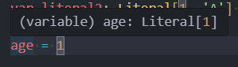

作用：约束变量**值**的类型**可以是 `T1，T2，...` 等多种字面量类型之一**。

> 注意：`Literal` 字面量类型**不支持** `float` 类型定义。

- 原始数据变量：定义变量值必须是 `Literal` 字面量类型之一

  ```python
  var_literal: Literal['A'] = 'A'
  var_literal2: Literal[1, 'Hello World'] = 1
  var_literal3: Literal['Hello', 'World', 'Gemini'] = 'Gemini'
  ```

  定义字面量类型之后，赋值时会有对应的 IDE 提示：

  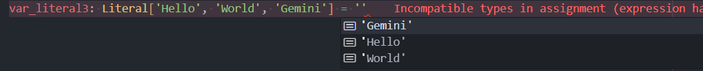

- 容器数据变量：定义容器内的元素值必须是 `Literal` 字面量类型之一

  ```python
  list_of_literal: List[Literal['A', 'B', 'C']] = ['A']
  tuple_of_literal: Tuple[Literal['A', 'B', 'C'], Literal['D', 'E']] = ('A', 'D')
  ```

  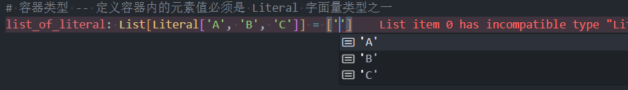

###### Callable[[T1,...],P] 函数类型

语法：

```python
from typing import Callable

function_var: Callable[[T1,T2,...],P]
```

描述：

- **`[T1,T2,...]`：函数形参的个数、值类型**
- **`P`：函数返回值类型**

写法：

- **无参无返回值**函数：

  ```python
  def func():
      print('func')
  
  function_var: Callable = func
  
  function_var()  # func
  ```

- **无参有返回值**函数：**形参类型位置设置为 `...`**

  ```python
  def func2() -> str: return 'func2'
  
  function_var2: Callable[..., str] = func2
  print(function_var2())  # func2
  ```

- **有参无返回值**函数：

  ```python
  def func3(a, b) -> None:
      print(a, b)
  
  function_var3: Callable[[int, str], None] = func3
  function_var3(1, 'a')  # 1a
  ```

- **有参有返回值**函数：

  ```python
  def func4(a, b) -> int: return a + b
  
  function_var4: Callable[[int, int], int] = func4
  print(function_var4(5, 8))  # 13
  ```

- **作为参数**传递给其他函数：

  ```python
  def executor(func: Callable[[int, int], int]) -> int:
      return func(5, 3)
  
  result = executor(lambda a, b: a + b)  # 8
  ```

- **作为返回值**传递给外部：

  ```python
  def executor2() -> Callable[[int, int], int]:
      return lambda a, b: a + b
  
  result = executor2()(5, 3)  # 8
  print(result)
  ```

###### Type[T] 类本身

作用：定义变量**值**的类型**必须是某个具体的 `T `类本身**。关键字是**`type` 元类**。这是一种**多态**行为。

它有 3 种写法：

- **`Type`**：表示变量**值**必须为**一个类本身**

  ```python
  class Person:
      pass
  
  person: Type = Person
  ```

- **`type`**：表示变量**值**必须为**一个类本身**

  ```python
  class Student:
      pass
  
  student: type = Student
  ```

- **`Type[T1 | T2,...]`**：表示变量**值**必须是**`T1、T2,..` 之一的类本身**

  ```python
  class Person:
      pass
  
  class Student:
      pass
  
  class Worker:
      pass
  
  worker: Type[Worker] = Worker
  some_class_type: Type[Worker | Person | Student] = Worker
  ```

  ```python
  class Person:
      @staticmethod
      def speak(name):
          print(f'我叫{name}, 我是一个老师')
  
  class Student:
      @staticmethod
      def speak(name):
          print(f'我叫{name}, 我是一个学生')
  
  class Worker:
      @staticmethod
      def speak(name):
          print(f'我叫{name}, 我是一个职场人')
  
  
  # 多态函数，接收指定的类，并返回一个类实例
  def instance_speak(cls: Type[Worker | Person | Student], name):
      return cls.speak(name)
  
  instance_speak(Person, '张三')  # 我叫张三, 我是一个老师
  instance_speak(Student, '李四')  # 我叫李四, 我是一个学生
  instance_speak(Worker, '王五')  # 我叫王五, 我是一个职场人
  ```

##### 修饰/限定类型

###### Final[T] 常量

作用：将变量修饰为**真正的常量**，且**常量值必须是 `T` 类型**。

描述：Python **常量命名约定全大写**是**软约束**，而 **`Final` 是强约束**，一旦修改值就会报错。

```python
# 全大写命名规范：软约束，还是可以修改值的
MAX_SIZE = 1
MAX_SIZE = 'aaa' # 不会报错

# Final 强约束
MAX_NUM: Final[int] = 2
MAX_NAME: Final[str] = 'name'
```

###### Union[T1,T2,..] 联合类型

描述：表示**即可以是...，又可以是....** 的类型。

作用：可以让变量**值**类型是 **`T1、T2,....` 等多种类型之一**。

> 注意：Tuple 元组类型**不支持**定义 Union 联合类型。

它有 2 种写法：

- **`Union[T1,T2,...]`**：

  ```python
  # 基本数据类型
  union_of_str_int: Union[str, int] = 'str'
  union_of_str_int2: Union[str, int] = 1
  
  # 配合容器 (不支持元组定义)
  # list 列表
  list_of_union: List[Union[str, int]] = ['a', 1, 2, 'b', 3, 4]
  
  # set 集合
  set_of_union: Set[Union[str, int]] = {'a', 1, 2, 'b', 3, 4}
  
  # dict 字典
  dict_of_union: Dict[str, Union[str, int]] = {'a': 'a', 'b': 1}
  ```

- **`T1 | T2,...`**：

  ```python
  # 基本数据类型
  union_of_str_int_float: str | int | float = 1
  union_of_str_int_float2: str | int | float = 'a'
  union_of_str_int_float3: str | int | float = 1.1
  
  # 配合容器 (不支持元组定义)
  # list 列表
  list_of_union2: list[str | int] = ['a', 1, 2, 'b', 3, 4]
  
  # set 集合
  set_of_union2: set[str | int] = {'a', 1, 2, 'b', 3, 4}
  
  # dict 字典
  dict_of_union2: dict[str, str | int] = {'a': 'a', 'b': 1}
  ```

###### Optional[T] 可选类型

作用：约定**变量值类型可以是 `T` 类型 或者 None** 二选一。

```python
from typing import Optional

# 等价写法
# Optional[int]   # 表示 int 或 None
# Union[int, None]  # 完全相同
# int | None        # Python 3.10+ 推荐写法

optional_str: Optional[str] = 'str'
optional_none: Optional[str] = None

# Optional: 可以是类型或 None
def find_user(user_id: int) -> Optional[str]:
    if user_id == 1:
        return "Alice"
    return None
```

##### 类型别名

描述：**当一个类型的声明编写很繁杂且复用性很高的时候，可以使用类型别名创建一个该类型的引用，给其它变量进行复用**。

语法：

- 采用 **`驼峰式命名变量 = <类型>`** 的形式定义一个类型别名

```python
UserId = int
UserName = str

UserInfo = Dict[str, str | int | tuple[str, ...]]
# key 键为 str，value 值为 str | int | tuple[str,...]


def get_user_info(id: UserId, name: UserName) -> UserInfo:
    return {'id': id, 'name': name, 'age': 18, 'hobbies': ('读书', '写作业')}


user_1: UserInfo = get_user_info(1058, '张三')
print(user_1)
# {'id': 1058, 'name': '张三', 'age': 18, 'hobbies': ('读书', '写作业')}
```

##### 泛型

泛型，字面意思是（广泛的类型），它允许你**在定义函数、类的时候，不预先指定函数参数、类属性具体的类型，而是使用一个或多个**类型占位符**（通常用 `<T>`、`<E>`、`<K,V>` 等表示），最后在使用的时候再传递指定类型的一种特性。**

简单来说：泛型就是**为了帮助构建一个具有灵活性，根据外部传入的类型 T 来构造多种任意类型的函数、接口、类，使得同一个函数、接口、类可具备多种类型的处理**，十分强大，且类型安全。

泛型（Generics）是**允许同一个值接收不同类型的一种模板**。相比于使用 Any 类型，使用泛型来创建可复用的组件要更好。

在Python 3.12 之前，泛型需要两个类型来辅助使用：**`TypeVar`** 和 **`Generic`**。

###### TypeVar 泛型变量

由于 Python 3.12之前，本身**不支持**直接在**类型中写 `T`、`K`、`P` 之类表示泛型变量的占位符**。所以需要***借助 `TypeVar` 来显式定义一个泛型占位符**给其他类型使用。

特性：`TypeVar` 本身是一个**函数**，**接收一个泛型占位符的名称**，返回一个**具体泛型占位符变量**给其他类型使用。

语法：

- **任意类型**的泛型：

  ```python
  from typing import TypeVar
  
  T = TypeVar('T')
  
  # 注意：T 与 TypeVar('T') 两者名称必须保持一致！
  ```

- **带约束的泛型**，只能是**其中之一**：

  ```python
  from typing import TypeVar
  
  T = TypeVar('T', int, float) # T 只能是 int 或 float 类型
  ```

通过 `TypeVar()` 函数创建的 `T` 泛型占位符便可以在其他类型中使用表示泛型的功能。

简单使用：

```python
T = TypeVar('T')  # 可以是任意类型
P = TypeVar('P', int, float)  # 只能是 int 或 float 类型

# 泛型函数，接收一个泛型形参，并原样返回
def identity(x: T) -> T:
    return x

print(identity(42))     # 返回 42
print(identity("hello"))  # 返回 hello
print(identity([1, 2, 3]))  # 返回 list[int]


# 泛型函数，只能接受 int/floaat 类型形参，并返回 int/floaat 类型
def add(x: P, y: P) -> P:
    return x + y

print(add(1, 2))  # 返回 3
print(add(1.5, 2.5))  # 返回 4.0
# print(add('a', 'b'))  # 报错，类型不匹配


# 泛型函数，接收任何类型的 List 列表，并返回该列表中的某个元素
def get_list_item(lst: List[T]) -> T: # T 为 str ==> (lst: List[str]) -> str:
    return lst[0]

print(get_list_item(['A', 1, 2, 5]))  # 返回 'A'
print(get_list_item(['a', 'b', 'c']))  # 返回 'a'


K = TypeVar('K')  # 键
V = TypeVar('V')  # 值

# 泛型函数，接收一个字典，并返回它的某个值
# K 为 str, V 为 str => (d: Dict[str,str],key:str) -> str: 
def get_dict_value(d: Dict[K, V], key: K) -> V:
    return d[key]

print(get_dict_value({'name': 'jack'}, 'name'))  # jack
```

###### Generic[T,U,...] 泛型类

描述：用于给**类定义**，可**在类中任意地方使用**；

作用：当类**调用方法**时，**约束传入的值类型**。

语法：

```python
class <类名>(T,U,...):
```

示例：

```python
# 等价于:
# class Box(T):
#     def __init__(self, value: T):
#         self.value = value

class Box(Generic[T]):
    def __init__(self, value: T):
        self.value = value

    def get_value(self) -> T:
        return self.value

box = Box(10)
print(box.value)  # 10

print(box.get_value())  # 10
```

###### 3.12+ 新版本写法

Python 的 3.12+ 版本已**不需要 `TypeVar` 和 `Generic` 类型**，默认**支持 `T`、`K`、`P`...之类的泛型占位符**写法。

- 泛型函数：

  ```python
  def first[T](items: list[T]) -> T:
      return items[0]
  
  
  print(first[int]([0]))
  ```

- 泛型类：

  ```python
  class Box[T]:
      def __init__(self, value: T):
          self.value = value
      
      def get(self) -> T:
          return self.value
  ```

#### 运行时类型检查会被忽略

Python 的创始人 Guido van Rossum 在引入类型注解（PEP 484）时，明确了它的定位：**类型注解对 Python 解释器没有任何影响。**

不同于 TS、Java 这些强类型语言会在代码编写、运行时进行类型检查，**Python 解释器在运行时（Runtime）会完全忽略类型注解**。

因为 Python 引入的类型注解语法只是一个**约定建议**，**不是强制**：

> 也就是说，Python 引入的类型注解就**跟它的常量一样**，只是**约定建议**，语言本身并不强制要求。
>
> 核心目的：只是为了**提高代码可读性**而已。
>
> > 解决方案：如果需要类型检查，需采用**第三方静态类型检查工具**。

```python
var_1: int = 'd' # 这是完全能通过的，代码运行也不会报错

def my_function_str(name: str) -> str:
    return 123
```

> Python 解释器的处理逻辑如下：
>
> 1. 看到 `var_1`。
> 2. 忽略中间的 `: int`。
> 3. 执行 `var_1 = 'd'`，即在内存中创建一个字符串 `'d'`，并将标签 `var_1` 贴上去。
> 4. **过程完全合法**，所以不会报错。

##### 为什么这么设计？

Python 坚持 **“运行时动态性”**。如果强制要求类型注解生效，Python 就会变成一门静态语言（如 Java 或 C++），这会破坏它引以为傲的灵活性和简洁性。

类型注解的真正目标群体不是 **Python 解释器**，而是 **开发者** 和 **开发工具**。

#### 静态类型检查工具

在代码不运行的情况下，通过第三方依赖包对 Python 项目中的 `.py` 模块进行全量类型检查工作，**通过工具扫描源代码来发现潜在的类型错误**。

- 常用依赖包：`mypy`、`pyright`、`pyre`

##### mypy 依赖包

通过 `pip` 下载到本地项目中：

```bash
pip install mypy
```

- 工作流：
  - 编写带有类型注解的代码
  - 运行命令 **`mypy script.py`**
  - 如果有类型冲突（比如把字符串传给了要求 `int` 的函数），工具会直接报错

##### Mypy Type Checker 插件

由于 Cursor 编辑器本身是不会对 Python 的类型注解做静态类型检查的。所以需要手动安装 `Mypy Type Checker` 扩展插件。

- `Mypy Type Checker` 插件内部是基于 `mypy`依赖包扩展的，相当于解放了我们的双手，由手动执行命令进行检查变成了由 **IDE 自动进行类型检查**

该插件需要配合 `Error Lens` 插件结合使用才有及时预览类型检查错误的效果。

##### Error Lens 插件

作用：该插件用于及时在行内报错。

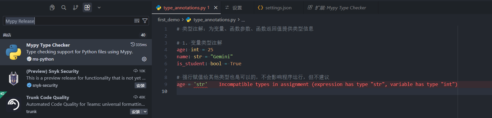

### 类型转换

在 Python 中，类型转换是一种非常频繁的操作手段，它允许我们**将一种数据类型转换为另一种**，以满足计算或逻辑的需求。

Python 的类型转换分为两大类：**隐式转换（自动）** 和 **显式转换（手动）**。

#### 隐式类型转换

在 Python 中，**隐式类型转换（Implicit Type Conversion）**又被称为 **自动类型提升**。

Python 是一种**动态强类型**语言（类似于 TypeScript，在**运行时**赋予类型，且保证了类型系统的安全），这意味着它不会像 JavaScript 一样会进行一些模糊的隐式转换（1 + '1' = '11'，这在 Python 中会报错）。

Python 的隐式类型转换只发生在 **数值运算** 或 **逻辑判断** 等极少数保证安全的场景中，是指**当不同数据类型之间进行运算时**，Python 解释器**为了防止数据精度丢失**，会**自动将一种数据类型提升**成**另一种更 “高级” 、“宽容” 的类型**，这个过程是**自动隐式发生**的，不需要额外编写代码。

核心要点：隐式转换是 Python 的**内置保护机制**，主要发生在数值类型的混合运算中，它保证了运算结果向更精确的**数据类型对齐**。

##### 核心规则

Python 类型提升的基本原则是 **小范围向大范围提升**。为了确保数值计算的准确性，Python 会自动将**“精度较低”**的数据类型**提升**为**“精度较高”**的数据类型。

提升方向：**`bool` -> `int` -> `float` -> `comlex`** 【从低到高】

##### 数值运算的类型自动提升

常见于整数与浮点数运算：

> Python 会**将整数提升为浮点数** ，然后**再与其他浮点数进行计算**，最终**返回**的是**浮点数类型之间的计算结果** `10.0 + 1.5 = 11.5`，从而保证结果的**小数精度不丢失**。

```python
# 整数与浮点数运算
int_a = 10
float_b = 1.5
result = int_a + float_b # 先将 int_a 提升为 浮点数 10.0，再与 float_b 相加
print(result, type(result))  # 11.5 <class 'float'>
```

##### 布尔值计算的类型自动提升

在 Python 中，**`bool` 类型实质上是 `int` 类型中 `0、1` 的子类**，这意味着 **`True` 在数学运算中被视为 `1`，而`False` 则被视为 `0`**。

也就是说，在将 `bool` 布尔值与 `int`、`float` 数值类型一起运算时，会被当做 `1 0`来计算处理。

```python
bool_x = True # 相当于 1
float_y = 1.5

print(True == 1, False == 0)  # True True
print(bool_x * float_y)  # 1 * 1.5 = 1.5
print(False * 10)  # 0 * 10 = 0
print(True + 1)  # 1 + 1 = 2
```

> **提示**：虽然这在语法上是合法的，但在实际工程中应尽量避免，因为这会降低代码的可读性。

##### 逻辑判断中的隐式转换

在使用 **`if` 或 `while` 判断语句**时，Python 内部会**自动调用 `bool()` 类型包装函数**，将**`if()`、`while()` 传入的判断条件强制转为 `bool` 布尔值类型**，再**进行 `1 0`的简单判断**。

而 `if()` 和 `while()` 判断语句可以传入任何值，**不同值根据计算结果会分别转换为 `True` 、`False`**，如下表：

| 自动转为 `True` 的值                             | 自动转为 `False` 的值 |
| ------------------------------------------------ | --------------------- |
| **`0`、`0.0`、`0j`**                             | **非 0 数字**         |
| **`""` 空字符串**                                | **非空字符串**        |
| **`None` 空值**                                  | **所有对象实例**      |
| **`[]`空列表、`()`、`{}`空字典、`set{}` 空集合** | **非空容器**          |

```python
# 以下 if 代码块永远不会执行，都会隐式转换为 False
if 0:
    print('0')
if False:
    print('False')
if 0.0:
    print('0.0')
if None:
    print('None')
if "":
    print('""')
if []:
    print('[]')
if set[Any]():  # [Any] 泛型：表示接收任何值
    print('set{}')
```

```python
# 以下代码块一直会执行，都会隐式转换为 True
if True:
    print('True')  # True
if 1:
    print('1')  # 1
if "hello":
    print('hello')
if [1, 2, 3]:
    print([1, 2, 3])
if {name: 'jack'}:
    print({name: 'jack'})
```

##### 为什么字符串不会隐式转换？

这是为了防止逻辑错误。对比以下行为：

- **JavaScript**: `1 + "1" = "11"` (隐式将数字转字符串)

- **Python**: `1 + "1"` -> **抛出 `TypeError`**

  ```python
  num = 10
  string = "20"
  
  # print(num + string)  # 这会抛出 TypeError，Python 不知道你是想做数学加法还是字符串拼接
  ```

Python 要求你必须进行**显式转换**（例如 `num + int(string)`），因为Python 坚持 **“显式优于隐式” (Explicit is better than implicit)**。如果解释器不确定你是想做加法还是想做字符串拼接，它会选择报错，强制要求你手动转换类型。

#### 显式类型转换

> 注：在使用显式转换时，建议始终配合 **`try...except` 结构**，尤其是处理用户输入时，以防止因为格式不规范导致程序崩溃。

Python 提供了一系列与**已支持类型同名**的**类型包装函数**，用于 **“强制类型转换”**。如下：

##### 强转为数值类型

###### int(x)

作用：强制将 `x` 参数**转为 `int` 整数类型**。

范围：支持 **`int`、`bool`、`float`、`str('number')`** 类型之间的转换。

- 当 `int()` 传入的是 **`float` 类型**时，会**自动截断小数点之后的数字**，返回一个**整数**

```python
int_a = int(3.17) # 3
int_b = int(True) # 1
int_c = int(False) # 0
int_d = int(0000) # 0
int_e = int('123') # 123
```

- 字符串转数字：

  ```python
  # int("abc")  # 报错：ValueError
  # int("3.14") # 报错：不能直接把带小数点的字符串转 int
  int(float("3.14")) # 正确：先转 float，再转 int
  ```

###### float(x)

作用：强制将 `x` 参数**转为 `float` 浮点数类型**。

范围：支持 **`int`、`bool`、`float`、`str`** 类型之间的转换。

```python
float_a = float(3.17) # 3.17
float_b = float(True) # 1.0
float_c = float(False) # 0.0
float_d = float(10) # 10.0
float_d = float('10.5') # 10.5
```

###### bool(x)

作用：根据 `x` 的值强制**转为 `bool` 布尔值类型 `True | False`**。

范围：支持**任意类型**的值转换。会根据**值的内容**转为 **`True | False`**。

```python
# 转为 True
bool_a = bool(1)
bool_c = bool(1.0)
bool_e = bool(True)
bool_h = bool("123")
bool_k = bool([1,2,3])
bool_m = bool({ name: 'Jack' })


# 转为 False
bool_b = bool(0)
bool_d = bool(0.0)
bool_f = bool(False)
bool_g = bool("")
bool_i = bool(None)
bool_j = bool([])
bool_l = bool({})
bool_n = bool(set())
```

> **非零即为 True**：在 `bool()` 转换中，只有极少数对象会被转为 `False`：
>
> - 数字 `0`, `0.0`
> - 空容器 `[]`, `()`, `{}`, `set{}`, `""`
> - `None`
> - **除此之外的所有对象（包括负数）都是 `True`。**

##### 强转为序列/容器类型

###### str(x)

作用：强制将 `x` 参数**转为 `str` 字符串类型**。

> [!NOTE]
>
> 注意：字符串本质上是一个**字符序列**，就像 `list` 列表一样，只不过 **`str` 类型规定序列成员只能是字符**。

```python
str_a = str(10) # 10
str_b = str(1.58) # 1.58 
str_c = str(True) # True
str_d = str(False) # False
str_l = str(None) # None

str_e = str([]) # []
str_f = str({}) # {}
str_g = str([1, 2, 3]) # [1,2,3]
```

###### bytes(x) | bytearray(x)

作用：将 `x` 参数转为 `bytes` 二进制字节串。

注意：`x`参数必须是 Unicode 编码的数值。

```python
b_1 = bytes([97, 98, 99])
b_1 = bytearray([97, 98, 99])

print(b_1) # b"abc"
```

###### list(x)

作用：`list()` 除了用来**构造一个列表**之外，还可以**将 `x` 可迭代对象强转为列表**。

不同类型有不同的存储形式：

- **`str` 字符串：遍历字符串，逐个拆解为字符，依次存储**
- **`range()`数值范围：遍历数值范围，将产生的数字，依次存储**
- **`tuple` 元组：遍历元组元素，逐个存储**
- **`set` 集合：遍历出集合的 `key` 键，逐个存储**
- **`dict` 字典：遍历字典的 `key`键，逐个存储**

```python
# str 字符串
res = list("Python")
print(res)  # ['P', 'y', 't', 'h', 'o', 'n']

# range() 数值范围
res_1 = list(range(10))
print(res_1)  # [0, 1, 2, 3, 4, 5, 6, 7, 8, 9]

# set 集合
res_2 = list({'A', 1, 3, 'B', (99, 98)})
print(res_2)  # [1, 'B', 3, 'A', (99, 98)]

# dict 字典
res_3 = list({'name': 'jack', 'age': 18, 'gender': 'male'})
print(res_3)  # ['name', 'age', 'gender']

# tuple 元组
res_4 = list((1, 2, 3, 4, 5))
print(res_4)  # [1, 2, 3, 4, 5]
```

###### tuple(x)

作用：`tuple()` 除了用来**构造一个元组**之外，还可以**将 `x` 可迭代对象强转为元素**。

不同类型有不同的存储形式：

- **`str` 字符串：遍历字符串，逐个拆解为字符，依次存储**
- **`range()`数值范围：遍历数值范围，将产生的数字，依次存储**
- **`list` 列表：遍历列表元素，逐个存储**
- **`set` 集合：遍历出集合的 `key` 键，逐个存储**
- **`dict` 字典：遍历字典的 `key`键，逐个存储**

```python
# str 字符串
res_5 = tuple("Python")
print(res_5)  # ('P', 'y', 't', 'h', 'o', 'n')

# range() 数值范围
res_6 = tuple(range(10))
print(res_6)  # (0, 1, 2, 3, 4, 5, 6, 7, 8, 9)

# set 集合
res_7 = tuple({'A', 1, 3, 'B', (99, 98)})
print(res_7)  # (1, 'B', 3, 'A', (99, 98))

# dict 字典
res_8 = tuple({'name': 'jack', 'age': 18, 'gender': 'male'})
print(res_8)  # ('name', 'age', 'gender')

# list 列表
res_9 = tuple([1, 2, 3, 4, 5])
print(res_9)  # (1, 2, 3, 4, 5)
```

###### set(x)

作用：`set()` 除了用来**构造一个集合**之外，还可以**将 `x` 可迭代对象强转为集合，并自动去重**。

不同类型有不同的存储形式：

- **`str` 字符串：遍历字符串，逐个拆解为字符，依次存储**
- **`range()`数值范围：遍历数值范围，将产生的数字，依次存储**
- **`list` 列表：遍历列表元素，逐个存储**
- **`tuple` 元组：遍历元组元素，逐个存储**
- **`dict` 字典：遍历字典的 `key`键，逐个存储**

```python
# str 字符串
res_10 = set("JavaScript")
print(res_10)  # {'r', 't', 'c', 'p', 'J', 'i', 'a', 'S', 'v'}

# range 数值范围
res_11 = set(range(10))
print(res_11)  # {0, 1, 2, 3, 4, 5, 6, 7, 8, 9}

# list 列表
res_12 = set([1, 1, 2, 2, 3, 3, 4, 4])
print(res_12)  # {1, 2, 3, 4}

# tuple 元组
res_13 = set((1, 1, 2, 2, 3, 3, 4, 4))
print(res_13)  # {1, 2, 3, 4}

# dict 字典
res_14 = set({'name': 'jack', 'age': 18, 'gender': 'male', 'gender': 'males'})
print(res_14)  # {'name', 'age', 'gender'}
```

###### dict([(key,value)...])

作用：**传入一个可迭代的元组列表，且列表中每个元组长度必须是 2 个，分别代表 `key` 键和 `value`值的映射关系存储到字典中**

> Python 会**逐个迭代每个元组元素**，并分别取出**元组第一个参数代表 `key`，第二个参数代表 `value`**，来**批量构造**多组映射关系。

```python
# 传入一个可迭代的元组列表对象，列表中每个元组元素必须是键值对的映射关系
dict_4 = dict([('name', 'jerry'), ('age', 22), ('gender', True)])

print(dict_4)  # {'name': 'jerry', 'age': 22, 'gender': True}
```

##### 进制转换

在 Python 中，进制转换是非常直观且方便的。

主要分为两个方向：

- **其他进制 => 十进制 （输入）**
- **十进制 => 其他进制（输出）**

###### 其他进制 => 十进制

Python 识别特定前缀的数字，并**自动将其处理为十进制整数**。

| **进制**     | **前缀**     | **示例** | **结果** |
| ------------ | ------------ | -------- | -------- |
| **二进制**   | `0b` 或 `0B` | `0b1010` | 10       |
| **八进制**   | `0o` 或 `0O` | `0o12`   | 10       |
| **十六进制** | `0x` 或 `0X` | `0xA`    | 10       |

```python
print(0b1010)  # 二进制 输出转 十进制 10
print(0o12)  # 八进制 输出转 十进制 10
print(0xA)  # 十六进制 输出转 十进制 10
```

###### 十进制 => 其他进制

- **`bin(number)`**：将**十进制 `number` 参数转为二进制**
- **`oct(number)`**：将**十进制 `number` 参数转为二进制**
- **`hex(number)`**：将**十进制 `number` 参数转为二进制**

```python
# 强制转换
print(bin(10))  # 0b1010
print(oct(10))  # 0o12
print(hex(10))  # 0xa
```

### 类型检查函数

在代码执行过程中，通过 **`type()`** 、 **`isinstance()`**  和 **`issubclass()`**内置函数判断变量当前“长什么样”，“是谁的实例/子类”。

#### type(x) 输出类型字符串

作用：严格判断类型，并**输出 `x` 参数的类型字符串**，但**不考虑继承关系**。

返回结果：**`<class [类型]>`**

语法：

```python
type(<值>) # <class [值的类型]>
```

示例：

```python
print(type(1))  # <class 'int'>
print(type(1.0))  # <class 'float'>
print(type(True))  # <class 'bool'>
print(type(None))  # <class 'NoneType'>
print(type(''))  # <class 'str'>
print(type([]))  # <class 'list'>
print(type({}))  # <class 'dict'>
print(type(()))  # <class 'tuple'>
print(type(set()))  # <class 'set'>
```

#### isinstance(x, X..) 判断类实例

作用：**判断 `x` 参数是否是 `X` 类或其子类的实例**。

语法：

- **`isinstance(<x>, X)`**：判断 **`<x>`值是否是 `X`类或其子类的实例**

  ```python
  # isinstance(x, type) 检查 x 是否是 type 类型，考虑继承关系
  print(isinstance(1, int))  # True
  print(isinstance(1, float))  # False
  print(isinstance(1.0, float))  # True
  print(isinstance(True, bool))  # True
  print(isinstance('hello', str))  # True
  print(isinstance([], list))  # True
  print(isinstance({}, dict))  # True
  print(isinstance((), tuple))  # True
  print(isinstance(set(), set))  # True
  ```

- **`isinstance(<x>, (X类, Y类...))`**：判断 **`<x>`值是否是 X类 或 Y类... 或其子类的实例**

  ```python
  class Person:
      def __init__(self) -> None:
          pass
  
  person = Person()
  
  print(isinstance(person, Person))  # True 判断 person 是否是 Person 的实例
  
  
  class Student(Person):
      def __init__(self) -> None:
          super().__init__()
  
  
  student = Student()
  
  print(isinstance(student, (Person)))  # True 判断 student 是否是 Person类或其子类的实例
  print(isinstance(student, (Student)))  # True 判断 student 是否是 Student 类或其子类的实例
  # True 判断 student 是否是 Person 或 Student 类或其子类的实例
  print(isinstance(student, (list, Student)))
  ```

#### issubclass(A,B) 判断子类

作用：**判断 `A` 类是否是 `B` 类的子类**。【 is-a 关系】 => A is a B ?

```python
class Person:
    pass

class Student(Person):
    pass

print(issubclass(Student, Person))  # True
print(issubclass(Person, Student))  # False
```


## 运算符

### 算术运算符

| **运算符** | **名称**   | **描述**                         | **示例**          |
| ---------- | ---------- | -------------------------------- | ----------------- |
| `+`        | **加**     | 两个对象相加                     | `1 + 2` -> `3`    |
| `-`        | **减**     | 得到负数或两个数相减             | `5 - 2` -> `3`    |
| `*`        | **乘**     | 两个数相乘或重复字符串           | `3 * 4` -> `12`   |
| `/`        | **真除法** | 结果总是**浮点数**               | `10 / 2` -> `5.0` |
| `//`       | **地板除** | 返回商的**整数部分**（向下取整） | `10 // 3` -> `3`  |
| `%`        | **取模**   | 返回除法的**余数**               | `10 % 3` -> `1`   |
| `**`       | **幂**     | 返回 x 的 y 次幂                 | `2 ** 3` -> `8`   |

注：**只要有浮点数参与运算，结果通常就是浮点数**；且 **`/` 除法永远返回浮点数**。

#### // 地板除

作用：**先得到 `x / y` 的计算结果，再对计算结果向下取整**。

示例：

- `10 / 3 = 3.3333`，向下取整，得到结果 `3`
- `60 / 5.5 = 10.909...`，向下取整，得到结果 `10.0`

核心要点：根据 `x | y` 的类型，**若有 `float` 数值参与计算，则返回结果一定是 `float`浮点数，否则为 `int` 整数**。

```python
float_res = 60 // 5.5 # 先计算 60 / 5.5 = 10.909..，再对 10.909... 向下取整，得到结果 10.0
```

##### 与 / 的区别

在 Python 中，**`/` 和 `//` 都是除法的两种形态**，区别在于：

- **`/`：无论是否能被整除，返回的一定是 `float`**

  ```python
  print(10 / 2) # 5.0
  ```

- **`//`**：它会**朝负无穷方向取整**。

  - `7 // 2` 结果是 `3`

  - `-7 // 2` 结果是 `-4`（注意这里，不是 `-3`）

    > 计算过程： **`-7 / 2 = -3.5`，向下取整，由于 `-4`比 `-3` 更小，所以得到的结果是 `-4`**

#### % 取模

作用：返回**除法的余数**。

核心要点：**就是看数字能不能被整除，能被整除就返回 0 ，不能被整除就返回除不尽的余数**。

示例：

- `10 / 3 = 3，还剩下 1 除不下，余数就是 1`
- `10 / 2 = 5，没有余数，余数就是 0`

```python
int_a = 10 % 3 # 1
int_b = 10 % 2 # 0
int_c = 10 % 5 # 0
```

#### ** 幂次方

作用：返回 **返回 x 的 y 次幂**。即 **`x * y 次数` 的值**。

```python
int_a = 2 ** 3 # 计算 2 的 3 次方 （2 * 2 * 2）= 8
int_b = 3 ** 2 # 计算 3 的 2 次方 （3 * 3） = 9
int_c = 3 ** 3 # 计算 3 的 3 次方 （3 * 3 * 3） = 27
```

#### 优先级顺序

Python 遵循标准的数学优先级规则：

1. **括号** `()`
2. **幂运算** `**`
3. **乘、除、地板除、取模** `*`, `/`, `//`, `%`
4. **加、减** `+`, `-`

总结：**`()` > `**` > `* / // %` > `+ -`**。

> **提示**：如果不确定优先级，多写括号 `()` 永远是最安全的做法，还能增加代码可读性。

#### 跨界用法

在 Python 中，支持某些算术运算符使用在非数值类型中，以优雅的方式完成某些操作：

##### + * 字符串拼接与重复

```python
print("I" + "am" + "Jack")

print("I" * 10)  # IIIIIIIIII
print("I" * 10 + "Jack")  # IIIIIIIIIIJack
```

##### + 列表合并

通过 `+` 可以让多个列表合并。

```python
list_a = [1, 2]
list_b = [3, 4]
print(list_a + list_b)  # [1, 2, 3, 4]
```

### 复合赋值运算符

**复合赋值运算符（Compound Assignment Operators）** 是**算术运算符与赋值符号 `=` 的结合**。

它的核心作用是：**简化代码**。当你需要对一个变量进行运算并将结果重新存回该变量时，它能让你少写一次变量名。

如下：

| **运算符** | **完整等价形式** | **含义**                 |
| ---------- | ---------------- | ------------------------ |
| `x += y`   | `x = x + y`      | 加后赋值                 |
| `x -= y`   | `x = x - y`      | 减后赋值                 |
| `x *= y`   | `x = x * y`      | 乘后赋值                 |
| `x /= y`   | `x = x / y`      | 除后赋值（结果为浮点数） |
| `x //= y`  | `x = x // y`     | 地板除后赋值             |
| `x %= y`   | `x = x % y`      | 取模后赋值               |
| `x **= y`  | `x = x ** y`     | 幂运算后赋值             |

- 运算逻辑：复合赋值运算符右侧的所有内容会被视为**一个整体**先进行计算，然后再与左侧变量运算。

  ```python
  x = 10
  y = 2
  x *= y + 3  # 相当于 x = x * (y + 3)，结果是 50
              # 而不是 x = x * y + 3 (结果 23)
  ```

> [!NOTE]
>
> **注意**：Python 中**没有** `x++` 或 `x--` 这种自增自减运算符。如果你想让变量加 1，必须写 `x += 1`。

#### 跨界用法

和标准算术运算符一样，复合赋值也可以用于字符串和列表：

##### += 字符串拼接

```python
msg = "Hello"
msg += " World" # msg 变为 "Hello World"
```

##### += 列表追加

```python
items = [1, 2]
items += [3, 4] # items 变为 [1, 2, 3, 4]
```

### 比较运算符

在 Python 中，**比较运算符（Comparison Operators）** 用于比较两个值，其运算结果始终是一个**布尔值**：`True | False`。

它们是编写条件判断（`if`）和循环（`while`）逻辑的基础。

| **运算符** | **名称**     | **说明**                       | **示例**           | 底层实现方法                    |
| ---------- | ------------ | ------------------------------ | ------------------ | ------------------------------- |
| `==`       | **等于**     | 检查左右两边的值是否**相等**   | `5 == 5` -> `True` | **`__eq__` (Equal)**            |
| `!=`       | **不等于**   | 检查左右两边的值是否**不相等** | `5 != 3` -> `True` | **`__ne__` (Not Equal)**        |
| `>`        | **大于**     | 左边是否**大于**右边           | `5 > 3` -> `True`  | **`__lt__` (Less Than)**        |
| `<`        | **小于**     | 左边是否**小于**右边           | `2 < 1` -> `False` | **`__le__` (Less or Equal)**    |
| `>=`       | **大于等于** | 左边是否**大于或等于**右边     | `5 >= 5` -> `True` | **`__gt__` (Greater Than)**     |
| `<=`       | **小于等于** | 左边是否**小于或等于**右边     | `4 <= 5` -> `True` | **`__ge__` (Greater or Equal)** |

#### == 相等运算符

作用：比较 **`==` 两边的内容是否一样，不比较内存地址**。（长得是不是一样？）

```python
print('A' == 'A', 'A' == 'a') # True False
```

##### 底层原理 `__eq__` 方法

> Python 的 `__eq__` ≈ Java 的 `equals()` 方法

在 Python 中，`__eq__` 是一个 **魔法方法（Magic Method）**，也叫双下划线方法（Dunder Method）。

核心要点：它定义了**对象在执行 `==`（等于运算符）时内部的具体逻辑**。

- **`__eq__`** 是 Python 的 **`object` 基类的抽象方法**，默认会**被所有类继承**，它默认**用来比较两个对象之间的内存地址**。

  ```python
  class object:
      def __eq__(self, other):
          return self is other  # 默认就是比地址！
  ```

> [!IMPORTANT]
>
> 但是，Python 事先对 **`str`、`int`、`float`、`list`、`bool`...** 等常用类型都**重写了 `__eq__`内置方法**，由**原来的比较内存地址**改为了**比较内容值**。
>
> > 例如 `list` 类型：
> >
> > ```python
> > # 列表的 == 背后逻辑
> > class list(object):
> >     def __eq__(self, other):
> >         if len(self) != len(other):
> >             return False
> >         for i in range(len(self)):
> >             if self[i] != other[i]: # 递归调用元素的 ==
> >                 return False
> >         return True
> > ```
>
> 所以当编写 **`obj1 == obj2`** 时，Python 实际上在执行： **`obj1.__eq__(obj2)`**
>
> - 如果 `obj1` 没有重写 `__eq__`，它会尝试调用 `obj2.__eq__(obj1)`
> - 如果都没有重写，最后会退回到比较内存地址
>
> 而**为了弥补比较内存地址这一全等基础操作**，Python 又提供了 **`is` 关键字**来实现**自定义类实例之间的内存地址比较**。

##### 与 is 的区别

> 等价于 JS 的 **`===` 全等比较运算符**

- **`is` 全等比较**：比较 **`is` 两边的内存地址是否一样，不仅比较内容，还比较内存地址**。（是不是同一个对象？）
  - 核心逻辑：**先比较内存地址，再比较内容**。

```python
list_a = [1, 2, 3]
list_b = [1, 2, 3]

print(list_a == list_b) # True (内容相同)
print(list_a is list_b) # False (在内存中是两个不同的列表)
```

> [!NOTE]
>
> 总结：
>
> - **`is`**：**永远**比较内存地址。
>
> - **`__eq__`**：
>
>   - 在基类 `object` 中：**默认**比较内存地址
>
>   - 在内置类型（str, list...）中：被**改写**成比较内容值
>
>   - 在自定义类中：除非手动重写，否则**继承**自 `object` 的地址比较逻辑

##### 对象之间的 == 比较

在 Python 中，所有的类都默认继承自 `object`。如果**自定义类里没有重写 `__eq__` 方法**，Python 就会**调用 `object.__eq__`**。

- `object.__eq__` 的默认实现逻辑非常简单：它**直接比较内存地址**。

- 可以理解为，对于**没有重写 `__eq__` 方法的自定义类实例之间比较**： **`a == b`  等价于  `a is b`**

```python
class MyClass:
    pass

obj1 = MyClass()
obj2 = MyClass()

# 因为没有定义重写 __eq__ 方法，Python 只能比地址
print(obj1 == obj2)  # False
print(obj1 is obj2)  # False
```

#### 核心细节

##### 字符串的 <> 大小比较

在 Python 中比较字符串时，并不是比较长度，而是比较的是**两边第一个字符的 `Unicode` 编码值（类似字典里的排序）大小。**

- **Unicode 编码集**：将常见的**字符、字母**都转义成**整数**来表示，可以通过 **`ord()` 内置函数查看某个字符的 Unicode 编码数值**

```python
print(ord('A')) # 65 
print(ord('a')) # 97
```

示例：

- `res = 'apple' < 'banana' # True`
  - 内部逻辑：因为首字母 `a` 的 unicode 编码数值是 97，而 `b` 是 98，所以转化为数字比较是 **97 < 98 = True**
- `"Apple" < "apple" #True`（大写字母在 Unicode 中排在小写字母前面）

##### 链式比较

这是 Python 的一个非常优雅的特性。可以像写数学题一样连着写比较：

```python
x = 5
print(1 < x < 10)  # 等价于 (1 < x) and (x < 10)，结果为 True
print(10 > x >= 5) # 结果为 True
```

##### 浮点数的比较陷阱

由于二进制浮点数的**精度问题**，**直接用 `==` 比较两个计算出的浮点数可能不准**。

- `0.1 + 0.2 == 0.3` -> `False`（因为结果其实是 `0.30000000000000004`）

> **建议**：**比较浮点数是否相等**时，通常**判断它们的差值是否小于一个极小的数**，或使用 `math.isclose()`。

### 进制运算

位操作符用于最基本的层次上，即按内存中表示数值的位来操作数值。ECMAScript 中的所有数值都以 IEEE-754 64 位格式存储，但位操作符并不直接操作 64 位的值。而是先将 64 位的值转换成 32 位的整数，然后执行操作，最后再将结果转换回 64 位。

> 但是这种转换的方式会造成一些副效应，即在对特殊的 NaN 和 Infinity 值应用位操作时，这两个值都会被当成 0 处理。

**注意：如果对非数值应用位操作时，会先使用 int() 函数将该值转换为一个数值（自动完成），然后再应用位操作。得到的结果将是一个数值。**

#### 二进制理解

**1字节 = 8 位，也就是说一个数值里面有 8 位 0 1 用来表示数值的二进制值。其中第一位用来表示数值的正负号。**

> 二进制只有 0 1 两个单位组合表示数据。
> 所谓的 32 位，指的就是每个字节的数据是由 32 个 0 1 组成的。

**二进制的换算原则： 满二进一。**

> 也就说 0000 0001 ，当想要再加 1 的时候，就在最后面的 1 变为0 ，然后前面的 0 变成 1 。
> 0000 0001 【数值 1】 //已经不能再 +1 了，只能将 1 的数位前进 1 表示增加值。
> 0000 0010 【数值 2】

如图：

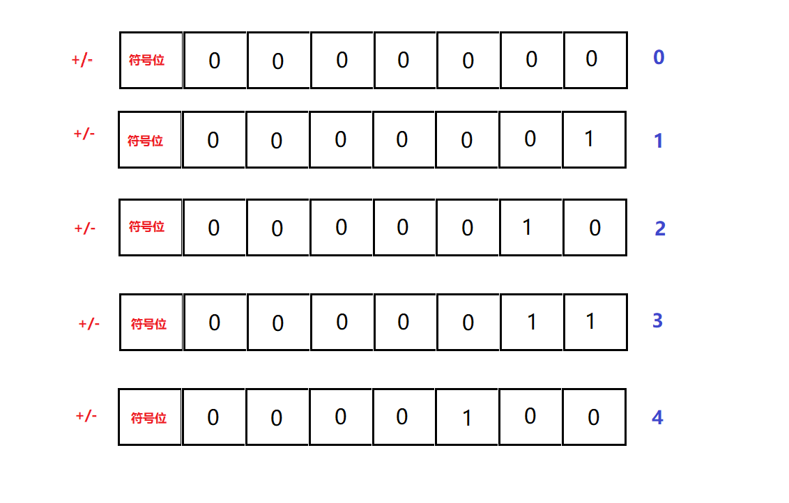

#### 进制运算理解

对于有符号的整数，32 位中的前 31 位用来表示整数的值。第 32 位用来表示数值的符号，**0 表示正数 、 1表示负数。**这个表示符号的位叫做**符号位**，符号位的值决定了其他位数值的格式。其中，正数以纯二进制格式存储，31 位中的每一位都表示 2 的幂。**没有用到的位用 0 填充，即忽略不计**。例如，数值 18 的二进制表示为 0000000000000000000010010 【32 位 0 1】，但是有效的只有最后 5 位，也就是 10010 ，这 5 位数就决定了这串二进制的数值是 18。

负数同样以二进制码存储，但使用的格式是**二进制补码**。

想要计算一个负数的二进制码，首先要经过如下步骤：

1、先求出这个数值的二进制码值。（例如：要求 -18 的二进制码，先求出 18 的二进制码）。

2、将求出的二进制码进行 **反码**，也就是 0 换成 1 ，1 换成 0。

3、将得到的反码值 + 1。【因为 1 表示负数，也就是说将得到的 31 位反码值，最后再加 1 个 1 进去，成为了负数。】

要根据以上 3 个步骤求得 -18 的二进制码，首先要求得 18 的二进制码。即：

```perl
0000 0000 0000 0000 0000 0000 0001 0010

然后，求其二进制反码，也就是 0 和 1 互换【0 -> 1 负数，1 -> 0 正数】

1111 1111 1111 1111 1111 1111 1110 1101

最后，二进制反码 + 1：

1111 1111 1111 1111 1111 1111 1110 1101

                                     1 【这里 满二进一】
————————————————————
1111 1111 1111 1111 1111 1111 1111 1110
```

这样，就取得了 -18 的二进制码 `1111 1111 1111 1111 1111 1111 1111 1110`。

- 注意：在处理有符号的整数时，是不能访问第 31 位的。

表面我们看到的就是这样：

```python
num_1 = 18
print(bin(num_1)) # 0b10010

# 不带 0b 前缀
print(format(num, 'b'))  # 输出: 10010
```

以上操作，都是表面 64 位的正常操作，但是内部是以 32 位执行的，最后再转换回 64 位结果返回。

##### 进制前缀

Python 中还有其他进制前缀：

| 前缀 | 进制     | 示例     | 十进制值 |
| :--- | :------- | :------- | :------- |
| `0b` | 二进制   | `0b1010` | 10       |
| `0o` | 八进制   | `0o12`   | 10       |
| `0x` | 十六进制 | `0xA`    | 10       |

```python
print(0b1010)   # 10
print(0o12)     # 10
print(0xA)      # 10
```

#### 移位运算符

##### << 左移位

左移位操作符使用两个小于号（<<）表示，这个操作符会将数值的所有位向左移动 n 个 位数，且移动的位数用 0 填充。

在向左移位后，原数值的右侧多出了 n 个空位，这些空位会以 0 来填充，以便得到一个完整的 32 位二进制数。

例如：2 << 5，就是 2 的二进制 （10） 后面添加 5 个 0 ，变成 `1000000` 最终得到结果 `64`。

示例：

```python
oldValue = 2 # 二进制 10
newValue = oldValue << 5 # 10 后面填充 5 个 0,成为 100000，十进制的 64。
```

**注意：左移不会影响操作数的符号位。也就是说，操作数是负数，左移结果也是负数。**

- 简单理解【重点】

> **左移位操作其实就是将每次左移所得到的数值等比数列 \*2，左移 n 次 则数值 等比数列\* 2 n次。**
>
> 也就是说，**左移操作最终的结果 = 数值等比数列 \* 2 n左移次数。**
>
> 示例：
>
> | 左移操作 | 等比数列操作                  | 结果 |
> | -------- | ----------------------------- | ---- |
> | 3 << 1   | 3 * 2                         | 6    |
> | 3 << 2   | 3  *2*  2                     | 12   |
> | 3 << 3   | 3  *2*  2 * 2                 | 24   |
> | 3 << 4   | 3  *2*  2  *2*  2             | 48   |
> | 3 << n   | 3  *2*  2  *2 ...*  2 [n次数] | n    |

##### >> 右移位

右移位操作符使用两个大于号（>>）表示，这个操作符会将数值的所有位向**右**移动 n 个 位数，但**保留符号位**。也就是**操作数是负数，右移结果也是负数**。

**右移位的求值结果与左移位的求值结果恰好相反。**

例如：64 >> 5，就是 64 的二进制 （100000） 前面添加 5 个 空位 ，出现的空位由符号位的值填充，相应的舍弃后面的 5 个 位。得到右移结果 2 `10`。

**符号位表示操作数的正负，所以不会影响操作数的值。**

示例：

```python
oldValue = 64 # 二进制 1000000
newValue = oldValue >> 5 # 100000 前面填充 5 个 0,成为 10，十进制的 2。
```

- 简单理解【重点】

> 注意：**右移位操作其实就是将每次左移所得到的数值等比数列 / 2，右移 n 次 则数值等比数列 / 2 n次。**
>
> 也就是说，**右移操作最终的结果 = 数值等比数列 / 2 n右移次数。**
>
> 示例：
>
> | 右移操作 | 等比数列操作                    | 结果 |
> | -------- | ------------------------------- | ---- |
> | 3 >> 1   | 3 / 2 [0.5取整]                 |      |
> | 3 >> 2   | 3 / 2 / 2  [0.75取整]           | 0    |
> | 3 >> 3   | 3 / 2 / 2 / 2   [0.375取整]     | 0    |
> | 3 >> 4   | 3 / 2 / 2 / 2 / 2  [0.1875取整] | 0    |
> | 3 >> n   | 3 / 2 / 2 / 2 ... / 2  [n次数]  | n    |

##### >>> 无符号右移位

无符号右移位由 3 个大于号（>>>） 表示。这个操作符会将数值的所有 32 位都向右移动 n 个空位。

对正数来说，无符号右移的结果与有符号右移的结果相同。

如：

```python
oldValue = 64	# 二进制 1000000
newValue = oldValue >>> 5 # 2，二进制 10
```

但是对于负数来说，情况就不一样了。

首先，**无符号右移是以 0 来填充空位，而非符号位**。所以，对正数来说，无符号右移与有符号右移的求值结果相同，但对负数的结果就不一样了。

其次，无符号右移操作符会将负数的二进制码当成正数的二进制码。而且、由于负数以其绝对值的二进制补码形式显示，导致操作符会将负数的二进制码解析成正数，因此就会导致无符号右移负数后的结果会非常大。

示例：

```python
oldValue = -64 	# 二进制 1111 1111 1111 1111 1111 1111 1100 0000
newValue = oldValue >>> 5 # 134217726
```

这里，当 `-64` 执行无符号右移 5 位的操作后，得到的结果是 `134217726`。之所以结果这么大，是因为 `-64` 的二进制是 `1111 1111 1111 1111 1111 1111 1100 0000`，而无符号右移操作符会将这个二进制码**当成正数**的二进制码，换算成十进制 `4294967232`。如果把这个值右移 5 位，结果就变成了 `0000 0011 1111 1111 1111 1111 1111 1110`，即十进制的 `134217726`。

#### 逻辑运算符

##### ~ 按位非 (NOT)

按位非操作符由一个**波浪线（~）**表示。

作用：**执行按位非的结果就是返回数值的反码，也就是 操作数的负值 - 1。**

例如：

```javascript
num1 = 25; // 二进制 0000 0000 0000 0000 0000 0001 1001
num2 = ~num1; // 二进制 1111 1111 1111 1111 1111 1110 0110
print(num2); // 输出 -26
```

简单理解就是，**`~`操作符的作用就是返回值的负数 - 1。**

###### & 按位与 (AND)

按位与操作符由一个**和号（&）**表示，它有两个操作数。

核心要点：按位与操作就是将**两个数值的二进制每一位对齐**，然后根据下表中的规则，**对相同位置上的两个二进制数值执行 AND 操作。**

| 第一个数值的位 | 第二个数值的位 | 结果 |
| -------------- | -------------- | ---- |
| 1              | 1              | 1    |
| 1              | 0              | 0    |
| 0              | 1              | 0    |
| 0              | 0              | 0    |

作用：**按位与操作必须在两个数值的对应位结果都是 1 时才返回 1，任何一位是 0 ，结果都是 0** 。

```python
1 & 1 = 1
1 & 0 = 0
0 & 1 = 0
0 & 0 = 0
```

> 简单记法：**"两个都为1，结果才是1"**

计算步骤：

1. 将**两个数字转换为二进制（补码形式，正数就是原码）**
2. **对齐低位（右边对齐），逐位进行 AND 与运算**
3. **将结果二进制转回十进制**

示例：

```python
res = 5 & 3 # 1

5 的二进制：  0101
3 的二进制：  0011
           -------- 逐位 &
结果：        0001

0001 二进制 = 1 十进制

所以：5 & 3 = 1
```

##### | 按位或 (OR)

按位或操作符使用一个**竖线符号（|）** 表示，它有两个操作数。

核心要点：按位或操作就是将两个数值的**二进制每一位对齐**，然后根据下表中的规则，**对相同位置上的两个二进制数值执行 OR 操作。**

| 第一个数值的位 | 第二个数值的位 | 结果 |
| -------------- | -------------- | ---- |
| 1              | 1              | 1    |
| 1              | 0              | 1    |
| 0              | 1              | 1    |
| 0              | 0              | 0    |

作用：**对应二进制位只要有一个为 1，结果就为 1；只有两个都为 0 时，结果才为 0。**

```
1 | 1 = 1
1 | 0 = 1
0 | 1 = 1
0 | 0 = 0
```

> 简单记法：**"只要有一个1，结果就是1"**

计算步骤：

1. 将**两个数字转换为二进制（补码形式）**
2. **对齐低位（右边对齐），逐位进行 OR 或运算**
3. 将**结果二进制转回十进制**

示例：

```python
res = 5 | 3 # 7

5 的二进制：  0101
3 的二进制：  0011
           -------- 逐位 |
结果：        0111

0111 二进制 = 7 十进制

所以：5 | 3 = 7
```

##### ^ 按位异或 (XOR)

按位异或操作符使用一个**插入符号（^）** 表示，它有两个操作数。

核心要点：按位亦或操作就是将两个数值的**二进制每一位对齐**，然后根据下表中的规则，**对相同位置上的两个二进制数值执行 XOR 操作。**

| 第一个数值的位 | 第二个数值的位 | 结果 |
| -------------- | -------------- | ---- |
| 1              | 1              | 0    |
| 1              | 0              | 1    |
| 0              | 1              | 1    |
| 0              | 0              | 0    |

作用：**对应二进制位相同时结果为 0，不同时结果为 1。**

```
1 ^ 1 = 0
1 ^ 0 = 1
0 ^ 1 = 1
0 ^ 0 = 0
```

> 简单记法：**"相同得0，不同得1"** 或 **"不进位的二进制加法"**

> [!WARNING]
>
> 注意：**按位异或 (^) 的结果比按位或 (|) 的结果小 1**。

计算步骤：

1. 将**两个数字转换为二进制（补码形式）**
2. **对齐低位（右边对齐），逐位进行 XOR 异或运算**
3. 将**结果二进制转回十进制**

示例：

```python
res = 5 ^ 3 # 6

5 的二进制：  0101
3 的二进制：  0011
           -------- 逐位 ^
结果：        0110

0111 二进制 = 6 十进制

所以：5 | 3 = 6
```

##### 总结

- **与（&）：都为1才是1**
- **或（|）：有1就是1**
- **异或（^）：不同才是1**

##### 不要用于条件判断中

在有些高级语言程序中（Java、JavaScript），可能有时候会看到如下条件判断语句：

```java
if (x & y) {}
if (x | y) {}
```

虽然语法上允许，但实践中不推荐。

- 最佳实践

> **在实际开发中，`|` 和 `&` 几乎专门用于位运算，而不是逻辑判断。**
>
> 虽然它们在技术上可以出现在 `if` 语句里（因为很多语言会把非零值当作 `true`），但这会带来两个主要问题：
>
> 1. **语义混乱**：别人看到 `if (a | b)` 会困惑：“这是位运算的笔误，还是故意这么写？” 逻辑判断的标准写法是 `||` 和 `&&`。
>
> 2. **失去短路求值**：
>
>    - **逻辑 `||` 和 `&&` 在结果确定后会停止计算**
>
>    - 但**`|` 和 `&` 总会计算所有表达式**
>
>      ```python
>      if(x | y)   # 先进行按位或计算，再把计算结果当布尔值判断
>      if(x & y)   # 先进行按位与计算，再把计算结果当布尔值判断
>      ```
>
> 所以， **不要用 `|` / `&` 代替 `||` / `&&` 做 if 判断**，除非明确需要按位运算后转布尔值。

- 为什么能这样？

> 核心原因在于：**C/C++ 等语言没有独立的“布尔类型”**（早期及底层设计中），而是用**整数**来代表真假。
>
> 具体来说，`if` 语句的条件判断规则是：
>
> > **只要表达式的值为 0，就认为是“假”；任何非 0 值，都认为是“真”。**
>
> 因此，`|` 和 `&` 能用在 `if` 里，并不是因为它们被设计用来做逻辑判断，而是因为：
>
> 1. **它们计算后一定会产生一个整数结果**（比如 `5 | 2` 结果是 `7`）。
> 2. **这个整数结果正好能被 `if` 的“0与非0”规则所接受**。
>
> 所以，**`|` 和 `&` 能用在 `if` 里，是因为 `if` 只看整数是否为 0，而不是因为它们是逻辑运算符。**
>
> 这是 C 语言“整数即布尔”历史遗留特性带来的结果，不是设计意图。
>
> **现代编码规范强烈建议：逻辑判断用 `||` `&&`，位运算才用 `|` `&`**。

### 短路逻辑运算符

在 Python 中，**逻辑运算符（Logical Operators）** 专门用于**组合多个布尔表达式**。逻辑运算符有三个：`and`、`or` 和 `not`。

逻辑运算符通常用于测试值之间的关系，常用于**条件判断语句**当中。

`and`、`or` 和 `not` 都具备一个核心特性：**短路机制（Short-circuiting）**，为了提高效率，Python 并不总是运行完所有的表达式。

#### and 短路逻辑与

*类似于 JavaScript 的 `&&` 短路逻辑与*

```python
result = <值> && <值>
```

作用：它有两个操作数，用来**判断 `&&` 两边的值结果是否为 `True / False`**，遵循以下规则。

| 第一个操作数 | 第二个操作数 | 结果  |
| ------------ | ------------ | ----- |
| True         | True         | True  |
| True         | False        | False |
| False        | True         | False |
| False        | False        | False |

简单记忆：

- **两边都为 True -> True**
- **两边都为 False -> False**
- **两边只要有一个值为 False -> False**

示例：

```python
# 短路逻辑与 and
print(True and True)  # True
print(True and False)  # False
print(False and True)  # False
print(False and False)  # False
```

##### 底层机制

逻辑与操作符（and） 会在内部**对两边的值使用 bool() 函数将两边的值转换为布尔类型**，之后根据转换后的结果来判断。

示例：

```python
# 数值
print(bool(1), bool(1), '=>', bool(1 and 1))  # True True => True
print(bool(1), bool(0), '=>', bool(1 and 0))  # True False => False
print(bool(0), bool(1), '=>', bool(0 and 1))  # False True => False
print(bool(0), bool(0), '=>', bool(0 and 0))  # False False => False

# 字符串

print(bool('A'), bool('A'), '=>', bool('A' and 'A'))  # True True => True
print(bool('A'), bool(''), '=>', bool('A' and ''))  # True False => False
print(bool(''), bool('A'), '=>', bool('' and 'A'))  # False True => False
print(bool(''), bool(''), '=>', bool('' and ''))  # False False => False

# 实例对象 [] () {} set{} 同理
print(bool([1]), bool([1]), '=>', bool([1] and [1]))  # True True => True
print(bool([1]), bool([]), '=>', bool([1] and []))  # True False => False
print(bool([]), bool([1]), '=>', bool([] and [1]))  # False True => False
print(bool([]), bool([]), '=>', bool([] and []))  # False False => False

# 表达式
print(bool((5 > 3)), bool((1 < 0)), '=> ', bool((5 > 3) and (1 < 0)))  # True False => False
```

##### 短路机制

逻辑与操作符属于短路逻辑操作。即**如果左边能够决定结果，那么就不会再对右边求值。**此时 Python 会**跳过**右边表达式的计算。

对于逻辑与 `and`操作符而言：

- **如果左边为 True，则继续对右边求值，并以右边的结果为准**
- **如果左边为 False，那么整条语句都为 False，不必再继续求值第二个操作数了**

示例：

```python
# 短路逻辑
print(True and True)  # True -- 第一个为 True，继续求值第二个 ，也为 True，返回 True
print(True and False)  # False -- 第一个为 True，继续求值第二个，第二个为 False，返回 False
print(False and True)  # False -- 第一个为 False，直接返回 False
print(False and False)  # False -- 第一个为 False，直接返回 False
print(None and True)  # None
print(None and False)  # None
```

#### or 短路逻辑或

*类似于 JavaScript 的 `||`短路逻辑或*

```python
result = <值> or <值>
```

作用：它有两个操作数，用来**判断 `or` 两边的值结果是否为 `True / False`**，遵循以下规则。

| 第一个操作数 | 第二个操作数 | 结果  |
| ------------ | ------------ | ----- |
| True         | True         | True  |
| True         | False        | True  |
| False        | True         | True  |
| False        | False        | False |

简单记忆：

- **两边都为 True -> True**
- **两边都为 False -> False**
- **两边只要有一个值为 True -> True**

示例：

```python
# 短路逻辑或 or
print(True or True)  # True
print(True or False)  # True
print(False or True)  # True
print(False or False)  # False
```

##### 底层机制

逻辑或操作符（or） 会在内部**对两边的值使用 bool() 函数将两边的值转换为布尔类型**，之后根据转换后的结果来判断。

示例：

```python
# 数值
print(bool(1), bool(1), '=>', bool(1 or 1))  # True True => True
print(bool(1), bool(0), '=>', bool(1 or 0))  # True False => True
print(bool(0), bool(1), '=>', bool(0 or 1))  # False True => True
print(bool(0), bool(0), '=>', bool(0 or 0))  # False False => False

# 字符串
print(bool('A'), bool('A'), '=>', bool('A' or 'A'))  # True True => True
print(bool('A'), bool(''), '=>', bool('A' or ''))  # True False => True
print(bool(''), bool('A'), '=>', bool('' or 'A'))  # False True => True
print(bool(''), bool(''), '=>', bool('' or ''))  # False False => False

# 实例对象 [] () {} set{} 同理
print(bool([1]), bool([1]), '=>', bool([1] or [1]))  # True True => True
print(bool([1]), bool([]), '=>', bool([1] or []))  # True False => True
print(bool([]), bool([1]), '=>', bool([] or [1]))  # False True => True
print(bool([]), bool([]), '=>', bool([] or []))  # False False => False

# 表达式
print(bool((5 > 3)), bool((1 < 0)), '=> ', bool((5 > 3) or (1 < 0)))  # True False => True
```

##### 短路机制

逻辑与操作符属于短路逻辑操作。即**如果左边能够决定结果，那么就不会再对右边求值。**此时 Python 会**跳过**右边表达式的计算。

对于逻辑或 `or`操作符而言：

- **如果左边为 True，那么整条语句都为 True，不必再继续求值第二个操作数了**
- **如果左边为 False，则继续对右边求值，并以右边的结果为准**

示例：

```python
# 短路逻辑
print(True or True)  # True -- 第一个为 True，返回 True
print(True or False)  # True -- 第一个为 True，返回 False
print(False or True)  # False -- 第一个为 False，继续求值第二个，第二个为 True 直接返回 True
print(False or False)  # False -- 第一个为 True，继续求值第二个，第二个为 False 直接返回 False
print(None or True)  # True
print(None or False)  # None
```

#### not 短路逻辑非

*类似于 JavaScript 的 `!` 取反*

```python
not <值>
```

核心要点：无论这个值是什么类型，**`not` 短路逻辑非运算符始终都会返回一个 `bool` 布尔值**。

示例：

```python
print(not True)  # False
print(not False)  # True
print(not None)  # True
print(not 0)  # True
print(not 1)  # False
print(not '')  # True
print(not 'A')  # False
print(not [1])  # False
```

##### 底层机制

逻辑非操作符（not） 会在内部**对值使用 bool() 函数将值转换为布尔类型**，之后**对转换后的布尔值结果进行取反**。

```python
print(bool(True), not bool(True))  # True False

# 或者

print(bool(True), bool(not True))  # True False
```

两者写法是一样的，**`not` 会将右边的值视为布尔值进行取反**。

##### not not 双重取反

```python
not not <值>
```

执行步骤：

1. 第一个`not` 将值转换为布尔值取反返回
2. 第二个 `not` 将返回的布尔值**再次**取反返回
3. 于是就得到了这个值真正的布尔值

示例：

```python
print(not not True)  # True
print(not not False)  # False
print(not not None)  # False
print(not not 0)  # False
print(not not 1)  # True
print(not not '')  # False
print(not not 'A')  # True
print(not not [1])  # True

# 也可以这样
print(bool(True), not bool(not True))  # True True
# ...
```

#### and 与 or 的返回值

在 Python 中，`and` 和 `or` 并不总是返回 `True` 或 `False`。它们实际上返回的是**决定最终结果的那个操作数的值**。

- **`x and y`**：如果 `x` 为假，返回 `x`；否则返回 `y`。
- **`x or y`**：如果 `x` 为真，返回 `x`；否则返回 `y`。

```python
print(0 and "hello")   # 输出: 0 (因为 0 是 Falsy)
print("apple" or "pie") # 输出: "apple" (因为 "apple" 是 Truthy，短路了)
```

#### 优先级顺序

当多个运算符混合使用时，Python 遵循以下优先级（从高到低）：

1. **`not`**（最先算）
2. **`and`**
3. **`or`**（最后算）

> **建议**：为了避免混淆，强烈建议使用 **括号 `()`** 明确表达你的逻辑意图。

##### 示例

```python
a = 'A'
b = 'B'
result = not (a > b) or ((a == b) and (a < b)) # True
```

##### 计算步骤

1. **第一步：计算括号内的比较运算**
- `(a > b)` --> `65 > 66` 【Unicode 编码数值比较 `'A' 是 65 < 'B' 是 66`】--> **`False`**
  
- `(a == b)` --> `65 == 66`【`==`内容比较】 --> **`False`**
  
- `(a < b)` --> `65 < 66` --> **`True`**

​	此时表达式变为：**`not False or (False and True)`**

2. **第二步：处理 `not`（最高优先级）**
   - `not False` --> **`True`**

​	此时表达式变为：**`True or (False and True)`**

3. **第三步：处理 `and` 的短路机制**

   - **`(False and True)`** --> **`False`**

   此时表达式为 **`True or True`**

4. **第四步：处理 `or` 的短路机制**

   - **`True or Flase`**  --> 得到最终结果 **`True`**

#### 为什么有短路机制（短路保护）？

Python 的短路机制主要是为了保护程序在进行逻辑判断运算时不会出错。称之为 **短路保护机制**

例如以下代码：

```python
x = 0
result = (x != 0) and (10 / x > 1) or (not x)
```

- 没有短路保护：

  - Python 解释器执行到 `(10 / x > 1)` 时，Python 会直接抛出 `ZeroDivisionError`（除零错误）导致程序崩溃

- 有短路保护机制：

  - 第一阶段：处理 `and` 部分

    1. **左侧**：`(x != 0)` --> `0 != 0` --> **`False`**

    2. **短路保护**：遇到 `and`，左侧为 `False`，右侧会导致程序错误的表达式 `(10 / x > 1)` 被**永久封印**（不执行）【重点】

    3. **结果**：整个 `(x != 0) and (10 / x > 1)` 部分变为 **`False`**

  - 第二阶段：处理 `or` 部分

    此时表达式剩下：`False or (not x)`

    1. **计算 `not x`**：`not 0`。在 Python 中，数字 `0` 被视为 `False`。
    2. **取反**：`not False` --> **`True`**。
    3. **最终运算**：`False or True` --> **`True`**。

## 关键字

### is 全等比较

在 Python 中，`is` 关键字是一个**身份（内存地址）比较运算符（Identity Operator）**。

作用：比较 **`is` 两边的内存地址是否一样，不仅比较内容，还比较内存地址**。（是不是同一个对象？）

- 核心逻辑：**先比较内存地址是否一致，再比较内容**。

```python
list_a = [1, 2, 3]
list_b = [1, 2, 3]
list_c = list_a

print(list_a == list_b) # True  (内容一样)
print(list_a is list_b) # False (在内存中是两个不同的列表对象)
print(list_a is list_c) # True  (c 直接指向 a 的内存地址，它们是同一个东西)
```

> `is` 关键字的出现是 Python 为了弥补`int\bool\str\float\list..` 等常用内置类型使用 `==` 相等运算符比较时底层重写了 `__eq__` 方法之后，而无法再提供比较内存地址功能的**补全手段**。
>
> 可以理解为：
>
> - **`is`**：**永远**比较内存地址。
>
> - `==` 内部使用了**`__eq__`** 方法进行比较：
>
>   - 在基类 `object` 中：**默认**比较内存地址
>
>   - 在内置类型（str, list...）中：被**改写**成比较内容值
>
>   - 在自定义类中：除非手动重写，否则**继承**自 `object` 的地址比较逻辑

#### 底层原理 `id()` 函数

当使用 **`a is b`** 时，Python 实际上是在背后做了一个这样的比较： **`id(a) == id(b)`**

- **`id()` 内置函数：会返回对象在内存中的唯一地址**

> 即 `is` 会**调用 `id()` 内置函数**获取`a b` 两个对象的**内存地址**，再**通过 `==` 运算符比较两个内存地址是否相等**。

```python
list_a = [1, 2, 3]
list_b = [1, 2, 3]
list_c = list_a

list_a_id = id(list_a)  # 2337554741888
list_b_id = id(list_b)  # 2337554624896
list_c_id = id(list_c)  # 2337554741888

print(list_a_id == list_c_id)  # True
```

#### 驻留机制（常量池）

先看这段代码：

```python
name_a = 'A'
name_b = 'A'
print(name_a is name_b) # True

int_a = 1
int_b = 1
print(int_a is int_b) # True
```

从以上代码可以看到，明明 `name_a` 和 `name_b` 、`int_a` 和 `int_b` 都是两个不同的变量，当它们之间使用 `is`关键字来比较时，却返回了与 `==` 相等运算符相同的效果（比较了内容）。

这是因为 Python 的**小整数与字符串的驻留机制**导致的。

##### 原理

**驻留机制**： Python 为了节省内存和提高性能，将**不可变对象（Immutable Objects）**缓存到一个**容器**中，让容器内**多个相同内容值的变量（不可变对象）共享同一个内存地址**的一种技术。

> 这个专门用于保存多个具有相同内容值变量的容器被称为**对象池**。*类似于 Java 的常量池*

##### 小整数驻留

Python 启动时，会**自动在内存中创建一个 “小整数池”**，**存储范围是 `[-5,256]`**。

核心机制：**只要代码中创建了 `[-5,256]` 这个范围之内的整数，Python 都不会为它开辟新内存空间，而是直接指向 “小整数池” 中的相同数值老对象**。

> **为什么是这个范围？** 根据统计，这个区间的整数在代码中被使用的频率最高（如循环索引、计数器等）。

所以，在 Python 代码中的 **`[-5,256]` 范围内的整数都会指向同一个内存地址**。

示例：

```python
a = 256
b = 256
print(a is b)  # True (在池子里)

# 查看 a b 的内存地址，发现一致
print(id(int_a), id(int_b)) # 140714263671896 140714263671896

x = 257
y = 257
print(x is y)  # False (超出了池子，内存中开了两个房)
```

##### 字符串驻留

跟 “小整数池” 一样，在 Python 启动时，也会自动在内存中创建一个 **“字符串池”**，只不过存储要求会复杂一些，因为它涉及到一种叫**“哈希表”**的机制。

- **核心机制**：只有**符合了以下规则的字符串都会被缓存到 “字符串池” 中**

  - **长度为 0 或 1 的字符串**

    ```python
    # 长度为 0 或 1 的字符串
    len_str_1 = 'A'
    len_str_2 = 'A'
    
    print(len_str_1 is len_str_2, id(len_str_1), id(len_str_2)) # True 140714263728888 140714263728888
    ```

  - **符合标识符命名的字符串**：即**只包含字母、数字、下划线**的字符串

    ```python
    len_str_5 = 'A1_'
    len_str_6 = 'A1_'
    print(len_str_5 is len_str_6, id(len_str_5), id(len_str_6))  # True 1443367912048 1443367912048
    ```

  - **常量折叠（Constant Folding）**：在同一个代码块中，**字符串字面量拼接（如 `'a' + 'b'`）会被编译器优化为 `ab` 并驻留**

    ```python
    # 在同一个代码块中的两个相同内容的字符串
    len_str_3 = 'ABC'
    len_str_4 = 'ABC'
    
    print(len_str_3 is len_str_4, id(len_str_3), id(len_str_4)) # True 140714263728896 140714263728896
    ```

  > 优先级顺序：Python 的**常量折叠（Constant Folding）**优化，比基础的驻留规则**优先级更高**。

- **性能考虑：**

  由于字符串属于一种**序列**，比较内容值**需要迭代一个个字符**，比较消耗性能；

  Python 为了优化性能消耗，提供了以下内部流程：

  - 如果字符串**被驻留了**，当**使用 `==` 比较两个字符串的内容值是否相等**时，Python 会**先进行 `is` 内存地址的比较**
  - 如果**两个字符串的内存地址一样（is 为 True）**，就**不用再逐个去比较字符了**，速度瞬间提升

- **不会被驻留**的字符串：

  ```python
  # 动态拼接
  s1 = "ABC"
  s2 = "".join(["A", "B", "C"])
  
  print(s1 == s2) # True (内容一致)
  print(s1 is s2) # False (s2 是运行时计算出来的，编译器没法提前优化它)
  
  # 包含非法标识符字符
  # 在某些版本的交互式解释器（REPL）中：
  a = "hello!"
  b = "hello!"
  # print(a is b) 可能会返回 False，因为感叹号不符合标识符驻留规则
  ```

##### 注意点

由于驻留机制的问题，所以**尽量不要使用 `is` 来比较字符串或数字，除非是 `None`**。

因为不同版本的 Python、不同的运行环境（如 PyCharm 的运行模式 vs CMD 的交互模式），其驻留优化策略可能完全不同。

##### 驻留机制的边界

| **类型**        | **驻留情况**         | **备注**                                 |
| --------------- | -------------------- | ---------------------------------------- |
| **小整数**      | 强制驻留 ([-5, 256]) | 启动即创建                               |
| **布尔值/None** | 强制驻留 (单例)      | 全局唯一                                 |
| **字符串**      | 启发式驻留           | 符合标识符规则的更易驻留                 |
| **浮点数**      | **不驻留**           | 精度敏感且分布太广，缓存意义不大         |
| **列表/字典**   | **不驻留**           | 可变对象绝对不能驻留（否则改一个全变了） |

#### 为什么 is None 比 == None 更快？

这是因为 `is` 关键字与 `==` 相等运算符底层的执行逻辑导致的：

- **`is None`** 的执行路径：**直达底层**

  - 当执行 `obj is None` 时
    - 取出 `obj` 的内存指针地址，取出全局唯一的 `None` 的内存指针地址，直接比对这两个 **64位整数** 是否相等
    - **耗时**：极低。这几乎是 CPU 层面最快的操作

- **`== None`** 的执行路径：漫长的征途

  - 当 Python 执行 `obj == None` 时，它会经历以下步骤：

    1. **查找方法**：去 `obj` 的类空间里寻找 `__eq__` 方法

    2. **函数调用**：准备好参数，开辟一个新的函数栈帧

    3. **类型检查**（如果 `obj`对象没有重写 `__eq__` 方法）：

       ```python
       def __eq__(self, other):
           if not isinstance(other, type(self)): # 这里又是一次函数调用
               return NotImplemented
           ...
       ```

    4. **协商机制**：如果 `obj.__eq__` 返回 `NotImplemented`（因为 `NoneType` 肯定不是 `obj` 的类型），Python 还要转头去问 `None.__eq__(obj)`

    5. **回退逻辑**：如果双方都没重写 `__eq__` 方法，最后才回退到类似 `is` 的逻辑

##### 简单理解

因为 None 在 Python 中是**强制驻留的类型值**，它在整个编译器中是**唯一、不可变**的。

- 直接使用 **`is`关键字**，**只需要执行一次 id() 函数比较内存地址值是否一致**即可；

- 而如果使用 **`==` 相等运算符**去比较：
  - 需要先查看**左边的对象是否重写了 `__eq__` 方法**
    - 如果**重写**了需要按照左边对象的 `__eq__` 方法内部逻辑来处理
  - 没有重写：**内部其实也是要走 `object.__eq__ `方法**，而 `object.__eq__ `方法**底层也是调用的 `is` 关键字的逻辑**
  - 这相当于 `==` 相等运算符**饶了好几圈**，**最后还是使用的`is`关键字**

### del 解除引用

Python 提供了 **`del`** 关键字用来**解除变量、列表\字典成员、类属性成员**等等..的**内存地址引用**，从而让 **GC 垃圾回收器清理它**。

#### 使用场景

- **变量**：

  ```python
  x = 10
  del x
  # print(x)  # 报错：name 'x' is not defined
  ```

- **列表/字典**：

  - **列表**：按照**索引**删除，**且后面的元素会自动前移**。

    **字典**：按照**键（Key）删除键值对**。

  ```python
  lst = [10, 20, 30, 40]
  del lst[1]     # 删除 20，lst 变为 [10, 30, 40]
  
  info = {"name": "Gemini", "age": 1}
  del info["age"] # 字典里只剩 name
  ```

- **类属性成员**：前提是**如果一个对象允许修改**，则可以用 `del` 删除它的某个属性

  ```python
  class Robot:
      pass
  
  r = Robot()
  r.power = 100
  del r.power    # 删除了 r 实例的 power 属性
  ```

> [!WARNING]
>
> 注意：**由于 `tuple` 元组是不可变对象，所以 `del` 关键字不能删除元组中的某个元素**。

#### 核心本质

`del` 关键字的执行涉及到了 GC 垃圾回收器的**回收清理机制**，即**引用计数**。（跟 JavaScript 一样）

- `del` 关键字的核心本质：**解除值与变量之间的内存地址引用**

##### 解释

在 Python 中，**变量就像是贴在对象值身上的一个 “标签”**，一个对象值**可以有多个 “标签”**，即**被多个变量名引用**。

当执行 **`del` 操作**时，只是**撕掉了它的某一个 “标签”，而非 “实体”**。此时：

- **引用计数减 1**：当执行 `del x`，变量名 `x` 被**从当前的命名空间中移除**
- **触发回收**：只有当这个对象身上**所有的标签**都被撕掉（**引用计数归零**）时，Python 的 **GC 垃圾回收器才会真正把这个对象从内存中清理掉**

```python
a = [1, 2, 3]
b = a          # 此时 [1, 2, 3] 有两个引用：a 和 b
del a          # 撕掉 a 标签，对象还在，因为 b 还指着它
# print(a)       # NameError: name 'a' is not defined

print(b)       # 输出 [1, 2, 3]
del b          # 撕掉最后一个标签，[1, 2, 3] 稍后会被 GC 清理
# print(n)       # NameError: name 'n' is not defined
```

> **一句话总结**：`del` 删的是名字，内存放不放人，得看引用计数（Reference Count）归不归零。

#### 引用计数（垃圾回收机制）

​	在代码执行期间，Python 引擎会**跟踪并记录每个值被引用的次数**，当**声明了一个变量赋值一个引用类型赋值给该变量**的时候，则这个**被引用赋值的值的引用次数+1，初始值为0**；

​	而如果引用此值的**变量又更改了引用其他值**，此值不被此变量引用，则此值的**引用次数 -1**；

​	当此**值的被引用次数长期为0** 的时候，意为着**没有任何变量会引用此值**，此值失去了使用价值，没有办法访问此值了，这时候垃圾收集器就会**将引用次数为0的值销毁**，**回收释放此值所占用的堆 内存空间**。

### pass 空占位符

在 Python 中，提供了一个 **`pass` 关键字**，字面意思是 “跳过” 或 “路过”。

从技术角度上来说，`pass` 是一个**空语句**，绝大部分时候是在**运行时**充当**一个不会执行任何操作的空语法占位符**。

#### 为什么需要 pass？

由于 Python 的语法设计依赖于**强制缩进**，在**（if、while、def、class..）等语法结构**中，**追加的 `:`冒号后面必须写至少一行代码**。

如果此时**还没有想好 `:`冒号后面的部分代码逻辑怎么写**或者**不执行任何操作**，但**直接留空**会**导致 `IndentationError`（缩进错误）**。

这时候，便可以**使用 `pass` 关键字充当一个空占位符**，告诉编译器 “我知道这里需要代码，但我现在先占个位，别报错。”

#### 使用场景

- **开发初期的初稿（TODO）**：

  ```python
  def foo():
      pass  # 待实现：以后再写具体的网络请求逻辑
  
  def foo_1():
      pass  # 不执行任何操作
  
  # 即使没写具体逻辑，程序现在也能正常跑起来，不会报错
  ```

- **最小化一个类，只用于类型区分**：

  ```python
  class MyCustomError(Exception):
      pass  # 只用于继承父类功能，不需要额外属性
  ```

- **忽略某个特定的分支，不执行任何操作**：

  ```python
  for x in range(10):
      if x % 2 == 0:
          pass  # 偶数时什么都不做
      else:
          print(x) # 只打印奇数
       
  y = 10
  if y > 10 and y != 0:
      pass # 不进入
  
  match data:
      case [0, 0]:
          pass  # 原点坐标不需要处理，直接路过
      case [x, y]:
          save_coordinates(x, y)
  ```

#### ... 省略号替代

在 Python 中，也可以通过使用 **`...` 省略符来替代 `pass` 空占位符**，`...` 同样表示一个**快速占位**。

```python
data = [0, 0]
match data:
    case [0, 0]:
        ...  # 原点坐标不需要处理，直接路过
    case [x, y]:
        ...  # 与 pass 效果一样
```

> 虽然效果一样，但在正式代码中，`pass` 更符合传统习惯，而 `...` 更多出现在类型声明（`.pyi` 文件）或抽象接口中。

#### 与 return / continue 的区别

| **关键字**     | **作用**         | **对程序流的影响**                           |
| -------------- | ---------------- | -------------------------------------------- |
| **`pass`**     | **空操作**       | 无。继续执行 `pass` 下方的下一行代码         |
| **`continue`** | **跳过本次循环** | 立即停止当前轮次，直接回到循环开头开始下一轮 |
| **`return`**   | **结束函数**     | 立即退出函数，并可选地返回一个值             |

### in 成员检测

在 Python 中，`in`关键字有两个用处：

- **与 `for`循环结合**：**每次循环都遍历出可迭代对象的 `key` 键/索引 或 `value` 值**
- **单独拿出来，与可迭代对象（序列/集合）结合**：表示**判断可迭代对象中是否存在某个元素成员**

可以看出，`in` 关键字其实就是**最基础的 “成员存在性判断”**。

#### 基础语法

当**作为运算符**时，**`in`关键字会返回一个布尔值 `True | False`**。

语法：

```python
item in <序列/集合>
```

作用：用来**判断元素 `item` 在可迭代对象（序列/集合）中是否存在**。

不同类型的序列/集合使用差异：

- **序列（list、tuple）**：**查询的是序列中的 `value` 元素值**

  ```python
  # list 列表
  fruits = ["apple", "banana", "orange"]
  
  print("apple" in fruits)  # True，查询 fruits 列表中是否存在 "apple" 这个元素值
  print("pear" in fruits)  # False
  print("banana" not in fruits)  # False 取反
  
  # tuple 元组
  chars_tuple = ("A", "B", "C")
  print("A" in chars_tuple)  # True
  print("D" in chars_tuple)  # False
  ```

- **标量序列（str、bytes/bytearray）**：**查询的是序列中的单个字符、字节**

  ```python
  # str 字符串序列
  str_seq = "Python"
  print("P" in str_seq)  # True
  print("H" in str_seq)  # False
  
  # bytes / bytearray 字节串序列 （需要使用 Unicode 编码值来判断）
  bytes_seq = b"123"
  print(49 in bytes_seq)  # True
  print(50 in bytes_seq)  # True
  ```

- **集合（dict、set）**：**查询的是集合中的 `key` 键**

  ```python
  # dict 字典
  obj_dict = {'name': 'Jack', 'age': 18, 'gender': 'male'}
  
  print('name' in obj_dict)  # True
  print('age' in obj_dict)  # True
  print('Jack' in obj_dict)  # False
  print(18 in obj_dict)  # False
  
  # set 集合
  chars_set = {"A", "B", "C"}
  print("A" in chars_set)  # True
  print("D" in chars_set)  # False
  ```

#### 底层实现

当**执行 `item in container` 时**，Python 实际上在后台调用了该对象的魔术方法 **`container.__contains__(item)`**。

- 如果是自定义的类，**只要实现了 `__contains__` 方法，就可以使用 `in` 关键字**
- 如果**没有实现 `__contains__`**，Python 则尝试**用 `__iter__` 进行迭代查找**

## 语句

### 条件分支语句

#### if else 分支语句

在 Python 中，**条件分支语句**使用 **`if...elif...else`** 的形式书写。

##### 基本语法

- **`if`单分支**：

  ```python
  # 单分支
  if condition:
      # 条件为真时执行
      pass
      
  # 逻辑取反
  if not contition:
      return
  ```

- **`if...else` 双分支**：

  ```python
  # 双分支
  if condition:
      # 条件为真时执行
  else:
      # 条件为假时执行
  ```

- **`if...elif...else`：多分支**：

  ```python
  # 多分支
  if condition1:
      # 条件1为真时执行
  elif condition2:
      # 条件2为真时执行
  elif condition3:
      # 条件3为真时执行
  else:
      # 所有条件都为假时执行
  ```

- **嵌套分支**：

  ```python
  if condition1:
      if condition2:
          if condition3:
              return
  
  # 推荐：使用逻辑运算符合并条件
  if condition1 and condition2 and condition3:
      print("更清晰")
  ```

##### 注意点

- Python 使用**强制缩进**表示**代码块**，**每层 `if`必须保持一致**。缩进不一致会直接报 `IndentationError`。

  ```python
  # 正确
  if True:
      print("正确")
      print("同一代码块")
  
  # 错误 - 缩进不一致
  if True:
      print("正确")
     print("缩进错误")  # 会报错
  ```

- 每个 `if`、`elif`、`else` **后面都要有 `:` 冒号**，表示 **即将进入`if` 分支语句中**

  ```python
  # 正确
  if x > 0:
      print("正数")
  
  # 错误 - 缺少冒号
  if x > 0  # SyntaxError
      print("正数")
  ```

- **没有括号**：`if` 后面**不需要加圆括号 `()`**，**除非是为了改变逻辑运算优先级**

- **非布尔判定**：Python 的 `if` 后面可以跟任何对象（利用 Truthy/Falsy 规则）

  > 在 Python 中，不需要显式的写 `if len(list) > 0:` ，而是直接利用对象的布尔属性。

  ```python
  users = ['Jack', 'Alice']
  
  if users: # 只要列表不为空，它就是 True
      print(f"共有 {len(users)} 个用户")
  else:
      print("没有用户")
  ```

##### 示例

```python
# 分支语句
score_input: int = int(input('请输入你的成绩：'))

if score_input >= 90:
    print('优秀')
elif score_input >= 70 and score_input <= 90:
    print('良好')
elif score_input >= 60 and score_input <= 70:
    print('良好')
else:
    print('不及格')

# 取反判断
name: str = ""
if not name:
    print('空字符串')

# 判断是否为 None
value: None = None
if value is None:
    print('None')

# 判断是否在列表中
arr: list[int] = [1, 2, 3]
if 3 in arr:
    print('Yes')
else:
    print('No')

# 多条件组合
a: int = 10
b: int = 20

if a > 5 and b < 30:
    print("条件满足")

if a > 100 or b < 30:
    print("至少一个条件满足")
```

#### 条件表达式（三元运算符）

> **表达式**：**执行后能得到一个值的代码**，可以写在任何需要值的地方。
>
> ```python
> 3+5
> 'a' in ['a']
> 'str' * 3
> # ... 都是表达式，它们都会返回一个值，并且用在 if 判断语句会转为布尔值 True / False
> ```
>
> **条件表达式**：就是**根据表达式的布尔结果值作为条件**，返回一个**二选一的结果（`if ..else...`）**，也叫**三元运算符**。

在 Python 中，没有 `condition ? a : b` 的语法，而是采用了一种更接近自然语言的写法：

```python
result = <结果A> if <条件> else <结果B>

# 如果“条件”为真，执行“结果A”；否则执行“结果B”。
```

简单理解：**先看 `<结果A> if <条件>`，再看 `<结果B>`**

- 核心特性：条件表达式是一个**固定返回值的表达式**，这意味着**可以把它放在任何执行语句中**。

  ```python
  age = 18
  print(f"我今年 {age} 岁，我{"成年了" if age >= 18 else "未成年"}")  # 我今年 18岁，我成年了
  
  print("验证" + ("通过" if True else "失败")) # 验证通过
  ```

##### 示例

```python
age = 18
result = "成年了" if age >= 18 else "未成年"
print(result)  # 成年了

# 等价于
if age >= 18:
    return "成年了"
else:
    return "未成年"
```

嵌套使用：一般超过 2 层就最好使用 `if else` 语句

```python
score = 85
# 逻辑：如果是 >=90 是优秀，否则（如果是 >=60 是及格，否则是不及格）
result = "优秀" if score >= 90 else ("及格" if score >= 60 else "不及格")
```

##### 短路求值

条件表达式也具有 **短路特性**：

- 如果条件为 `True`，则**只会**计算“结果A”，右边的“结果B”根本不会被运行。
- 反之亦然。

```python
x = 10
# 即使 1/0 会报错，但因为 x > 0 为真，右边的报错语句不会执行
result = "安全" if x > 0 else 1 / 0 
print(result)  # 输出: 安全
```

#### match case 模式匹配

> 类似于 JavaScript 的 `switch() { case xxx: ... }`

##### 基本语法

```python
match <变量>:
    case <值1>:
        # 当 变量的值 == 值1 时，进入该代码块...
    case <值2>:
        # 当 变量的值 == 值2 时，进入该代码块...
    case _: # default，通配符模式
        # 匹配任何其他不符合上述条件的值
	# ...
```

表示为：**对 `<变量>` 的值分别作出判断处理，`case` 只能判断一个值；**

1. **当 `<变量>` 的值满足某个 `case` 的 `<值>` 时，则进入当前 `case` 代码块中**
2. 当**以上所有 `case` 的 `<值>` 都不满足时，则进入 `case _` 默认条件中**

> [!WARNING]
>
> 注意点：
>
> - 由于 `_` 能够匹配**任何东西**，它必须放在 `match` 语句的**最后一个 case**。
>   - 如果把**`case _`放在前面**，它**会拦截掉后面所有的 `case` 判断**，Python 解释器也会报出 `SyntaxError`（语法错误）
> - `match case` **不需要写 `break`**，当**条件不符合时**，Python 会**自动跳出**

###### 示例

```python
status = 400

match status:
    case 200: # status == 200
        print('OK')
    case 400: # status == 400
        print('Bad Request')
    case 404: # status == 404
        print('Not Found')
    case _: # 相当于 default
        print('Unknown')
```

等价于：

> 与 `if else` 语句不同的是：
>
> - **`if else`可以对多个变量、采用多个运算符进行复杂判断，而 `match case` 基本只能判断某个变量的多个值**

```python
status = 400

if status == 200:
    print('OK')
elif status == 400:
    print('Bad Request')
elif status == 404:
    print('Not Found')
else:
    print('Unknown')
```

##### 解构数据（结构化匹配）

描述：**可以对`match <变量>` 内部数据进行解构（数据提取）**，并将解构后的数据**作为局部参数传递给 `case` 代码块中使用**。

- 核心要点：

  - **对变量值做部分判断**：**当变量的某个值符合某个条件时，则可以将变量的值赋值给其他局部参数（数据提取）**
  - **结构检查（模式绑定）**：如果 `point = [0, 1, 2]`（三个元素），那么 `case [0, y]` 将会**匹配失败**
    -  因为这个模式隐含了一个条件：**必须是一个长度为 2 的序列**

  ```python
  point = [0, 1]
  
  match point:
      case [0, y]:  # 只对 point[0] 做判断，如果 point[0] = 0，则条件通过，把 point[1] 的值赋值给 y
          print(y)  # 1
      case [x, 1]:  # 只对 point[1] 做判断，如果 point[1] = 1，则条件通过，把 point[0] 的值赋值给 x
          print(x)  # 0
  	case [x, y, z]: # 长度不一致，不会进入该 case
          print(x, y, z)
      case [x, y]:  # 类似于 _，不做任何判断，直接将对应索引的值传递给 x,y，在 case 代码块中使用
          print(x, y)
  ```

###### * 接收剩余元素

描述：当处理**长度不固定的序列**时，在**局部参数名之前使用`*` 可以收集剩余的所有元素**

```python
data = ["admin", "read", "write", "delete"]
match data:
    case [user, *premissions]:
        # 用户 admin 拥有权限 read, write, delete
        print(f"用户 {user} 拥有权限 {', '.join(premissions)}")
```

###### _ 占位符高级用法

在 `match case` 中，**`_` 字符不仅能独立作为 `default` 兜底，还能在解构复杂数据时作为 “占位符”**。

```python
point = (0, 0, 100)

match point:
    case (0, 0, _):  # 我只关心前两个坐标是不是 0，第三个值是多少我不在乎
        print("位于原点的垂直线上")
    case _:
        print("其他位置")
```

注意：**`_` 只是一个占位符**，并**不能输出**。

###### 总结

1. **`case [0, y]`**：**部分匹配**（值判断 + 结构判断）+ **局部赋值**
2. **`case [x, y]`**：**纯结构匹配** + **全面赋值**（只要长度对，就全拿走）
3. **`case _`**：**纯通配**（啥也不看，啥也不拿）

###### 守卫模式 (二次过滤)

有时候，**解构出来的变量还需要满足特定条件**。可以**在 `case` 后面追加 `if` 条件判断**，以此进行**二次过滤**。

```python
point = [0, 5]

match point:
    case [0, y] if y > 10:  # 解构出 y，但只有当 y 大于 10 时才算匹配成功
        print(f"Y 轴高位点: {y}")
    case [0, y]:           # 此时 y <= 10 会落入这个分支
        print(f"Y 轴低位点: {y}")
```

##### 对于其他语言的 switch

| **特性**       | **JavaScript switch**      | **Python match-case**                              |
| -------------- | -------------------------- | -------------------------------------------------- |
| **兜底关键字** | `default:`                 | `case _:`                                          |
| **执行逻辑**   | 需要 `break`（否则会穿透） | **自动跳出**（匹配到一个就不再往下走，无需 break） |
| **匹配能力**   | 基本只能比值               | 可以匹配类型、结构、甚至带条件的判断（if guard）   |

### 循环语句

Python 中的循环语句主要是 `for` 和 `while` 两种：

- **`while`**：用于处理**不确定次数**的逻辑（直到条件改变）
- **`for`**：用于处理**已知范围或容器**的逻辑（遍历对象）

#### while 循环

Python 的 `while` 循环是执行基于条件的重复任务。

##### 基本语法

```python
while condition:
    # 循环体
```

- 核心要点：只要 **`condition` 条件为 True**，就**一直执行循环体**；一旦**条件变为 `False`，就退出循环**。

示例：

```python
x = 10
i = 0

while i < x:  # 循环 10 次
    print(i)
    i += 1  # Python 没有 i++，只能 i += 1
```

##### 流程控制

> Python 为 `while` 循环语句提供了 `break` 和 `continue` 用来控制循环流程。

###### continue 跳出本次循环

作用：**跳过本次循环体的执行，直接回到 `while` 顶部的条件判断处，进行下一次循环**。

```python
total = 10
index = 0

while index < total:
    index += 1
    if index > 0 and index % 2 == 0:
        continue  # index 为偶数时，跳过本次循环，继续下一次循环
    print(index)  # 1 3 5 7 9
```

###### break 结束循环

作用：**立即结束整个循环**。跳出 `while` 循环体作用域。

```python
total_num = 10
num = 0
while num < total_num:
    if num >= 5:
        break  # 执行到第 5 次，直接跳出循环
    num += 1
    print(num)  # 1 2 3 4 5
```

> 注意：**`while` 的 `condition` 条件不能一直为 True**，否则会执行**死循环**，导致内存溢出。
>
> > 一般只有当需要持续监听某个用户事件时才会用到 `while True` 死循环，但一定要有 `break` 条件跳出，否则一样内存溢出。
> >
> > ```python
> > while True:
> >     cmd = input('请输入指令：')
> >     if cmd == 'exit':
> >         break
> >     print('执行指令：', cmd)
> > ```

##### while...else 循环结束后执行

Python 提供了一个独有的 **`while...else`** 特殊语句结构。

```python
while condition:
    # 循环体
else:
    # 循环正常结束后执行
```

描述：在 **`while` 循环正常结束**后（**不是被 `break` 强制中断，而是 `condition` 条件正常变为 False**），会**执行一次 `else:` 内的代码块**。

示例：

```python
# while...else
condition = 0

while condition < 10:
    condition += 1
    print('循环正常结束')
    # break 若有这条语句，则下面的 else 代码块不执行
else:
    print('循环结束了，我来执行一次')
```

##### 模拟 do {} while()

Python 本身没有 `do..while` 语句，所以**需要执行一次循环体再判断 `while`条件**的场景，需要通过代码来模拟：

```python
while True:
    # 1. 先执行一次代码块 (Do)
    password = input("请输入密码: ")
    
    # 2. 在末尾判断条件 (While)
    if password == "123456":
        break
    
    print("密码错误，请重试。")
```

核心要点（**`while True + break`**）：**设定 `while True` 死循环，要先执行的循环体在前面，结束循环的条件判断在后面**。

#### for 循环

Python 的 `for` 循环与传统的 `for (int i = 0; i < m ; i++)` 有本质区别。

在 Python 中，**`for` 循环**实际上是一个**通用的序列迭代器**。

> 简单理解：Python 的 `for` 循环就是 **`for(int i =0; i < m; i++)` 和 `for(let i in obj)` 的结合体**。

- 核心要点：Python的 `for` 循环是 **“迭代器协议” 的实现**，它可以**从任何一个可迭代的（Iterable）对象（如列表、字典、字符串、range、对象...）中，逐个取出元素并赋值给变量，直到取完为止**。

##### 基本语法

```python
for 变量 in 可迭代对象:
    代码块
```

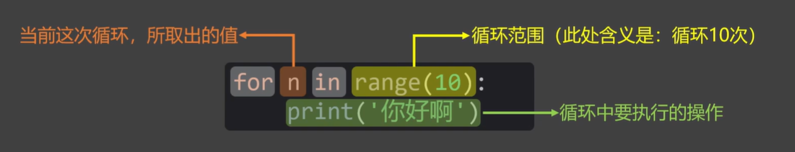

运行机理：

1. 调用**可迭代对象（list列表、dict/set 集合、str 字符串、range 数值数组...）**的 **`__iter__` 方法**，获得一个**迭代器 (Iterator)**
2. **循环**不断调用迭代器的 **`__next__` 方法（根据当前索引，返回对象中的下一个元素）**
3. 将得到的**值赋给变量**，**执行循环体**代码块
4. 当抛出 `StopIteration` 异常时，代表可迭代对象内的**元素已经被取完，循环停止**

常见的可迭代对象：

| **类型**             | **示例**                        | **特点**                                  |
| -------------------- | ------------------------------- | ----------------------------------------- |
| **序列类型**         | `str`, `list`, `tuple`, `range` | 有序，可以通过索引访问                    |
| **集合（容器）类型** | `dict`, `set`                   | `dict` 默认遍历 Key，`set` 遍历顺序不确定 |
| **生成器（推导式）** | `(x for x in ...)`              | 惰性计算，节省内存                        |
| **其他**             | `open('file.txt')`              | 文件对象按行迭代                          |

###### 嵌套 for 循环

```python
# 嵌套 for 循环
for i in range(1, 4):
    for j in range(1, 4):
        print(f"{i} * {j} = {i * j}")
```

###### _ 占位符

如果 `for ...in` 循环语句中不需要遍历出来的元素变量，则可以使用 `_` 占位符作为代替：

```python
for _ in range(1, 30):
    pass
```

##### 遍历序列

描述：当**使用 `for..in` 遍历序列数据（str、list、tuple、range...）**时，**获取到的是序列中的每个元素**。

###### str 字符串

描述：遍历出字符串序列中的每个**字符**。

```python
# str
desc = "你好，我是 Jack"

for char in desc:
    print(char)  # 你 好 ，我 是 J a c k
```

###### list 列表

描述：遍历出列表序列中的每个**列表成员**。

```python
# list
languages = ['Python', "JavaScript", "Java", "C++", "Go"]
for lang in languages:
    print(lang)  # 'Python' "JavaScript" "Java" "C++" "Go"
```

###### tuple 元组

描述：遍历出元组序列中的每个**子元素**。

```python
# tuple
items = (1, 2, 3, 4, 5, 6)
for item in items:
    print(item)  # 1 2 3 4 5 6
```

###### 自动 “拆包” 解构

当**序列中的元素也是序列**时，Python 使用 **`for` 循环遍历时会根据 `key:value`的形式将序列自动 “拆包” 解构** 。

```python
data = [(1, "A"), (2, "B"), (3, "C")]
for num, char in data:
    print(f"{num} - {char}")
'''
1 - A
2 - B
3 - C
'''
```

###### range() 遍历数值范围

*Python 本身不支持 `for (let i = 0; i < n; i++)` 这样的语句。*

故，Python 提供了 `range()` 内置函数专门用于**返回一个固定长度的数值（从 0 开始，每次 +1）**，结合 `for...in` 循环语句用来实现一个**固定次数的循环**。

它有两种写法：

- **`range(number)`：返回一个 `number` 固定长度的数值**

  ```python
  for item in range(10):
      print(item)  # 0 1 2 3 4 5 6 7 8 9
  
  # 等价于
  # for (let item = 0; item < 10; i++) {}
  ```

- **`range(start, stop, step?)`**：一个强大的功能，它支持如下写法并产生对应效果：

  - **`range(start, stop)`**：返回**一个从 `start` 开始到 `stop` 结束的固定长度数值**

    ```python
    for i in range(1, 10): # 从 1 开始，每次循环 i += 1，直到 i = 10 为止
        print(i)  # 1 2 3 4 5 6 7 8 9
    ```

  - **`range(start, stop, step)`**：

    - 当 **`step` 为整数**时，则为 **`i += step`**

      ```python
      for i in range(0, 10, 2):
          print(i)  # 0 2 4 6 8
      
      # 等价于
      # for (let item = 0; item < 10; i+=2) {}
      ```

    - 当 **`step` 为负数**时，则为 **`i -= step`**

      ```python
      for i in range(10, 0, -1):
          print(i)  # 10 9 8 7 6 5 4 3 2 1
          
      # 等价于
      # for (let item = 10; item > 0; i--) {}
      ```

##### 遍历集合（dict、set）

###### 获取 key【默认】

描述：当**使用 `for..in` 遍历集合类型（dict、set）【 `key:value` 键值对数据】**时，默认**遍历到的是集合容器中的每个 `key` 键**。

> 注：在 Python 中，**`dict` 字典是可重复 `key`键的集合对象，`set` 集合是唯一 `key` 键的集合对象**。

```python
# dict
obj = {'name': 'Jack', 'age': 18, 'gender': 'male'}
for key in obj:
    print(key)  # name age gender
    
# set
set_obj = {'name': 'Jack', 'name': 'Switch', 'age': 18, 'gender': 'male', 'gender': 'unknown'}
for key in set_obj:
    print(key)  # name age gender

set_items = {1, 2, 3, 4, 5, 6}
for item in set_items:
    print(item)  # 1 2 3 4 5 6
```

###### {}.values() 获取值

> [!NOTE]
>
> Python 为 `dict、set` 集合类型的数据默认内置了 **`values` 和 `items()` 方法**
>
> - **`values()`**：获取集合的 **`value` 值列表**
> - **`items()`**：获取集合的 **`key:value` 键值对列表**
>
> > 注：由于**`set` 集合有两种存储方式**，Python 会**自动检查 `set` 集合值的数据结构**，来动态赋予它所具有的方法行为：
> >
> > - **`set[str,Any]` 键值对**：**同时具备 `values` 和 `items()` 方法**
> > - **`set[str]` 键列表：仅能获取 `key` 键**

- **只获取 `value`值**：通过 **`dict\set` 类型实例自带的 `values()` 方法获取 `value` 值列表**

  ```python
  # dict
  obj = {'name': 'Jack', 'age': 18, 'gender': 'male'}
  
  for value in obj.values():
      print(value)  # Jack 18 male
      
  # set
  set_obj = {'name': 'Jack', 'name': 'Switch', 'age': 18, 'gender': 'male', 'gender': 'unknown'}
  for key in set_obj.values():
      print(key)  # Jack 18 male
  ```

###### {}.items() 获取键值对

作用：同时**获取 `key, value` 键值对**：通过 **`dict\set` 类型实例自带的 `items()` 方法获取 `key:value` 键值对列表**

> 此时 `for n in X`  可以写成 **`for key,value in X`**

```python
obj = {'name': 'Jack', 'age': 18, 'gender': 'male'}

for key, value in obj.items():
    print(key, value)
    
# name Jack
# age 18
# gender male
```

##### 流程控制

> Python 为 `for` 循环语句提供了 `break` 和 `continue` 用来控制循环流程。

###### continue 跳出本次循环

作用：**跳过本次循环体的执行，进行下一次循环**。

```python
for i in range(10):
    if i == 5:
        continue
    print(i)  # 0 1 2 3 4 6 7 8 9
```

###### break 结束循环

作用：**立即结束整个循环**。跳出 `for` 循环体作用域。

```python
for i in range(10):
    if i == 5:
        break
    print(i)  # 0 1 2 3 4
```

##### for...else 循环结束后执行

Python 提供了一个独有的 **`for...else`** 特殊语句结构。

```python
for ... in ...:
    # 循环体
else:
    # 循环正常结束后执行
```

描述：在 **`for` 循环正常结束**后（**不是被 `break` 强制中断，而是序列/集合容器元素被迭代完**），会**执行一次 `else:` 内的代码块**。

示例：

```python
for n in range(6):
    if n == 3:
        break
else:
    print("循环正常结束")
```

##### 推导式

*它是 **`for` 循环的“压缩版”**，用于**快速生成列表/集合容器**。*

Python 的**推导式（Comprehension）**是**用一行简洁的代码构建容器**的方式，它是**显式的 `for` 循环 + `append()` 的语法糖**，同时在底层运行效率上通常**比传统的 `for` 循环快**，因为底层在 C 层面执行。

Python 根据**序列、集合、字典、生成器**分为 4 种推导式写法：

| 类型             | 语法                       | 返回        | 示例                                            |
| :--------------- | :------------------------- | :---------- | :---------------------------------------------- |
| **列表推导式**   | `[表达式 for x in 可迭代]` | `list`      | `[x*2 for x in range(3)]` → `[0,2,4]`           |
| **集合推导式**   | `{表达式 for x in 可迭代}` | `set`       | `{x%3 for x in range(9)}` → `{0,1,2}`           |
| **字典推导式**   | `{键:值 for x in 可迭代}`  | `dict`      | `{x:x*2 for x in 'ab'}` → `{'a':'aa','b':'bb'}` |
| **生成器表达式** | `(表达式 for x in 可迭代)` | `generator` | 按需产生值，不占内存                            |

> 注：**元组类型没有推导式**

###### 基本概念

推导式都遵循以下核心写法：

```python
<结果表达式> for 元素 in 可迭代

# 也可添加 if 过滤条件

<结果表达式> for 元素 in 可迭代 if <过滤条件>
```

语法结构：

1. **先看 `for 元素 in 可迭代对象`整体**：遍历一个可迭代对象，并**依次取出元素**

2. （**如果有 `if` 过滤条件**，则**将迭代出来的元素放在 `if` 代码块中判断过滤，可以使用 `and`、`or`... 增设多种过滤条件**）

3. 将迭代过滤出来的**元素放在 `<结果表达式>` 中进行计算**，并**返回一个计算结果**，最后依次**存放到构建的新列表**中

   

工作流程：

```
[<结果表达式> for <元素> in <可迭代对象>   (if <过滤条件?>)]
     ↑             ↑           ↑			  ↑
  要存进容器的   每次循环取出  被遍历的数据源  对每次循环取出的变量
  最终计算结果   的临时变量名				 进行条件判断过滤
```

运行时：**`for` 每迭代一次 → 把元素放到 `if`中进行条件过滤 →把过滤的元素扔进 `<结果表达式>` 算出一个结果 → 把这个结果放进新容器**。

简单理解：

- **`for <元素> in <可迭代对象>`：代表正常的 `for..in`语句**
- **`<结果表达式>`就是 `for` 循环体**，如果**加上 `if` 就是在 `<结果表达式>` 前面加上一层过滤**

```python
squares = []

for x in <可迭代对象>:
    if <过滤条件>:
        <结果表达式>
		squares.append(<计算结果>)
```

###### if..else（条件表达式）

描述：**写在 `for...in` 后面的 `if` 没有 `else`**；若**想要使用 `if..else`条件表达式，需放在 `for..in`前面**，表示**结果条件表达式，也就是循环体**。

特性：**`if` 条件中也可以使用 `and`、`or`运算符增设多种过滤条件，且加上 `else` 增加了一种结果可能性**。

```python
<"结果1" if <条件> else "结果2"> for 元素 in 可迭代对象
```

等价于：

```python
squares = []

for 元素 in 可迭代对象:
    if <条件>:
     	squares.append(<结果1>)
    else:
        squares.append(<结果2>)
```

###### 嵌套 for 循环生成

Python 推导式中可以使用**扁平式的嵌套 `for`循环来生成容器**，但**尽量不超过 2 层**，否则可读性太差，应该转为正常的 `for` 循环嵌套。

```python
<x,y 结果表达式> (for x in <可迭代对象>) (for y in <可迭代对象>)
     ↑                ↑          	 		 ↑
  内层循环体   	    外层循环			    内层循环
```

等价于：

```python
squares = []

for x in 可迭代对象:
    for y in 可迭代对象:
        squares.append(<x,y 结果表达式计算结果>)
```

###### [x for...in] 列表推导式

作用：通过一行代码，实现**构建一个经过 `for`循环、`if`过滤与表达式运算之后得到的新列表**。

常用语法：

- **基本写法**：

  ```python
  # 基本写法
  result = [<结果表达式> for 元素 in 可迭代对象]
  ```

  示例：

  ```python
  origin_list = [1, 2, 3, 4, 5, 6, 7, 8, 9, 10]
  
  # 将 origin_list 列表中偶数取出，并组成一个新列表返回
  result_list_1 = [x % 2 == 0 for x in origin_list] # [2, 4, 6, 8, 10]
  
  # 等价于
  result_list_1 = []
  for x in origin_list:
      if x % 2 == 0:
          result_list_1.append(x)
  print(result_list_1)  # [2, 4, 6, 8, 10]
  ```

- **带 `if` 条件过滤**：

  ```python
  # 添加 if 过滤条件
  result = [<结果表达式> for 元素 in 可迭代对象 if <过滤条件>]
  ```

  示例：

  ```python
  # 将 origin_list 列表中偶数取出，并组成一个新列表返回
  result_list_2 = [x for x in origin_list if x % 2 == 0]
  print(result_list_2)  # [2, 4, 6, 8, 10]
  
  result_list_3 = [x for x in origin_list if x % 2 == 0 or x - 1 == 0]
  print(result_list_3)  # [1, 2, 4, 6, 8, 10]
  ```

- **`if...else` 条件表达式提前，增加一种结果选择**：

  ```python
  result = [<"结果1" if <条件> else "结果2"> for 元素 in 可迭代对象]
  ```

  示例：

  ```python
  list_arr = ['Python', 'Java', 'C++', 'C#', 'JavaScript']
  
  # 挑选出列表中长度大于 3 的字符串，将其字符转为小写，若长度小于 3 ，则返回 'X'，并组成一个新列表返回
  result_list_4 = [x.lower() if len(x) >= 3 else "X" for x in list_arr]
  
  print(result_list_4)  # ['python', 'java', 'c++', 'X', 'javascript']
  
  # 奇偶数挑选
  labels = ["偶数" if x % 2 == 0 else "奇数" for x in range(4)]
  print(labels)  # ['偶数', '奇数', '偶数', '奇数']
  ```

- **嵌套 `for` 循环生成**：

  ```python
  result = [<x,y 内层循环体结果表达式> for x in 可迭代对象 for y in 可迭代对象]
  ```

  示例：

  ```python
  # 嵌套循环
  pairs = [f"{x},{y}" for x in range(3) for y in range(3)]
  print(pairs)  # ['0,0', '0,1', '0,2', '1,0', '1,1', '1,2', '2,0', '2,1', '2,2']
  
  # 等价于
  for x in range(3):
      for y in range(3):
          [].append(f"{x},{y}")
          
  # 二维数组折平为一维数组
  matrix = [[1, 2], [3, 4], [5, 6]]
  flat = [x for row in matrix for x in row]
  print(flat)  # [1, 2, 3, 4, 5, 6]
  ```

  ```python
  # 添加 if 判断条件
  pairs_2 = [(x, y) for x in range(4) if x % 2 == 0 for y in range(4) if y % 2 == 0]
  print(pairs_2) # [(0, 0), (0, 2), (2, 0), (2, 2)]
  
  # 等价于
  pairs_3 = []
  for x in range(4):
      if x % 2 == 0:
          for y in range(4):
              if y % 2 == 0:
                  pairs_3.append((x, y))
  print(pairs_3)  # [(0, 0), (0, 2), (2, 0), (2, 2)]
  ```

###### {key for...in} 集合推导式

作用：通过一行代码，实现**构建一个经过 `for`循环、`if`过滤与表达式运算之后得到的新 `set` 集合，并自动去重**。

常用语法：

```python
# 基本写法
result = {<结果表达式> for 元素 in 可迭代对象}

# 添加 if 过滤条件
result = {<结果表达式> for 元素 in 可迭代对象 if <过滤条件>}

# if...else 条件表达式提前
result = {<"结果1" if <条件> else "结果2"> for 元素 in 可迭代对象}

# 嵌套 for 循环生成
result = {<x,y 内层循环体结果表达式> for x in 可迭代对象 for y in 可迭代对象}
```

示例：

```python
# 将字符串中的字符逐个迭代出来转为小写字符，并自动去重，最后组成一个新集合返回
set_lower = {x.lower() for x in 'ABCDEFGABCDEFG'}
print(set_lower)  # {'b', 'a', 'e', 'd', 'c', 'g', 'f'}

# 迭代另一个集合，依次取出每个元素，将每个元素做平方后组成一个新集合返回
set_origin = {1, 2, 3, 4, 5, 6, 7, 8, 9, 10}
set_even = {x**2 for x in set_origin}
print(set_even)  # {64, 1, 4, 36, 100, 9, 16, 49, 81, 25}
```

###### {k:v for...in} 字典推导式

作用：通过一行代码，实现**构建一个经过 `for`循环、`if`过滤与表达式运算之后得到的新 `dict` 字典**。

描述：与其他推导式不同的是，**字典推导式中的 `<结果表达式>` 是一组 `<key>:<value>` 键值对，可对`key` 或 `value` 做生成前处理**。

常用语法：

- **基本写法**：

  ```python
  # 基本写法
  result = {<key>:<value> for 元素 in 可迭代对象}
  ```

  示例：

  ```python
  dict_1 = {'a': 1, 'b': 2, 'c': 3}
  
  # 键值反转的同时，对每次生成的 `value` 值添加一些东西
  reversed_dict = {k: f"({v})" for k, v in dict_1.items()}
  print(reversed_dict)  # {1: '(a)', 2: '(b)', 3: '(c)'}
  
  # 原样输出 k 键,v 值
  reversed_dict = {k:v for k, v in dict_1.items()}
  print(reversed_dict)  # {1: 'a', 2: 'b', 3: 'c'}
  ```

- **添加 if 过滤条件**：

  ```python
  # 添加 if 过滤条件
  result = {<key>:<value> for 元素 in 可迭代对象 if <过滤条件>}
  ```

  示例：

  ```python
  # 添加 if 条件
  tuple_k_v = [('name', 'Jack'), ('age', 18), ('gender', 'male')]
  
  dict_2 = {k.upper(): v.upper() for k, v in tuple_k_v if k == 'name'}
  
  print(dict_2)  # {'NAME': 'JACK'}
  ```

- **`if...else`  条件表达式提前**：

  ```python
  # if...else 提前
  result = {<key "结果1" if <条件> else "结果2"> : <value "结果1" if <条件> else "结果2"> for 元素 in 可迭代对象}
  ```

  > **通过 `if..else` 分别设置 `key` 和 `value` 的值**

  示例：

  ```python
  tuple_k_v = [('name', 'Jack'), ('age', 18), ('gender', 'male')]
  
  # 除了 k==name正常赋值之外，其他的元素都存储一个 dict 字典
  dict_3 = {k: v if k == 'name' else {k: v} for k, v in tuple_k_v}
  print(dict_3)  # {'name': 'Jack', 'age': {'age': 18}, 'gender': {'gender': 'male'}}
  
  # 将元组中除了 k!=name的每个元素首字母转为大写，其他的正常，k==name的正常，其他的赋值为 v，并组成一个新字典返回
  dict_4 = {k if k != 'name' else k.upper(): v if k == 'name' else "v" for k, v in tuple_k_v}
  print(dict_4)  # {'NAME': 'Jack', 'age': 'v', 'gender': 'v'}
  ```

- **嵌套 `for` 循环生成**：

  ```python
  # 嵌套 for 循环生成
  result = {<key>:<value> for x in 可迭代对象 for y in 可迭代对象}
  ```

  示例：

  ```python
  dict_4 = {x: {y: x*y for y in range(1, 4)} for x in range(1, 4)}
  print(dict_4)

###### (x for...in) 生成器推导式

> [!NOTE]
>
> **生成器（Generator）** 是一种**惰性求值**的迭代器。它不像列表那样一次性把所有数据算好存内存里，而是**你管我要一个，我当场算一个给你**。

描述：可以把**生成器推导式**看作是**列表推导式的 “节能版”**，它与列表推导式的语法、使用方式几乎一模一样，**只是把 `[]` 换成了 `()`**。

核心区别：

- **列表推导式：一次性生成一组列表**。它是为了得到一个实实在在的**结果集**。
- **生成器推导式：边用边生成，它是惰性计算的（只有被索要时才计算 (惰性)）**。它是为了得到一个**生产过程**。
  - **生成器中元素的访问使用 `next()` 内置函数或 `__next__()` 实例魔术方法，访问一次计算一个结果并返回**
  - **关键区别**：生成器表达式返回的列表只能**遍历一次**，不能索引、不可切片

核心概念（重点）：因为生成器是**惰性计算**的，所以它**几乎不占用内存**；而**列表推导式立刻生成所有数据，占用大量内存**

语法：**使用 `()`圆括号创建**，不是元组推导式（元组没有推导式）。

```python
gem = (x for x in range(100))

# 性能对比
import sys

# 列表：一次性生成所有元素，占用内存
nums_list = [x**2 for x in range(1000000)]
print(sys.getsizeof(nums_list))  # 约 8MB

# 迭代器：惰性求值，几乎不占内存
nums_iter = (x**2 for x in range(1000000))  # 生成器表达式
print(sys.getsizeof(nums_iter))  # 约 112 字节
```

访问：

- **`next(generator)` 内置函数**：**生成并访问下一个元素**，内部其实也是调用的 `__next__()` 实例方法

  ```python
  gem = (x for x in range(100))
  
  print(next(gem))  # 0
  print(next(gem))  # 1
  print(next(gem))  # 2
  print(next(gem))  # 3
  print(next(gem))  # 4
  ```

- **`generator.__next__()`**：**生成并访问下一个元素**

  ```python
  gem = (x for x in range(100))
  
  print(gem.__next__())  # 0
  print(gem.__next__())  # 1
  print(gem.__next__())  # 2
  print(gem.__next__())  # 3
  print(gem.__next__())  # 4
  ```


## 函数

### 基本概念

在 Python 中，**函数（Function）** 是组织好的、可重复使用的、用来实现单一或相关联功能的代码段。它能提高应用的模块性，和代码的复用率。

可以把函数想象成一个**“加工机器”**：你塞入原材料（输入参数），机器内部进行处理，最后吐出产品（返回值）。

核心特性：

- **解耦**：把复杂的任务拆分成一个个小任务
- **复用**：写一次，到处调
- **易维护**：改一个地方，所有调用的地方都同步生效

#### 函数 vs 方法

简单来说，**“函数” (Function) 是独立存在的代码块，而“方法” (Method) 是依附于对象或类的代码块**。

核心定义：

- **函数 (Function)**

  函数是一段**独立**的代码，通过名称来调用。它可以接收输入（参数）并产生输出（返回值）。

  - **地位**：它是“一等公民”，不依赖于任何特定的类或对象

  - **调用方式**：通过函数名直接调用

  - **数据操作**：函数通常操作传入它的参数

- **方法（Method）**

  方法是**与类或对象关联**的函数。它是面向对象编程的核心概念。

  - **地位**：它是类（Class）的一部分
  - **调用方式**：通过对象或类名来调用（例如 `object.method()`）
  - **数据操作**：方法不仅能操作参数，还能直接访问并操作该对象内部的数据（即成员变量/属性）

| **特征**     | **函数 (Function)**          | **方法 (Method)**                                         |
| ------------ | ---------------------------- | --------------------------------------------------------- |
| **所属关系** | 独立存在，全局或局部作用域   | 属于类或对象的成员                                        |
| **调用语法** | `function_name(args)`        | `object.method_name(args)`                                |
| **隐式参数** | 无                           | 包含一个隐性参数（如 Python 的 `self` 或 Java 的 `this`） |
| **侧重点**   | 侧重于**逻辑处理**和计算     | 侧重于**描述对象的行为**                                  |
| **典型语言** | C, JavaScript (非对象内), Go | Java, C#, Ruby, Python (类内部)                           |

### 基本语法

Python 函数用 **`def` 关键字定义**，是组织代码、消除重复的基本单元。

> 注：Python 严格按照**缩进规范定义代码块作用域（默认 4 个空格）**。

```python
# 定义函数（先定义后调用）
def 函数名(参数1, 参数2=默认值...):
    """文档字符串（可选，help() 可见）"""
    # 函数体（执行的逻辑）
    return 返回值

# 调用函数
函数名()
```


关键要素：

- **`def` 关键字**：告诉 Python “我要开始定义一个函数了”
- **函数参数 (Arguments)**：外界传递给函数的信息
- **`return` 语句**：**强制结束函数执行，返回一个值给函数外部接收，后续代码不再生效**。如果**没有 `return`，函数默认返回 `None`**

### 函数参数

Python 函数的参数系统非常强大且灵活。如果把函数比作一台**加工机**，参数就是你投入的**原材料**。

根据不同功能应用，函数的参数分为 5 大类：

| 类别           | 语法              | 关键点                         |
| :------------- | :---------------- | :----------------------------- |
| **位置参数**   | `def f(a, b)`     | 按顺序传入                     |
| **默认参数**   | `def f(a, b=10)`  | 调用时可省略                   |
| **可变位置**   | `def f(*args)`    | 接收多余位置参数，打包为元组   |
| **关键字限定** | `def f(*, a, b)`  | `*` 之后必须用关键字传         |
| **可变关键字** | `def f(**kwargs)` | 接收多余关键字参数，打包为字典 |

#### 位置参数

这是最基础的形式。在调用函数时，**实参的数量和顺序必须与定义的形参完全一致**。

核心概念：在调用函数时，**根据参数在函数中定义的顺序，将实参的值依次传递给对应的形参**，这种就叫**位置参数**。

注意点：

- 函数实参**不可以少传或多传**
- 传递实参时**不能跳过某个位置的参数，去给后面的形参赋值**


```python
def greet(name, age):
    print(name, age)

# 正确示例
greet('name', 'jack') # name jack

# 错误示例
greet('name')  # 少传了，抛出 TypeError: greet() missing 1 required positional argument: 'age'
greet('name', 'tom', 18) # 多传了，抛出 TypeError: greet() takes 2 positional arguments but 3 were given
```

#### 关键字参数

由于位置参数的限制（**调用函数时传递的实参顺序、数量必须与位置参数定义时保持一致**），Python 又提供了 **关键字参数**。

核心概念：在**调用函数**时，**将实参值显式传递给具体某个形参名。（指名道姓的传递给某个具体形参）**

##### 基本语法

- **调用函数**时，使用 **`<函数名>(形参名=实参值)`** 的形式传递实参值

```python
# 定义位置形参
def greet(name,age,gender):
    pass

# 调用函数时，给指定形参名传递实参值
greet('jack', age=18, gender=True)

greet(age=18, gender=True, name="jack") # 无需关心位置参数的定义顺序
```

- 核心优势：**如果全部写关键字参数，则无需关心位置参数的定义顺序，关键字参数可以不按照顺序传递**

  

##### 注意点

- **关键字参数与位置参数混用**时，**位置参数必须写在关键字参数前面**

  ```python
  def my_fun(name, age, gender):
      pass
  
  # 错误示例，关键字参数必须在位置参数后面
  my_fun(age=18, 'jack', gender=True)  # 抛出异常 SyntaxError: positional argument follows keyword argument
  my_fun(name='jack', 18, gender=True)  # 抛出异常 SyntaxError: positional argument follows keyword argument
  ```

- 关键字参数**不可以重复传递**

  ```python
  def my_fun(name, age, gender):
      pass
  
  my_fun('jack', gender=True, age=18, age=19)  # 抛出异常 SyntaxError: keyword argument repeated: age
  ```

- **不可以传递未定义的形参**

  ```python
  def my_fun(name, age, gender):
      pass
  
  # 抛出异常 TypeError: my_fun() got an unexpected keyword argument 'school'
  my_fun('jack', gender=True, age=18, school='beijing')
  ```

- **覆盖参数的默认值**

  ```python
  def my_fun(name, age=0, gender=False):
      print(name, age, gender)
  
  # 覆盖默认值
  my_fun(name='jack', age=18, gender=True)  # jack 18 True
  ```

##### / * 限制传参方式

Python 提供了 **`/` 和 `*`**两个运算符来**在定义函数、声明形参时，限制实参的传递方式**

- **`/`：前面只能用位置参数**
- **`*`：后面只能用关键字参数**
- **位于 `/` 和 `*` 之间的参数，可同时使用位置参数与关键字参数**


```python
def myfun(name, /, age, *, gender, city)
# / 之前的： name 必须使用位置参数

# / 与 * 夹在中间的：age 可以使用位置参数，也可以使用关键字参数

# * 后面的：gender、city 必须使用关键字参数
```

示例：

```python
# / * 限制传参方式
def my_fun(name, /, age, *, gender, city):
    print(name, age, gender, city)

my_fun('jack', 18, gender='male', city='shanghai')  # jack 18 male shanghai
my_fun('jack', age=18, city='shanghai', gender='male')  # jack 18 male shanghai
```

> 一般第三方库的 API 都会使用 **`func(*, name, age)` 的形式给外部使用，防止传错位置**。

#### 参数默认值（可选参数）

核心概念：**定义函数**时，通过 **`形参名=值`** 的形式，**为函数形参定义一个默认值**。

特性：当调用函数时，若**没有传递对应的实参值，则使用默认值，否则使用传递的关键字实参值**。

> 注：**通过关键字参数传递的形式去覆盖参数默认值**。


```python
def greet(name, age=18, gender=True):
    print(name, age)

greet('jack') # jack 18 True
greet('tom', 20) # tom 20 True
greet('tom', 20, gender=False) # tom 20 False => gender=False 关键字传递覆盖默认值
```

##### 可选参数特性

当**函数形参设定了默认值之后，它会变成可选参数**，即**可传可不传**

- 要么必须**放在所有必选参数的后面**，否则会报错
- 要么**可选形参后面的所有形参，都必须加上默认值**

```python
# def my_fun(name, gender='male', age, address='beijing'): 
# 报错 SyntaxError: parameter without a default follows parameter with a default

def my_fun(name, age, gender='male', address='beijing'):
    print(name, age, gender, address)


my_fun('name', 18)  # name 18 male beijing
```

##### 不要设定为可变对象

函数的**默认参数只求值一次**，所以**参数的默认值不要设定为可变对象**。

原因：这是因为**参数传递的本质是引用传递**，如果参数的默认值**使用可变对象，可变对象通常为容器类型（列表、字典、集合）**，在**初次调用函数后，会在内存中创建一个该容器（形参）的引用地址**，并长久持有，**后续再调用该函数时，使用的都是同一个内存中的容器对象（形参）**。

> 如果需要在函数中使用可变对象，**应该将其设定为局部变量或全局变量使用**，放在形参上会引发歧义。

错误示例：

```python
def my_func_8(name, school=[]):
    school.append(name)
    print(school)


my_func_8('jack')  # ['jack']
my_func_8('tom')  # ['jack', 'tom']
my_func_8('kally')  # ['jack', 'tom', 'kally']
```

正确示例：

```python
def my_func_9(name, school=None):
    if school is None:
        school = []
    school.append(name)
    print(school)


my_func_9('jack')  # ['jack']
my_func_9('tom')  # ['tom']
my_func_9('kally')  # ['kally']
```

#### 可变参数

*类似于 JavaScript 的 ...args 剩余参数*

核心定义：当**外部调用函数，不知道传递多少个实参**时，可以**使用可变参数来一起收集并打包**到一起

可变参数分为：

- ***args 可变位置参数**：**接收任意多个位置参数，打包成一个元组列表**

  

- **\**kwargs 可变关键字参数**：**接收任意多个关键字（即 `key=value` 形式）参数，打包成一个字典**

  

> 可以把 `*args` 想象成一个**大布袋**，不管来多少零碎东西都往里装；把 `**kwargs` 想象成一个**带标签的收纳盒**，每个东西进来都得贴个名字。

##### * 可变位置参数

语法：

```python
def myfun(name, age, *totalArgs):
    pass
```

作用：**调用函数**时，**接收除了 `name`、`age` 位置参数之外，其他多余传递的位置参数**，并收集在一起**打包成一个元组**列表。

```python
def my_func(name, age, *args):
    print(name, age, args)

my_func('jack', 18, 'beijing', 'shanghai')  # jack 18 ('beijing', 'shanghai')


def my_func_1(*args):
    print(args)

my_func_1('jack', 18, 'beijing', 'shanghai') # ('jack', 18, 'beijing', 'shanghai')
```

##### ** 可变关键字参数

语法：

```python
def myfun(name, age, **totalKWArgs):
    pass
```

作用：**调用函数**时，**接收除了 `name`、`age`关键字参数之外，其他多余传递的关键字参数**，并收集在一起**打包成一个字典**。

```python
def my_func_2(**kwargs):
    print(kwargs)

# {'name': 'jack', 'age': 18, 'city': 'beijing', 'school': 'shanghai'}
my_func_2(name='jack', age=18, city='beijing', school='shanghai')


def my_func_3(name, age, **kwargs):
    print(name, age, kwargs)

# jack 18 {'city': 'beijing', 'school': 'shanghai'}
my_func_3('jack', 18, city='beijing', school='shanghai')
```

注：由于**关键字参数传递实参值时不关心形参定义的顺序**，它**只关注是否定义了这个形参名**，所以两者混用时，**可变关键字参数只会接收未定义的形参名及值**。

```python
def my_fun_7(name, age, **kwargs):
    print(name, age)  # jack 18
    print(kwargs)  # {'city': 'beijing', 'school': 'shanghai'}


my_fun_7(name='jack', city='beijing', age=18, school='shanghai')
```

##### 两者混用

```python
def my_func_4(*args, **kwargs):
    print(args)  # ('jack', 18)
    print(kwargs)  # {'gender': True, 'city': 'beijin'}

my_func_4('jack', 18, gender=True, city="beijin")


def my_func_5(name, age, *args, gender, city, **kwargs):
    # 固定位置参数
    print(name, age)  # jack 18
    # 可变位置参数
    print(args)  # ('beijing', 'shanghai')
    # 固定关键字参数
    print(gender, city)  # True beijing
    # 可变关键字参数
    print(kwargs)  # {'school': 'shanghai'}

my_func_5('jack', 18, 'beijing', 'shanghai', gender=True, city="beijing", school='shanghai')
```

#### 多种参数混用

当函数中定义了多种类型的参数时，需按照如下规则：

- **位置参数在最前面，可变位置参数紧随其后**
- **默认值参数在中间**
- **关键字参数在后面，可变关键字参数紧随其后**

```
def func(a, b, *args, c=10, **kwargs):
         ↑  ↑    ↑       ↑       ↑
         │  │    │       │       └── 可变关键字参数（打包剩余关键字 → dict）
         │  │    │       └── 关键字参数（默认值）
         │  │    └── 可变位置参数（打包多余位置 → tuple）
         │  └── 位置参数
         └── 位置参数
```

注意点：在**使用关键字参数覆盖参数的默认值**时，由于**关键字参数是指名道姓的给**，所以**不会被 `**kwargs` 可变关键字参数收集**。


示例：

```python
def my_func_6(name, age, *args, gender=True, city='beijing', **kwargs):
    # 位置参数
    print(name, age)  # jack 18
    # 可变位置参数
    print(args)  # ('1046@qq.com', 'shanghai')
    # 参数默认值（关键字参数）
    print(gender, city)  # False hunan
    # 可变关键字参数
    print(kwargs)  # {'school': 'shanghai'}

my_func_6('jack', 18, '1046@qq.com', 'shanghai', gender=False, school='shanghai', city='hunan')
```

#### 参数的打包与解包

序列与字典容器类型都提供了 `*` 和 `**`解包语法，相当于**把列表与字典内容展开输出**，可以通过这种语法在调用函数时，**一次性传递多个实参值**。

- **`list` 列表、 `tuple` 元祖 **： **`*`解包展开**传递给**位置参数**
- **`dict` 字典 **：**`**` 解包展开**传递给**关键字参数**

```python
# 可变参数打包接收
def my_func_10(name, age, *args, school, **kwargs):
    # 位置参数
    print(name, age)  # jack 18

    # 可变位置参数
    print(args)  # ('1046@qq.com', 'shanghai')

    # 解包可变位置参数
    email, address = args  
    print(email, address) # '1046@qq.com' 'shanghai'
    
    # 参数默认值（关键字参数）
    print(school)  # 上海财经学院

    # 可变关键字参数
    print(kwargs)  # {'address': '上海', 'gender': '男'}

    # 解包可变关键字参数
    addressItem, genderItem = kwargs.items()
    print(addressItem, genderItem)  # ('address', '上海') ('gender', '男')


arg_list = ['jack', 18, '1046@qq.com', id('1569')]
arg_dict = {'school': '上海财经学院', 'address': '上海', 'gender': '男'}

# 参数打包传递
my_func_10(*arg_list, **arg_dict)
```

#### 函数参数传递的本质

函数参数传递的**本质就是变量之间的引用传递**。在函数体内部**函数参数就是函数内的一个局部变量**。

核心概念：函数参数的传递是**在函数体内部以 `形参名（局部变量） = 实参值（外部变量）`的形式，重新赋值指向新对象**

局部变量的生命周期：**函数执行结束，函数内的局部变量立即销毁**


拿到引用后，外部数据会不会被函数修改，**完全取决于对象本身是可变的还是不可变的**：

##### 不可变类型 (int, str, tuple...)

描述：相当于是**`=`重新赋值，创建一个新对象，与外部变量断开联系**，所以**不会影响函数外部变量值**

```python
a = 666

def welcome(data):
    # 其实内部就是 data = a
    print(data) # 666 修改前
    data = 888
    print(data) # 888 修改后

print(a) # 函数调用前 666
welcome(a)
print(a) # 函数调用后 666
```


##### 可变类型 (list, dict, set)

描述：相当于是**修改对象，与外部变量保持联系**，所以**会影响函数外部变量值**

```python
a = [10, 20, 30]

def welcome(data):
    # 其实内部就是 data = a
    print(data) # [10, 20, 30] 修改前
	data[2] = 99
    print(data) # [10, 20, 99] 修改后

print(a)  # 函数调用前 [10, 20, 99]    
welcome(a)
print(a)  # 函数调用后 [10, 20, 99]
```


##### `=` 赋值 vs 原地修改

```python
def killer(lst):
    lst = lst + [4]   # ⚠️ 这会创建新列表，并让 lst 指向它！

def survivor(lst):
    lst += [4]        # ⚠️ 这是原地修改，等同于 extend

my_list = [1, 2, 3]
killer(my_list)
print(my_list)  # [1, 2, 3] → 没变！(killer 里面 lst 断了)

survivor(my_list)
print(my_list)  # [1, 2, 3, 4] → 变了！
```

##### 人为 “屏蔽” 引用传递

如果**想将外部可变对象变量安全的传递给函数，使得函数内部修改不会影响外部变量**，可以**通过容器的实例方法 `copy()` 浅拷贝一份外部容器变量的副本传递给函数参数**：

```python
a = ['A', 'B']

def func(arg):
    # 其实内部就是 arg = a
    arg.append('C')
    print(arg)  # ['A', 'B', 'C']

func(a.copy())  # 拷贝 a 的副本给函数参数 arg

print(a)  # ['A', 'B']
```

### 函数的返回值

函数的返回值：函数执行完毕后，会把执行结果交给调用者，这个**执行结果就是函数的返回值。**

要想指定函数的返回值需使用 `return` 关键字。

**`return`关键字**：

- **直接结束函数执行，返回一个具体的值作为函数的返回值给外部调用者**
- **没有 `return` 关键字，函数默认返回 `None`**

```python
# 有 return 的返回值
def my_func_11():
    return 'hello world'

msg = my_func_11()
print(msg)  # hello world

# 无 return 的默认返回值
def my_func_12():
    pass

msg_2 = my_func_12() # None
```

#### 返回 x,y 多个值

当函数**通过 `return` 一次性返回多个值**时，实质是**返回一个元组**：

```python
def my_func_13():
    return 'hello', 'world'

msg_3 = my_func_13()
print(msg_3)  # ('hello', 'world')

# 元组解包
a, b = msg_3
print(a, b)  # hello world
print(*msg_3)  # hello world
```

### 函数的对象特性

#### 函数的类型

在 Python 中，万物皆对象，函数本质上其实也是一个对象，类型是 **`<class 'function'>`**  。

- 函数的类型对象在底层定义为 **`types.FunctionType`**

要想引用这个类型，必须通过 **`import types` 模块**，或者使用 **`type(lambda: None)` 这种方式即时获取**。

##### types.FunctionType

描述：它是 Python 在**底层定义**的**函数实例的所属类型**。

> 因为**函数通常通过 `def` 或 `lambda` 语法糖来创建**。所以 Python 并**没有提供 `function` 关键字**。

```python
# 函数的类型是 types.FunctionType，它对外不可见，只能通过 types 模块来引入
import types

print(types.FunctionType)  # <class 'function'>

def func(): pass

print(type(func) is types.FunctionType)  # True
```

##### 函数 & object & type 的关系

在 Python 中，**一切类都是由 `type` 元类构造的（所有类都是 `type` 元类的实例），一切类都是继承自 `object` 基类（所有类都是 `object` 基类的子类，所有类的实例也是 `object` 基类的实例）**。

所以：

- **`types.FunctionType` 函数类型**是 **`type` 元类构造的实例**、也是**`object` 基类的子类**  
- **`function` 函数**是**`types.FunctionType`类型的函数类实例**
  - 所以 **`function` 函数实例也是 `object` 类的实例**


```python
import types

def func(): pass

# 检查函数实例 与 types.FunctionType 函数类的关系
print(type(func) is types.FunctionType)  # True
print(type(func))  # <class 'function'> 函数的类型

# 检查 函数 与 object基类 的关系
print(isinstance(func, object))  # True 检查函数是否是 object 类的实例
print(issubclass(type(func), object))  # True 检查 function 函数类型是否继承自 object
print(func.__class__)  # <class 'function'>
print(func.__class__.__bases__)  # (<class 'object'>,)

# 检查 函数 与 type元类 的关系
print(issubclass(type(func.__class__), type))  # True
print(func.__class__.__class__)  # <class 'type'>
```

#### 对象特性

既然函数也是继承自 `object` 基类的，那么它也具备对象的一切特性，函数对象也可以有如下操作：

- 访问 `__dict__`、`__class__`、`__bases__` ...等魔术属性
- 为函数对象**动态添加属性**
- 可以**赋值给变量**，也可以**作为参数传递给其他函数**
- 也可以**作为返回值给其他变量接收**
- ...

> 注意：与其他对象不同的是，在 CPython 的底层实现中，`function` 函数对象的许多内置魔术属性方法（如 `__str__`, `__repr__`, `__call__`）是**只读**的，不允许动态修改（重写）。

示例：

```python
def func(): pass

print(func.__dict__)  # {}
print(func.__name__)  # func
print(func.__module__)  # __main__
```

##### 为函数动态添加属性

```python
def welcome():
    print('你好啊')

# 动态添加属性
welcome.desc = '这是一个打招呼的函数'
welcome.version = 1.0

# 查看 welcome 函数实例对象的空间字典
print(welcome.__dict__)  # {'desc': '这是一个打招呼的函数', 'welcome': 1.0}

# 访问函数属性
print(welcome.desc)  # 这是一个打招呼的函数
print(welcome.version)  # 1.0
```

函数对象在内存中的结构：


##### 将函数赋值给变量

函数本身也是一个对象，可以赋值给变量，本质上是**将函数对象的内存地址引用传递给了其他变量**。

```python
def welcome():
    print('你好啊')

welcome.desc = '这是一个打招呼的函数'
welcome.version = 1.0

print(welcome.__dict__)  # {'desc': '这是一个打招呼的函数', 'welcome': 1.0}
print(welcome.desc)  # 这是一个打招呼的函数
print(welcome.version)  # 1.0

# 函数本身也是一个对象，可以赋值给变量，本质上是将函数对象的内存地址引用传递给了其他变量
say_hi = welcome
say_hi()
print(say_hi.__dict__)  # {'desc': '这是一个打招呼的函数', 'welcome': 1.0}
print(say_hi.desc)  # 这是一个打招呼的函数
print(say_hi.version)  # 1.0
```

#### 高阶函数

高阶函数指的就是当一个函数的**接受参数是一个函数**，**返回值是一个函数**，则它就是一个高阶函数。

意义：

- **代码复用性高**：可以把**行为 “独立出去”**，传入**不同函数实现不同逻辑**
- 让函数更灵活、更实用
- 构成**装饰器、闭包**的基础

##### 函数作为参数传递

```python
# 函数作为参数传递
def add(x, y):
    return x + y

def apply_func(func, x, y):
    return func(x, y)

result = apply_func(add, 1, 1)
print(result) # 2
```

##### 函数作为返回值（局部函数）

在 Python 中，函数可以嵌套定义，即在函数内通过 `def` 关键字再定义若干个函数；

- **局部函数**：指**在函数内嵌套定义的函数，外部不可调用，但可以作为返回值给外部引用**。

  > 注意：将函数作为返回值给外部引用，会导致**闭包**行为。*跟 JavaScript 的特性一样*
  >
  > > **闭包**：是指**当外层函数结束时，内层函数还在因为引用外部变量，而无法及时释放内存**的一种行为。

```python
# 函数作为返回值
def outer():
    def inner():
        print('inner')

    return inner


outer()()  # inner => 外层函数() 调用，返回 inner 函数的引用，再调用 inner 函数

func = outer()  # 这里其实是 inner 函数的引用
func()  # inner
```

### 函数调用栈（Call Stack）

#### 基本概念

调用栈（Call Stack）是 Python 解释器**跟踪函数调用顺序和局部变量**的机制；

- **调用栈结构**：**先进后出（LIFO, Last In, First Out）**。最后调用的函数最先执行完。
  - **入栈（Push）：** **调用函数**时，新的栈帧被压入
  - **出栈/弹栈（Pop）：** **函数执行完毕**（遇到 `return` 或执行结束），对应的栈帧被弹出，**控制权交回给上一个函数**
- **栈帧容器（执行上下文）**：每当一个函数被调用，系统都会创建一个栈帧（Stack Frame）并将调用的函数推入函数调用栈栈顶
  - 这个栈帧（函数执行上下文）包含了该函数的**作用域链、局部变量、参数、返回地址、冻结语句等等...**
  - 当栈帧容器中全部函数执行完毕，释放内存引用后，会**立即销毁**
  - 每个栈帧都有自己的局部变量，互不干扰（即使是递归调用同名函数）

> 注意：栈的空间是有限的。如果递归太深且没有停止条件，会导致 **RecursionError**（即栈溢出 Stack Overflow）

##### Traceback 快照

当 Python 代码报错时，终端显示的 **Traceback** 其实就是当前**调用栈的快照**。它按顺序告诉你：错误发生在哪一行，以及它是通过哪些函数一层层调用到这里的。

#### 核心理解（出栈、弹栈）

在 Python 执行程序时，代码是**从上向下逐行同步执行**的；

假设当前 `.py` 全局模块中有三层结构：**`全局` -> `全局外层函数A` -> `嵌套内层函数B` -> `函数B中嵌套内层函数C`**。

​	当 Python 在**当前全局模块（全局作用域）中读取到函数执行**时，系统就会立即**创建一个栈帧（Stack Frame）容器**；接着立即**冻结**全局模块中**调用函数当前行的后续代码语句**，随后**将当前全局模块压入栈底**，**等待全局函数`A`执行完毕**或遇到 `return` 返回值后**才继续执行**；

​	Python 解释器**开始进入**全局函数`A`中执行函数体。

​	在全局函数内部执行过程中，每当 Python 解释器**再次读取到一个嵌套内层函数`B`被调用**，系统就会**立即冻结**全局外层函数`A`中**调用函数`B`当前行的后续代码语句**，**等待嵌套内层函数`B`执行完毕**或遇到 `return` 返回值后**才继续执行**；

​	接着 Python **进入嵌套内层函数`B`中**执行；如果在嵌套内层函数`B`中**也遇到了嵌套内层函数`C`的调用**，则继续**将当前嵌套内层函数`B`压入栈帧容器中**，并**冻结调用函数`C`当前行的后续代码语句**，**等待嵌套内层函数`C`执行完毕**或遇到`return`返回值后**才继续执行**；

​	此时栈帧容器已经有了**全局模块（栈底） >   全局外层函数`A`（栈中）>  嵌套内层函数`B`（栈顶）**；

​	接着 Python 解释器**进入**嵌套内层函数`C`中执行代码...以此类推；

​	当第三层嵌套内层函数执行完毕并返回值后；

​	Python 解释器**立即跳出**嵌套内层函数`C`，**释放内存引用**，随后**进入栈帧容器中**，依次**从上往下取出嵌套内层函数`B`（弹栈）**，并**继续执行**当初压栈时**冻结的后续代码语句**；

​	当**位于栈顶**的嵌套内层函数`B`**执行完毕并返回值后**，Python 解释器**立即跳出并释放内存引用**，随后**再次进入栈帧容器中**；接着**取出此时位于栈顶的外层全局函数`A`**，并**继续执行**当初压栈时**冻结的后续代码语句**；

​	直到外层全局函数`A`的代码执行完毕；整个嵌套函数调用栈过程就**结束**了，最后**将外层全局函数`A`的返回值，返回给当前模块**。

​	最终**栈帧容器销毁**，接着**继续执行**当前模块中全局作用域内**剩余的后续代码**。

| **步骤** | **动作**     | **栈容器状态（顶部为当前执行环境）**                         | **状态描述**                           |
| -------- | ------------ | ------------------------------------------------------------ | -------------------------------------- |
| 1        | 执行全局代码 | `[ 全局模块 ]`                                               | 全局变量初始化中                       |
| 2        | 调用 `函数A` | `[ 函数A ]` `[ 全局模块 (已冻结) ]`                          | 全局模块在调用行被“冻结”，A 进入活跃态 |
| 3        | 调用 `函数B` | `[ 函数B ]` `[ 函数A (已冻结) ]` `[ 全局模块 (已冻结) ]`     | A 在调用行被“冻结”，B 是当前活跃栈帧   |
| 4        | 调用`函数C`  | `[函数C]` `[函数B （已冻结]` `[函数A (已冻结)]` `[全局模块 (已冻结)]` | B 在调用行被“冻结”，C 是当前活跃栈帧   |


##### 关键点

- **“冻结语句”的本质：** 在计算机科学中通常由 **程序计数器（Program Counter）** 实现。它记录了当前函数执行到了哪一行。当函数返回时，解释器根据这个“书签”精准回到刚才停下的地方。

- **内存释放：** 当一个函数（栈帧）被弹出（Pop）时，该函数内部定义的**局部变量**如果没有被外部引用（比如闭包），通常会立即变为垃圾回收的目标。这也是为什么函数执行完后，你无法再访问其内部局部变量的原因。

- **异常回溯：** 这种“嵌套”结构解释了为什么报错时 Traceback 是层级状的。如果 `函数B` 报错了，Python 会查看栈容器，发现它是由 `函数A` 调用的，而 `函数A` 又是由 `全局` 调用的，从而拼凑出完整的错误路径。

#### 核心流程

##### 1、压栈阶段（Push）：冻结与深入

当 Python 执行到一个函数调用语句时：

- **创建容器：** 立即在内存中为该函数开辟一个**栈帧（Stack Frame）**，存入局部变量和参数。
- **冻结现场：** 暂停（冻结）当前函数的后续代码，记录下“执行到了哪一行”。
- **入栈存储：** 将这个栈帧压入调用栈的顶部。
- **转移控制：** 解释器的注意力转移到新压入的函数内部，开始从头执行。

##### 2、执行阶段（Executing）：层层嵌套

- 如果函数 A 里面又调用了函数 B，过程会**重复上演**。
- 栈会变得越来越深，就像叠罗汉一样：`[栈顶：函数B] -> [函数A] -> [栈底：全局模块]`。
- 此时，只有处于**栈顶**的函数是活跃的，下层的函数都在“冻结”等待中。

##### 3、弹栈阶段（Pop）：释放与回归

当函数遇到 `return` 或执行完毕时：

- **结果交接：** 将返回值（如果有）传给下方等待的函数。
- **销毁容器：** 该栈帧从栈顶弹出，并**释放内存引用**。
- **激活现场：** 解释器回到下方函数的“冻结位置”，继续执行剩余代码。
- **最终回归：** 直到所有函数弹出，回到全局作用域，程序结束。

#### 函数嵌套调用案例

```python
def test1():
    print('进入 test1 函数')
    test2()
    print('退出 test1 函数')


def test2():
    print('进入 test2 函数')
    test3()
    print('退出 test2 函数')


def test3():
    print('进入 test3 函数')
    print('正在执行 test3 函数')
    print('退出 test3 函数')


test1()

# 输出：
# 进入 test1 函数
# 进入 test2 函数
# 进入 test3 函数
# 正在执行 test3 函数
# 退出 test3 函数
# 退出 test2 函数
# 退出 test1 函数
```


#### 函数递归调用

函数的递归调用是最能体现函数调用栈的实现。

```python
# 递归调用
def factorial(num):
    if num == 1:
        return 1
    else:
        return num * factorial(num - 1)


print(factorial(5))  # 输出 120
```


### lambda 匿名函数

在 Python 中，**匿名函数**（Anonymous Function）又被称为 **lambda 表达式**。*类似于 JavaScript 的 () => 匿名函数*

简单来说，它是一种**不需要使用 `def` 关键字、没有函数名字**、只能包含**一条表达式**的简易函数。

核心功能：它通常用于需要**临时定义一个小逻辑，且以后不再复用**的场景。

#### 基本语法

它的结构非常精简：

```python
# 有参
lambda <形参1>,<形参2>,...: <表达式>

# 无参
lambda: <表达式>
```

解释：

- **lambda**：关键字，告诉 Python 这是一个匿名函数
- **参数**：可以有多个，用逗号隔开，也可以没有
- **冒号**：分隔参数和表达式
- **表达式**： 函数的核心逻辑（**匿名函数体**），**表达式执行结果会自动返回**（不需要写 `return`）

##### 注意点

- 匿名函数整体**只能写一行代码，不可写多行代码**

- **`<表达式>` 内不可写代码块（`if`、`while`、`for`）**，但是它可以写 `if...else` 三元运算符（它没有代码块）

  ```python
  lambda a, b: "A" if a + b == 2 else "B"
  ```

- **永远不要将 lambda 表达式赋值给一个变量**

  它的设计初衷是作为**匿名函数**使用的（即用完即弃，不需要名字）。如果给它起了一个名字，那么它就违背了“匿名”的本意。

示例：

```python
sum = lambda a, b: a + b
print(sum(1, 2))  # 输出：3

square = lambda x: x ** 2

# 等价于
def sum(a, b): return a + b
print(sum(1, 2))  # 输出：3

def square(x): return x ** 2
```

#### 执行流程（控制反转）

`lambda` 匿名函数的执行流程是一种 **“控制反转”** 模式。

当 `lambda` 匿名函数在作为参数传递给高阶函数体里执行时，**`lambda`  所传入的参数就是一个 Call Back 回调函数**。

```python
def 主函数(数据, 回调函数):
    print("1. 主函数开始处理前置逻辑...")
    新数据 = 数据 + 10
    
    print("2. 到了触发点，开始调用 Lambda（回调）...")
    结果 = 回调函数(新数据)  # 这里才真正执行 Lambda
    
    print(f"3. 拿到 Lambda 的计算结果了: {结果}")

# 调用处
主函数(5, lambda x: x ** 2)

# 这里的 lambda 就是【回调函数】
# x 是主函数传给 lambda 的参数
result = map(lambda x: x * 2, [1, 2, 3])
```


##### 示例

```python
# 匿名函数拿取外部传递的参数进行计算，返回结果值给函数内部使用
def calculate(callback, x, y):
    return callback(x, y) # callback : (lambda x,y: x + y)

result = calculate(lambda x, y: x + y, 30, 10)

print(result)  # 40 20

# 对应 JavaScript 
# function add(callback,a,b) {
#    return callback(a,b)
# }
#
# add((x,y) => x + y,30,10)
```

详细执行流拆解：

1. **入场阶段**：调用 `calculate` 函数。此时，`lambda` 对象被赋值给变量 `callback` 回调函数，`30` 给 `x`，`10` 给 `y`
2. **调用阶段**：执行到 `return callback(x, y)`
   - Python 解释器发现 `callback` 回调函数实际上指向那个 `lambda` 匿名函数
   - 于是，它暂时“离开” `calculate`回调函数的主线，跳转到 `lambda` 匿名函数定义的逻辑
3. **求值阶段**：`lambda` 匿名函数接收到 `30` 和 `10`，执行表达式 `30 + 10`
4. **返回阶段**：
   - `lambda` 将计算结果 `40` 返回给 `callback(x, y)` 回调函数所在的那个位置
   - `calculate` 函数拿到这个 `40`，再通过自己的 `return` 将其送回给最外层的调用者

#### 常见应用场景

匿名函数通常被用来**作为参数传递给其他高阶函数临时使用（回调函数）**。

- **作为函数返回值给外部使用**：*会导致闭包*

  ```python
  def outer():
  
      return lambda x, y: x + y
  
  print(outer()(1, 2))  # 输出：3
  ```

- 作为参数传递给高阶函数使用：

  ```python
  # 接收一个函数，函数执行后会返回一个布尔值，根据布尔值来生成函数对应的返回值
  def func(callback):
      if callback() is not None:
          return callback()
      else:
          return "callback is None"
  
  print(func(lambda: "hello world"))  # 输出：hello world
  ```

- **列表排序（`sort()` / `sorted()`）**：

  ```python
  students = [('Alice', 25), ('Bob', 23), ('Jack', 21), ('Kally', 28)]
  
  students.sort(key=lambda x: x[1])  # 按照年龄排序
  
  print(students)  # 输出：[('Jack', 21), ('Bob', 23), ('Alice', 25), ('Kally', 28)]
  ```

- **数据过滤（`filter()`）**：

  ```python
  nums = [1, 2, 3, 4, 5, 6]
  
  even_nums = list(filter(lambda x: x % 2 == 0, nums)) # 过滤出所有偶数
  
  print(even_nums)  # 输出：[2, 4, 6]
  ```

- **数据映射（`map()`）**：

  ```python
  nums = [1, 2, 3, 4, 5, 6]
  
  squared_nums = list(map(lambda x: x ** 2, nums))
  
  print(squared_nums)  # 输出：[1, 4, 9, 16, 25, 36]
  ```

## OOP 面向对象

### 基本概念

Python 是一门**OOP**（Object-Oriented Programming，面向对象编程）的编程语言，支持**类(class)**和**对象(object)**的概念。

面向对象：一种**以对象为中心去思考和组织代码的方式**，使得复杂的程序变得更容易**扩展、维护和协作**。

- **类 class**：用于描述一类事物的 **“模板”**，它**规定了一类事物所具有的 【属性】 和 【行为】**。
- **对象 object**：**一个拥有 【属性】 和 【行为】 的个体**，是构成现实世界与程序世界的基本单位。
  - **实例 instance**：**根据【类】创建的一个具体的【对象】就是【实例】（实例对象）；类是抽象的，实例是具体的**。
  - **实例化**：根据**类 “制造出” 对象的过程**，就叫实例化

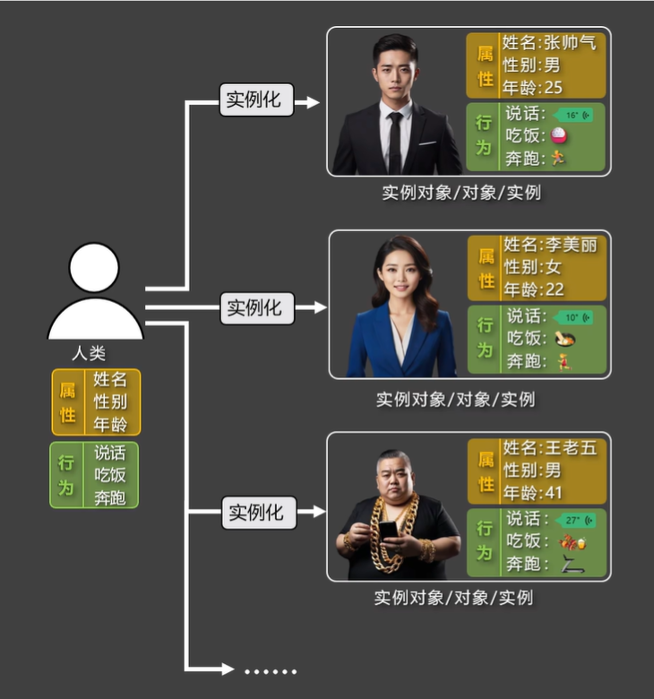

### 类

Python 使用 **`class` 关键字来定义一个类**。类名规范使用**大驼峰写法（`XxxYyy`）**。

#### 基本结构

```python
# 注意缩进！
class Person:
    """类的文档字符串"""
    
    # 类属性 (所有实例对象共享)
    <类属性名>=<属性值>
    
    # 构造方法（初始化实例方法） 必写！
    def __init__(self):
        pass
    
    # 实例方法（自定义方法）
    def <自定义方法名>():
        pass
```

> 要想为一个类创建实例对象，`__init__()` 构造方法是必须的！

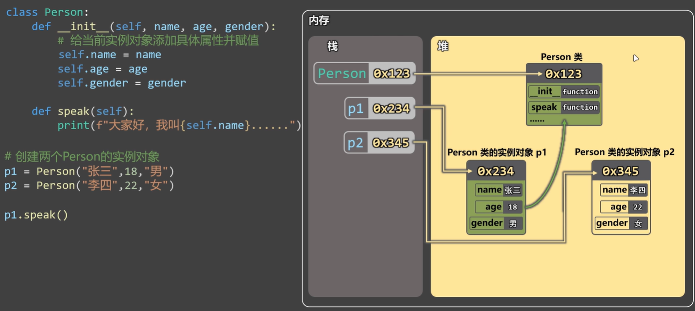

#### \__init__() 构造方法

*类似于 Java 的 constructor()*

> `__init__` 是 Python 特有的魔术方法，表示为 Python 内置提供的类方法，通常固定命名。

描述：**固定命名**，用于**类的实例对象初始化**，为类实例对象的初始化过程中**添加一些自定义属性、执行方法**等操作...

```python
class Person:
    def __init__(self, <自定义形参>):
        pass
```

接收参数：

- **`self`**：表示**指向当前对象的实例**，相当于其他语言的`this`关键字。**必须显式声明**！
- **`自定义形参`**：**在类实例对象初始化过程中，为类实例对象添加的一些自定义初始化属性**

##### 有参与无参构造

- **无参构造**：Python 为**每个类都默认内置了 `__init__(self)` 无参构造方法**，如果**类实例对象不需要初始化属性，则可以忽略它**
- **有参构造**：当类的实例对象**需要在初始化时添加一些自定义属性，则必须显式定义 `__init__(self)` 构造方法**

```python
# 无参构造
class Person:
    pass

person = Person()

# 有参构造
class Student:
    def __init__(self, name, age):
        self.name = name
        self.age = age

student = Student('张三', 18)
```

### 创建一个实例

在 Python 中没有 `new` 关键字，想要**对一个类构造一个实例化对象**，需通过 **`<类名>()`** 的语法来实现，并由其他变量接收。

```python
class Person:
    def __init__():
        pass

person = Person()
```

#### 实例对象的基本信息

##### print() 输出

通过 `print()` 直接输出实例对象，可以得到如下信息：

```python
person = Person()

print(person) # <__main__.Person object at 0x00000225DE7F8D70>
```

> 逐个拆解：
>
> - **`at 0x00000225DE7F8D70`**：表示**该实例对象在内存中的位置**
> - **`Person object`**：表示**该实例对象的所属类**是 Person
> - **`__main__.Person`**：表示**Person类的所属模块是 `__main__`（主模块）**
>
> 总结：`person` 变量是 `__main__` 模块中 Person 类的实例对象，它在内存中的位置是 `0x00000225DE7F8D70`

##### \__dict__ 实例对象的属性

默认情况下，Python 会为每个实例创建 `__dict__` 字典，绝大多数**实例对象自身的属性都存在这个字典里**。

```python
class Animal:
    """这是一个动物类的文档"""

    species = "Unknown"  # 类属性

    def __init__(self, name, age):
        self.name = name      # 实例属性
        self.age = age

    def speak(self):
        pass


class Dog(Animal):
    def __init__(self, name, age, breed):
        super().__init__(name, age)
        self.breed = breed


dog = Dog('旺财', 3, '金毛')
print(dog.__dict__)   # {'name': '旺财', 'age': 3, 'breed': '金毛'}
print(dog.__dict__['name'])   # '旺财'

# 甚至可以直接操作它（虽然不推荐）
dog.__dict__['name'] = '小黑'
print(dog.name)       # 小黑
```

##### \__class__ 找到所属类

作用：**实例对象**可以通过 **`__class__` 魔术属性**，它**指向当前实例对象所属的类定义，用来访问类的属性、方法**。

```python
class Test:
    def get_name(self, name):
        # 为当前操作的实例添加/修改属性
        self.name = name
        print(name)


test = Test()

test.get_name('jack') # 'jack'
test.__class__.get_name(test, 'jack') # 'jack'

# 类型判断
print(test.__class__ is Test) # True
```


##### 类型检查

可以通过 `type()` 和 `isinstance()` 方法检查实例对象的类型。

###### type(obj)

作用：**输出 `obj` 实例对象的类型**。

```python
class Test:
    def __init__():
        pass

test = Test()

print(test) # <class '__main__.Test'>
```

拆解：`__main__.Test` => test 变量是`__main__` 模块的 Test 类实例对象

###### isinstance(obj,Obj)

作用：**判断 `obj` 变量是否是 `Obj`类或其子类的实例对象**

```python
class Test:
    def __init__():
        pass

test = Test()

print(isinstance(test, Test))  # True
print(isinstance(test, object))  # True object 是所有类型的基类

print(isinstance(test, dict))  # False
```

#### 实例对象操作

Python 规定**通过 `.` 点语法可以访问/修改实例对象的属性、调用方法**等操作。

假设有以下类：

```python
class Test:
    name: str = 'test'

    def __init__(self):
        pass
```

##### 属性操作

###### . 访问

直接通过 **`<实例对象>.<属性名>`** 的语法来访**问实例对象的属性**：

```python
test = Test()

# 访问实例属性
print(test.name)
```

###### . 增加/修改

直接通过 **`<实例对象>.<属性名> = <属性值>`** 的语法来**对实例对象的属性进行增加/修改操作**：

- **属性名不存在**：**添加并赋值**
- **属性名存在**：**修改属性值**

```python
test = Test()

# 修改实例属性
test.name = 'test1'
print(test.name)  # test1

# 添加实例属性
test.age = 18
print(test.age)  # 18
```

> Python **为所有类实例默认提供了 `__dict__` 魔术属性**，该魔术属性会**将类实例对象中的所有自定义属性都打包成一个 `dict` 字典**

```python
print(test.__dict__)  # {'name': 'test1', 'age': 18}
```

###### del 删除

Python 规定需要**通过 `del` 关键字来删除实例对象的属性、方法**。

```python
test = Test()	

# 删除实例属性
del test.age
print(test.__dict__)  # {'name': 'test'}

# print(test.age) # 报错
```

##### 方法操作

直接通过 **`<实例对象>.<方法名>()`** 的语法来**调用实例对象的方法**：

```python
class Test:
    name: str = 'test'

    def __init__(self):
        pass

    # 实例方法
    def my_func(self):
        print('my_func')
        
test = Test()

# 调用方法
test.my_func() # my_func
```

### 方法

> [!NOTE]
>
> Python 规定在**类中使用 `def` 关键字定义的函数称为类的方法**，根据不同功能与特性，分为 5 种方法类型：
>
> - **`__<方法名>__(self,...)`魔术方法**
> - **`<方法名>(self,...)` 实例方法**
> - **`@classmethod <方法名>(cls,...)` 类方法**
> - **`@staticmethod <方法名>()` 静态方法**
> - **`@abstractmethod <方法名>()` 抽象方法**
>
> 关于 `self` 形参：
>
> > Python 没有 `this` 关键字，而是**为类中所有`__init__` 等魔术方法、实例方法默认传递了 `self` 形参**，它指向**当前调用该方法的实例对象本身**。
> >
> > 概念：基于 Python 的 **“显式优于隐式”** 规则，要**想使用 `self` 形参，必须在方法第一个参数中显式声明**。
> >
> > - 与其他语言的 `this` 关键字对比：
> >
> > | 特性         | Python (`self`)            | Java/C++ (`this`)                       |
> > | :----------- | :------------------------- | :-------------------------------------- |
> > | 是否显式声明 | ✅ 必须在方法参数中显式声明 | ❌ 隐式存在                              |
> > | 能否改名     | ✅ 可以，但约定用 `self`    | ❌ 关键字，不能改                        |
> > | 访问实例变量 | `self.var`                 | 可直接使用 `var`（同名时需 `this.var`） |
> > | 设计哲学     | 显式优于隐式               | 偏向隐式                                |
>
> 关于 `cls` 形参：用于**指向当前类**

#### 实例方法

##### 基本语法

实例方法指的是**由实例对象调用的方法**，只需在**类中像定义普通函数一样定义**即可。

```python
class <类名>:
    def <实例方法名>(self, <自定义形参>):
        pass
```

接收参数：

- **`self`**：表示**指向当前对象的实例**，相当于其他语言的`this`关键字，**必须显式声明！**
- **`自定义形参`**：**用来接收在调用实例方法时传入的一些实参值**

核心特征：

- ✅ 可以访问和修改**实例属性**（**`self.xxx`**）
- ✅ 调用权限：
  - **通过 `self` 参数**：
    - 可以**调用其他实例方法**

  - **通过 `self.__class__`属性 |  `<类名>.xxx`**：
    - 访问**类属性**、调用**类方法**
    - 调用**类中的静态工具方法**


> **调用实例方法时**：
>
> - `test.instance_func()` 隐式地把 `test` 实例传给了 `self`。
> - **能看到什么**：它能看到 `test` 里的所有小秘密（实例变量）。

```python
class Dog:
    id: id = id('Dog')

    # 构造方法（添加实例对象的一系列属性、执行实例方法）
    def __init__(self, name, age):
        self.name = name
        self.age = age
        self.hello()

    # 实例方法
    # 访问实例属性，调用实例方法
    def set_var(self, name, age):
        self.name = name
        self.age = age
        self.hello()

    # 访问类属性 id
    def get_class_id(self):
        return self.__class__.id or Dog.id

    def hello(self):
        print(f"我是一个狗，我的名字是{self.name}，我今年{self.age}岁了")


dog = Dog('旺财', 3) # 我是一个狗，我的名字是旺财，我今年3岁了
dog.set_var('小黑', 2) # 我是一个狗，我的名字是小黑，我今年2岁了

dog_id = dog.get_class_id()  # 140734944614848
```

##### self 参数隐式传递机制

Python 规定，实例对象调用实例方法时，**不需要显式传递 `self`**，Python 解释器**内部会自动将实例对象传递给实例方法的第一个参数 `self`** ，**指明当前操作的是哪个实例对象身上的属性、方法**。

```python
class Test:
    def get_name(self, args):
        # 为当前操作的实例添加/修改属性
        self.args = args
        print(args)


test = Test()

test.get_name('jack') # jack
```


##### 查找链机制

*类似于 JavaScript 的原型链查找*

Python 规定**类中定义的实例方法是存储在类身上的，不会放在实例对象身上**；所以**实例对象调用实例方法，其实调用的是类身上的同名方法**。

核心机制：**当类的实例对象调用某个具体实例方法时，会先查找实例对象自身有没有该方法，再去类身上去查找并调用**。

核心逻辑：

- **实例对象**：**只保存自己的 “私人数据”（属性），不保存方法**；

  ​	若实例对象**调用的方法与类中的方法同名**，则**优先使用实例对象自己的方法**。

- **类对象**：保存所有实例对象共用的属性、方法

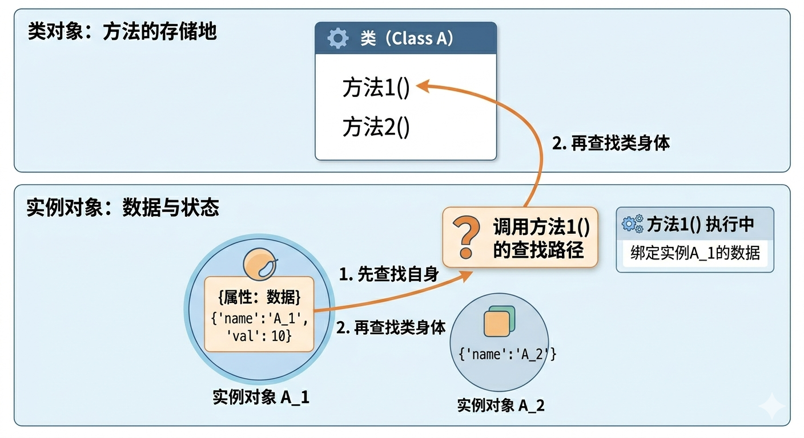

核心原因：这是因为 Python 面向对象设计的核心节能方案 =>**方法复用**。

> 方法复用是 OOP 的精髓：**逻辑只写一遍，但可以处理无数个不同的数据个体。**
>
> 在内存中，方法（函数代码）只在类中存储一份，并不会为每个实例都复制一遍；这就是**方法复用**，也可以说是代码复用。

###### 示例

```python
class Person:
    # 实例方法
    def my_func(self):
        print('my_func')
     
	def get_name_age(self, name, age):
        print(f"{name}:{age}")


person = Person()

# person 会查找 Person 类中的 my_func 、get_name_age 方法并调用
person.my_func()  # 输出 my_func 
person.get_name_age('Jack', 18)  # 输出 Jack:18

print(person.__dict__)  # {}
print(Person.__dict__)  
# {'__module__': '__main__', 'my_func': <function Person.my_func at 0x0000011AC546D850>, 'get_name_age': <function Person.get_name_age at 0x0000011AC546E820>...


# 此时 person 没有 get_name_age 方法，会去 Person 类中查找并调用
person.get_name_age('Jack', 18)  # 输出 Person 类的 get_name_age 方法：Jack:18
print(person.__dict__)  # {}
```

###### 通过类调用实例方法

**当实例对象自身有同名方法时，如果只想用类的同名实例方法**；可以通过：

1. **`<类名X>`.`<实例方法>(<实例对象x>, <自定义参数>...)` 类名直接调用**
2. 使用 **`<实例对象x>.__class__.<实例方法>(<实例对象x>, <自定义参数>...)` 魔术属性找到它的所属类来调用**

但需要**显式传入实例对象**给实例方法的**第一个 `self`参数**，让 Python 内部明确知道**目前是操作的哪个实例对象身上的属性、方法**。

```python
class Person:
    # 实例方法
    def my_func(self):
        print('my_func')
     
	def get_name_age(self, name, age):
        print(f"{name}:{age}")

person = Person()

def fn(name, age):
    print(f"person 实例的 get_name_age 方法：{name}:{age}")

# 为 person 实例对象自己添加一个与类方法同名的 get_name_age 方法
person.get_name_age = fn

person.get_name_age('Jack', 18)  # 输出 person 实例的 get_name_age 方法：Jack:18
print(person.__dict__)  # {'get_name_age': <function fn at 0x000002825268F8A0>}

# 如果只想用 Person 类的 get_name_age 方法，那么需要由 Person 类来主动调用
Person.get_name_age(person, 'jack', 18)  # Person 类的 get_name_age 方法：Jack:18
# 注意：需将 person 实例传递给 `self` 参数，让 Python 内部知道目前是操作的哪个实例对象身上的属性、方法

# 或者通过 person.__class__ 找到它的所属类来调用
person.__class__.get_name_age(person, 'Jack', 18)  # Person 类的 get_name_age 方法：Jack:18
```

#### 类方法

##### 基本语法

Python 类中**使用 `@classmethod` 装饰器定义一个类方法**，**第一个参数为 `cls`（指向类本身）**。

```python
class <类名>:
    
    @classmethod
    def <类方法名>(cls, <自定义形参>): # cls => class 的缩写
        pass
```

接收参数：

- **`cls`**：表示**指向类本身**，**必须显式声明！**
- **`自定义形参`**：**用来接收在调用类方法时传入的一些实参值**

核心特征：

- ✅ 可以通过 **`cls` 参数**访问和修改**类属性**
- ✅ 调用权限：
  - **类方法**：可以**通过 `cls` 参数调用其他类方法**
  - **静态方法**：可以**通过 `cls` 参数调用类中的静态工具方法**
- ❌ 访问限制：
  - 类方法中**不能直接访问实例属性、方法（没有 `self`）**
- ✅ 可以被**子类继承和重写**（`cls` 指向调用它的类）

> 注：**实例对象也可以访问类方法，但是极其不推荐（容易造成歧义）**
>
> > [!NOTE]
> >
> > 这其实是 Python 为了**方便**提供的语法糖。
> >
> > - **实例方法**必须绑定在实例上，因为它需要处理每个对象不同的数据。
> > - **类方法**是属于“家族”的，身为“家族成员”的实例对象，理所应当拥有访问家族公共资源的权限。
> >
> > **实例对象调用类方法时**：
> >
> > - `test.class_func()` 虽然是用实例调用的，但 Python 会通过 `test.__class__` 找到 `Test` 类，并隐式地把 `Test` 类传给 `cls`。
> > - **能看到什么**：它只能看到类级别的共享信息，完全不知道具体是哪个 `test` 实例在调用它。

```python
class Animal:
    # 类属性
    name: str = 'animal'
    age: int = 0

    # 类方法（用于处理 “全局/类级别” 逻辑的方法）
    @classmethod
    def create(cls, name, age):  # cls: 指向 Animal 类
        # 访问类属性，并修改
        cls.name = name
        cls.age = age
        cls.hello()  # 我是dog，我今年3岁了
        
        # cls 指向类，所以可以直接使用 cls() 来创建一个 Animal 类的实例对象
        return cls()

    # 调用其他类方法
    @classmethod
    def hello(cls):
        print(f"我是{Animal.name}，我今年{Animal.age}岁了")
    

# 通过类方法（工厂方法）来创建一个 Animal 类的实例对象
animal = Animal.create('dog', 3)
print(Animal.__dict__) # { 'name':'dog', 'age': 3,... }
print(animal.__dict__) # {}

# 实例对象也可以访问类方法，但是不推荐
# animal.create('cat', 5)
```

##### cls 隐式传递机制

Python 规定，类调用类方法时，**不需要显式传递 `cls`**，Python 解释器**内部会自动将类传递给类方法的第一个参数 `cls`** 。

```python
class Animal:
    
    @classmethod
    def create(cls, name, age):
		pass

Animal.create('dog', 3)
```

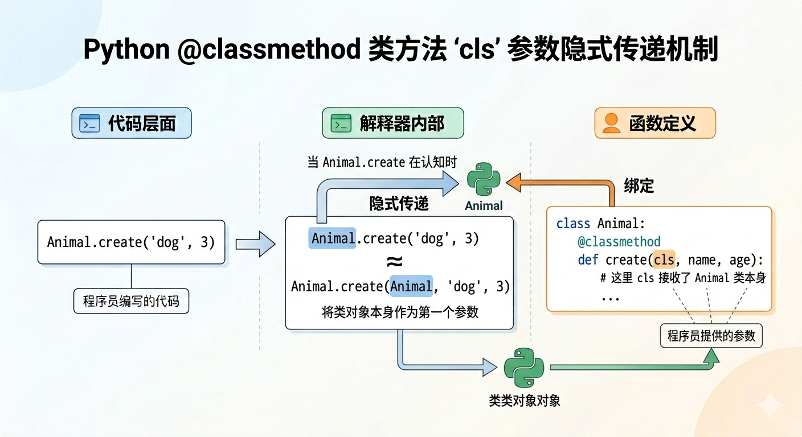

##### 与实例方法的对比

| **特性**         | **实例方法 (Instance Method)**     | **类方法 (Class Method)**                |
| ---------------- | ---------------------------------- | ---------------------------------------- |
| **定义装饰器**   | 无                                 | **使用 `@classmethod`**                  |
| **首个参数约定** | `self` (指向**实例对象**本身)      | `cls` (指向**类对象**本身)               |
| **访问权限**     | 既能访问实例属性，也能访问类属性   | **只能**访问类属性，无法直接访问实例属性 |
| **主要用途**     | 操作特定对象的数据（如：修改姓名） | 操作类级别的数据（如：计数器、工厂模式） |

#### 静态方法（工具方法）

##### 基本语法

Python 类中**使用 `@staticmethod` 装饰器定义一个静态方法**，**它只接收自定义参数**。

```python
class <类名>:
    
    @staticmethod
    def <静态方法名>(<自定义形参>):
        pass
```

接收参数：

- **`自定义形参`**：**用来接收在调用静态方法时传入的一些实参值**

核心特征：

- ✅通过类名调用，通常用于定义**关于类的工具方法**，常用于一些辅助性操作
- ✅ 调用权限：
  - **类方法**：可**通过 `cls` 参数调用**静态工具方法
  - **实例方法**：可**通过 `self.__class__` 调用**静态工具方法
- ❌ 访问限制：
  - 静态方法中**不能访问实例属性、方法（没有 `self` 参数）**
  - 静态方法中**不能访问类属性、方法（没有 `cls` 参数，除非显式使用类名 `MathUtils.pi`）**

> 注：**实例对象也可以访问静态方法，但是极其不推荐（容易造成歧义）**
>
> > [!NOTE]
> >
> > 这其实是 Python 为了**方便**提供的语法糖。
> >
> > - **实例方法**必须绑定在实例上，因为它需要处理每个对象不同的数据。
> > - **静态方法**是属于“家族”的，身为“家族成员”的实例对象，理所应当拥有访问家族公共资源的权限。
> >
> > **实例对象调用静态方法时**：
> >
> > - `test.class_func()` 虽然是用实例调用的，但 Python 会通过 `test.__class__` 找到 `Test` 类，并调用静态方法。

```python
class Person:
    id_card: str = ''
    name: str = ''
    age: int = 0

    def __init__(self, id_card, name, age):
        self.id_card = id_card
        self.name = name
        self.age = age

    # 类方法中调用静态工具方法
    @classmethod
    def get_idcard(cls):
        return cls.mask_idcard(cls.id_card)

    # 实例方法中调用静态工具方法
    def get_info(self):
        id_card = self.__class__.mask_idcard(self.id_card)
        return f"身份证号：{id_card}，姓名：{self.name}，年龄：{self.age}"

    # 静态方法：工具方法，常用于一些辅助性操作
    @staticmethod
    def mask_idcard(id_card):
        return id_card[:6] + '****' + id_card[-4:]


person = Person(name='张三', id_card='123456789012345678', age=18)
print(person.get_info())    # 身份证号：123456********345678，姓名：张三，年龄：18

# 类名直接调用，作为外部工具
print(Person.mask_idcard(person.__dict__['id_card']))  # 123456********345678
```

#### 魔术方法（钩子函数）

> [!IMPORTANT]
>
> Python 的魔术方法是 **Python 内置的“生命周期钩子”或“事件监听器”**。可以理解为 JavaScript 的**钩子系统**。
>
> > 在 JavaScript（尤其是 Vue, React 或 Node.js）中，钩子（Hooks）允许你在特定的时刻（如组件挂载、数据更新）插入自己的逻辑。Python 的魔术方法也是如此，只不过它拦截的是**语言层面的底层操作**。
>
> Python 的魔术方法通常也不需要手动调用，而是由 **Python 解释器在特定事件发生时自动触发**。
>
> | **概念**        | **JavaScript (以 Vue/React 为例)** | **Python 魔术方法**                |
> | --------------- | ---------------------------------- | ---------------------------------- |
> | **创建/初始化** | `constructor` / `onMounted`        | `__new__` / `__init__`             |
> | **销毁**        | `onUnmounted` / `useEffect` return | `__del__`                          |
> | **访问属性**    | `Proxy` 中的 `get` 陷阱            | `__getattr__` / `__getattribute__` |
> | **类型转换**    | `toString()`                       | `__str__` / `__int__`              |
>
> 总结：可以完全把魔术方法看作是 **Python 给开发者留出的“内部接口”**。通过这些接口，可以定义对象在面对加减乘除、循环、打印、上下文切换时的行为。
>
> 这种“钩子”系统的存在，是为了实现 **协议（Protocols）**：
>
> - 如果你实现了 `__iter__`，你就实现了“迭代协议”，你的对象就可以用在 `for...in` 循环里。
> - 如果你实现了 `__call__`，你的对象就变成了“可调用协议”，你可以像调用函数一样调用它：`my_obj()`。
>
> 这让你编写的自定义类可以完美地伪装成 Python 原生对象，这种灵活性正是 Python 强大扩展性的来源。

##### 基本概念

> [!NOTE]
>
> Python 的魔术方法是**隐式调用的协议钩子**，在其他语言中往往对应**运算符重载、构造/析构、内置类型转换、属性拦截器、上下文管理器、可调用对象**等分散在不同语法/接口中的特性。Python 通过统一的**“双下划线方法”机制**将它们集中表达。

魔术方法是 Python 中**以双下划线 `__` 开头和结尾的特殊钩子方法**，用于**自定义类的行为**。

- 核心机制：它们**不需要手动调用**，而是在**特定阶段、特定操作（实例初始化、比较值、`getter/setter`拦截...）**时**自动触发**。

- 核心价值：**可以重写类的魔术方法，使得它们的实例对象在特定阶段、特定操作时能添加一些我们的自定义处理**。

> 注：魔术方法是 Python 语言**预先定义好**的，有**固定名称**（如 `__init__`、`__add__`... 等），**不能创建新的魔术方法名称**。
>
> ```python
> # ❌ 错误尝试：自定义魔术方法名
> class Dragon:
>     def __fly__(self):      # Python 不会自动调用这个
>         print("Flying!")
>     
>     def __breathe_fire__(self):
>         print("Fire!")
> 
> d = Dragon()
> # 这些不会在特定操作时自动触发，需要手动调用：
> d.__fly__()  # 必须显式调用，和普通方法没区别
> ```

根据**不同数据类型与功能应用**，魔术方法有如下分类：

参数说明：

- **`cls`：指向当前类**
- **`self`：指向当前运行时隐式传入的实例对象**
- **`...`：其他参数**

| 类别              | 方法                   | 触发时机             |
| :---------------- | :--------------------- | :------------------- |
| **实例创建/销毁** | `__new__(cls,...)`         | 创建实例前           |
|                   | `__init__(self,...)`             | 初始化实例           |
|                   | `__del__(self,...)`              | 销毁实例             |
| **类属性的访问控制** | `__get__(self,...)` | 访问类属性 |
| | `__set__(self,...)` | 修改类属性 |
| **所有属性的访问控制** | `__setattr__(self,name,value)` | **设置任何属性值时**触发 |
|  | `__getattr__(self,name)` | 访问实例对象中**不存在的属性时**触发 |
|  | `__getattribute__(self,name)` | **访问任何属性时触发** |
|  | `__delattr__(self,name)` | **删除属性时**触发 |
| **字符串**        | `__str__(self,...)`              | `print()`, `str()`   |
|                   | `__repr__(self,...)`             | `repr()`, 交互式环境 |
|                   | `__format__(self,...)`           | `format()`, f-string |
| **容器 **         | `__len__(self,...)`              | `len()`              |
|                   | `__getitem__(self,...)`          | `obj[key]`           |
|                   | `__setitem__(self,...)`          | `obj[key]=value`     |
|                   | `__delitem__(self,...)`          | `del obj[key]`       |
|                   | `__contains__(self,...)`         | `item in obj`        |
| **算术**          | `__add__(self,...)`              | `+`                  |
|                   | `__sub__(self,...)`              | `-`                  |
|                   | `__mul__(self,...)`              | `*`                  |
|                   | `__truediv__(self,...)`          | `/`                  |
|                   | `__floordiv__(self,...)`         | `//`                 |
|                   | `__mod__(self,...)`              | `%`                  |
|                   | `__pow__(self,...)`              | `**`                 |
| **比较**          | `__eq__(self,...)`               | `==`                 |
|                   | `__ne__(self,...)`               | `!=`                 |
|                   | `__lt__(self,...)`               | `<`                  |
|                   | `__le__(self,...)`               | `<=`                 |
|                   | `__gt__(self,...)`               | `>`                  |
|                   | `__ge__(self,...)`               | `>=`                 |
| **其他**          | `__call__(self,...)`             | `obj()`              |
|                   | `__iter__(self,...)`             | `iter()`, 循环       |
|                   | `__next__(self,...)`             | `next()`             |
|                   | `__enter__(self,...)`/`__exit__(self,...)` | `with` 语句          |
|                   | `__hash__(self,...)`             | `hash()`             |
|                   | `__bool__(self,...)`             | `bool()`, `if obj`   |

##### 阶段钩子

###### 实例对象生命周期

这些方法控制对象的 **创建、初始化和销毁 **阶段（不建议重写）：

- **`__new__(cls, ...)`**： 真正创建实例的方法。它是一个静态方法，返回类的一个新实例
- **`__init__(self, ...)`**： 实例初始化方法。当对象被创建后，用来设置初始属性
- **`__del__(self)`**： 析构方法。当对象被垃圾回收时调用

```python
class Person:
    def __new__(cls):
        print('创建实例对象，在__init__之前执行...')
        return super().__new__(cls)

    def __init__(self, name, age):
        self.name = name
        self.age = age
        print('初始化实例中...，添加一些属性')

    def __del__(self):
        print('程序结束，对象被销毁...')

p = Person("Alice", 25)
# 输出: 
# 创建实例对象，在__init__之前执行...
# 初始化实例中...，添加一些属性
# 程序结束，对象被销毁...
```

###### 字符串表示与调试

通过重写以下方法，可以让**实例对象在 `print()` 或 `str`、`f""` 字符串格式化输出时** 更有可读性：

| **方法**         | **触发场景**                                   | **用途**                                       |
| ---------------- | ---------------------------------------------- | ---------------------------------------------- |
| **`__str__`**    | **`print(obj)` 或 `str(obj)`**                 | 自定义对象内容的输出                           |
| **`__repr__`**   | **直接输入变量名或 `repr(obj)`**               | 自定义面向**开发者**的正式描述（通常用于调试） |
| **`__format__`** | **使用 `f""` / `format()` 方法输出对象内容时** | 自定义对象内容的格式化输出                     |

```python
class Book:
    def __init__(self, title, author, pages):
        self.title = title
        self.author = author
        self.pages = pages

    # __str__: print/str() 调用
    def __str__(self):
        return f"《{self.title}》 by {self.author}"

    # __repr__: repr()/调试时调用
    def __repr__(self):
        return f"Book('{self.title}', '{self.author}', {self.pages})"

    # __format__: 格式化字符串时调用
    def __format__(self, format_spec):
        if format_spec == "short":
            return self.title
        return str(self)


book = Book("Python编程", "小张", 300)
print(str(book))      # 《Python编程》 by 小张
print(repr(book))     # Book('Python编程', '小张', 300)
print(f"{book:short}")  # Python编程
```

###### 运算符重载

通过重写以下方法，**外部可以直接用 `+`, `-`, `*`, `==` 等运算符操作对象**。

比较操作：

- **`__eq__(self, other)`**：**对象通过 `==` 比较内容时**触发
- **`__lt__(self, other)`**：**对象通过 `<` 比较内容时**触发
- **`__gt__(self, other)`**：**对象通过 `>` 比较内容时**触发

数值运算：

- **`__add__(self, other)`**：**对象通过 `+` 计算/合并内容时**触发
- **`__sub__(self, other)`**：**对象通过 `-` 计算数值时**触发
- **`__mul__(self, other)`**：**对象通过 `*` 计算/重复生成内容时**触发

```python
class Vector:
    def __init__(self, x, y):
        self.x = x
        self.y = y
    
    # 算术运算符
    def __add__(self, other):      # self + other
        return Vector(self.x + other.x, self.y + other.y)
    
    def __sub__(self, other):      # self - other
        return Vector(self.x - other.x, self.y - other.y)
    
    def __mul__(self, scalar):     # self * scalar
        return Vector(self.x * scalar, self.y * scalar)
    
    def __rmul__(self, scalar):    # scalar * self（右乘）
        return self.__mul__(scalar)
    
    def __truediv__(self, scalar): # self / scalar
        return Vector(self.x / scalar, self.y / scalar)
    
    def __neg__(self):             # -self
        return Vector(-self.x, -self.y)
    
    def __abs__(self):             # abs(self)
        return (self.x ** 2 + self.y ** 2) ** 0.5
    
    # 比较运算符
    def __eq__(self, other):       # self == other
        return self.x == other.x and self.y == other.y
    
    def __lt__(self, other):       # self < other（可用于排序）
        return abs(self) < abs(other)
    
    def __hash__(self):            # hash(self)（用于字典键）
        return hash((self.x, self.y))

v1 = Vector(2, 3)
v2 = Vector(3, 4)
print(v1 + v2)      # 需要定义 __repr__ 才能看到
print(2 * v1)       # 右乘：调用 __rmul__
print(abs(v1))      # 3.605...
```

###### 容器/序列协议

通过重写以下方法，可以**让自定义类像 `list` 或 `dict` 一样可以被索引、切片或迭代**：

- **`__len__(self)`**：定义 `len()` 的行为
- **`__getitem__(self, key)`**：定义获取元素的操作（如 `obj[key]`）
- **`__setitem__(self, key, value)`**：定义设置元素的操作
- **`__iter__(self)`**：返回一个迭代器，让对象支持 `for item in obj`

```python
class Playlist:
    def __init__(self):
        self._songs = []
    
    # __len__: 支持 len()
    def __len__(self):
        return len(self._songs)
    
    # __getitem__: 支持索引访问、切片、迭代
    def __getitem__(self, index):
        return self._songs[index]
    
    # __setitem__: 支持索引赋值
    def __setitem__(self, index, value):
        self._songs[index] = value
    
    # __delitem__: 支持 del
    def __delitem__(self, index):
        del self._songs[index]
    
    # __contains__: 支持 in 操作
    def __contains__(self, item):
        return item in self._songs
    
    # __iter__: 返回迭代器（通常有 __getitem__ 就够）
    def __iter__(self):
        return iter(self._songs)
    
    # __reversed__: 支持 reversed()
    def __reversed__(self):
        return reversed(self._songs)

playlist = Playlist()
playlist._songs = ["Song A", "Song B", "Song C"]
print(len(playlist))    # 3
print(playlist[0])      # Song A
print("Song B" in playlist)  # True
for song in playlist:
    print(song)
```

###### 所有属性访问控制

通过重写以下方法，可以**自定义控制外部操作实例对象中的实例属性、类属性时的行为**：

> 类似于 JavaScript 的 `getter/setter` 拦截器

- **`__setattr__(self,name,value)`**：**设置任何属性时**触发
- **`__getattr__(self,name)`**：**访问实例对象中不存在的属性时**触发
- **`__getattribute__(self,name)`**：**访问任何属性时触发**
- **`__delattr__(self,name)`**：**删除属性时**触发

```python
class SafeDict:
    def __init__(self):
        self._data = {}
    
    # __getattr__: 访问不存在的属性时调用
    def __getattr__(self, name):
        print(f"Getting {name}")
        return self._data.get(name, None)
    
    # __setattr__: 设置任何属性时调用（谨慎使用，容易无限递归）
    def __setattr__(self, name, value):
        print(f"Setting {name} = {value}")
        if name == "_data":
            super().__setattr__(name, value)
        else:
            self._data[name] = value
    
    # __getattribute__: 访问任何属性时调用（更底层，慎用）
    def __getattribute__(self, name):
        print(f"Accessing {name}")
        return super().__getattribute__(name)
    
    # __delattr__: 删除属性时调用
    def __delattr__(self, name):
        print(f"Deleting {name}")
        del self._data[name]

obj = SafeDict()
obj.name = "Alice"   # Setting name = Alice
print(obj.name)      # Accessing name -> Getting name -> Alice
```

###### 可调用对象

通过重写以下方法，**让实例对象可以像函数一样被调用**：

- **`__call__(self,...)`**：**当对象被作为函数被调用时**触发

```python
class Multiplier:
    def __init__(self, factor):
        self.factor = factor
    
    # __call__: 使实例可以像函数一样被调用
    def __call__(self, x):
        return x * self.factor

double = Multiplier(2)
triple = Multiplier(3)

print(double(5))   # 10（像调用函数一样）
print(triple(5))   # 15
print(callable(double))  # True

# 装饰器就是一个常见应用
class TraceDecorator:
    def __init__(self, func):
        self.func = func
    
    def __call__(self, *args, **kwargs):
        print(f"Calling {self.func.__name__}")
        return self.func(*args, **kwargs)

@TraceDecorator
def greet(name):
    return f"Hello {name}"

print(greet("Alice"))  # 先打印 "Calling greet"
```

###### 上下文管理器（with语句）

用于实现 `with` 语句，常用于**自动关闭资源（如文件、数据库连接）**。

- **`__enter__(self)`**: 进入 `with` 代码块时的准备工作。
- **`__exit__(self, exc_type, exc_val, exc_tb)`**: 退出代码块时的善后工作。

```python
class ManagedFile:
    def __init__(self, filename, mode='r'):
        self.filename = filename
        self.mode = mode
        self.file = None
    
    # __enter__: with 块开始时调用
    def __enter__(self):
        print(f"Opening {self.filename}")
        self.file = open(self.filename, self.mode)
        return self.file
    
    # __exit__: with 块结束时调用（无论是否异常）
    def __exit__(self, exc_type, exc_val, exc_tb):
        print(f"Closing {self.filename}")
        if self.file:
            self.file.close()
        if exc_type:
            print(f"Exception: {exc_val}")
        return False  # True 表示抑制异常

# 使用示例
with ManagedFile("test.txt", "w") as f:
    f.write("Hello World")
# Opening test.txt
# Closing test.txt
```

###### 数学运算相关

```python
class Complex:
    def __init__(self, real, imag):
        self.real = real
        self.imag = imag
    
    def __repr__(self):
        return f"{self.real} + {self.imag}i"
    
    # 整数转二进制、进制转换
    def __int__(self):
        return int(self.real)
    
    def __float__(self):
        return float(self.real)
    
    def __complex__(self):
        return complex(self.real, self.imag)
    
    def __bool__(self):
        return self.real != 0 or self.imag != 0
    
    def __round__(self, n=0):
        return Complex(round(self.real, n), round(self.imag, n))

c = Complex(3.7, 4.2)
print(int(c))    # 3
print(bool(c))   # True
print(round(c))  # 4 + 4i
```

> 魔术方法是 Python **鸭子类型（Duck Typing）** 的核心。
>
> 通过实现特定的魔术方法，自定义对象可以“伪装”成任何数据类型，从而完美融入 Python 的生态系统。

#### 总结对比

| 特性             | 实例方法              | 类方法         | 静态方法        | 抽象方法          | 魔术方法               |
| :--------------- | :-------------------- | :------------- | :-------------- | :---------------- | :--------------------- |
| **装饰器**       | 无                    | `@classmethod` | `@staticmethod` | `@abstractmethod` | 无（`__xx__`命名约定） |
| **第一个参数**   | `self`                | `cls`          | 无              | `self` 或 `cls`   | `self`                 |
| **访问实例属性** | ✅                     | ❌              | ❌               | ✅（实例方法）     | ✅                      |
| **访问类属性**   | ✅（`self.__class__`） | ✅（`cls.xxx`） | ❌（需类名）     | ✅                 | ✅                      |
| **调用方式**     | 实例.方法()           | 类.方法()      | 类.方法()       | 不能直接调用      | 自动触发               |
| **可以被继承**   | ✅                     | ✅              | ✅               | ✅ 必须被实现      | ✅                      |
| **使用场景**     | 大多数操作            | 工厂方法、统计 | 工具函数        | 定义接口          | 语言集成               |

### 属性

> [!NOTE]
>
> Python 中的属性可以分为 3 大类：**实例属性**、**类属性**、**魔术属性**，再根据访问控制可以进一步细分：
>
> - **实例属性**
> - **类属性**
> - **`__xx__` 魔术属性**

#### 实例属性

实例属性是属于**每个实例对象独有的**数据，**存储在实例对象的 `__dict__` 魔术属性中**。

实例属性的定义分为两种形式：

- 初始化实例属性：

  ```python
  class Person:
      def __init__(self, name, age):
          self.name = name      # 实例属性
          self.age = age        # 实例属性
          self.email = None     # 实例属性（可先设为 None）
  ```

- 动态添加的实例属性：

  ```python
  person = Person()
  
  person.gender = True
  person.address = 'hunan'
  ```

注：**每个创建的实例都持有各自独立的私有属性数据，互不影响**。

```python
p1 = Person('jack', 18)
p1.gender = True
p1.address = 'hunan'

p2 = Person('tom', 20)
p2.email = 'tom@163.com'

print(p1.__dict__)  # {'name': 'jack', 'age': 18, 'gender': True, 'address': 'hunan'}
print(p2.__dict__)  # {'name': 'tom', 'age': 20, 'email': 'tom@163.com'}
```

##### 向上查找机制

实例对象访问实例属性的**向上查找**顺序：

- 优先级：**先看实例对象自身的 `__dict__` 有没有 > 通过 `__class__` 属性向上查找到实现类的 `__dict__`有没有 > 继续向上查找 > ... > 顶层 object 基类**

```python
class A:
    value = 'A'

    def __init__(self):
        self.value = 'a'


class B(A):
    value = 'B'


class C(B):
    value = 'C'


c = A()
print(c.value)  # a

# 查找顺序：
# 1. 实例 c 的 __dict__ → 找到 "a"，返回
# 如果实例没有：
# 2. C 类的 __dict__
# 3. B 类的 __dict__
# 4. A 类的 __dict__
# 5. object 类的 __dict__
# 6. 抛出 AttributeError
```

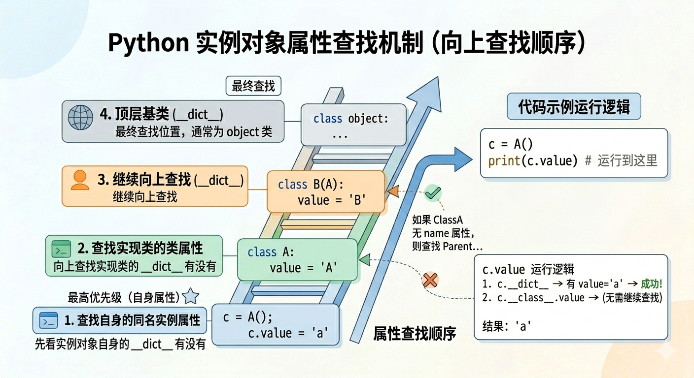

#### 类属性

类属性属于**类本身**，是所有实例**共享**的**公共数据**，**存储在类的 `__dict__` 魔术属性中**。

定义方式：

```python
class <类名>:
    <类属性名> = <值>
```

核心特点：

- **保存在类身上**，可以**通过 `<类名>.<类属性名>` 和 `<实例对象>.<类属性名>` 访问**
- **修改类属性会影响所有实例对象**

示例：

```python
class Book:
    name: str = 'Python'
    price: float = 34.6


b1 = Book()
b2 = Book()

print(Book.__dict__) # { 'name':'Python', 'price': 34.6,... }
print(b1.__dict__) # {} 
print(b2.__dict__) # {} 

# 可以通过类名访问
print(Book.name) # Python
# 也可以通过实例对象访问
print(b1.name) # Python
print(b2.price) # 34.6

# 修改类属性会影响其他实例对象
Book.price = 10

print(b1.price) # 10
print(b2.price) # 10
```

##### 关于实例对象访问类属性

- **优先级：同名实例属性 > 同名类属性**
- 虽然**实例对象可以访问类属性，但是并不能通过 `<实例对象>.<属性名> = <值>`的形式对类属性进行修改，因为这是给实例对象身上添加一个属性**。

```python
b1.name = 'JavaScript' # 这个其实是给 b1 实例对象自身添加一个 name 属性

print(Book.__dict__['name']) # Python
print(b1.__dict__) # { 'name': 'JavaSCript' }

# 之后再访问 b1.name 则是拿取的 b1 实例对象身上的 name 属性
print(b1.name)  # JavaScript

# 如果想通过 b1 找到它所属类的 name 属性，则需通过 __class__.__dict__ 来访问
print(b1.__class__.__dict__['name']) # Python
```

##### 实例属性 vs 类属性

```python
class Demo:
    class_attr = "我是类属性"      # 类属性
    
    def __init__(self):
        self.instance_attr = "我是实例属性"  # 实例属性

d1 = Demo()
d2 = Demo()

# 存储位置不同
print(d1.__dict__)      # {'instance_attr': '我是实例属性'}
print(Demo.__dict__)    # 包含 'class_attr' 但不包含 'instance_attr'

# 访问优先级：实例属性 > 类属性
d1.instance_attr = "修改实例属性"
print(d1.instance_attr)  # 修改实例属性（实例属性）
print(d2.instance_attr)  # 我是实例属性（不影响其他实例）

# 通过实例修改类属性？实际上是创建实例属性
d1.class_attr = "看起来像修改类属性"
print(d1.class_attr)      # 看起来像修改类属性（实例属性）
print(d2.class_attr)      # 我是类属性（类属性未变）
print(Demo.class_attr)    # 我是类属性（类属性未变）
```

##### 向上查找机制

###### 类查找

当一个子类继承了多个类时：

- 查找某个类属性：**优先查找自身有没有 > 通过 `__class__` 属性向上查找父类有没有 > 继续向上查找顶层基类有没有...**.，在这个过程中，**有则取，无则继续向上查找，直到顶层基类**为止。

```python
class GrandParent:
    value = 'grand_parent'

class Parent(GrandParent):
    value = 'parent'

class Child(Parent):
    pass

print(Child.value)  # parent
```

###### 实例对象查找

当实例对象要访问某个类属性时：

- 优先级：**自身的同名实例属性 > 通过 `__class__` 属性找到实现类，去查看实现类的类属性 > 父类中的类属性 > ... > 顶层基类**

```python
class GrandParent:
    value = 'grand_parent'


class Parent(GrandParent):
    # value = 'parent'
    pass


class Child(Parent):
    pass


child = Child()
# 先看 child 实例对象自身有没有，没有再看 Parent 类，再看 GrandParent 父类，最后 object 基类
print(child.value)  # grand_parent

# 往实例对象添加 value 属性
child.value = 'child'
print(child.value)  # child
```

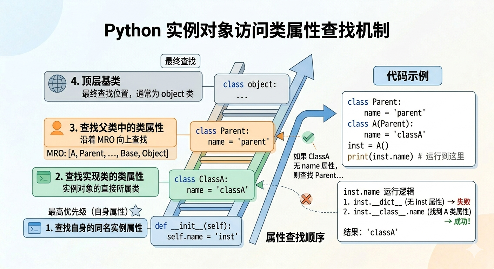

#### 魔术属性

> 如果说**魔术方法**是对象的“动作钩子”（行为），那么**魔术属性**（Magic Attributes）就是对象的“元数据标签”。

魔术属性是 Python 中**以双下划线开头和结尾**的特殊属性，它们由 Python 解释器**自动管理**，用于提供对象或类的元信息。

与魔术方法不同，魔术属性**不需要调用**，直接访问即可。

核心概念：魔术属性是**任何对象都内置的 “元数据标签” （类、函数、模块最终都是对象，万物皆对象）**；通常由 Python 自动维护，记录了关于**类、实例对象或模块**的**结构信息**。

根据不同功能应用，常用魔术属性分为 3 类：

| 魔术属性            | 所属对象     | 说明             |
| :------------------ | :----------- | :--------------- |
| `__dict__` (最常用) | 实例/类/模块 | 属性的字典       |
| `__class__`         | 实例         | 对象所属的类     |
| `__name__`          | 类/函数/模块 | 名称字符串       |
| `__module__`        | 类/函数      | 定义所在的模块名 |
| `__bases__`         | 类           | 直接父类元组     |
| `__mro__`           | 类           | 方法解析顺序元组 |
| `__doc__`           | 类/函数/模块 | 文档字符串       |
| `__slots__`         | 类           | 允许的属性名元组 |
| `__file__`          | 模块         | 模块文件路径     |
| `__package__`       | 模块         | 包名             |
| `__annotations__`   | 函数/类      | 类型注解         |
| `__defaults__`      | 函数         | 默认参数值       |
| `__code__`          | 函数         | 编译后的代码对象 |
| `__closure__`       | 函数         | 闭包单元格       |
| `__dict__`          | 模块         | 模块的全局字典   |

##### 类与实例

Python 为类与实例对象提供了如下魔术属性：

| **魔术属性**     | **含义与用途**                                               |
| ---------------- | ------------------------------------------------------------ |
| **`__dict__`**   | **最常用**。**存储对象属性的字典。修改它会直接影响实例**。   |
| **`__class__`**  | **指向对象所属的类**。通过它可以获取类名或再次实例化。       |
| **`__name__`**   | **类、函数或模块的名字**。在模块中常用作入口判断。           |
| **`__doc__`**    | 存储类或函数的**文档字符串**（Docstring）。                  |
| **`__module__`** | 该**对象所在的模块名**。                                     |
| **`__slots__`**  | 用于内存优化。如果你有数百万个小对象，可以用 `__slots__` 告诉 Python：“我只会有这几个属性，别给我准备字典了”。 |

###### \__dict__ 类与实例对象的自身属性

默认情况下，Python 会**为类与它的每个实例创建 `__dict__` 字典**，绝大多数**类的属性与它的实例对象自身属性都存在这个字典里**。

```python
class Animal:
    """这是一个动物类的文档"""

    species = "Unknown"  # 类属性

    def __init__(self, name, age):
        self.name = name      # 实例属性
        self.age = age

    def speak(self):
        pass


class Dog(Animal):
    def __init__(self, name, age, breed):
        super().__init__(name, age)
        self.breed = breed


dog = Dog('旺财', 3, '金毛')
print(dog.__dict__)   # {'name': '旺财', 'age': 3, 'breed': '金毛'}
print(dog.__dict__['name'])   # '旺财'

# 甚至可以直接操作它（虽然不推荐）
dog.__dict__['name'] = '小黑'
print(dog.name)       # 小黑
```

###### \__slots__ 选择性存储属性

默认情况下，Python 为每个实例创建 `__dict__`，且实例的所有属性都会存储，这很灵活但费内存。

描述：当**一个实例对象的属性过多时，可通过 `__slots__` 属性来限制实例对象所对外产出的字典，用一些极少的属性来替代 `__dict__`**，一次来节省内存。

```python
class Point:
    __slots__ = ('x', 'y')  # 固定属性，不再有 __dict__

p = Point()
p.x = 10
# p.z = 20  # 这会报错，因为 z 不在 slots 里
```

###### 其他

```python
# __class__: 对象所属的类
print(dog.__class__)          # <class '__main__.Dog'>
print(dog.__class__.__name__) # 'Dog'

# __name__: 类/函数/模块的名称（字符串）
print(Dog.__name__)    # 'Dog'

# __module__: 类/函数/实例所属的模块名
print(Dog.__module__)  # '__main__'

# __bases__: 类的直接父类（元组）
print(Dog.__bases__)   # (<class '__main__.Animal'>,)

# __base__: 类的第一个直接父类
print(Dog.__base__)    # <class '__main__.Animal'>

# __mro__: 方法解析顺序（Method Resolution Order）
print(Dog.__mro__)     # (<class '__main__.Dog'>, <class '__main__.Animal'>, <class 'object'>)

# __subclasses__(): 返回类的直接子类（方法，不是属性）
print(Animal.__subclasses__())  # [<class '__main__.Dog'>]

# __doc__: 文档字符串
print(Animal.__doc__)   # '这是一个动物类的文档'

# __annotations__: 类型注解（Python 3.10+）
def func(x: int, y: str) -> bool:
    pass
print(func.__annotations__)  # {'x': <class 'int'>, 'y': <class 'str'>, 'return': <class 'bool'>}
```

##### 函数

```python
def calculate(x, y=10, *args, **kwargs):
    """计算函数示例"""
    return x + y

# __code__: 编译后的代码对象
print(calculate.__code__)
print(calculate.__code__.co_varnames)  # 局部变量名：('x', 'y', 'args', 'kwargs')

# __defaults__: 默认参数值
print(calculate.__defaults__)  # (10,)

# __kwdefaults__: 关键字默认参数（Python 3）
print(calculate.__kwdefaults__)  # None

# __closure__: 闭包信息
def outer():
    msg = "hello"
    def inner():
        return msg
    return inner
closure_func = outer()
print(closure_func.__closure__)      # 闭包单元格对象
print(closure_func.__closure__[0].cell_contents)  # 'hello'

# 其他函数属性
print(calculate.__name__)      # 'calculate'
print(calculate.__module__)    # '__main__'
print(calculate.__doc__)       # '计算函数示例'
print(calculate.__annotations__)  # {}
```

##### 模块

```python
# 假设这个文件是 example.py

print(__name__)        # '__main__'（直接运行）或 'example'（被导入）
print(__file__)        # 当前文件的路径
print(__package__)     # 包名（如果有）
print(__doc__)         # 模块的文档字符串

# 示例：判断是否直接运行
if __name__ == "__main__":
    print("This script is run directly")
else:
    print("This script is imported as a module")
```

### 数据分层管理机制与方法复用

#### 数据分层管理机制

Python 将**数据存储在不同的命名空间（类变量 vs 实例变量）**中，以确保代码**既能共享资源，又能保持个体差异**。

- **类属性：** 定义在类中、方法之外。它们由所有实例**共享**。适用于**存储常量或所有实例通用的属性**
- **实例变量：** 存储在 `self` 中。它们是每个实例**独有**的。适用于**存储每个实例个体的独立特征**。

#### 为什么需要 self？

**核心原因**：同一个类会创建多个实例，**`self` 形参让方法知道「当前操作的是哪个实例的数据」**。

核心价值：`self` 是连接**抽象定义**与**具体数据**的**纽带关联**。

**如果没有 `self`：**

- 类不知道该去修改哪一个实例的数据。
- 方法将无法访问实例的属性，因为它没有指向特定内存地址的指针。

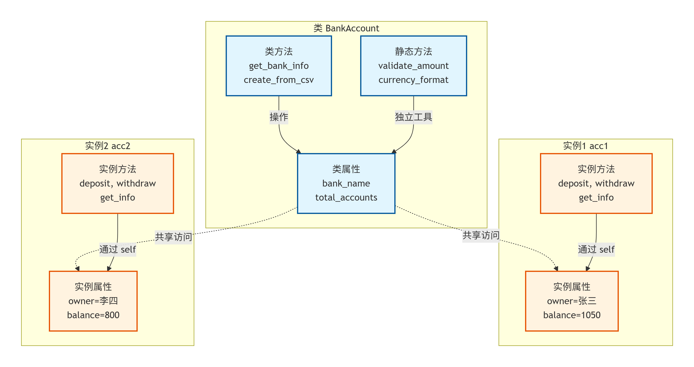

##### 为什么不能省略？

1. **显式优于隐式：** Python 的设计哲学要求明确指出变量的来源。如果不写 `self.name`，Python 会在局部作用域或全局作用域寻找 `name`，而不会去实例的口袋里翻找。

   不过，在代码编写中，`self` 会隐式传递给方法

   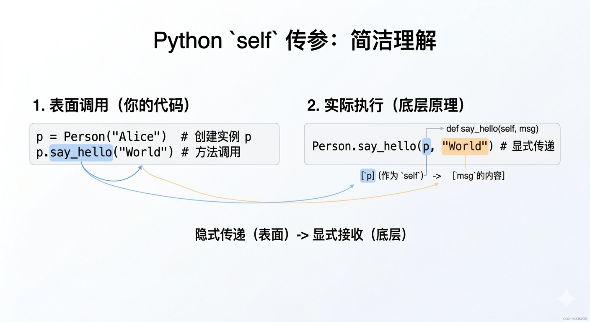

2. **区分属性与局部变量：** 在方法内部，`self.x` 代表实例属性，而 `x` 仅仅是一个临时变量。

| 没有 self 的问题是…        | self 的解决方案                            |
| :------------------------- | :----------------------------------------- |
| 方法无法区分操作哪个实例   | `self` 指向当前实例                        |
| 每个实例的数据需要独立存储 | `self.attr` 绑定到特定实例                 |
| 方法代码只需一份           | 所有实例共享方法，通过 `self` 访问各自数据 |

#### 方法复用

> 为什么实例方法都存在类中，而不是每个实例存一份？
>
> 核心原因：**逻辑共享，数据隔离**，一切为了代码复用。

Python 为了节省内存性能，设计了一套存储方案，即**方法复用**。

方法复用是 OOP 的精髓：**逻辑只写一遍，但可以处理无数个不同的数据个体。**

在内存中，方法（函数代码）只在类中存储一份，并不会为每个实例都复制一遍。这就是**方法复用**。

核心价值：

- **逻辑统一：** 所有的实例都共享类中定义的方法代码，节省内存。

- **行为一致：** 只要是同一个类的实例，它们处理数据的方式就是相同的，确保了系统的可预测性。

#### 三者串联逻辑

核心定义：**类 (逻辑中心)** + **实例 (数据载体)** + **`self` (连接器)** = **高效复用**

1. **类**定义了模板（包含**复用的方法**和**类变量**）
2. **实例**根据模板创建，并通过 `__init__` 开辟独立的内存空间存放**实例变量**
3. **`self`** 在调用方法时，将**实例的引用**传递给方法，使得一套公共的代码能够精准地操作不同实例的私有数据

这种机制完美平衡了“代码冗余的最小化”（方法复用）与“数据操作的精确化”（`self` + 实例变量）。

#### 属性查找链机制

在 Python 中，属性查找链（Attribute Lookup Chain）是面向对象的核心。当你访问一个对象的属性时，Python 会按照一个严谨的顺序**“从下往上”搜索，直到找到为止**。

##### 查找链

1. **实例查找 (Instance)**

   - 首先检查**对象自己的 `__dict__`（实例属性）**。

   - 例如：`r1.name`，如果实例里存了 "Gort"，查找结束。


2. **类查找 (Class)**

   - 如果在实例中没找到，**顺着 `__class__` 指针去所属类的 `__dict__` 里找**。

   - 例如：`r1.say_hi`，通常方法都存在这里。


3. **父类查找 (MRO/Superclass)**

   - 如果在当前类也没找到，就顺着 **MRO (方法解析顺序)** 往上爬，去查找所有的父类。

   - 这就是“继承”的本质。


4. **终点站 (Object)**
   - 如果一路上到 `object` 类（所有类的祖先）都还没找到，Python 就会抛出 `AttributeError` 报错。


其中，查找链中最核心的就是 **`__class__` 魔术属性**，它用来**指向当前实例对象的所属类**。

```python
class Person:
    person_id = "person_id"

    def __init__(self, name, age):
        self.name = name
        self.age = age


p1 = Person("张三", 18)
# 1. 实例对象身上查找，通过 __dict__ 属性集
print(p1.__dict__)  # {'name': '张三', 'age': 18}

# 2. 通过 实例对象.__class__ 找到它的所属类，并在所属类对象身上查找，通过 __dict__ 属性集
print(p1.__class__)  # <class '__main__.Person'>
print(Person.__dict__)  # {'person_id': 'person_id'} 找到了！
```

##### \__class__ 实例所属类指针

在 Python 的底层设计中，`__class__` 是连接“实例”与“类”的**灵魂纽带**。

在 Python 中，**实例本身其实是非常“贫瘠”的**。它通常只存储数据（如 `name`, `age`），而不存储方法（函数）。

所以在属性查找链机制中，实例向上查找的过程，就是通过 **`实例对象.__class__` 指针来索引它的所属类**。

- **它的角色**：它是一个**隐藏的属性**，存储在每个实例中。
- **它的指向**：它永远指向创建该实例的那个 **类对象**。
- **它的意义**：它是 Python 实现“属性查找链”的物理基础。

```python
class Robot:
    
	def say_hi(self):
        pass
    
r1 = Robot()
r1.say_hi()
```

当你输入 `r1.say_hi()` 时：

1. **实例碰壁**：Python 查看 `r1` 的内存空间，发现只有 `name` 数据，没有 `say_hi`。
2. **顺藤摸瓜**：Python 自动读取 `r1.__class__`。
3. **定位目标**：顺着这个指针，Python 瞬间瞬移到了 **Robot 类**。
4. **抓取成功**：在 Robot 类中找到了 `say_hi` 函数。
5. **反向注入**：将 `r1` 实例反手传给函数的 `self` 参数。

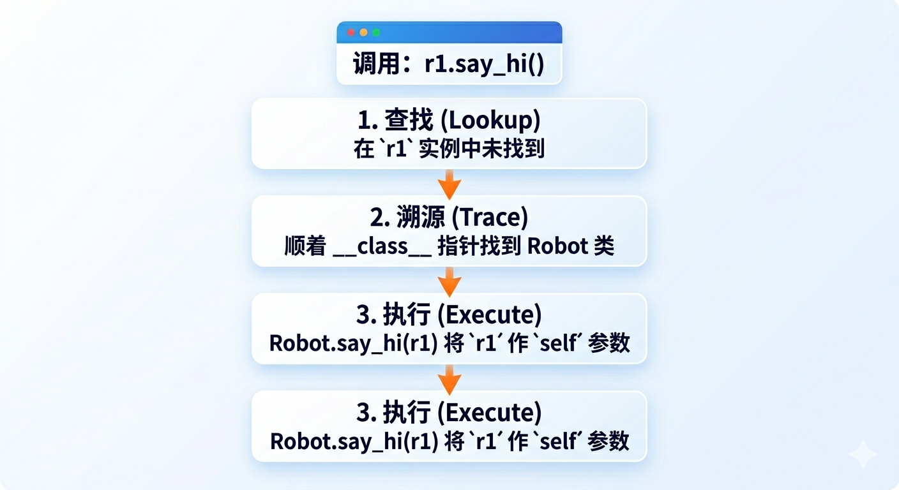

### 继承

> [!NOTE]
>
> OOP 面向对象编程的四个特性是**继承性、多态性、封装性、抽象性**，这四大特性组合起来构建了强大、易扩展的面向对象程序。
>
> | 概念     | 解释                                 | Python 实现方式                    |
> | :------- | :----------------------------------- | :--------------------------------- |
> | **封装** | 隐藏内部实现细节，**只暴露必要接口** | **私有属性 `__attr`、`@property`** |
> | **继承** | **子类复用父类代码，建立层级关系**   | **`class Child(Parent):`**         |
> | **多态** | **同一接口，不同实现**               | 方法重写、鸭子类型                 |
> | **抽象** | **定义接口规范，不关心具体实现**     | **`ABC` 模块、`@abstractmethod`**  |
>
> 为什么用 OOP？
>
> 1. **代码复用** - 继承减少重复代码
> 2. **易于维护** - 封装让修改影响范围小
> 3. **扩展性好** - 多态让新增类型不影响旧代码
> 4. **模块化** - 对象独立，便于团队协作

继承是面向对象编程的四大特性之一，即**允许一个类（子类）继承另一个类（父类）的属性和方法**，实现**代码复用、建立层次关系**。

#### 继承方式

继承又分为 **单继承** 和 **多继承** 两种形式：

##### 单继承

- **一个类想要继承某个类**需要通过 **`class <子类名>(父类名):`**的语法来实现

```python
class Father:
    pass

class Child(Father):
    pass
```

核心作用：此时 **`Child` 子类就自动拥有了 `Father` 父类的所有属性、方法**。

##### 多继承

多继承指的是**允许一个子类可以同时继承多个父类的属性、方法**，实现**多态性**。

语法：

```python
class Person:
    pass

class Worker:
    pass

class Student(Person, Worker):
    pass
```

描述：此时，**`Student` 子类同时继承了 `Person` 和 `Worker` 两个父类，同时具备了它们的属性、方法**。

###### 继承顺序

在多继承中，**`<子类名>(父类1，父类2..)` 中的 `(父类1，父类2..)` 定义的顺序**会极大**影响多个父类之间的构造方法执行顺序、属性查找顺序**。

核心概念： **`(父类1，父类2..)` 的书写顺序决定了子类的 `__mro__` 继承链查找顺序**。

```python
class Person:
    pass

class Worker:
    pass

# --------------------------------------
class Student(Person, Worker):
    pass

print(Student.__mro__)
# (<class '__main__.Student'>, <class '__main__.Person'>, <class '__main__.Worker'>, <class 'object'>)

# 换一下
class Student2(Worker,Person):
    pass

print(Student2.__mro__)
# (<class '__main__.Student'>, <class '__main__.Worker'>, <class '__main__.Person'>, <class 'object'>)
```

可以看出，在`(A,B,C...)`多继承语法中，**始终以传入的第一个父类作为直接实现父类**，其余的父类都是在此实现类的基础上扩展；所以在**后续的属性查找、构造方法执行**，传入的第一个父类**始终优先于**其他父类执行。

###### 多父类构造方法执行顺序

前面提到，**多继承语法中 `(A,B,C...)` 书写的顺序决定了子类的 “继承链”**。

所以有如下注意事项：

- 当子类**没有**定义 `__init__` 构造方法**，**实现的父类都定义了它们的构造方法，那么**只会**执行多继承语法**`(A,B,C...)`** 中传入**第一个父类 `A` 的构造方法**，其他 `B`、`C` 父类的构造方法则不会执行。

```python
class Person:
    def __init__(self):
        print('Person 类的构造方法')

class Worker:
    def __init__(self):
        print('Worker 类的构造方法')

# -----------------------------
class Student(Person, Worker):
    pass

student = Student()
# 输出：Person 类的构造方法 => Worker 类并没有执行它的构造方法

# 换一下
class Student2(Worker, Person):
    pass

student = Student2()
# 输出：Worker 类的构造方法 => Person 类并没有执行它的构造方法
```

- 当子类**定义了`__init__`构造方法**，需要**在子类空间中管理其他多个父类的共有属性**时。

  **不能通过 `super()` 来访问父类了**。因为 **`super()` 始终指向 多继承语法（A,B,C...）中传入的第一个父类 `A`**；

  解决办法：**通过 `<父类名>.__init__()`直接进行硬编码**。

  ```python
  class Person:
      def __init__(self, name, age, gender):
          self.name = name
          self.age = age
          self.gender = gender
  
      def speak(self):
          print(f"我是{self.name},今年{self.age}岁,性别{self.gender}")
  
  class Worker:
      def __init__(self, company):
          self.company = company
  
      def do_word(self):
          print(f"我在{self.company}做兼职")
  
  class Student(Person, Worker):
      def __init__(self, name, age, gender, company, stu_id, grade):
          # 多继承中，super() 始终指向第一个父类
          # 如果需要调用其他父类的构造方法，需要通过 <类名>.__init__ 手动调用
          # 注意要显式传入第一个 self 参数
          Person.__init__(self, name, age, gender)  # Person 父类的公共属性
          Worker.__init__(self, company)  # Wroker 父类的公共属性
  
          # Student 子类自己的属性
          self.stu_id = stu_id
          self.grade = grade
  
      def study(self):
          print(f"我在学习，我的学号是{self.stu_id},我的成绩是{self.grade}")
  
          
  student = Student('student', 18, '男', '肯德基', '20100507', '初三')
  print(student.__dict__)
  # {'name': 'student', 'age': 18, 'gender': '男', 'company': '肯德基', 'stu_id': '20100507', 'grade': '初三'}
  
  student.speak()  # 我是student,今年18岁,性别男
  student.do_word()  # 我在肯德基做兼职
  student.study()  # 我在学习，我的学号是20100507,我的成绩是初三
  ```

###### 多父类属性查找顺序

核心概念：

1. 当子类继承多个父类时，如果**多个父类中存在相同名称的属性**，那么在**子类中访问该属性**时：

2. 会**优先访问**多继承语法（A,B,C...）中**第一个父类 `A`**中的属性，如果第一个父类中不存在该属性，则会继续查找第二个父类`B`、`C`，以此类推，直到 object 顶层父类。

3. 如果所有父类中都不存在该属性，则会抛出 `AttributeError` 异常。

简单理解：**子类自身 > (A,B,C...) 传入的第一个父类 `A` 查找 >  (A,B,C...) 传入的第二个父类 `B` 查找 > ... > `object` 顶层父类**。

```python
class Person:
    name = 'person'

class Worker:
    name = 'worker'
    
class Student(Person, Worker):
    pass

student = Student()
print(student.name)  # person
print(Student.__mro__)
# (<class '__main__.Student'>, <class '__main__.Person'>, <class '__main__.Worker'>, <class 'object'>)

# 换一下父类传入顺序
class Student2(Worker, Person):
    pass

student2 = Student2()
print(student2.name)  # worker
print(Student2.__mro__)
# (<class '__main__.Student2'>, <class '__main__.Worker'>, <class '__main__.Person'>, <class 'object'>)
```

可以看出，Python 是**严格按照 `<子类>.__mro__` 属性中存储的 “继承链” 顺序进行属性、方法查找的**。

##### \__mro__ 继承链

Python 严格按照 **`<类名>.__mro__`** 魔术属性中定义的顺序来**执行某个类的继承链**，它**记录了子类实例对象向上查找属性、方法的顺序**。

```python
class GrandFather:
    name = 'grand_father'

class Father:
    name = 'father'

class Child(Father):
    pass

# 从左往右 依次是 当前类 > 父类 > ... > 顶层基类
print(Child.__mro__) 
# (<class '__main__.Child'>, <class '__main__.Father'>, <class '__main__.GrandFather'>, <class 'object'>)
```

##### dir() 查看实例可用的属性集

`dir()` 是 Python 的一个内置函数，它的核心作用是：**列出对象的所有“属性”和“方法”**。

它有 2 个写法：

- **不传参数**：返回**当前本地作用域内已定义的变量、函数、类和导入的模块**

  > 每个新建的 `.py` 模块，都会默认导入以下模块：
  >
  > - ['__builtins__', '__cached__', '__doc__', '__file__', '__loader__', '__name__', '__package__', '__spec__']

  ```python
  name = 'jack'
  age = 10
  
  def my_func():
      pass
  
  class Person:
      pass
  
  person = Person()
  print(dir())
  
  # 默认的：['__builtins__', '__cached__', '__doc__', '__file__', '__loader__', '__name__', '__package__', '__spec__',... ]
  # 自定义的：['Person', 'age', 'my_func', 'name', 'person',...]
  ```

- **传入实例对象**：可以**查看任何对象（字符串、列表、类实例等）可用的属性和方法（包括继承其他类的属性、方法）**

  ```python
  class Person:
      name = 'person'
      
      def run(self):
          pass
  
  class Student(Person):
      stu_id = id('20251368')
      
      def hello(self):
          pass
  
  
  student = Student()
  
  # ['__class__', '__delattr__', '__dict__', '__dir__', '__doc__', '__eq__', '__firstlineno__', '__format__', '__ge__', '__getattribute__', '__getstate__', '__gt__', '__hash__', '__init__', '__init_subclass__', '__le__', '__lt__', '__module__', '__ne__', '__new__', '__reduce__', '__reduce_ex__', '__repr__', '__setattr__', '__sizeof__', '__static_attributes__', '__str__', '__subclasshook__', '__weakref__', ]
  # 以上这些属性、方法都是继承自 object 顶层基类的
  
  print(dir(student))
  # [...,'hello', 'name', 'run', 'stu_id']
  
  print(dir(Student))
  # [...,'hello', 'name', 'run', 'stu_id']
  
  # [...,'name', 'run']
  print(dir(Person))
  ```

###### 查找机制

1. **实例对象本身**（`__dict__` 中的私有属性）
2. **它所属的类**（类属性和方法）
3. **继承链上的所有父类**（一直追溯到 `object` 基类）

#### 子类实例初始化决策流程

##### 核心概念

1. 当**子类继承了某个父类**，会**自动调用父类的 `__init__` 构造方法完成父类的属性、方法初始化**，此时**子类就自动拥有了父类的所有属性、方法**。

```python
class Father:
    name = 'father'

    def __init__(self):
        print('父类的 __init__ 构造方法执行')

    def say(self):
        print('父类的 say 实例方法')
        pass

class Child(Father):
    pass

child = Child()

print(child.name)
child.say()
# 输出：
# 父类的 __init__ 构造方法执行
# father
# 父类的 say 实例方法
```

2. 与之同理，**由于 Python 会为所有类预设一个 `__init__` 无参构造方法，即使父类没有显式声明 `__init__` 构造方法，也会执行父类的无参构造方法，完成父类的所有属性、方法初始化**。

```python
class Father:
    name = 'father'

    def say(self):
        print('父类的 say 实例方法')

class Child(Father):
    pass

child = Child()

print(child.name)
child.say()
# 输出：
# father
# 父类的 say 实例方法
```

3. 如果**父类显式定义了 `__init__` 构造方法，且带有参数**，但**子类没有显式定义 `__init__` 构造方法**时。

   在**子类创建实例**时，**会选择取用父类的 `__init__` 构造方法为准进行传参来初始化**，如果**强行使用子类构造方法初始化则会报错**。

> 相当于**在子类空间里，按照父类的规则对子类实例对象的属性进行初始化**
>
> > 当执行 `child = Child('Jack')` 时：
> >
> > - 内存中只产生了一个对象，它的类型（`__class__`）始终是 `Child`。
> > - Python 发现 `Child` 类里没写 `__init__`，于是顺着**继承链（MRO）**向上找到了 `Parent` 的 `__init__`。
> > - 这个 `__init__(self, name)` 被执行时，传入的 `self` 依然是那个 `Child` 类型的实例。

```python
class Father:
    def __init__(self, name, age):
        print(f"父类初始化执行，self 的类型是: {type(self)}") # <class '__main__.Child'>
        self.name = name
        self.age = age

class Child(Father):
    pass

# child = Child() 
# 由于子类没有定义 __init__ 构造方法，则会去查找父类 __init__ 构造方法，但父类的构造方法需要传递参数
# 报错：TypeError: Father.__init__() missing 2 required positional arguments: 'name' and 'age'

child = Child('child', 18) # 调用父类的构造方法，必须传父类要求的参数，在子类空间中按照父类规则进行初始化
print(child.__dict__)  # {'name': 'child', 'age': 18}
print(Father.__dict__) # {'name': 'child', 'age': 18,...}
```

4. 当子类显式定义了 `__init__` 构造方法，就需要用到 `super()` 内置函数了。 


##### super() 访问父类

###### 核心概念

如果**子类显式定义了 `__init__` 构造方法**，则**以子类自己的规则进行属性初始化**，且**会覆盖并阻断父类的 `__init__` 构造方法执行**。

那么父类定义的那些实例属性将**不会出现在子类对象中**。子类虽然继承了方法，但**失去了父类预设的初始数据状态**。

```python
class Father:
    def __init__(self):
        print('父类的 __init__ 构造方法执行')

class Child(Father):
    def __init__(self):
        print('子类的 __init__ 构造方法执行')

child = Child()
# 输出：
# 子类的 __init__ 构造方法执行
```

此时，需要**在子类的构造方法中通过 `super()` 显式调用父类的构造方法**，用于**在子类中访问父类，执行父类的初始化逻辑**。

```python
class Father:
    def __init__(self):
        print('父类的 __init__ 构造方法执行')

class Child(Father):
    def __init__(self):
        super().__init__() # 执行父类的初始化
        print('子类的 __init__ 构造方法执行')

child = Child()
# 输出：
# 父类的 __init__ 构造方法执行
# 子类的 __init__ 构造方法执行
```

> 注：如果在子类写了 `__init__` 但没有写 `super()`，父类的 `__init__` 初始化逻辑**永远不会执行**。只有当子类**完全没写** `__init__` 时，Python 才会因为**在子类找不到构造器，而向上“搜索”**并执行父类的构造器。

###### 核心目的（空间管理、属性隔离）

> [!NOTE]
>
> 这种设计的优势
>
> - **代码复用**：不需要在每个子类里重复写一遍 `self.name = name`。
> - **易于维护**：如果父类修改了基础属性的逻辑（比如给名字加个前缀），所有子类都会通过 `super()` 自动同步，而不需要一个个去改。

​	为了**区分父子类的层级关系**，**保证父类与子类的属性数据隔离【共有（父子类共享）属性与私有属性（子类特有）隔离】**；

​	通过 **`super()`** 内置函数**可以在父类空间专门保存父子类共有的共享属性**，而**让子类在自己空间中专门保存子类自己的额外属性**；等后续**子类访问某个父子类共有的共享属性**时，直接**通过 “继承链” 向上查找去父类空间里检索取用即可**。

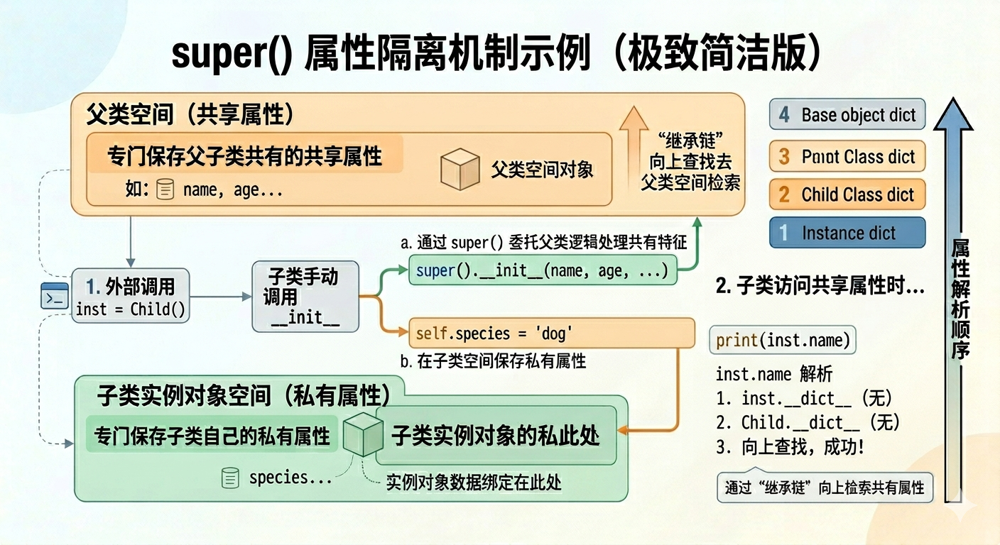

###### 实现方式

如果**需要调用父类的构造方法，委托父类的逻辑去处理那些所有父子类体系都有的特征**，有 2 种方式：

1. **手动调用 `super()` 内置函数访问父类的 `__init__` 构造方法并进行传参**
2. 直接**通过 `<父类名>.__init__` 访问父类的构造方法**，但**需要额外传递 `self` 参数**，**表明当前父类初始化的是哪个子类实例**

核心意义：**把父子类共有的属性交给父类去构造初始化管理**，此时，**子类只需要负责初始化只属于子类的专有属性即可**。

```python
class Father:
    def __init__(self, name, age):
        self.name = name
        self.age = age

class Child(Father):
    def __init__(self, name, age, gender):
        # 把父子类共有的属性交给父类去构造初始化
        # 方式一：super() 访问父类，调用父类的 __init__() 构造方法
        super().__init__(name, age)  # 调用父类的构造方法，并传参，在父类空间中完成属性的初始化
        
        # 方式二：直接调用父类的构造方法，将当前初始化的实例对象传递给 self
        Father.__init__(self, name, age)
        
        # 子类只需要负责初始化子类自己的一些额外属性信息
        self.gender = gender

child = Child('child', 18, 'male')
print(child.name)
print(child.age)
print(child.gender)
# 输出：
# child
# 18
# male
```

###### super(X,x) 类外部使用

`super()` 是一个内置函数，理论上除了可以在类中使用，还可以在类外部使用。

语法：

```python
super(<子类名>, <实例对象>) # 返回 子类的父类
```

作用：根据**传入的 `<子类名>` **，**找到并返回它的父类**。

```python
class A:
    def hello(self):
        print('A')


class B(A):
    @classmethod
    def say(self):
        print('B')


b = B()

super(B, b).hello() # super(B, b) = A 类
print(super(B, b))  # <super: <class 'B'>, <B object>>
```

##### 总结

```
创建子类实例时的完整流程：

1. 调用子类的 __new__(cls) → 创建实例对象
2. 调用子类的 __init__(self)：
   ├─ 如果子类没有定义 __init__：
   │   └─ 自动调用父类 __init__（按 MRO 向上）
   ├─ 如果子类定义了 __init__：
   │   ├─ 执行子类自己的初始化代码
   │   └─ 如果调用了 super().__init__()：
   │       └─ 继续沿 MRO 向上调用父类 __init__
   │   └─ 如果没有调用 super()：
   │       └─ 父类不会自动初始化（属性隔离实现）
   └─ 属性访问时：
       └─ 优先子类空间，然后沿继承链向上查找
```

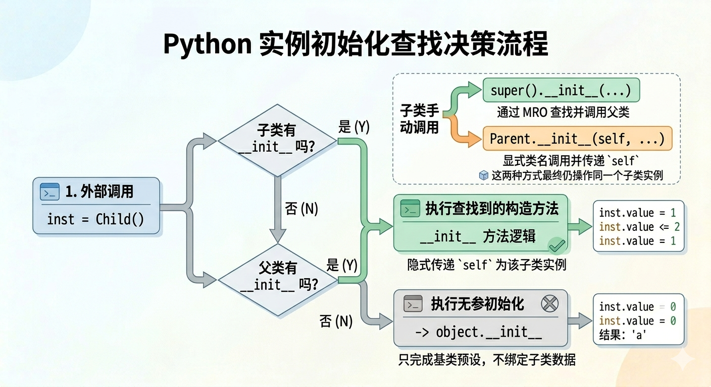

#### 属性查找机制

在 Python 中，实例访问属性的机制可以总结为一条**“由近及远、向上溯源”**的路径。

##### 核心查找链（MRO）

当子类实例对象访问一个属性时，Python 会按照以下顺序 “爬楼梯”：

1. **实例自己的 `__dict__`**：先看该实例在 `__init__` 中是否绑定了该属性（私有/特有数据）
2. **实现类的 `__dict__`**：如果实例没有，就去它的类定义里找（类属性/方法）
3. **父类的 `__dict__`**：如果类里也没有，就顺着继承链向上找父类
4. **基类 `object`**：最后找到所有类的祖先 `object`，如果还没找到，抛出 `AttributeError`

| **阶段**   | **查找位置** | **说明**                                     |
| ---------- | ------------ | -------------------------------------------- |
| **第一步** | **实例空间** | 找 `self.xxx` 绑定的变量（最快，优先级最高） |
| **第二步** | **当前类**   | 找类定义的属性或方法                         |
| **第三步** | **继承链**   | 顺着父类、爷爷类...一路向上查                |
| **第四步** | **终点**     | 查到 `object` 类，无果则报错                 |

##### 空间隔离

- **共有属性（存放在父类/上层）**： 通过 **`super().__init__()` 触发父类构造，将共性数据初始化**

  虽然数据最终写在子类实例的内存里，但逻辑是由父类管理的。

- **特有属性（存放在子类/底层）**： 在**子类 `__init__` 中直接赋值**

  这些属性在查找链的最底端，**优先级最高**，会**覆盖**上层的同名属性。

这个设计机制的妙处：子类只需要存储自己特有的那部分“差异（Delta）”，而把沉重的公共逻辑和数据交给父类。当实例对象访问属性时，Python 的动态查找机制会自动把这些碎片拼接成一个完整的对象。

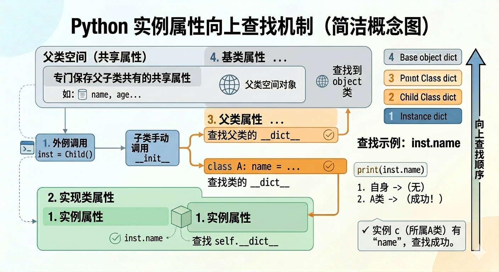

#### 方法重写

**Python 不支持传统的方法重载（相同方法名不同参数）**，但支持方法重写。

核心概念：当**子类中定义了一个与父类相同的方法**时，子类的方法会**覆盖**父类的同名方法。即允许子类**重新定义**父类中已有的方法，实现**多态**行为。

```python
class Parent:
    def say(self):
        print('父类的 say 方法')


class Child(Parent):
    def say(self):
        print('子类的 say 方法')


child = Child()
child.say()
# 输出：
# 子类的 say 方法
```

##### 多层继承的方法重写

```python
class A:
    def method(self):
        print("A")

class B(A):
    def method(self):
        print("B")
        super().method()  # 正确：调用父类

class C(A):
    def method(self):
        print("C")
        A.method(self)    # 硬编码父类名（多重继承时有问题）

class D(B, C):
    def method(self):
        print("D")
        super().method()

d = D()
d.method()
# D
# B
# C
# A（注意：C 也调用了 A，但通过 super() 只调用一次）

print(D.__mro__)  # (D, B, C, A, object)
```

##### super() 扩展方法重写

在子类方法中可以**使用 `super()`内置函数调用父类的其他方法实现扩展**。

```python
class Parent:
    def say(self):
        print('父类的 say 方法')

    def run(self):
        print('父类的 run 方法')


class Child(Parent):
    def say(self):
        super().run()
        print('子类的 say 方法')


child = Child()
child.say()
# 输出：
# 父类的 run 方法
# 子类的 say 方法
```

##### 重写类方法

```python
class Animal:
    species_count = 0
    
    @classmethod
    def create(cls, name):
        cls.species_count += 1
        return cls(name)
    
    def __init__(self, name):
        self.name = name

class Dog(Animal):
    breed_count = 0
    
    @classmethod
    def create(cls, name, breed="Mixed"):
        # 重写类方法
        cls.breed_count += 1
        instance = super().create(name)
        instance.breed = breed
        return instance

dog1 = Dog.create("Buddy", "Golden Retriever")
dog2 = Dog.create("Max")
print(Dog.breed_count)  # 2
print(dog1.breed)       # Golden Retriever
print(dog2.breed)       # Mixed
```

##### 重写静态方法

```python
class MathUtils:
    @staticmethod
    def calculate(numbers):
        return sum(numbers)

class StatsUtils(MathUtils):
    @staticmethod
    def calculate(numbers):
        # 重写静态方法
        return {
            'sum': sum(numbers),
            'avg': sum(numbers) / len(numbers),
            'count': len(numbers)
        }

print(MathUtils.calculate([1, 2, 3]))     # 6
print(StatsUtils.calculate([1, 2, 3]))    # {'sum': 6, 'avg': 2.0, 'count': 3}
```

##### 重写魔术方法

```python
class Playlist:
    def __init__(self, name):
        self.name = name
        self._songs = []
    
    def __len__(self):
        """重写 len() 函数"""
        return len(self._songs)
    
    def __getitem__(self, index):
        """重写索引访问"""
        return self._songs[index]
    
    def __setitem__(self, index, value):
        """重写索引赋值"""
        self._songs[index] = value
    
    def __contains__(self, item):
        """重写 in 运算符"""
        return item in self._songs
    
    def __iter__(self):
        """重写迭代器"""
        return iter(self._songs)

playlist = Playlist("My Favorites")
playlist._songs = ["Song A", "Song B", "Song C"]
print(len(playlist))     # 3
print(playlist[0])       # Song A
print("Song B" in playlist)  # True
for song in playlist:
    print(song)
```

### 封装

封装是面向对象编程的四大特性之一，它将**数据**和**操作数据的方法**绑定在一起，通过**访问权限控制**和**属性机制**隐藏内部实现细节，**只对外暴露必要的接口**，使代码更安全、更易维护。

核心目的：

- 数据隐藏：保护数据不被随意修改
- 接口简化：只暴露必要的操作
- 实现隔离：内部实现变化不影响外部代码

#### 封装颗粒度

在 Python 中，根据**封装的可控制颗粒度（外部访问行为处理）**，分为以下 3 个层级：

- **初级封装**：属性、方法**命名约定**（`_attr`, `__attr`）【**单一属性访问权限控制**】
- **中级封装**：使用 **`@property` 装饰器**（将方法伪装成属性）【**单一属性访问拦截控制**】
- **高级封装**：
  - 定义 **`__slots__`** 魔术属性【**限制类中可访问属性集**】
  - 描述符协议：重写 **`__get__`  与 `__set__` ** 魔术方法【**底层对类属性的访问拦截器，通过一套校验规则验证类属性值的检查**】

#### 核心概念

编程语言通过一定的规则**将数据和操作绑定在一起**，根据**数据的隐私级别**划分**不同的外部访问权限等级**，通常为：

- **公开的（public）**：数据对外**全部可见**；外部可**直接访问修改**。使用者只需要知道公开接口，不需要了解内部实现
- **受保护的（protected）**：数据对外**部分可见**；类对外提供 “授权” 约定，外部需实现并提供一定的身份验证才可以访问
- **隐私的（private）**：数据对外**不可见**；外部**需通过类中对外暴露的接口来访问隐私数据**，若不暴露访问接口，则永远无法访问

这 3 个权限等级既保证了类中数据的可扩展性，也保证了类中数据的安全与隐私性。

#### 属性访问权限控制机制

Python 通过**约定命名规范（软约束）**的形式来实现对类中属性、方法的初级**访问权限控制**。

##### 公开属性、方法

所有**正常命名（不加任何前缀）的属性、方法**都是类中**公开**的成员，外部可直接访问。

- 访问权限：**当前类、子类中、类外部**都可以直接访问

- 核心原则：**直接看 `__dict__ ` 属性集中是否有这个属性、方法**

```python
class Person:
    # 公开类属性
    person_id = 'person'

    def __init__(self, name, age):
        self.name = name  # 公开实例属性
        self.age = age  # 公开实例属性

    # 公开类方法
    @classmethod
    def hello(cls):
        print('你好')

    # 公开实例方法
    def eat(self):
        print('吃饭')

    # 公开静态工具方法
    @staticmethod
    def sleep():
        print('睡觉')

    # ------- 当前类中访问 -------
    # 实例方法访问实例属性、实例方法、静态工具方法、类属性、类方法
    def run(self):
        print(f"{self.name}, {self.age}")
        self.eat()
        print(self.__class__.person_id)
        self.__class__.hello()
        self.__class__.sleep()

    # 类方法中访问类属性、类方法、静态工具方法
    @classmethod
    def init(cls):
        print(cls.person_id)
        cls.hello()
        cls.sleep()


class Student(Person):
    pass


# -------类外部访问公开属性、方法-------
# 当前类访问 ---> 公开类属性/方法、静态工具方法、实例方法，直接通过 <类名>.__dict__ 查看
print(Person.__dict__)
# {'person_id':'person','init':...,'hello':...,'eat':...,'sleep':...,'run':...,...}

print(Person.person_id)  # person
Person.hello()  # 你好
Person.sleep()  # 睡觉

# 当前类实例访问 ---> 公开实例属性，直接通过 <实例对象>.__dict__ 查看
person = Person('jack', 18)
print(person.__dict__)  # {'name': 'jack', 'age': 18}
print(person.name)  # jack
print(person.age)  # jack
person.run()  # 输出：jack, 18 你好 吃饭 睡觉

# ----> 子类访问父类的公开属性/方法
student = Student('tom', 20)
print(student.__dict__)  # {'name': 'tom', 'age': 20}
print(student.name)  # tom
student.run()  # tom, 20 你好 吃饭 睡觉
```

##### _xx 受保护属性、方法

所有**约定以 `_` 单下划线开头命名的属性、方法**都是类中**受保护**的成员，外部**需持有一定身份**才可以访问。

- 访问权限：**当前类、子类中**才可以访问；**外部虽然也可以直接访问，但是不应该（约定）**

- 核心原则：**直接看 `__dict__ ` 属性集中是否有这个属性、方法**；

  - 会看到 **类与实例对象的 `__dict__` 都包含了`_` 单下划线开头的受保护属性、方法**；这意味着外部其实也可以直接强制访问，但是不推荐。

    > Python 提倡约定看到以`_` 单下划线开头的属性、方法，开发者就应该意识到这是一个受保护的属性、方法，不应该直接访问，而是按照约定规范来操作（**约定大于约束** 准则），这是因为 Python 为了展现极致灵活性的做法。
    >
    > 解释：**Python 中的受保护成员（单下划线）是一种"君子协定"：它告诉使用者"这个成员是内部的，需要身份验证（理解风险）才能访问"，但并不强制执行。这种设计平衡了灵活性和封装性，让专家可以绕过限制，同时警告新手不应依赖。**

```python
class Person:
    # 受保护的类属性
    _person_id = '_person'

    def __init__(self, name, age, stu_id, grade):
        self.name = name  # 公开实例属性
        self.age = age  # 公开实例属性
        self._stu_id = stu_id  # 受保护的实例属性
        self._grade = grade  # 受保护的实例属性

        # 当前类中访问受保护的属性、方法
        self._run()
        print(self.__class__._person_id)
        self.__class__._eat()
        self.__class__._sleep()

    # 受保护的类方法
    @classmethod
    def _eat(cls):
        print('吃饭')

    # 受保护的静态工具方法
    @staticmethod
    def _sleep():
        print('睡觉')

    # 受保护的实例方法
    def _run(self):
        print(f"{self._stu_id}, {self._grade}")
        self._eat()


class Student(Person):

    def __init__(self, name, age, stu_id, grade, gender):
        super().__init__(name, age, stu_id, grade)

        # 子类中访问父类的受保护属性、方法
        print(self._stu_id)  # 002
        print(self._grade)  # 初三
        print(self._person_id)  # _person
        self._eat()  # 输出：吃饭

        # 子类扩展自己的受保护属性
        self._gender = gender  # 受保护的实例属性


# -------类外部访问公开属性、方法-------
print(Person.__dict__)
# {'_person_id':'person','_eat':...,'_sleep':...,'_run':...,...}

person = Person('jack', 18, '001', '初三')
print(person.name)  # ✅ 公开
print(person.age)  # ✅ 公开
print(person._stu_id)  # ⚠️ 可以访问，但违反约定
print(person._grade)  # ⚠️ 可以访问，但违反约定

print(person.__dict__)
# {'name': 'jack', 'age': 18, '_stu_id': '001', '_grade': '初三'}
Person._sleep()  # # ⚠️ 可以访问，但违反约定

# 子类访问父类受保护的属性、方法
student = Student('tom', 20, '002', '初三', '男')
print(student.__dict__)
# {'name': 'tom', 'age': 20, '_stu_id': '002', '_grade': '初三', '_gender': '男'}
print(student._stu_id)  # ⚠️ 可以访问，但违反约定
print(student._grade)  # ⚠️ 可以访问，但违反约定
print(student._gender)  # ⚠️ 可以访问，但违反约定
```

##### __xx 隐私属性、方法

所有**约定以 `__` 双下划线开头命名的属性、方法**都是类中**隐私**的成员。

- 访问权限：仅在**当前类**才可以访问；外部不可以访问，会直接报错

- 核心原则：**直接看 `__dict__ ` 属性集中是否有这个属性、方法**；

  - 会**看到 `__` 双下划线开头的隐私属性、方法都被自动添加了 `_类名` 前缀（`_类名__属性名`）**

    这是 Python 内部的机制（**软约束**）：

    - Python 会将类中所有 `__` 双下划线开头的隐私属性、方法自动添加一个 `__类名` 前缀，以**防止外部通过 `__属性名` 的形式直接访问**
    - Python 通过直接改变属性、方法的命名，让外部无法知道真实的属性、方法名，从而无法直接访问

    - 但真的要强制访问的话，还是**可以通过 `__dict__` 查看隐私属性、方法真实的命名，从而直接通过 `__dict__[__类名_属性名]`来强制访问隐私数据**。只是这样的做法**不推荐**。

```python
class Person:
    # 隐私类属性
    __person_id = '__person'

    def __init__(self, name, age, stu_id, grade):
        self.name = name  # 公开实例属性
        self.age = age  # 公开实例属性
        self.__stu_id = stu_id  # 隐私实例属性
        self.__grade = grade  # 隐私实例属性

        # 当前类中访问隐私属性、方法
        self.__run()
        print(self.__class__.__person_id)
        self.__class__.__eat()
        self.__class__.__sleep()

    # 隐私类方法
    @classmethod
    def __eat(cls):
        print('吃饭')

    # 隐私静态工具方法
    @staticmethod
    def __sleep():
        print('睡觉')

    # 隐私实例方法
    def __run(self):
        print(f"{self.__stu_id}, {self.__grade}")
        self.__eat()


class Student(Person):
    pass


# -------类外部访问公开属性、方法-------
print(Person.__dict__)
# {'_Person__person_id':'__person','_Person__eat':...,'_Person__sleep':...,'_Person__run':...,...}

person = Person('jack', 18, '001', '初三')

print(person.__dict__)
# {'name': 'jack', 'age': 18, '_Person__stu_id': '001', '_Person__grade': '初三'}
print(person.name)  # ✅ 公开
print(person.age)  # ✅ 公开
# print(person.__stu_id)  # ⚠️ 报错，外部不可以访问
# print(person.__grade)  # ⚠️ 报错，外部不可以访问

# 子类访问父类的隐私数据
student = Student('tom', 20, '002', '初三')
print(student.__dict__)
# {'name': 'tom', 'age': 20, '_Person__stu_id': '002', '_Person__grade': '初三'}
# print(student.__stu_id)  # ⚠️ 报错，外部不可以访问

# ---- 通过 __dict__ 魔术属性查看并强制访问 ---- 【不推荐】
print(person.__dict__)
# {'name': 'jack', 'age': 18, '_Person__stu_id': '001', '_Person__grade': '初三'}
print(person._Person__stu_id)  # ✅ 可以访问，但违反约定
print(person._Person__grade)  # ✅ 可以访问，但违反约定
print(person._Person__person_id)  # ✅ 可以访问，但违反约定
```

##### 总结

核心对比：

| 特性             | **公开（Public）** | **受保护（Protected）** | **私有（Private）**    |
| :--------------- | :----------------- | :---------------------- | :--------------------- |
| **命名约定**     | `name`             | `_name`                 | `__name`               |
| **语法形式**     | 无下划线开头       | 单下划线开头            | 双下划线开头           |
| **访问限制**     | ❌ 无限制           | ⚠️ 约定限制（非强制）    | ✅ 名称修饰限制         |
| **外部直接访问** | ✅ 允许             | ⚠️ 允许（但违反约定）    | ❌ 不允许（名称修饰）   |
| **子类访问**     | ✅ 允许             | ✅ 允许（设计意图）      | ❌ 不允许（需名称修饰） |
| **名称修饰**     | ❌ 不修饰           | ❌ 不修饰                | ✅ 修饰为 `_类名__name` |
| **IDE 警告**     | ❌ 无警告           | ⚠️ 有警告                | ❌ 无警告（无法访问）   |
| **文档生成**     | ✅ 包含             | ⚠️ 通常排除              | ❌ 排除                 |

详细对比：

| 对比维度              | 公开（Public） | 受保护（Protected）  | 私有（Private）            |
| :-------------------- | :------------- | :------------------- | :------------------------- |
| **设计目的**          | 对外稳定接口   | 内部实现，子类可扩展 | 绝对隐藏，防止意外覆盖     |
| **访问方式**          | `obj.name`     | `obj._name`          | `obj._ClassName__name`     |
| **外部访问后果**      | 正常使用       | 违反约定，可能不稳定 | 需要知道修饰名，强烈不建议 |
| **子类重写**          | ✅ 允许         | ✅ 允许（设计意图）   | ⚠️ 可以但创建新属性         |
| **API 稳定性**        | ✅ 稳定         | ⚠️ 不稳定，可能变化   | ❌ 不应依赖                 |
| **文档化**            | ✅ 应该文档化   | ⚠️ 可选（内部使用）   | ❌ 不文档化                 |
| **单元测试访问**      | ✅ 直接测试     | ⚠️ 可访问但需注意     | ❌ 需通过公共接口           |
| **序列化默认行为**    | ✅ 包含         | ⚠️ 通常不包含         | ❌ 不包含                   |
| **`dir()` 显示**      | ✅ 显示         | ✅ 显示               | ⚠️ 显示修饰名               |
| **`__dict__` 中键名** | `name`         | `_name`              | `_ClassName__name`         |

#### getter/setter （实例属性访问劫持）

描述：如果想要**让受保护的属性、隐私属性能安全的被外部访问、修改**，可通过**为属性注入 `getter/setter` 能力**；经过`getter/setter` 能力的修饰后，当外部想要访问、修改受保护的属性时则**需要经过一定的逻辑运算与校验处理才能安全通过**。

核心逻辑：定义**与受保护的属性相同名称的方法**（方法名也可以随意，但为了突出一致性与像属性一样的使用体验，方法名通常要与属性名相同），并**添加对应的装饰器**，**使该方法修饰成像属性一样使用**。*类似于 Vue 的 computed 计算属性*

> 也可以像下面这样写，但是书写并不方便，容易造成方法名歧义混杂，且每次都要调用方法，比较麻烦，为了代码简洁，还是建议选择装饰器写法。
>
> ```python
> class Person:
>     def __init__(self, name, age):
>         self.__name = name
>         self.__age = age
> 
>     def get_name(self):
>         return self.__name
> 
>     def set_name(self, name):
>         self.__name = name
> 
>     def get_age(self):
>         return self.__age
> 
>     def set_age(self, age):
>         self.__age = age
>         
> person = Person('jack', 18)
> 
> person.get_name()
> person.set_name('tom')
> person.set_age(20)
> person.get_age()
> ```

`getter/setter` 能力的注入分为三部分：

- **`getter` 能力**：通过**为方法添加 `@property` 装饰器**修饰；当外部**通过 `<对象名>.<方法名>` 时会自动触发**该方法
- **`setter` 能力**：通过**为方法添加 `@<方法名>.setter` 装饰器**修饰；当外部**通过 `<对象名>.<方法名> = xxx` 时会自动触发**该方法
- **`deleter` 能力**：通过**为方法添加 `@<方法名>.deleter` 装饰器**修饰；当外部**通过 `del <对象名>.<方法名>` 时会自动触发**该方法

> 注：`setter` 和 `deleter` 装饰器都是可选的，分别对应不同的扩展能力。若只有 `getter` 装饰器，则该方法就是**只读**的计算属性。

##### @property => getter

作用：**将类中的方法修饰成像属性一样使用**。外部**通过 `<对象名>.<方法名>` 访问时会自动执行该方法**，并返回某个具体属性值。

描述：注入了 `@property` 装饰器的方法，内部逻辑**通常是返回某个具体属性值（属性的 `getter`方法）**，相当于是**在获取某个受保护的属性值之前添加了一层校验逻辑**。

```python
class Person:
    def __init__(self, name, age):
        self.__name = name
        self.__age = age

    @property
    def name(self):
        return self.__name

    @property
    def age(self):
        return self.__age


person = Person('jack', 13)

# 方法像属性一样使用
print(person.name)  # jack
print(person.age)  # 13
```

##### @<方法名>.setter

作用：为注入了`@property` (getter) 能力的方法扩展一个 **`setter` 能力**方法。（**`setter` 方法必须与 `@property` 方法同名**）

- 外部**通过 `<对象名>.<方法名> = xxx` 修改值时会自动执行该方法**。

描述：注入了 `@<方法名>.setter` 装饰器的方法，内部逻辑**通常是修改某个具体属性值（属性的 `setter`方法）**，相当于是**在修改某个受保护的属性值之前添加了一层校验逻辑**。

```python
class Person:
    def __init__(self, name, age):
        self.__name = name
        self.__age = age

    @property
    def name(self):
        return self.__name

    @name.setter
    def name(self, name):
        self.__name = name

    @property
    def age(self):
        return self.__age

    @age.setter
    def age(self, age):
        if (age >= 110):
            return False
        else:
            self.__age = age


person = Person('jack', 13)

# 将方法变得像属性一样使用
print(person.name)  # jack
print(person.age)  # 13

# 外部通过 对象.方法名 = xxx 修改赋值时自动触发对应的 setter 方法
person.name = 'tom'
person.age = 112
print(person.name)  # tom
print(person.age)  # 13
```

##### @<方法名>.deleter

作用：为注入了`@property` (getter) 能力的方法扩展一个 **`deleter` 能力**。（**`deleter` 方法必须与 `@property` 方法同名**）

- 外部**通过 `del <对象名>.<方法名>` 删除属性时会自动执行该方法**。

描述：注入了 `@<方法名>.deleter` 装饰器的方法，内部逻辑**通常是删除某个具体属性（属性的 `deleter`方法）**，相当于是**在删除某个受保护的属性之前添加了一层校验逻辑**。

```python
class Person:
    def __init__(self, name, age):
        self.__name = name
        self.__age = age

    @property
    def name(self):
        print(2)
        return self.__name

    @name.setter
    def name(self, name):
        self.__name = name

    @name.deleter
    def name(self):
        print('del __name')
        del self.__name

    @property
    def age(self):
        return self.__age

    @age.setter
    def age(self, age):
        if (age >= 110):
            return False
        else:
            self.__age = age

    @age.deleter
    def age(self):
        print('del age')
        del self.__age


person = Person('jack', 13)

# 将方法变得像属性一样使用，获取值
print(person.name)  # jack
print(person.age)  # 13

# 外部通过 对象.方法名 = xxx 修改赋值时自动触发对应的 setter 方法
person.name = 'tom'
person.age = 112
print(person.name)  # tom
print(person.age)  # 13

# 外部通过 del 对象.方法名 删除某个属性值自动触发对应的 deleter 方法
del person.name  # 输出 del __name
del person.age  # 输出 del age
```

##### Property vs Getter/Setter

Python 对类中属性、方法的 `getter/setter`能力封装可以有 2 种写法：

```python
# Java 风格（Python 中不推荐）
class JavaStyle:
    def __init__(self, value):
        self._value = value
    
    def get_value(self):
        return self._value
    
    def set_value(self, value):
        self._value = value

# Pythonic 风格（推荐）
class PythonicStyle:
    def __init__(self, value):
        self._value = value
    
    @property
    def value(self):
        return self._value
    
    @value.setter
    def value(self, value):
        self._value = value

# 使用对比
js = JavaStyle(10)
print(js.get_value())  # 需要调用方法
js.set_value(20)

ps = PythonicStyle(10)
print(ps.value)        # 像属性一样访问
ps.value = 20          # 像属性一样赋值
```

#### 描述符协议（类属性访问劫持）

##### 基本概念

核心逻辑：**描述符协议**就是**通过一个独立的代理类去劫持其他类的类属性访问过程**，针对性的**使用同一套逻辑对类属性进行校验**。

核心功能：编写通用的验证类、缓存装饰器，或在开发大型框架/库时处理复杂的属性绑定。

要想实现一个描述符协议，通常需要具备如下 3 个角色的参与：

- **描述符类**：一个**独立的代理类**；

  ​	它内部**封装了一套用于拦截类属性赋值的可复用校验逻辑模板（`__get__` 和 `__set__`）**，用于**给宿主类的类属性取值赋值处理添加一层安全检测**。

- **宿主类**：**产出实例的实体类模板**，可定义若干个类属性。**宿主类的类属性赋值**需要**由 “描述符类” 进行代理拦截**

  ​	通过**引用 “描述符类” 实例作为类属性值**，把**外部传入的类属性值交给 “描述符类” 去拦截处理**，进而执行它内部封装的校验逻辑处理，最后**将处理之后的类属性值还给宿主类实例的 `__dict__` 去独立管理**。

- **宿主类实例对象**：宿主类创建的实例对象，**真正的数据实体用户**；

  ​	当**宿主类创建实例产出数据实体后**，会经过一系列的类属性初始化，而类属性初始化会**经过 “描述符类” 的代理拦截**，从而**把处理之后的类属性键值对交给宿主类实例对象的 `__dict__` 去独立管理**。也就是说**类管理属性值校验逻辑模板，实例对象管理各自独立的类属性值**。

> 以上三者之间是**“代理-宿主-实例”**的三位一体关系
>
> > **类对象 (Class Object)**
> >
> > - **存储内容**：描述符类的**实例**（即定义了 `__get__` / `__set__` 的对象）。
> > - **地位**：它是描述符的“家”。描述符必须定义为类属性，否则协议不会生效。
> >
> > **实例对象 (Instance Object)**
> >
> > - **存储内容**：具体的**属性数据**。
> > - **地位**：它是数据的“仓库”。当通过实例访问属性时，Python 会去“类”里找描述符。
> >
> > **描述符协议 (Protocol)**
> >
> > - **作用**：连接类与实例的**纽带**。
> > - **逻辑**：它像一个拦截器，把原本对实例 `__dict__` 的直接访问，重定向到描述符的方法上。

简单理解：**类属性赋值拦截逻辑**在**“描述符类**”里，**配置**在**“宿主类”**的属性位上，但**真实的数据**是存在**“宿主类实例对象”**的 `__dict__` 里。

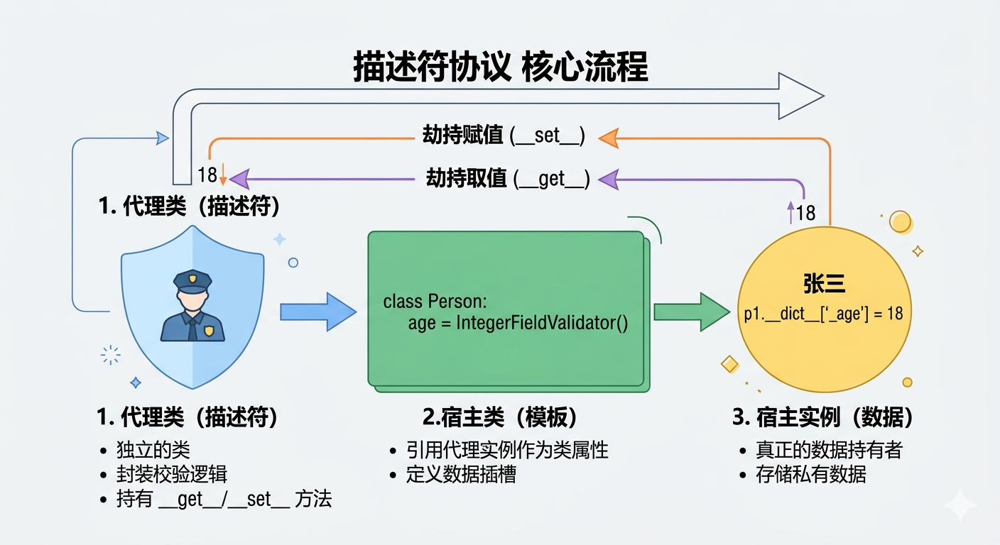

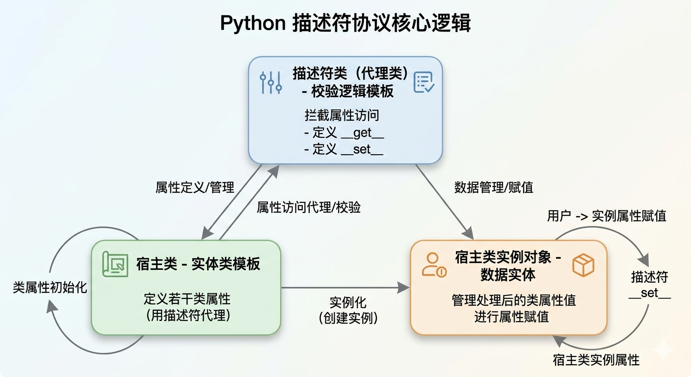

##### 什么是描述符类？

描述符类本质上就是一个**普通的 Python 类**。这个类里只有 2 个方法：**`__get__`** 和 **`__set__`** 魔术方法（非 `object` 类默认内置）。

核心功能：通过**为每个类属性赋值为 “描述符类” 实例**，用于**劫持外部对类中绑定了 “描述符”实例的类属性的访问、修改动作，并添加一些自定义逻辑**。

*类似于 JavaScript 的 Object.defineProperty() 拦截器*

核心价值：当**外部想要访问、修改一个类属性**时，不再是简单的从 `__dict__` 内存字典中取值，而是要**经过 “描述符类”中的一段自定义逻辑处理**，校验通过后，才真实赋值给类属性。

###### 与 `@property` 装饰器的对比

> - **`@property` 装饰器**：**可选地针对类中某个实例属性**的访问拦截机制；若不添加，则没有拦截效果**（单一实例属性的拦截）**
>   - 它是描述符的最常见包装
> - **`__get__`、`__set__` 拦截器**：**可选的针对类中某个类属性**添加的访问拦截机制**（单一类属性的拦截）**
>   - **`@classmethod` 和 `@staticmethod`**：它们底层都是通过 `__get__` 改变了函数的调用方式

###### \__get__(self,instance,owner) 类属性取值拦截器

触发时机：当**外部通过 `<实例对象名>.<类属性名>` 或 `<类名>.<类属性名>` **进行**取值**时自动触发**拦截**，并执行对类属性的**自定义取值处理逻辑**。

参数：

- **`self`**：描述符类实例对象本身【**代理类实例**】
- **`instance`**：访问类属性的具体实例对象【**数据实体**】（如果是通过类访问，则为 `None`）
- **`owner`**：类属性所属的类【**宿主类模板**】

```python
# 代理类
class ValueDescriptioner:

    def __get__(self, instance, owner):
        if instance is None:
            print('get owner', owner)
            # 类实例 访问类属性
            return 'get owner'
        else:
            # 实例对象 访问类属性
            print('get instance', instance)
            return 'get instance'

class Person:
    name = ValueDescriptioner() # 每个类属性都是一个 “描述符类” 实例


person = Person()

print('实例访问', person.name) 
# -- 当访问 person.name 时，会执行 ValueDescriptioner 代理类的 __get__ 方法，执行对类属性的自定义取值逻辑。
# 输出：
# get instance <__main__.Person object at 0x000001EE45D18D70>
# 实例访问 get instance

print('类访问', Person.name)
# -- 当访问 Person.name 时，会执行 ValueDescriptioner 代理类的 __get__ 方法，执行对类属性的自定义取值逻辑。
# 输出：
# get owner <class '__main__.Person'>
# 类访问 get owner
```

###### \__set__(self,instance,value) 类属性赋值拦截器

触发时机：当**外部通过 `<实例对象名>.<类属性名>`** 进行**赋值**时自动触发**拦截**，并执行对类属性的**自定义赋值处理逻辑**。

参数：

- **`value`：想要赋给类属性的新值**

```python
# 代理类
class ValueDescriptioner:
    def __set__(self, instance: object, value):
        if instance is None:
            # 类实例 访问类属性
            print('set owner', instance.__class__)
            instance.__class__.__dict__['name'] = f"值：{value}"
        else:
            # 实例对象 访问类属性
            print('set instance', instance)
            instance.__dict__['name'] = f"值：{value}"

class Person:
    name = ValueDescriptioner() # 每个类属性都是一个 “描述符类” 实例


person = Person()
print(person.__dict__)  # 未赋值前 {}

person.name = 100
# 当执行 person.name = 100 时，会触发 ValueDescriptioner 类的 __set__ 方法，执行对类属性的自定义赋值逻辑
# 输出：
# set instance <__main__.Person object at 0x000001EE45D18D70>

print(person.__dict__)  # 经过 __set__ 处理之后的新值 {'name': '值：100'}
print(person.name)  # 值：100
```

##### 类属性访问描述符

通过描述符协议，可以实现对一个类中所有类属性的规则校验模型，建立一个强壮的类。

###### 实现逻辑

1. 将类属性赋值给一个特定的 “描述符类”，为 “描述符类” 定义一个构造方法，该构造方法接收以下参数：
   - `name`：初始化的类属性名，用于作为 `key` 键后续存入到实例对象中的 `__dict__` 字典
   - `validator`：属性值校验函数
   - `error_msg`：校验不通过时抛出的错误信息
2. 类属性本身是每个实例共享的，通过描述符协议可以使得类本身存储校验逻辑，实例独立存储真实的类属性数据
   1. 每次 `类实例.类属性名` 获取值时，访问的是 类实例的 `__dict__` 中存储的对应数据
   2. 每次 `类实例.类属性名 = xx`，改变的是 类实例的 `__dict__` 中中存储的对应数据
3. 以此管理宿主类中每个类属性的值

核心理解：**每个类属性的值都是一个 “描述符类”，当外部访问、修改类属性值，会自动触发 “描述符类” 定义的 `__get__` 和 `__set__` 魔术方法，并执行对应的自定义取值、赋值校验逻辑，最后将类属性键值对分别存储到各个类实例中的 `__dict__` 独立管理**

###### 数据存储位置分离

通过在宿主类中定义 “顶层” 视图的类属性，经过 “描述符类” 的校验逻辑处理之后，真实的数据存储在类实例对象的 `__dict__` 字典中；

层次关系如下：

- **验证逻辑（描述符）：存在类中（共享）**
- **实际数据：存储在各个实例中（独立）**

```
┌─────────────────────────────────────────────────────────────┐
│                      类 Person                               │
│  ┌─────────────────────────────────────────────────────┐   │
│  │ age = Validator对象（描述符）                         │   │
│  │ name = Validator对象（描述符）                        │   │
│  └─────────────────────────────────────────────────────┘   │
└─────────────────────────────────────────────────────────────┘
                    │                    │
                    │ 实例化              │ 实例化
                    ▼                    ▼
    ┌──────────────────────┐    ┌──────────────────────┐
    │ 实例 p1               │    │ 实例 p2               │
    │ ┌──────────────────┐ │    │ ┌──────────────────┐ │
    │ │ __dict__:        │ │    │ │ __dict__:        │ │
    │ │   age: 25        │ │    │ │   age: 30        │ │
    │ │   name: "Alice"  │ │    │ │   name: "Bob"    │ │
    │ └──────────────────┘ │    │ └──────────────────┘ │
    └──────────────────────┘    └──────────────────────┘
```

###### 代码实现

- 描述符通用校验模板：

```python
# 代理类
class Validator:
    """万能校验基类"""

    # 构造方法；
    # 创建一个“描述符类”实例赋值给宿主类的类属性，在类属性初始化时，传递该属性对应的名称，数据校验函数以及错误信息
    def __init__(self, attr_name: str, validator: Any, error_msg: str):
        self.__attr_name = attr_name
        self.__validator = validator
        self.__error_msg = error_msg

    # 自定义 __get__ 类属性取值逻辑
    def __get__(self, instance: object, owner):
        if instance is None:
            return self
        else:
            # ---实例对象对类属性取值---
            print(instance.__dict__, self.__attr_name)
            # {'name': 'jack', 'age': 18} name

            # 真正取值时，去实例的私有字典里拿
            return instance.__dict__.get(f"{self.__attr_name}", None)

    # 自定义 __set__ 类属性赋值逻辑
    def __set__(self, instance: object, value: Any):
        if instance is None:
            # 如果是通过类访问（User.age），返回描述符本身，不返回具体类属性值
            # 因为类属性值是独立存储在各个类实例的 __dict__ 属性中，而不是存储在类本身的 __dict__ 属性集字典中
            return self
        else:
            # ---实例对象对类属性赋值---
            # 赋值时，传入的值不符合校验规则，抛出错误信息
            if not self.__validator(value):
                raise ValueError(self.__error_msg)

            print(f"✅ 校验通过：将 {self.__attr_name} 设置为 {value}")
            # 重点：符合规则的，则存储在每个实例对象各自的 __dict__ 属性集字典中，确保实例之间数据隔离
            instance.__dict__[f"{self.__attr_name}"] = value


# 宿主类
class Person:
    name = Validator(
        'name',
        lambda x: not len(x) <= 2,
        "姓名长度不能小于 2 位"
    )

    age = Validator(
        'age',
        lambda x: 0 < x < 120,
        "年龄必须在 0 ~ 120 之间"
    )

    def __init__(self, name, age):
        pass


# 使用
person = Person('jack', 13)
# person.name = '2'  # 抛出错误：ValueError: 姓名长度不能小于 2 位
# person.age = 159  # 抛出错误：ValueError: 年龄必须在 0 ~ 120 之间

person.name = 'jack'
person.age = 18

print(person.name)  # jack
print(person.age)  # 18
```

- 描述符扩展校验模板：

```python
# 实现一个可复用的属性访问描述符类
class Validator:
    """通用校验基类"""

    def __init__(self, attr_name: str):
        self.attr_name = attr_name

    def __get__(self, instance: object, owner):
        if instance is None:
            return self
        else:
            return instance.__dict__.get(f"{self.attr_name}", None)

    def __set__(self, instance: object, value: Any):
        if instance is None:
            return self
        else:
            self.validate(value)
            instance.__dict__[f"{self.attr_name}"] = value

    def validate(self, value: Any):
        """留给子类实现的 validate 校验函数"""
        raise NotImplementedError


class String(Validator):
    """字符串校验描述符类"""

    def validate(self, value: Any):
        if not isinstance(value, str):
            raise TypeError(f"{self.attr_name} 必须是字符串类型")
        if len(value) < 2:
            raise ValueError(f"{self.attr_name} 长度不能小于 2 位")


class Integer(Validator):
    """数字校验描述符类"""

    def validate(self, value: Any):
        if not isinstance(value, int):
            raise TypeError(f"{self.attr_name} 必须是整数类型")
        if value <= 0 or value >= 120:
            raise ValueError(f"{self.attr_name} 必须在 0 ~ 120 之间")


# 宿主类
class Person:
    name = String('name')
    age = Integer('age')

    def __init__(self, name, age):
        self.name = name
        self.age = age


# 使用
person = Person('jack', 13)
# person.name = '2'  # 抛出错误：ValueError: name 长度不能小于 2 位
# person.age = 156  # 抛出错误：ValueError: age 必须在 0 ~ 120 之间

print(person.__dict__)  # {'name': '22', 'age': 100}
```

#### 属性动态代理（所有属性访问劫持）

在 Python 中，`object` 基类为所有类都提供了一套关于类中所有属性的访问控制魔术方法。如下：

- **`__setattr__(self,name,value)`**：**设置任何属性时**触发
- **`__getattr__(self,name)`**：**访问实例对象中不存在的属性时**触发
- **`__getattribute__(self,name)`**：**访问任何属性时触发**
- **`__delattr__(self,name)`**：**删除属性时**触发

通过重写以上方法，可以**自定义控制外部操作实例对象中的实例属性、类属性时的行为**。

> 注意：直接通过类操作类属性**不会**拦截，以上方法**只关心实例对象**的操作。

##### \__setattr__(self,name,value) 属性赋值拦截器

作用：当外部**通过 `<实例对象>.<属性名> = xxx` 为实例、类属性赋值**时触发。

**参数：**

- **`name`：要赋值的属性名**
- **`value`：要给属性赋的新值**

```python
class Person:
    person_id = 'person_id'

    # 设置任何属性值时触发
    def __setattr__(self, name: str, value: Any, /) -> None:
        print(f"设置属性 {name} 的值为 {value}")
        self.__dict__[name] = value

person = Person()

# 设置属性值，会触发 __set__ 魔术方法
person.name = 'jack'  # 设置实例属性 name 的值为 jack
person.person_id = '__person_id__'  # 设置类属性 name 的值为 jack

Person.person_id = 'dw'  # 直接通过类操作类属性不会被拦截
```

##### \__getattr__(self,name) 缺省代理

作用：当外部**通过 `<实例对象>.<属性名>` 访问实例对象中不存在的属性**时触发。

特点：这是最常用、也最温和的代理方式。它只在 **“属性找不着”** 的时候才会被触发。它是一个“兜底”机制。如果实例字典、类字典、父类里都没有这个属性，Python 才会来问它。

**适用场景**：封装一个 SDK，或者把一个字典伪装成对象（比如 `obj.key` 代替 `obj['key']`）

**参数：**

- **`name`：要访问的属性名**

```python
class DynamicProxy:
    def __init__(self, data):
        self._data = data

    def __getattr__(self, name):
        # 当访问不存在的属性时，去字典里找
        print(f"--- 触发缺省代理: 正在查找 {name} ---")
        if name in self._data:
            return self._data[name]
        raise AttributeError(f"找不到属性 {name}")

proxy = DynamicProxy({'name': 'Jack', 'age': 27})
print(proxy.name)  # 触发代理
```

##### \__getattribute__(self,name) 全量代理

作用：外部**通过`<实例对象名>.<属性名>` 获取任何属性**时触发。

特点：无论属性存不存在都会经过它，权利极大。它是所有属性访问的“必经之路”。

核心功能：**全量代理**，定义一个**代理类**，将**某个类的实例传入给该代理类，可以拦截外部对该类的任何属性操作，从而执行自定义的属性访问处理逻辑**。*类似于 JavaScript 中的 Proxy*

注意：在它内部访问 `self.xxx` 时，**必须使用 `super().__getattribute__(name)`，否则会陷入无限递归（因为它会再次拦截自己），从而抛出栈溢出异常**。

**参数：**

- **`name`：要访问的属性名**

```python
# 全量代理，定义一个代理类，将某个类的实例传入给该类，可以拦截外部对该类的任何属性操作，从而执行自定义的属性访问处理逻辑
# 原始类
class Database:
    def connect(self):
        return "数据库连接成功"

    def execute(self, query):
        return f"正在执行: {query}"


# 代理类（代理原始类实例的操作）
class MonitorProxy:
    def __init__(self, target):
        # target 是被代理的真实对象（Database 实例）
        self._target = target

    def __getattr__(self, name):
        # 1. 从被代理对象中获取属性或方法
        attr = getattr(self._target, name)

        # 2. 如果是方法，我们动态包装它
        if callable(attr):
            def wrapper(*args, **kwargs):
                start_time = time.time()
                # 执行真实的方法
                result = attr(*args, **kwargs)
                end_time = time.time()

                print(
                    f"--- [监控日志] 方法 '{name}' 执行耗时: {end_time - start_time:.4f}s ---")
                return result
            return wrapper

        # 3. 如果是普通属性，直接返回
        return attr


# 原始对象
real_db = Database()
# 穿上“代理外套”
db = MonitorProxy(real_db)

# 使用方式和原来一模一样，但多了日志功能
print(db.connect())
print(db.execute("SELECT * FROM users"))
```

> - **描述符**是“点对点”的拦截（针对具体某个插槽）。
>
> - **动态代理**（`__getattr__` 等）是“面对面”的拦截（针对整个对象）。

##### \__delattr__(self,name) 属性删除拦截器

作用：当外部**通过 `del <实例对象>.<属性名>` 删除实例属性**时触发。

**参数：**

- **`name`：要删除的属性名**

```python
class Person:
    
    # 删除属性时触发
    def __delattr__(self, name: str, /) -> None:
        print(f"删除属性 {name}")
        del self.__dict__[name]

person = Person()
person.name = 'jack'

# 删除实例属性，会触发 __del__ 魔术方法
del person.name  # 删除属性 name
```


#### \__slots__ 限制可访问属性集

描述：正常情况下，`__dict__` 属性会将类以及类实例对象的所有属性（包括改名后的隐私属性）都暴露给外部访问，这不利于类中数据的隐私性，而且如果一个类具有大量属性时，`__dict__` 属性会消耗大量内存来存储这些属性。

作用：Python 为所有类提供了 `__slots__` 魔术属性，可以**重写**它，用于**规定当前类只能有多少个属性、限制暴露给外部的属性集**。

核心价值：**`__slots__` 属性会取代类的 `__dict__` 属性**，使得**外部只能访问 `__slots__`中暴露的属性，而不是访问全部属性**。这对于一个拥有大量属性的类而言，十分节省内存，封装性也是最高的。

```python
class Person:
    __slots__ = ['name', 'age']
    # 表示 Person 实例对象只能有 name 和 age 属性，外部也无法添加额外属性
    # 并且，它会取代 __dict__ 属性，用来限制外部访问的属性集

    def __init__(self, name, age):
        self.name = name
        self.age = age


person = Person('jack', 18)
person.name = 'tom'
person.age = 20

# print(person.__dict__)  # 报错，__dict__ 不存在

# 不能再为 person 实例对象添加额外属性了
# person.gender = '男'  # 报错，gender 属性不存在
```

#### 总结

| 机制              | 语法                  | 访问性     | 用途         |
| :-------------- | :------------------ | :------ | :--------- |
| **公开**          | `self.name`         | 完全公开    | 正常使用的接口    |
| **约定私有**        | `self._name`        | 可访问（警告） | 内部实现，子类可使用 |
| **名称修饰私有**      | `self.__name`       | 名称修饰    | 避免子类意外覆盖   |
| **Property**    | `@property`         | 像属性一样   | 验证、计算属性    |
| **描述符**         | `__get__/__set__`   | 自定义     | 可复用的验证逻辑   |
| **`__slots__`** | `__slots__ = [...]` | 限制属性    | 节省内存、限制属性  |

### 多态

在编程中，多态是指**同一个接口（方法名）可以作用于多种类型的对象，并表现出不同的行为**。

核心理念：

- **统一入口**：调用者只需要记住一个方法名（如 `run()`）
- **不同实现**：不同的对象（狗、车、程序）各自实现自己的 `run()`

根据不同的行为，Python 的多态分为 3 个层次：

- **标准多态**：重点关注继承的血缘关系
- **鸭子多态**：
- **运算符多态**：同一个运算符作用于不同对象有不同含义

#### 为什么需要多态？

多态其实是封装的**解耦利器**：

1. **解耦**：调用者不需要知道对象的具体类，只需要知道它有某个方法。
2. **可扩展性**：如果你以后想增加一个 `Bird` 类，你只需要写好 `speak()` 方法。原来的 `make_it_speak` 函数**一行代码都不用改**。

#### 标准多态

Python 中的标准多态是基于继承的多态（经典模式）。

核心概念：多个子类重写父类的同一个方法。**不同子类对象调用同一个方法时，呈现出不同的行为**。

核心要点：

- 必须要有**继承关系**，即**限制类型范围：必须是某个类的子类，它会自动进行类型转换**
- 子类必须**重写**父类的同一个方法

```python
# 标准多态：重点关注继承血缘关系。子类重写父类同一个方法，不同子类的调用呈现不同的效果
class Animal:
    def eat(self):
        print("动物吃食物")

class Dog(Animal):
    def eat(self):
        print("狗吃骨头")

class Cat(Animal):
    def eat(self):
        print("猫吃鱼")

def func(animal):
    animal.eat()

dog = Dog()
cat = Cat()
func(dog)  # 狗吃骨头
func(cat)  # 猫吃鱼
```

#### 鸭子多态

核心理念：“如果它走起路来像鸭子，叫起来也像鸭子，那么它就是鸭子。”

核心要点：

- **不关注**继承关系，**不限制**类型范围，**不会进行**类型转换，**不需要**重写方法
- **只关注**这些类中**有没有同一个具体方法**，有就代表**它们是同一种形态**
- 即完全不看血缘关系，**只看功能**

> 在 Java 中，多态依赖于**继承**（子类必须继承父类）。但在 Python 中，**只要对象有那个方法，它就能参与多态**，管你有没有继承关系。
>
> **场景**：Python 的 `len()` 函数。只要你的类实现了 `__len__` 魔术方法，不管是列表、字典还是你自己定义的类，都能用 `len()`，这就代表自定义类参与了一种形态。

```python
class Dog:
    def eat(self):
        print("狗吃骨头")

class Cat:
    def eat(self):
        print("猫吃鱼")

class Trigger:
    def eat(self):
        print("老虎吃肉")

def func(animal):
    animal.eat()

dog = Dog()
cat = Cat()
trigger = Trigger()

func(dog)  # 狗吃骨头
func(cat)  # 猫吃鱼
func(trigger)  # 老虎吃肉
```

以上代码可以看出，`Dog`、`Cat`、`Trigger` 这 3 个类都是独立的，但它们都有同一个方法 `eat`，所以它们在某种程度上就是多态。

#### 运算符多态

同一个运算符作用于不同对象有不同含义。

- **场景**：`+` 作用于整数是加法，作用于字符串是拼接，作用于列表是合并。

### 抽象

抽象是面向对象编程的四大核心特性之一，它关注**隐藏实现细节，只保留必要接口留给子类去实现（“只定义规则，不实现细节”）**。

核心理念：抽象的本质是定义一个“模具”**或者**“契约”。它告诉子类：“如果你想成为我的一员，你必须实现这些方法，但我不管你具体怎么实现。”

核心价值：

- **规范化**：确保所有子类都有一致的方法名

- **安全性**：防止由于忘记实现某个关键方法而导致的运行时错误

- **设计感**：让代码结构从“解决具体问题”提升到“定义通用框架”

抽象有 2 种实现方式：

- **手动抛出 `NotImplementedError` 异常**：提醒子类去实现这个方法
- **继承抽象类，重写抽象方法**

#### NotImplementedError 占位符

这是一个**抽象方法占位符**，用于**提醒子类必须重写某个方法**；这是一个**弱约束**，**只在调用该方法时发生子类未重写就抛出异常**。

```python
class Animal:
    def __init__(self, name):
        self.name = name

    # 这是一个抽象方法，具体实现细节由子类去完成
    def speak(self):
        raise NotImplementedError("子类必须实现speak方法")

class Dog(Animal):
    pass

dog = Dog('狗')
# dog.speak()  # 抛出异常：NotImplementedError: 子类必须实现speak方法

class Pig(Animal):

    def speak(self):
        print('哼哼哼')

pig = Pig('猪')
pig.speak()  # 哼哼哼
```

#### 抽象模块 abc

Python 默认提供了一个 **`abc` 抽象类模块**，它对外提供了 **`ABC` 抽象类** 与 **`@abstractmethod` 抽象方法装饰器**。

```python
from abc import ABC, abstractmethod
```

##### 抽象类 ABC

`ABC` 类是 Python 官方提供的 **抽象基类（Abstract Base Classes）** 机制。

核心理解：抽象类就是一个“半成品”**或者是**“带有强制性约束的蓝图”。

核心功能：要想定义一个**抽象类**，必须让**抽象类继承 `ABC` 抽象基类**，并**在抽象类中定义至少一个 `@abstractmethod` 抽象方法 或 抽象属性**。

> 注意：它是一个**强约束**，一旦抽象类继承了 `ABC` 抽象基类，**其抽象类的子类必须实现抽象方法或抽象属性**，否则会报错。

核心特性：

- 抽象类**不能被实例化**

- 抽象类中**可以包含**抽象方法，**也可以包含**普通方法（类方法、实例方法、静态方法）但**必须实现具体功能细节**

  > 注意：抽象类中的普通方法**不应该涉及到具体子类实例的属性**，应该**只用于表示一个通用逻辑**

- 抽象类**只能被继承**，表示**部分未实现的功能（抽象方法、抽象属性）由子类去实现具体细节**；

  - 继承抽象类的**子类必须实现抽象类中的所有 抽象方法 和 抽象属性**，否则该子类也是抽象类

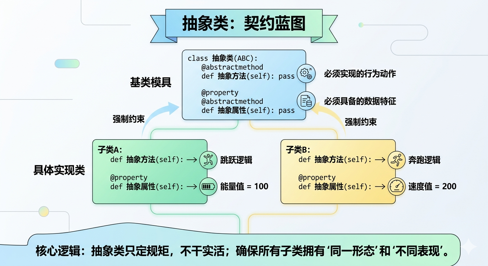

```python
from abc import ABC, abstractmethod

# 抽象类（定义规则）
class Animal(ABC):

    # 抽象实例方法
    @abstractmethod
    def speak(self):
        pass

    # 抽象属性
    @property
    @abstractmethod
    def name(self):
        pass

    # 可以有具体方法（非抽象）
    def description(self):
        print("这是一个动物")

# animal = Animal() # 报错！不能实例化抽象类

# 子类继承抽象类（实现规则）
class Dog(Animal):

    def speak(self):
        print('汪汪汪')

    def run(self):
        print('跑跑跑')

    @property
    def name(self):
        if self.__dict__['_name'] is None:
            return None
        return self.__dict__['_name']

    @name.setter
    def name(self, name):
        self.__dict__['_name'] = name


dog = Dog()
dog.speak()  # 汪汪汪
dog.run()  # 跑跑跑
dog.description()  # 这是一个动物

# print(dog.name)  # 报错：KeyError: 'name'
dog.name = '狗'  # 设置属性值
print(dog.name)  # 狗
```

##### @abstractmethod 抽象方法装饰器

核心功能：**修饰一个方法为抽象方法**。

核心特点：

- 抽象方法**没有方法体，必须使用 `pass`关键字占位**，**不能在抽象类中实现具体细节**，否则它就是一个普通方法了

- 抽象方法**必须由继承抽象类的子类去实现抽象方法的具体细节**

  > 如果子类未实现抽象方法，则会报错 `TypeError: Can't instantiate abstract class Dog without an implementation for abstract method 'hello'`

- `@abstractmethod`抽象方法装饰器**可以修饰普通方法、静态方法、类方法**

  > 注意：定义抽象类方法与抽象静态方法时， **`@classmethod` 和 `@staticmethod` 必须写在 `@abstractmethod` 上面**！

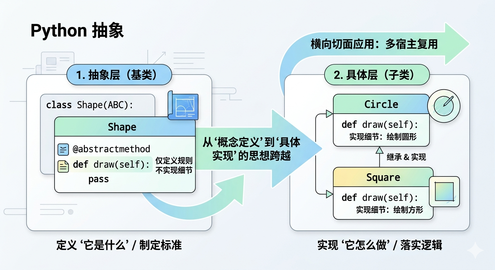

```python
from abc import ABC, abstractmethod

# 抽象类（定义规则）
class Animal(ABC):

    # 抽象实例方法
    @abstractmethod
    def speak(self):
        pass

    # 抽象类方法
    @classmethod
    @abstractmethod
    def hello(cls):
        pass

    # 抽象静态工具方法
    @staticmethod
    @abstractmethod
    def tool():
        pass
    
# 子类继承抽象类（实现规则）
class Dog(Animal):

    def speak(self):
        print('汪汪汪')

    def hello(cls):
        print('你好。我是狗')

    def tool():
        print('工具方法')
        
        
dog = Dog()
dog.speak()  # 汪汪汪
dog.hello()  # 你好。我是狗
Dog.tool()  # 工具方法
```

##### @property + @abstractmethod 抽象属性

抽象属性指的是抽象类中通过**`@property` + `@abstractmethod`** 两个装饰器结合在一起，**共同修饰**定义的**抽象属性（方法）**。

核心理念：

1. 先**将普通方法通过 `@property` 装饰为属性**，让**方法像属性一样使用**
2. 再通过**`@abstractmethod` 装饰器将该属性（方法）修饰为抽象方法**
3. 最后**让子类去实现这个抽象属性（方法）**的具体细节。

```python
from abc import ABC, abstractmethod

# 抽象类（定义规则）
class Animal(ABC):

    # 抽象属性（getter）
    @property
    @abstractmethod
    def name(self):
        pass
    
    # 抽象属性（setter）
    @name.setter
    @abstractmethod
    def name(self, value):
        pass
    
# 子类继承抽象类（实现规则）
class Dog(Animal):
    @property
    def name(self):
        if not self.__dict__['name']:
            return None
        return self.__dict__['name']

    @name.setter
    def name(self, value):
        self.__dict__['name'] = value
       
dog = Dog()

# print(dog.name)  # 报错：KeyError: 'name'
dog.name = '狗'  # 设置属性值
print(dog.name)  # 狗
```

### 特殊类

#### Enum 枚举类

Python 提供了一个 `enum`模块，该模块内有一个 `Enum` 特殊类。

核心作用：可以通过**继承 `enum.Enum` 类**实现一个**枚举类型**，用于一个**常量数据集**。

##### 定义枚举

- 创建并继承 `enum.Enum` 类，以 **类属性** 的形式定义**枚举值**。

```python
from enum import Enum

class Color(Enum):
    <枚举名称> = <枚举值>
	# ...
```

##### 访问枚举

- `enum.Enum` 枚举类会默认**包装每个枚举类属性为一个包含 `name` 和 `value` 属性的复杂对象类型**：
  - **`name`：枚举名称**
  - **`value`：枚举值**

注：若**直接访问 `<枚举类>.<枚举名>` 是获取枚举成员**，而非枚举值。

```python
from enum import Enum

class Color(Enum):
    RED = 1
    GREEN = 2
    BLUE = 3

# 获取枚举成员
print(Color.RED)  # Color.RED
print(Color.GREEN)  # Color.GREEN
print(Color.BLUE)   # Color.BLUE

# 获取枚举名称
print(Color.RED.name)  # RED
print(Color.GREEN.name)  # GREEN
print(Color.BLUE.name)   # BLUE

# 获取枚举值
print(Color.RED.value)  # 1
print(Color.GREEN.value)  # 2
print(Color.BLUE.value)   # 3
```

###### 遍历获取

`enum.Enum` 枚举类支持被 `for`、`while` 循环遍历获取，它内部实现了 `__iter__` 迭代器协议魔术方法。

```python
from enum import Enum

class Color(Enum):
    RED = 1
    GREEN = 2
    BLUE = 3
    
# 遍历获取所有枚举成员，默认自动会调用 Color.__iter__() 魔术方法
for color in Color:
    print(color)
```

##### auto() 自动递增赋值

核心作用：**不在乎具体的值是多少，只想要一组唯一的常量**，可以**使用 `auto()` 自动分配递增+1的整数**。

```python
from enum import Enum

class State(Enum):
    START = auto()  # 1
    RUNNING = auto()  # 2
    STOP = auto()  # 3


# 遍历获取所有枚举成员，默认自动会调用 State.__iter__() 魔术方法
for state in State:
    print(state.value)  # 1 2 3
```

##### @unique 保证值唯一

默认情况下，不同的枚举成员可以拥有相同的值（后者的成员会成为前者的别名）。

- 如果想**严格禁止重复的枚举值**，可以**为枚举类加上 `@unique` 装饰器**。

```python
from enum import Enum, unique

@unique
class ErrorCode(Enum):
    NOT_FOUND = 404
    # BANNED = 404  # 如果取消注释，这里会抛出 ValueError，因为值重复了
```

##### StrEnum 字符串枚举

默认情况下，**`enum.Enum` 类会为每个枚举都包装为一个包含有 `name` 和 `value` 属性的复杂对象类型**。

- 若想**让枚举的值纯粹就是一个字符串字面量值**，可以通过**继承 `enum.StrEnum` 类**来实现。

```python
from enum import StrEnum, unique

@unique
class Status(StrEnum):
    OK = "ok"
    ERROR = "error"
    WARNING = "warning"
    # YES = "ok" # 报错


print(Status.OK == 'ok')  # True
```

### 顶层类型

在 Python 中，有 2 个顶层类型 **`object` 基类** 和 **`type` 元类**。

核心概念：`object` 基类 与 `type` 元类是**两个互相依赖的顶层类型**。*就像 JavaScript 的 Function 类 与 Object 类*

#### type 元类

元类是 Python 中**最深奥**但也最强大的特性之一。简单来说：**类也是对象，而元类就是创建类的“类”**。

核心概念：

- 一切皆对象。**类也是对象。所有类（包括 `object` 类、`function` 函数）的类型都是 `<class 'type'>`**

```python
# 类的类型是 type
print(type(int))  # <class 'type'>
print(type(float))  # <class 'type'>
print(type(str))  # <class 'type'>
print(type(bool))  # <class 'type'>
print(type(bytes))  # <class 'type'>
print(type(list))  # <class 'type'>
print(type(tuple))  # <class 'type'>
print(type(set))  # <class 'type'>
print(type(dict))  # <class 'type'>
print(type(object))  # <class 'type'>

class Student:
    pass

student = Student()
print(type(Student))  # <class 'type'>


# 实例的类型是类本身
print(type(student))        # <class '__main__.Student'>
print(type(123))        # <class 'int'>
print(type(1.26))        # <class 'float'>
print(type('str'))        # <class 'str'>
print(type(True))        # <class 'bool'>
print(type(None))        # <class 'NoneType'>
print(type(b"abc"))        # <class 'bytes'>
print(type([1, 2, 3]))        # <class 'list'>
print(type((0, 1)))        # <class 'tuple'>
print(type({'A', 'B'}))        # <class 'set'>
print(type({'name': 'abc'}))        # <class 'dict'>

# 注意：函数也是一种类型！
def my_func():
    pass
print(type(my_func))  # <class 'function'>
```

**核心理解：**

- **`type` 是所有类**的**元类**（metaclass）
- **类 = `type` 的实例**
- **对象 = 类的实例**

##### 基本定义

**元类是创建类的“类”。** 就像**类定义了实例的行为，元类定义了类的行为**。

```python
# 普通关系：
# 元类 (type) → 创建 → 类 (Dog) → 创建 → 实例 (dog)

# 类比理解：
# - 蛋糕模具（元类）→ 制作 → 蛋糕模具（类）→ 制作 → 蛋糕（实例）
# - 但这里的"蛋糕模具"本身也是用更大的"模具制作机"制作的
```

关系链：

```python
class Animal:
    pass

dog = Animal()

# 关系链
print(type(dog))        # <class '__main__.Animal'>  (dog 的类是 Animal)
print(type(Animal))     # <class 'type'>            (Animal 的类是 type)
print(type(type))       # <class 'type'>            (type 的类是自己)
```

###### 层次关系

```
┌─────────────────────────────────────────┐
│  元类（type 的子类）                      │
│  - 控制类的创建                          │
│  - 修改类的行为                          │
└──────────────┬──────────────────────────┘
               │ 创建
               ▼
┌─────────────────────────────────────────┐
│  类（type 的实例）                       │
│  - 定义属性和方法                        │
│  - 作为实例的模板                        │
└──────────────┬──────────────────────────┘
               │ 实例化
               ▼
┌─────────────────────────────────────────┐
│  实例（类的实例）                        │
│  - 实际数据                              │
│  - 执行业务逻辑                          │
└─────────────────────────────────────────┘
```

##### 创建类的两种方式

###### class 关键字-静态创建

这是普通应用开发者最常用的方式：

```python
class Dog:
    species = "Canine"
    
    def bark(self):
        return "Woof!"

dog = Dog()
print(dog.bark())  # Woof!
```

###### type() 函数-动态创建

核心概念：`type()` 函数除了可以返回实例、类的类型之外，还可以用来**根据一个模板来动态创建一个类**。

语法：

```python
type(class_name, bases, dict)
```

参数：

- **`class_name`：类名**
- **`bases`：要继承的类元组（可以有多个）**
- **`dict`：属性、方法集**

```python
# 父类
class Animal:
    def __init__(self, name):
        self.name = name
    
    def speak(self):
        return "Some sound"

dog = type('Dog', (Animal,), {'name': 'dog', 'woof': lambda x: print('woof', x)})

print(dog.__dict__['name'])  # dog
print(dog.__dict__['woof']('dog'))  # woof dog

print(type(dog))  # <class 'type'>
print(issubclass(dog, object))  # True，dog 是 object 的子类
print(isinstance(dog, type))  # True，dog 是 type 的实例
print(dog.__bases__)  # (<class 'object'>,) dog 的直接父类是 object
```

###### 自定义元类

在定义类时，**显式继承 `type` 来创建自定义元类**：

```python
class MyMeta(type):
    """自定义元类"""
    
    def __new__(cls, name, bases, dct):
        """创建类时调用"""
        print(f"创建类: {name}")
        print(f"父类: {bases}")
        print(f"属性: {list(dct.keys())}")
        
        # 自动添加属性
        dct['created_at'] = "2024-01-01"
        
        # 检查是否必须有文档字符串
        if '__doc__' not in dct or not dct['__doc__']:
            raise TypeError(f"类 {name} 必须有文档字符串")
        
        # 创建类
        return super().__new__(cls, name, bases, dct)
    
    def __init__(cls, name, bases, dct):
        """初始化类"""
        print(f"初始化类: {name}")
        super().__init__(name, bases, dct)
    
    def __call__(cls, *args, **kwargs):
        """创建实例时调用"""
        print(f"创建 {cls.__name__} 的实例")
        return super().__call__(*args, **kwargs)

# 使用元类
class MyClass(metaclass=MyMeta):
    """这是有文档的类"""
    pass

# 输出：
# 创建类: MyClass
# 父类: ()
# 属性: ['__module__', '__qualname__', '__doc__']
# 初始化类: MyClass

obj = MyClass()  # 创建 MyClass 的实例
```

###### 元类的调用链

```python
class TraceMeta(type):
    def __new__(cls, name, bases, dct):
        print(f"1. __new__: 创建类 {name}")
        return super().__new__(cls, name, bases, dct)
    
    def __init__(cls, name, bases, dct):
        print(f"2. __init__: 初始化类 {name}")
        super().__init__(name, bases, dct)
    
    def __call__(cls, *args, **kwargs):
        print(f"3. __call__: 创建实例")
        instance = super().__call__(*args, **kwargs)
        print(f"4. 实例创建完成")
        return instance

class MyClass(metaclass=TraceMeta):
    def __init__(self, value):
        print(f"5. __init__: 初始化实例")
        self.value = value

# 创建类时输出 1,2
# 创建实例时输出 3,4,5
obj = MyClass(10)
```

##### 总结

描述：**元类是 Python 中用于创建和定制类的“类”，它允许在类被创建时拦截并修改类的行为，是框架级开发的核心工具。**

#### object 基类

##### 核心概念

1. 在 Python 中，万物皆对象，都由类来构造。而**所有的类（自定义类、内置类、模块类）都继承自 `object`类**。也就是说`object` 是 Python 中**所有类的基类**，是类层次结构的**根**
2. 因为 `object` 类是所有类的祖先类，所以 **Python 中的所有对象，都间接是 `object` 类的实例**
3. **`object` 的类型是 `<class 'type'>`**

核心价值：**`object` 类自身提供的各种属性、方法保证了 Python 中所有对象都具备了统一的基本能力（属性、方法）**。

```python
# object 是所有类的终极父类
class MyClass: # 等价于 class MyClass(object): 这是隐式的，Python 内部会对所有类都实现继承 object 类的编码
    pass

print(issubclass(MyClass, object))  # True
print(issubclass(int, object))      # True
print(issubclass(str, object))      # True
print(issubclass(list, object))     # True
print(issubclass(dict, object))     # True

# 即使是自定义类，也隐式继承 object
print(MyClass.__bases__)  # (<class 'object'>,)
```

###### \__bases__ 查看直接父类

Python 为所有**类**都提供了 **`__bases__` 魔术属性**可以用于**查看类的直接父类元组**。

```python
class Person:
    pass

class Student(Person):
    pass

print(Student.__bases__) # (<class '__main__.Person'>,)
print(Person.__bases__) # (<class 'object'>,)
print(object.__bases__) # ()
```

###### 提供的核心方法

`object` 类提供了如下核心方法，使得所有对象都具备这些基本能力：

```python
# 查看 object 的所有方法
print(dir(object))

# 输出（Python 3.11）：
# ['__class__', '__delattr__', '__dir__', '__doc__', '__eq__', 
#  '__format__', '__ge__', '__getattribute__', '__getstate__', 
#  '__gt__', '__hash__', '__init__', '__init_subclass__', 
#  '__le__', '__lt__', '__ne__', '__new__', '__reduce__', 
#  '__reduce_ex__', '__repr__', '__setattr__', '__sizeof__', 
#  '__str__', '__subclasshook__']

# 每个方法的说明：
class ObjectMethodExplainer:
    """
    主要方法说明：
    - __new__(cls, *args, **kwargs): 创建实例（类方法）
    - __init__(self, *args, **kwargs): 初始化实例
    - __del__(self): 析构函数
    - __repr__(self): 开发者的字符串表示
    - __str__(self): 用户的字符串表示
    - __eq__(self, other): 相等比较 (==)
    - __ne__(self, other): 不等比较 (!=)
    - __lt__(self, other): 小于比较 (<)
    - __le__(self, other): 小于等于比较 (<=)
    - __gt__(self, other): 大于比较 (>)
    - __ge__(self, other): 大于等于比较 (>=)
    - __hash__(self): 哈希值（用于字典/集合）
    - __getattribute__(self, name): 属性访问
    - __setattr__(self, name, value): 属性赋值
    - __delattr__(self, name): 属性删除
    - __getattr__(self, name): 访问不存在的属性
    - __call__(self, *args, **kwargs): 实例作为函数调用
    - __len__(self): len() 函数
    - __getitem__(self, key): 索引访问
    - __setitem__(self, key, value): 索引赋值
    - __delitem__(self, key): 删除索引
    - __iter__(self): 迭代器
    - __next__(self): 下一个元素
    - __contains__(self, item): in 运算符
    - __enter__(self): 上下文管理器进入
    - __exit__(self, exc_type, exc_val, exc_tb): 上下文管理器退出
    """
    pass
```

##### object 的类型

- **`object` 本身也是一个类，它是 `type` 元类的实例**。

```python
# object 本身是一个类
print(type(object))  # <class 'type'>

# object 是 type 的实例
print(isinstance(object, type))  # True

# object 的基类为空（它是根类）
print(object.__bases__)  # ()
```

##### object() 构造函数

Python 提供了 **`object()` 内置函数**，可用于**创建一个空对象**，但是该对象**不能添加属性**。

使用场景：因为 `object()` 是创建一个实例对象，会**返回一个唯一的内存地址**，所以它常用于**作为哨兵值（唯一标识）**。

```python
empty = object()
print(empty)  # <class 'object' at 0x0000020A7E5F5E80>
print(type(empty))  # <object 'object'>

# 但 object 实例不能添加属性
try:
    empty.name = "test"
except AttributeError as e:
    print(e)  # 'object' object has no attribute 'name'
```

想要创建一个能添加属性的空对象，直接用 `class` 定义一个 `pass` 待实现的类即可：

```python
# 创建可添加属性的空对象
class Namespace:
    pass

ns = Namespace()
ns.name = "test"    # ✅ 可以添加属性
ns.value = 100
print(ns.name, ns.value)  # test 100
```

##### 总结

| 方面               | 说明                                                       |
| :----------------- | :--------------------------------------------------------- |
| **本质**           | Python 所有类的根基类                                      |
| **类型**           | `type` 的实例，本身是类                                    |
| **位置**           | 类层次结构的顶层                                           |
| **提供的方法**     | `__init__`, `__str__`, `__repr__`, `__eq__`, `__hash__` 等 |
| **继承关系**       | 所有类都直接或间接继承 `object`                            |
| **与 `type` 关系** | `type` 继承 `object`，`object` 是 `type` 的实例            |
| **实例特点**       | `object()` 创建的对象不能添加属性                          |

描述：**`object` 是 Python 中所有类的终极父类，它为所有对象提供了最基础的默认行为，是类层次结构的根，但它本身不是元类——它的类型是 `type`。**

#### object 基类 vs type 元类

在 Python 中：

- **一切类都是由 `type` 元类构造的（所有类都是 `type` 元类的实例）**
- **一切类都是继承自 `object` 基类（所有类都是 `object` 基类的子类，所有类的实例也是 `object` 基类的实例）**

核心区别：

- **`object` 是类（所有类的基类，定义了类的属性、方法等行为）**
- **`type` 是元类（所有类的类型，定义了类的结构）**

##### 对象模型

核心概念：**`object` 基类 与 `type` 元类是相互循环的依赖关系、互相绑定**。它们之间既有**继承关系**，又有**实例化关系**，形成了一个环状逻辑【**“闭环的自省系统”**】。*类似于 JavaScript 的 Function 类与 Object 类*

在 Python 中，**事先预设**了两个根源上的顶层类型： **`type` 元类** 和 **`object` 基类**。

- **`object` 基类：**
  - **定义了所有对象的基础魔术属性、魔术方法** 
  - 同时它又是**由 `type` 类创建出来的**
  - 它是体系结构的**水平**终点 (所有东西都是 object)
  - 想查**“这个类有什么功能”**，顺着 `__bases__` 往上找，终点是 `object`
- **`type` 元类**：
  - **定义了类的结构**；负责创建“类对象”，控制类的创建行为
  - 同时**它又继承自 `object` 基类**，所以它**也具备对象的特性**
  - 它是体系结构的**垂直**起点 (所有东西都由 type 创建)
  - 想查**“这个类是怎么造出来的”**，顺着 `__class__` 往上找，终点是 `type`

###### 具体过程

在 Python 解释器启动时，`type` 和 `object` 是**同时硬编码**产生的，没有先后。

在 Python 中，**`type`** 作为**元类**，拥有生产一切类的能力，`object` 基类专门用于定义所有对象的属性、方法。

1、首先，**`type` 元类为自己产生了一个 `type` 实例 （自己生自己）：**

```python
print(type(type)) 
# 输出：<class 'type'>
```

> **`type` 这个关键字（也就是元类本身），它的类型还是 `type`**。它是自己的实例。

2、`type` 元类产生的 **`type` 元类实例有一个构造方法，也就是常用的 `type()`内置函数**；该构造方法除了可以检查实例类型之外，还可以**根据类模板规则来创建一个类**，所以 **`type` 元类实例通过它的构造方法 `type()` 创建了 `object` 类的实例（`object` 是 `type` 的实例）**

```python
print(isinstance(object, type)) # True
```

> 我们一直使用的 **`object` 这个关键字其实是 `type` 元类实例的构造方法 `type()` 构建的实例对象**。
>
> ```python
> object = type('object', (), {...})
> 
> class MyClass(object): # 隐式的
>     pass
> ```

3、再**由 `object` 实例继承自 `object` 基类，使它作为所有类的共同祖先类，当创建所有新类时，会默认继承这个 `object` 实例**，并持有 `object` 类的所有属性、方法等统一基本能力。

> 在 Python 的语境下，**“object 基类”** 与 **“object 类” **其实指的都是**同一个实体**：即**内置的 `object` 对象**。

4、与此同时，`type` 元类**为了让自己也具备‘对象’的基本属性**，它选择**继承**了它自己构建的 `object`类。（`type` 是 `object` 的子类）

```python
class type(object): # 继承自 object ，拥有对象的特性
    __class__ = type  # 自己生自己
    pass

print(issubclass(type, object))  # True type 又继承了 object 类
print(isinstance(object, type))  # True object 又是 type 的实例

print(type.__mro__)  # (<class 'type'>, <class 'object'>)
print(type.__bases__)  # (<class 'object'>,) type 的直接父类是 object 类
print(type.__class__)  # <class 'type'> type 的类型是 type
```

5、这样一来，当我们定义任何新类时，这个类既会**继承 `object`**（获得基础方法），又是由 **`type` 生产**出来的（获得创建实例的能力）。这两者相辅相成，共同构成了‘万物皆对象’的闭环体系。”

##### 总结

​	**`type` 元类自己产生了一个 `type` 实例对象（我们常用的 `type` 关键字）**，该实例对象**通过 `type()` 方法构造了 `object` 类，同时设定相关的属性、方法（我们常用的 `object` 关键字）**；

​	并且 Python 会在每次**创建新类**时，**默认添加 `class MyClass(object)` 去继承 `object` 类**，使得所有类都具有统一的属性、方法等基本能力；

​	之后，`type` 元类自身为了持有对象的特性，也**继承了它自己创建的 `object` 类**，这样一来，形成了一个闭环流程。

​	**`type` 元类用来让类拥有实例化能力，`object` 基类让类持有 “继承链” 查找机制**。


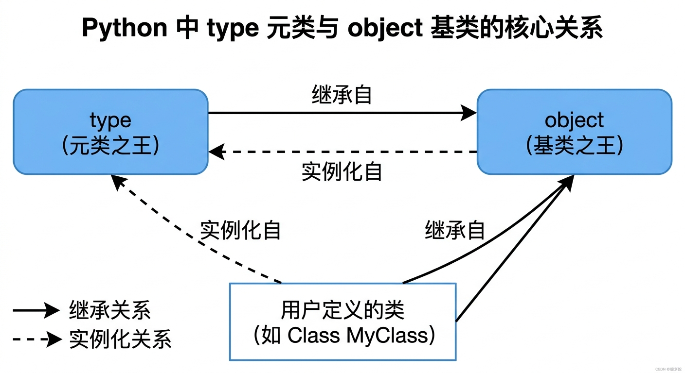

```python
		  继承 (Inheritance)
    type  ---------------->  object
     ^ |                      ^ |
     | |      实例化 (Instance) | |
     +-+ <--------------------+ +-+
   (自己生自己)              (由 type 生)
```

这种“鸡生蛋、蛋生鸡”的闭环设计，保证了语言体系内部的自洽性：**既保证了万物皆有基类可寻，又保证了万物皆有元对象可造。**

## 底层内存特性

Python 的底层是一个用 **C 语言编写的、高度抽象的对象系统**。任何程序语言底层都会有一个栈堆内存空间的概念。

### 什么是栈堆内存空间？

在计算机科学中，在程序运行时，计算机将内存划分为不同的区域，其中最核心的两个区域就是**栈**和**堆**。

**栈（Stack）**和 **堆（Heap）**是程序**运行时内存管理**的两个核心区域。虽然它们都用于存储数据，但在分配方式、速度和用途上有着本质的区别。它们就像是程序运行时的两种不同风格的“储物间”。

在 Python 中，是以**栈堆内存结构**来表示**整个程序的执行过程与内存管理**。

#### 栈空间（Stack）

*【自动化的“临时货架”】*

核心要点：栈内存是为**函数执行**准备的。每当一个函数被调用时，系统会为它分配一小块内存，函数执行完毕后，这块内存会立即被收回。

##### 核心概念

- **存储内容：** 局部变量、函数参数、返回地址

- **管理方式：** 自动管理。函数调用开始时入栈，函数结束时出栈

- **性能：** 极快。处理器有专门的寄存器指向栈地址，操作效率高

- **空间限制：** 空间较小且连续。如果递归调用层级过深，会引发 **Stack Overflow**（栈溢出）

**特点：**

- **后进先出（LIFO）：** 就像一叠盘子，最后放上去的总是最先被拿走
- **管理极快：** 由系统自动分配和释放，程序员不需要操心
- **空间较小：** 适合存放基本类型（如数字、布尔值）和函数运行时的引用地址

#### 堆空间（Heap）

*【自由分配的 “大型仓库”】*

核心要点：堆内存是一个**巨大的内存池**，程序员可以根据需要动态地申请和释放空间。它类似于一个杂乱的仓库，可以根据编号（指针）在任何位置存放或提取货物。

##### 核心概念

- **存储内容：** 动态分配的对象、全局变量（取决于语言实现）、大型数据结构

- **管理方式：** 自动由垃圾回收机制（Garbage Collection）管理

- **性能：** 较慢。分配时需要在内存中寻找足够大的空闲空间，且容易产生内存碎片

- **空间限制：** 空间很大，受限于系统的虚拟内存

**特点：**

- **动态分配：** 空间大小不固定，可以根据需要随时申请
- **管理较慢：** 系统需要去“仓库”里找一块足够大的空地给数据，不用时还需要专门的机制（如垃圾回收 GC）来清理
- **空间巨大：** 适合存放占用内存较多、需要长时间保留的数据

#### 总结对比

核心总结：**栈**是高效、短暂、小规模的自动化存储；**堆**是灵活、持久、大规模的自由存储。程序通常是在栈里存一个“门牌号（地址）”，顺着这个号去堆里找庞大的数据。

| **特性**     | **栈 (Stack)**             | **堆 (Heap)**            |
| ------------ | -------------------------- | ------------------------ |
| **存储目的** | 函数运行的局部环境         | 长期生存的大型对象数据   |
| **数据结构** | 线性（栈结构）             | 链表/树（非连续区域）    |
| **数据关联** | 存储具体的简单值或“门牌号” | 存储真正复杂的“货物”本体 |
| **分配方式** | 静态/自动分配              | 动态/手动分配            |
| **访问速度** | 极快（自动）               | 较慢（手动或自动回收）   |
| **空间容量** | 非常有限（容易溢出）       | 很大（取决于系统内存）   |
| **生命周期** | 随函数作用域结束而消失     | 持续到显式释放或垃圾回收 |
| **主要风险** | 栈溢出 (Stack Overflow)    | 内存泄漏 (Memory Leak)   |

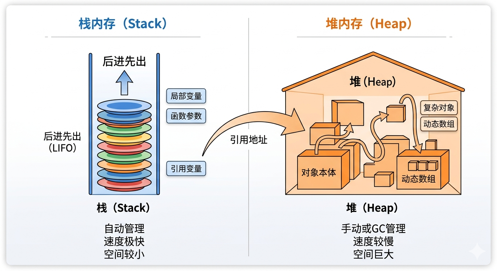

### 引用传递 &  执行上下文

Python 的引用传递与执行上下文是**两者并存**的概念，都涉及到**栈堆内存空间的存储内容与地址传递机制**。

- **引用传递：栈堆内存之间的内存地址传递与指向机制**
- **执行上下文：栈内存空间的存储内容单位**

#### 引用传递

在 Python 中，**变量的赋值引用**即不是传统的 “值传递”，也不是传统的 “引用传递”，而是 **“对象引用传递”**，也被称之为 **“赋值传递”**。

简单来说：当**把一个变量传入给函数内部使用**时，Python 解释器**传递的是该变量对象的内存地址（引用）**，但**函数内部对这个引用的处理方式**取决于变量对象是**可变（Mutable）**的还是**不可变的（Immutable）**。

##### 核心机制

在 Python 中，变量名本质上就是一个 “标识符”，**变量并不存储值，它们只是指向堆内存中某个实际值数据的“标签”**。

- **不可变对象 (Immutable)：** `int`, `float`, `str`, `tuple`, `bool` 【**值传递**】

  - 当给变量传递一个不可变对象（如整数）并试图修改它时，Python 会创建一个新对象，而不会改变原始对象

    ```python
    def increment(n):
        print(f"初始 n 的地址: {id(n)}")
        n += 1  # 这里创建了一个新的整数对象
        print(f"修改后 n 的地址: {id(n)}")
        return n
    
    x = 10
    print(f"x 的地址: {id(x)}")
    increment(x)
    print(f"函数调用后 x 的值: {x}") # x 依然是 10
    ```

    > **逻辑：** 因为整数不可变，`n += 1` 实际上是让 `n` 指向了一个新的内存地址，而 `x` 依然指向原来的地址。

- **可变对象 (Mutable)：** `list`, `dict`, `set`【**引用传递**】

  - 当你传递一个可变对象（如列表）并在函数内部修改它时，原始对象**会**发生改变

    ```python
    def append_element(lst):
        print(f"内部 lst 的地址: {id(lst)}")
        lst.append(4) # 直接在原内存地址上修改
    
    my_list = [1, 2, 3]
    print(f"外部 my_list 的地址: {id(my_list)}")
    append_element(my_list)
    print(f"函数调用后 my_list 的值: {my_list}") # 变成了 [1, 2, 3, 4]
    ```

    > **注意：** 如果在函数内部重新为 `lst` 赋值（例如 `lst = [1, 2]`），那么它会指向一个新对象，此时就不会影响外部的 `my_list` 了。

###### 注意点

由于可变对象是引用传递，所以**函数的默认参数值不应该使用可变对象**，因为**函数参数实质上是函数内的一个局部变量**。

```python
def add_to(item, target=[]): # 错误做法：target 并在定义时只创建一次
    # 相当于 target = []
    target.append(item)
    return target

print(add_to(1)) # [1]
print(add_to(2)) # [1, 2] 而不是 [2]
```

解决方案：始终使用 `None` 作为默认参数

```python
def add_to(item, target=None):
    if target is None:
        target = []
    target.append(item)
    return target
```

##### `=` 运算符的执行过程

**赋值即绑定：** 在 Python 中，`=` 操作符是把“标签”（变量名）贴到“对象”（堆里的数据）上。

当**程序读取到 `=` 赋值运算符**时会在**栈堆内存中创建各自对应的两个地址值**。如执行 `a = 100` 时，Python 内部并不是“把 100 存进 a”，而是按以下步骤操作：

1. **堆内存创建对象**：Python 先在堆内存中开辟空间，创建一个值为 `100` 的整数对象。假设其地址为 `0xa98`。
2. **栈内存创建引用**：在当前作用域的栈帧中，创建一个名为 `a` 的变量。
3. **建立绑定关系**：将 `a` 的地址空间（0x16a）里存入堆地址 `0xa98`。

##### 本质是栈堆内存的指向关系

核心要点：**变量只是一个内存数据的 “标签“**。多个变量赋予同一个值，就相当于是一个内存数据被贴上了多个 “标签”。

描述：**修改一个变量导致其他变量的值同时更新**，根本原因就在于**两个变量存的是同一个指针**。**`=`赋值时只是复制了栈内存中的指针地址，它们都指向同一份堆内存数据**，所以当我们改变其中一个变量的属性值的时候就会影响到另一个变量的值。

- **传递即复制指针：** 传参时，复制的是栈里的“地址指针”，而不是堆里的“对象实体”
- 修改动作：
  - 如果是**对象内部的修改**（如 `append`），**堆数据变了，所有指向它的引用都能看到变化**
  - 如果是**对变量重新赋值**（如 `x = [4, 5]`），只是**把栈里的指针拨向了堆里的新地址，原对象不受影响**

```python
obj1 = {'name': 'jack', 'age': 18}

obj2 = obj1  # 将 obj1 的内存地址拷贝一份给 obj2，相当于给 obj1 贴上了一个标签

obj2['name'] = 'tom'

print(obj1, obj2)  # { 'name': 'tom', 'age': 18 } {'name': 'tom', 'age': 18}
```

栈堆内存之间的关系【**栈指向堆**】：栈内存空间中存储的对象引用地址（`0x16a`）【变量名】会指向堆内存空间的真实数据值地址（`0xa98`）【值】，以此**绑定变量与值之间的内存关系**。

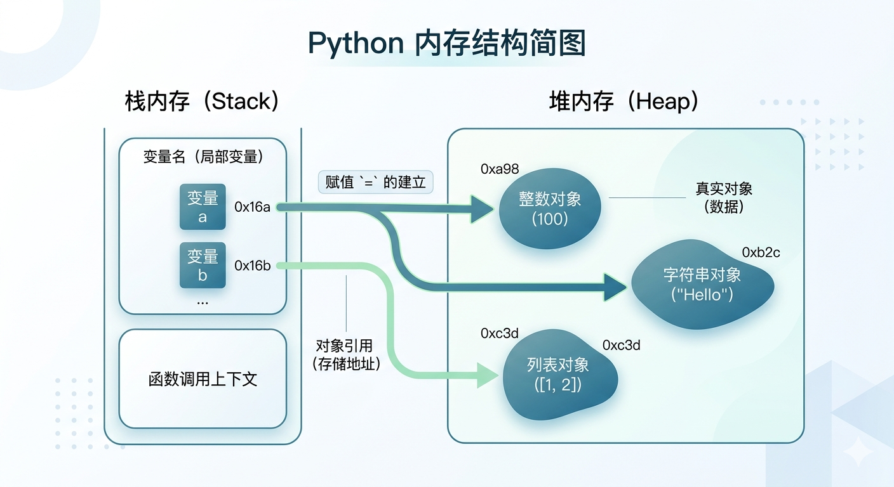

#### 执行上下文（栈帧）

在 Python 中，**执行上下文（Execution Context）**通常被称为**函数执行栈（Call Stack）**或**栈帧容器（Stack Frames）**，是 Python 解释器用来**管理代码执行、变量作用域和函数调用**的核心机制。

简单来说，**每当 Python 执行一段代码时，它都会在一个特定构建的“环境”中运行**。

##### 核心概念

执行上下文主要由 **执行栈（Call Stack）** 和 **栈帧容器（Stack Frames）**两部分组成。

###### 栈帧容器（Stack Frames）

核心要点：栈帧容器是**执行上下文的具体体现**。

Python 解释器在执行代码时，会将每一个函数调用封装成一个**帧（Frame）**。可以把帧想象成一个**“容器”**，里面**装满了当前函数运行所需的所有信息**。

一个典型的栈帧包含以下内容：

- **局部符号表 (Locals)：** 当前函数内定义的局部变量
- **全局符号表 (Globals)：** 全局模块内定义的全局变量、函数、类等成员
- **内置命名空间 (Built-ins)：** Python 预设的`len`、 `print`、`Exception` 等内置成员
- **返回地址：** 函数执行完后该回到哪里继续执行
- **代码对象 (Code Object)：** 实际的字节码

###### 执行栈（Call Stack）

Python 使用**“后进先出”（LIFO）的栈结构**来**管理这些帧容器**。

1. **全局帧（Global Frame）**：当 **Python 脚本开始运行**时，会**创建一个全局帧**，用于**存储全局变量、函数、类**，它**位于栈底**

2. **函数调用**：每次**调用一个新函数**，Python 解释器就会**创建一个新的帧（帧容器中存储函数的返回地址（上层作用域）、返回值、参数、局部变量等信息...）**，并**压入执行栈的栈顶（Push）**

   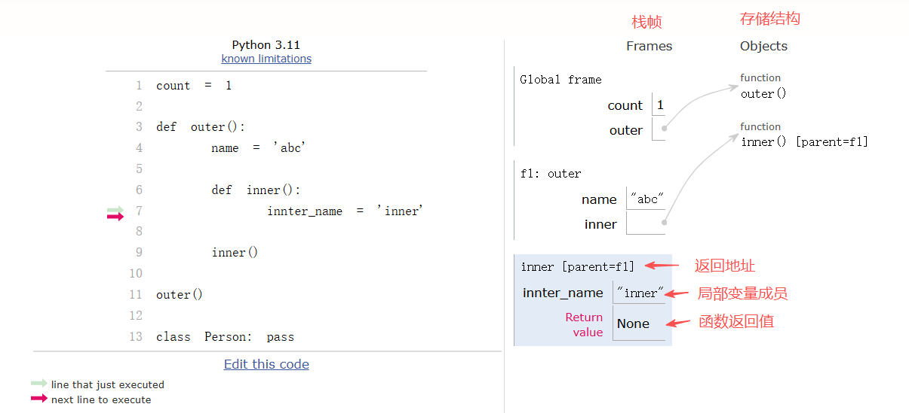

3. **函数返回**：当**函数执行完毕**后，它的**帧就会从栈顶弹出（Pop）并立即被 GC 回收销毁**，**控制权返回到前一个帧（上层作用域）**

> **注意：** 如果程序中有一个死循环递归，栈帧会不断堆叠，最终触发 `RecursionError: maximum recursion depth exceeded`栈溢出错误。

###### Python Tutor 查看栈帧

可以通过 [Python Tutor 官网](https://pythontutor.com/visualize.html#mode=edit) 查看 Python 程序执行过程中的执行上下文结构。

```python
count = 1

def outer():
    name = 'abc'
    
    def inner():
        innter_name = 'inner'
        
    inner()
    
outer()

class Person: pass
```

执行上下文内存结构如图：

- **`Frames`：帧列表**
  - **`Global frame`：全局栈帧**
  - **`f1`：函数调用时创建的栈帧（函数执行上下文）**
- **`Objects`：函数对象在帧中的存储结构**


##### 运行时内窥

可以通过在程序代码中引入内置的 `inspect` 模块或 `sys` 模块，实时查看当前的执行上下文。

```python
import sys


def outer_function():
    x = 10
    inner_function()


def inner_function():
    # 获取当前活跃的帧
    frame = sys._getframe()
    print(f"当前函数名: {frame.f_code.co_name}")
    print(f"上层调用者: {frame.f_back.f_code.co_name}")
    # 当前函数名: inner_function
    # 上层调用者: outer_function

outer_function()
```

##### 与引用传递的内存关系

在 Python 中，栈帧（执行上下文的具体实现）并不直接存储对象的值，它只存储**引用**。

###### 变量赋值

以简单的 `a = [1,2]`赋值语句来拆解：

- **堆（Heap）**：产生了一个真正的列表`[1,2]`。它有自己的内存地址（`0x22）`

- **栈（Stack）/ 执行上下文**：产生了一个变量 `a`

- **连接点（引用传递）**：**栈内存中存储的变量 `a` 内部存储的值正是堆内存中的 `0x111`存储地址**
  - 这个“存储地址并指向对象”的行为，就是**引用传递**的基础

###### 函数调用时的引用复制

```python
def update_list(L):
    L.append(4)

my_list = [1, 2, 3] 
update_list(my_list) # 把函数赋值给了变量
```

当**将外部变量传递给函数参数**时，本质上是**在栈帧（Stack Frame）中创建了一个新的局部变量引用**，它**指向了与外部变量相同的堆地址**。

执行上下文会发生以下情况：

1. **全局执行上下文**：全局栈帧里有一个 `my_list`，指向堆内存地址 `0x111`。

2. **函数执行上下文**：当 `update_list` 被调用时，Python 创建了一个新的栈帧。在这个新帧里，创建了一个局部变量 `L`。

3. **引用传递的真相**：Python 并不是把整个列表复制一份给 `L`，而是把地址 `0x111` 复制给了 `L`。

4. **结果**：现在，两个执行上下文（全局和函数）里的不同变量，都通过引用指向了**堆内存中同一个对象**。

   这就是为什么在函数里修改列表，外部也会改变。

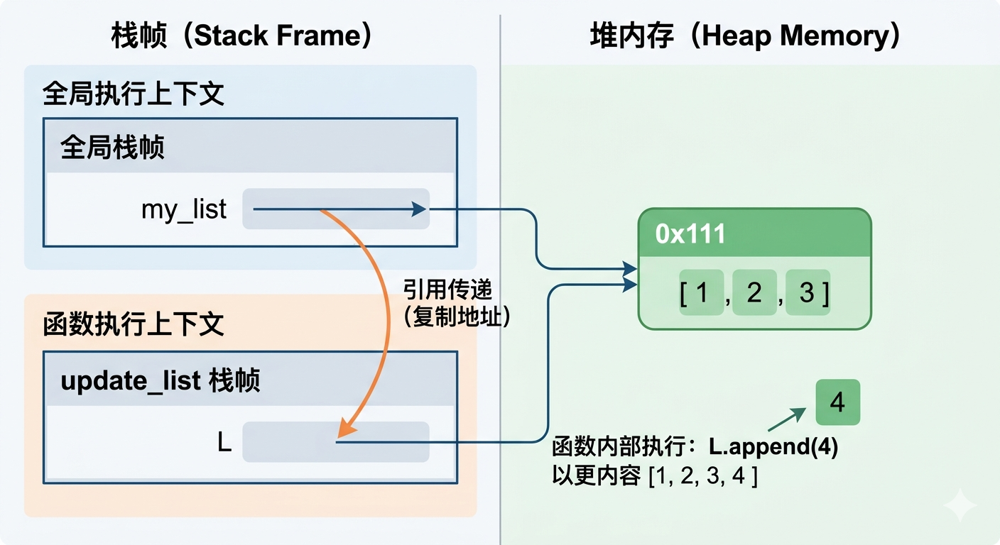

###### 关系总结表

核心结论：**执行上下文**是存放“遥控器”（引用）的地方，而**引用传递**则是把“遥控器”复制了一把给新函数，大家按的都是堆内存里同一台“电视机”（对象）。

| **维度**     | **执行上下文 (栈帧)** | **引用传递 (连接)** | **堆内存 (实体)**    |
| ------------ | --------------------- | ------------------- | -------------------- |
| **存储内容** | 变量名 + 内存地址     | 指向动作            | 数据实体 (Object)    |
| **存在时长** | 随函数调用开始/结束   | 随变量赋值产生      | 随垃圾回收 (GC) 消失 |
| **空间特点** | 空间小、速度极快      | 逻辑连接            | 空间大、管理复杂     |

#### 栈堆内存结构

在 Python 中，是以**栈堆内存结构**来表示**整个程序的执行过程与内存管理**。

两者是执行流（Stack）**与**数据存储（Heap）之间的解耦关系。

- **栈内存 (Stack)**：存储**程序的执行上下文（Frames）环境信息** 以及 **栈的执行过程（执行栈）**
  
  - **栈帧（Stack Frames）**：栈内存的**基本存储单位**，它对应的是**执行上下文**，而非变量个体。
  
    Python 解释器在执行代码时，会将每一个函数调用封装成一个**帧（Frame）**。可以把帧想象成一个**“容器”**，里面**装满了当前函数运行所需的所有信息**。如**返回值、返回地址、局部变量成员名（标识符）**，并为它们创建一个**指针（Pointer）**，这个指针**指向堆内存中的某个地址**。
  
    一个典型的栈帧包含以下内容：
  
    - **局部符号表 (Locals)：** 当前函数内定义的局部变量
    - **全局符号表 (Globals)：** 全局模块内定义的全局变量、函数、类等成员
    - **内置命名空间 (Built-ins)：** Python 预设的`len`、 `print`、`Exception` 等内置成员
    - **返回地址：** 函数执行完后该回到哪里继续执行
    - **代码对象 (Code Object)：** 实际的字节码
  
  - **执行栈（Call Stack）**：
  
    - 栈内存中**执行上下文的具体表现形式**，即**栈的调用执行过程**
  
    - 使用**“后进先出”（LIFO）的栈结构**来**管理这些帧容器**
  
    - 具体结构：
  
      - **全局帧（Global Frame）**：当 **Python 脚本开始运行**时，会**创建一个全局帧**，用于**存储全局变量、函数、类**，它**位于栈底**
      - **函数调用**：每次**调用一个新函数**，Python 解释器就会**创建一个新的帧（帧容器中存储函数的返回值、参数、局部变量等信息...）**，并**压入执行栈的栈顶（Push）**
      - **函数返回**：当**函数执行完毕**后，它的**帧就会从栈顶弹出（Pop）并立即被 GC 回收销毁**，**控制权返回到前一个帧（上层作用域）**
  
      > **注意：** 如果程序中有一个死循环递归，栈帧会不断堆叠，最终触发 `RecursionError: maximum recursion depth exceeded`栈溢出错误。
  
- **堆内存 (Heap)**：存储**具体的数据值地址**，堆内存地址**会被栈帧容器中的某个对象引用指针（Point）所指向**

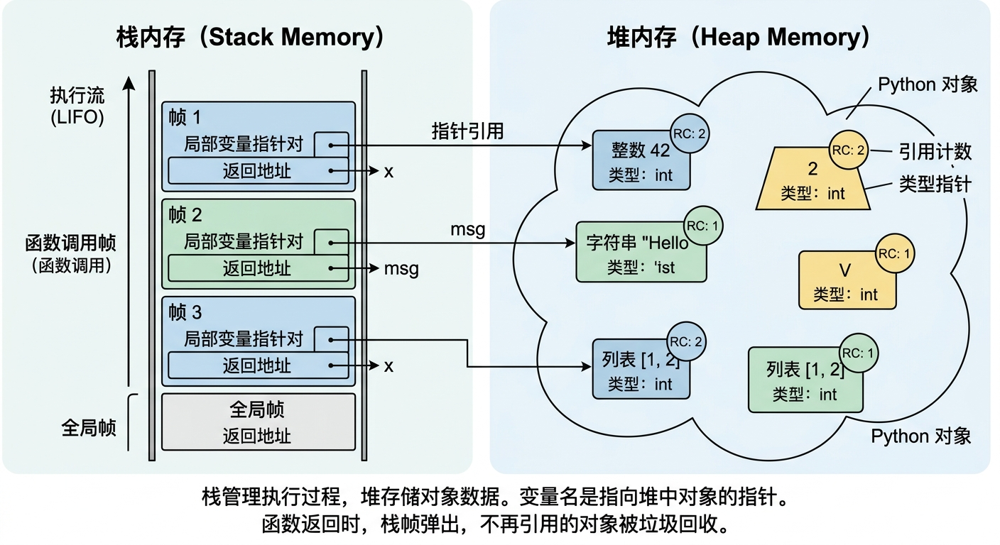

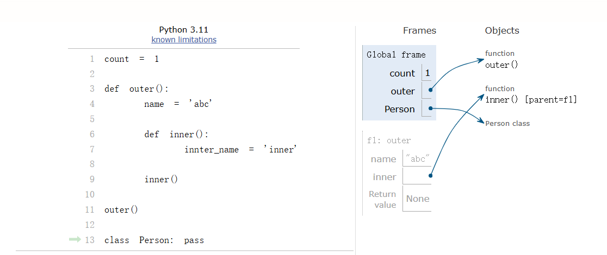

##### 对比表

| **维度**     | **栈内存 (Stack)**                       | **堆内存 (Heap)**                                            |
| ------------ | ---------------------------------------- | ------------------------------------------------------------ |
| **存储内容** | 局部变量名、函数调用栈、对象引用（地址） | 实际的对象数据（100, "hello", [1,2]）                        |
| **管理方式** | LIFO（后进先出），自动管理               | 引用计数为主，分代回收为辅                                   |
| **生命周期** | 随函数调用结束自动释放（后进先出）       | 由 Python 的垃圾回收机制（GC）管理，只要引用计数不为 0 就一直存在 |
| **访问速度** | 快（结构简单，寻址直接）                 | 相对较慢（需要通过指针间接访问）                             |
| **空间大小** | 较小且固定                               | 较大且动态                                                   |

### 作用域

在 Python 中，**作用域（Scope）是指变量可见且可用的范围**。作用域底层**与栈内存中的 “栈帧” 和 执行上下文 概念紧密相连**。

从内存管理的角度看，作用域的存在是为了：

1. **避免命名冲突**：不同函数可以用相同的变量名而不互相干扰
2. **节省内存**：局部作用域的变量在函数执行完后，其所在的栈帧会被销毁，从而让堆内存中的对象引用计数减少，及时释放内存

作用域分为两种表现形式：

- **作用域（执行上下文环境）**：程序中**变量的定义位置**
- **LEGB 作用域链**：在作用域命名空间中**如何查找变量**

核心要点：**每个作用域本质上都对应着栈内存中的一个执行上下文环境（命名空间 | 栈帧容器）**。

#### 作用域分类

在 Python 中，根据访问层级划分共有 4 层作用域：

- **`Local`：局部作用域**；**函数内**的代码块成员
- **`Enclosing`：嵌套/闭包作用域**；**内层嵌套函数中相对于外层函数定义**的代码块成员
- **`Global`：全局作用域**；**当前模块（文件）内**的代码块成员
- **`Built-in`：内建作用域；Python 预装的成员（`len()`、`range()`、`list` 等函数、异常类...）**

变量查找顺序：**Local 局部作用域 => Enclosing 嵌套/闭包作用域（外层函数）=> Global 全局作用域 => Built-in 内建作用域**。

```python
x = "Global"  # G: 全局作用域

def outer_func():
    x = "Enclosing"  # E: 嵌套作用域
    
    def inner_func():
        x = "Local"  # L: 局部作用域
        print(x)     # 搜索顺序：L -> E -> G -> B
        
    inner_func()

outer_func()
```


##### 局部作用域（Local）

核心定义：**函数的内部**就是局部作用域。

局部成员：在**函数内定义的属性、变量、函数参数、嵌套函数**就是局部成员，**只能在该函数内可见，对外不可见**。

特点：

- 每次**调用函数**都会**创建一个新的局部作用域（栈帧）**
- 生命周期：**函数运行结束后，局部作用域随之销毁（栈帧被弹出、回收）**
- 查找范围：**外部无法直接访问函数内部的局部变量**
- 在**查找变量**时，**局部作用域优先级最高**。`LEGB` 中的 `L`
  - 如果**当前局部作用域内有与全局作用域中的同名变量**，则**优先使用局部作用域内的同名变量，从而覆盖外部的同名变量**，在**当前局部作用域找不到，才向上查找**

```python
def test():
    x = 10 # x 在局部作用域中
    print(x) # 10 可以访问
    
print(x) # 报错，x 在局部作用域（函数）之外不可见


# 全局变量
version = '1.0'

def func(version):
    # 相当于内部 version = '2.0'，是函数的局部变量
    print(version)  # 2.0 Python 解释器在当前局部作用域中找到了，则直接使用
    
def func2():
    version = '2.0' # 局部变量
    print(version)  # 2.0 Python 解释器在当前局部作用域中找到了，则直接使用

func('2.0')
func2()
print(version)  # 1.0 任何位置都可以访问到全局变量
```

###### locals() 局部变量池

核心描述：`locals()` 内置函数会返回一个**`dict` 字典**，其中包含了**当前作用域（Scope）中定义的所有局部变量的名字和它们的值**。

`locals()` 的行为取决于在哪里调用它：

- **在函数内部：** 返回该函数的局部变量（包括参数）
- **在全局作用域（模块层级）：** 返回的结果与 `globals()` 完全相同
- **在类定义中：** 返回该类命名空间中的内容

```python
# locals() 内置函数，返回当前所在作用域的所有成员
name = 'locals_demo'
VERSION = '1.0'

def func(params=None):
    x = 10
    y = 20
    def inner(): pass
    print(locals())
    # 函数中的所有成员 
    # {'params': None, 'x': 10, 'y': 20, 'inner': <function func.<locals>.inner at 0x000002C81AD7FA00>}

func()

class Person:
    person_id = 'person_id'
    print(locals())
    # 类中的所有成员
    # {'__module__': '__main__', '__qualname__': 'Person', '__firstlineno__': 18, 'person_id': 'person_id'}
    
    def say_hello(self): pass

person = Person()

# 将 items 转换为列表，避开迭代时字典大小改变的问题
for key, value in list(locals().items()):
    # 过滤掉内置变量，只打印自定义内容
    if not key.startswith("__"):
        print(f"{key} : {value}")

# 全局作用域的所有成员
'''
name : locals_demo
VERSION : 1.0
func : <function func at 0x000001BFD5BEF950>
Person : <class '__main__.Person'>
person : <__main__.Person object at 0x00000281F6038D70>
'''
```

注意点：

- **在函数中**：`locals()`返回的字典是**只读性**的。意味着在函数内部，**修改 `locals()` 返回的字典内容不会影响实际的局部变量**

  ```python
  def func():
      x = 10
      y = 20
      print(locals())  # {'x': 10, 'y': 20}
      locals()['x'] = 100  # 不会影响局部变量的实际值
      print(locals())  # {'x': 10, 'y': 20}
  
  func()
  ```

- **在全局中**：`locals()` 返回的字典是**可读写**的。意味着在全局作用域，**修改 `locals()` 返回的字典内容会影响实际的全局变量**

  ```python
  # 修改全局作用域的成员内容
  name = 'locals'
  
  locals()['name'] = 'locals_demo'
  
  # 将 items 转换为列表，避开迭代时字典大小改变的问题
  for key, value in list(locals().items()):
      # 过滤掉内置变量，只打印自定义内容
      if not key.startswith("__"):
          print('{ ' + f"{key} : {value}" + ' }')
  
  # { name : locals_demo }
  ```

| **特性**     | **描述**                                           |
| ------------ | -------------------------------------------------- |
| **返回类型** | 字典 (`dict`)                                      |
| **实时性**   | 在函数内是局部变量的“快照”                         |
| **修改行为** | 函数内修改 `locals()` 字典**无效**；全局下**有效** |
| **性能**     | 频繁调用会有一定开销，因为它需要临时构建字典       |

###### fastlocals 定长数组

在概念上，虽然可以通过 `locals()` 函数返回的字典查看当前局部作用域中定义的所有局部变量键值对。

但实际上为了性能，Python 对局部变量做了特殊的优化。**将局部变量存储在“定长数组”中**，而不是字典。

在函数内部，局部变量的存储机制被称为 **`fastlocals`**。

- **编译阶段**：当 Python 将源代码编译成字节码时，它能确定函数内定义了哪些局部变量。
- **运行阶段**：
  - Python 为函数创建一个栈帧（Stack Frame）
  - 该栈帧包含一个**定长数组**，专门存储局部变量
  - 对局部变量的访问不再通过“字符串键”去字典里哈希查找，而是通过数组下标（Index）直接访问

这就是为什么局部变量的访问速度比全局变量快很多（全局变量依然需要查 `globals()` 字典）

可以通过 `dis` 模块查看 Python 字节码：

```python
import dis

def test_scope():
    a = 10     # 局部变量
    return a

dis.dis(test_scope)

'''
输出结果：
2           0 LOAD_CONST               1 (10)
            2 STORE_FAST               0 (a)  # 注意这里是 STORE_FAST

3           4 LOAD_FAST                0 (a)  # 注意这里是 LOAD_FAST
            6 RETURN_VALUE
'''
```

> **`STORE_FAST` / `LOAD_FAST`**：这两个指令专门用于操作局部变量数组。
>
> **对比**：访问全局变量时，指令会是 `LOAD_GLOBAL`，它底层依然需要执行字典查找。

> [!NOTE]
>
> 为什么 `locals()` 有时候看起来像字典？
>
> 这里有一个有趣的“欺骗”行为：
>
> 1. 当调用 `locals()` 时，Python 解释器会动态地**实时创建一个字典**
> 2. 它**将 `fastlocals` 数组中的变量拷贝到这个字典**里返回
> 3. **注意**：在函数内部修改这个 `locals()` 字典，通常**不会**影响真正的局部变量，因为那只是个**临时快照**
>
> ```python
> def demo():
>     x = 1
>     locals()['x'] = 2  # 尝试修改字典
>     print(x)           # 输出依然是 1
> 
> demo()
> ```

##### 嵌套/闭包作用域（Enclosing）

核心定义：如果**函数中嵌套定义了函数**，那么**外层函数的作用域，就是内层函数的嵌套/闭包作用域**。

特点：

- 只有当**函数 “嵌套定义（例如在一个函数内定义了另一个函数）” **时才会出现
- **内层函数可以读取外层函数的变量（闭包）**
- 想**修改外层函数变量必须使用 `nonlocal`关键字事先声明**
  - 即使外部函数已经执行完毕弹出栈，如果**内部函数（闭包）仍被引用**，这些**外部函数的局部变量**会以特殊方式**保留在内存中**


```python
def outer():
    x = 10  # 外层函数的局部作用域  => 等于 内层函数的嵌套/闭包作用域

    def inner():
        print(x)  # 10 向上查找嵌套/闭包作用域内的变量

    inner()
    print(x)  # 10


outer()
```

###### 行为准则

当 Python 函数中引用了外层函数作用域的变量时：

- 如果**内层嵌套函数作用域变量与外层函数作用域内的变量同名**，则**优先访问当前函数局部作用域的局部变量**

```python
def outer():
    # 嵌套/闭包作用域
    x = 100

    def inner():
        # 嵌套函数局部作用域
        x = 200  # 这相当于是创建了一个当前局部作用域的局部变量 x
        print(x) # 200 访问的是当前局部作用域的 x
    inner()


outer()
```

- 但如果在函数内部**修改**一个**与外层函数作用域中的同名变量**，则**需要通过 `nonlocal` 关键字明确声明它是外层函数作用域的变量**，否则会触发 `UnboundLocalError` 错误

###### nonlocal 关键字

作用：

​	为了防止在嵌套函数定义中，**内层函数局部作用域的变量与外层函数闭包作用域的变量命名污染**；

​	当内层函数想要**对外层函数变量进行修改**时，需事先通过**`nonlocal` 关键字**明确**声明要修改的变量是外层函数作用域的变量**，表示**“我（内层函数）要修改你（外层函数）的变量了”**。

​	这样，当 Python 解释器读取到 `nonlocal` 关键字会**强制程序跳过当前函数局部作用域**，而是**直接去外层函数中查找**。通常**用于闭包中修改外部函数的局部变量**。

- 核心作用：**`nonlocal` 关键字**用于声明该变量**引用的是上一层“函数帧”（非全局）中的对象**。

  Python 解释器**会将 `nonlocal`关键字后面声明的外层函数局部变量拎出来放在当前内层函数中的 `__closure__` 属性中以 `Cell` 对象结构存储**，`__closure__` 属性是一个**元组**，专门用于存储闭包变量；此时就算外层函数执行完毕被 GC 回收销毁，它其中被内层函数引用的局部变量也不会销毁，而是存放到内层函数的  `__closure__` 属性中，**每次外部通过内层函数访问、修改该变量时，Python 解释器都是在 `__closure__` 属性中去查找**。

> 注意：**`nonlocal` 关键字一定要写在局部变量赋值语句之前！**

```python
def outer():
    x = 10  # 外层函数的局部作用域  => 等于 内层函数的嵌套/闭包作用域

    def inner():
        nonlocal x  # 声明 x 是外层作用域变量，直接去外层函数中查找
        print(x)  # 10 向上查找嵌套/闭包作用域内的变量
        x = 20  # 修改外层函数的局部变量
        print(x)  # 20
    inner()
    print(x)  # 20 # 外层函数的局部变量被修改了

outer()
```

##### 全局作用域（Global）

核心定义：**`.py`  模块文件就是全局作用域**。全局作用域中的**变量**，在**当前 `.py` 模块文件内的任何位置都可以访问到**。

特点：

- 全局变量**只在当前 `.py` 文件内可见**
- 生命周期：**从 Python 脚本开始运行直到程序结束**。它**存储在栈底的“全局帧”中**
- **函数内部可使用 `global` 关键字修改全局变量**

```python
# 全局变量
version = '1.0'

def func():
    print(version)  # 1.0 函数内部向上查找，找到全局变量

func()
print(version)  # 1.0 任何位置都可以访问到全局变量
```

###### 行为准则

当 Python 函数中引用了全局作用域变量时：

- 如果**全局作用域变量与当前函数局部作用域内的局部变量同名**，则**优先访问局部变量**

```python
# 全局变量
version = '1.0'

def func():
    version = '2.0'  # 局部变量
    print(version)  # 2.0

func()
print(version)  # 1.0

def func2(version): # 函数参数是局部变量
    # 相当于在函数内写 version = '2.0
    print(version)  # 2.0

func2('2.0')
print(version)  # 1.0
```

- 但如果在函数内部**修改**一个**全局变量**，则**需要通过 `global` 关键字明确声明它是全局变量**，否则会触发 `UnboundLocalError` 错误

###### global 关键字

描述：

​	为了防止**函数局部作用域的变量与全局作用域的变量同名造成命名污染**；

​	所以当函数内部想要**对全局作用域的变量进行修改**时，需**通过 `global` 关键字明确声明要修改的变量是全局作用域的变量**，表示 **“我（函数局部作用域）要使用你（全局作用域）的变量了**”。

​	这样，Python 解释器读取到 `global` 关键字会**强制程序直接定位到全局作用域（全局帧）**，**忽略函数嵌套/闭包作用域 和 当前函数局部作用域**，而是**直接去全局作用域中查找**。

- 核心作用：**`global` 关键字**用于声明该变量**引用的是“全局帧”中的对象**。

> 注意：**`global` 关键字一定要写在全局变量赋值语句之前！**

```python
# 全局变量
version = '1.0'

def func():
    global version # 声明 version 是全局作用域变量
    
    print(version)  # 1.0
    version = '2.0'  # 修改全局作用域的变量
    print(version)  # 2.0
    
    # global version
    # 报错 SyntaxError： name 'version' is used prior to global declaration 在全局声明之前使用了名称“version”。


func()
print(version)  # 2.0 全局变量被局部作用域修改了
```

###### globals() 全局变量池

> [!NOTE]
>
> **全局变量池**：
>
> ​	Python 中其实就是指 **全局符号表（Global Symbol Table）**。每当**运行一个 Python 模块（即一个 `.py` 文件）**时，Python 解释器都会**为该模块维护一个独立的 `dict` 字典**，用来**存储在全局作用域中定义的变量、函数和类**。
>
> 全局变量池的生命周期：
>
> - **创建**：在模块被加载（import）或脚本开始执行时初始化。
> - **存续**：只要 Python 解释器没有关闭，或者该模块没有被卸载，全局变量就一直占据内存。
> - **销毁**：程序退出时销毁。
> - **注意**：过度使用全局变量会导致内存无法及时回收，因为全局变量池中的对象引用计数通常不会归零。

Python 的全局变量池本质上就是一个普通的 **`dict`** 字典：

- **Key**: **全局变量名**
- **Value**: 该**全局变量指向的对象**

```python
# 全局成员，都会被存储到 globals() 全局变量池中
name = 'global'
version = '1.0'

class Person:
    pass

def func(): pass


# 将 items 转换为列表，避开迭代时字典大小改变的问题
for key, value in list(globals().items()):
    # 过滤掉内置变量，只打印自定义内容
    if not key.startswith("__"):
        print(f"{key} : {value}")

'''
name : global
version : 1.0
Person : <class '__main__.Person'>
func : <function func at 0x000001801E02F950>
'''
```

###### 作用域冲突问题

场景：若**函数参数、局部变量与全局变量同名**，此时会**触发 `SyntaxError: name 'x' is parameter and global` 错误**。

问题表示：在 Python 中，**同一个函数内部，一个变量名不能既是“形式参数”又是“全局变量声明”**，这会造成作用域冲突问题。

```python
x = 5

# 函数参数名与全局变量同名
def update_x(x): # x 在这里被定义为局部参数
    global x     # 语法错误！Python 不知道该听参数的还是听 global 的
    x = x + 1

version = '1.0'
# 局部变量与全局变量同名
def func():
    version = '2.0' # 局部变量
    global version # 语法错误！Python 不知道该听局部变量的还是听 global 的
    version = '3.0' # 这里的修改会导致 Python 逻辑混乱，不知道是修改局部变量 version 还是全局变量 version
```

解决方案：

- **重命名函数参数**

  ```python
  x = 5
  
  def update_x(new_val):
      global x
      x = new_val  # 明确修改全局变量 x
  
  update_x(10)
  print(x) # 输出 10
  ```

- 通过 **`globals()` 内置函数访问全局变量池，从全局变量池中查找并修改**，与局部变量做区分处理

  ```python
  # 全局变量
  version = '1.0'
  
  # 函数参数与全局变量同名
  def func(version):
      globals()['version'] = '1.1'  # 这是修改全局变量 version
      version = '2.0' # 这是修改函数参数（局部变量） version
      print(version)  # 这是函数参数 version（局部变量）
  
  func('2.0')
  print(version)  # 1.1
  
  
  # 局部变量与全局变量同名
  def func():
      version = '2.0'  # 局部变量
      globals()['version'] = '1.1'  # 这是修改全局变量 version
      version = '3.0' # 这是修改局部变量 version
      print(version)  # 3.0 修改后的局部变量
      print(globals()['version'])  # 1.1 修改后的全局变量
  
  func()
  print(version)  # 1.1
  ```

##### 内建作用域（Built-in）

核心定义：这是最外层的作用域，包含 Python 解释器**预先定义好的成员（关键字、函数、模块、类...）**，**所有 `.py` 模块文件都可以访问**。

特点：

- 所有 `.py` 模块文件都能直接使用其名称。例如：`list()`、`len()`、`range()`...
- **查找优先级最低**。`LEGB` 中的 `B`

```python
print('hello')

len([1,2,3])

# 以上这些都是 Python 内建作用域中的成员，可面向所有 `.py` 模块文件访问
```

###### \__builtins__ 内置成员字典

Python **为每个模块**都提供了 **`__builtins__` 魔术属性**，它的**值是一个  `module` 模块**。

核心作用：`__builtins__` 魔术属性是 Python 解释器**在启动时自动加载的一个特殊模块**，包含了所有**内置函数**（如 `print()`）、**内置常量**（如 `None`）和**内置异常**（如 `ValueError`）。简单来说，不需要 `import` 就能直接使用的东西，基本都在这。

核心功能：**`__builtins__` 就代表了内建作用域中的成员**，当使用**全局变量**时，Python 会**去 `__builtins__.__dict__` 字典中去查找**。

```python
import builtins

# 查看所有的内置成员
print(dir(builtins))

print(__builtins__.__dict__['tuple']([1, 2])) # 等价于直接使用 tuple()
```

`__builtins__` 主要由以下三大类组成：

| **类别**     | **示例**                                                   |
| ------------ | ---------------------------------------------------------- |
| **内置函数** | `len()`, `range()`, `print()`, `type()`, `sum()`, `open()` |
| **内置常量** | `True`, `False`, `None`, `Ellipsis` (`...`)                |
| **内置异常** | `Exception`, `TypeError`, `IndexError`, `KeyError`         |
| **类型对象** | `int`, `str`, `list`, `dict`, `set`                        |

当调用一个变量名时，Python 会按以下顺序查找：

1. **L (Local)**：局部作用域（函数内部）。
2. **E (Enclosing)**：闭包函数外的函数体。
3. **G (Global)**：全局作用域（当前 `.py` 文件）。
4. **B (Built-in)**：**这就是 `__builtins__` 所在的地方。**

> **注意：** 如果在全局作用域定义了一个 `len = 10`，那么 Python 会先找到 `10`，而屏蔽掉内置的 `len()` 函数。这就是所谓的“命名空间污染”。

总结：`__builtins__` 是 Python 的“工具箱底层”，它**保证了语言最基础的功能随时可用**。

#### LEGB 查找规则（作用域链）

##### 核心概念

当在代码中要访问一个变量时，Python 会按照**由内到外**的顺序在以下 4 个层级中**依次向上查找**该变量，一旦找到，搜索就会停止。

*可以理解为 LEGB 查找机制就是作用域链*

变量查找顺序：**Local 局部作用域 => Enclosing 嵌套/闭包作用域（外层函数）=> Global 全局作用域 => Built-in 内建作用域**。

| **全称**                 | **栈帧 (Stack Frame)** | **含义**                                  | **对应栈帧位置**                      |
| ------------------------ | ---------------------- | ----------------------------------------- | ------------------------------------- |
| **Local** (局部) `L`     | **当前活动的栈顶帧**   | **函数或类方法内部**定义的变量            | Locals 符号表【**`locals()` 字典**】  |
| **Enclosing** (嵌套) `E` | **外层函数栈帧**       | **闭包函数中，外部非全局函数内**的变量    | `Cell`符号表【**`__closure__`元组**】 |
| **Global** (全局) `G`    | **栈底全局帧**         | **当前模块（文件）顶层定义**的变量        | Globals 符号表【**`globals()`字典**】 |
| **Built-in** (内置) `B`  | **底层加载**           | **Python 预装**的变量（如 `len`, `dict`） | **`__builtins__.__dict`字典**         |

核心结论：**每一个作用域（执行上下文）内部都维护着一个命名空间**。当“**在作用域里找变量**”时，本质上就是**在当前作用域（执行上下文）的命名空间（字典）里查询 Key（变量名）**。

> 如果以上四层都找不到该变量，代表没有该变量，Python 就会抛出 `NameError` 错误

属性查找的**单向性原则**：**只能由内往外查找，不能从外往内查找**。

- **向上查找**：代码在 `Local` 层级时，视线是**向外看**的，它可以看见外面所有层级的变量
- **向下屏蔽**：在 `Global` 层级的人，是**看不见** `Local` 内部定义的变量的。这保证了函数内部的私密性和安全性，防止变量名污染

```python
# B: Built-in (如内置的 print 函数)
x = "全局变量"  # G: Global

def outer():
    x = "外部嵌套变量"  # E: Enclosing
    
    def inner():
        x = "局部变量"  # L: Local
        print(x)      # 查找顺序：L -> E -> G -> B
    
    inner()

outer()
```


##### 底层机制

Python 中的 LEGB 属性查找过程底层机制其实就是一个个 **命名空间（Namespace）【作用域成员】** 映射到具体 **字典（Dictionary）** 对象的查询逻辑。

核心定义：Python 中**为每个作用域都内置了一个 `dict` 字典 / `tuple` 元组** 专门用于**存储映射当前作用域下的所有成员**。当在函数局部作用域内要访问某个变量时，会启用 LEGB 查找规则**根据作用域层级顺序**依次**向上查找**。

###### 底层查找执行过程

核心概念：LEGB 规则本质上是**在一系列字典中进行键值对的匹配**。

1. **`Local` 局部作用域**：查看**当前局部作用域的 `locals()` 实时返回的字典是否有该变量成员**

   【使用字节码指令 `LOAD_FAST` 局部】没有则继续向上穿透查找

   - 对于局部变量的查找，CPython 虚拟机底层做了极大的优化：
     - **局部变量优化**：对于函数内部的局部变量，CPython **在编译时就能确定它们的位置**。因此，**局部变量并不存储在真正的字典中**，而是存储在一个**固定长度的数组 `fastlocals `**中，通过索引直接访问
       - 当**调用 `locals()` 函数**时，Python 会**实时创建一个字典的快照**，将数组中的变量拷贝进去提供给外部查看
       - 这也是为什么在函数内部修改 `locals()` 字典通常不会影响到实际变量值的原因，因为它是**动态的、实时性**的

2. **`Enclosing` 嵌套/闭包作用域**：查看**当前内层函数作用域中的 `__closure__` 属性中是否有该变量成员**

   【使用字节码指令 `LOAD_DEREF` 闭包】，没有则继续向上穿透查找

   - 对于闭包函数中局部变量的查找：

     Python 会**将原本属于外层函数栈帧的局部变量“转移”到堆内存中的 Cell 对象里**，并**存储到内层函数的 `__closure__`元组属性**中，并**让内层函数通过 `__closure__` 属性在外层函数被 GC 回收后继续持有它的引用**，以此实现**跨作用域的数据持久化**。

   - 为什么 `nonlocals` 关键字必须存在？

     因为 `nonlocals` 关键字**可以告诉解释器，使用闭包链中 `__closure__` 里的 Cell 引用，而不是在当前局部字典创建新条目**。

3. **`Global` 全局作用域**：查看**当前全局作用域的 `globals()` 返回的字典是否有该变量成员**

   【使用字节码指令`LOAD_GLOBAL`（全局/内置）】，没有则继续向上穿透查找

   - 为什么 `global` 关键字必须存在？

     因为 `global` 关键字可以**告诉编译器不要生成 `LOAD_FAST` 指令**，而是**直接去查 `globals()` 字典**

4. **`Builtins-in` 内建作用域**：查看**当前模块中的 `__builtins__.__dict__` 字典中是否有该变量成员**

在这个过程中，找到变量则返回指针并中断查找过程，如果直到内建作用域中的字典也没有时，则报错。


###### 底层数据存储位置

| **存储位置**         | **作用域类型** | **底层数据结构**          | **访问指令**  |
| -------------------- | -------------- | ------------------------- | ------------- |
| **局部 (Local)**     | 函数内部       | **定长数组 (fastlocals)** | `LOAD_FAST`   |
| **全局 (Global)**    | 模块顶层       | **字典 (dict)**           | `LOAD_GLOBAL` |
| **闭包 (Enclosing)** | 嵌套函数       | **Cell 对象数组**         | `LOAD_DEREF`  |

### 闭包

#### 什么是闭包？

在 Python 中，每次**函数被调用**都会**在栈内存中基于全局帧之上创建一个新的作用域（栈帧容器）**，这个容器就表示函数的执行上下文，用于**存储当前被调用函数内的所有成员**（比如返回地址、函数返回值、变量、冻结语句等环境信息）。

正常情况下，当**一个函数在执行结束后**，**栈内存中对应的函数栈帧、函数内的所有成员都会随之一同被 GC 回收销毁**；但是**如果函数内又定义了一个嵌套内层函数**，嵌套内层函数内**使用了外层函数中的局部变量成员**，且**内层函数被外部引用（比如返回给外部、赋值给全局变量、作为回调函数传递）**，就会形成一个**闭包**。即**外层函数栈帧在函数执行完毕并弹栈销毁**后，本应随着外层函数一同销毁的**外层函数的局部变量却依然存在**，还能**被外部间接通过内层函数访问到它**，这个就是**闭包的过程**，而那些**被内层函数持续引用的外层函数局部变量**就是**闭包变量单元**。

闭包形成的底层逻辑：**“函数” + “定义该函数时所处的环境”**。当 Python 解释器执行到内层函数中，**读取到内层函数需要访问外层函数的某个局部变量**，Python 解释器会**按照 LEGB 查找规则去外层函数作用域中查找并引用该变量**，而由于**外层函数执行结束后，栈内存中的栈帧会被销毁**，但是**此时内部函数的作用域链中依然保留着外部函数执行上下文空间中的某个局部变量引用**，这个外层函数的局部变量被内层函数拽着不放，**从而阻止了外部函数内局部变量被 GC 回收销毁，这个变量就“活”了下来**。

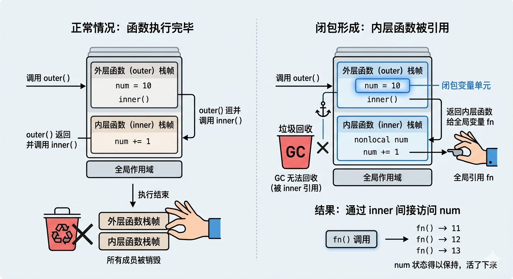

```python
# 全局作用域

def outer():
    # 嵌套/闭包作用域
    num = 10

    def inner():
        # 局部作用域
        nonlocal num  # 去 outer 外层函数作用域中查找 num 变量
        num += 1
        print(num)  # 引用外层函数作用域中的 num 局部变量

    return inner


fn = outer()
# 全局作用域还能通过 inner 内层函数间接访问到被销毁的 outer 函数内的 num 变量
fn()  # 11 执行 outer 函数内的 inner 内层函数
fn()  # 12 执行 outer 函数内的 inner 内层函数
fn()  # 13 执行 outer 函数内的 inner 内层函数
fn()  # 14 执行 outer 函数内的 inner 内层函数
```

##### 存放在哪里？（`__closure__` 属性）

Python 为**每个函数都内置了一个 `__closure__` 属性**，以 **`Cell` 对象结构（元组形式）存储**，该属性中的内容是**专门存储闭包成员**的。

Python 解释器会**将 `nonlocal`关键字后面声明的外层函数局部变量单独拎出来放在当前内层函数中的 `__closure__` 属性中以 `Cell` 对象结构存储**。

核心作用：`__closure__` 属性是一个**元组**，专门用于**存储闭包变量**；就算外层函数执行完毕被 GC 回收销毁，它其中被内层函数引用的局部变量也不会销毁，而是存放到内层函数的  `__closure__` 属性中，每次外部通过内层函数访问、修改该变量时，Python 解释器都是在 `__closure__` 属性中去查找。

###### Cell 对象

核心作用：Cell 充当了一个“中转站”。`outer` 函数和 `inner` 函数都不直接存储 `num` 的值，而是**共同引用同一个 Cell 对象**。这个 Cell 对象**存储在堆内存（Heap）中**，而**不是栈内存**里。


###### 示例

```python
# 全局作用域

def outer():
    # 嵌套/闭包作用域
    num = 10

    def inner():
        # 局部作用域
        nonlocal num  # 去 outer 外层函数作用域中查找 num 变量
        num += 1
        print(num)  # 引用外层函数作用域中的 num 局部变量

    print(inner.__closure__)
    # (<cell at 0x00000223DD341AE0: int object at 0x00007FFAD4595598>,)
    # __closure__ 属性是一个 cell 结构，用于存储内层函数使用到的外层函数作用域中的变量
    print(inner.__closure__[0].cell_contents)  # 10
    return inner


fn = outer()
fn()  # 11 执行 outer 函数内的 inner 内层函数
fn()  # 12 执行 outer 函数内的 inner 内层函数
fn()  # 13 执行 outer 函数内的 inner 内层函数
fn()  # 14 执行 outer 函数内的 inner 内层函数

# 查看闭包绑定的变量名
print(fn.__code__.co_freevars)  # ('num',)
print(fn.__closure__[0].cell_contents)  # 14
```

###### 多个闭包实例是独立的

如果再次调用 `outer`，会发现它会创建一个全新的闭包环境：

```python
fn1 = outer()  # 创建了一个 Cell_A，里面存着 10
fn2 = outer()  # 又创建了一个全新的 Cell_B，里面也存着 10

fn1()  # 输出 11 (修改的是 Cell_A)
fn1()  # 输出 12 (修改的是 Cell_A)
fn2()  # 输出 11 (修改的是 Cell_B，fn2 不受 fn1 影响)
```

##### 闭包的优缺点

###### 优点

1、可以**“记忆”** 状态，不同全局变量、类，就能在多次调用中保存数据状态

2、可以实现**简单的 “数据隐藏”**：**外层函数变量对外不可见，只能通过内层函数间接访问**

3、可以做 **“定制化” 函数：外层函数定义规则，内层函数负责具体规则实现**（用类也可以做，且更清晰）

```python
def bueaty(char, n):

    def show_msg(msg):
        print(char * n + msg + char * n)

    return show_msg


fn = bueaty('*', 10)
fn('hello')  # **********hello**********

fn2 = bueaty('#', 10)
fn2('hello')  # ##########hello##########
```

4、是**装饰器（Decorator）等高级用法的基础**

###### 缺点

1、理解成本较高：**滥用闭包会导致代码可读性变差**

2、**内存占用较高**：如果闭包变量是一个庞大的对象，又长期不释放内存，则会增加内存占用

3、很多场景下，其实用【类 + 实例属性】解决方案会更清晰，**闭包不一定是最优解**

#### 底层逻辑

底层机制：**外层函数的“执行环境（栈帧）”会被销毁，但外层函数的“函数对象”和“闭包变量”依然存在**。

核心结论：**是函数对象持有了一个不再活跃的作用域中的变量引用，从而让 Python 延长了某些变量的生命周期**。即通过**将原本属于外层函数栈帧的局部变量“转移”到堆内存中的 Cell 对象里**，并**让内层函数通过 `__closure__` 属性在外层函数被 GC 回收后继续持有它的引用**，实现了**跨作用域的数据持久化**。这个机制正式利用了 Python GC 垃圾回收机制的引用计数机制，让内层函数持续引用堆内存数据，引用计数一直不为 0 ，从而延长函数局部变量的生命周期。

##### 闭包形成的底层逻辑

- **阶段一：定义阶段（编译时）**：

  当 Python 编译器**发现内层函数引用了外层函数的某个局部变量**，它会**将该局部变量标记为 自由变量（Free Variable）**。

- **阶段二：外层函数执行（运行时）**：

  1. 调用外层函数

  2. 闭包变量的“转移”：在**堆内存中创建一个 `Cell` 对象**，并**将被内层函数引用的外层函数局部变量值存入到这个 `Cell` 对象中**，而不是当前局部作用域的 `FAST LOCALS` 定长数组

  3. **创建内层函数**，**将这个 `Cell` 对象填充进内层函数的 `__closure__` 属性中**

     Python 解释器每次去**查找该变量时都是通过内层函数的 `__closure__` 属性中查找**

- **阶段三：外层函数返回（运行时）**：

  **生命周期的脱离**：

  ​	虽然**外层函数执行完毕被 GC 回收销毁**，但是**由于外层函数返回了内层函数的引用给全局作用域的全局变量**，这个**全局变量引用了内层函数的 `__closure__` 属性**，`__closure__` 属性**又引用了堆内存中的 `Cell` 对象**。

  ​	Python 的**垃圾回收机制（GC）发现这个 Cell 还有人使用，引用计数不为 0**，所以**不会销毁这个 Cell**，从而**延长了外层函数内局部变量的生命周期**。

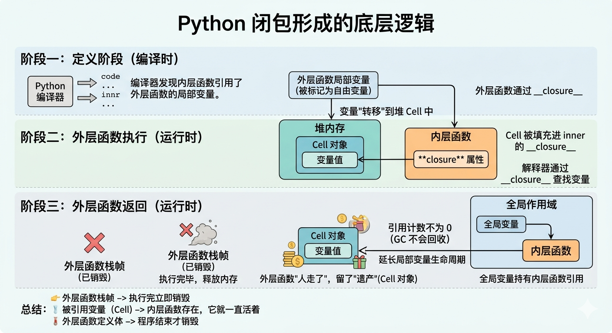

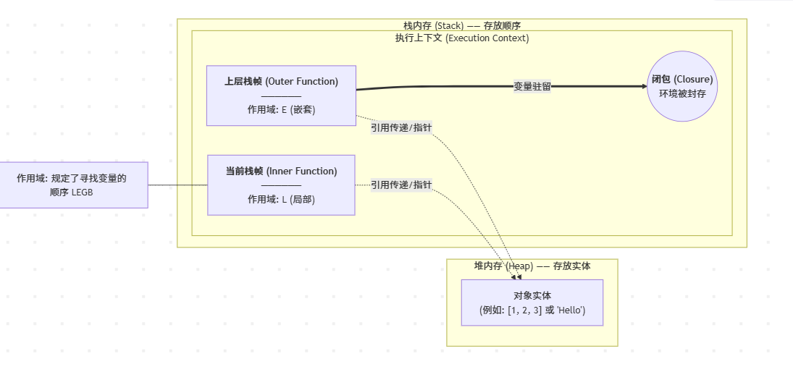

###### 总结

- **外层函数的调用现场（栈帧）**：执行完立刻销毁，释放内存
- **被引用的局部变量（Cell）**：只要内层函数还在，它就一直活着
- **外层函数本身（定义体）**：一直存在于内存中，直到程序结束

可以理解为：**外层函数“人”走了，但它给内层函数“留了遗产”（Cell 对象）。**

#### 闭包的延迟绑定

核心定义：在 Python 中，闭包（包括 Lambda 函数）中的变量是在**运行时（执行时）**查找的，而不是在**定义时**。

##### Python 没有块级作用域

在许多其他编程语言中，`if` 语句、`for` 循环或 `while` 循环的大括号 `{}` 会创建一个独立的作用域。但在 Python 中，**这些结构不会引入新的作用域**。

这意味着，在 Python 中，**`if`、`for`、`while` 这些代码块中定义的变量，在外部仍可以访问到**。

```python
# Python 没有块级作用域
for i in range(10):
    print(i)

print(i)  # 输出：9， i 在 for 循环外仍然有效


if True:
    x = 10
print(x)  # 输出：10， x 在 if 语句外仍然有效


while True:
    y = 20
    break
print(y)  # 输出：20， y 在 while 语句外仍然有效
```

##### for 循环的闭包现象

跟早期的 JavaScript `for` 循环一样，由于没有块级作用域，所以**当在 `for`循环内部使用 `lamdba` 表达式 或 闭包**时，**外部得到的结果会全是循环后的最终结果**。

```python
arr = []

for i in range(10):
    arr.append(lambda: i)

print(i)

for item in arr:
    print(item())
    # 预期输出 0 1 2 3 4 5 6 7 8
    # 结果输出 9 9 9 9 9 9 9 9 9
```

输出结果：**所有的 lambda 函数都指向同一个变量 `i`（全局或函数作用域），而当循环结束时，`i` 的最终值是 `9`。

> 核心原因：
> 闭包的**延迟绑定**机制：**闭包中引用的外部变量是在函数被调用时**才去寻找它的值，而不是在**函数定义时**就固定下来的。
> 
>
> > [!NOTE]
> >
> > ```python
> > def create_multipliers():
> >     return [lambda x: i * x for i in range(4)]
> > 
> > multipliers = create_multipliers()
> > print([m(2) for m in multipliers]) # 输出：[6, 6, 6, 6]
> > ```
> >
> > **定义阶段**：当 `create_multipliers` 运行时，它创建了 4 个匿名函数（lambda）。这些函数内部引用了变量 `i`。注意，此时 Python 并不会把 `i` 当时的值（0, 1, 2, 3）存入函数里。
> >
> > **循环结束**：当循环结束时，变量 `i` 的最终值是 `3`。
> >
> > **调用阶段**：当你执行 `m(2)` 时，lambda 函数开始寻找 `i` 的值。由于它在自己的局部作用域没找到 `i`，它会去外部作用域找。此时外部作用域的 `i` 已经是 `3` 了。
> >
> > **计算结果**：4 个函数都使用了 `i = 3`，所以结果全是 $3 \times 2 = 6$。

解决方案：

```python
arr = []
for i in range(10):
    # 将当前的 i 赋值给一个只在 lambda 内部有效的局部变量 n
    arr.append(lambda n=i: n)

for item in arr:
    print(item())  # 输出: 0 1 2 3 4 5 6 7 8 9
```

##### 使用建议

1. **不要依赖块内变量：** 虽然 Python 允许在 `if` 或 `for` 之后访问变量，但这通常被视为坏习惯
2. **显式初始化：** 如果变量逻辑比较复杂，建议在进入循环或判断之前先给变量赋个初始值（如 `x = None`）
3. **利用函数：** 如果需要严格的作用域隔离，需要将代码封装进**函数**中。函数是 Python 划定 `Local` 局部作用域的真正边界

##### 列表推导式的优化

虽然 Python 坚持不引入块级作用域，但它在某些特定场景下做了优化。例如在 **Python 3** 中：

- **列表推导式（List Comprehensions）** 拥有了自己的作用域

```python
# Python 2 中，x 会污染外部环境
# Python 3 中，x 只在推导式内部有效
[x for x in range(5)]
# print(x)  <-- 这里会报错 NameError: name 'x' is not defined.，这就是一种局部的“块作用域”
```

### 内存管理与垃圾回收机制

在 Python 中，无论是整数、字符串还是函数，底层都是一个 C 结构体。

- **PyObject**：这是所有 Python 对象的“祖先”。每一个对象在内存中至少包含两个核心字段：
  1. **引用计数 (`ob_refcnt`)**：用于垃圾回收。
  2. **类型指针 (`ob_type`)**：指向描述该对象类型的另一个对象。
- **定长与变长**：简单对象（如整数）使用 `PyObject`，而像列表、字符串这种长度可变的对象使用 `PyVarObject`。

> 注：由于整数也是对象，Python 的小整数（-5 到 256）在解释器启动时就已被预先创建并缓存【小整数池】。

## 装饰器

装饰器是 Python 中一种强大的**函数/类修改工具**，本质上是**一个接受函数作为参数并返回新函数的可调用对象**。

核心定义：**在不改变函数/类原有功能的情况下，为其扩展一些额外的功能**。它基于**闭包**和**函数是一等公民**的特性。

装饰器根据目标对象不同，分为 **函数装饰器**  和 **类装饰器** 两种：

### 函数装饰器

核心价值：**在不修改原有函数代码的基础上**，给函数 **“包装” 一些额外的功能**。

核心本质：函数装饰器本质上就是通过**函数嵌套闭包的形式**实现。

基本逻辑：**装饰器本身是一个函数，它的形参是接收一个外部的函数，最终返回一个内层闭包函数给外部使用**。

#### 具体实现

1. 定义一个**装饰器嵌套函数（中介）**，该装饰器嵌套函数的**函数参数是接收一个原有函数（毛坯房）**

2. **装饰器外层函数内定义一个内层闭包函数（装修队）**

3. 内层闭包函数内（装修队开始工作）：

   1. 由于**它是外部真实使用的函数**，所以为了**扩展不同的原有函数功能，保证参数的兼容性**，需要**使用 `*args` 和 `**kwargs` 打包接收传入的原有函数参数**
   2. 将打包接收到的原有函数参数**再次解包传入给原有函数**，**调用并执行原有函数，`return` 返回原有函数的值**，完成原有函数的基础功能
   3. 同时**内层函数内编写一些扩展的自定义逻辑**，表示**为原有函数扩展的功能**

4. 最终**装饰器外层函数将内层函数返回给外部的变量接收，同时让外部传入原有函数**（交付精装房）

   这样就完成了一个基础版本的函数装饰器

#### 基本语法结构

核心逻辑：借助**闭包**的特性**保持原函数特性并扩展它的功能**；通过**外层函数作为中间层媒介接收原有函数**，并**返回已扩展好自定义逻辑的内层函数给外部变量接收**，该外部变量就是**一个装饰器包装后的函数（即包装后的内层函数）**；

```python
# 函数装饰器
def <外层函数>(func): # func: 接收到一个原有函数
    
    def <内层函数>(*args, **kwargs):
        # 自定义扩展逻辑
        return func(*args, **kwargs) # 保持原有函数的基础能力
    
    return <内层函数> # 返回内层函数的引用给外部变量接收


# 外部使用
def <原有函数>: pass

<包装后的原有函数> = <外层函数>(<原有函数>)

# 内部执行逻辑: <外层函数>(<原有函数>) => 返回 <内层函数> 引用 => <内层函数>(<原有函数参数>) 执行内层函数逻辑
```

##### 示例

```python
# 函数装饰器
def outer(func): # func: 接收到一个原有函数
    
    def inner(*args, **kwargs): # 接收外部传入的原有函数的参数并打包
        
        print('这是函数装饰器扩展的逻辑') # inner 内层函数扩展的自定义逻辑
        
        return func(*args, **kwargs) 
    	# inner 内层函数调用执行原有函数、并将打包接收到的原有函数参数再次解包传递给原有函数，完成基础的功能
        
    return inner # 外部真实用到的函数，该 inner 内层函数内部已经完成了原有函数基本的功能，并添加了一些自定义逻辑


# 要被装饰的函数
def add(x, y):
    return x + y


# 使用函数装饰器包装一个函数
add_pro = outer(add) # add_pro: 就是一个 inner 内层函数
res = add_pro(1, 2) # 相当于执行 outer.inner(*args, **kwargs)
print(res)
```

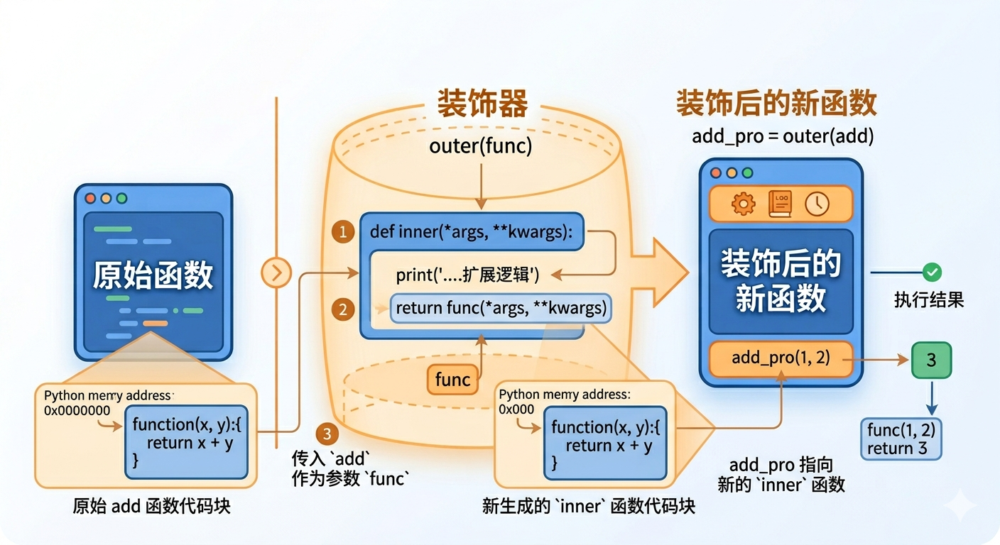

形象比喻：

| **角色**   | **术语**           | **职责**                                                     |
| ---------- | ------------------ | ------------------------------------------------------------ |
| **毛坯房** | `add` (原函数)     | 核心业务逻辑，但功能单一。                                   |
| **中介**   | `outer` (外层函数) | 负责接单，把“毛坯房”传给“装修队”。                           |
| **装修队** | `inner` (内层闭包) | **关键所在**。利用 `*args` 接收住户需求，在执行原逻辑前后增加“软装”。 |
| **精装房** | `add_pro`          | 最终交付给用户使用的成品，名字没变，但功能增强了。           |

#### `@` 语法糖

为了体现装饰器语法的特性，简化代码编写，Python **为装饰器函数**提供了**`@` 语法糖**。

核心定义：**`@` 语法糖一定要紧贴被装饰原有函数名的上一行**。

##### 基本语法

```python
def <装饰器函数>(<外部传入的原有函数>):
    def <内层函数>(*args, **args):
        # 自定义扩展逻辑
        return <外部传入的原有函数>(*args, **args)

@<装饰器函数>
def <被装饰的原有函数>(): pass

<被装饰的原有函数>() # 直接使用原有函数名即可

# @<装饰器函数> 等价于 <包装后的函数> = <装饰器函数>(<被装饰的原有函数>)
```

核心价值：`@` 语法糖本质上是**省去了 `<包装后的函数> = <装饰器函数>(<被装饰的原有函数>)` 这一手动赋值步骤**，它内部会自动执行这一步包装。

内部逻辑：当 Python 检测到 `@` 语法糖之后，内部会去**自动执行 `<装饰器函数>`并将 `<装饰器函数>` 返回的`<内层函数>`引用赋值给 `<被装饰的原有函数>` 变量**，**使得原有函数变成了包装后的函数**，之后**照常使用原有函数名**即可，只不过功能扩展了，**不需要额外定义一个变量接收**。

###### 示例

- 没有 `@` 语法糖的写法：

  ```python
  def decorator(func):
      def wrapper(*args, **kwargs):
          print("扩展功能")
          return func(*args, **kwargs)
      return wrapper
  
  def say_hello(name):
      print(f"Hello, {name}")
  
  # 手动包装：需要定义新变量接收
  say_hello = decorator(say_hello)  # 原有函数名被重新赋值
  
  say_hello("Alice")
  ```

- 使用 `@` 语法糖的写法：

  ```python
  def decorator(func):
      def wrapper(*args, **kwargs):
          print("扩展功能")
          return func(*args, **kwargs)
      return wrapper
  
  @decorator  # 自动完成 say_hello = decorator(say_hello)
  def say_hello(name):
      print(f"Hello, {name}")
  
  say_hello("Alice")  # 直接使用原函数名即可
  ```

##### 核心特性

###### 执行时机

装饰器函数的执行时机是**在 `@` 语法糖定义时就立即执行**了的，即**装饰器外层函数的内容优先执行**；

为什么：因为 Python **会先执行装饰器函数，并将它的内层函数返回给外部的原有函数引用接收**。

```python
def decorator(func):
    print('decorator 装饰器外层函数逻辑')

    def wrapper(*args, **kwargs):
        print("扩展功能")
        return func(*args, **kwargs)
    return wrapper


@decorator  # 自动完成 say_hello = decorator(say_hello)
def say_hello(name):
    print(f"Hello, {name}")


say_hello("Alice")  # 直接使用原函数名即可

'''
输出结果：
decorator 装饰器外层函数逻辑
扩展功能
Hello, Alice
'''
```

###### 函数名重绑定

由于 `@` 语法糖是**将装饰器内层函数的引用返回并赋值给外部的原有函数**，所以**原有函数的引用被覆盖**了，此时**它的 `__name__` 属性也随之指向的是装饰器的内层函数**。

```python
def decorator(func):
    print('decorator 装饰器外层函数逻辑')

    def wrapper(*args, **kwargs):
        print("扩展功能")
        return func(*args, **kwargs)
    return wrapper


@decorator  # 自动完成 say_hello = decorator(say_hello)
def say_hello(name):
    print(f"Hello, {name}")


say_hello("Alice")  # 直接使用原函数名即可
print(say_hello.__name__)  # wrapper，不再是 say_hello，因为被装饰器包装了
```

#### 带参数的装饰器

装饰器**最基本的结构是两层嵌套函数：一个外层函数包裹一个内层函数，返回内层函数用于外部传入原有函数并接收**。

##### 具体实现逻辑

而若想要**让装饰器带上自定义的参数**，实现更多扩展的功能，其核心本质上就是涉及到**三层及以上函数嵌套的实现**：

- **最外层函数**：负责**接收自定义参数**，并**返回中间层函数**
- **中间层函数**：负责**接收原有函数**，并**返回嵌套内层函数**（相当于基础结构的内层函数）
- **嵌套内层函数**：负责**接收原有函数参数**，并**自定义扩展逻辑**

最终，**最外层函数返回中间层函数引用给外部变量引用，外部变量通过 `()()` 双重调用执行的形式依次传入自定义参数、原有函数，最终得到中间层函数返回的嵌套内层函数引用**，此时，**外部变量 == 嵌套内层函数引用**。

简单来说：就是**在原有装饰器的基础之上加了一层可以接受自定义参数的最外层函数，原先的外层函数变成了内层函数返回**。

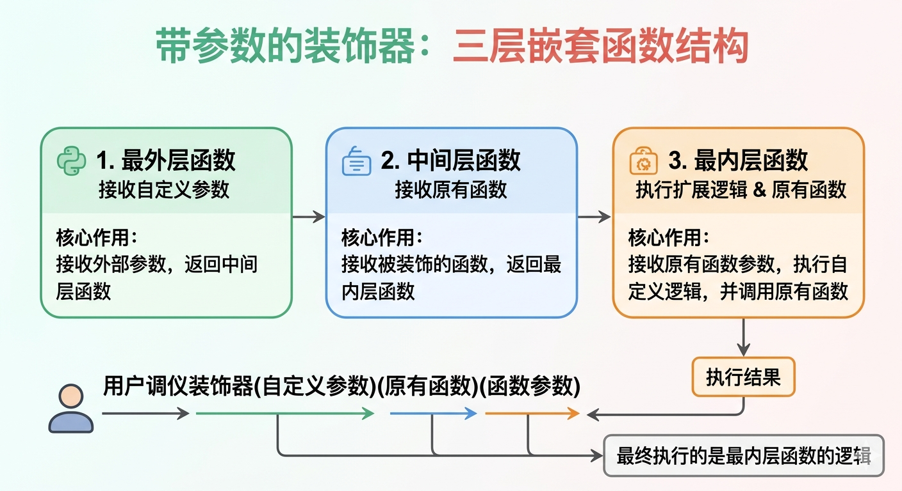

###### 基本语法

```python
# 带参数的装饰器
def <最外层函数>(params): # 第一层：接收参数
    
    def <中间件函数>(func): # 第二层：接收原有函数
        
        def <嵌套内层函数>(*args, **kwargs): # 第三层：接收原有函数参数、执行包装逻辑
            
            return func(*args, **kwargs)
        
        return <嵌套内层函数>
    
    return <中间件函数>


# 外部使用
def <原有函数>(): pass

<包装后的原有函数> = <最外层函数>(<自定义参数>)(<原有函数>)

<包装后的原有函数>() # 直接使用原有函数名即可
```

- 执行链条：

  **1. 配置阶段**（传参） → **2. 绑定阶段**（包装） → **3. 执行阶段**（调用）

  ```
  [ 调用 ]                          [ 返回/指向 ]
     |                                 |
     +-- @装饰器(自定义参数) ------------> 返回：中间层函数 (闭包)
     |      (确定装饰器的配置)                  |
     |                                        |
     +-- 中间层(原有函数) ---------------> 返回：嵌套内层函数 (代理)
     |      (完成对原函数的包装)                |
     |                                        |
     +-- 内层函数(*args, **kwargs) ------> 执行：最终业务逻辑
            (实际运行时的入口)
  ```

###### 示例

```python
# 带参数的装饰器
def decorator(params): # 第一层：接收参数
    print('decorator 装饰器最外层函数逻辑')

    def outer(func): # 第二层：接收函数
        print('decorator 装饰器中间件函数逻辑')

        def wrapper(*args, **kwargs): # 第三层：执行包装
            # 扩展功能
            print('传入给装饰器内部的自定义参数：', params)
            return func(*args, **kwargs)
        return wrapper
    return outer


def subtract(a, b):
    return a - b


# 内部执行逻辑：decorator() =>  outer 函数引用  => outer() => wrapper 内层函数引用 => wrapper() 执行嵌套内层函数逻辑
subtract = decorator('我是装饰器参数')(subtract)
print(subtract.__name__)  # wrapper
res = subtract(2, 1)
print(res)
'''
输出结果：
decorator 装饰器最外层函数逻辑
decorator 装饰器中间件函数逻辑
传入给装饰器内部的自定义参数： 我是装饰器参数
1
'''
```

##### 带参数的`@` 语法糖

带参数的 `@` 语法糖核心本质与基础 `@` 语法糖是一样的，

###### 基本语法

```python
# 带参数的装饰器
def <最外层函数>(params): # 第一层：接收参数
    
    def <中间件函数>(func): # 第二层：接收原有函数
        
        def <嵌套内层函数>(*args, **kwargs): # 第三层：接收原有函数参数、执行包装逻辑
            
            return func(*args, **kwargs)
        
        return <嵌套内层函数>
    
    return <中间件函数>


# 外部使用
@<最外层函数>(<自定义参数>)
def <被装饰的原有函数>(): pass

<被装饰的原有函数>() # 直接使用原有函数名即可

# @<装饰器函数> 等价于 <包装后的原有函数> = <最外层函数>(<自定义参数>)(<原有函数>)
```

核心价值：`@()` 语法糖本质上是**省去了 `<包装后的原有函数> = <最外层函数>(<自定义参数>)(<原有函数>)` 这一手动赋值步骤**，它内部会自动执行这一步包装。

内部逻辑：当 Python 检测到 `@` 语法糖之后，内部会去**自动执行 `<装饰器函数>`并将 `<装饰器函数>` 返回的`<最外层函数>`引用再次通过 `<最外层函数>(<自定义参数>)` 执行，返回 `<中间层函数>` 引用，再次执行 `<中间层>`函数，将返回的 `<嵌套内层函数>` 引用赋值给 `<被装饰的原有函数>` 变量**，**使得原有函数变成了包装后的函数**，之后**照常使用原有函数名**即可，只不过功能扩展了，**不需要额外定义一个变量接收**。

###### 示例

- 没有 `@` 语法糖的写法：

  ```python
  # 带参数的装饰器
  def decorator(params):
      print('decorator 装饰器最外层函数逻辑')
  
      def outer(func):
          print('decorator 装饰器中间件函数逻辑')
  
          def wrapper(*args, **kwargs):
              # 扩展功能
              print('传入给装饰器内部的自定义参数：', params)
              return func(*args, **kwargs)
          return wrapper
      return outer
  
  
  def subtract(a, b):
      return a - b
  
  
  # 手动包装：需要定义新变量接收
  subtract = decorator('我是装饰器参数')(subtract) # 原有函数名被重新赋值
  res = subtract(2, 1)
  print(subtract.__name__)  # wrapper
  ```

- 使用 `@` 语法糖的写法：

  ```python
  # 带参数的装饰器
  def decorator(params):
      print('decorator 装饰器最外层函数逻辑')
  
      def outer(func):
          print('decorator 装饰器中间件函数逻辑')
  
          def wrapper(*args, **kwargs):
              # 扩展功能
              print('传入给装饰器内部的自定义参数：', params)
              return func(*args, **kwargs)
          return wrapper
      return outer
  
  @decorator('我是装饰器函数') # 自动完成 subtract = decorator('我是装饰器参数')(subtract)
  def subtract(a, b):
      return a - b
  
  res = subtract(2, 1)
  print(subtract.__name__)  # wrapper
  ```

##### 装饰器的基本执行顺序

一个装饰器的执行分为 3 部分，依次**由外到内顺**序执行：

1. **最外层函数体：最先执行**
2. **中间层函数体**：之后执行
3. **嵌套内层函数体：之后执行自定义扩展逻辑，在这里调用原有函数的基本能力**
4. **原有函数：最后执行（执行原有函数的基本能力）**

```python
def decorator_a(params):
    print('decorator_a 装饰器--最外层--函数逻辑')

    def outer(func):
        print('decorator_a 装饰器--中间层--函数逻辑')

        def wrapper(*args, **kwargs):
            print('decorator_a 扩展功能')
            return func(*args, **kwargs)
        return wrapper
    return outer


@decorator_a('我是装饰器参数a')
def multiply(a, b):
    print('原有函数逻辑')
    return a * b


res = multiply(2, 1)
print(res)

'''
输出结果：
decorator_a 装饰器--最外层--函数逻辑
decorator_a 装饰器--中间层--函数逻辑
decorator_a 扩展功能
原有函数逻辑
2
'''
```

#### 多个装饰器绑定

Python 支持通过为函数添加多个装饰器以扩展更多的不同功能。

##### 基本语法

```python
# 装饰器不带参数
@<装饰器B>
@<装饰器A>
def <被装饰的函数>(): pass

# 装饰器带参数
@<装饰器B>(<自定义参数>)
@<装饰器A>(<自定义参数>)
def <被装饰的函数>(): pass
```

##### 执行顺序原则

在 Python 中，装饰器本质上是一个**高阶函数**，它接收一个函数作为输入，并返回一个新的函数。多装饰器的原理其实就是**连续的赋值替换**。

当写下多个装饰器时，Python 解释器在加载代码阶段会进行一系列的赋值操作。

多装饰器的执行顺序分两个部分：

- **包装阶段（由上往下、由外向内）**：由**从上往下的装饰器定义顺序**，**依次执行装饰器内的最外层函数**

  ```python
  def decorator_a(params):
      print('decorator_a 装饰器--最外层--函数逻辑')
  
      def outer(func):
  
          def wrapper(*args, **kwargs):
              return func(*args, **kwargs)
          return wrapper
      return outer
  
  
  def decorator_b(params):
      print('decorator_b 装饰器--最外层--函数逻辑')
  
      def outer(func):
  
          def wrapper(*args, **kwargs):
              return func(*args, **kwargs)
          return wrapper
      return outer
  
  
  @decorator_a('我是装饰器参数a') # 先包装 decorator_a
  @decorator_b('我的装饰器参数b') # 再包装 decorator_b
  def multiply(a, b):
      print('原有函数逻辑')
      return a * b
  
  '''
  输出结果：
  decorator_a 装饰器--最外层--函数逻辑
  decorator_b 装饰器--最外层--函数逻辑
  原有函数逻辑
  2
  '''
  ```

- **调用执行阶段（就近原则）** ：**最靠近 `<被装饰的函数>` 的装饰器 `B` 最先执行中间层函数以及内层嵌套函数，其次是装饰器 `A`**。（**由下往上**顺序、**向外传导**）

  ```python
  def decorator_a(params):
      print('decorator_a 装饰器--最外层--函数逻辑')
  
      def outer(func):
          print('decorator_a 装饰器--中间层--函数逻辑')
  
          def wrapper(*args, **kwargs):
              print('decorator_a 扩展功能')
              return func(*args, **kwargs)
          return wrapper
      return outer
  
  
  def decorator_b(params):
      print('decorator_b 装饰器--最外层--函数逻辑')
  
      def outer(func):
          print('decorator_b 装饰器--中间层--函数逻辑')
  
          def wrapper(*args, **kwargs):
              print('decorator_b 扩展功能')
              return func(*args, **kwargs)
          return wrapper
      return outer
  
  
  @decorator_a('我是装饰器参数a')
  @decorator_b('我的装饰器参数b')
  def multiply(a, b):
      print('原有函数逻辑')
      return a * b
  
  
  res = multiply(2, 1)
  print(res)
  
  '''
  输出结果：
  decorator_a 装饰器--最外层--函数逻辑
  decorator_b 装饰器--最外层--函数逻辑
  decorator_b 装饰器--中间层--函数逻辑
  decorator_a 装饰器--中间层--函数逻辑
  decorator_a 扩展功能
  decorator_b 扩展功能
  原有函数逻辑
  2
  '''
  ```

核心结论：**把装饰器看作是一个“函数工厂”**。 **调用时从外向内（向下），“包裹时从内向外（向上）”**

### 类装饰器

Python 支持使用类来定义一个装饰器，类装饰器（Class Decorator）既可以装饰**函数**，也可以装饰**类**。

核心定义：类装饰器本质上就是**一个普通的类**，这个类**必须重写 `__call__` 魔术方法**；

#### \__call__(self, *args, **kwargs) 魔术方法

Python 为每个类都内置了一个 `__call__` 魔术方法，它最常用于**定义一个类装饰器**。

核心作用：**重写了 `__call__` 魔术方法**的类，它**可以让类的实例对象像函数一样被调用**。且**当使用 `<实例对象>()` 的语法**调用实例对象时，**会触发 `__call__` 魔术方法**。

```python
class Person:
    def __init__(self):
        print('Person init')

    def __call__(self, *args, **kwargs):
        print('Person call')


person = Person()
person() # 实例对象像函数一样使用

'''
输出结果：
Person init
Person call
'''
```

#### 定义一个类装饰器

类装饰器的本质上**是一个函数，函数参数接收一个原有函数，返回一个新函数（`__call__` 方法）**。

由于类的构造方法也是一个函数，所以定义一个类装饰器有 2 种写法：

##### \__init__(self) 构造方法定义

具体实现：

1. **在 `__init__` 构造方法中接收外部传入的原有函数，并通过 `self` 存入到类实例对象中** 
2. **在 `__call__` 方法中通过 `self` 类实例对象调用传入的原有函数并返回**，完成原有函数的基本能力

注意点：**类装饰器（实例对象）不能显式写 `()`**，即**类装饰器不能传入自定义参数**，否则报错。

优点：概念结构简单、易懂，不需要写嵌套函数，但只能用于一些简单的功能扩展。

```python
# 类装饰器
class DecoratorClass:

    def __init__(self, func):
        self.func = func

    def __call__(self, *args, **kwargs):
        print('类装饰器的自定义扩展逻辑')
        return self.func(*args, **kwargs)
```

```python
# 装饰函数
@DecoratorClass # 等价于 test = DecoratorClass(test)()
def test():
    print("test")

# 手动实现
# test = DecoratorClass(test)()
test()
'''
输出结果：
类装饰器的自定义扩展逻辑
test
'''

# 装饰类
@DecoratorClass # 等价于 person = DecoratorClass(Person())
class Person:
    def __init__(self):
        print('Person init')

person = Person()

# 手动实现
# person = DecoratorClass(Person)()
'''
输出结果：
类装饰器的自定义扩展逻辑
Person init
'''
```

##### \__call__(self) 魔术方法定义

具体实现：

1. 将**`__call__` 魔术方法**视为一个**装饰器函数**，**函数参数接收一个原有函数**，**方法内定义一个内层函数**，**内层函数中编写自定义扩展逻辑，最后返回内层函数给外部**
2. **自定义参数传给类的 `__init__` 构造方法**，在 `__call__` 方法中**通过 `self` 来引用外部传入的自定义参数**

注意点：**类装饰器（实例对象）必须显式写 `()`**，否则报错；原理是**手动触发 `__call__` 方法（像函数一样调用类实例对象）并自动传入原有函数**。

优点：

- 可以传入自定义参数，功能扩展性高

###### 示例

- 没有自定义参数：

  ```python
  # 类装饰器
  class DecoratorClass:
  
      def __call__(self, func):
          def wrapper(*args, **kwargs):
              print('类装饰器的自定义扩展逻辑')
              return func(*args, **kwargs)
          return wrapper
  
  
  # 装饰函数
  @DecoratorClass() # 等价于 test = DecoratorClass(test)()
  def test2():
      print("test")
  
  # 手动实现
  # test = DecoratorClass(test)()
  test2()
  '''
  输出结果：
  类装饰器的自定义扩展逻辑
  test
  '''
  
  
  # 装饰类
  @DecoratorClass()
  class Person:
      def __init__(self):
          print('Person init')
  
  # 手动实现
  # person = DecoratorClass(Person)()
  
  person = Person()
  '''
  输出结果：
  类装饰器的自定义扩展逻辑
  Person init
  '''
  ```

- 有自定义参数：

  ```python
  # 类装饰器
  class DecoratorClass2:
  
      # 将自定义参数传给构造方法，存入实例对象中
      def __init__(self, msg):
          self.msg = msg
  
      def __call__(self, func):
          def wrapper(*args, **kwargs):
              print('类装饰器的自定义扩展逻辑')
              print(f"外部传给装饰器的自定义参数：{self.msg}")
              # 通过 self 实例对象引用传给装饰器的自定义参数
              return func(*args, **kwargs)
          return wrapper
  
  
  # 装饰函数
  @DecoratorClass2('我是test2 函数') # 等价于 test = DecoratorClass2(test)('我是test2 函数')
  def test2():
      print("test")
  
  
  # 手动实现
  # test = DecoratorClass2(test)('我是test2 函数')
  test2()
  '''
  输出结果：
  类装饰器的自定义扩展逻辑
  外部传给装饰器的自定义参数：我是test2 函数
  test
  '''
  
  
  # 装饰类
  @DecoratorClass2('我是Person2 类') # 等价于 person = DecoratorClass(Person)('我是Person2 类')
  class Person2:
      def __init__(self):
          print('Person init')
  
  # 手动实现
  # person = DecoratorClass(Person)('我是Person2 类')
  person2 = Person2()
  '''
  输出结果：
  类装饰器的自定义扩展逻辑
  外部传给装饰器的自定义参数：我是Person2 类
  Person init
  '''
  ```

#### 多个类装饰器绑定

与函数装饰器使用一致：

```python
class Test1:

    def __call__(self, func):
        def wrapper(*args, **kwargs):
            print('Test1')
            return func(*args, **kwargs)
        return wrapper


class Test2:

    def __call__(self, func):
        def wrapper(*args, **kwargs):
            print('Test2')
            return func(*args, **kwargs)
        return wrapper


@Test1()
@Test2()
def test3():
    print('test3')


test3()
'''
输出结果：
Test1
Test2
test3
'''
```


## 异常处理机制

异常：代码在语法上没问题，但执行过程中出了问题，便可以通过异常处理机制来捕获解决。

核心理念：在程序运行过程中，若遇到问题会向上抛出异常错误，并导致程序崩溃；我们能做的就是**在异常向上冒泡的过程中捕获这些异常，并处理它，不让它导致程序崩溃**。

核心含义：程序在运行时，如果发生了错误，可以事先约定处理错误的方式，保证程序可以继续运行。

### try...except 异常处理语句

Python 提供了 **`try:... except:... else: ... finally: ...`** 的异常处理语句结构来捕获并处理代码可能会发生的异常。

```python
try:
    # 可能会抛出异常的代码语句
except:
    # 用于捕获并处理异常的代码块
else:
    # 没有发生异常时执行的代码块
finally:
    # 无论是否发生异常都一定会执行的代码块
    
# 注意缩进！
```

除了 **`try: ... except: ...` 是固定的基础结构**之外，**`else:...` 和 `finally:...`**都是**可选**的，它们分别对应不同的功能。

#### 基本含义

- **`try` 异常监测代码块**：用于**监测**可能会**抛出异常的代码块**范围
  - **当 `try` 代码块内的代码语句发生异常**，会**中断异常代码当前行后续的代码执行**，并自动**跳转到 `except` 代码块中**处理抛出的异常；
  - 所以在编写代码时，尽量**将可能会发生异常的代码语句** 和 **后续依赖它的代码语句**一起**放在 `try` 代码块中**，以免导致意外
- **`except`异常处理代码块**：用于处理 `try` 代码块中抛出的异常
  - 如果 `try` 代码块中的代码语句**没有抛出异常**，则 **`except` 代码块不会被执行**

注意点：异常处理是一个防止程序崩溃的安全机制，所以**即使在发生异常后，`try .. except` 后续的代码都会继续执行**。

```python
try:
    result = 10 / 0
except:
    print('抛出了异常')

print('try except 之后的代码，我还是能继续执行')

# 程序输出：
# 抛出了异常
# try except 之后的代码，我还是能继续执行
```

#### except 异常处理代码块

在 Python 中，**所有异常的基类**是 **`BaseException` 类**，开发中**常见的异常类都是继承自 `Exception` 类**。

> Python 所内置的异常列表：https://docs.python.org/zh-cn/3.14/library/exceptions.html

描述：`except` 代码块专门用于捕获 `try`代码块中抛出的异常并进行处理。

核心特性：**`except:` 默认匹配异常的顶层基类 `BaseException`** ，即**所有异常都会被捕获到**。

```python
try:
    result = 10 / 0
except: # 等价于 except BaseException:
    print('抛出了异常')
```

弊端：这种默认写法，虽然有效，但是对于具体异常的处理不清晰，**无法针对某个异常类型进行特别处理**，所以通常都是采用**多 `except` 的写法，用来匹配不同的异常类型并针对处理**，以此建立强壮、可扩展的代码。

##### 多 except 匹配

描述：可以写**多个`except` 代码块**，让**每个 `except` 代码块匹配不同的异常类型进行针对处理**。

核心价值：**不同异常不同处理**，使得代码处理机制更易扩展，结构更清晰，程序更强壮。

```python
try:
    # 可能会抛出异常的代码语句
except <异常类型1>:
    # 用于捕获 异常类型1 的处理代码块
except <异常类型2>:
    # 用于捕获 异常类型2 的处理代码块
except <异常类型3>:
    # 用于捕获 异常类型3 的处理代码块
```

###### 顺序匹配机制

核心原则：当编写多 `except` 代码块时，会按照**由上往下**的定义顺序**依次匹配异常类型**，且**匹配成功后不会再继续往下匹配**；

异常类继承关系的影响：

​	在 Python 中，异常也是类，所以**它们之间具备继承的层级关系**，根据继承关系的匹配范围是**顶层包容下层**；（**向上兼容**）

​	在异常类型匹配过程中，一旦遇到**与当前抛出的异常的相同异常类型**或者是**它的父类**（老师拎着学生找家长），则表示**匹配成功**，会直接**进入当前 `except` 代码块中处理该异常**（找到家长进去谈话），且**不会再继续往下匹配**。

> - 匹配逻辑：深度优先与顺序至上
>
> 当 `try` 块中抛出异常时，Python 会进行以下操作：
>
> 1. **取出异常标签**：比如 `ZeroDivisionError`
> 2. **线性扫描**：从第一个 `except` 开始往下看
> 3. **类型检查**：执行类似 `isinstance(当前异常, except定义的类型)` 的判断
>    - 如果是 `True`（相同或者是其父类），执行代码块，结束查找
>    - 如果是 `False`，跳到下一个 `except`
>
> 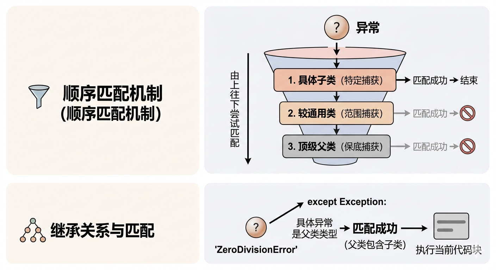

​	所以，在多 `except` 代码块中，**从上往下的顺序**尽量是**具体异常子类 > 通用异常父类（先特殊，后一般）**；保证具体异常类型被捕获到，一旦**捕获不到**则**交由顶层异常父类去处理**。

> - **具体子类**（如 `ZeroDivisionError`）：范围小，针对性强
> - **通用父类**（如 `ArithmeticError`）：范围大，包含多个子类
> - **顶级父类**（如 `Exception`）：范围最大，几乎“通杀”所有常规异常

```python
# 错误示例：父类在前（“拦截器”陷阱）
try:
    res = 1 / 0
except Exception:  # 顶级父类在最前面
    print("触发了通用异常拦截") # 逻辑会永远卡在这里
except ZeroDivisionError:
    print("触发了除零异常")    # 这行代码永远成了“死代码”
    
# 正确示例：由细到粗（从小到大）
try:
    # 假设这里可能发生多种错误
    res = 1 / 0
except ZeroDivisionError: 
    print("精确捕获：处理除以零的情况")
except ArithmeticError:
    print("中级捕获：处理其他算术错误")
except Exception:
    print("终极保底：处理所有未预见的异常")
```

##### 接收异常信息

在 Python 的异常处理机制中，支持通过 **`except <具体异常> as <异常实例对象>`**的语法来**接收当前抛出的异常实例对象**，并**在 `except` 异常处理代码块中针对 `e` 这个异常实例对象处理**。

###### <异常类> as e 基本语法

```python
try:
    result = 10 / 0

except IndexError as e:
    print('数组索引不存在', e)
    print(type(e)) # <class 'IndexError'>
except ValueError as e:
    print('赋值错误', e)
    print(type(e)) # <class 'ValueError'>
except ZeroDivisionError as e:
    print('除数为零时触发的内置异常。', e)
    print(type(e)) # <class 'ZeroDivisionError'>
except Exception as e:
    print('其他异常', e)
```

参数说明：

- **`<具体异常类>`**：针对匹配的**具体异常类**
  - 它是**惰性计算**的，只有**在后面写 `as` 关键字**的时候才会**实时创建异常实例对象**，并**给它取个别名 `e` 用于外部使用**
- **`as`关键字**：给**当前异常类的实例对象取个别名**。通常为 `e` ，也可以是别的名称
- **`e` 实例**：具体**异常类的实例对象**。它是类型是当前异常类，如 `<class 'ZeroDivisionError'>`。

###### 异常信息

由具体异常类创建的异常实例对象 `e` 通常包含如下信息：

```python
try:
    result = 10 / 0

except ZeroDivisionError as e:
    print('除数为零时触发的内置异常。', e)

    # 异常的错误信息
    print(e)  # division by zero
    
    # 异常类型
    print(type(e))  # <class 'ZeroDivisionError'>
    
    # 异常参数
    print(e.args)  # ('division by zero',)
    
    # 异常的栈追踪信息
    print('__traceback__', e.__traceback__)
    
    # 异常发生的具体文件名
    # C:\Users\win\Desktop\Test\Python\first_demo\exception_handing.py
    print('__traceback__', e.__traceback__.tb_frame.f_code.co_filename)
    
    # 异常的具体代码
    # b'\x80\x00\x....
    print('__traceback__', e.__traceback__.tb_frame.f_code.co_code)
    
    # 发生异常的具体代码行数
    print('__traceback__', e.__traceback__.tb_lineno)  # 23

```

###### trackback 模块 回溯异常

Python 提供了 **`trackback` **模块，该模块用来**记录当前程序的执行栈帧**。

可以通过 `trackback()` 模块的 **`format_exc()` **方法来**回溯格式化后的异常信息**：

```python
import traceback

try:
    result = 10 / 0
    
except ZeroDivisionError as e:
    print('除数为零时触发的内置异常。', e)
    
    # 回溯异常信息
    print(traceback.format_exc())
    # Traceback (most recent call last):
    # File "C:\Users\win\Desktop\Test\Python\first_demo\exception_handing.py", line 23, in <module>
    #    result = 10 / 0
    #          ~~~^~~
    # ZeroDivisionError: division by zero
```

##### 合并处理异常

由于多 `except` 写法有时候可能过于复杂，Python 又提供了**通过一个 `except` 就能合并处理多个异常**的语法结构。

核心价值：**一个 `except` 代码块统一处理多个不同异常类型**，实现简洁代码结构。

###### except (<异常类>,...) as e

```python
try:
    list = [1, 2, 3]
    print(list[4])
except (IndexError, NameError, Exception) as e: # e 会实时根据抛出的异常类进行实例构建
    if isinstance(e, IndexError):
        print('数组索引不存在', e)
    elif isinstance(e, NameError):
        print('变量名不存在', e)
    else:
        print('其他异常', e)
```

作用：当 `try` 代码块抛出异常时，Python 解释器会**在 `except ()` 语句中**按照**从左往右**的顺序**依次对定义的异常类进行匹配**；所以在 `except ()` 语句中**异常类的定义顺序**尽量是 **（具体异常子类 < 顶层异常类）**。

#### else 无事发生代码块

作用：**当 `try` 代码块正常运行，没有抛出任何异常**时，**会进入 `else` 代码块**执行。

```python
try:
    print('hello world')
except (Exception) as e:
    print('其他异常', e)
else:
    print('没有异常发生')
```

#### finally 资源释放代码块

作用：**无论 `try` 代码块是否抛出异常，都一定会进入 `finally` 代码块中**执行。

> 通常用于数据库连接、网络连接的**资源释放安全处理**。

```python
try:
    print('hello world')
except (Exception) as e:
    print('其他异常', e)
finally:
    print('我一定会执行')
```

##### 作用域限制

```python
def create_file_write():
    try:
        f = open('./《静夜思》.txt', 'x', encoding='utf-8')
        f.write('床前明月光，疑是地上霜。\n')
        f.write('举头望明月，低头思故乡。')
        print(f.readable())  # False
        print(f.writable())  # True
    except FileExistsError as e:
        print(e)  # File exists 文件已存在
    finally:
        f.close()
```

以上代码的 `f.close()` 会报错，是因为当 `open()` 打开的文件不存在而抛出异常时，`f` 变量不会被成功赋值；Python 此时就已经跳到了 `except` 代码块中运行处理异常，之后再跳到 `finally` 中时，`f` 变量并没有被创建，所以会报错。

这源于 **`try-except-finally` 之间的作用域是不共享的**。

###### 解决方案

```python
def create_file_write():
    f = None
    try:
        f = open('./《静夜思》.txt', 'x', encoding='utf-8')
        f.write('床前明月光，疑是地上霜。\n')
        f.write('举头望明月，低头思故乡。')
        print(f.readable())  # False
        print(f.writable())  # True
    except FileExistsError as e:
        print(e)  # File exists 文件已存在
    finally:
        if f is not None:
            f.close()
```

在 `try-except-finally` 的顶层创建一个都可以访问到的 `f` 变量，并预设 `None` 初始化值。

### raise 手动抛出异常

Python 提供了一个 `raise` 关键字，作用是**人为地制造一个错误**。*类似于 Java 的 throw 关键字*

开发者可以**根据逻辑需要**，在**代码的任何地方中断执行并抛出一个指定的异常**。

#### 基本语法

```python
raise <异常类>(<异常信息>)
```

作用：在**当前行手动抛出一个内置异常类 / 自定义异常类**，并**中断后续代码的执行**。

特性：**可以被 `try...except` 异常处理语句捕获**，如果**未被捕获**，则一直**向上抛到顶层，直到程序崩溃**。

```python
raise ValueError('我手动抛出一个异常')

'''
Traceback (most recent call last):
  File "C:\Users\win\Desktop\Test\Python\first_demo\exception_handing.py", line 81, in <module>
    raise ValueError('我手动抛出一个异常')
ValueError: 我手动抛出一个异常
'''
```

#### 与 try...except 语句结合

##### 两者的区别

- **`try...except` 语句**：在代码执行过程中，由 **Python 解释器自己**内部去**自动判断并抛出异常**的异常处理机制
- **`raise` 关键字**：**开发者自行判断**，并**手动抛出异常**的语句

##### 异常冒泡机制

Python 有一个隐式的**异常冒泡机制**：

​	即**当程序某一处发生异常**时，异常对象会**沿着调用栈（Call Stack）的结构向上冒泡**抛给执行上下文中**调用栈的上层**，在这个冒泡过程中**可以被 `try...except` 语句捕获并处理异常，中断冒泡**，从而保证程序稳定运行；如果**一直未被捕获**，则**继续向上冒泡，直到程序崩溃**。

> 当异常发生时，它会沿着调用栈（Call Stack）反向寻找“救火队员”（`try...except`）
>
> - **发生点**：异常在函数的最深处诞生
> - **寻找捕获器**：Python 查看当前函数是否有 `try...except`
> - **逐级上传**：如果当前函数没处理，它会立即结束当前函数，回到**调用它的那一层**，并在那里重新抛出
> - **最终结局**：如果异常一直传到模块顶层（`main`）还没被接住，Python 解释器就会强制停止程序，并打印出 **Traceback**（回溯信息）
>
> 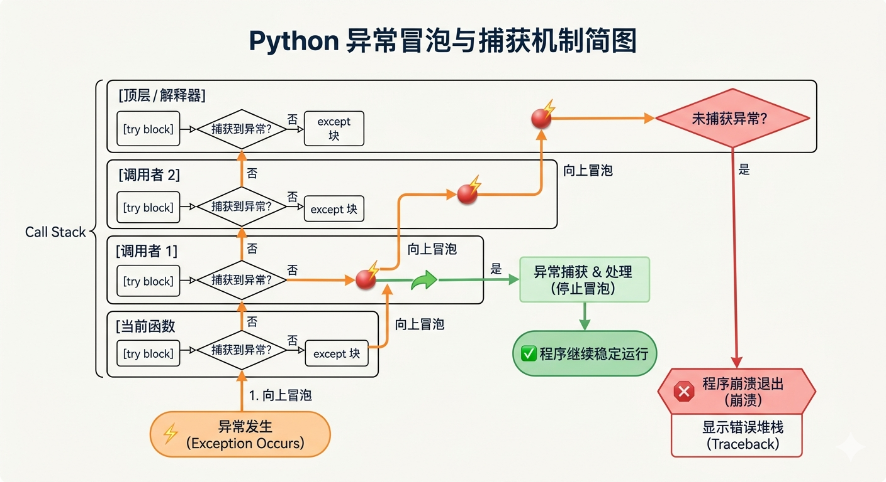

###### 冒泡 vs `raise`

- **`raise`** 是**发射**信号
- **冒泡** 是信号**传递**的过程
- **`except`** 是信号的**接收站**

##### except 捕获

**`raise` 关键字抛出的任何异常**都**可以被 `try...except` 语句捕获**到，**前提是 `raise` 语句在 `try` 代码块中**，否则无法精确捕获。

```python
try:
    raise ValueError('我手动抛出一个异常')
except ValueError as e:
    print('ValueError', e)  # ValueError 我手动抛出一个异常
```

##### raise 不加参数原样抛出

`raise`关键字的本质是 **抛** 这个动作；

核心概念：当 `raise` **在 `except` 代码块中使用**时，可以**不加任何参数**，将当前 `except` 代码块捕获到的异常**继续向上抛出**。

关键点：在 `except` 块中单独使用 `raise`，会**保留原始的堆栈追踪（Traceback）**。这意味着即便在最外层捕获它，也依然能看到这个异常最初的信息。

> 如果说普通的 `raise Exception` 是“无中生有”**（创造一个新麻烦）**，那么在 `except` 块里不加参数的 `raise` 就是**“原封不动地转发麻烦”**

表示为：我不在你这里处理，我要告到上面去，让上面来帮我处理！

```python
# 嵌套函数，深层函数中抛出异常
def outer():  # 外层函数

    def middle():  # 中层函数

        def inner():  # 内层函数
            raise ValueError('inner 函数抛出的异常')

        try:
            inner()
        except ValueError:
            raise  # 继续向上抛出给 middle 中层函数

    try:
        middle()
    except ValueError:
        raise  # 继续向上抛出给 __main__ 全局模块


# __main__ 全局模块捕获异常
try:
    outer()
except Exception as e:
    print('ValueError', e)   # ValueError inner 函数抛出的异常
```


### 自定义异常类

在中大型项目中，有时候 Python 的内置类不太够用，Python 支持开发者自定义一个异常类来补全更具业务意义的异常。

核心原则：定义的**异常类名通常以 `Error` 结尾**，必须**继承 `Exception` 或它的子类**。

```python
# 自定义异常类
class UserNameError(Exception):
    def __init__(self, msg):
        # 要想添加自定义信息，必须调用父类的构造方法，避免覆盖父类的行为
        super().__init__(f"--> [用户名错误]：{msg}")


try:
    username = input('请输入用户名：')
    if not username:
        raise UserNameError('用户名不能为空')  # 手动抛出异常
    elif len(username) < 2:
        raise UserNameError('用户名长度不能小于2')
except UserNameError as e:
    print(e)
```

## 模块化

### 基本概念

在 Python 开发中，**模块 (Module)** 是组织函数、类和变量的基本单位。简单来说，**一个以 `.py` 结尾的文件就是一个模块**。通过使用模块，可以将长代码拆分成多个文件，提高代码的可维护性和重用性。

核心价值：

- **代码复用**：写一次代码，在多个项目中调用

- **命名空间**：不同模块中可以有同名的变量或函数，互不冲突

- **逻辑拆分**：将复杂的系统按功能拆解（例如：处理数据的放一个模块，绘图的放一个模块）

#### 模块的分类

Python 的模块生态非常丰富，主要分为三类：

1. **内置模块 (Standard Library)**：随 Python 安装包自带，直接 `import` 引入即可使用
   - 例如：`os` (文件操作)， `sys` (系统相关)， `json` (数据格式)， `random` (随机数)
2. **第三方模块**：由社区开发，需要先通过 `pip` 安装，再通过 `import` 引入使用
   - 例如：`requests` (网络请求)， `pandas` (数据分析)， `numpy` (科学计算)
3. **自定义模块**：自己在本地项目中编写的 `.py` 文件

### 定义一个模块

命名规范：自定义的模块名**必须与 Python 内置模块、第三方模块名称区分**开，否则 Python 会**优先引用自定义模块**。

```python
# mymodule.py
"""
模块用途说明

使用示例：
    import mymodule
    mymodule.do_something()
"""

# 变量
version = "1.0"
author = "张三"

# 函数
def greet(name):
    return f"Hello, {name}!"

def add(a, b):
    return a + b

# 类
class Calculator:
    def multiply(self, a, b):
        return a * b
    
    def divide(self, a, b):
        if b != 0:
            return a / b
        return "Error: division by zero"

# 私有变量（约定）
_private_var = "我不应该被直接访问"
```

在其他模块中引入使用：

```python
import my_module  # 引入其他模块，Python 会自动将 my_module 模块中的所有成员都存入 my_module 模块对象的命名空间中

# 使用其他模块的中的成员
author = my_module.author
print(author)  # 张三

result = my_module.add(10, 3)
print(result)  # 13
```

#### 公私成员

在 Python 中，并没有像 Java 或 C++ 那样通过 `public`、`private` 关键字实现的“强制性”私有成员。

Python 遵循的是一种**“成年人之间的约定”**，即**通过命名规范来暗示成员的使用范围**，可以无视使用范围，但不建议。

##### 公有成员（Public）

默认情况下，`.py` 文件被视为一个**模块**，模块内部定义的**公共成员**会**默认被导出**，可以被其他 `.py` 模块导入使用。

核心特征：

- **没有任何特殊前缀**的变量、函数或类
- **访问权限**：可以在**模块内部、外部被自由访问和导入**

```python
# my_module.py
# 公有变量
name = "Gemini"

# 公有常量
MAX_WIDTH = 100
MAX_HEIGHT = 200

# 公有函数
def say_hello():
    print("Hello!")

# 公有类
class MyModuleClass:
    def __init__(self, name):
        self.name = name

    def say_hello(self):
        print(f"Hello, {self.name}!")
```

其他模块使用：

```python
import my_module

# 使用 my_module 模块的公有成员
print(my_module.name)  # Gemini

print(my_module.MAX_HEIGHT)  # 200
print(my_module.MAX_WIDTH)  # 100

my_module.say_hello()  # Hello!

class IndexModule(my_module.MyModuleClass):
    def __init__(self, name):
        super().__init__(name)
        self.name = name

    def print_name(self):
        print(self.name)

index = IndexModule('index')
index.print_name()  # index
```

##### 私有成员（Private）

在 Python 中，**“私有成员” 是一个双重的概念约定**。之所以说是约定，是因为 Python 既**没有语法层面的 “private” 关键字**，也**没有语法层面绝对的私有性**。

> 虽然 Python 无法从语法层面完全禁止外部访问，但通过**下划线命名**可以表达开发者的意图。

根据成员的 “私有性强度”，可划分为如下 2 种：

###### _[var] 弱私有成员

命名规范：可通过**`_` 单下划线开头为命名前缀**的**模块成员（变量、常量、函数、类）**则为**半对外开放**的私有成员。

核心特性：它是 **“弱私有”** 的成员。仅仅是一个**约定**，以`_`下划线命名开头的模块成员**仍然可以被外部模块直接访问和修改**。

核心含义：暗示以`_`下划线命名开头的成员是 **“仅在模块内部实现使用”**，**不建议**外部直接调用。

- 定义模块：

  ```python
  # _ 单下划线前缀命名开头（弱私有、只是一个约定，外部仍可以访问、修改它）
  # 弱私有变量
  _name = 'my_module'
  
  # 弱私有常量
  _MAX_WIDTH = 100
  _MAX_HEIGHT = 200
  
  
  # 弱私有函数
  def _say_hello():
      print("Hello from my_module!")
  
  
  # 弱私有类
  class _MyModuleClass:
      def __init__(self, name):
          self.name = name
  
      def say_hello(self):
          print(f"Hello, {self.name}!")
  ```

- 在其他模块中通过 `import` 引入使用：

  ```python
  import my_module  # 引入其他模块
  
  # 外部仍然可以访问、修改 my_module 模块中的弱私有成员
  # 弱私有变量
  print(my_module._name)  # my_module
  my_module._name = 'index'
  print(my_module._name)  # index
  
  # 弱私有常量
  print(my_module._MAX_WIDTH)  # 100
  print(my_module._MAX_HEIGHT)  # 200
  
  my_module._MAX_WIDTH = 300
  my_module._MAX_HEIGHT = 600
  
  print(my_module._MAX_WIDTH)  # 300
  print(my_module._MAX_HEIGHT)  # 600
  
  # 弱私有函数
  my_module._say_hello()  # Hello from my_module!
  
  # 弱私有类
  my_module_obj = my_module._MyModuleClass('index')
  my_module_obj.say_hello()  # Hello, index!
  ```

**唯一限制**：当使用**`from module import *` **时，以 `_` 单下划线开头的半私有成员**不会被导入**。

> `from <module> imprt *` 本质上是**展开模块中的所有成员**，不创建一个命名空间来存储引入的模块成员，容易造成命名污染

```python
from my_module import *

print(_name)  # 报错
print(_MAX_WIDTH)  # 报错
print(_MAX_HEIGHT)  # 报错
```

###### __[var] 弱私有成员

命名规范：可通过**`__` 双下划线开头为命名前缀**的**模块成员（变量、常量、函数、类）**则为**半对外开放**的私有成员。

核心特性：它也是 **“弱私有”** 的成员。仅仅是一个**约定**，以`_`下划线命名开头的模块成员**仍然可以被外部模块直接访问和修改**。

核心含义：暗示以`__`下划线命名开头的成员是 **“仅在模块内部实现使用”**，**不建议**外部直接调用。

> [!NOTE]
>
> **真正的 “强私有” 成员**是指**在类中为属性添加 `__` 双下划线命名前缀**，以**防止子类覆盖父类属性**。
>
> 核心原理：Python 内部会触发（**名称改写机制**）对**使用 `__` 双下划线开头命名的类属性成员名称之前**再**添加一个 `_类名`的前缀**。

- 定义模块：

  ```python
  # __ 双下划线前缀命名开头（弱私有、只是一个约定，外部仍可以访问、修改它）
  
  # 弱私有变量
  __name = '__my_module'
  
  # 弱私有常量
  __MAX_WIDTH = 100
  __MAX_HEIGHT = 200
  
  
  # 弱私有函数
  def __say_hello():
      print("Hello from my_module!")
  
  
  # 弱私有类
  class __MyModuleClass:
      def __init__(self, name):
          self.name = name
  
      def say_hello(self):
          print(f"Hello, {self.name}!")
  ```

- 其他模块使用：

  ```python
  # 外部访问 my_module 模块中的__[var] 弱私有成员
  # 弱私有变量
  print(my_module.__name)  # __my_module
  my_module.__name = 'index'
  print(my_module.__name)  # index
  
  
  # 弱私有常量
  print(my_module.__MAX_WIDTH)  # 100
  print(my_module.__MAX_HEIGHT)  # 200
  
  my_module.__MAX_WIDTH = 300
  my_module.__MAX_HEIGHT = 600
  
  print(my_module.__MAX_WIDTH)  # 300
  print(my_module.__MAX_HEIGHT)  # 600
  
  # 弱私有函数
  my_module.__say_hello()  # Hello from my_module!
  
  # 弱私有类
  my_module_obj = my_module.__MyModuleClass('index')
  my_module_obj.say_hello()  # Hello, index!
  ```

**唯一限制**：当使用**`from module import *` **时，以 `__` 单下划线开头的半私有成员**不会被导入**。

> `from <module> imprt *` 本质上是**展开模块中的所有成员**，不创建一个命名空间来存储引入的模块成员，容易造成命名污染。

```python
from my_module import *

print(__name)  # 报错
print(__MAX_WIDTH)  # 报错
print(__MAX_HEIGHT)  # 报错
```

### 引入模块的方式

在当前 `.py` 模块中引入其他模块使用的方式主要有如下几种：

#### import 全部引入

描述：**导入整个模块**的所有成员到一个模块对象中。

##### `import <模块名>`

作用：**导入整个`<模块名>`中的所有成员（函数、变量、类）收集到一个同名模块对象的命名空间内，并在当前模块中使用**，调用时需加`<模块名>`前缀。

特性：

- 在引入其他模块时会**自动去掉该模块文件的 `.py` 后缀**；
- 为了**避免与当面模块内的成员命名污染**，Python 会**创建一个与被引入模块文件同名的对象**，并**将引入模块中的所有成员**都**存入该模块同名对象的命名空间中**（加了一层命名空间防范），之后**通过该模块对象来调用**引入模块的所有成员。

```python
import math_utils

math_utils.add(1, 2)
```

> 注意点：由于 Python 中`sys.path` **在查找模块时不会自动递归迭代子目录**的限制，**`import`默认只能引入当前目录的同级模块**。

##### as 别名

作用：Python 会**默认创建一个与被引入模块同名**的**模块对象命名空间**来**存储引入的模块成员**，可以**通过 `as` 关键字**来**为模块对象创建一个别名**。

核心价值：以**防止其他命名冲突**，不再使用与模块文件同名，而是**直接使用模块对象的 `as` 别名去调用引入的模块成员**。

```python
import math_utils as mu

mu.add(1, 2)
```

#### from <模块名> import <成员> 部分引入

描述：**导入模块中的部分成员，可直接使用，不需要额外创建一个模块对象**。

##### `from <模块名> import <成员>` - 部分引入

作用：导入模块中的**指定一个或多个成员变量、常量、函数、类**，可**直接使用**。

核心特性：

- 在当前模块中，若**引入的多个模块之间有成员同名**时，Python 解释器**会以后面的为准**，从而覆盖前面其他模块的同名成员
- 若多个模块有同名成员，可以**通过 `as` 关键字单独取别名**

###### 示例

- 定义一个模块：

  ```python
  count = 1
  MAX_NUMBER = 100
  
  def add(x, y): return x + y
  
  class MyModuleClass:
      def __init__(self, name):
          self.name = name
  
      def print_name(self):
          print(self.name)
  ```

- 引入其他模块中的部分成员：

  ```python
  # 引入其他模块的部分成员
  from module_demo2 import count, MAX_NUMBER, add, MyModuleClass
  from module_demo3 import count as m_count, add as m_add 
  # 使用 as 取别名，否则会覆盖前面其他模块的 count、add 成员
  
  print(count)  # 1
  print(m_count) # 1
   
  print(MAX_NUMBER)  # 100
  
  print(add(10, 3))  # 13
  print(m_add(10, 3))  # 13
  
  class IndexModule(MyModuleClass):
      def __init__(self, name):
          super().__init__(name)
  
  index_module_obj = IndexModule('index')
  index_module_obj.print_name()  # index
  ```

##### `from <模块名> import *` - 展开引入

作用：**导入其他模块的所有成员到当前模块的命名空间中**。【不推荐，容易造成命名污染】

本质：`from <模块名> import *` 本质上是**展开其他模块中的所有成员放入当前模块中，可以直接使用模块中的所有成员**，但这**会造成当前模块其他成员的命名污染**。

特性：**不会引入**其他模块中的**`_xx` 和 `__xx` 隐私成员**。

示例：

- 定义一个模块：

  ```python
  # 变量
  version = "1.0"
  author = "张三"
  
  # 私有常量
  _MAX_WIETH = 100
  _MAX_HEIGHT = 300
  
  # 函数
  def greet(name):
      return f"Hello, {name}!"
  
  def add(a, b):
      return a + b
  
  # 类
  class Calculator:
      def multiply(self, a, b):
          return a * b
  
      def divide(self, a, b):
          if b != 0:
              return a / b
          return "Error: division by zero"
  ```

- 在其他模块中引入使用：

  ```python
  from module_demo import *
  
  # print(_MAX_WIDTH)  # 报错
  # print(_MAX_HEIGHT)  # 报错
  
  print(version) # 1.0 这是 module_demo 模块的 version
  
  version = '2.0' # 命名污染
  
  print(version) # 2.0 这是当前模块的 version
  ```

#### import 的模块查找机制

当执行 `import x` 时，Python 解释器会按照以下顺序进行“三级搜索”：

- **缓存加载 (`sys.modules` 属性)：** Python 首先检查模块是否已经加载过。如果已经加载，直接返回缓存，不会重复查找。
- **内置模块 (Built-in Modules)：** 检查是否是 `os`, `sys`, `time` 这种由 C 语言编写并直接嵌入在解释器中的核心模块
- **搜索路径 (`sys.path` 属性)：** 这是最关键的一步。它会按照 `sys.path`列表中的物理位置目录顺序逐一匹配：
  1. **当前目录：** 脚本执行时所在的目录（如果是交互模式，则是启动时的目录）
  2. **环境变量 (`PYTHONPATH`)：** 用户手动配置的路径
  3. **标准库路径：** Python 安装自带的库
  4. **第三方库路径 (`site-packages`)：** 通过 `pip` 安装的库都在这里

> **“模块遮蔽”（Shadowing）**：如果自定义的`json.py` 模块文件名和内置库重名，那么 `import json` 时会优先导入自定义模块。

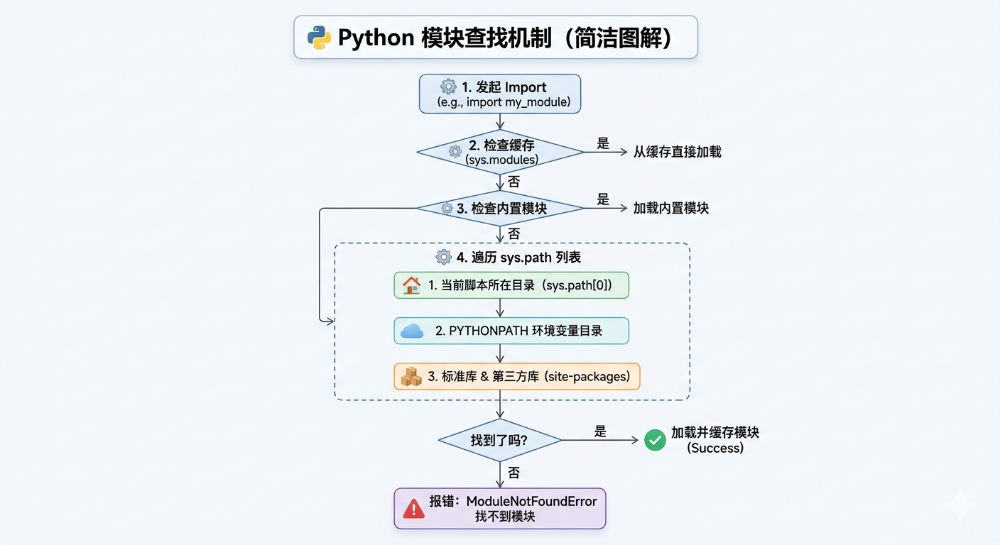

##### sys.path

可通过 `sys` 内置模块查看与添加搜索路径：

```python
import sys

# 查看搜索路径
for path in sys.path:
    print(path)

# C:\Users\win\Desktop\Test\Python\first_demo
# C:\Users\win\.pyenv\pyenv-win\versions\3.14.3\python314.zip
# C:\Users\win\.pyenv\pyenv-win\versions\3.14.3\DLLs
# C:\Users\win\.pyenv\pyenv-win\versions\3.14.3\Lib
# C:\Users\win\.pyenv\pyenv-win\versions\3.14.3
# C:\Users\win\Desktop\Test\Python\first_demo\first_demo_env
# C:\Users\win\Desktop\Test\Python\first_demo\first_demo_env\Lib\site-packages

# 添加自定义搜索路径
sys.path.append('/path/to/my/modules')

# 强制将某个目录加入搜索路径的最前面
sys.path.insert(0, '/path/to/my/secret/modules')
```

> Python 是**按顺序遍历** `sys.path` 的，一旦在前面的路径找到了匹配的模块名称，它就会停止寻找并加载该模块。
>
> 注意：Python **不会递归查找以上路径的子目录**。

##### 底层机制

​	`import <模块名>` 是以**绝对路径**的形式去查找模块的。

​	Python 解释器会将 `import` 识别为**绝对导入**。且 Python 的模块查找机制是**以包（目录）为单位**进行查找的；

​	当**主程序执行到 `import <模块名>` **时，Python 内部会**自动将当前运行的 `.py` 模块（主程序）所在的上层物理目录**以**绝对路径的形式**临时**插入到 `sys.path[0]` 第一位去顺序查找**（`sys.path[0]` 是**动态性**的，**随运行入口而变化**）；

> 举例：当前运行的是 `./first-demo/main.py`，则 `sys.path[0]` 的内容是 `C:\\...\first-demo\`；Python 会遍历这个目录来查找 `import` 要引入的模块文件。

​	因为**当前目录就在搜索路径**里，所以写 `import <模块名>`，Python 能在 `sys.path` 里立刻找到它；

​        【注意：**Python 的 `import` 查找机制是“浅搜索”，它绝对不会自动递归地去遍历子目录**；所以如果**要引入的模块是当前目录下某个子目录内**的模块，那也是**无法找到**的。与之同理，在子目录内的模块也无法引入外层目录的其他模块；所以**只能引入当前目录的同级模块**】

​	如果当前目录找不到，则去下一个绝对路径目录去查找，直到**遍历完所有包目录都找不到**，从而**报错 `ModuleNotFoundErorr` “模块未找到” 错误**。

​	这种情况下，`import` 看起来是“本地”的，但本质上它依然是一个**绝对导入**。


### 模块的类型

在 Python 中，万物皆对象，每个 `.py` 模块本质上其实也是一个对象，类型是 **`<class 'module'>`**  。

- 模块类的类型对象在底层定义为 **`types.ModuleType`**

要想引用这个类型，必须通过 **`import types` 模块**。

#### types.ModuleType

描述：它是 Python 在**底层定义**的**`.py` 模块实例的所属类型**。

```python
import types
import my_module # ./my_module.py

# 模块的类型是 <class 'module'>，通过 types.ModuleType 这个模块类表示
print(type(my_module))  # <class 'module'>

# 模块类的字符串表示
print(types.ModuleType)  # <class 'module'>

# 每个 .py 模块是 types.ModuleType 的实例
print(issubclass(type(my_module), types.ModuleType))  # True
print(isinstance(my_module, types.ModuleType))  # True
```

#### 模块 & object & type 的关系

在 Python 中，**一切类都是由 `type` 元类构造的（所有类都是 `type` 元类的实例），一切类都是继承自 `object` 基类（所有类都是 `object` 基类的子类，所有类的实例也是 `object` 基类的实例）**。

所以：

- **`types.ModuleType` 模块类型**：
  - 与 `type` 元类的关系：
    - 模块类是**`type` 元类通过 `type()` 函数构造出来的类，是  `type` 元类的实例**
  - 是**`object` 基类的子类**  
- **`module` 模块**是**`types.ModuleType`类型的模块类实例**
  - 所以 **`module` 模块实例也是 `object` 类的实例**

```python
import types
import my_module # ./my_module.py

# ----- 与 type 元类的关系 ----
# type 元类是模块类的直接实现类，即 模块类是 type 元类构造的，模块类不是 type 元类的子类，它只是 type 元类的实例
print(type(types.ModuleType))  # <class 'type'>
print(types.ModuleType.__class__)  # <class 'type'>
print(issubclass(types.ModuleType, type))  # False
print(isinstance(types.ModuleType, type))  # True
# 所以每个 `.py` 模块也是 type 元类的实例
print(isinstance(type(my_module), type))  # True


# ---- 与 object 基类的关系 -----

# 模块类是 object 类的实例，模块类继承自 object 基类
print(types.ModuleType.__bases__)  # (<class 'object'>,)
print(issubclass(types.ModuleType, object))  # True
print(isinstance(types.ModuleType, object))  # True

# 模块的类型是 <class 'module'>，通过 types.ModuleType 这个模块类表示
print(type(my_module))  # <class 'module'>

# 模块类的字符串表示
print(types.ModuleType)  # <class 'module'>

# 每个 .py 模块是 types.ModuleType 的实例
print(issubclass(type(my_module), types.ModuleType))  # True
print(isinstance(my_module, types.ModuleType))  # True

# 所以每个 .py 模块实例也是 object 类的实例
print(issubclass(type(my_module), object))  # True
print(isinstance(my_module, object))  # True
```

#### 常用魔术属性

虽然每个 `.py` 模块都是 `object` 与 `type` 的实例，也具备对象特性，但是 Python 只让 `types.ModuleType` 模块类保留了模块相关的**只读魔术属性**，并不支持重写魔术方法。

在开发中，模块中常用的魔术属性如下：

##### \__all__ 限制导出成员

**默认情况下**，模块**会导出所有成员给外部使用**，从而**让`from ... import *` 能引入模块中的所有成员**。*类似于 JavaScript 的 export*

核心价值：若想**限制模块中对外导出的成员**，可通过**在模块中赋值 `__all___` 魔术属性**来实现。

语法：

```python
# 写法一：
__all__ = (<模块成员1>,<模块成员2>,...) # 传入的元组中必须是模块成员名的字符串形式


# 写法二：
__all__ = [<模块成员1>,<模块成员2>,...] # 传入的列表中必须是模块成员名的字符串形式
```

###### 示例

- 定义一个模块，并限制对外导出的模块成员：

  ```python
  module_name = 'module_demo'
  
  MAX_WIDTH = 100
  MAX_HEIGHT = 100
  
  def add(x, y): return x + y
  
  # 限制当前模块对外导出的成员列表
  # 写法一：
  __all__ = ('module_name', 'add')
  
  # 写法二：
  # __all__ = ['module_name', 'add']
  ```

- 在其他模块中使用：

  ```python
  from module_demo import *
  
  # 访问暴露的模块成员
  print(module_name)  # module_demo
  print(add(5, 3))
  
  # 访问未暴露的模块成员
  # print(MAX_WIDTH)  # 报错：NameError: name 'MAX_WIDTH' is not defined
  # print(MAX_HEIGHT)  # 报错：NameError: name 'MAX_HEIGHT' is not defined
  ```

###### 注意点

`__all__` 属性**仅对 `from ... import *` 引入方式有效**，**对 `import` 直接导入方式无效**。如：

```python
import module_demo3 as demo

result = demo.add(1, 2)
print(result)

print(demo.module_name)
print(demo.MAX_HEIGHT)
print(demo.MAX_WIDTH)
```

###### 为什么只能限制 from import 的行为，却无法限制 import 显式引入？

核心原因：`__all__` 属性是**为了防止“命名空间污染”**。

`__all__` 的设计初衷不是为了**权限控制**（像 Java 的 `private`），而是为了**防止导出时的混乱**。

- **`from module import *` 是危险的：** 当执行这句话时，实际上是**将另一个模块里定义的几乎所有对象（变量、函数、类）都“搬运”到了当前模块的全局命名空间里**。如果没有 `__all__`，当前模块可能会意外地导入大量的内部工具函数、甚至是当前模块里 `import` 的第三方库（比如 `sys` 或 `re`），从而导致变量名冲突。
- **`import module` 是安全的：** 这种方式**只会将模块名本身引入当前模块的命名空间**。如果当前模块想访问里面的内容，必须通过 `module.func()` 这种**显式调用**的方式。因为这种方式**自带“前缀”**，所以**不存在污染当前模块的命名空间**的问题，Python 也就觉得没必要去限制它。

##### \__name__ 主程序入口

每个 `.py` 模块都有一个 `__name__` 魔术属性，**`__name__` 属性的值是动态的**。*等价于 Java 的 public main() 方法*

核心特性：

- 如果**当前运行的 `.py` 文件是当前模块**，则**`__name__`的值是 `__main__` 字符串**，表示当前模块是**主程序入口**
- 如果当前模块是**被作为其他模块引入**的，则**`__name__` 的值是它的模块名**

核心作用：通常用于**编写测试代码**，确保这些代码**只有在直接运行该脚本时才会执行，而在被别人导入时不会运行**。

###### 示例

- 作为主程序入口使用：

  ```python
  # module_demo_main.py
  import module_demo3 as demo
  
  result = demo.add(1, 2)
  print(result)
  
  print(demo.module_name)
  print(demo.MAX_HEIGHT)
  print(demo.MAX_WIDTH)
  
  print(__name__) # __main__
  
  if __name__ == '__main__':
      print('我是主程序入口，直接在运行我这个模块时我才会执行，我可以用来编写测试代码')
  ```

- 作为模块被其他模块引入使用：

  ```python
  import module_demo_main
  
  print(module_demo_main.__name__) # module_demo_main
  ```

### 内置模块 (Built-in Modules）

> Python 内置模块文档：https://docs.python.org/zh-cn/3.14/tutorial/stdlib.html
>
> 模块索引：https://docs.python.org/zh-cn/3.14/py-modindex.html

#### 常用内置模块

```python
# 1. sys - 系统相关
import sys
print(sys.path)        # Python搜索路径
print(sys.version)     # Python版本
print(sys.argv)        # 命令行参数

# 2. os - 操作系统接口
import os
print(os.getcwd())     # 当前工作目录
os.listdir('.')        # 列出目录文件
os.path.exists('file.txt')

# 3. datetime - 日期时间
from datetime import datetime, timedelta
now = datetime.now()
tomorrow = now + timedelta(days=1)

# 4. json - JSON处理
import json
data = {'name': 'John', 'age': 30}
json_str = json.dumps(data)
parsed = json.loads(json_str)

# 5. random - 随机数
import random
random.randint(1, 10)    # 1-10随机整数
random.choice(['a', 'b', 'c'])

# 6. re - 正则表达式
import re
match = re.search(r'\d+', 'Price: 100 dollars')

# 7. collections - 容器数据类型
from collections import defaultdict, Counter
```

#### time 时间类

##### sleep(num) 程序休眠

作用：当 Python 解释器执行到 `time.sleep()` 时会**根据传入的 `num` 参数让程序立即休眠 `num` 秒**。

#### json 格式化

在 Python 中，操作 JSON（JavaScript Object Notation）主要依靠内置的 **`json`** 模块。

这个模块非常直观，核心操作可以概括为：**编码（序列化）**与 **解码（反序列化）**。

| **操作**                      | **对字符串 (String)** | **对文件 (File)** |
| ----------------------------- | --------------------- | ----------------- |
| **序列化** (Python -> JSON)   | `json.dumps()`        | `json.dump()`     |
| **反序列化** (JSON -> Python) | `json.loads()`        | `json.load()`     |

##### dumps() JSON 格式化

作用：将传入的数据解析为 JSON 格式。

```python
import json

data = { 'name': 'jack' }

json_data = json.dumps(data, indent=2, default=str)
# {
#   "name": "jack"
# }
```

参数：

- `indent`：缩进字符
- `default`：默认使用字符串输出，由于 JSON 不能解析字典中的对象会报错，所以需要将其转化为 `str` 字符串输出。

要想让IDE 终端输出的 JSON 字符串颜色高亮，还可以通过第三方库 `rich` 来实现。

##### rich 颜色高亮模块

需通过 `pip` 下载安装：

```python
python -m pip install rich
```

- `python -m`：确保虚拟环境与 `pip` 安装包路径统一

引入使用：

```python
from rich.console import Console
from rich.json import JSON

console = Console()
console.print(JSON.from_data({ 'name': 'jack' }, indent=2, default=str))
```

### 包

#### 基本概念

包本质上是一个包含 **`__init__.py`** 文件的**文件夹**，里面可以装很多 `.py` 模块。

> [!NOTE]
>
> ​	在 Python 3.3 之后，即便文件夹里没有 `__init__.py`，它也会被视为 **“命名空间包” (Namespace Package)**。这意味着依然可以用 `import folder.file` 来导入。
>
> ​	**但是**，为了代码的严谨性以及对各种工具（如 PyCharm、Mypy）的兼容性，强烈建议：**只要是想当作包来用的文件夹，都放一个空的 `__init__.py`。**

核心特性：

- 用于**组织某些特定功能相关的 `.py` 模块**
- 一个包中可以包含**若干个 `.py` 模块、子包（子包也需要包含 `__init__.py` 文件）**
- 使用包可以进一步提升代码的**可维护性、可扩展性**，便于管理大型项目

一个标准的 Python 包通常包含如下层次结构：

```
my_package/                  # 包的根目录
    ├── __init__.py          # 必不可少，标识该目录为一个包
    ├── module_a.py          # 子模块 A
    ├── module_b.py          # 子模块 B
    └── sub_package/         # 子包（嵌套包）
        ├── __init__.py
        └── module_c.py
```

##### 为什么要使用包？

随着项目规模扩大，把所有代码放在一个文件里会变成一场灾难。包的存在解决了以下问题：

- **命名空间管理**：不同包下的模块可以重名（如 `json_parser.utils` 和 `image_processor.utils`），互不冲突。
- **代码复用**：方便将功能模块化，分享给他人或在多个项目中使用。
- **结构清晰**：将逻辑相关的模块分门别类，易于维护。

##### 包与模块的关系 has-a

包与模块之间是一种**`has-a` 属于关系**。

- 一个 `.py` 文件就是一个模块，模块属于包中的一个单位，包是可以用来 “管理模块” 的文件夹目录 

##### 包的分类

在 Python 中，包根据功能性分为 3 种：

- **标准库包**：Python 内置提供的
- **第三方包**：社区开发人员贡献开源的包，包含多种依赖（`.py` 文件）
- **自定义包**：开发人员在本地项目中根据 Python 包的结构自行构建编写的包

###### 库、包、模块的区别

这三个词经常被混用，但它们在概念上有细微差别：

1. **模块 (Module)**：单个 `.py` 文件
2. **包 (Package)**：包含 `__init__.py` 的文件夹，是模块的集合
3. **库 (Library)**：一个泛指的概念，通常指一组完成特定功能的代码集合。一个库可以由一个包组成（如 `requests`），也可以由多个包组成

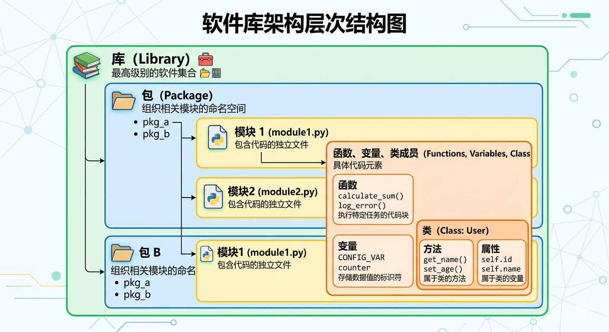

##### 包的查找机制

Python 寻找包有一套严谨的“搜索路径”优先级。

当写入 `import my_package` 时，Python 会按照以下顺序在 **`sys.path` 这个路径列表中依次查找**：

1. **当前目录 (Current Directory)**：运行脚本时所在的文件夹
2. **环境变量 `PYTHONPATH`**：如果在操作系统中设置了这个变量，Python 会优先扫描这些路径
3. **标准库路径 (Standard Library)**：Python 安装自带的模块（如 `os`, `sys`, `math`）
4. **第三方库路径 (site-packages)**：通过 `pip install` 安装的包存放的地方

###### sys.path 路径列表

通过 `sys` 模块提供的 `path` 属性可以查看电脑上 Python 真实的查找路径：

```python
import sys

for path in sys.path:
    print(path)
    
# C:\Users\win\Desktop\Test\Python\first_demo
# C:\Users\win\.pyenv\pyenv-win\versions\3.14.3\python314.zip
# C:\Users\win\.pyenv\pyenv-win\versions\3.14.3\DLLs
# C:\Users\win\.pyenv\pyenv-win\versions\3.14.3\Lib
# C:\Users\win\.pyenv\pyenv-win\versions\3.14.3
# C:\Users\win\Desktop\Test\Python\first_demo\first_demo_env
# C:\Users\win\Desktop\Test\Python\first_demo\first_demo_env\Lib\site-packages
```

#### 自定义包

在本地开发一个自定义包，需要遵守如下目录结构：

```
my_package/                  # 包的根目录
    ├── __init__.py          # 必不可少，标识该目录为一个包
    ├── module_a.py          # 子模块 A
    ├── module_b.py          # 子模块 B
    └── sub_package/         # 子包（嵌套包）
        ├── __init__.py
        └── module_c.py
```

包的命名规范：

- 符合标识符命名规范
- 区分大小写（建议全小写）
- 不要与标准库、第三方库同名

##### \__init__.py 初始化文件

核心价值：用于**把一个文件夹变成一个可以被 `import` 的 Python 包**。

核心特性：`__init__.py` 文件是包的初始化文件，可以把它当成一个普通的 `.py` 模块来使用，只不过**面向的对象是包整体**。

> 注意：`__init__.py` 文件只是**用于规定所属包内暴露给外部的成员内容以及一些初始化逻辑**，只有**当所属包被引入时， Python 才会自动执行一次它**，**其他情况都不应该直接执行它！**

###### 核心功能

Python 采用的是 **“基于命名空间”（Namespace-based）的导入**。即**包也有命名空间（Package NameSpace）**，包也可看做是**一个特殊的 “对象”**，`__init__.py` 文件能做的就是两件事：

1. 当**外部 `.py` 模块文件写入 `import <包名>` 或 `from <包名> import ...` **语句准备引入包内成员时，**Python 仅会执行一次 `__init__.py` 文件**内的初始化逻辑

2. **为包命名空间中塞入指定的成员（子模块、函数、类、变量...）**，以**扩展 / 限制**外部 `.py` 模块**能引入包内成员的范围**：

   - `__init__.py` 文件中**定义的所有成员（包括引入的子模块、变量、函数、类...）会被全部塞入包命名空间**中，**外部可通过 `import <包名>.xxx` 或者 `import <包名>   <包名>.xxx` 直接访问使用**。

     - 即**`__init__.py` 文件中定义的内容就是 `import <包名>` 中 `<包名>` 的内容，`<包名>` 直接指向 `__init__.py` 文件**。

   - **`__all__`属性限制可导出的部分子模块**：
   
     > 注意：`__all__` 属性的限制**仅对 `from  <包名> import ...` 方式有效**，它**无法阻止 `import xx` 显式导入**。
     >
     > 原因：因为 **`import` 是绝对路径查找**，**权重更大**，而 **`from <包名>` 是从包中引入成员**，**权重更小**。
   
     - **无**：则默认往包命名空间中**塞入所有的子模块**，外部的**`from ... import ...` 可全部访问**
     - **有**：则只会往包命名空间中**塞入指定的子模块**，外部的 **`from ... import...` 只能访问 `__all__` 部分暴露的子模块**
   
   - 若 **`__init__.py` 文件为空**：则不作任何处理，默认**往包命名空间中塞入所有的子模块，外部可全部访问**

核心结论：**`__init__.py` 就是包的“脸面”。** 包内部有多少宝贝不重要，外部能看到什么，全看 `__init__.py` 往它自己的命名空间里塞了什么。


###### 底层解析

其实 Python 包本质上就是**`__init__.py` + 文件夹的组合**，`__init__.py` 文件是包的可执行文件，**`__init__.py` 文件的内容就是引入的包对象中的内容**。

> 在 Python 的底层实现中，当 `import / from` 导入一个包时：
>
> 1. Python 会在内存中创建一个 **模块对象（Module Object）**
> 2. 这个对象的名称就是文件夹的名字（例如 `my_package`），所以**引入的包直接指向 `__init__.py` 文件**
> 3. **关键点：** 这个**模块对象（包）的属性（变量、函数、类）全部来自于 `__init__.py` 的执行结果**
>
> 所以，这就是为什么 `__init__.py` 能控制包导出的成员范围，若**没有 `__init__.py` 文件，则包就是一堆文件夹，外部可全部访问**，加上了**`__init__.py` 文件就可以为包这个对象添加一些额外的初始化逻辑，还能限制对外暴露可访问的包内子模块**。


###### 导入包内其他子包/模块的方式

在 `__init__.py` 文件中导入其他子模块，用于**限制暴露给外部 `.py` 模块导入所属包时可访问的包内子模块成员范围**，分为 **相对路径引入** 和 **绝对路径引入** 两种方式。

必须使用以下几种方式：

> 假设包的目录结构如下：
>
> 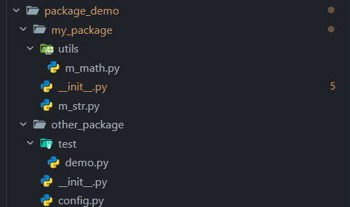
>
> 在 `./my_package/__init__.py` 文件中编写导入模块：
>
> - **相对路径：相对于当前文件路径**；从**当前目录`my_package/` **里面找
> - **绝对路径：相对于包根目录**；从**包根目录 `package_demo/`** 里面找

- **`from import` 相对路径 &  绝对路径**：

  - **`.` 相对路径引入**：**只能导入模块，不能导入模块内的成员（变量、函数、类）！**

    > 相对导入使用 **点号 (`.`)** 来表示**当前包或父包**。它仅适用于 **包内部** 的互相引用。
    >
    > - **`.` (单点)：** 表示**当前目录**。**`.<子包名>`**表示 **当前目录下的某个子包**
    > - **`..` (双点)：** 表示上一级目录

    - **`from . import <模块名>`**：导入**当前目录下 > 某个子模块**

      ```python
      from . import m_str # . : 代表 `my_package/` 当前目录
      
      m_str.to_lower('ALAN')
      ```

    - **`from .<子包名> import <模块名>`**：导入**当前目录下 > 某个子目录（子包）内的某个模块**

      ```python
      from .utils import m_math # .utils : 代表 `my_package/utils/` 当前目录下的子目录
      
      m_math.add(10,3)
      ```

  - **绝对路径引入：可以导入模块，也可以导入模块内的成员（变量、函数、类）**

    - 仅导入模块：

      - **`from <包名> import *`**：导入**包根目录下 > 某个子目录（子包）内的所有模块**

        ```python
        from other_package import *
        
        config.config_func() # other_package 下的 config 模块内的 config_func() 函数
        ```

      - **`from <包名> import <模块名>`**：导入**包根目录下 > 某个子目录（子包）内的某个模块**

        ```python
        from other_package import config # other_package : 代表 `package_demo/other_package/` 子目录
        
        config.version = '1.0.0'
        config.config_func()
        ```

      - **`from <包名>.<嵌套子包名> import <模块名>`**：

        导入**包根目录下 > 某个子目录（子包）内 > 嵌套子目录（子包）内的某个模块**

        ```python
        from other_package.test import demo
        # other_package.test：代表 `package_demo/other_package/test` 子目录
        
        demo.test_func()
        ```

    - 仅导入模块内的成员：

      - **`from <模块名> import <成员>`**：导入**包根目录下 > 某个子模块内的某个成员**

        ```python
        from demo import version as demo_package_version
        # demo：代表 `package_demo/demo.py` 顶层模块
        
        r = demo_package_version
        ```

      - **`from <模块名> import *`**：导入**包根目录下 > 某个子模块内的所有成员**

        ```python
        from demo import *
        
        r = version
        ```

      - **`from <包名>.<模块名> import <成员>`**：导入**包根目录下 > 某个子包内 > 某个模块内的成员**

        ```python
        from other_package.config import config_func, version as config_version
        
        v = config_version
        config_func()
        ```

      - **`from <包名>.<嵌套子包名>.<模块名> import <成员>`**：

        导入**包根目录下 > 某个子目录（子包）内 > 嵌套子目录内 > 某个模块内的成员**

        ```python
        from other_package.test.demo import test_func
        
        test_func()
        ```

- **`import` 仅绝对路径：不能导入当前目录下的子包 或 子模块，只能导入包根目录下的子包**

  > `import` ：**通过 `.` 的方式表示包之间的层级**。如 `<包名>.<模块>`、`<包名>.<嵌套子包名>.<模块>`
  >
  > 注意：**`import` 只能导入其他包、其他包内的子模块，不能直接导入同级子模块！**

  - 仅**导入子目录（子包）**：

    - **`import <包名>`**：导入**包根目录下 > 某个子目录（子包）内的所有模块**

      ```python
      import other_package  # 等价于 from other_package import *
      
      other_package.config.config_func()
      ```

    - **`import <包名>.<嵌套子包名>`**：导入**包根目录下 > 某个子目录（子包）下 > 嵌套子目录（子包）内的所有模块**

      ```python
      import other_package.test
      
      # other_package.test.demo # 等价于 from other_package.test import demo
      other_package.test.demo.test_func() 
      ```

  - 仅**导入子目录（子包）内的某个子模块**：

    - **`import <包名>.<模块名>`**：导入**包根目录下 > 某个子目录（子包）内的某个子模块**

      ```python
      import my_package.m_str  # 等价于  from . import m_str
      import other_package.config  # 等价于  from other_package import config
      
      my_package.m_str.to_lower('ALAN')
      other_package.config.config_func()
      ```

    - **`import <包名>.<嵌套子包名>.<模块名>`**：导入**包根目录下 > 某个子目录（子包）下 > 嵌套子包内的某个子模块**

      ```python
      import my_package.utils.m_math  # 等价于  from .utils import m_math
      import other_package.test.demo  # 等价于  from other_package.test import demo
      
      my_package.utils.m_math.add(10, 30)
      other_package.test.demo.test_func()
      ```

> [!WARNING]
>
> 为什么**在普通的 `.py` 模块中可以直接使用 `import <模块名>` 直接引入同级目录下的模块，而在 `__init__.py` 文件中却不行**？
>
> 核心原因：这是因为 Python `import` 导入的**双重机制**。
>
> > `import <模块名>` 严格按照 `sys.path` 属性中的绝对路径列表进行遍历查找。Python 会按以下顺序寻找该模块：
> >
> > 1. **当前目录**（执行脚本所在的文件夹）
> > 2. **PYTHONPATH**（环境变量中定义的目录）
> > 3. **标准库目录**
> > 4. **第三方库目录** (site-packages)	
>
> - 在普通的 `.py` 模块中写入 `import <模块名>` ，该普通`.py`模块文件是作为**程序入口**运行的；
>
>   > `import <模块名>` 是以**绝对路径**的形式去查找模块的。
>   >
>   > ​	Python 解释器会将 `import` 识别为**绝对导入**。且Python 的模块查找机制是**以包（目录）为单位**进行查找的；
>   >
>   > ​	当**主程序执行到 `import <模块名>` **时，Python 内部会**自动将当前运行的 `.py` 模块（主程序）所在的上层物理目录**以**绝对路径的形式**临时**插入到 `sys.path[0]` 第一位去顺序查找**（`sys.path[0]` 是**动态性**的，**随运行入口而变化**）；
>   >
>   > > 举例：当前运行的是 `./first-demo/main.py`，则 `sys.path[0]` 的内容是 `C:\\...\first-demo\`；Python 会遍历这个目录来查找 `import` 要引入的模块文件。
>   >
>   > ​	因为**当前目录就在搜索路径**里，所以写 `import <模块名>`，Python 能在 `sys.path` 里立刻找到它；
>   >
>   > ​        【注意：**Python 的 `import` 查找机制是“浅搜索”，它绝对不会自动递归地去遍历子目录**；所以如果**要引入的模块是当前目录下某个子目录内**的模块，那也是**无法找到**的。与之同理，在子目录内的模块也无法引入外层目录的其他模块；所以**只能引入当前目录的同级模块**】
>   >
>   > ​	如果当前目录找不到，则去下一个绝对路径目录去查找，直到**遍历完所有包目录都找不到**，从而**报错 `ModuleNotFoundErorr` “模块未找到” 错误**。
>   >
>   > ​	这种情况下，`import` 看起来是“本地”的，但本质上它依然是一个**绝对导入**。
>
> - 而 `__init__.py` 通常**作为包的一部分，并不会直接被运行**，而是**当所属包被其他模块引入时自动运行 `__init__.py`**
>
>   > 假设本地项目中有一个包 `./first_demo/package_demo/__init__.py`、`./first-demo/package_demo/m_math.py`。
>   >
>   > ​     当在 `__init__.py`文件中写 `import m_math` 时，**并不会将当前所在目录的绝对路径插入到 `sys.path` 中**，此时 **`sys.path[0]` 通常只有项目根目录**（`C:\\....\\first_demo`）。
>   >
>   > ​      而由于 Python 的模块查找机制是**以包（目录）为单位进行查找**的，又因为**Python 的 `import` 查找机制是“浅搜索”，它绝对不会自动递归地去遍历子目录**，所以相当于是在 `./first_demo` 上层目录中**跳过了** `/package_demo` 当前目录去直接**越层查找** `m_math` 这个包。
>   >
>   > ​      Python 此时**发现 `./first_demo/` 目录下并没有 `m_math` 这个包**；接着它会跳出当前目录，**直到遍历到所有包目录都找不到 `m_math` 这个包，于是抛出 `ModuleNotFoundError` 错误**。
>   >
>   > ​     而通过**`import <所在包名>.<模块名>`**的方式，就是**告诉 Python 解释器的路径查找是在 `<所在包名>`这个具体目录里找，而不是去它的项目根目录去找**。
>   >
>   > > **本质逻辑：** Python 的绝对导入（`import`）就像一个**只看地图、不看身边**的盲人。
>   > >
>   > > 地图（`sys.path`）告诉它：`C:\...\first_demo` 是一个可以找东西的地方。
>   > >
>   > > 于是它在 `first_demo` 目录下大喊：“`m_math` 在吗？”
>   > >
>   > > 结果：`m_math` 被锁在 `package_demo` 房间里，没法答应。
>   > >
>   > > Python 不会主动去开 `package_demo` 的门，除非地图上写了 `import package_demo.m_math`。
>   
>   ​    由此可见，之所以在 `__init__.py` 文件中写**`import <内置模块 | 第三方模块>` 能行**，就是**因为 Python 在遍历`sys.path` 属性中包路径列表的过程中**，发现第一条找不到这个 `内置模块 | 第三方模块`，从而去下一条包的绝对路径去查找，最后**在专门存储内置标准库 |  第三方库的包目录中（site-package）找到了，并执行它**。
>
> 综上所述，在 `__init__.py` 文件中**之所以无法通过 `import <模块名>`的方式查找同级目录其他子模块**的核心原因就是 **Python 的模块查找机制是以包（目录）为单位进行查找的，而 `m_math` 又只是一个模块，不符合包结构规范**，所以就会找不到。


##### 外部导入包的方式

> [!WARNING]
>
> 当**一个 `.py` 模块被包含有 `__init__.py` 文件的包管理**后，**外部则不能通过 `import <模块名>` 的方式再直接引用这个模块**了，必须**通过 `import <包名>.<模块名>` 来查找**引用它。
>
> 在别的语言里，文件就是模块；而在 Python 里，**目录必须被“承认”为包（通过 `__init__.py` 或命名空间规则）才能被导入**。当你写 `import xxx` 时：
>
> - 你以为你在找 **文件**。
> - Python 却在找 **映射表里的 Key**。
>
> 如果这个 Key（模块名）没在 Python 的 `sys.path` 地图上注册，它就算就在你眼皮底下，Python 也会装瞎。

假设包的目录结构如下：


`__init__.py` 文件中的内容：

```python
import other_package.config as config
# 外部可通过 from my_package import config 来导入 config 模块
# import 方式只能通过 other_package.config 显式引入

from . import m_str
# 外部可通过 import my_package.m_str | from my_package import m_str 来导入 m_str 模块

from .utils import m_math
# 外部可通过 import my_package.m_math | from my_package import m_math 来导入 m_math 模块

# __init__ 内的其他成员
version = '1.0.0'

def init_func():
    print('init_func 函数')

class InitClass:
    def __init__(self):
        print('InitClass 类的构造函数')

# __init__.py 文件是一个特殊的文件，当包被导入时，会自动执行该文件中的代码
print('__init__.py 执行')

# 将 m_str,config,test 模块添加到 my_package 包的公共接口中，只能限制 from import 方式引入
__all__ = ['m_str', 'm_math', 'config']
```

Python 包的引用方式与模块的引用方式基本差异不大，主要有以下几种方式：

###### import 导入

注：只能**引入 `import` 指定的 `<包名>` 目录内的子包、子模块 + `__init__.py` 文件中的成员（变量、函数、类）**

> 注：`import` 和 `from` 方式都会执行一次 `__init__.py` 文件，但仅执行一次，不会重复执行。

直接通过 `import` 方式有 2 个方向：
- **`import <包名>`**：**引入`<包名>` 目录内的所有子包、子模块，通过 `.`语法访问路径**

  ```python
  import my_package
  
  print(my_package.m_math.add(10, 30))  # 40
  print(my_package.m_math.subtract(10, 30))  # -20
  print(my_package.m_str.to_lower('ALAN'))  # alan
  ```

- **`import <包名>.<模块名>` | `import <包名>.<子包名>.<模块>`**：

  描述：**以包为目标**。

  功能：**导入指定包中的指定子包、模块**，可以**通过 `as` 为模块取个别名**

  ```python
  # 引入包测试
  import my_package.utils.m_math
  import my_package.m_str as m_str
  
  # 直接调用
  print(my_package.utils.m_math.add(10, 30))  # 40
  print(my_package.utils.m_math.subtract(10, 30))  # -20
  
  # 别名调用
  print(m_str.to_lower('ALAN'))  # alan
  ```

###### from ... import 导入

注：能**引入 `import` 指定的 `<包名>` 目录内的子包、子模块 + `__init__.py` 文件中的成员（模块、变量、函数、类）**

- 引入模块：
  - **`from <包名> import *`**
  - **`from <包名> import <模块名>,...`**
  - **`from <包名>.<子包名> import <模块名>,...`**

- 引入模块内的成员：
  - **`from <包名>.<模块名> import <成员>,...`**
  - **`from <模块名> import *`**
- `...`

```python
# 引入模块
from my_package import *
from my_package import m_math, m_str, config
from my_package.utils import m_math
# 引入包内子模块的成员
from my_package.m_str import to_lower, to_upper
from my_package.m_str import *

m_math.add(10, 30)
m_str.to_upper("hello")
m_str.to_lower("HELLO")
print(version)
```

###### 总结

- 在普通的 `.py` 模块文件中：`import <模块名>.<成员>` 和 `from <模块名> import <成员>` 只能引入同级目录下的其他 `.py` 模块文件，若要访问不同目录级别的模块文件，有 2 种方式：
  - 需将该其他模块转为包的形式，通过 `import <包名>.<模块名>` 或 `from  <包名> import <模块>` 的方式访问
  - 若其他模块是同级目录的子目录：则可以直接通过 `from <包名> import <模块名>` 或 `import <包名>.<模块名>` 直接访问
- 包中的 `__init__.py` 文件：不能通过 `import` 直接访问同级的 `.py` 模块文件，需使用 `from .<相对路径> import <模块名>` 的方式通过相对路径/绝对路径的形式来访问

## 可迭代对象 & 迭代器

### 基本概念

在 Python 中，根据功能不同的划分将迭代对象类型分为 **可迭代对象** 和 **迭代器对象** 两种。它们是经常被混淆但又至关重要的概念。

- 核心定义：**可迭代对象（Iterable）负责“存数据”，它是一个数据容器；而迭代器（Iterator）负责“数数据”，它是一个迭代工具**。

核心概念：**可迭代对象** 与 **迭代器对象** 都是**可以用来遍历处理数据的不同协议实现方式**，只不过**在底层实现与功能特性上有所不同**。

简单来说，它们都是 Python **实现 `for` 循环和高效处理数据的底层**基石。但是两者是分工明确的。

### 可迭代对象

在 Python 中，可迭代对象是一种**广义**的概念，它的核心定义是指**让一个数据容器具备最基础的可迭代性，但它本身并不具备高性能的可迭代能力**。

- 可迭代对象的**基本底层抽象规范是可迭代协议(Iterable Protocol) **，**具体抽象基类是 `Iterable` 类型**。

#### 可迭代协议 (Iterable Protocol)

核心定义：规范一个类实例的**可迭代基本能力**；如果**一个类实现了 `__iter__` 方法（支持被 `for ..in` 迭代）或 `__getitem__` 方法（支持序号访问【序列容器】）**，那它就是**可迭代类**，该类的实例就是**可迭代对象**。

核心作用：用于描述修饰一个数据容器类 `list`、`set`、`tuple`...，突出它们是**一个可迭代性质的数据容器**

##### 核心特性

- 要求可迭代类**必须实现 `__iter__()` 方法**

- 可迭代对象的迭代时机是**实时计算（一次性生成所有值）**的

- **无状态保持**：容器内的成员**能被重复多次遍历，且每次都不记录上一次迭代遍历的位置**，所以**能一次性获取全部容器内的成员**

  就像一本书，翻完了可以重头开始翻且翻多少遍都没问题

- 内存占用：较高（如 List 存放在内存中）

###### 实现一个自定义可迭代类

```python
# 可迭代协议的实现
class MyIterable:  # 自动继承 (Iterable)

    def __init__(self, arr):
        self.arr = arr

    def __iter__(self):
        return iter(self.arr) # 返回一个迭代器对象，给 for ... in 循环遍历


my_list = MyIterable([1, 2, 3, 4])
print(hasattr(my_list, '__iter__'))   # True（实现了协议）

# MyIterable 类实现了可迭代协议的 __iter__ 方法，所以它的实例内容成员可以被 for ..in 遍历迭代
for item in my_list:
    print(item)  # 1 2 3 4
```

#### Iterable 可迭代抽象基类

##### 与可迭代协议的关系

**协议（Protocol）** vs **类型（Type）**：

- **抽象规范**：可迭代协议是**一种抽象的实现规范 或 “契约”**
- **具体实现**：`Iterable` 类型是**对可迭代协议的具体类型化实现方式**

换句话说：**Iterable 类型是实现了可迭代协议（`__iter__` 方法）的具体实现类**，而**像 `list`、`set`... 等具体子类就是实现了 Iterable 抽象类型才具备了可迭代能力，所以才能被 `for .. in` 遍历成员**。

层次结构：**1. 可迭代协议（抽象规范）→ 2. Iterable（抽象基类）→ 3. 具体可迭代类型（list, set等）**

```
┌─────────────────────────────────────────────┐
│         可迭代协议 (Iterable Protocol)       │
│         "必须实现 __iter__ 方法"              │
│         (抽象规范/契约)                       │
└─────────────────────────────────────────────┘
                    ↓ 实现
┌─────────────────────────────────────────────┐
│         Iterable (抽象基类 ABC)              │
│         from collections.abc import Iterable│
│         (协议的具体类型化表现)                │
└─────────────────────────────────────────────┘
                    ↓ 继承/注册
┌─────────────────────────────────────────────┐
│      具体可迭代类型 (list, set, dict, str)   │
│         (实现了 Iterable 抽象类型)           │
└─────────────────────────────────────────────┘
```

| 概念              | 定义                      | 检查方式                    | 使用场景                 |
| :---------------- | :------------------------ | :-------------------------- | :----------------------- |
| **可迭代协议**    | 抽象规范：实现 `__iter__` | `hasattr(obj, '__iter__')`  | 鸭子类型、动态检查       |
| **Iterable 类型** | 协议的具体类型实现        | `isinstance(obj, Iterable)` | 类型提示、继承、静态检查 |

##### 基本概念

在 Python 中，`Iterable` 类型是实现可迭代协议的类型化实现方式，由该类来**定义数据容器类的可迭代能力，它提供了 `__iter__` 魔术方法由具体的数据容器子类（`list`、`set`...）来实现** 。

- 常见的可迭代子类：`list`、`tuple`、`str`、`bytes`、`dict`、`set`、`range`、文件对象...

  > 注意：`list`、`tuple`、`dict` ... 只有 `__iter__` 方法（它们是可迭代对象）

核心作用：**类型提示、显式继承（继承 Iterable 抽象类就间接实现了可迭代协议）、运行时类型检查**

`Iterable` 是一个抽象类，可通过 `collections.abc` 模块获取：

```python
from collections.abc import Iterable,Iterator

list_arr = [1, 2, 3, 4, 5, 6]
str_msg = 'hello world'

print(isinstance(list_arr, Iterable))  # True
print(isinstance(str_msg, Iterable))  # True

print(isinstance(list_arr, Iterator))  # False
print(isinstance(str_msg, Iterator))  # False

print(hasattr(list_arr, "__iter__"))       # True
print(hasattr(list_arr, "__next__"))       # False

# 可迭代协议的实现
class MyIterable:  # 自动继承 (Iterable)

    def __init__(self, arr):
        self.arr = arr

    def __iter__(self):
        return iter(self.arr) # 返回一个迭代器对象，给 for ... in 循环遍历


my_list = MyIterable([1, 2, 3, 4])

# my_list 是 Iterable 抽象基类的实例
print(isinstance(my_list, Iterable))  # True

print(hasattr(my_list, "__iter__"))       # True
print(hasattr(my_list, "__next__"))       # False
```

##### 获取迭代器

迭代器对象是一个**独立的 `Iterator` 工具类实例**，通常**内置在任何可迭代对象实例身上**，即**通过可迭代对象实例获取它专属的迭代器对象工具**。

###### iterable.\__iter__() 方法

核心作用：**可迭代协议的实现方式**，重写了 `__iter__` 魔术方法的类会**自动继承 `Iterable` 抽象基类**，以此**具备最基础的可迭代能力**。

核心概念：由于 `Iterable` 抽象基类只是用于**描述某个类的实例对象具备最基础的可迭代能力**，并**不具备完善的可迭代能力**，所以基本上内部都是**通过调用 `iter()` 方法返回一个迭代器对象，通过迭代器来实现遍历数据容器内的成员**。（关注点分离）

```python
class MyIterable:

    def __init__(self, arr):
        self.arr = arr

    def __iter__(self):
        return iter(self.arr) # 返回一个迭代器对象，给 for ... in 循环遍历


my_list = MyIterable([1, 2, 3, 4])

# 直接调用 __iter__() 方法
print(my_list.__iter__())  # <list_iterator object at 0x0000020DA7E205B0>

print(isinstance(my_list.__iter__(), Iterator))  # True
```

###### iter(iterable) 内置函数

作用：`iter(iterable)` 函数是 Python 内置的，专门用于**获取一个可迭代对象 `iterable` 内的迭代器对象**，用于**外部遍历可迭代对象内的成员**。

```python
my_list = [1,2,3,4,5]

iterator_obj = iter(my_list)

print(iterator_obj)  # <list_iterator object at 0x0000080RN7L30Q9P0>
print(isinstance(iterator_obj, Iterator))  # True
```

##### 常见问题

- **不能在循环遍历的过程中，修改可迭代对象**

  ```python
  nums = [1, 2, 3, 4]
  for i in nums:
      if i == 2:
          nums.remove(3)  # 危险！修改正在遍历的列表
        
  
  # 解决方案：遍历可迭代对象的副本
  for i in nums[:]:  # 使用切片副本
      if i == 2:
          nums.remove(3)
  ```

### 关注点分离

可迭代协议与迭代器协议都可以使得对象被遍历迭代，但是由于两者在性能损耗上、功能特性上的不同；于是 Python 采用了**关注点分离机制**将两个对象协议的功能进行具体划分：

- **可迭代对象**：基于**可迭代协议实现**，用于**描述一个数据容器（`list`、`set`、`str`...）是可迭代性质的**（静态声明）
  - 通常**不使用它自带的可迭代能力去遍历数据容器**，因为它**每次都是重头开始遍历，非常消耗内存性能**
- **迭代器对象**：基于**迭代器协议实现**，用于**实现对可迭代数据容器（`list`、`set`、`str`...）的高性能迭代遍历行为**（动态工具）
  - 遍历的具体实现动作：通过**采用索引偏移量来定位，每次只返回一个，取一次后移一次**，并通过**标记变量**来**记录上次遍历的位置**，下次再**继续遍历**时，**直接从标记变量所表示的索引偏移量位置去取**，极大降低了内存性能的损耗

核心结论：Python 提供的数据容器内置类（`list`、`set`、`str`...），它**本身是继承自 `Iterable` 抽象类**的，所以它**才能被迭代**。而要**遍历容器内的成员**则需要**通过它继承自 `Iterable` 抽象类的 `__iter__` 方法内部调用 `iter()` 方法返回一个迭代器对象来实现**。

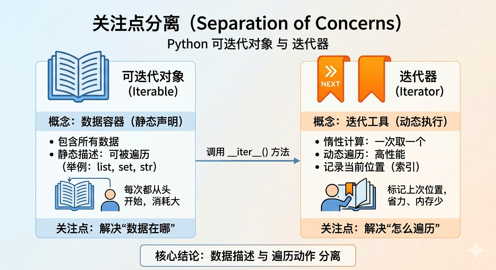

#### 为什么要这样设计？（性能优化）

​	这是因为像 `list`、`set` 之类的数据容器通常会将所有数据一次性加载到内存中，假设一个 `list` 列表中存储了 1GB，那么 `list` 就会占用 1GB 内存；

​	如果只用可迭代协议去实现遍历迭代，根据可迭代协议的特性，每次都会一次性遍历完所有数据，对于内存性能消耗是非常高的；

​	而如果只是通过可迭代协议描述数据容器是可迭代性的，进而使用迭代器协议来完成遍历；根据迭代器协议的特性，它**并不存储整份数据，而是只记录当前索引偏移量指向的位置和下一个元素的规则**（**惰性计算**），所以即使面对的是无穷大的序列（例如自然数序列），迭代器也只需要占用恒定的、极小的内存空间（只需记录当前数字 `n`，下次加 1 即可）。

- **可迭代对象（如列表）**：如果要处理 10 亿个数字，列表会将 10 亿个数字全部加载进内存，电脑可能会直接宕机

- **迭代器（或生成器）**：它只记住“当前执行到哪了”以及“计算下一个的规则”。无论数据量是 10 个还是 10 亿个，它占用的内存几乎恒定（始终只占几个字节）

  ```python
  # 性能对比
  import sys
  
  # 列表：一次性生成所有元素，占用内存
  nums_list = [x**2 for x in range(1000000)]
  print(sys.getsizeof(nums_list))  # 约 8MB
  
  # 迭代器：惰性求值，几乎不占内存
  nums_iter = (x**2 for x in range(1000000))  # 生成器表达式
  print(sys.getsizeof(nums_iter))  # 约 112 字节
  ```

> 形象比喻：就像一本书（可迭代的数据容器对象）跟一个它的书签（可迭代对象中的迭代器工具）；在没有书签时，每次翻阅完书籍都不记得上次阅读到哪里了，都需要重头开始翻阅，非常消耗阅读心智（内存占用高、性能损耗高）；而有了书签，可以暂时标记到当前阅读的位置是第几页，等下次再来翻阅时，直接去书签标记的位置去继续翻阅即可，极其省力。

核心结论：

- **可迭代对象（容器）**：解决了“数据在哪”**和**“能否被遍历”的问题（静态声明）。

- **迭代器（工具）**：解决了“怎么遍历”**和**“节约内存”的问题（动态执行）。

### 迭代器

在 Python 中，可迭代对象是一种**狭义**的概念，它的核心定义是指**能让一个实例对象具备高性能的遍历能力**。

- 迭代器对象的**基本底层抽象规范是迭代器协议(Iterable Protocol) **，**具体抽象基类是 `Iterator` 类型**。

#### 迭代器协议 (Iterator Protocol)

核心定义：要**想让一个对象可被 `for ... in` 高性能的循环遍历**，它**必须实现迭代器协议（`__iter__` 和 `__next__`）**。

核心作用：一个专门**实现对可迭代数据容器（`list`、`set`、`str`...）的高性能迭代遍历行为**的**工具类协议**。

##### 核心特性

- 实现方式：需**实现 `__iter__` 和 `__next__` 方法**

  - **`__iter__()`**：返回**迭代器本身**
  - **`__next__()`**：返回**容器中的下一个元素**；可以**自定义遍历规则**

- 具体实现类：**`Iterator`**

- 迭代特性：迭代器对象的迭代时机是**惰性计算（用到时才算，节省内存）**的

- **有状态保持（通过 `__next__` 方法实现）**：迭代器是**一次性的、且不会自动重置，遍历完即销毁**的，**只能前进、不能重头开始**

  原理：

  ​	容器内的成员**每次被遍历都会使用标记变量来记录上一次的索引偏移量（遍历位置）**，并**每次遍历往后移动一位**，即**用一次取一次**；当**索引偏移量超出了容器的长度时，则返回 `StopIteration` 错误**，表示**容器已被清空**；

  > 就像一个书本的书签工具，阅读到哪里就插在哪里标记上一次阅读的位置，当书签插到书本末尾时表示书本已阅读完，则需要将其移除，重头开始标记

- 内存占用：低（仅记录当前状态/位置）

###### 实现一个自定义迭代器类

```python
# 迭代器协议的实现
class CountDown:
    """倒计时迭代器"""
    def __init__(self, start):
        self.start = start # 标记变量（索引偏移量）
    
    def __iter__(self):
        return self
    
    def __next__(self):
        if self.start <= 0:
            raise StopIteration
        self.start -= 1
        return self.start + 1

# 使用
for num in CountDown(5):
    print(num)  # 5, 4, 3, 2, 1
```

执行步骤：

1. `CountDown()` 迭代器类构建实例，并存入起始值 5 
2. `for in` 调用 CountDown 实例的 `__iter__()` 方法获取一个迭代器（CountDown 自己）
3. `for in` 循环开始，由于每次都调用 `__iter__()` 返回的是同一个实例 `return self`（关键点），所以可以不断调用 CountDown 的 `__next__` 方法，从而不丢失索引偏移值 `start`
4. 最后 `start <=0` 条件满足，抛出 `StopIteration` 错误，`for` 循环自动结束

##### 与可迭代协议的区别关系

###### 差异对比

- 共同点：两者**底层都实现了 `__iter__` 方法**，所以**能被 `for ..in` 循环遍历**

  - **可迭代协议：**

    - **`__iter__`方法：内部是调用 `iter()` 方法，返回一个迭代器对象**。

      告诉 Python：“我本身不负责数数，但我可以给你引荐一个专门负责数数的干将（迭代器）。”

      如果没有这个方法，`for` 循环就无法从容器中获取“进度条”，遍历也就无从谈起。

  - **迭代器协议：**

    - **`__iter__` 方法：返回迭代器对象自身 `self`；兼容处理，为了让迭代器也能直接用在 `for` 循环中。所以迭代器本身也是一个可迭代对象**
    - **`__next__` 方法：自定义遍历规则**

- 不同点对比：

| 特性         | 可迭代对象             | 迭代器                     |
  | :----------- | :--------------------- | :------------------------- |
  | **核心方法** | `__iter__`             | `__iter__` + `__next__`    |
  | **计算时机** | 实时计算（立即）       | 惰性计算（按需）           |
  | **状态保持** | 无状态（不记录位置）   | 有状态（记录索引/偏移量）  |
  | **遍历次数** | 多次（可重置）         | 一次（耗尽需重建）         |
  | **内存占用** | 高（存储所有数据）     | 低（仅存储状态）           |
  | **访问方式** | 可索引、可切片         | 只能 `next()` 顺序访问     |
  | **典型例子** | list, tuple, dict, str | 生成器, enumerate(), zip() |
  | **比喻**     | 一本书                 | 书签                       |

###### 两者之间的关系

协议规范：

- 可迭代协议：**广义**概念

- 迭代器协议：**狭义**概念；是**基于可迭代协议之上扩展**的协议

  ```
  # 协议层次关系
  """
  ┌─────────────────────────────────────┐
  │     可迭代协议 (Iterable Protocol)   │  ← 基层协议
  │     要求: __iter__()                 │
  │     作用: 可以被 for...in 遍历       │
  └─────────────────────────────────────┘
                   ↓ 扩展
  ┌─────────────────────────────────────┐
  │     迭代器协议 (Iterator Protocol)   │  ← 扩展协议
  │     要求: __iter__() + __next__()   │
  │     作用: 可遍历 + 记录状态 + 惰性   │
  └─────────────────────────────────────┘
  """
  ```

具体实现：

- **可迭代对象 Iterable**：基于**可迭代协议实现**的

- **迭代器对象 Iterator**：基于**迭代器协议实现**的

  迭代器对象**继承自可迭代对象**（迭代器是可迭代对象的子集，它是一个特殊的可迭代对象）
  
  所以**迭代器对象一定是可迭代对象，但可迭代对象不一定是迭代器对象**。

```python
# 继承关系
# Iterable (可迭代对象)
#    ↑
# Iterator (迭代器) - 继承自 Iterable

from collections.abc import Iterable, Iterator

# 迭代器继承自可迭代对象
print(issubclass(Iterator, Iterable))  # True

# 所有迭代器都是可迭代对象
it = iter([1, 2, 3])
print(isinstance(it, Iterable))  # True
print(isinstance(it, Iterator))  # True

# 但不是所有可迭代对象都是迭代器
lst = [1, 2, 3]
print(isinstance(lst, Iterable))  # True
print(isinstance(lst, Iterator))  # False
```

核心结论：**可迭代对象是实现了基层协议的"广义"概念，迭代器是在此基础上扩展了状态管理能力的"狭义"实现——迭代器一定是可迭代对象，但可迭代对象不一定是迭代器。**

#### Iterator 迭代器抽象基类

Iterator 迭代器是 Python 中用于**遍历可迭代对象的抽象工具类**，它实现了**迭代器协议**（`__iter__()` 和 `__next__()` 方法）。

##### 与可迭代协议的关系

**协议（Protocol）** vs **类型（Type）**：

- **抽象规范**：迭代器协议是**一种抽象的实现规范 或 “契约”**
- **具体实现**：`Iterator` 类型是**对迭代器协议的具体类型化实现方式**

换句话说：**Iterator 类型是实现了迭代器协议（`__iter__` 和 `__next__` 方法）的具体实现类**。

层次结构：**1. 迭代器协议（抽象规范）→ 2. Iterator（抽象基类）→ 3. 具体实现类 -> `enumerate`、`zip`、`map` 、生成器** 

```
┌─────────────────────────────────────────────┐
│         可迭代协议 (Iterator Protocol)       │
│       "必须实现 __iter__ 和 __next__ 方法"    │
│         (抽象规范/契约)                       │
└─────────────────────────────────────────────┘
                    ↓ 实现
┌─────────────────────────────────────────────┐
│         Iterator (抽象基类 ABC)              │
│         from collections.abc import Iterator│
│         (协议的具体类型化表现)                │
└─────────────────────────────────────────────┘
                    ↓ 继承
┌─────────────────────────────────────────────┐
│      `enumerate`、`zip`、`map`              │
│         (实现了 Iterable 抽象类型)           │
└─────────────────────────────────────────────┘
```

| 概念              | 定义                                    | 检查方式                    | 使用场景                 |
| :---------------- | :-------------------------------------- | :-------------------------- | :----------------------- |
| **迭代器协议**    | 抽象规范：实现 `__iter__` 和 `__next__` | `hasattr(obj, '__next__')`  | 鸭子类型、动态检查       |
| **Iterator 类型** | 协议的具体类型实现                      | `isinstance(obj, Iterator)` | 类型提示、继承、静态检查 |

##### 基本概念

在 Python 中，`Iterable` 类型是实现可迭代协议的类型化实现方式，由该类来**定义数据容器类的可迭代能力，它提供了 `__iter__` 魔术方法由具体的数据容器子类（`list`、`set`...）来实现** 。

- 常见的迭代器工具类：`enumerate`、`zip`、`map` 、`filter`、生成器...

核心作用：**类型提示、显式继承（继承 Iterator 抽象类就间接实现了迭代器协议）、运行时类型检查**

`Iterator` 是一个抽象类，可通过 `collections.abc` 模块获取：

```python
from typing import Iterator

# 迭代器协议实现
class MyIterator:  # 自动继承 (Iterator)
    def __init__(self, data):
        self.data = data
        self.index = 0 # 标记变量（索引偏移量）

    def __iter__(self):
        return self # 返回它自己（迭代器），用于 for 循环 下一次遍历

    def __next__(self):
        if self.index < len(self.data):
            result = self.data[self.index] # 每次都根据索引偏移量取值
            self.index += 1 # 取一次，索引偏移量后移一次
            return result
        else:
            raise StopIteration

# 继承关系：迭代器一定是可迭代对象，所以 MyIterator 实例是 Iterator、Iterable 类的实例
print(issubclass(MyIterator, Iterator))  # True
print(issubclass(MyIterator, Iterable))  # True
print(isinstance(MyIterator([1, 2, 3]), Iterator))  # True
print(isinstance(MyIterator([1, 2, 3]), Iterable))  # True


iterator_obj = MyIterator([1, 2, 3])
iterator_obj_2 = iter(iterator_obj)
iterator_obj_3 = iter(iterator_obj_2)
# `iter()` 会调用 iterator_obj.__iter__() 方法，由于该返回的是迭代器实例对象自身，所以以上 3 个对象其实是同一个实例
print('----------', iterator_obj == iterator_obj_2 == iterator_obj_3)  # True

for item in iterator_obj:
    print(item)  # 1 2 3
    

# Python 中，map()、filter() 其实本质上是一个迭代器类，每次用的都是它的构建方法
print(issubclass(map, Iterator))  # True
print(isinstance(map(lambda x: x - 1, [1, 2, 3, 4]), Iterator))  # True

print(issubclass(filter, Iterator))  # True
print(isinstance(filter(lambda x: x - 1, [1, 2, 3, 4]), Iterator))  # True
```

###### 核心本质

迭代器的本质就是定义一个迭代器类，构建方法传入初始化值（数据容器），并在类中为每个迭代器类实例设立一个标记变量用于表示索引偏移值，每次循环遍历都调用 `__next__()` 方法，索引偏移值 +1，等到所有内容成员都取完则抛出 `StopIteration` 错误。

##### 获取迭代器

迭代器对象是一个**独立的 `Iterator` 工具类实例**，通常**内置在任何可迭代对象实例身上**，即**通过可迭代对象实例获取它专属的迭代器对象工具**。

###### iterable.\__iter__() 方法

作用：通过**调用可迭代对象 `iterable` 的 `__iter__()` 方法**能**获取到它的专属迭代器对象**。

```python
list_arr = [1, 2, 3, 4, 5, 6]
str_msg = 'hello world'

for item in list_arr: # 每次都调用 list_arr.__iter__() ，得到 list_arr 实例，获得状态保持，继续下一次遍历
    print(item)  # 1 2 3 4 5 6

for char in str_msg:
    print(char)  # h e l l o  w o r l d
    
print(hasattr(list_arr, '__iter__'))  # True
print(hasattr(list_arr, '__next__'))  # False

print(list_arr.__iter__()) # <list_iterator object at 0x00000234531705B0> 迭代器对象
print(str_msg.__iter__())  # <<str_ascii_iterator object at 0x00000234531705E8> 迭代器对象

print(type(list_arr.__iter__()))                      # <class 'list_iterator'>
print(hasattr(list_arr.__iter__(), "__next__"))       # True
```

- 内部实现：`__iter__()` 方法内部实现是 **`return self` 返回它自身（迭代器）**。

  所以**`for` 循环每次都调用 `list_arr.__iter__()` ，得到同一个迭代器实例**，**获得状态保持（使用的是同一个迭代器实例的索引偏移量）**，继续下一次遍历。

  ```python
  # 迭代器协议实现
  class MyIterator:  # 自动继承 (Iterator)
      def __init__(self, data):
          self.data = data
          self.index = 0 # 标记变量（索引偏移量）
  
      def __iter__(self):
          return self # 返回它自己（迭代器），用于 for 循环 下一次遍历
  
      def __next__(self): 
          # ...
  
  for item in MyIterator(6): 
      # 每次都调用 MyIterator().__iter__() ，得到 MyIterator() 实例，获得状态保持，继续下一次遍历
      print(item)  # 1 2 3 4 5 6
  ```

###### iter(iterable) 内置函数

定义：`iter(iterable)` 函数是 Python 内置的，内部会**自动调用 `iterable` 可迭代对象的 `__iter__()` 魔术方法**，两者是等价的。

作用：专门用于**获取一个可迭代对象 `iterable` 内的迭代器对象**，用于**外部遍历可迭代对象内的成员**。

```python
my_list = [1,2,3,4,5]

iterator_obj = iter(my_list)

print(iterator_obj)  # <list_iterator object at 0x0000080RN7L30Q9P0>
print(isinstance(iterator_obj, Iterator))  # True

print(type(iterator_obj))                      # <class 'list_iterator'>
print(hasattr(iterator_obj, "__iter__"))       # True
print(hasattr(iterator_obj, "__next__"))       # True
```

##### 获取下一个元素

核心定义：在**使用 `__iter__()` 方法 或 `iter()` 内置函数获取到迭代器对象后**，便可以**通过 `__next__()` 方法 或 `next()` 内置函数进行迭代获取可迭代对象中的成员**了。

核心特性：**调用一次才取一次**，且取的**永远是下一个元素**，当可迭代对象中的成员被**取完**后，**迭代器便会被销毁**。

注意：

- **序列容器**：`list`、`str`、`tuple`... 是**获取它的成员值**
- **集合/字典容器**：`dict`、`set`、`frozenset` 是**获取它的 `Key` 键**

###### \__next__() 方法

作用：通过**调用可迭代对象的 `__next__()` 方法**能**获取到容器内的下一个成员**

```python
# 序列容器
name_str = "Jack"

str_it = iter(name_str)  # 获取迭代器对象

print(str_it.__next__())  # J
print(str_it.__next__())  # a
print(str_it.__next__())  # c
print(str_it.__next__())  # k
# print(str_it.__next__())  # StopIteration 错误

list_att = [1, 2, 3]

list_it = iter(name_str)

print(list_it.__next__())  # 1
print(list_it.__next__())  # 2
print(list_it.__next__())  # 3
# print(list_it.__next__())  # StopIteration 错误

# 集合/字典容器
set_att = {1, 2, 3, 4, 5}

set_it = iter(set_att)

print(set_it.__next__())  # 1
print(set_it.__next__())  # 2
print(set_it.__next__())  # 3
# print(set_it.__next__())  # StopIteration 错误

dict_att = {'name': 'Jack', 'age': 18}

dict_it = iter(dict_att)

print(dict_it.__next__())  # name
print(dict_it.__next__())  # age
# print(dict_it.__next__())  # StopIteration 错误
```

###### next(iterable) 内置函数

定义：`iter(iterable)` 函数是 Python 内置的，它会**自动调用可迭代对象 `iterable` 中的 `__next__()` 方法**。

作用：专门用于**获取一个可迭代对象 `iterable` 内的下一个成员**。

```python
# 序列容器
name_str = "Jack"

str_it = iter(name_str)  # 获取迭代器对象
print(next(str_it))  # J
print(next(str_it))  # a
print(next(str_it))  # c
print(next(str_it))  # k
# print(next(str_it))  # StopIteration 错误

list_att = [1, 2, 3]

list_it = iter(list_att)

print(next(list_it))  # 1
print(next(list_it))  # 2
print(next(list_it))  # 3
# print(next(list_it))  # StopIteration 错误

# 集合/字典容器
set_att = {1, 2, 3, 4, 5}

set_it = iter(set_att)

print(next(set_it))  # 1
print(next(set_it))  # 2
print(next(set_it))  # 3
# print(next(set_it))  # StopIteration 错误

dict_att = {'name': 'Jack', 'age': 18}

dict_it = iter(dict_att)

print(next(dict_it))  # name
print(next(dict_it))  # age
# print(next(dict_it))  # StopIteration 错误
```

###### 内容被清空的解决方案

解决方案：**重新创建迭代器实例，两者互不影响**

```python
# 迭代器只能遍历一次
it = iter([1, 2, 3])
print(list(it))  # [1, 2, 3]
print(list(it))  # []，已经耗尽

# 解决方案：重新创建迭代器
it = iter([1, 2, 3])
print(list(it))
it = iter([1, 2, 3])  # 重新创建
print(list(it))
```

#### 容器转换收集

当对迭代器使用 `list()` 时，Python 内部执行了一个**消费迭代器并收集剩余所有元素转换为列表容器**的过程。

核心原理：

```python
it = iter([1, 2, 3])
print(list(it)) # [1,2,3]
print(list(it)) # []

# 等价于以下方法的实现：
def list_from_iterator(iterator):
    result = []

    while True:
        try:
            # 根据 next() 的特性，下一次再调用 list_from_iterator() 时会抛出一个 StopIteration 错误，所以外部得到的结果是一个空数组 []
            result.append(next(iterator))
        except StopIteration:
            break

    return result


it = iter([1, 2, 3])
print(list_from_iterator(it))  # [1, 2, 3]
print(list_from_iterator(it))  # []


# 同理：map() 函数也是一样的机制
list_nums = [1, 2, 3, 4, 5, 6, 7, 8]
res = list(map(lambda x: x + 1, list_nums))
print(res) # [2, 3, 4, 5, 6, 7, 8, 9]
```

简单来说，**`list()` 会自动循环调用迭代器内的 `__next__()` 方法收集完所有剩余的元素**。

```python
# 1. 创建迭代器
it = iter([1, 2, 3, 4, 5])

# 2. list() 内部工作原理
print(f"迭代器初始状态: {it}")
print(f"第一次调用 next: {next(it)}")  # 1
print(f"第二次调用 next: {next(it)}")  # 2

# 3. 此时调用 list() 会消费剩余元素
remaining = list(it)  # 内部继续调用 next() 直到 StopIteration
print(f"list() 收集剩余: {remaining}")  # [3, 4, 5]

# 4. 迭代器已耗尽
print(f"再调用 next: ")
try:
    next(it)
except StopIteration:
    print("StopIteration - 迭代器已空")
    
'''
迭代器初始状态: <list_iterator object at 0x00000258A9DCCF40>
第一次调用 next: 1
第二次调用 next: 2
list() 收集剩余: [3, 4, 5]
再调用 next:
StopIteration - 迭代器已空
'''
```

#### for 循环的底层原理

当执行 `for item in my_list` 时，Python 解释器其实在后台做了以下步骤：

1. **调用 `iter()` 内置函数 或 `__iter__()` 魔术方法 获取【可迭代对象】的【迭代器对象】**，用于兼容平衡：
   1. 如果放个**列表**进去，`iter(list)` 通过 `__iter__` 返回一个**迭代器**
   2. 如果放个**迭代器**进去，`iter(iterator)` 通过 `__iter__` 得到**它自己**
2. 不断索取：**循环调用迭代器的 `__next__()` 方法**动态获取数据容器的成员
3. **当迭代器被清空（索引偏移量 > 容器总长度）**，捕获到 `StopIteration` 异常，**自动停止循环**

示例：

```python
# for 循环的底层就是迭代器
for item in [1, 2, 3]:
    print(item)

# 等价于
iterator_obj = iter([1, 2, 3])
while True:
    try:
        item = next(iterator_obj)
        print(item)
    except StopIteration:
        break
```

### 适用场景

- 可迭代对象：

  **实时计算**，**每次遍历都需要把一个容器存入内存中计算**，并得到实时的值，且**支持重复多次遍历**，**但每次都是从头开始遍历**，**内存性能消耗高**；

  所以适合**有限数据集合（知道有多少结果）**的遍历

  ```python
  # 场景1：需要多次遍历数据
  students = ["Alice", "Bob", "Charlie"]
  
  # 第一次遍历：计算平均分
  for s in students:
      pass  # 计算逻辑
  
  # 第二次遍历：找出最高分
  for s in students:
      pass  # 查找逻辑
  
  # 场景2：需要随机访问
  print(students[0])  # 索引访问
  print(len(students))  # 获取长度
  ```

- 迭代器对象：

  **惰性计算，每次都是根据索引偏移量用一次取一次，每次用完都会清空**，但**不支持多次遍历，内存性能消耗低**；

  所以适合**大数据流、无限序列（不知道有多少结果）**的遍历

  ```python
  # 场景1：处理大数据流（节省内存）
  def read_huge_file():
      with open("large_file.txt", "r") as f:
          for line in f:  # f 是迭代器
              yield line  # 逐行处理，不一次性加载全部
  
  # 场景2：无限序列
  def fibonacci():
      a, b = 0, 1
      while True:
          yield a
          a, b = b, a + b
  
  fib = fibonacci()
  for _ in range(10):
      print(next(fib))  # 0, 1, 1, 2, 3, 5, 8, 13, 21, 34
  
  # 场景3：管道式处理（链式操作）
  result = (x**2 for x in range(1000000))  # 生成器表达式
  result = (x for x in result if x % 2 == 0)  # 惰性求值
  result = (x for x in result if x < 10000)
  # 直到最后才真正计算
  print(list(result))
  ```

### 自定义迭代器

- 借助工具类：

  ```python
  # 实现一个自定义迭代器，可以用来遍历某个对象的实例属性
  
  class Person:
  
      def __init__(self, name, age, gender, address):
          self.name = name
          self.age = age
          self.gender = gender
          self.address = address
  
      # 每次 for 循环遍历 实例对象时都会调用 __iter__ 方法，返回一个迭代器对象
      def __iter__(self):
          return MyIterator(self)  # 将 Person 实例对象传递给 MyIterator 类
  
  
  class MyIterator:
  
      def __init__(self, obj):
          self.obj = obj  # 外部传入的实例对象
          self.index = 0  # 标记变量（索引偏移量）
          self.attrs = [x for x in obj.__dict__.keys()]
          # 将 obj 实例对象的所有 key 键扩展为一个列表存储
  
      # 每次 for 循环或 iter() 都会调用一次 __iter__()，返回的是迭代器本身，所以能接着遍历当前迭代器实例中的下一个元素
      def __iter__(self):
          return self
  
      # 每次 for 循环或 next() 都会调用一次 __next__()，返回下一个元素
      def __next__(self):
          # 在遍历过程中，如果索引偏移量超出实例对象属性值的数量，则抛出 StopIteration 异常，结束遍历
          # 否则根据索引偏移量，找到对应的 key 实例属性键，根据 key 键返回指定的实例属性值
          if self.index < len(self.attrs):
              attr = self.attrs[self.index]
              self.index += 1 # 每次取用，后移一位
              return getattr(self.obj, attr)  # 根据索引偏移量，返回指定的实例属性值
          else:
              raise StopIteration
  
  
  person = Person('Jack', 15, '男', '湖南')
  
  # 使用 for 循环遍历实例对象，会自动调用 __iter__() 方法，返回一个迭代器对象，然后调用迭代器对象的 __next__() 方法
  for item in person:
      print(item)
  
  # 单独使用迭代器来遍历实例对象
  person_iter = iter(person)
  
  print(next(person_iter))  # Jack
  print(next(person_iter))  # 15
  print(next(person_iter))  # 男
  
  person_iter_2 = iter(person.__iter__())
  
  print(next(person_iter_2))  # Jack
  print(next(person_iter_2))  # 15
  print(next(person_iter_2))  # 男
  ```

- 将一个普通类改造成迭代器类：

  ```python
  # 实现一个既是迭代器、又是普通类的类
  class Student:
  
      def __init__(self, name, age, gender, address):
          self.name = name
          self.age = age
          self.gender = gender
          self.address = address
  
          # 标记变量（索引偏移量），为了保护索引变量不被该类的其他实例访问到，需要将其设为私有的
          self.__index = 0
  
          # 属性的 key 键
          self.attrs = [x for x in self.__dict__.keys()]
  
      # 每次 for 循环遍历 或 iter() 实例对象时都会调用 __iter__ 方法，返回一个迭代器对象
      def __iter__(self):
          self.__index = 0  # 当第二次 for 循环遍历时，重置共有的索引偏移量，并返回一个新的迭代器对象
          return self
  
      # 每次 for 循环 或 next() 都会调用一次 __next__，返回下一个元素
      def __next__(self):
          # 在遍历过程中，如果索引偏移量超出实例对象属性值的数量，则抛出 StopIteration 异常，结束遍历
          # 否则根据索引偏移量，找到对应的 key 实例属性键，根据 key 键返回指定的实例属性值
          if self.__index < len(self.attrs):
              attr = self.attrs[self.__index]
              self.__index += 1  # 每次取用，后移一位
              return getattr(self, attr)  # 根据索引偏移量，返回指定的实例属性值
          else:
              raise StopIteration
  
  
  student = Student('Tom', 16, '男', '北京')
  print(student.name)
  # 使用 for 循环遍历实例对象，会自动调用 __iter__ 方法，返回一个迭代器对象，然后调用迭代器对象的 __next__ 方法
  for item in student:
      print(item)  # Tom 16 男 北京
  
  for item in student:  # 注意：这样写其实还是同一个迭代器，所以第二个 for 循环不会打印任何东西，因为已经被第一个 for 循环消耗完了
      print(item)
  
  for item in Student('Jack', 18, '男', '上海'):
      print(item)  # Jack 18 男 上海
  
  # 单独使用 next() 迭代器来遍历实例对象
  student_iter = iter(student)
  print(next(student_iter))  # Tom
  print(next(student_iter))  # 16
  print(next(student_iter))  # 男
  print(next(student_iter))  # 北京
  
  student_iter_2 = iter(student.__iter__())
  print(next(student_iter_2))  # Tom
  print(next(student_iter_2))  # 16
  print(next(student_iter_2))  # 男
  print(next(student_iter_2))  # 北京
  ```

## 生成器

Python 的**生成器（Generator）**是一个非常强大且节省内存的工具。

### 基本概念

核心概念：生成器是一个**特殊的迭代器（本质是通过 `yield` 实现了迭代器协议）**，它**允许通过不同的定义方式（函数、推导式）逐个的产生元素，而不是一次性将所有结果都存入内存中**。

在 Python 中，根据**语法结构、定义方式的不同**，创建生成器主要有 2 种方式：

- **生成器函数（Generator Function）**：以**函数的方式定义一个迭代器**，函数体内**使用 `yield` 关键字来控制函数体的执行时机与返回值**
- **生成器表达式（Generator Expression）**：类似于**推导式**的语法；**以一行代码创建一个迭代器**，**逐个地生成元素返回给外部**

#### 为什么要用生成器？

主要有以下几个特性：

- **内存节省**：

  在处理大量数据时，传统的 “列表” 方案会一次性将所有数据都加载到内存中。如果数据有上亿条，那么电脑的内存就会瞬间爆掉。

  于是 Python 便推出了生成器方案，生成器本质上是 Python 为了实现**延迟计算（Lazy Evaluation）而设计的一种特殊迭代器**。

  - **列表（一次性生成，实时求值）**：**现在就要所有结果，存在内存里**
  - **生成器（按需生成，惰性求值）：它只保存算法逻辑和当前状态。知道怎么计算出下一个结果，等需要时再计算，并每次只生成一个结果。无论要处理 100 万个还是 1 亿个数据，它占用的内存始终是恒定的（非常小）。**

  > **场景举例**：如果要读取一个 20GB 的日志文件，用列表读取会直接撑爆 8GB 内存；而用生成器逐行读取，内存占用可能不到 1MB。

  ```python
  arr = [x for x in range(10000000)]
  print(sys.getsizeof(arr))  # 约 8MB
  
  gen_arr = (x for x in range(10000000))
  print(sys.getsizeof(gen_arr))  # 约 112 字节
  # 生成器对象占用的内存空间非常小，因为生成器对象只保存了生成器函数的代码、当前执行到的位置等信息，而不保存生成器的返回值。
  ```

- **简化代码**：

  | **方案**         | **代码复杂度** | **实现方式**                                              |
  | ---------------- | -------------- | --------------------------------------------------------- |
  | **传统类迭代器** | 繁琐           | 需定义类，手动记录 `self.index`，手动触发 `StopIteration` |
  | **生成器函数**   | **极简**       | 只需一个函数 + `yield`                                    |

##### 延迟求值

生成器遵循“不求不给”的原则。

- **即时响应**：如果只需要从 10 亿条数据中找到第一个符合条件的项，用列表需要等 10 亿条全部计算完存入内存才能开始找；而用生成器，算出一个判断一个，找到就立刻停止，大大节省了初始等待时间。
- **流水线作业**：可以把多个生成器像管道一样连接起来。数据在管道中流动，处理完一个流向下一个，而不需要在每个步骤都产生一个庞大的中间结果。

#### 核心本质

综上所述，生成器**本质上就是 Python 中迭代器的另一种不同实现方式**，生成器就是为了**简化迭代器定义**而存在的。

- Python 的生成器提供了一种**更优雅、更简洁的语法方式**来**实现迭代器协议**，而**不需要手动编写复杂的类**。

> 也可以说，生成器是一种 “高级” 的迭代器。

- 与迭代器的关系：**所有生成器都是迭代器，但迭代器不一定是生成器**。原因：**迭代器还可以通过类来实现**。

$$
生成器 \subset 迭代器 \subset 可迭代对象    【\subset: 被包含于】
$$

| 特性     | 迭代器                        | 生成器                     |
| :------- | :---------------------------- | :------------------------- |
| 实现方式 | 实现 `__iter__` 和 `__next__` | `yield` 自动生成迭代器协议 |
| 代码量   | 较多                          | 简洁                       |
| 状态保存 | 手动维护                      | 自动保存局部变量           |
| 适用场景 | 复杂遍历逻辑                  | 简单序列生成               |

### 生成器函数

核心定义：通过以**普通函数的 `def` 语法来定义一个生成器**，当**在函数体中添加 `yield` 关键字**时，该普通函数就会**转为一个生成器函数**，调用它**会返回一个生成器对象（迭代器）**

> 也就是说：如果一个函数中没有 `yield` 关键字，那它就是一个普通函数；若添加了 `yield` 那它就不再是普通函数，而是一个能**根据 `yield`关键字控制函数执行流程**的生成器函数。

生成器函数的使用分为 2 个部分：

- **生成器函数（编译时：静态声明）**：一个函数体内使用 `yield` 关键字的普通函数，它会被**转为一个生成器函数**，调用它**会返回一个生成器对象**

- **生成器对象（运行时：动态执行）**：理解为**一个特殊的迭代器对象**，可**在外部使用 `next()` 内置函数**来**控制生成器函数内的函数体执行流程**

#### 基本语法（编译时）

一个生成器函数主要包含以下 3 个组成部分：

- **函数执行语句（可多个）**：函数体内的所有**代码语句一开始都会被冻结，暂停执行**，等待**外部调用 `next()` 才会被 “解锁”**

- **`yield` 关键字（可多个）**：一个 `yield` 语句就代表**生成器对象中的一个迭代元素**

  - 当**外部调用 `next(<生成器对象>)` 函数**时，会**直接跳到上一次 `yield` 暂停的位置处**，而后**“解锁” 定义在下一个 `yield` 语句之前被 “冻结” 的函数代码语句并正常执行**
  - 当 Python 解释器**执行到 `yield` 语句时会暂停到当前行位置，冻结后续的函数代码语句，并对外返回一个值**，默认为 `None`

  简单来说，**`yield` 穿插**在**前后两块函数代码语句之中**，**前面的代码语句正常执行，后面的代码语句会被 “冻结”**

- **`return` （仅有一个）**：当所有的函数体语句与 `yield` 语句都执行完毕，读取到 `return` 语句时；

  Python 解释器**不会对外返回一个值，而是抛出一个 `StopIteration` 异常**；**`return` 后面的值是抛出 `StopIteration` 异常的异常信息**。

  `return` 在生成器函数中的作用就是给生成器对象一个结束信号，表示生成器对象已经结束。

```python
def <生成器函数名>():
    # 执行语句 1 
    yield # 默认不写为 None，也可以显式指定返回值
   	# 执行语句 2
    yield <返回值2>
    # 执行语句 3
	# ...
    return '异常信息' # 语句执行完毕，抛出StopIteration 异常

<生成器对象> = <生成器函数名>()
```

核心概念：当**外部调用`生成器函数()` **时，Python **不会立即执行**函数体内的代码，而是**拦截函数的执行过程**，并**返回一个生成器对象给外部接收**，该生成器对象是**一个具有 `__iter__` 和 `__next__` 方法的迭代器对象**。

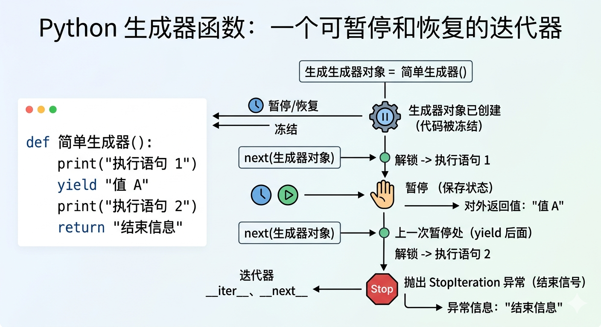

#### 生成器对象（运行时）

核心定义：生成器对象是**一个包含有 `__iter__` 和 `__next__` 方法的迭代器对象**，可以像**使用迭代器一样使用它，逐个地产生元素**。

##### 基本概念

> 注：**`next()` 与 `__next__()` 是等价的**，`next()` 会默认调用迭代器对象的 `__next__()` 魔术方法。

```python
next(<生成器对象>)
# 函数被激活，执行 yield 之前的函数代码语句，检测到 yield 语句之后，暂停执行，记录位置，并返回 yiled 关键字声明的值
next(<生成器对象>)
# 从上一个 yield 暂停的位置开始执行冻结的语句，检测到 yield 关键字后继续暂停，并返回 yiled 关键字声明的值
next(<生成器对象>) 
# 执行最后一个 yield 之后的函数代码语句，检测到 return，函数结束，抛出异常 StopIteration: '我结束了'
```

###### 注意点

特别注意：**生成器函数内有 `n` 个 `yield`**，那么**外部就写 `n` 个 `next()` 获取 `yield` 返回的值**，否则**多余的 `next()` 会收到 `StopIteration` 异常**。

```python
def gen_func():
    a = 100
    yield a
    b = [1,2,3]
    yield b
    c = True
    return c

gen = gen_func()
a = next(gen) # 100 ，对应第一个 yield a
b = next(gen) # [1,2,3]，对应第二个 yield b
# c = next(gen) # 抛出 StopIteration 异常，对应 return c

# 可以使用 try-except 捕获到异常信息
try:
    c = next(gen)
except StopIteration as e:
    c = e
    
print(c) # True
```

- **函数代码语句 & `yield` & `next()` **三者之间的关系：

  **外部调用 `next()` → 执行函数代码语句（如果有） →  遇到 `yield`  ，暂停执行并冻结后续代码块 → 返回值给 `next()` 外部**


###### while、for 循环迭代

- **`while` 循环迭代**：

  ```python
  while True:
      try:
          print(next(gen))
          # next() 自动调用生成器对象中的 __next__() 方法，当抛出异常后循环结束
      except StopIteration:
          break
  ```

- **`for` 循环迭代**：

  执行流程：

  1. `for` 循环会**自动调用生成器对象的 `__iter__` 方法**，返回一个**迭代器对象自身**
  2. **不断循环调用**迭代器对象的 **`__next__()` 方法，返回 `yield` 的值**（期间会正常执行函数代码语句，直到遇到下一个 `yield`）
  3. 当迭代器对象的 `__next__()` 方法**抛出 StopIteration 异常时，`for` 循环内部自动处理，循环结束**

  ```python
  for item in gen:  
      print(item)
  
  # 运行结束，没有报错，因为 for 内部自动添加了 try...except StopIteration
  ```

  > [!NOTE]
  >
  > 为什么 for 循环不会抛出 `StopItertion` 异常？
  >
  > > `for` 循环并不是不会遇到 `StopIteration`，而是它在底层默默地“吞掉”并处理了这个异常。等价于以下代码：
  > >
  > > ```python
  > > # 1. 获取迭代器
  > > _iterator = iter(iterable)
  > > 
  > > while True:
  > >     try:
  > >         # 2. 尝试获取下一个值
  > >         item = next(_iterator)
  > >         # 3. 执行循环体代码
  > >         ... 
  > >     except StopIteration:
  > >         # 4. 捕捉到异常，优雅地跳出循环
  > >         break
  > > ```

##### 运行机制

生成器最神奇的地方在于“暂停”**和**“恢复”。

1. **初始化：** 当调用生成器函数时，它**不会执行**函数体内的代码，而是返回一个生成器对象
2. **触发：** 当外部调用 `next()` 或进行 `for` 循环迭代生成器对象时，代码开始执行
3. **暂停：** 运行到 `yield` 语句时，函数会“冻结”。它会把 `yield` 后面的值传出去，然后保存当前的局部变量、指令指针等所有状态
4. **恢复：** 下次调用 `next()`，函数从上次停止的 `yield` 后面的一行代码继续执行

##### 示例

```python
# 生成器函数
def my_generator():
    print('我是第一行代码')
    yield True  # 默认为 None，也可以显式指定返回值
    print('我是第二行代码')
    yield [1, 2, 3]
    print('我是第三行代码')
    return '我结束了'

gen = my_generator()
print(gen)  # <generator object my_generator at 0x00000188B93468C0>
print(gen.__iter__())  # <generator object my_generator at 0x00000188B93468C0>
print(iter(gen) == gen.__iter__())  # True
# 生成器对象的 __iter__ 方法返回的是生成器对象本身，所以 iter(gen_arr) 和 gen_arr.__iter__() 返回的是同一个对象。
print(isinstance(gen, Iterator))  # True
# 生成器内部实现了 Iterator 迭代器协议

try:
    print('第一个 yield 返回的值：', next(gen))
    print('第二个 yield 返回的值：', gen.__next__())
    print(next(gen))
except StopIteration as e:
    print('StopIteration: ', e)  # StopIteration: 我结束了

'''
输出结果：
我是第一行代码
第一个 yield 返回的值： True
我是第二行代码
第二个 yield 返回的值： [1, 2, 3]
我是第三行代码
StopIteration:  我结束了
'''

# 使用 while 循环遍历生成器对象
gen2 = my_generator()

while True:
    try:
        print('yield 返回的值：', next(gen2))
    except StopIteration as e:
        print('StopIteration: ', e)
        break

'''
输出结果：
我是第一行代码
yield 返回的值： True
我是第二行代码
yield 返回的值： [1, 2, 3]
我是第三行代码
StopIteration:  我结束了
'''


# 使用 for 循环遍历生成器对象
gen3 = my_generator()

try:
    for item in gen3:
        print('yield 返回的值：', item)
except StopIteration as e:
    print('StopIteration: ', e)

'''
输出结果：
我是第一行代码
yield 返回的值： True
我是第二行代码
yield 返回的值： [1, 2, 3]
我是第三行代码
'''
```

#### 底层原理

##### 原理解释

要想真正理解生成器的底层运行原理，需从**编译时**和**运行时**两个形态进行分解：

- **编译时（打 Tag）**：

  1. 在 Python 代码编译期间，**CPython 编译器会扫描整个 `.py` 源代码文件并转为 `.pyc` 字节码文件给 Python 解释器（虚拟机）在运行期间执行**，其中任何对象（函数、类）都统称为代码对象（Code Object）。
  2. 在这个过程中，当 **CPython 编译器扫描到一个普通函数的函数体内包含有 `yield` 关键字**时，它会**在该函数对象的 `co_flags` 属性中添加上一个特殊的标签 `CO_GENERATOR`**（打 Tag）。用于告诉 Python 解释器：”这是一个生成器函数，不要按照普通函数处理“。

  > `def + yield` → `CO_GENERATOR` （静态标记）

- **运行时**：

  - **启动态**：

    1. 在代码运行期间，Python 解释器**读取到一个函数被`()`调用**，会**实时在栈内存中创建一个对应的栈帧容器**，但是此时 Python 解释器**发现它是一个带有 `CO_GENERATOR` 标签的生成器函数**，Python 解释器会**拦截该函数的执行过程从而不会立即执行函数体内的代码**；而是接着**调用底层的 C 函数 `PyGen_new`**，**创建一个全新的带有 `__iter__()` 和 `__next__()` 方法的生成器对象**并作为生成器函数调用的返回值给外部的变量接收。
    2. 生成器对象是一个**临时的对象实例**，它会将生成器函数被`()`调用初期所创建的**函数独立栈帧和函数体代码一起私有化存储到它自己身上，并存放在堆内存中来保持函数栈帧的持久化活跃**  → 【由栈帧变成了**堆帧（Heap Frame）**】。
    3. 同时，存在于堆内存中的**生成器对象会创建一个指针由栈内存中的生成器函数对象指向引用**，以此完成**两者之间的关联**。
    4. 本来普通函数的栈帧是存在栈内存中的，函数执行完毕即销毁；而 Python 却在堆内存中创建了生成器对象来保存该生成器函数的独立栈帧和对应的函数体代码并创建指针被栈内的函数对象引用，从而**延长了函数对象与函数栈帧的生命周期**，使得**函数即使在调用完后，它的栈帧依然存活**，仍然**可以在外部任意地方调用 `next()` 内置函数访问生成器函数内上一次 `yield `暂停的位置并继续执行后续的函数体代码**；

    > `Call` → `PyGen_New` → `Heap Frame` （创建而不执行）

    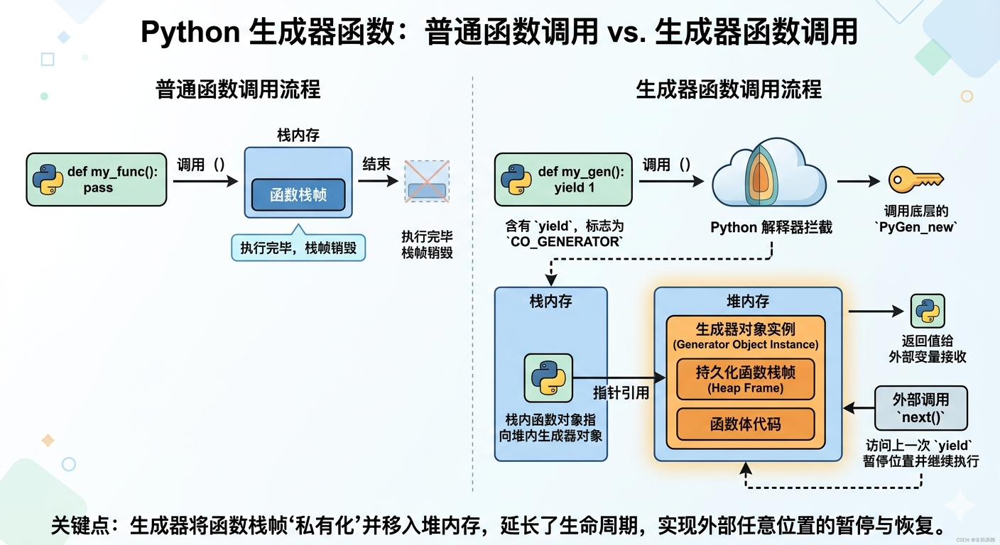

  - **运行态**：

    1. 当外部**通过 `next()` 方法调用生成器对象中的 `__next__()` 方法**时，Python 解释器会访问堆内存中的生成器对象，并会**临时把生成器对象内存储的私有函数栈帧重新挂载到当前运行的执行线程上进行激活（Mount Frame）**。

    2. 在当前激活的函数栈帧内**创建一个 `f_lasti` 标记变量**，并设立**初始值 = 0（从函数体的第一行代码开始执行）**

       它是一个字节码指令层面的**索引偏移量指针**，用来**每次 `yield` 关键字挂起函数栈帧时记录当前函数暂停的代码行位置**

    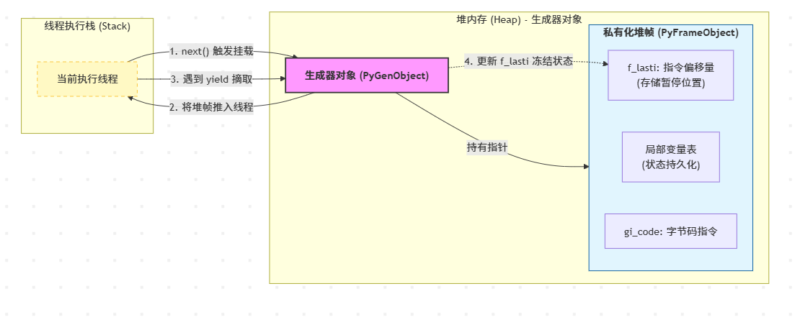

    > `next()` → `Mount Frame` → `Execute` (挂载并运行)

    > 类比比喻：
    >
    > 当普通函数运行时，它的“胶卷”是在播放机（线程栈）里直接生成的，播完就烧掉了。而生成器函数在调用时，Python 提前把“胶卷”拷贝到了一盘磁带（生成器对象）里。
    >
    > 每次你按 `next()`，播放机就加载这盘磁带，读到 `yield` 这个“暂停符号”时，播放机就把磁带弹出来，并记下当前的刻度 `f_lasti`。

  - **挂载态**：

    当**函数栈帧被 `next()` 内置函数重新挂载激活**后，Python 解释器会**根据函数栈帧中 `f_lasti` 标记变量记录的位置开始继续执行函数体内的代码语句**，并重复执行以下步骤：

    - 在 Python 解释器**未遇到 `yield` 关键字**之前，**函数内代码语句会持续正常执行**

    - 若 Python 解释器**遇到了 `yield` 关键字**，则会**重新将当前执行的函数栈帧从当前运行的执行线程中摘取下来**，并执行以下步骤：

      1. 暂停执行：**暂停函数的执行，冻结 `yield` 关键字后续的代码语句**

      2. 返回元素：**将 `yield` 关键字后面声明的值返回给外部的 `next()`（默认为 `None`）**

      3. 更新位置记录：当**每一次 `yield` 关键字挂起函数栈帧**时，Python 解释器都会**更新一次 `f_lasti` 索引偏移量指针（每次索引值 + 1）**

         作用：**以便下次外部调用 `next()` 函数恢复栈帧状态，重新挂载函数栈帧**时，Python 解释器能**通过访问函数栈帧内的 `f_lasti` 标记变量准确定位到上一次暂停执行的代码行位置**

    > `yield` → `Update f_lasti` → `Unmount Frame` （记录位置并摘取）

    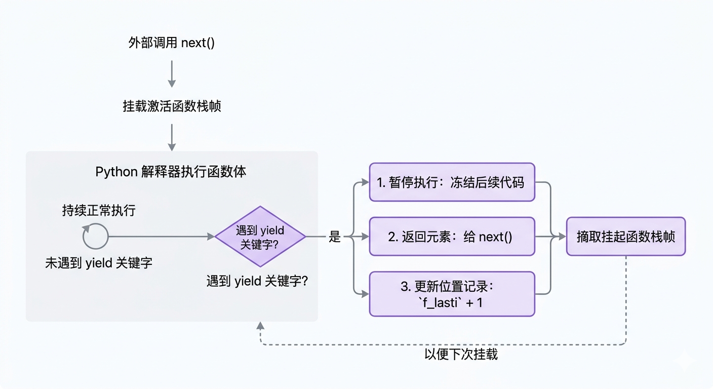

    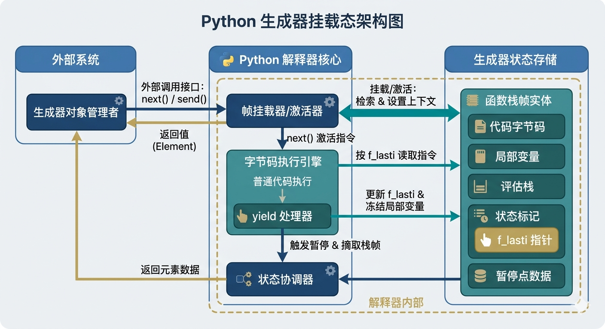
  
  - **完成态**：
  
    1. 直到 Python 解释器**执行到函数体内的 `return` 语句**时，Python 解释器会**屏蔽 `return` 语句的强制返回作用**，而是**创建一个 `StopIteration` 异常对象**，并**将 `return` 后面的值作为异常信息**，一并**抛出给外部接收**；
  
       > **`return value` 改造成 `raise StopIteration(value)`**
       >
       > > 若想拿取到 `value` 值，可在外部手动写 `try-except` 异常处理语句，通过 `as e`的 `e.value` 提取出来：
       > >
       > > ```python
       > > gen = generator_func()
       > > 
       > > try:
       > >  print(next(gen))
       > >  print(next(gen))
       > >  print(next(gen))
       > > except StopIteration as e:
       > >  print('StopIteration: ', e)
       > > ```
  
    2. **外部的`next()` 内置函数捕获到 `StopIteration` 异常后，便自动停止循环迭代**；
  
    3. **标记当前函数栈帧执行完毕，GC 立即回收销毁**，整个生成器的过程完毕
    
    > `return` → `StopIteration` （异常抛出并销毁栈帧）

###### 架构图

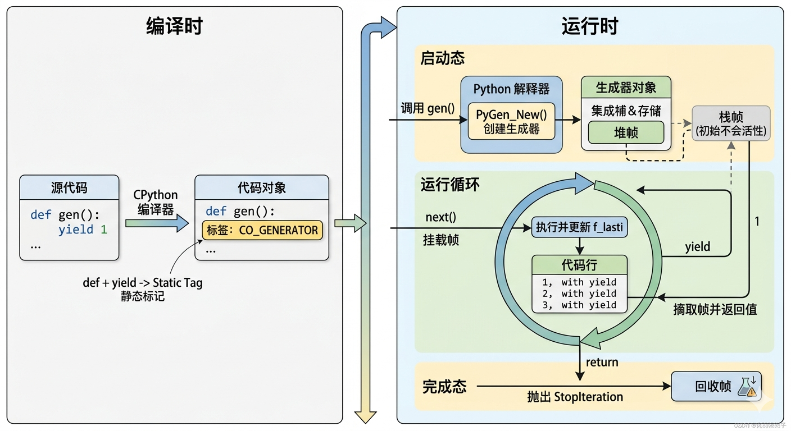

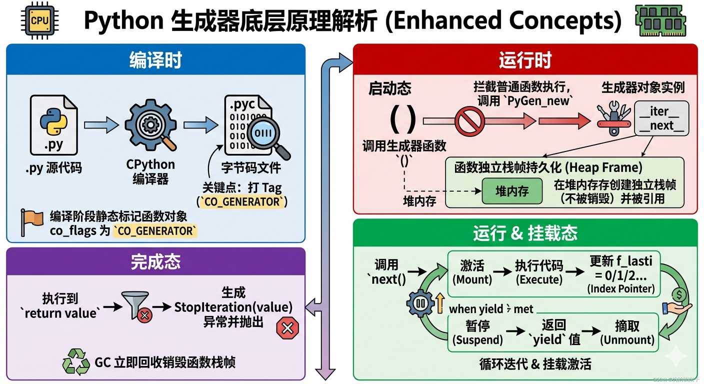

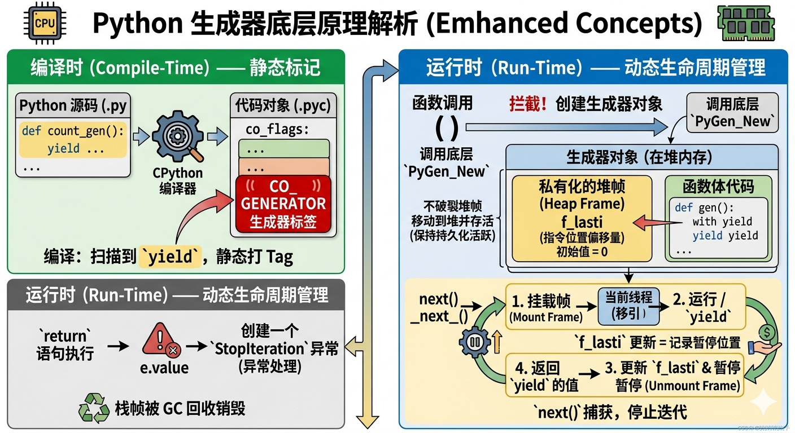

##### 状态管理

由以上底层原理解释可以看出，生成器本质上就是一个**状态机**。它一共分为 4 个状态**对应生成器不同的生命周期阶段**：

- **`FRAME_CREATED`：启动态**
- **`FRAME_SUSPENDED`：挂载态**
- **`FRAME_EXECUTING`：运行态**
- **`FRAME_COMPLETED`：完成态**

> Python 解释器正是通过识别以上这 4 个状态来判断当前函数栈帧的状态，从而执行不同的处理方式。

以上这 4 个状态值都是存储在 `gi_frame` 的 `f_state` 属性中。

##### 维度总结

| **维度**     | **普通函数调用**            | **生成器对象执行**                         |
| ------------ | --------------------------- | ------------------------------------------ |
| **内存分配** | 栈内存（自动回收）          | **堆内存**（持久化，由 GC 管理）           |
| **执行流**   | 一条路走到黑                | **挂载 -> 执行 -> 摘取 -> 挂起** 的循环    |
| **中断机制** | 无（除非异常或结束）        | **`yield` 指令主动触发解释器摘取栈帧**     |
| **结束标志** | `RETURN_VALUE` 直接返回结果 | `RETURN_VALUE` 转化为 `StopIteration` 异常 |

#### yield 关键字

核心概念：采用 **`普通函数 ` + `yield` 关键字可以定义一个生成器函数**。底层**用于 Python 编译器标注当前函数是一个生成器**。

核心作用：将一个普通的函数转变为一个**生成器（Generator）**，生成器内部**使用 `yield` 逐步生成值，而非一次性返回所有结果**。

核心特性：

- **状态挂起**：函数体每次**执行到 `yield` 后暂停**，它会向调用者返回一个值，然后**原地切出**；下次调用**从暂停点继续**

- **状态保存**：`yield` 就像是一个“暂停键”。

  它会**记住当前函数的局部变量、指令指针和异常处理状态**。当**下次调用时，从暂停的地方继续**。

- **恢复执行**：当外部再次**调用 `next()` 或进行循环迭代**时，函数会从刚才暂停的地方**无缝继续**，直到遇到下一个 `yield`

- **返回值**：**`yield` 后面的表达式结果**，会作为本次**外部调用 `next()` 函数或 `__next__()` 方法时的返回值**

##### 为什么要用 yield？

1. **节省内存（核心优势）**： 处理 10G 的日志文件时，用 `return` 读取需要 10G 内存，而用 `yield` 逐行读取只需要 **几KB** 内存
2. **处理无限序列**： 你可以定义一个永远不会结束的生成器（例如：产生所有素数），因为它每次只算出一个值
3. **流式处理**： 在数据流水线中，`yield` 可以让数据像水流一样通过各个处理环节，而不是等第一步处理完所有数据再传给第二步

##### 基本示例

```python
# 生成器函数
def yield_values():
    # yield 可以写在 for 循环语句中，Python 解释器将每一次遍历都视作一次语句的执行
    for i in range(3):
        yield i # 每次只发一个，发完就停下

gen = yield_values()
print(next(gen)) # 输出 0
print(next(gen)) # 输出 1
print(next(gen)) # 输出 2

# ----- 对比普通函数 -----
def return_list():
    result = []
    for i in range(3):
        result.append(i)
    return result # 一次性打包发送，内存压力大

print(return_list()) # [0, 1, 2]
```

##### send() 双向通信-协程

> [!NOTE]
>
> 什么是协程？
>
> 核心定义：协程是**由程序员（编程语言）主动控制的 “轻量级线程”**。它是一种**实现并发编程的核心机制**。
>
> 与多线程的区别：
>
> - **多线程**：在程序运行时启动的**多个同步运行的执行线程**，例如调用函数也是由线程来完成的。
>
>   线程由操作系统控制，由于 CPU 的执行机制（在 `n` 个进程中，每个 `ms` 毫秒随机切换到某个进程中的某个线程中执行上次未完成的任务），这种上下文切换操作会非常消耗底层 CPU 资源；而且**由于线程是同步执行，如果在调用一个函数遇到了 IO 阻塞问题，那么该线程就会一直等待下去，直到 CPU 将指针切换到另一个线程去**。
>
> - **协程**：是一种**异步运行的双向通信机制**，由**编程语言主动启动、主动切换**；
>
>   **当协程所在的线程中遇到了 IO 阻塞问题时，协程会让其等待，而自动跳到另一个程序中的代码块去运行，等到上一个线程的 IO 阻塞问题解决了，它再跳出来继续执行**，由于它不经过操作系统内核切换，所以非常节省性能，而且协程的异步执行机制可以非常有效的提高程序的运行效率。

###### 基本概念

核心概念：Python 中**实现生成器 转为 协程 的双向通信方式**，是属于比较老旧的写法，在并发编程中 **已被 `async/await` 语法取代**。

定义：Python 为生成器提供了一系列的方法可以使用**生成器模拟协程的双向通信机制**。

- **`send()`**：允许外部向生成器函数内部的 `yield` **发送数据**，同时**接收 `yield` 返回给外部的值**
- **`throw()`：在生成器内部抛出异常**
- **`close()`：关闭生成器**

###### 基本语法

```python
def <生成器函数>():
    
    <send 发送的数据1> = yield <返回给 next() 的值1>
    
    <send 发送的数据2> = yield <返回给 next() 的值2>
    
    return <异常信息>

<生成器对象> = <生成器函数>()

# 先由 yield 对外返回值，这一步骤会为 send() 与 yield 建立一个双向通信管道
<第一次启动时 yield 返回的值1> = next(<生成器对象>)

# 再由 send() 向 yield 发送一个值，并在函数内部通过 <send 发送的数据1> = yield 来接收。
<第二次 yield 返回的值2> = <生成器对象>.send(<发送给 yield 的数据1>)

# 第三次，先由 send() 发送给第二个 yield 一个值，并在函数内部通过 <send 发送的数据2> = yield 来接收。
# 此时生成器函数已经执行到 return，所以 send() 接收到的是 return 返回的 StopIteration 异常信息
<生成器对象>.send(<发送给 yield 的数据2>)
 

# 以此类推，形成一个双向通信的管道流
```

###### 运行机制

核心数据流流向：**一切都是先由 `yield` 返回值，再由 `send()` 发送数据并接收下一个 `yield` 返回的值**。

1. **启动阶段**：

   第一次执行时**先由 `yield` 返回值**，并**暂停函数**，由于**前面有 `=`运算符**，所以它会**等待外部的 `send()` 给它发送一个值并接收**

2. **交换阶段**：

   第二次执行时，**由 `send()` 发送给第一个正在等待中的 `yield` 一个数据**，之后激活函数，**继续执行后续冻结的函数代码语句**；读取到**第二个 `yield`，`yiled` 向 `send()` 返回一个值，并再次暂停函数，继续等待**

3. **结束阶段**：

   第三次执行时，**由 `send()` 发送给第二个正在等待中的 `yiled` 一个数据**，之后激活函数，**继续执行后续冻结的函数代码语句**；读取到 **`return`，函数结束执行，并返回给 `send()` 一个 `StopIteration` 异常**


###### 示例

```python
# send() + yield 实现双向通信管道
def generator_send():
    from_send_A = yield "A"
    print('收到：', from_send_A)

    from_send_B = yield "B"
    print('收到：', from_send_B)

    return "Over"


gen_send = generator_send()
print(next(gen_send))  # A
print(gen_send.send('Hello A'))  # 收到： Hello A B
try:
    gen_send.send('Hello B')
    # 收到： Hello B Over ，抛出 StopIteration 异常
except StopIteration as e:
    print('StopIteration: ', e)  # StopIteration:  Over
    
# 注意：send() 方法必须在生成器对象处于暂停状态时调用，否则会抛出异常。
# 注意：send() 方法返回的是 yield 表达式的值，而不是生成器对象的返回值。
# 注意：send() 方法可以传递一个值给生成器对象，该值会赋值给 yield 表达式的值。
# 注意：如果生成器对象已经结束，即已经执行到 return 语句，则 send() 方法会抛出 StopIteration 异常。
```

#### yield from 委派生成器

##### for 循环中的 yield

> [!NOTE]
>
> 在生成器函数中，可以**把 `yield` 关键字声明在 `for` 循环体中**。
>
> 核心作用：可以实现**每次外部调用 `next()` 时，暂停下一次循环的执行，只执行当前循环，并返回 `yield` 的值给外部 `next()`**。
>
> 核心价值：实现**将一个可迭代对象（列表、字典...）里的容器成员，按照 `next()` 的执行次数依次通过 `yield` 迭代出去**。
>
> ```python
> def generator_for_list_item():
>     list_arr = ['A', 'B', 'C', 'D', 'E']
>     for item in list_arr:
>         yield item
> 
> 
> gen_item = generator_for_list_item()
> print(next(gen_item))  # A
> print(next(gen_item))  # B
> print(next(gen_item))  # C
> print(next(gen_item))  # D
> print(next(gen_item))  # E
> # print(next(gen_item))  # StopIteration 异常
> 
> # 也可以使用 list() 函数遍历收集生成器对象
> gen_item_2 = generator_for_list_item()
> print(list(gen_item_2))  # ['A', 'B', 'C', 'D', 'E']
> 
> # 使用 for 循环遍历生成器对象
> gen_item_3 = generator_for_list_item()
> for item in gen_item_3:
>     print(item)  # A B C D E
> ```
>
> - **实现原理**：
>
>   **`for` 循环内的 `i` 元素是存储在栈帧的局部变量表中**，当**函数被 `yield` 暂停**从执行线程上摘取下来时：
>
>   - **生成器对象会存储当前函数栈帧的所有内容（局部变量表、状态值、返回值....）**
>   - 等后续**再被 `next()` 激活**时，Python 解释器会**通过访问生成器对象拿取到函数栈帧重新挂载到当前运行的执行线程上**，此时**局部变量表也随之被激活，局部变量也还是上一次暂停时的状态**。
>
>   简单来说，`for` 循环只是**生成器对象中保存的一种状态**而已，它会**被 `yield` 暂停函数并冻结 `for` 循环的循环进度**，随着生成器对象**一同被存储在堆内存中持久化存储**。
>
> 

##### 为什么需要 `yield from`？

如果想要在**一个生成器函数里调用另一个生成器（迭代器）**，若不使用 `yield from`，则**必须使用 `for` 循环来手动迭代**：

```python
# yield from 委派生成器
def generator_yield_from():
    nested = ['A', 'B', 'C', 'D', 'E']

    for item in nested:
        yield item

    return 'Over'


gen_yield_from = generator_yield_from()
print(next(gen_yield_from))  # A
print(next(gen_yield_from))  # B
print(next(gen_yield_from))  # C
print(next(gen_yield_from))  # D
print(next(gen_yield_from))  # E
# print(next(gen_yield_from))  # StopIteration 异常
```

> 核心概念：可以理解为**一个生成器负责产出一个迭代器容器（部分任务）**，**另一个生成器负责遍历该迭代器中的成员，并对外输出**。

如果使用了 `yield from`，则会变成以下简洁的代码：

```python
def generator_yield_from2():
    nested = ['A', 'B', 'C', 'D', 'E']
    yield from nested  # 等价于 for item in nested: yield item
    return 'Over'


gen_yield_from2 = generator_yield_from2()
print(next(gen_yield_from2))  # A
print(next(gen_yield_from2))  # B
print(next(gen_yield_from2))  # C
print(next(gen_yield_from2))  # D
print(next(gen_yield_from2))  # E
# print(next(gen_yield_from2))  # StopIteration 异常
```

##### 基本概念

在 Python 3.3+ 中，**`yield from`** 是一个非常实用的 **`for + yield`语法糖**。它主要用于**生成器的嵌套（委派生成器）**。

基本语法：

```python
def <生成器函数>():
    yield from <迭代器对象> # 可以是一个生成器函数调用返回的迭代器对象、也可以是 list列表、tuple元组、set集合等数据容器
    # 等价于 for item in <迭代器对象>: yield item
    
    yield <返回值>
    return <异常信息>

<生成器对象> = <生成器函数>()

<yield from 所引用的迭代器生成的元素1> = next(<生成器对象>)
<yield from 所引用的迭代器生成的元素2> = next(<生成器对象>)
<yield from 所引用的迭代器生成的元素3> = next(<生成器对象>)
# ...
<yield 返回的值> = next(<生成器对象>)
# ...
```

- **"委派"** 的含义：将**一个可以依次产生元素的部分任务**交由**给另一个生成器（迭代器）来完成**，最终**由 `yield from` 去引用并返回给外部**。

##### 核心作用

`yield from` 在实际场景中有以下 2 个核心作用：

###### yield from <嵌套序列> 扁平化嵌套序列

核心定义：简化双重 `for` 循环代码。

```python
# 双重 for 循环：扁平化二维数组
def flatten2(nested):
    for item in nested:
        if isinstance(item, (list, tuple)):
            for sub_item in flatten2(item):
                yield sub_item
        else:
            yield item


data_arr = ['A', 'B', ['C', 'D'], 'E', ('F', 'G')]
gen_yield_from3 = flatten2(data_arr)

print(list(gen_yield_from3))  # ['A', 'B', 'C', 'D', 'E', 'F', 'G']

gen_yield_from4 = flatten2(data_arr)
for item in gen_yield_from4:
    print(item)  # A B C D E F G


# yield from 简化后的代码
def flatten(nested):
    for item in nested:
        if isinstance(item, (list, tuple)):
            yield from flatten(item)  # 递归处理
        else:
            yield item


data_arr = ['A', 'B', ['C', 'D'], 'E', ('F', 'G')]
gen_yield_from5 = flatten(data_arr)

print(list(gen_yield_from5))  # ['A', 'B', 'C', 'D', 'E', 'F', 'G']

gen_yield_from6 = flatten(data_arr)
for item in gen_yield_from6:
    print(item)  # A B C D E F G
```

##### yield from <子生成器> 子生成器委派

核心定义：**在一个生成器里，把部分工作委派给另一个子生成器（任何迭代器对象）**：

简单来说，`yield from` 就像是**在两个生成器之间架起了一根 “透明管道”**。它**让一个生成器（委派生成器）能够直接把它的职责“外包”给另一个生成器（子生成器）**。

```python
# 子生成器
def sub_gen():
    yield 1
    yield 2
    yield 3


# 委派生成器
def gen():
    yield from sub_gen()
    print('A')


gen_obj = gen()
print(next(gen_obj))  # 1
print(next(gen_obj))  # 2
print(next(gen_obj))  # 3
print(next(gen_obj))  # A: 抛出 StopIteration 异常
```

可以看出，Python 是**先将 `yield from` 执行完毕**，**将子生成器的 `yield` 列表全部迭代完并返回之后才开始执行后续冻结的函数代码语句**。

###### 运行机制*

核心本质：**`yield from` 本质上就是充当外部 `next()` 与 子生成器中 `yiled` 之间的 “双向透明代理”**。

运行步骤如下：

- **建立外部与子生成器之间的连接**：

  当**外部调用 `next()` 函数**时，Python 解释器**执行到 `yield from`**，它会**暂停主生成器函数自己的逻辑**，转而**把外部的 `next()` 调用指令直接传递给子生成器函数的 `yield`**，并**将 `yield` 的值返回给主生成器**，再**由主生成器函数的 `yield from` 返回给外部的 `next()`**。

  > 直接交互：此时**外部的 `next()` 其实是在跟子生成器函数通信**，**主生成器函数只是一个 “中转站”**

- **自动处理迭代：** **`yield from` 会自动遍历子生成器中的所有值，并将其一个一个 `yield` 出来，直到子生成器耗尽**。
- **恢复执行**：只有**当子生成器函数全部执行完毕（抛出 `StopIteration` 异常）**后，**控制权才会回到主生成器函数手中**，进而**继续执行 `yield from` 后面的代码语句**

简单理解：**外部 `next()` ↔ 主生成器函数的 `yield from`  ↔ 子生成器函数的 `yield`**

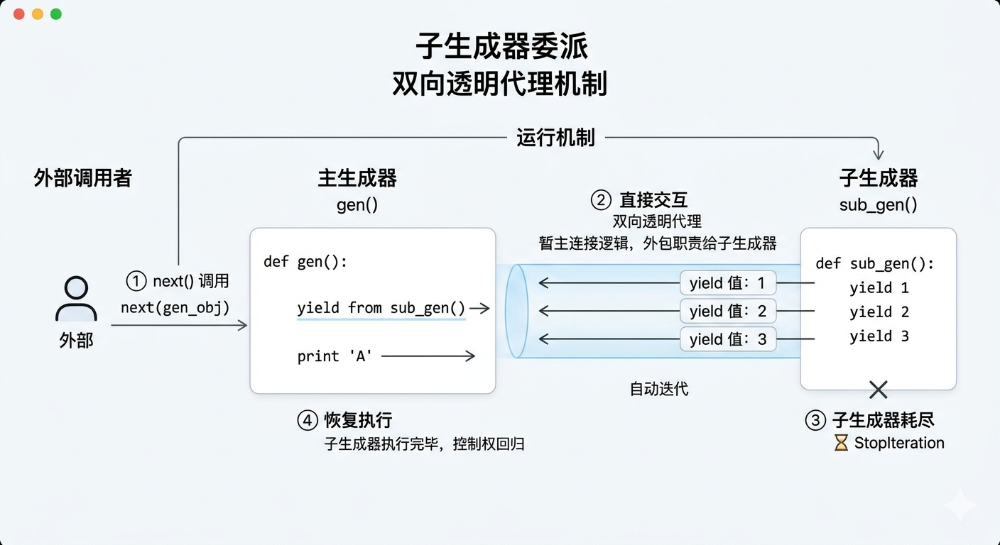

##### 与 `yield`的对比

| 特性               | `yield`      | `yield from`       |
| :----------------- | :----------- | :----------------- |
| 功能               | 产出单个值   | 委托给另一个迭代器 |
| 处理嵌套           | 需要手动循环 | 自动处理           |
| `send()`/`throw()` | 需手动实现   | 自动传递           |
| 子生成器返回值     | 无法获取     | 可获取 `return` 值 |
| 代码简洁性         | 较冗长       | 简洁               |
| 适用场景           | 简单生成器   | 生成器组合、递归   |

#### 与迭代器的对比

核心本质：`yield` 本质上就是为了简化迭代器写法的另一种迭代器实现方式。

核心要点：**`yield` 关键字可以使用在任何函数类型**上，包括类的方法。如下：

##### 场景对比

遍历一个类的实例对象：

核心要点：将**类变成一个可迭代对象（实现 `__iter__` 方法）**，在 `__iter__` 方法中**使用 `yield` 返回类实例对象的属性值**

```python
class Person:

    def __init__(self, name, age, gender, address):
        self.name = name
        self.age = age
        self.gender = gender
        self.address = address

    def __iter__(self):
        yield self.name
        yield self.age
        yield self.gender
        yield self.address


person = Person('Jack', 15, '男', '湖南')

for item in person:
    print(item)  # Jack 15 男 湖南
```

对比传统迭代器实现：

```python
#  对比传统迭代器的实现
class Student:

    def __init__(self, name, age, gender, address):
        self.name = name
        self.age = age
        self.gender = gender
        self.address = address

        self.__data = [key for key in self.__dict__.keys()]
        self.__index = 0

    def __iter__(self):
        return self

    def __next__(self):
        if self.__index >= len(self.__data):
            raise StopIteration
        else:
            key = self.__data[self.__index]
            self.__index += 1
            return self.__dict__[key]


student = Student('Tom', 16, '男', '北京')

for item in student:
    print(item)  # Tom 16 男 北京
```

##### 使用场景

- **yield 生成器**

  - **核心特点**：逻辑相对简单，主要职责是**顺序返回单个值**
  - **适用场景**：特别**适合用于仅需要产出元素值，而无需复杂处理逻辑**的场景

  ```python
  def simple_range(n):
      """生成器：仅用于产生 0 到 n-1 的值"""
      for i in range(n):
          yield i  # 仅产出值，无复杂逻辑
  
  # 使用
  for val in simple_range(3):
      print(val)
  ```

- **迭代器 (Iterator)**

  - **核心特点**：虽然手动编写过程较为繁琐，但**具备高度的定制化能力**
  - **适用场景**：**适合需要在 `__next__()` 方法中添加自定义扩展逻辑**的情况
  - **典型用途**：在**遍历过程中对元素进行类型判断、改造元素值或执行其他复杂的操作**

  ```python
  class SmartIterator:
      """手动迭代器：在遍历时添加了自定义扩展逻辑"""
      def __init__(self, data):
          self.data = data
          self.index = 0
  
      def __iter__(self):
          return self
  
      def __next__(self):
          # 逻辑扩展 1：边界判断
          if self.index >= len(self.data):
              raise StopIteration
  
          item = self.data[self.index]
          self.index += 1
  
          # 逻辑扩展 2：元素类型判断与改造
          if isinstance(item, str):
              return f"字符串处理: {item.upper()}"
          elif isinstance(item, int):
              return f"数值转换: {item * 10}"
          else:
              return f"其他类型: {item}"
  
  # 使用
  data_list = [1, "apple", 3.14]
  smart_it = SmartIterator(data_list)
  for val in smart_it:
      print(val)
  ```

> **总结**： 如果场景需求只是简单地“流水线”生产数据，用**生成器**更高效；如果需要在获取每一个数据的过程中进行深度“加工”或校验，则应选择手动实现**迭代器**。

### 生成器推导式

#### 基本概念

核心定义：Python 推出类似于**推导式**的语法；

核心作用：**以一行代码创建一个迭代器**，**逐个地生成元素返回给外部**

##### 基本语法

生成器表达式有 2 种写法：

- **有 `()` 括号**：**可被用于 `=` 赋值给其他变量接收**

  ```python
  <生成器对象> = (<结果表达式> for <元素> in <可迭代对象>)
  
  next(<生成器对象>)
  ```

- **无 `()` 括号**：**不可被 `=` 赋值给其他变量，仅适合作为一个表达式语句**（所以也无法调用 `next()`）

  ```python
  <结果表达式> for <元素> in <可迭代对象>
  
  
  # 示例：
  # 每次都是不一样的生成器对象
  print(next(op for op in ["+", "-", "*", "/", "计算"])) # +
  print(next(op for op in ["+", "-", "*", "/", "计算"])) # +
  print(next(op for op in ["+", "-", "*", "/", "计算"])) # +
  
  # 仅适合作为一个表达式语句
  if bool(op == '+' for op in ["+", "-", "*", "/", "计算"]):
      print("hello world")
  ```

使用逻辑与生成器函数基本一致，**在外部使用 `next()` 逐个获取值**。

###### 示例

```python
gen_formula = (i + 1 for i in range(5))  # 生成器对象

print(gen_formula)
print(gen_formula.__iter__(), iter(gen_formula))

print(gen_formula.__next__())  # 1
print(gen_formula.__next__())  # 2
print(gen_formula.__next__())  # 3
print(gen_formula.__next__())  # 4
print(gen_formula.__next__())  # 5
# print(gen_formula.__next__()) # 抛出 StopIteration 异常

gen_formula2 = (f"-{n}-" for n in ['A', 'B', 'C', 'D', 'E'])  # 生成器对象
print(next(gen_formula2))  # -A-
print(next(gen_formula2))  # -B-
print(next(gen_formula2))  # -C-
print(next(gen_formula2))  # -D-
print(next(gen_formula2))  # -E-
# print(next(gen_formula2))  # 抛出 StopIteration 异常
```

## 上下文管理器协议（Context Manager Protocol）

> [!NOTE]
>
> 上下文管理器协议（Context Manager Protocol）：
>
> 协议将 **“业务逻辑”** 与 **“资源清理逻辑”** 彻底解耦。
>
> - **解耦**：开发者只需要关注 `with` 缩进里的逻辑，不用担心忘记关闭连接
> - **安全**：即代码中途 `return` 或崩溃，`__exit__` 依然会被调用
> - **可复用**：一次编写协议，处处可用

### 实现方式

上下文管理器协议的**实现方式**有两种：

- **类实现**：只需要**在类中实现 `__enter__()` 和 `__exit__()` 方法**即可
- **`@contextmanager` 上下文管理器装饰器**：**修饰一个生成器函数，与生成器函数的 `yield` 结合**来快速构建一个上下文管理器

上下文管理器协议实现方式的选择取决于具体的需求和场景，且**必须配合 `with` 语句结构使用**。

### with 上下文管理语句

#### 基本概念

在 Python 中，`with` 语句是一个非常强大且优雅的语法结构，主要用于**外部资源的上下文管理**。

##### 与协议的关系

- **上下文管理器协议**：如何对外部资源进行自动化管理的**抽象规范**
- **`with`语句**：Python **在代码层面上**，**按照协议的规范进行自动化管理外部资源的工具**

> `with` 语句的工作原理是**基于上下文管理器协议（Context Manager Protocol）实现**的，它**可以配合上下文管理器类与上下文管理器装饰器**一同使用。

##### 为什么需要 with？

核心结论：`with` 的存在就是为了让代码更 **Pythonic**（简洁、易读），并极大降低了因忘记手动释放资源而导致的 Bug 风险。

###### 关注点分离

核心概念：通过**关注点分离机制**，将操作外部资源**代码中的『业务逻辑』与『外部资源管理』强行分离**。Python 内部**自动处理『外部资源管理』**，开发者**只需关注『业务逻辑』代码**。

在 Python 中，对于外部资源的操作，通常都会分为 3 个步骤：

- **『打开/连接 外部资源通道』→ 『操作外部资源逻辑』 → 『关闭/释放 外部资源通道』**

以上这 3 个步骤，**『打开/连接』 与 『关闭/释放』 **动作通常都是**必要的、“非业务逻辑” 的首尾模板代码**。

> 例如 文件操作 的传统做法：
>
> ```python
> f = open('./test.txt', 'r') # 打开/连接
> 
> # ... 文件读写业务逻辑
> 
> f.close()  # 关闭/释放；必须操作，若忘记释放资源会导致内存占用高，消耗无用的内存性能
> ```

以上传统写法对于开发者来说**在代码结构层面上『业务逻辑』与『外部资源管理』是强内聚的**；代码结构混乱且不清晰，可读性较差；

于是， Python 提供了 `with` 语法结构，它**可以帮助开发者将『业务逻辑』与『外部资源管理』在语法层面上强行解耦（关注点分离）**，让开发者**只关注『业务逻辑』**；通过 Python 的 `with` 语句**内部自动去处理外部资源的『打开/连接』与『关闭/释放』这2个必要的 “非业务逻辑” 的模板代码**，以确保外部资源被正确地清理释放（防止开发者忘记手动关闭资源导致内存溢出）。

> 改善后的 `with` 语句结构：
>
> ```python
> with open('./test.txt', 'r') as f:
>  # ... 文件读写业务逻辑
> 
> # 离开缩进块后，文件会自动关闭，无需手动写 f.close()
> ```

简单来说，**Python 中的 `with` 主要用于管理程序中 “任何成对出现的操作”**。例如：上锁 / 解锁、打开 / 关闭...，从而让开发者省心省力的关注业务逻辑即可。

- 核心要点：**`with` 语句**会将资源的**生命周期**封装在一个 **“上下文环境”** 内；只要环境结束，资源必然回收。

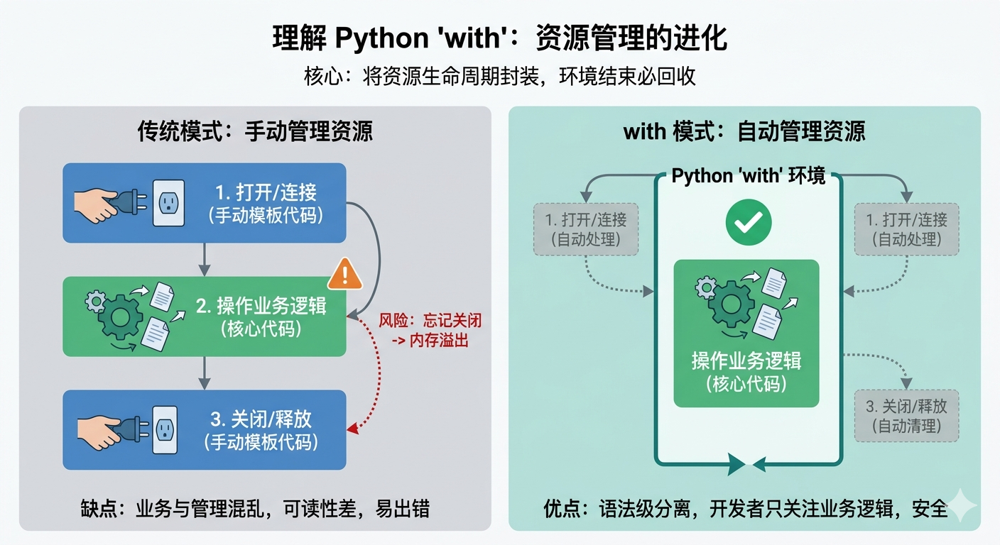

#### 基本语法结构

```python
# 处理单个或多个资源
with <实现上下文管理器协议的 类 | 装饰器生成器函数>,... as <上下文对象>,...:
    # 调用外部资源的具体执行逻辑...
```

核心作用：`with` 语句能**确保外部资源（文件、数据库连接...）在使用后无论是否发生异常**，Python 程序都能**自动处理外部资源的分配和释放**，从而能**避免资源泄漏**（比如文件未关闭、数据库连接未释放），让**代码更简洁、安全**。

##### 要点说明

- **`<实现上下文管理器协议的 类 | 装饰器函数>`**：需要**引用外部资源的类、函数**，可以**通过 `with` 语句统一自动化管理**
  - 上下文管理器类：**实现了上下文管理器协议 `__enter__` 和 `__exit__` 魔术方法的资源管理类**
    - 例如 `open()` 函数就返回了一个自带 `__enter__` 和 `__exit__` 方法的类实例
  - 上下文管理器装饰器函数：**通过 `@contextlib.contextmanager` 装饰器修饰的生成器函数**，内部**使用 `yield` 来引用资源**
- **`<上下文对象>`**：**上下文管理器类、函数返回的一个上下文对象**，用于**在 `with` 代码块的 “上下文环境” 内进行资源的业务逻辑处理**

##### 核心特性

- with 会**自动调用 `<实现上下文管理器协议的 类 | 装饰器生成器函数>` 内部的 `__enter__()` 方法**，并**将返回值（上下文管理器类实例对象）通过 `as` 关键字 传递给 `<上下文对象>`**
- 当 with 代码块内的代码语句执行完毕， Python 解释器**即将跳出 with 代码块**时，会**自动调用 `<实现上下文管理器协议的 类 | 装饰器生成器函数>` 内部的 `__exit__()` 方法**，with 会**自动执行外部资源的【关闭/释放】动作**，无需手动处理

###### `as` 变量的本质

在 **`with ... as f`** 中的 **`f` 变量**，其实是 `__enter__` 方法的**返回值**：

业务分离：

- **`with` 后面的部分**：负责管理环境（资源管理逻辑）
- **`as` 后面的变量**：负责提供操作接口（业务逻辑工具）

> 价值：即使外部拿到了操作文件的句柄 `f`，也无法干预它何时关闭，因为关闭的权限被控制在 `with` 那个“环境”的手里。

```python
class MultipleReturns:
    def __enter__(self):
        # 可以返回任何对象
        return {"message": "Hello", "code": 200}
    
    def __exit__(self, *args):
        pass

with MultipleReturns() as obj:
    print(obj["message"])  # 绑定的是 __enter__ 的返回值
```

##### 示例

- 处理单个资源：

```python
# 传统的文件操作
f = open('./test.txt', 'r', encoding='utf-8')

r1 = f.readline()

f.close() # 手动释放文件资源


# with 简化代码
with open('./test.txt', 'r', encoding='utf-8'):
    r1 = f.readline()
    
# 无需手动编写 f.close()，由 with 去自动管理文件资源的释放
```

- 处理多个资源：

```python
# 传统 try-except-finally 读取文件内容
try:
    f = open('./test.txt', 'r', encoding='utf-8')
    r1 = f.readline()

    f2 = open('./test2.txt', 'r', encoding='utf-8')
    r2 = f2.readline()
except Exception as e:
    print(e)
finally:
    f.close()
    f2.close()

    
# 简化的 with 语法结构
with open('./test.txt', 'r', encoding='utf-8') as f, open('./test2.txt', 'r', encoding='utf-8') as f2:
    r1 = f.readline()
    r2 = f2.readline()

print(r1)
print(r2)
```

注意点：**`with` 没有块级作用域**，所以**在 `with` 代码块内赋值的成员可以在 `with`代码块外部依旧使用**。

#### 使用场景

只要代码符合**“先……后……”**的**对称逻辑结构**，就可以**使用 `with` 语句来自动化管理**：

- **打开**文件 -> **关闭**文件
- **获取**锁 -> **释放**锁
- **连接**数据库 -> **断开**数据库
- **修改**环境变量 -> **还原**环境变量

在实际应用中，可以使用 `with` 上下文管理器来管理文件、网络连接、数据库连接等资源，确保资源在使用完毕后能够正确释放。

| **场景**                    | **with 的作用**                                  |
| --------------------------- | ------------------------------------------------ |
| **文件操作**                | 自动关闭文件流，防止内存泄漏。                   |
| **线程锁 (Threading Lock)** | 自动获取锁并在结束后释放锁，避免死锁。           |
| **数据库连接**              | 确保事务提交或回滚，并关闭连接。                 |
| **网络请求**                | 确保 Socket 连接在使用后被关闭。                 |
| **临时环境修改**            | 比如临时修改系统路径或环境变量，结束后自动恢复。 |

- 文件操作：

  ```python
  # 传统写法需要手动关闭
  f = open('file.txt', 'r')
  try:
      content = f.read()
  finally:
      f.close()
  
  # 使用 with，自动关闭
  with open('file.txt', 'r') as f:
      content = f.read()
  # 离开 with 代码块后，文件自动关闭
  
  # 处理多个文件资源
  with open('input.txt', 'r') as infile, open('output.txt', 'w') as outfile:
      outfile.write(infile.read())
  ```

- 数据库连接：

  ```python
  import sqlite3
  
  with sqlite3.connect('database.db') as conn:
      cursor = conn.execute('SELECT * FROM users')
      # 退出时自动提交事务并关闭连接
  ```

- 线程锁：

  ```python
  import threading
  
  lock = threading.Lock()
  with lock:
      # 自动获取和释放锁
      print('线程安全操作')
  ```

### 类实现协议

协议（Protocol）在 Python 中通常指一组特定的魔术方法。

#### 基本组成

上下文管理器协议包含以下 `__enter__` 和 `__exit__` 魔术方法，只要任何类实现了这 2 个魔术方法，它就会成为了一个 **上下文管理器**。

核心价值：**任何实现了 `__enter__` 和 `__exit__`方法的类都可以与 `with` 语句一起使用**。

> 注意：`__enter__` 和 `__exit__` 魔术方法是**成双成对实现的，不能只实现其一！**

##### 基本语法结构

```python
# 协议实现定义
class <上下文管理器类>:
    
    def __enter__(self): pass

	def __exit__(self, exc_type, exc_val, exc_tb): pass


# 协议使用
with <上下文管理器类>() as <上下文管理对象实例>:
    # 业务逻辑...
```

核心价值：**`with` 语句就是一个“兜底协议”。** 它把那些 “必须要做的琐碎清理工作” 从主逻辑里抽离出来，包在了 `__enter__` 和 `__exit__` 这两个隐形的盒子里。

##### \__enter__(self) 进入 with

###### 核心特性

- 触发时机：**进入 `with` 代码块之前触发**
- 作用：**准备资源**（打开文件、获取线程锁）
- 返回值：它的**返回值会被绑定到 `with ... as` 中 `as` 后面声明的变量上**，该变量会成为**一个上下文对象（Content Object）**

###### 语法结构

```python
# 上下文管理器协议实现
class MyContextManager:
    # 进入 with 代码块时触发
    def __enter__(self):
        print("进入 with 上下文")
        return self # 返回资源对象本身

    # 退出 with 代码块时触发
    def __exit__(self, exc_type, exc_val, exc_tb):
        print("离开 with 上下文")
        # 释放资源处理...

    # with 代码块内的业务逻辑
    def do_something(self):
        print("with 代码块业务逻辑")
        # 业务逻辑...


# 使用上下文管理器
with MyContextManager() as manager:
    manager.do_something()

# 输出：
# 进入 with 上下文
# with 代码块业务逻辑
# 离开 with 上下文
```

###### as 变量的绑定

```python
class MultipleReturns:
    def __enter__(self):
        # 可以返回任何对象
        return {"message": "Hello", "code": 200}
    
    def __exit__(self, *args):
        pass

with MultipleReturns() as obj:
    print(obj["message"])  # 绑定的是 __enter__ 的返回值
```

##### \__exit__(self,...) 离开 with

###### 核心特性

- 触发时机：**退出 `with` 代码块时触发（无论是否发生异常都会触发）**
- 作用：**释放资源**（关闭文件、释放锁）

###### 异常处理

在 `with` 代码块内抛出的异常可以被 `__exit__()` 方法捕获到：

- 异常处理：如果 **`with` 代码块内发生异常**，异常信息会**通过 `exc_type`、`exc_val`、`exc_tb` 方法参数传入到 `__exit__()` 方法中** ，**依然进行关闭资源处理**
  - **`exc_type`**：**异常类型** （例如 `ValueError`）
  - **`exc_val`**： **异常实例** （例如 `ValueError("invalid input")`）
  - **`exc_tb`**：**追踪栈对象** （Traceback）
- 返回值：
  - **True**：`with` 代码块内发生的异常**会被吞掉**；IDE **终端控制台不会报错**
  - **False**：`with` 代码块内的异常会**继续向上抛出**；IDE **终端控制台会报错**

###### 语法结构

```python
# 上下文管理器协议实现
class MyContextManager:
    # 进入 with 代码块时触发
    def __enter__(self):
        print("进入 with 上下文")
        return self # 返回资源对象本身

    # 退出 with 代码块时触发
    def __exit__(self, exc_type, exc_val, exc_tb):
        print("离开 with 上下文")
        if exc_type is not None:  # 如果有异常抛出
            print(f"异常类型: {exc_type}")  # 异常类型: <class 'AttributeError'>

            # 异常对象信息: 'MyContextManager' object has no attribute 'xx'
            print(f"异常对象信息: {exc_val}")

            # Trackback 追踪栈信息: <traceback object at 0x0000024654AF55C0>
            print(f"Trackback 追踪栈信息: {exc_tb}")

            return False  # 返回 False 表示异常未被处理，程序会崩溃

        return True  # 返回True表示异常被处理，程序不会崩溃

    # with 代码块内的业务逻辑
    def do_something(self):
        print("with 代码块业务逻辑")


# 使用上下文管理器
with MyContextManager() as manager:
    manager.do_something()
    manager.xx()  # 这里会抛出异常，但是不会影响上下文管理器的退出
	# raise ValueError("数据格式错误") # __exit__() 方法会捕获它

# 输出：
# 进入 with 上下文
# with 代码块业务逻辑
# 离开 with 上下文
#
# Traceback (most recent call last):
#   File "C:\Users\win\Desktop\Test\Python\first_demo\with_demo.py", line 27, in <module>
#   manager.xx()  # 这里会抛出异常，但是不会影响上下文管理器的退出
#   ^^^^^^^^^^
# AttributeError: 'MyContextManager' object has no attribute 'xx'
```

#### 上下文对象（Context Object）

核心定义：上下文对象广义上是指**实现了上下文管理器协议的类实例对象**，但在运行时，**上下文对象负责维护 `with` 代码块内执行的 “环境状态”**。

##### 运行机制

```python
# 上下文管理器协议实现
class MyContextManager:
    # 进入 with 代码块时触发
    def __enter__(self):
        print("进入 with 上下文")
        return self # 返回资源对象本身

    # 退出 with 代码块时触发
    def __exit__(self, exc_type, exc_val, exc_tb):
        print("离开 with 上下文")
        return True  # 返回True表示异常被处理，程序不会崩溃

    # with 代码块内的业务逻辑
    def do_something(self):
        print("with 代码块业务逻辑")


# 使用上下文管理器
with MyContextManager() as manager: 
    # manager: 就是 MyContextManager() 执行 __enter__() 方法后返回的值【通常是 self 即上下文管理器类自己】
    manager.do_something()
```

当运行 `with MyContextManager() as manager` 时：

1. Python **调用 `MyContextManager()` 创建一个类实例对象**

2. 准备**进入 `with` 代码块**时，**调用类实例对象的 `__enter__()` 魔术方法**

3. 如果**此时使用了 `as manager`**，则**将 `__enter__()` 魔术方法返回的值赋给 `as` 后面声明的 `manager`**变量

   > 注意：**`as manager`中 `manager` 的值取决于 `__enter__` 魔术方法的  `return` 返回值**。即`manager` 不一定就是 `MyContextManager` 上下文管理器类的实例对象，也可以是别的值。

4. **进入 `with` 代码块，执行 `with` 代码块内的业务逻辑**

5. **无论 `with` 代码块发生什么**，在 **`with` 代码块内的语句执行完后**都会**调用** `MyContextManager` 类中的 **`__exit__()` 魔术方法进行释放资源处理**

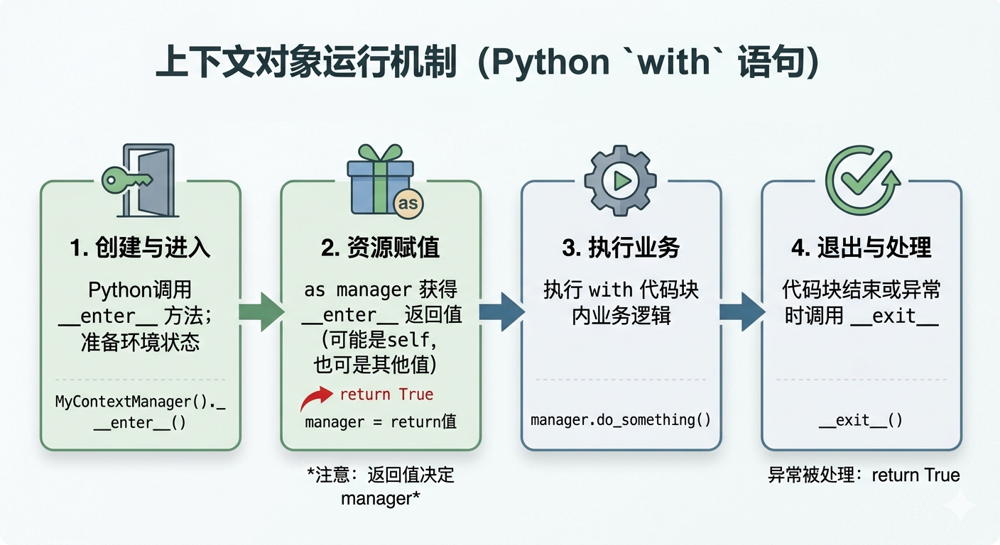

##### 生命周期

上下文对象的生命周期极其明确，它严格遵循 **“由 `with` 启动，由缩进结束触发销毁”**。

- **诞生 (Creation)**：执行 `with <上下文管理器类>()`。此时对象被实例化，内存被分配
- **激活 (Activation)**：调用 `__enter__`。这是环境正式生效的时刻
- **存活 (Execution)**：执行 `with` 内部的代码块。这是资源的“服务期”
- **临终 (Teardown)**：调用 `__exit__`。无论块内是否报错，这个方法都会执行
- **销毁 (Destruction)**：`with` 块结束。如果没有其他强引用，该对象将被 Python 的垃圾回收机制（GC）处理

> 上下文对象的生命周期也可以通过手动调用 `__enter__` 和 `__exit__` 方法来控制。

```python
class ContextManager:
    def __init__(self, name):
        self.name = name
        print('__init__', self.name)

    def __enter__(self):
        print(f"进入 {self.name} 上下文")
        return self

    def __exit__(self, exc_type, exc_val, exc_tb):
        print(f"离开 {self.name} 上下文")

        return True


context_manager = ContextManager('context_manager')  # 强引用，上下文对象会一直存在
with context_manager:
    print("with 代码块业务逻辑")

print(context_manager)  # <__main__.ContextManager object at 0x00000161C0899010>

with ContextManager('context_manager') as c:
    print("with 代码块业务逻辑")

print(c)  # <__main__.ContextManager object at 0x00000161C0899010>
c.__enter__() # 强制进入
c.__exit__(None, None, None) # 强制离开
print(c)  # <__main__.ContextManager object at 0x00000161C0899010>
```

##### 作用域

`with` 并不会创建一个新的局部作用域，且 Python 也没有块级作用域。

所以**在 `with` 块内部赋值的变量（包括 `as` 后面的变量）**，在 `with` 块**结束后依然是可以访问的**。

```python
with open('test.txt', 'w') as f:
    data = "Hello"
    f.write(data)

print(data) # 依然可以访问，输出 "Hello"
print(f)    # 依然可以访问文件对象，但 f.closed 已经是 True 了
```

##### 状态保持

- 实例级的状态共享：

  ```python
  class TracebackManager:
      def __init__(self):
          self.start_time = None # 初始状态
  
      def __enter__(self):
          self.start_time = time.time() # 记录进入状态
          return self
  
      def __exit__(self, exc_type, exc_val, exc_tb):
          duration = time.time() - self.start_time # 计算并保持最终状态
          print(f"该环境运行了 {duration} 秒")
  ```

- 在 `with` 语句外部对上下文对象进行**复用**：利用 `with` 没有块级作用域，内部创建的变量外部依然可以访问的特性。

  可以**将上下文对象作为一个全局变量**，**在不同的 `with` 语句中使用**，而**多个 `with` 代码块内访问的上下午对象是同一个实例**，所以它们之间可以**实现上下文对象的状态保持**。

  ```python
  class Reusable:
      def __init__(self):
          self.counter = 0
  
      def __enter__(self):
          self.counter += 1
          print(f"进入第 {self.counter} 次")
          return self
  
      def __exit__(self, *args):
          print(f"退出第 {self.counter} 次")
          return False
  
      def do_something(self):
          print("with 代码块业务逻辑", self.counter)
  
  
  ctx = Reusable()
  with ctx:
      ctx.do_something()
  with ctx:  # 同一个对象可以再次使用
      ctx.do_something()
  
  '''
  输出结果：
  进入第 1 次
  with 代码块业务逻辑 1
  退出第 1 次
  进入第 2 次
  with 代码块业务逻辑 2
  退出第 2 次
  '''
  ```

### 生成器函数装饰器实现协议

Python 提供了一个名为 `contextlib` 的工具库，它有一个 **`@contextmanager` 装饰器可以修饰一个带 `yield` 的生成器函数**，快速创建上下文管理器。

#### @contextmanager 装饰器

核心价值：通过**一个生成器函数来定义一个一次性使用、逻辑简单的上下文管理器**，而不需要花费更多的代码去实现一个包含 `__enter__` 和 `__exit__` 方法类结构体。

##### 基本语法结构

```python
from contextlib import contextmanager

@contextmanager
def <生成器函数>():
    print("生成资源") # 等价于 __enter__()
    
    try:
        yield <上下文对象的值> # 等价于 __enter__() 的 return 返回值，由外部 with 的 as 变量接收
    finally:
        # 清理资源逻辑
        
    print("回收资源") # 相当于 __exit__ 的逻辑
    
with <生成器函数>() as <yield 返回的值>:
    # 业务逻辑...
```

##### 核心特点

以生成器函数内的 **`yield` 作为分界点**：

- **`yield` 之前的代码 = `__enter__()` 方法**
- **`yield` 返回的值 = `as` 后面的变量**
- **`yield` 之后的代码 = `__exit__()` 方法**

注意点：在装饰器内部，**务必使用 `try...finally` 包裹 `yield`**。如果**不加 `try...finally`，一旦 `with` 块内部报错，`yield` 之后的清理代码将永远不会被执行**。

```python
from contextlib import contextmanager

@contextmanager
def my_resource():
    print("【准备】资源初始化")
    try:
        yield "可用资源" # 这里是分水岭
    finally:
        print("【清理】无论是否报错都会执行")
```

#### 与类实现协议对比

| **维度**     | **contextmanager 装饰器**                        | **传统的类 (__enter__)**           |
| ------------ | ------------------------------------------------ | ---------------------------------- |
| **代码量**   | 极简，通常只有几行。                             | 较多，需要定义类和多个方法。       |
| **状态保持** | 利用闭包，变量直接在函数内访问。                 | 需要通过 `self` 传递。             |
| **适用性**   | 适合 **一次性、简单** 的逻辑。                   | 适合 **复杂、需多次复用** 的逻辑。 |
| **可读性**   | 像读故事一样（先做这个，产出那个，最后做那个）。 | 逻辑分散在不同的魔术方法中。       |

#### 使用场景

- 数据库事务管理：

  ```python
  @contextmanager
  def transaction(db_conn):
      cursor = db_conn.cursor()
      try:
          yield cursor
          db_conn.commit() # 成功则提交
      except Exception:
          db_conn.rollback() # 失败则回滚
          raise # 重新抛出异常供上层处理
  ```

- 文件操作：

  ```python
  from contextlib import contextmanager
  
  @contextmanager
  def with_file_func(filename):
      f = open(f"./{filename}", 'r', encoding='utf-8')
      try:
          yield f  # 把 f 文件对象传递出去
      finally:
          f.close()
  
  
  with with_file_func('《登黄鹤楼》.txt') as f: # f: yield f 返回的 f 文件对象
      print(f.read())
  ```

- 性能计时器（调试工具）：

  ```python
  import time
  from contextlib import contextmanager
  
  @contextmanager
  def time_it(label):
      start = time.perf_counter()
      try:
          yield
      finally:
          end = time.perf_counter()
          print(f"核心逻辑 [{label}] 耗时: {end - start:.4f}s")
  
  with time_it("数据库查询"):
      # 执行复杂的 SQL 或 API 请求
      time.sleep(1)
  ```

## 元编程

