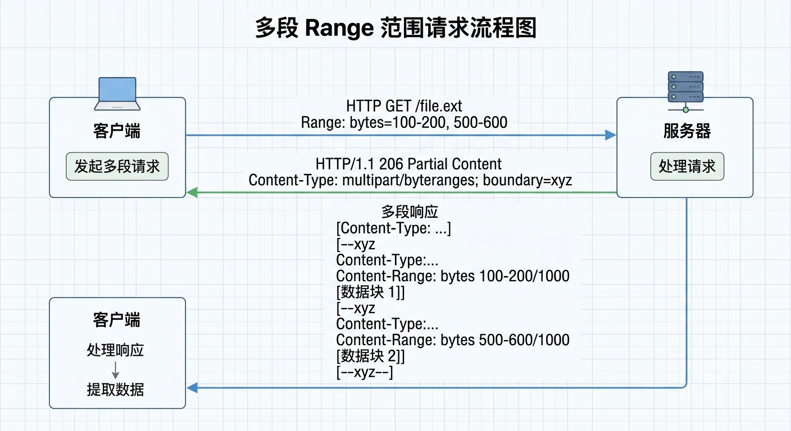
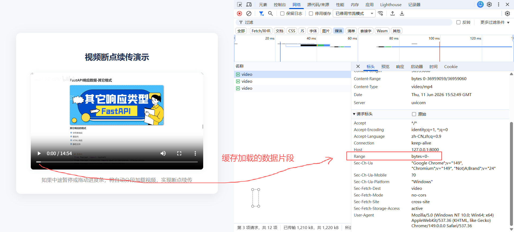

# Response 响应处理

在 FastAPI 中，**响应（Response）** 是处理完业务逻辑后返回给客户端的数据。

FastAPI 根据**响应数据的层次结构（响应状态码、响应体...）**，主要提供了处理方式与核心概念：

- **响应状态码**：

  通过使用 **`fastapi.status` 类、`status_code` 参数、`Reponse.status_code` 属性**...等方式**设置响应头中的状态码**

- **响应体模型：**

  - **类型限制**：
    - API 接口函数的**返回值类型注解（`-> <返回值类型>`）**
    - **`@ 路由装饰器` 的 `response_model` 参数**
  - **不同行为的响应模型**：
    - **`JSONResponse` 类**
    - **`RedirectResponse` 类**
    - **`StreamingResponse` 类**
    - ...

- **响应对象的综合操作（响应状态码、响应头、响应体...等原始数据）**：

  - **`Response` 类**

## Response 响应对象

在 FastAPI 中， **`Response` 请求对象** 是由 **Starlette（底层 Web 框架）**所**提供**的一个**核心组件**。

- **`Response` **对象代表了**服务器端要发送给客户端的原生 HTTP 响应**，包含了**响应头、响应体...**等原始数据

虽然 FastAPI 允许直接返回 `dict`、`list` 或 Pydantic 模型（它会自动转换成 JSON），但在很多场景下（如设置自定义 Header、修改 Status Code、操作 Cookie），需要直接操作 `Response` 对象。

### 基本语法

前提：**由 `fastapi` 模块导入 `Response` 对象**。

核心定义：

- FastAPI 支持通过在 **API 接口函数**中的**形参列表**中**使用 `<形参变量>:Response` 类型声明包装**来**表示接收一个 Response 响应对象**

- FastAPI 会**自动识别 `Response` 类型声明**，并将**当前会话的 HTTP 请求内容注入到 `<形参变量>` 中**。

```python
from fastapi import FastAPI, Response

<FastAPI 应用实例> = FastAPI()

@<FastAPI 应用实例>.<HTTP 方法>('<URL 路径>')
async def <API 路由函数>(<形参变量x>: Response):
    
    return <响应数据>
```

> 注：如果**不使用 `:Response` 类型声明**，FastAPI 会**默认**把 `<形参变量x>` 当作一个**Query 查询参数（Query Parameter）**。

### 精细化控制响应

在 FastAPI 中，`Response` 类本质上是一个响应对象的基类，包含了**响应头、响应体...**等原始数据，所以可以通过：

- **`Response()` 类构造方法**
- **`response.xxx` 类实例属性**

以上两种方式来实现精细化控制响应的组成，（如响应状态码、响应体、响应头、媒体类型、后台任务...）

#### Response() 类构造函数

在 FastAPI 的 API 接口函数中，除了**可以直接 `return <响应数据>`**，FastAPI 会**自动检测其类型并转化为对应类型数据（默认 JSON）**。

- 也可以使用 **`return Response()`** 来**显式控制响应数据的相关组成**（如响应状态码、响应体、响应头、媒体类型、后台任务...）。

注：**`return Response()`** 表示**自定义 原始响应数据 的内容**，所以会**覆盖 `@路由装饰器` 的 `response_model` 参数**的过滤处理。

##### 基本语法

```python
from fastapi import FastAPI, Response

<FastAPI 应用实例> = FastAPI()

@<FastAPI 应用实例>.<HTTP 方法>('<URL 路径>') # 这里定义的 response_model 是无效的，会被 return Response() 覆盖
async def <API 路由函数>(response: Response):
    
    return Response(
        status_code: int = 200, # 响应状态码。默认 200
    	content: Any | None = None, # 响应体的内容
        headers: Mapping[str, str] | None = None, # 响应头。可以通过 {} 字典形式设置多组响应头
        media_type: str | None = None, # Content-Type 媒体类型
        background: BackgroundTask | None = None # 后台任务
    )
```

##### 示例

###### JSON 数据

```python
from fastapi import FastAPI, Response
import json

app = FastAPI()

class UserOut(BaseModel):
    id: int
    username: str
    email: str
    is_active: bool = True

    
@app.post('/items', response_model=UserOut) # 这里的 response_model=UserOut 数据模型过滤会失效
async def create_item(response: Response):

    # 先将 Python 字典对象转换为 JSON 字符串
    content = json.dumps({
        "name": "foo",
        "tax": 3.2
    })

    return Response(
        status_code=200,  # 响应状态码
        content=content,  # 响应体数据（JSON 字符串）
        headers={  # 响应头
            "X-Data": "123456"
        },
        media_type="application/json"  # 响应类型 Content-Type
    )
    
    '''
    返回的响应：
    {
    	"name": "foo",
    	"tax": 3.2
    }
    '''
```

###### 文件下载

使用 `Response()` 实现文件下载的处理，需要 3 个要点：

- **响应内容**必须是**一串字节 `bytes`**
- **`media_type` 必须是 `text/plain`（文本内容）、`application/octet-stream`（二进制流）**
- 设置 **`headers` 响应头 `Content-Disposition: attachment; filename="xxx"`**
  - **`attachment`：客户端会立即下载文件**
  - **`filename`：下载的文件名**（**不能是中文字符！**）

```python
from fastapi import FastAPI, Response
import aiofiles

app = FastAPI()


# Response() 下载纯文本文件
@app.get('/download_txt')
async def download_txt(response: Response):
    file = b""  # 二进制文件内容

    # 异步读取本地文件
    async with aiofiles.open('./AI 方案.md', 'rb') as f:
        while content := await f.read(1024):  # 读取文件内容
            file += content

    # 返回响应
    return Response(
        status_code=200,
        content=file,
        media_type='text/plain; charset=utf-8',  # 告诉客户端，返回的是纯文本文件
        headers={
            'Content-Disposition': 'attachment; filename="AI_fangan.md"'  # 使用英文文件名
        }
    )
```

#### response.xxx 类实例操作

`Response` 对象提供了如下方法来操作 Cookie、Header 请求头、响应状态码：

```python
from fastapi import FastAPI, Response, status

app = FastAPI()

@app.get("/legacy-data")
def get_legacy_data(response: Response):
    # 1. 修改状态码 (也可以使用 status.HTTP_201_CREATED)
    response.status_code = 201 
    
    # 2. 添加自定义响应头
    response.headers["X-Custom-Header"] = "FastAPI-Is-Awesome"
    
    # 3. 设置 Cookie
    response.set_cookie(key="session_id", value="abc123xyz", httponly=True)
    
    return {"message": "Data processed successfully"} # FastAPI 内部数据过滤、转 JSON、打包，全自动搞定！
```

## 响应状态码

在 Web 开发中，**HTTP 响应状态码（Response Status Codes）** 是服务器向客户端（浏览器、App、前端）传达请求处理结果的“三位数字暗号”。

FastAPI 提供了非常优雅且简单的方式来显式声明、控制和动态修改这些状态码，使 API 更加符合 RESTful 规范。

> [!NOTE]
>
> 默认情况下，FastAPI 处理请求成功后会自动返回 `200 OK`。但很多时候这并不够语义化：
>
> - 当**创建了一个新用户**时，更规范的状态码是 `201 Created`。
> - 当**没有权限访问**或**资源未找到**时，需要主动抛出 `401 Unauthorized` 或 `404 Not Found`。
>
> 通过正确声明状态码，不仅可以让前端更清晰地处理业务逻辑，FastAPI 还会**自动将这些状态码同步到 `/docs` 交互式文档中**。

### fastapi.status 类（值）

- `fastapi` 模块提供了一个 `status` 类，该类提供了所有常用的**响应状态码值（`int` 类型）**。

常用 `status` 状态码如下：

| **状态码分类**     | **常用状态码与 FastAPI 常量**                                | **含义与应用场景**                                           |
| ------------------ | ------------------------------------------------------------ | ------------------------------------------------------------ |
| **2xx 成功**       | `200 OK` `status.HTTP_200_OK`                                | 请求成功。最常见的默认返回状态                               |
|                    | `201 Created` `status.HTTP_201_CREATED`                      | 创建成功。常用于 `POST` 接口成功创建了新资源                 |
|                    | `204 No Content` `status.HTTP_204_NO_CONTENT`                | 请求成功但无返回内容。常用于 `DELETE` 删除成功               |
| **4xx 客户端错误** | `400 Bad Request` `status.HTTP_400_BAD_REQUEST`              | 客户端请求参数有误，或不符合业务逻辑限制                     |
|                    | `412 Unauthorized` `status.HTTP_401_UNAUTHORIZED`            | 未登录、未认证，或者 Token 已失效                            |
|                    | `403 Forbidden` `status.HTTP_403_FORBIDDEN`                  | 已登录但没有权限（例如普通用户尝试访问管理员接口）           |
|                    | `404 Not Found` `status.HTTP_404_NOT_FOUND`                  | 请求的资源（如用户、商品 ID）在数据库中不存在                |
| **5xx 服务器错误** | `500 Internal Server Error` `status.HTTP_500_INTERNAL_SERVER_ERROR` | 服务器内部程序崩溃。在 FastAPI 中通常由于未捕获的 Python 代码异常引发 |

想要给一个 API 接口定义 `Response` 响应状态码，有 2 种方式：

- **静态声明**：通过 **`@路由装饰器` 的 `status_code` 参数**来指定
- **动态修改**：通过 **`fastapi.Response` 响应对象的 `status_code` 属性**来**根据业务逻辑改变**响应体的状态码

### 设置响应状态码

#### status_code 装饰器参数（静态）

核心作用：定义了当 API 接口函数**正常执行完毕、没有抛出任何异常并返回数据时**，FastAPI 自动返回给客户端的 HTTP 状态码。

取值：**默认 200**；如果需要其他特定情况，如创建资源的接口（POST），通常会把它改成 `201 Created`。

```python
@app.get('/other', summary="其他接口", status_code=100, description="获取其他接口的数据")
async def get_other(): pass
```


#### Response.status_code 属性（动态）

核心描述：需要**额外引入 `Response` 响应类**来动态控制。

核心特征：可以**根据业务逻辑，动态设置多个响应状态码**，但并不会体现在 Swagger UI 文档中。

```python
from fastapi import FastAPI, Response, status


# 7. 获取状态
@app.get('/status', summary="获取状态", response_description="返回状态数据列表")
async def get_status(check_exit: bool, response: Response):

    if check_exit:
        # 响应状态码为 200
        response.status_code = status.HTTP_200_OK
        return {"message": "ok"}
    else:
        # 响应状态码为 404
        response.status_code = status.HTTP_404_NOT_FOUND
        return {"message": "not found"}
```

#### response_description 响应体描述

*通常配合 `status_code` 参数一起使用*

描述：用于定义 **API 接口函数**，在**正常执行（200）后返回的 Response 响应体的具体描述信息**。*支持 Markdown 语法。*

- **200：Successful Response【默认】**

```python
# 1. 获取文章（GET）
@app.get('/articles', tags=['文章管理'], summary="获取文章列表", description="获取文章列表", status_code=200, response_description='获取到 Article 类型的列表')
async def get_articles(): pass
```


#### responses 状态码 + 描述

​	由于 `status_code` 和 `response_description` 参数**只能渲染一组** 成功响应的状态码 和 响应体描述，且业务代码中的 `Response.status_code` 和 `raise HTTPException(...)` 设定的多个响应状态码**不会**渲染在 Swagger UI 文档中。

​	所以 FastAPI 还**为 `@.xxx() 路由装饰器` 提供了一个 `response` 静态参数**。

核心作用：可以为 **API 接口函数**，**配置多组 响应状态码 和 返回的响应体模型**，并**渲染在 Swagger UI 文档中**，方便前后端协作。

##### 基本语法

```python
@<FastAPI 应用实例>.<HTTP 方法>(
	response: {
        <响应状态码>: {
            "model": <响应数据模型>,
            "description": <响应状态描述>
        }
    }
): pass
```

##### 示例

```python
class UserModel(BaseModel):
    name: str
    age: int


class Message(BaseModel):
    code: int
    message: str
    data: UserModel = None


# responses 参数：设定多个响应状态码 + 响应内容
@app.get(
    "/user",
    responses={
        200: {"model": Message, "description": "成功获取用户数据"},
        403: {"model": Message, "description": "权限不足，拒绝访问"},
        404: {"model": Message, "description": "未找到用户数据"},
    }
)
async def login_api_get(): pass
```


## 响应体处理

### JSON 自动序列化机制（return 语法糖）

在 FastAPI 中，默认有一个强大的机制：

- **将 API 接口函数中 `return` 返回的 Python 标准对象**（Dict 字典、List 列表、str 字符串、Pydantic 模型等...）**自动序列化转换为 JSON 格式**

同时，还会**自动**将**响应头的 `Content-Type` 设置为 `application/json` 模式**，即**以 JSON 格式返回响应数据**。

核心流程：

```css
[API 函数返回] (Dict, Pydantic, datetime 等)
       │
       ▼
[jsonable_encoder] ──> 将各类复杂对象转换为「兼容 JSON 的标准 Python 数据结构」
       │
       ▼
[JSONResponse] ──────> 真正转换为 JSON 字符串，并自动加上 Content-Type
       │
       ▼
[HTTP 响应报文] ────> 发送给客户端
```

示例：

```python
from typing import List
from fastapi import FastAPI
from pydantic import BaseModel

app = FastAPI()


class User(BaseModel):
    username: str
    email: str


# return 语法糖：自动将 return <响应数据> 转换为 JSON 格式
@app.get("/get-model")
async def get_user() -> User:
    # 直接返回 Pydantic 模型，FastAPI 会自动将其转换为 JSON
    return User(username="johndoe", email="john@example.com")

    '''
    返回的响应数据：{"username":"johndoe","email"="john@example.com"}
    '''


# str 字符串
@app.get('/res-str')
async def get_str() -> str:
    return 'hello world'

    '''
    返回的响应数据：
    "hello world"
    '''


# List 列表
@app.get('/res-list')
async def get_list() -> List[str | int | User]:
    return ['hello', 123, User(username='johndoe', email='john@example.com')]

    '''
    返回的响应数据：
    [
        "hello",
        123,
        {
            "username": "johndoe",
            "email": "john@example.com"
        }
    ]
    '''


# Dict 字典
@app.get('/res-dict')
async def get_dict() -> dict:
    return {'name': 'jack', 'age': 1}

    '''
    返回的响应数据：
    {
        "name": "jack",
        "age": 1
    }
    '''


# 启动应用
if __name__ == '__main__':
    import uvicorn

    uvicorn.run('server39:app', host="127.0.0.1", port=8000, reload=True)
```

#### 序列化规则

在 Python 中，能够被标准 JSON 序列化（也就是通过 `json.dumps()` 转化成 JSON 字符串）的数据，必须严格对应 **JSON 的基本数据类型**。

##### 支持序列化的 Python 对象

标准支持的数据类型映射表：

| **Python 类型**  | **JSON 类型**        | **示例**            | **备注**                                             |
| ---------------- | -------------------- | ------------------- | ---------------------------------------------------- |
| `dict`           | **object**           | `{"name": "Alice"}` | 字典的键（Key）必须是**字符串**                      |
| `list`, `tuple`  | **array**            | `[1, 2, "three"]`   | 元组序列化后会变成 JSON 数组（再次加载时会变成列表） |
| `str`            | **string**           | `"Hello World"`     | 必须是 UTF-8 编码的文本                              |
| `int`, `float`   | **number**           | `42`, `3.14`        | 整数和浮点数                                         |
| `True` / `False` | **true** / **false** | `true` / `false`    | 布尔值（注意大小写变化）                             |
| `None`           | **null**             | `null`              | 空值                                                 |

并非所有 Python 对象都能直接转成 JSON。

##### 不能被序列化的 Python 对象

如果尝试用 `json.dumps()` 去序列化以下类型，Python 会抛出 `TypeError: Object of type ... is not JSON serializable` 错误：

- **集合 (Set)：** 例如 `{1, 2, 3}`（JSON 没有集合概念）
- **日期和时间 (Datetime)**：例如 `datetime.now()`
- **自定义的非标准类对象：** 例如用 `class User:` 自定义的实例
- **复数 (Complex)：** 例如 `1 + 2j`
- **函数、Lambda 表达式和类本身（class）**

#### 底层实现

在 FastAPI 中，**API 接口函数编写 `return` 一个 Python 对象**时，FastAPI 内部会执行以下步骤：

1. **兼容性转换**：FastAPI 会先使用内部的 **`jsonable_encoder` 将数据**（比如 Pydantic 模型、SQLAlchemy 模型、`datetime` 对象、`UUID` 等）**转换为 Python 原生的、可 JSON 化的基本数据结构（通常是 `dict` 或 `list`）**
2. **序列化与响应**：接着，它默认**使用 `JSONResponse`** 将这些基本结构**转换成 JSON 字符串**，并**自动加上 `Content-Type: application/json` 响应头**发送给前端

> 流程：**原始数据 → `jsonable_encoder` 转化为 Python 对象 → `JSONResponse` 序列化为 JSON 字符串 → 返回 JSON 响应数据**


### 响应模型

在 FastAPI 中，要想声明限制 **API 接口函数输出的响应数据结构** 以及 **Swagger UI 文档的渲染**，主要有以下 2 种方式：

- API 接口函数的**返回值类型注解（`def() -> X`）**：

  ​	通过 **Python 原生类型提示（Type Hints）**，根据 **API 接口函数**的**返回值类型注解（`def() -> X`）自动转换「响应体」**的**数据格式**。

- **`@ 路由装饰器` 的 `response_model` 参数**：

  ​	通过 **Pydantic 数据模型**，定义 **API 接口函数的输出结构**，实现**数据过滤、隐藏敏感字段...**等**响应预处理**操作。

核心特征：两者都可以用来定义 API 接口函数的响应输出结构，通常情况下，更推荐**两者结合使用**（如果它们一致的话）。

#### 返回值类型注解 `def() -> X`

核心描述：在 FastAPI 中，**无论 API 接口函数加不加返回值注解，FastAPI 都会严格按照某种规则去约束和限制响应数据的输出结构**；只是由于 Python 原生类型提示（Type Hints）是**可选**的语法，所以这两种行为的**底层逻辑**和**限制边界**会有所**不同**。

##### 未添加类型注解

核心描述：一个 **API 接口函数**既**没有提供 `def() -> X` 返回值类型注解**，也**没有设定 `response_model` 参数配置**，即最基本的响应。

- **行为**：那么该 API 接口函数会采取**“来者不拒，尽力转换”**的**宽松策略**

  ​	即**可以显式 `return` 返回任何类型**的响应数据，FastAPI 内部会**尽量去自动推断、转换为 JSON 格式**，但这也会存在一种**潜在的隐患**。

- **❌️ 隐患**：

  1. 如果 **`return` 返回的响应数据**是一个**自定义的非标准 Python 对象**（普通类、函数...），**无法被序列化处理为 JSON 格式**，那么 FastAPI 会**直接抛出错误（500 Internal Server Error）**
  2. 同时，**Swagger UI（OpenAPI 文档）**中该 API 接口的**响应结构会显示为 `Successful Response: 200`**，但**没有任何字段 Schema 提示**，前端开发者无法在文档中看到返回的字段格式。

###### 示例

```python
# 未设置返回值注解 ->、也没有设置 resonse_model 参数配置，FastAPI 会自动根据 return 返回的值进行自动推断，并自动序列化为 JSON
@app.get('/test_type_hints')
async def test_type_hints():  # 未明确指定返回的响应数据结构类型，可以返回任意类型的数据
    return {'message': 'ok'}  # ✅️ 一个字典，可以被序列化为 JSON 格式，正常返回


class User: pass

@app.get('/test_type_hints2')
async def test_type_hints2():  # 存在的隐患
    return User  # ❌️ 一个类本身，不能被序列化为 JSON 格式，会抛出异常
```

##### 添加了类型注解

核心描述：FastAPI 会**严格**按照**［返回值类型注解 `def() -> X`］**来**过滤、限制** API 接口函数所**输出的［响应数据结构］**，并在**内部自动提升**为 **`response_model` 参数**来使用。

###### **行为机制**

- **数据结构裁剪（过滤）**

  - **`return <响应数据A>` 的属性个数  > `def() -> X` 中 `X` 类型的属性个数**：

    ​	按照**［返回值类型注解 `X` 类型］ **的**数据结构**，**对 `<响应数据A>` **进行**字段裁剪**处理，**直到完全符合 `-> X类型` **

- **严格校验限制（报错 500）**：如果 **`return <响应数据A>` 直接少了几个字段属性**，那么 FastAPI 会**直接抛出 500 异常**

- **Swagger UI 文档生成**：Swagger UI 会**自动**、完美地**展现出 `def() -> X类型` 的完整结构**

###### 示例

```python
# 客户端发送过来的请求数据模型（包含敏感字段）
class UserInModel(BaseModel):
    id: int
    username: str
    password: str # 明文密码，不应该发回客户端，免得被抓包侵略
    email: str = None
    is_admin: bool = False


# 返回给客户端的响应数据模型（过滤了敏感字段）
class UserOutModel(BaseModel):
    id: int
    username: str
    is_admin: bool


# 场景1：数据裁剪（过滤）
@app.post('/user')
async def get_user(user: UserInModel) -> UserOutModel:  # 明确指定返回的响应数据结构是 UserOut 类型

    # 响应数据A 包含了多余的 password 和 is_admin 字段
    return {
        'id': 1,
        'username': 'john',
        'email': 'john@example.com',
        'password': 'axdfd123',  # 多余字段
        'is_admin': True  # 多余字段
    }
    # FastAPI 行为：自动过滤掉多余的 password 和 is_admin 字段，只返回 id、username 和 email 字段给客户端接收

    '''
    过滤后返回的响应：
    {
        "id": 1,
        "username": "john",
        "email": "john@example.com"
    }
    '''


# 场景2：严格校验限制（报 500异常）
@app.post('/user2')
async def get_user2() -> UserOutModel:  # 明确指定返回的响应数据结构是 UserOut 类型

    # ❌️响应数据B 缺少 username 字段
    return {
        'id': 1,
        'email': 'john@example.com',
    }
    # FastAPI 行为：抛出 500 异常，提示缺少 username 必填字段
    # FastAPI 会在控制台打印 Pydantic ValidationError，并直接向前端返回 HTTP 500 Internal Server Error。
```

##### 总结对比

| **维度**           | **未添加返回值注解（且无 response_model）**       | **添加了返回值注解（或 response_model）**                |
| ------------------ | ------------------------------------------------- | -------------------------------------------------------- |
| **API 的态度**     | **宽松、被动**：你给什么，我就试着把什么转成 JSON | **严格、主动**：必须符合我要求的标准，多了删掉，少了报错 |
| **多出字段时**     | 原封不动地返回给客户端（**有隐私泄露风险**）      | 自动过滤，只保留注解中声明的字段（**安全**）             |
| **缺少必填字段时** | 正常返回（因为没有标准，不判定为缺失）            | 直接拦截，抛出 **500 错误**（防止脏数据流向前端）        |
| **返回非标准对象** | 容易因无法序列化直接导致接口崩溃（500）           | 尝试通过 Pydantic 模型自动将其转换为标准 JSON            |
| **API 文档支持**   | 差（Swagger 无法展示响应数据的结构）              | 完美（自动生成详尽的 JSON Schema 文档）                  |

#### response_model 参数

​	在 FastAPI 的早期版本中，**`@app.get/post() 路由装饰器`** 提供了一个 **`response_model` 参数**用来**声明、验证和格式化 API 返回给前端的数据**，同时还**完美支持 Swagger UI 文档的 Schema 说明展示**。

##### 基本语法

```python
from fastapi import FastAPI
from pydantic import BaseModel

app = FastAPI()


# 客户端发送过来的请求数据模型（包含敏感字段）
class UserInModel(BaseModel):
    id: int
    username: str
    password: str # 明文密码，不应该发回客户端，免得被抓包侵略
    email: str = None
    is_admin: bool = False


# 返回给客户端的响应数据模型（过滤了敏感字段）
class UserOutModel(BaseModel):
    id: int
    username: str
    is_admin: bool


# 场景1：数据裁剪（过滤）
@app.post('/user', response_model=UserOutModel)  # 明确指定返回的响应数据结构是 UserOut 类型
async def get_user(user: UserInModel) -> UserOutModel:  # response_model=UserOut 与 -> UserOut 行为完全一致

    # 响应数据A 包含了多余的 password 和 is_admin 字段
    return {
        'id': 1,
        'username': 'john',
        'email': 'john@example.com',
        'password': 'axdfd123',  # 多余字段
        'is_admin': True  # 多余字段
    }
    # FastAPI 行为：自动过滤掉多余的 password 和 is_admin 字段，只返回 id、username 和 email 字段给客户端接收

    '''
    过滤后返回的响应：
    {
        "id": 1,
        "username": "john",
        "email": "john@example.com"
    }
    '''

# 场景2：严格校验限制（报 500异常）
@app.post('/user2', response_model=UserOutModel)  # 明确指定返回的响应数据结构是 UserOut 类型
async def get_user2(user: UserInModel):

    # 响应数据B 缺少 username 字段
    return {
        'id': 1,
        'email': 'john@example.com',
    }
    # FastAPI 行为：抛出 500 异常，提示缺少 username 必填字段
    # FastAPI 会在控制台打印 Pydantic ValidationError，并直接向前端返回 HTTP 500 Internal Server Error。
```

核心作用：

1. **数据转化与过滤**：将 Python 对象（如数据库 ORM 模型）自动转换为符合 Pydantic 规范的 JSON 数据。如果返回的数据中包含模型未定义的字段，这些字段会被**自动过滤**掉
2. **数据校验**：确保返回的数据结构符合预期。如果返回了错误的数据类型，FastAPI 会在后台报错，而不是把错误的数据传给客户端
3. **自动生成文档**：Swagger UI (`/docs`) 会自动读取响应模型，生成精确的返回数据结构图和示例

###### 与函数返回值类型注解的区别

​	在现代最新版本中，**`response_model` 参数配置**与 **Python 的返回值类型注解 `def() -> X`** 两者的**数据过滤、校验行为基本完全一致**。

主要区别在于： **`response_model` 参数并不支持** IDE / Mypy / Pylance 等**静态类型检查工具的类型提示**，这方面**需要 `def() -> X` 类型注解来补足缺陷**。

| **特性**     | **response_model 参数**                               | **返回值类型注解 def -> Model:**                     |
| ------------ | ----------------------------------------------------- | ---------------------------------------------------- |
| **定义位置** | 路径装饰器中：`@app.get(..., response_model=UserOut)` | 函数签名中：`def get_user() -> UserOut:`             |
| **核心目的** | **数据过滤与序列化**（决定最终给前端什么数据）        | **类型检查与代码提示**（IDE 友好，符合 Python 规范） |
| **数据剪裁** | 一致                                                  | 一致                                                 |
| **新版态度** | FastAPI 历史遗留的主要方式，目前非必须                | **FastAPI 0.89.0+ 强烈推荐**的主流写法               |

💡 **FastAPI 的规则：如果同时定义了 `response_model` 和 返回值类型注解 `def() -> X`，则 `response_model` 的优先级更高；**也就是说，**`response_model` 参数来做数据过滤、校验等处理，而 `def -> X` 则充当了对 IDE 类型检查的友好支持**。

```python
@app.post('/user', response_model=UserOutModel)  # 明确指定返回的响应数据结构是 UserOut 类型
async def get_user(user: UserInModel) -> UserOutModel:  # 完美兼容支持 IDE / Mypy 等工具的静态类型检查

    ...
```

> 开发现状：FastAPI 在 0.100.xxx 版本之后，在**内部将 返回值类型注解 `def() -> X` 自动提升**为 **`response_model` 参数**来使用，并逐渐开始**以 `def -> X`** 完全替代作为**主流写法**，但是对于老版本 FastAPI 项目中依然存在大量的 `response_model` 写法。

> ⚠️ 注意点：若 API 接口函数的 `response_model=Y` 参数 与 返回值类型注解 `def -> X` 的**声明类型不一致**。
>
> - **以 `response_model=Y` 为准做数据过滤、校验处理，IDE 以 `def -> X` 进行静态类型检测**，但会报错。
>
> ```python
> class UserIn(BaseModel):
>     id: int
>     username: str
>     password: str
>     email: str
>     is_active: bool = True
> 
> 
> # 数据模型B
> class UserOut(BaseModel):
>     id: int
>     username: str
>     email: str
> 
> 
> # 场景3：response_model 参数 与 返回值类型注解 def -> Model 不一致
> @app.post('/user3', response_model=UserOut) # 以 response_model=UserOut 为准做数据过滤处理
> async def get_user3(user: UserIn) -> UserIn:
>     # -> UserIn: 此处只作为类型提示，不生效，但是 IDE 会报错，因为返回的数据与类型注解不一致
> 
>     # 响应数据C 包含了多余的 password 和 is_admin 字段
>     return {
>         'id': 1,
>         'username': 'john',
>         'email': 'john@example.com',
>         'password': 'axdfd123',  # 多余敏感字段
>         'is_admin': True  # 多余敏感字段
>     }
> 
>     '''
>     response_model 参数过滤后返回的响应（敏感字段过滤）：
>     {
>         "id": 1,
>         "username": "john",
>         "email": "john@example.com"
>     }
>     '''
> ```

##### 高级过滤器参数

FastAPI 还在 **`@路由装饰器` 中，配合 `response_model` 参数**提供了一系列**精确控制 `return` 返回数据字段 的高级过滤器参数配置**。

如下：

| **参数名称**                          | **核心过滤规则**                           | **示例说明（假设字段默认值为 A）**        |
| ------------------------------------- | ------------------------------------------ | ----------------------------------------- |
| **`response_model_exclude_unset`**    | **没传的不要**。只返回代码中显式赋值的字段 | 没给过值的字段，即使有默认值也不返回      |
| **`response_model_exclude_defaults`** | **等于默认值的不要**。不管谁赋的值         | 只要最终结果等于 `A`，就不返回            |
| **`response_model_exclude_none`**     | **值为 `None` 的不要**                     | 只要最终结果是 `None`（`null`），就不返回 |
| **`response_model_exclude`**          | **黑名单**。强行排除指定字段               | `exclude={"password"}`                    |
| **`response_model_include`**          | **白名单**。强行只包含指定字段             | `include={"id", "name"}`                  |

- **`response_model_exclude_unset`**：字面理解 **“ `exclude` 不包含 `response_model` 中 `unset` 未显式赋值的字段 ”**
- **`response_model_exclude_defaults`**：字面理解 **“ `exclude` 不包含 `response_model` 中 显式赋的值等于默认值 的字段 ”**
- **`response_model_exclude_none`**：字面理解 **“ `exclude` 不包含 `response_model` 中 所有值为 None 的字段 ”**

###### response_model_exclude_unset 参数

在 FastAPI 中，`response_model_exclude_unset` 是一个常用的参数，它**必须在设置了 `response_model` 参数的情况下才能使用**。

FastAPI 的默认行为：

​	当 **API 函数 `return` 返回响应数据**时，FastAPI 会**根据 `response_model` 自动过滤不相关的数据**；**若 `return` 返回的响应数据中缺失某些字段，FastAPI 会自动使用 Pydantic 模型中定义的默认值进行补齐**；因为给定了默认值的字段是可选的，没有强校验规则。

核心作用：**设置 `response_model_exclude_unset=True`** 后，FastAPI 将**只返回 API 接口函数中 `return` 显式赋值的字段**，**自动剔除未显式赋值的默认值字段**，从而为客户端提供最精简的响应数据。

> `response_model_exclude_unset` 参数在处理**部分更新（如 PATCH 请求）**或 **拥有大量默认配置项的模型**时非常有用。

示例对比：

- **未设定 `response_model_exclude_unset`（默认情况）**：

  FastAPI  会**使用 Pydantic 模型中字段的默认值补齐**，并**与 `return` 显式返回的响应数据**组合到一起**打包**返回。

  ```python
  class Item(BaseModel):
      name: str
      description: Optional[str] = "暂无描述"  # 有默认值
      price: float
      tax: float = 0.1                         # 有默认值
  
  
  # 默认行为
  @app.post("/item", response_model=Item)
  async def create_item(item: Item):
  
      # 在这里只显式返回了 name 和 price
      return {"name": "无线鼠标", "price": 99.0}
  
      '''
      返回的响应：（FastAPI 会自动将 Pydantic 模型的默认值字段一起打包返回）
      {
          "name": "无线鼠标",
          "description": "暂无描述",  # 使用 Pydantic 模型中定义的默认值补全
          "price": 99,
          "tax": 0.1  # 使用 Pydantic 模型中定义的默认值补全
      }
      '''
  ```

- **设定了 `response_model_exclude_unset=True`**：

  FastAPI 会**只返回 `return` 显式赋值的数据字段**，Pydantic 模型的**默认值字段将会被过滤掉**。

  ```python
  # 开启 response_model_exclude_unset=True 之后，Pydantic 模型的默认值字段将不会返回
  @app.post("/item2", response_model=Item, response_model_exclude_unset=True)
  async def create_item2(item: Item):
  
      # 在这里只显式返回了 name 和 price
      return {"name": "无线鼠标", "price": 99.0}
  
      '''
      返回的响应：（FastAPI 会只返回 return 显式赋值的数据字段）
      {
          "name": "无线鼠标",
          "price": 99,
      }
      '''
  ```

综上所诉，`response_model_exclude_unset` 关注的是**有没有主动在 `return` 返回的响应中给指定字段显式赋值**，而不是它的值是不是默认值；**给指定字段显式赋值之后，即使与 Pydantic 模型内定义的 `=` 默认值一模一样，也不会被过滤**。

#### 综合示例

​	FastAPI 中，`response_model` 和 返回值类型注解 `def -> Model` 除了可以做数据过滤、清洗处理之外，还完美支持 Swagger UI 文档的渲染。

​	通常在企业级实际开发中，可以组合使用来获得更健壮的代码。

```python
from enum import Enum
from typing import Generic, TypeVar, Union
from fastapi import FastAPI, Path, Response, status
from pydantic import BaseModel, Field

app = FastAPI()

# ------------- 通用模型 -------------
T = TypeVar('T')  # 泛型类型变量


# 状态枚举类
class StatusEnum(str, Enum):
    success = 'success'
    fail = 'error'


# 成功响应的数据模型，根据业务需求，返回不同的数据类型（T 泛型）
class SuccessResponse(BaseModel, Generic[T]):
    code: int = Field(status.HTTP_200_OK, description='响应状态码')
    status: str = Field(StatusEnum.success, description='响应状态值')
    message: str = Field('请求成功', description='响应消息')
    data: T = Field(..., description='响应实体数据，根据业务需求，可以是不同 T 类型')


# 失败响应的数据模型
class ErrorResponse(BaseModel):
    code: int = Field(status.HTTP_400_BAD_REQUEST, description='响应状态码')
    status: str = Field(StatusEnum.fail, description='响应状态值')
    message: str = Field('请求失败', description='响应消息')


# ------------- 具体业务实体模型 -------------
# 性别枚举类
class SexEnum(str, Enum):
    male = '男'
    female = '女'
    unknown = '未知'


# 用户数据模型，可以兼容数据库中的原始数据结构
class UserInDBModel(BaseModel):
    id: int = Field(..., description='用户ID')
    username: str = Field(..., description='用户名')
    password: str = Field(..., description='用户登录密码')  # 敏感数据字段
    pay_password: str = Field(..., description='用户支付')  # 敏感数据字段
    sex: str = Field(SexEnum.unknown, description='用户性别')
    email: str = Field(..., description='邮箱')


# 返回给客户端接收的数据结构（不包含敏感数据字段）
class UserOutModel(BaseModel):
    id: int = Field(..., description='用户ID')
    username: str = Field(..., description='用户名')
    sex: str = Field(SexEnum.unknown, description='用户性别')
    email: str = Field(..., description='邮箱')


# ------ API 接口 ------
@app.get(
    '/user/{user_id}',
    response_model=Union[SuccessResponse[UserOutModel], ErrorResponse],
    # 接口可能会返回的数据类型，成功响应（SuccessResponse[UserOutModel]）| 失败响应（ErrorResponse）
)
# 支持类型工具检查
async def create_user2(
    user_id: int = Path(description='用户ID'),
    *,
    response: Response
) -> SuccessResponse[UserOutModel] | ErrorResponse:  # 支持 IDE 静态类型工具检查
    if user_id == 1:  # 成功响应
        # 模拟数据库查询
        raw_user_data: UserInDBModel = {
            "id": 1,
            "username": "admin",
            "password": "123456",
            "pay_password": "654321",
            "sex": SexEnum.male,
            "email": "admin@fastapi.com"
        }

        # 返回成功响应，并进行数据过滤
        return SuccessResponse[UserOutModel](data=UserOutModel(**raw_user_data))
        # data: T 会兼容 UserOutModel 类型的实例数据，并自动解构
    else:  # 错误响应
        return ErrorResponse(message='用户不存在')


# 启动应用
if __name__ == '__main__':
    import uvicorn

    uvicorn.run('server38:app', host="127.0.0.1", port=8000, reload=True)
```

成功响应：

```json
{
  "code": 200,
  "status": "success",
  "message": "请求成功",
  "data": {
    "id": 1,
    "username": "admin",
    "sex": "男",
    "email": "admin@fastapi.com"
  }
}
```

失败响应：

```json
{
  "code": 400,
  "status": "error",
  "message": "用户不存在"
}
```

### 与 `return Response()` 的冲突

核心定义：如果在 **API 接口函数中直接 `return Response()` 或其子类 `JSONResponse()\StreamingResponse()...` （返回了一个 Response 对象）意图自定义修改并返回原始响应数据**，那么**在 `@路由装饰器` 中定义的 `response_model` （数据过滤模型）参数将会失效**。

#### 核心对比

| **特性**         | **response_model (推荐做法)**                             | **return Response() (底层做法)**                             |
| ---------------- | --------------------------------------------------------- | ------------------------------------------------------------ |
| **控制权**       | **框架托管**：返回原始数据（字典...），FastAPI 负责序列化 | **完全自主**                                                 |
| **自动数据过滤** | **有**：**自动过滤**掉未在 Pydantic 模型中定义的字段      | **无**：传入什么字符串/字节流，就返回什么，需**手动过滤**    |
| **数据验证**     | **有**：确保返回的数据符合模型定义，不符合则抛出 500 错误 | **无**：绕过了 FastAPI 的验证机制                            |
| **OpenAPI 文档** | **完美支持**：Swagger UI 会自动展示响应的 Schema 和示例   | **无/需手动**：文档默认显示 "Successful Response"，除非手动声明 |
| **性能**         | **稍慢**：因为有 Pydantic 的验证和序列化开销              | **极快**：直接跳过序列化层，数据直达客户端                   |

#### 底层原理

FastAPI 内部有一套工作流：

- **托管流（`return <dict/list/Pydantic 模型...>`）**：

  **`[Dict/List/模型] ──> [检测非Response] ──> [按 response_model 过滤清洗] ──> [转JSON] ──> 客户端`**

  特点：FastAPI  框架**全自动处理**、负责自动数据清洗、验证与文档生成。

- **直回流（`return Response()`）**：

  **`[Return Response()] ──> [检测为Response] ──> [跳过所有加工] ──> 客户端`**

  特点： **开发者完全自主**、FastAPI 框架不作任何干预、需手动数据清洗、原样输出。

核心原则：**`return Response()`** 会**强行覆盖 `response_model` 参数** 的**数据序列化行为**。为避免冲突，实际开发中**二者只能选其一**。


方案选型：

- **要自动过滤（`response_model`），直接 `return <dict/list/Pydantic 模型...>`**
- **要完全自定义响应（`Response`），就在代码里通过 Pydantic 模型 +  `dumps()` 方法手动过滤处理**

#### 解决方案

```python
# 数据库中的原始数据结构
class UserInDB(BaseModel):
    id: int
    username: str
    password: str  # 敏感数据（登录密码）
    pay_password: str  # 敏感数据（支付密码）
    email: str


# 返回给客户端接收的数据结构（不包含敏感数据字段）
class UserOut(BaseModel):
    id: int
    username: str
    email: str
```

- **自动数据过滤（推荐）**：**`@app.xxx(response_model=X) -> X:  return <字典/列表/Pydantic 数据模型...>`**

  在 API 接口函数中，**定义 `@路由装饰器()` 的 `response_model` 参数，直接 `return <dict/list/Pydantic 模型...>` Python 标准对象（原始响应数据）**，由 **FastAPI 自动负责数据过滤清洗处理**。

  ```python
  # 自动数据过滤
  @app.get('/user', response_model=UserOut)
  async def create_user(response: Response) -> UserOut:
      # 模拟从数据库中拿到的原始完整数据
      raw_user_data: UserInDB = {
          "id": 1018,
          "username": "johndoe",
          "password": "John_19980315",
          "pay_password": "568959",
          "email": "john@example.com"
      }
  
      # response 负责设置 Header 响应头、Cookie 凭证等数据
      response.headers["X-Custom-Status"] = "Success"
      response.set_cookie(key="user_name", value=raw_user_data['username'])
  
      # 正常返回 Python 字典数据，FastAPI 会自动根据 response_model=UserOut 进行数据过滤
      return raw_user_data
  
      '''
      返回过滤后的响应数据：
      {
          "id": 1018,
          "username": "johndoe",
          "email": "john@example.com"
      }
      '''
  ```

- **手动数据过滤**：**`@app.xxx() -> X:  return Response(<响应数据>)`**

  在 API 接口函数中，**操作 Python 标准对象（原始响应数据），预先手动通过 Pydantic 数据模型 +  `model_dump()、dict()` 方法**进行**手动过滤**处理，并 **`return Response()`  或其子类 `JSONResponse()\StreamingResponse()...`**。

  ```python
  # 手动数据过滤
  @app.get('/user2')  # 去掉了 response_model=UserOut
  async def create_user2(response: Response) -> Response:
      # 模拟从数据库中拿到的原始完整数据
      raw_user_data: UserInDB = {
          "id": 1018,
          "username": "johndoe",
          "password": "John_19980315",
          "pay_password": "568959",
          "email": "john@example.com"
      }
      
      # response 负责设置 Header 响应头、Cookie 凭证等数据
      response.set_cookie(key="user_name", value=raw_user_data['username'])
  
      # 手动使用 UserOut 模型的 module_dump() 和 dict() 方法进行数据过滤
      user_data: UserOut = UserOut(**raw_user_data).model_dump()  # 或者 .dict()
  
      # 返回原始响应数据
      return JSONResponse(
          status_code=200,
          content=user_data,
          media_type='application/json',
          headers={"X-Custom-Status": "Success"}
      )
  
      '''
      返回过滤后的响应数据：
      {
          "id": 1018,
          "username": "johndoe",
          "email": "john@example.com"
      }
      '''
  ```

## 响应传输方式

FastAPI**（基于 Starlette）**提供了多种**内置的 `Response` 子类**，用于**处理不同类型的数据返回**。直接返回这些子类会更高效。

| **响应类 (Response Class)**                | **用途**                                                     |
| ------------------------------------------ | ------------------------------------------------------------ |
| **`JSONResponse`**                         | **FastAPI 默认响应**，手动返回 **JSON 数据（`application/json`）** |
| **`HTMLResponse`**                         | 返回 **HTML 字符串**（用于渲染网页）                         |
| **`PlainTextResponse`**                    | 返回 **纯文本（`text/plain`）**                              |
| **`RedirectResponse`**                     | HTTP **重定向**（301, 302, 303 等）                          |
| **`FileResponse`**                         | **异步传送文件**（会自动处理 Range 请求，适合**小文件**）    |
| **`StreamResponse` 、`StreamingResponse`** | **流式传输响应**（适合**大文件**、视频流或 AI 生成的打字机流式输出） |

以上子类都需要通过 **`fastapi.responses`** 模块中导入。

### JSONResponse（JSON 格式）

#### 自动序列化机制（return 语法糖）

在 FastAPI 中，默认有一个强大的机制：

- **将 API 接口函数中 `return` 返回的 Python 标准对象**（Dict 字典、List 列表、str 字符串、Pydantic 模型等...）**自动序列化转换为 JSON 格式**

同时，还会**自动**将**响应头的 `Content-Type` 设置为 `application/json` 模式**，即**以 JSON 格式返回响应数据**。这是 FastAPI 的一种默认行为。

核心流程：

```css
[API 函数返回] (Dict, Pydantic, datetime 等)
       │
       ▼
[jsonable_encoder] ──> 将各类复杂对象转换为「兼容 JSON 的标准 Python 数据结构」
       │
       ▼
[JSONResponse] ──────> 真正转换为 JSON 字符串，并自动加上 Content-Type
       │
       ▼
[HTTP 响应报文] ────> 发送给客户端
```

示例：

```python
from typing import List
from fastapi import FastAPI
from pydantic import BaseModel

app = FastAPI()


class User(BaseModel):
    username: str
    email: str


# return 语法糖：自动将 return <响应数据> 转换为 JSON 格式
@app.get("/get-model")
async def get_user() -> User:
    # 直接返回 Pydantic 模型，FastAPI 会自动将其转换为 JSON
    return User(username="johndoe", email="john@example.com")

    '''
    返回的响应数据：{"username":"johndoe","email"="john@example.com"}
    '''


# str 字符串
@app.get('/res-str')
async def get_str() -> str:
    return 'hello world'

    '''
    返回的响应数据：
    "hello world"
    '''


# List 列表
@app.get('/res-list')
async def get_list() -> List[str | int | User]:
    return ['hello', 123, User(username='johndoe', email='john@example.com')]

    '''
    返回的响应数据：
    [
        "hello",
        123,
        {
            "username": "johndoe",
            "email": "john@example.com"
        }
    ]
    '''


# Dict 字典
@app.get('/res-dict')
async def get_dict() -> dict:
    return {'name': 'jack', 'age': 1}

    '''
    返回的响应数据：
    {
        "name": "jack",
        "age": 1
    }
    '''


# 启动应用
if __name__ == '__main__':
    import uvicorn

    uvicorn.run('server39:app', host="127.0.0.1", port=8000, reload=True)
```

#### 基本概念

​	在 FastAPI 中的 API 接口函数中，**`return <响应数据>`** 其实本质上是一个 **`return JSONResponse()`** 或 **`return Response()` **的**语法糖**。

内部核心流程：

1. 当 FastAPI **检测**到 **API 接口函数中**的 **`return` 一个 Python 标准对象（Dict 字典、List 列表、str 字符串、Pydantic 模型、class 普通类等...）**时，内部会**自动调用 `JSONResponse()` 类函数**进行 **JSON 序列化处理**
2. 先**通过 `jsonable_encoder` 函数**将 **`return` 的 Python 标准对象「序列化」为一个 JSON 字符串**
3. 再**自动添加**上对应的 **`Content-Type: application/json` 响应头字段信息**
4. 最后**包装**成为一个 **HTTP 报文（响应数据）**发回给客户端


#### 基本语法

- 需要从 **`fastapi.responses`** 模块中显式导入使用

核心用法：

​	由于 **`JSONResponse` 是 `Response` 的子类**，所以**语法与使用方式上基本一致**；

​	只不过 **`JSONResponse` 不需要 `json.dumps()` 或 `Model.model_dump()` 先对 `响应原始数据` 进行 JSON 序列化**，**直接 `return`** 即可，它内部会**自动处理**。

```python
from fastapi import FastAPI, Response
from fastapi.responses import JSONResponse

<FastAPI 应用实例> = FastAPI()

@<FastAPI 应用实例>.<HTTP 方法>('<URL 路径>') # 这里定义的 response_model 是无效的，会被 return JSONResponse() 覆盖
async def <API 路由函数>(response: Response):
    
    # 显式返回一个 JSONResponse 实例，
    return JSONResponse(
        status_code: int = 200, # 响应状态码。默认 200
    	content: Any | None = None, # 响应体的内容
        headers: Mapping[str, str] | None = None, # 响应头。可以通过 {} 字典形式设置多组响应头
        media_type: str | None = None, # Content-Type 媒体类型
        background: BackgroundTask | None = None # 后台任务
    )
```

#### 基本示例

##### 基本响应

```python
class UserOut(BaseModel):
    id: int
    username: str
    email: str
    is_active: bool = True


# 这里的 response_model=UserOut 数据模型过滤会失效
@app.post('/items', response_model=UserOut)
async def create_item():

    content: UserOut = {
        "id": 1001,
        "username": "jack",
        "email": "jack@163.com",
        "is_active": True
    }

    return JSONResponse(
        status_code=200,  # 响应状态码
        content=content,  # 响应体数据（JSON 字符串）
        headers={  # 响应头
            "X-Data": "123456"
        },
        media_type="application/json"  # 响应类型 Content-Type
    )

    '''
    返回的响应：
    {
        "id": 1001,
        "username": "jack",
        "email": "jack@163.com",
        "is_active": true
    }
    '''
```

##### Cookie  & Header 操作

由于 `JSONResponse()` 没有 `cookie` 参数配置项，所以需要**将其实例返回，通过 `.set_cookie()` 方法来实现**：

```python
@app.get('/cookie')
async def cookie_handler():
    # 先提前把 content 响应数据内容 和 Header 响应头准备好
    content = {
        "id": 1001,
        "username": "jack",
        "email": "jack@163.com",
        "is_active": True
    }

    headers = {
        "X-Data": "123456",
        "Content-Type": "application/json"
    }

    # 创建响应对象实例，并传入 content 响应数据内容 和 Header 响应头
    response = JSONResponse(content=content, headers=headers)

    # 设置 Cookie
    response.set_cookie(key="username", value="jack", max_age=3600,)

    # 返回响应对象，自动 JSON 序列化，并返回给客户端
    return response
```

返回的响应：

```ini
HTTP/1.1 200 OK
date: Wed, 10 Jun 2026 12:41:26 GMT
server: uvicorn
x-data: 123456
content-type: application/json
content-length: 69
set-cookie: username=jack; Max-Age=3600; Path=/; SameSite=lax
{"id":1001,"username":"jack","email":"jack@163.com","is_active":true}
```

##### 处理无法序列化的数据

核心描述：

​	**`JSONResponse` 内部**使用 **Python 原生的 `json.dumps()`（或 `ujson`/`orjson`）进行序列化**。这意味着它**无法直接处理**诸如 `datetime` 对象、数据库模型等复杂对象。

**解决方案：** 使用 FastAPI 提供的 **`fastapi.encoders.jsonable_encoder()`函数** 先将**原始数据转换为兼容 Python 基础类型的字典/列表**。

```python
from fastapi.encoders import jsonable_encoder

# 处理无法序列化的数据
class User(BaseModel):
    name: str
    signup_time: datetime  # datetime 无法被 JSON 序列化


@app.get('/user')
async def get_user():
    user = User(name='jack', signup_time=datetime.now())

    # ❌️错误写法：JSONResponse(content=user) -> 会报错！

    # ✅️ 使用 jsonable_encoder 进行转换
    json_compatible_data = jsonable_encoder(user)

    # 将转换后的数据返回给客户端
    return JSONResponse(status_code=200, content=json_compatible_data)

    '''
    返回的响应：
    {
        "name": "jack",
        "signup_time": "2022-08-01T17:17:17.123456"
    }
    '''
```

### PlainTextResponse（纯文本）

在 FastAPI 中，**`PlainTextResponse`** 是专门用来返回**纯文本内容（MIME 类型为 `text/plain`）**的响应类。

当不需要返回复杂的 JSON，而只想返回一句话、一段日志、一段配置或者 CSV 文本时，用它就最合适不过。

#### 基本语法

```python
PlainTextResponse(content, status_code, headers, media_type, background)
```

参数说明：

- **`content`**：要返回的**字符串（`str`）或字节串（`bytes`）**
- **`status_code`**：**HTTP 状态码**，默认 `200`
- **`headers`**：字典类型，用于传**自定义响应头**
- **`media_type`**：默认是 **`text/plain`**，一般不需要修改

#### 基本使用

核心描述：如果**在 `@路由装饰器`中声明了 `response_class=PlainTextResponse` 参数**，那么在API 接口函数内**直接返回 `str` 类型**即可，FastAPI 会在**底层自动用 `PlainTextResponse` 包装它**。

- **`response_class=PlainTextResponse`**：

  ```python
  from fastapi import FastAPI, Response
  from fastapi.responses import PlainTextResponse
  import aiofiles
  
  # 方式一：response_class=PlainTextResponse，直接 return "字符串"
  # 返回纯文本
  @app.get('/robots.txt', response_class=PlainTextResponse)
  async def get_robots():
      # FastAPI 会自动将字符串包装为 PlainTextResponse
      return "User-agent: *\nDisallow: /admin/"
  
      '''
      返回的响应：
      HTTP/1.1 200 OK
      date: Wed, 10 Jun 2026 13:55:16 GMT
      server: uvicorn
      content-length: 26
      content-type: text/plain; charset=utf-8
      User-agent: *
      Disallow: /admin/
      '''
  
  
  # 快速输出日志
  @app.get('/logs', response_class=PlainTextResponse)
  async def get_logs():
      async with aiofiles.open('./app.log', 'r', encoding='utf-8') as f:
          return await f.read()
  
      '''
      返回的响应：
      HTTP/1.1 200 OK
      date: Wed, 10 Jun 2026 13:55:16 GMT
      server: uvicorn
      content-length: 360
      content-type: text/plain; charset=utf-8
      INFO:     Finished server process [56404]
      INFO:     Started server process [56120]
      INFO:     Waiting for application startup.
      INFO:     Application startup complete.
      INFO:     Shutting down
      INFO:     Waiting for application shutdown.
      INFO:     Application shutdown complete.
      INFO:     Finished server process [56120]
      INFO:     Stopping reloader process [20120]
      '''
  ```

- **`return PlainTextResponse(...)`**：

  ```python
  from fastapi import FastAPI, Response
  from fastapi.responses import PlainTextResponse
  import aiofiles
  
  # 方式二：return PlainTextResponse(...)
  @app.get("/custom-text")
  def get_custom():
      content = "这是第一行\n这是第二行"
      headers = {"X-Custom-Header": "MyValue"}
  
      # 显式返回 PlainTextResponse() 对象，不需要额外指定 response_class 参数
      return PlainTextResponse(
          content=content,
          status_code=200,
          headers=headers
      )
  
      '''
      返回的响应：
      HTTP/1.1 200 OK
      date: Wed, 10 Jun 2026 13:55:59 GMT
      server: uvicorn
      x-custom-header: MyValue
      content-length: 31
      content-type: text/plain; charset=utf-8
      
      这是第一行
      这是第二行
      '''
  ```

- **`return Response(...)`**：

  ```python
  from fastapi import FastAPI, Response
  from fastapi.responses import PlainTextResponse
  import aiofiles
  
  # 方式三：return Response(...)
  @app.get("/get_text")
  def get_text():
      content = "Hello World"
      headers = {"Content-Type": "text/plain; charset=utf-8"}  # 显式指定为文本类型的响应数据
  
      return Response(
          content=content,
          status_code=200,
          headers=headers
      )
  
      '''
      返回的响应：
      HTTP/1.1 200 OK
      date: Wed, 10 Jun 2026 13:56:17 GMT
      server: uvicorn
      content-length: 11
      content-type: text/plain; charset=utf-8
      
      Hello World
      '''
  ```

核心区别：

- **不使用 `PlainTextResponse` 时（默认）：** FastAPI 会把返回值序列化为 JSON。比如返回 `"Hello"`，浏览器接收到的实际是带双引号的 `""Hello""`，且 **`Content-Type` 是 `application/json`**
- **使用 `PlainTextResponse` 时：** 浏览器接收到的是干净的 `Hello`，且 **`Content-Type` 是 `text/plain; charset=utf-8`**

```python
# 直接 return 返回字符串
@app.get("/hello")
async def hello():
    return "Hello World"

    '''
    返回的响应：
    HTTP/1.1 200 OK
    date: Wed, 10 Jun 2026 13:59:17 GMT
    server: uvicorn
    content-length: 13
    content-type: application/json # 默认返回的是json格式的数据
    
    "Hello World" # 是带有双引号的字符串
    '''
```

### RedirectResponse（重定向）

在 FastAPI 中，**`RedirectResponse()`** 是用来**让服务器指示浏览器（客户端）跳转到另一个 URL 地址**的工具类。

- 需要通过 **`fastapi.responses`** 模块中导入

> **“重定向”**：可以理解为**资源的位置更换**，**从源 URL 跳转到 目标 URL 地址后，执行 目标 URL 地址的 API 接口函数，并返回响应**。


#### 基本用法

要想实现一个服务器端 URL 地址的重定向，需要 2 个 角色：

- **源 URL**：**客户端访问的 URL 路径**，服务器端会**跳转到 目标 URL 路径去执行**，可以理解为是一个 **“跳板”**
- **目标 URL**：**真实资源存储的 URL 路径**，执行后会**返回响应给客户端**

```python
from fastapi import FastAPI
from fastapi.responses import RedirectResponse

<FastAPI 应用实例> = FastAPI()

# 源 URL
@<FastAPI 应用实例>.<HTTP 方法>('<源 URL 路径>')
async def origin_api():
    return RedirectResponse(
    	url: str | URL, # 目标 URL 路径
        status_code: int = 307, # 响应状态码，默认 307 临时重定向
        headers: Mapping[str, str] | None = None, # 响应头
        background: BackgroundTask | None = None # 后台任务
    )


# 目标 URL
@<FastAPI 应用实例>.<HTTP 方法>('<目标 URL 路径>')
async def target_api():
    # 最终返回给客户端的响应
    return <响应数据>
```

##### 示例

```python
from fastapi import FastAPI, Request, status
from fastapi.responses import RedirectResponse

app = FastAPI()

# 源 URL
@app.get('/origin', status_code=status.HTTP_302_FOUND) # Swagger UI 文档渲染
async def origin_api():
    # 客户端访问，服务器端跳转到 /target 路径去执行
    return RedirectResponse(
        url='/target',
        status_code=status.HTTP_302_FOUND,
        headers={'Location': '/target'}
    )

# 目标 URL
@app.get('/target')
async def target_api(request: Request):
    # 最终返回给客户端的响应
    return {'message': 'This is the target URL'}
```

**注意**：如果装饰器的 `status_code` 和 `RedirectResponse` 里的**不一致**，最终**生效的是 `RedirectResponse` 里的**，最好保持一致。

#### 3xx 重定向状态码

常见重定向状态码对比：

| **状态码**       | **含义**         | **场景**                       | **特点**                                                     |
| ---------------- | ---------------- | ------------------------------ | ------------------------------------------------------------ |
| **`307`** (默认) | **临时重定向**   | 登录过期跳转、临时活动页       | **保持原请求方法**。如果是 POST 请求，重定向后依然是 POST    |
| **`303`**        | **查看其他位置** | POST 表单提交成功后跳转        | **强制转为 GET 请求**。常用于防止用户刷新页面导致表单重复提交（PRG 模式） |
| **`301`**        | **永久重定向**   | 网站更换域名、URL 结构永久改变 | 浏览器会缓存此重定向，下次直接访问新 URL，利于 SEO           |
| **`302`**        | **临时移动**     | 旧标准的临时重定向             | HTTP/1.0 的标准（行为不可控，现代开发更推荐 `307` 或 `303`） |

#### `url` 路径参数使用

- **绝对路径 vs 相对路径**：

​	**`url` 参数**既可以**接受相对路径**（如 `/index`），也可以**接受带域名的绝对路径**（如 `https://example.com`）

当使用**相对路径**时，**硬编码 `url="/new-path"` 容易出错**，可以通过 **`Request().url_for()`** 方法**动态生成目标 URL 路径**。

> **`Request().url_for(<API 接口函数名>)`**：根据 **API 接口函数名** 来**动态获取它的 URL 路径**，无需担心目标 URL 路径修改。

```python
from fastapi import FastAPI, Request
from fastapi.responses import RedirectResponse

app = FastAPI()

# 目标 URL 路径
@app.get('/target-page')
async def target_page_api(user_id: int):
	# 最终返回给客户端的响应
    return {'message': f"用户ID : {user_id}"}


# 源 URL 路径
@app.get('/go')
async def go_to_target(request: Request):
    # 动态生成 /target-page?user_id=123 的 目标 URL 路径
    # include_query_params() 方法会自动将查询参数添加到 URL 中
    target_url = request.url_for(
        "target_page_api").include_query_params(user_id=123)

    print(target_url)  # http://127.0.0.1:8000/target-page?user_id=123

    # 重定向到 目标 URL 路径
    return RedirectResponse(
        url=target_url,
        status_code=status.HTTP_302_FOUND
    )
```

### FileResponse（静态文件）

#### 基本概念

在 FastAPI 中，**`FileResponse`** 是用来**异步传输静态文件**的工具响应类。

核心价值：**`FileResponse`** 非常适合用来处理**文本、图片、视频、PDF、ZIP 包...**等**本地静态小文件**的下载或在线预览。

##### 核心缺陷概述

`FileResponse` 本质上是用来**向客户端流式传输或直接发送本地静态文件的便捷工具**（底层依赖 `Starlette` 的 `FileResponse`）。

但它有如下核心缺陷：

1. **高并发下的 asyncio 线程池阻塞**（*最致命的性能隐患*）

   ​    `FileResponse` **底层**其实是使用的 **Python 标准〖同步阻塞式〗的文件 I/O**，而非 异步I/O；而为了不阻塞 Python 的主事件循环（Event Loop），`Starlette` 在底层会**将文件读取的 I/O 操作**丢给一个默认的**线程池**去执行。

   ​    这意味着 **`FileResponse` 在处理高并发、大文件或复杂业务架构**时会出现非常核心的**缺陷**和**性能瓶颈**。

   ​    例如：在**高并发**场景下，**当大量用户同时下载超大文件**时，会**瞬间占满默认线程池的线程数量**，导致**后续**的 `FileResponse` 请求陷入**阻塞状态排队等待**，从而极大程度地**拖慢**了整个 FastAPI 服务的**响应速度**。

   ****

2. **分块读取的 `chunk` 大小不可调整**

   ​    虽然 `FileResponse` 是**分块读取文件并写入网络 Socket** 的，但是 **`Starlette` 底层对于每个 `chunk` 分块大小**是**硬编码固定的 64KB 大小**。

   ​    这意味着，当用户**请求一个 几GB 的超大文件**时，**仅 64KB 大小的 `chunk` 分块**会进行**数十万次读写切换的高频 I/O 操作**，再加上 `FileResponse` 底层是**同步 I/O**，这就导致了 **`FileResponse` 在处理超大文件时效率极低**。

   ****

3. **HTTP 的＜多段 Range 请求＞支持差**

   `FileResponse` 对于 **HTTP 的 `Range` 请求（断点续传、大文件的拖动进度条）支持非常基础**，甚至可以说没有；

   在**面对复杂的多段范围请求（Multipart Ranges）**，用于**客户端中「音视频的断点续传、拖动进度条」**时，`FileResponse` 可能会**解析失败**从而**返回不符合预期的结果**。

****

4. **硬性绑定「本地静态文件」系统架构**

   ​    由于 `FileResponse` **硬性规定**要**传输返回**的必须是**服务器的一个本地物理文件**；所以它**不利于分布式扩展、不兼容云原生存储**。

   ​    例如：如果想要**返回给客户端一个云存储的文件**，还**必须先下载到本地服务器，再通过 `FileResponse` 进行转发**，这造成了**二次的 I/O 资源浪费**。

   ****

-核心缺陷描述.png)

###### 核心结论

- **❌️不建议**：`FileResponse` 去处理**高并发**业务下的**超大文件、音视频断点续传，进度条拖动...** 等**需要大量二进制流传输的响应数据**

- **✅️ 建议**：`FileResponse` 适合处理**体积小、一次性下载、在线预览**的**「本地静态文件」**

  > ⚠️ 注意：**预览**不是在线播放，预览本质上是**一个下载好的切分音视频文件**，**而非实时传输的二进制媒体流数据（在线播放）**。

对于以上情况，如果迫于业务场景，**必须**用 **Python 直接传输超大文件**（例如需要动态加密文件流，或者无法部署 Nginx/对象存储），则应该使用**「`StreamingResponse` 工具类 + `aiofiles` 库」**这一**异步处理流**方案来实现。

###### 业务场景总结

| **场景**                             | **推荐方案**                     | **原因**                                 |
| ------------------------------------ | -------------------------------- | ---------------------------------------- |
| **小文件、头像、临时验证码（本地）** | `FileResponse`                   | 简单、开箱即用，无高并发压力             |
| **高并发、超大静态文件（本地/NAS）** | **Nginx `X-Accel-Redirect`**     | 将 I/O 压力剥离，发挥 Nginx 极限性能     |
| **分布式、音视频点播、海量用户**     | **对象存储 + 预签名 URL**        | 彻底解放服务器带宽与 CPU，天然兼容云原生 |
| **动态生成流、必须经过 Python 处理** | `StreamingResponse` + `aiofiles` | 真正异步不阻塞，可调控 chunk 大小        |

#### 基本语法

由于 `Response()` 传输文件的代码太过繁琐，FastAPI 还提供了 `FileResponse` 工具类来简化代码的编写。

相比于直接读取文件内容再返回，`FileResponse` 采用了低内存占用的**流式传输**，并且会**自动处理 `Content-Disposition`、`Content-Type` 等 HTTP 头**。

```python
from fastapi import FastAPI
from fastapi.responses import FileResponse

<FastAPI 应用实例> = FastAPI()

@<FastAPI 应用实例>.<HTTP 方法>("<URL 路径>")
async def <API 接口函数>():
    
    return FileResponse(
        path: str | PathLike[str], # 本地文件路径
        status_code: int = 200, # 响应状态码
        headers: Mapping[str, str] | None = None, # 响应头
        media_type: str | None = None, # 媒体类型 Content-Type
        background: BackgroundTask | None = None, # 后台任务
        filename: str | None = None, # 客户端下载的文件名
        stat_result: stat_result | None = None, # 缓存头（content-length、last-modified、etag）
        content_disposition_type: str = "attachment" # 客户端处理文件的行为：attachment 立即下载 | inline 在线预览
    )
```

##### 核心参数说明

- **`path`**：**服务器上本地文件**的**实际物理路径（相对路径 / 绝对路径）**（必填）

- **`media_type`**：**文件的 MIME 媒体类型（`Content-Type`）**；如果**不指定**，FastAPI 会**根据 `.xx` 文件后缀名自动推导**。

- **`filename`：客户端下载时的文件名**；（❌️**不能是中文名**，否则会报错）

  ​    FastAPI 会**自动添加 `Content-Disposition: attachment; filename="xxx"` 响应头**，**强制浏览器下载文件，且下载的文件名是 `filename="xxx"`**。

  > 若想让浏览器**在线预览**该文件，则需**显式传入 `content_disposition_type="inline"`** 参数。

  > 若要**设置中文名**，则需**显式设置 `{"Content-Disposition": "attachment; filename*=utf-8''{name}"}` 响应头**。

#### 相关概念

##### 常用 MIME Type 媒体类型

在 Web 开发和日常网络传输中，**MIME Type（媒体类型，现在也称为 Content-Type）**用来**告诉浏览器或其他客户端正在传输的文件到底是什么类型，从而决定是用何种方式渲染或处理它**。

- **文本与网页相关（Text &  Web Core）**

  | **MIME Type**     | **对应文件后缀** | **说明**            |
  | ----------------- | ---------------- | ------------------- |
  | `text/html`       | `.html`, `.htm`  | HTML 网页文档       |
  | `text/css`        | `.css`           | CSS 层叠样式表      |
  | `text/javascript` | `.js`            | JavaScript 脚本文件 |
  | `text/plain`      | `.txt`           | 纯文本文件          |
  | `text/markdown`   | `.md`            | Markdown 文档       |

- **图片格式（Images）**

  | **MIME Type**   | **对应文件后缀** | **说明**              |
  | --------------- | ---------------- | --------------------- |
  | `image/jpeg`    | `.jpg`, `.jpeg`  | JPEG 图像             |
  | `image/png`     | `.png`           | PNG 无损压缩图像      |
  | `image/gif`     | `.gif`           | GIF 动图              |
  | `image/webp`    | `.webp`          | WebP 高压缩率图像格式 |
  | `image/svg+xml` | `.svg`           | SVG 矢量图形          |
  | `image/x-icon`  | `.ico`           | 网站图标 (Favicon)    |

- **应用与数据交换格式（Application Data）：用于传输结构化数据、二进制流或执行文件**

  | **MIME Type**                                                | **对应文件后缀** | **说明**                          |
  | ------------------------------------------------------------ | ---------------- | --------------------------------- |
  | **`application/json`**                                       | `.json`          | **JSON 数据格式（API 交互常用）** |
  | `application/xml`                                            | `.xml`           | XML 结构化数据                    |
  | `application/pdf`                                            | `.pdf`           | PDF 文档                          |
  | `application/msword`                                         | `.doc`           | Word 文档（旧版）                 |
  | `application/vnd.openxmlformats-officedocument.wordprocessingml.document` | `.docx`          | Word 文档（新版）                 |
  | `application/vnd.ms-excel`                                   | `.xls`           | Excel 表格（旧版）                |
  | `application/vnd.openxmlformats-officedocument.spreadsheetml.sheet` | `.xlsx`          | Excel 表格（新版）                |
  | `application/zip`                                            | `.zip`           | ZIP 压缩包                        |
  | `application/x-7z-compressed`                                | `.7z`            | 7-Zip 压缩包                      |
  | **`application/octet-stream`**                               | 未知             | **二进制流**                      |

  ⚠️特别注意：当**服务器传输的文件**是**未知类型**，或者**想让浏览器直接下载而非打开文件**时，需**配合 `application/octet-stream` + `Content-Disposition: attachment`** 来实现。

- **音视频媒体（Audio & Video）**

  | **MIME Type** | **对应文件后缀** | **说明**               |
  | ------------- | ---------------- | ---------------------- |
  | `audio/mpeg`  | `.mp3`           | MP3 音频               |
  | `audio/wav`   | `.wav`           | WAV 音频               |
  | `video/mp4`   | `.mp4`           | MP4 视频（兼容性最好） |
  | `video/webm`  | `.webm`          | WebM 视频格式          |
  | `video/ogg`   | `.ogg`           | Ogg 视频格式           |

- **表单数据（Form Data）**

  当客户端（如浏览器）通过 HTML 表单向服务器提交数据时，也会用到特殊的 MIME Type：

  | MIME Type                               | 说明                                                    | 表现形式            |
  | --------------------------------------- | ------------------------------------------------------- | ------------------- |
  | **`application/x-www-form-urlencoded`** | 默认的表单提交格式。**数据会被编码为 `k=v&...` 键值对** | `name=admin&age=18` |
  | **`multipart/form-data`**               | 带**上传二进制流文件 + 纯文本字段** 的混合表单提交格式  |                     |

##### Content-Disposition 头字段

在 HTTP 协议中，**`Content-Disposition` 字段**通常被用于 **客户端上传文件** 和 **服务器返回文件** 时定义**如何处理传输文件**的行为。

###### 核心参与角色

- **HTTP 表单请求体**：

  当在**前端上传一个文件表单**时，**请求体会被切分成多个 `boundary` 块**。每一个文件或表单字段的头部，都会**包含一个 `Content-Disposition`**：

  ```ini
  --WebKitFormBoundary7MA4YWxkTrZu0gW
  Content-Disposition: form-data; name="username"
  
  JohnDoe
  --WebKitFormBoundary7MA4YWxkTrZu0gW
  Content-Disposition: form-data; name="avatar"; filename="me.png"
  Content-Type: image/png
  
  [图片的二进制数据...]
  ```

  作用：**告诉服务器**，当前的这一段数据是**属于哪一个表单字段（`name`）**，以及如果是一个文件，它的**原始文件名（`filename`）**。

- **HTTP 响应头**：

  告知浏览器**如何处理服务器返回的响应内容（文件）**：是直接在浏览器窗口中**内联显示 `Inline`**，还是作为附件**下载到本地 `Attachment`**。

###### 核心组成

```ini
Content-Disposition: [disposition-type]; [filename='<文件名>']; [filename*=UTF-8''<文件名>]
```

- **`[disposition-type]`：文件处理模式**

  - **`inline`（默认）**：指示浏览器尽量在窗口内部**直接打开/渲染（在线预览）**该文件
  - **`attachment`**：指示浏览器不要打开该文件，而是将其**作为附件强制下载**到本地，且**下载的文件名为 `filename` 字段**

- **`filename` 参数**：服务器返回的**文件名**。

  - **`filename='<文件名>'`**：老旧浏览器的后备方案

    ​	通常用**英文/拼音**，**不支持**传入包含*中文、空格或特殊字符*，可能会导致**乱码**

  - **`filename*=UTF-8''<文件名>`**：现代浏览器的解析方案

    ​	**支持**传入*包含中文、空格或特殊字符*

###### 示例

- ```ini
  "Content-Disposition": "inline; filename*=UTF-8''{quote('2026年度报告.pdf')}"
  ```

  作用：**在线预览** PDF 文件，且文件名是 `UTF-8` 的编码中文名称。

- ```ini
  "Content-Disposition": "attchment; filename*=UTF-8''{quote('2026年度报告.pdf')}"
  ```

  作用：**立即下载** PDF 文件，且文件名是 `UTF-8` 编码的中文名称。

#### 示例

`FileResponse` 有 2 种写法：

- **设置 `headers` 响应头，手动完全控制**：

  ```python
  @app.get('/download_img_file')
  async def download_img_file():
      # 针对部分特殊客户端，防止中文名乱码，使用 quote() 函数手动进行标准 URL 编码
      encoded_file_name = quote('FastAPI 课程.png')
      headers = {
          'Content-Disposition': f"attachment; filename*=utf-8''{encoded_file_name}"
          # attachment: 作为附件立即下载
          # filename*=utf-8''：文件名使用 UTF-8 编码
          # encoded_file_name：文件名经过 URL 编码后的字符串
      }
  
      return FileResponse(
          status_code=status.HTTP_200_OK,
          path='./static/FastAPI 课程.png',
          media_type='image/png',
          headers=headers,
      )
  ```

- **直接 `FileResponse()` 传参，FastAPI 自动控制**：

  ```python
  @app.get('/download_img_file')
  async def download_img_file():
      return FileResponse(
          status_code=status.HTTP_200_OK,
          path='./static/FastAPI 课程.png',
          media_type='image/png',
          
          # 会自动处理为：'Content-Disposition': f"attachment; filename*=utf-8''{encoded_file_name}"
          filename=quote('FastAPI 课程.png'), # 防止中文名乱码，使用 quote() 函数手动进行标准 URL 编码
          content_disposition_type='attachment'
      )
  ```

##### 强制下载文件 attachment

- 浏览器访问 http://127.0.0.1:8000/download_video_file，会直接**弹出下载保存对话框**

```python
import os
from fastapi import FastAPI, HTTPException, status
from fastapi.responses import FileResponse
from urllib.parse import quote

app = FastAPI()


# 下载文件的公共函数
async def download_file(file_path: str, file_name: str, media_type: str):
    # 防止文件不存在而导致服务器崩溃
    if not os.path.exists(file_path):
        raise HTTPException(
            status_code=status.HTTP_404_NOT_FOUND,
            detail='您请求的文件不存在或已被删除！'
        )

    # 针对部分特殊客户端，防止中文名乱码，使用 quote() 函数手动进行标准 URL 编码
    encoded_file_name = quote(file_name)
    headers = {
        'Content-Disposition': f"attachment; filename*=utf-8''{encoded_file_name}"
        # attachment: 作为附件立即下载
        # filename*=utf-8''：文件名使用 UTF-8 编码
        # encoded_file_name：文件名经过 URL 编码后的字符串
    }

    return FileResponse(
        status_code=status.HTTP_200_OK,
        path=file_path,
        media_type=media_type,
        headers=headers,
    )


# 文本文件下载
@app.get('/download_md_file')
async def download_md_file():
    # 本地文件路径
    file_path = './static/AI 方案.md'
    return await download_file(file_path, 'AI 方案.md', 'text/markdown')


# 图片文件下载
@app.get('/download_img_file')
async def download_img_file():
    # 本地文件路径
    file_path = './static/FastAPI 课程.png'
    return await download_file(file_path, 'FastAPI 课程.png', 'image/png')


# PDF 文件下载
@app.get('/download_pdf_file')
async def download_pdf_file():
    # 本地文件路径
    file_path = './static/report.pdf'
    return await download_file(file_path, 'report.pdf', 'application/pdf')


# 音频文件下载
@app.get('/download_audio_file')
async def download_audio_file():
    # 本地文件路径
    file_path = './static/FastAPI 课程.m4a'
    return await download_file(file_path, 'FastAPI 课程.m4a', 'audio/mpeg')


# 视频文件下载
@app.get('/download_video_file')
async def download_video_file():
    # 本地文件路径
    file_path = './static/FastAPI 课程.mp4'
    return await download_file(file_path, 'FastAPI 课程.mp4', 'video/mp4')
```

返回的响应：

```ini
HTTP/1.1 200 OK
date: Thu, 11 Jun 2026 03:20:55 GMT
server: uvicorn
content-disposition: attachment; filename*=utf-8''AI%20%E6%96%B9%E6%A1%88.md
content-type: text/markdown; charset=utf-8
accept-ranges: bytes
content-length: 2572
last-modified: Mon, 08 Jun 2026 03:15:18 GMT
etag: "caf300b998b7a31e2a6e51b63cab001a"

[message-body; type: "image/png", size: 55191 bytes]
```

##### 在线预览文件 inline

有 2 个情况：

- 浏览器搜索栏直接访问 http://127.0.0.1:8000/preview_video_file，则会**直接调用浏览器内核的渲染进程加载并播放渲染**此视频文件

  -在线预览文件效果.png)

- 前端通过 `axios` 或 其他异步调用，则返回的直接是一个 **视频文件的二进制响应数据**，前端需额外解析并渲染

  ```ini
  HTTP/1.1 200 OK
  date: Thu, 11 Jun 2026 04:46:08 GMT
  server: uvicorn
  content-disposition: inline; filename*=utf-8''FastAPI%20%E8%AF%BE%E7%A8%8B.mp4
  content-type: video/mp4
  accept-ranges: bytes
  content-length: 36959060
  last-modified: Thu, 11 Jun 2026 03:10:04 GMT
  etag: "0c3e36eb97c3964062a866a46dc16a8c"
  [message-body; type: "video/mp4", size: 36959060 bytes]
  ```

代码示例：

```python
import os
from fastapi import FastAPI, HTTPException, status
from fastapi.responses import FileResponse
from urllib.parse import quote

app = FastAPI()


# 在线打开/预览文件的公共函数
async def preview_file(file_path: str, file_name: str, media_type: str):
    # 防止文件不存在而导致服务器崩溃
    if not os.path.exists(file_path):
        raise HTTPException(
            status_code=status.HTTP_404_NOT_FOUND,
            detail='您请求的文件不存在或已被删除！'
        )

    # 针对部分特殊客户端，防止中文名乱码，使用 quote() 函数手动进行标准 URL 编码
    encoded_file_name = quote(file_name)
    headers = {
        'Content-Disposition': f"inline; filename*=utf-8''{encoded_file_name}"
        # inline: 浏览器窗口内，立即在线打开/预览文件
        # filename*=utf-8''：文件名使用 UTF-8 编码
        # encoded_file_name：文件名经过 URL 编码后的字符串
    }

    return FileResponse(
        status_code=status.HTTP_200_OK,
        path=file_path,
        media_type=media_type,
        headers=headers,
    )


# HTML 文件
@app.get('/preview_html_file')
async def preview_html_file():
    # 本地文件路径
    file_path = './static/home.html'
    return await preview_file(file_path, 'home.html', 'text/html')


# 文本文件在线打开/预览
@app.get('/preview_md_file')
async def preview_md_file():
    # 本地文件路径
    file_path = './static/AI 方案.md'
    return await preview_file(file_path, 'AI 方案.md', 'text/markdown')


# 图片文件在线打开/预览
@app.get('/preview_img_file')
async def preview_img_file():
    # 本地文件路径
    file_path = './static/FastAPI 课程.png'
    return await preview_file(file_path, 'FastAPI 课程.png', 'image/png')


# PDF 文件在线打开/预览
@app.get('/preview_pdf_file')
async def preview_pdf_file():
    # 本地文件路径
    file_path = './static/report.pdf'
    return await preview_file(file_path, 'report.pdf', 'application/pdf')


# 音频文件在线打开/预览
@app.get('/preview_audio_file')
async def preview_audio_file():
    # 本地文件路径
    file_path = './static/FastAPI 课程.m4a'
    return await preview_file(file_path, 'FastAPI 课程.m4a', 'audio/mpeg')


# 视频文件在线打开/预览
@app.get('/preview_video_file')
async def preview_video_file():
    # 本地文件路径
    file_path = './static/FastAPI 课程.mp4'
    return await preview_file(file_path, 'FastAPI 课程.mp4', 'video/mp4')
```

### StreamingResponse（动态流）

#### 与 FileResponse 的对比

##### 概述

> [!NOTE]
>
> **与 `FileResponse()` 的对比**：
>
> ​	由于 **`FileResponse()`** 通常**适合用于体积较小的静态文件下载**，遇到超大文件下载、支持音视频进度条拖动（断点续传）时会非常**吃力**，所以 FastAPI 提供了 **`StreamingResponse()` 工具类**，以 **二进制流** 的形式**分块读取传输超大文件、动态响应**。
>
> 此外，`StreamingResponse` 还额外支持  **AI 生成的打字机流式输出** 等功能。
>
> 核心结论：
>
> - **`FileResponse()`** 适合返回**体积小、一次性下载的「静态」文件（图片、文本、音视频...）**
> - **`StreamingResponse()`** 适合**体积大、流式传输的「动态」响应数据（超大文件、音视频进度-断点续传、AI 流式输出...）**
>
> | **场景**                             | **推荐方案**                     | **原因**                                   |
> | ------------------------------------ | -------------------------------- | ------------------------------------------ |
> | **小文件、头像、临时验证码（本地）** | `FileResponse`                   | 简单、开箱即用，无高并发压力。             |
> | **高并发、超大静态文件（本地/NAS）** | **Nginx `X-Accel-Redirect`**     | 将 I/O 压力剥离，发挥 Nginx 极限性能。     |
> | **分布式、音视频点播、海量用户**     | **对象存储 + 预签名 URL**        | 彻底解放服务器带宽与 CPU，天然兼容云原生。 |
> | **动态生成流、必须经过 Python 处理** | `StreamingResponse` + `aiofiles` | 真正异步不阻塞，可调控 chunk 大小。        |

对比表：

| **特征**     | **FileResponse**                          | **StreamingResponse**                                  |
| ------------ | ----------------------------------------- | ------------------------------------------------------ |
| **数据源**   | 必须是 **本地文件路径**                   | 任意 **迭代器/生成器** (内存数据、网络流、文件)        |
| **内存占用** | 极低（操作系统级优化）                    | 取决于读取的 `chunk_size`（分块大小）                  |
| **适用场景** | 图片、CSS/JS、小 PDF、固定的安装包下载    | 视频/音频流、超大文件、AI 聊天实时输出、动态生成的内容 |
| **典型代码** | `return FileResponse("path/to/file.mp4")` | `return StreamingResponse(fake_video_streamer())`      |


##### 底层原理差异

- **`FileResponse()`**：

  `FileResponse` 的底层其实利用了操作系统的 **`sendfile`** 系统调用（在支持的平台上）。

  - **机制**：它直接**将文件从磁盘复制到网络通道**，尽量减少了内存拷贝

  - **为什么大文件/视频会吃力？**：

    1. ❌**断点续传（Range Requests）复杂**：**视频进度条拖动依赖 HTTP 的 `Range` 请求（只请求文件的某几个字节）**
    2. ❌**必须绑定一个本地文件**：不支持云存储拉取/实时处理

    ​	虽然高版本的 Starlette/FastAPI 对 `FileResponse` 的 Range 请求做了支持，但如果需要自定义分块逻辑、动态加密、或者文件是从云存储（如 AWS S3）实时拉取的，`FileResponse` 就无能为力了，因为它**必须绑定一个本地存在的文件路径**。

    3. ❌**内存与连接占用**：`FileResponse` 底层是**同步阻塞式的 I/O 操作**；如果网络较慢，大文件一次性传输会长时间占用这个连接，导致**资源持续消耗**

- **`StreamingResponse()`**：

  `StreamingResponse` 接受一个**生成器（Generator）或异步生成器**，像水龙头一样，**按需、分块（Chunk）地将数据吐给前端**。

  - **机制**：**数据不需要全部加载到内存，也不需要非得是个本地文件**。只要**能用 `yield` 吐出二进制数据**的源头，都可以用它。

    **完美契合的场景**：

    - ☑**大文件/云存储下载**：从 S3 边读边下载，不占用服务器本地磁盘
    - ☑**视频流媒体**：精确控制每次 `yield` 的字节数，完美支持分段加载
    - ☑**AI 打字机效果（SSE - Server-Sent Events）**：大模型生成一个 Token，后端就 `yield` 一个文本片段，前端实时渲染

  > 注意点：**大文件需添加 `Content-Length: <总大小>` 响应头**。
  >
  > 使用 `StreamingResponse` 下载大文件时，浏览器有时会**看不到下载进度条**（不知道总大小）；在 `headers` 中手动加上 `Content-Length`，这样用户就能看到明确的下载百分比了。

 与 StreamingResponse() 的底层原理差异.png)

#### 基本概念

在 FastAPI 中，**`StreamingResponse` **主要用于**向客户端流式传输数据**。

- 非常适合用于**处理大文件下载、实时数据流（音视频的断点续传、服务器发送事件 SSE、AI 文本流式生成...）**

#### 基本语法

- 需通过 `fastapi.responses` 模块引入使用

```python
from fastapi import FastAPI
from fastapi.responses import StreamingResponse

<FastAPI 应用实例> = FastAPI()

# 数据源（生成器函数）
async def <生成器函数名>():
    # 获取数据源逻辑...
    yield <chunk 块数据>
    # ...

@<FastAPI 应用实例>.<HTTP 方法>("<URL 路径>")
async def <API 接口函数>():
    
    return StreamingResponse(
        content: ContentStream = <生成器函数实例()>, # 生成器（数据源）【必填】
        status_code: int = 200, # 响应状态码
        headers: Mapping[str, str] | None = None, # 响应头
        media_type: str | None = None, # MIME Type 媒体类型
        background: BackgroundTask | None = None # 后台任务
    )
```

##### 核心参数说明

- **`content`**：**一个生成器函数**，代表 **`chunks` 分块读取传输的数据源**。（必填）

- **`media_type`**：**文件的 MIME 媒体类型（`Content-Type`）**；如果**不指定**，FastAPI 会**根据 `.xx` 文件后缀名自动推导**。

- **`headers`**：**响应头**。

  - ☑**文本流数据：`text/plain`**

  - ☑**SSE（Server-Send Event）服务器发送事件：`text/event-stream`**；用于**服务器向浏览器单向、实时推送文本数据**

  - ☑**文件实体流**：

    用于**指示浏览器（客户端）**对于输出的文件流选择**强制下载**还是**在线预览**

    FastAPI 会**自动添加 `Content-Disposition: attachment; filename="xxx"` 响应头**，**强制浏览器下载文件，且下载的文件名是 `filename="xxx"`**。

    > 若要**设置中文名**，则需**显式设置 `{"Content-Disposition": "attachment; filename*=utf-8''{name}"}` 响应头**。

###### 核心原理

​	利用 **Python 的生成器（Generator）**，按**块（`chunks`）读取、 发送数据**；

​	**`content` 参数**就是一个**生成器函数实例**，它会**源源不断地 “索要” 数据块 `chunk`**，并**立即发送给客户端，直到数据被全部取完**。

##### content 参数（数据源生成器）

在 FastAPI 的 **`StreamingResponse`** 中，**`content` 参数** 代表一个会**持续流式输出 `chunks` 分块数据**的**数据源（生成器函数）**。

接收类型：

- **普通生成器**：**使用 `yield` 的常规函数**；**『同步阻塞』**式的**读取、传输 `chunks` 块数据**

  ```python
  def chunk_generator():
      try:
          while chunk: <数据源>
              yield chunk
      finally:
  		# 关闭连接...
  ```

- **异步生成器**：使用 **`async def` + `yield` 的函数**；包含 `asyncio` 、`aiofiles` ...等**『异步非阻塞』式的读取、传输 `chunks` 块数据**的代码

  ```python
  import asyncio
  async def async_chunk_generator():
   	<数据源> = await asyncio.sleep(1)  # 模拟耗时操作
      
      try:
          async for chunk in <数据源>:
              yield chunk
      finally:
         # 关闭连接...     
  ```

**FastAPI** 会**源源不断地从这个 `content` 生成器中“索要”数据块（chunks）**，并**立刻发送给客户端，直到数据被全部取完**。

关键点：

- `content` 生成器中**每次 `yield` 出来的数据**必须是**一个 `bytes` 字节 或 `str` 字符串**

- `content` 生成器里的**数据是一边生成、一边发送、一边从内存中销毁的**

  这意味着一旦数据通过 `StreamingResponse()` 发送出去，**在后续的中间件或代码中**，便**无法再继续读取这些数据内容**了。

#### 流式传输文本内容

在 FastAPI 中，使用 **`StreamingResponse` 流式传输文本内容**是实现 **AI 聊天逐字回复（如 ChatGPT 效果）**、**实时日志监控** 或 **服务器发送事件（SSE）** 的**核心技术**。

为了让前端能够真正实现“逐字/逐句显示”的效果，后端在配置 `StreamingResponse` 的 `content` 参数时，**需结合特定的 `media_type`（`Content-Type` 媒体类型）**。

以下是两种最常用的流式传输文本的实现方式：

##### 基础文本流（Text Stream）

- **FastAPI 后端**：

  ```python
  import asyncio
  from fastapi import FastAPI, status
  from fastapi.responses import StreamingResponse
  from fastapi.middleware.cors import CORSMiddleware
  
  app = FastAPI()
  
  
  # 配置跨域中间件（防止前后端分离而造成的跨域问题）
  app.add_middleware(
      CORSMiddleware,
      allow_origins=["*"],  # 允许所有来源，生产环境建议指定具体域名
      allow_credentials=True,
      allow_methods=["*"],
      allow_headers=["*"],
  )
  
  # ----------- 文本内容生成 -----------
  
  
  # 1. 定义一个异步文本生成器
  async def text_generator():
      sentences = [
          "你好！我是 AI 助手。\n",
          "今天有什么我可以帮你的吗？\n",
          "我们可以聊聊关于 FastAPI 的技术。\n",
          "流式传输文本能给用户带来更好的体验。\n"
      ]
  
      for sentence in sentences:
          # 逐字或逐句 yiled 输出文本内容，必须是一个 str 字符串 或 bytes 字节
          yield sentence
          # 模拟 0.5s 生成一句
          await asyncio.sleep(0.5)
  
  
  @app.get('/stream-text')
  async def text_stream():
      # 2. 将生成器传给 content 参数，media_type 设置为纯文本
      return StreamingResponse(
          status_code=status.HTTP_200_OK,
          content=text_generator(),
          media_type="text/plain",
          headers={"X-Accel-Buffering": "no"}  # 禁用 Nginx 缓冲
      )
  
  
  # 启动应用
  if __name__ == '__main__':
      import uvicorn
  
      uvicorn.run('server3:app', host="127.0.0.1", port=8000, reload=True)
  ```

- **JS 前端**：

  对于 **`Content-Type: text/plain`** 的**普通文本流**，前端**不能**使用标准的 `axios` 或 普通的 `fetch().then()` 来接收，因为这些**常规操作会等待服务器把全部数据发送完毕后，才一次性返回**。

  要实现 **“边收边显示”** 的效果，前端需要**结合 Fetch API + `ReadableStream`（可读流读取器） **来实现：

  ```html
  <!doctype html>
  <html lang="zh-CN">
    <head>
      <meta charset="UTF-8" />
      <title>FastAPI 文本流接收测试</title>
      <style>
        #output {
          width: 500px;
          height: 200px;
          border: 1px solid #ccc;
          padding: 10px;
          background-color: #f9f9f9;
          white-space: pre-wrap; /* 保持换行格式 */
          font-family: monospace;
        }
      </style>
    </head>
    <body>
      <h2>AI 逐字回复模拟</h2>
      <button onclick="fetchTextStream()">开始接收流数据</button>
      <div id="output"></div>
  
      <script>
        async function fetchTextStream() {
          const outputDiv = document.getElementById("output");
          outputDiv.innerText = ""; // 清空之前的内容
  
          try {
            // 1. 发起 fetch 请求
            const response = await fetch("http://127.0.0.1:8000/stream-text");
  
            // 2. 获取底层的可读流读取器 (Reader)
            const reader = response.body.getReader();
            // 3. 创建一个文本解码器（因为后端传过来的是字节流，需要转成字符串）
            const decoder = new TextDecoder("utf-8");
  
            // 4. 循环读取流中的数据
            while (true) {
              // value 是一个 Uint8Array 字节数组，done 是一个布尔值（流是否结束）
              const { value, done } = await reader.read();
  
              if (done) {
                console.log("=== 文本传输完毕 ===");
                break;
              }
  
              // 5. 将字节解码为文本字符串
              const chunkText = decoder.decode(value, { stream: true });
  
              // 6. 把新收到的文本追加到页面上（实现打字机效果）
              console.log("收到新数据块:", chunkText);
              document.getElementById("output").innerText += chunkText;
            }
          } catch (error) {
            console.error("读取流出错:", error);
          }
        }
      </script>
    </body>
  </html>
  ```

##### 服务器发送事件流（SSE）

###### 基本概念（Server-Send Events）

​	**SSE（Server-Send Events，服务器发送事件）**是 **HTTP 协议通信**中的一种**允许服务器主动、连续地向客户端〖单向、实时推送文本数据〗**的**核心技术**。

> 在**传统**的 Web 应用中，**浏览器必须主动发送请求（Request），服务器才会给一个响应（Response）【客户端 → 服务器】**。
>
> 但在诸如 **ChatGPT 逐字回复**、**股票行情走势** 或 **实时体育比分** 的场景下，这种 “一问一答” 的模式会显得很**笨重**。
>
> SSE（Server-Send Events）就是为了解决这一问题而出现的。

###### 工作原理

1. **协议握手🤝**：

   - **浏览器发送请求**：

     通过**实例化 `new EventSource('')`、`fetch()`**，**向服务器发送一个普通的 HTTP 请求**，并**开启持续监听事件**；

     相当于*告诉服务器：“我希望与你建立一个长连接通信通道”。*🌟

   - **服务器响应**：

     服务器**收到请求后**，会**在返回的第一份响应数据**中，**修改 `Content-Type` 响应头为 `text/event-stream`**；

     相当于*告诉浏览器：“可以，我会继续与你通信，且不会关闭通道，后续还有数据发给你”。*👌

     ```ini
     Content-Type: text/event-stream
     Cache-Control: no-cache
     Connection: keep-alive
     ```

2. **握手成功、保持长连接💡**：

   - **浏览器收到响应、握手成功**：

     ​    浏览器**收到服务器返回的第一份响应**时，**检测到响应头 `Content-Type: text/event-stream` **，表示**双方握手成功**。😄

   - **长连接通道建立，浏览器持续监听（Listening）**：

     ​    此时普通的 **HTTP 短连接**正式**变成**了一个**长连接通道**，**「浏览器」会在『长连接通道』中持续等待并接收，由服务器持续返回的数据**，就算通道内没有数据流动，也**不会关闭**。

3. **数据持续推送**：

   - 只要**连接不断开**，**服务器**就**可以随时通过这条通道，像 “流水” 一样将新数据（Events）一段一段地持续 “吐” 给客户端接收处理**

     在 **SSE 通信中**，返回的**数据格式有其特定的规范（以 `data:` 开头，以两个换行符 `\n\n` 结尾）**：

     ```ini
     data: {"message": "这是第一段数据"}\n\n
     data: {"message": "这是第二段数据"}\n\n
     ```

   - **客户端的 `EventSource` 会自动解析这些格式**，并**触发相应的 `onmessage` 事件**

整个过程，类似于一个 **事件通信机制**，**客户端**负责**开启事件监听**，**服务器**负责将**通过事件通信机制将响应数据持续不断地传给客户端**。


> **SSE 的 “隐藏机制”**：
>
> - **断线自动重连 (Auto-Reconnection)**： 
>
>   如果网络不好，长连接断开了，**浏览器会自动尝试重新连接**服务器，不需要额外写复杂的重连代码
>
> - **状态恢复 (Last-Event-ID)**： 
>
>   ​    在**断线重连**时，**浏览器**会**自动在 HTTP 请求头中带上 `Last-Event-ID`**。**服务器看到这个 ID**，就**知道客户端漏掉了哪些数据**，可以**精准地从断点处继续推送**
>
> 

###### 核心特征

- **单向通信**：只有**服务器能〖单向〗给客户端推送数据**。如果**客户端想要给服务器发送消息，必须另外发送一个独立的 HTTP 请求**
- **基于普通 HTTP 协议**：不会像 WebSocket 一样进行 “协议升级” 来建立复杂的自定义协议，**纯粹就是一个 HTTP 协议通信过程**
- **自带自动重连**：如果网络不稳定导致 **SSE 连接断开**，**浏览器**内部会**自动尝试重新连接服务器**

###### SSE vs WebSocket

​	核心结论：**SSE** 与 **WebSocket** 虽然都是**长连接**，但是 **SSE 是单向（服务器端 → 客户端）**的，而 **WebSocket 是双向（服务器端 ↔ 客户端）**的。

​	在 **数据推送** 业务场景中，两者很类似，但是核心功能与背书却有所不同。

总结对比：

| **特性**     | **SSE (Server-Sent Events)**           | **WebSocket**                            |
| ------------ | -------------------------------------- | ---------------------------------------- |
| **通信方向** | **单向**（服务器 -> 客户端）           | **双向**（全双工，双方可同时互发）       |
| **底层协议** | **HTTP / HTTPS（普通网页协议）**       | **WS / WSS（独立的 TCP 协议）**          |
| **数据格式** | 只能传输**文本**                       | 可以传输**文本和二进制**（如图片、音频） |
| **断线重连** | **自带**自动重连                       | 需要开发者用 JS 自己写重连逻辑           |
| **典型场景** | ChatGPT 逐字输出、新闻流、大屏数据看板 | 微信网页版聊天、在线多人联机游戏         |

简单理解：**SSE-服务器疯狂输出文本，客户端负责接收、WebSocket-双方互相输出文本、二进制，接收**。

###### 前端 JavaScript 处理 SSE

JavaScript 处理 SSE 实时流数据，有 2 种方式

- **`EventSource`：早期版本的实现**（❌️不推荐）

  ​	SSE（Server-Send Events）是 **HTML5 的标准**，所以浏览器内置了一个 **`EventSource` 对象**，它专门用于**解析并处理 SSE 实时传输的响应数据**。

  ```javascript
  // 1. 创建连接
  const source = new EventSource(<API 接口>); // 仅支持 GET 请求
  
  // 2. 监听服务器推送过来的消息
  source.onmessage = (event) => {
      console.log('收到服务器推送：', event.data);
      // event.data : 服务器每次 yield 推送的文本数据
  }
  
  // 3. 监听错误（比如 断开连接）
  source.onerror = (error) => {
      // error: 无法获取到有效的响应状态码
      
      console.log('连接错误或已关闭');
      source.close(); // 彻底关闭
  }
  ```

  核心缺陷：

  - ❌️**无法自定义 Header**：

    - **`EventSource()` 的缺陷**：**仅支持传入一个 URL**，完全**无法自定义请求头**（Headers）

      ​	如果项目需要 JWT 鉴权（通常放在 `Authorization: Bearer <token>` 中），只能以 Query 查询参数的形式把 Token 参数放入 URL `?` 之后（比如 `?token=xxx`）），但这样会带来安全隐患（Token 会暴露在服务器日志、浏览器历史记录中）。

    - **`fetch` 的优势**：可以**传入 `headers` 参数中自定义请求头**，完美融入现有的认证和鉴权体系

  - ❌️**只支持 GET 请求，不支持 POST 请求**

    - **`EventSource` 的问题：** 

      ​	它强制使用 **GET** 请求。如果前端需要向后端传递非常复杂的筛选条件、超长文本（比如大模型问答时的 Prompt 历史记录），GET 请求的 URL 长度限制（通常几 KB 就会报错 414）就会成为瓶颈。

    - **`fetch` 的优势：** 

      ​	可以直接发送 **POST** 请求，把复杂的参数、几百 KB 的上下文数据全部塞进 `body` 里面，轻松应对大模型交互场景。

  - ❌️**错误处理与重试机制非常简陋**：

    - **`EventSource` 的问题**：

      ​	当**后端返回 `401`、`403`、`500` 等错误响应**时，**`EventSource` 拿不到具体的 HTTP 响应状态码**，它**只会触发一个极其模糊的 `onerror()` 事件**；更糟糕的是，它还会**盲目地去自动重连**，导致前端疯狂向服务器**发送无效请求**。

    - **`fetch` 的优势**：

      ​	可以**通过 `fetch()` 返回的 `response` 响应对象**精准拿到 **`status` 状态码、`headers` 响应头**进行数据解析之前的**预处理**。

- **`fetch` API + `ReadableStream` 流读取器**（✅️推荐、更灵活可控）

  > 现在的 AI 大模型流式输出（如 ChatGPT、Claude 的打字机效果），前端几乎**清一色采用 `fetch` + `ReadableStream`**（或者社区基于此封装的 `fetch-event-source` 库），就是为了能安全地传 Token 以及发送复杂的 POST 请求。

  ```javascript
  // 灵活可控
  const  response = await fetch(`URL`,
      method: 'POST', // 支持 POST
      headers: {
          'Content-Type': 'application/json',
          'Authorization': 'Bearer secret_token' // 支持自定义Header
      },
      body: JSON.stringify({ prompt: "你好，请介绍一下SSE" })
  );
  
  if (!response.ok) {
      throw new Error(`HTTP 错误！状态码: ${response.status}`); // 精准捕获状态码
  }
  
  // 获取底层的 Reader() 流读取器
  const reader = response.body.getReader();
  // 创建一个解码器
  const decoder = new TextDecoder('utf-8');
  
  // 循环解析读取
  while(true) {
      const { value, done } = await reader.read();
      if (done) break;
      
      // 解码 chunk 块数据
      const chunk = decoder.decode(value, {stream: true});
      
      // 接下来自己按照 SSE 的规范（data: 开头，\n\n 结尾）解析 chunk 即可
  }
  ```

两者对比：

| **功能特性**       | **原生 EventSource**（❌️不推荐） | **fetch + ReadableStream**（✅️推荐） |
| ------------------ | ------------------------------- | ----------------------------------- |
| **HTTP 方法**      | 仅限 `GET`                      | `GET`, `POST` 等任意方法            |
| **自定义 Headers** | ❌ 不支持                        | 支持                                |
| **状态码捕获**     | ❌ 拿不到，只有模糊的 `error`    | 可以拿到精准的 HTTP 状态码          |
| **重试控制**       | 自动重试（有时会变成死循环）    | 由开发者代码完全控制                |

###### 对接大语言模型（LLM）流式输出

如果想做标准的 AI 实时打字机效果，推荐使用 **SSE（Server-Sent Events）**。

SSE 是 HTML5 的标准，**前端**可以直接使用**浏览器自带的 `EventSource` API** 来接收，不需要复杂的数据解析。

**SSE 的关键规则**：

- **`media_type`** 必须设置为 **`"text/event-stream"`**
- 传输的**文本格式**必须严格**遵守 `data: 数据\n\n` 的规范**（以两个换行符结尾表示一条消息结束）

FastAPI 后端：

在开发 AI 聊天应用时，通常需要对接 OpenAI 或其他大模型的**流式 API（Stream）**。可以直接**在 FastAPI 中转发这个流**。

```python
from fastapi import FastAPI, HTTPException, Query, status
from fastapi.middleware.cors import CORSMiddleware
from fastapi.responses import StreamingResponse
from openai import AsyncOpenAI

app = FastAPI()

# 1. 必须配置跨域（CORS），否则前端无法 fetch 到不同域名的服务器流式数据
app.add_middleware(
    CORSMiddleware,
    allow_origins=["*"],  # 实际生产环境请改为具体的域名
    allow_credentials=True,
    allow_methods=["*"],
    allow_headers=["*"],
)


# 2. 初始化 DeepSeek 异步客户端
client = AsyncOpenAI(
    api_key='<API Key>',
    base_url="https://api.deepseek.com"
)


# 3. 核心：异步生成器函数（数据源），负责从 DeepSeek API 中获取流数据并转发给客户端
async def deepseek_stream_generator(prompt: str):
    try:
        # 调用 DeepSeek 的 Chat Completion 接口，进行交互，获取流数据
        response = await client.chat.completions.create(
            model="deepseek-chat",  # 或者是 "deepseek-reasoner" (V3/R1模型)
            # 上下文消息，system 是系统消息，user 是用户消息，会一并发送给 DeepSeek API 去处理
            messages=[
                {"role": "system", "content": "你是一个AI助手，请根据用户输入回答问题。"},
                {"role": "user", "content": prompt},
            ],
            stream=True  # 🔥 关键：开启流式传输
        )
        # 异步遍历 DeepSeek 返回的每一个数据库（Chunk）
        async for chunk in response:
            print('chunk', chunk.choices[0].delta)

            # 提取文本内容
            content = chunk.choices[0].delta.content
            if content:
                # 包装为 SSE 格式发送，并 yield 返回给客户端
                # 格式必须是: data: <内容>\n\n
                yield f"data: {content}\n\n"

    except Exception as e:
        # 捕获异常，防止流中断导致前端死等
        yield f"data: [Error: {str(e)}]\n\n"


# 4. FastAPI 路由，负责接收前端请求，并调用数据源生成器函数
@app.get("/api/chat")
async def chat(prompt: str = Query(..., description='用户输入的提问')):
    if not prompt:
        raise HTTPException(
            status_code=status.HTTP_400_BAD_REQUEST,
            detail={
                'code': status.HTTP_400_BAD_REQUEST,
                'message': '请输入提问'
            }
        )

    # 设置 Header 头，返回流式响应（SSE）
    headers = {
        "Cache-Control": "no-cache",
        "Connection": "keep-alive",
        "X-Accel-Buffering": "no"  # 🔥 极重要：防止 Nginx 缓存导致流式失效
    }

    # 转发给客户端的流数据，由数据源生成器函数 deepseek_stream_generator 生成
    return StreamingResponse(
        status_code=status.HTTP_200_OK,
        content=deepseek_stream_generator(prompt),
        media_type="text/event-stream",  # SSE（Server-Send Events） 开启流式传输
        headers=headers
    )


# 启动应用
if __name__ == '__main__':
    import uvicorn

    uvicorn.run('SSE:app', host="127.0.0.1", port=8000, reload=True)
```

JS 前端：

本地创建一个 `index.html`，通过 `fetch` 的 `ReadableStream` 边收边渲染。

```html
<!doctype html>
<html lang="zh-CN">
  <head>
    <meta charset="UTF-8" />
    <title>DeepSeek 流式对话测试</title>
    <style>
      body {
        font-family: sans-serif;
        max-width: 600px;
        margin: 50px auto;
      }
      #chat-box {
        width: 100%;
        height: 300px;
        border: 1px solid #ddd;
        padding: 10px;
        overflow-y: auto;
        background: #f9f9f9;
        white-space: pre-wrap;
      }
      input {
        width: 75%;
        padding: 8px;
      }
      button {
        width: 20%;
        padding: 8px;
      }
    </style>
  </head>
  <body>
    <h2>DeepSeek ✕ FastAPI Stream</h2>
    <div id="chat-box">等待提问...</div>
    <br />
    <input type="text" id="prompt-input" value="请写一首关于人工智能的简短小诗。" />
    <button onclick="sendPrompt()">发送</button>

    <script>
      async function sendPrompt() {
        const prompt = document.querySelector('#prompt-input').value;
        const chatBox = document.querySelector('#chat-box');
        chatBox.innerText = ''; // 清空聊天框

        try {
          // 发起 SSE 请求
          const response = await fetch(
              `http://127.0.0.1:8000/api/chat?prompt=${encodeURIComponent(prompt)}`
          );
          // 获取底层的 Reader() 流读取器
          const reader = response.body.getReader();
          // 创建一个解码器
          const decoder = new TextDecoder('utf-8');

          // 持续读取块数据
          while (true) {
            const { value, done } = await reader.read();
            if (done) break;

            // 解码收到的原始数据块 chunk
            const rawChunk = decoder.decode(value, { stream: true });

            // 解析标准 SSE 格式 (data: xxx\n\n)
            // 注意：单次网络包可能包含多条 data 消息，需要按 \n\n 切割
            const lines = rawChunk.split('\n\n');
            for (const line of lines) {
              if (line.startsWith('data: ')) {
                const text = line.replace('data: ', '');
                chatBox.innerText += text; // 追加打字机效果
              }
            }
          }
        } catch (error) {
          chatBox.innerText += '\n[请求失败]: ' + error.message;
        }
      }
    </script>
  </body>
</html>
```

返回的响应：

```ini
date: Thu, 11 Jun 2026 12:21:55 GMT
server: uvicorn
cache-control: no-cache
connection: keep-alive
x-accel-buffering: no
content-type: text/event-stream; charset=utf-8
Transfer-Encoding: chunked
data: 我是

data: 你的

data: 智能

data: 助手

data: ，

data: 由

data: 先进的

data: AI

data: 技术

data: 驱动

data: ，

data: 需要

data: 帮忙

data: 的话

data: ，

data: 随时

data: 告诉我

data: ！

data: 😊
```


##### 注意点

如果在写完后端后，发现前端依然是“卡了很久，然后一次性弹出来所有文本”，这通常是因为以下两个原因：

1. **中间件（Middleware）拦截了数据**： 如果在 FastAPI 中使用了自定义的 Gzip 中间件、通用的日志拦截中间件，它们可能会为了记录日志或压缩体积，**强行在后台把流式数据全部收集齐了再发给前端**。如果遇到这种情况，需要**对流式路由排除这些中间件**。
2. **Nginx 代理缓存（最常见原因）**： 如果 FastAPI 部署在 Nginx 后面，Nginx 默认会开启缓冲（Buffering），它会等后端存够了一定大小的数据才打包发给浏览器。
   - **解决办法**：在 **FastAPI 的 `headers` 中加上 `"X-Accel-Buffering": "no"`**，明确**告诉 Nginx 不要缓存这个接口**。

#### 超大文件的分块传输下载

在 FastAPI 中，使用 **`StreamingResponse` **可以实现超大文件的分块流式传输，不仅能**有效降低服务器的内存占用**（不需要一次性将数 GB 的文件加载到内存中），还能让客户端实现**流式下载**。

##### application/octet-stream 媒体类型

> [!NOTE]
>
> **`Content-Type: application/octet-stream`** 是 HTTP 协议中的一种 **MIME 类型（媒体类型）**，它代表**“未知的二进制流”**。
>
> > ​	当服务器向浏览器发送一个文件，但**不知道**这个文件具体是什么类型（比如不知道它是图片、视频还是文本），或者服务器**故意不想让浏览器直接打开**它时，就会在响应头中标记： **`Content-Type: application/octet-stream`**。
>
> 拆解：
>
> - **application**：表示这是一种应用数据类型
> - **octet**：在计算机科学中，“octet” 特指 **8 位（bit）的字节**
> - **stream**：表示**数据流**
>
> 合起来的意思就是：“这是一串普通的、由 8 位字节组成的二进制数据流，至于里面是什么，你自己看着办。”

###### 核心特点与行为

1. **触发强制下载**

   ​	**对于浏览器（如 Chrome、Edge、Safari）来说**，如果遇到**认识的类型**（如 `text/html` 或 `image/jpeg`），它会**直接在窗口中渲染并展示**。 

   ​	但如果收到的是 **`application/octet-stream`**，浏览器会认为：**“我不知道这是什么，为了安全起见，我也别在网页里打开了，直接把它下载到用户的本地电脑上吧。”**

   > 💡 **实际应用：** > 很多网站的“点击下载”功能，就是通过把文件的 `Content-Type` 设为 `application/octet-stream`，再配合 `Content-Disposition: attachment; filename="..."` 响应头，来实现强制弹出下载框的。

2. **“万能兜底” 类型**

   ​	如果一个后端系统支持用户上传任何格式的文件，或者服务器要向外发送一个无法识别扩展名的文件，通常都会默认使用 **`application/octet-stream`** 作为**保底选项**。

   ​	它相当于告诉接收方：“这只是**原始的二进制文件**，请**下载后用对应的本地软件去解析**。”

###### 常用业务场景

- **下载点对点文件**：如 `.exe`（可执行程序）、`.zip` / `.tar.gz`（压缩包）、`.bin`（固件文件）等，服务器经常直接返回这个类型
- **大文件分片/断点续传**：在**处理大文件上传、下载（进度展示）**或**断点续传（Multipart Range Requests）**时，前端通常会把文件切成一个个二进制的 `Blob` 碎片发送给后端，这时请求头也经常会使用 `application/octet-stream`
- **未知格式的云存储**：像阿里云 OSS、腾讯云 COS 或 AWS S3 这类对象存储，如果上传文件时没有指定具体类型，默认就会被标记为该类型

##### 核心要素

- **`media_type`** 必须设置为 **`"application/octet-stream"`**

  ​	告诉浏览器该**文件是一个二进制流**，默认行为是**触发下载**，而不是尝试在浏览器中直接打开（比如 `.txt` 或 `.pdf`）。

- 设置 **`Content-Length` 响应头**：

  ​	告知浏览器**文件的总大小**，以此**显示进度条（百分比）和剩余时间**。

- 使用**生成器函数（Generator）**，通过 **`yield` 依次生成 `chunks` 数据块**

分 2 种情况：

##### 示例

###### 本地大文件

直接用普通生成器 `def` + `open(file, "rb")` 即可，FastAPI 内部会在线程池中运行它，不会阻塞主事件循环。

- FastAPI 后端：

  > 注意点：
  >
  > 虽然在后端配置了 `allow_origins=["*"]`，但默认情况下，浏览器出于安全考虑，**只允许前端 JavaScript 读取以下 6 个基础响应头（Simple Response Headers）**：
  >
  > - `Cache-Control`
  > - `Content-Language`
  > - `Content-Type`
  > - `Expires`
  > - `Last-Modified`
  > - `Pragma`
  >
  > 像 `Content-Disposition` 和 `Content-Length` 属于自定义/非基础响应头。**如果后端没有明确“暴露”它们，前端用 JS 去读取就会全部返回 `null`。**
  >
  > 所以需要**在 `add.add_middleware()` 中显式追加前端可以访问**的**自定义响应头**。

  ```python
  # 超大文件流式传输（显示进度条）
  import os
  from urllib.parse import quote
  from fastapi import FastAPI, HTTPException, status
  from fastapi.middleware.cors import CORSMiddleware
  from fastapi.responses import StreamingResponse
  
  app = FastAPI()
  
  # 1. 必须配置跨域（CORS），否则前端无法 fetch 到不同域名的服务器流式数据
  app.add_middleware(
      CORSMiddleware,
      allow_origins=["*"],  # 实际生产环境请改为具体的域名
      allow_credentials=True,
      allow_methods=["*"],
      allow_headers=["*"],
      # 👇 关键。让前端也能读取到自定义响应头
      expose_headers=["Content-Disposition", "Content-Length"]
  )
  
  
  # 2. 定义生成器函数（数据源），通过 yield 逐行返回数据
  def file_chunk_generator(file_path: str, chunk_size: int = 1024 * 1024):
      """
      文件分块读取生成器
      默认块大小为 1MB (1024 * 1024 bytes)
      """
  
      # 读取本地文件并逐块返回
      try:
          with open(file_path, 'rb') as f:
              # while chunk := f.read(chunk_size):
              #     yield chunk
              while True:
                  chunk = f.read(chunk_size)
                  if not chunk:
                      break
                  yield chunk  # 每次返回 1MB 数据
      except Exception:
          raise HTTPException(
              status_code=status.HTTP_400_BAD_REQUEST,
              detail="文件读取失败，请检查文件路径是否正确"
          )
  
  
  @app.get('/api/download_mp4')
  async def download_big_file():
      # 大文件本地路径
      file_path = './static/FastAPI 课程.mp4'
  
      if not os.path.exists(file_path):
          raise HTTPException(
              status_code=status.HTTP_400_BAD_REQUEST,
              detail="文件不存在，请检查文件路径是否正确"
          )
  
      # 截断文件名，并对中文文件名进行 URL 编码
      file_name = quote(os.path.basename(file_path))
      # 文件大小
      file_size = os.path.getsize(file_path)
  
      # 关键响应头设置
      headers = {
          # 告诉浏览器这是一个需要下载的文件，并指定默认文件名
          "Content-Disposition": f"attachment; filename={file_name}",
          # 让浏览器知道文件总大小，从而能显示正确的下载进度条
          "Content-Length": str(file_size)
      }
  
      # 返回响应给客户端
      return StreamingResponse(
          status_code=status.HTTP_200_OK,
          content=file_chunk_generator(file_path),
          media_type="application/octet-stream",
          headers=headers
      )
  
  # 启动应用
  if __name__ == '__main__':
      import uvicorn
  
      uvicorn.run('big_file_stream:app', host="127.0.0.1",
                  port=8000, reload=True
  ```

- JS 前端：

  ```html
  <!doctype html>
  <html lang="zh-CN">
    <head>
      <meta charset="UTF-8" />
      <title>超大文件分块下载演示</title>
      <style>
        body {
          font-family: 'Segoe UI', '微软雅黑', Arial, sans-serif;
          background: #f6f7fa;
          padding: 40px;
        }
        .container {
          background: #fff;
          border-radius: 12px;
          max-width: 420px;
          margin: 40px auto;
          box-shadow: 0 4px 24px rgba(0, 0, 0, 0.06);
          padding: 32px 36px 28px 36px;
        }
        h2 {
          text-align: center;
          margin-bottom: 28px;
          color: #222d3f;
        }
        .btn-download {
          display: block;
          width: 100%;
          padding: 14px 0;
          font-size: 1.15em;
          font-weight: bold;
          color: #fff;
          background: #359aff;
          border: none;
          border-radius: 6px;
          cursor: pointer;
          margin-bottom: 18px;
          transition: background 0.2s;
        }
        .btn-download:hover {
          background: #2186e8;
        }
        .progress-wrapper {
          width: 100%;
          margin: 18px 0 0 0;
        }
        .progress-label {
          font-size: 0.97em;
          margin-bottom: 8px;
          color: #444a61;
        }
        .progress-bar-bg {
          width: 100%;
          background: #e2e8f4;
          border-radius: 6px;
          overflow: hidden;
          height: 16px;
        }
        .progress-bar {
          height: 16px;
          background: #2ac064;
          width: 0;
          border-radius: 6px 0 0 6px;
          transition: width 0.2s;
        }
        .tip {
          font-size: 0.93em;
          color: #999;
          text-align: center;
          margin-top: 16px;
        }
      </style>
    </head>
    <body>
      <div class="container">
        <h2>超大文件分块下载演示</h2>
        <button class="btn-download" id="downloadBtn">下载视频文件</button>
  
        <div class="progress-wrapper" id="progressSection" style="display: none">
          <div class="progress-label" id="progressText">准备下载...</div>
          <div class="progress-bar-bg">
            <div class="progress-bar" id="progressBar"></div>
          </div>
        </div>
        <div class="tip">点击按钮后，将从 FastAPI 服务器流式下载大视频文件</div>
      </div>
  
      <script>
        const downloadBtn = document.getElementById('downloadBtn');
        const progressSection = document.getElementById('progressSection');
        const progressBar = document.getElementById('progressBar');
        const progressText = document.getElementById('progressText');
  
        downloadBtn.onclick = async function () {
          const url = `http://127.0.0.1:8000/api/download_mp4`;
          progressSection.style.display = '';
          progressBar.style.width = '0';
          progressText.innerText = '连接服务器...';
  
          try {
            const response = await fetch(url);
            if (!response.ok) throw new Error('服务器返回异常');
  
            // 尝试获取文件名
            let fileName = 'downloaded_file';
            const disposition = response.headers.get('Content-Disposition');
            if (disposition && disposition.includes('filename=')) {
              const match = disposition.match(/filename="?(.+)"?/);
              if (match) fileName = decodeURIComponent(match[1]);
            }
            // 获取文件大小
            const contentLength = response.headers.get('Content-Length');
            const total = contentLength ? parseInt(contentLength) : 0;
  
            const reader = response.body.getReader();
            let received = 0;
            let chunks = [];
            progressText.innerText = '正在下载... 0%';
  
            while (true) {
              const { done, value } = await reader.read();
              if (done) break;
              chunks.push(value);
              received += value.length;
              if (total > 0) {
                const percent = ((received / total) * 100).toFixed(1);
                progressBar.style.width = percent + '%';
                progressText.innerText = `正在下载... ${percent}% (${(received / 1024 / 1024).toFixed(2)} MB)`;
              } else {
                progressBar.style.width = '100%';
                progressText.innerText = `已下载 ${(received / 1024 / 1024).toFixed(2)} MB`;
              }
            }
  
            // 合并并下载
            let blob = new Blob(chunks);
            let link = document.createElement('a');
            link.href = URL.createObjectURL(blob);
            link.download = fileName;
            link.style.display = 'none';
            document.body.appendChild(link);
            link.click();
  
            setTimeout(() => {
              URL.revokeObjectURL(link.href);
              link.remove();
            }, 800);
  
            progressText.innerText = '下载完成！';
            progressBar.style.width = '100%';
          } catch (error) {
            progressText.innerText = '下载失败: ' + error;
            progressBar.style.background = '#e53e3e';
          }
        };
      </script>
    </body>
  </html>
  ```


###### 外部网络流

必须用异步生成器 `async def` + 异步客户端（如 `httpx`），以保证异步高并发性能。

```python
import httpx
from fastapi import FastAPI
from fastapi.responses import StreamingResponse

app = FastAPI()

async def remote_stream_generator(url: str):
    async with httpx.AsyncClient() as client:
        # 使用流式请求
        async with client.stream("GET", url) as response:
            async for chunk in response.aiter_bytes(chunk_size=1024 * 1024):
                yield chunk

@app.get("/download-remote")
async def download_remote():
    remote_url = "https://example.com/very-large-video.mp4"
    return StreamingResponse(
        remote_stream_generator(remote_url),
        media_type="video/mp4"
    )
```

#### 音视频的断点续传

##### HTTP 的 多段 Range 范围请求

核心定义：**多段 Range 范围请求（Multipart Range Requests）**是 **HTTP 协议（HTTP/1.1+）**中的一种**特殊请求机制**。

- **`Range`：片段部分**；特指**一整个目标响应实体的一个个片段数据**。

核心概念：允许**在单次 HTTP 通信中**，**客户端向服务器请求『某个文件资源实体』的多个「不连续」、特定部分范围的片段数据（Range）**，*而非整个文件*。

##### 核心工作机制

**多段 Range 范围请求（Multipart Range Requests）**的工作原理需要客户端与服务器两者共同协作完成；

###### **客户端请求（Request）**

​    当客户端需要**请求文件资源**的**某几个特定部分**时，会在**请求头中添加一个 `Range` 字段**，并**用 `,` 逗号分隔不同的＜区间＞**。

```ini
# 请求头
Range: bytes=[start-end], [start-end], [start-end]
```

- **`bytes`**：表示**传输的资源数据**必须是 **`bytes` 字节串**

- **`[start-end]`**：表示**请求的文件数据片段**是 **`start-end` 这个区间的字节串**，可以**有多个**，表示**请求多个区间的片段**。

  存在的数据格式：

  - **`bytes=0-`**：请求**从 0 到文件末尾**的所有数据（**浏览器初次请求**）
  - **`bytes=0-1024`**：请求**前 1025 个字节**
  - **`bytes=1024-`**：请求**从 1024 字节到文件末尾**的所有数据（常见于**快进或断点续传**）

示例：

```ini
GET /big-video.mp4 HTTP/1.1
Host: example.com
Range: bytes=0-499, 1000-1499, 5000-5999
```

表示：客户端想要获取文件的第 *0-499* 个字节、第 *1000-1499* 个字节、第 *5000-5999* 个字节，共 *3* 段。

###### **服务器响应（Response）**

   当服务器**支持 `Range` 请求**时，会在响应行**返回一个 `206 Partial Content`（部分内容）**的**响应状态码**，并且**使用**一种特殊的 **`Content-Type: multipart/byteranges` 格式**来**「组装」响应数据**。

响应组成如下：

```ini
# 响应行
HTTP1.1 206 Partial Content

# 必要的响应头
Accept-Ranges: bytes # --> 表示服务器支持 Range 请求
Content-Type: multipart/byteranges; boundary=<随机分割字符串> # 响应数据的格式
Content-Length: <返回的分段实际大小>

# 响应体（通过 boundary 随机字符串对多个区间的数据片段进行分割）
# 单 -- 代表开始标识符
--<随机分割字符串> 
Content-Type: <文件的媒体类型>
Content-Range: bytes <数据片段区间>/<文件总大小>

[这里是 start-end 字节的二进制数据]
--<随机分割字符串>
Content-Type: <文件的媒体类型>
Content-Range: bytes <数据片段区间>/<文件总大小>

[这里是 start-end 字节的二进制数据]
--<随机分割字符串>-- 
# 双 -- 代表结束标识符
```

关键点解析：

- **`boundary`（边界字符串）**：

  ​	服务器会**在响应头中定义一个 `boundary=CUSTOM_BOUNDARY`**。这个字符串用来**在响应体中分隔不同的数据片段**。

- **每一段的独立头部**：

  ​	每个**数据片段**前面**都会有 `Content-Type` 和 `Content-Range`**（指明**当前段在整个文件中**的**实际字节位置**和**文件总大小**，如 `/100000`）。

- **结束标识**：**最后一个边界字符串后面会加上 `--`**（如 `--CUSTOM_BOUNDARY--`），表示**传输结束**

示例：

```ini
HTTP/1.1 206 Partial Content
Content-Type: multipart/byteranges; boundary=CUSTOM_BOUNDARY
Content-Length: 2345

--CUSTOM_BOUNDARY
Content-Type: video/mp4
Content-Range: bytes 0-499/100000

[这里是 0-499 字节的二进制数据]
--CUSTOM_BOUNDARY
Content-Type: video/mp4
Content-Range: bytes 1000-1499/100000

[这里是 1000-1499 字节的二进制数据]
--CUSTOM_BOUNDARY
Content-Type: video/mp4
Content-Range: bytes 5000-5999/100000

[这里是 5000-5999 字节的二进制数据]
--CUSTOM_BOUNDARY--
```



###### 注意事项与限制

1. 服务器支持情况：
   - **支持 `Range` 请求**：服务器必须**在响应头中添加 `Accept-Ranges: bytes` 字段**
   - **不支持 `Range` 请求**：服务器**会忽略 `Range` 请求头部**，并**直接返回整个文件（状态码 `200 OK`）**
2. **性能开销**：由于**多段 `Range` 响应需要额外的 `boundary` 字符串和每段的描述头部**，如果**切片取得太小、太碎**（例如每段只有几个字节），协议本身的开销（Overhead）反而会**降低传输效率**

###### 常见应用场景

虽然普通的**单段范围请求**（如 `Range: bytes=100-200`，常用于**断点续传或音视频拖拽进度条**）更常见，但**多段范围请求**在特定高级场景下非常有用：

- **多线程/多任务并行下载**：某些下载加速器可能会分析文件的空缺部分，在一次连接中同时请求多个缺失的碎片
- **音视频流媒体优化**：播放器在拖动进度条、快进或跳跃播放时，可能需要同时读取视频的“索引数据头”和“当前播放点的数据”。通过多段请求，可以用一个连接把这两部分同时拉取过来
- **大文件损坏修复**：当下载一个几个 GB 的大文件后，通过 MD5 或哈希校验发现其中有三四个小片段损坏了。客户端不需要重新下载整个文件，只需通过多段范围请求把这几块损坏的字节补回来即可

##### 具体实现

核心定义：**音视频的断点续传、拖拽进度条**更适合使用**单端 `Range` 范围请求**来实现。

注：**单段 `Range` 范围请求（Single Range Requests）**只需**请求一个区间的数据片段** `Range: bytes=100-200`。

> ⚠️ 注意点：`Content-Length` 必须是**当前切片的实际大小**（即 `end - start + 1`），而不是整个文件的总大小。

###### FastAPI 后端

> ⚠️注意点：由于**浏览器初次请求**音视频文件资源，会**默认发送一个 `Range: 0-` 字段**（**请求从 0 到文件末尾的所有数据**），所以需额外处理。

```python
# 音视频断点续传
import os
from typing import Generator
from fastapi import FastAPI, HTTPException, Header, status
from fastapi.middleware.cors import CORSMiddleware
from fastapi.responses import StreamingResponse

app = FastAPI()

# 1. 必须配置跨域（CORS），否则前端无法 fetch 到不同域名的服务器流式数据
app.add_middleware(
    CORSMiddleware,
    allow_origins=["*"],  # 实际生产环境请改为具体的域名
    allow_credentials=True,
    allow_methods=["*"],
    allow_headers=["*"],
)

# 音视频文件的实际路径
VIDEO_PATH = './static/FastAPI 课程.mp4'
# 每次读取的 chunk 块大小（字节数），避免内存占用过大
CHUNK_SIZE = 1024 * 1024  # 1MB


def range_iterator(
    file_path: str,
    start: int,
    end: int,
    chunk_size: int = CHUNK_SIZE
) -> Generator[bytes | None | None]:  # 返回一个生成器实例
    '''
    数据源生成器：只读取文件中指定范围（start 到 end）的字节数
    '''

    # 1. 打开文件
    # 2. 并通过 f.seek() 定位到 start 开始位置，截取到 end 位置
    # 3. 最后 yield 返回 [start-end] 这个区间的 range 数据片段（chunk 块数据）
    # 4. 按照 CHUNK_SIZE 大小返回 chunk 块数据
    with open(file_path, 'rb') as f:
        f.seek(start)  # 定位到 start 位置（要截取的开始位置）

        remaining = end - start + 1  # 要截取的区间长度。例如 start=0, end=100, 长度就是 101

        while remaining > 0:  # 如果剩余的区间长度大于 0，代表还有剩余数据，则继续读取

            # 要循环读取的 range 数据片段长度为每次剩余的长度和 chunk_size 中的较小值
            # 例如：剩余长度为 100，chunk_size 为 10，则本次读取长度为 10
            bytes_to_read = min(remaining, chunk_size)

            data = f.read(bytes_to_read)  # 读取数据

            if not data:  # 如果读取的数据为空，则退出循环
                break

            # 循环更新可读取的区间长度：剩余的区间长度（随着文件指针移动而改变）减去读取的数据长度
            # 例如：剩余长度为 100，读取了 10，则剩余长度为 90
            remaining -= len(data)

            yield data  # 返回数据


@app.get('/video')
async def video_range(range: str = Header(None)):
    print(range)
    if not os.path.exists(VIDEO_PATH):
        raise HTTPException(
            status_code=status.HTTP_404_NOT_FOUND,
            detail="文件不存在，请检查路径是否正确"
        )

    file_size = os.path.getsize(VIDEO_PATH)  # 获取文件总大小（字节数）

    # 1. 如果没有 Range 请求头，说明是一个普通的 HTTP 请求，则直接返回整个文件（流式传输）
    if not range:
        return StreamingResponse(
            content=range_iterator(VIDEO_PATH, 0, file_size - 1),
            media_type='video/mp4'
        )

    # 2. 解析 Range 请求头，获取请求的区间范围（格式通常为：bytes=start-end）
    try:
        # 移除空格并按 "=" 切分
        range_type, range_val = range.replace(" ", "").split("=")
        if range_type != "bytes":
            raise ValueError()

        # 考虑到可能存在多段 range (如 0-500,600-), 只取第一段
        if "," in range_val:
            range_val = range_val.split(",")[0]

        parts = range_val.split("-")
        if len(parts) != 2:
            raise ValueError()

        start_str, end_str = parts[0].strip(), parts[1].strip()

        # 处理类似于 "0-" 的情况
        start = int(start_str) if start_str else 0
        # 如果 end_str 为空（即 "0-"），则默认读取到文件末尾
        end = int(end_str) if end_str else file_size - 1
    except ValueError:
        raise HTTPException(
            status_code=status.HTTP_400_BAD_REQUEST,
            detail="Range 请求头格式错误，请检查"
        )

    # 3. 边界检查与修正
    # 如果 start 或 end 超过了文件大小，或者要获取的 start 开始位置 > end 结束位置，则抛出 416 错误
    if start >= file_size or end >= file_size or start > end:
        raise HTTPException(
            status_code=status.HTTP_416_REQUESTED_RANGE_NOT_SATISFIABLE,
            detail="要获取的区间片段范围错误，请检查",
            headers={"Content-Range": f"bytes */{file_size}"}
        )

    # 4. 计算本次要截取返回的实际区间长度；例如 start=0, end=100, 长度就是 101
    content = end - start + 1

    # 5. 构建断点续传的关键响应头
    headers = {
        'Accept-Ranges': 'bytes',  # 服务器支持断点续传
        # 要截取的区间范围长度 和 文件总大小：bytes 0-100/1000
        'Content-Range': f'bytes {start}-{end}/{file_size}',
        'Content-Length': str(content),  # 本次要返回的区间片段长度
        'Content-Type': 'video/mp4'  # 返回的文件类型
    }

    # 6. 返回 StreamingResponse，并传入206 状态码 和 要截取的区间片段数据
    return StreamingResponse(
        status_code=status.HTTP_206_PARTIAL_CONTENT,
        content=range_iterator(VIDEO_PATH, start, end),
        headers=headers
    )


# 启动应用
if __name__ == '__main__':
    import uvicorn

    uvicorn.run('video_range:app', host="127.0.0.1", port=8000, reload=True)
```

###### JS 前端

在前端（JavaScript）中，要配合服务端的断点续传，主要是利用浏览器原生的 **`<video>` / `<audio>` 标签**。

其实，**现代浏览器自带这一特性**。当**把 `src` 指向支持 `Range` 请求的后端接口**时，浏览器**在播放、快进（拖动进度条）**时，会**自动在请求头中加上 `Range`，并处理返回的 `206 Partial Content`**。

```html
<!doctype html>
<html lang="zh-CN">
  <head>
    <meta charset="UTF-8" />
    <title>视频断点续传演示</title>
    <style>
      body {
        background: #f6f8fb;
        font-family: 'Segoe UI', '微软雅黑', Arial, sans-serif;
        padding: 40px;
      }
      .container {
        max-width: 720px;
        margin: 50px auto;
        background: #fff;
        border-radius: 14px;
        box-shadow: 0 6px 32px rgba(0, 0, 0, 0.08);
        padding: 36px 44px 32px 44px;
      }
      h2 {
        text-align: center;
        color: #223355;
        margin-bottom: 32px;
      }
      .video-wrapper {
        background: #222;
        border-radius: 8px;
        overflow: hidden;
        box-shadow: 0 2px 16px rgba(34, 51, 85, 0.07);
        margin-bottom: 20px;
        display: flex;
        justify-content: center;
      }
      video {
        width: 100%;
        max-height: 440px;
        outline: none;
        background: #111;
      }
      .tip {
        text-align: center;
        color: #888;
        font-size: 0.97em;
        margin-top: 18px;
      }
    </style>
  </head>
  <body>
    <div class="container">
      <h2>视频断点续传演示</h2>
      <div class="video-wrapper">
        <!-- 支持断点续传的 video 标签 -->
        <video id="videoPlayer" controls preload="metadata">
          <source src="http://127.0.0.1:8000/video" type="video/mp4" />
          您的浏览器不支持 video 标签。
        </video>
      </div>
      <div class="tip">如果中途暂停或拖动进度条，将自动分段加载视频，实现断点续传</div>
    </div>
  </body>
</html>
```

###### 实现效果

​	在**第一次点击播放**时，浏览器会**发送一个 `Range: bytes=0-` 的请求**进行**缓存**；

​	后续当**鼠标点击、快进、或播放到**到**某个未缓存的进度点**时，浏览器会**再次根据当前播放的位置（`start` 播放的字节数）发送**一个 **`Range: types [start-end]`** 字段的**数据片段请求**。




