# 依赖注入系统

> [!NOTE]
>
> 前置概念：
>
> ​	与 **Django** 不同的是，前者采用**面向对象编程**方式，利用 **类结构** 的**封装、 继承、多态**特性，实现**高内聚、低耦合**的代码结构，以此**提升代码可复用性、代码健壮性**；
>
> ​	而 **FastAPI** 采用的是**面向过程编程（函数式编程）**，很少用到类结构，为了实现与 Django 类似的效果，FastAPI **引入了依赖注入系统（Dependency Injection，简称 DI）**。

## 基本概念

​	**依赖注入系统（Dependency Injection，简称 DI）**是 FastAPI 中一个非常强大的**核心特性之一**，它被设计得非常简单可用，能让任何开发者**将其他功能组件与 FastAPI 集成**。

- 所谓的**「依赖」**其实指的就是**一个个 "`def` 子函数"**，代表**一个个可被重复使用的业务逻辑功能模块**

​	核心机制：**在 API 接口函数运行期间**，通过使用 **`Depends()`** 为其**声明注入多个不同的所需 "依赖"**并使用，可以**在实际 HTTP 请求解析处理之前**，**提前执行**更多必要的**前置逻辑**（比如请求校验、JWT 鉴权、数据库连接....）。

​	简单来说，**依赖注入**就是**声明 API 接口函数在执行之前，需要先获取某些 “必要东西”**（比如数据库连接、用户认证信息、配置参数等），**FastAPI** 在调用 API 接口函数**之前**，会**自动去运行**这些**通过 `Depends()` 注入的依赖项**，并**将**依赖项**执行的结果回传给 API 接口函数**使用。

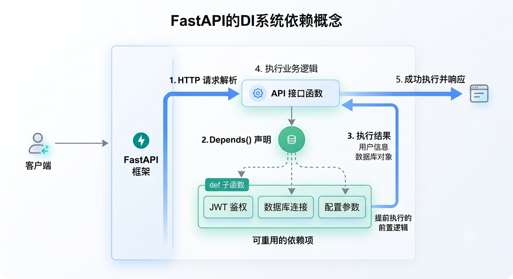

### 为什么需要依赖注入？

​	在**传统的开发**中，如果需要在 API 接口函数中使用数据库、JWT 鉴权认证、角色管理...等业务逻辑时，**通常会直接在 API 接口函数内部编写一套对应的业务逻辑代码**（比如 创建数据库连接、认证校验处理...），而这些代码基本上都是**重复性**的；

​	如果**为每个 API 接口函数都写一遍**这种重复性高的业务代码，会让整体代码呈现出**低内聚、高耦合**的结构，使得代码变得**难以复用**，并且**极其难以进行单元测试**。

​	简而言之，依赖注入系统**解决的核心问题**就是：**如何提升代码的复用率、实现 “高内聚、低耦合” 的业务代码结构**。

#### 核心优势

FastAPI 的依赖注入带来了如下优势：

- **代码复用**：**同一个 “依赖” **可以**被多个 API 接口函数〖共享复用〗**
- **解耦与共享**：**将业务逻辑与基础设施**（如数据库连接、安全与认证...）**分离**开来
- **极易测试**：在测试时，可以非常轻松地**用 Mock 对象替换掉真实的依赖**（比如用内存数据库代替生产数据库）
- **自动处理依赖树**：如果 FastAPI 检测到**「依赖A」依赖于「依赖B」**，FastAPI 会**先解析「依赖B」，再解析处理「依赖A」**

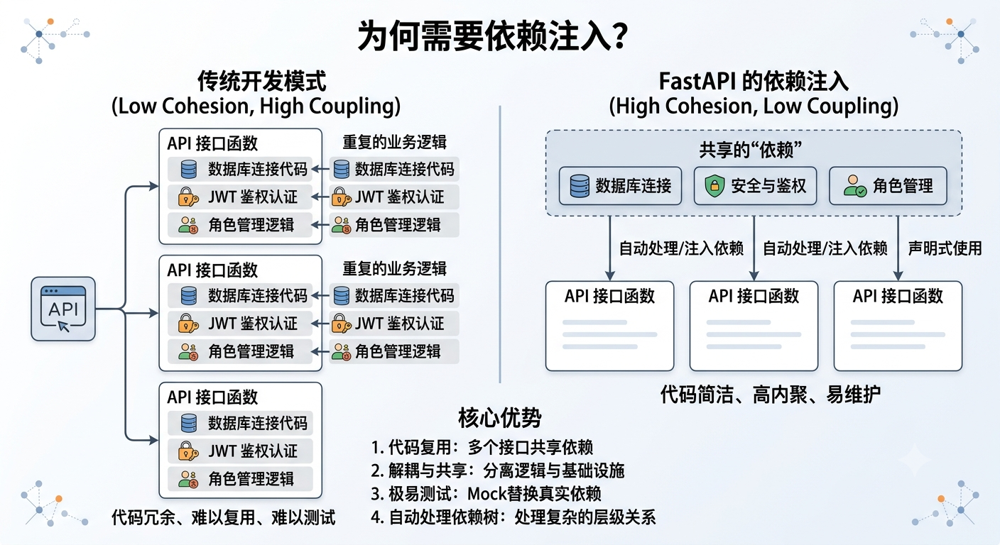

#### FastAPI 的兼容性

通过**依赖注入系统**，能使得 Fast API 的**兼容性**非常强大：

- 支持所有的 SQL 关系型数据库 和 NoSQL 非关系型数据库
- 直接引入外部第三方包 和 API
- API 使用监控系统
- 建立安全、认证授权系统 和 角色管理
- **响应数据注入系统（Response Data Injection System）**：通过依赖注入系统，**将API 接口函数返回的响应数据作进一步修改处理**
- ...

## 基本结构

要想使用 FastAPI 的依赖注入系统，需要 2 个**核心角色**参与：

- **依赖项**：通常是**一个 `def` 函数、可调用对象（类）、`def` + `yield` 生成器函数** 
- **`Depends()`** ：用于**为 API 接口函数注入 “依赖项” 的动作**

```python
from fastapi import FastAPI, Depends
from typing import Annotated

<FastAPI 应用实例> = FastAPI()

# 依赖项（def 函数 | 类 | yield 生成器函数）
async def <依赖项函数名>():
    # 业务逻辑...
    
    return <执行结果>

# API 接口函数
@<API 应用实例>.<HTTP 方法>('<URL 路径>')
async def <API 接口函数>(<形参变量（依赖项-执行结果）>: Annotated[<数据类型>, Depends(<依赖项函数名>)]):
    
    # 业务逻辑...
    
    return <响应数据>
```

​	核心定义：**“依赖项”** 通常是一个 **普通的 Python 函数** 或 **可调用对象（类）**，需**提前**在 API 接口函数**外部创建声明**，后续**通过 `Depends()` 手动按需注入它**。

### Depends() 核心组件

核心作用：用于**注入一个 `dependency`  “依赖项“，并解析执行它，会接收来自 ”依赖项“ 的返回结果**。

```python
Depends(
    dependency: ((...) -> Any) | None = None,
    *,
    use_cache: bool = True,
    scope: Literal['function', 'request'] | None = None
)
```

- **`dependency`：依赖项**；可以是**一个 `def` 函数、`class` 类（可调用对象）、`yield` 生成器函数**
- **`use_cache`**：当**同一个 “依赖项” 被重复使用**时，**是否将 `return` 的 <返回值> 进行「缓存」**，从而**让其他调用者使用「缓存值」**
- **`scope`**：定义 **“依赖项”** 中**清理工作代码**的**执行时机**
  - **`request`【默认】**：在**响应返回之后，退出 “依赖项”**（**清理 I/O 资源代码**）
  - **`function`**：在**响应返回之前**，**提前退出 “依赖项”**（**清理 I/O 资源代码**）

## 创建、声明注入依赖

在 FastAPI 中，“依赖项” 的创建有 3 种形式：

- **`def` 函数**
- **`class` 类**
- **`def` + `yield` 生成器函数**

以上 3 种创建的依赖项都可以**在 API 接口函数中被 `Depends()` 解析注入**，还可以**互相嵌套依赖，构建一个 “依赖树”**。

### def 函数-依赖项

核心定义：当将**一个 `def` 函数作为**一个**公共 “依赖项”**时，它可以是**一个 `def` 同步函数**，也可以是**一个 `async def` 异步协程函数**。

#### 输入输出形式

依赖项函数的**「输入输出结构」与 API 接口函数完全一致**，可以看做是一个**没有 `@app.xxx() 路由装饰器` 的 API 接口函数**。

- **输入**：

  ​	依赖项函数可以**定义与 API 接口函数完全一致的「形参列表」**，这意味着它也可以接收 `Path()、Query()、Body()、Form()、Cookie()...` 等类型的形参，**FastAPI 会解析并自动绑定**，甚至还可以**接收 `Depends()` 注入其他的 “子依赖项”**，以此构建一个 **“依赖树”（Dependency Tree）**。

- **输出**：

  ​	依赖项函数的 **`return` 返回结果**会**回传**给定义**它的上层调用者（API 接口函数 或 “依赖项”） **中的 **`形参变量` 来接收**并使用。

```javascript
[ GET /xxx 路由接口 ]														  [ GET /xxx 路由接口 ]
        │ 												         				   ▲
		|（Depends() 进入）															 │（return 结果）
        ▼																		    │
 ( 依赖项: A ) [解析绑定 Path()\Query()...]				        			   ( 依赖项: A )
        │ 																		    ▲ 
		|（Depends() 进入）															  |（return 结果）
        ▼																			 |
 ( 子依赖项: B ) [解析绑定 Path()\Query()...] -------- return 返回结果 ---------▶  ( 子依赖项: B )
```

#### 核心机制

​	当 FastAPI **接收**到一个指定 `/xxx` 路由的 **HTTP 请求**时，会**查找对应的 `@路由装饰器` 装饰的 API 接口函数**，并**检测它的「形参列表」**，当发现「形参列表」中存在**有 `Depends()` 注入了某个 ”依赖项A“** 时；

​	**会先进入 “依赖项A” 中执行**，并在 “依赖项A” 中**采取与 API 接口函数一样的形参检测措施**：若发现 **“依赖项A” 的「形参列表」**中**还通过 `Depends()` 依赖了其他的 “子依赖项B”**，则会**转头先进入 “子依赖项B” 中执行**，以此类推...

```ini
[ GET /xxx 路由接口 ] # FastAPI “串门” 进入
        │（Depends() 进入）		
        ▼
  ( 依赖项: A )
        │（Depends() 进入）		
        ▼
  ( 子依赖项: B )
```

​	当 FastAPI **在 “依赖项A” 或 “子依赖项B” 中执行**时，会**根据**其所定义的**「形参列表」结构**，将 HTTP 请求中的**请求头、请求参数模型依次解析赋值并自动绑定**（就像 API 接口函数一样），并**正式开始执行** “依赖项” 内的业务代码逻辑；

​	当 **“子依赖项B” 执行完毕**后，会**将 `return` 的执行结果〖按层级回传〗给它的上层调用者（“依赖项” 或 “API 接口函数”）**。

​	整个过程，本质上就是利用了**函数调用栈（CallStack）**的**执行过程**来完成构建 **”依赖树“ 的执行流** 与 **结果回传**。

> 执行过程：
>
> - **执行流（递）**：`API 接口` ──> `依赖项 A` ──> `子依赖项 B`
> - **数据流（归）**：`子依赖项 B` ──> `依赖项 A` ──> `API 接口`

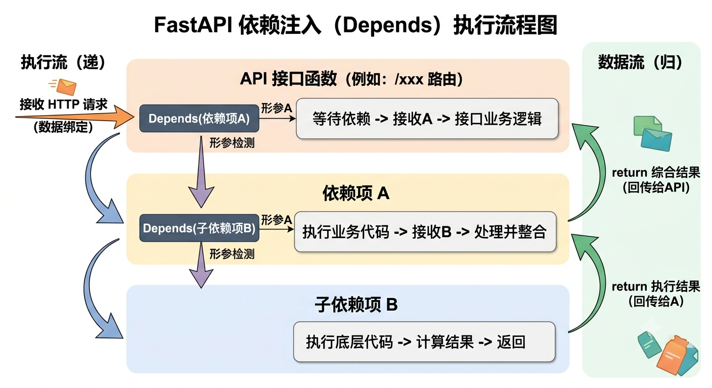

#### Depends() 注入语法

FastAPI 提供了 2 种写法：

- **`<形参变量（执行结果）> : <数据类型?> = Depends(<依赖项函数>)`**

  ```python
  from typing import Annotated
  from fastapi import Depends, FastAPI
  
  app = FastAPI()
  
  # 依赖项
  async def common_parameters(q: str | None = None, skip: int = 0, limit: int = 100):
      return {"q": q, "skip": skip, "limit": limit}
  
  @app.get("/items/")
  async def read_items(commons: dict = Depends(common_parameters)): # 无法复用
      return commons
  
  @app.get("/users/")
  async def read_users(commons: dict = Depends(common_parameters)): # 无法复用
      return commons
  ```

- **`<形参变量（执行结果）> : Annotated[<数据类型?>, Depends(<依赖项函数名>)]`**：

  ```python
  from typing import Annotated
  from fastapi import Depends, FastAPI
  
  app = FastAPI()
  
  # 依赖项
  async def common_parameters(q: str | None = None, skip: int = 0, limit: int = 100):
      return {"q": q, "skip": skip, "limit": limit}
  
  CommonsDep = Annotated[dict, Depends(common_parameters)] # 类型别名
  
  @app.get("/items/")
  async def read_items(commons: CommonsDep): # 复用
      return commons
  
  @app.get("/users/")
  async def read_users(commons: CommonsDep): # 复用
      return commons
  ```

#### 基础示例

```python
# 依赖注入系统
from typing import Annotated
from fastapi import FastAPI, Depends, HTTPException, Path
from pydantic import BaseModel


app = FastAPI()


class LoginModel(BaseModel):
    user_id: str
    username: str
    password: str


# 依赖项B（查询是否有该用户）
async def check_user_token(user_id: Annotated[int, Path()]):
    # 模拟数据库查询
    print('依赖项B-----收到参数：', user_id)
    return True  # 3. 结果返回给上层调用者（依赖项A）的 has_user 形参变量


# 依赖项A（查询数据库、并返回用户数据）
async def login_validator(
    # 2. 先进入 check_user_token 依赖项中执行，拿到 has_user 结果
    has_user: Annotated[bool, Depends(check_user_token)]
):
    print('依赖项A-----执行前置业务逻辑')
    if has_user:
        # 模拟数据库查询
        user: LoginModel = {
            'user_id': 1,
            'username': 'test',
            'password': '123456'
        }
    else:
        raise HTTPException(400, detail='用户不存在')
    return user  # 4. 结果返回给上层调用者（API 接口函数）的 user 形参变量


# 1/5. FastAPI 先进入 login_validator 依赖项中执行，拿到 user 结果
@app.get("/user/{user_id}")
async def read_item(
    user: LoginModel = Depends(login_validator)
):
    print('API 接口函数----所有依赖项执行完毕...，返回响应')
    return {"user": user}

'''
整体执行流程：

依赖项B-----收到的 Body 参数 1
依赖项A-----执行前置业务逻辑
API 接口函数----所有依赖项执行完毕...，返回响应
'''

# 启动应用
if __name__ == '__main__':
    import uvicorn

    uvicorn.run('server45:app', host="127.0.0.1", port=8000, reload=True)
```

### class 类-依赖项

#### 基本概念

核心定义：类作为依赖项，本质上是利用了 Python 的 **“可调用对象（Callable）”** 特性。

​	在 Python 中，只要**一个对象实现了 `__init__` 方法 或 `__call__` 方法（类）**，那么它就**能像函数一样**直接**作为依赖**被 **`Depends()` 注入到 API 接口函数中去解析执行**。

- 适用场景：希望 **“依赖项”** 具有**状态**或者**更复杂的结构**。

#### Depends() 注入语法

FastAPI 提供了 3 种写法：

- **`<形参变量>: <类> = Depends(<类>)`** 
- **`<形参变量>: <类> = Depends()`**
- **`<形参变量> = Depends(<类>)`**（✅️最常用）

也可以写 **`<形参变量> = Annotated[<类>, Depends(<类?>)]`**，效果是一样的，只不过 **`Annotated` 可以创建类型别名，进行复用**。

#### 基本用法

##### `__init__` 接收请求参数

​	核心机制：利用**类的构造函数 `__init__()` 来声明依赖参数**，FastAPI 会**自动扫描 `__init__()` 的形参列表**，并**从 HTTP 请求中提取对应的数据进行自动解析绑定**。

如果一个类**只有 `__init__` 方法**：

- 通常是**作为 “子依赖项” 注入到 “依赖项函数” 中使用**的：

  ```python
  from typing import Annotated
  from fastapi import FastAPI, Depends
  
  app = FastAPI()
  
  # 1. 定义一个类作为依赖项
  class CommonParams:
      # Depends() 会调用这个类的构造函数，并传入请求参数
      def __init__(self, page: int | None = None, size: int | None = None):
          self.page = page
          self.size = size
          
  # 放在依赖项函数中，会作为 “子依赖项” 被 FastAPI 自动解析为请求参数模型
  def get_data(common: Annotated[CommonParams, Depends()]):
      # 模拟数据库查询
      data = {
          "page": common.page,
          "size": common.size,
          "product_name": "apple",
          "product_id": 123,
          "product_price": 1899.99,
      }
  
      return data  # 返回数据给 API 接口函数
  
  
  # API 接口函数
  @app.get("/items2/")
  async def read_items2(data: Annotated[CommonParams, Depends(get_data)]):
      return data # 返回响应给客户端
  
      '''
      返回的响应数据:
      {
          "page": 1,
          "size": 10,
          "product_name": "apple",
          "product_id": 123,
          "product_price": 1899.99
      }
      '''
  ```

- 如果是**直接放在 API 接口函数中**，则是**作为一个 “请求参数模型”** 被 **FastAPI 从 HTTP 请求中提取对应的数据进行自动解析绑定**

  *类 替代了 Pydantic 模型*

  ```python
  from typing import Annotated
  from fastapi import FastAPI, Depends
  
  app = FastAPI()
  
  # 1. 定义一个类作为依赖项
  class CommonParams:
      # Depends() 会调用这个类的构造函数，并传入请求参数
      def __init__(self, page: int | None = None, size: int | None = None):
          self.page = page
          self.size = size
  
  
  # 放在 API 接口函数中，作为请求参数模型，FastAPI 会自动解析请求参数并注入到函数中
  @app.get("/items")
  async def read_items(common: Annotated[CommonParams, Depends()]):
      return {"page": common.page, "size": common.size}
  ```

##### `__call__` 复用业务逻辑

核心定义：

​	当**使用一个 类 作为 “依赖项”** 时，**仅靠 `__init__` 方法**是**无意义**的，因为**这样它只是一个数据模型校验器**。

​	而使用 类 作为 “依赖项”，最重要的是因为**类可以携带状态、可以继承、还可以通过参数化进行动态复用**，主要是通过**重写它的 `__call__` 方法来实现**。

###### 基本语法

```python
from fastapi import FastAPI, Depends
from typing import Annotated

<FastAPI 应用实例> = FastAPI()

# 依赖项（类）
class <类名>:
    # 可给外部复用
    def __init__(self, <外部传入的依赖参数...>):
        # ...
        # 自定义参数绑定逻辑...
       
    def __call__(self, <形参变量>: <数据类型> = Path()\Query()\Body(),...): # 相当于一个 API 接口函数
        # 业务逻辑...
        
        return <执行结果> # 执行结果返回给上层调用者（API 接口函数 | 父依赖项）的 形参变量 接收使用

# API 接口函数
@<API 应用实例>.<HTTP 方法>('<URL 路径>')
async def <API 接口函数>(<形参变量（依赖项-执行结果）>: Annotated[<数据类型>, Depends(<依赖项类名>)]):
    
    # 业务逻辑...
    
    return <响应数据>
```

###### 核心原理

​	**FastAPI 会把 `__call__` 方法完全当做是一个普通的 API 接口函数 或 “函数依赖项” 去看待**。

​	当**使用 `Depends()` 传入一个实现了 `__call__` 方法的实例对象**后，**FastAPI 会通过 Python 的反射机制（`inspect` 模块）去检测这个 `__call__` 方法的「形参列表」**。

​	此时，**`__call__` 方法相当于一个 “请求参数模型”**，它定义的「形参列表」会被 **FastAPI 从 HTTP 请求中提取对应的请求参数数据（Path()、Query()、Body()...）进行自动解析绑定**。

###### 核心机制

当一个类**显式重写了 `__call__` 方法**后，它就**可以像函数一样在任意位置调用并执行**：

- `__init__` 负责**“依赖项类” 实例化时的配置参数（外部传入，用于逻辑复用）**
- `__call__` 负责**HTTP 请求到达时的动态参数绑定（从 HTTP 请求中提取，业务逻辑复用）**

以此实现一个**可到处复用、可建立不同复杂业务功能**的 **"类依赖项"**。

###### 基础示例

```python
# 依赖注入系统
from typing import Annotated
from fastapi import FastAPI, Depends, HTTPException, Query, status


app = FastAPI()


# 定义一个类依赖项（角色校验器）
class RoleChecker:

    # 用于接收外部传入的依赖参数，并封装在类实例中，给 __call__ 方法使用
    def __init__(self, alloed_role: list[str]):
        self.alloed_role = alloed_role

    # 当使用 Depends(RoleChcker) 时，会自动调用 __call__ 方法，并看做是一个 API 接口函数，可定义请求参数模型（Paht()、Query()、Body()...），FastAPI 会自动从 HTTP 请求中提取对应的请求参数数据进行解析绑定注入
    def __call__(
        self,
        user_id: Annotated[str, Query(..., description='用户ID')],
    ):

        # 业务逻辑：当被 Depends() 调用时，会执行这里的逻辑
        user_role = 'admin' if user_id == '1' else 'manager'  # 模拟从数据库中获取用户角色

        if user_role not in self.alloed_role:
            raise HTTPException(
                status_code=status.HTTP_403_FORBIDDEN,
                detail='您没有权限访问该接口'
            )

        # 返回值会作为 Depends() 的返回值，回传并注入到对应的 API 接口函数中的形参变量
        return user_role


# 动态创建依赖项实例（复用）
allow_admin = RoleChecker(['admin'])
allow_manager_or_admin = RoleChecker(['admin', 'manager'])


# API 接口函数
# 仅 admin 超级管理员 能访问
@app.get('/admin/dashboard')
async def admin_dashboard(role: str = Depends(allow_admin)):
    print(role)  # admin
    return {"message": f"欢迎管理员 {role}!"}


# 管理员 manager 和 admin 超级管理员 都能访问
@app.get('/manager/dashboard')
async def manager_dashboard(role: str = Depends(allow_manager_or_admin)):
    print(role)  # manager 或者 admin
    return {"message": f"管理平台：-- {role}!"}


# 启动应用
if __name__ == '__main__':
    import uvicorn

    uvicorn.run('server47:app', host="127.0.0.1", port=8000, reload=True)
```

###### 与 “函数依赖项” 的对比

| **特性**     | **函数依赖项**                                        | **类依赖项**                                                 |
| ------------ | ----------------------------------------------------- | ------------------------------------------------------------ |
| **代码组织** | 适合零散、单一逻辑的封装（如纯数据解析、简单获取 DB） | 适合内聚、复杂的业务逻辑（如带配置的认证、多级权限检查）     |
| **代码复用** | 通过定义不同的函数来复用                              | 通过**类的继承**或**构造函数传参（参数化）**来实现更高级的复用 |
| **状态保持** | 无法保持状态（每次执行都是独立的函数调用）            | 可以通过实例变量（`self.xxx`）在类的不同方法间共享数据       |

​	使用类作为依赖项，让 FastAPI 的代码不仅具备了函数式的轻量，还完美继承了面向对象（OOP）的扩展性。在构建大型企业级 API 架构时，这是不可或缺的利器。

### yield 生成器-依赖项

#### 核心定义

在 FastAPI 中，使用 **`yield` 生成器函数 作为一个 “依赖项”** 是最常用的模式，它也被称为 **“子生成器（Sub-generator）依赖项”**

- 在 **”生成器依赖项“** 中，需**使用 `yield` 代替 `return`** 将 **<执行结果 | 某个值> 抛出回传给 API 接口函数中的 `形参变量` 接收并使用**

> [!NOTE]
>
> **与 `return` 的区别**：
>
> - **普通的 `def` 依赖项函数**：
>
>   ​    在 **`return` 将「执行结果」回传给上层调用者（“依赖项” | API 接口函数）的 `形参变量` 之后**，会**立即**被**弹栈销毁**。
>
> - **`yield` 生成器依赖项函数**：
>
>   ​    在 **`yield` 将执行结果回传给上层调用者（“依赖项” | API 接口函数）的 `形参变量` 之后**，会**挂起当前函数栈帧（Stack Frame）**，并**原地暂停等待**，**直到 API 接口函数执行完毕**，线程**又会回到 `yield` 暂停处恢复执行后续的代码语句**（通常是关闭资源引用），最后**I/O 资源清理完毕、返回响应**给客户端。
>
> | **特性**     | **使用 return 的依赖项**                 | **使用 yield 的依赖项**                                  |
> | ------------ | ---------------------------------------- | -------------------------------------------------------- |
> | **生命周期** | **`return` 注入资源后立即结束**          | **贯穿整个 HTTP 请求的生命周期**                         |
> | **收尾操作** | **无法**在依赖项内部直接**编写收尾代码** | 可以**完美支持收尾、清理、关闭操作**                     |
> | **控制流**   | **单向流动（依赖项 -> API 路由）**       | **双向流动（依赖项 -> 暂停 -> API 路由 -> 恢复依赖项）** |
> | **适用场景** | 权限校验、解析 Token、获取配置           | 数据库连接、文件句柄、网络套接字、性能计时               |

#### 核心机制

核心定义：**以 `yield` 关键字作为划分边界**，划分为 3 部分执行流程：

- **`yield` 之前**的代码：**收到 HTTP 请求后的前置准备（初始化创建资源）**
- **`yield` 返回的值**：**抛出并回传给「API 接口函数」的资源值**
- **`yield` 之后**的代码：**「API 接口函数」执行完毕**（成功 | 抛出异常）之后，**回来运行特定的清理/收尾代码（销毁资源）、返回响应**

整个过程可以使用 **`try-finally` 异常处理代码块** 或 **`with` 上下文管理器** 来管理，确保**资源安全**。

核心用处：在拥有**贯穿 HTTP 请求生命周期**的能力之上，**管理 I/O 资源的生命周期（创建 → 传递 → 释放）**。

```python
from fastapi import FastAPI, Depends

<FastAPI 应用实例> = FastAPI()

# 依赖项
asycn def <依赖项函数名>():
    # 1. ===【阶段一、HTTP 请求到达时执行】===
    # 初始化创建资源...
    try:
        yield <返回值> # 1.1 将获取到的 I/O 资源回传给 API 接口函数 或 “依赖项” 的 形参变量接收
        # 1.2 线程在此处暂停陷入阻塞态，等待 API 接口函数 执行结束后，线程回来此处恢复后续执行
    finally:
        # 3. ===【阶段三、开始执行善后工作】
        # 关闭资源引用...
        # 返回响应给客户端
	
    # async with <I/O 资源> as xxx:
    # 	yield <返回值>
    # 离开 with 代码块会自动关闭资源引用
        
        
# API 接口函数
@<FastAPI 应用实例>.<HTTP 方法>('<URL 路径>')
async def <API 接口函数>(<形参变量（yield 返回值）>: <数据类型> = Depends(<依赖项函数名>)):
    # 2. ===【阶段二、开始执行核心业务逻辑】===
    
    return <响应数据>
```

⚠️注意点：**只能有一个 `yield`！**

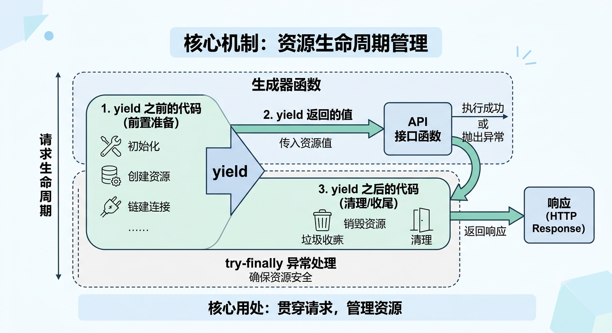

##### 基本示例

```python
from fastapi import FastAPI, Depends

app = FastAPI()


# 依赖项
async def get_IO():
    """
    异步函数，用于获取和管理I/O资源
    使用生成器模式返回资源，并在完成后进行清理
    """
    print('--- HTTP 请求开始 ---')
    print('1. "依赖项"-开始执行 > start --- 初始化创建 I/O 资源')

    try:
        print('1.1   I/O 资源创建完毕，yield 抛出并返回一个值')
        print('1.2   线程进入暂停状态等待....')

        yield '[data]'  # 通过 yield 返回一个值给调用者

        # API 接口函数执行完毕后（或抛出异常），线程回到这里继续执行
        print('3. 线程回到 "依赖项"的 yield 暂停处 > 恢复继续执行....')

    finally:
        # 确保资源被正确清理
        print('3.1   开始清理 I/O 资源....')
        print('3.2   I/O 资源清理完毕、返回响应')
        print('3.3   "依赖项"-结束执行 > end')
        print('--- HTTP 请求结束 ---')


# API 接口函数
@app.get('/')
async def read_root(result: str = Depends(get_IO)):
    print('2. API 接口函数开始执行 > start --- 收到 "依赖项" yield 返回值:', result)
    # ...执行业务逻辑...
    print('2.1   API 接口函数执行结束 > end')
    return 'ok'

'''
执行流程：

--- HTTP 请求开始 ---

1. "依赖项"-开始执行 > start --- 初始化创建 I/O 资源
1.1   I/O 资源创建完毕，yield 抛出并返回一个值
1.2   线程进入暂停状态等待....

2. API 接口函数开始执行 > start --- 收到 "依赖项" yield 返回值: [data]
2.1   API 接口函数执行结束 > end

3. 线程回到 "依赖项"的 yield 暂停处 > 恢复继续执行....
3.1   开始清理 I/O 资源....
3.2   I/O 资源清理完毕、返回响应
3.3   "依赖项"-结束执行 > end

--- HTTP 请求结束 ---
'''
```

##### 执行过程详解

`yield` 生成器函数运行的整个**生命周期**分为 5 部分执行：

1. **HTTP 请求进入**：

   ​	当 FastAPI 接收到一个指定 `/xxx` 路由的 HTTP 请求后，会先**检测**上层调用者（“依赖项” | API 接口函数）的**「形参列表」**，并**进入 `Depends(<yield 生成器函数依赖项>)` 中执行**。

   ****

2. **进入 "`yield` 生成器函数依赖项" 中执行 `yield` 之前的代码**：

   ​	通常用于**初始化一些 IO 资源**（例如：打开数据库连接、启动会话、获取文件句柄...）

   ****

3. **`yield` 产生值抛出、线程暂停挂起、原地等待**：

   ​	线程**遇到 `yield <返回值>`** 代码时，会**将 `yield` 后面的值 `<返回值>` 抛出**并**回传**给**上层调用者（“依赖项” | API 接口函数）**中的 **`形参变量` 接收**；

   此时，线程会：

   - **暂停并冻结** `yield` 当前行后续的代码语句执行
   - **挂起**所在的**函数栈帧（Stack Frame）**
   - **原地等待**上层调用者（“依赖项” | API 接口函数）**执行完毕（或抛出异常）**

   ****

4. **上层调用者（“依赖项” | API 接口函数）收到返回值、开始执行**：

   ​	当**上层调用者（“依赖项” | API 接口函数）的 `形参变量` 接收到 `yield` 产生的 `<返回值>`** 之后，**开始处理业务逻辑**。

   ***

5. **上层调用者（“依赖项” | API 接口函数）执行结束（或抛出异常）**

6. **线程回到 `yield` 暂停处、开始清理工作、返回响应、HTTP 请求生命周期结束**：

   当 **上层调用者（“依赖项” | API 接口函数）执行完毕（或抛出异常）**之后，线程会：

   - 回到 `yield` 生成器函数依赖项 中，**恢复 `yield` 生成器函数栈帧（Stack Frame）**
   - **从 `yiled` 暂停处恢复执行**
   - 开始**执行最后的 I/O 资源清理工作**（例如：关闭数据库连接、释放锁、关闭文件）
   - **I/O 资源清理完毕、返回「响应」给客户端**

   ****

   至此**整个 HTTP 请求生命周期**才算**真正结束**。

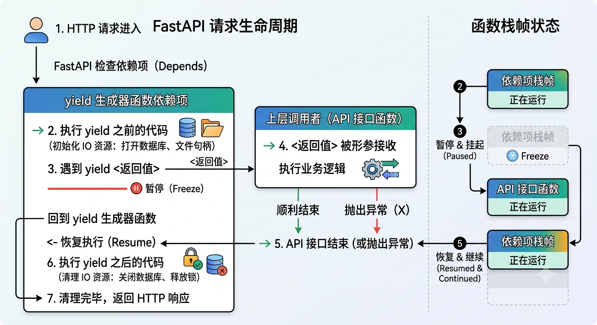

###### 简单理解

​	当 FastAPI 执行到 `yield` 关键字时，会**将 `yield` 后面的值抛出回传**给上层调用者（“依赖项” | API 接口函数）中；此时，“依赖项函数” 会先**暂停**执行，持续**原地等待**上层调用者（“依赖项” | API 接口函数）执行完毕，线程再回来**恢复继续执行** `yield` 后续的代码语句，完成一些**关闭资源的清理工作**，至此整个 HTTP 请求生命周期才算真正**结束**。

本质上就是利用 Python 的**生成器协议（Generator Protocol）**实现了**类似 `with` 关键字**的 **上下文管理器（Context Manager）**，完美契合了 Web 开发中“请求开始建连接，请求结束断连接”的黄金法则。

#### 典型应用场景和示例

- **数据流会话管理**：

  这是 `yield` 最主流的用法。确保**每个请求都有独立的数据库连接，并在请求结束后自动关闭，防止连接泄漏**。

  ```python
  from fastapi import FastAPI, Depends
  from sqlalchemy import create_engine, String
  from sqlalchemy.orm import DeclarativeBase, Mapped, Session, mapped_column, sessionmaker
  
  
  # ----- 数据库设置 -----
  # 1. 创建引擎（SQLite 内存数据库，echo=True 会打印生成的 SQL 语句）
  engine = create_engine("sqlite:///:memory:", echo=True)
  
  # 2. 创建 Session 会话工厂
  SessionLocal = sessionmaker(autocommit=False, autoflush=False, bind=engine)
  
  
  # 3. 创建模型基类
  class Base(DeclarativeBase):
      pass
  
  
  # 4. 创建模型类
  class User(Base):
      __tablename__ = "users"
  
      id: Mapped[int] = mapped_column(primary_key=True)
      name: Mapped[str] = mapped_column(String(50))
      fullname: Mapped[str] = mapped_column(String(50))
  
  
  # 创建表
  Base.metadata.create_all(bind=engine)
  
  
  # 使用 context manager (with) 自动管理 Session 的关闭与提交
  with SessionLocal() as session:
      with session.begin():  # 自动处理 commit / rollback
          user1 = User(name="spongebob", fullname="Spongebob Squarepants")
          user2 = User(name="sandy", fullname="Sandy Cheeks")
  
          # 添加到会话
          session.add_all([user1, user2])
  
  # 离开 with 块后，数据已自动提交到数据库
  
  
  # ---- FastAPI 应用 ----
  app = FastAPI()
  
  
  # 依赖注入
  async def get_db():
      db = SessionLocal()
      try:
          print("-> 1. 数据库连接已建立")
          yield db  # 2. 将 db 会话传递给 API 路由
      finally:
          print("-> 3. 数据库连接已关闭（清理阶段）")
          db.close()  # 无论 API 路由执行成功还是报错，都会执行这里
  
  
  # API 接口函数
  @app.get('/items/{item_id}')
  async def get_item(item_id: int, db: Session = Depends(get_db)):
      print("-> 2. 数据库连接已传递给 API 路由")
  
      # 查询数据库
      item = db.query(User).filter(User.id == item_id).first()
  
      return {"item": item}
  
      '''
      返回响应：
  
      {
      "item": {
          "name": "spongebob",
          "id": 1,
          "fullname": "Spongebob Squarepants"
      }
      }
      '''
  ```

- **外部服务的客户端连接**：

  类似 **Redis 客户端、网关连接或异步的 HTTP 客户端**（如 `httpx.AsyncClient`）。

  ```python
  from fastapi import FastAPI, Depends, HTTPException, Header
  import httpx
  
  app = FastAPI()
  
  
  # 依赖项
  async def get_http_client(x_token: str = Header(None)):
      async with httpx.AsyncClient() as client:
          print('-> 开启 HTTP 客户端会话')
          yield client # 抛出获取到的 client 会话对象
          print('-> 关闭 HTTP 客户端会话')
  
  
  # API 接口函数
  @app.get("/test")
  async def test(client: httpx.AsyncClient = Depends(get_http_client)):
      response = await client.get('http://httpbin.org/headers')
      return response
  
  
  # 启动应用
  if __name__ == '__main__':
      import uvicorn
  
      uvicorn.run('server58:app', host="127.0.0.1", port=8000, reload=True)
  ```

#### 异常处理

​	核心定义：在**上层调用者（“依赖项” | API 接口函数）中抛出的任何异常**，都**会在 `yield` 所在的位置被重新抛出**，需要**添加 `try-except` 来处理重新抛出它**。

##### 核心机制

​	FastAPI 在**捕获到 API 接口函数 中抛出的异常后**，会**顺着 `yield` 生成器挂起的地方**，**主动把异常“推（Throw）”回给 `yield` 语句**，从而让**异常**随着**冒泡机制向上传递到 `yield` 所在的位置（依赖项函数）**。

​	所以**可以在 `yield` 处添加 `try-except-finally` 异常处理代码块**，当 **FastAPI 框架把异常驱动回 `yield` 处**时，Python 的生成器机制会**强制恢复该  `yield ` 生成器函数的执行**，以**及时释放和清理资源的引用**，**保证线程与内存安全**。

```python
def <依赖项函数>():
    # ⚠️ 不要尝试在这里前置添加 try-except 代码块，否则会发生一些不可预料的意外！
    try:
        yield <返回值> 
        # 1. 挂起，如果 API 接口函数 报错，异常会被 FastAPI 强制注入到此处，并唤醒 yield 生成器函数进行处理
    except <异常类> as e:
        # 2. 捕获到 API 接口函数中未处理的异常
        raise e # ⚠️ 必须重新抛出！！
        # raise HTTPException() 也是可以的
    finally:
        # 3. 无论 HTTP 请求是正常结束还是报错，这里绝对会执行
        # 释放资源引用...
```

###### 基本示例

```python
from fastapi import FastAPI, Depends

app = FastAPI()


# 依赖项
async def yield_depend():
    try:
        yield '[data]'
    except ZeroDivisionError as e:
        # 可以捕获到 API 接口函数未处理而抛出的异常，用于记录日志或回滚
        print("API 报错了，但我可以先记录日志或做回滚")
        raise e  # 抛出异常给 顶层全局异常处理器 处理；如果不添加这行，则异常会挂起，导致接口函数挂起
        # raise HTTPException() 也是可以的
    finally:
        print('关闭资源引用')


# API 接口函数
@app.get("/test")
async def test(data: str = Depends(yield_depend)):

    a = 10 / 0
    # 此处会抛出一个 ZeroDivisionError 异常，若不处理，则会强制抛给 yield_depend 依赖项中的 yield 挂起位置处

    return data
```

##### 注意点

- 不要过早拦截，因为**只有被 `try-except` 包裹住 `yield` 那一行的 `try` 块才能生效**！

- 当 **API 接口函数抛出异常**时，**不要在 `except` 代码块中去处理它**，而是**通过 `raise` 将异常重新抛给 FastAPI 顶层处理**。

  在此期间，**可以做一些额外处理（错误日志记录、事物回滚...）**

  - **忘记了添加 `raise e`**：

    ​	FastAPI 会**误认为异常已经在 `yield` 生成器函数被处理**了，客户端会像预期那样看到一个 `HTTP 500 Internal Server Error` 响应，由于没有抛出 `HTTPException` 或类似异常，服务器将**没有任何日志**或其他关于错误是什么的提示。

  - **添加了 `raise e`** 之后：

    ​         现在客户端仍会得到同样的 `HTTP 500 Internal Server Error` 响应，但**服务器日志中会有自定义的 `InternalError` 报错信息**。

```python
from typing import Annotated

from fastapi import Depends, FastAPI, HTTPException

app = FastAPI()


data = {
    "plumbus": {"description": "Freshly pickled plumbus", "owner": "Morty"},
    "portal-gun": {"description": "Gun to create portals", "owner": "Rick"},
}


class OwnerError(Exception):
    pass


def get_username():
    try:
        yield "Rick"
    except OwnerError as e:
        # 主动重新抛出未处理的异常，客户端还会收到 500 异常，但是服务器日志会有相关的异常信息记录下来
        raise HTTPException(status_code=400, detail=f"Owner error: {e}")


@app.get("/items/{item_id}")
def get_item(item_id: str, username: Annotated[str, Depends(get_username)]):
    if item_id not in data:
        raise HTTPException(status_code=404, detail="Item not found")
    item = data[item_id]
    if item["owner"] != username:
        raise OwnerError(username)
    return item
```

#### 子依赖项

FastAPI 支持依赖项的链式嵌套，如果存在**多个嵌套依赖项都使用了 `yield`**，则会按照 **后进先出 的 “栈” 式顺序**来**执行与清理/退出**。

##### 核心流程

假设：**API 接口函数 >（依赖）`Dep_A` > （依赖）> `Dep_B`（依赖）`Dep_C`**：

- **进入执行：`Dep_C` > `Dep_B` > `Dep_A` > API 接口函数 执行**
- **退出：`Dep_A` < `Dep_B` < `DepC`**

> 核心要点：**最底层（`Dep_C`）先执行、最顶层（`Dep_A`）先退出**。

**💡 核心记忆点**

- **进入时（Yield 之前）：** **越是被底层依赖的组件**（如 `Dep_C` 的数据库连接），越需要**最先启动**，否则上层没办法用

- **退出时（Yield 之后）：** **越是上层的组件**（如 `Dep_A`），越**最先关闭**。

  ​	这样能确保 `Dep_C` 在关闭时，所有依赖它的上层组件已经安全退出，绝不会出现“底座拆了，上面还在运行” circulation 报错

```css
======================= 💡 请求进入（Yield 之前）=======================
   
   【 📥 从底层往上层逐层“建立” 】
   
    ┌──────────────────────────────────┐
    │ 1. 依赖项 C (最底层: 如数据库)   │ ---> 启动 C 资源
    └─────────────────┬────────────────┘
                      │ 传递 data_c
                      ▼
    ┌──────────────────────────────────┐
    │ 2. 依赖项 B                      │ ---> 收到 C，启动 B 资源
    └─────────────────┬────────────────┘
                      │ 传递 data_B
                      ▼
    ┌──────────────────────────────────┐
    │ 3. 依赖项 A (最顶层)             │ ---> 收到 B，启动 A 资源
    └─────────────────┬────────────────┘
                      │ 传递 data_A
                      ▼
    ┌──────────────────────────────────┐
    │ 4. 🚀 API 接口函数               │ ---> 业务逻辑执行，并返回响应
    └─────────────────┬────────────────┘
                      │
======================= 📝 响应返回（Yield 之后）=======================
                      │
                      ▼
   【 📤 从上层底座往底层逐层“释放” 】
   
    ┌──────────────────────────────────┐
    │ 5. 依赖项 A (最顶层)             │ ---> ❌ 关闭 A 资源 (最先安全退出)
    └─────────────────┬────────────────┘
                      │
                      ▼
    ┌──────────────────────────────────┐
    │ 6. 依赖项 B                      │ ---> ❌ 关闭 B 资源
    └─────────────────┬────────────────┘
                      │
                      ▼
    ┌──────────────────────────────────┐
    │ 7. 依赖项 C (最底层: 如数据库)   │ ---> ❌ 关闭 C 资源 (最后安心拆底座)
    └──────────────────────────────────┘
```

##### 示例

```python
from fastapi import FastAPI, Depends

app = FastAPI()


# 依赖项C（最底层）
async def yield_depend_c():
    print('依赖项 C --- 开始执行...')
    try:
        yield '[data_c]'
    finally:
        print('关闭 C 资源引用')


# 依赖项B —> 依赖 yield_depend_c
async def yield_depend_b(c: str = Depends(yield_depend_c)):
    print('依赖项 B --- 开始执行... 收到依赖项 C 的数据：', c)
    try:
        yield '[data_B]'
    finally:
        print('关闭 B 资源引用')


# 依赖项A —> 依赖 yield_depend_b
async def yield_depend_a(b: str = Depends(yield_depend_b)):
    print('依赖项 A --- 开始执行... 收到依赖项 B 的数据：', b)
    try:
        yield '[data_A]'
    finally:
        print('关闭 A 资源引用')


# API 接口函数
@app.get("/test")
async def test(a: str = Depends(yield_depend_a)):
    print('API 接口函数 --- 开始执行... 收到依赖项 A 的数据：', a)
    return a

'''
执行流程：

# 进入执行
依赖项 C --- 开始执行...
依赖项 B --- 开始执行... 收到依赖项 C 的数据： [data_c]
依赖项 A --- 开始执行... 收到依赖项 B 的数据： [data_B]
API 接口函数 --- 开始执行... 收到依赖项 A 的数据： [data_A]

# 退出
关闭 A 资源引用
关闭 B 资源引用
关闭 C 资源引用

'''
```

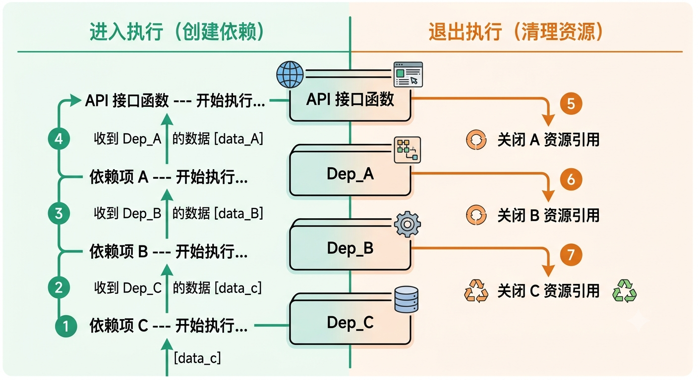

#### Depends() 的 `scope` 参数

正常情况下，FastAPI 规定 “`yield` 依赖项" 内的 `finally` 清理代码会在，API 接口函数 执行完毕、返回响应后 执行。

可以通过 `Depends(scope="function")`  来修改。

- **`scope='request'`【默认】**：API 接口函数先返回响应，**返回响应后，`finally` 开始清理关闭 I/O 资源**

  ```python
  from fastapi import FastAPI, Depends
  
  app = FastAPI()
  
  # 依赖项
  async def yield_depend():
      try:
          yield '[data_A]'
      finally:
          # 2. 返回响应后，清理 I/O 资源
  
  
  # API 接口函数
  @app.get("/test")
  async def test(a: str = Depends(yield_depend, scope='request')):
      return <响应数据> # 1. 先执行，返回响应
  ```

- **`scope='function'`**：`finally` 清理资源代码块**提前执行**，在**清理关闭资源后，API 接口函数随后返回响应**

  ```python
  from fastapi import FastAPI, Depends
  
  app = FastAPI()
  
  # 依赖项
  async def yield_depend():
      try:
          yield '[data_A]'
      finally:
          # 1. 先提前清理 I/O 资源
  
  
  # API 接口函数
  @app.get("/test")
  async def test(a: str = Depends(yield_depend, scope='function')):
      return <响应数据> # 2. 清理 I/O 资源后，再返回响应
  ```

### 依赖树（多层依赖）

​	核心定义：**依赖树（Dependency Tree）**指的就是**一个 “依赖项” 又注入了 其他的一个或多个 “子依赖项”**，以此类推...，**递归构建**了一整个 **“依赖树”**。

- **嵌套依赖**：依赖函数本身也可以依赖另一个依赖函数
- **路由组依赖**：你可以把依赖应用到整个 `APIRouter` 上
- **全局依赖**：在初始化 FastAPI 时直接全局注入（例如：全站强制校验某个 Header）

#### 执行逻辑

当**一个 HTTP 请求进来**时：

- **进入执行**：

    FastAPI **通过 `Depends()` 进入 “全局依赖项”  或 “API 接口函数的 依赖项”  内执行**时，检测到它们的**「形参列表」中又通过 `Depends()` 注入了其他 “子依赖项”**，则**会转头进入 `Depends(“子依赖项”)` 中执行**，以此类推...

- **结果回传**：

    当**最底层的 “子依赖项” 执行完毕**后，FastAPI 会**根据「函数调用栈（CallStack）」的执行流，将 `return` 返回结果〖回传〗给上层调用者的 `形参变量` 接收**，以此类推....**逐层回传，直到到达 API 接口函数**。

整个过程类似于 **递归机制**。

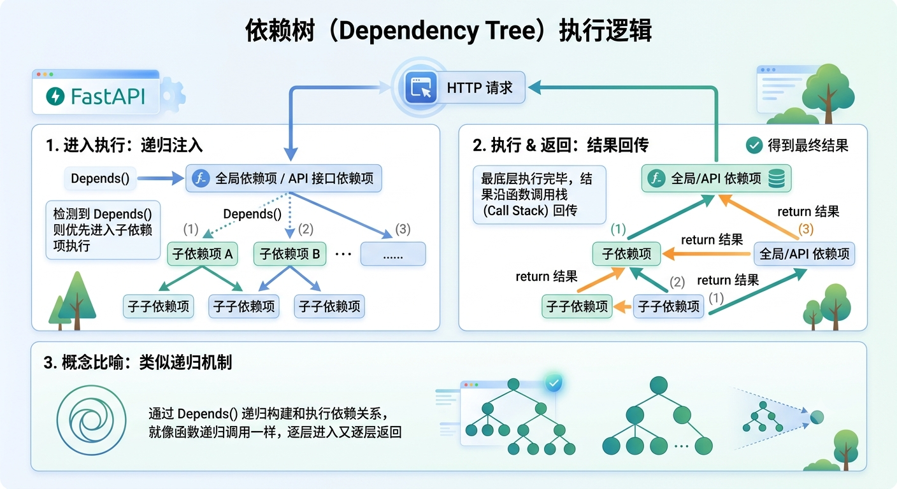

##### 示例

```python
from fastapi import FastAPI, Depends


app = FastAPI()


# 子依赖项C
async def dependency_c():
    print('子依赖项C--执行...')

    return 'dependency_C_result'  # ⬇️ 4. 执行结果回传给 上层依赖项 dependency_b 的 c 形参变量


# 子依赖项B
async def dependency_b(c: str = Depends(dependency_c)):  # ⬆️ 3.进入 dependency_c 子依赖项中执行
    print('子依赖项B--执行...', '---', '收到 子依赖项C 的执行结果：', c)

    return 'dependency_B_result'  # ⬇️ 5. 执行结果回传给 上层依赖项 dependency_a 的 b 形参变量


# 依赖项A
async def dependency_a(b: str = Depends(dependency_b)):  # ⬆️ 2.进入 dependency_b 子依赖项中执行
    print('子依赖项A--执行...', '---', '收到 子依赖项B 的执行结果：', b)

    return 'dependency_A_result'  # ⬇️ 6. 执行结果回传给 test API 接口函数的 a 形参变量


# API 接口函数
@app.get("/test")
async def test(a: str = Depends(dependency_a)):  # ⬆️ 1. 进入 dependency_a 依赖项中执行
    # 7. 全部 Depends() 依赖项执行完毕，API 接口函数开始执行
    print('API 接口函数--执行...', '---', '收到 依赖项A 的执行结果：', a)

    return 'ok'

'''
执行流程：

子依赖项C--执行...
子依赖项B--执行... --- 收到 子依赖项C 的执行结果： dependency_C_result
子依赖项A--执行... --- 收到 子依赖项B 的执行结果： dependency_B_result
API 接口函数--执行... --- 收到 依赖项A 的执行结果： dependency_A_result
'''
```

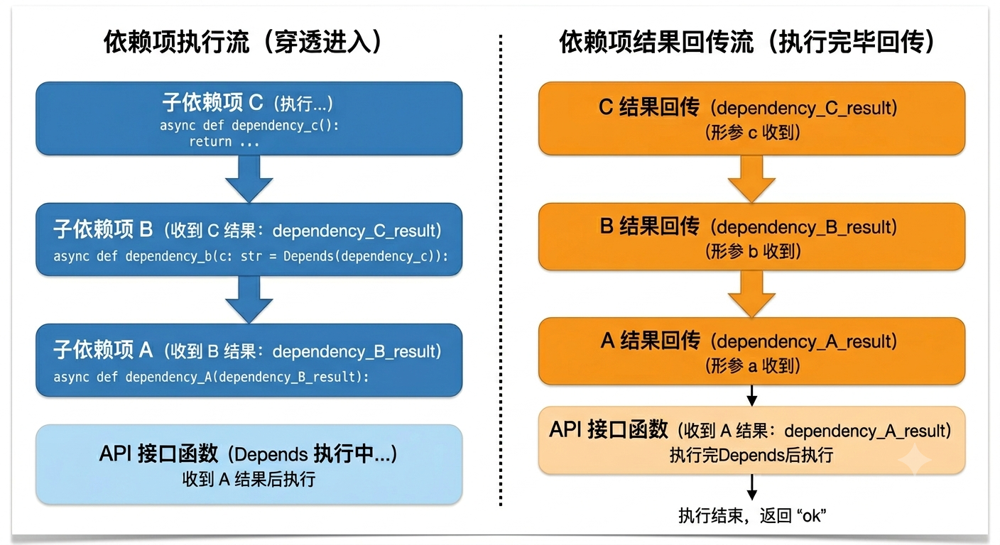

#### 多次使用同一个依赖项

​	核心定义：如果 **多个 “依赖项” 或 API 接口函数 共用了 同一个 “子依赖项”**，则 FastAPI **只会执行一次 “子依赖项”**，并**把 “子依赖项” 的返回值进行「缓存」**，之后会把它**传递给所有需要该返回值的 “依赖项”**。

如果**不想使用「缓存」值**，而是**为需要在同一请求的每一步操作（多次）中都实际调用依赖项**，可以**把 `Depends` 的参数 `use_cache` 的值设置为 `False`**：

##### Depends() 的 `use_cache` 参数（缓存值）

- **`Depends(<共用依赖项>, use_cache=True)`**：**使用「缓存」值**

    **”子依赖项“ 的返回值会被「缓存」起来**，**其他 “依赖项” 或 API 接口函数 获取**到的都是**基于上次修改的旧值**。

  ```python
  				  [ API 接口请求 ]
                       /        \
                      /          \
              [依赖项 A]        [依赖项 B]
                 |                  |
              (首次调用)         (发现缓存)
                 v                  v
           ▶ [子依赖项 C] ◀════════════╝
             (真正执行1次)
  ```

- **`Depends(<共用依赖项>, use_cache=False)`**：**不使用「缓存」值**

    **”子依赖项“ 的返回值不会被「缓存」起来**，**其他 “依赖项” 或 API 接口函数 获取**到的都是**新值**。

  ```
  				  [ API 接口请求 ]
                       /        \
                      /          \
              [依赖项 A]        [依赖项 B (use_cache=False)]
                 |                  |
              (首次调用)         (强制重新调用)
                 v                  v
           ▶ [子依赖项 C]     ▶ [子依赖项 C]
             (第1次执行)        (第2次独立执行)
  ```

  ```python
  from fastapi import FastAPI, Depends
  
  app = FastAPI()
  
  # 子依赖项 C
  counter = 0
  async def dependency_c():
      global counter
      counter += 1
      print(f"【C 执行】计数器当前值: {counter}")
      return f"C_result_{counter}"
  
  # 依赖项 A（使用默认缓存 use_cache=True）
  async def dependency_a(c: str = Depends(dependency_c)):
      print(f"【A 执行】收到 C 的结果: {c}")
      return f"A_result(通过{c})"
  
  # 依赖项 B（这里可以通过修改 use_cache 来对比效果）
  # 场景 1：c: str = Depends(dependency_c, use_cache=True)  <- 默认
  # 场景 2：c: str = Depends(dependency_c, use_cache=False) <- 禁用缓存
  async def dependency_b(c: str = Depends(dependency_c, use_cache=False)): # 👈 注意这里
      print(f"【B 执行】收到 C 的结果: {c}")
      return f"B_result(通过{c})"
  
  # API 接口：同时需要 A 和 B
  @app.get("/test")
  async def test(a: str = Depends(dependency_a), b: str = Depends(dependency_b)):
      return {"a": a, "b": b}
  ```

1. 当 `use_cache=True`（默认情况）

FastAPI 发现 `A` 已经调用过 `C` 了，于是在 `B` 想要调用 `C` 时，直接把刚才缓存的结果给 `B`，**不再重复执行 `C` 的内部代码**。

> **控制台输出：** 【C 执行】计数器当前值: 1   *(只执行了一次)* 【A 执行】收到 C 的结果: C_result_1 【B 执行】收到 C 的结果: C_result_1

2. 当 `use_cache=False`（禁用缓存）

FastAPI 看到 `B` 的声明中写了 `use_cache=False`，它就会强行穿透缓存，**重新去执行一次 `C`**。

> **控制台输出：** 【C 执行】计数器当前值: 1   *(A 调用时执行)* 【A 执行】收到 C 的结果: C_result_1 【C 执行】计数器当前值: 2   *(B 调用时，因为 use_cache=False，再次执行！)* 【B 执行】收到 C 的结果: C_result_2

### FastAPI() 全局依赖

在 FastAPI 中，**`FastAPI()` 函数**支持通过**传入 `dependencies=<[Depends() 依赖项组]>`参数**来定义一个或多个 “依赖项”，表示 **全局“依赖项”**。

核心作用：**每一个 API 接口函数**都**共享 `FastAPI(dependencies=)` 全局依赖的业务逻辑**，它会**拦截 HTTP 请求并进行前置解析处理**。

#### 基本语法

```python
from fastapi import FastAPI, Depends

# 全局依赖项A（def 函数 | class 类 | yield 生成器函数）
async def <依赖项函数名>(<HTTP 请求参数模型...>) : 
    # 通用业务逻辑...

# 全局依赖项B（def 函数 | class 类 | yield 生成器函数）
async def <依赖项函数名>(<HTTP 请求参数模型...>) : 
    # 通用业务逻辑...

# 全局依赖项C（def 函数 | class 类 | yield 生成器函数）
async def <依赖项函数名>(<HTTP 请求参数模型...>) : 
    # 通用业务逻辑...

    
# 定义 FastAPI 应用的一组全局依赖项
app = FastAPI(
	dependencies=[Depends(<全局依赖项A>), Depends(<全局依赖项B>), Depends(<全局依赖项C>)...]
)

# 每一个 API 接口函数在 HTTP 请求到达时，都会先执行全局依赖A、B、C 的前置业务逻辑
# ...
```

注意：**“全局依赖项”** 是**默认没有 `return` 返回值**的！

> 📄FastAPI 官方文档明确指出：
>
> > ​	全局依赖和路由组（APIRouter）的 `dependencies` 列表，其运行的核心目的是为了**执行副作用（Side Effects）**——比如：如果没有携带 Token 就直接抛出 401 报错截断请求，或者记录日志。它们**不应该用来为路由函数输送返回值**。

##### dependencies 参数

`FastAPI()` 的 `dependencies` 参数**接收一个 `[]` 列表**，用于**传入一个个 `Depends()` 依赖注入项**。

注意点：

- **”全局依赖项“** 的**执行顺序按 `dependencies=[]` 列表**中的**定义顺序执行**

     例如 `dependencies=[Depends(x), Depends(y)]`，则先执行 依赖项 `x` ，后执行 依赖项 `y`。

##### 基本示例

```python
# 依赖注入系统
from typing import Annotated
from fastapi import FastAPI, Depends, HTTPException, Query, status


# --- 全局依赖项 ---
# 获取数据库连接
async def global_get_db():
    print('获取数据库连接...')
    db = "db"
    
    # 没有 return 结果，不会进行回传


# Token 校验处理
async def global_verify_token():
    print('Token 校验...')
    token = "token"
    
    # 没有 return 结果，不会进行回传

# 注入全局依赖项
app = FastAPI(
    dependencies=[Depends(global_get_db), Depends(global_verify_token)]
)


# API 接口函数
@app.get('/')
async def read_root():
    print('API 接口函数...')
    return {"Hello": "World"}


'''
执行流程：

获取数据库连接...
Token 校验...
API 接口函数...
'''
```

##### 执行逻辑

核心结论：当 FastAPI 中**同时存在 “全局依赖项”、“全局依赖项--子依赖项”、“API 接口函数的依赖项”**  三者时，遵循以下执行逻辑：

当**一个 HTTP 请求进来**时：

1、**先进入 “全局依赖项--子依赖项” 中执行**，并**将 `return`  返回结果回传给 "全局依赖项" 函数的「形参变量」**

2、**接着进入 “全局依赖项” 中执行**

3、**最后进入 “API 接口函数的依赖项” 中执行**，并**将 `return` 返回结果回传给 API 接口函数 的「形参变量」**

```python
from fastapi import FastAPI, Depends


# 全局依赖项的 “子依赖项”
async def global_sub_dependency():
    print("全局依赖项--“子依赖项”--执行...")

    return 'global_sub_dependency'  # 返回的结果会回传给全局依赖项函数的形参变量


# 全局依赖项
async def global_dependency(other_dependency_result: str = Depends(global_sub_dependency)):
    print("全局依赖项--执行...")

    print('全局依赖项的 “子依赖项” -- return 返回值：', other_dependency_result)


# 注入全局依赖项
app = FastAPI(dependencies=[Depends(global_dependency)])


# API 接口函数的 "依赖项"
async def api_dependcy():
    print('API 接口函数的依赖项--执行...')

    return 'api_dependcy'   # 返回的结果会回传给 API 接口函数的形参变量


# API 接口函数，使用 Depends() 依赖注入，先执行 api_dependcy 函数，校验通过再进入 API 接口函数中
@app.get("/test")
async def test(api_dependcy_result: str = Depends(api_dependcy)):
    print('API 接口函数-- return 返回值：', api_dependcy_result)

    return 'ok'

'''
执行流程：

全局依赖项--“子依赖项”--执行...
全局依赖项--执行...
全局依赖项的 “子依赖项” -- return 返回值： global_sub_dependency
API 接口函数的依赖项--执行...
API 接口函数-- return 返回值： api_dependcy
'''
```

#### 数据流传递

##### 核心机制

​	在 FastAPI 中，**全局依赖（Global Dependencies）**的**设计初衷**是**用于执行某些 “通用业务逻辑“**（如全局日志记录、全局安全校验、全局速率限制等），它 **`return` 的返回值**默认是**无法直接被 API 接口函数的 `形参变量` 接收的**。

​	解决方案：可以**使用 FastAPI 提供的「`Request.state` 属性」和 Python 内置的「`ContextVar` 上下文变量」**两个方式来**绕过这个默认限制**，**间接拿取到全局依赖项中产生的某个具体值传递给 API 接口函数**。

###### 核心思想

​	**`Request.state` 属性** 和 **`ContextVar` 上下文变量** 本质上都是**一个具有共享性质的「作用域容器」（中转存储站）**，可以**在 “全局依赖项” 的执行过程中，将具体某个值存入 `Request.state` 属性 和 `ContextVar` 上下文变量 中**，并**在 API 接口函数中 访问「容器」里的内容**。

​	以此实现 “**既要全局依赖项自动运行，又要 API 接口函数拿到全局依赖项的执行结果**” 的效果。

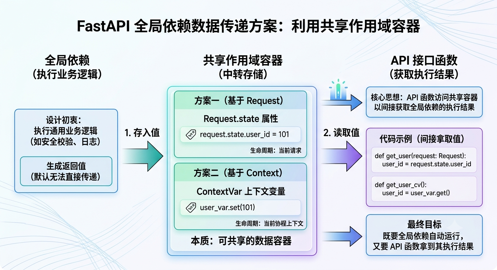

##### request.state 请求状态共享

###### 核心定义

​	在 FastAPI 中，**`fastapi.Request` 请求对象提供**了一个 **`state` 属性**，它是 **FastAPI （底层由 `Starlette` 驱动）提供**的一个**存储空间**。

核心特性：

- **`Request.state`** 是**基于当前单次 HTTP 请求**的**整个生命周期**的**状态共享机制**
- 它**随着当前 HTTP 请求诞生，随着当前 HTTP 请求结束而销毁**

核心思路：可以**在 “全局依赖项” 中把数据存入 `Request.state` 某个自定义属性中** ，然后**在 API 接口函数中随时取出来**。

###### 基本语法

```python
from fastapi import FastAPI, Depends, Request

# 全局依赖项
async def <依赖项函数名>(request: Request):
    # 将数据挂在到 request.state 某个自定义属性上
    request.state.<存储数据Key> = <数据源>

# 注入全局依赖项
<FastAPI 应用实例> = FastAPI(dependencies=[Depends(<依赖项函数名>)])

# API 接口函数
@<FastAPI 应用实例>.<HTTP 方法>('<URL 路径>')
async def <API 接口函数>(request: Request):
    # 从 request.state 中读取某个自定义属性的数据
    <数据> = request.state.<存储数据Key>
    
    return <响应数据>
```

> Request 贯穿传递流程：**HTTP请求 → 全局依赖项→ Request 请求对象 → API 接口函数**

- 优缺点：

  - **优点**：

    ​	非常直观，完全符合 Web 开发的直觉；**生命周期安全，请求结束时自动销毁，不会发生内存泄漏或请求间数据污染**。

  - **缺点**：

    ​	**强耦合 `Request` 对象**；在 API 接口函数中，必须**显式声明 `request: Request` 形参**，同样如果在 API 接口函数内调用了其他深层的业务函数，必须要**把 `request` 对象一层层传下去**，代码会显得比较**臃肿**。

###### 示例

```python
from fastapi import FastAPI, Depends, Request


# --- 全局依赖项 ---
async def global_get_db(request: Request):
    print('获取数据库连接...')

    # 模拟数据库查询，把从数据库获取到的数据赋值给 request.state.db
    request.state.data_base = {
        'name': 'fastapi_demo',
        'version': '1.0.0',
        'database': 'redis',
        'table': 'user',
        'data': [
            {'username': 'admin', 'password': '123456'},
        ]
    }


# 注入全局依赖项
app = FastAPI(
    dependencies=[Depends(global_get_db)]
)


# API 接口函数
@app.get('/')
async def read_root(request: Request):  # Request 传递给 API 接口函数
    print('API 接口函数...')

    # 从 request.state 直接获取 “全局依赖项” 存储的数据
    current_database = request.state.data_base

    return {'status': 'success', 'user': current_database['data']}

    '''
    返回的响应：
    {
    "status": "success",
        "user": [
            {
            "username": "admin",
            "password": "123456"
            }
        ]
    }
    '''
```

🧠 执行流拆解

1. 请求到达 → 触发全局依赖 `global_get_db`
2. 依赖项拿到 `Request` 对象，把解析好的用户数据塞进 `request.state.user` → 全局依赖执行完毕
3. 进入具体的路由函数 `read_root`，FastAPI 把同一个 `Request` 对象传进来
4. 路由函数直接从 `request.state.data_base` 中“提货”

##### ContextVar 协程上下文隔离变量

###### 协程上下文隔离机制

> [!NOTE]
>
> 在 Python 异步编程中，**异步协程上下文隔离**是一个非常重要的核心概念。
>
> 前置定义：**处于同一个线程空间中的多个协程（Task 任务）之间都可以访问到「同一线程内」的全局共享资源变量（临界区）**。
>
> 核心概念：当**多个协程并发运行（多个并发请求处理）**时，如果想要**实现「同一线程内」的某些全局数据是可以被多个协程之间共享访问**，但是**又希望**这些**全局数据在多协程运行期间是互相隔离的**。可以使用 Python 引入的 **`contextvars` 模块**。
>
> > [!IMPORTANT]
> >
> > ​	如果**使用 `threading.local` 线程局部存储方案**的话，**由于所有协程都在同一个线程中，一个协程修改了变量，其他协程就会看到修改后的值**，从而导致**数据污染**。
>
> ****
>
> 核心定义：**`contextvars` 模块**实现了**区分多协程（Task 任务【HTTP 请求】）并发运行时**的 **“代码层面的全局访问”** 和 **“数据层面的运行时隔离”**。
>
> 简单来说，`contextvars` 模块**为每个 Task 协程任务（HTTP 请求）**都**维护了一个属于自己的 `Context`（上下文）映射表**；
>
> - **`contextvars.ContextVar` 对象**是一个**容器**，专门**定义存储「同一线程内」的多个 Task 协程任务可以访问提取的『全局共享资源』**
> - 在**每个 Task 协程任务运行期间**，会**将「同一线程内」的全局共享资源（`contextvars.ContextVar` 对象容器）建立一份〖引用副本〗放在协程各自的 Context 上下文空间中**
> - 以此实现，**多 Task 协程任务（HTTP 请求）在运行时期间**，**既可以共享访问同一线程内的全局共享资源**，**又能将运行时所需的全局共享资源数据互相隔离**。
>
> 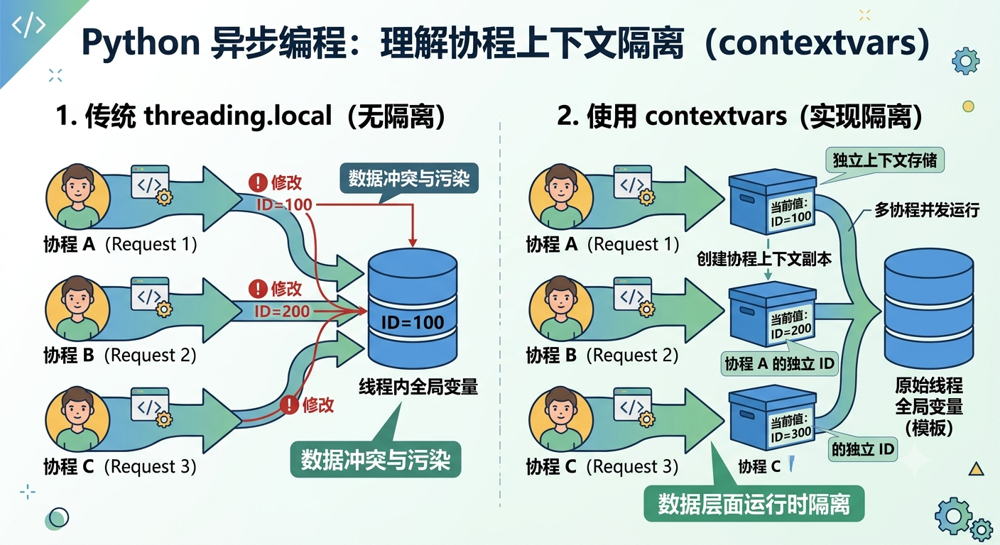

###### 核心定义

​	Python 内部提供了一个 **`contextvars.ContextVar` 类**，它能实现在**多个异步协程上下文（多个 HTTP 请求链路）**中**共享同一线程内的全局变量**，同时**保证每一个协程（更准确地说是每个异步任务 `Task`）内的数据**都是**互相之间隔离的，互不干扰**，从而实现**同一个协程（同一个 HTTP 请求）内之间的数据传递**。

核心原理：**每个协程（更准确地说是每个异步任务 `Task`）在运行期间**都**维护着一个属于自己的 `Context`（上下文）映射表**，以此**保证不同 HTTP 请求（协程任务）之间的数据互不干扰**。

###### 基本语法

```python
from fastapi import FastAPI, Depends
from contextvars import ContextVar

<FastAPI 应用实例> = FastAPI()

# 声明一个全局的 ContexVar 容器
<ContexVar 容器对象>: ContextVar[<数据类型>] = ContextVar(<Key>, default="<默认值>")

# 全局依赖项（def 函数 | class 类 | yield 生成器函数）
async def <依赖项函数名>():
    # 在当前协程（HTTP 请求）运行时，保存一份数据到协程上下文空间的映射表中
    <ContexVar 容器对象>.set(<数据源>)
    
	# 注：在 HTTP 请求处理完之后，自动销毁当前协程上下文映射表存入的值
    
# 注入全局依赖项
<FastAPI 应用实例> = FastAPI(dependencies=[Depends(<依赖项函数名>)])

# API 接口函数
@<FastAPI 应用实例>.<HTTP 方法>('<URL 路径>')
async def <API 接口函数>(request: Request):
    # 当前协程从自己的上下文空间中，通过 <ContexVar 容器对象>.get() 提取对应的数据值
    <数据> = <ContexVar 容器对象>.get(<存储数据Key>)
    
    return <响应数据>
```

可以看出：

​	整个代码结构是 **`ContextVar` 容器对象作为一个全局顶层变量资源（临界区）**存在，**其他函数（协程任务）**通过**引用这个`ContextVar` 容器对象来访问提取某个全局顶层变量资源（临界区）的『引用副本』，并在各自独立的上下文空间中存入/提取它，并在协程 Task 任务处理完之后会自动销毁清空**。

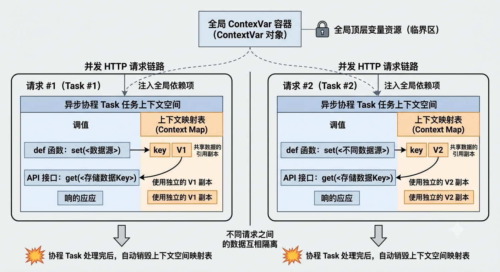

优缺点：

- **优点**：**解耦神技**。

  ​	API 接口函数不需要声明 `request: Request`。

  ​	更强大的是，即使在 Service 层、DAO 层等**任何深层嵌套的函数内部**，只要是**在同一个请求的异步链条中**，直接**调用 `<ContexVar 容器对象>.get()` 就能拿到值**，完全**不需要层层传参**。

- **缺点**：**心智负担稍高**。

  ​	如果**涉及到同步函数（`def` 而不是 `async def`）混用**、或者**在内部自己创建了线程池/进程池**，**上下文可能会丢失或混乱**，需要**结合 FastAPI 的 `run_in_threadpool` 底层机制**来理解。

###### 示例

```python
from contextvars import ContextVar
from fastapi import FastAPI, Depends, HTTPException, Header
from pydantic import BaseModel, Field

# ---- 1.  创建 ContexVar 异步协程上下文变量 ----
current_user: ContextVar[str] = ContextVar[dict]('current_user', default=None)


# --- 2. 全局依赖项 ---
# 获取数据库连接（子依赖项）
async def global_get_database():
    print('获取数据库连接（全局依赖项-子依赖项）....')

    # 模拟数据库查询（包含敏感信息字段）
    data_base = {
        'user_role': [
            {'role_id': 1, 'role_name': 'admin'},
            {'role_id': 2, 'role_name': 'user'}
        ],
        'users': [
            {'role_id': 1, 'username': 'admin_123', 'password': '123456'},
            {'role_id': 2, 'username': 'user_123', 'password': 'adj149a'},
        ]
    }

    return data_base  # 返回给 global_verify_token_and_user_role 全局依赖项


# Token 认证子依赖项（HTTP 异常处理）
async def verify_token(
    # ⚠️注意：FastAPI 的数据校验优先级高于依赖项函数的内部逻辑，所以必须给 Header() 传递一个默认值，表示允许不传，从而触发自定义校验逻辑
    x_token: str = Header(None, description='用户身份凭据')  # 获取 HTTP 请求头中的 x-token
):
    print('用户Token 身份认证（全局依赖项-子依赖项）....')

    if not x_token:
        raise HTTPException(status_code=401, detail='请先登录！')

    return x_token  # 返回给 global_verify_token_and_user_role 全局依赖项


# 用户身份认证（全局依赖项）
async def global_get_user_role(
    # ⚠️注意，这里的 Depends() 只是一个 “全局依赖项” 的 “子依赖项” 所以可以拿到 return 返回值
    x_token: str = Depends(verify_token),  # 先获取并验证 Token
    data_base: dict = Depends(global_get_database),  # Token 验证通过，再获取数据库连接
):
    print('全局依赖项执行...')

    # 模拟数据库查询--将值设置到当前协程的上下文中
    if x_token == 'admin':
        current_user.set({
            'role': data_base['user_role'][0],
            'user': data_base['users'][0]
        })
    elif x_token == 'user':
        current_user.set({
            'role': data_base['user_role'][0],
            'user': data_base['users'][0]
        })


# 注入全局依赖项
app = FastAPI(dependencies=[Depends(global_get_user_role)])


# ------------ API 接口函数 -----------

# 用户数据模型过滤器（不包含敏感信息字段）
class UserOut(BaseModel):
    role_name: str = Field(description='用户角色')
    username: str = Field(description='用户名')


# 响应数据模型过滤器
class ResponseModel(BaseModel):

    """
    响应模型类，用于定义API返回的数据结构
    继承自BaseModel，通常用于数据验证和序列化
    """
    status: str  # 响应状态，通常表示请求是否成功，如"success"或"error"
    data: UserOut  # 响应数据，类型为UserOut，包含用户相关的输出信息


# 3. 在 API 接口（或任意深层的函数）中拿取 ContexrVar 数据（当前协程的上下文空间）
@app.get('/get_user', response_model=ResponseModel)  # 数据过滤
async def get_user():
    print('API 接口函数...')

    # 获取当前协程的上下文变量, 从上下文中获取当前用户的数据
    current_user_data = current_user.get()

    response_data = {
        'role_name': current_user_data['role']['role_name'],
        'username': current_user_data['user']['username']
    }

    return {'status': 'success', 'data': response_data}  # 返回成功状态和过滤后的用户数据


'''
执行过程：

用户Token 身份认证（全局依赖项-子依赖项）....
获取数据库连接（全局依赖项-子依赖项）....
全局依赖项执行...
API 接口函数...
'''
```

发生的请求：

```ini
GET /get_user HTTP/1.1
x-token: admin
Host: 127.0.0.1:8000
```

返回的响应：

```ini
HTTP/1.1 200 OK
date: Sat, 13 Jun 2026 04:02:12 GMT
server: uvicorn
content-length: 72
content-type: application/json
{"status":"success","data":{"role_name":"admin","username":"admin_123"}}
```

##### 两者之间的对比

| **特性**     | **Request.state** 请求状态共享              | **ContextVar **上下文变量            |
| ------------ | ------------------------------------------- | ------------------------------------ |
| **底层依赖** | FastAPI / Starlette 框架                    | Python 标准库                        |
| **参数依赖** | **API 接口函数必须声明 `request: Request`** | **API 接口无需任何特殊形参**         |
| **跨层传递** | 差（需**手动层层传递 `request`**）          | 极佳（**任意深层函数直接全局获取**） |
| **安全程度** | 极高（严格绑定 HTTP 请求生命周期）          | 高（需注意混用多线程时的上下文传递） |

指南：

- 如果只是想在 **API 顶级接口函数**里**简单拿个值**，**用 `Request.state` 最稳妥**、最不容易出错
- 如果在**写复杂的架构**，比如想在全局日志（Logger）里自动打印当前请求的 `user_id`，或者在 **ORM 钩子**里自动记录 `created_by`，那么 **`ContextVar` 是唯一的优雅解**

### @ 路由装饰器的 dependencies 静态参数

​	FastAPI 为 **`@路由装饰器`** 提供了一个 **`dependencies` 静态参数**，它接收一个 **“依赖项” 列表**，表示可以**为当前修饰的 API 接口函数 一次性设定一个或多个 “依赖项”**。

核心思想：**没有 `return` 返回值**，通常用于定义**某些 API 接口函数共用的 “通用业务逻辑”（HTTPException 异常处理...）**。

#### 基本语法

```python
@<FastAPI 应用实例>.<HTTP 方法>('<URL 路径>', dependencies=[Denpends(<依赖项>),...])
async def <API 接口函数>(): pass
```

#### 执行逻辑

​	**`dependencies=[Denpends(<依赖项>),...]`  执行机制**与 API 接口函数中定义的 **`def (<形参变量> = Depends(<依赖项>))`** "普通依赖项“ **两者的行为基本一致**。

​	区别在于 **`@路由装饰器` 的 `dependencies=[Denpends(<依赖项>),...]`  注入的 “依赖项” 内 `return` 的返回值不会回传给 API 接口函数**。

##### 写法区别

- **`@app.xxx(dependencies=[Denpends(<依赖项>),...])`**：

  ​	在 **`@app.xxx()` 路由装饰器中定义**，可以接收**一个或多个 “依赖项”，不可接收 “依赖项” 的执行结果**。

- **`def <API 接口函数>(<形参变量> = Depends(<依赖项>))`**：

  ​	在 **`def` API 接口函数的「形参列表」中定义**，只可以**定义一个**，且**能接收 “依赖项”  的执行结果注入到 `形参变量` 中**。

##### 示例

```python
from fastapi import FastAPI, Depends, HTTPException, Header

app = FastAPI()

# 依赖项
async def depend_a(x_token: str = Header(None)):
    print('依赖项函数执行...')
    
    # 通用业务逻辑...
    
    if x_token != "A":
        raise HTTPException(status_code=400, detail="X-Token header invalid")

    # 没有 return 返回值，即使有 return 也会被忽略，不会回传到 API 接口函数中


# API 接口函数
@app.get("/test", dependencies=[Depends(depend_a)]) # dependencies 没有返回值，只是一个 “通用业务逻辑”
async def test():
    return 'ok'
```

通常用来定义一个 API 接口通用的 HTTP 异常处理业务逻辑：

```python
# Depends() 依赖注入
# 依赖项函数
async def verify_token(x_token: str = Header(..., description='X-Token 请求头')):
    if x_token != 'super-secret-token':
        raise HTTPException(
            status_code=status.HTTP_401_UNAUTHORIZED,
            detail='X-Token 请求头无效'
        )


# API 接口函数，使用 Depends() 依赖注入，先执行 verify_token 函数，校验通过再进入 API 接口函数中
@app.get("/http_exception_test2", dependencies=[Depends(verify_token)])
async def http_exception_test2():
    # 使用 Depends() 依赖注入
    # await verify_token()
    return {"code": 200, "message": "正常响应", "data": None}
```

