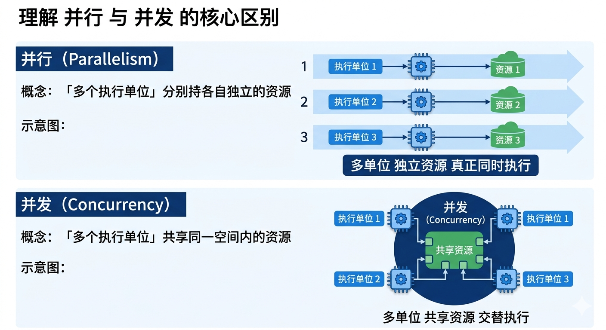
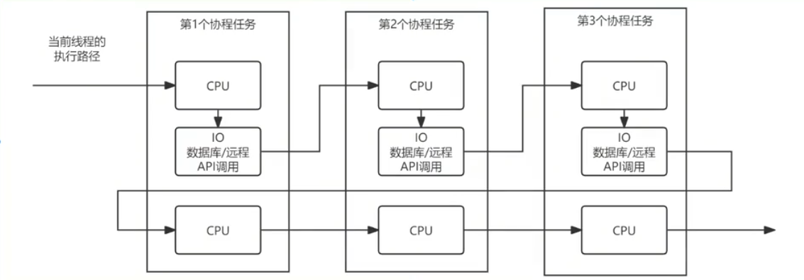

# FastAPI 框架

> [!NOTE]
>
> 在 FastAPI 框架出现之前，Python Web 开发圈主要是由两大阵营所主导：
>
> - **Django**：自带大而全功能的**集成全家桶**，但非常**笨重**
> - **Flask**：**轻量且灵活性高**的**小型 Web 框架**，但需要手动组装各类插件
>
> 随着现在 Web 开发对**高并发、异步输入输出、前后端分离（纯 API 驱动）**的需求日益剧增，传统的**同步框架（Django、Flask）**逐渐暴露出**性能瓶颈**；在这个背景下，FastAPI 应运而生。
>
> - **FastAPI** 是一个**现代、快速（高性能）**的 **Web 异步框架**，用于构建基于 Python 3.8+ 与 使用了**标准 Python 类型提示（Type Hints）**的 **API 微服务**。
>
> > *`FastAPI` 与 Node.js 的 `Express/Koa2` 框架设计思想类似*：通过 **“非阻塞 I/O”**和 **“事件循环”**，单线程也能跑出极高的性能。
> >
> > ​	它们都是为了**高效率构建 Web 服务（尤其是 RESTful API）**而设计的**轻量级、富有现代感的 Web 框架**，可通过 **`async/await` 异步编程**，让**「单线程」**在面对**高并发I/O 操作**任务的业务场景下，能**通过「多个协程」借助事件循环（Event Loop）机制调度**，**在多个等待间的 I/O 任务之间快速穿梭**，以实现**高吞吐量**的效果。

## 介绍

FastAPI 是一个**高性能**的 **Web 异步框架**，用于**构建基于 Python** 的 **API 接口层服务**。

中文官网：https://fastapi.tiangolo.com/zh/

核心概念：

- 基于**标准的 Python 类型提示（Type Hints）**：定义**函数入参、返回值，变量**的**类型校验**

- 通过**利用 Python 的 `async/await` 异步编程（多协程）特性**，提供了极高的**并发**性能

- 基于 **`Uvicorn` 运行**的 FastAPI 程序是**最快的 Python Web 框架**

  > **`Uvicorn`** 是一个支持**异步**的 **Web 服务器**，可以通过**单点部署 FastAPI 程序**，实现高性能的服务。

### 核心特点

- **高性能的异步并发**：

  ​	FastAPI 是**基于 `Starlette` 底层框架**之上的**上层应用框架**，使得 FastAPI 的**性能接近于 Golang** 和 **Node.js** 语言；同时还额外添加了一些其他功能（如 **Pydantic** 自动类型校验、自动生成接口文档UI...）。

- **自动生成接口文档（Swagger UI）**：

  ​	FastAPI 会**自动为每个 API 接口生成一个交互式文档**；帮助开发者方便理解和使用。

- **运用类型提示与校验处理（Type Hints、Pydantic）**：

  ​	FastAPI 中完全采用 Python 3.6+ 的**类型提示（Type Hints）**，使得代码更简洁、清晰；同时还允许**采用 `Pydantic` 库**对**请求/响应数据**进行**自动验证和错误处理**。

- **`async/await` 异步支持（多协程）**：

  ​	FastAPI **原生支持 Python 的异步编程特性（`await`、 `await`）**，非常适合处理 **I/O 密集型任务**。如数据库查询、文件操作、外部 API 对接调用...

- **开发效率高**：

  ​	FastAPI 能帮助开发者在更短的时间内开发出性能优秀、类型安全的 API 接口。还额外提供了许多内置工具，如**数据验证、序列化、依赖注入**等，减少了对样板代码的需求。

- **数据模型验证与序列化（Pydantic）**：

  ​	FastAPI 默认使用 **`Pydantic` 库**进行**数据模型（DataModel）的验证与序列化处理**，使得开发者能轻松定义和验证复杂的数据结构（自动生成类型文档、类型自动转换...），**确保 API 函数的输入输出都符合预期**。

### 与 Django、Flask 的区别

**`FastAPI`、`Flask`、`Django`** 都是**基于 Python 语言实现的 Web 框架**，但它们的核心特征与功能关注点有所不同：

- **FastAPI**：主要**面向于 API 接口层应用**，非常适合**构建高性能的纯 API 微服务**。特别是在需要处理**大量并发请求**或**数据验证**的业务场景（**机器学习、数据分析**...）
- **Flask**：一个**轻量级的 Web 应用框架**，适合用于**简单的 Web 应用或原型开发**。但需要**额外手动配置一些插件来处理复杂的请求**
- **Django**：一个**全功能的 Web 应用框架（全家桶）**，适合用于**构建一个包含数据库、JWT 权限验证、管理后台的复杂 Web 应用**，但对于纯 API 的微服务项目来说就过于**笨重**了

> 一般来说，**FastAPI 是完全可以替代 Flask** 的，所以基本上就是 FastAPI 和 Django 二者选其一。

### 开发特点

1. 使用了大量的 Python 类型声明，即从 **`from typing` 模块中引入大量数据类型**

   ​	**函数的入参都会声明类型**，方便数据**类型检查、代码提示**

2. 大量使用**数据模型类**，例如 API 的入参、处理、返回、到数据库的存储；

   ​	例如 **API 函数的入参 和 返回值，都预定了一个类**，表示**数据的模型（有哪些字段、字段的类型）**

   *类似于 Java 中 SpringMVC 的 Bean 实体类*

3. 对于数据库、API、文件的调用，**大量结合 `async/await` 异步编程**的写法

### 应用架构

通常一个 FastAPI 开发的 Web 应用都需要如下核心部件组成：


**FastAPI**: [https://fastapi.tiangolo.com/zh/FastAPI](https://www.google.com/search?q=https://fastapi.tiangolo.com/zh/FastAPI)

- 是一个高性能的Web 框架，基于标准 Python 类型提示构建 API。

**Starlette**: [https://www.starlette.io/Starlette](https://www.google.com/search?q=https://www.starlette.io/Starlette)

- FastAPI 是构建在 Starlette 之上的一个 Web 框架。
- 是一个轻量级的 ASGI 框架/工具包，适合用 Python 构建异步 Web 服务。
- 在开发中，甚至会引入 Starlette 的一些方法模块。

**Pydantic**: [https://docs.pydantic.dev/latest/Pydantic](https://www.google.com/search?q=https://docs.pydantic.dev/latest/Pydantic)

- 是 Python 使用最广泛的数据验证、数据转换库。

**Tortoise**: https://tortoise.github.io/index.html

- Tortoise ORM 是一个易于使用的异步 ORM（对象关系映射器）
- SQLAlchemy也是一个功能非常强大的 Python ORM 框架但**不支持异步**。

Jinja: https://jinja.palletsprojects.com/en/3.1.x/❌️

- Jinja 是一个快速、富有表现力、可扩展的模板引擎，用于开发前端页面【推荐使用前后端分离的 Vue、React 代替】

**Uvicorn**: [https://www.uvicorn.org/Uvicorn](https://www.google.com/search?q=https://www.uvicorn.org/Uvicorn)

- 一个基于 ASGI (Asynchronous Server Gateway Interface) 的高性能、轻量级的 Python Web 服务器。
- 可以实现**单点部署（一个机器一个进程，进程崩溃则服务结束）**

**Docker**: https://www.docker.com/

- Docker 是用于虚拟化部署和运行应用程序。它使用容器技术来打包应用程序及其依赖项，使得应用程序可以在任何环境下一致地运行，无论是在开发、测试还是生产环境。

## 为什么 FastAPI 能这么快？

### 程序提速的方式

- **多进程（`multiprocessing` 模块）**：利用**多核 CPU** 能力，真正的**并行执行任务**
- **多线程（`threading` 模块）【实际还是单线程---GIL “锁”】**：利用 **CPU 和 IO 可以同时执行**的原理，让 **CPU 不会傻傻等待 IO 完成**
- **多协程（`asyncio` 模块）【异步编程】**：在**单线程**中**利用 CPU 和 IO 可以同时执行**的原理，实现**函数异步执行**

核心要点：充分利用**计算机 CPU 核心（单核 / 多核）**对**程序运行速度、架构设计**进行**组合优化**的方案选型。


> [!NOTE]
>
> 优化方式：
>
> - 使用 **Lock/RLock 互斥锁**对**“临界区” 资源加“锁”**，防止**冲突访问**
> - 使用 **Queue 队列**实现**不同进程/线程**之间的**数据通信**，实现 **生产者-消费者模式**
> - 使用**进程池 Pool** 和 **线程池 Pool**，**简化进程/线程**的任务提交、等待结束、获取结果...等操作

#### 程序的并发粒度

根据 CPU 核心（单核/多核）的执行机制，在并发编程中，程序的并发粒度如下：

- 多机器**并行**：例如大数据技术（Hadoop、Hive、Spark），可以将成千上万份数据**分布式**地放在**不同的机器**来**并行**计算
- 多进程**并行**：每个机器内，**启动多个 Python 进程提供服务（利用多核 CPU）**
- 多线程**并发**：**单个进程内，启动多个线程**提供服务
- 多协程**并发**：**单个线程内，使用协程机制**，提供**并发**能力


##### 并行与并发的核心区别

- **并行**：「多个执行单位」分别持有**各自独立的资源**
- **并发**：「多个执行单位」**共享同一空间内的资源**



### 基本概念

- 程序的并发粒度有：**机器间、进程间、线程间、协程间**。

从**机器 > 进程 > 线程 > 协程**的顺序，程序运行花费的**资源调度耗费、程序上下文切换**的**耗费**，**从大到小递减**；

协程：

- 是在**一个线程内实现的并发**，协程的并发任务之间**调度**和**上下文的耗费最少**，对于**高并发**场景，可以认为**协程最高效率最快速**
- 核心要点：在于函数可以用 `async` 和 `await` 配合，在 **IO 阻塞等待期间交出线程执行权**，让**线程可以去处理其他用户请求**

所以，**协程减少了多机器/进程/线程的调度开销 + 切换不同上下文的开销**，更加**轻量级高性能**。

#### 多协程的 CPU 执行路径

核心要点：**CPU 执行路径只有一条**，但是**遇见 I/O 操作后便可以去执行其他的任务**，最终实现了**并发**。



核心要点：**FastAPI 框架的高性能**，正是来自于**对协程的原生使用**。

## 核心组件

FastAPI 的强大功能离不开其两大核心组件：Starlette 和 [Pydantic](https://zhida.zhihu.com/search?content_id=255887007&content_type=Article&match_order=1&q=Pydantic&zhida_source=entity)。

### Starlette 底层框架（异步 Web）

> 官网：https://starlette.dev/
>
> GitHub：https://github.com/Kludex/starlette

#### 基本概念

Starlette 是一个**轻量级的 ASGI（Asynchronous Server Gateway Interface，异步服务器网关接口）框架**，专为**构建异步 Web 应用设计**，并且是现代 Python Web 生态系统中许多关键工具的基石。

- 它是 **FastAPI** 的**底层 Web 框架**，提供了 **Router 路由、Query 请求处理、中间件**等基本功能... 

##### 核心特性与定位

- **异步能力**：Starlette 是**基于 ASGI（Asynchronous Server Gateway Interface）标准构建**，原生**支持 `async/await` 语法**，能**高效处理大量并发连接**，性能表现优秀
- **功能全面**：Starlette 作为一个 **“工具包 （Toolkit）”**，它内置了 **WebSocket 支持、后台任务、启动/关闭事件、CORS、GZip、静态文件、Session 会话 和 Cookie 支持**等常用功能
- **设计哲学**：Starlette 的设计目标是**轻量且模块化**。它的代码库具有 100% 的类型注解（Type Hints）和测试覆盖率，依赖极少，可以根据需要灵活组合使用其组件
- **开发友好**：安装简单 (`pip install starlette`)，通常**配合 `uvicorn` 等 ASGI 服务器运行**，代码风格简洁直观

##### 生态系统角色

Starlette 的重要性远超其自身。它是更高级、更流行的 Web 框架 **FastAPI** 的底层基础。这意味着，**任何基于 FastAPI 构建的应用**，都在**使用 Starlette** 的**核心路由**和**请求处理**能力。

此外，Starlette 还被广泛应用于 **AI** 和**机器学习**领域，支撑着 **vLLM**、**LiteLLM** 等众多工具。

> 可以这样理解：**Starlette 是发动机，FastAPI 是车身。** 很多高性能的 Python 应用和 AI 服务，都跑在这台发动机上。

###### **Starlette 在 FastAPI 中的作用**

FastAPI 直接**继承**了 **Starlette** 的所有功能，例如路由、请求处理和中间件。

- FastAPI 的 **`@app.get()`、`@app.post()`** 等装饰器实际上是**对 Starlette 路由系统的封装**

换句话说，FastAPI 在 Starlette 的**基础**上**增加了类型检查、自动文档生成...**等高级特性。

#### 示例

安装、下载：

```python
pip install starlette
pip install uvicorn  # 还需要一个ASGI服务器，用于运行 starlette 应用
```

代码示例：

- `app.py`：

  ```python
  # 构建一个最基本的 Starlette API 应用微服务
  from starlette.applications import Starlette  # 应用入口
  from starlette.responses import JSONResponse  # 响应体
  from starlette.routing import Route  # 路由
  
  
  # API 接口
  async def homepage(request):
      return JSONResponse({"message": "Hello, World!"})
  
  
  async def user(request):
      user_id = request.path_params["user_id"]
      return JSONResponse({"user_id": user_id})
  
  
  # 定义一个 URL 路由
  routes = [
      Route("/", endpoint=homepage, methods=["GET"]),  # URL 路径，处理函数，HTTP 方法
      Route("/user/{user_id}", endpoint=user, methods=["GET"]),
  ]
  
  # 初始化应用
  app = Starlette(debug=True, routes=routes)
  # 启动应用
  # uvicorn app:app --reload
  # ucirorn [模块名:[应用名]] --reload
  ```

- 运行服务：

  ```shell
  uvicorn app:app --reload
  ```

  打开浏览器访问 `http://127.0.0.1:8000`，将看到返回的 JSON 数据。

### Pydantic 库（数据验证与序列化）

Pydantic 是一个**基于 Python 类型注解**的**数据验证**与**序列化**库。

核心作用：Pydantic **利用 Python 的类型提示（Type Hints）**来**定义数据模型**，并提供强大的**数据验证**功能。

核心价值：Pydantic 在 FastAPI 中用于**定义请求、响应的数据结构**，确保数据的正确性。

#### 核心特性

- **类型验证**：只需要使用标准的 Python 语法 `name: str` 或 `age: int` 来**定义数据模型**，Pydantic 就能**自动解析这些注解并生成验证逻辑，无需额外编写校验代码**
- **错误提示**：当**数据验证失败**时，Pydantic 会**抛出 `ValidationError`**，提供结构化的错误详情，精准定位问题字段和原因，便于快速调试
- **灵活的序列化**：
  - 可以轻松地**将模型实例转换为字典 (`model_dump()`) 或 JSON 字符串 (`model_dump_json()`)**
  - 反之亦可**将外部数据源（如 API 响应、JSON 文件）加载为模型实例**
- **数据解析**：将**输入数据（如 JSON）转换为 Python 对象**
- **默认值与可选字段**：支持**为字段设置默认值**或**标记为可选**

#### 安装、下载

```python
pip install pydantic
```

#### 在 FastAPI 的应用

在 FastAPI 中，Pydantic 被用来**定义 API 的请求体（request body）、查询参数（query parameters）和响应模型（response model）**。

FastAPI 会**根据 Pydantic 模型自动验证输入数据**，并**在 Swagger UI 中自动生成交互式 API 文档**。

### uvicorn 本地服务器部署

Uvicorn 是一个 lightning-fast (闪电般快速) 的 **ASGI（Asynchronous Server Gateway Interface，异步服务器网关接口） 服务器**，专门为 Python 的异步 Web 框架（如 FastAPI、Starlette）设计。

- 可以把它理解为一个高性能的 **"桥梁"**，负责**接收网络请求并将其传递给 Python 应用**，然后**将 Python 应用返回的响应发送回客户端**

它之所以快，核心在于默认使用了 **`uvloop`** 和 **`httptools`**——这些都是用 Cython 编写的高性能工具，让它在处理高并发和 I/O 密集型任务时非常出色。

#### 安装、集成

```python
pip install uvicorn
```

##### 运行指令

```python
uvicorn [<.py 模块名>]:[<函数名>]
```

核心含义：**从 `<.py 模块名>` 文件中导入 ASGI 应用实例 `<函数名>`**，并**启动 `uvicorn` Web 服务器默认运行在默认端口 `8080` 上**。

###### --reload 自动重启

核心作用：在**代码变动**后 `uvicorn` Web 服务器**自动重启**。

```python
uvicorn [<.py 模块名>]:[<函数名>] --reload
```

###### --port [port] 指定端口

核心作用：在 **`uvicorn` Web 服务器启动**时，**运行在 `[port]` 端口上**。【默认：8000】

```python
uvicorn [<.py 模块名>]:[<函数名>] --reload --port 5000
```

###### 常用参数

可以通过 `uvicorn --help` 查看所有参数，以下是几个最常用的：

| 类别         | 参数                      | 作用                                                 |
| :----------- | :------------------------ | :--------------------------------------------------- |
| **基本网络** | `--host 0.0.0.0`          | 监听所有可用的网络接口（默认仅 `127.0.0.1`）         |
|              | `--port 8080`             | 更改服务端口（默认 `8000`）                          |
| **开发模式** | `--reload`                | 开启热重载，代码变动后自动重启服务                   |
|              | `--reload-dir ./src`      | 指定热重载监控的特定目录                             |
| **性能调优** | `--workers 4`             | 启动多个进程来处理请求（**不能**与 `--reload` 共用） |
|              | `--loop uvloop`           | 指定使用 `uvloop` 事件循环以获得更高性能             |
|              | `--limit-concurrency 100` | 设置最大并发连接数，防止过载                         |
| **高级特性** | `--proxy-headers`         | 让 Uvicorn 识别反向代理（如 Nginx）传递的真实 IP     |
|              | `--uds /tmp/uvicorn.sock` | 绑定到 Unix Socket，通常与 Nginx 配合使用            |

##### 程序化运行

可以通过**在 `.py` 模块中**运行 `uvicorn` 模块来启动 Web 服务器：

`app.py`：

```python
import uvicorn

if __name__ == "__main__":
    uvicorn.run("[<.py 模块名>]:[<函数名>]:", host="0.0.0.0", port=5000, reload=True)
```

- 运行：**`python ./app.py`**

##### 示例

`main.py` 模块：

```python
# 路由入口函数 /
async def app(scope, receive, send):
    # 协议断言
    assert scope['type'] == 'http'

    # 响应头
    await send({
        'type': 'http.response.start',
        'status': 200,
        'headers': [(b'content-type', b'text/plain')],
    })

    # 响应体
    await send({
        'type': 'http.response.body',
        'body': b'Hello, world!',
    })
```

- 运行指令：`uvicorn main:app -- reload`

核心含义：从 `main.py` 文件中导入 ASGI 应用实例 `app`，并在 `http://127.0.0.1:8000` 端口上运行。

#### 与 Starlette 的关系

核心定义：**Uvicorn 是“服务器”，而 Starlette 是“Web 框架”**。它们两个组合在一起，构成了现代 Python 异步 Web 开发（比如 FastAPI）的核心基石。

- 共同点：Uvicorn 和 Starlette 两者都是基于 **ASGI 标准协议** 实现的。

##### 什么是 ASGI 标准？

**ASGI （Asynchronous Server Gateway Interface，异步服务器网关接口）**是 Python 社区为了让 **Web 服务器**和**异步 Web 应用程序**之间能够**互相通信**而制定的一套**标准协议**。

- **Uvicorn 是 ASGI 的“实现者”（服务器）**
- **Starlette 是 ASGI 的“应用者”（框架）**

因为两者都遵守同一种语言（ASGI 协议），所以 **Uvicorn 可以完美地驱动 Starlette**。

###### 为什么选择 ASGI 而不是 WSGI？

传统的 **WSGI** 标准是**同步**的，处理一个请求必须等待响应完全返回，这导致它难以支持 WebSockets 或 HTTP 长轮询。

而 **ASGI** 是**异步**的，它让 Python Web 应用能像 Node.js 或 Go 一样，在处理等待数据库或网络 I/O 时，同时处理其他请求，大大提高了并发能力。

##### 职责分工

###### Uvicorn-专注性能的底层服务器

Uvicorn 是一个超高性能的 **ASGI HTTP 服务器**。它的核心任务非常纯粹：

- **监听端口**：比如在本地监听 `127.0.0.1:8000`
- **处理网络原始数据**：把网络上传过来的 TCP 字节流解析成 HTTP 请求（或者 WebSocket 数据包）
- **转化为标准格式**：把这些请求打包成 ASGI 协议规定的 Python 字典（即 `scope`, `receive`, `send` 协议三要素）
- **扔给上层框架**：它不关心 API 路由长什么样，它只负责把打包好的 ASGI 数据塞给像 Starlette 这样的框架

###### Starlette-专注业务的轻量级 Web 工具箱

Starlette 是一个轻量级、高性能的 **ASGI 框架/工具包**。当它从 Uvicorn 那里接过 ASGI 数据后，开始干脏活累活：

- **路由分发 (Routing)**：检查请求的路径（比如 `/items/1`），决定由哪个 Python 函数来处理
- **生命周期管理 (Lifecycle)**：处理应用的启动（Startup）和关闭（Shutdown）事件（比如连接和断开数据库）
- **高级抽象**：把 Uvicorn 传过来的原始数据封装成更好用的 `Request` 和 `Response` 对象
- **常用功能**：自带 Session 支持、Cookie 处理、异常处理、CORS 跨域配置以及 WebSockets 的高级封装

###### 与 FastAPI 的 “套娃关系”

- **`FastAPI` = `Starlette`（Web 核心）+ `Pydantic`（数据校验）+ 自动生成 OpenAI 文档等高级特性**

当运行一个 FastAPI  项目时，底层的调用链如下：

```python
+-------------------------------------------------------------+
| 1. 用户浏览器发起请求 (HTTP / WebSocket)                     |
+-------------------------------------------------------------+
                              │
                              ▼
+-------------------------------------------------------------+
| 2. Uvicorn (服务器)                                         |
|    - 监听端口，将原始网络字节流解析为 ASGI 格式                |
+-------------------------------------------------------------+
                              │
                              ▼
+-------------------------------------------------------------+
| 3. Starlette (FastAPI 基类)                                 |
|    - 进行路由匹配、处理中间件、管理异常                     |
+-------------------------------------------------------------+
                              │
                              ▼
+-------------------------------------------------------------+
| 4. FastAPI (上层封装)                                       |
|    - Pydantic 校验入参 -> 执行你的业务函数 -> 格式化输出数据  |
+-------------------------------------------------------------+
```

核心结论：

- **Uvicorn** 负责 **“怎么传”**（网络传输、高性能异步 IO）
- **Starlette** 负责 **“怎么管”**（路由、请求、逻辑控制）

它们之间通过 **ASGI 协议** 紧密相连。

