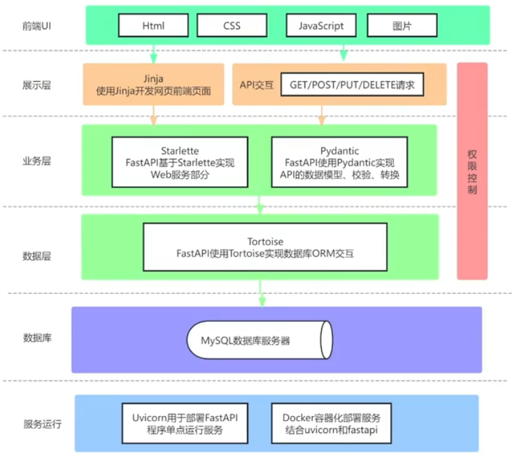
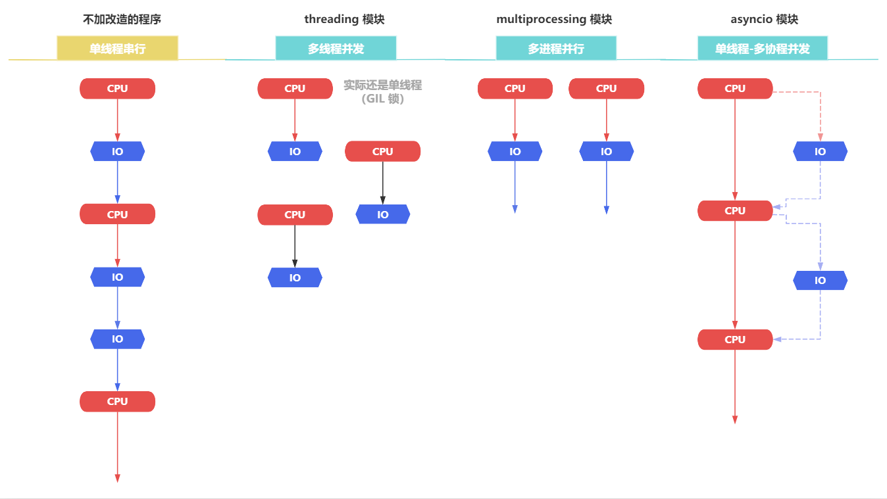
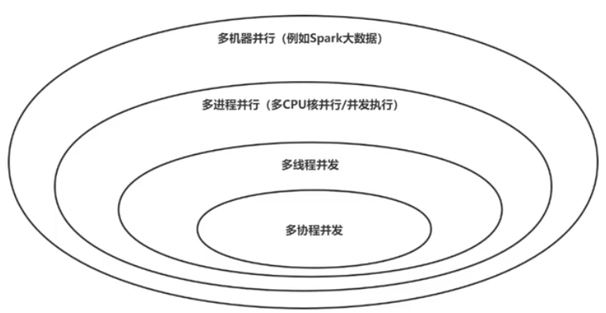

# FastAPI 框架

> [!NOTE]
>
> 在 FastAPI 框架出现之前，Python Web 开发圈主要是由两大阵营所主导：
>
> - **Django**：自带大而全功能的**集成全家桶**，但非常**笨重**
> - **Flask**：**轻量且灵活性高**的**小型 Web 框架**，但需要手动组装各类插件
>
> 随着现在 Web 开发对**高并发、异步输入输出、前后端分离（纯 API 驱动）**的需求日益剧增，传统的**同步框架（Django、Flask）**逐渐暴露出**性能瓶颈**；在这个背景下，FastAPI 应运而生。
>
> - **FastAPI** 是一个**现代、快速（高性能）**的 **Web 异步框架**，用于构建基于 Python 3.8+ 与 使用了**标准 Python 类型提示（Type Hints）**的 **API 微服务**。
>
> > *`FastAPI` 与 Node.js 的 `Express/Koa2` 框架设计思想类似*：通过 **“非阻塞 I/O”**和 **“事件循环”**，单线程也能跑出极高的性能。
> >
> > ​	它们都是为了**高效率构建 Web 服务（尤其是 RESTful API）**而设计的**轻量级、富有现代感的 Web 框架**，可通过 **`async/await` 异步编程**，让**「单线程」**在面对**高并发I/O 操作**任务的业务场景下，能**通过「多个协程」借助事件循环（Event Loop）机制调度**，**在多个等待间的 I/O 任务之间快速穿梭**，以实现**高吞吐量**的效果。

## 介绍

FastAPI 是一个**高性能**的 **Web 异步框架**，用于**构建基于 Python** 的 **API 接口层服务**。

中文官网：https://fastapi.tiangolo.com/zh/

核心概念：

- 基于**标准的 Python 类型提示（Type Hints）**：定义**函数入参、返回值，变量**的**类型校验**

- 通过**利用 Python 的 `async/await` 异步编程（多协程）特性**，提供了极高的**并发**性能

- 基于 **`Uvicorn` 运行**的 FastAPI 程序是**最快的 Python Web 框架**

  > **`Uvicorn`** 是一个支持**异步**的 **Web 服务器**，可以通过**单点部署 FastAPI 程序**，实现高性能的服务。

### 核心特点

- **高性能的异步并发**：

  ​	FastAPI 是**基于 `Starlette` 底层框架**之上的**上层应用框架**，使得 FastAPI 的**性能接近于 Golang** 和 **Node.js** 语言；同时还额外添加了一些其他功能（如 **Pydantic** 自动类型校验、自动生成接口文档UI...）。

- **自动生成接口文档（Swagger UI）**：

  ​	FastAPI 会**自动为每个 API 接口生成一个交互式文档**；帮助开发者方便理解和使用。

- **运用类型提示与校验处理（Type Hints、Pydantic）**：

  ​	FastAPI 中完全采用 Python 3.6+ 的**类型提示（Type Hints）**，使得代码更简洁、清晰；同时还允许**采用 `Pydantic` 库**对**请求/响应数据**进行**自动验证和错误处理**。

- **`async/await` 异步支持（多协程）**：

  ​	FastAPI **原生支持 Python 的异步编程特性（`await`、 `await`）**，非常适合处理 **I/O 密集型任务**。如数据库查询、文件操作、外部 API 对接调用...

- **开发效率高**：

  ​	FastAPI 能帮助开发者在更短的时间内开发出性能优秀、类型安全的 API 接口。还额外提供了许多内置工具，如**数据验证、序列化、依赖注入**等，减少了对样板代码的需求。

- **数据模型验证与序列化（Pydantic）**：

  ​	FastAPI 默认使用 **`Pydantic` 库**进行**数据模型（DataModel）的验证与序列化处理**，使得开发者能轻松定义和验证复杂的数据结构（自动生成类型文档、类型自动转换...），**确保 API 函数的输入输出都符合预期**。

### 与 Django、Flask 的区别

**`FastAPI`、`Flask`、`Django`** 都是**基于 Python 语言实现的 Web 框架**，但它们的核心特征与功能关注点有所不同：

- **FastAPI**：主要**面向于 API 接口层应用**，非常适合**构建高性能的纯 API 微服务**。特别是在需要处理**大量并发请求**或**数据验证**的业务场景（**机器学习、数据分析**...）
- **Flask**：一个**轻量级的 Web 应用框架**，适合用于**简单的 Web 应用或原型开发**。但需要**额外手动配置一些插件来处理复杂的请求**
- **Django**：一个**全功能的 Web 应用框架（全家桶）**，适合用于**构建一个包含数据库、JWT 权限验证、管理后台的复杂 Web 应用**，但对于纯 API 的微服务项目来说就过于**笨重**了

> 一般来说，**FastAPI 是完全可以替代 Flask** 的，所以基本上就是 FastAPI 和 Django 二者选其一。

### 开发特点

1. 使用了大量的 Python 类型声明，即从 **`from typing` 模块中引入大量数据类型**

   ​	**函数的入参都会声明类型**，方便数据**类型检查、代码提示**

2. 大量使用**数据模型类**，例如 API 的入参、处理、返回、到数据库的存储；

   ​	例如 **API 函数的入参 和 返回值，都预定了一个类**，表示**数据的模型（有哪些字段、字段的类型）**

   *类似于 Java 中 SpringMVC 的 Bean 实体类*

3. 对于数据库、API、文件的调用，**大量结合 `async/await` 异步编程**的写法

### 应用架构

通常一个 FastAPI 开发的 Web 应用都需要如下核心部件组成：

**FastAPI**: [https://fastapi.tiangolo.com/zh/FastAPI](https://www.google.com/search?q=https://fastapi.tiangolo.com/zh/FastAPI)

- 是一个高性能的Web 框架，基于标准 Python 类型提示构建 API。

**Starlette**: [https://www.starlette.io/Starlette](https://www.google.com/search?q=https://www.starlette.io/Starlette)

- FastAPI 是构建在 Starlette 之上的一个 Web 框架。
- 是一个轻量级的 ASGI 框架/工具包，适合用 Python 构建异步 Web 服务。
- 在开发中，甚至会引入 Starlette 的一些方法模块。

**Pydantic**: [https://docs.pydantic.dev/latest/Pydantic](https://www.google.com/search?q=https://docs.pydantic.dev/latest/Pydantic)

- 是 Python 使用最广泛的数据验证、数据转换库。

**Tortoise**: https://tortoise.github.io/index.html

- Tortoise ORM 是一个易于使用的异步 ORM（对象关系映射器）
- SQLAlchemy也是一个功能非常强大的 Python ORM 框架但**不支持异步**。

Jinja: https://jinja.palletsprojects.com/en/3.1.x/❌️

- Jinja 是一个快速、富有表现力、可扩展的模板引擎，用于开发前端页面【推荐使用前后端分离的 Vue、React 代替】

**Uvicorn**: [https://www.uvicorn.org/Uvicorn](https://www.google.com/search?q=https://www.uvicorn.org/Uvicorn)

- 一个基于 ASGI (Asynchronous Server Gateway Interface) 的高性能、轻量级的 Python Web 服务器。
- 可以实现单点部署（一个机器一个进程，进程崩溃则服务结束）

**Docker**: https://www.docker.com/

- Docker 是用于虚拟化部署和运行应用程序。它使用容器技术来打包应用程序及其依赖项，使得应用程序可以在任何环境下一致地运行，无论是在开发、测试还是生产环境。

## 为什么 FastAPI 能这么快？

### 程序提速的方式

- **多进程（`multiprocessing` 模块）**：利用**多核 CPU** 能力，真正的**并行执行任务**
- **多线程（`threading` 模块）【实际还是单线程---GIL “锁”】**：利用 **CPU 和 IO 可以同时执行**的原理，让 **CPU 不会傻傻等待 IO 完成**
- **多协程（`asyncio` 模块）【异步编程】**：在**单线程**中**利用 CPU 和 IO 可以同时执行**的原理，实现**函数异步执行**

核心要点：充分利用**计算机 CPU 核心（单核 / 多核）**对**程序运行速度、架构设计**进行**组合优化**的方案选型。

> [!NOTE]
>
> 优化方式：
>
> - 使用 **Lock/RLock 互斥锁**对**“临界区” 资源加“锁”**，防止**冲突访问**
> - 使用 **Queue 队列**实现**不同进程/线程**之间的**数据通信**，实现 **生产者-消费者模式**
> - 使用**进程池 Pool** 和 **线程池 Pool**，**简化进程/线程**的任务提交、等待结束、获取结果...等操作

#### 程序的并发粒度

根据 CPU 核心（单核/多核）的执行机制，在并发编程中，程序的并发粒度如下：

- 多机器**并行**：例如大数据技术（Hadoop、Hive、Spark），可以将成千上万份数据**分布式**地放在**不同的机器**来**并行**计算
- 多进程**并行**：每个机器内，**启动多个 Python 进程提供服务（利用多核 CPU）**
- 多线程**并发**：**单个进程内，启动多个线程**提供服务
- 多协程**并发**：**单个线程内，使用协程机制**，提供**并发**能力

##### 并行与并发的核心区别

- **并行**：「多个执行单位」分别持有**各自独立的资源**
- **并发**：「多个执行单位」**共享同一空间内的资源**

### 基本概念

- 程序的并发粒度有：**机器间、进程间、线程间、协程间**。

从**机器 > 进程 > 线程 > 协程**的顺序，程序运行花费的**资源调度耗费、程序上下文切换**的**耗费**，**从大到小递减**；

协程：

- 是在**一个线程内实现的并发**，协程的并发任务之间**调度**和**上下文的耗费最少**，对于**高并发**场景，可以认为**协程最高效率最快速**
- 核心要点：在于函数可以用 `async` 和 `await` 配合，在 **IO 阻塞等待期间交出线程执行权**，让**线程可以去处理其他用户请求**

所以，**协程减少了多机器/进程/线程的调度开销 + 切换不同上下文的开销**，更加**轻量级高性能**。

#### 多协程的 CPU 执行路径

核心要点：**CPU 执行路径只有一条**，但是**遇见 I/O 操作后便可以去执行其他的任务**，最终实现了**并发**。

核心要点：**FastAPI 框架的高性能**，正是来自于**对协程的原生使用**。

## 核心组件

FastAPI 的强大功能离不开其两大核心组件：Starlette 和 [Pydantic](https://zhida.zhihu.com/search?content_id=255887007&content_type=Article&match_order=1&q=Pydantic&zhida_source=entity)。

### Starlette 底层框架（异步 Web）

*就像 Nuxt4 的服务端是基于 Nitro 引擎框架之上实现的*

### Pydantic 库（数据验证与序列化）

## Anaconda 虚拟环境