# 计算机体系架构

现代计算机体系架构分为如下 3 个核心层次：

- **硬件设备 (Hardware / CPU)：** 相当于**工厂的设备**。它只负责最基础的操作，比如加减法、存取数据。它看不懂的代码，只认识高低电平
- **操作系统 (OS)：** 相当于**工厂的职业经理人**。它向下管理硬件资源（内存分配、进程调度），向上给软件提供统一的接口
- **软件程序 (Software)：** 相当于**生产指令**。它表达人类的需求（比如播放视频、发送消息）

| **层次**                     | **负责内容**           | **关键概念**                 |
| ---------------------------- | ---------------------- | ---------------------------- |
| **软件层**                   | 逻辑表达               | 应用程序、算法、高级语言     |
| **系统层**                   | 资源调度               | **操作系统 (OS)**、编译器    |
| **架构层**（计算机体系架构） | **软硬件接口**（协议） | **指令集 (ISA)**、微架构设计 |
| **硬件层**                   | 物理执行               | 逻辑门、电路、晶体管         |

核心要点：**计算机体系架构**正是为了让**软件**能通过**操作系统**顺畅地运行在**硬件**之上，而设计的一套 “抽象规范” 协议。

## 硬件设备

计算机中的硬件设备分为 **内设** 与 **外设**：

- 内设：**CPU、GPU、内存条、磁盘**（必需），它们是计算机能基本运行的核心组件
- 外设：**显示屏、键盘、鼠标、U 盘...**（非必需）

以上都是计算机中的 **静态/动态资源**。

### CPU

**CPU （Central Processing Unit 中央处理单元，简称 CPU）** 就是计算机的 “大脑”，它是一个硬件设备。

核心作用：用于**管理与执行计算机中的各种资源调度**。

在计算机内，程序可使用的资源主要分为：**内存、磁盘、网络**，这一切都是通过 CPU 硬件设备来完成资源任务调度的。

> **CPU 与 RAM 内存条配合，执行计算机程序**。CPU 和 RAM 之间用“地址线”、“数据线”和“允许读/写线”进行通信。

内部组成：

- **算术逻辑单元（ALU）：** 负责“干活”。所有的加减乘除、大于小于等数学和逻辑运算都在这里完成
- **控制单元（CU）：** 负责“指挥”。它负责从内存中取出指令，告诉 ALU 该做什么，并协调各个部件的工作
- **寄存器（Registers）：** 负责“临时存放”。CPU 内部极小但极快的存储空间，用来存放正在处理的数据或下一条指令的地址
  - *为什么要它？* 因为内存离 CPU 太远、太慢了。寄存器就像厨师手边的调料罐，随时拿取

核心功能：

CPU 的工作过程是一个不断循环的死循环，被称为 **“指令周期”**。它一秒钟可以执行数十亿次这样的循环：

1. **提取（Fetch）：** 从内存中取出下一条要执行的指令（就像从书架上拿出一页说明书）
2. **解码（Decode）：** 分析这条指令到底要干什么（是加法？还是跳转到另一行代码？）
3. **执行（Execute）：** 动用内部的运算单元完成任务
4. **写回（Writeback）：** 把算出来的结果存回内存或寄存器

CPU 是计算机中唯一能真正理解并执行“逻辑命令”的地方。没有它，计算机只是一堆无法思考的零件。

### RAM 内存

**内存（Memory/RAM）**是计算机中负责**临时存储**数据的部件。它是 CPU（大脑）和 磁盘（仓库）之间的**桥梁**。

> 内存是计算机的**即时工作空间**。它虽然不负责永久保存的电影和文档，但它决定了**当前**运行软件时的流畅度。

> 为什么需要内存？
>
> 计算机设计中有一个残酷的现实：**越大的存储器越慢，越快的存储器越贵。**
>
> - **CPU 的速度：** 极快（相当于光速）。
> - **磁盘的速度：** 极慢（相当于步行）。 如果让 CPU 直接去磁盘里读数据，CPU 99% 的时间都在闲着等数据送达。为了解决这个速度差，工程师发明了**内存**（相当于跑车），它虽然容量比磁盘小，但速度能跟上 CPU 的节奏。

核心特性：

- **① 易失性（断电即失）**

  这是内存与硬盘最大的区别。内存里的数据是靠电荷维持的。

  - **内存：** 只要电脑一关机或断电，内存里所有的东西都会瞬间消失。
  - **硬盘：** 即使断电，数据依然安全地保存在盘片或闪存里。
  - *这就是为什么写文档没保存，一旦断电就白写了的原因。*

- **② 随机存取（RAM）**

  内存的全称叫 **RAM (Random Access Memory)**。 “随机存取”的意思是：无论数据存在内存的哪个角落，CPU 找到它的时间都是一样的。这就像在桌面上拿东西，不论放在左上角还是右下角，手伸过去的时间几乎没有区别。

工作原理：

当双击桌面的一个图标（比如 Python 编译器或游戏）时：

1. **加载：** CPU 指令控制，将该程序的数据从**磁盘**复制一份到**内存**。
2. **运行：** CPU 直接在**内存**中读写数据，进行复杂的运算。
3. **释放：** 当关闭程序，这部分**内存**空间会被清空，留给下一个程序使用。

### 磁盘

磁盘的主要职能是**持久化存储**。这意味着无论是否关闭电源，保存在磁盘里的照片、文档、系统文件和安装的软件都会安然无恙。

- **内存（RAM）：** 像人的“短期记忆”，断电就忘
- **磁盘：** 像人的“笔记本”或“大书架”，写上去就不会消失，除非手动擦除

磁盘的分类：**HDD 与 SSD**

- **① 机械硬盘 (HDD - Hard Disk Drive)** 

  **原理：** 内部有高速旋转的金属盘片和上下移动的磁头。数据通过磁头感应磁性记录在盘片上。

  **特点：**

  - **容量大且便宜：** 适合存放海量电影、备份数据。
  - **速度慢：** 因为它涉及物理旋转，磁头找数据需要时间（寻道延迟）。
  - **怕震动：** 运转时摔一下，磁头可能划伤盘片导致数据丢失。

- **② 固态硬盘 (SSD - Solid State Drive)** 

  **原理：** 内部没有任何机械运动部件，全靠电子信号在闪存芯片（NAND Flash）中读写。

  **特点：**

  - **速度极快：** 读写速度是 HDD 的几十倍甚至上百倍。
  - **耐用：** 不怕晃动，静音，功耗低。
  - **现代标配：** 现在的操作系统（Windows/macOS）和大型软件必须装在 SSD 上才能流畅运行。

### 硬件设备之间的关系

#### 三位一体

**CPU & CPU <> 内存条 <> 磁盘** 是**三位一体**的关系：

- **磁盘**是数据存储的**巨型仓库**
- **内存**是中转站，连接了**慢速的磁盘**与**高速的处理器**

- **CPU &  GPU**：

  - **CPU** 是大脑，负责调度一切资源，是**总指挥**

  - **GPU** 是特种兵，在特定任务（图形/AI）下分担 CPU 的压力，是**计算加速器**

| **组件**         | **对应角色**      | **核心属性**             | **关键比喻**                                                 |
| ---------------- | ----------------- | ------------------------ | ------------------------------------------------------------ |
| **磁盘 (Disk)**  | **档案室 / 仓库** | **容量大、速度慢**       | 所有的书籍（程序）和资料（数据）都存在这里，关灯后资料不会消失。 |
| **内存条 (RAM)** | **办公桌面**      | **容量小、速度极快**     | 只有放在桌面上的书，才能翻开看。关灯（断电）后桌面会被清空。 |
| **CPU**          | **全能教授**      | **逻辑极强、核心数少**   | 擅长复杂的逻辑推理、调度指挥，但精力有限，一次只能处理几件事。 |
| **GPU**          | **海量学徒**      | **逻辑简单、核心数极多** | 每个人只会算简单的加减法，但胜在人多（几千人），擅长同时干一样的体力活。 |

#### 协同工作关系

当在电脑上运行一个任务（比如打开一个 3D 游戏或跑一个 AI 模型）时，这四个组件的互动关系如下：

- **第一步：从“仓库”到“桌面”（磁盘 → 内存）**

​	CPU 发现需要运行某个程序，它会下达指令，把数据从**磁盘**搬到**内存**。

​	**为什么不直接从磁盘读？** 因为磁盘太慢了。如果 CPU 等磁盘的数据，就像教授等快递员送书，一等就是好几天（在计算机微秒级的时间尺度下，磁盘读写确实慢如牛步）。

- **第二步：教授的指挥（CPU 介入）**

​	数据到了内存（桌面），**CPU** 开始解析指令。它决定了程序的运行逻辑：如果是简单的文本处理，CPU 自己就做了；如果是需要大量并行计算的任务（如 3D 画面渲染、矩阵乘法），它就会把任务包分发给 GPU。

- **第三步：特种兵的突击（GPU 加速）**

​	**GPU** 接收到 CPU 的指令，从内存（或者它自带的“显存”）中读取海量数据，开始同步计算。

​	**协同关系：** CPU 负责“指挥”（控制流），GPU 负责“干活”（数据流）。没有 CPU，GPU 不知道干什么；没有 GPU，CPU 处理大规模数据会累死。

- **第四步：归档（内存 → 磁盘）**

​	当完成工作点击“保存”时，CPU 会把内存桌面上处理好的结果，重新写回磁盘仓库里长期储存。

## 操作系统

**操作系统（Operating System, 简称 OS）** 是计算机中最基本、最重要的**核心软件**；用于管理计算机**硬件资源**与**软件**的**程序**，它是用户与计算机硬件之间的**中介**。

在计算机体系中，操作系统处于承上启下的**中间层**：

1. **用户**（你）
2. **应用程序**（如：浏览器、VS Code、Python）
3. **操作系统**（如：Windows、macOS、Linux、Android）
4. **硬件**（如：CPU、内存、磁盘）

常见的操作系统分类：

- **桌面端**：Windows（市场占有率最高）、macOS（设计与开发友好）、Linux（开源、自由度高）
- **移动端**：Android（基于 Linux 内核）、iOS（基于 Unix 内核）
- **服务器端**：Linux (Ubuntu, CentOS, Debian) —— 这是并发编程的主战场，因为它的调度机制非常透明且高效

### 核心功能

- **资源调度（CPU 任务管理）**：硬件资源（如 CPU）是有限的，但程序（任务）可能有很多。
  - **功能**：OS 决定哪个程序先用 CPU、使用多久，哪个程序占用多少内存
  - **控制论视角**：通过 **“时间片轮转** ”或 **“优先级调度”**，让多个程序看起来在同时运行**（并发）**

- **内存管理**：程序运行必须加载到内存中。
  - **功能**：为每个程序分配一块“私人领地”，防止程序 A 修改程序 B 的数据；当内存不够用时，负责将暂时不用的数据调往硬盘（虚拟内存）
- **设备管理（IO 驱动）**：计算机连接着硬盘、鼠标、键盘、显示器、网卡等各种外设。但硬件只认得电流信号，而软件只认得代码指令。
  - **功能**：操作系统提供统一的驱动程序接口。程序员不需要知道某种特定型号的硬盘如何旋转，只需调用系统的“保存文件”指令即可

- **文件系统管理**：图片、文档、电影...数据在硬盘上只是一堆二进制 0 和 1。
  - **功能**：操作系统将这些数据组织成“文件夹”和“文件”的形式，方便用户查找和存储

以上这一切资源（内存、网络、磁盘文件、外设设备...）基本都是通过 CPU 进行资源任务调度的。

## 软件程序

在计算机体系架构的语境下，**程序（Program）** 是指令的有序集合，是人类解决问题的逻辑在机器端的实现。

> 软硬件的协作：软件（通过编译器）和操作系统最终都会翻译成一串“0和1”的指令给硬件计算执行。

核心定义：**静态的指令集合**。

### 核心本质

程序是存储在**磁盘（永久仓库）**中的**静态文件**。它**由一系列计算机 CPU 能够理解的指令**（如加法、跳转、读取内存）和**数据**（如数字、文本）组成。

- **对比：** 当程序被加载到**内存**并由 **CPU** 执行时，它就变成了**进程（Process）**，即 **“运行中的程序”** 。

### 程序的编译过程

人类通常使用高级语言（如 Python、C++）编写代码，但 CPU 只认识 0 和 1 的机器码。

- **源代码：** 程序员编写的、人类可读的逻辑（如 `print("Hello")`）
- **编译器/解释器：** 负责将高级语言翻译成 **指令集架构 (ISA)** 规定的机器指令
- **机器码：** 最终由 CPU 执行的二进制代码

### 程序的执行逻辑

1. **存储：** 程序平时以文件形式保存在**磁盘**中。
2. **加载：** 当运行程序时，**操作系统**负责将程序从磁盘搬运到**内存（工作台）**。
3. **取指：** **CPU** 从内存中取出指令。
4. **执行：** CPU 内部的**算术逻辑单元 (ALU)** 进行运算，**控制单元 (CU)** 指挥数据流动。
5. **反馈：** 运算结果可能显示在屏幕上，或由 CPU 指令传回磁盘保存。

总结：**程序**是人类逻辑的“冷冻状态”，而计算机（CPU、内存、操作系统等）则是让这些逻辑“复活”并产生实际功能的机器系统。

## 计算机组成的架构关系

### 层次关系

**硬件层 (底层/基石)**

- **核心组件**：包括 **CPU（大脑）**、**内存（工作台）**、磁盘（仓库）和 **GPU（特种兵）**
- **本质**：它们是物理实体，只认得电流信号（0 和 1），提供最原始的计算和存储能力

**操作系统层 (中间层/总管家)**

- **核心功能**：它是硬件的“代理人”。它直接驱动硬件，并将复杂的物理操作封装成简单的指令
- **职责**：管理内存分配、调度 CPU 任务、读写磁盘文件。它确保软件不需要了解硬件的型号也能正常运行

**软件层 (顶层/表现层)**

- **核心组件**：包括系统软件（如编译器、数据库）和应用软件（如微信、Python 脚本、游戏）
- **本质**：软件不直接接触硬件，而是向**操作系统**发出请求。例如：软件说“我要存个档”，操作系统就去指挥磁盘执行写入操作

### 逻辑链路

- **向下管理**：操作系统通过“驱动程序”控制**硬件**
- **向上支撑**：操作系统通过“接口”支持**软件**运行
- **用户交互**：你操作**软件**，软件调动**操作系统**，操作系统驱动**硬件**完成任务

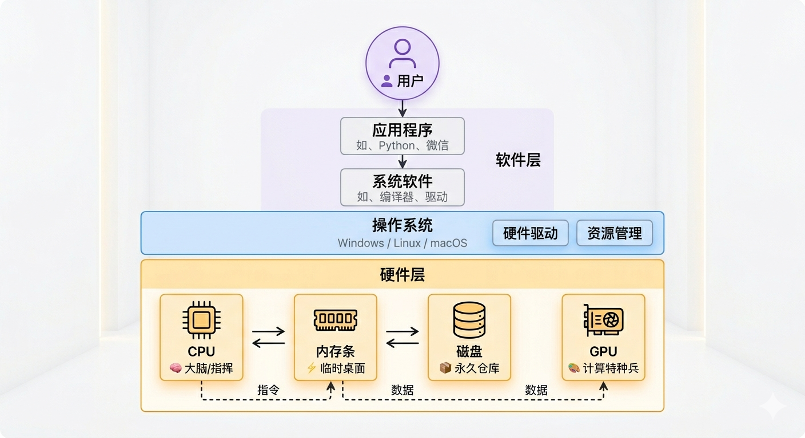

# 前置抽象概念-并发编程

## 并发 & 并行（任务执行策略）

并发与并行是 **CPU 在执行与调度操作系统中的任务（程序）时**，所实行的一种**执行策略**。

### 并发

核心概念：**在一段时间内，当 CPU 面对多个任务时，会将每个任务（程序）交替执行一段时间（时间片轮转）**

#### 核心特点

- 对于某个瞬间，CPU 确实是在执行某个任务（程序）
- **时间片轮转**：**CPU 会为每个任务（程序）分配不同的 “时间片”**，通过**以高频切换不同任务的方式**，使得**每个任务的执行进度都能得到推进**，在用户视角上看仿佛所有任务都是在 “并发执行”；但其实它是一个假的并发场景（**伪并发**）

核心结论：**单 CPU 通过高频切换指针来运行不同的程序，以使得多个程序在极短时间内同时得到推进**

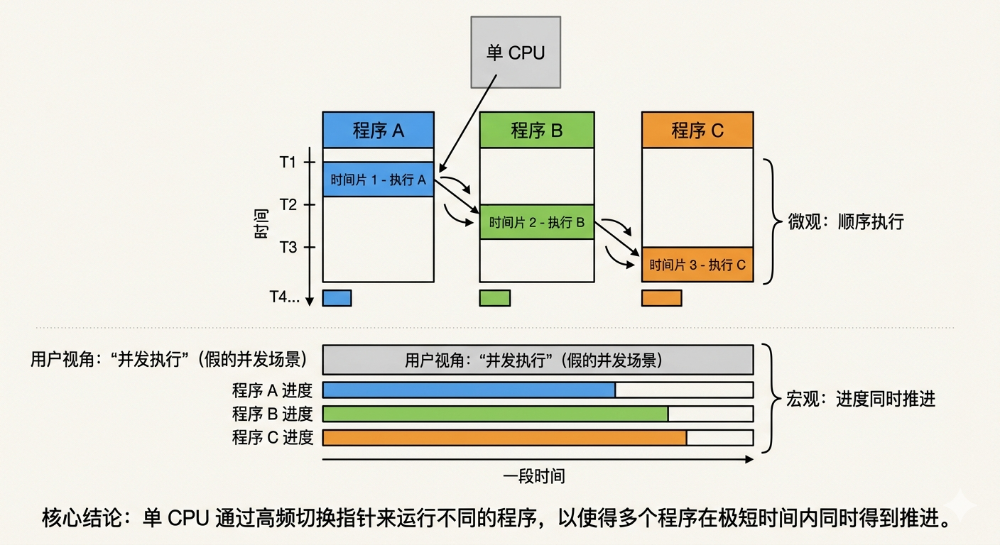

#### 底层机制

##### **时钟中断（Clock Interrupt）**

定义：**实现时间片轮转的“闹钟”**。硬件**每隔极短的时间（如 10ms）会向 CPU 发送一个信号，强制 CPU 停下手里的活，去询问操作系统**：“时间到了，该换人了吗？”


##### **进程上下文切换（Context Switch）**

###### 进程上下文

核心定义：包含了**进程在执行过程中所具有的信息**。如下：

- **用户态**层级：进程**在用户态下运行时的“工作区”**，主要**存储在内存（RAM）中**
  - **程序代码（Text Segment）：** 正在运行的可执行机器指令
  - **用户数据（Data Segment）：** 包含全局变量、静态变量
  - **堆（Heap）：** 进程在运行期间动态分配的内存
  - **用户栈（User Stack）：** 存储局部变量、函数参数和返回地址
- **寄存器上下文**：**CPU 内部的状态**，是切换速度最快、也最关键的部分
  - **程序计数器 (PC / IP)：** 指向下一条将要执行的指令地址
  - **栈指针 (SP)：** 指向当前栈顶的位置
  - **通用寄存器：** 存储正在计算的中间结果（如数据寄存器、变址寄存器）
  - **状态寄存器 (PSW)：** 存储 CPU 的状态位（如零标志、进位标志、中断屏蔽位）
- **内核态**层级：**操作系统内核为了管理该进程而维护的信息**
  - **进程控制块 (PCB)：** 包含进程 ID (PID)、状态（就绪/运行/阻塞）、优先级等
  - **页表/段表：** 用于虚拟内存到物理内存的映射信息
  - **核心栈 (Kernel Stack)：** 当进程进入内核态（如执行系统调用）时使用的栈
  - **资源清单：** 进程打开的文件描述符、占用的信号量、I/O 设备信息等

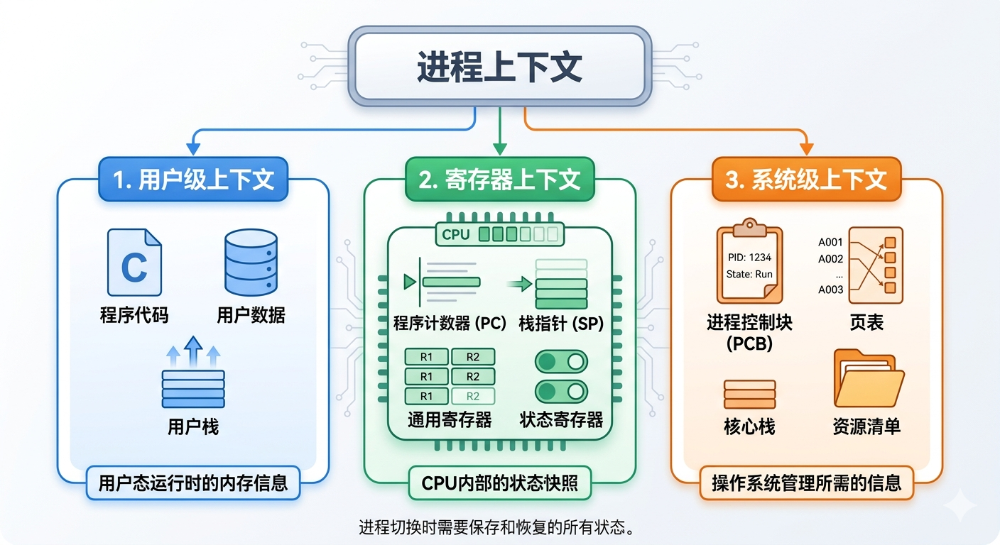

###### 核心流程

核心定义：**CPU 在切换任务（程序）前，必须将当前任务（程序）的状态、信息（寄存器数值、程序计数器 PC 指针）以 “栈” 的形式保存在内存中，接着再切换到下一个任务执行**；等到另一个任务的 “时间片时钟” 到期时，会从内存中提取出任务（程序）的相关信息再继续执行；以此类推

执行流程：

当操作系统决定挂起当前进程并运行另一个进程时，会发生**上下文切换**：

1. **保存**当前进程 A 的上下文到其 PCB 和内核栈中
2. **加载**新进程 B 的上下文（从其 PCB 中读取寄存器值等）
3. **跳转**到进程 B 之前停止的地方继续执行

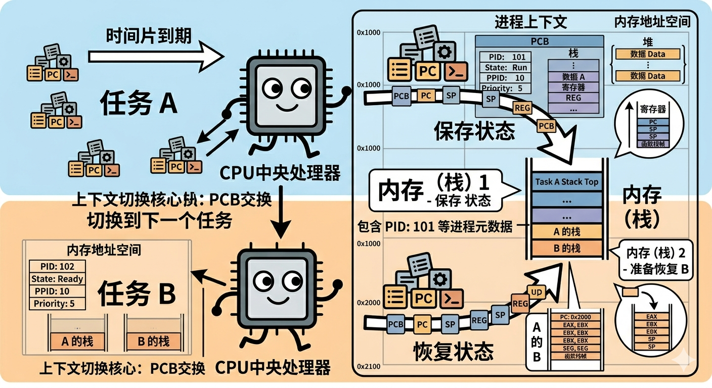

#### 缺点

- **切换损耗**：在**内存中频繁的保存与恢复任务（程序）的信息**是**需要消耗 CPU 计算性能**的。如果**“时间片” 分得太短**，CPU 可能大部分时间都在**忙着 “切换 > 恢复 > 保存” 这一工作流程，而非真正的执行程序**；而如果**太长，用户就又会感觉到明细的卡顿**。

### 并行

核心概念：并行**依赖于多个 CPU 或者 一个具有多核的单 CPU**；即**在同一时刻，每个 CPU / CPU 核心都在执行不同的任务**。

可以**通过 `os` 模块的 `cpu_count()` 方法输出当前计算机 CPU 的核心数**：

```python
import os

print(os.cpu_count()) # 12
```

#### 核心特点

- 对于某个瞬间，每个 CPU（或每个 CPU 核心）都在执行不同的任务
- 通过**多个 CPU （或多个 CPU 核心）同时工作**的方式，**让多个任务在真正的同时执行**（**真并发**）

核心结论：**在基于并发的基础上，通过现在物理技术手段将计算机的 CPU 组成扩展为多 CPU 计算单位或者为单 CPU 扩展为多核心，并将操作系统的任务（程序）分配到不同的 CPU （或CPU核心）中去执行，以达到真正的并发效果**。

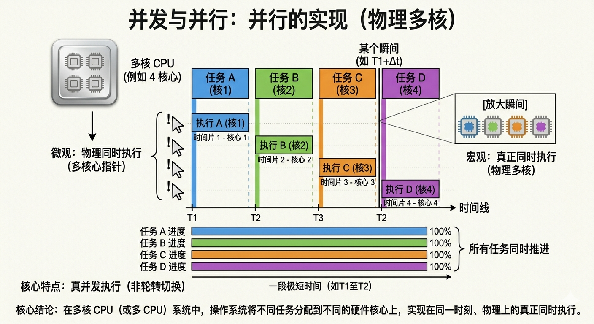

#### 与并发的关系

并发与并行其实是相互依存的关系：

- **在 单 CPU 中**：**不存在并行，只有并发处理（“时间片轮转调度”）处理**
- **在 多 CPU / 多核心的单 CPU 中**：**并发与并行同时存在**
  - **一个 CPU（或 CPU 核心之一）可以并发执行不同的任务（程序），多个 CPU（或多个 CPU 核心）可以并行的处理不同的任务**

##### 结构与执行的关系

- **并发是“逻辑结构”：** 它决定了程序如何组织，即将大任务拆分成多个可以独立运行的小任务
- **并行是“物理执行”：** 它决定了这些任务在硬件上是否真的在同一时刻运行
- **关系：** 并发是并行的**前提**。如果程序没有设计成并发结构，即便给它 100 个 CPU 核心，它也无法并行运行

##### 微观与宏观的统一

在多核 CPU 上，这种依存关系表现得淋漓尽致：

- **微观并行：** 核心 1 在跑程序 A，核心 2 在跑程序 B。这是真正的并行
- **宏观并发：** 即使有多个核心，每个核心内部依然在进行“时间片轮转”。因为任务数量（进程/线程）往往远多于核心数量
- **结果：** 现代系统利用并行来**提高整体吞吐量**，利用并发来**提高系统的响应能力**

| **维度**     | **并发 (Concurrency)**          | **并行 (Parallelism)**         |
| ------------ | ------------------------------- | ------------------------------ |
| **核心含义** | 逻辑上能够**处理**多个任务      | 物理上能够**同时执行**多个任务 |
| **资源要求** | 单核 CPU 即可（通过时间片切换） | 必须具备多核/多处理器硬件      |
| **侧重点**   | 解决“任务多、资源少”的调度问题  | 解决“速度慢、效率低”的性能问题 |
| **关系**     | 是一套处理方案（设计模式）      | 是一套执行状态（物理现实）     |

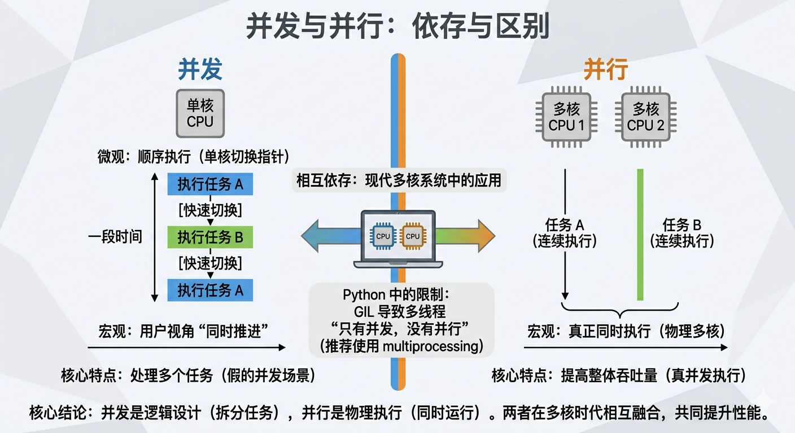

## 进程 &  线程

进程和线程对应着软件程序在操作系统上运行时的基本单位。

### 进程 Process

#### 基本概念

程序是存储在**磁盘（永久仓库）**中的**静态文件**。它**由一系列计算机 CPU 能够理解的指令**（如加法、跳转、读取内存）和**数据**（如数字、文本）组成。

- **对比：** 当程序被加载到**内存**并由 **CPU** 执行时，它就变成了**进程（Process）**，即 **“运行中的程序”** 。

|                        | 存储位置                                                     | 存在状态 | 运行过程             |
| ---------------------- | ------------------------------------------------------------ | -------- | -------------------- |
| **程序（可执行文件）** | 磁盘                                                         | 静态的   | 无运行过程           |
| **进程**               | **存在内存中，它是从磁盘中的静态程序二进制文件拷贝到内存中的副本** | 动态的   | 有生命周期、运行过程 |

核心概念：

- 资源角度：在计算机的世界里，**进程（Process）**是**操作系统分配资源（如内存、CPU 运行时间）的最小单位**。简单来说，一个运行中的 `.exe` 或 App 就是一个进程。

- CPU 调度机制：在**同步模式下，操作系统为了保证“一件事做完再做下一件”，会把当前的进程/线程挂起（放入等待队列）**。此时 **CPU 会切换去处理其他人的任务**，而挂起的程序就在那**干等着**，直到磁盘把数据准备好**发送中断信号，系统才把挂起的程序唤醒**。

  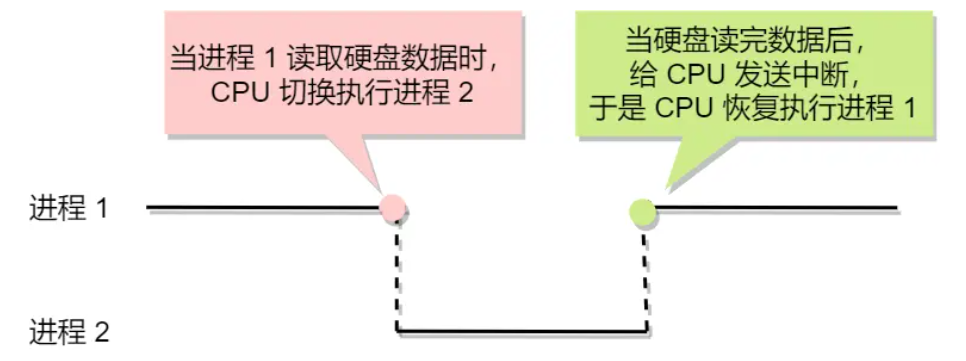

  这种**多个程序、交替执行**的思想，就是 CPU 管理多个进程的初步想法。

  而对于一个支持**多进程**的系统，**CPU 会从一个进程快速切换到另一个进程，期间每个进程各自运行几十或几百 ms**。

  虽然**单核的 CPU 在某一瞬间，只能运行一个进程**；但在 1s 秒钟期间，它可能会运行多个进程，这就产生了**并行的错觉**，实际上它是**并发**。

  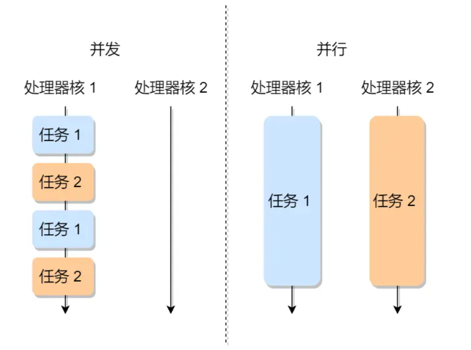

- 内存管理：**每个进程在内存中都有自己独立的一块内存空间**，即**进程上下文**

#### 进程的状态（生命周期）

根据 **CPU 任务调度**的机制，可以知道进程本身具有【**运行-暂停-运行**】的活动规律。

> [!NOTE]
>
> 【运行-暂停-运行】：**在 CPU 高频切换不同进程的过程中，如果一个进程在运行期间遇到了阻塞操作，CPU 会将其暂停挂起，直到进程的阻塞操作完成，向 CPU 发送一个中断信号后，CPU 才会继续将其挂载运行**。
>
> > 形象比喻：
> >
> > CPU 可以从一个进程（做菜）切换到另外一个进程（买可乐），在切换前必须要记录当前进程中运行的状态信息，以备下次切换回来的时候可以恢复执行。【进程的上下文切换】

##### 活动期间的状态

核心定义：一个**进程在活动期间**至少具备 3 种基本状态：**运行态、就绪态、阻塞态**。

###### 状态切换

根据 **CPU “时间片轮转” 的任务调度机制**，所有**已获得除CPU之外的所有资源（如内存、文件描述符）的进程都会在一个任务队列容器（Queue） 中 “排队” 等候 CPU 调度运行，当前面的进程 “时间片” 用完就会切换到下一个进程执行**，以此类推。

- **就绪态（Ready）**：

  - **进程已获得除CPU之外的所有资源**（如内存、文件描述符）
  - 在“队列运行容器”中，就绪态进程被放在**就绪队列**中排队，等待 CPU 调度器分配 CPU 时间片
  - 只要**被 CPU 调度选中**，便可立即进入**运行态**

- **运行态（Running）**：

  **进程正在CPU上执行指令**（进程上下文已加载到CPU寄存器、程序计数器等）

  在CPU容器中，**当前仅有一个进程处于运行态**（单核视角；多核则每核一个）

  - 此时进程会发生两种情况而退出：
    - **时间片用完或被高优先级进程抢占 → 回到就绪队列**
    - **需要等待某事件（磁盘I/O、用户输入、锁释放等）→ 进入阻塞态**

- **阻塞态（Blocked/Waiting）**：

  - **进程因等待某事件而无法继续执行，即使CPU空闲也不能运行**
  - 在容器中，阻塞态进程**不在就绪队列中**，而是被移入**等待队列**（或称阻塞队列）
  - 当**等待的事件完成**（如I/O中断、信号量释放），进程自动**回到就绪队列，重新竞争 CPU 调度资源**

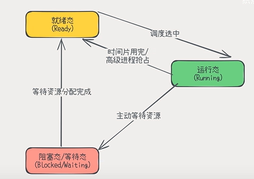

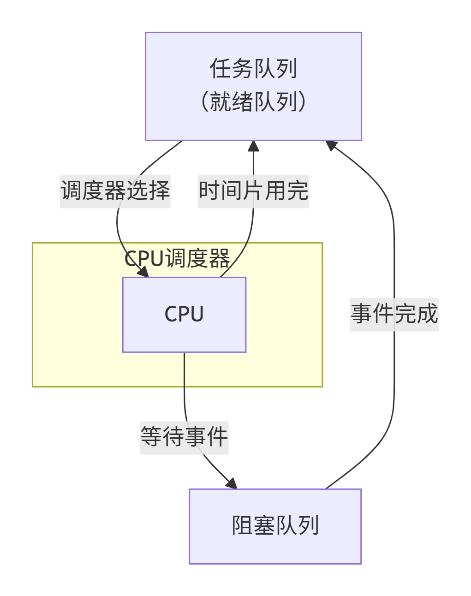

###### 关键转换条件

- **就绪 → 运行**：调度器（如CFS、时间片轮转）选择该进程
- **运行 → 就绪**：时间片耗尽、被抢占（例如实时进程就绪）
- **运行 → 阻塞**：系统调用（read, sleep）、同步锁等待、页面错误中断等
- **阻塞 → 就绪**：事件完成（I/O完成、锁获得、sleep时间到）

##### 创建-结束状态

除了就绪态-运行态-阻塞态 这 3 个活动期间的进程状态之外，进程还具有以下 2 个状态：

- **创建态（New）**：进程正在被创建的状态
- **结束态/终止态（Exit）**：进程正在从系统中消失的状态

###### 完整的状态切换

- **NULL -> 创建状态**：一个新进程被创建时的第一个状态
- **创建状态 -> 就绪状态**：当进程被创建完成并初始化后，一切就绪准备运行时，变为就绪状态，这个过程是很快的
- **就绪态 -> 运行状态**：处于就绪状态的进程被操作系统的进程调度器选中后，就分配给 CPU 正式运行该进程
- **运行状态 -> 结束状态**：当进程已经运行完成或出错时，会被操作系统作结束状态处理
- **运行状态 -> 就绪状态**：处于运行状态的进程在运行过程中，由于分配给它的运行时间片用完，操作系统会把该进程变为就绪态，接着从就绪态选中另外一个进程运行
- **运行状态 -> 阻塞状态**：当进程请求某个事件且必须等待时，例如请求 I/O 事件
- **阻塞状态 -> 就绪状态**：当进程要等待的事件完成时，它从阻塞状态变到就绪状态

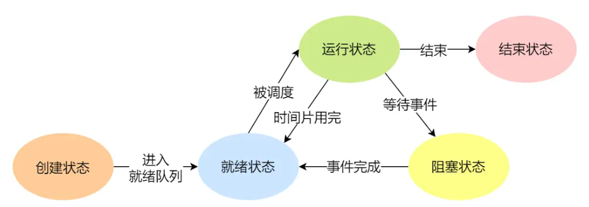

#### 内存管理

##### 进程上下文

核心定义：包含了**进程在执行过程中所具有的信息**。如下：

- **用户态**层级：进程**在用户态下运行时的“工作区”**，主要**存储在内存（RAM）中**
  - **程序代码（Text Segment）：** 正在运行的可执行机器指令
  - **用户数据（Data Segment）：** 包含全局变量、静态变量
  - **堆（Heap）：** 进程在运行期间动态分配的内存
  - **用户栈（User Stack）：** 存储局部变量、函数参数和返回地址
- **寄存器上下文**：**CPU 内部的状态**，是切换速度最快、也最关键的部分
  - **程序计数器 (PC / IP)：** 指向下一条将要执行的指令地址
  - **栈指针 (SP)：** 指向当前栈顶的位置
  - **通用寄存器：** 存储正在计算的中间结果（如数据寄存器、变址寄存器）
  - **状态寄存器 (PSW)：** 存储 CPU 的状态位（如零标志、进位标志、中断屏蔽位）
- **内核态**层级：**操作系统内核为了管理该进程而维护的信息**
  - **进程控制块 (PCB)：** 包含进程 ID (PID)、状态（就绪/运行/阻塞）、优先级等
  - **页表/段表：** 用于虚拟内存到物理内存的映射信息
  - **核心栈 (Kernel Stack)：** 当进程进入内核态（如执行系统调用）时使用的栈
  - **资源清单：** 进程打开的文件描述符、占用的信号量、I/O 设备信息等


##### 进程控制块 (PCB)

进程控制块 (PCB) 是指**一个进程在运行时的一系列的属性和资源相关信息**，统称为 **PCB（Process Control Block）**

- PCB 是**操作系统中用于描述进程的一种数据存储结构**。它是**进程存在的唯一身份信息**，这意味着一个进程的存在必然会伴随着一个 PCB ，如果进程消失了，PCB 也会随之消失。

所包含的进程信息如下：

- **进程描述信息**：

  - **进程 PID**：**标识进程的唯一标识符**
  - **用户标识符**：**进程归属的用户**，用于共享后保护服务

- **进程控制状态与管理信息**：

  - **进程当前状态**：如 **`创建态 New`、`就绪态 Ready`、`运行态 Running`、`阻塞态 Waiting/Blocked` **等
  - **进程优先级：进程抢占 CPU 时的优先级**

- **资源分配清单**：

  有关内存地址空间或虚拟地址空间的信息，**所打开的文件列表和所使用的 I/O 设备信息**

- **CPU 相关信息**：

  **CPU 中各个寄存器的值，当进程被切换时，CPU 的状态信息会被保存到相应的 PCB 中，以便进程重新执行时，能从断点处继续执行**

###### 控制块的组织方式（链表）

描述：操作系统为了**保证 CPU 任务队列（Queue）中的进程能有序执行**，会**在每个进程控制块 PCB 中添加一个 `next` 指针，指向下一个要运行的进程**。并**根据进程的不同状态（就绪态、阻塞态）**以**链表**的形式组织，把**具有相同状态的进程链在一起，放在各自的队列（就绪队列、阻塞队列）**。


执行流程

- **就绪队列**：CPU 会首先**读取就绪队列中的进程**，该进程会**从就绪队列中移除**，转为**运行态**；当 **CPU 给运行态进程分配的“时间片” 到期**后，会**根据 `next` 找到下一个进程，继续执行**，以此类推
- **阻塞队列**：
  - 进程**因等待 I/O 或事件进入阻塞队列**，当外设完成 I/O（例如磁盘读取完成、键盘输入到达），**硬件发出中断信号**；
  - CPU 响应中断 → 保存当前进程的上下文 → 执行**中断处理程序**
  - 中断处理程序将**阻塞队列中的那个进程**移到就绪队列（而不是直接变成运行态）
  - 中断返回后，可能：
    - 继续执行原进程（通常抢占式内核会重新调度，如果新就绪的进程优先级更高，则会切换过去）

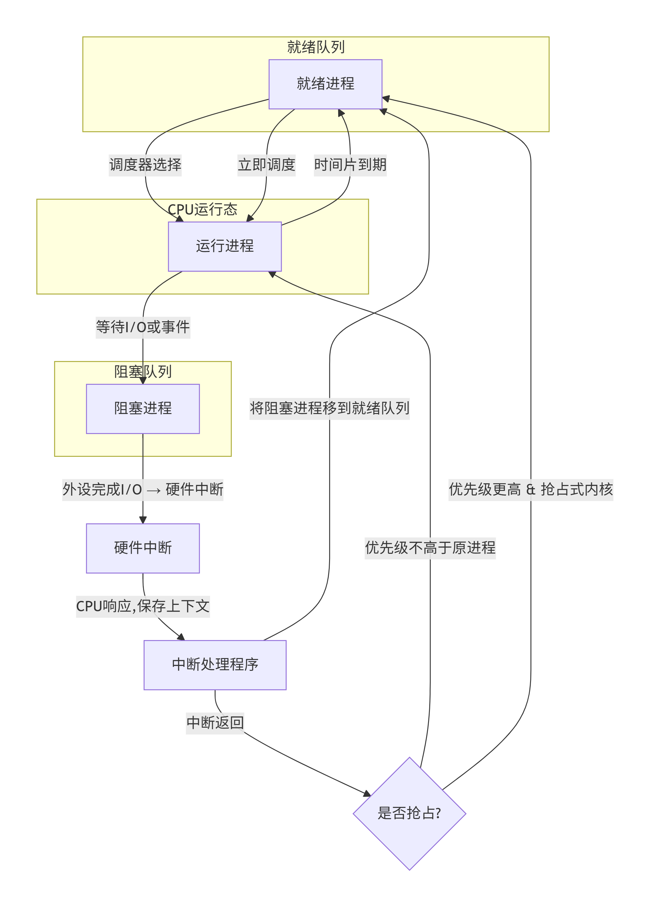

###### 进程 ID（PID）

进程 ID（Process ID，PID）是**操作系统为每个进程分配的唯一标识符号**。PID **由系统内核在创建进程时分配，用于管理和追踪进程**。

默认情况下，PID 的取值范围为 **0 到 32768**。当**一个进程结束**后，其 **PID 可能会被新的进程重新使用**。

- 查看进程信息的方式：

  - 资源管理器：

    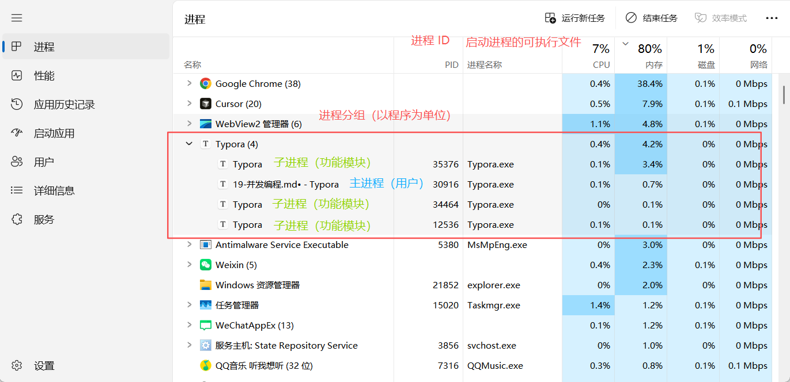

  - 资源监视器：

    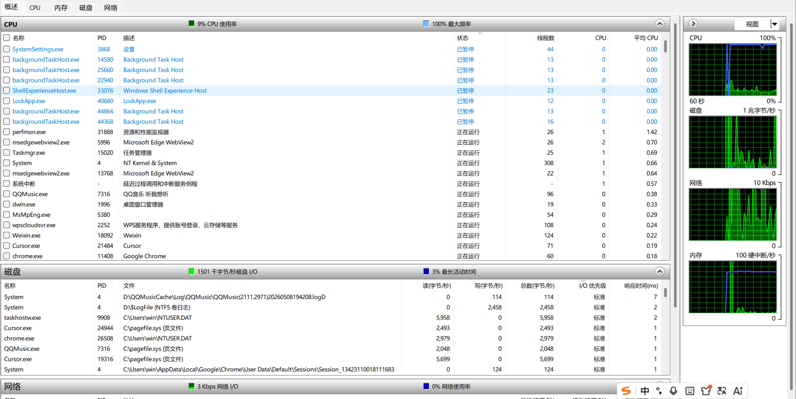

  - Python 程序查看：**通过 `import os` 模块查看当前运行的 `python.exe` 的进程 PID**

    ```python
    # 进程
    import os
    
    print(os.getpid())  # 查看当前运行的 python.exe 进程的 id 29984
    ```

##### 进程上下文切换

核心概念：各个进程之间的共享 CPU 资源的，在不同的时候进程之间需要切换，让不同的进程可以在 CPU 中执行。这种**一个进程切换到另一个进程运行**，被称为**进程的上下文切换**。

核心定义：**CPU 在切换任务（程序）前，必须将当前任务（程序）的状态、信息（寄存器数值、程序计数器 PC 指针）以 “栈” 的形式保存在内存中，接着再切换到下一个任务执行**；等到另一个任务的 “时间片时钟” 到期时，会从内存中提取出进程的上下文再继续执行；以此类推

执行流程：

当操作系统决定挂起当前进程并运行另一个进程时，会发生**上下文切换**：

1. **保存**当前进程 A 的上下文到其 PCB 和内核栈中
2. **加载**新进程 B 的上下文（从其 PCB 中读取寄存器值等）
3. **跳转**到进程 B 之前停止的地方继续执行


###### 缺点

- **切换损耗**：在**内存中频繁的保存与恢复任务（程序）的信息**是**需要消耗 CPU 计算性能**的。如果**“时间片” 分得太短**，CPU 可能大部分时间都在**忙着 “切换 > 恢复 > 保存” 这一工作流程，而非真正的执行程序**；而如果**太长，用户就又会感觉到明细的卡顿**。

#### 单进程

定义：**程序在运行时只有一个进程。所有的任务（UI 显示、数据计算、网络请求）都在这个进程内完成**。

核心概念：一个程序运行后只开启一个进程，该程序涉及到的所有计算机资源都在这一个进程中运行计算，如果其中一个功能模块出问题，那么会导致整个程序崩溃。

核心要点：**一个程序运行时只有一个进程，进程共享程序中的所有信息，且只有一个进程 PID**。

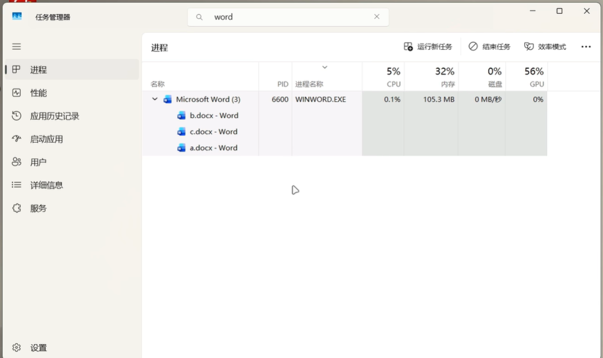

##### 优缺点

- 优点：
  - **资源占用少：不需要额外的内存空间来开辟新进程**
  - 架构简单：**不涉及进程间通信（IPC）**，逻辑简单、直接
- 缺点：
  - 脆弱性：“一损俱损”。**如果一个程序开启的一个功能模块崩溃（如内存溢出），则整个程序都会直接退出**
  - 性能瓶颈：**无法充分利用现代多核 CPU 的并行计算能力**
- **典型例子：** 早期的文本编辑器、简单的命令行工具。

#### 多进程

##### 基本概念

> 一个正在运行的程序，背后对应着一个或多个进程。类似于 “一个人包揽所有活”和“一个团队分工协作”。

定义：**程序启动后，父进程会衍生出多个子进程，各子进程之间拥有独立的内存空间，互不干扰**。

核心概念：**多个子进程负责各自的功能模块，且可以通过进程通信来互相交流数据**。

> 在多进程架构中，**“功能模块”**指的是将一个复杂程序拆解后，交给独立进程运行的 **逻辑单元**。这种设计遵循了“各司其职”的原则，确保每个进程只负责一件特定的事情。

##### 核心要点

**一个程序至少要有一个父进程负责统筹一切衍生的子进程，且父进程与子进程都有各自的进程 PID**。

> 生动比喻：
>
> **1. 程序 = 工厂**
>
> - 工厂有独立的厂区、设备、原材料来源
>
> **2. 父进程 = 厂长**
>
> - 负责：启动工厂、决定开几条流水线、分配任务、监督运行、处理异常、在结束时关闭工厂
> - 厂长通常不亲自拧螺丝，但控制一切
>
> **3. 子进程 = 独立的流水线 / 车间**
>
> - 每条流水线有自己的人员和设备（独立的内存空间、资源）
> - 可以**并行**工作，互不干扰
> - 一条流水线出问题（崩溃），通常不影响其他流水线


###### 优缺点

- 优点：

  - **高可靠性（隔离性）**：**一个进程崩溃通常不会导致主进程和其他子进程挂掉**

    > 比如 Chrome 浏览器的某个标签页卡死，通常不会让整个浏览器关掉。

  - **高性能**：**可以将任务分配到不同的 CPU 核心上同时运行（真正的并行）**

  - **安全性**：不同进程间数据隔离，降低了权限越界的风险

- 缺点：

  - **开销大**：**创建和切换进程比线程要重的多，消耗更多内存**
  - **通信复杂**：**进程间不能直接共享内存。需要靠管道、信号量、套接字（Socket）等方式通信**

- **典型例子：** Google Chrome 浏览器（每个标签页/插件通常是一个进程）、Nginx 打印服务。

  > 如最典型的 Google Chrome 浏览器 就是一个多进程架构的软件程序，它将不同的任务完全隔离在不同的进程中：
  >
  > - **渲染模块（Renderer Process）：** 负责解析 HTML、CSS、JavaScript，并把网页画出来。每个标签页通常就是一个独立的渲染进程
  > - **插件模块（Plugin Process）：** 专门运行 Flash 或各类扩展插件，防止插件崩溃导致整个浏览器卡死
  > - **GPU 模块（GPU Process）：** 专门处理图形渲染和 3D 加速，独立于网页内容
  > - **网络模块（Network Process）：** 统一处理所有的网络请求、下载和缓存
  >
  > 子进程（功能模块）之间的 IPC 通信：
  >
  > 例如： “渲染进程”解析完网页后，发现需要下载一张图，它不能直接去联网，而是通过 IPC 给“网络进程”发个消息：“请帮我下载这张图，下载完把数据传给我”。
  >
  > 
  >
  > 随着硬件性能的过剩和对**稳定性**要求的提高，现代大型软件倾向于**多进程架构**。
  >
  > **举个例子：** 如果正在写一篇 5000 字的博客（Chrome 标签页 A），同时在另一个标签页（B）打开了一个有 Bug 的恶意网页
  >
  > - 如果是**单进程**：网页 B 崩溃会导致整个浏览器关闭，没保存的博客就没了
  > - 如果是**多进程**：只有网页 B 的进程会被系统杀掉，博客标签页 A 依然安然无恙

##### 父子进程关系

父子进程描述的是进程之间的一种 **“继承”** 和 **“管理”** 关系。**多进程架构**的程序就是**依靠父子进程的继承管理关系来维持运行的**。

在操作系统中，**除了初始进程外，几乎所有进程都是由另一个进程创建的**，即**若进程创建了一个进程，那么这两个进程就存在父子关系**。

###### 核心定义

- **父进程（Parent Process）**：**启动新进程时的那个原始进程**，也可以说它是一个主进程。它像是一个 “管理者”。
- **子进程（Child Process）**：被创建出来的那个新进。它像是一个 “执行者”。

常见于**当一个进程的内容太多时，可以将不同的任务拆解成多个子进程，子进程负责各自独立的功能、且持有不同的进程 ID 和 内存资源**。

###### 继承关系

在操作系统中，**所有进程（除了 `init` 和 `systemd` 内核进程）都会有一个父进程**。

当父进程创建一个子进行时，子进程通常会**继承**父进程的大部分环境（比如打开的文件、环境变量等），但它拥有自己独立的**进程 ID (PID)** 和内存空间。

核心本质：**创建与被创建的关系**。

核心作用：

- 跟踪进程的来源：通过 PPID 可以找到哪个进程创建了当前进程
- 管理子进程：**当一个进程创建新的进程（子进程）时，子进程会继承父进程的环境，并由父进程管理**

> **例子：**
>
> - 在命令行（`cmd.exe`，这是一个进程）中输入 `notepad` 并回车，此时 `cmd.exe` 就是 `notepad.exe` 的**父进程**
> - 双击桌面上的微信图标，操作系统的资源管理器（`explorer.exe`）会启动微信，此时 `explorer.exe` 就是微信进程的**父进程**
> - Chrome 浏览器启动时，主进程会创建多个子进程（用于标签页、插件等），那么 Chrome 的主进程是这些子进程的**父进程**

> [!NOTE]
>
> **进程是如何产生的**？
>
> 最经典的创建方式是 **`fork()`** 机制：（Linux 使用 `fork()` 、Windows 使用 `spawn`、MacOS 支持 `fork & spawn`）
>
> 1. **克隆：** 父进程调用 `fork()`
> 2. **分裂：** 操作系统瞬间复制一份父进程的“镜像”给子进程。此时，**父子进程的代码一模一样**
> 3. **各奔东西：** 子进程随后通常会调用 `exec()` 函数，把自己的代码替换成想要运行的新程序（比如从“浏览器父进程”变成“渲染子进程”）

###### 父进程 ID（PPID）

父进程 ID（Parent Process ID，PPID）是**指创建当前进程的父进程 ID**。

核心要点：PPID 用于**建立进程之间的层级关系**；**每个进程上下文（PCB）都有一个父进程 ID 属性**，表示**它是由哪个进程创建的**。

- 如何查看父子进程的 ID ？

  以 Windows 为例，可以通过以下命令查看操作系统中 `Typora.exe` 软件程序中多进程之间的关系：

  ```cmd
  wmic process where "Name='Typora.exe'" get Name,ParentProcessId,ProcessId
  ```

  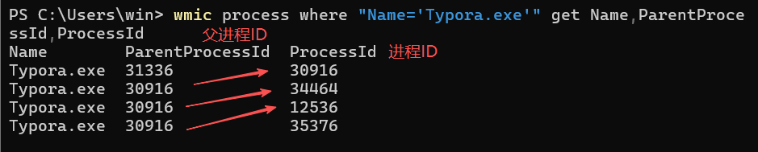

​	系统内核进程：在系统启动时创建的两个内核进程，它们没有父进程。

​	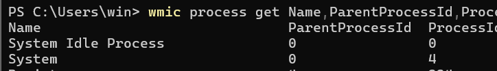

- Python 程序查看：**通过 `import os` 模块来查看当前 `python.exe` 程序执行的进程 PID 与 父进程 PPID**

  ```python
  # 进程
  import os
  
  print(os.getpid())  # 查看当前运行的 python.exe 进程的 id 29984
  print(os.getppid())  # 查看当前运行的 python.exe 进程的父进程的 id 31284
  ```

###### 孤儿进程

核心定义：如果父进程被结束，子进程可能会变成**“孤儿进程”**（在某些情况下会被系统托管，或者也会被结束）。

如何管理：

- 操作系统的**内核进程（`init` 或 `systemd`）**会**收养**这些父进程终止的**“孤儿进程”**，防止它们变成**僵尸进程**。

  > 僵尸进程：**就是一个已经停止运行，但还没有被“收尸”的进程。**
  >
  > 生命周期：
  >
  > 1. **创建**：父进程通过系统调用（如`fork`）创建子进程。
  > 2. **运行**：子进程正常工作。
  > 3. **终止**：子进程运行结束，会调用`exit()`退出。这时，它的**大部分资源**（如内存、打开的文件）都被系统回收了。
  > 4. **“收尸”（关键步骤）**：子进程退出后，会留下一个极小的“遗体”——**进程描述符**（task_struct），里面包含**退出状态码**（告诉父进程是正常结束还是出错）、运行统计信息等。这个“遗体”必须由它的**父进程**通过系统调用`wait()`或`waitpid()`来**回收**。
  > 5. **完全消失**：父进程调用`wait()`收到状态码后，系统才彻底删除子进程的所有痕迹。
  >
  > **如果父进程忘了调用`wait()`，或者被阻塞了无法调用，那么子进程的“遗体”就会一直留在系统进程表中。** 这个状态下的进程，就是**僵尸进程**（Zombie Process）。

子进程的行为：**父进程终止后，子进程的 PPID 会变化**

- 当一个子进程成为**孤儿进程**时，该子进程**不会自动终止，而是继续运行**，且它的 **PPID 转为系统内核进程（`init`或 `systemd` ）的进程 ID 为 0**

##### 单进程与多进程的区别对比

| **特性**       | **单进程**               | **多进程**             |
| -------------- | ------------------------ | ---------------------- |
| **内存使用**   | 低（共享同一块空间）     | 高（每个进程独立分配） |
| **稳定性**     | 差（一个错，全盘崩）     | 强（进程故障互不影响） |
| **CPU 利用率** | 低（通常只能用单核）     | 高（支持多核并行）     |
| **通信难度**   | 极低（直接读写全局变量） | 高（需使用 IPC 机制）  |
| **切换开销**   | 无                       | 大（涉及上下文切换）   |

#### 进程之间的通信

##### 操作系统的内核态与用户态

为了保证操作系统的安全与稳定性，操作系统**根据执行的程序权限**不同**将 CPU 的运行级别**划分为了 **内核态（Kernel Mode）** 与 **用户态（User Model）**。

- **用户态：** 权限受限，只能访问自己的内存空间，不能直接操作硬件
- **内核态：** 拥有最高权限，可以执行任何 CPU 指令，访问所有硬件资源

| **维度**     | **内核态 (Kernel Mode)**                            | **用户态 (User Mode)**                                 |
| ------------ | --------------------------------------------------- | ------------------------------------------------------ |
| **权限级别** | **最高权限**。可以访问硬件、所有内存空间及 CPU 指令 | **受限权限**。只能访问分配给该进程的特定内存空间       |
| **运行对象** | 操作系统内核（Kernel）的驱动程序、进程调度等        | 普通应用程序（如 Chrome、VS Code、你写的 Python 代码） |
| **安全性**   | 极其关键。一旦出错，系统会蓝屏或崩溃                | 相对安全。如果程序崩溃，只会关掉该程序，不影响系统     |
| **别名**     | 环 0 (Ring 0)                                       | 环 3 (Ring 3)                                          |

核心要点：为了防止如果任何程序都能直接修改硬件设置，电脑可能随时崩溃的可能性。

###### CPU 权限状态的切换

应用程序在运行过程中，不可避免地需要用到硬件资源（比如读取文件、发送网络包、分配内存）。

这时，它必须通过**系统调用（System Call）** 向操作系统申请，产生一次 **“模式切换”**。

1. **用户态程序** 发起请求（例如 `open()` 一个文件）
2. **CPU 切换** 到内核态
3. **内核** 检查权限，执行硬件操作，获取数据
4. **内核** 将结果返回给程序
5. **CPU 切换** 回用户态，程序继续运行

###### 性能优化手段（异步 I/O）

由于 **CPU 权限状态的切换存在性能开销**，如果程序代码中进行频繁、小规模的 I/O 操作（比如一个字节一个字节地写入文件），会产生大量的**系统调用（System Call）**，导致 **CPU 不停的在 内核态 与 用户态 之间反复 “横跳”，效率会大大降低**。

于是，一些高性能框架会通过**缓冲区（Buffer）**和 **异步 I/O 框架**的方式来实现**减少 CPU 在 “内核态” 与 “用户态” 之间的切换次数**，以降低性能开销，**提升 CPU 执行效率**。

##### 进程之间的通信方式

在操作系统中，每个进程都有自己**独立的虚拟内存空间**，**进程 A 无法直接访问进程 B 的内存数据**；为了实现**进程之间的数据通信**，必须借助 “中间人” —— **内核（Kernel）**。

简单来说，**进程之间是不能互相访问的，但内核空间的数据是每个进程都共享的，所以进程之间的通信必须要经过内核**。

- 核心本质：进程之间的通信实质上就是**将程序从用户态频繁切换为内核态**，**借助内核态的 CPU 权限访问内核中的共享数据**，从而**实现进程之间的数据通信**

  > 类似于 Vue 的状态管理 State（多个实例通过一个 “中间层” 来管理共享状态数据，并进行通信）

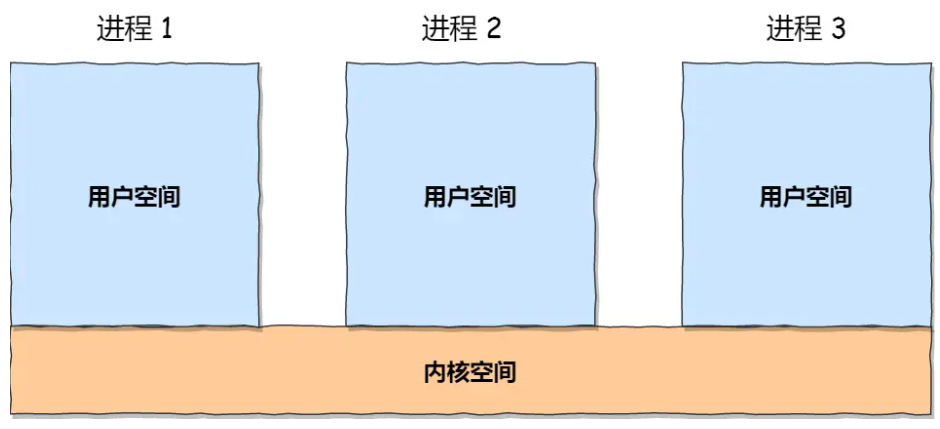

###### 常用通信方式

进程之间的通信方式主要有如下几种：

- **管道（Pipe）**

- **消息队列（Queue）**

  在处理**高并发**或**耗时任务**（如大模型推理、视频转码）时，Queue 消息队列是最常用的工具

  - **为什么常用：** 它能让发送者和接收者解耦。发送者把任务丢进队列就可以去干别的，接收者根据自己的节奏慢慢处理，这就是常说的“削峰填谷”。
  - **工具代表：** Python 中的 `multiprocessing.Queue`（单机进程间），以及生产环境常用的 `Redis` 或 `RabbitMQ`（分布式）

- **共享内存**

  如果追求的是**极致的速度**（例如超大规模矩阵运算、图像实时处理），共享内存是无可替代的。

  - **为什么常用：** 它是速度最快的 IPC 方式。数据不需要在内核和用户空间之间来回拷贝，多个进程直接读写同一块物理内存。
  - **代价：** 这种方式最难写，因为需要手动处理“锁”机制（Semaphore/Mutex），防止两个进程同时修改数据导致系统崩溃。

- **PV 信号量**

- **信号**

- **Socket 套接字**

  这是目前**最广泛使用**的通信方式，尤其是在 Web 开发、微服务和 AI 应用（如 RAG 系统与 LLM 服务交互）中

  - **为什么常用：** 它不局限于单机，可以跨网络、跨机器通信。即使在单机内部，使用 `127.0.0.1` 进行 Socket 通信也非常稳定
  - **应用场景：** 前端 Nuxt3 与 Python 后端 API 的交互、数据库连接、分布式爬虫

进程之间的通信方式并没有绝对的“第一常用”方式，因为选择哪种方式完全取决于**业务场景**和**开发语言**。

| **场景**                | **推荐方式**                | **理由**                     |
| ----------------------- | --------------------------- | ---------------------------- |
| **单机、简单任务**      | **管道（Pipe）/ 信号量**    | 结构简单，开销小。           |
| **单机、生产者-消费者** | **队列（Queue）**           | 逻辑清晰，自动处理同步问题。 |
| **大数据量、高性能**    | **共享内存**                | 避免数据拷贝，减少延迟。     |
| **跨网络、微服务**      | **套接字（Socket / gRPC）** | 兼容性最强，支持跨语言。     |

###### 传统 IPC 通信方式

大多数传统的进程通信方式（如管道、消息队列、信号量）都需要经历从**用户态到内核态**的频繁切换。

1. **进程 A 发送数据：** 进程 A 在用户态调用 `write()`，将数据从自己的**用户缓冲区**复制到**内核缓冲区**。此时发生一次**用户态到内核态**的上下文切换。
2. **内核中转：** 操作系统内核接收到数据，将其暂存在内存中（内核空间）。
3. **进程 B 接收数据：** 进程 B 调用 `read()`，内核将数据从**内核缓冲区**复制到进程 B 的**用户缓冲区**。此时再次发生**内核态到用户态**的切换。

> **性能损耗点：**
>
> - **4 次上下文切换：** A 进程进出内核，B 进程进出内核。
> - **2 次数据拷贝：** 用户态  →  内核态，内核态 → 用户态。

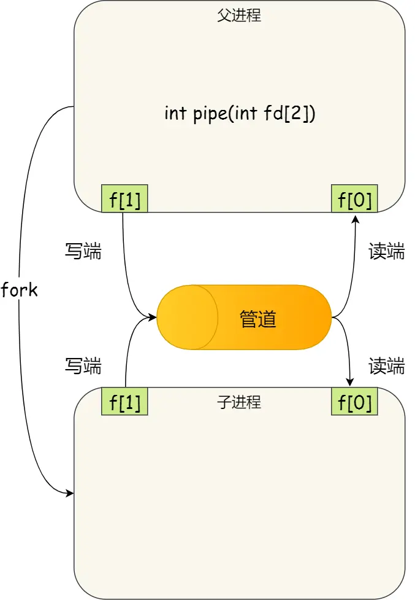

###### 高效 IPC - 共享内存

为了规避内核态与用户态频繁切换带来的开销，**共享内存**是最快的 IPC 方式。

- **原理：** 内核在物理内存中开辟一块区域，然后通过页表映射，将这块物理内存同时挂载到进程 A 和进程 B 的虚拟地址空间中。
- **通信过程：**
  - 一旦映射完成，进程 A 往这块内存写数据，进程 B 几乎瞬间就能看到。
  - **全程在用户态完成**，不再需要通过 `read/write` 系统调用进入内核态，也不存在内核缓冲区的数据拷贝。

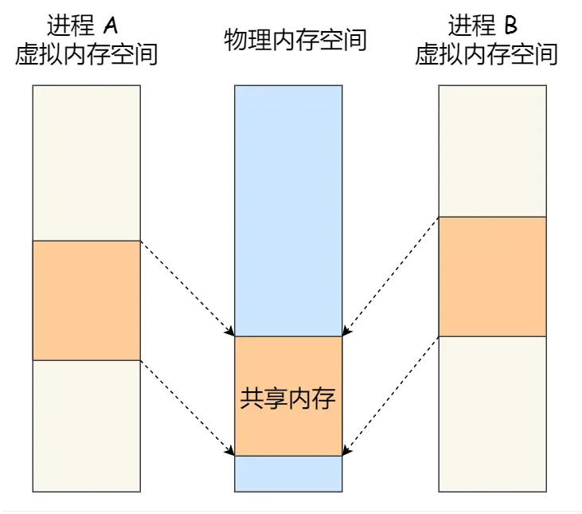

###### 总结

| **通信方式**      | **涉及状态切换**       | **数据拷贝次数** | **特点**                             |
| ----------------- | ---------------------- | ---------------- | ------------------------------------ |
| **管道/消息队列** | 频繁（系统调用）       | 2 次             | 安全、简单，但大数据量下效率低       |
| **共享内存**      | 仅在建立连接时进入内核 | 0 次（直连）     | 速度极快，但需要用户态自己处理同步锁 |
| **Socket (本地)** | 频繁（走协议栈）       | 2 次             | 跨进程最通用，但开销相对最大         |

##### 管道 Pipe

在操作系统中，管道（Pipe）是最基本的进程间通信机制（IPC）。

###### 基本概念

在计算机科学中，**Pipe（管道）**是一种非常基础且核心的概念。

核心定义：**Pipe（管道）**本质上是一种 **FIFO（先进先出）**的**数据结构**。

- **流入（Inflow）**：**数据从管道一端流入**
- **流出（Outflow）**：**数据从管道另一端流出**

> 形象比喻：就像现实中的水管一样，数据从一端流入，从另一端流出。


###### 底层工作原理

核心本质：**Pipe（管道）**在底层本质上就是**系统内核中维护的一块内存缓冲区**（通常是一个**环状队列**）。

核心概念：这个 Pipe（管道）表示的内存缓冲区被看作一个“伪文件”，这意味着进程可以像读写普通文件一样，使用 `write()` 和 `read()` 系统调用来操作它，但它在磁盘上并没有真实的对应文件。

> 管道的 “两端”：
>
> 一个管道会暴露出两个文件描述符（File Descriptor, FD）：
>
> - **`fd[0]`**：**读端**（Data In / Read），进程从这里读取数据。
> - **`fd[1]`**：**写端**（Data Out / Write），进程往这里写入数据。

- 数据在管道中是**单向流动**的（半双工），只能**从写端流向读端**：

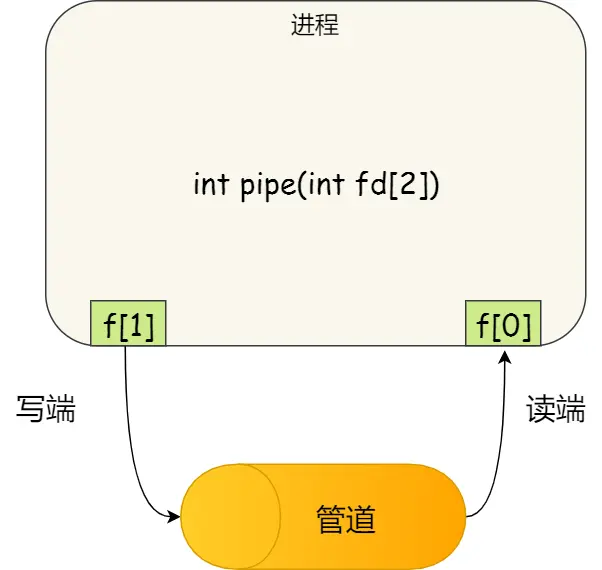

- 如果需要**双向通信**，必须建立**两个管道**：


大多数传统的进程通信方式（如管道、消息队列、信号量）都需要经历从**用户态到内核态**的频繁切换。

1. **进程 A 发送数据：** 进程 A 在用户态调用 `write()`，将数据从自己的**用户缓冲区**复制到**内核缓冲区**。此时发生一次**用户态到内核态**的上下文切换。
2. **内核中转：** 操作系统内核接收到数据，将其暂存在内存中（内核空间）。
3. **进程 B 接收数据：** 进程 B 调用 `read()`，内核将数据从**内核缓冲区**复制到进程 B 的**用户缓冲区**。此时再次发生**内核态到用户态**的切换。

> **性能损耗点：**
>
> - **4 次上下文切换：** A 进程进出内核，B 进程进出内核。
> - **2 次数据拷贝：** 用户态  →  内核态，内核态 → 用户态。


###### 四大核心特性

| **场景（状态）**             | **行为结果 / 机制**                                          |
| ---------------------------- | ------------------------------------------------------------ |
| **读端读取空管道**           | 如果写端没关闭，**读进程会阻塞（Wait）**，直到写端有数据写入。 |
| **写端写入满管道**           | 管道缓冲区（通常为 64KB）满了，**写进程会阻塞**，直到读进程移走数据。 |
| **写端全部关闭，读端继续读** | 读进程读完剩余数据后，`read()` 会**返回 0**，表示读到文件末尾（EOF）。 |
| **读端全部关闭，写端继续写** | 操作系统会向写进程发送 **`SIGPIPE` 信号**，直接终止写进程（因为写了也没人听，属于异常操作）。 |

###### 管道的实现

在底层代码中（如 C 语言或 Python 的 `os` 模块），父子进程通信的经典范式如下：

1. **父进程创建管道**：调用 `pipe(fd)`，得到 `fd[0]` 和 `fd[1]`。
2. **父进程调用 `fork()`**：创建出子进程，子进程完全继承这两个描述符。
3. **关闭不必要的端（核心步骤）**：
   - 如果希望**父进程写、子进程读**：
     - 父进程关闭读端 `close(fd[0])`
     - 子进程关闭写端 `close(fd[1])`
4. **开始通信**：父进程 `write()`，子进程 `read()`。

##### 消息队列 Queue

前面说到管道的通信方式是**效率低**的，因此**管道不适合进程间频繁地交换数据**。 

对于这个问题，**消息队列的通信模式**就可以**解决**。比如，**A 进程要给 B 进程发送消息，A 进程把数据放在对应的消息队列后就可以正常返回了，B 进程需要的时候再去读取数据就可以了。同理，B 进程要给 A 进程发送消息也是如此**。 

再来，消息队列是**保存在内核中的消息链表**：

​	在发送数据时，会分成一个一个独立的数据单元，也就是消息体（数据块），消息体是用户自定义的数据类型，消息的发送方和接收方要约定好消息体的数据类型，所以每个消息体都是固定大小的存储块，不像管道是无格式的字节流数据。如果进程从消息队列中读取了消息体，内核就会把这个消息体删除。

- **消息队列生命周期**：

  **随内核**，如果**没有释放消息队列或者没有关闭操作系统，消息队列会一直存在**，而前面提到的匿名管道的生命周期，是随进程的创建而建立，随进程的结束而销毁。 

消息这种模型，两个进程之间的通信就像平时发邮件一样，你来一封，我回一封，可以频繁沟通了。

但邮件的通信方式存在不足的地方有两点，一是**通信不及时**，二是**附件也有大小限制**，这同样也是**消息队列通信不足的点**。

消息队列**不适合比较大数据的传输**，因为**在内核中每个消息体**都有一个**最大长度的限制**，同时所有队列所包含的全部消息体的总长度也是有上限。

**消息队列通信过程中**，存在**用户态**与**内核态**之间的**数据拷贝开销**，因为**进程写入数据到内核中的消息队列**时，会**发生从用户态拷贝数据到内核态的过程**，同理另一进程读取内核中的消息数据时，会发生从内核态拷贝数据到用户态的过程。


### 线程 Thread

在早期的操作系统中都是以**进程**作为独立运行的基本单位，直到后面，计算机科学家们又提出了**更小的能独立运行的基本单位**，即**线程**。

#### 为什么需要线程？

假设要编写一个视频播放软件，单进程与多进程的实现方式如下：

- **单进程**：通常**在一个 `.py` 文件创建多个对应功能的函数**，在一个 `python.exe` 程序（进程）中**同步串行执行**。

  ```python
  def read(): pass
  
  def decompress(): pass
  
  def play()
  
  if __name__ == '__main__':
      read() # 读取文件数据 --> IO 操作（可能存在阻塞）
      decompress() # 解压缩数据 --> CPU 操作
      play()	# 播放解压缩数据的数据 --> CPU 操作
  ```

  存在以下问题：

  1. 由于单进程的**同步执行**限制，后面的『解压缩-播放』操作必须要**等待**前面的『读取文件』I/O 操作，如果 CPU 能力不足或者说视频二进制文件太过庞大，此时就会导致**阻塞**半天才进行数据解压缩-播放的操作，从而产生视频与声音不连贯的影响
  2. 各个函数之间不是并发执行，影响执行效率

- **多进程**：通常**以创建多个 `.py` 文件，一个 `.py` 文件对应一个功能模块函数**，运行多个 `pytho.exe` 程序（进程）来各自**并发执行**功能函数

  ```python
  def read(): pass
  
  if __name__ == '__main__':
      read() # 读取文件数据 --> IO 操作（可能存在阻塞）
  ```

  ```python
  def decompress(): pass
  
  if __name__ == '__main__':
      decompress() # 解压缩数据 --> CPU 操作
  ```

  ```python
  def play()
  
  if __name__ == '__main__':
      play()	# 播放解压缩数据的数据 --> CPU 操作
  ```

  存在以下问题：

  1. **进程之间隔离**：**难以互相通信**（需**通过额外建立管道、信号量、Socket 套接字连接**等方式）、**难以数据共享**
  2. **维护进程的系统开销较大**；
     - 创建进程时，分配 CPU 等硬件资源、建立 PCB
     - 终止进程时，回收资源、撤销 PCB
     - 进程切换时，保存与恢复当前进程的状态信息

  综合下来：

  - **单进程：IO 操作会造成同步执行的阻塞，影响执行效率**
  - **多进程：进程之间难以通信、数据共享，且创建多个进程系统开销较大（分配资源、进程上下文切换...）**

于是乎，计算机科学家们综合以上问题，创建了一个新的实体（**线程 Thread**），它可以**由进程来创建一个或多个线程**，线程代表的是**进程中的一条执行任务**，且**多个线程可以并发执行，并共享相同的进程内存空间（数据共享）**。

- 线程被称为**“轻量级进程”**，它既能像多进程那样实现**并发执行**，又避开了**资源分配重、通信难**的问题。

| **维度**     | **单进程 (同步串行)**              | **多进程 (并发)**                  | **多线程 (并发 - 推荐)**           |
| ------------ | ---------------------------------- | ---------------------------------- | ---------------------------------- |
| **执行方式** | 按顺序一个接一个执行               | 多个进程同时执行                   | 多个线程在一个进程内同时执行       |
| **实时性**   | **差**：读文件阻塞时，画面就卡住了 | **好**：各模块互不干扰             | **好**：读数据、解码、渲染同步进行 |
| **数据共享** | 简单（都在内存里）                 | **难**：必须使用复杂的 IPC 通信    | **极简**：共享同一进程的内存空间   |
| **系统开销** | 低                                 | **极高**：每个进程都要分配独立内存 | **低**：仅需极少的栈空间开销       |
| **关系比喻** | 一个厨师：洗菜、切菜、炒菜         | 三个厨房：传递食材得跨过大街       | 一个厨房：三个厨师分工合作         |

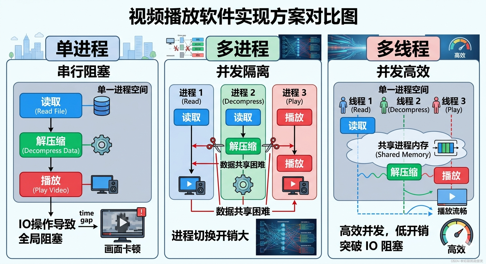

#### 什么是线程？

核心定义：**线程（Thread）**是**进程中的一条执行流程**，是 **操作系统在 CPU 调度的最小执行基本单元**。也就是说当一个进程被开启，从硬盘拷入到内存中执行时，**CPU 高频切换执行的其实是进程中的线程任务**。

> 可以理解为进程中的一个或多个子单元（分别负责入口 `main` 函数、读取 I/O 文件功能、解压缩功能...）

##### 优缺点

优点：

- **一个进程中可以有一个或多个线程，且至少要有一个线程（主线程）**

  > 每一个进程诞生时，OS 都会默认帮它创建一个线程，这个叫**主线程**。
- **各个线程之间可以并发交替执行【与进程一样】**
- **同一进程内的多个线程之间可以共享进程资源**（如地址空间、代码段、数据段、打开的 IO 文件等）
- 进程中的每个线程**各自拥有一套独立的栈内存空间（线程ID、所属进程ID...）和寄存器**，保证**多个线程之间的控制流的相对独立的**

缺点：

- **当进程中的一个线程崩溃时，会导致其所属进程中的所有线程崩溃**

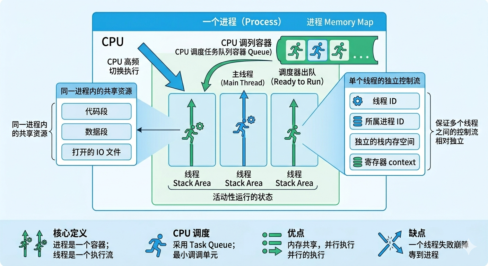

##### 线程上下文 (TCB)

> [!NOTE]
>
> 与普通函数的区别关系：
>
> - **普通函数（静态代码）**：**一个代码层面的特定任务（线程执行体）**
> - **线程（动态执行）**：**执行任务的实体**，**线程实例会带着执行体（普通函数）**去**向系统内核**申请系统调用（System Call）以**分配内存/CPU资源**以执行函数体
>
> | **维度**     | **普通函数 (Function)**                                  | **线程 (Thread)**                                            |
> | ------------ | -------------------------------------------------------- | ------------------------------------------------------------ |
> | **本质**     | **静态的代码块**。它是指令的集合，存储在内存的代码段中。 | **动态的执行流**。它是内核调度的基本单位，拥有自己的运行状态。 |
> | **状态**     | 没有状态。只有被调用和未调度的区别。                     | 拥有**生命周期**（就绪、运行、阻塞、销毁）。                 |
> | **资源**     | 不占用独立的系统资源，运行在调用者的栈空间中。           | 拥有独立的**寄存器上下文**和**栈空间**，由内核分配 CPU 时间片。 |
> | **系统调用** | 通常不涉及。仅仅是程序内部的跳转（JMP 指令）。           | **必须涉及**。创建线程需要通过 `clone()` 或 `pthread_create` 等系统调用。 |
>
> 在底层逻辑上，它们的关系如下：
>
> 1. **加载执行体：** 当你创建一个线程时，你需要把函数的**入口地址**传给线程
> 2. **上下文初始化：** 系统内核为线程分配一个 **TCB (Thread Control Block)**
> 3. **系统调用映射：** 线程实例通过系统调用（System Call）告知内核：“我有一段逻辑（函数）要跑，请给我分配 CPU 时间片”
> 4. **执行闭环：** 当函数执行完毕（遇到 `return` 或结束符），线程的任务也就完成了，随后进入销毁或回收阶段
>
> 总结：函数是**“做什么”**，线程是**“谁去做”**。没有线程，函数就是一段死代码；没有函数，线程就是一个没有灵魂的空壳。

当系统内核决定让一个线程停下来（切换到另一个线程）时，它必须**保存当前线程的“瞬间快照”**，即**线程的上下文**。主要包含如下信息：

- **寄存器状态 (Registers)：**
- - **程序计数器 (PC / IP)：** 记录当前执行到了函数的哪一行代码（下一条指令的地址）
  - **通用寄存器：** 存放函数运行时的中间计算结果、变量值
  - **状态寄存器：** 记录最近一次运算的标志（比如是否溢出、结果是否为负）
- **栈指针 (Stack Pointer)：** 指向该线程私有栈的顶部。栈里保存了函数的**局部变量**、**返回地址**和**参数**
- **线程私有数据：** 线程的 ID、优先级、调度信息等

###### 线程上下文切换

CPU 的核心数通常远少于运行中的线程数。为了让用户觉得多个任务在“同时运行”，操作系统会利用**时间片轮转**：

1. **线程 A** 运行 10 毫秒
2. **发生中断：** 时间到，内核介入
3. **保存上下文：** 把 A 的寄存器值存入它的 **TCB (Thread Control Block)** 中
4. **恢复上下文：** 把 **线程 B** 之前存好的快照填入 CPU 寄存器
5. **跳转：** CPU 根据新的 PC 指针，开始运行线程 B 的代码

通过这种“保存”与“覆盖”的机制，CPU 就像一个极速切换频道的电视机，虽然同一时刻只能播一个频道，但切换速度够快，你就会觉得所有频道都在同时播放。

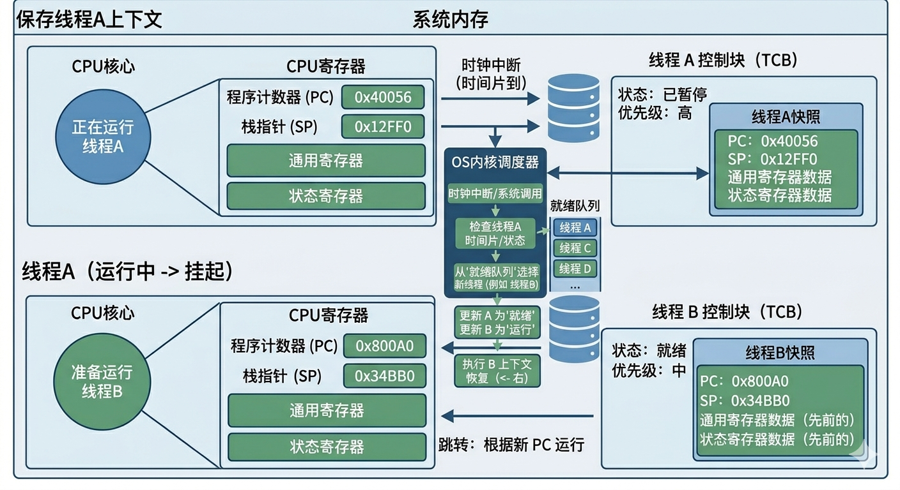

###### 底层原理

线程与进程最大的区别在于 **线程是 CPU 任务调度的基本单位，而进程是资源持有的基本单位**。

所以，操作系统的 **CPU 任务调度实际上的调度对象是进程中的线程**，而进程只是给线程提供了虚拟内存、全局变量等资源。

对于线程和进程，可以这么理解：

- 当**进程只有一个线程**时，可以认为**进程就等于线程**
- 当**进程拥有多个线程**时，这些线程会**共享相同的虚拟内存和全局变量等资源**，这些共享资源**在线程上下文切换时是不需要修改的**，CPU 只需要**保存与恢复的是线程上下文中各自独立的 “私有” 信息（栈、寄存器）**

所以，线程切换的开销要比进程切换要小很多。

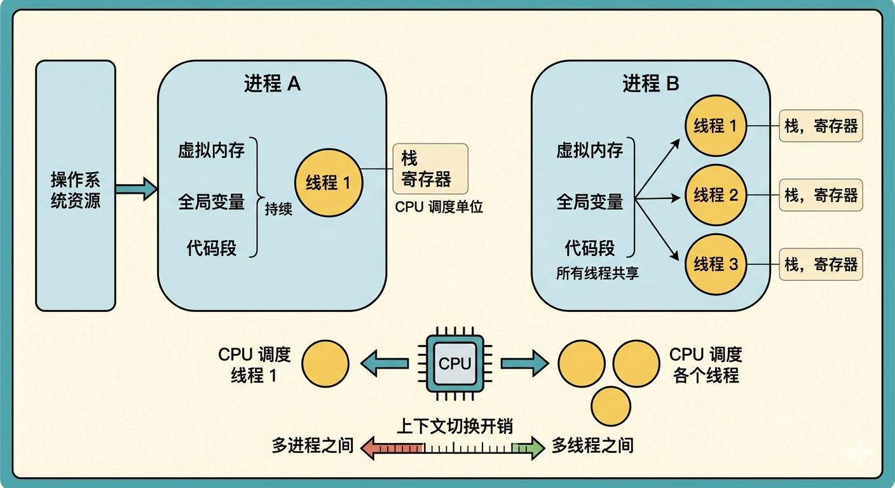

#### 与进程的比较

> **进程是“资源容器”，线程是“执行流”**。

执行单元：

- **进程：操作系统资源（内存、打开的文件...）分配的基本单位**（一个运行中的 App）
- **线程：CPU 调度进程内的最小执行基本单位**（App 里的一个子任务）

资源分配：

- **进程：拥有一个完整的资源平台（寄存器、栈内存、PCB...）**
- **线程：只独享必不可少的资源（寄存器、栈内存）**

状态切换：

- **进程**：具有**就绪、阻塞、运行** 3 个基本状态；在**进程上下文切换**时，**CPU 需要频繁保存与恢复 PCB 进程控制块的内容**，由于 **PCB 包含的信息较多**，所以**性能开销会比较大**
- **线程**：同样具有**就绪、阻塞、运行** 3 个基本状态；在**线程上下文切换**时，**CPU 一样需要频繁保存与恢复 TCB 线程控制块的内容**，但由于**TCP 包含的信息较少**，所以**性能开销会比较小**

时间与空间开销：

- **进程**：
  - **单进程**：**无法并发执行**，有**同步执行的阻塞**问题（时间、空间开销大）
  - **多进程**：可以**多个进程并发执行**，但**存在进程之间难以通信、数据共享以及进程上下文切换时性能开销较大的问题**（时间小、空间大）
- **线程**：
  - **单线程**：与单进程一致，同样**存在同步执行的阻塞**问题（时间大、空间小）
  - **多线程**：可以**多个线程并发执行**；多线程之间**可以进行通信、数据共享（同一进程内的资源）**，且**线程上下文切换时的性能开销小**（时间、空间都小）

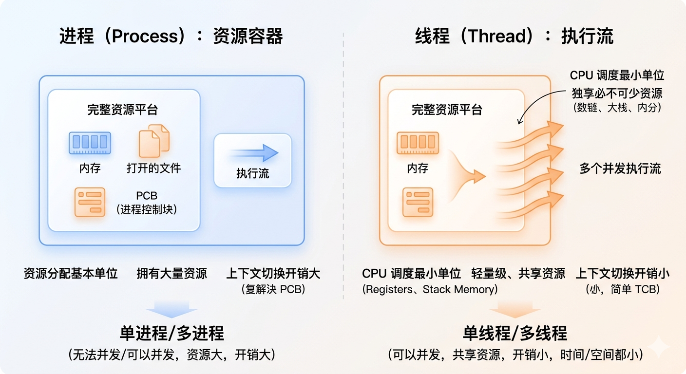

| **维度**       | **进程 (Process)**                 | **线程 (Thread)**                    | **形象比喻**                 |
| -------------- | ---------------------------------- | ------------------------------------ | ---------------------------- |
| **本质定义**   | **资源分配**的基本单位             | **CPU 调度**的基本单位               | 工厂 vs 工人                 |
| **资源拥有**   | 拥有独立的内存、文件句柄、I/O      | 共享进程资源，只存少量运行记录       | 独立车间 vs 共享工具箱       |
| **上下文切换** | **重型**：要换掉整个内存映射和 PCB | **轻量**：只换寄存器和栈，开销极小   | 搬家 vs 换件衣服             |
| **通信方式**   | **难**：需要信号量、管道或 Socket  | **易**：直接读写同一块内存变量       | 跨城快递 vs 面对面递东西     |
| **健壮性**     | **高**：一个进程崩了，不影响别人   | **低**：一个线程崩溃，整个进程就挂了 | 一家工厂倒闭 vs 一个工人闯祸 |

> [!NOTE]
>
> 为什么线程相对于进程能减少开销？
>
> - **线程的创建时间 < 进程的创建时间**：
>
>   进程在创建的过程中，需要资源管理信息（内存管理信息、文件管理信息...）
>
>   线程在创建的过程中，只需要共享进程提供的资源平台信息即可
>
> - **线程的终止时间 < 进程的终止时间**：
>
>   线程释放的资源比进程要少很多
>
> - **线程上下文切换开销 < 进程上下文切换开销**：
>
>   - 同一进程内的多个线程：具有相同的地址空间（虚拟内存共享），意味着同一进程内的多个线程都具有同一个虚拟内存页表，在线程上下文切换时则不需要切换页表
>   - 进程：进程之间切换时要把虚拟内存页表跟着一同切换，而页表的切换过程开销是比较大的
>
> - **线程的数据交互传递更快**：
>
>   - **进程**：**多个进程之间的 IPC 数据通信**需要**经过系统内核**，则数据交互传递的**效率就会降低**
>   - **同一进程内的多个线程**：由于**多个线程共享同一进程内的内存和文件资源**，所以在线程之间传递数据时，**不需要经过系统内核**，则数据传递的**效率就会更高**
>
> 所以，不管是时间效率、空间效率，线程都比进程要更高

#### 单线程 &  多线程

核心定义：**一个进程中可以创建一个或多个线程，且至少要有一个主线程**。

##### 单线程 (Single-Threading)

核心概念：**一个进程默认会创建一个主线程，该主线程负责利用进程内的资源进行同步执行**。

> [!NOTE]
>
> 以代码的角度上看：
>
> - 进程：一个 `.py` 程序文件
> - 主线程：`.py` 文件内的 入口 `main` 函数

核心特性：**单线程中的任务是按顺序同步执行（串行）的，一旦前面的 I/O 操作阻塞，后续的代码语句会等待**。

> 好比厨房（进程）里只有一个主管厨师（主线程）。他必须按照顺序做事：先洗菜，洗完后再切菜，切完后再炒菜。如果洗菜花了很长时间，后面的工序就得一直等着（**同步执行**）。

- **典型代表：** **Redis** 和 **Node.js**。它们证明了通过“非阻塞 I/O”和“事件循环”，单线程也能跑出极高的性能。

###### 优缺点

优点：

- **资源开销小**：占用内存少、开销小
- **稳定性高**：简单、不容易出错（无死锁问题）
- 适用场景：**逻辑简单的脚本、计算量小的任务**

缺点：

- 由于进程中只有一个主线程，一旦前面的 I/O 操作任务**阻塞**，后续的子任务会持续等待

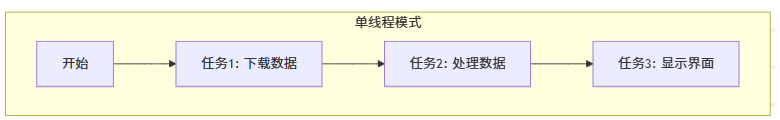

##### 多线程 (Multi-Threading)

核心定义：**一个进程中可以创建一个或多个线程，且至少要有一个主线程，进程又可以创建多个子线程，分工不同的子任务，由主线程去统筹管理**。

> [!NOTE]
>
> 以代码的角度上看：
>
> - 进程：一个 `.py` 程序文件
> - 主线程：`.py` 文件内的 入口 `main` 函数
> - 子线程：`.py` 文件内的其他任务函数

核心特性：**多线程中的任务可以同时/交替执行（并发/并行），子线程不需要等待其他线程的阻塞操作**

> 好比厨房（进程）里有多个厨师同时工作，一个主管厨师（主线程）分管多个副厨师（子线程）。厨师 A 在洗菜的同时，厨师 B 正在切菜，厨师 C 正在炒菜。大家在同一个厨房（同一个进程）里共享炉灶和食材（**并发执行**）。

###### 优缺点

优点：

- **多个任务并发交替执行，互不影响进度，执行效率快，用户体验好**

缺点：

- **资源开销大**：占用资源较多，需要管理线程切换
- **稳定性复杂**：需处理数据同步与竞争问题
- 适用场景：**高并发、需要实时响应的复杂应用**

> 多线程的**利大于弊**，目前市面上**多进程/单进程 + 多线程的架构**已经是现代应用基本标准。

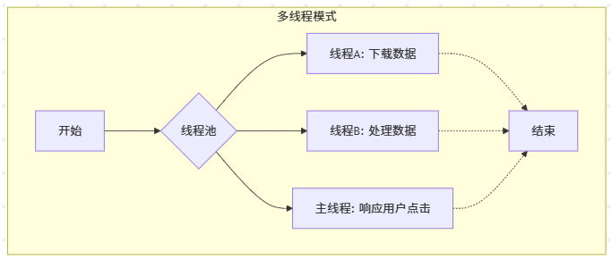

###### 为什么需要多线程？

在现代开发中，多线程的主要作用是**提高效率**和**防止界面卡死**：

- **避免阻塞：** 比如你在下载文件的同时，程序还能让你点击取消按钮。如果是单线程，下载没结束前，程序会像死机了一样无法响应。
- **充分利用 CPU：** 现代电脑都是多核 CPU，多线程能让多个核心同时干活，显著缩短处理时间。

##### 单线程与多线程的区别对比

| **维度**     | **单线程**                       | **多线程**                                         |
| ------------ | -------------------------------- | -------------------------------------------------- |
| **执行效率** | 较低，容易因为耗时任务造成阻塞。 | 较高，能充分利用多核 CPU 性能。                    |
| **资源消耗** | 较少，只维护一个线程栈。         | 较多，每个线程都需要独立的栈空间和上下文切换开销。 |
| **复杂程度** | 逻辑简单，代码容易编写和调试。   | 逻辑复杂，需处理死锁、竞态条件、同步等问题。       |
| **稳定性**   | 相对稳定，不存在线程安全问题。   | 一个子线程崩溃可能导致整个进程崩溃。               |
| **通信成本** | 无需通信（按序执行）。           | 线程间共享内存，通信快，但需考虑数据一致性。       |

### 多进程/线程冲突

​	前提：在单核 CPU 系统里，为了实现**多个程序同时运行的假象**，操作系统通常以**时间片调度**的方式，让**每个进程每次执行一个时间片，时间片用完了，就切换下一个进程运行**，由于这个**时间片的时间极其短**，于是就造成了**「并发」**的现象。


​	同理，**线程**也是由 **“时间片轮转” 机制来调度**的，且**线程之间是可以共享进程的资源**，比如代码段、堆空间、数据段、打开的文件等资源，但**每个线程都有自己独立的栈空间**。

#### 竞争条件

##### 竞争态

​	在内存中，当**一个进程中有多个子进程/线程去并发交替执行**时，多个子进程/线程之间是处于一种 **“竞争态”** 的现象，即**每个子进程/线程都想要抢占式的竞争操作系统的资源**（CPU 所分配的 “时间片”、内存、IDE 的终端控制台 I/O...）去执行更多的任务（**抢占式调度**）；

​	【假设一个程序（进程）中创建了两个子进程/线程 --> 子进程/线程 A、子进程/线程 B，它们都会共享进程中的全局变量，那么就视为这两个子进程/线程都在竞争性的抢占同一种资源（全局变量）】

​	这种**多进程/线程执行操作共享资源的代码段**会产生**竞争状态**，因此也称它为**临界区**。它是**访问共享资源的代码片段**，**一定不能给多进程/线程同时执行**！

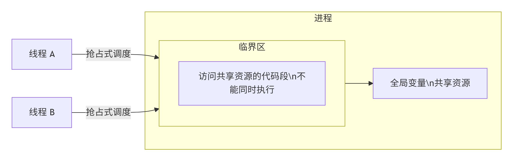

##### 数据原子性

> **原子性：一个操作（或一系列操作）要么全部执行成功且不被任何因素中断，要么就全部不执行，不存在“只执行了一半”的中间状态**。

​	由于 **CPU “时间片轮转” 的任务调度机制**，每个子进程/线程分配到的 “时间片” 基本都大差不差的（几ms甚至几十ms）。

​	如果**某个子进程/线程A 执行的任务时间 > CPU 所分配的 "时间片"**，那么当子进程/线程A 的 **“时间片” 到期**时， CPU 会**强制中断并保存**子进程/线程A 正在进行中的**任务进度以及它的上下文（上下文切换-保存）**，从而**转去执行线程B 的任务**；

​	当子进程/线程B 的任务 “时间片” 到期后又**转头回来恢复子进程/线程A 的上下文**，并**继续执行子进程/线程 A 中断的任务进度（上下文切换-恢复）**；

​	子进程/线程B 也同样会面临这个问题，以此类推；就会出现**子进程/线程 A、B 之间『互相扰乱』了各自的任务进度**。

​	在程序开发中主要表现为预期输出的**数据原子性不一致**，从而导致预期输出的结果存在**不确定性**。

【例如：子进程/线程A 输出 '你好,我'，“时间片”到期突然被 CPU 中断，子进程/线程B 抢到 “时间片”，开始在控制台输出 'Hello'，又继续恢复子进程/线程A 的输出 '是Xxx'，这就导致 IDE 终端控制台输出的结果是 “你好，我 Hello，是 Xxx”。】

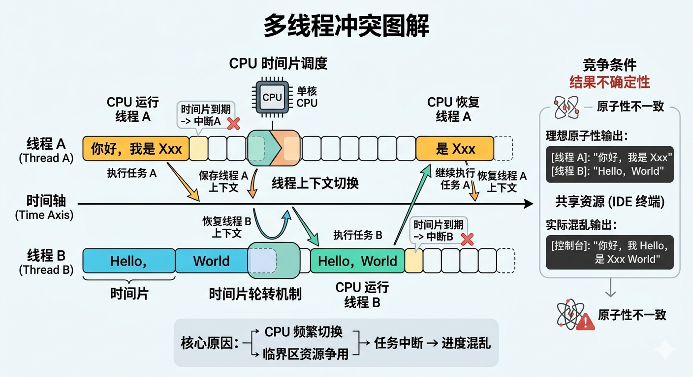

> [!NOTE]
>
> > 导致子进程/线程数据原子性不一致的核心原因：**CPU 频繁的线程上下文切换**，导致了**子进程/线程任务『中断 → 继续 → 中断』**这样的过程，在中断的过程中**让其他子进程/线程来占用共享资源的操作**， 从而导致**多个子进程/线程之间输出的数据存在混乱**。
>
> - 核心要点：**多个子进程/线程如果竞争共享资源，如果不采取有效的措施，则会造成共享数据的混乱**。

##### 示例

程序计数器：多个线程访问进程中的共享资源。

```python
import threading
import time

# 全局变量（多个线程共享的进程资源）
shared_count = 0


def increase_count():
    global shared_count
    # --- 线程的原子性任务 ---
    for _ in range(100):
        # --- 模拟复杂的临界区操作 ---
        # 1. 先读取旧值
        temp = shared_count

        # 2. 故意加入微小的延迟，强制触发“时间片到期”
        # 只要这里一停顿，CPU 就会切换到另一个线程
        time.sleep(0.0001)

        # 3. 将计算后的值写回
        # 此时 temp 可能已经是“过时”的数据了
        shared_count = temp + 1


threads = []
# 增加线程数量，让竞争更激烈
for i in range(10):
    t = threading.Thread(target=increase_count)
    threads.append(t)
    t.start()

for t in threads:
    t.join()

print(f"每个线程加100次，10个线程")
print(f"预期结果: 1000")
print(f"实际结果: {shared_count}")  # 101
print(f"结论: {'数据一致' if shared_count == 1000 else '原子性不一致！'}")  # 原子性不一致！
```

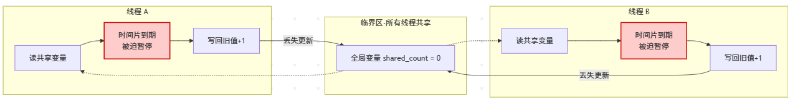

为了解决这种多线程的 “竞争态” 情况出现，可以通过以下手段来干预：

- 即**通过同步机制（互斥锁、信号量、队列（Queue）等）在这些“不确定”的切换中，建立起“确定”的逻辑顺序**。

#### 互斥锁

> [!NOTE]
>
> 如何理解数据的原子性一致？
>
> 核心要点：**原子性就是为了给并发环境下的不确定性划上一道“禁区”。** 它保证了即使操作系统如何切换线程、CPU 如何调度任务，被标记为“原子”的逻辑在外界看来永远是瞬时完成、不可分割的整体。

核心概念：通过给进程/线程在执行任务时**建立一道 “门锁”**，保证**数据的原子性一致**，从而**保证多进程/线程之间操作共享资源执行任务时，不会因 CPU “时间片” 调度机制而导致操作的数据混乱**。

- 互斥的概念：**保证一个子进程/线程在临界区执行时，其他子进程/线程应该被阻止进入该临界区，即临界区最多只能出现一个子进程/线程**

##### 执行要点

当**进程/线程在执行任务**时，为了保证**不被其他进程/线程打扰**，可以**通过为进程/线程任务的原子性逻辑外围添加一道 “门锁”**，当**该进程/线程执行这个 临界区 任务**时，需要**保证原子性任务的所有内容都完整的执行完毕**，**才会放开 CPU 的执行指针**，从而**切换到其他子进程/线程去执行**。

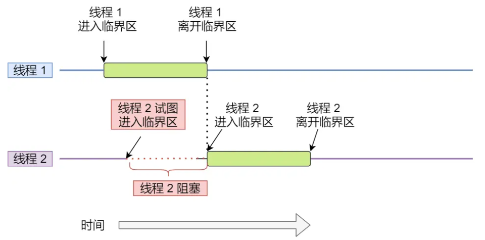

##### 执行流程

1. **“获取锁”**：

   为**每个子进程/线程中要访问临界区共享资源的任务**都加上一把 **“锁”**，保证**每个子进程/线程在执行期间访问共享资源**时都是**互斥**的；

   在**持有这把 “锁” 的子进程/线程在临界区未完成任务之前**，其他子进程/线程都会**被这把 “锁” 挡在临界区外面（阻塞状态）**

2. **“释放锁”**：

   只有**当持有这把 “锁” 的子进程/线程执行完任务，主动 “释放锁”** 时，**其他子进程/线程才能进入临界区访问共享资源**；

   并且其他子进程/线程也能拿着自己的 “锁” 给临界区 “关上门”，不让别的子进程/线程打扰。

核心本质：**互斥锁（Mutex）执行流程**本质上就是把**多进程/线程**的**异步机制的并发执行**变为了**同步机制的串行执行**。

> 形象比喻：锁就像是洗手间的门栓——一次只进一个人，后面的人排队等，出来的人记得开门。

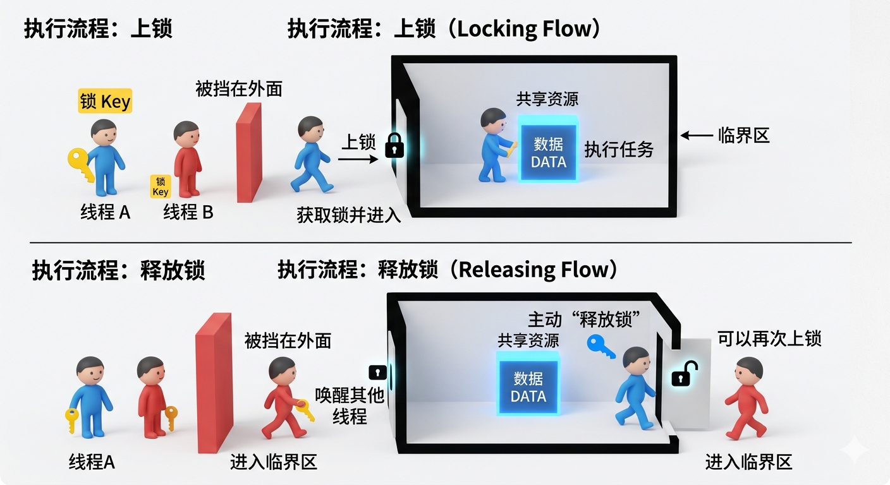

```python
import threading
import time

# 全局变量（多个线程共享的进程资源）
shared_count = 0


def increase_count(lock):
    global shared_count
    # --- 线程的原子性任务 ---
    for _ in range(100):
        lock.acquire() # ---> 获取锁
        # --- 模拟复杂的临界区操作 ---
        # 1. 先读取旧值
        temp = shared_count

        # 2. 故意加入微小的延迟，强制触发“时间片到期”
        # 只要这里一停顿，CPU 就会切换到另一个线程
        time.sleep(0.0001)

        # 3. 将计算后的值写回
        # 此时 temp 可能已经是“过时”的数据了
        shared_count = temp + 1
        lock.release()  # ---> 释放锁


threads = []
# 增加线程数量，让竞争更激烈
for i in range(10):
    lock = threading.RLock()
    t = threading.Thread(target=increase_count, args=(lock,))
    threads.append(t)
    t.start()

for t in threads:
    t.join()

print(f"每个线程加100次，10个线程")
print(f"预期结果: 1000")
print(f"实际结果: {shared_count}")  # 101
print(f"结论: {'数据一致' if shared_count == 1000 else '原子性不一致！'}")  # 数据一致
```

##### 死锁

由于 **“互斥锁”** 都是**成双成对**出现的，即**子进程/线程在开始执行任务时 — “加锁”，子进程/线程任务执行完毕时 — “释放锁”**。

如果**一个子进程/线程在开始执行任务**时**加了两把 “锁”**，却**只释放了一把 “锁”**，那么**另外没有得到释放的 “锁”** 就是一个 **“死锁”**。则会**导致程序因为前者子进程/线程开启的 “互斥锁” 一直未被释放而一直等待中【即前面的进程/线程没有出来，后续的进程/线程一直是阻塞状态】**....

产生死锁的必要条件：

1. **互斥**：资源一次只能被一个子进程/线程占用
2. **占有且等待**：子进程/线程已经拿到一个锁，还在请求另一个锁
3. **不可剥夺**：锁不能被强行抢走，只能由持有者主动释放
4. **循环等待**：形成了一个闭环（A 等 B，B 等 A）

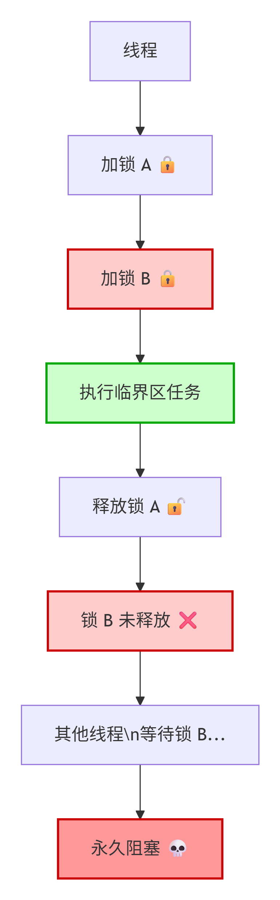

这是最常见的 **“遗漏释放”** 的案例，即忘记了 “释放锁” 这一动作。

# 并发编程（具体实现）

> https://xiaolincoding.com/os/

并发编程是各类编程语言（Java、Go、Python...）都会涉及到的一种关于**程序对操作系统资源调度优化的编程思想控制论**。

核心本质：**并发编程不仅是语法，更是一套关于“资源拆解榨取”和“任务调度”的控制论思想方式。**

简单来说，并发编程的核心目标是为了**提高操作系统资源利用率**和**提升程序的响应速度**。

所以，对于如何彻底了解并发编程的底层原理与运行机制，需要先了解操作系统的一些核心概念（CPU 资源调度、内存管理、进程/线程/协程...）。

## 资源管理（生产者与消费者模型）

从资源管理的角度去了解系统底层是如何对计算机资源进行分配、调度的，以及相关的层级概念是理解并发编程的先行策略。

核心本质：系统资源的运转机制其实是一个**“生产者” 与 “消费者” 模型**

“生产者” 与 “消费者” 模型：

- **“生产者”**：**CPU、GPU、内存条、磁盘、各类 IO 外设设备...等硬件资源**
- **“消费者”**：**所有在操作系统上运行的软件程序**。如文件系统程序 => 、各类 IO 设备驱动程序、其他各类客户端应用程序....

> **并发编程实质上就是程序如何通过操作系统对计算机的一切资源进行协作、压榨计算机资源利用率的一种编程思想策略**。
>
> 根据不同业务场景，可选择的并发模型架构是：
>
> - **单进程、单线程**
> - **单进程、多线程**
> - **多进程、多线程**
> - **多进程、多线程、多协程**
> - ....

## 进程（multiprocessing 模块）

在 Python 中，可以通过内置的 **`multiprocessing` 模块**来进行进程的**创建、启动、销毁**等一系列操作。

`multiprocessing` 模块是 Python 中专门用于提供进程管理的内置模块，它提供了一个 **`Process`** 类用于**创建、操作进程**。

> [!NOTE]
>
> 在 Python 中，创建并使用进程的方式有以下 3 种：
>
> - **`multiprocessing` 模块：使用 `multiprocessing.Process` 类**
> - **自定义模块**：**继承 `multiprocessing.Process` 进程类，实现一个自定义进程类**
> - **`concurrent.futures` 模块（进程/线程池）：使用 `concurrent.futures.ProcessPoolExecutor` 类**

### Process 进程类

`Process` 类是一个专门用于创建子进程的类，可在**当前 `.py` 文件**中**创建一个子进程实例**，并提供对应的**属性、方法**来**操作子进程**。

#### 创建一个进程实例

核心作用：**创建并返回一个进程实例，并指定该子进程所要执行的任务 `target`**。

##### 基本语法

```python
from multiprocessing import Process

def <任务函数>(<位置参数1,...>,<关键字参数1,...>): pass

<进程实例> = Process(
    group=None,
    target=<任务函数>,
    name=<进程名称>,
    args=<(函数位置参数1,..)>,
    kwargs=<函数关键字参数{key,value...}>,
    daemon
)
```

##### 参数

- **`group`**：**当前子进程的所属分组**；默认且始终为 `None`
- **`target`**：**当前子进程要执行的可调用对象（一般为任务函数）**；默认为 `None`
- **`name`**：**子进程名称**；默认为 `None`，**Python 内部会自动分配子进程名称 `Process-[nums]`**
- **`args`**：**传递给 `target` 可调用对象**的**位置参数**（以 **`()` 元组**形式传入）
  - `(arg1,arg2,...)`：以位置顺序传递
- **`kwargs`**：**传递给 `target` 可调用对象**的**关键字参数**（以 **`{}` 字典**形式传入）
  - `{key:value}`：`key` 是 `target` 任务函数的某个关键字参数，`value` 是关键字参数值
- **`deamon`**：**标记该子进程是否为守护进程**。取值 `True/False`，默认为 `None`
  - **`True`**：标记该子进程为**守护进程**
  - **`False / None`**：表示**该子进程继承自创建它的当前主进程**

##### 示例

```python
from multiprocessing import Process, current_process
from time import sleep


# 任务函数
def task1(a, b, msg):
    # 当前进程： <Process name='Task-A' parent=20352 started>
    print('当前进程：', current_process())
    print('位置参数：', a, b)  # 位置参数： 1 2 与 a b 一一对应，如果超过 3 个，则会覆盖 msg
    print('关键字参数：', msg)  # 关键字参数： hello 我是进程任务 A
    sleep(1)
    print('task1 done')


if __name__ == '__main__':
    # Process()  创建进程对象
    p1 = Process(target=task1, name="Task-A", args=(1, 2), kwargs={'msg': "hello 我是进程任务 A"})
	
    # 启动线程
    p1.start()
```

###### **`args` 位置参数** 与 **`kwargs` 关键字参数** 注意点

- **`args` 位置参数**必须与 `def` **任务函数定义的位置参数顺序、数量一一对应**，如果 **`kwargs` 显式传入了某个参数**，则它为**关键字参数**，那么**后面的便不再是位置参数**，**`args` 则不能超过位置参数的个数数量**，否则会报错。

  ```python
  from multiprocessing import Process
  from time import sleep
  
  
  # 任务函数
  def task1(a, b, msg):
      print('当前进程：', current_process())
      print('位置参数：', a)  # 位置参数： 1
      print('关键字参数：', b, msg)  # 关键字参数：b  hello 我是进程任务 A
      sleep(1)
      print('task1 done')
  
  
  if __name__ == '__main__':
      # Process()  创建进程对象
      p1 = Process(target=task1, args=(1,), kwargs={'b': 'b','msg': "hello 我是进程任务 A"})
  	
      # 启动线程
      p1.start()
  ```

#### 属性

##### name 进程名称

核心作用：

- 返回**当前进程的名称**
- **动态修改**当前进程的名称

```python
from multiprocessing import Process, current_process


def task1():
    print('当前进程A：', current_process())
    # 当前进程A： <Process name='Task-A' parent=20352 started>

    current_process().name = 'Process-A'  # 修改进程名称

    print('当前进程A：', current_process())
    # 当前进程A： <Process name='Process-A' parent=43264 started>


def task2():
    # 当前进程B： <Process name='Task-A' parent=20352 started>
    print('当前进程B：', current_process())


if __name__ == '__main__':
    # Process()  创建进程对象
    p1 = Process(target=task1, name="Task-A")

    p2 = Process(target=task2, name="Task-B")
    p2.name = 'Process-B'  # 修改进程名称

    p1.start()
    p2.start()
```

#### 方法

`Process` 类提供了一系列方法用于子进程的状态管理。

> 注意：Python 官方并没有为 `Process` 类实现 `__enter__` 和 `__exit__` 方法，所以 `Process` 类不支持 `with` 语句。

##### start() 启动进程

描述：在**使用 `Process` 类的构造函数创建并返回一个进程实例**后，此时操作系统并**不会真的去创建该子进程**，而是**需要通过进程实例对象提供的 `start()` 方法来启动子进程**；

核心作用：**当 `<子进程实例对象>.start()` 方法执行**后，Python 会**立即向系统内核申请创建一个内存中的进程**，并**为其分配 CPU 指针、内存空间等资源**，同时**会将该子进程交给操作系统去异步调度**。

###### 基本语法

```python
from multiprocessing import Process

def <任务函数>(): pass

if __name__ == '__main__':
	<进程实例> = Process(group=None,target=<任务函数>,name,args,kwargs,daemon) # 这只是代码层面的进程对象
    
    <进程实例>.start() # 真实的创建系统进程实例，Python 会向操作系统申请创建进程，并分配CPU、内存资源
```

注意：多进程是**并发交替执行**的，且主进程与子进程之间**互不影响**。（**先执行完主进程，子进程再交替执行**）

###### 示例

```python
from multiprocessing import Process, current_process
import os
import time

print('当前进程:', current_process())


# 任务函数1
def task1():
    print("子进程A start")
    print("子进程A pid:", os.getpid(), '父进程 ppid：', os.getppid())
    for i in range(3):
        print("子进程A:", i)
        time.sleep(0.5)
    print("子进程A end")


# 任务函数2
def task2():
    print("子进程B start")
    print("子进程B pid:", os.getpid(), '父进程 ppid：', os.getppid())
    for i in range(3):
        print("子进程B:", i)
        time.sleep(0.5)
    print("子进程B end")


# 入口函数（主进程）
if __name__ == '__main__':
    print("主进程 start")
    print("主进程 pid:", os.getpid())

    # 创建子进程A
    p1 = Process(target=task1)

    # 创建子进程B
    p2 = Process(target=task2)

    # 启动子进程A
    p1.start()

    # 启动子进程B
    p2.start()

print('主进程 end') # 由于这块代码在 if __name__ == '__main__': 之外，所以主进程与子进程都会执行

'''
输出结果：
# ---> 主进程执行，创建子进程
当前进程: <_MainProcess name='MainProcess' parent=None started>
主进程 start
主进程 pid: 43000
主进程 end

# ---> 子进程A 创建，执行一遍 `.py` 文件
当前进程: <_MainProcess name='Process-1' parent=None started>
主进程 end
子进程A start
子进程A pid: 10312 父进程 ppid： 43000
子进程A: 0 # ---> 这里子进程A 先一步执行

# ---> 子进程B 创建，执行一遍 `.py` 文件
当前进程: <_MainProcess name='Process-2' parent=None started>
主进程 end
子进程B start
子进程B pid: 36840 父进程 ppid： 43000

# ---> 子进程A、B开始交替执行
子进程B: 0
子进程A: 1
子进程B: 1
子进程A: 2
子进程B: 2
子进程A end
子进程B end
'''
```

###### 执行流程

1. **主进程**先执行到 `p1.start()` 和 `p2.start()`，之后立即打印 `主进程 end`，**不会等待**子进程结束。
2. **子进程启动时**会重新导入并执行 `.py` 文件，因此会再次执行顶层的 `print('当前进程:', current_process())` 和 `print('主进程 end')`（因为此时 `__name__` 不等于 `'__main__'`，所以不会执行 `if __name__ == '__main__'` 内的代码）。
3. 两个子进程创建后并发执行，**交替打印**，由操作系统调度决定顺序。
4. 主进程结束后，子进程继续运行，直到各自任务完成。

```python
时间轴（从上到下）
─────────────────────────────────────────────────────
主进程 (PID:43000)      子进程A (PID:10312)      子进程B (PID:36840)
─────────────────────────────────────────────────────
打印：当前进程
打印：主进程 start
打印：主进程 pid:43000
创建 p1
创建 p2
p1.start() ──────────────────────► 启动
p2.start() ──────────────────────────────────────► 启动
打印：主进程 end
                           （导入模块时执行顶层代码）
                           打印：当前进程
                           打印：主进程 end
                           （因为 if __name__ 不成立，跳过）
                           开始执行 task1()
                           打印：子进程A start
                           打印：子进程A pid:10312 父进程:43000
                           打印：子进程A: 0
                                                  （导入模块时执行顶层代码）
                                                  打印：当前进程
                                                  打印：主进程 end
                                                  开始执行 task2()
                                                  打印：子进程B start
                                                  打印：子进程B pid:36840 父进程:43000
                                                  打印：子进程B: 0
                           打印：子进程A: 1
                                                  打印：子进程B: 1
                           打印：子进程A: 2
                                                  打印：子进程B: 2
                           打印：子进程A end
                                                  打印：子进程B end
─────────────────────────────────────────────────────
时间 -->
```

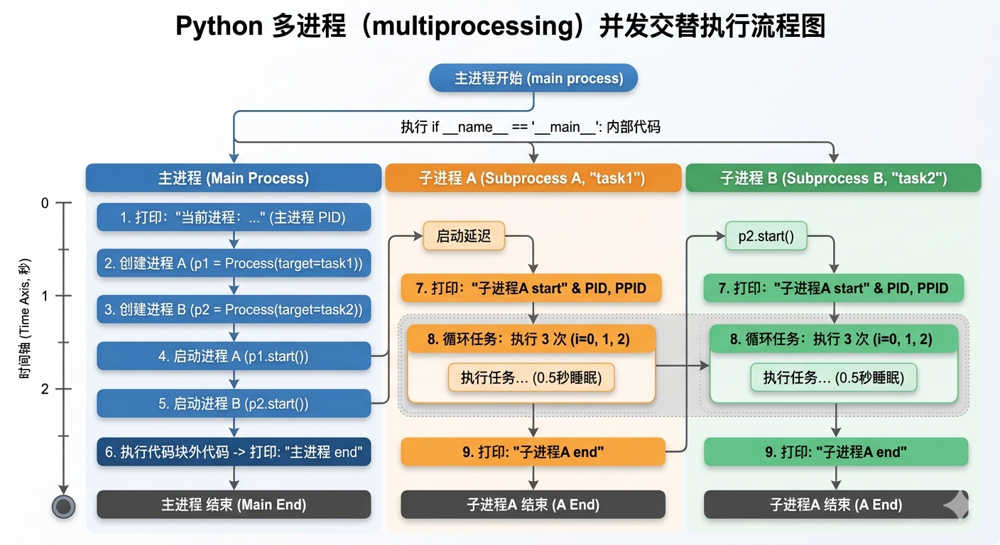

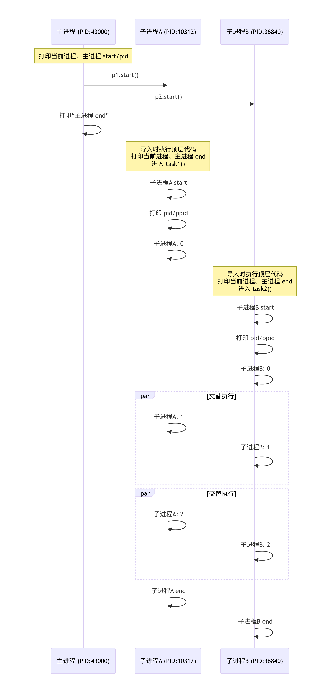

##### join() 主进程等待子进程完成

> [!NOTE]
>
> 在默认情况下，Python 中的多进程架构是异步机制的并发交替执行。
>
> - **主/父进程（Python 解释器）同步的串行执行**：主/父进程在启动子进程后并**不会“停下来”等待子进程的创建/执行**，而是**继续执行自己的代码**
> - **子进程（Python 解释器【Process】）异步的并发交替执行**。子进程**由操作系统调度**，在不同的 CPU 核心或时间片上交替运行。
>
> 如下所示：
>
> ```python
> from multiprocessing import Process
> import time
> 
> 
> # 子进程A 的任务函数
> def task1():
>     print('子进程A start')
>     for _ in range(3):
>         print('子进程A--------')
>         time.sleep(0.5)
>     print('子进程A end')
> 
> 
> # 子进程B 的任务函数
> def task2():
>     print('子进程B start')
>     for _ in range(3):
>         print('子进程B--------')
>         time.sleep(0.5)
>     print('子进程B end')
> 
> 
> # 主进程（同步的串行执行）
> if __name__ == '__main__':
>     print('主进程 start')
> 
>     # 创建子进程
>     p1 = Process(target=task1)
>     p2 = Process(target=task2)
> 
>     # 启动子进程（异步的并发交替执行）
>     p1.start()
>     p2.start()
>     print('主进程 end')
> 
> '''
> 输出结果：
> 主进程 start    【主进程先执行完，不会等待子进程的执行】
> 主进程 end
> 
> 子进程A start   【子进程A、B启动并执行，全程并发交替执行】
> ----子进程A---- 【子进程A 先创建，CPU 时间片还在用着，所以先打印了进程A 的一次输出】
> 
> 子进程B start
> ----子进程B----
> ----子进程A----
> ----子进程B----
> ----子进程A----
> ----子进程B----
> 
> 子进程A end
> 子进程B end
> '''
> ```
>
> | **角色**     | **动作流**                          | **特点**                     |
> | ------------ | ----------------------------------- | ---------------------------- |
> | **主进程**   | 开始 → 启动 A → 启动 B → **结束**   | 跑得最快，不等待直接冲过终点 |
> | **子进程 A** | (等待创建) → 开始 → 循环打印 → 结束 | 与 B 同时竞争 CPU 资源       |
> | **子进程 B** | (等待创建) → 开始 → 循环打印 → 结束 | 与 A 交替输出内容            |
>
> 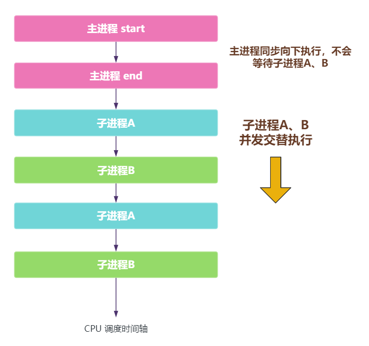

###### 基本概念

描述：在 Python 的多进程编程中，默认情况下，**当前进程（主进程）创建子进程实例并调用 `start()` 方法启动子进程**后，**不会等待**子进程，而是**继续往下同步串行执行**。

- 核心作用：**阻塞当前进程（通常是主进程）**，**直到调用 `join()` 方法的子进程执行完毕后，当前主进程才继续往下执行**。

| **特性**       | **不使用 join()**                          | **使用 join()**                                  |
| -------------- | ------------------------------------------ | ------------------------------------------------ |
| **主进程行为** | 启动子进程后，立即向下执行，先打印 `end`。 | 在 `join()` 处等待，子进程不执行完，主进程不走。 |
| **执行顺序**   | 主进程最先结束，子进程在后台交替。         | 主进程最后结束，确保拿到了子进程的结果。         |
| **层次关系**   | **异步并发**：主进程与子进程互不干扰。     | **同步阻塞**：主进程的进度依赖于子进程的完成。   |

###### 基本语法

```python
from multiprocessing import Process

def <任务函数>(): pass

if __name__ == '__main__':
	<进程实例> = Process(group=None,target=<任务函数>,name,args,kwargs,daemon) # 这只是代码层面的进程对象
    
    <进程实例>.start() # 真实的创建系统进程实例，Python 会向操作系统申请创建进程，并分配CPU、内存资源
    
    <进程实例>.join(timeout=<等待时长>) # 阻塞当前进程（主进程）的同步执行，主进程要先等待 <进程实例> 执行完才继续向下执行
```

参数：

- `join(timeout)`：**当前进程（主进程）的等待时长**。即**要让当前进程（主进程）等到 `timeout` 秒之后才开始往下执行**。

**触发条件**：**主进程执行到 `join()` 方法**时，**会停下来原地等待**，直到**子进程A 的逻辑全部执行完毕并退出**，**后续的代码中有关于子进程A 的相关操作都会失效**，因为子进程A 已经被**回收**了（**僵尸进程**）。

###### 核心本质

- 让**主进程与子进程『异步非阻塞』的『并行/并发』执行（无序） → 主进程与子进程『同步阻塞』的『串行』执行（有序）**。

> [!NOTE]
>
> - **异步非阻塞（不使用 `join`）**：主进程和子进程同时推进，主进程不等子进程。
>
>   ```
>   主进程 ───► 启动子进程 ───► 继续做自己的事 ─────────────► 结束
>                  │
>                  ▼
>   子进程         ─────────────► 独立做自己的事 ───► 结束
>   ```
>
> - **同步阻塞（使用 `join`）**：主进程在 `join` 处挂起，直到子进程收尾，主进程才继续。
>
>   ```
>   主进程 ───► 启动子进程 ───► [ join() 阻塞中... ] ───────► 继续执行 ───► 结束
>                  │                     ▲
>                  ▼                     │ (子进程结束)
>   子进程         ──────────────────────┘
>   ```

###### 注意点

- `join()` 方法必须**放在 `start()` 方法后面执行**

  否则会报错（`join()` 方法的本质是等待进程任务执行完，但是压根就没有调用 `start()` 开启进程任务）

- **调用 `join()` 方法的子进程任务**内一定**不要写死循环（必须要有跳出条件）**！否则**主进程会一直阻塞等待**

```python
from multiprocessing import Process

def task():
    count = 0
    while True: # 避免写死循环，一定要有跳出条件 break
        print('task')
        count += 1
        if count > 10:
            break

if __name__ == '__main__':
    p1 = Process(target=task)
    
    # p1.join() # 报错
    p1.start()
    
    # 必须写在 start() 方法后面
    p1.join()
```

###### 示例

描述：在多进程架构中，多个进程的`join()` 与 `start()` 方法的声明顺序会极大影响最终的执行结果。

核心要点：**主进程遇到 `join()` 方法执行正常同步执行，遇到 `join()` 方法之后进入阻塞状态，中止后续的代码执行**。

- 当前进程（主进程）创建了多个进程A、B，并且**所有进程都先统一调用了 `start()` 方法，后统一调用的 `join()` 方法**

  执行逻辑：**主进程先执行 → 子进程A、B 先后启动执行 →『子进程A、B交替执行』→ 子进程A、B 先后结束 → 主进程结束**  

  ```python
  from multiprocessing import Process
  import time
  
  
  # 子进程A 的任务函数
  def task1():
      print('子进程A start')
      for _ in range(3):
          print('----子进程A----')
          time.sleep(0.5)
      print('子进程A end')
  
  
  # 子进程B 的任务函数
  def task2():
      print('子进程B start')
      for _ in range(3):
          print('----子进程B----')
          time.sleep(0.5)
      print('子进程B end')
  
  
  # 主进程（同步的串行执行）
  if __name__ == '__main__':
      print('主进程 start')
  
      # 创建子进程
      p1 = Process(target=task1)
      p2 = Process(target=task2)
  
      # 启动子进程（异步的并发交替执行）
      p1.start()
      p2.start()
  
      # 当前进程（主进程）等待子进程p1执行完毕
      p1.join()
  
      # 当前进程（主进程）等待子进程p2执行完毕
      p2.join()
  
      print('主进程 end')
  
  '''
  输出结果：
  主进程 start
  
  子进程A start
  ----子进程A----
  
  子进程B start
  ----子进程B----
  ----子进程A----
  ----子进程B----
  ----子进程A----
  ----子进程B----
  
  子进程A end
  子进程B end
  
  主进程 end
  '''
  ```

  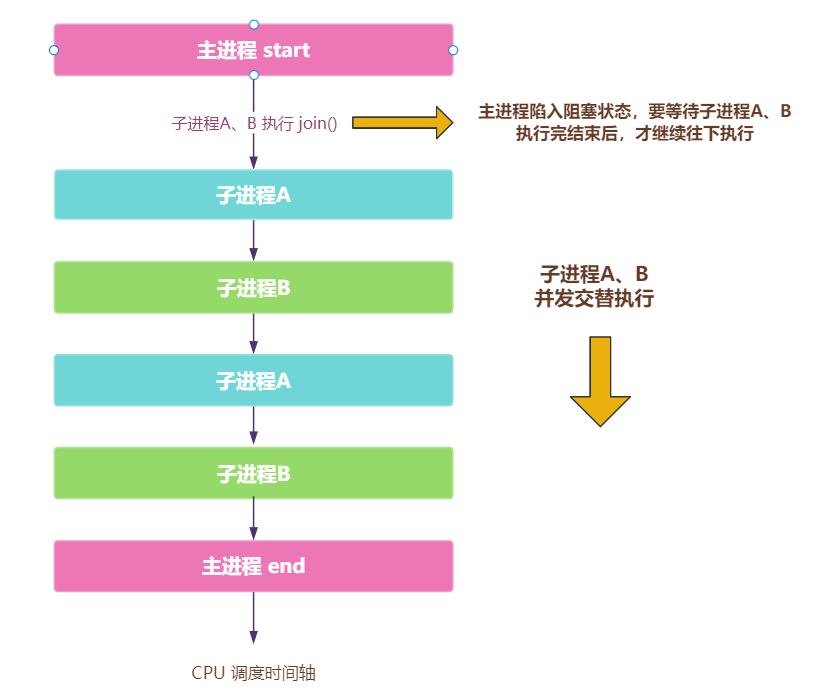

- 当前进程（主进程）创建了多个进程A、B，但是**进程A 先调用了 `start()` 和`join()` 方法，后面才调用的进程B `start()` 方法**

  执行逻辑：**主进程先执行 → 『子进程A 启动执行 → 子进程A 结束』 → 『子进程B 启动执行 → 子进程B 结束』  → 主进程结束**  

  核心原因：**当前进程（主进程）遇到了进程A 的 `start()` 和 `join()` 方法**，会进入**阻塞**状态，**中断后续的代码执行，直到进程A 任务执行完毕**，当前进程（主进程）才会**继续往下读取执行进程B 的 `start()` 方法，进程B 随后才启动执行**。

  ```python
  from multiprocessing import Process
  import time
  
  
  # 子进程A 的任务函数
  def task1():
      print('子进程A start')
      for _ in range(3):
          print('----子进程A----')
          time.sleep(0.5)
      print('子进程A end')
  
  
  # 子进程B 的任务函数
  def task2():
      print('子进程B start')
      for _ in range(3):
          print('----子进程B----')
          time.sleep(0.5)
      print('子进程B end')
  
  
  # 主进程（同步的串行执行）
  if __name__ == '__main__':
      print('主进程 start')
  
      # 创建子进程
      p1 = Process(target=task1)
      p2 = Process(target=task2)
  
      # 启动子进程（异步的并发交替执行）
      p1.start()
      # 当前进程（主进程）等待子进程p1执行完毕
      p1.join()
      
      p2.start()
      # 当前进程（主进程）等待子进程p2执行完毕
      p2.join()
  
      print('主进程 end')
  
  '''
  输出结果：
  主进程 start
  
  子进程A start
  ----子进程A----
  ----子进程A----
  ----子进程A----
  子进程A end
  
  子进程B start
  ----子进程B----
  ----子进程B----
  ----子进程B----
  子进程B end
  
  主进程 end
  '''
  ```

  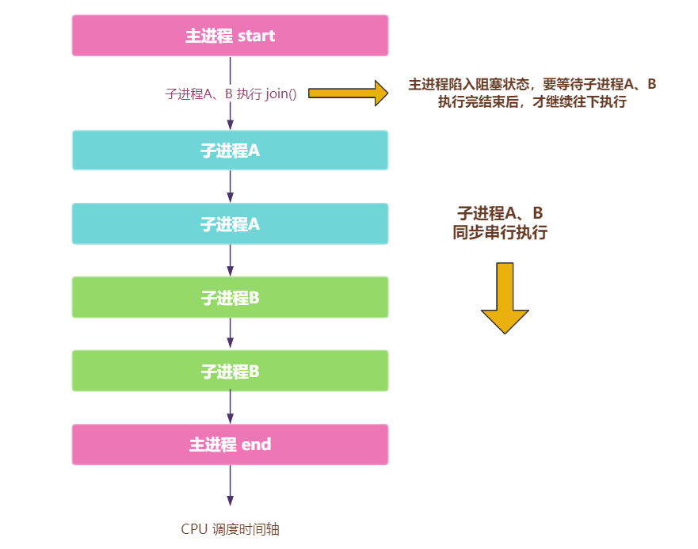


###### 为什么要用 `join()`？

1. **数据依赖**：如果主进程需要用到子进程计算出来的结果
2. **顺序控制**：确保某些清理工作（如关闭数据库连接）在所有任务完成后才进行
3. **防止孤儿进程**：确保所有子进程都被正确回收

##### terminate() 强制终止进程

作用：**向操作系统申请强制终止调用 `terminate()` 的子进程实例**。

核心特性：

- `terminate()` 是**异步执行**的，因为**主进程发送终止进程信号和操作系统真正杀死进程**之间存在**微小的延迟**。

  所以后续的操作，如输出进程状态（`is_alive()`会返回 True，但实际上过滤 `0.01`ms 后进程就会真正消亡了）

> 注意点：`terminate()` 方法不会触发子进程任务函数中的 `try-finally` 的 `finally` 代码块。

```python
from multiprocessing import Process
import time


def task():
    try:
        print("子进程正在运行...")
        while True:  # 模拟一个死循环任务
            time.sleep(0.1)
    finally:
        print('close')
        # 当外部执行 `terminate()` 方法强制终止当前子进程时，`finally` 代码块不会触发执行


if __name__ == '__main__':
    p = Process(target=task)
    p.start()

    print(f"终止前，进程状态: {p.is_alive()}")  # True

    # 核心：调用异步终止命令
    p.terminate()  # 强制终止子进程 p1

    # 立即检查状态（体现异步性）
    print(f"立即检查，进程状态: {p.is_alive()}")  # True

    # 给操作系统一点反应时间
    time.sleep(0.1)
    print(f"等待0.1秒后，进程状态: {p.is_alive()}")  # False

'''
输出结果
终止前，进程状态: True
立即检查，进程状态: True
等待0.1秒后，进程状态: False
'''
```

##### is_alive() 进程状态

作用：**检测当前子进程是否为 “活跃” 状态**。

返回值：

- **`True`** ：表示**当前子进程**为 **“活跃” 状态（就绪态、运行态）**
- **`False`**：表示**当前子进程**为 **“死亡” 状态**，即**已经被主进程回收**

```python
from multiprocessing import Process, current_process


def run(name):
    print('当前子进程的状态：', current_process().is_alive())  # 当前子进程p1的状态： True
    print('hello', name)


if __name__ == '__main__':
    p1 = Process(target=run, args=('bob',))
    p1.start()

    print('子进程p1的状态：', p1.is_alive())  # 子进程p1的状态： True（就绪态、运行态）

    p1.join()  # 阻塞主进程，等待子进程p1执行完毕

    # 此时 子进程p1已经执行完毕，已经被主进程回收，状态为False
    print('子进程p1的状态：', p1.is_alive())  # 子进程p1的状态： False
```

- **`join()` 方法的触发条件**：**主进程执行到 `join()` 方法**时，**会停下来原地等待**，直到**子进程A 的逻辑全部执行完毕并退出**，**后续的代码中有关于子进程A 的相关操作都会失效**，因为子进程A 已经被**回收**了（**僵尸进程**）。

##### close() 主动清理进程

> [!NOTE]
>
> **为什么需要 `close()`**？
>
> 在 Python 的 `multiprocessing` 模块中，**每个进程对象都会占用操作系统的文件描述符或句柄**：
>
> - 如果在程序中频繁地创建和销毁大量进程，而**不显式关闭**它们，可能会导致**资源泄漏**（如“文件描述符耗尽”错误）。
> - 虽然 Python 的**垃圾回收机制（GC）最终会清理这些对象**，但**手动调用 `close()` **或**使用 `with` 上下文管理器**可以**更及时、更安全地释放进程资源**。

核心作用：主动显式**关闭 `Process` 进程对象并销毁其底层资源**。

###### 核心逻辑

当**调用 `p.close()` 方法**时，Python 会**清理与该进程对象 `p` 相关的系统资源**：

- **释放资源：** 释放进程底层的系统句柄和资源
- **状态限制：** 一旦调用了 `close()`，该 `Process` 对象的多数方法和属性（如 `start()`, `is_alive()`, `join()`, `pid` 等）将不再可用，如果尝试访问，会抛出 `ValueError`
- **前提条件：** **进程必须已经结束运行。** 如果进程仍在运行（`is_alive()` 为 `True`），调用 `close()` 会抛出 `ValueError`

###### 示例

```python
from multiprocessing import Process
import time


def worker():
    print("子进程正在运行...")
    time.sleep(1)
    print("子进程 end")


if __name__ == '__main__':
    print("主进程 start")
    p = Process(target=worker)
    p.start()

    # 等待子进程结束
    p.join()

    # 此时子进程已结束，可以安全地关闭并释放资源
    p.close()

    print("进程对象已成功关闭。")

    # 尝试访问已被 close 的属性会报错
    try:
        print(p.pid)
    except ValueError as e:
        print(f"捕获到预期的错误: {e}")

    print("主进程 end")

'''
输出结果：
主进程 start

子进程正在运行...
子进程 end

进程对象已成功关闭。
捕获到预期的错误: process object is closed

主进程 end
'''
```

###### close() vs terminate() vs join()

`close()`、`terminate()`、`join()` 这 3 个方法虽然很像，但是它们完全扮演着不同的角色：

| **方法**          | **核心功能**                                                 | **进程当时的运行状态** |
| ----------------- | ------------------------------------------------------------ | ---------------------- |
| **`join()`**      | **阻塞/等待**。让主进程等该子进程执行完毕，再往下走          | 运行中 → 结束          |
| **`terminate()`** | **强杀/终止**。立即强制结束子进程（可能导致死锁或资源未释放） | 必须在运行中调用       |
| **`close()`**     | **清理/释放**。销毁进程对象底层的系统资源                    | **必须已经结束**       |

**注意顺序：** 正确的善后流程通常是：先 `join()`（等待结束）或 `terminate()`（强杀），**最后**再调用 `close()`（关闭）。

#### Python 进程创建机制（spawn 模式）

在 Python 中，**关于进程相关的代码必须放在 `if __name__ == '__main__':` 代码块中**，否则会陷入**递归创建子进程所导致的程序崩溃**；同时**子进程要执行的 `target` 任务函数不能放在 `if __name__ == '__main__':` 代码块中**，否则子进程会找不到该函数。

> 在 Windows 系统中，子进程无法像 Linux 那样直接“克隆”（fork）主进程的内存状态。因此，Python 必须通过 `spawn` 模式**重新启动**一个全新的解释器。	

核心本质：**`if __name__ == '__main__':` 条件判断语句** 就像是一个**“防火墙”**

```python
from multiprocessing import Process

def <任务函数>(): pass # 必须定义在 `if __name__ == '__main__':` 代码块之外

if __name__ == '__main__':
	Process(target=<任务函数>).start() # 创建并启动子进程
```

##### 核心流程

​	当 IDE 编辑器 / `cmd.exe` 程序执行 `.py` 文件时，操作系统会调用并执行 `python.exe` 程序创建一个**主进程（Python 解释器）**去按**由上往下**的顺序**同步执行** `.py`文件中的代码；此时 `python.exe` 的父进程就是开启它的 IDE 编辑器 / `cmd.exe` 程序（进程）。

```python
# 操作系统以 IDE / `cmd.exe` 进程去执行
python.exe <your_scripts>.py
```

​	此时，**主进程（Python 解释器）**所读取的 **`.py` 文件模块的 `__name__` 属性是 `__main__` 值**，因为它是 **`python.exe `程序入口**。于是，当它读取到 `if __name__ == '__main__':`  时，**校验通过，执行 `main` 入口代码块**；

​	接着主进程（Python）遇到代码中 **`Process(target=f).start()` 语句，准备创建并启动一个子进程实例**；

​	**主进程（Python 解释器）**会向操作系统内核**申请调用硬件资源在内存中创建一个子进程实例并为其分配 CPU “时间片”、内存、进程 PID 等资源**；操作系统会**将 `Process` 类创建的子进程实例与当前主进程（Python 解释器）建立父子进程管理【子进程的 PPID 指向主进程（Python 解释器的 PID）】**，由**主进程（Python 解释器）去统一管理协调 `Process` 类创建的所有子进程实例**。

此时，会有 2 个视角：

- **主/父进程（Python 解释器）同步的串行执行**：接着按**顺序同步执行** `Process(target=<任务函数>).start()` 后续的代码，**不会影响异步执行的子进程任务**

  ```python
  # 主进程视角: __name__ = '__main__'
  from multiprocessing import Process
  
  def <任务函数>(): pass # 必须定义在 `if __name__ == '__main__':` 代码块之外
  
  if __name__ == '__main__': # __name__ == '__main__' 校验通过
  	Process(target=<任务函数>).start() # 创建子进程，子进程会去执行一次 `.py` 文件
      
  # 接着执行后续的代码...
  ```

- **子进程（Python 解释器【Process】）异步的并发交替执行**：

  子进程启动后，操作系统会**再次执行 `python.exe` 创建一个子进程（Python 解释器【Process】）**，该**子进程会重新读取并执行一遍 `.py` 文件**；

  ```python
  # 操作系统又以 主进程（Python 解释器） 重新执行了一遍：
  python.exe <your_scripts>.py
  ```

  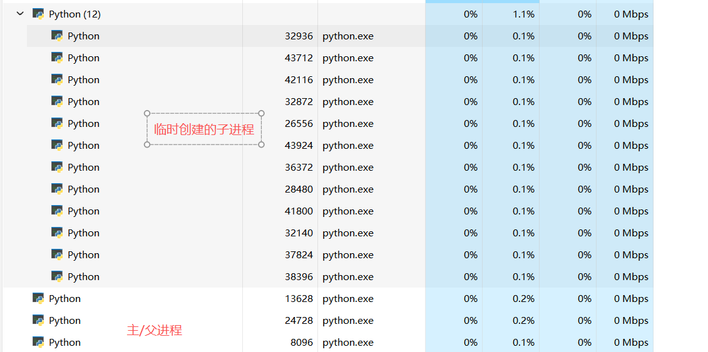

  子进程虽然也**从头读取 `.py` 脚本文件**，但由于**它是被“导入”或作为子模块启动的**，其 **`__name__` 被标记为 `__mp_main__` 值**（或其他非 `__main__` 值）。

  > 这是 `multiprocessing` 模块在幕后搞的小动作。当它重新导入主模块时，为了防止代码逻辑再次触发入口点，它会把原本的 `__main__` 伪装成一个普通的模块导入名。

  执行到 `if __name__ == '__main__':`  语句时**校验失败**，**跳过创建进程的代码，转而直接执行指定的 `target` 函数以及后续的代码语句**。

  ```python
  # 子进程视角: __name__ = '__mp_main__'
  from multiprocessing import Process
  
  def <任务函数>(): pass # 必须定义在 `if __name__ == '__main__':` 代码块之外
  
  if __name__ == '__main__': # __name__ = '__mp_main__' 校验不通过
  	Process(target=<任务函数>).start()
      
  # 跳过 `if __name__ == '__main__':` 代码块，去执行 <任务函数>
  # 如果 <任务函数> 是定义在 `if __name__ == '__main__':` 代码块中的，那么子进程在无法找到该 <任务函数> 去执行
  
  # 接着执行 if __name__ == '__main__': 代码块之外的后续代码...
  ```

由此，**主/父进程（Python 解释器）与子进程（Python 解释器【Process】）并行执行**，互不影响。


> [!NOTE]
>
> 而如果不写 `if __name__ == '__main__':` 代码块：
>
> ```python
> from multiprocessing import Process
> 
> def <任务函数>(): pass
> 
> Process(target=<任务函数>).start() 
> ```
>
> 则会出现这样的情况：
>
> - **主/父进程（Python 解释器）同步串行执行**：接着按**顺序同步执行** `Process(target=<任务函数>).start()` 后续的代码，不会影响异步执行的子进程任务
>
> - **子进程（Python 解释器【Process】）异步并发执行**：
>
>   子进程（Python 解释器【Process】）**从头开始执行 `.py` 文件中的代码**，遇到 `Process(target=f).start()`，由于**没有`if __name__ == '__main__':` 条件判断限制**，子进程会**认为自己也需要创建一个子进程**；
>
>   接着会跟主/父进程（Python 解释器）一样去向操作系统申请创建一个子进程（子进程嵌套创建子进程...）；这个新子进程又会重复这一过程，最终形成**无限递归**，直到操作系统资源耗尽（RuntimeError）。
>
> 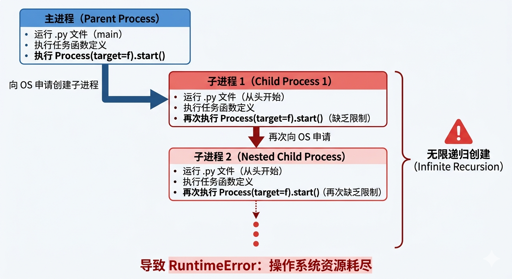

##### 简单理解

​	对于 主进程（Python 解释器）以及它创建的子进程（Python 解释器【Process】） 来说，操作系统都会**一视同仁**地**让它们读取并执行一遍 `.py` 文件**；

​	由于**主进程（Python 解释器）由于是程序入口**，故它读取的 `.py` 文件模块的 `__name__` 属性是 `__main__` 值，所以**会通过 `if __name__ == '__main__':` 校验**；

​	而**子进程是被“导入”或作为子模块启动**的，其 `__name__` 被标记为 `__mp_main__`（或其他非 `__main__` 值）。**执行到 `if __name__ == '__main__':`  语句时校验失败**，跳过创建进程的代码，转而直接执行指定的 `target` 函数。


##### 核心逻辑

- **有防火墙（正常）：**

  主进程（`__name__ == '__main__'`） → 启动子进程 → 子进程重启解释器 → 重新读取代码 → 识别到 `__name__ != '__main__'` →**跳过 `Process().start()`** → 执行目标函数。

- **无防火墙（递归崩溃）**：

  主进程 → 启动子进程 → 子进程重启解释器 → 重新读取代码 → **再次执行 `Process().start()`** → 启动孙进程 → 循环往复直至 `RuntimeError`。

#### current_process() 获取当前进程信息

作用：**获取当前进程信息**。

- **主进程**：线程名称为 **`MainProcess`**，所属类为 **`<_MainProcess>`**
- **子进程**：主进程**动态创建**多个子进程；进程名称自动分配为 **`Process-[nums]`**，所属类为 **`<Process>`**

作用域：**每个子进程的任务函数**内、面向**子进程重启 Python 解释器从头读取的 `.py` 文件**

```python
from multiprocessing import Process, current_process
import time

print('当前进程:', current_process())

def task(): 
    print('子进程任务')

if __name__ == '__main__':
	Process(target=task).start()

# 主进程：
# 当前进程: <_MainProcess name='MainProcess' parent=None started>

# 子进程：
# 当前进程: <Process name='Process-1' parent=19876 started>
```

### 守护进程（Daemon Process）

#### 基本概念

守护进程（Daemon Process）是**进程中一个生命周期较长的子进程**，它会**随着父进程的启动、结束而一起启动、结束**。

核心作用：守护进程**不负责复杂的逻辑任务**，**只在后台运行，专门负责为主进程提供一个具体的服务任务**。

> 可以理解为，守护进程就是主进程的一个 **“随从”**，**只为主进程负责**，也只会**跟着主进程的【任务】启动、结束而一起启动、销毁**。

使用场景：

1. 监控任务
2. 日志 / 统计 / 采样 类任务
3. 辅助性 “陪跑” 任务
4. ...

#### 基本语法

通过 Python 提供的 **`Process` 类在创建一个子进程**时，通过 **`daemon` 参数**来**指定该子进程**是否为一个**守护子进程**。

- **`Process()` 类构造函数传入**：

  ```python
  Process(target=<任务函数>, daemon=True)
  ```

- **`process.daemon` 类进程实例修改 `daemon` 属性**：

  ```python
  <进程实例> = Process(target=<任务函数>)
  
  <进程实例>.daemon = True # 注意：一定要在 start() 方法之前声明！
  ```

  因为 `start()` 方法已经向系统申请创建一个子进程了，后面再改 `deamon` 属性声明它是一个守护子进程，而会无效，报错！。

#### 核心特性

- 守护进程**必须是一个子进程（遵循多进程原则，守护进程也是异步交替执行的）**

- **主进程的【任务】结束**，**守护进程会随之被立即销毁**

  （如果**主进程中存在普通子进程**，主进程**不会被立即销毁**，而是**等待子进程任务结束再一起销毁**）

- 守护进程中**不能再创建子进程**（**普通子进程可以创建子进程【PPID 会指向普通子进程】**）

```python
# 守护进程
from multiprocessing import Process, current_process
import time


# 守护进程任务函数
def task():
    # p = Process(target=lambda x: print('子进程id:', current_process().pid), args=(1,))
    # 报错 AssertionError: daemonic processes are not allowed to have children

    # p.start()

    while True:
        print('----- 守护子进程运行中 -----')
        time.sleep(1)


if __name__ == '__main__':
    print('主进程 start')
    
    # 创建一个守护子进程
    daemon_process = Process(target=task, daemon=True)
    daemon_process.start()
    
    # 主进程持续运行任务
    for _ in range(3):
        print('---- 主进程运行中 -----')
        if _ == 2:  # 在主进程运行到指定条件时休息一段时间，守护子进程还在持续运行中
            time.sleep(5)
        time.sleep(1)
        
    print('主进程 end')

'''
输出结果：
主进程 start

---- 主进程运行中 -----
----- 守护子进程运行中 -----

---- 主进程运行中 -----
----- 守护子进程运行中 -----

---- 主进程运行中 -----
----- 守护子进程运行中 -----
----- 守护子进程运行中 -----
----- 守护子进程运行中 -----
----- 守护子进程运行中 -----
----- 守护子进程运行中 -----
----- 守护子进程运行中 -----

主进程 end 【主进程任务结束，守护进程随着一起被销毁】
'''
```

#### 生命周期

默认情况下，**当一个子进程的父进程执行完任务**后，为了避免它的子进程会成为一个 **“孤儿” 进程**，**父进程不会立即被销毁**，而是**等待子进程的任务结束后才一起回收销毁**。而**守护进程会随着父进程【任务】执行完毕之后第一时间被立即销毁**。

> **【任务】**：是指**主进程内可执行的代码语句**

当一个父进程创建了 **普通子进程** 和 **守护进程** 时，**父进程的【任务】结束后的销毁流程**：

1. **立即销毁**所有的 **`deamon` 守护子进程**
2. **等待**所有还在执行任务的**普通子进程**
3. 所有**普通子进程任务执行完毕**，主进程**开始进入正式的销毁阶段**
4. **子进程依次被销毁，主进程最后被销毁**

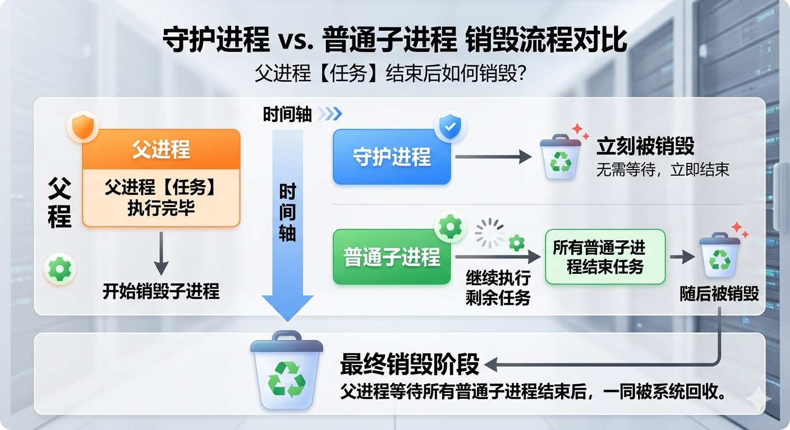

示例：

```python
# 守护进程
from multiprocessing import Process, current_process
import time


# 守护子进程任务函数
def daemon_task():
    # p = Process(target=lambda x: print('子进程id:', current_process().pid), args=(1,))
    # # 报错 AssertionError: daemonic processes are not allowed to have children

    # p.start()

    while True:
        print('----- 守护子进程运行中 -----')
        time.sleep(1)


# 普通子进程的子进程任务函数
def sub_task():
    print('----- 普通子进程的子进程运行中 -----')
    time.sleep(1)


# 普通子进程任务函数
def normal_task():

    # 创建一个普通子进程的子进程
    sub_process = Process(target=sub_task)
    sub_process.start()

    count = 0
    while True:
        count += 1
        print('----- 普通子进程运行中 -----')
        time.sleep(1)

        if count >= 10:
            # 注意，这里不能使用死循环，一定要有 braeak 跳出循环条件，否则普通子进程会一直占用CPU资源，导致主进程无法正常结束
            break


# 主进程
if __name__ == '__main__':
    print('主进程 start')
    # 创建一个守护子进程
    daemon_process = Process(target=daemon_task, daemon=True)
    daemon_process.start()

    # 创建一个普通子进程
    normal_process = Process(target=normal_task)
    normal_process.start()

    # 主进程持续执行任务中，守护、普通子进程在后台异步交替运行
    for _ in range(3):
        print('---- 主进程运行中 -----')
        if _ == 2:  # 在主进程运行到指定条件时休息一段时间，守护子进程还在持续运行中
            time.sleep(3)
        time.sleep(1)
    print('主进程 end')

'''
输出结果：
主进程 start

---- 主进程运行中 -----
----- 守护子进程运行中 -----
----- 普通子进程运行中 -----
----- 普通子进程的子进程运行中 -----

---- 主进程运行中 -----
----- 守护子进程运行中 -----
----- 普通子进程运行中 -----

---- 主进程运行中 -----
----- 守护子进程运行中 -----
----- 普通子进程运行中 -----
----- 守护子进程运行中 -----
----- 普通子进程运行中 -----
----- 守护子进程运行中 -----
----- 普通子进程运行中 -----
----- 守护子进程运行中 -----
----- 普通子进程运行中 -----

主进程 end  【主进程任务结束后，守护子进程会被销毁，但是普通子进程还在执行任务重】

----- 普通子进程运行中 -----
----- 普通子进程运行中 -----
----- 普通子进程运行中 -----
----- 普通子进程运行中 -----

【到这里，普通子进程的任务执行完毕，主进程、子进程一起被销毁】
'''
```

### RLock 互斥锁类

Python 内置的 `multiprocessing` 模块提供了一个 **`RLock` 类** 和 **`Lock` 类**，两者作用差不多，但 **`RLock` 类性能更好、最常用**。

#### 多进程/线程冲突

​	**同一进程内的多个子进程/线程共享进程内的所有资源（全局变量...）**，当有一个任务是用于访问共享资源时，该任务内的代码块就称之为**临界区**，临界区（操作共享资源的代码块）**可以被所有子进程/线程访问**，由此执行线程各自负责的任务；但是**由于多子进程/线程是异步机制的并发执行**，所以**常常会因为 CPU 的 “时间片” 任务调度机制**，从而导致**多子进程/线程之间发生冲突（争抢共享资源的操作权限）**，以导致**子进程/线程的预期输出结果不一致（数据原子性被破坏）**。

简单来说：多进程/线程冲突主要发生在**多个进程/线程同时访问共享资源（临界区）**时，由于操作系统的**进程调度不确定性**，导致数据不一致。

多进程/线程冲突的产生原因：

1. **非原子操作**：读取-修改-写入不是一步完成的
2. **进程调度**：操作系统可以随时切换进程
3. **缺少同步**：多个进程同时访问共享资源
4. **可见性问题**：一个进程的修改对其他进程不可见
5. **时序依赖**：执行顺序影响最终结果

#### 基本概念

核心作用：为了**保证进程/线程执行的任务数据原子性一致**，在**进程/线程访问临界区资源**时，**不会被其他进程/线程干扰**；可以**为进程/线程在访问共享资源执行任务添加一把 “互斥锁”**，并在**任务结束跳出临界区（操作共享资源的代码块）时 “释放锁”**，以此**保证多个进程/线程之间的数据不会出现混乱**。

核心本质：**互斥锁（Mutex）执行流程**本质上就是把**多进程/线程**的**【无序的】异步非阻塞机制的并行/并发执行**变为了**【有序的】同步阻塞机制的串行执行**，以牺牲时间来换取数据安全。

> 跟 `join()` 方法类似，也是让**多进程/线程**的**【无序的】异步非阻塞机制的并行/并发执行** →**【有序的】同步阻塞机制的串行执行**。

#### 基本语法

##### 进程写法

基本语法：

```python
from multiprocessing import RLock, Process

<锁实例> = RLock()
```

通过 `RLock()` 构造函数创建一个 “锁” 后，便**需要在进程的任务函数事先声明一个函数参数用于接收外部传入的 `RLock` 锁**。

核心要点：**多个进程都共用一把 “锁” 实例**，当**其他进程 发现 “锁” 实例被用着**的，就会**进入阻塞状态一直等待 “锁” 被释放**。

```python
from multiprocessing import RLock, Process

def <任务函数>(lock): 
    # 线程原子性任务
    
    
if __name__ == '__main__':
    <锁实例> = RLock() # 创建锁
    
    <进程实例A> = Process(target=<任务函数>,args=(<锁实例>,)) # 创建进程并为 target 任务函数传入一个 RLock 锁
    <进程实例B> = Process(target=<任务函数>,args=(<锁实例>,)) # 创建进程并为 target 任务函数传入一个 RLock 锁
    
    <进程实例A>.start() # 启动进程A
    <进程实例B>.start() # 启动进程B
```

##### 线程写法

基本语法：

```python
import threading

<锁实例> = threading.RLock()
```

通过 `RLock()` 构造函数创建一个 “锁” 后，便**需要在线程的任务函数事先声明一个函数参数用于接收外部传入的 `RLock` 锁**。

核心要点：**多个线程都共用一把 “锁” 实例**，当**其他线程 发现 “锁” 实例被用着**的，就会**进入阻塞状态一直等待 “锁” 被释放**。

```python
import threading

def <任务函数>(lock): 
    # 线程原子性任务
    
    
if __name__ == '__main__':
    <锁实例> = threading.RLock() # 创建锁
    
    <线程实例A> = threading.Thread(target=<任务函数>,args=(<锁实例>,)) 
    # 创建线程A并为 target 任务函数传入一个 RLock 锁
    
    <线程实例B> = threading.Thread(target=<任务函数>,args=(<锁实例>,)) 
    # 创建线程B并为 target 任务函数传入一个 RLock 锁
    
    <线程实例A>.start() # 启动线程A
    <线程实例B>.start() # 启动线程B
```

#### 获取锁-释放锁

`RLock` 类提供了两个方法，必须**成对出现**：

- **`lock.acquire()`：获取锁；用于进程/线程执行的任务前面【若 “锁” 已被其他线程A占用，则后面的线程B...阻塞等待】**
- **`lock.release()`：释放锁；用于进程/线程执行任务后面【让其他等待的进程B...获得执行机会】**

核心作用：**在进程/线程执行的任务前后**添加 **“获取锁“** 与 **”释放锁“** 的动作，能**保证该进程/线程任务的数据原子性一致**，**不会被其他线程干扰**；**其他线程若想要访问**时，会**被阻塞在 ”锁“ 外面**；即**保护临界区（共享资源【如多线程同时操作 IDE 终端控制台】），确保一次只有一个进程输出**。

##### 多进程写法

```python
from multiprocessing import Process, RLock
import time


# 任务函数1
def task1(lock):
    for i in range(3):
        lock.acquire()  # 上锁
        print('好好', end="")
        print('学习', end="")
        print('天天', end="")
        print('向上')
        lock.release()  # 释放锁
        time.sleep(0.5)


# 任务函数2
def task2(lock):

    for i in range(3):
        lock.acquire()  # 上锁
        print('A', end="")
        print('B', end="")
        print('C', end="")
        print('D')
        lock.release()  # 释放锁
        time.sleep(0.5)


# 入口函数（主进程）
if __name__ == '__main__':
    lock = RLock()  # 创建锁对象

    # 创建子进程A
    p1 = Process(target=task1, args=(lock,))
    # 创建子进程B
    p2 = Process(target=task2, args=(lock,))

    # 启动子进程A
    p1.start()
    # 启动子进程B
    p2.start()


'''
输出结果：
好好学习天天向上
ABCD
好好学习天天向上
ABCD
好好学习天天向上
ABCD
....
'''
```

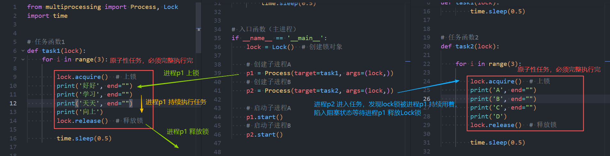

##### 多线程写法

```python
import threading
import time

# 全局变量（多个线程共享的进程资源）
shared_count = 0


def increase_count(lock):
    global shared_count
    # --- 线程的原子性任务 ---
    for _ in range(100):
        lock.acquire() # ---> 获取锁
        # --- 模拟复杂的临界区操作 ---
        # 1. 先读取旧值
        temp = shared_count

        # 2. 故意加入微小的延迟，强制触发“时间片到期”
        # 只要这里一停顿，CPU 就会切换到另一个线程
        time.sleep(0.0001)

        # 3. 将计算后的值写回
        # 此时 temp 可能已经是“过时”的数据了
        shared_count = temp + 1
        lock.release()  # ---> 释放锁


threads = []
# 增加线程数量，让竞争更激烈
for i in range(10):
    lock = threading.RLock()
    t = threading.Thread(target=increase_count, args=(lock,))
    threads.append(t)
    t.start()

for t in threads:
    t.join()

print(f"每个线程加100次，10个线程")
print(f"预期结果: 1000")
print(f"实际结果: {shared_count}")  # 101
print(f"结论: {'数据一致' if shared_count == 1000 else '原子性不一致！'}")  # 数据一致
```

执行逻辑：


#### 死锁的产生

由于 **“互斥锁”** 都是**成双成对**出现的，即**线程在开始执行任务时 — “加锁”，线程任务执行完毕时 — “释放锁”**。

如果**一个进程/线程在开始执行任务**时**加了两把 “锁”**，却**只释放了一把 “锁”**，那么**另外没有得到释放的 “锁”** 就是一个 **“死锁”**。则会**导致程序因为前者进程/线程开启的 “互斥锁” 一直未被释放而一直等待中【即前面的进程/线程没有出来，后续的进程/线程一直是阻塞状态】**....

产生死锁的必要条件：

1. **互斥**：资源一次只能被一个线程占用
2. **占有且等待**：线程已经拿到一个锁，还在请求另一个锁
3. **不可剥夺**：锁不能被强行抢走，只能由持有者主动释放
4. **循环等待**：形成了一个闭环（A 等 B，B 等 A）

```python
from multiprocessing import Process, RLock
import time


# 任务函数1
def task1(lock):
    for i in range(3):
        lock.acquire()  # 上锁 A 
        lock.acquire()  # 又上了一个锁 B
        print('好好', end="")
        print('学习', end="")
        print('天天', end="")
        print('向上')
        lock.release()  # 释放锁 A
        # 由于这里没有释放锁B，尽管任务已经执行完毕了，程序也会一直等待
        time.sleep(0.5)


# 任务函数2
def task2(lock):

    for i in range(3):
        lock.acquire()  # 上锁
        print('A', end="")
        print('B', end="")
        print('C', end="")
        print('D')
        lock.release()  # 释放锁
        time.sleep(0.5)


# 入口函数（主进程）
if __name__ == '__main__':
    lock = RLock()  # 创建锁对象

    # 创建子进程A
    p1 = Process(target=task1, args=(lock,))
    # 创建子进程B
    p2 = Process(target=task2, args=(lock,))

    # 启动子进程A
    p1.start()
    # 启动子进程B
    p2.start()
```

这是最常见的 **“遗漏释放”** 的案例，即忘记了 “释放锁” 这一动作。

##### with 语句自动释放

为了避免开发人员在编写多进程/多线程架构应用时，遗忘了 “上锁” - “释放锁” 任何其一的动作而导致程序崩溃/一直阻塞。

Python 提供了 `with` 代码块来解决，`with` 代码块专门用于那些 **成双成对** 的必要操作（**“上锁” - “释放锁”**）。

- 基本语法：

```python
from multiprocessing import Process, RLock

# 任务函数
def <任务函数>(<锁实例>):
    with <锁实例>:
        # 进程/线程原子性任务体
        
        
if __name__ == '__main__':
    <锁实例> = RLock() # 创建锁
    
    <进程实例> = Process(target=<任务函数>,args=(<锁实例>,)) # 创建进程并为 target 任务函数传入一个 RLock 锁
    
    <进程实例>.start() # 启动进程
```

- **`with <锁实例>:`**  

  - **“上锁”**：当**进程/线程进入`with` 代码块**时，会**自动调用 `<锁实例>` 的 `acquire()` 方法**进行 **“上锁”** 动作

  - **“释放锁”**：当**进程/线程离开 `with` 代码块**时，会**自动调用 `<锁实例>.release()` 方法**进行 **“释放锁”** 动作

    开发人员**无需手动编写 “上锁” - “释放锁” 的组合动作**，**只需关心进程/线程的原子性任务体**即可。


> [!NOTE]
>
> **关于进程/线程任务执行过程中出错的处理**：
>
> - 未使用 `with` 代码块：
>
> ​	如果在线程中执行任务出错时，由于未执行到  **“释放锁”** 的动作，所以**其他线程会一直阻塞等待**；
>
> - 使用 `with` 代码块：**即使发生了错误也会被 `RLock` 锁实例内部的 `__exit__()` 魔术方法捕捉到**，从而**自动释放锁**

- 示例：

```python
from multiprocessing import Process, RLock
import time


# 任务函数1
def task1(lock):
    with lock:
        for i in range(3):
            print('好好', end="")
            print('学习', end="")
            print('天天', end="")
            print('向上')
            # print(x) # 这条语句会报错 `x` is not found，但还是会释放锁
            time.sleep(0.5)


# 任务函数2
def task2(lock):
    with lock:
        for i in range(3):
            print('A', end="")
            print('B', end="")
            print('C', end="")
            print('D')
            time.sleep(0.5)


# 入口函数（主进程）
if __name__ == '__main__':
    lock = RLock()  # 创建锁对象

    # 创建子进程A
    p1 = Process(target=task1, args=(lock,))
    # 创建子进程B
    p2 = Process(target=task2, args=(lock,))

    # 启动子进程A
    p1.start()
    # 启动子进程B
    p2.start()


'''
输出结果：
好好学习天天向上
ABCD
好好学习天天向上
ABCD
好好学习天天向上
ABCD
....
'''
```

### 进程之间的通信

#### 基本概念

##### 为什么需要进程通信？

###### 多进程之间不共享数据

核心原因：进程之间是**各自相对独立**的，**不共享内存资源**，要想实现多进程之间的数据交互，必须通过进程的通信机制方案来手动实现。

```python
# 主进程、子进程都会从头读取一遍该 `.py` 文件模块
from multiprocessing import Process, current_process

# 全局资源（主进程、子进程都会读取一遍，并纳入自己的内存空间中）
count = 0
names = []

# 子进程才会执行的任务函数
def run():
    global count, names
    count += 1
    names.append('name')
    print('子进程 count = %d, names = %s' % (count, names))
    # 子进程 count = 1, names = ['name']

# 仅限主进程（__name__ = '__main__'）
# 由于 multiprocessing 模块内部会将子进程的 __name__ 改为 __mp_main__ ，所以子进程不会执行该代码块
if __name__ == '__main__':
    p = Process(target=run)
    p.start()

    print('主进程 count = %d, names = %s' % (count, names))
    # 主进程 count = 0, names = []


print('当前进程：', __name__, current_process())
print('全局变量 count = %d, names = %s' % (count, names))

'''
输出结果：
主进程 count = 0, names = []
当前进程： __main__ <_MainProcess name='MainProcess' parent=None started>
全局变量 count = 0, names = []

当前进程： __mp_main__ <_MainProcess name='Process-1' parent=None started>
全局变量 count = 0, names = []
子进程 count = 1, names = ['name']
'''
```

###### 底层原理（进程管理机制）

这是因为 Python 的**进程管理机制**：

​	在**当前进程（主进程）创建了子进程**后，**子进程（Process）会重启一个 Python 解释器重头读取并执行一遍 `.py` 文件**，并将 `.py` 文件中的**全局成员（全局变量、全局函数、全局类...）都纳入子进程自己的内存空间中**。

​	简单来说，**主进程与子进程**之间都**各自拥有独立的内存空间**，内存空间中**包含了 `.py` 文件模块以及脚本内的全局成员**，这些子进程之间的内存空间**对外是不可见的**，所以多进程才会**无法共享数据**。

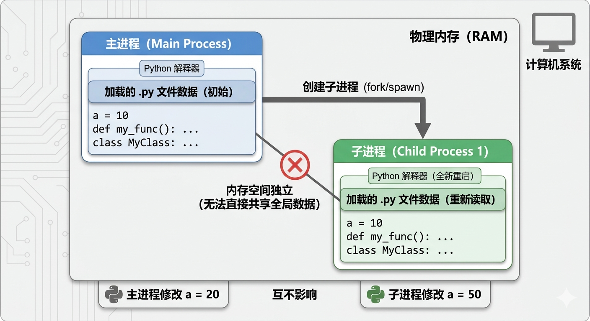

> [!NOTE]
>
> **为什么进程的内存空间对外 “不可见”** ？
>
> 这种设计主要是为了规避 Python 中的特殊 **GIL（全局解释器锁）** 的限制。因为每个进程都有自己独立的解释器和内存，它们可以真正实现多核 CPU 的并行计算，但也正因如此，它们之间无法像多线程那样直接读取对方的变量。
>
> 如果后续需要让它们通信，Python 提供了专门的**“桥梁”工具**，如 `Queue`（队列）或 `Pipe`（管道），通过序列化数据的方式在这些独立房间之间传递消息。

##### 常用通信方式

进程之间的通信方式主要有如下几种：

- **管道**

- **消息队列（Queue）**

  在处理**高并发**或**耗时任务**（如大模型推理、视频转码）时，Queue 消息队列是最常用的工具

  - **为什么常用：** 它能让发送者和接收者解耦。发送者把任务丢进队列就可以去干别的，接收者根据自己的节奏慢慢处理，这就是常说的“削峰填谷”。
  - **工具代表：** Python 中的 `multiprocessing.Queue`（单机进程间），以及生产环境常用的 `Redis` 或 `RabbitMQ`（分布式）

- **共享内存**

  如果追求的是**极致的速度**（例如超大规模矩阵运算、图像实时处理），共享内存是无可替代的。

  - **为什么常用：** 它是速度最快的 IPC 方式。数据不需要在内核和用户空间之间来回拷贝，多个进程直接读写同一块物理内存。
  - **代价：** 这种方式最难写，因为需要手动处理“锁”机制（Semaphore/Mutex），防止两个进程同时修改数据导致系统崩溃。

- **PV 信号量**

- **信号**

- **Socket 套接字**

  这是目前**最广泛使用**的通信方式，尤其是在 Web 开发、微服务和 AI 应用（如 RAG 系统与 LLM 服务交互）中

  - **为什么常用：** 它不局限于单机，可以跨网络、跨机器通信。即使在单机内部，使用 `127.0.0.1` 进行 Socket 通信也非常稳定
  - **应用场景：** 前端 Nuxt3 与 Python 后端 API 的交互、数据库连接、分布式爬虫

进程之间的通信方式并没有绝对的“第一常用”方式，因为选择哪种方式完全取决于**业务场景**和**开发语言**。

| **场景**                | **推荐方式**                | **理由**                     |
| ----------------------- | --------------------------- | ---------------------------- |
| **单机、简单任务**      | **管道（Pipe）/ 信号量**    | 结构简单，开销小。           |
| **单机、生产者-消费者** | **队列（Queue）**           | 逻辑清晰，自动处理同步问题。 |
| **大数据量、高性能**    | **共享内存**                | 避免数据拷贝，减少延迟。     |
| **跨网络、微服务**      | **套接字（Socket / gRPC）** | 兼容性最强，支持跨语言。     |

###### 底层原理（用户态、内核态）

在操作系统中，每个进程都有自己**独立的虚拟内存空间**，**进程 A 无法直接访问进程 B 的内存数据**；为了实现**进程之间的数据通信**，必须借助 “中间人” —— **内核（Kernel）**。

简单来说，**进程之间是不能互相访问的，但内核空间的数据是每个进程都共享的，所以进程之间的通信必须要经过内核**。

- 核心本质：进程之间的通信实质上就是**将程序从用户态频繁切换为内核态**，**借助内核态的 CPU 权限访问内核中的共享数据**，从而**实现进程之间的数据通信**

  > 类似于 Vue 的状态管理 State（多个实例通过一个 “中间层” 来管理共享状态数据，并进行通信）


#### Queue 消息队列

##### 基本概念

###### Queue 队列-数据结构

在计算机科学中，**Queue（队列）**是一种非常基础且核心的概念。

核心定义：**Queue（队列）**本质上是一种 **FIFO（先进先出）**的**数据结构**。

- **入队（Enqueue/Put）**：**新成员从队尾加入**
- **出队（Dequeue/Get）**：**队首的成员最先被处理并离开**

> `Queue` 本质上就是一种**协调机制**。它让数据的发送方和接收方不必步调一致，起到了“缓冲”和“解耦”的作用。

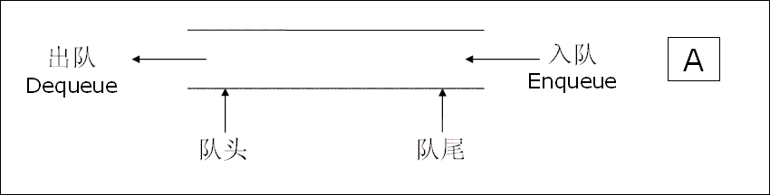

###### 消息队列模型（MQ）

**消息队列（Message Queue，简称 MQ）**是一种在软件架构中用于**“服务对服务”通信**的技术。

消息队列的运行涉及到 3 个核心角色，它本质上是一个**生产者与消费者**模型：

- **生产者（Producer）**：负责**创建 `Message` 消息**并将其**发生到 Queue 队列中**
- **队列（Queue）**：**暂存 `Message` 消息**的**存储空间（数据结构）**
- **消费者（Consumer）**：负责**从 Queue 队列中**读取并处理 **`Message` 消息**

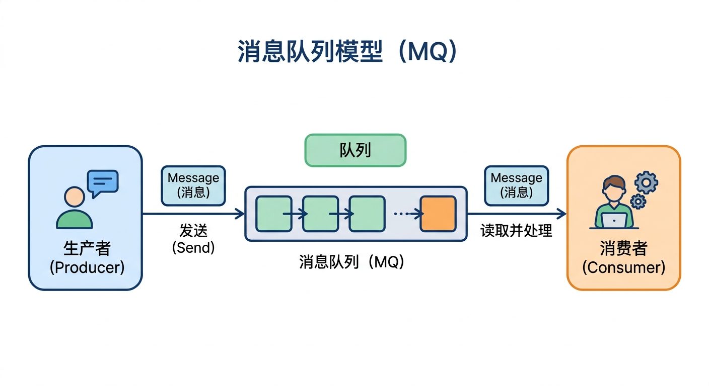

###### 为什么要用消息队列？

在复杂的系统开发中，消息队列（MQ）主要解决以下三个核心痛点：

- **解耦**：

  如果系统 A 直接调用系统 B，一旦 B 挂了或接口改了，A 就会报错。 引入 MQ 后，系统 A 只管把消息发给队列，系统 B 订阅队列即可。两者互不关心对方是否存在，实现了彻底的解耦。

- **异步处理**：

  假设一个用户注册流程：需要“写入数据库”、“发短信验证”、“发欢迎邮件”。

  - **同步：** 用户要等这三件事全部做完才能看到注册成功（耗时久）
  - **异步：** 写入数据库后，立即把发短信和发邮件的任务丢进消息队列（MQ），然后直接告诉用户“注册成功”。剩下的任务由后台慢慢处理

- **流量削峰**：

  在“秒杀”等高并发场景下，瞬间涌入的请求会冲垮数据库。 通过消息队列（MQ），可以将海量请求先堆积在 Queue 队列中，后端程序按照自己能承受的速度（例如每秒处理 1000 个）慢慢消化，从而保护核心系统不宕机。

常见的主流 MQ 产品：

| **产品**                | **特点**                                                 | **适用场景**                     |
| ----------------------- | -------------------------------------------------------- | -------------------------------- |
| **RabbitMQ**            | 基于 Erlang 开发，支持多种协议，性能稳定，可靠性高。     | 企业级应用、中小型系统。         |
| **Kafka**               | 分布式流处理平台，吞吐量极高，支持日志聚合和大数据处理。 | 大数据分析、实时监控、日志采集。 |
| **RocketMQ**            | 阿里开源，金融级可靠性，对分布式事务支持较好。           | 电商业务、对一致性要求高的场景。 |
| **Redis (List/PubSub)** | 轻量级，速度快，但消息持久化能力相对较弱。               | 简单的任务异步化、轻量级队列。   |

##### Queue() 创建一个队列

> [!NOTE]
>
> 在 Python 开发中，可以根据不同的使用场景选择不同的 `Queue`：
>
> - **`queue.Queue`：多线程之间的同步通信**
>
>   > **特点：** 它是**线程安全**的。这意味着**多个线程可以同时向里面放数据或取数据**，而不会导致数据错乱。
>   >
>   > **核心功能：**
>   >
>   > - **`put()`: 放入数据**；如果**队列满了，线程会阻塞等待**
>   > - **`get()`: 取出数据**；如果**队列空了，线程会阻塞等待**
>   >
>   > **场景：** 经典的**“生产者-消费者”**模型。
>
> - **`multiprocessing.Queue`：多进程之间的分布式通信**
>
>   > **特点：** 它是**进程安全**的。这意味着**多个进程可以同时向里面放数据或取数据**，而不会导致数据错乱。
>   >
>   > **核心功能：**
>   >
>   > - **`put()`: 放入数据**；如果 **Queue 队列满了**，**进程会阻塞等待**
>   > - **`get()`: 取出数据**；如果 **Queue 队列空了，进程会阻塞等待**
>   >
>   > **场景：** **跨进程的数据传递**。
>
> 两者语法一致，只不过 *`queue.Queue` 不支持跨进程通信*。

###### 基本语法

可以通过 **`multiprocessing.Queue` 类**创建一个 **Queue 队列容器实例**：

```python
from multiprocessing import Queue, Process # Queue 是一个线程安全的队列，可以在多个进程之间共享数据

<Queue 队列容器实例> = Queue(<maxsize?>)

# 多个子进程分配（共享同一个队列容器，实现多进程之间的通信）
Process(target=<任务函数A>, args=(<Queue 队列容器实例>)).start()
Process(target=<任务函数B>, args=(<Queue 队列容器实例>)).start()
```

核心作用：创建一个**容量上限为 `maxsize` 元素个数**的 **Queue 队列容器**。若**不传入 `maxisze` 参数**则默认**不设置可存储容量上限**。

示例：

```python
from typing import Any
from multiprocessing import Queue
# multiprocessing.Queue 是一个线程安全的队列，可以在多个进程之间共享数据

# 不固定长度队列
q: Queue[Any] = Queue()  # 不限制大小（即：不设置容量上限）

# 固定长度队列
q2: Queue[Any] = Queue(10)  # 限制容量上限为 10（最多只能保存 10 个元素）
```

###### 固定长度队列的进程阻塞

> [!IMPORTANT]
>
> 当 **Queue 队列容器** 初始化了**固定长度上限**时，它的 **`put` 推入** 和 **`get` 取出** 这一组合动作是**具有让当前进程陷入『阻塞』状态能力**的：
>
> - **`put()` 推入**：
>
>   当 **Queue 队列容器『长度溢出（已满）』**的情况下：
>
>   1. 如果**继续往 Queue 队列容器中 `put()` 推入元素**，会立即**让当前进程陷入『阻塞』状态**（元素放在进程的局部变量表）
>   2. **一直等到另一个进程调用 `get()` 方法取出一个元素**，Queue 队列容器有**空位**时，处于局部变量表中的元素才会『**入队**』
>   3. 反之，如果**一直没有其他进程取出一个元素**：
>      - **设置了 `timeout` 参数**：**超时抛出异常**，程序崩溃
>      - **未设置 `timeout` 参数、且 `block = True`**：**死等、永不超时**
>
> - **`get()` 取出**：
>
>   当 **Queue 队列容器『长度为0 （已空）』**的情况下：
>
>   1. 如果**继续从 Queue 队列容器中 `get()` 取出元素**，会立即**让当前进程陷入『阻塞』状态**
>   2. **一直等到另一个进程调用 `put()` 方法推入一个元素**，Queue 队列容器有元素时，**才会『唤醒』当前进程继续运行**
>   3. 反之，如果**一直没有其他线程推入一个元素**：
>      - **设置了 `timeout` 参数：超时抛出异常**，程序崩溃
>      - **未设置 `timeout` 参数、且 `block = True`：死等、永不超时**
>
> 核心要点：`put` 和 `get` 这一对组合动作对应了消息队列 MQ 的核心【**生产者-消费者模型**】。
>
> > 生产者（进程A） **<>  Queue 队列容器  <>**  消费者（进程B）
>
> - **生产速度（`put`） >  消费速度（`get`） →  触发阻塞/限流保护**
> - **生产速度（`put`） <  消费速度（`get`） →  消费者阻塞等待**
>
> 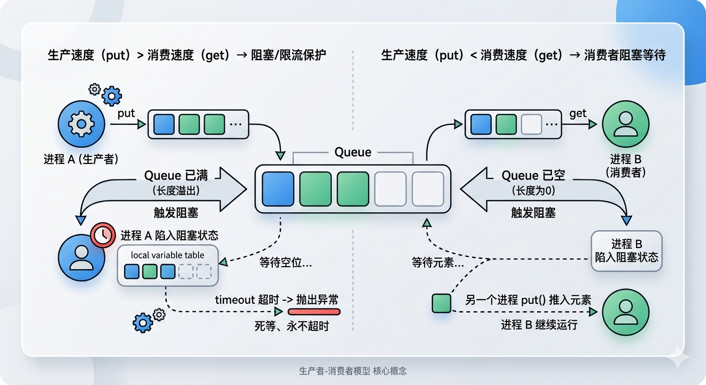
>
> > 实际场景：双十一大促，流量暴增
> >
> > 1. **用户下单（生产者 `put`）**： 瞬时涌入 1 万个订单。平台内部 Queue 队列设置了最大上限 `maxsize=5000`
> > 2. **队列爆满（触发阻塞/保护机制）**： 前 5000 个订单成功进入队列。当第 5001 个订单进来时，队列满了
> >    - **在 Python 内存队列中**：接收订单的 Web 线程会被阻塞，前端用户会看到界面在“转圈圈”（加载中）
> >    - **在工业级 MQ（如 RabbitMQ）中**：为了不让用户网页转圈，MQ 通常会开启磁盘限流或背压（Backpressure）机制，拒绝接收新消息，让上游的网关层直接返回“服务器繁忙，请稍后再试”（这就是限流防崩溃）
> > 3. **订单处理系统（消费者 `get`）**： 后台的“库存扣减服务”和“支付服务”正在以每秒 1000 个的速度疯狂 `get()` 并处理订单
> > 4. **动态平衡**： 消费者每 `get()` 走一个订单，队列空出一个位置，那个因为 `put` 被卡住的 Web 线程就立刻成功写入一个新订单。队列就像一个**蓄水池**，用自身的“阻塞能力”顶住了洪峰，保护了后续的数据库和核心业务系统不被瞬间冲垮

##### put(obj,timeout) 推入元素

核心作用：往 Queue 队列容器**末尾处推入一个 `obj` 元素**。

```python
# 关键字参数
<Queue 队列实例>.put(obj=<元素值>,timeout=<等待时间>,block=True/False)

# 位置参数
<Queue 队列实例>.put(<元素值>)
```

参数：

- **`obj` 元素**：要向 Queue 队列容器中**推入的一个数据元素**
- **`timeout` 等待时长**：因 Queue 队列容器**已满**而导致**当前进程**陷入**『阻塞状态』**的情况下，**当前阻塞进程要等待的时间，以 “秒” 为单位**，超时则抛出异常，程序崩溃
- **`block`**：**是否死等**

  - **`True`**：当队列容器**已满时**，会**一直等待**【默认】
  - **`False`**：当队列容器**已满时**，**不会等待，而是直接抛出异常**

  > `block` 与 `timeout` 的特性区别：
  >
  > - **`block`** 是 “一言堂”：**要么等，要么抛出异常**
  > - **`timeout`** 是 “有话好好说”：**先等一会，等不到再抛出异常**

###### 示例

- 不固定长度队列：

  ```python
  from typing import Any
  from multiprocessing import Queue
  
  # --不固定长度队列--
  q: Queue[Any] = Queue()  # 不限制大小（即：不设置容量上限）
  
  # put(data): 往 Queue 队列容器中推入一个 data 元素
  for i in range(100):
      q.put(i) # 推入多少个元素当前进程都不会陷入阻塞状态
  ```

- 固定长度队列：

  ```python
  from typing import Any
  from multiprocessing import Queue
  
  # --固定长度队列--
  q2: Queue[Any] = Queue(5)  # 限制容量上限为 10（最多只能保存 5 个元素）
  
  # put(data): 往 Queue 队列容器中推入一个 data 元素
  q2.put(i) # 0
  q2.put(i) # 1
  q2.put(i) # 2
  q2.put(i) # 3
  q2.put(i) # 4 
  
  print(q2.full()) # 判断队列容器是否已满；已满返回 True，否则返回 False
  
  q2.put(i) # 【注意：这里会阻塞当前进程，所以后面的代码语句都不会执行】
  q2.put(i) # 进程阻塞中...无法执行
  ```

  ```python
  # put(data): 往 Queue 队列容器中推入一个 data 元素
  try:
      for i in range(6):
          # 当队列被推入第6个元素时，当前进程会陷入阻塞状态，直到有元素被移出队列容器，或者超时抛出异常。
          # timeout 可以让进程在阻塞一段时间后抛出异常
          if q2.full(): # 判断当前队列容器是否已满
              q2.put(i, timeout=2)  # 设置了 timeout 参数，当前进程阻塞时间超过 2s 会抛出异常，程序崩溃
          else:
              q2.put(i)  # 未设置 timeout 参数，当前进程会一直阻塞等待
  except Exception as e: # 抛出 queue.Full 异常
      print(e)
  ```

###### put_nowait(obj) 推入元素、不会等待

核心作用：往 Queue 队列容器**末尾处推入一个 `obj` 元素**。

核心特性：若 Queue 队列容器**已满**，则**当前进程不会进入阻塞状态**，而是**直接抛出异常**。

> `put_nowait()`方法等价于 **`put(<元素>,block=False)` **

```python
# 固定长度队列
q2: Queue[Any] = Queue(5)

# put_nowait(obj): 不阻塞，如果队列已满，抛出异常
for i in range(6):
    try:
        q2.put_nowait(i)
    except Exception: # 抛出 queue.Full 异常
        print(f"队列已满，无法放入元素：{i} -- 队列是否已满：{q2.full()} -- 队列长度：{q2.qsize()}")
		# 队列已满，无法放入元素：5 -- 队列是否已满：True -- 队列长度：5
        
# 等价于 put(<元素>, block=False)
for i in range(6):
    q2.put(i, block=False)  # 当 i == 6 时，队列已满，无法放入元素。抛出 queue.Full 异常
```

##### get(timeout) 取出元素

核心作用：从 Queue 队列容器**队首处取出一个元素**，且**下一个位置的元素会自动前移一位到队首处**。*类似于列表中 `pop()` 的动作*。

```python
# 关键字参数
<取出的队首元素> = <Queue 队列实例>.get(timeout=<等待时间>,block=True/False)

# 位置参数
<取出的队首元素> = <Queue 队列实例>.get(<元素值>)
```

参数：

- **`timeout` 等待时长**：因 Queue 队列容器**已空**而导致**当前进程**陷入**『阻塞状态』**的情况下，**当前阻塞进程要等待的时间，以 “秒” 为单位**，超时则抛出异常，程序崩溃

- **`block`**：**是否死等**

  - **`True`**：当队列容器**已空时**，会**一直等待**【默认】
  - **`False`**：当队列容器**已空时**，**不会等待，而是直接抛出异常**

  > `block` 与 `timeout` 的特性区别：
  >
  > - **`block`** 是 “一言堂”：**要么等，要么抛出异常**
  > - **`timeout`** 是 “有话好好说”：**先等一会，等不到再抛出异常**

###### 示例

```python
from typing import Any
from multiprocessing import Queue

# --不固定长度队列--
q: Queue[Any] = Queue()  # 不限制大小（即：不设置容量上限）

# put(data): 往 Queue 队列容器中推入 5 个 data 元素
for i in range(5):
    q.put(i)
```

- 逐个取出：

  ```python
  # get(): 从 Queue 队列容器队首处取出一个元素，且下一个位置的元素会自动前移一位到队首处
  q2.get() # 0
  q2.get() # 1
  q2.get() # 2
  q2.get() # 3
  q2.get() # 4 
  
  print(q.empty())  # 判断当前队列容器是否为空，为空返回 True，否则返回 False
  
  q2.get() # 【注意：这里会阻塞当前进程，所以后面的代码语句都不会执行】
  q2.get() # 进程阻塞中...无法执行
  ```

- 循环取出：

  ```python
  try:
      for i in range(6):
          # 队列容器空了，进程陷入阻塞状态，如果此时没有往队列容器中推入一个元素，那么当前进程会一直阻塞，直到有元素被推入队列容器，或者超时抛出异常。timeout 可以让进程在阻塞一段时间后抛出异常
          if q.empty():
              print(q.get(timeout=2))
              # 设置了 timeout 参数，当前进程阻塞时间超过 2s 会抛出异常，程序崩溃
          else:
              print(q.get())  # 未设置 timeout 参数，当前进程会一直阻塞等待
  except Empty as e:  # 抛出 queue.Empty 异常
      print(e)
  ```

###### get_nowait() 取出元素、不会等待

核心作用：往 Queue 队列容器**队首处取出一个元素**。

核心特性：若 Queue 队列容器**已空**，则**当前进程不会进入阻塞状态**，而是**直接抛出异常**。

> `get_nowait()`方法等价于 **`get(block=False)` **

```python
# 固定长度队列
q2: Queue[Any] = Queue(5)

# put_nowait(obj): 不阻塞，如果队列已满，抛出异常
for i in range(6):
    try:
        q2.put_nowait(i)
    except Exception:
        print(f"队列已满，无法放入元素：{i} -- 队列是否已满：{q2.full()} -- 队列长度：{q2.qsize()}")
        # 队列已满，无法放入元素：5 -- 队列是否已满：True -- 队列长度：5


# get_nowait(): 不阻塞，如果队列为空，抛出异常
for i in range(6):
    try:
        print(q2.get_nowait())  # 0 1 2 3 4
    except Exception:
        print(f"队列已空，无法取出元素：{i} -- 队列是否已空：{q2.empty()} -- 队列长度：{q2.qsize()}")
		# 队列已空，无法取出元素：5 -- 队列是否已空：True -- 队列长度：0
        
# 等价于 gut(block=False)
for i in range(6):
    q2.get(block=False)  # 当 i == 6时，队列已空，无法取出元素。抛出 queue.Empty 异常
```

##### full() 队列是否已满

> 注：**仅限于 `Queue(n)` 固定长度的队列容器实例**

核心作用：判断当前 Queue 队列容器的**长度是否溢出（已满）**。

返回值：

- **`True`：已满【再调用 `put()` 推入元素动作，会让当前进程陷入阻塞】**
- **`False`：未满，还有空位**

```python
# Queue 队列容器
from multiprocessing import Queue
from typing import Any


q: Queue[Any] = Queue(5)

for i in range(6):
    q.put(i)
    print(q.full())
    # False
    # False
    # False
    # False
    # True
    # 线程阻塞....
```

##### empty() 队列是否已空

核心作用：判断当前 Queue 队列容器的**长度是否为 0（已空）**。

返回值：

- **`True`：已空【再调用 `get()` 拿取元素动作，会让当前进程陷入阻塞】**
- **`False`：未空，还有可取元素**

```python
# Queue 队列容器
from multiprocessing import Queue
from typing import Any


q: Queue[Any] = Queue(5)

for i in range(5):
    q.put(i)
    print(q.full())
    # False
    # False
    # False
    # False
    # True

for i in range(6):
    print(f"{q.get()} -- {q.empty()}")
    # 0 -- False
    # 1 -- False
    # 2 -- False
    # 3 -- False
    # 4 -- True
    # 线程阻塞....
```

##### qsize() 获取队列长度

核心作用：返回当前 Queue 队列容器内的**元素个数**。

```python
# Queue 队列容器
from multiprocessing import Queue
from typing import Any


q: Queue[Any] = Queue(5)

for i in range(5):
    q.put(i)
    print(f"已推入元素：{i} -- 队列是否已满：{q.full()} -- 队列长度：{q.qsize()}")
    # 已推入元素：0 -- 队列是否已满：False -- 队列长度：1
    # 已推入元素：1 -- 队列是否已满：False -- 队列长度：2
    # 已推入元素：2 -- 队列是否已满：False -- 队列长度：3
    # 已推入元素：3 -- 队列是否已满：False -- 队列长度：4
    # 已推入元素：4 -- 队列是否已满：True  -- 队列长度：5

for i in range(5):
    print(f"已取出元素：{q.get()} -- 队列是否为空： {q.empty()} -- 队列剩余元素个数：{q.qsize()}")
    # 已取出元素：0 -- 队列是否为空： False -- 队列剩余元素个数：4
    # 已取出元素：1 -- 队列是否为空： False -- 队列剩余元素个数：3
    # 已取出元素：2 -- 队列是否为空： False -- 队列剩余元素个数：2
    # 已取出元素：3 -- 队列是否为空： False -- 队列剩余元素个数：1
    # 已取出元素：4 -- 队列是否为空： True  -- 队列剩余元素个数：0
```

##### 多进程通信示例

- 进程A：写入数据
- 进程B：读取数据
- RLock 锁：为了防止多进程冲突，导致数据原子性不一致，输出结果混乱，需使用锁来限制多进程之间的执行流程（**同步串行执行**）
- Queue 队列容器：多进程之间通信的队列容器

```python
# 利用多进程同步并行执行的方式，实现一个简单的多进程通信案例
from multiprocessing import Process, RLock, Queue
import time
from typing import Any


# 进程A -- 写入 Queue 队列数据
def write_task(lock, queue, num):
    with lock:
        for i in range(num):
            queue.put(i)
            print(f'写入数据 {i}')
            time.sleep(1)


# 进程B -- 读取 Queue 队列数据
def read_task(lock, queue, num):
    with lock:
        for i in range(num):
            print(f'读取数据 {queue.get()}')
            time.sleep(1)


if __name__ == '__main__':
    lock = RLock()  # 创建一个锁

    num = 5  # 队列的固定长度

    queue: Queue[Any] = Queue(5)  # 创建一个进程间共享的固定长度队列

    # 创建两个进程
    p1 = Process(target=write_task, args=(lock, queue, num))
    p2 = Process(target=read_task, args=(lock, queue, num))

    # 启动两个进程
    p1.start()
    p2.start()

    # 等待两个进程执行完毕
    p1.join()
    p2.join()

'''
输出结果：
写入数据 0
写入数据 1
写入数据 2
写入数据 3
写入数据 4
读取数据 0
读取数据 1
读取数据 2
读取数据 3
读取数据 4
'''
```

#### Pipe 管道

在操作系统中，管道（Pipe）是最基本的进程间通信机制（IPC）。

##### 基本概念

###### Pipe 管道-数据结构

在计算机科学中，**Pipe（管道）**是一种非常基础且核心的概念。

核心定义：**Pipe（管道）**本质上是一种 **FIFO（先进先出）**的**数据结构**。

- **流入（Inflow）**：**数据从管道一端流入**
- **流出（Outflow）**：**数据从管道另一端流出**

> 形象比喻：就像现实中的水管一样，数据从一端流入，从另一端流出。


核心本质：**Pipe（管道）**在底层本质上就是**系统内核中维护的一块内存缓冲区**（通常是一个**环状队列**）。即**Pipe（管道）**本质上也是一个**队列容器**。

##### Pipe() 创建一个管道

> [!NOTE]
>
> 在 Python 开发中，只有进程可以使用 Pipe（管道）进行通信：
>
> - **`multiprocessing.Pipe`：多进程之间的半双工/全双工通信**
>
>   > **特点：** 它是**进程安全**的。这意味着**多个进程可以同时向里面放数据或取数据**，而不会导致数据错乱。
>   >
>   > **核心功能：**
>   >
>   > - **`send()`: 发送数据**
>   > - **`recv()`: 接收数据**
>   >
>   > **场景：** **跨进程的数据传递**。

###### 基本语法

可以通过 **`multiprocessing.Pipe` 类**创建一个 **Pipe 管道容器实例**：

```python
from multiprocessing import Pipe # Pipe 是一个进程安全的管道容器，可以在多个进程之间共享数据

Pipe(deplex=True/False) # 创建一个管道对象
```

核心作用：创建一个**半双工/全双工通信**机制的 **Pipe（管道）容器**。

###### 核心要点

`Pipe()` 构造方法会返回一个 **`()` 元组对象**，分别代表**管道的 “两端”**，管道 “两端” 的能力取决于 `Pipe()` 的`duplex` 参数 

- 传入 **`deplex=True`** ：表示**管道左右两端的连接对象**都具备**全双工通信能力**；即**可 `send()`发送数据，也可 `recv()` 接收数据**

  ```python
  from multiprocessing import Pipe, Process # Pipe 是一个进程安全的管道容器，可以在多个进程之间共享数据
  
  # 全双工【默认】
  <管道连接对象A(可读写)>,<管道连接对象B(可读写)> = Pipe() # Pipe(duplex=True) 
  
  # 多个子进程分配可读写权限（共享同一个Pipe 管道容器，实现多进程之间的通信）
  Process(target=<任务函数A>, args=(<管道连接对象A(可读写)>)).start()
  Process(target=<任务函数B>, args=(<管道连接对象B(可读写)>)).start()
  ```

- 传入 **`duplex=False` **：表示：**管道两端的连接对象**仅具备**半双工通信能力**：

  - 读端（左侧）：**只可 `send()` 发送数据**
  - 写端（右侧）：**只可 `recv()` 接收数据**

  ```python
  from multiprocessing import Pipe # Pipe 是一个进程安全的管道容器，可以在多个进程之间共享数据
  
  # 半双工
  <读端(read-only)-管道连接对象>,<写端(write-only)-管道连接对象> = Pipe(duplex=False)
  
  # 多个子进程分配具体的只读、只写权限（共享同一个Pipe 管道容器，实现多进程之间的通信）
  Process(target=<任务函数A>, args=(<读端(read-only)-管道连接对象>)).start()
  Process(target=<任务函数B>, args=(<写端(write-only)-管道连接对象>)).start()
  ```

##### 方法

###### recv() 读取数据

核心作用：**从管道容器中读取一条数据**。

```python
from multiprocessing import Pipe, Process
import time

# 用户进程A：先发送提问，再等待回答
def user_task(con):
    con.send('你好，我是用户进程A-我要咨询一个问题')
    print("用户进程A：问题已发送，等待客服回应...")

# 客服进程B：先等待提问，再发送回答
def customer_task(con):
    data = con.recv()
    print('客服进程B 收到用户提问：', data)

if __name__ == '__main__':
    connection1, connection2 = Pipe()

    # 创建全双工进程A
    p1 = Process(target=user_task, args=(connection1,))
    # 创建全双工进程B
    p2 = Process(target=customer_task, args=(connection2,))

    # 启动进程
    p1.start()
    p2.start()
```

###### send(obj) 发送数据

核心作用：**向管道容器中发送一条 `obj` 数据**。

```python
from multiprocessing import Pipe, Process
import time

# 用户进程A：先发送提问，再等待回答
def user_task(con):
    con.send('你好，我是用户进程A-我要咨询一个问题')
    print("用户进程A：问题已发送，等待客服回应...")

# 客服进程B：先等待提问，再发送回答
def customer_task(con):
    data = con.recv()
    print('客服进程B 收到用户提问：', data)

if __name__ == '__main__':
    connection1, connection2 = Pipe()

    # 创建全双工进程A
    p1 = Process(target=user_task, args=(connection1,))
    # 创建全双工进程B
    p2 = Process(target=customer_task, args=(connection2,))

    # 启动进程
    p1.start()
    p2.start()
```

##### 半双工 &  全双工

###### 半双工

核心定义：数据在管道中是**单向流动**的（**半双工**），只能**从写端流向读端**。*类似于 HTTP1 协议*

编码表现：

- 进程A：**读端**；**只能调用 `recv()` 方法接收数据**
- 进程B：**写端**；**只能调用 `send()` 方法发送数据**

> 注意点：读端进程A不能调用 `send()` 方法发送数据，否则会报错 **`OSError: connection is write-only`**，反之亦然。

基本语法：

```python
from multiprocessing import Pipe

read_connection, write_connection = Pipe(duplex=False)
# 此时：read_connection 是读端（read-only），write_connection 是写端（write-only）
```


示例：

```python
# Pipe 管道通信
from multiprocessing import Pipe, Process


# 读端进程A
def read(read_connection):
    data = read_connection.recv()
    # read_connection.send() # 报错：OSError: connection is read-only，读端连接对象不能主动发送数据
    print(f'读端进程A-接收数据：{data}')


# 写端进程B
def write(write_connection):
    write_connection.send('hello')
    # write_connection.recv() # 报错：OSError: connection is write-only，写端连接对象不能主动读取数据
    print('写端进程B-发送数据：hello')


if __name__ == '__main__':
    # Pipe() 创建一个管道，返回两个连接对象（conn1, conn2），它们表示管道的两端。
    read_connection, write_connection = Pipe(duplex=False)  # duplex=False 表示管道是单向的
    # read_connection 是读端（read-only），只能调用 `recv()`方法 接收数据
    # write_connection 是写端（write-only），只能调用 `send()`方法 发送数据

    # 创建读端进程A
    p1 = Process(target=read, args=(read_connection,))
    # 创建写端进程B
    p2 = Process(target=write, args=(write_connection,))

    # 启动进程
    p1.start()
    p2.start()

'''
输出结果：
写端进程B-发送数据：hello
读端进程A-接收数据：hello
'''
```

###### 全双工

核心定义：数据在管道中是**双向流动**的（**全双工**），**管道 “两端” **都可以**读、写**。*类似于 WebSocket 协议*

编码表现：

- 进程A：**读写端**；**可以调用 `send()` 发送数据、`recv()` 方法接收数据**
- 进程B：**读写端**；**可以调用 `send()` 发送数据、`recv()` 方法接收数据**

基本语法：

```python
from multiprocessing import Pipe

connection1,connection2 = Pipe(duplex=False)
# 此时：connection1、connection2 都是可读写端（read-write）
```

> **时序配合**：
>
> 由于 **Pipe（管道）的读写操作存在让当前进程陷入『阻塞状态』**的问题。如：
>
> - **进程启动时就调用 `recv()`向【空管道】读取数据**，此时**当前进程会陷入『阻塞状态』，一直死等数据**
>
> 所以，在**多进程全双工通信**场景中，**必须有一个进程先写入一个数据，保证管道不是空的，再由其他进程来读取管道内的数据**


示例：

```python
from multiprocessing import Pipe, Process
import time


# 用户进程A：先发送提问，再等待回答
def user_task(con):
    print("用户进程A：正在组织语言...")
    time.sleep(1)  # 模拟思考

    # 1. 用户先开口
    con.send('你好，我是用户进程A-我要咨询一个问题')
    print("用户进程A：问题已发送，等待客服回应...")

    # 2. 发送完后，等待接收客服的回答
    data = con.recv()
    print('用户进程A 收到客服回答：', data)


# 客服进程B：先等待提问，再发送回答
def customer_task(con):
    print("客服进程B：在线值班，等待用户咨询...")

    # 1. 客服先进入等待状态（此时用户正好发来数据，所以不会死锁）
    data = con.recv()
    print('客服进程B 收到用户提问：', data)

    # 2. 收到后，进行回复
    con.send('你好，我是客服进程B-很高兴为你服务！')
    print("客服进程B：回答已发送。")


if __name__ == '__main__':
    # Pipe() 创建一个管道，返回两个连接对象（conn1, conn2），它们表示管道的两端。
    connection1, connection2 = Pipe()  # duplex=True 表示管道是双向的
    # connection1：可读可写（recv、send）
    # connection2：可读可写（recv、send）

    # 创建全双工进程A
    p1 = Process(target=user_task, args=(connection1,))
    # 创建全双工进程B
    p2 = Process(target=customer_task, args=(connection2,))

    # 启动进程
    p1.start()
    p2.start()

'''
输出结果：
用户进程A：正在组织语言...
客服进程B：在线值班，等待用户咨询...
用户进程A：问题已发送，等待客服回应...
客服进程B 收到用户提问： 你好，我是用户进程A-我要咨询一个问题
客服进程B：回答已发送。
用户进程A 收到客服回答： 你好，我是客服进程B-很高兴为你服务！
'''
```

##### 死锁阻塞问题

Pipe（管道）的读写操作是具有让当前进程陷入**『阻塞状态』**能力的。

###### 管道缓冲区

**管道缓冲区（Pipe Buffer）**是操作系统内核（Kernel）在内存中开辟的一个**临时存储区域**。

可以把它想象成一条传送带上的“暂存纸箱”：**当进程A（写端）向管道写入数据**时，数据并**没有直接瞬间飞到进程B（读端）**的手里，而是**先存放在这个内核缓冲区中**；**进程B再去这个缓冲区里把数据读取出来**。

> [!NOTE]
>
> **为什么需要管道缓冲区**？（**解决速度不匹配**）
>
> 在多进程通信中，**写数据和读数据**的**速度**往往是**不对等**的（比如进程A生产数据极快，进程B处理数据极慢）。
>
> - **如果没有缓冲区**：进程A每写一个字节，就必须死等进程B拿走，才能写下一个字节。两个进程会严重互相拖累，效率极低。
> - **有了缓冲区**：进程A可以“一口气”把大量数据塞进缓冲区，然后自己去忙别的事；进程B有空了再从缓冲区里慢慢消化。这实现了进程之间的**解耦**和**异步**。

> 管道缓冲区的大小是**有限的**（在 Linux 系统中，默认通常是 **64 KB**）。正因为大小有限，它会带来两种非常经典的进程“卡死”（阻塞）现象：
>
> - **状态一：缓冲区满了（Write Blocked）**
>
>   当写端进程发送数据的速度远大于读端进程接收的速度时，缓冲区很快就会被填满。
>
>   - **后果**：一旦缓冲区满了，写端进程的 `send()` 或 `write()` 方法就会**被操作系统强制挂起（阻塞）**。
>   - **解锁条件**：直到读端进程调用 `recv()` 读走了一部分数据，腾出了空间，写端进程才会复活继续写。
>
> - **状态二：缓冲区空了（Read Blocked）**
>
>   当读端进程想要读取数据，但写端进程还没来得及发，或者发得太慢时。
>
>   - **后果**：缓冲区里空空如也，读端进程的 `recv()` 或 `read()` 方法就会**陷入阻塞**（这也就是你上一题中代码卡死的原因）。
>   - **解锁条件**：直到写端进程往里面写入了新数据，读端进程才会被唤醒。

总结：管道缓冲区就像是一个**有容量上限的传送带**。它是操作系统为了让两个进程安全、高效、不乱套地传递数据，而在内存里搭建的“中转站”。控制好写入和读取的节奏，不让缓冲区“撑爆”或“饿死”，是并发编程的核心功力。

###### 四大核心特性

| **场景（状态）**             | **行为结果 / 机制**                                          |
| ---------------------------- | ------------------------------------------------------------ |
| **读端读取空管道**           | 如果写端没关闭，**读进程会阻塞（Wait）**，直到写端有数据写入。 |
| **写端写入满管道**           | 管道缓冲区（通常为 64KB）满了，**写进程会阻塞**，直到读进程移走数据。 |
| **写端全部关闭，读端继续读** | 读进程读完剩余数据后，`read()` 会**返回 0**，表示读到文件末尾（EOF）。 |
| **读端全部关闭，写端继续写** | 操作系统会向写进程发送 **`SIGPIPE` 信号**，直接终止写进程（因为写了也没人听，属于异常操作）。 |

###### 具体表现

- 当进程**调用 `recv()` 方法读取数据**时：
  1. 如果此时**管道里没有任何数据（空的 Pipe管道）**，则**当前进程的读取操作**会**陷入『阻塞状态』**，停在这里死等数据
  2. 直到**有另一个进程主动向【空管道】内发送一条数据**
- 当进程**调用 `send()` 方法发送数据**时：
  1. 如果此时**管道缓冲区满了（满载管道）**，则**当前进程的写入操作**会**陷入『阻塞状态』**，停在这里死等
  2. 直到**有另一个进程主动向【满载管道】内读取一条数据**


#### Event 事件（一对多通知）

在 Python 的多进程编程（`multiprocessing` 模块）中，**`Event`（事件）** 是一种非常高效且简单的**同步通信机制**。

##### 核心概念

核心定义：

​	**`Event` 事件**主要用于**一个或多个进程**需要**等待**另一个进程（**管控进程**）**完成某个特定操作或某种状态**后，**一次性**将**所有等待中的进程**全部**唤醒开始工作**的业务场景（**一对多通知**）。

​	在这个过程中，**【管控进程】**可以在**不同的时机**通过**控制多个进程之间共享的 `Event` 事件对象内部标志（Flag）**来**实时调度（唤醒/等待）其他进程共同协作，一起完成**某个业务场景。

> 简单来说，它就像一个**红绿灯**：一个进程负责控灯（红或绿），其他进程看着灯决定是走还是停。

###### 内部标志 Flag

`Event` 事件对象内部维护着一个**全局的【内部标志（Flag）】（对外不可见）**，它只有两种状态：

- **`True`：发生【默认】**
- **`False`：未发生**

执行逻辑：**多个进程**之间通过 **改变** 和 **持续监听** 这个**全局内部标志（Flag）**来**协同工作**：

- **阻塞等待**：当**【内部标志 Flag】为 `False`** 时，会**『阻塞』当前运行中的进程**，让其**停下等待通知（Flag 为 `True` 后，继续执行）**
- **唤醒继续**：当**【内部标志 Flag】为 `Ture` **时，所有**正在处于等待中的『阻塞』进程**会被**立即『唤醒』并继续执行任务**


###### 执行流程

要想通过 **`Event` 事件对象**实现 **“一对多” 通知**的**多进程同步执行**场景，需要有以下 3 个核心角色参与：

- **管控进程（一个）**：通过在**不同的时机改变 `Flag` 内部标志值**来让**其他多个执行进程切换对应的状态（等待/唤醒）**【颗粒度控制】

- **`Event` 事件对象的内部标志 Flag（多进程共享同一个）**：所有子进程**共享**的全局标志（变量），决定进程**『阻塞』**或**运行**

- **工作进程（多个）**：真正**执行任务的子进程**；通过**各自持续监听 `Event` 事件对象的内部标志 Flag** 来决定**是否等待/唤醒运行**

  

核心关键点：**`Event` 事件**是通过 **“一对多通知” 的机制**让**多进程之间**进行**同步执行任务**的事件机制；

> 即【管控进程】“一发号令，其他所有子进程开始同步工作”。

> 注意点：`Event` 事件只是一个能以 “一对多通知” 的方式让多进程之间协同工作、完成任务的解决方案，它本身并不能传递数据。

###### 优缺点

- 优点：
  - **简单轻量**：没有复杂的队列管理和数据传输，仅仅是一个状态标志。
  - **一对多通知**：一个进程 `set()`，可以同时唤醒多个处于 `wait()` 状态的进程，这在 `Queue` 或 `Pipe` 中是很难直接做到的。
- 缺点与限制：
  - **不能传递数据**：`Event` 只能传递“到了/没到”这种状态信息，如果需要传递具体的数据内容（如字符串、字典、对象），必须配合 `Queue` 队列、`Pipe` 管道等容器或共享内存使用。

###### 适用场景

`Event` 事件通知机制最适合用于 **“一呼百应”** 或 **“单向通知”** 的场景。例如：

1. **服务启动同步**：主进程需要等待初始化进程（如数据库连接、配置加载）完成后，再启动其他工作进程。
2. **定时/周期性任务控制**：通过 `Event` 来优雅地通知后台循环进程退出。
3. **多进程协调**：多个工作进程等待主进程发出“开始”指令，然后同时开始执行。

##### Event 类实现

Python 的 `multiprocessing` 模块提供了一个 `Event` 类可以实现 “一对多通知” 模型。

###### 创建一个 Event 事件对象

核心作用：通过 **`Event()` 类**创建一个 **Event 事件对象实例**，并**统一分配给其他多个工作子进程共享**，多进程之间**通过该 Event 事件对象进行协同工作**。

> 注：必须要有一个**【管控进程】**来**管理改变 Event 事件对象内部的 Flag 标志状态**，从而**控制其他多个工作子进程的行为（等待/唤醒工作）**

```python
# Event 事件通知机制
from multiprocessing import Process, Event

def <管控任务函数>(<Event 事件对象>): 
    # 控制 <Event 事件对象> 内部的 Flag 状态...

def <工作任务函数>(<Event 事件对象>): 
    # 持续监听 <Event 事件对象> 内部的 Flag 状态...
    # 要执行的任务...

# 主进程
if __name__ == '__main__':
    <Event 事件对象> = Event()  # 创建一个 Event 事件对象
    
    # 管控进程：负责管来改变 Event 事件对象的 Flag 标注状态，以控制其他进程的行为（等待/唤醒工作）
    <管控进程实例> = Process(target=<管控任务函数>, args=(<Event 事件对象>,))
    
    # 工作进程：负责执行具体任务，当 Event 事件对象的 Flag 标注状态为 True 时，工作进程开始工作，否则阻塞等待
    <工作进程实例> = Process(target=<工作任务函数>, args=(<Event 事件对象>,))
	
    # 启动进程
    <管控进程实例>.start()
    <工作进程实例>.start()
	
	# 等待所有进程结束
    <管控进程实例>.join()
    <工作进程实例>.join()
```

##### 核心方法

`Event` 类提供了如下方法来实现多进程之间的通信控制：

- **`is_set()`**：返回一个**布尔值**，判断**当前 `<Event 事件对象>` 的 Flag 内部标志是否为 `True`**
- **`set()`**：**【管控进程专用】**；
  1. **将当前 `<Event 事件对象>` 的 Flag 内部标志设置为 `True`**
  2. 此时，所有**处于『阻塞』等待（wait）状态**的**所有工作进程**都会被**立即唤醒继续工作**
- **`clear()`**：
  1. **将当前 `<Event 事件对象>` 的 Flag 内部标志设置为 `False`**
  2. 后续**调用 `wait()` 方法的工作进程都会被『阻塞』**
- **`wait(timeout=None)`：【工作进程专用】**
  1. **阻塞当前工作进程**
  2. **直到【管控进程】调用 `set()` 方法将当前 `<Event 事件对象>` 的 Flag 内部标志设置为 `True`**，才会被**唤醒继续工作**
  3. 如果**设置了 `timeout`（秒）**，**超时**后**无论 Flag 内部标志是否为 `True` 都会继续往下执行**

##### 示例

```python
import multiprocessing
import time


def prepare_data(event):
    """负责准备工作的进程"""
    print("【管控进程】开始加载核心配置和资源...")
    time.sleep(3)  # 模拟耗时操作

    print("【管控进程】资源准备完毕！发出通知信号。")
    event.set()  # 将标志设为 True，唤醒所有等待的进程


def worker_task(i, event):
    """具体执行任务的工作进程"""

    # 工作进程未收到信号，一直等待中【Flag 内部标志为 False】
    print(f"【工作进程-{i}】已启动，等待资源就绪...", event.is_set())  # 查看 Event 事件 Flag  状态

    # 阻塞在这里，直到 event.set() 被调用
    event.wait()

    # 工作进程收到信号后，开始执行任务【Flag 内部标志为 True】
    print(f"【工作进程-{i}】收到信号！开始读取资源并执行任务...", event.is_set())
    time.sleep(1)
    print(f"【工作进程-{i}】任务完成。")


if __name__ == "__main__":
    print("【主进程】starting...")
    # 1. 创建进程间共享的 Event 对象
    setup_event = multiprocessing.Event()

    # 2. 创建并启动准备进程
    p_prep = multiprocessing.Process(target=prepare_data, args=(setup_event,))
    p_prep.start()

    # 3. 创建并启动多个工作进程
    workers = []
    for i in range(3):
        p_worker = multiprocessing.Process(
            target=worker_task, args=(i, setup_event)
        )
        workers.append(p_worker)
        p_worker.start()

    # 等待所有进程结束
    p_prep.join()
    for w in workers:
        w.join()

    print("【主进程】end")

'''输出结果：
【主进程】starting...

【管控进程】开始加载核心配置和资源...
【工作进程-0】已启动，等待资源就绪... False
【工作进程-1】已启动，等待资源就绪... False
【工作进程-2】已启动，等待资源就绪... False

（此处会暂停3秒...）

【管控进程】资源准备完毕！发出通知信号。
【工作进程-1】收到信号！开始读取资源并执行任务... True
【工作进程-2】收到信号！开始读取资源并执行任务... True
【工作进程-0】收到信号！开始读取资源并执行任务... True

【工作进程-1】任务完成。
【工作进程-0】任务完成。
【工作进程-2】任务完成。

【主进程】end
'''
```


### 自定义进程类（继承 Process）

#### 基本概念

在 Python 中，支持通过**继承 `multiprocessing.Process` 类来自定义一个进程类**，以 **OOP 面向对象编程**的形式来编写**多进程**应用。

> 前面的都是**函数式编程**的写法

核心价值：通过继承，可以将**进程的行为封装在一个类中**，使代码更加**模块化**和**可重用**。

| 优点         | 说明                                   |
| :----------- | :------------------------------------- |
| **封装性**   | 将进程逻辑和数据封装在一个类中         |
| **可重用**   | 可以多次实例化，创建多个相同类型的进程 |
| **状态管理** | 通过实例变量方便地管理进程状态         |
| **代码组织** | 比直接传递 target 函数更结构化         |

#### 核心步骤

核心步骤只有两步：

1. **重写 `__init__` 方法（可选）**：用于传递**子进程需要的参数**，**务必先调用 `super().__init__()`**
2. **重写 `run` 方法（必选）**：这是子进程启动后**真正执行的核心逻辑（子进程的执行任务）**

```python
from multiprocessing import Process

class MyProcess(Process):  # 1. 继承 Process 类
    def __init__(self, name):
        super().__init__()  # 2. 调用父类初始化（必须）
        self.name = name # MyProcess 子进程实例属性
    
    def run(self):          # 3. 重写 run 方法（核心）
        # MyProcess 子进程实例要执行的代码
        pass
```

- `MyProcess` 子进程类通过**继承**会**自动获得**父进程类 Process 的所有功能（如 `start()`、`join()` 等）

##### 重写 run() 抽象方法

`Process` 类本身有一个 **`run()` 抽象方法**，子类要想通过继承 `Process` 类来自定义一个进程类，**必须重写 `run()` 方法**。

核心作用：表示**子进程要执行**的**任务函数**。

```python
from multiprocessing import Process


class MyProcess(Process):

    def run(self):
        for i in range(5):
            print("子进程执行中... %d" % i)


if __name__ == '__main__':
    print("主进程start")

    process = MyProcess()
    process.start()  # 自定义进程类实例必须调用start方法启动进程，它内部会自动调用run方法
    # process.run()  # 报错：AssertionError: can only join a started process
    process.join()

    print('主进程 end')

'''
输出结果：
主进程start
子进程执行中... 0
子进程执行中... 1
子进程执行中... 2
子进程执行中... 3
子进程执行中... 4
主进程 end
'''
```

注意：**不要**直接调用 `run()` 方法，应该调用 `start()`。

###### 底层工作原理

```
创建子进程实例 → 调用 start() → 启动新进程 → 自动执行 run() → 进程结束
```

##### 重写 \__init__() 构造方法

> 这是可选的

核心概念：如果**子进程类需要外部传入一些参数**（`RLock` 锁、`Pipe` 管道 | `Queue`队列...），则需要**显式重写 `__init__()` 魔术方法**。

核心要点：子类重写 `__init__()` 方法时，**必须显式编写 `super().__init__()` 调用父类 `Process` 的构造方法**，否则**无法获取到 `start()`、`join()` 等内置方法**。

> 注：实例变量在进程间是**独立**的（每个进程有自己的副本）

```python
from multiprocessing import Process, Pipe, RLock

class MyProcess(Process):

    # 重写 __init__ 方法，可以接收外部传入的参数
    def __init__(self, lock, pipe, **kwargs):
        super().__init__(**kwargs)  # 必须调用父类的构造方法
        self.lock = lock
        self.pipe = pipe

    # 重写 run 方法（任务函数）
    def run(self): pass

if __name__ == '__main__':
    lock = RLock()
    read_connection, write_connection = Pipe(duplex=False)
    
    process = MyProcess(lock=lock, pipe=read_connection)
    process.start()
    process.join()
```

###### 示例

```python
# 自定义进程类，继承Process类，重写run方法
from multiprocessing import Process, Pipe, RLock
import time


# 读端子进程
class ReadProcess(Process):

    # 重写 __init__ 方法，可以接收外部传入的参数
    def __init__(self, lock, pipe, **kwargs):
        super().__init__(**kwargs)  # 必须调用父类的构造方法
        self.lock = lock
        self.pipe = pipe

    # 重写 run 方法（任务函数）
    def run(self):
        print('ReadProcess 子进程正在读取数据....')
        # 配合互斥锁，从 Pipe 管道读取 5 个数据，防止被其他子进程干扰
        with self.lock:
            for _ in range(5):
                data = self.pipe.recv()  # 从管道读取数据
                print('ReadProcess 子进程接收到的数据：%d' % data)
                time.sleep(0.5)


# 写端子进程
class WriteProcess(Process):

    # 重写 __init__ 方法，可以接收外部传入的参数
    def __init__(self, lock, pipe, **kwargs):
        super().__init__(**kwargs)  # 必须调用父类的构造方法
        self.lock = lock
        self.pipe = pipe

    # 重写 run 方法（任务函数）
    def run(self):
        print('WriteProcess 子进程正在写入数据....')
        # 配合互斥锁，向 Pipe 管道写入 5 个数据，防止被其他子进程干扰
        with self.lock:
            for i in range(5):
                self.pipe.send(i)  # 向管道写入数据
                print('WriteProcess 子进程写入的数据：%d' % i)
                time.sleep(0.5)


if __name__ == '__main__':
    print('主进程 start')
    lock = RLock()
    read_connection, write_connection = Pipe(duplex=False)

    # 读端子进程
    read_process = ReadProcess(lock=lock, pipe=read_connection)

    # 写端子进程
    write_process = WriteProcess(lock=lock, pipe=write_connection)

    # 注意点：要先写入数据，再读取数据，否则会报错
    write_process.start()
    read_process.start()

    write_process.join()
    read_process.join()

    print("主进程 end")

'''
输出结果：
主进程 start

WriteProcess 子进程正在写入数据....
WriteProcess 子进程写入的数据：0

ReadProcess 子进程正在读取数据....

WriteProcess 子进程写入的数据：1
WriteProcess 子进程写入的数据：2
WriteProcess 子进程写入的数据：3
WriteProcess 子进程写入的数据：4

ReadProcess 子进程接收到的数据：0
ReadProcess 子进程接收到的数据：1
ReadProcess 子进程接收到的数据：2
ReadProcess 子进程接收到的数据：3
ReadProcess 子进程接收到的数据：4

主进程 end
'''
```

#### 与函数式编程方式的对比

- **函数式编程方式**：适合**简单**任务
- **面向对象编程方式**：适合需要状态管理、代码组织性强、功能高复用的**复杂**任务

```python
# 函数方式（简单任务）
def task(name):
    print(f"Running {name}")

p = Process(target=task, args=("Worker",))
# ...

# 继承方式（复杂任务，需要状态管理）
class Worker(Process):
    def __init__(self, name, data):
        super().__init__()
        self.name = name
        self.data = data  # 可以保存状态
    
    def run(self):
        # 可以定义多个辅助方法
        self.init_resources()
        self.do_work()
        self.cleanup()

w = Worker('Jack', {'age': 18})
# ...
```

## 进程池（concurrent.futures 模块）

**进程池（Process Pool）**是一种常见的**并发编程**模型，主要用于解决**频繁创建和销毁进程所带来的性能开销问题**。

### 基本概念

核心定义：**进程池**是一个用于**装载与自动协调多个进程**的**工具容器**，它可以**统一管理和自动调度 “池” 内的多个进程**去**批量处理任务**。

设计初衷：**复用固定数量的进程来处理大量同类任务**

#### 工作原理

工作原理：

1. 在程序启动时，**预先创建**好一组**固定数量**的**工作进程**，并**装入进程池容器**中，**等待被分配执行任务**
2. 将任务**投递**到**任务队列（Task Queue）**中
3. 进程池容器内的工作进程会**自动**去任务队列（Task Queue）中**领任务、执行，并将结果返回**

简单来说，进程池可以**批量**的**自动创建进程、启动进程、给进程发配任务**等一系列操作，不需要开发人员额外手动编写一大堆代码。

##### 工作机制

进程池的工作流程需要 3 个核心角色参与：

- **主进程（Main Process）**：负责**创建进程池**，**分配任务函数并收集结果**（主管）
- **工作进程（Worker Process）**：**驻留在进程池中**的工作进程，专门**负责被进程池自动调取执行任务**（流水线工人）
- **任务队列（Task Queue）**：**进程池底层维护**的一个**任务队列容器**，丢进去的任务会**排队**，由**“空闲”**的**工作进程主动去领任务执行**（流水线）

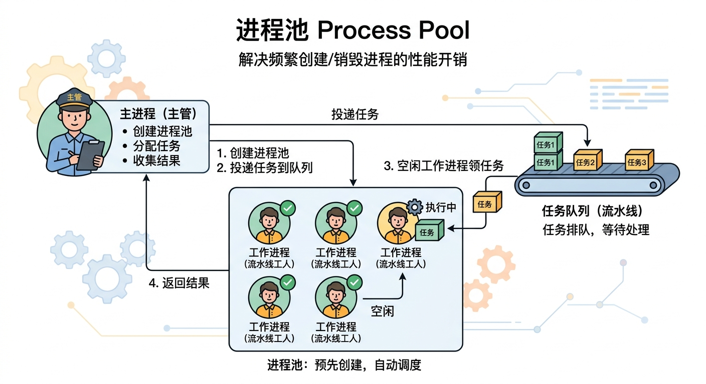

##### “抢占式” 领工机制

核心逻辑：**“任务队列（Task Queue）+ 抢占式消费”**

1. **主进程**把**所有任务**丢进一个 **“任务队列（Task Queue）”** 里
2. 进程池内处于 **“空闲” 状态**的工作进程会**去 “任务队列（Task Queue）” 里“抢”任务**。谁手快、谁空闲，谁就去领一个任务出来执行
3. 刚干完活的进程，会立刻**回**到任务队列边，**继续抢下一个任务**

此时会出现以下现象：

- **任务耗时极短：基本只有一两个工作进程在运行，其他工作进程都处于 “空闲” 状态**

  > 底层原理：
  >
  > 1. **操作系统的调度延迟（Context Switch）：** 
  >
  >    当主进程启动进程池时，操作系统把 4 个子进程全部唤醒、分配 CPU 资源是需要时间的（可能有几毫秒的延迟）。
  >
  >    如果第一个被唤醒的进程 A 动作极快，在几毫秒内就把队列里那些“极简单”的任务全部刷完了，那么当进程 B、C、D 刚刚睁开眼准备干活时，发现队列已经空了。
  >
  > 2. **分批（Chunksize）机制：** 
  >
  >    为了减少进程间频繁通信的开销，Python 的 `executor.map` 内部其实有一个 `chunksize`（分块大小）参数。
  >
  >    如果任务很多，Python 会默认让一个进程一次性领走 10 个或 100 个任务。
  >
  >    如果任务太简单，可能第一个进程一嘟噜把所有分块都吃下了，其他进程连汤都没喝到。

- **任务耗时较长：进程池内的工作进程—“全员满载”**（最理想状态）

  比如每个任务需要处理一张高分辨率图片，耗时 2 秒：

  1. 进程 A 领了任务 1，进入“运行中”状态，被死死占满。
  2. 进程 B 见状，立刻去队列领了任务 2。
  3. 进程 C 领了任务 3……
  4. 此时，所有工作进程都进入了“运行中”状态（全员满载）。
  5. 哪个进程先做完（比如进程 B 率先搞定），它就会立刻切换回“空闲”状态，并**自动去队列里领取任务 5**。

  这个过程会一直持续，直到任务队列被彻底清空。

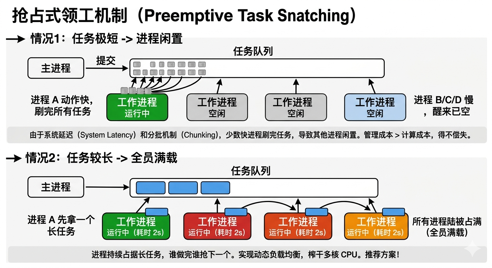

所以，可以根据结合任务的耗时、复杂度，选择合适的方案处理：

- **任务太短、太简单：不要用进程池。** 进程创建、序列化、抢队列的“管理成本”，远大于任务本身的“计算成本”，得不偿失
- **任务长、计算重：无脑用进程池。** 它能完美实现动态负载均衡，谁干得快谁多干，彻底榨干计算机的多核 CPU

#### 核心思想

核心思想：**“池化技术”**。进程池**不仅减少了代码量**，更重要的是**对控制系统资源的消耗**。

> **资源保护**：
>
> - 手动创建 1000 个进程，操作系统会因为**频繁的上下文切换（Context Switching）和内存耗尽**而崩溃。
>
> - 而进程池通过**固定的工作进程数量**（比如 CPU 核心数），**重复利用进程，避免了频繁创建和销毁的开销**，且也能**绕开 GIL 锁**实现【**多进程**】方案

简单来说，**为什么用“池”？** 因为频繁创建和销毁进程太耗费系统资源了，所以搞个“池子”把进程缓存起来复用。

> 例如：假设要创建 10 个进程，没有使用进程池的情况下，要写以下代码：
>
> ```python
> from multiprocessing import Process, current_process
> 
> # 任务函数
> def task(): pass
> 
> if __name__ == '__main__':
>  for _ in range(10):
>      p = Process(target=task)
>      p.start()
>      p.join()
> ```
>
> 而使用进程池，如下代码：
>
> ```python
> from concurrent.futures import ProcessPoolExecutor
> 
> # 任务函数
> def task(): pass
> 
> if __name__ == '__main__':
> 
>  # 批量创建任意数量的进程，且不需要手动 start()、close()
>  with ThreadPoolExecutor(<进程数量>) as executor:
>      # submit 提交任务、result 返回结果
>      result = executor.submit(task, <任务数量>)
> ```

#### 对比手动创建进程的选型

##### 进程池 Pool

- **优点**：

  - **代码简洁**；能**批量创建进程、自动调度分配进程任务**，省去了手动编写的麻烦

  - **资源利用率高、管理轻松**：**统一管理**工作进程，且进程池内可**重复利用 “空闲” 进程，避免了进程频繁创建和销毁的开销**

    > 因为进程池引入了 **“任务队列（Task Queue）”** 机制。
    >
    > 不需要把任务死死绑定给某一个进程，只需要把任务扔进队列，“临时工”们谁闲着谁就去捞一个任务干，干完继续捞。

- **缺陷**：

  - **业务结构单一**：**进程池内的多个工作进程只能面向同一个任务（参数不同）的处理**【核心痛点】

  - **进程本身灵活性差**：批量创建的工作进程**不能独立设置进程属性**

    > 由于**所有工作进程都在监听同一个任务队列**，它们**执行的其实是同一个函数（只是参数不同）**。
    >
    > 外部没办法对其中某一个进程说：“你别干流水线了，你去门口当个保安（守护进程）吧

  通常适合用于一些**逻辑简单、内容重复性高**的任务场景

  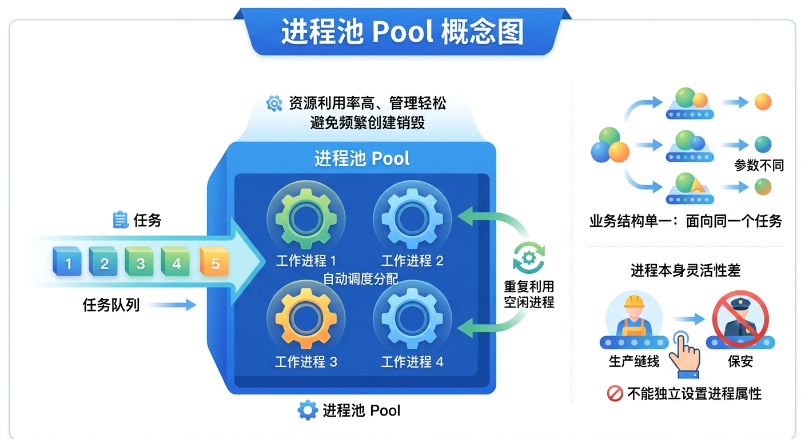

> 进程池的工作进程更像是**临时工**，没有身份，没有地位，可以做任意任务，即来即走，管理起来很轻松

##### 手动创建进程 Process

- **优点**：

  - **业务结构强壮**：可**为不同进程分配不同任务**，进程**各自负责不同的功能模块**
  - **进程本身灵活性强**：可**单独为某个进程设置进程属性**（如进程名称、是否为守护进程...）

- **缺陷**：

  - **代码复杂**：需**额外手动维护、管理进程的生命周期**

  - **资源利用率低、管理麻烦**：**不能重复利用 “空闲” 进程**（进程尽管 “闲着”，也会在那里持续消耗资源），**底层资源开销大**【核心痛点】

    > 资源利用率低（核心痛点）：
    >
    > - **操作系统创建一个进程的成本极高**（需要分配独立的内存空间、页表、文件描述符等）
    > - 手动创建的进程即使在 `time.sleep()` 挂起状态，它占用的内存也不会主动释放
    >
    > 其次，正因为进程有独立的生命周期，如果主进程意外退出了，而没有正确调用 `.join()` 或释放子进程，这些手动创建的进程就会变成 *孤儿进程* 或 *僵尸进程*，驻留在操作系统里默默吞噬资源

  通常适合用于一些**逻辑复杂、角色分配明显**的任务场景

  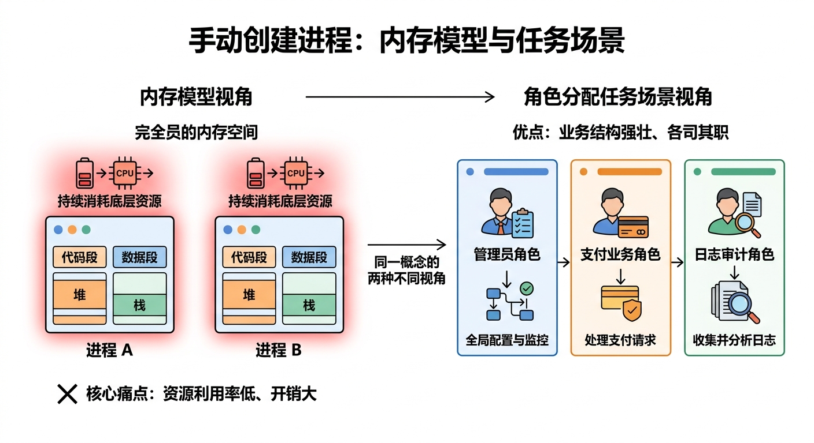

> 手动创建的进程更像是**正式工**，有身份、有地位、还有具体负责的任务，但管理起来也麻烦

综合来说，**进程池 Pool**与 **手动创建进程 Process** 只是**如何创建进程的两种方式**，它们的应用需**按照实际业务场景**来**适当选择**。

##### 场景选择

- **选进程池**：当业务场景面对的是“数据”。

  比如有 1000 个文本段落要批量做 Embedding，数据量大、任务单一，用进程池快进快出

- **选手动创建**：当业务场景面对的是“角色”。

  比如 AI 应用需要一个进程管前端交互、一个进程管后台日志、一个进程管数据库同步，各司其职，生命周期错落分布

###### 综合对比

| **维度**     | **进程池 (Pool)**                        | **手动创建 (Process)**                       |
| ------------ | ---------------------------------------- | -------------------------------------------- |
| **任务类型** | **同质**、大量、短平快的任务             | **异构**、少量、长期运行的任务               |
| **关注点**   | 关注**数据和任务本身**（把数据分发下去） | 关注**进程的生命周期和角色**（谁负责干什么） |
| **资源控制** | 极好（限制最大进程数，复用资源）         | 较差（需要开发人员手动控制并发数量）         |
| **底层机制** | 生产者-消费者模型（带任务队列）          | 独立的 OS 进程分叉                           |

- 架构原理对比：

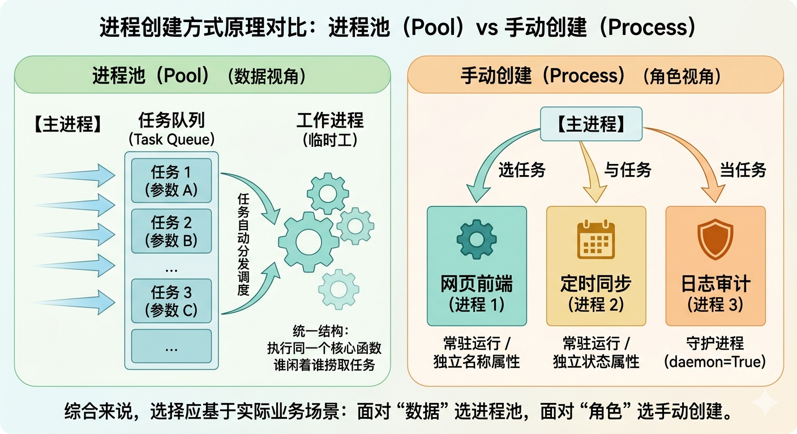

- 工作流程对比：

  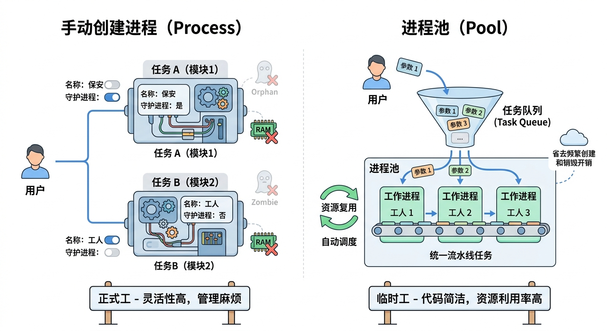

### ProcessPoolExecutor 进程池类

Python 官方推荐使用 **`concurrent.futures.ProcessPoolExecutor`** 类来实现进程池，它比旧的 `multidistribution.Pool` 更加现代且易用。

#### 基本语法

```python
from concurrent.futures import ProcessPoolExecutor

# 多个工作进程协同执行的任务函数
def <任务函数>(<任务函数参数>):
    # 任务函数体...
    
    
# 主进程（主管）
if __name__ == '__main__':
    # 创建进程池
    <进程池实例> = ProcessPoolExecutor(max_workers=<工作进程数量>)  # 进程池内预设 max_workers 个数量的工作进程
	
    # 提交任务
    <进程池实例>.submit(<任务函数>,<任务函数参数>)
    
    #...
```

参数：

- **`max_workers`：进程池要批量创建的工作进程个数。不指定 `max_workers` 时，默认使用 CPU 核心数**

核心作用：

1. **`ProcessPoolExecutor(max_workers)` 创建并返回一个具有 `max_workers` 个数量工作进程的进程池实例**
2. 内部建立并维护一个**任务队列（Task Queue）容器**，等待**后续通过 `submit()` 、`map()` 方法投递具体的【任务函数】**

#### 核心要点

1. **序列化问题（Pickling）：** 

   多进程之间是通过**“数据序列化（Pickle）”**来传递参数和结果的。这意味着：

   - **传入任务函数的参数和返回值**，**必须是可以被 pickle 序列化的**（比如基础数据类型、字典、列表等）

   - 所以，**尽量不要把复杂的对象类型（包含多个引用）、打开的文件句柄传给进程池的工作子进程**

2. **进程创建开销：** **创建进程的系统开销远大于线程**

   如果进程的任务只需要 0.001 秒就能完成，**用进程池**反而会因为进程切换**变慢**；

   所以，**进程池只适合单次执行时间较长的计算密集型任务。**

3. **最优进程数（max_workers）：** 

   对于计算密集型任务，进程池内的 `max_workers` 工作进程数量一般设置为 **CPU 核心数**（或核心数 + 1），

   设得太多反而会因为 CPU 频繁切换上下文而降低性能。可以通过 **`os.cpu_count()`** 方法获取当前机器的核心数。

```python
# 进程池的实现
from concurrent.futures import ProcessPoolExecutor
from threading import Thread
import os
import time


# 一个很简单的计算任务函数
def task(params):
    print('task is running', params * params)


# 主进程（主管）
if __name__ == '__main__':
    print('主进程 start')

    # ----- 进程池实现 -----
    # 计算耗时
    start = time.time()
    
    # 创建进程池的数量为 CPU 核数 + 1
    print('CPU 核心数：', os.cpu_count())  # 12 相当于创建了 13 个子工作进程
    
    max_workers: int = 0 if (cpu_count := os.cpu_count()) is None else cpu_count + 1
    pool = ProcessPoolExecutor(max_workers=max_workers)

    # 向进程池内提交 100 个任务
    for i in range(100):
        pool.submit(task, i)

    pool.shutdown(wait=True)
    print(f'进程池--耗时：{time.time() - start:.4f} 秒')  # 耗时：0.3326 秒

    # ----- 多线程实现 -----
    # 创建 100 个线程，每个线程执行 task 函数
    start = time.time()
    for i in range(100):
        t = Thread(target=task, args=(i,))
        t.start()
        t.join()

    print(f'多线程--耗时：{time.time() - start:.4f} 秒')  # 耗时：0.0182 秒

    print('主进程 end')

    # 由此可以看出，对于一个很简单的计算任务，多线程的效率比进程池（多进程）高很多
    # 核心点在于：创建进程的开销比创建线程的开销大很多
```

#### 任务参数与返回值的打包、解包

##### 为什么需要打包、解包？

核心要点：在 Python 中，由于**进程之间无法通信**，所以需要借助 **“进程间通信机制（IPC）”** 来实现**跨进程传输数据**。

- 底层的**进程间通信**一般使用 **Pipe（管道）、Queue（队列）**等方式。「主进程」与「进程池内的工作进程」也是如此。

核心概念：「主进程」与工作进程唯一的关联就是**任务函数**。

核心要点：在**「主进程」提交任务给「工作进程」、「工作进程」返回任务执行结果给「主进程」**的这个过程中，都需要通过**序列化**和**反序列化**机制来对**【任务函数参数】**与**【任务函数返回结果】**分别进行**打包、解包**处理，才能实现**进程间的数据流转**。

###### 序列化 & 反序列化

**序列化**和**反序列化**就是数据在“程序内存世界”和“外部存储/网络世界”之间进行转换的过程。

> 可以用一个通俗的类比来理解它们：
>
> - **序列化**就像是把一辆组装好的乐高玩具卡车，拆散并整齐地装进一个紧凑的盒子里，方便邮寄或者存放
> - **反序列化**则是收到盒子后，按照说明书把零件重新组装回原本那辆乐高玩具卡车

###### 什么是序列化？

**序列化**是将内存中的对象、结构或状态，转换成可以存储或传输的格式（通常是**字节流**、**字符串**或**二进制数据**）的过程。

- **目的：** 为了让数据能够“跨越时空”。内存中的数据在程序关闭后就消失了，而序列化后的数据可以保存到硬盘上，或者通过网络发送给另一台计算机。

- **常见格式：**
  - **JSON：** 最常见的文本格式（如 `{"name": "张三", "age": 25}`），可读性强，常用于前后端交互
  - **XML：** 另一种文本格式，较老但很严谨
  - **二进制/字节流：** 如 Protocol Buffers (进程池缓冲)、Java 原生序列化。机器读取极快，体积小，但人类无法直接阅读

###### 什么是反序列化？

**反序列化**则是序列化的逆向操作。它是将读取到的字节流或文本数据，重新构造成内存中活生生的对象的过程。

- **目的：** 让程序能够重新使用之前保存的数据，或者接收其他设备发送过来的数据。

##### **任务函数参数**

> **「主进程」→（序列化）→ IPC通道（任务队列 Task Queue） →（反序列化）→ 「工作进程」**

- **序列化（打包）**：

  在**「主进程」**通过进程池对象**调用 `submit()` 方法**向进程池内**提交一个 `fn` 任务函数及相关的任务函数参数**时，需要先**将任务函数参数**经过一次**打包（序列化 Pickle）**处理；

  打包好的**序列化数据（任务函数参数）**会通过底层的**（任务队列 Task Queue）**传给进程池的**「工作进程」**

- **反序列化（解包）**：

  进程池内的**「工作进程」**通过底层的**（任务队列 Task Queue）**收到**任务函数参数**后再进行一次**解包（反序列化）** 解析处理，并**传递给任务函数接收开始执行**

##### **任务函数返回结果**

> **「工作进程」→（序列化）→  IPC通道（结果队列 Result Queue） → `Future` 对象 →（反序列化）→「主进程」**
>
> > *`Future` 对象类似于 JavaScript 的 Promise，专门用于存储任务的状态、返回结果、异常信息*

- **序列化（打包）**：

  当**「工作进程」**的**任务执行完毕**后，会将**任务函数返回结果**经过一次 **打包（序列化 Pickle）**放入**结果队列（Result Queue）**中，

  再由『后台管理线程』**传递给 `Future` 对象-持久化存储**，由「主进程」去主动拿取

- **反序列化（解包）**：

  **「主进程」**在**通过 `Future` 对象调用 `result()` 方法拿取任务结果数据**时；

  「主进程」会对拿取到的**序列化数据（任务结果）**经过一次 **解包（反序列化）** 解析处理，从而拿取到**真实的结果数据**

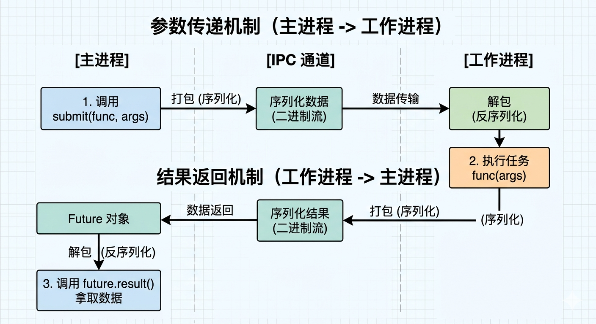

核心结论：**尽量不要把复杂的数据库连接对象、打开的文件句柄传给进程池的工作子进程**，否则会报错。

> 原理：因为**进程间传递的数据**是**「副本」**而非「引用」；
>
> 如果一个可变对象（如 Dict/List）经过 **`主进程 -> 序列化（打包） -> IPC传输 -> 反序列化（解包） -> 工作进程`** 后，它在工作进程中已经是一个**全新的内存对象**了。
>
> 所以，工作进程修改的只是它自己内存里的 “镜像副本”，主进程里的原对象**毫无变化**。


### Future 对象（任务结果、状态）

在 Python 的并发编程（无论是进程池还是线程池）中，`Future` 都是一个至关重要的核心概念。*类似于 JavaScript 的 Promise*

> [!NOTE]
>
> **为什么需要 `Future` 对象**？
>
> 核心原因：**在多进程架构中，主进程和工作进程是属于完全独立的操作系统进程（内存是不共享的）**
>
> 所以，Python 就在**「主进程」**与**「工作进程」**之间建立了一个 **“沟通桥梁”（中间层）**，也就是 **`Future` 对象**
>
> 在底层，`Future` 对象正是扮演了 **“跨进程结果传送带” **和 **“状态同步器”** 的角色。

#### 核心概念

核心含义：在**「主进程」**与**「进程池内的工作进程」**之间，`Future` 对象主要扮演以下 2 个核心角色：

- **任务执行结果 “存储器”**：

  【**工作进程 ⇄ Future ⇄ 主进程**】

  `Future` 对象用于**存储**进程池中**某个工作进程**的**任务执行结果数据**（跨进程结果传送带）

  - **「工作进程」**：将**任务执行结果数据『回传』**给 **`Future` 对象**
  - **「主进程」**：**通过 `Future` 对象『获取』**【工作进程」的**任务执行结果数据**

  > 打破多进程之间无法通信的底层限制，实现**跨进程结果数据传送**

- **状态同步器**：

  【**主进程 ⇄ Future ⇄ 工作进程**】

  `Future` 对象用于**关联**进程池中的**某个工作进程**，并**实时同步某个工作进程的运行状态**（寄存柜）

  - **「工作进程」**：将**运行状态**实时**『同步』**给 **`Future` 对象**
  - **「主进程」**：通过 `Future` 对象**『获取』**「工作进程」的**运行状态**

  > 通过 `Future` 对象能让主进程**更精准地控制**工作子进程

简单来说，`Future` 对象是**「主进程」**与**「进程池内的工作进程」**两者之间的一个 **“中间层” 角色**

核心逻辑：**解耦了任务的“触发者”（主进程/线程）与“执行者”（工作进程/线程）**


##### 获取 Future 对象

获取途径：在进程池应用中，**调用 `<进程池实例>.submit()` 方法提交一个任务后**，会**返回一个 `Future` 对象给主进程**。

核心定义： `Future` 对象**指向**的是**当前运行中工作进程执行的任务实体**，里面**存储**的是**工作进程在执行任务期间的生命周期信息**（任务执行结果、任务状态、异常信息...）

```python
from concurrent.futures import ProcessPoolExecutor

# 进程任务
def <任务函数>(<任务函数参数>): pass


if __name__ == '__main__':
    # 创建进程池
    <进程池实例> = ProcessPoolExecutor(<工作进程数量>)

    # 提交任务，并返回一个 Future 对象，用于后续获取任务执行结果、任务状态、操作任务等处理...
    <Future 对象> = <进程池实例>.submit(<任务函数>, <任务函数参数>)
   	
    # ...
```

###### 存储结构

`Future` 对象内部存储结构如下：

```
Future 对象
 ├── _state  : 当前任务状态 (PENDING / RUNNING / FINISHED / CANCELLED)
 ├── _result : 存放工作进程任务中 return 返回的真实数据（未完成时为 None）
 ├── _exception : 如果工作进程报错了，存放报错信息（未抛出异常时为 None）
 └── ...
```

> `Future` 对象中的 **`_state`、`_result`、`_exception`** 都是**弱约束**的**私有属性**
>
> 虽然外部**可以直接访问**，但是**尽量**最好还是**选择使用它们的封装方法**：
>
> - **`_state`：`running()`、`done()`、`cancelled()`**
> - **`_result`：`result()`**
> - **`_exception`：`exception()`**

直接输出 `Future` 对象会得到以下结果：

```python
# 进程池实现-Future 对象
from concurrent.futures import ProcessPoolExecutor
import time


# 一个会报错的任务函数
def task_error():
    time.sleep(5)  # 模拟一个耗时任务，防止主进程结束
    raise Exception('任务执行出错')


# 一个正常的任务函数
def task_normal():
    return 1 - 1


if __name__ == '__main__':
    try:
        # 创建进程池，进程池大小为1
        pool = ProcessPoolExecutor(1)

        # 提交任务
        future1 = pool.submit(task_normal)
        future2 = pool.submit(task_normal)
        future3 = pool.submit(task_error)

        print(future1, future1._state) # <Future at 0x1a41619a270 state=running> RUNNING
        print(future2, future2._state) # <Future at 0x19bc5a65310 state=running> RUNNING
        print(future3, future3._state) # <Future at 0x1a41619a270 state=pending> PENDING

        # 主进程阻塞等待所有工作进程任务完成
        pool.shutdown(wait=True)  # 主进程阻塞等待工作进程任务执行完毕

        print(future1, future1._state) # <Future at 0x19bc5a2a270 state=finished returned int> FINISHED
        print(future2, future2._state) # <Future at 0x19bc5a65310 state=finished returned int> FINISHED
        print(future3, future3._state) # <Future at 0x19bc5a65590 state=finished raised Exception> FINISHED

    except Exception as e:
        print('抛出异常：', e)  # 任务执行出错
```

#### 任务-状态同步器（_state）

##### Future 对象的 5 大状态

一个**「工作进程」**的**生命周期**会**实时同步给 `Future` 对象**，主要会**经历**以下 5 种状态：

###### **`PENDING` 等待中**

定义：**任务刚提交给进程池**，`Future` 对象指向的**任务实体**还在**任务队列（Task Queue）中 “排队” 等待**进程池中的 **“空闲” 工作进行领取执行**。

> 此时会有 2 种情况出现：
>
> - 当**有 “空闲” 进程领取执行该任务**时，任务会转入 **`RUNNING` 运行态**；
> - 当**任务还没开始执行**，却**被「主进程」主动调用 `cancel()` 方法取消任务**时，该任务会**从任务队列（Task Queue）中移除**，任务转入 **`CANCELLED` 取消态**

###### **`RUNNING` 运行态**

定义：当前**任务正在被工作进程执行中**。

###### **`FINISHED` 完成态**

定义：任务**已经执行完毕**，同时工作进程回到 **“空闲” 状态。**

> 此时会有 2 种情况出现：
>
> - **任务正常结束**：
>  - **「工作进程」**会将**任务结果传递给 `Future` 对象的 `_result` 属性**
>   
>  - **「主进程」**可以通过**访问 `Future` 对象的 `_result` 属性**，或者**调用 `result()` 、`add_done_callbak(fn)`等方法**成功**拿到任务结果**
>   
>- **任务执行期间报错**：
>   - **「工作进程」**会**将错误信息传递给 `Future` 对象的 `_exception` 属性**，且**将任务的状态直接设置为 `FINISHED` 完成态**
>  - **「主进程」**可以通过**访问 `Future` 对象的 `_exception` 属性**，或者**调用 `exception()` 方法** 拿到**异常信息**

###### **`CANCELLED` 取消态**

定义：任务**还没开始执行，处于 `PENDING` 等待中状态**，就**被「主进程」手动调用 `cancel()` 方法取消了。**

- 在**进程池的「状态机调度机制」中**会**衍生**出一个**独立的 `CANCELLED_AND_NOTIFIED` 取消并通知态**，两者效果一致

###### `CANCELLED_AND_NOTIFIED` 取消并通知态

> 任务从 **`CANCELLED` 取消态 → `CANCELLED_AND_NOTIFIED` 取消并通知态** 的状态机流转

在**进程池 → 任务队列（Task Queue） 领取任务 → 分配给工作进程** 的过程中：

**一、阻塞等待阶段**：

- **现状**：进程池内所有「工作进程」都在忙碌，没有“空闲”进程
- **动作**：进程池静默，不从任务队列（Task Queue）中领取任务

**二、唤醒与触发阶段**：

- 某个「工作进程 A」完成了当前任务
- 「工作进程 A」状态修改为 **“空闲”**
- 这个**状态改变触发了进程池的调度逻辑**，进程池准备为它分配新工作

**三、校验与状态流转阶段**：

- 进程池**访问任务队列（Task Queue），取出下一个任务**
- **检查**：进程池发现该任务的状态是 **`CANCELLED` 取消态**
- **处理**：
- 1. 进程池将该任务从队列中**彻底移除**。
  2. 将该任务的状态修改为 **`CANCELLED_AND_NOTIFIED` 取消并通知态**

四、通知与释放阶段：

- **通知**：进程池**向关联该 `CANCELLED` 取消态任务的「工作进程 X」发出通知**：“你刚刚要领的这个任务已经被取消了。”
- **释放**：
- 1. 「工作进程 X」收到通知，**断开（取消）对该 `CANCELLED` 任务的引用**
  2. 「工作进程 X」保持或重新转为 **“空闲”** 状态
- **循环**：**进程池继续去任务队列（Task Queue）中寻找下一个真正可执行的任务分配给「工作进程 X」**


> 核心设计：**延迟处理（Lazy Evaluation）**—— 任务虽然在外部被取消了，但进程池并不会立刻去任务队列（Task Queue）里翻找并移出它，而是等到有工作进程空闲、真正准备调度该任务时，才在“出队”阶段顺便进行状态流转和通知。
>
> **职责明确**：
>
> - **任务队列**只负责先进先出（FIFO）的存储。
> - **进程池**充当“指挥官”和状态协调者的角色。
> - **工作进程**只管听从指挥，没有多余的业务判断。

| **主体**              | **初始状态**            | **触发事件**             | **变更后状态**                        | **后续动作**                 |
| --------------------- | ----------------------- | ------------------------ | ------------------------------------- | ---------------------------- |
| **任务 (Task)**       | `CANCELLED` (已取消)    | 进程池从队列中捡出该任务 | `CANCELLED_AND_NOTIFIED` (取消并通知) | 从队列中移除，触发通知机制   |
| **工作进程 (Worker)** | `BUSY` (执行完毕转空闲) | 收到任务取消的通知       | `IDLE` (空闲)                         | 释放该任务的引用，等待新任务 |

###### 流程总结

**`PENDING`、`RUNNING`、`FINISHED`、`CANCELLED` 、`CANCELLED_AND+NOTIFIED`** 这 5 种状态**是 任务 与 工作进程 的共同生命周期**。

> 关于**任务的状态机**可以理解为【**工作进程 = 执行中的任务**】：因为**任务执行完毕**后，**进程**便**不再引用该任务**，而是**转为 “空闲” 状态**
>
> 所以，**`Future` 对象**中实际上**管理的是任务的状态、结果、异常信息**


##### 状态机流转

核心定义：任务的状态流转是**单向且不可逆**的（**一旦进入 `FINISHED` 完成态，便无法再更改**）。

状态机流转正常逻辑如下：

- **初始状态：** **`PENDING`**
- **正常流转：** **`PENDING` ➔ `RUNNING` ➔ `FINISHED`**
- **干预流转：** **`PENDING` ➔ `CANCELLED`** （注：**一旦进入 `RUNNING` 运行态，任务就无法被 `cancel()` 取消了**）


##### _state 私有属性（查看任务状态）

核心作用：**「主进程」**查看 `Future` 对象指向的**当前工作进程-任务运行状态**。

- **`PENDING` 等待中 → `RUNNING` 运行态 → `FINISHED` 完成态** ：

  ```python
  # 进程池实现-Future 对象
  from concurrent.futures import ProcessPoolExecutor
  import os
  import time
  
  
  def task(n):
      print(f'进程任务 {n} --- 当前工作进程 PID {os.getpid()}')
      time.sleep(1)
      return n * n
  
  
  if __name__ == '__main__':
      # 只有 1 个进程，却分配了 5 个任务，所以只有 1 个任务会执行，其他任务会等待
      pool = ProcessPoolExecutor(1)
      future1 = pool.submit(task, 1)  # 提交任务（子工作进程异步执行）
      future2 = pool.submit(task, 2)  # 提交任务（子工作进程异步执行）
      future3 = pool.submit(task, 3)  # 提交任务（子工作进程异步执行）
      future4 = pool.submit(task, 4)  # 提交任务（子工作进程异步执行）
      future5 = pool.submit(task, 5)  # 提交任务（子工作进程异步执行）
  
      print(future5._state)  # PENDING
      # 进程池中只有 1 个工作进程，每个工作进程执行 1s 任务，由于主进程是异步未阻塞的，所以此时 future5 对象的状态是 PENDING，即任务还在等待被进程池中的工作进程执行
  
      time.sleep(5)  # 主进程等待 5s，让其他任务执行完毕，第 5 个任务被 “空闲”进程执行
  
      print(future5._state)  # RUNNING
      # 5s 后，future5 对象的状态是 RUNNING，即任务已经被进程池中的工作进程执行中
  
      time.sleep(1)  # 主进程等待 1s，让所有任务都执行完毕
      print(future5._state)  # FINISHED
  
      # 此时 future5 已经可以拿到结果
      print(future5.result())  # 25
  
  '''
  输出结果：
  PENDING
  进程任务 1 --- 当前工作进程 PID 7228
  进程任务 2 --- 当前工作进程 PID 7228
  进程任务 3 --- 当前工作进程 PID 7228
  进程任务 4 --- 当前工作进程 PID 7228
  进程任务 5 --- 当前工作进程 PID 7228
  RUNNING
  FINISHED
  '''
  ```

  更简单的实现方式：

  ```python
  # 进程池实现-Future 对象
  from concurrent.futures import ProcessPoolExecutor
  import os
  import time
  
  
  def task(n):
      print(f'进程任务 {n} --- 当前工作进程 PID {os.getpid()}')
      time.sleep(1)
      return n * n
  
  
  if __name__ == '__main__':
      # 只有 1 个进程，却分配了 5 个任务，所以只有 1 个任务会执行，其他任务会等待
      pool = ProcessPoolExecutor(1)
  
      for i in range(1, 6):
          future = pool.submit(task, i)
  
      print(future._state)  # PENDING
      pool.shutdown()  # 主进程阻塞等待所有工作进程任务完成
      print(future._state)  # FINISHED
      print(future.result())  # 25
  
      # 缺点：无法精确控制某个工作进程任务的状态
  
  '''
  输出结果：
  PENDING
  进程任务 0 --- 当前工作进程 PID 15568
  进程任务 1 --- 当前工作进程 PID 15568
  进程任务 2 --- 当前工作进程 PID 15568
  进程任务 3 --- 当前工作进程 PID 15568
  进程任务 4 --- 当前工作进程 PID 15568
  FINISHED
  '''
  ```

  > 缺点：**无法精确控制**某个工作进程**任务的状态**

- **`PENDING` 等待中  → `CANCELLED` 取消态**：

  - 当**任务还未开始执行**时，却**被主进程通过 `cancel()` 方法主动取消**了。任务会从 `PENDING` 等待中 → `CANCELLED` 取消态

  - 此时，**主进程调用 `result()` 方法试图获取 `CANCELLED` 取消态的进程任务结果**时，会抛出 **`CancelledError` 异常**

  ```python
  # 进程池实现-Future 对象
  from concurrent.futures import ProcessPoolExecutor
  import os
  import time
  
  
  # 一个耗时任务
  def task(n):
      print(f'进程任务 {n} --- 当前工作进程 PID {os.getpid()}')
      time.sleep(10)
      return n * n
  
  
  if __name__ == '__main__':
      # 只有 1 个进程
      pool = ProcessPoolExecutor(1)
  
      # 提交 5 个任务
      future1 = pool.submit(task, 1)
      future2 = pool.submit(task, 2)
      future3 = pool.submit(task, 3)
      future4 = pool.submit(task, 4)
      future5 = pool.submit(task, 5)
  
      # 立刻查看所有任务的状态
      print(future1._state)  # RUNNING【任务正在被工作进程执行中】
      print(future2._state)  # RUNNING【预派发的下一个任务，已经存在于任务队列中了】
      print(future3._state)  # PENDING【存在缓冲区（内部任务字典）中】
      print(future4._state)  # PENDING【存在缓冲区（内部任务字典）中】
      print(future5._state)  # PENDING【存在缓冲区（内部任务字典）中】
  
      # 主进程主动取消某个任务
      future3.cancel()
  
      # 立刻查看所有任务的状态
      print(future1._state)  # RUNNING
      print(future2._state)  # RUNNING
      print(future3._state)  # CANCELLED
      print(future4._state)  # PENDING
      print(future5._state)  # PENDING
  
      # 但是处于 RUNNING 状态的任务，无法取消
      future1.cancel()  # False
      future2.cancel()  # False
  
      # 主进程等待所有任务执行完毕
      pool.shutdown()
      print(future1._state)  # FINISHED
      print(future2._state)  # FINISHED
      print(future3._state)  # CANCELLED_AND_NOTIFIED
      print(future4._state)  # FINISHED
      print(future5._state)  # FINISHED
  
      # 获取任务结果
      print(future1.result())  # 1
      print(future2.result())  # 4
      print(future3.result())  # CancelledError
      print(future4.result())  # 16
      print(future5.result())  # 25
      # 如果任务被取消，调用 result() 方法会抛出 CancelledError 异常
  
  '''
  输出结果：
  RUNNING
  RUNNING
  PENDING
  PENDING
  PENDING
  
  RUNNING
  RUNNING
  CANCELLED
  PENDING
  PENDING
  
  False
  False
  
  进程任务 1 --- 当前工作进程 PID 15080
  进程任务 2 --- 当前工作进程 PID 15080
  进程任务 4 --- 当前工作进程 PID 15080
  进程任务 5 --- 当前工作进程 PID 15080
  
  FINISHED
  FINISHED
  CANCELLED_AND_NOTIFIED
  FINISHED
  FINISHED
  
  1
  4
  # 抛出 CancelledError 异常
  '''
  ```

##### 状态管理

###### cancel() 取消等待中的任务

核心作用：当**任务还未开始执行**时，却**被主进程通过 `cancel()` 方法主动取消**了。

```python
<future>.cancel() # True / False
```

返回值：`cancel()` 方法执行后会返回**一个 `Ture/False` 布尔值**，表示**任务是否已经被取消**。

- **`Ture`**：对于 **`PENDING` 等待中任务，可以被取消**，**调用 `cancel()` 会返回 `Ture`**
- **`False`**：对于 **`RUNNING` 运行态任务，不可以被取消，调用 `cancel()` 会返回 `False`**，任务**会继续执行直到 `FINISHED` 完成态**

> 状态机流转：
>
> ​	任务会**从 `PENDING` 等待中 → `CANCELLED` 取消态 → `CANCELLED_AND_NOTIFIED` 取消并通知态**；
>
> > `CANCELLED` 取消态 → `CANCELLED_AND_NOTIFIED` 取消并通知态：
> >
> > ​	当有某一个任务完成，触发**状态调度**机制，**进程池再次去任务队列（Task Queue）中拿取任务分配给 “空闲” 工作进程**时，进程池会将任务队列（Task Queue）中被 **`cancel()` 取消**的任务 **`CANCELLED` 取消态 → `CANCELLED_AND_NOTIFIED` 取消并通知态**（瞬时完成）
> >
> > ​	之后，进程池**向该引用该任务的「工作进程发出通知」**，「工作进程」**取消对该 `CANCELLED` 取消态任务的引用，转为 “空闲” 状态**，等待被进程池重新分配任务。

示例：

```python
# 进程池实现-Future 对象
from concurrent.futures import ProcessPoolExecutor
import os
import time


# 一个耗时任务
def task(n):
    print(f'进程任务 {n} --- 当前工作进程 PID {os.getpid()}')
    time.sleep(2)
    return n * n


if __name__ == '__main__':
    # 只有 1 个进程
    pool = ProcessPoolExecutor(1)

    # 提交 3 个 2s 的任务
    future1 = pool.submit(task, 1)
    future2 = pool.submit(task, 2)
    future3 = pool.submit(task, 3)

    # 立刻查看所有任务的状态
    print('任务1：', future1._state)  # RUNNING
    print('任务2：', future2._state)  # RUNNING
    print('任务3：', future3._state)  # PENDING

    print(future3.cancel())  # True  取消 PENDING 等待中的任务
    print(future2.cancel())  # False 不能取消 RUNNING 状态中的任务，future2 对象指向的进程任务会继续执行

    print('任务1：', future1._state)  # RUNNING
    print('任务2：', future2._state)  # RUNNING
    print('任务3：', future3._state)  # CANCELLED 转为取消态

    time.sleep(5)  # 等待 5s，进程池内所有任务都执行完毕（进程池关闭）
    print('任务1：', future1._state)  # FINISHED
    print('任务2：', future2._state)  # FINISHED
    print('任务3：', future3._state)  # CANCELLED_AND_NOTIFIED
```

- 当**主进程调用 `result()` 方法试图获取 `CANCELLED_AND_NOTIFIED` 取消并通知态的进程任务结果**时，会抛出 **`CancelledError` 异常**

```python
# 进程池实现-Future 对象
from concurrent.futures import ProcessPoolExecutor
import os
import time


# 一个耗时任务
def task(n):
    print(f'进程任务 {n} --- 当前工作进程 PID {os.getpid()}')
    time.sleep(1)
    return n * n


if __name__ == '__main__':
    # 只有 1 个进程
    pool = ProcessPoolExecutor(1)

    # 提交 3 个 1s 的任务
    future1 = pool.submit(task, 1)
    future2 = pool.submit(task, 2)
    future3 = pool.submit(task, 3)

    # 立刻查看所有任务的状态
    print('任务1：', future1._state)  # RUNNING
    print('任务2：', future2._state)  # RUNNING
    print('任务3：', future3._state)  # PENDING

    future3.cancel() # 取消任务3 

    # 主进程等待 1.1s。
    # 任务1 转为 FINISHED 完成态，任务2 转为 RUNNING 运行态，任务3 转为 CANCELLED_AND_NOTIFIED 取消并通知态
    time.sleep(1.1)

    # 立刻查看所有任务的状态
    print('任务1：', future1._state)  # FINISHED
    print('任务2：', future2._state)  # RUNNING
    print('任务3：', future3._state)  # CANCELLED_AND_NOTIFIED

    # 拿取 FINISHED 完成态 任务1 的结果
    print(future1.result())  # 1
    # 拿取 CANCELLED_AND_NOTIFIED 取消并通知态 任务3 的结果
    print(future3.result())  # 抛出 CancelledError 异常
```

##### 状态判断

> 注：以下方法都是**『异步非阻塞式』执行**的，它们是 **`Future` 对象中 `_state` 私有属性的封装**。
>
> - **`running()` 是对 `_state == 'RUNNING'` 的封装**
> - **`done()` 是对 `_state == 'FINISHED'` 的封装**
> - **`cancelled()` 是对 `_state == 'CANCELLED'` 的封装**

###### running() 任务是否运行中

核心作用：判断**当前任务是否正在运行中**。

```python
<future>.running() # True / False
```

返回值：

- **`Ture`：任务正在运行中（`RUNNING`）**
- **`False`：任务未开始（`PENDING`）、被取消（`CANCELLED` &  `CANCELLED_AND_NOTIFIED`）、已完成（`FINISHED`）**

```python
# 进程池实现-Future 对象
from concurrent.futures import ProcessPoolExecutor
import os
import time


# 一个耗时任务
def task(n):
    print(f'进程任务 {n} --- 当前工作进程 PID {os.getpid()}')
    time.sleep(1)
    return n * n


if __name__ == '__main__':
    # 只有 1 个进程
    pool = ProcessPoolExecutor(1)

    # 提交 3 个 1s 的任务
    future1 = pool.submit(task, 1)
    future2 = pool.submit(task, 2)
    future3 = pool.submit(task, 3)

    # 立刻查看所有任务的状态
    print(future1.running(), future1._state)  # True  RUNNING
    print(future2.running(), future1._state)  # True  RUNNING
    print(future3.running(), future1._state)  # False PENDING
    
    # 直接查看 Future 对象的结构
    print(future1) # <Future at 0x19bc5a2a270 state=running> RUNNING
    print(future2) # <Future at 0x19bc5a65310 state=running> RUNNING
    print(future3) # <Future at 0x19bc5a65590 state=pending> PENDING
```

###### done() 任务是否完成

核心作用：判断**当前任务是否已经完成**。

```python
<future>.done() # True / False
```

返回值：

- **`Ture`：任务已经完成（`FINISHED`）**
- **`False`：任务未开始（`PENDING`）、被取消（`CANCELLED` &  `CANCELLED_AND_NOTIFIED`）、运行中（`RUNNING`）**

```python
# 进程池实现-Future 对象
from concurrent.futures import ProcessPoolExecutor
import os
import time


# 一个耗时任务
def task(n):
    print(f'进程任务 {n} --- 当前工作进程 PID {os.getpid()}')
    time.sleep(1)
    return n * n


if __name__ == '__main__':
    # 只有 1 个进程
    pool = ProcessPoolExecutor(1)

    # 提交 3 个 1s 的任务
    future1 = pool.submit(task, 1)
    future2 = pool.submit(task, 2)
    future3 = pool.submit(task, 3)

    # 立刻查看所有任务的状态
    print('任务1：', future1._state)  # RUNNING
    print('任务2：', future2._state)  # RUNNING
    print('任务3：', future3._state)  # PENDING

    # 主进程阻塞等待所有任务完成
    pool.shutdown()

    print(future1.done(), future1._state)  # True FINISHED
    print(future2.done(), future2._state)  # True FINISHED
    print(future3.done(), future3._state)  # True FINISHED

    # 直接查看 Future 对象的内部结构
	print(future1, future1._state) # <Future at 0x19bc5a2a270 state=finished returned int>
    print(future2, future2._state) # <Future at 0x19bc5a65310 state=finished returned int>
    print(future3, future2._state) # <Future at 0x19bc5a65590 state=finished returned int>    
```

###### cancelled() 任务是否被取消

核心作用：判断**当前任务是否已经被「主进程」调用 `cancel()` 方法主动取消**。

```python
<future>.cancelled() # True / False
```

返回值：

- **`Ture`：`PENDING` 等待中的任务被取消（`CANCELLED` &  `CANCELLED_AND_NOTIFIED`）**
- **`False`：任务未开始（`PENDING`）、运行中（`RUNNING`）、已完成（`FINISHED`）**

```python
# 进程池实现-Future 对象
from concurrent.futures import ProcessPoolExecutor
import os
import time


# 一个耗时任务
def task(n):
    print(f'进程任务 {n} --- 当前工作进程 PID {os.getpid()}')
    time.sleep(1)
    return n * n


if __name__ == '__main__':
    # 只有 1 个进程
    pool = ProcessPoolExecutor(1)

    # 提交 3 个 1s 的任务
    future1 = pool.submit(task, 1)
    future2 = pool.submit(task, 2)
    future3 = pool.submit(task, 3)

    future3.cancel()  # 取消任务3

    # 立刻查看所有任务的状态
    print(future1.cancelled(), future1._state)  # False RUNNING
    print(future2.cancelled(), future2._state)  # False RUNNING
    print(future3.cancelled(), future3._state)  # True  CANCELLED

	# 直接查看 Future 对象的内部结构
    print(future1)  # <Future at 0x1f02926a270 state=finished returned int>
    print(future2)  # <Future at 0x1f0292a5310 state=finished returned int>
    print(future3)  # <Future at 0x1f0292a5590 state=cancelled>
```

###### 总结

| **状态 (State)**         | **触发条件**                          | **主进程可调用的判断方法**                 | **最终结果/终态属性**                                        |
| ------------------------ | ------------------------------------- | ------------------------------------------ | ------------------------------------------------------------ |
| **`PENDING`** (等待中)   | 任务刚提交，正在队列中排队            | `f.done() -> False` `f.running() -> False` | 暂无结果                                                     |
| **`RUNNING`** (运行态)   | 工作进程从队列中取出任务，开始执行    | `f.done() -> False` `f.running() -> True`  | 暂无结果，正在计算                                           |
| **`FINISHED`** (完成态)  | 任务执行完毕（无论成功或失败）        | `f.done() -> True` `f.running() -> False`  | **成功**：结果写入 `_result`，可调用 `f.result()` 获取 <br />**失败**：异常写入 `_exception`，可调用 `f.exception()` 查看。 |
| **`CANCELLED`** (取消态) | 任务在 `PENDING` 阶段被主进程手动取消 | `f.done() -> True` `f.cancelled() -> True` | 无结果。调用 `f.result()` 会抛出 `CancelledError` 异常       |

##### 任务“预派发”-底层机制

###### 现象（双 `RUNNING` 态）

> 现象：当进程池中**只定义了 1 个工作进程，却有 3 个任务（都为耗时任务）**时，在主进程异步非阻塞的状态下，调用 `print(future._state)` 时，会出现 2 个任务状态都为 **`RUNNING` 运行态**，1 个任务处于  `PENDING` 等待中。（而非预期的一个 `RUNNING` 运行态 、两个 `PENDING` 等待中）。
>
> 代码如下：
>
> ```python
> from concurrent.futures import ProcessPoolExecutor
> import os
> import time
> 
> # 一个耗时任务
> def task(n):
>  print(f'进程任务 {n} --- 当前工作进程 PID {os.getpid()}')
>  time.sleep(10)
>  return n * n
> 
> 
> if __name__ == '__main__':
> 
>  # 只有 1 个进程，却分配了 2 个任务
>  pool = ProcessPoolExecutor(1)
>  future1 = pool.submit(task, 1)  # 提交一个耗时任务（子工作进程异步执行）
>  future2 = pool.submit(task, 2)  # 提交一个耗时任务（子工作进程异步执行）
>  future3 = pool.submit(task, 3)  # 提交一个耗时任务（子工作进程异步执行）
> 
>  print(future1._state)  # RUNNING
>  print(future2._state)  # RUNNING
>  print(future3._state)  # PENDING    
> ```

在计算机科学和并发编程中，这种“只有一个物理工作进程，却同时有两个任务处于 `RUNNING` 运行中状态”的现象，属于非常典型的 **“逻辑状态与物理状态的解耦（Decoupling）”**，在底层设计上通常被称为 **“基于生产消费者模型的任务预分发（Task Pre-dispatching）”**。

核心原因：**主进程的 ”任务提交登记“** 与 **进程池的实际任务“派发”** 存在**时间差**。【任务预派发】

> 这里涉及到了 `ProcessPoolExecutor` 进程池内部的**异步事件循环（EventLoop）和多线程/多进程调度机制**。

###### 什么是任务预派发？

> [!NOTE]
>
> 任务预派发机制主要应用的是**任务的【`PENDING` 等待中 → `RUNNING` 运行态】的过程与底层原理**。

核心思想：通过**建立一个缓冲区来预先准备下一个任务，以此减少进程间切换延迟所带来的 “时间差”**。

> 【现代并发框架的主流思想（**以空间换时间，用异步消延迟**）】

核心逻辑：**“缓冲区 → 预派发队列 → 工作进程”**

###### 核心流程（`PENDING` 等待中 → `RUNNING` 运行态的底层过程）

1. `ProcessPoolExecutor`  进程池在**启动之前**，会**预设创建 `n` 个固定数量**的**「工作进程」**

2. 进程池内部会**根据预设创建的 `n` 个工作进程数量**，建立一个**（工作进程个数上限 `n` + 1）长度的任务队列（Task Queue）容器**

   > 当设置 **`ProcessPoolExecutor(1)`** 时，**任务队列的实际长度上限是 1 + 1 = 2**

3. 将 **`submit()` 提交的所有任务**转为 **`_WorkItem` 对象**，先存**放入内部任务字典（`_pending_work_items`）【缓冲区】中**

4. 从内部任务字典（`_pending_work_items`）【缓冲区】中，**拿取 `n` 个（工作进程个数上限） `_WorkItem` 任务放入任务队列（Task Queue）中 “排队等待”**

5. 当**任务队列（Task Queue）“满员”（容器上限 - 1 达到固定数量的工作进程个数）**时，**批量**交给所有 “空闲” 的「工作进程」去执行

6. 在**进程池中没有 “空闲” 进程**时，第一时刻会**预先从内部任务字典（`_pending_work_items`）中，拿取 1 个`_WorkItem` 任务放入任务队列（Task Queue）中 “排队等待”**，作为 **“预派发”** 的**下一个任务**

7. 此时，当**进程池中有 “空闲” 进程**时，就能**立即领取任务去执行**

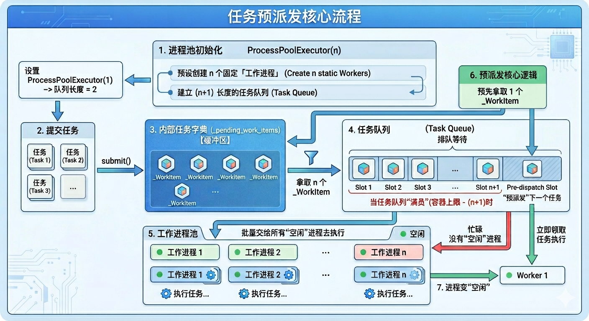

Python **故意多给任务队列（Task Queue）留了 +1 的富余量（`工作进程数 + 1`）**，就是为了在任务队列（Task Queue）里**永远多备一个干活的干粮（预派发任务）**。当唯一的子进程刚把任务 1 拿去吃掉，主进程就迫不及待地把任务 2 塞进队列去“备战”，这就导致了能在代码里看到两个并存的 `RUNNING` 任务。

###### 总结

在主进程的视角里，只要 **`submit()`** 方法提交的任务 “**已经从内部任务字典（`_pending_work_items`）【缓冲区】中提交给底层调度队列（任务队列 Task Queue）**” 作为 **“预派发” 的下一个任务**，那么它的状态就会变成 **`RUNNING` 运行中**。

所以，就会出现当进程池只有 1 个工作进程、但有 3 个任务时，却出现 “只有 1 个物理工作进程在执行，却同时有 2 个任务处于 `RUNNING` 运行中状态、剩下的任务就都处于 `PENDING` 等待中状态” 的现象。

```python
# 假设有 1 个进程，提交 3 个任务
future1 = pool.submit(task, 1)  # 进入子进程执行 -> RUNNING
future2 = pool.submit(task, 2)  # 进入预派发任务队列（占满上限） -> RUNNING
future3 = pool.submit(task, 3)  # 队列满了！只能卡在缓冲区（内部任务字典） -> PENDING
```

#### 任务结果“存储器”（_result）

> [!NOTE]
>
> 在实际开发中，主进程要想从这个“寄存柜”（`Future` 对象）里拿回数据，主要有以下 2 种方式：
>
> - **`future.result(timeout=None)` 『阻塞式』：强行索要**
> - **`future.add_done_callbak(fn)` 『回调机制』：主动通知**
>
> 核心定义：**`<进程池实例>.submit()` 提交任务**后会**自动生成并返回**一个 **`Future` 对象**，它代表**一个未来才会完成的任务结果**。

##### 核心逻辑

**任务正常执行结束，任务状态进入 `FINISHED` 完成态**：*（任务执行期间报错也会进入 `FINISHED` 完成态，但是获取不到任务结果）*

- **「工作进程」**会将**任务结果传递给 `Future` 对象的 `_result` 属性**，且直接**将任务状态设置为 `FINISHED` 完成态**

- **「主进程」**可以通过**访问 `Future` 对象的 `_result` 属性**，或者**调用 `result()` 、`add_done_callbak(fn)`等方法**成功**拿到任务结果**

  > `result()` 方法：内部访问的就是 `_result` 属性，它是 **`_result` 私有属性的封装方法**

注：**「主进程」**可以先**通过调用 `future.done()` 方法，或直接访问 `future._state == 'FINISHED'` 方式**来**判断「工作进程」【任务】是否正常执行完成**。

****

##### _result 私有属性（获取任务结果）

核心定义：**「主进程」**查看 `Future` 对象指向的**当前工作进程-任务执行结果**。

> 注意：**`_result` 属性不引发异常，只关注任务结果的有无**。

核心特性：

- **任务没完工时：** **访问 `_result` 属性会返回 `None`**
- **任务完工后：** **`_result` 属性填充完毕，可以获取到任务结果**
- **任务被 `cancel()` 取消 / 抛出异常：访问 `_result` 属性会返回 `None`，不会抛出任何异常**

###### 获取结果方式

核心概念：**「主进程」**访问 `future._result` 私有属性是 **『异步非阻塞』**的，在**任务未完成**之前是**获取不到结果**的。

可以有 2 种选择：

1. 要么选择**调用 `future.result()` 方法『阻塞获取』一步到位**【推荐】

   ```python
   # 进程池实现-Future 对象
   from concurrent.futures import ProcessPoolExecutor
   from concurrent.futures._base import CancelledError
   import os
   import time
   
   
   # 一个耗时任务
   def task(n):
       print(f'进程任务 {n} --- 当前工作进程 PID {os.getpid()}')
       time.sleep(10)
       return n * n
   
   
   # 一个会报错的任务
   def task_error():
       raise Exception('任务出错')
   
   
   if __name__ == '__main__':
       # 只有 1 个进程
       pool = ProcessPoolExecutor(1)
   
       future1 = pool.submit(task, 5)  # 提交一个 10s 的耗时任务
   
       # ----------- 获取耗时任务结果  -----------
       # 阻塞当前主进程，等到任务完成，返回任务结果或者抛出异常
       print('正常任务执行结果：', future1.result()) # 死等，直到 10s后 或者 任务抛出异常才唤醒主进程
   ```

2. 要么选择**「主进程」**先**调用 `shutdown()` 『阻塞等待』**所有工作进程任务执行**完成后**，**再访问 `_result` 属性**

   > 注：`shutdown()` **不会**抛出任务的异常。

   ```python
   # 进程池实现-Future 对象
   from concurrent.futures import ProcessPoolExecutor
   import os
   import time
   
   
   # 一个耗时任务
   def task(n):
       print(f'进程任务 {n} --- 当前工作进程 PID {os.getpid()}')
       time.sleep(1)
       return n * n
   
   
   # 一个会报错的任务
   def task_error():
       raise Exception('任务出错')
   
   
   if __name__ == '__main__':
       # 只有 1 个进程
       pool = ProcessPoolExecutor(1)
   
       future1 = pool.submit(task, 5)  # 提交一个耗时任务
       future2 = pool.submit(task_error)  # 提交一个会报错的任务
       future3 = pool.submit(task, 2)  # 提交一个耗时的任务
   
       # 将任务3 取消
       future3.cancel()
   
       # ----------- 获取耗时任务结果  -----------
       # 任务未完成：_result 是异步非阻塞的，获取不到结果
       print(future1._result)  # None
   
       # 主进程阻塞等待所有任务完成
       pool.shutdown()
   
       # 任务完成了，可以获取到结果
       if future1.done():
           print('正常任务执行结果：', future1._result)  # 25
   
       # ----------- 获取报错任务结果 -----------
       # 任务未完成：_result 是异步非阻塞的，获取不到结果
       print(future2._result)  # None
   
       # 主进程阻塞等待所有任务完成
       pool.shutdown()
   
       # 任务报错，被迫转入 FINISHED 完成态，但是 _result 不会触发异常，而是返回 None
       if future2._state == 'FINISHED':
           print('报错任务执行结果：', future2._result)  # None
   
       # ----------- 获取被取消任务结果  -----------
       # 任务未完成：_result 是异步非阻塞的，获取不到结果
       print(future3._result)  # None
   
       # 主进程阻塞等待所有任务完成
       pool.shutdown()
   
       # 任务被取消，_result 不会触发异常，而是返回 None
       if future3.done():
           print(future3._state)  # CANCELLED
           print('被取消任务执行结果：', future3._result)  # None
   
   '''
   输出结果：
   None
   进程任务 5 --- 当前工作进程 PID 29444
   正常任务执行结果： 25
   
   None
   报错任务执行结果： None
   
   None
   被取消任务执行结果： None
   '''
   ```

##### result(timeout=None) 阻塞获取任务结果

核心定义：**对 `_result` 私有属性的内部封装**，并**添加了一些额外逻辑（『阻塞获取』任务结果、抛出任务异常...）**。

###### 核心特性

- **任务没完工时：** **「主进程」**此时**调用 `result()` **方法就会**陷入『阻塞』**
- **任务完工后：** 
  - **任务正常完工**：调用 `result()` 方法会**瞬间返回任务结果**，**不会重复阻塞**，因为数据已经**持久化**在 `Future` 对象内部了
  - **任务被 `cancel()` 取消**：调用 `result()` 方法**会抛出 CancelledError 异常**
  - **任务抛出异常**：调用 `result()` 方法会**将任务抛出的具体异常抛给当前「主进程」**

###### 与 `_result` 属性的关系

【**数据与逻辑的解耦**】

- **`_result`：只管负责存储任务结果数据**
- **`result()`**：**『阻塞』当前主进程，等待任务执行完成**后，才去**访问 `_result`属性获取任务结果数据**

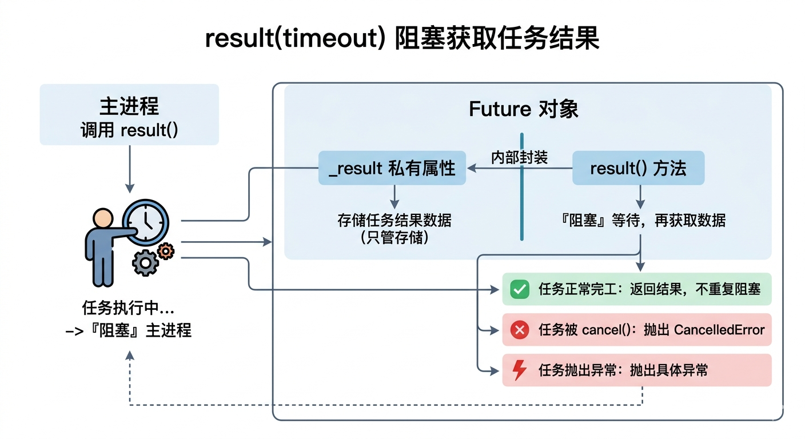

###### 基本语法

```python
from concurrent.futures import ProcessPoolExecutor

# 多个工作进程协同执行的任务函数
def <任务函数>(<任务函数参数>):
    # 任务函数体...
    
    
# 主进程（主管）
if __name__ == '__main__':
    # 创建进程池
    <进程池实例> = ProcessPoolExecutor(max_workers=<工作进程数量>) 
	
    # 提交任务
    <future 对象> = <进程池实例>.submit(fn=<任务函数>,<任务函数参数>...)
    
    # 阻塞当前主进程，等任务执行完毕，再返回任务结果
    <任务结果> = <future 对象>.result(timeout=None | int)
    
    # ...
```

参数：

- **`timeout`**：决定 **`result()` 获取任务结果**时会**『阻塞』当前「主进程」多久**
  - **`None`：「主进程」死等**任务结果，**直到任务结束（正常结束 / 抛出异常）**
  - **`timeout`：「主进程」『阻塞』 `timeout` 秒**；若 **`timeout` 超时**，**任务还未完成，则抛出 `TimeoutError`  超时异常**

```python
# 进程池实现-Future 对象
from concurrent.futures import ProcessPoolExecutor
from concurrent.futures._base import CancelledError
import os
import time


# 一个耗时任务
def task(n):
    print(f'进程任务 {n} --- 当前工作进程 PID {os.getpid()}')
    time.sleep(10)
    return n * n


# 一个会报错的任务
def task_error():
    raise Exception('任务出错')


if __name__ == '__main__':
    # 只有 1 个进程
    pool = ProcessPoolExecutor(1)

    future1 = pool.submit(task, 5)  # 提交一个 10s 的耗时任务
    future2 = pool.submit(task_error)  # 提交一个会报错的任务
    future3 = pool.submit(task, 2)  # 提交一个 10s 的耗时任务

    # 将任务3 取消
    future3.cancel()

    # ----------- 获取耗时任务结果  -----------
    # 阻塞当前主进程，等到任务完成，返回任务结果或者抛出异常
    try:
        print('正常任务执行结果：', future1.result(timeout=5))  # 5s 后抛出超时异常（此时任务还未完成）
    except TimeoutError as e:
        print(e)  # 抛出异常：concurrent.futures._base.TimeoutError

    print('正常任务执行结果：', future1.result())  # 死等，直到 10s后 或者 任务抛出异常才唤醒主进程

    # ----------- 获取报错任务结果 -----------
    # 阻塞当前主进程，等到任务完成，返回任务结果或者抛出异常
    try:
        print('报错任务执行结果：', future2.result())  # 抛出异常
    except Exception as e:
        print(e)  # Exception: 任务出错（来自任务函数的异常）

    # ----------- 获取被取消任务结果  -----------
    # 阻塞当前主进程，等到任务完成，返回任务结果或者抛出异常
    try:
        print('被取消任务执行结果', future3.result())
    except CancelledError as e:
        print(e)  # 抛出异常：concurrent.futures._base.CancelledError


'''
输出结果：
进程任务 5 --- 当前工作进程 PID 29632
正常任务执行结果： 25

任务出错
'''
```

###### 与 `shutdown()` 的阻塞区别

在 Python 的并发编程中（特别是在 `concurrent.futures` 模块中），`Future.result()` 和 `Executor.shutdown()` 是两个经常被一起使用，但**职责完全不同**的函数。

简单来说：**`result()` 关注的是“单个任务的结果”，而 `shutdown()` 关注的是“整个线程池/进程池的寿命”。**

| **特性**           | **Future.result()**                          | **Executor.shutdown()**                        |
| ------------------ | -------------------------------------------- | ---------------------------------------------- |
| **控制主体**       | **单个任务** (`Future` 对象)                 | **整个线程池/进程池** (`Executor` 对象)        |
| **主要目的**       | 获取某一个任务的执行结果或异常               | 停止接收新任务，并清理/释放线程池资源          |
| **阻塞行为**       | 必然阻塞（除非任务已完成或设置了超时）       | 默认阻塞 (`wait=True`)，直到所有已提交任务完成 |
| **返回值**         | 任务函数的返回值                             | `None`                                         |
| **对新任务的影响** | 无影响，后续还可以调用 `submit()` 添加新任务 | 调用后，线程池拒绝接收任何新任务               |

###### 最佳实践

利用 `with` 自动 `shutdown`，在循环或迭代中获取 `result()`：

```python
from concurrent.futures import ThreadPoolExecutor, as_completed

with ThreadPoolExecutor(max_workers=3) as executor:
    # 提交一堆任务
    futures = [executor.submit(lambda x: x*x, i) for i in range(5)]
    
    # 动态获取各个任务的结果
    for future in as_completed(futures):
        print(future.result()) 

# 离开 with 作用域时，自动执行了 executor.shutdown(wait=True)
# 此时可以确保所有资源已被安全释放
```

##### add_done_callback(fn) 任务完成的回调通知

> [!NOTE]
>
> **什么是回调函数？**
>
> 简单来说，**回调函数（Callback Function）**就是 **一个被作为参数传递给另一个函数的函数**，并且它会**在某个特定的时机、满足某个条件或某个事件发生时被 “回头触发调用”**。
>
> > 用一个生活中的例子来理解：
> >
> > > 你去一家店买咖啡，但这时候人很多，咖啡还没做好。你没有在柜台死等（阻塞），而是把你的**手机号（回调函数）**留给服务员（主函数）。服务员等咖啡做好之后（事件触发），通过手机号**打电话通知你（调用回调）**。
>
> 核心概念：回调函数是一种**异步事件驱动**的实现方式，它可以**在某个时机自动触发执行**，实现为某个对象添加**异步通知**的功能。

###### 为什么需要它？

- **没有使用 `add_done_callback()` 方法**：**「主进程」**想要**拿取一个任务结果**必须**主动**去访问 `Future` 对象（比如循环调用 `done()` 或者用 `result()` 死等）
- **使用 `add_done_callback()` 方法**：使用**异步事件驱动**的方式，将获取任务结果的权限**反**过来，**让 `Future` 对象主动通知「主进程」任务执行完成**，可以**过来拿取任务结果**了

> **`future.add_done_callbak(fn)` 『回调机制』：主动通知**

###### 基本概念

`add_done_callback(fn)` 的字面意思是：**“添加一个‘当任务完成时’自动执行的 `fn` 函数（Callback）”**。

执行逻辑：

1. **「主进程」**为**某个 `Future` 对象**事先**通过 `add_done_callback(fn)` 添加一个 `fn` 钩子事件函数**，之后「主进程」便可以去忙其他事情了
2. 当 **`Future` 对象的状态变为 `FINISHED` 完成态**（任务执行完毕，返回结果）时，会**自动触发 `future.add_done_callbak(fn)` 定义的 `fn` 函数**
3. 在 `fn` 函数内可**通过 `result()` 方法获取真正的任务结果**，也可以**单独为某个 `Future` 对象指向的任务实体进行异常捕获处理**
4. 在这个过程中，**「主进程」只参与 `fn` 回调函数的调用执行，其他一切事物都交给 `fn` 回调函数去处理**

核心要点：

- 回调函数是**自动被触发**的，只要 `Future` 的状态变为 `FINISHED`（执行完或崩溃）

- 回调函数在执行时，会**自动接收当前这个 `Future` 对象作为它唯一的参数**

###### 基本语法

```python
from concurrent.futures import ThreadPoolExecutor

def <回调函数>(<future 对象>,...): pass

def <任务函数>(<任务函数参数>,...): pass

if __name__ == '__main__':
    # 创建进程池
    <进程池实例> = ThreadPoolExecutor()
    
    # 提交任务，返回一个 Future 对象
    <future 对象> = <进程池实例>.submit(<任务函数>, <任务函数参数,...>)
    
    # 为 Future 对象添加一个 fn 回调通知函数
    <future 对象>.add_done_callback(fn=<回调函数>)
    
    # ...
```

###### 示例

```python
# add_done_callbak(fn)
from concurrent.futures import ThreadPoolExecutor
import os
import time

# 全局变量
title = 'Task State'


# 任务函数
def task(n, m):
    print(f'进程任务 {n} - {m} --- 当前工作进程 PID {os.getpid()}')
    time.sleep(1)
    return n + m


# 一个会报错的任务函数
def task2(n, m):
    print(f'进程任务 {n} - {m} --- 当前工作进程 PID {os.getpid()}')
    raise Exception('任务出错了')


if __name__ == '__main__':
    pool = ThreadPoolExecutor()

    # 提交任务
    future1 = pool.submit(task, 1, 2)
    future2 = pool.submit(task2, 2, 3)
    
    # 定义一个回调函数，接收一个 Future 对象作为参数（任务）
    def callback(future):
        # 回调函数的调用者是主进程，所以可以访问主进程的全局变量、函数、类等成员
        global title
        print(f"{title} -- {future._state}")

        # 单独为 Future对象（任务）做异常处理
        try:
            print('任务结果：', future.result())  # 获取任务结果
        except Exception:
            print('任务异常信息：', future.exception())  # 获取异常信息

    # 为 Future对象（任务）添加回调函数，当任务完成时自动调用（此时主进程可以去干别的事情了）
    future1.add_done_callback(callback)
    future2.add_done_callback(callback)

    # 主进程等待所有任务完成
    pool.shutdown(wait=True)


'''
输出结果：
进程任务 1 - 2 --- 当前工作进程 PID 17696
进程任务 2 - 3 --- 当前工作进程 PID 17696

Task State -- FINISHED
任务异常信息： 任务出错了

Task State -- FINISHED
任务结果： 3
'''
```

###### 注意点

由于 `fn` 回调函数的**调用者**是「主进程」，所以：

- 可以**在回调函数里直接使用「主进程」的全局变量、数据库连接或 UI 界面控件**，因为它就在「主进程」里运行

- 但是**不要把非常耗时的、密集的计算写在回调函数**里，否则它会**卡住「主进程」**

#### 任务异常信息（_exception）

核心定义：在任务执行期间发生错误会中断程序运行；**未抛出异常时 `_exception` 属性和 `exception()` 方法都返回 None**

核心流程：

**任务执行期间报错**：

- **「工作进程」**会**将错误信息传递给 `Future` 对象的 `_exception` 属性**，且**将任务的状态直接设置为 `FINISHED` 完成态**

- **「主进程」**可以通过**访问 `Future` 对象的 `_exception` 属性**，或者**调用 `exception()` 方法** 拿到**异常信息**，两者效果等价

  > `exception()` 方法：内部访问的就是 `_exception` 属性，它是 **`_exception` 私有属性的封装方法**

> 注：当任务发生错误后，**主进程调用 `result()` 方法不会产生任何结果**，即不会执行。

##### _exception 私有属性

核心定义：存储**任务执行期间抛出的异常信息**，返回的是 **`raise()` 抛出的具体异常信息**。

```python
# 进程池实现-Future 对象
from concurrent.futures import ProcessPoolExecutor
import os


# 一个会报错的任务函数
def task(n):
    print(f'进程任务 {n} --- 当前工作进程 PID {os.getpid()}')
    raise Exception('任务执行出错')


if __name__ == '__main__':
    try:
        # 只有 1 个进程
        pool = ProcessPoolExecutor(1)
        # 提交任务
        future1 = pool.submit(task, 1)

        # 查看任务状态
        print('任务1 state：', future1._state)  # RUNNING

        pool.shutdown(wait=True)  # 主进程阻塞等待工作进程任务执行完毕

        # 查看任务状态
        print('任务1 state：：', future1._state)  # FINISHED

        # 查看任务1 的异常信息
        print('任务1 exception：', future1._exception)  # 任务执行出错

		# 直接查看 Future 对象的内部结构
        print(future1, future1._state) # <Future at 0x19bc5a65590 state=finished raised Exception> FINISHED
    except Exception as e:
        print('抛出异常：', e)  # 任务执行出错

'''
输出结果：
任务1 state： RUNNING
进程任务 1 --- 当前工作进程 PID 28280
任务1 state：： FINISHED

任务1 exception： 任务执行出错

抛出异常： 任务执行出错
'''
```

##### exception() 方法

核心作用：获取**任务的异常信息**，返回的是 **`raise()` 抛出的异常信息**。

```python
# 进程池实现-Future 对象
from concurrent.futures import ProcessPoolExecutor
import os


# 一个会报错的任务函数
def task(n):
    print(f'进程任务 {n} --- 当前工作进程 PID {os.getpid()}')
    raise Exception('任务执行出错')


if __name__ == '__main__':
    try:
        # 只有 1 个进程
        pool = ProcessPoolExecutor(1)
        # 提交任务
        future1 = pool.submit(task, 1)

        # 查看任务状态
        print('任务1 state：', future1._state)  # RUNNING

        pool.shutdown(wait=True)  # 主进程阻塞等待工作进程任务执行完毕

        # 查看任务状态
        print('任务1 state：：', future1._state)  # FINISHED

        # 查看任务1 的异常信息
        print('任务1 exception：', future1.exception())  # 任务执行出错

        # 直接查看 Future 对象的内部结构
        print(future1, future1._state) # <Future at 0x19bc5a65590 state=finished raised Exception> FINISHED
    except Exception as e:
        print('抛出异常：', e)  # 任务执行出错

'''
输出结果：
任务1 state： RUNNING
进程任务 1 --- 当前工作进程 PID 28280
任务1 state：： FINISHED

任务1 exception： 任务执行出错

抛出异常： 任务执行出错
'''
```

#### 汇总案例

```python
# 进程池实现-Future 对象
from concurrent.futures import ProcessPoolExecutor
import time


# 一个会报错的任务函数
def task_error():
    time.sleep(5)  # 模拟一个耗时任务，防止主进程结束
    raise Exception('任务执行出错')


# 一个正常的任务函数
def task_normal():
    return 1 - 1


if __name__ == '__main__':
    try:
        # 创建进程池，进程池大小为1
        pool = ProcessPoolExecutor(1)

        # 提交任务
        future1 = pool.submit(task_normal)
        future2 = pool.submit(task_normal)
        future3 = pool.submit(task_error)
		
        # ----  [Future 对象结构] [任务状态] [任务结果] [任务异常信息]  ----
        print(future1, future1._state, future1._result, future1._exception)
        # <Future at 0x1cf9d4aa270 state=running> RUNNING None None
        
        print(future2, future2._state, future2._result, future2._exception)
        # <Future at 0x1cf9d4aa270 state=running> RUNNING None None
        
        print(future3, future3._state, future3._result, future3._exception)
        # <Future at 0x1cf9d4e9590 state=pending> PENDING None None

        
        # 主进程阻塞等待所有工作进程任务完成
        pool.shutdown(wait=True)
        

        # ----  [Future 对象结构] [任务状态] [任务结果] [任务异常信息]  ----
        print(future1, future1._state, future1._result, future1._exception)
        # <Future at 0x1cf9d4aa270 state=finished> FINISHED 0 None
        
        print(future2, future2._state, future2._result, future2._exception)
        # <Future at 0x1cf9d4aa270 state=finished> FINISHED 0 None
        
        print(future3, future3._state, future3._result, future3._exception)
        # <Future at 0x1cf9d4e9590 state=finished raised Exception> FINISHED None 任务执行出错

    except Exception as e:
        print('抛出异常：', e)  # 任务执行出错
```

### 常用方法

#### submit(fn,fn_params...) 提交单个任务

##### 基础语法

```python
from concurrent.futures import ProcessPoolExecutor

# 多个工作进程协同执行的任务函数
def <任务函数>(<任务函数参数>):
    # 任务函数体...
    
    
# 主进程（主管）
if __name__ == '__main__':
    # 创建进程池
    <进程池实例> = ProcessPoolExecutor(max_workers=<工作进程数量>)  # 进程池内预设 max_workers 个数量的工作进程
	
    # 提交任务
    <进程池实例>.submit(fn=<任务函数>,<任务函数参数>...)
    
    #...
```

核心作用：**提交**一个**带 `fn_params` 任务参数**的 **`fn` 任务**给**进程池内的任务队列（Task Queue）**中去**维护**。

参数：

- **`fn`：要提交的任务函数**
- **`<任务函数参数>`：`fn` 任务函数所需的参数**

核心价值：**“谁先完成，谁先处理任务返回结果”**--**随机**模式。

##### **核心执行逻辑**

1. 可以**连续调用 `n` 次 `submit()` 方法**，表示**将 `n` 个任务投递**到**进程池内的任务队列（Task Queue）中维护**
2. 此时，**进程池**会**自动协调处于 “空闲状态” 的工作进程**去**领取并执行任务**（在开发人员视角是**不可见**的）
3. 当**任务执行完毕**后，**运行中**的进程**转为 “空闲” 状态**并**回到进程内继续 “排队等待”**


##### **工作机制**

- 主进程与进程池内的工作进程是**『异步非阻塞』的并发交替执行**【默认】

  即**主进程**在通过 `ProcessPoolExecutor()` 创建进程池后，会**继续向下【同步串行执行】后续代码**

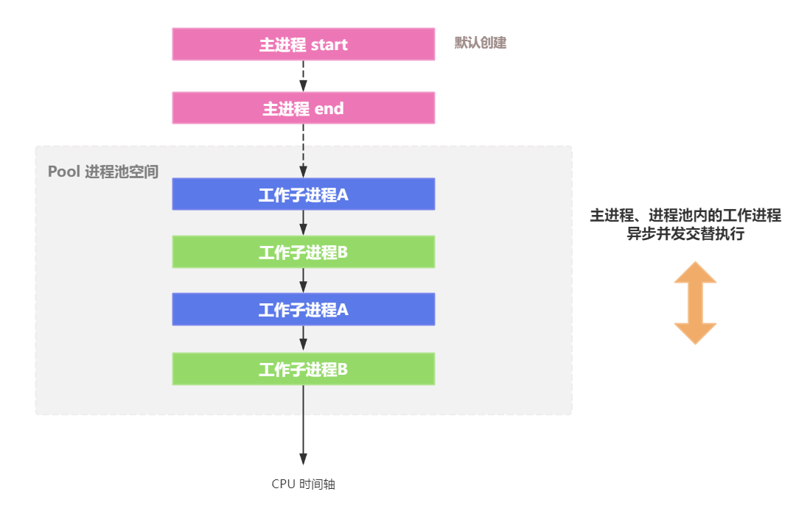

##### 示例

```python
# 进程池实现
from concurrent.futures import ProcessPoolExecutor
import os
import time


def task(n):
    print(f'进程任务 {n} --- 当前工作进程 PID {os.getpid()}')
    time.sleep(1)
    return n * n


if __name__ == '__main__':
    # 主进程（同步执行）
    print('主进程 start')

    pool = ProcessPoolExecutor(4)
	
    for i in range(5):
        future = pool.submit(task, i)  # 提交 5 个任务（子工作进程异步执行）
	
    print(future.result()) # 获取任务结果
    
	# 等价于：
	# pool.submit(task, 0)
    # pool.submit(task, 1)
    # pool.submit(task, 2)
    # pool.submit(task, 3)
    # pool.submit(task, 4)

    print('主进程 end')

'''
输出结果：
主进程 start
主进程 end

进程任务 0 --- 当前工作进程 PID 27684
进程任务 1 --- 当前工作进程 PID 27268
进程任务 2 --- 当前工作进程 PID 7776
进程任务 3 --- 当前工作进程 PID 31180
进程任务 4 --- 当前工作进程 PID 27684
'''
```

##### 底层逻辑

当主进程调用 `pool.submit()` 时，Python 内部并不是立刻去检查有没有空闲的进程并执行，而是经历了一个极短的中间过程：

1. **状态预设**：**`submit()` 方法被调用**时，Python 会在主进程中**立刻**创建一个 **`Future` 对象**，并默认将其**内部状态初始化**为 **`PENDING` 等待中**
2. **启动/唤醒队列**：紧接着，`ProcessPoolExecutor` 内部的一个**后台管理线程**（Queue Management Thread）会被唤醒，**负责把 `submit()` 提交的任务打包、序列化**，然后**传递给进程间的任务队列（Task Queue）里**
3. **状态切换**：当**任务被成功放进 任务队列（Task Queue）、准备发往子进程**的那**一瞬间**，主进程的后台管理线程就会把该  **`Future` 对象的状态修改为 `RUNNING`**

##### 列表推导式-批量提交任务

核心作用：可以利用 `[]` 列表推导式**批量 `submit()` 提交任务、返回 `Futrue` 对象**。

```python
# 进程池实现-Future 对象
from concurrent.futures import ProcessPoolExecutor
import os
import time


# 一个耗时任务
def task(n):
    print(f'进程任务 {n} --- 当前工作进程 PID {os.getpid()}')
    time.sleep(1)
    return n * n


if __name__ == '__main__':
    # 只有 1 个进程
    pool = ProcessPoolExecutor(1)

    # 利用列表推导式批量 submit 移交任务，返回一个 Future 对象列表
    futures = [pool.submit(task, i) for i in range(5)]

    # 阻塞当前主进程，等待所有任务完成，此时 Future 对象列表中的所有 Future 对象都处于完成状态
    pool.shutdown()

    # 遍历 Future 对象列表，获取每个 Future 对象的返回值
    for future in futures:
        print(future.result())  # 获取每个任务的返回值

'''
进程任务 0 --- 当前工作进程 PID 13636
进程任务 1 --- 当前工作进程 PID 13636
进程任务 2 --- 当前工作进程 PID 13636
进程任务 3 --- 当前工作进程 PID 13636
进程任务 4 --- 当前工作进程 PID 13636

0
1
4
9
16
'''
```

##### 提交多个不同任务

虽然进程池（Process Pool）的核心设计初衷是 **“复用固定数量的进程来处理大量同类任务”**，以**减少频繁创建和销毁进程的系统开销**，但它在技术上绝对支持同时或交替执行完全不同的任务。

###### 优缺点

- 优点：代码简单易用、进程池自动管理多个子进程
- 缺点：无法为不同进程设置进程属性（进程名称、是否为守护进程...）

###### 示例

使用 `submit()` 提交不同的任务（最推荐）：

```python
# submit() 多任务处理
from concurrent.futures import ThreadPoolExecutor
from time import sleep


def task(n, m):
    print(f"task {n} {m}")
    sleep(1)
    return n + m


def task2(n, m):
    print(f"task {n} {m}")
    sleep(1)
    return n - m


def task3(n, m):
    print(f"task {n} {m}")
    sleep(1)
    return n * m


with ThreadPoolExecutor(max_workers=3) as executor:
    # 提交多个不同的任务
    future = executor.submit(task, 1, 2)
    future2 = executor.submit(task2, 1, 2)
    future3 = executor.submit(task3, 1, 2)

    # 获取任务结果
    result = future.result()
    result2 = future2.result()
    result3 = future3.result()

    print(result, result2, result3)  # 3 -1 2
```

###### 针对不同任务的异常处理

> 在多进程中，如果子进程执行代码时崩了（比如报了 `ZeroDivisionError`），**主进程在提交任务时是不会报错的**。只有**在调用 `result()` 方法** 尝试**获取任务结果**的那一刻，异常才会被抛出。
>
> 因此，**在获取结果时**，标准的做法是**加上 `try...except` 捕捉异常**。

```python
# 进程池实现-Future 对象
from concurrent.futures import ProcessPoolExecutor
from concurrent.futures._base import CancelledError
import os
import time


# 一个耗时任务
def task(n):
    print(f'进程任务 {n} --- 当前工作进程 PID {os.getpid()}')
    time.sleep(10)
    return n * n


# 一个会报错的任务
def task_error():
    raise Exception('任务出错')


if __name__ == '__main__':
    # 只有 1 个进程
    pool = ProcessPoolExecutor(1)

    future1 = pool.submit(task, 5)  # 提交一个 10s 的耗时任务
    future2 = pool.submit(task_error)  # 提交一个会报错的任务
    future3 = pool.submit(task, 2)  # 提交一个 10s 的耗时任务

    # 将任务3 取消
    future3.cancel()

    # ----------- 获取耗时任务结果  -----------
    # 阻塞当前主进程，等到任务完成，返回任务结果或者抛出异常
    try:
        print('正常任务执行结果：', future1.result(timeout=5))  # 5s 后抛出超时异常（此时任务还未完成）
    except TimeoutError as e:
        print(e)  # 抛出异常：concurrent.futures._base.TimeoutError

    print('正常任务执行结果：', future1.result())  # 死等，直到 10s后 或者 任务抛出异常才唤醒主进程

    # ----------- 获取报错任务结果 -----------
    # 阻塞当前主进程，等到任务完成，返回任务结果或者抛出异常
    try:
        print('报错任务执行结果：', future2.result())  # 抛出异常
    except Exception as e:
        print(e)  # Exception: 任务出错（来自任务函数的异常）

    # ----------- 获取被取消任务结果  -----------
    # 阻塞当前主进程，等到任务完成，返回任务结果或者抛出异常
    try:
        print('被取消任务执行结果', future3.result())
    except CancelledError as e:
        print(e)  # 抛出异常：concurrent.futures._base.CancelledError


'''
输出结果：
进程任务 5 --- 当前工作进程 PID 29632
正常任务执行结果： 25

任务出错
'''
```

#### shutdown(wait) 主进程等待子进程完成

##### 基础语法

```python
from concurrent.futures import ProcessPoolExecutor

# 多个工作进程协同执行的任务函数
def <任务函数>(<任务函数参数>):
    # 任务函数体...
    
    
# 主进程（主管）
if __name__ == '__main__':
    # 创建进程池
    <进程池实例> = ProcessPoolExecutor(max_workers=<工作进程数量>)  # 进程池内预设 max_workers 个数量的工作进程
	
    # 提交任务
    <进程池实例>.submit(fn=<任务函数>,<任务函数参数>...)
    
    # 主进程等待进程池内的工作进程任务全部执行完毕
    <进程池实例>.shutdown(wait=True/Flase)
    
    # ...
```

参数：

- **`wait`：当前主进程是否阻塞等待**
  - **`True`：阻塞等待（同步阻塞的串行执行）【默认】**
  - **`False`：不等待（异步非阻塞的并发交替执行）**

##### 工作机制

1. 当进程池实例**调用 `shutdown()` 方法**后，会**关闭进程池**，进程池内的任务队列（Queue）将**不再接收新的任务**，所以必须写在 `submit()` 提交任务行之后
2. 并**阻塞当前主进程**，让其**等待进程池中所有任务执行完毕**，主进程**才会唤醒接着执行后续的代码**

核心本质：将**主进程与进程池内工作工程**的**『异步非阻塞』的并发交替执行**改为了**『同步阻塞』的串行执行**。

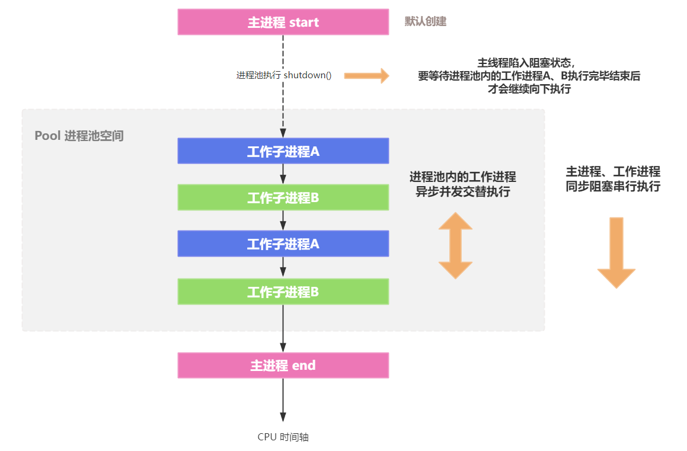

##### 示例

```python
# 进程池实现
from concurrent.futures import ProcessPoolExecutor
import os
import time


def task(n):
    print(f'进程任务 {n} --- 当前工作进程 PID {os.getpid()}')
    time.sleep(1)
    return n * n


if __name__ == '__main__':
    # 主进程（同步执行）
    print('主进程 start')

    pool = ProcessPoolExecutor(4)
    for i in range(5):
        pool.submit(task, i)  # 提交任务（子工作进程异步执行）

    pool.shutdown(wait=True)  # 关闭进程池，不再接受新的任务，但会等待所有已提交的任务执行完毕

    # 之前的 submit() 提交的任务，进程池内的工作进程还是会继续执行
    # pool.submit(task, 10)
    # 报错：RuntimeError: cannot schedule new futures after shutdown

    print('主进程 end')

'''
主进程 start

进程任务 0 --- 当前工作进程 PID 22408
进程任务 1 --- 当前工作进程 PID 25892
进程任务 2 --- 当前工作进程 PID 7640
进程任务 3 --- 当前工作进程 PID 29276
进程任务 4 --- 当前工作进程 PID 22408

主进程 end
'''
```

> 注意：`shutdown()` 方法一定要**写在 `submit()` 方法之后**，否则会报错
>
> （**写在 `shutdown()` 方法之前的 `submit()` 提交的任务**，工作进程还是会**继续执行**，只不过会在全部任务执行完毕后，报错 `RuntimeError: cannot schedule new futures after shutdown`）。

#### map(fn,iterables...) 批量提交同类任务

##### 为什么要有 map？

在多进程编程中，要想实现一个**批量提交任务**的操作：

- **没有 `map()`**：通常需要**手动编写 `for`、`while` 循环，并额外建立一个列表容器用于存储多个任务的执行结果集**；

  循环体内部根据循环次数来**一次次调用 `submit()` 方法，逐个把 `fn` 任务提交**给进程池内的**任务队列（Task Queue）**中维护，代码会显得冗长

  ````python
  futures_list = [] # 额外定义一个列表用于存储多个任务的结果集
  for _ in <任务个数>:
      futures_list.append(<进程池实例>.submit(<任务函数>, <任务函数参数...>))
  ````

- **而有 `map()`**：一行代码搞定

  ```python
  # 主进程使用
  <任务结果生成器对象> = <进程池实例>.map(fn=<任务函数>,iterables=<任务函数参数列表>,...)
  
  # <任务结果生成器对象> 是批量任务的结果集
  ```

##### 基础语法

```python
from concurrent.futures import ProcessPoolExecutor

# 多个工作进程共同执行的任务函数
def <任务函数>(<任务函数参数>,...):
    # 任务函数体...
    
    
# 主进程（主管）
if __name__ == '__main__':
    # 创建进程池
    <进程池实例> = ProcessPoolExecutor(max_workers=<工作进程数量>)  # 进程池内预设 max_workers 个数量的工作进程
	
    # 批量提交任务
    <任务结果生成器对象> = <进程池实例>.map(
        fn=<任务函数>, 
        iterables=<任务函数参数列表（可迭代对象）>,
        timeout?=<「主进程」获取任务结果的等待时长>,
        chunksize?=<任务参数传递打包的分块大小>
    )
    
    #...
```

核心作用：根据**给定 `iterables` 函数参数列表中元素的个数**，**批量提交多个同类 `fn` 任务**给**进程池内的任务队列（Task Queue）**中去**维护**。

###### 优缺点

- 优点：
  - **代码简洁**：**批量提交多个同类任务**，使得代码更简洁，适合**批处理多个相同的任务**（`submit` 适合分别处理不同的任务）
  - **性能调优**：可以**利用  `chunksize` 参数对大数据量的 <任务参数> 与 <任务返回结果> 进行分块打包处理**，实现性能优化，但 **`submit()` 方法**需要**额外手动编写切片操作**，这会使得代码**变得很复杂、难以阅读**
  - **输入输出顺序一致**：如果有一组数据，希望**按照输入数据的原始顺序**依次获取结果，可以使用 `map()` 

- 缺点：

  - **异常处理不优雅**：由于**批量提交多个任务**是**原子性操作**，故在处理任务返回结果时也是原子性的

    一旦**某个任务在执行期间抛出异常**，**无法精确地捕获某个任务的异常处理**

###### 参数

- **`fn`：要提交给进程池的任务函数**

- **`iterables`**：**任务函数参数列表**；它是一个**可迭代对象（列表、元组、字典、集合...）**

  > 进程池会**遍历**这个**`iterables` 可迭代对象**，并**根据 `len(iterables)` 列表长度来依次创建任务**，且将**当前遍历到的 [列表元素] 作为 [`fn` 任务函数的参数] **传递给任务函数，由 “空闲” 的工作进程去分配执行

  ****

- **`timeout`**：**「主进程」**在使用 **`<任务结果生成器对象>` 逐个获取任务结果**时**『阻塞』等待的时长**，以 **秒** 为单位。

  - **`None`（默认）**：

    当**遍历`<任务结果生成器对象>` **时，如果**当前迭代的任务结果一直未返回**，**「主进程」**会**一直『阻塞』死等**，直到任务结果返回

  - **设置了 `timeout`（单位：秒）**：

    当**遍历`<任务结果生成器对象>` **时，如果**任务结果在 `timeout` 秒后还未返回**，则会抛出 **`TimeoutError` 超时异常**。

  ****

- **`chunksize`**：「主进程」**根据 `fn` 的任务参数内容大小**，在底层队列间**传递 `fn` 任务时，对任务参数进行`chunksize`分块打包传输**，以此实现**性能优化**。

  - **`1`（默认）**：

    **进程池**会把输入的 **`iterables` 任务参数（可迭代对象）**以**一个一个**的形式传递给**「工作进程」**。

    > 如果**某个任务参数的数据量极大**（比如 100 万个数字），**进程间通信的开销（序列化/反序列化）会远远大于计算时间**，导致多进程反而变慢；
    >
    > 此时就需要**显式设置 `chunksize`  参数对任务参数进行分块拆分处理**了

  - **`<具体大小>`**：

    如设置 `chunksize=100`，进程池会把 **`iterables` 任务参数（可迭代对象）**切分成**每 100 个一组，一次性打包发给子进程**。

    > 这能**大幅减少进程间通信的次数**，显著提升超大数据集的处理效率

  ****

##### 核心特性

核心价值：能通过极简的代码，将**一个任务函数同时作用于一组数据（任务函数参数）**上，实现**任务复用**。

- **异步并行执行**：`map()` 方法会把 **`iterables` 任务参数列表（可迭代对象）中的元素分配给多个工作子进程【异步并行】处理**
- **保持原有顺序**：尽管工作进程的完成时间可能各不相同，但 `map()` 返回的迭代器会**严格按照输入`iterables` 任务参数的顺序**产出结果
- **惰性求值（Lazy Evaluation）**：`map()` 方法返回的是一个**生成器（Iterator）**，只有**在遍历它时（如使用 `for` 循环或 `list()` 迭代），才会真正获取结果**，并且会**『阻塞』当前「主进程」，直到任务返回结果**。
- **自动管理进程**：配合 `with` 语句使用，它会在任务结束或发生异常时，自动清理和关闭进程池

###### 工作机制

- 主进程与进程池内的工作进程是**『异步非阻塞』的并发交替执行**【默认】

  即**主进程**在通过 `ProcessPoolExecutor()` 创建进程池后，会**继续向下【同步串行执行】后续代码**

  


##### *iterables 任务函数参数传递

核心要点：`map()` 方法本质上就是一个**函数复用器**。即**批量创建工作进程，处理同类任务**，只是**任务函数参数不同**而已。

> 这在计算机科学中被称为 **SIMD（单指令多数据，Single Instruction Multiple Data）** 的编程思想。

###### **单参数传递**

定义：指【任务函数 `fn` 】**只接受一个参数**，则 **`map()` 只需要传递一个 `iterables` 列表容器**即可，**容器内的元素就是 `fn` 任务函数的参数**。

```python
# 创建 3 个任务，n 参数分别为 1 2 3
def task(n): pass

# 进程池并行提交 3 个任务：task(1)、task(2)、task(3)
pool.map(task, [1,2,3]) 

# 进程池内部会通过 `for`、`while` 循环遍历 [1,2,3] 列表依次创建 3 个 task 任务，并依次将 [1,2,3] 容器内的1、2、3元素作为 `task` 任务函数的参数传递给 `task` 任务函数，最后开始为工作进程分配任务（按顺序分配）

# 传入的参数列表:    [   1,    2,     3  ]
#                      │     │      │
#                      ▼     ▼      ▼
# 生成的并行任务:    task(1) task(2) task(3)
```

示例：

```python
# 进程池实现-map() 方法
from concurrent.futures import ProcessPoolExecutor, as_completed
import os

# 任务函数
def task(n):
    print(f'进程任务 {n} --- 当前工作进程 PID {os.getpid()}')
    return n * 2


if __name__ == '__main__':
    # 只有 1 个进程
    pool = ProcessPoolExecutor(1)

    # map()：批量提交任务，并根据 iterables 参数列表的元素个数来创建任务

    # 单参数传递：任务只有一个参数
    pool.map(task, [1, 2, 3])
    '''
    输出结果：
    进程任务 1 --- 当前工作进程 PID 25388
    进程任务 2 --- 当前工作进程 PID 25388
    进程任务 3 --- 当前工作进程 PID 25388
    '''
```

###### **多参数传递**

定义：指【任务函数 `fn` 】**需要接收多个参数**，则 `map()` 可以同时**传递多个 `iterables` 列表容器**，**容器内的元素就是 `fn` 任务函数的参数**。

核心要点：在**每次遍历 `iterables` 列表容器创建任务**时，会**从每个参数列表中[按顺序]各取一个元素，组合成一组参数，传递给任务函数，批量提交**。

> 每次**遍历创建任务**都是**取多个 `iterables` 列表容器的第 `i` 个参数进行组合**，最终组合成**多组任务函数参数**。
>
> *类似于数据容器类型的 `zip()` 函数*

```python
# 创建 3 个任务
# n 参数：1  2  3
# m 参数：10 20 30
def task(n,m): pass

# 任务函数参数列表
list_n = [1, 2, 3] # n 参数列表
list_m = [10, 20, 30] # m 参数列表

# 进程池并行提交 3 个任务：task(1,10)、task(2,20)、task(3,30)
pool.map(task, list_n, list_m)

# 进程池内部会通过 `for`、`while` 循环遍历 list_n 和 list_m 列表依次创建 3 个 task 任务
# 并依次将 [1,2,3] 容器内的1、2、3元素作为 `task` 任务函数的 n 参数传递给 `task` 任务函数
# 并依次将 [10,20,30] 容器内的10、20、30元素作为 `task` 任务函数的 m 参数传递给 `task` 任务函数
# 每次遍历创建任务都是取两个列表的第 i 个参数进行组合，最终组合成 3 个任务，最后开始为工作进程分配任务（按顺序分配）

# 参数列表 1 (n):    [  1,    2,    3  ]
#                      │     │     │
#                      ▼     ▼     ▼  (垂直对应组合)
# 参数列表 2 (m):    [ 10,    20,   30  ]
#                      │     │     │
#                      ▼     ▼     ▼
# 生成的并行任务:   task(1,10) task(2,20) task(3,30)
```

示例：

```python
# 进程池实现-map() 方法
from concurrent.futures import ProcessPoolExecutor, as_completed
import os

# 任务函数
def task(n, m):
    print(f'进程任务 {n} - {m} --- 当前工作进程 PID {os.getpid()}')
    return n * m


if __name__ == '__main__':
    # 只有 1 个进程
    pool = ProcessPoolExecutor(1)

    # map()：批量提交任务，并根据 iterables 参数列表的元素个数来创建任务

    # 多参数传递：任务需要接收多个参数，n 参数是 [1,2,3]，m 参数是 [10,20,30]
    pool.map(task, [1, 2, 3], [10, 20, 30])
    '''
    输出结果：
    进程任务 1 - 10 --- 当前工作进程 PID 3592
    进程任务 2 - 20 --- 当前工作进程 PID 3592
    进程任务 3 - 30 --- 当前工作进程 PID 3592
    '''
```

 的参数传递机制.png)

###### 参数传递的底层机制

在 `map(func, iterables)` 的内部，主进程确实在对 `iterables` 任务参数列表进行迭代。

> 核心逻辑：**遍历参数 → 绑定函数与当前参数 → 实例化为一个独立任务 → 丢进任务队列（Task Queue）**。

核心概念：`map()` 方法内部通过将 **`for\while` 循环逐个 `submit` 提交任务 > 最终将 `result()` 组合成一个生成器对象返回** 这个过程**实现了**底层的高度封装。

> `map()` 方法实现的伪代码：
>
> ```python
> # 逻辑上的等价伪代码
> def map(fn, iterables):
> futures_list = []
> 
> # 1. 遍历参数列表
> for item in iterables:
>   # 2. 依次创建任务，并将元素作为参数传递给 func
>   # 这里的 submit 内部会把 (func, item) 打包成一个独立的 Task
>   future = executor.submit(fn, item) 
> 
>   futures_list.append(future)
> 
> # 3. 最终返回一个能按顺序获取结果的生成器
> return (future.result() for future in futures_list)
> ```
>
> > 虽然逻辑上是遍历传参，但在多进程（`ProcessPoolExecutor`）的实际运行中，参数并不是直接作为内存变量传过去的，因为**子进程和主进程的内存是完全隔离的**。
> >
> > 这里涉及到一个关键动作：**序列化（Pickle）与任务重组**。
> >
> > > 核心逻辑：**「主进程」→（序列化）→ IPC通道（任务队列 Task Queue） →（反序列化）→ 「工作进程」**
> >
> > 任务复用与参数传递过程：
> >
> > 1. **打包（任务实例化）**：当主进程遍历到参数 `1` 时，它会把函数 `func` 本身和参数 `1` 放在一起，打包成一个任务包
> > 2. **排队（进入队列）**：这个任务包被放进 `Task Queue`（任务队列）。接着遍历到 `2`，又打包一个任务放进去
> > 3. **子进程复用任务**：任务本身会被复用，只是传递不同的参数而已

同时 `map()` 方法内部还可以在”进程间 IPC 队列通信“时**对 <任务参数> 和 <任务返回结果> 根据 `chunksize` 进行分块打包传输**，实现**性能优化**。

##### 获取任务返回结果【阻塞】

核心概念：在**「主进程」执行 `pool.map()` 方法**后会返回一个**跨进程同步的生成器对象（Generator）**，用于存储**任务结果**；

- 可以通过 `for` 循环或 `next()` 迭代该生成器对象，**逐个**返回**任务结果**

###### 核心特性

- **保持原有任务顺序**：尽管**工作进程的完成时间可能各不相同**，但 `map()` 返回的迭代器会**严格按照输入`iterables` 任务参数列表的定义顺序**产出结果
- **惰性求值（Lazy Evaluation）**：`map()` 方法返回的是一个**生成器（Iterator）**，只有**在遍历它时（如使用 `for` 循环或 `list()` 迭代），才会真正获取结果**，并且会**『阻塞』当前「主进程」，直到任务返回结果**。

###### 核心思想

- 在**`<任务结果生成器>` 迭代过程中**，如果**迭代到的当前任务还未结束**，则会**『阻塞』当前「主进程」**；

- **「后台管理线程」**会**持续监听--结果队列（Result Queue）**，直到**有任务结果**时，才会**唤醒「主进程」继续往下执行**；

- 就算此时有其他任务异步执行完毕返回了结果，但也**不会影响「主进程」的『阻塞状态』**

  （输出结果顺序：**只认输入的 `iterables` 任务参数列表顺序，不看谁先算完**）。*只看谁先来，不看谁先完成*

> 要点：**任务每完成一次，主进程被唤醒获取一次任务结果，前面的任务一直未完成，主进程便一直阻塞等待**。

```python
# 进程池实现-map() 方法
from concurrent.futures import ProcessPoolExecutor
import os
import time


# 任务函数
def task(n, m):
    print(f'进程任务 {n} - {m} --- 当前工作进程 PID {os.getpid()}')
    # 不同任务的执行时间不同
    match (n):
        case 1:
            time.sleep(3)
        case 2:
            time.sleep(2)
        case 3:
            time.sleep(1)
    return n * m


if __name__ == '__main__':
    # 3 个进程执行 3 个任务
    pool = ProcessPoolExecutor(3)

    # map()：批量提交任务，并根据 iterables 参数列表的元素个数来创建任务（提交 3 个任务）
    # 多参数传递：任务需要接收多个参数，n 参数是 [1,2,3]，m 参数是 [10,20,30]
    # 最终效果：task(1, 10)，task(2, 20)，task(3, 30)
    results = pool.map(task, [1, 2, 3], [10, 20, 30])

    # 主进程【阻塞】等待每一个进程返回结果
    # （严格按照 task(1, 10)，task(2, 20)，task(3, 30) 的任务输入顺序返回结果）
    # 任务1 task(1, 10) 执行耗时是 3s
    # 任务2 task(2, 20) 执行耗时是 2s
    # 任务3 task(3, 30) 执行耗时是 1s
    # 就算任务3(1s)先执行完，主进程也会等待任务1(3s)执行完返回结果，此时任务2、3已经完成，瞬间返回结果
    for result in results:
        print(f'任务结果 {result}')

    '''
    输出结果：【输入与输出顺序一致】
    进程任务 1 - 10 --- 当前工作进程 PID 24240
    进程任务 2 - 20 --- 当前工作进程 PID 23992
    进程任务 3 - 30 --- 当前工作进程 PID 28384
    
    （此处主进程会等待 3s，但进程任务2、3已经执行完了，实际是在等待任务1执行完）
    
    任务结果 10
    任务结果 40
    任务结果 90
    '''
```

总结：**慢的任务卡在了前面，后面的任务就算早早到家了，也必须在门外排队**。这种**“按序解锁”**的机制导致了主线程的阻塞。

> 在 `concurrent.futures` 中，实现不阻塞（**谁先算完先处理谁**）的方式是使用 **`submit()` 配合 `as_completed()`**。

###### ”先进先出“ 的排序机制

核心定义：**输出结果的顺序必须与输入数据的顺序完全一致**。

具体表现：

- 输入顺序：

  1. **「主进程」会读取并遍历 `map()` 传入的 `iterables` 任务参数列表**（如 `[1,2,3]`）
  2. 根据 **`iterables` 列表长度**，按**传入顺序**，循环**创建出 3 个任务以及对应的 `Future` 对象，并建立关联一对一的映射关系**
  3. `map()` 方法**提交任务**后，会返回一个**特制的迭代器（Generator）**，用于**「主进程」后续访问 `fn` 任务的返回结果**

- 输出顺序：

  > 核心定义：任务结果生成器用于**存储 `map()` 批量提交的任务执行结果集**（实际存储的是**一个个 `Future` 对象**）。

  1. 当**「主进程」执行到 `for result in results` 试图获取任务执行结果**时：

     「主进程」会**按 `iterables` 任务参数列表的传入顺序，依次迭代（`results` 任务结果生成器）内指向的 3 个 `Future` 对象** （**一个 `result` 对应一个 `Future` 对象**）

  2. **【`results` 任务结果生成器】内部迭代过程**：

     1. **「主进程」依次检查**第 1、2、3 个 **`Future` 对象（对应 `iterables` 列表的元素 `1、2、3`，即第 1、2、3 个任务）**

        > 保证了：
        >
        > - **输入有序**（按 `iterables` 任务参数列表定义顺序 => 创建任务并传递参数）
        > - **输出有序**（按 `iterables` 任务参数列表定义顺序 => 返回任务结果）

     2. 对 `Future` 对象的**状态检查（通过  `_state` 私有属性）**：

        1. **`FINISHED` 完成态**：代表**任务执行完毕，「主进程」通过访问 `Future` 对象（`_result` 私有属性）直接拿走任务结果**
        2. **非 `FINISHED` 完成态**：**「主进程」**会在这里**『阻塞挂起』**，交出 CPU 控制权，等待任务结果返回：
           -  若 **`map(timeout=None)`** ：**「主进程」死等，直到任务执行完毕**，后台管理线程把它**唤醒拿走任务结果**
           -  若 **`map(timeout=n)` ：「主进程」等待 `n` 秒**后，若**任务还未执行完毕，则抛出 `TimeoutErorr` 异常**


###### 配合 shutdown() 一次性获取

在**「主进程」的 `map()` 后续代码**中，分 2 种情况：

- **进程池调用了 `pool.shutdown()`**：

  影响：**「主进程」**陷入**『阻塞状态』**，**等待** `map()` 批量提交的**所有任务执行完毕**后，才**唤醒「主进程」继续往下执行**，可以**一次性获取任务结果**

  ```python
  # 进程池实现-map() 方法
  from concurrent.futures import ProcessPoolExecutor
  import os
  import time
  
  
  # 任务函数
  def task(n, m):
      print(f'进程任务 {n} - {m} --- 当前工作进程 PID {os.getpid()}')
      # 不同任务的执行时间不同
      match (n):
          case 1:
              time.sleep(3)
          case 2:
              time.sleep(2)
          case 3:
              time.sleep(1)
      return n * m
  
  
  if __name__ == '__main__':
      # 3 个进程执行 3 个任务
      pool = ProcessPoolExecutor(3)
  
      # 最终效果：task(1, 10)，task(2, 20)，task(3, 30)
      results = pool.map(task, [1, 2, 3], [10, 20, 30])
  
      pool.shutdown(wait=True)  # 主进程等待子进程所有任务执行完
  
      # 主进程执行到这里时，代表所有子进程任务已经执行完，可以一次性获取所有结果
      for result in results:
          print(f'任务结果： {result}')
  
      '''
      输出结果：【输入输出顺序一致】
      进程任务 1 - 10 --- 当前工作进程 PID 4844
      进程任务 2 - 20 --- 当前工作进程 PID 6804
      进程任务 3 - 30 --- 当前工作进程 PID 23580
      
      （此处主进程会等待 3 + 2 + 1 = 6s）
      
      任务结果： 10
      任务结果： 40
      任务结果： 90
      '''
  ```

- **进程池未调用 `pool.shutdown()`（惰性求值）**：

  影响：**「主进程」**继续往下**同步串行**执行，并**阻塞等待任务结果返回**

  ```python
  pool = ProcessPoolExecutor(1)  # 创建进程池，只有 1 个工作进程
  
  results = pool.map(fn, [1,2,3], timeout=None, chunksize=1)  # 批量提交任务
  
  # 获取 map() 批量提交的任务结果
  for result in results:
      print(result) # 主进程卡在这里！
      # 要点：任务每完成一次，主进程获取一次任务结果，任务一直未完成，主进程便一直阻塞等待
  ```

###### 底层机制-阻塞结果队列

> `_result_updater` 线程与阻塞的结果队列（Result Queue）

`executor.map()` 的底层并不是直接去每个进程里捞数据，它依赖一个内部的**结果消费队列（Result Queue）**。

1. **后台分发**：当调用 `map()` 时，主进程的后台线程会一股脑把所有任务丢进进程池。
2. **后台收集**：子进程算完任何一个任务后，都会把结果丢回一个底层的多进程队列（Queue）。
3. **主进程阻塞**：`map()` 返回的迭代器在内部执行 `next()` 时，实际上是在调用类似 `queue.get(block=True)` 的方法。
   - 如果当前**正轮到**的那个任务结果还没被子进程放进队列，主进程就会在这里**挂起（阻塞）**，让出 CPU，直到该任务对应的子进程把结果传回来。

###### timeout 参数-进程阻塞超时控制

核心作用：**「主进程」**在使用 **`<任务结果生成器对象>` 逐个获取任务结果**时**『阻塞』等待的时长**，以 **秒** 为单位。

- **`None`（默认）**：

  当**遍历`<任务结果生成器对象>` **时，如果**当前迭代的任务结果一直未返回**，**「主进程」**会**一直『阻塞』死等**，直到任务结果返回

- **设置了 `timeout`（单位：秒）**：

  当**遍历`<任务结果生成器对象>` **时，如果**任务结果在 `timeout` 秒后还未返回**，则会抛出 **`TimeoutError` 超时异常**。

```python
# 进程池实现-map() 方法
from concurrent.futures import ProcessPoolExecutor
import os
import time
from unittest import result


# 任务函数
def task(n, m):
    print(f'进程任务 {n} - {m} --- 当前工作进程 PID {os.getpid()}')
    # 不同任务的执行时间不同
    match (n):
        case 1:
            time.sleep(3)
        case 2:
            time.sleep(2)
        case 3:
            time.sleep(10)
    return n * m


if __name__ == '__main__':
    # 3 个进程执行 3 个任务
    pool = ProcessPoolExecutor(3)

    # 最终效果：task(1, 10)，task(2, 20)，task(3, 30)
    results = pool.map(task, [1, 2, 3], [10, 20, 30], timeout=5)

    # 主进程【阻塞】等待每一个进程返回结果，最多等待每个任务结果 5s，超过 5s 抛出异常
    print('任务1 结果：', next(results))  # 任务1 耗时3s，执行完
    print('任务2 结果：', next(results))  # 任务2 耗时2s，执行完
    print('任务3 结果：', next(results))  # 任务3 耗时10s，大于 timoue=5，抛出 TimeoutError 超时异常
    # print(next(results))  # 抛出 StopIteration 异常

    '''
    输出结果：【输入输出顺序一致】
    进程任务 1 - 10 --- 当前工作进程 PID 4844
    进程任务 2 - 20 --- 当前工作进程 PID 6804
    进程任务 3 - 30 --- 当前工作进程 PID 23580
    
    （此处主进程会等待 3s，但进程任务2、3已经执行完了，实际是在等待任务1执行完）
    
    任务1 结果： 10
    任务2 结果： 40
    Traceback (most recent call last): TimeoutError
    '''
```

##### chunksize 任务分块打包传输

`chunksize` 是多进程性能调优中**最核心**的参数，它决定了**一次打包给「工作进程」多少个任务**。

> [!NOTE]
>
> **为什么需要它？**
>
> Python 的多进程依赖 **“进程间通信（IPC）”**。
>
> 「主进程」要把**<任务参数> 和 <任务返回结果>**通过**管道（Pipe）或队列（Queue）**传给「工作进程」，必须先将**<任务参数> 和 <任务返回结果>**进行一次**序列化（Pickle）**，「工作进程」收到后再进行一次 **反序列化** 解析。这个打包和拆包的过程是非常耗时的。

```python
<任务结果生成器> = <进程池实例>.map(<任务函数>,<任务参数>,chunksize=None | int)
```

###### 任务参数

> **「主进程」→（序列化）→ IPC通道（任务队列 Task Queue） →（反序列化）→ 「工作进程」**

- **`chunksize=1`（默认值）**： 

  **「主进程的内部管理线程（ `_queue_management_worker`）」每次只打包 1 个<任务参数>发给--任务队列（Task Queue）**。

  > 如果任务参数有 100 万个，主进程就要执行 100 万次打包，工作进程执行 100 万次解包。
  >
  > 如果单个任务计算很快（比如只是算个平方），**多进程的通信开销将远远超过计算时间**，导致多进程比单线程还要慢得多。

- **`chunksize=1000`**：

  **「主进程的内部管理线程（ `_queue_management_worker`）」会把 和 <任务参数> 每 1000 个切成一整块（Chunk），并一次性打包发给--任务队列（Task Queue）**。

  > 工作进程从任务队列（Task Queue）中**只取了 1 次**（拿到了 1 个大包裹），这个包裹里装了 1000 个参数。
  >
  > 工作进程在自己家（进程内部）本地循环，把这 1000 个参数**当成 1000 次计算**来做。**通信次数直接缩减到了原来的 1/1000**。


###### **任务返回结果**

> **「工作进程」→（序列化）→  IPC通道（结果队列 Result Queue） → `Future` 对象 →（反序列化）→「主进程」**

- **`chunksize=1`（默认值）**：
  - **「工作进程」每次只打包 1 个<任务返回结果>发给--结果队列（Result Queue）**
  - **「主进程的内部管理线程（ `_queue_management_worker`）」**再进行**解包（反序列化）**解析，将任务结果**塞入 `Future` 对象的 `_result` 私有属性**中**持久化**存储。
- **`chunksize=1000`**：
  - **「工作进程」会把 和 <任务返回结果> 每 1000 个切成一整块（Chunk），一次性打包发给--结果队列（Task Queue）**
  - **「主进程的内部管理线程（ `_queue_management_worker`）」**再进行**解包（反序列化）**解析，将任务结果**塞入 `Future` 对象的 `_result` 私有属性**中**持久化**存储。


###### 性能调优方案

怎么设置最合理？

- **任务很重（如单个任务跑几秒或几分钟）**：保持 `chunksize=1` 即可。

  > 因为计算本身很慢，通信开销可以忽略不计，而且这样能保证负载均衡（哪个子进程闲下来了就立刻领下一个任务）。

- **任务很轻、数量极大（如百万级轻量计算）**：建议将 `chunksize` 设置得大一些（如 500, 1000 甚至上万），让「工作进程」“一次喂饱”，减少频繁通信。

##### 与 `submit` 的区别

###### 核心区别

| **特性**     | **map(fn, *iterables)**                                      | **submit(fn, \*args)**                                       |
| ------------ | ------------------------------------------------------------ | ------------------------------------------------------------ |
| **应用场景** | 适合**相同任务**批处理一组不同的数据                         | 适合处理**不同**的任务，或者参数结构各异的任务               |
| **执行时机** | 立即**批量提交所有任务**                                     | 灵活性高，可以**根据条件动态提交单个任务**                   |
| **返回类型** | 返回一个**结果迭代器**<br />（直接拿到 `result` 结果，内部访问 `Future` 对象） | 返回一个 **`Future` 对象**（需通过 `.result()` 获取结果）    |
| **执行顺序** | **有序**：严格**保证输出顺序与输入顺序一致**                 | **无序**：**谁先算完谁先返回（配合 `as_completed()` 使用）** |
| **异常处理** | 当某个任务报错，会在**遍历到该结果时**抛出异常，无法获取后续结果 | 每个 `Future` 独立管理异常，一个任务崩了不影响获取其他任务   |

###### map() 的内部优化

既然底层也是拆成一个个任务，为什么不直接在代码里写 `for x in data: executor.submit(func, x)`？

`map()` 在内部做了两项极其重要的黑盒优化：

1. **C 语言级别的批量预处理**：`map()` 的参数解析和内部打包在底层有高度优化的循环结构，比你在 Python 层写 `for` 循环调用 `submit()` 减少了大量的 Python 字节码执行开销。
2. **`chunksize` 自动切片**：如果用了 `chunksize`，`map()` 会在系统底层把数据切成小块后再送入队列。如果是 `submit()`，必须自己手动在 Python 代码里写切片逻辑，代码会变得极难维护。

##### 底层原理

进程池的 `map()` 方法内部是**对 `<数据容器>.map(func, *iterables)` 内置函数  + `yield` 生成器**的高级并发实现。

在「主进程」的底层，运行着一个由**多线程、多进程、跨进程队列（Queue）以及事件驱动**组成的精密流水线。

###### 核心组件

> [!NOTE]
>
> 在**「主进程」中**维护着以下 3 个**核心组件角色**，它们都用于参与「主进程」与「进程池」之间的工作流程：
>
> - **任务队列（Task Queue）**：一个**跨进程安全**的**队列容器**；用于**存储「主进程」打包（序列化 Pickle）好的＜任务实体＞**
> - **结果队列（Result Queue）**：一个**跨进程安全**的**队列容器**；用于**存储「工作进程」执行完的＜任务结果＞**
> - **后台的队列管理线程（`_queue_management_worker`）**：**「主进程」中**独立于主线程的一个**后台守护线程**，专门负责**把打包（序列化 Pickle）好的任务**从内存中**推向任务队列（Task Queue）**，以及**监控进程池的状态**

###### 内部执行流程

假设代码如下：

```python
results = pool.map(fn, [1,2,3], timeout=None, chunksize=1)
```

底层内部执行流程如下：

1. **「主进程」初始化任务与生成 `Future` 对象（同步执行）**：

   > 1. **「主进程」会读取并遍历 `map()` 传入的 `iterables` 任务参数列表**（如 `[1,2,3]`）
   > 2. 根据 **`iterables` 列表长度**，按**传入顺序**，循环**创建出 3 个任务以及对应的 `Future` 对象，并建立关联一对一的映射关系**
   > 3. `map()` 方法**提交任务**后，会返回一个**特制的迭代器（Generator）**，用于**「主进程」后续访问 `fn` 任务的返回结果**

2. **「后台的队列管理线程」打包任务、推入任务队列（Task Queue）（异步推送）**：

   > > **「主进程」不会**亲自去把任务塞进 ”跨进程任务队列（Task Queue）“，因为**跨进程通信（IPC）比较慢**，会**卡住「主进程」**。
   >
   > 所以，「主进程」会这样做：
   >
   > - **「主进程」**会把**任务数据和 `Future` 对象的映射关系**，**存入一个本地内存队列**里，就立刻**继续往下同步串行执行**了
   > - 此时，「主进程」中的**『后台队列管理线程』** 开始接管：
   >   1. 它会**根据 `chunksize` 的大小**，把任务参数 `1`, `2`, `3` 进行 **Pickle（序列化）分块打包处理**
   >   2. 打包完成后，『后台队列管理线程』**将任务参数按照 `chunksize` 大小一块块地推入＜任务队列（Task Queue）＞中**

   简单来说，在 `map()` 提交任务后，**「主进程」继续往下执行**，而由**后台守护线程（`_queue_management_worker`）异步式打包（序列化 Pickle）好任务，并将任务提交到任务队列（Task Queue）中 “排队等候”**。

   

3. **「工作进程」竞争领工、解包并执行任务（并行计算）**：

   > **进程池中的「工作进程」**会持续**监听**--**任务队列（Task Queue）**
   >
   > - 只要**任务队列（Task Queue）中有了任务**，**「“空闲” 的工作进程」**就会立刻通过系统底层锁机制去任务队列（Task Queue）中**抢占任务**
   > - 抢到任务的「工作进程」**会在自己的内存空间**中将**任务参数**进行**解包（反序列化）处理**，开始**真正依次执行** `fn(1)`、`fn(2)`、`fn(3)` 等任务...

4. **任务结果回传、`Future` 对象内部状态更新**：

   - **「工作进程」→ 任务结果（序列化打包）→ 结果队列（Result Queue）**：

     > 「工作进程」的**任务执行完毕**后，会将任务结果根据 `chunksize` 大小再次进行**打包（序列化）处理**，然后**塞入＜结果队列（Result Queue）＞中**

   - **`Future` 对象的 `_state` 内部状态更新、`_result` 解包注入任务结果**：

     > > **「主进程」**中的**『后台队列管理线程』**一直在**持续监听**--**结果队列（Result Queue）**
     >
     > 1. 当发现**结果队列（Result）中有任务结果**时，**『后台队列管理线程』**会将任务结果进行**解包（反序列化）处理**
     > 2. 随后，**『后台队列管理线程』**会查找**本地内存队列**中的任务与 `Future` 对象的**映射关系**，并**根据映射关系找到对应的 `Future` 对象**
     >    1. 状态更新：**将 `Future` 对象的 `_state` 状态从 `PENDING` 等待中 转为 `FINISHED` 完成态**
     >    2. 结果注入：**将任务结果根据 `chunksize` 大小再次进行解包（反序列化）注入到 `Future` 对象的 `_result` 私有属性中**

   

5. **「主进程」按顺序迭代任务结果**：

   在**「主进程」视角**中，**`map()` 提交任务后**会返回一个**特制的生成器（Generator）**，如 `results`；

   > 核心作用：用于**存储 `map()` 批量提交的任务执行结果集**（实际存储的是**一个个`Future` 对象**）。

   在**「主进程」的 `map()` 后续代码**中，分 2 种情况：

   - **进程池调用了 `pool.shutdown()`**：

     影响：**「主进程」**陷入**『阻塞状态』**，**等待** `map()` 批量提交的**所有任务执行完毕**后，才**唤醒「主进程」继续往下执行**，可以**一次性获取任务结果**

     ```python
     pool = ProcessPoolExecutor(1)  # 创建进程池，只有 1 个工作进程
     
     results = pool.map(fn, [1,2,3], timeout=None, chunksize=1)  # 批量提交 3 个任务
     
     # 主进程阻塞等待所有任务完成
     pool.shutdown() # 主进程卡在这里！
     
     # 获取批量提交的任务结果
     for result in results:
         print(result) # 能一次性获取所有任务结果
     ```

   - **进程池未调用 `pool.shutdown()`（惰性求值）**：

     影响：**「主进程」**继续往下**同步串行**执行，并**阻塞等待任务结果返回**

     ```python
     pool = ProcessPoolExecutor(1)  # 创建进程池，只有 1 个工作进程
     
     results = pool.map(fn, [1,2,3], timeout=None, chunksize=1)  # 批量提交 3 个任务
     
     # 获取 map() 批量提交的任务结果
     for result in results:
         print(result) # 主进程卡在这里！
         # 要点：任务每完成一次，主进程获取一次任务结果，任务一直未完成，主进程便一直阻塞等待
     ```

   当**「主进程」执行到 `for result in results` 试图获取任务执行结果**时：

   1. 「主进程」会**按 `iterables` 任务参数列表的传入顺序，依次迭代（`results` 任务结果生成器）内指向的 3 个 `Future` 对象** （**一个 `result` 对应一个 `Future` 对象**）

   2.  **【`results` 任务结果生成器】内部迭代过程**：

      1. **「主进程」依次检查**第 1、2、3 个 **`Future` 对象（对应 `iterables` 列表的元素 `1、2、3`，即第 1、2、3 个任务）**

         > 保证了：
         >
         > - **输入有序**（按 `iterables` 任务参数列表定义顺序 => 创建任务并传递参数）
         > - **输出有序**（按 `iterables` 任务参数列表定义顺序 => 返回任务结果）

      2. 对 `Future` 对象的**状态检查（通过  `_state` 私有属性）**：

         1. **`FINISHED` 完成态**：代表**任务执行完毕，「主进程」通过访问 `Future` 对象（`_result` 私有属性）直接拿走任务结果**
         2. **非 `FINISHED` 完成态**：**「主进程」**会在这里**『阻塞挂起』**，交出 CPU 控制权，等待任务结果返回：
            -  若 **`map(timeout=None)`** ：**「主进程」死等，直到任务执行完毕**，后台管理线程把它**唤醒拿走任务结果**
            -  若 **`map(timeout=n)` ：「主进程」等待 `n` 秒**后，若**任务还未执行完毕，则抛出 `TimeoutErorr` 异常**

    的底层原理(3).png)

###### 汇总流程架构图

- 简洁版：

 的底层原理汇总-简洁版.png)

- 精细版：

 的底层原理汇总.png)

#### as_completed() 函数

在 Python 的 `concurrent.futures` 模块中，`as_completed` 是一个非常高效且实用的工具。它主要用于**管理并发任务的执行结果**。

##### 为什么需要 as_completed()？

- **对比 `<进程池实例>.map()` 方法**：严格**按照输入的任务参数列表定义顺序返回任务结果**。*只看谁先来，不看谁先完成*

  如果**第一个任务耗时很长**，即使后面的任务已经做完了，**「主进程」**也必须**死等**第一个**任务结束**，**才能拿到后面任务的结果**，或等待 `timeout` 秒后，超时抛出 `TimeoutError` 异常。

  > 保证了【**输入与输出的顺序一致**】：
  >
  > - **输入有序**（按 `iterables` 任务参数列表定义顺序 => 创建任务并传递参数）
  > - **输出有序**（按 `iterables` 任务参数列表定义顺序 => 返回任务结果）

- 而 **`as_completed`** 采用的是 **“谁先完工，就先处理谁”** 的**随机**模式（迭代器），不看任务的提交定义顺序。

简单来说，如果**不关心任务开始与任务返回结果的顺序**，而**只关心哪个任务先执行完返回结果**时，采用 **`submit()` + `as_completed()` **方式，否则使用 `map()`。

##### 基本语法与结构

```python
from concurrent.futures import as_completed

<Future 对象生成器> = as_completed(fs=<futures 对象集>, timeout=None | int)
```

核心作用：接收一个**包含 `Future` 对象的列表（`submit()` 返回的）**，并**返回一个经过处理的 `<Future 对象生成器>`。**

核心逻辑：

1. `as_completed()` 返回的 **`<Future 对象生成器>` 可以被 `for` 循环或 `list()` 进行迭代**
2. 在迭代过程中，**每当有一个任务完成，`as_completed()` 就会 `yiled` （抛出）那个已经完成任务的 `Future` 对象（随机性的）**
3. 可以**通过迭代出的 `Future` 对象调用 `result()` 方法获取到真正的任务结果数据**

核心要点：**`result()` 会让当前主进程陷入阻塞状态**。

###### 工作原理

1. **`executor.submit()`** 会立即**返回一个 `Future` 对象**（可以理解为一张“结果兑换券”）
2. **`as_completed(futures)`**会**监控**这些 `Future` 对象，哪个进程干完活了，它就优先把对应的 `Future` 对象吐出来
3. **调用 `future.result()` 真正拿到返回值**

##### 示例

```python
# as_completed() + submit() 实现
from concurrent.futures import ThreadPoolExecutor, as_completed
import os
import time


def task(n, m):
    print(f'进程任务 {n} - {m} --- 当前工作进程 PID {os.getpid()}')
    time.sleep(3)
    return n - m


def task2(n, m):
    print(f'进程任务 {n} - {m} --- 当前工作进程 PID {os.getpid()}')
    time.sleep(1)
    return n + m


def task3(n, m):
    print(f'进程任务 {n} - {m} --- 当前工作进程 PID {os.getpid()}')
    time.sleep(5)
    return n * m


if __name__ == '__main__':
    pool = ThreadPoolExecutor(max_workers=3)

    # 列表推导式 submit() 提交任务，并将返回的 Future 对象放入列表中
    futures = [pool.submit(task, 1, 2), pool.submit(
        task2, 3, 4), pool.submit(task3, 5, 6)]

    # as_completed() 返回一个迭代器，迭代器中的元素是 Future 对象
    # 每当有一个任务完成，就会将对应的 Future 对象放入迭代器中，并返回
    # 可以通过 future.result() 获取任务的返回值
    for future in as_completed(futures):
        print(future._state, future.result())  # 阻塞当前主进程，直到任务完成，返回结果

    # task2 任务耗时1s，先完成，所以先打印 task2 的结果
    # task1 任务耗时3s，接着完成，所以接着打印 task1 的结果
    # task3 任务耗时5s，最后完成，所以最后打印 task3 的结果
    
    results = list(as_completed(futures))  # 此处会等待所有任务完成，并返回一个 Future 对象列表
    for future in results:
        print(future._state, future.result())
    
    '''
    输出结果：
    进程任务 1 - 2 --- 当前工作进程 PID 25816
    进程任务 3 - 4 --- 当前工作进程 PID 25816
    进程任务 5 - 6 --- 当前工作进程 PID 25816
    
    （此处会至少阻塞等待 1s，因为最短时间的任务是 1s）
    
    FINISHED 7
    FINISHED -1
    FINISHED 30

    FINISHED -1
    FINISHED 30
    FINISHED 7
    '''
```

##### 核心优势

**① 提高响应速度**

​	在 Web 爬虫、文件下载或数据处理中，先完成的数据可以立刻进入下一步逻辑（比如写入数据库或更新 UI），而不需要等待慢速任务，从而让整体流程更流畅。

**② 异常处理极其优雅**

​	当「主进程」在 `as_completed` 中迭代 `future` 时，如果**某个任务内部抛出了异常**，这个异常**不会**在任务执行时立刻让程序崩溃（`map()` 方法会让程序崩溃）。它会被包裹在 `Future` 对象中，直到「主进程」调用 `future.result()` 时才会抛出。这可以精准地捕获某一个任务的错误，而不影响其他任务。

```python
from concurrent.futures import ProcessPoolExecutor, as_completed
import time
import random

def take_time(task_id):
    # 模拟随机耗时的任务
    sleep_time = random.uniform(1, 3)
    time.sleep(sleep_time)
    return f"任务 {task_id} 完成，耗时 {sleep_time:.2f} 秒"

if __name__ == '__main__':
    # 创建进程池
    with ProcessPoolExecutor(max_workers=3) as executor:
        # 1. 提交任务，并用字典建立 Future 到 任务ID 的映射（方便追踪）
        futures = {executor.submit(take_time, i): i for i in range(5)}
        
        # 2. 使用 as_completed 动态获取已完成的结果
        for future in as_completed(futures):
            task_id = futures[future]
            try:
                # 3. 通过 future.result() 拿到实际返回值
                result = future.result()
                print(f"[收到结果] {result}")
            except Exception as exc:
                print(f"[异常] 任务 {task_id} 产生了异常: {exc}")
```

##### as_completed() 与 map() 的选型

| **特性**     | **executor.map**                                             | **as_completed**                             |
| ------------ | ------------------------------------------------------------ | -------------------------------------------- |
| **返回顺序** | 严格按照**输入任务的顺序**返回                               | 按照**任务完成的先后顺序**返回               |
| **结果类型** | 直接**返回任务的 `result` 迭代器**                           | **返回 `Future` 对象，需调用 `.result()`**   |
| **异常处理** | 遇到异常时，在迭代到该任务时直接抛出，**无法精确捕获某个任务的异常** | 允许**在每个 `Future.result()` 处单独捕获**  |
| **适用场景** | 类似 `batch_size` 且需要**结果保序**的**批量处理**           | **任务耗时差异大、想尽快处理完工任务**的场景 |

总结指南：

- 想省事、要**保序** ➡️ 用 `executor.map()`
- 要高效、**不争顺序**、需要灵活**异常处理** ➡️ 用 `executor.submit()` + `as_completed()`

### 配合 with 语句使用

Python 中的 `concurrent.futures.ProcessPoolExecutor` 类同样实现了**上下文管理器协议（Context Manager Protocol）**，所以可以**配合 `with` 语句一起使用**，实现**更简洁**的代码结构。

#### 基本语法

```python
from concurrent.futures import ProcessPoolExecutor

def <任务函数>(n, m): pass

if __name__ == '__main__':

    # 进入 with 代码块：自动调用 pool.__enter__()，即 pool = ProcessPoolExecutor()
    with ProcessPoolExecutor() as pool:
        pool.submit(<任务函数>, <任务函数参数>)

    # 离开 with 代码块：自动调用 pool.shutdown(wait=True)
	
    # ...
```

核心作用：

- **进入 `with` 代码块**：**自动调用 `pool.__enter__()`**，即 `pool = ProcessPoolExecutor()`，**将 pool 对象绑定到当前作用域，赋值给 `as` 关键字后面的变量**
- **离开 `with` 代码块**：**自动调用 `executor.shutdown()` 方法**

#### 示例

```python
from concurrent.futures import ProcessPoolExecutor
import os
import time


# 任务函数
def task(n, m):
    print(f'进程任务 {n} - {m} --- 当前工作进程 PID {os.getpid()}')
    time.sleep(1)
    return n + m


if __name__ == '__main__':
    print('主进程 start')

    # 进入 with 代码块：自动调用 pool.__enter__()，即 pool = ProcessPoolExecutor()
    with ProcessPoolExecutor() as pool:
        futures = []
        for i in range(1, 5):
            future = pool.submit(task, i, 2)
            futures.append(future)

        # 等待所有任务执行完毕
        results = [future.result() for future in futures]
        print('所有任务结果：', results)

    # 离开 with 代码块：自动调用 pool.shutdown(wait=True)

    print('主进程 end')

'''
输出结果：
主进程 start

进程任务 1 - 2 --- 当前工作进程 PID 28848
进程任务 2 - 2 --- 当前工作进程 PID 21924
进程任务 3 - 2 --- 当前工作进程 PID 25856
进程任务 4 - 2 --- 当前工作进程 PID 6056

所有任务结果：[3, 4, 5, 6]

主进程 end
'''
```

## 线程（threading 模块）

> [!NOTE]
>
> 在 Python 中，创建并使用线程的方式有以下 3 种：
>
> - **`multiprocessing` 模块：使用 `multiprocessing.Thread` 类**
> - **自定义模块**：**继承 `multiprocessing` 线程类，实现一个自定义线程类**
> - **`concurrent.futures` 模块（进程/线程池）：使用 `concurrent.futures.ThreadPoolExecutor` 类**

### 什么是线程？

核心定义：**线程（Thread）**是**进程中的一条执行流程**，是 **操作系统在 CPU 调度的最小执行基本单元**。也就是说当一个进程被开启，从硬盘拷入到内存中执行时，**CPU 高频切换执行的其实是进程中的线程任务**。

> 可以理解为进程中的一个或多个子单元（分别负责入口 `main` 函数、读取 I/O 文件功能、解压缩功能...）

#### 优缺点

优点：

- **一个进程中可以有一个或多个线程，且至少要有一个线程（主线程）**

  > 每一个进程诞生时，OS 都会默认帮它创建一个线程，这个叫**主线程**。

- **各个线程之间可以并发交替执行【与进程一样】**

- **同一进程内的多个线程之间可以共享进程资源**（如地址空间、代码段、数据段、打开的 IO 文件等）

- 进程中的每个线程**各自拥有一套独立的栈内存空间（线程ID、所属进程ID...）和寄存器**，保证**多个线程之间的控制流的相对独立的**

缺点：

- **当进程中的一个线程崩溃时，会导致其所属进程中的所有线程崩溃**


#### 与进程的比较

> **进程是“资源容器”，线程是“执行流”**。

执行单元：

- **进程：操作系统资源（内存、打开的文件...）分配的基本单位**（一个运行中的 App）
- **线程：CPU 调度进程内的最小执行基本单位**（App 里的一个子任务）

资源分配：

- **进程：拥有一个完整的资源平台（寄存器、栈内存、PCB...）**
- **线程：只独享必不可少的资源（寄存器、栈内存）**

状态切换：

- **进程**：具有**就绪、阻塞、运行** 3 个基本状态；在**进程上下文切换**时，**CPU 需要频繁保存与恢复 PCB 进程控制块的内容**，由于 **PCB 包含的信息较多**，所以**性能开销会比较大**
- **线程**：同样具有**就绪、阻塞、运行** 3 个基本状态；在**线程上下文切换**时，**CPU 一样需要频繁保存与恢复 TCB 线程控制块的内容**，但由于**TCP 包含的信息较少**，所以**性能开销会比较小**

时间与空间开销：

- **进程**：
  - **单进程**：**无法并发执行**，有**同步执行的阻塞**问题（时间、空间开销大）
  - **多进程**：可以**多个进程并发执行**，但**存在进程之间难以通信、数据共享以及进程上下文切换时性能开销较大的问题**（时间小、空间大）
- **线程**：
  - **单线程**：与单进程一致，同样**存在同步执行的阻塞**问题（时间大、空间小）
  - **多线程**：可以**多个线程并发执行**；多线程之间**可以进行通信、数据共享（同一进程内的资源）**，且**线程上下文切换时的性能开销小**（时间、空间都小）


| **维度**       | **进程 (Process)**                 | **线程 (Thread)**                    | **形象比喻**                 |
| -------------- | ---------------------------------- | ------------------------------------ | ---------------------------- |
| **本质定义**   | **资源分配**的基本单位             | **CPU 调度**的基本单位               | 工厂 vs 工人                 |
| **资源拥有**   | 拥有独立的内存、文件句柄、I/O      | 共享进程资源，只存少量运行记录       | 独立车间 vs 共享工具箱       |
| **上下文切换** | **重型**：要换掉整个内存映射和 PCB | **轻量**：只换寄存器和栈，开销极小   | 搬家 vs 换件衣服             |
| **通信方式**   | **难**：需要信号量、管道或 Socket  | **易**：直接读写同一块内存变量       | 跨城快递 vs 面对面递东西     |
| **健壮性**     | **高**：一个进程崩了，不影响别人   | **低**：一个线程崩溃，整个进程就挂了 | 一家工厂倒闭 vs 一个工人闯祸 |

> [!NOTE]
>
> 为什么线程相对于进程能减少开销？
>
> - **线程的创建时间 < 进程的创建时间**：
>
>   进程在创建的过程中，需要资源管理信息（内存管理信息、文件管理信息...）
>
>   线程在创建的过程中，只需要共享进程提供的资源平台信息即可
>
> - **线程的终止时间 < 进程的终止时间**：
>
>   线程释放的资源比进程要少很多
>
> - **线程上下文切换开销 < 进程上下文切换开销**：
>
>   - 同一进程内的多个线程：具有相同的地址空间（虚拟内存共享），意味着同一进程内的多个线程都具有同一个虚拟内存页表，在线程上下文切换时则不需要切换页表
>   - 进程：进程之间切换时要把虚拟内存页表跟着一同切换，而页表的切换过程开销是比较大的
>
> - **线程的数据交互传递更快**：
>
>   - **进程**：**多个进程之间的 IPC 数据通信**需要**经过系统内核**，则数据交互传递的**效率就会降低**
>   - **同一进程内的多个线程**：由于**多个线程共享同一进程内的内存和文件资源**，所以在线程之间传递数据时，**不需要经过系统内核**，则数据传递的**效率就会更高**
>
> 所以，不管是时间效率、空间效率，线程都比进程要更高

#### 进程与线程的协同工作模型

由于**线程**是**进程内**的**基本执行单元**，所以基本**以 “进程” 为主体单位**进行工作原理的对比：

##### **单进程**

- **单线程**：CPU 会在内存空间中**创建一个进程、进程内创建一个线程（主线程）【（有序）同步阻塞的串行执行】**
- **多线程**：CPU 会在内存空间中**创建一个进程、进程内创建多个线程（主线程 + 其他子线程）【（无序）异步非阻塞的并行执行】**
  - **多个线程共享同一进程内的全局资源（全局变量、函数、类....）**
  - 在运行期间，由于**线程上下文切换开销小**，所以 CPU 切换会比多进程快很多，从而容易产生**【多线程冲突】问题**（CPU 高频**切换线程导致进程内的共享全局资源数据混乱**）；
  - 于是，可以通过 **“加锁”** 的机制限制多线程的 **无序的『异步非阻塞的并行执行』 → 有序的『同步阻塞的串行执行』**

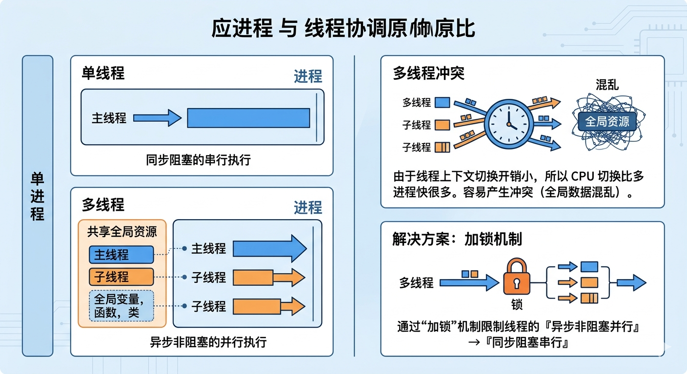

##### **多进程**

> 多进程协同工作：
>
> - 容易产生【**多进程冲突（多个进程之间抢占式调度 CPU 资源）**】问题
> - 于是，可以通过 **“加锁”** 的机制限制多进程的 **（无序）『异步非阻塞的并行执行』 → （有序）『同步阻塞的串行执行』**

- **单线程**：CPU 会在内存空间中**创建多个进程（主进程 + 子进程），多个进程内创建一个线程（主线程）【同步阻塞的串行执行】**

  - **主进程 &  主线程**：统筹管理其他多个子进程 与 子线程 的任务执行
  - **子进程 &  子线程**：负责执行具体的任务【**进程 ≈ 线程**】

  > 【多进程 &  单线程】由于一个进程只有一个线程，相当于把整体任务都分配给了进程，只是让线程去 CPU 调度而已；
  >
  > 所以在代码层面上， CPU 实际上切换的还是进程上下文，开销成本极高

- **多线程**：CPU 会在内存空间中**创建多个进程、多个进程（主进程 + 子进程）内创建多个线程（主线程 + 其他子线程）【异步非阻塞的并发执行】**

  - **主进程 &  主线程**：统筹管理其他多个子进程 与 子线程 的任务执行

  - **子进程 &  子线程**：负责执行具体的任务【**一个进程内包含（线程A、线程B、线程C...）**】

    - **多个线程共享同一进程内的全局资源（全局变量、函数、类....）**

    - 在运行期间，由于**线程上下文切换开销小**，所以 CPU 切换会比多进程快很多，从而容易产生**【多线程冲突】问题**（CPU 高频**切换线程导致进程内的共享全局资源数据混乱**）；

      > 多个线程由于共享了进程的堆内存、全局变量，当 CPU 高频切换时，如果线程 A 代码没执行完就被切走，线程 B 进来改了同一个变量，就会导致**数据脏读/写冲突**。这就是“多线程冲突”的底层诱因。

    - 于是，可以通过 **“加锁”** 的机制限制多线程的 **无序的『异步非阻塞的并发执行』→ 有序的『同步阻塞的串行执行』**

  > 对比：
  >
  > - **【多进程 &  单线程】**是把**一整个功能任务分配给一个进程去执行**，故 CPU 切换开销成本极高
  >
  > - **【多进程 &  多线程】**是把**一个功能集合分配**到一个**进程**中，**进程**再把**具体子功能按【颗粒度】拆解分配到各个独立的子线程中**
  >
  >   - 当 CPU 执行到进程时，让多个子线程去竞争 CPU 资源，且多个线程共享同一进程内的全局资源，所以可以高效、高可用地完成一个功能任务
  >
  >   在现代架构中：
  >
  >   - **进程（Process）** 变成了 **“资源分配和安全隔离”** 的边界。
  >   - **线程（Thread）** 变成了 **“极高颗粒度的、纯粹的 CPU 执行流”**。

  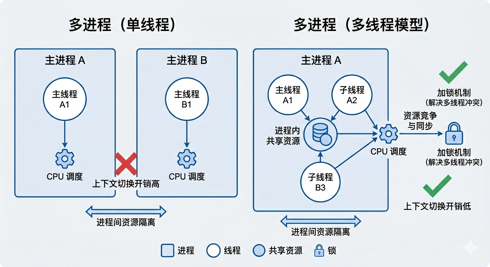

###### 综合对比

| **维度**         | **多进程协同（每个进程单线程）**           | **单进程 + 多线程协同**                      |
| ---------------- | ------------------------------------------ | -------------------------------------------- |
| **资源分配单位** | 每个进程独立分配（虚拟内存、文件句柄）     | 线程不拥有资源，共享所属进程的资源           |
| **CPU 切换开销** | **极高**（需要切换内存页表、寄存器状态）   | **极小**（只需切换线程栈和寄存器）           |
| **数据通信方式** | 必须依赖 IPC（管道、消息队列、Socket）     | 直接读写进程内的全局变量、堆内存             |
| **冲突风险**     | **进程冲突**（主要是抢占 CPU、文件句柄锁） | **线程冲突**（高频抢占全局变量导致数据混乱） |
| **锁的级别**     | 进程锁（OS 级别，开销大）                  | 线程锁（语言/线程库级别，开销小）            |
| **崩溃影响**     | 一个子进程崩了，不影响主进程（隔离性好）   | **一个线程崩了，整个进程直接挂掉**           |

##### 架构综合对比

| **模式**            | **结构（园区 -> 工厂 -> 工人）** | **核心特点与面临问题**                                       |
| ------------------- | -------------------------------- | ------------------------------------------------------------ |
| **单进程 - 单线程** | 1个工厂，1个工人                 | **串行执行**：工人干完A才能干B，效率低，遇到耗时操作全盘卡死（阻塞）。 |
| **单进程 - 多线程** | 1个工厂，多个工人                | **高效并发，但有冲突**：工人们共享仓库，高频切换。容易发生“多工人抢同一件工具”的冲突，需要**加锁（Lock）**来排队。 |
| **多进程 - 单线程** | 多个工厂，每个工厂1个工人        | **强隔离，高安全**：一个工厂倒闭（崩溃），不影响其他工厂。但建新工厂（创建进程）和工厂间运送物资（进程间通信 IPC）成本极高。 |
| **多进程 - 多线程** | 多个工厂，每个工厂多个工人       | **现代应用主流（高并发、高可用）**：多工厂利用多核CPU，厂内多工人压榨单核性能。 |

### Thread 线程类

> [!NOTE]
>
> 在 Python 中，创建并使用线程的方式有以下 3 种：
>
> - **使用 `Thread` 进程类**
> - **继承 `Thread` 线程类，实现一个自定义线程类**
> - **使用线程程池**

在 Python 中，可以通过内置的 **`threading` 模块**来进行线程的**创建、启动、销毁**等一系列操作。

`threading` 模块是 Python 中专门用于提供线程管理的内置模块，它提供了一个 **`Thread`** 类用于**创建、操作线程**。

> 注意：在 Python 中，进程与线程的使用方式高度一致，只是有个别地方有细微差异（模块不同、线程不可使用 Pipe 管道通信...）。

`Thread` 类是一个专门用于创建子线程的类，可在**当前 `.py` 文件**中**创建一个子线程实例**，并提供对应的**属性、方法**来**操作子进程**。

#### 创建一个线程实例

核心作用：**创建并返回一个线程实例，并指定该子线程所要执行的任务 `target`**。

##### 基本语法

```python
from threading import Thread

def <任务函数>(<位置参数1,...>,<关键字参数1,...>): pass

<线程实例> = Thread(
    group=None,
    target=<任务函数>,
    name=<线程名称>,
    args=<(函数位置参数1,..)>,
    kwargs=<函数关键字参数{key,value...}>,
    daemon,
    context= ContextVar[Any] | None = None
)
```

##### 参数

- **`group`**：**当前子线程的所属分组**；默认且始终为 `None`
- **`target`**：**当前子线程要执行的可调用对象（一般为任务函数）**；默认为 `None`
- **`name`**：**子线程名称**；默认为 `None`，**Python 内部会自动分配子线程名称 `Thread-[nums]`**
- **`args`**：**传递给 `target` 可调用对象**的**位置参数**（以 **`()` 元组**形式传入）
  - `(arg1,arg2,...)`：以位置顺序传递
- **`kwargs`**：**传递给 `target` 可调用对象**的**关键字参数**（以 **`{}` 字典**形式传入）
  - `{key:value}`：`key` 是 `target` 任务函数的某个关键字参数，`value` 是关键字参数值
- **`deamon`**：**标记该子线程是否为守护线程**。取值 `True/False`，默认为 `None`
  - **`True`**：标记该子进程为**守护线程**
  - **`False / None`**：表示**该子线程继承自创建它的当前主线程**
- **`context`**：**线程上下文对象**

##### 示例

```python
from threading import current_thread, Thread
from time import sleep

print('主线程 start')

# 任务函数
def task1(a, b, msg):
    # 当前线程： <Thread(Task-A, started 44008)>
    print('当前线程：', current_thread())
    print('位置参数：', a, b)  # 位置参数： 1 2 与 a b 一一对应，如果超过 3 个，则会覆盖 msg
    print('关键字参数：', msg)  # 关键字参数： hello 我是线程任务 A
    sleep(1)
    print('task1 done')


# Thread()  创建线程对象
p1 = Thread(target=task1, name="Task-A", args=(1, 2),
            kwargs={'msg': "hello 我是线程任务 A"})

# 启动线程
p1.start()

print('主线程 end')

'''
输出结果：【主线程 与 子线程 交替并发执行】
主线程 start
当前线程： <Thread(Task-A, started 36180)>
主线程 end
位置参数： 1 2
关键字参数： hello 我是线程任务 A
task1 done
'''
```

###### **`args` 位置参数** 与 **`kwargs` 关键字参数** 注意点

- **`args` 位置参数**必须与 `def` **任务函数定义的位置参数顺序、数量一一对应**，如果 **`kwargs` 显式传入了某个参数**，则它为**关键字参数**，那么**后面的便不再是位置参数**，**`args` 则不能超过位置参数的个数数量**，否则会报错。

#### 属性

##### name 线程名称

核心作用：

- 返回**当前线程的名称**
- **动态修改**当前线程的名称

```python
# 【同一进程内】（主线程【默认创建】 + 子线程【动态创建】）
from threading import Thread, current_thread


# 子线程A任务
def taskA():
    print('当前线程A：', current_thread(), current_thread().name)
    # 当前线程A： <Thread(Task-A, started 11536)> Task-A,

    current_thread().name = 'Thread-A'  # 修改进程名称

    print('当前线程A：', current_thread(), current_thread().name)
    # 当前线程A： <Thread(Thread-A, started 11536)> Thread-A


# 子线程B任务
def taskB():
    print('当前线程B：', current_thread(), current_thread().name)
    # 当前线程B： <Thread(Thread-B, started 40084)> Thread-B


if __name__ == '__main__':
    print('主线程名称：', current_thread(), current_thread().name)
    # 主线程名称： <_MainThread(MainThread, started 34576)> MainThread

    # 创建子线程A
    t1 = Thread(target=taskA, name="Task-A")
    # 创建子线程B
    t2 = Thread(target=taskB)
    t2.name = 'Thread-B'  # 修改线程名称

    t1.start()
    t2.start()

    t1.join()
    t2.join()
```

#### 方法

`Process` 类提供了一系列方法用于子线程的状态管理。

##### start() 启动线程

描述：在**使用 `Thread` 类的构造函数创建并返回一个线程实例**后，此时操作系统并**不会真的去创建该子线程**，而是**需要通过线程实例对象提供的 `start()` 方法来启动子线程**；

核心作用：**当 `<子线程实例对象>.start()` 方法执行**后，Python 会**立即向系统内核申请创建一个内存中的线程**，并**为其分配 CPU 指针、内存空间等资源**，同时**会将该子线程交给操作系统去异步调度**。

###### 基本语法

```python
from threading import Thread

def <任务函数>(): pass

if __name__ == '__main__':
	<线程实例> = Thread(group=None,target=<任务函数>,name,args,kwargs,daemon) # 这只是代码层面的线程对象
    
    <线程实例>.start() # 真实的创建系统线程实例，Python 会向操作系统申请创建线程，并分配CPU、内存资源
```

注意：多线程是**并发交替执行**的，且主线程与子线程之间**互不影响**。（**主线程，子线程交替并发执行**）

###### 示例

```python
from threading import Thread, current_thread, get_native_id
import os
import time


# 任务函数1
def task1():
    print("子线程A start--", current_thread())
    print("子线程A id:", get_native_id(), '所属进程 pid：', os.getpid())
    for i in range(3):
        print("子线程A:", i)
        time.sleep(0.5)
    print("子线程A end")


# 任务函数2
def task2():
    print("子线程B start--", current_thread())
    print("子线程B id:", get_native_id(), '所属进程 pid：', os.getpid())
    for i in range(3):
        print("子线程B:", i)
        time.sleep(0.5)
    print("子线程B end")


# 入口函数（主线程）
if __name__ == '__main__':
    print("主线程 id:", get_native_id(), '所属进程 pid：', os.getpid())
    print("主线程 start--", current_thread())

    # 创建子线程A
    p1 = Thread(target=task1)

    # 创建子线程B
    p2 = Thread(target=task2)

    # 启动子线程A
    p1.start()

    # 启动子线程B
    p2.start()

    print('主线程 end')

'''
输出结果：
主线程 id: 28024 所属进程 pid： 41144
主线程 start-- <_MainThread(MainThread, started 28024)>

子线程A start-- <Thread(Thread-1 (task1), started 44488)>
子线程A id: 44488 所属进程 pid： 41144

子线程B start-- <Thread(Thread-2 (task2), started 30196)>

子线程A: 0
子线程B id: 30196 所属进程 pid： 41144

主线程 end

子线程B: 0
子线程A: 1
子线程B: 1
子线程A: 2
子线程B: 2

子线程A end
子线程B end
'''
```

###### 执行流程

1. **主线程**先执行到 `p1.start()` 和 `p2.start()`，之后立即打印 `主线程 end`，**不会等待**子线程结束。
2. 两个子线程创建后并发执行，**交替打印**，由操作系统调度决定顺序。
3. 主线程结束后，子线程继续运行，直到各自任务完成。

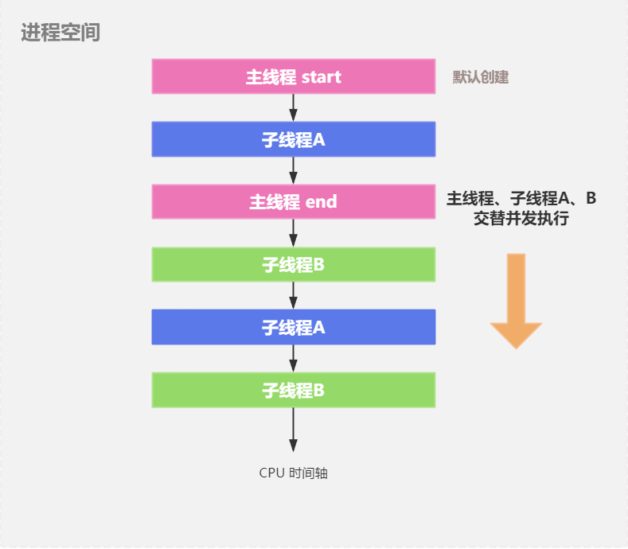

##### join() 主线程等待子线程完成

> [!NOTE]
>
> 在默认情况下，Python 中的多线程架构是异步机制的并发交替执行。
>
> - **主线程【同步非阻塞的串行执行】**：主线程在启动子线程后并**不会“停下来”等待子线程的创建/执行**，而是**继续执行自己的代码**
> - **子线程【异步非阻塞的并发交替执行】**。子线程**由操作系统调度**，在不同的 CPU 核心或时间片上交替运行。
>
> 

###### 基本概念

描述：在 Python 的多线程编程中，默认情况下，**当前主线程创建子线程实例并调用 `start()` 方法启动子线程**后，**不会等待**子线程，而是**继续往下同步串行执行**。

- 核心作用：**阻塞当前主线程**，**直到调用 `join()` 方法的子线程执行完毕后，当前主线程才继续往下执行**。

| **特性**       | **不使用 join()**                          | **使用 join()**                                  |
| -------------- | ------------------------------------------ | ------------------------------------------------ |
| **主线程行为** | 启动子线程后，立即向下执行，先打印 `end`。 | 在 `join()` 处等待，子线程不执行完，主线程不走。 |
| **执行顺序**   | 主线程最先结束，子线程在后台交替。         | 主线程最后结束，确保拿到了子线程的结果。         |
| **层次关系**   | **异步并发**：主线程与子线程互不干扰。     | **同步阻塞**：主线程的进度依赖于子线程的完成。   |

###### 基本语法

```python
from threading import Thread

def <任务函数>(): pass

if __name__ == '__main__':
	<线程实例> = Thread(group=None,target=<任务函数>,name,args,kwargs,daemon) # 这只是代码层面的线程对象
    
    <线程实例>.start() # 真实的创建系统线程实例，Python 会向操作系统申请创建线程，并分配CPU、内存资源
    
    <线程实例>.join(timeout=<等待时长>) # 阻塞当前线程（主线程）的同步执行，主线程要先等待 <线程实例> 执行完才继续向下执行
```

参数：

- `join(timeout)`：**当前线程（主线程）的等待时长**。即**要让当前线程（主线程）等到 `timeout` 秒之后才开始往下执行**。

**触发条件**：**主线程执行到 `join()` 方法**时，**会停下来原地等待**，直到**子线程A 的逻辑全部执行完毕并退出**，**后续的代码中有关于子线程A 的相关操作都会失效**，因为子线程A 已经被**回收**了（**僵尸线程**）。

###### 核心本质

- 让**主线程与子线程『异步非阻塞』的『并行/并发』执行（无序） → 主线程与子线程『同步阻塞』的『串行』执行（有序）**。

> [!NOTE]
>
> - **异步非阻塞（不使用 `join`）**：主线程和子线程同时推进，主线程不等子线程。
>
>   ```
>   主线程 ───► 启动子线程 ───► 继续做自己的事 ─────────────► 结束
>                  │
>                  ▼
>   子线程         ─────────────► 独立做自己的事 ───► 结束
>   ```
>
> - **同步阻塞（使用 `join`）**：主线程在 `join` 处挂起，直到子线程收尾，主线程才继续。
>
>   ```
>   主线程 ───► 启动子线程 ───► [ join() 阻塞中... ] ───────► 继续执行 ───► 结束
>                  │                     ▲
>                  ▼                     │ (子线程结束)
>   子线程         ──────────────────────┘
>   ```

###### 注意点

- `join()` 方法必须**放在 `start()` 方法后面执行**

  否则会报错（`join()` 方法的本质是等待线程任务执行完，但是压根就没有调用 `start()` 开启线程任务）

- **调用 `join()` 方法的子线程任务**内一定**不要写死循环（必须要有跳出条件）**！否则**主线程会一直阻塞等待**

```python
from threading import Thread

def task():
    count = 0
    while True: # 避免写死循环，一定要有跳出条件 break
        print('task')
        count += 1
        if count > 10:
            break

if __name__ == '__main__':
    p1 = Thread(target=task)
    
    # p1.join() # 报错
    p1.start()
    
    # 必须写在 start() 方法后面
    p1.join()
```

###### 示例

描述：在多线程架构中，多个线程的`join()` 与 `start()` 方法的声明顺序会极大影响最终的执行结果。

核心要点：**主线程遇到 `join()` 方法执行正常同步执行，遇到 `join()` 方法之后进入阻塞状态，中止后续的代码执行**。

- 当前线程（主线程）创建了多个线程A、B，并且**所有线程都先统一调用了 `start()` 方法，后统一调用的 `join()` 方法**

  执行逻辑：**主线程先执行 → 子线程A、B 先后启动执行 →『子线程A、B交替执行』→ 子线程A、B 先后结束 → 主线程结束**  

  ```python
  from threading import Thread
  import time
  
  
  # 子线程A 的任务函数
  def task1():
      print('子线程A start')
      for _ in range(3):
          print('----子线程A----')
          time.sleep(0.5)
      print('子线程A end')
  
  
  # 子线程B 的任务函数
  def task2():
      print('子线程B start')
      for _ in range(3):
          print('----子线程B----')
          time.sleep(0.5)
      print('子线程B end')
  
  
  # 主线程（同步的串行执行）
  if __name__ == '__main__':
      print('主线程 start')
  
      # 创建子线程
      t1 = Thread(target=task1)
      t2 = Thread(target=task2)
  
      # 启动子线程（异步的并发交替执行）
      t1.start()
      t2.start()
  
      # 当前线程（主线程）等待子线程t1执行完毕
      t1.join()
  
      # 当前线程（主线程）等待子线程t2执行完毕
      t2.join()
  
      print('主线程 end')
  
  '''
  输出结果：
  主线程 start
  
  子线程A start
  子线程B start
  
  ----子线程B----
  ----子线程A----
  ----子线程B----
  ----子线程A----
  ----子线程A----
  ----子线程B----
  
  子线程B end
  子线程A end
  
  主线程 end
  '''
  ```

  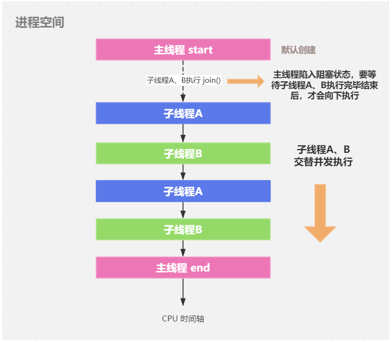

- 当前线程（主线程）创建了多个线程A、B，但是**线程A 先调用了 `start()` 和`join()` 方法，后面才调用的线程B `start()` 方法**

  执行逻辑：**主线程先执行 → 『子线程A 启动执行 → 子线程A 结束』 → 『子线程B 启动执行 → 子线程B 结束』  → 主线程结束**  

  核心原因：**当前线程（主线程）遇到了线程A 的 `start()` 和 `join()` 方法**，会进入**阻塞**状态，**中断后续的代码执行，直到线程A 任务执行完毕**，当前线程（主线程）才会**继续往下读取执行线程B 的 `start()` 方法，线程B 随后才启动执行**。

  ```python
  from threading import Thread
  import time
  
  
  # 子线程A 的任务函数
  def task1():
      print('子线程A start')
      for _ in range(3):
          print('----子线程A----')
          time.sleep(0.5)
      print('子线程A end')
  
  
  # 子线程B 的任务函数
  def task2():
      print('子线程B start')
      for _ in range(3):
          print('----子线程B----')
          time.sleep(0.5)
      print('子线程B end')
  
  
  # 主线程（同步的串行执行）
  if __name__ == '__main__':
      print('主线程 start')
  
      # 创建子线程
      t1 = Thread(target=task1)
      t2 = Thread(target=task2)
  
      # 启动子线程（异步的并发交替执行）
      t1.start()
      # 当前线程（主线程）等待子线程t1执行完毕
      t1.join()
  
      t2.start()
      # 当前线程（主线程）等待子线程t2执行完毕
      t2.join()
  
      print('主线程 end')
  
  '''
  输出结果：
  主线程 start
  
  子线程A start
  ----子线程A----
  ----子线程A----
  ----子线程A----
  子线程A end
  
  子线程B start
  ----子线程B----
  ----子线程B----
  ----子线程B----
  子线程B end
  
  主线程 end
  '''
  ```

  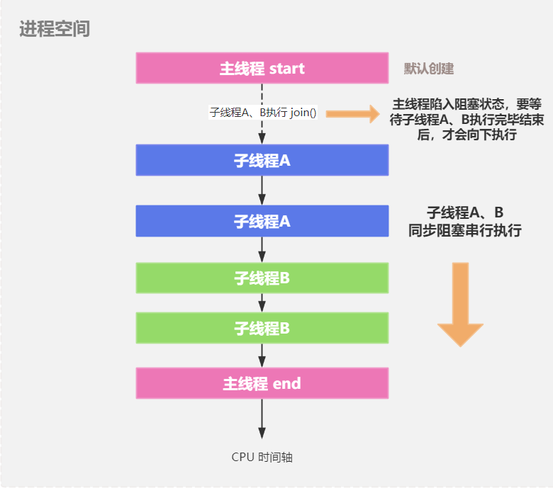


###### 为什么要用 `join()`？

1. **数据依赖**：如果主线程需要用到子线程计算出来的结果
2. **顺序控制**：确保某些清理工作（如关闭数据库连接）在所有任务完成后才进行
3. **防止孤儿线程**：确保所有子线程都被正确回收

##### is_alive() 线程状态

作用：**检测当前子线程是否为 “活跃” 状态**。

返回值：

- **`True`** ：表示**当前子线程**为 **“活跃” 状态（就绪态、运行态）**
- **`False`**：表示**当前子线程**为 **“死亡” 状态**，即**已经被主线程回收**

```python
from multiprocessing import Process, current_process


def run(name):
    print('当前子线程的状态：', current_process().is_alive())  # 当前子线程p1的状态： True
    print('hello', name)


if __name__ == '__main__':
    p1 = Process(target=run, args=('bob',))
    p1.start()

    print('子线程p1的状态：', p1.is_alive())  # 子线程p1的状态： True（就绪态、运行态）

    p1.join()  # 阻塞主线程，等待子线程p1执行完毕

    # 此时 子线程p1已经执行完毕，已经被主线程回收，状态为False
    print('子线程p1的状态：', p1.is_alive())  # 子线程p1的状态： False
```

- **`join()` 方法的触发条件**：**主线程执行到 `join()` 方法**时，**会停下来原地等待**，直到**子线程A 的逻辑全部执行完毕并退出**，**后续的代码中有关于子线程A 的相关操作都会失效**，因为子线程A 已经被**回收**了（**僵尸线程**）。

#### current_thread() 获取当前线程信息

作用：**获取当前线程信息**。

- **主线程**：进程**默认创建**一个主线程，线程名称为 **`MainThread`**，所属类为 **`<_MainThread>`**
- **子线程**：进程**动态创建**多个子线程；线程名称自动分配为 **`Thread-[nums]`**，所属类为 **`<Thread>`**

作用域：**每个子线程的任务函数**内

```python
# 【同一进程内】（主线程【默认创建】 + 子线程【动态创建】）
from threading import Thread, current_thread
import os


# 子线程A任务
def taskA():
    print('子线程A：', current_thread(), '所属进程 PID：', os.getpid())


# 子线程B任务
def taskB():
    print('子线程B：', current_thread(), '所属进程 PID：', os.getpid())


if __name__ == '__main__':
    print('主线程 start', '主线程：', current_thread(), '所属进程 PID：', os.getpid())

    # 创建子线程A
    Thread(target=taskA).start()
    # 创建子线程B
    Thread(target=taskB).start()

    print('主线程 end')


'''
输出结果：
主线程 start
主线程： <_MainThread(MainThread, started 19820)> 所属进程 PID： 19656
子线程A： <Thread(Thread-1 (taskA), started 22488)> 所属进程 PID： 19656
子线程B： <Thread(Thread-2 (taskB), started 46564)> 所属进程 PID： 19656
主线程 end
'''
```

#### get_native_id() 获取当前线程 ID

核心定义：每个**线程**都有自己**独立的虚拟内存空间**，主要包含了**（线程ID、栈、寄存器...）等关键信息**。

核心作用：获取**当前线程的 TID**。

```python
from threading import Thread, get_native_id
import os

# 任务函数1
def task1():
    print("子线程A id:", get_native_id(), '所属进程 pid：', os.getpid())

# 入口函数（主线程）
if __name__ == '__main__':
    print("主线程 id:", get_native_id(), '所属进程 pid：', os.getpid())

    # 创建子线程A
    p1 = Thread(target=task1)

    # 启动子线程A
    p1.start()

'''
输出结果：
主线程 id: 28024 所属进程 pid： 41144

子线程A id: 44488 所属进程 pid： 41144
'''
```

#### 线程上下文

在 Python 多线程编程中，**每个线程都有自己独立的一份虚拟内存空间**，且线程之间互不影响。

有以下几种方式实现：

##### threading.local() 线程局部数据

`threading` 模块提供了一个 `local()` 函数，该函数是 Python 中用于创建**线程局部数据**的工具。

核心定义：`threading.local()` 函数会返回一个**对象容器**，用来给**同一进程内的所有线程共享访问**；但**每个线程对该数据的访问**都是**独立的，互不干扰**。

核心特性：

1. **数据隔离**：每个线程通过 `threading.local()` 拥有独立的存储空间
2. **无需全局锁**：因为是线程私有，不需要同步机制

注意事项：

1. **内存泄漏风险**：线程结束时，local 数据不会自动清理（如果线程池复用）

   ```python
   import threading
   
   local_data = threading.local()
   
   # 解决方案：通过使用 try-finally 主动清理
   def good_worker():
       local_data.cached_data = expensive_operation()
       try:
           # 使用 local_data.cached_data
           pass
       finally:
           del local_data.cached_data  # 显式删除
   ```

2. **不能跨线程共享**：数据只对设置它的线程可见

3. **性能考虑**：比普通属性访问稍慢，但避免了锁竞争

**总结**：`threading.local()` 是线程安全的，无需加锁，**适合存储线程专有数据**（如请求上下文、数据库连接、用户会话等），但要小心线程池场景下的内存泄漏问题。


###### 示例

```python
import threading
import time

# 创建全局的 thread local 对象
local_data = threading.local()

def worker(name):
    # 为当前线程设置属性
    local_data.value = name
    time.sleep(0.1)
    # 每个线程读取自己的值
    print(f"{threading.current_thread().name}: {local_data.value}")

# 创建多个线程
threads = []
for i in range(5):
    t = threading.Thread(target=worker, args=(f"Value-{i}",))
    threads.append(t)
    t.start()

for t in threads:
    t.join()

# 输出示例（每个线程看到自己的值）：
# Thread-1: Value-0
# Thread-2: Value-1
# Thread-3: Value-2
# Thread-4: Value-3
# Thread-5: Value-4
```

##### contextvars.ContextVar 类

在 Python 3.7+ 中，可以使用 **`contextvar` 模块的 `ContextVar` 类**来替代实现，它更现代。

###### 基本语法

```python
from contextvars import ContextVar

<线程上下文对象> = ContextVar(<key>, default=None)

def worker():
    user_id.set("user-123")
    # 异步代码中也保持上下文
```

核心要点：以 **`{key:value}` 键值对**的形式**存储线程上下文局部数据**。

参数：

- **`key`：每个线程的上下文局部数据 `key` 键，通过 `set()` 方法存储 `value` 值**

- **`default`：`key` 键的默认值**，默认为 `None`

  ```python
  # 线程上下文
  from threading import Thread
  from contextvars import ContextVar
  
  # 创建一个线程上下文对象（多个线程共享，但多个线程之间独立访问）
  ctx = ContextVar('ctx', default='main')
  
  
  def task():
      print(ctx.get())
  
  
  t = Thread(target=task)
  t.start()
  t.join()
  ```

###### 读取方法

- **`set(data)`**：为**当前线程保存一份 `data` 局部数据**
- **`get()`**：**提取**出当前**线程通过 `set()` 保存的局部数据**

###### 示例

```python
import threading
from contextvars import ContextVar
from typing import Any

# 创建一个线程上下文对象（多个线程共享，但多个线程之间独立访问，各自拥有一份 local 局部数据表）
local: ContextVar[Any] = ContextVar('thread-name', default=None)


# 定义一个函数，用于模拟线程执行的任务
def task(name):
    # 将线程名保存到线程局部变量中
    local.set(name)
    # 模拟线程执行的任务
    for i in range(5):
        print(f'Thread {local.get()} is running') # 取出数据


# 创建多个线程，并执行任务
threads = []
for i in range(5):
    t = threading.Thread(target=task, args=(f'Thread-{i}',))
    threads.append(t)
    t.start()

# 等待所有线程执行完毕
for t in threads:
    t.join()

# 输出示例（每个线程看到自己的值）：
# Thread-1: Value-0
# Thread-2: Value-1
# Thread-3: Value-2
# Thread-4: Value-3
# Thread-5: Value-4
```

### 守护线程（Daemon Thread）

与守护进程概念写法一致

### RLock互斥锁类

Python 的多线程编码，使用 **`threading.RLock`** 类进行**互斥锁**的应用。

```python
from threading import Thread, RLock


# 任务函数1
def task1(lock):
    lock.acquire()
    print("task1 start")
    print("task1 end")
    lock.release()


# 任务函数2
def task2(lock):
    with lock:
        print("task2 start")
        print("task2 end")


# 创建锁对象
lock = RLock()

# 创建线程对象
t1 = Thread(target=task1, args=(lock,))
t2 = Thread(target=task2, args=(lock,))

# 启动线程
t1.start()
t2.start()

# 等待线程结束
t1.join()
t2.join()

'''
输出结果：
task1 start
task1 end
task2 start
task2 end
'''
```

### 线程之间的通信

在 Python 的多线程编码中，多线程之间的通信除了 Pipe（管道）不可用之外，其他（Queue 队列、Event 事件...）都可以。

#### queue.Queue 消息队列

在 Python 的多线程编码中，使用 **`queue.Queue`** 类进行**消息队列 MQ**的应用。

- **`queue.Queue`：多线程之间的同步通信**

  > **特点：** 它是**线程安全**的。这意味着**多个线程可以同时向里面放数据或取数据**，而不会导致数据错乱。
  >
  > **核心功能：**
  >
  > - **`put()`: 放入数据**；如果**队列满了，线程会阻塞等待**
  > - **`get()`: 取出数据**；如果**队列空了，线程会阻塞等待**
  >
  > **场景：** 经典的**“生产者-消费者”**模型。

##### 多线程通信示例

- 线程A：写入数据
- 线程B：读取数据
- RLock 锁：为了防止多线程冲突，导致数据原子性不一致，输出结果混乱，需使用锁来限制多线程之间的执行流程（**同步串行执行**）
- Queue 队列容器：多线程之间通信的队列容器
- 全局变量：多线程之间共享的同一进程内资源

```python
# 利用多线程同步并行执行的方式，实现一个简单的多线程通信案例
from threading import Thread, RLock
from queue import Queue
import time
from typing import Any


# 进程内的全局变量（多线程共享资源）
names = ['Tom', 'Jerry', 'Alice', 'Bob', 'Cindy']


# 线程A -- 写入 Queue 队列数据
def write_task(lock, queue):
    with lock:
        global names  # 线程任务函数内使用全局变量
        for name in names:
            queue.put(name)
            print(f'写入数据 {name}')
            time.sleep(1)


# 线程B -- 读取 Queue 队列数据
def read_task(lock, queue):
    with lock:
        global names  # 线程任务函数内使用全局变量
        for _ in range(len(names)):
            print(f'读取数据 {queue.get()}')
            time.sleep(1)


if __name__ == '__main__':
    lock = RLock()  # 创建一个锁

    num = 5  # 队列的固定长度

    queue: Queue[Any] = Queue(5)  # 创建一个线程间共享的固定长度队列

    # 创建两个线程
    p1 = Thread(target=write_task, args=(lock, queue))
    p2 = Thread(target=read_task, args=(lock, queue))

    # 启动两个线程
    p1.start()
    p2.start()

    # 等待两个线程执行完毕
    p1.join()
    p2.join()

'''
输出结果：
写入数据 Tom
写入数据 Jerry
写入数据 Alice
写入数据 Bob
写入数据 Cindy
读取数据 Tom
读取数据 Jerry
读取数据 Alice
读取数据 Bob
读取数据 Cindy
'''
```

### 自定义线程类（继承 Thread）

#### 基本概念

在 Python 中，支持通过**继承 `threading.Thread` 类来自定义一个线程类**，以 **OOP 面向对象编程**的形式来编写**多线程**应用。

> 前面的都是**函数式编程**的写法

核心价值：通过继承，可以将**线程的行为封装在一个类中**，使代码更加**模块化**和**可重用**。

| 优点         | 说明                                   |
| :----------- | :------------------------------------- |
| **封装性**   | 将线程逻辑和数据封装在一个类中         |
| **可重用**   | 可以多次实例化，创建多个相同类型的线程 |
| **状态管理** | 通过实例变量方便地管理线程状态         |
| **代码组织** | 比直接传递 target 函数更结构化         |

#### 核心步骤

核心步骤只有两步：

1. **重写 `__init__` 方法（可选）**：用于传递**子线程需要的参数**，**务必先调用 `super().__init__()`**
2. **重写 `run` 方法（必选）**：这是子进程启动后**真正执行的核心逻辑（子线程的执行任务）**

```python
from threading import Thread

class MyThread(Thread):  # 1. 继承 Thread 类
    def __init__(self, name):
        super().__init__()  # 2. 调用父类初始化（必须）
        self.name = name # MyThread 子进程实例属性
    
    def run(self):          # 3. 重写 run 方法（核心）
        # MyThread 子程实例要执行的代码
        pass
```

- `MyThread` 子线程类通过**继承**会**自动获得**父线程类 Thread 的所有功能（如 `start()`、`join()` 等）

##### 重写 run() 抽象方法

`Thread` 类本身有一个 **`run()` 抽象方法**，子类要想通过继承 `Thread` 类来自定义一个线程类，**必须重写 `run()` 方法**。

核心作用：表示**子线程要执行**的**任务函数**。

```python
from threading import Thread


class MyThread(Thread):

    def run(self):
        for i in range(5):
            print("子线程执行中... %d" % i)


if __name__ == '__main__':
    print("主线程start")

    thread = MyThread()
    thread.start()  # 自定义线程类实例必须调用start方法启动线程，它内部会自动调用run方法
    thread.run()  # 报错：RuntimeError: cannot join thread before it is started
    thread.join()

    print('主线程 end')

'''
输出结果：
主线程start
子线程执行中... 0
子线程执行中... 1
子线程执行中... 2
子线程执行中... 3
子线程执行中... 4
主线程 end
'''
```

注意：**不要**直接调用 `run()` 方法，应该调用 `start()`。

###### 底层工作原理

```
创建子线程实例 → 调用 start() → 启动新线程 → 自动执行 run() → 线程结束
```

##### 重写 \__init__() 构造方法

> 这是可选的

核心概念：如果**子线程类需要外部传入一些参数**（`RLock` 锁、`Pipe` 管道 | `Queue`队列...），则需要**显式重写 `__init__()` 魔术方法**。

核心要点：子类重写 `__init__()` 方法时，**必须显式编写 `super().__init__()` 调用父类 `Process` 的构造方法**，否则**无法获取到 `start()`、`join()` 等内置方法**。

> 注：实例变量在线程间是**独立**的（每个线程有自己的副本）

```python
from threading import Thread, RLock

class MyThread(Thread):

    # 重写 __init__ 方法，可以接收外部传入的参数
    def __init__(self, lock, queue, **kwargs):
        super().__init__(**kwargs)  # 必须调用父类的构造方法
        self.lock = lock
        self.queue = queue

    # 重写 run 方法（任务函数）
    def run(self): pass

if __name__ == '__main__':
    lock = RLock()
    queue = Queue()
    
    my_thread = MyThread(lock=lock, queue=queue)
    my_thread.start()
    my_thread.join()
```

###### 示例

```python
import threading
import time

class MyThread(threading.Thread):
    def __init__(self, name, delay):
        super().__init__()
        self.name = name
        self.delay = delay
    
    def run(self):
        """重写 run 方法"""
        for i in range(3):
            print(f"线程 {self.name} 执行第 {i+1} 次")
            time.sleep(self.delay)

# 使用自定义线程类
t1 = MyThread("A", 1)
t2 = MyThread("B", 1.5)
t1.start()
t2.start()
t1.join()
t2.join()
```

#### 与函数式编程方式的对比

- **函数式编程方式**：适合**简单**任务
- **面向对象编程方式**：适合需要状态管理、代码组织性强、功能高复用的**复杂**任务

```python
# 函数方式（简单任务）
def task(name):
    print(f"Running {name}")

p = Thread(target=task, args=("Worker",))
# ...

# 继承方式（复杂任务，需要状态管理）
class Worker(Thread):
    def __init__(self, name, data):
        super().__init__()
        self.name = name
        self.data = data  # 可以保存状态
    
    def run(self):
        # 可以定义多个辅助方法
        self.init_resources()
        self.do_work()
        self.cleanup()

w = Worker('Jack', {'age': 18})
# ...
```

### Timer 延迟线程

`threading` 模块提供了一个 `Timer` 线程类，它可以用来做一个**定时器线程**。

核心定义：`Timer` 是一个线程类，可以用来**延迟 `n` 秒后执行一个任务函数**。

```python
# 延迟线程
from threading import Timer


# Timer 是一个线程类，可以用来延迟执行一个任务函数
def task():
    print('hello')


t = Timer(3, task)
t.start()  # 3秒后执行task函数
```

#### cancel() 取消任务

核心定义：如果 `Timer` 类创建的线程延迟时间过长，可以通过 `cancel()` 方法来取消延迟线程的执行。

核心作用：**可以在等待的过程中取消线程任务**。

```python
import threading
import time


def process_data():
    # 模拟耗时操作
    time.sleep(3)
    print("数据处理完成")


def timeout_handler():
    print("操作超时！")


# 设置2秒超时
timer = threading.Timer(2, timeout_handler)
timer.start()

process_data()
timer.cancel()  # 如果任务提前完成，取消超时提示
print("正常完成")


'''
操作超时！
数据处理完成
正常完成
'''
```

### 线程池

### 注意事项

1. **GIL限制**：Python的全局解释器锁(GIL)意味着多线程并不适合CPU密集型任务，但非常适合I/O密集型任务。
2. **线程安全**：
   - 使用锁保护共享资源
   - 避免死锁
   - 使用`threading.local()`处理线程局部数据
3. **替代方案**：
   - CPU密集型：使用`multiprocessing`模块【多进程】
   - I/O密集型：使用`asyncio`或线程池
4. **最佳实践**：
   - 使用`ThreadPoolExecutor`管理线程池
   - 使用`with`语句管理锁
   - 避免在多个线程中频繁修改共享数据

### 使用场景

- 多线程下载器：

  ```python
  import threading
  import requests
  import time
  
  class Downloader:
      def __init__(self, urls, max_workers=3):
          self.urls = urls
          self.results = {}
          self.lock = threading.Lock()
          self.max_workers = max_workers
      
      def download(self, url):
          """下载单个文件"""
          try:
              response = requests.get(url, timeout=10)
              with self.lock:
                  self.results[url] = {
                      'status': response.status_code,
                      'size': len(response.content),
                      'success': response.status_code == 200
                  }
              print(f"下载完成: {url}")
          except Exception as e:
              with self.lock:
                  self.results[url] = {'error': str(e), 'success': False}
              print(f"下载失败: {url} - {e}")
      
      def start(self):
          """启动下载"""
          threads = []
          
          # 创建线程池
          for url in self.urls:
              while len(threads) >= self.max_workers:
                  # 清理已完成的线程
                  threads = [t for t in threads if t.is_alive()]
                  time.sleep(0.1)
              
              t = threading.Thread(target=self.download, args=(url,))
              threads.append(t)
              t.start()
          
          # 等待所有线程完成
          for t in threads:
              t.join()
          
          return self.results
  
  # 使用示例
  urls = [
      "https://httpbin.org/get",
      "https://httpbin.org/ip",
      "https://httpbin.org/user-agent"
  ]
  
  downloader = Downloader(urls, max_workers=2)
  results = downloader.start()
  
  for url, result in results.items():
      print(f"{url}: {result}")
  ```

## 线程池（concurrent.futures 模块）

线程池与进程池的 API（`submit`、`map`、`shutdown`...）、底层原理几乎一模一样，两者共享同一套高级抽象。

但是，由于 Python 底层机制的不同，线程池和进程池在**核心原理、适用场景和数据行为**上有着本质的区别。

### ThreadPoolExecutor 进程池类

`Process` 类是一个专门用于创建子线程的类，可在**当前 `.py` 文件**中**创建一个子线程实例**，并提供对应的**属性、方法**来**操作子线程**。

Python 官方推荐使用 **`concurrent.futures.ProcessPoolExecutor`** 类来实现进程池，它比旧的 `multidistribution.Pool` 更加现代且易用。

#### 基本语法

```python
from concurrent.futures import ThreadPoolExecutor 

# 多个工作线程协同执行的任务函数
def <任务函数>(<任务函数参数>):
    # 任务函数体...
    
    
# 主进程（主管）
if __name__ == '__main__':
    # 创建线程池
    <线程池实例> = ThreadPoolExecutor(max_workers=<工作线程数量>)  # 进程池内预设 max_workers 个数量的工作线程
	
    # 提交任务
    <线程池实例>.submit(<任务函数>,<任务函数参数>)
    
    #...
```

参数：

- **`max_workers`：线程池要批量创建的工作线程个数。不指定 `max_workers` 时，默认使用 CPU 核心数**

核心作用：

1. **`ThreadPoolExecutor (max_workers)` 创建并返回一个具有 `max_workers` 个数量工作进程的线程池实例**
2. 内部建立并维护一个**任务队列（Task Queue）容器**，等待**后续通过 `submit()` 、`map()` 方法投递具体的【任务函数】**

#### 与进程池的区别

| **维度**          | **进程池 (ProcessPoolExecutor)**                             | **线程池 (ThreadPoolExecutor)**                              |
| ----------------- | ------------------------------------------------------------ | ------------------------------------------------------------ |
| **底层结构**      | 启动多个**独立的进程**，每个**进程有独立的内存空间和 CPython 解释器** | 在当前进程内启动多个**线程**，所有线程**共享同一块内存空间** |
| **受 GIL 锁影响** | ❌ **不受影响**。每个进程有**独立的 GIL 锁**，能真正榨干多核 CPU | **受影响**。所有**线程共用一把 GIL 锁**，任何时刻只有一个线程能运行 Python 字节码 |
| **最佳适用场景**  | **CPU 密集型（计算重）**：如科学计算、图像音视频处理、大文件解析 | **I/O 密集型（等待多）**：如网络爬虫、API 请求、数据库读写、文件分块下载 |
| **系统开销**      | **极大**。创建、切换进程很慢，内存占用高                     | **极小**。线程非常轻量，创建和切换速度极快                   |
| **数据通信成本**  | **高**。必须通过 `Pickle` 序列化跨进程传输，无法直接共享变量 | **无**。属于同一个进程，可以直接读写全局变量（但要注意线程安全） |

##### 数据共享差异

###### 进程池-内存隔离

- **进程间无法直接共享变量**。当把一个列表传给进程池时，Python 会把它**隐式复制一个副本**发给进程池。

```python
# 进程池伪代码
from concurrent.futures import ProcessPoolExecutor

g_list = []

def append_task(x):
    g_list.append(x)  # 修改的是子进程自己的独立副本！

if __name__ == '__main__':
    with ProcessPoolExecutor() as ex:
        ex.submit(append_task, 1)
    print(g_list)  # 依然输出 []，主进程的 g_list 根本没变！
```

###### 线程池：内存共享

- 所有线程都能直接**访问并修改主进程的全局变量**。

```python
# 线程池伪代码
from concurrent.futures import ThreadPoolExecutor

g_list = []

def append_task(x):
    g_list.append(x)  # 直接修改主进程内存中的同一个列表

with ThreadPoolExecutor() as ex:
    ex.submit(append_task, 1)
print(g_list)  # 输出 [1]，成功修改！
```

注意点： 内存共享是一把双刃剑。如果**多个线程同时去修改同一个复杂的变量**（比如高并发下写同一个字典或计数器），可能会导致**数据错乱（Race Condition）**，这时需要引入**线程锁（`threading.Lock`）**。

##### add_done_callbak(fn) 差异

###### 进程池

- **`add_done_callbak(fn)` 的调用者**是**当前进程（通常是「主进程」）**

###### 线程池

- **`add_done_callbak(fn)` 的调用者**是**当前子线程**

共同点：都可以在 `fn` 回调函数中**访问当前进程的全局成员（变量、函数、类...）**

##### 业务场景选型

- **CPU 计算密集型任务**：选择采用**进程池**实现【**多进程方案、绕开 GIL 锁限制、压榨多核 CPU 性能**】
- **I/O 密集型任务**：选择采用**线程池**实现【**多线程方案、更易懂、效率更高**】

#### 示例

```python
from concurrent.futures import ThreadPoolExecutor
from threading import current_thread, RLock
import os
import time

# 全局变量
global_var = 0


# 线程任务函数
def task(n, m, lock):
    print(
        f'线程任务 {n} - {m} --- 当前工作线程 {current_thread().name} - 所属进程 PID {os.getpid()}')

    # 访问与修改全局变量
    with lock:
        global global_var
        global_var += 1

    time.sleep(1)
    return n + m


if __name__ == '__main__':
    print('主进程 start')

    # 创建线程锁，防止多线程共享进程资源时（临界区）产生数据混乱问题（多线程冲突）
    lock = RLock()

    # 进入 with 代码块：自动调用 pool.__enter__()，即 pool = ProcessPoolExecutor()
    with ThreadPoolExecutor() as pool:
        futures = []
        for i in range(1, 5):
            future = pool.submit(task, i, 2, lock)
            futures.append(future)

        # 等待所有任务执行完毕
        results = [future.result() for future in futures]
        print('所有任务结果：', results)

    # 离开 with 代码块：自动调用 pool.shutdown(wait=True)
    print('主进程 end')

'''
输出结果：
主进程 start

线程任务 1 - 2 --- 当前工作线程 ThreadPoolExecutor-0_0 - 所属进程 PID 15200 
线程任务 2 - 2 --- 当前工作线程 ThreadPoolExecutor-0_1 - 所属进程 PID 15200 
线程任务 3 - 2 --- 当前工作线程 ThreadPoolExecutor-0_2 - 所属进程 PID 15200 
线程任务 4 - 2 --- 当前工作线程 ThreadPoolExecutor-0_3 - 所属进程 PID 15200 

所有任务结果： [3, 4, 5, 6]

主进程 end
'''
```

## GIL 全局解释器锁

**GIL（Global Interpreter Lock）全局解释器锁**是 Python **早期**为了**避免并发编程**中**因多线程冲突问题导致共享数据安全性被破坏**所产生的**历史遗留特性**。

- **GIL 锁**是 **CPython 解释器独有**的**一大特征**。（其他 Python 解释器（Pypy、Jython... 可能没有））

### 为什么会有 GIL 锁？（多线程冲突）

在**多线程**架构应用中，由于 **CPU “时间片轮转” 机制**，**多个线程在操作同一进程内的共享资源**时，存在**竟态条件**，可能会发生以下情况：

1. 假设进程中创建了 3 个线程A、B、C，它们都需要访问与操作同一进程内（`.py` 文件）的一个全局变量 `count`
2. 在线程A 的任务函数中，需要对全局变量`count` 进行修改赋值操作，如果在修改赋值的过程中所需耗时 >  CPU 给予线程的 “时间片” （可能涉及到阻塞的 I/O 操作），那么此时 CPU 会果断切换到另一个线程B、C 继续它们的任务进度
3. 但是线程B、C 也可能需要对全局变量`count` 进行修改赋值操作，也同样会面临阻塞的 I/O 操作，CPU 还是一如既往的照常切换到线程A 去恢复执行，这在 CPU 的视角上看来是正常的，但是在线程A、B、C 的视角上是毁灭性的
4. 如此往复，就可能存在**多线程冲突**的问题，即**多个线程访问、操作共享资源因任务被 CPU 强制中断而导致共享资源数据混乱**


> 形象比喻：
>
> 就好比多个学生在一起做同一道语文题，每个同学都有不同的解题思路（多线程访问操作进程内共享资源，各自执行不同的任务）：
>
> 在同学A 还在解题的过程中，可能还在写计算过程，并没有计算出正确结果（线程A 遇到阻塞操作），老师（CPU）突然就把 “试卷” 给拿走交给了同学B、C 去计算【线程A：？？？】（CPU “时间片轮转” 切换线程上下文调度）
>
> 结果同学B、C 的解题思路与同学A 完全不同，会按照它们的解题思路去重新写计算过程，而当 “时钟” 响了，老师（CPU）还是照常把 “试卷” 收走【这老师有病】，并重新交给同学A 去继续上次以他的解题思路去接着写【线程A、B、C：？？？】（恢复线程上下文，继续执行中断的任务进度）；
>
> 可能此时同学B、C 计算出了一个结果并写在了答题卡上，但是同学A 看到这个结果按照他的解题思路来说认为是错误的，就把答案给擦除了，开始写自己的答案...（多线程冲突导致数据混乱）
>
> 如此往复，导致了最后题目的结果数据完全是混乱不堪的（老师【CPU】负大责）
>
> 根本原因：*这个老师（CPU）是一个 “莫得感情的机器人”，它只知道看 “时钟”，时间到了就收试卷（在 CPU 的眼里，它只有 “执行指令”和“时间到了” 这两件事，它根本不关心你们这些线程在一起是要搞个大新闻，还是要 cooperative（协同工作））*
>
> 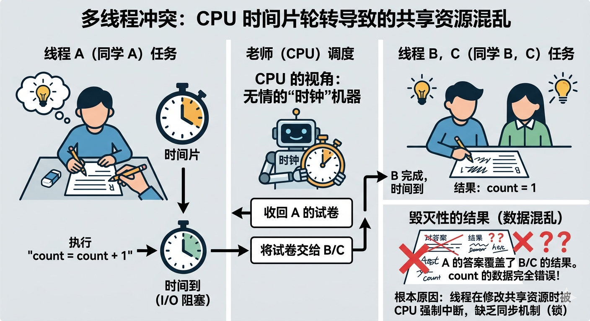

于是，为了解决这个**多线程冲突**问题，**CPython 解释器的早期版本**引入了 **GIL（Global Interpreter Lock）全局解释器锁** 的机制。

### 基本概念

核心定义：**无论 CPU 有多少个核心**，在**某一时刻，CPython 解释器**只允许进程中的**一个线程**去执行 Python 代码。

核心特点：

- **全局唯一**：**一个进程**内**只有一把 GIL 锁**，可**管理进程内所有线程**
- **互斥的**：在**某一时刻**，进程内只有**一个线程能持有 GIL 锁**；**其他线程**都会陷入**『阻塞状态』等待 GIL 锁的释放**

#### 核心机制

1. **CPython 解释器**会为**每个进程（`.py` 文件）**都**内置一把 GIL 全局 “互斥” 锁**
2. **GIL 锁**是位于 **CPU 核心指令** <与> **线程实体** 调度执行过程中的一个 **“中间层代理” **【**CPU 核心 → GIL 锁 ← 线程实体**】
3. 当进程内**启动了多个线程**并向系统申请分配 CPU 指令资源时，**GIL 锁**会**自动拦截**所有的**线程执行指令**；
4. GIL 锁强制规定：**仅持有了 GIL 锁**的**当前线程才允许被 CPU 执行**，其他线程纷纷陷入**『阻塞状态』**；等持有 GIL 锁的线程**释放锁**时，**其他线程**才能去**争抢这把 GIL 锁，并得到 CPU 执行权限**
5. 以此造成了在**某一时刻，进程内多个线程，始终只有一个线程在执行**的现象

总结：CPython 解释器中的多线程模型，本质上是**并发**，而不是**并行**（**快速切换，而非同时执行**）

> 如下图：虽然 CPU 有多个核心，但是同一时刻内，只有一个 CPU 核心在工作，其他的 CPU 核心都处于 **“空闲状态”**


> 形象比喻：
>
> 在 Python 中，GIL 就像是班里一个**脾气更怪的“大班长”**。
>
> - 老师（CPU）虽然有多个（多核 CPU），可以同时让好几个同学写作业。
> - 但是大班长（GIL）规定：**不管老师怎么点名，全班同时只能有一个同学动笔。**

#### 何时释放 GIL 锁？

为了**避免**线程**长期占用 GIL 锁**的情况出现，CPython 解释器为 **GIL 锁** 和 **线程** 制定了如下规则：

- **主动释放**：

  当线程执行任务期间，如果**遇到了不需要 CPU 指令资源的操作**（如 IO 操作，仅面向磁盘），**线程**会**自动释放持有的 “GIL” 全局锁**给外部其他线程争取

- **被动释放**：**CPython 解释器**为 **GIL** 设置了一个 **“时间片”（通常是 0.002 秒）**

  当**持有 GIL 全局锁的线程**所执行的**任务超时**时，代表线程进入了一个漫长的执行阶段；此时，**CPython 解释器**会**强制释放当前线程对 GIL 锁的控制权**，并让其他线程来争取被释放出来的 GIL 锁

CPython 解释器内部会**实时监测**以上两种情况，并**自动进行干预处理**。


> 在 Python 中，可以通过 `sys` 模块来查看当前 Python 版本中，CPython 解释器设置的 “GIL” 全局锁时间片值：
>
> ```python
> import sys
> print(sys.getswitchinterval()) # 0.005 秒
> ```

#### 缺陷与限制

GIL 全局解释器锁虽然保证了多线程工作的数据安全，但是它本质上是**以【放弃多核 CPU性能】来换取 【多线程冲突的数据安全】**。

简单来说，尽管计算机的 CPU 可能有多个核心，由于 GIL 的限制，Python 程序中**始终都是一个 CPU 核心在工作**，这就造成了性能问题，所以 **Python 的多线程应用其实并不理想**。

> 【**一个 CPU 核心 > 一个锁 > 一个线程在工作**】

缺陷：导致 Python 的“多线程”**在多核 CPU 上无法实现真正的并行计算**。如果开了 4 个线程跑计算，它们其实是在轮流排队用 1 个核心，**比单线程还慢**。

### 解决方案（多进程）

描述：

​	GIL 全局解释器锁的存在**本质上**是**早期 Python** 为了**解决多线程冲突问题**而设计的，那时候大多都是单核 CPU；

​	到现如今现代计算机应用基本都是单 CPU 多核 / 多 CPU 多核，即**多进程、多线程**模型，所以为了**发挥计算机 CPU 多核的性能**，在面对 **CPU 计算密集型任务** 时可以选择**绕过 GIL**，使用**多进程**方案。

#### 多进程方案实现-底层原理

核心概念：

- CPython 解释器的 GIL 全局解释器锁只对**多线程**作出限制（**一个 CPU 核心 只能操作 一个线程**），以此避免多线程冲突问题
- CPython 解释器会给**每个进程都内置一个 GIL 全局解释器锁**

那么可以利用以上特性，选择**绕过 GIL 限制**：

1. 在内存中**创建多个进程**，**一个进程内创建一个线程对应一个 CPU 资源任务**
2. 利用 **多核 CPU 『并发+并行执行』**的特性，实现【**一个 CPU 核心 『操作』 一个进程（GIL 锁 > 一个线程任务）**】。

现象：在**同一时刻**，计算机中的**多核 CPU** 依次分别**分配一个核心 操作 一个进程内的线程任务**，以此实现**并行执行**的流程。

- 适用场景：需要**频繁使用 CPU 指令资源**的【**CPU 计算密集型**】任务

- 缺陷：由于**进程上下文切换开销很大**，对于性能消耗会有所提高；所以多进程方案的本质是【**以空间换时间**】。

  > 如下图：通过创建多个进程，让 CPU 的多个核心**并发并行**地调度进程内的线程任务，以此充分利用多核 CPU 的性能


**什么时候多线程有用？** 当程序在等网络请求、等文件读写时（**I/O 密集型【不需要 CPU 指令资源】**），线程切换能省时间，这时候 GIL 影响不大。

### 与 Lock/RLock 锁的关系

在 Python 中，一旦某个线程遇到了 **I/O 阻塞**（比如读写文件、网络请求、`time.sleep()`），GIL 锁就会主动释放出去。即使没有 I/O 阻塞，Python 解释器执行了一定数量的字节码后，也会强制释放 GIL。

所以，Python 的 GIL 只是不让利用多核 CPU 的性能，但**完全不能防止**多线程抢夺共享资源带来的数据混乱。在 Python 中写多线程，只要有共享变量的修改，依然得老老实实地用 `threading.Lock()` 锁。

注意：GIL 全局解释器锁 与 Lock/RLock 锁不是同一种东西。

#### 综合对比

| 对比维度     | GIL 全局解释器锁（互斥）                                     | Lock / RLock 互斥锁                                          |
| :----------- | ------------------------------------------------------------ | ------------------------------------------------------------ |
| **核心本质** | **解释器级别**的强制限制（**自动执行、强约束**）             | **代码级别**的逻辑约定（**手动执行、弱约束**）               |
| **控制者**   | **CPython 解释器**：自动加 GIL锁，遇到 IO 操作或 线程任务超时会自动释放 | **程序员**：需手动编写 `lock.acquire()` 和 `lock.relaease()` 方法限制 |
| **保护对象** | **保护 “解释器不崩溃”**，维护引用计数、垃圾回收底层结构的线程安全 | **保护 “程序数据不会出错”**，维护用户定义的变量、操作顺序等业务逻辑的完整性 |
| **作用范围** | **全局唯一**：一个进程只有一个 GIL 锁，管理所有线程          | **按需创建**：可创建 n 个 `Lock/RLock` 锁，分别保护 n 个不同的业务逻辑 |

## 多进程 &  多线程的使用场景

> [!NOTE]
>
> Python 任务的 “类型” 分为**【CPU 计算密集型】**和**【IO 密集型】**两种，可以根据不同的任务类型，选择**【多进程】**或**【多线程】**架构来实现业务场景的性能优化。
>
> - 【**CPU 计算密集型**】任务：适合**【多进程】**方案
>
>   通过**绕开 GIL 锁对 CPU 执行线程的限制**，提高对 **多核 CPU 的性能利用**（**创建多个进程，一个进程对应一个 CPU 核心，完成进程内的线程任务）。【以空间换时间】**
>
> - 【**I/O 密集型**】任务：适合**【多线程 |  多协程】**方案
>
>   I/O 操作**几乎不涉及 CPU 指令资源**，本质上就绕开了 GIL 锁的限制，再结合**多线程、多协程**的**性能开销极小特性**。**【以时间换空间】**

### 什么是 CPU 计算 与 IO 操作？

【CPU 计算密集型】和【IO 密集行】归类：

- **I/O 操作**：凡是涉及向“外部设备”（如硬盘、网络、数据库、显卡、键盘鼠标）读写数据的操作，都属于 I/O。它的特点是**慢**。
- **CPU 计算操作**：只要不是在等外部设备传数据（非 I/O 操作），代码在内存和 CPU 之间疯狂运转（如逻辑判断、循环、数学运算、对象序列化、文本解析），都属于 CPU 计算。它的特点是**快**。

### **CPU 计算密集型**--多进程

这类任务的特点是需要大量的 **数值运算**、**逻辑推演** 或 **数据处理**，其瓶颈在于 CPU 的处理速度。

**执行表现：** **CPU 大部分时间都处于 “计算” 的满负荷状态，很少进入“阻塞”状态**，因为程序一直在忙着计算。

**适用策略：**

- **同步**通常更简单高效
- 如果需要提升效率，通常使用**多进程 + 多线程**并行（利用多核 CPU），而不是单纯的异步。因为**在单核上**，**异步切换产生的“上下文切换”开销反而可能拖慢纯计算速度**

**典型场景：** 视频转码、科学计算、加密解密、大规模图像处理

#### 多进程 对比 多线程实现

- **多进程：可以利用多核 CPU 的性能并发并行执行**【推荐】

  如下图：通过创建多个进程，让 CPU 的多个核心**并发并行**地调度**进程内的线程任务**，以此充分利用多核 CPU 的性能

  

- **多线程：由于 GIL 锁的存在（同一时刻内，一个进程只能有一个线程执行），需要额外花费 CPU 核心切换的时间**【不推荐】

  如下图：虽然 CPU 有多个核心，但是同一时刻内，只有一个 CPU 核心在工作，其他的 CPU 核心都处于 **“空闲状态”**

  

总结：

**【CPU 计算密集型】**任务适合使用**【多进程】**方案，**缺点**就是**进程上下文切换开销大，且 单核 CPU 性能够强**，故多进程方案**本质上**就是**【以空间换时间】**

##### 示例

```python
# CPU 密集型任务-适合多进程实现
from concurrent.futures import ProcessPoolExecutor, ThreadPoolExecutor
import time


def cpu_task(n):
    total = 0
    # 适当加大计算量（1000 万次），让对比更明显
    for i in range(10000000):
        total += i * i
    return total


if __name__ == '__main__':
    tasks = [1, 2, 3, 4]  # 4个独立任务

    # ---------------- 1. 多线程测试 ----------------
    start = time.time()
    with ThreadPoolExecutor(max_workers=4) as thread_pool:
        # thread_pool.map 会把 tasks 里的每个元素分别作为参数传给 cpu_task，并并发执行
        results = list(thread_pool.map(cpu_task, tasks))
    end = time.time() - start
    print(f'【多线程】总耗时：{end:.4f} 秒')  # 【多线程】总耗时：2.0521 秒

    # ---------------- 2. 多进程测试 ----------------
    start = time.time()
    with ProcessPoolExecutor(max_workers=4) as process_pool:
        results = list(process_pool.map(cpu_task, tasks))
    end = time.time() - start
    print(f'【多进程】总耗时：{end:.4f} 秒')  # 【多进程】总耗时：0.8950 秒

    # 由此可见，对于 CPU 密集型任务，多进程比多线程有更好的性能表现
    # 因为多进程可以充分利用多核 CPU，而多线程由于 GIL 的限制，无法充分利用多核 CPU
    # 所以，对于 CPU 密集型任务，推荐使用多进程
```

### **IO 密集型**--多线程

这类任务的特点是涉及大量的 **输入/输出** 操作，**CPU 大部分时间都在等待外部资源（如硬盘、网络、数据库）的回应**。

**执行表现：** **CPU 极其“空闲”**，因为**它大部分时间在等待数据传输**。这就是**进程“阻塞状态”最常发生的场景**

**适用策略：**

- **异步协程** 与 **多线程** 的最佳舞台。在等待 IO 返回的空档，CPU 可以通过“时间片轮转”去处理其他请求，极大提高了单核 CPU 的并发处理能力

**典型场景：** 文件上传下载、数据库查询、网络爬虫、Web API 服务


#### 多线程 对比 多进程实现

对于 I/O 密集型任务，**多线程和多进程都可以**，但多线程通常**更简单、更易用**，所以推荐使用多线程

- **多线程：I/O 操作几乎不涉及 CPU 资源（大部分时间处于 “空闲” 状态），且线程上下文开销小**【推荐】

- **多进程：进程上下文开销大，降低性能损耗**【不推荐】

总结：

**【I/O 密集型】**任务适合使用**【多线程】**方案，**缺点**就是**需要多核 CPU 的处理性能够强**，故多线程方案**本质上**就是**【以时间换空间】**

##### 示例

```python
# 对于 I/O 密集型任务，多线程和多进程都可以，但多线程通常更简单、更易用
# 所以，对于 I/O 密集型任务，推荐使用多线程
from concurrent.futures import ProcessPoolExecutor, ThreadPoolExecutor
import time


# 读取一个 1 GB 的文件，将其复制到另一个文件中
def copy_file_task(index):
    with open('./test_1GB.bin', 'rb') as src, open(f"./test_1GB.copy.bin", 'wb') as dst:
        while True:
            data = src.read(1024 * 1024)  # 每次读取 1 MB 的数据
            if not data:
                break
            dst.write(data)


if __name__ == '__main__':
    tasks = [1, 2, 3, 4]  # 4个独立任务

    # ---------------- 1. 多线程测试 ----------------
    start = time.time()
    with ThreadPoolExecutor(max_workers=4) as thread_pool:
        for i in range(4):
            thread_pool.submit(copy_file_task, i)
    print(f'【多线程】总耗时：{time.time() - start:.4f} 秒')  # 【多线程】总耗时：1.6098 秒

    # ---------------- 2. 多进程测试 ----------------
    start = time.time()
    with ProcessPoolExecutor(max_workers=4) as process_pool:
        for i in range(4):
            process_pool.submit(copy_file_task, i)
    print(f'【多进程】总耗时：{time.time() - start:.4f} 秒')  # 【多进程】总耗时：1.9369 秒

    # 由此可见，对于 CPU 密集型任务，多线程虽然只比多进程快一点点，但多线程更简单、更易用
```

### 原理对比

产生**多线程冲突**的**根本原因**：

1. **线程上下文切换开销极小**，使得 **CPU 切换线程的效率很高**，而 CPU 真正执行的**最小基本单元是线程**；
2. 如果某些线程的操作不是**原子性**的（**CPU 切换频繁导致任务中断，共享资源操作混乱**）；
3. 再加上因为**切换得太快、太频繁**，才让**线程冲突（线程安全问题）**在宏观上变成了一个**高概率发生的必然事件**；
4. 进而会导致在**多线程操作共享资源**时，由于 **CPU 切换线程的速度过快，就会使得多个线程容易产出冲突，导致共享数据混乱问题**

> 多线程冲突 =**（非原子操作 + 共享资源）** × **（CPU 抢占式切换 + 切换速度极快）** → 宏观上高概率发生

所以，针对不同的任务场景，需要有不同的方案处理：

- 需要**高频使用 CPU 指令资源**的【**CPU 计算密集型**】任务：采用【**多进程 + 多线程**】方案

  > 实现原理：
  >
  > 由于 CPython 进程内有 GIL 的存在，如果在一个子进程里开多个线程去跑 CPU 计算任务，这几个子线程依然会为了争夺这唯一一个进程内的 GIL 而打架（变成**串行**）；
  >
  > 而 GIL 锁设计的初衷是**解决多线程冲突问题**，那么就**以进程为单位，将整体任务拆分成多个子任务，分别对应多个进程的多个线程**，这样**每个 CPU 核心 操作 一个进程，进程内执行子线程任务，从而绕开 GIL 的限制**

- **不需要使用 CPU 指令资源**的【**I/O 密集型**】任务：采用【**多线程**】或【**多协程**】方案

  > 实现原理：
  >
  > **线程的真正调用者是 CPU 核心**，CPU 核心过于频繁的操作多线程会导致**多线程冲突问题**，从而产生了 **GIL 锁的设计引入**
  >
  > 那么对于 **I/O 操作密集的任务**，CPU 往往处于 **“空闲” 状态**，这样在本质上就**绕开了 GIL 锁的设计限制**，且由于线程上下文切换的开销**远远低于**进程上下文切换开销，所以采用**【多线程】或【多协程】**方案是最**适合**的


# 前置抽象概念-异步编程

## 同步 & 异步（消息通信机制）

**同步/异步 (Synchronous/Asynchronous)**：关注的是**消息通信机制**。

描述：是你在那死等结果（同步），还是你先去做别的，结果好了别人来通知你（异步）？

### 基础概念

同步与异步是一组关于**时间管理**与**程序流程控制**的概念，它们是 **CPU 在执行任务时的不同任务调度策略**。

- **任务执行队列（Queue）**：**管理“同步”与“异步”逻辑的核心组件**。它遵循 **FIFO（先进先出）** 原则，充当了**任务产生与 CPU 处理之间的“缓冲区”**。

核心区别：

- **同步 sync**：**当前面的程序在执行某个子任务而陷入阻塞状态时**，**后面的程序**依然会**继续 “排队” 等候前面的程序执行完毕再接着执行**
- **异步 async**：**当前面的程序在执行某个子任务而陷入阻塞状态时**，**CPU 会将 “时间片” 拨给其他后面等待执行的程序去 “插队” 执行，且当前面陷入阻塞状态的程序返回子任务结果时，CPU 会立即回到前面的程序继续执行（时间片轮转、上下文切换）**

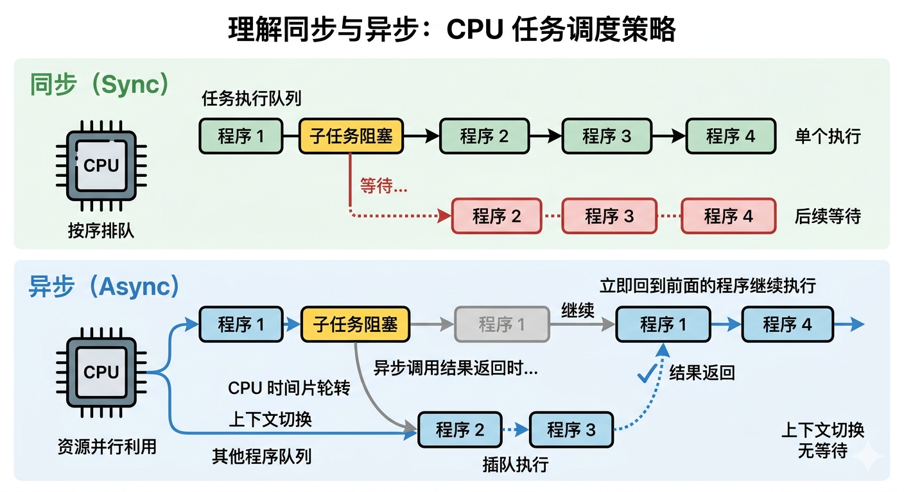

#### 同步 Synchronous

##### 基本概念

核心概念：在**同步（sync）模式**下，**调用者在发出一个任务（向系统申请计算机硬件资源）后，必须等待前面任务结果返回，才能继续执行后续的任务**。

- **任务执行队列形式**：在同步逻辑中，队列通常是**单线程阻塞**的。

核心逻辑：**一件事做完，才能做下一件**；当前执行流会被**阻塞**。

> 注意点：
>
> **CPU 的核心数与执行速度，不会改变任务之间的逻辑依赖关系**。
>
> 描述：假设任务 A、B、C都被设计为了同步关系，那么即使 CPU 是并发执行的（高频切换不同任务执行），也不会在前面的任务A 没有执行完毕的情况下去执行后续的任务 B 、C。
>
> 换句话说，**同步/异步**是规定了**多个任务之间是如何被组织的（后面的任务是否等待前面的任务）**，**并发/并行**是规定了**多个任务是如何被 CPU 执行的**；两者是不同的概念机制。

##### 核心流程

​	CPU 取出任务 A → 开始执行 → 任务 A 阻塞（如等待磁盘写入）→ **CPU 停下等待** → 任务 A 完成 → CPU 取出任务 B。

> **逻辑图景：** 就像在银行柜台排队，前面的业务没办完，后面的人只能站着等，柜员（CPU）也必须陪着等。

##### 程序特性

程序状态：**独占**整个 CPU 执行单元。

**程序特性：** 在同步模式下，程序的执行流是**严格有序**的。**代码按顺序执行，逻辑简单，但如果某个环节很慢（比如下载大文件），整个程序就会卡住**。

**代价：** 如果子任务是 **I/O 密集型（比如读写数据库、请求网络 API）**，CPU 会处于“空转”等待状态，这种等待被称为**同步阻塞**。

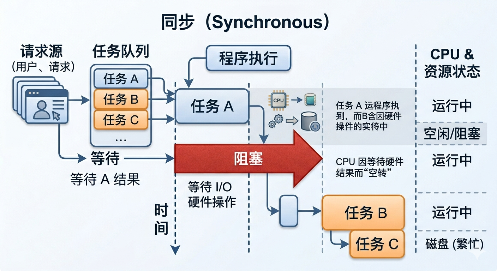

#### 异步 Asynchronous

##### 基本概念

在**异步（Async）模式**下，**调用者发出一个任务（向系统申请计算机硬件资源），不会等待前面任务的结果返回，而是继续执行后续代码。当那个任务真正完成后，会通过 “回调” 或 “通知” 的方式告诉调用者。**

- **任务执行队列形式（事件循环/任务调度）**：在异步逻辑（如 Python 的 `asyncio` 或 JavaScript 的 `Event Loop`）中，队列配合 **“调度器”** 运作

核心逻辑：**发出指令后不等结果，先去干别的**；当中执行流**不会被阻塞**

核心要点：异步的核心是在于**会释放当前线程（子任务）的 CPU 控制权**，让**其他线程（子任务）去接管 CPU 的控制权**。

##### **核心流程**

​	CPU 取出任务 A → 开始执行 → 任务 A 遇到阻塞 → **任务 A 被挂起（放到一边等待结果）** → CPU 立即从队列取出任务 B 执行 → 任务 A 结果返回后重新排入队列末尾（或插队执行）。

##### 程序特性

程序状态：**并行或并发**（取决于 CPU 核心数）。

**机制：** 当遇到阻塞操作时，程序会发起一个“回调”或“通知”请求，然后立即交出 CPU 核心。

> **逻辑图景：** 就像在餐厅吃饭，你点完餐（发起请求）后不需要在出餐口死等，而是拿着号牌回座位玩手机（执行其他任务）。当饭好了（子任务结果返回），服务员会叫号（触发回调/事件循环），你再过去处理。

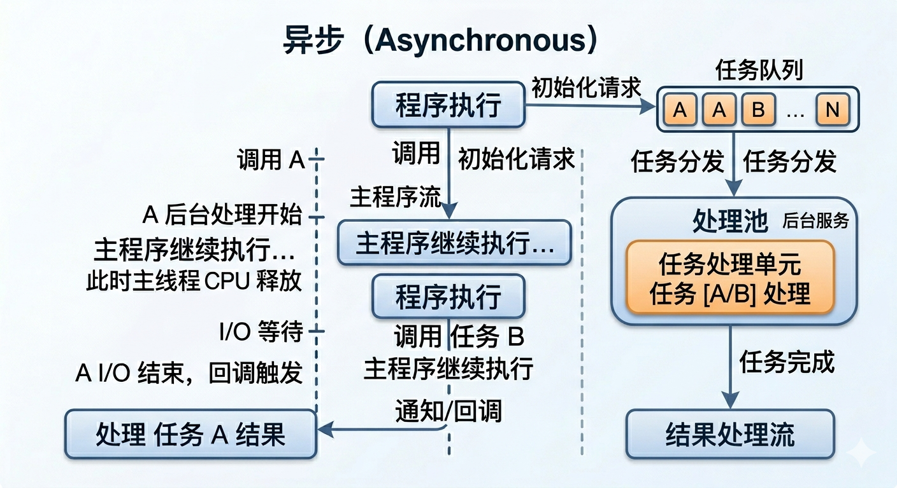

#### 关键区别

| **特性**     | **同步**                   | **异步**                           |
| ------------ | -------------------------- | ---------------------------------- |
| **等待**     | 必须等待结果               | 不需要等待，直接往后走             |
| **执行顺序** | 严格按代码顺序             | 任务完成的顺序可能与启动顺序不同   |
| **效率**     | 容易造成阻塞，资源利用率低 | 效率高，适合处理高并发或长耗时任务 |
| **复杂度**   | 简单，直观                 | 较复杂，需要处理回调或状态通知     |

### I/O 模型

**I/O 模型（Input/Output Model）** 描述的是：**计算机程序如何与外部设备（磁盘、网络、键盘等）交换数据。**

I/O 模型根据实现场景与功能特性的不同，分为如下几个模型：

#### 阻塞IO / 非阻塞IO（程序等待状态）

**阻塞/非阻塞 (Blocking/Non-blocking)**：关注的是**程序在等待结果时的状态**。

描述：是你被“卡住”动不了了（阻塞），还是你依然可以灵活走动，只是偶尔看一眼结果好没好（非阻塞）？

##### 基本概念

核心定义：在计算机编程语言中，**阻塞（Blocking）**与**非阻塞（Non-blocking）**主要描述的是**程序在等待某个操作（通常是 I/O 操作，如读写文件、网络收发）完成时**的**状态**。

##### 阻塞态（Blocking）

阻塞的定义：当**程序调用一个函数**时，如果**函数内存在阻塞操作**，在**阻塞操作完成之前，当前的线程会一直处于挂起（暂停）状态**。只有**当操作结果返回后，程序才会执行下一步**。

核心特点：

- CPU 资源在该线程上处于等待状态
- 编程模型简单，逻辑符合人的直觉（线性执行）
- 并发能力低，如果一个任务卡住，整个线程就动不了了

核心本质：在**同步模式下，操作系统为了保证“一件事做完再做下一件”，会把当前的进程/线程挂起（放入等待队列）**。此时 **CPU 会切换去处理其他人的任务**，而挂起的程序就在那**干等着**，直到磁盘把数据准备好**发送中断信号，系统才把挂起的程序唤醒**。

**形象比喻**：去柜台排队取钱。你必须站在窗口前等着，直到柜员把钱交到你手里，你才能离开去做下一件事。

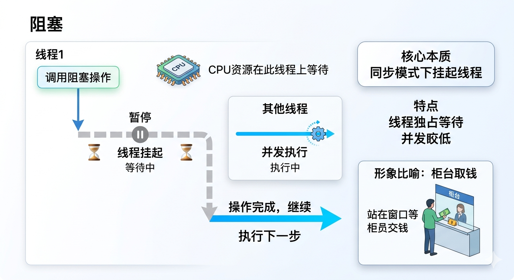

##### 非阻塞态（Non-Blocking）

非阻塞的定义：当**程序调用一个函数**时，如果**函数内存在阻塞操作，且操作不能立即完成，函数会立即返回一个错误或特定状态码（`EAGAIN`），而不是让线程进入睡眠状态**，之后 **CPU 会不断轮询该程序的子任务是否完成，完成则继续执行下一步**；

核心特点：

- 线程不会被挂起，可以继续执行后续代码
- **轮询（Polling）**：通常需要不断检查操作是否完成，这会消耗一定的 CPU 资源
- 编程逻辑相对复杂

###### 与异步的区别

两者的共同点：**CPU 不会等程序的阻塞操作完成，而是转而去执行下一个程序**，执行的单位：**系统内核**。

> **解放了当前的调用线程**，让 CPU 不至于在原地“死等” I/O 设备（硬盘、网卡）这种慢速设备的响应，从而极大地提高了系统的吞吐量。

不同点：

- **非阻塞**： CPU 会**持续不断的主动轮询系统内核**，程序的阻塞操作是否完成，若已完成，则继续执行程序的下一步

  执行流程：

  在底层，非阻塞 I/O 往往配合 **I/O 多路复用 (Multiplexing)** 使用（如 `select`, `poll`, `epoll`）。

  1. 程序发起 I/O 请求
  2. 内核立即返回“还没好”
  3. 程序去做点别的
  4. **关键点**：程序必须**再次发起**请求或者通过 `epoll` 等待事件触发，来确认数据是否已经到达缓冲区
  5. 数据准备好后，**程序亲自**将数据从内核空间拷贝到用户空间（这个拷贝过程其实是阻塞的）

- **异步**：**程序会在系统内核留下一个 “回调” / “通知” 钩子**，当阻塞操作完成后系统内核会以 “回调” / “通知” 的形式告诉 CPU 阻塞操作已经完成，可以继续下一步了

  执行流程：

  异步操作通常由操作系统在后台完成所有的脏活累活。

  1. 程序发起 I/O 请求，并给内核一个**回调函数 (Callback)** 或指定一个信号
  2. 内核立即返回，程序彻底不管这件事了
  3. 内核在后台等待数据，并**自动**将数据拷贝到用户指定的内存地址
  4. 内核执行回调
  5. **关键点**：当程序被“通知”的时候，**数据已经躺在你的变量里了**，你直接用就行，不需要再进行拷贝操作

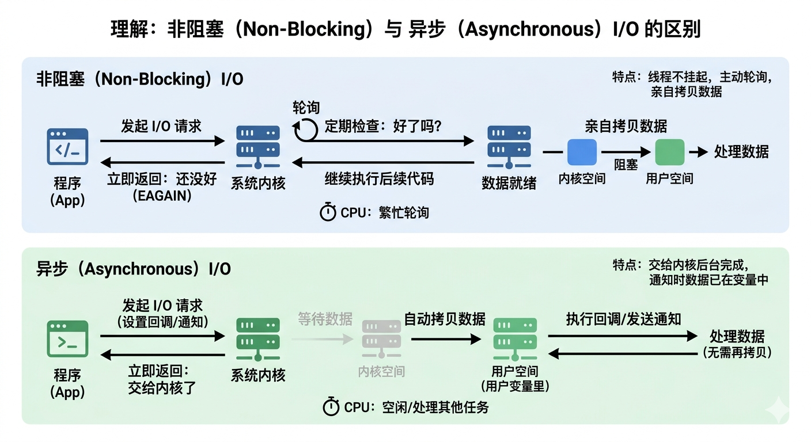

| **维度**     | **非阻塞 (Non-blocking)**                               | **异步 (Asynchronous)**                                      |
| ------------ | ------------------------------------------------------- | ------------------------------------------------------------ |
| **查询方式** | **主动轮询**。程序需要不断询问内核：“好了吗？好了吗？”  | **被动通知**。程序直接去做别的，内核好了会喊你：“办好了！”   |
| **角色重心** | 重心在**用户进程**。用户进程要负责检查状态。            | 重心在**内核/操作系统**。内核负责监控并在完成后推送。        |
| **效率瓶颈** | 轮询会消耗一定的 CPU 资源（虽然不多，但属于无效劳动）。 | CPU 利用率最高，完全没有无效等待或轮询。                     |
| **底层实现** | 通常通过设置 Socket 的 `O_NONBLOCK` 标志。              | 通常需要 OS 层的支持（如 Linux 的 `io_uring` 或 Windows 的 `IOCP`）。 |

##### 区别对比

| **特性**       | **阻塞 (Blocking)**      | **非阻塞 (Non-blocking)**         |
| -------------- | ------------------------ | --------------------------------- |
| **线程状态**   | 挂起等待，不做他事       | 立即返回，继续执行                |
| **CPU 利用率** | 低（线程在睡觉）         | 高（因为一直在运行或轮询）        |
| **响应性**     | 慢（必须按顺序来）       | 快（可以同时触发多个请求）        |
| **典型应用**   | 简单的脚本、读写本地文件 | 高并发服务器、图形界面 (GUI) 响应 |

#### **I/O 多路复用 (IO Multiplexing)** 

I/O 多路复用就是一种**让单线程能同时监控多个 I/O 状态，并只在有事可做时才切入内核态处理**的高效机制。

- **多路**：指的是多个网络连接（多个文件描述符）
- **复用**：指的是复用同一个线程

核心思想是：**用一个线程监控多个连接**；它是高性能网络编程中的“终极武器”。


##### 实现用例

它是现代互联网基础设施的基石。以下工具，其实就是在享受 I/O 多路复用的红利：

- **Nginx**：能支撑万级甚至十万级并发，靠的就是 `epoll`。
- **Redis**：虽然是单线程，但速度极快，因为它用 `epoll` 极速处理成千上万的网络请求。
- **Node.js / Python asyncio**：它们的“事件循环（Event Loop）”底层全是 I/O 多路复用。

#### **异步 I/O (Asynchronous IO)**

**异步 I/O (Asynchronous I/O)**，简称 **AIO**，是 I/O 模型中的“最高境界”。

##### 核心定义

在异步 I/O 模型中，用户进程发起系统调用（System Call）后，**立即返回**去执行其他任务。内核会接管剩下的所有工作：

1. **等待数据**从硬件（如磁盘、网卡）到达内核缓冲区。
2. **自动拷贝**数据从内核空间到用户空间。

直到这两个步骤全部完成，内核才会通过信号或回调函数通知用户进程：“你要的数据已经直接放到你的内存变量里了，请查收。”

##### 与其他 IO 模型的本质区别

可以通过 **“谁来搬运数据”** 这个关键点来区分：

- **同步 I/O (包括阻塞、非阻塞、多路复用)**：虽然多路复用能让你同时等很多连接，但当数据准备好后，**必须由你的进程发起系统调用**，把数据从内核态“搬”到用户态。这个“搬运”过程，CPU 是在为你这个进程打工的，你是阻塞的。
- **异步 I/O (AIO)**：搬运工作的执行者是**内核/硬件 DMA**。你的进程完全不参与搬运过程，你只需要提供一个内存地址（缓冲区）给内核即可。

#### 核心区别

| **模型**           | **第一阶段（等待数据）** | **第二阶段（数据拷贝）** | **备注**               |
| ------------------ | ------------------------ | ------------------------ | ---------------------- |
| **阻塞 I/O**       | 阻塞                     | 阻塞                     | 简单，但浪费资源       |
| **非阻塞 I/O**     | 轮询（不阻塞）           | 阻塞                     | 轮询消耗大量 CPU       |
| **I/O 多路复用**   | 阻塞（在监听函数上）     | 阻塞                     | **高并发神器**         |
| **异步 I/O (AIO)** | **不阻塞**               | **不阻塞**               | 效率最高，但开发最复杂 |

### 任务的 “类型”

#### **CPU 计算密集型 (CPU-Bound)**

这类任务的特点是需要大量的 **数值运算**、**逻辑推演** 或 **数据处理**，其瓶颈在于 CPU 的处理速度。

**执行表现：** CPU 几乎处于满负荷状态，很少进入“阻塞”状态，因为程序一直在忙着计算。

**适用策略：**

- **同步**通常更简单高效
- 如果需要提升效率，通常使用**多进程 + 多线程**并行（利用多核 CPU），而不是单纯的异步。因为在单核上，异步切换产生的“上下文切换”开销反而可能拖慢纯计算速度

**典型场景：** 视频转码、科学计算、加密解密、大规模图像处理

#### **IO 密集型** (I/O-Bound)

这类任务的特点是涉及大量的 **输入/输出** 操作，CPU 大部分时间都在等待外部资源（如硬盘、网络、数据库）的回应。

**执行表现：** CPU 极其“空闲”，因为它在等待数据传输。这就是进程“阻塞状态”最常发生的场景

**适用策略：**

- **异步协程**的最佳舞台。在等待 IO 返回的空档，CPU 可以通过“时间片轮转”去处理其他请求，极大提高了单核 CPU 的并发处理能力

**典型场景：** 文件上传下载、数据库查询、网络爬虫、Web API 服务

#### 对比

| **维度**     | **CPU 计算密集型**         | **IO 密集型**              |
| ------------ | -------------------------- | -------------------------- |
| **压力点**   | CPU (大脑不停在转)         | IO 设备 (一直在等快递)     |
| **CPU 状态** | 持续忙碌，无阻塞           | 频繁阻塞，等待返回         |
| **异步收益** | 低（切换开销可能导致降速） | **极高**（显著提升并发量） |
| **形象比喻** | 数学家在解复杂的微积分     | 快递员在等客户签收包裹     |

#### 队列策略

不同密集型任务的队列策略：

| **任务类型**   | **队列策略**       | **核心逻辑**                                                 |
| -------------- | ------------------ | ------------------------------------------------------------ |
| **CPU 密集型** | **多进程队列**     | 任务被分发到多个独立的 CPU 核心队列中，真正实现同时计算      |
| **IO 密集型**  | **单线程异步队列** | 通过一个队列和非阻塞机制，让 CPU 在多个等待状态的任务间快速穿梭 |

## 协程 Coroutine

> [!NOTE]
>
> **进程 vs 线程 vs 协程**
>
> - **进程（Process）**：指**运行中的程序**；计算机**资源分配的基本单位**（CPU 指令、程序代码段、堆内存、栈内存）
> - **线程（Thread）**：
>   - 指**运行中程序（进程）中的一个个「执行流」**，**每个线程之间都持有独立的寄存器和栈空间**
>   - **多个「线程」之间共享「当前进程」内的全局资源**（全局函数、变量、类...）
>   - 线程是 **CPU 指令的最小执行基本单元（即 CPU 实际调度的是线程） **
> - **协程（Coroutine）**：
>   - 在**「线程」这条执行流**中的**一个最小工作单元**；**一个线程可以创建多个协程**，所以协程也被称之为 **“微线程”** 或者 **纤程**
>   - **多个「协程」之间共享「当前线程」内的寄存器和栈空间**（全局函数、变量、类...）
>
> 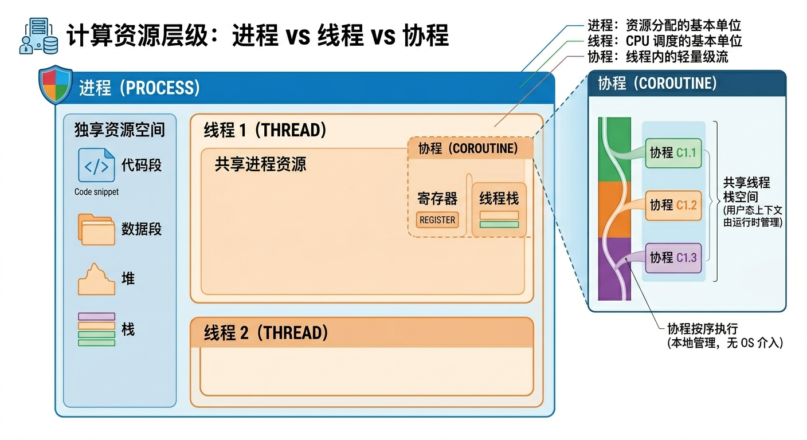
>
> | **维度**     | **进程 (Process)**                                    | **线程 (Thread)**                                     | **协程 (Coroutine)**                                         |
> | ------------ | ----------------------------------------------------- | ----------------------------------------------------- | ------------------------------------------------------------ |
> | **资源拥有** | 拥有独立的内存、I/O 句柄等全部系统资源                | 共享所属进程的资源，但有自己独立的栈和寄存器          | 几乎不拥有系统资源，只在**用户态拥有自己的执行上下文**       |
> | **切换开销** | **极大**。需要切换页表、刷新 TLB，涉及内核态转换      | **较大**。需要保存/恢复寄存器和栈，由操作系统内核完成 | **极小**。完全在用户态由程序自身控制，只是单纯的 CPU 上下文切换 |
> | **通信方式** | 进程间通信（IPC），如管道、Socket、共享内存（较麻烦） | 读写进程内的全局变量、共享内存（需注意加锁保护）      | 直接通过内存共享（因为在同一个线程内），或通过 Channel/Queue |
> | **谁来调度** | **操作系统内核** (OS Kernel)                          | **操作系统内核** (OS Kernel)                          | **用户程序/运行时**（如 Python 的 `asyncio`）                |
>
> > 操作系统的**用户态**与**内核态**：特指 **CPU 的一个运行环境及权限级别**。
> >
> > 为了保证操作系统的安全与稳定性，操作系统**根据执行的程序权限**不同**将 CPU 的运行级别**划分为了 **内核态（Kernel Mode）** 与 **用户态（User Model）**。
> >
> > - **用户态：** 权限受限，只能访问自己的内存空间，不能直接操作硬件
> > - **内核态：** 拥有最高权限，可以执行任何 CPU 指令，访问所有硬件资源
> >
> > | **维度**     | **内核态 (Kernel Mode)**                            | **用户态 (User Mode)**                                 |
> > | ------------ | --------------------------------------------------- | ------------------------------------------------------ |
> > | **权限级别** | **最高权限**。可以访问硬件、所有内存空间及 CPU 指令 | **受限权限**。只能访问分配给该进程的特定内存空间       |
> > | **运行对象** | 操作系统内核（Kernel）的驱动程序、进程调度等        | 普通应用程序（如 Chrome、VS Code、你写的 Python 代码） |
> > | **安全性**   | 极其关键。一旦出错，系统会蓝屏或崩溃                | 相对安全。如果程序崩溃，只会关掉该程序，不影响系统     |
> > | **别名**     | 环 0 (Ring 0)                                       | 环 3 (Ring 3)                                          |
> >
> > 核心要点：为了防止如果任何程序都能直接修改硬件设置，电脑可能随时崩溃的可能性。
> >
> > 

### 基本概念

**协程（Coordinate）**，字面意思是**指在一个线程中能与「其他子程序」互相协同工作**的一个**子程序**，这个子程序就是协程，它可以精确到**一行代码**或者是**一个代码块单元（函数）**。

核心概念：协程本质上是一种**可以被暂停、以后还能在暂停处继续执行的特殊函数**。

#### 为什么叫“协”程？

- **多线程是“抢占式”的：** 线程 A 正在运行，操作系统说“你时间片到了，换线程 B”，线程 A 只能被迫让出控制权。
- **多协程是“合作式（Cooperative）”的：** 协程 A 必须自己执行到 `await`（也就是遇到 I/O 操作）时，主动说“我遇到 I/O 了，我先歇会，事件循环你让协程 B 跑吧”，它才会切换。如果协程 A 里面写了一个死循环（纯 CPU 计算），它是永远不会切换的，其他协程就会被活活饿死。

协程本质上就是**用“线程不阻塞”的代价，换取了“函数执行流的暂停与恢复”**。通过**事件循环（Event Loop）**这个高效的“大管家”，**把原本要浪费在等待 I/O 上的时间，全部压榨出来去跑其他的业务代码**。这就是它能用**单线程跑出极高并发量**的秘密。

| **模式**            | **协作方式（打个比方）**                                     | **核心特点**                                       |
| ------------------- | ------------------------------------------------------------ | -------------------------------------------------- |
| **多线程 (抢占式)** | 两个人抢一个话筒唱歌。操作系统是个严格的裁判，每隔 10 毫秒就把话筒从 A 手里抢过来给 B，不管 A 有没有唱完 | **被动中断**：会有线程安全问题，需要加锁           |
| **协程 (合作式)**   | 两个人商量好一起唱歌。A 唱完第一句，**主动**把话筒递给 B：“该你了”；B 唱完第二句，再递回给 A | **主动让出**：一个线程在不同代码块间游走，不需要锁 |

### 发展历史

Python 的协程（Coroutine）发展史是一部**从“借用 `yield` 生成器”到 “`async/await` 全面原生化”** 的演进史。它的核心驱动力是为了在不引入多线程复杂性的情况下，更优雅、更高效地处理高并发的 I/O 密集型任务。

Python 协程的发展主要经历了以下四个关键阶段：

**1. 雏形期：基于生成器的“半协程”（Python 2.2 - 2.5）**

在最初的阶段，Python 并没有官方的协程概念，开发者们发现“生成器”的特性非常适合用来模拟协程。

- **Python 2.2 (2001年)**：引入了 `yield` 关键字。这时的生成器只能**单向输出**数据。但它让函数拥有了**“暂停并保留状态”**的能力，这是**协程的核心基础**。

- **Python 2.5 (2006年 - PEP 342)**：这是一个巨大的飞跃。Python 为生成器增加了 `.send(value)`、`.throw()` 和 `.close()` 方法。

  > **突破点**：`.send()` 允许开发者在生成器暂停时向其**双向输入**数据。至此，生成器演变成了“经典协程（Classic Coroutines）”，可以实现协程间的双向协作。

**2. 过渡期：语法委派与 `asyncio` 的诞生（Python 3.3 - 3.4）**

随着 Web 的爆发，原生的异步支持变得迫切，Python 开始把协程往标准库和正规军的方向推进。

- **Python 3.3 (2012年 - PEP 380)**：引入了 `yield from` 语法。
  - 在此之前，生成器嵌套调用需要写冗长的 `for` 循环。
  - `yield from` 实现了**生成器委派**，让一个协程可以把执行权直接委托给另一个子协程，极大简化了异步调用链的编写。
- **Python 3.4 (2014年 - PEP 3156)**：正式引入了异步 I/O 框架 **`asyncio`**。
  - 标准库开始提供官方的**事件循环（Event Loop）**。
  - 此时写异步代码需要使用 `@asyncio.coroutine` 装饰器配合 `yield from`。虽然能用，但语法上依然带着浓浓的生成器影子，容易让初学者混淆。

**3. 成熟期：原生协程时代（Python 3.5 - 3.7）**

这一阶段，Python 终于彻底摆脱了生成器的外衣，赋予了协程一等公民的地位。

- **Python 3.5 (2015年 - PEP 492)**：引入了全新的关键字 **`async def`** 和 **`await`**。
  - 使用 `async def` 定义的函数被称为**原生协程（Native Coroutines）**。
  - `await` 取代了 `yield from`，让异步代码读起来和同步代码一样顺畅。从语言层面上，协程与生成器正式分家。
- **Python 3.7 (2018年)**：引入了 `asyncio.run()` 等高层 API，让开发者不再需要手动去获取和管理底层的 Event Loop，异步编程的上手门槛大幅降低。

**4. 现代期：卸下历史包袱与性能优化（Python 3.10 之后）**

- **Python 3.10 (2021年)**：官方正式**移除了**对基于 `yield from` 的旧版协程的支持。至此，Python 异步生态完全统一在 `async` / `await` 的大旗之下。
- **Python 3.11 及后续版本**：引入了 **Task Groups（任务组）**（受“结构化并发”理念启发），让并发任务的管理和异常捕获变得更加安全、优雅。同时，底层的事件循环也在持续进行性能压榨和优化。

| **阶段 / 版本**    | **核心语法**                        | **协程实现方式**  | **角色定位**           |
| ------------------ | ----------------------------------- | ----------------- | ---------------------- |
| **Python 2.5**     | `yield` / `.send()`                 | 经典生成器        | 借用生成器模拟         |
| **Python 3.3/3.4** | `@asyncio.coroutine` + `yield from` | 基于生成器的协程  | 迈向标准库的过渡产物   |
| **Python 3.5+**    | `async def` / `await`               | 原生协程 (Native) | 语言一等公民，完全独立 |

### 协程的早期实现方式

早期**协程函数的暂停中断与恢复执行**在底层是**通过 `yield` 生成器冻结当前函数栈来实现**的，有点类似于进程上下文切换，只不过前者是内核态（系统内核自动调度），后者是用户态（用户程序自行定义）。

核心定义：

- **暂停的本质**：原生协程的底层依然是一个**状态机**。**`await` 背后其实就是 `yield` 那套“保存当前函数堆栈、交出 CPU 执行权”的底层机制**，但 **`await` 与 `yield` 是两个不同的实现**，只是**核心理念是一样**的。
- **通信的本质**：当年用 `coroutine.send(value)` 把数据喂给生成器，和现在事件循环（Event Loop）把 I/O 就绪的数据塞回给 `await` 挂起的协程，在**数学模型和逻辑上是完全相通的**。

#### yield 生成器

早期的协程就是通过使用一个个**生成器函数（可以被暂停函数堆栈，随时恢复执行）**的理念机制来**模拟协程**。

代码示例：

```python
# 1. 这是一个用 yield 模拟的协程任务
def micro_co_task(name):
    print(f"[{name}] 任务启动...")
    # 暂停在这里，等待外部传入 I/O 结果
    reply = yield "需要读取数据库" 
    print(f"[{name}] 收到数据库结果: {reply}")
    
    # 再次暂停，等待下一个 I/O 结果
    reply2 = yield "需要请求网络 API"
    print(f"[{name}] 收到网络结果: {reply2}")

# 2. 这是一个极简的“事件循环”模拟
task = micro_co_task("TaskA")

# 启动协程，代码执行到第一个 yield 并暂停
next_step_need = task.send(None) 
print(f"[Loop] 调度器收到任务诉求: {next_step_need}")

# 模拟事件循环在后台处理完数据库 I/O，把结果“喂”回给任务
next_step_need2 = task.send("User_ID_12345") 
print(f"[Loop] 调度器收到任务诉求: {next_step_need2}")

# 模拟网络请求就绪，把结果再次“喂”回去
try:
    task.send("HTTP_STATUS_200")
except StopIteration:
    print("[Loop] 任务执行完毕，退出。")
```

核心机制：协程用**状态机的暂停（`yield`/`await`）与恢复（`send`）**，把**原本属于操作系统的线程切换工作，变成了应用程序内部的函数跳转**，从而实现了无损的、超高密度的并发。

### 线程 与 协程的区别

> 一句话总结：“**协程**是**单线程中的一个子程序（函数）**，通过在**多个协程函数之间上下“游走”，来回跳转切换任务（异步非阻塞）**执行来**解决多线程遇到同步阻塞式 I/O 操作时的资源等待浪费问题**”。
>
> > 引用：“异步编程” **允许在「单线程」模式下，当线程遇到 I/O 操作时，可以先在 <线程后台挂起> I/O 操作子任务，利用线程等待 I/O 操作的 “空闲” 时间，让线程去执行其他代码**。
> >
> > 这个**在 <线程后台挂起> 的 I/O 操作子任务 == 协程函数**。

#### 在代码层面

- **线程**：是**一段片面的代码片段**（可以包含多个函数、类....）
- **协程**：**「协程」是在「线程」运行环境下执行的一个个子程序（函数）**，它可以精确到**一行代码**或者是**一个代码块单元（函数）**

简单来说，**一个线程中可以包含多个协程**，**协程**是在**「单线程执行流」**运行的**一个微小单元**；即指**一大段程序代码中包含着一个个子程序【函数】**。

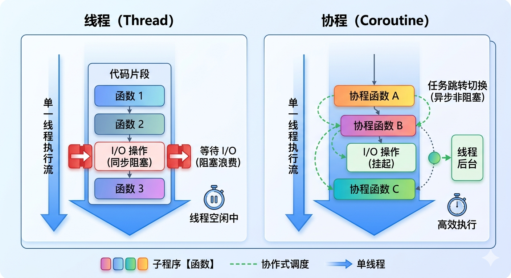

#### 在资源调度层面

##### CPU 指令 与 资源调度

- **线程**：**每个「线程」都持有自己独立的寄存器和栈空间**，用于**存储当前线程执行的一个程序中的函数、变量、类**....
- **协程：多个「协程」之间共享「当前线程」内的栈空间**，且由于**协程本身是一个函数**，所以它**拥有自己独立的函数调用栈（Call Stack），或者说栈帧容器（Stack Frame）**
  - **计算机系统并不认识「协程」**，因为它是**程序员人为编码创造的技术手段**
  - 所以，**「协程」是几乎不需要 CPU 指令资源的**，它只是**在执行计算、跳转、处理数据等代码**时，消耗**「协程」所在的那个「线程」所争取到的 CPU 指令资源**

简单来说，**「协程」是在「线程」运行环境下执行的一个个子程序（函数）**，所以**「协程」仅在「线程」争取到的 CPU “时间片” 运行期间内运行**。

> 注意点：
>
> **只有一个真实的执行流（CPU 核心视角）：** 无论是线程还是协程，对 CPU 核心来说，**同一时间真正运行的只有那个「当前线程」**，只不过**让多个协程函数之间跳转与恢复执行**都是**通过「当前线程」中持续运行的事件循环（Event Loop）来控制的**。

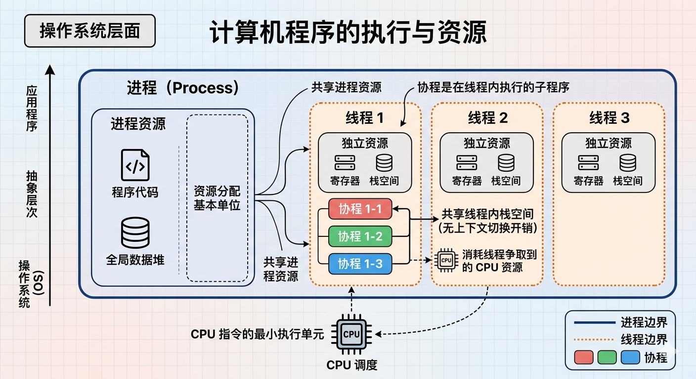

##### 上下文切换开销

- **线程的切换（内核态）**：每次**线程的上下文切换**都**需要操作系统（内核态）出手**。保存寄存器、切换堆栈，**成本很高**

- **协程的切换（用户态）：** 每次**协程的「暂停切换」和「恢复执行」**是**由程序自身控制**的

  即**在线程拿到 CPU “时间片” 执行期间**，在**同一线程内**进行**多个协程函数之间的暂停跳转切换与恢复执行**，所以**协程本身几乎没有上下文切换开销**，最多就是**保存与恢复当前函数（协程）在堆内存中存储的堆帧容器（Heap Frame）**

  底层纯粹是**由同一线程内**的**事件循环（Event Loop）机制**来**操作线程**不停的**在多个协程函数之间来回跳转、暂停切换执行**，所以**几乎不消耗系统资源**。

  > 多个协程函数之间跳转的本质是**保存和恢复“ 协程函数栈帧（Frame Object）”**。

  > 为什么事件循环（Event Loop）能持续控制？
  >
  > 因为它是一个 **采用了 I/O 多路复用机制的 `while True` 死循环**，当它**在线程后台启动**时，会**一直持续不断的监听与控制线程内的协程任务调度执行（挂起/唤醒）**。

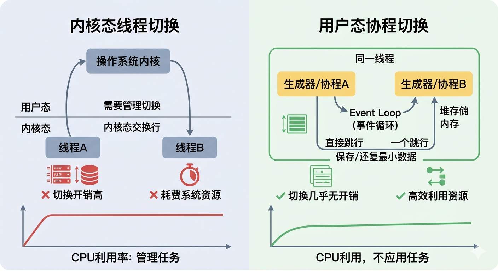

#### 在程序执行层面

- **线程（同步阻塞）**：在一个「线程」中，程序的**代码调用顺序**是**明确**的，即**按顺序往下执行，遇到 I/O 操作就阻塞等待，返回结果后继续往下执行**

- **协程（异步非阻塞）**：在**一个「线程」中可以定义多个「协程函数」**，程序在**多个「协程函数」之间**的**代码调用顺序**是**不明确**的

  在**「当前线程」在执行「协程函数」的过程**中，当**「当前线程」遇到 I/O 操作**时（比如**另一个「协程函数」**）：

  - 「当前线程」会**『暂停』「当前协程函数」的执行**，转而**『切换跳转』到「另一个协程函数」内执行**
  - 在**适当的时候（上一个协程函数的 I/O 操作返回结果），「当前线程」再『返回来』，接着『恢复』继续执行**。

  > 注意点：**「当前线程」**执行流内**多个「协程函数」之间**的**暂停跳转切换与恢复执行**是**通过「当前线程」后台中持续运行的事件循环（Event Loop）机制来调度**的。

简单来说，**多个协程函数之间**通过**事件循环（Event Loop）机制**进行**协同工作**，以**『异步非阻塞』**的形式（**函数与函数之间跳转切换与恢复执行**），**解决**在 I/O 操作业务场景中的**多线程阻塞等待浪费问题**。

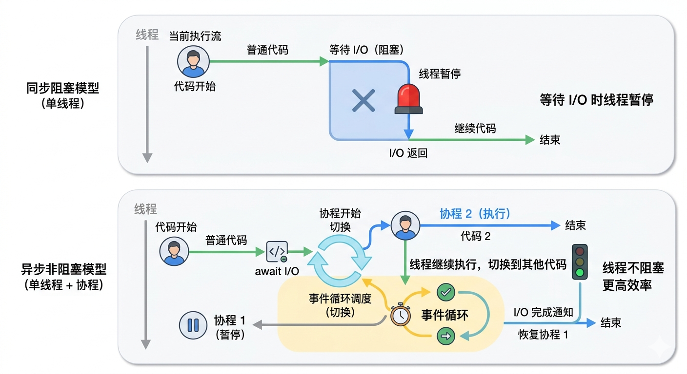

##### 普通函数 vs 协程函数

核心定义：一个线程中可以包含任意普通函数与协程函数。

两者之间最大的区别：

- **普通函数（线程阻塞）**：**无法进行中断与恢复跳转**，是**同步顺序执行**，**遇到 I/O 操作就会阻塞当前线程，直到返回 I/O 操作结果，便继续往下执行**
- **协程函数（主动让出）**：可以在**遇到 I/ O 阻塞操作**时，**中断**当前协程函数执行的过程，在**当前线程后台中的事件循环（Event Loop）中挂起 I/O 操作任务**，并**跳转**到另一个协程函数中运行，等到 I/O 操作返回结果时，线程再**转回头来继续执行**

##### 与线程的总结对比

| **维度**         | **线程（同步阻塞）**                       | **协程（异步非阻塞）**                              |
| ---------------- | ------------------------------------------ | --------------------------------------------------- |
| **调度者**       | 操作系统内核（Kernel）                     | 语言运行时 / 事件循环（Event Loop）                 |
| **切换代价**     | **高**（需要内核态与用户态切换）           | **极低**（纯用户态的函数指针跳转）                  |
| **遇到 I/O 时**  | **线程挂起**，CPU 闲置或**切换到其他线程** | **协程挂起，线程不挂起，立刻执行其他协程**          |
| **代码执行顺序** | 严格**从上到下**，确定性强                 | 宏观上**交替执行**，微观上**取决于 I/O 返回的时机** |
| **最擅长场景**   | CPU 密集型计算、多核并行                   | **高并发 I/O 密集型**（如 Web 服务器、爬虫）        |

##### 同步阻塞

```python
# 单线程内的普通函数执行【同步阻塞】
def task1():
    print('A')
    print('B')


def task2():
    print('C')
    print('D')


if __name__ == '__main__':
    task1()
    task2()

'''
输出结果：
A
B
C
D
'''
```

##### 异步非阻塞（yield 生成器）

早期的异步框架实现方式就是通过 **`yield` 生成器来**模拟**协程**的。

```python
# 单线程内的协程函数执行【异步非阻塞】
def task1():
    print('A')

    B = yield  # 线程遇到 yield，会暂停并冻结后续代码执行，线程将 CPU 控制权切出给调用者
    print(B)  # send() 调用，线程返回来，继续执行

    C = yield
    print(C)

    D = yield
    print(D)


if __name__ == '__main__':
    try:
        task = task1()  # 协程函数
        next(task)
        task.send('B')  # send()方法会唤醒协程函数，并传递参数给协程函数的 yield 语句接收

        task.send('C')  # send()方法会唤醒协程函数，并传递参数给协程函数的 yield 语句接收

        task.send('D')  # send()方法会唤醒协程函数，并传递参数给协程函数的 yield 语句接收
    except StopIteration as e:
        print(e)


'''
输出结果：
A
B
C
D
'''
```

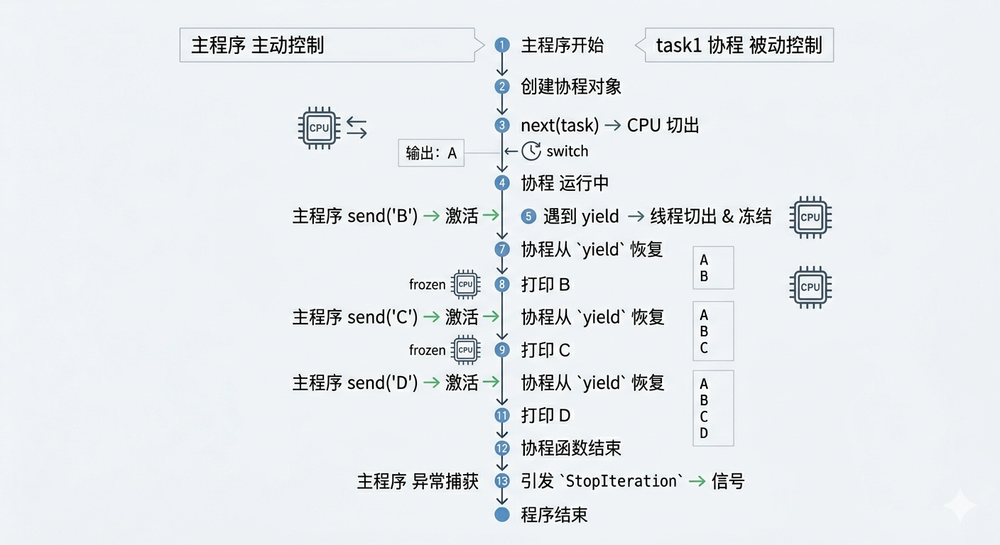


### 核心特征总结

通过以上线程与协程的对比，对协程做个核心特征总结：

- **共享线程资源**：**一个线程中可以创建多个协程**，多个协程之间**共享同一线程的栈空间资源**（全局/局部变量、函数...），但每个协程各自**拥有自己独立的函数调用栈（Call Stack），或者说栈帧（Stack Frame）**

- 协程本质上是一个**基于迭代器协议实现的特殊函数**，类似于 “生成器函数”，但是**协程函数没有 `__next__` 方法，而是 `__await__`**

- **解决线程的 I/O 阻塞等待问题**：

  - **同步阻塞**：**线程**在执行程序期间，若**遇到 I/O 操作会阻塞等待，直到返回结果，再继续往下执行**，所以存在**资源等待浪费**问题

  - **异步非阻塞**：**协程**就是专门为了**解决线程遇到 I/O 操作时会阻塞等待的一套效率极高的解决方案**

    - 实现原理：

      1. **多个协程函数之间**通过**线程后台的事件循环（Event Loop）机制**进行**协同工作**，以**『异步非阻塞』**的形式
      2. 让**线程在遇到 I/O 操作**时，**暂停执行**，并**跳转切换到另一个协程函数中执行**
      3. **等到 I/O 操作返回结果**时，线程再**转头回来恢复协程函数状态并继续执行**。（**函数与函数之间跳转切换与恢复执行**）

    - 以此**解决**在 I/O 操作业务场景中的**多线程阻塞等待浪费问题**

      > 例如：当一个协程发起网络请求时，它不会让线程傻傻地等待（阻塞），而是**主动让出**控制权，让线程去执行别的协程。等网络数据回来了，再切回原来的协程继续往下走。这样，一个线程就能轻松同时应对成千上万个并发连接。

- **协程的函数调用栈切换**：**协程**本质上来说就是一个“类似于生成器函数”的**协程函数**，它们各自**拥有自己独立的函数调用栈（Call Stack），或者说栈帧（Stack Frame）**，协程函数的栈帧会被**分配到堆内存中持久化活跃**，叫做**堆帧（Heap Frame）**。

  ​	在线程在遇到 I/O 操作进行**协程切换**时，其实**底层**是**将栈内存中 CPU 的执行指针改变指向了不同的栈帧**，即**不同的函数**；所以，本质上来说，**协程的暂停切换与恢复执行**实际上是**栈堆内存空间中的协程函数 <栈帧（Stack Frame）> 和 <堆帧（Heap Frame）> 之间的切换改变**。

  > 生成器函数：Python 在堆内存中创建了生成器对象来保存该生成器函数的独立栈帧和对应的函数体代码并创建指针被栈内的函数对象引用，从而**延长了函数对象与函数栈帧的生命周期**，使得**函数即使在调用完后，它的栈帧依然存活**，仍然**可以在外部任意地方调用 `next()` 内置函数访问生成器函数内上一次 `yield` 暂停的位置并继续执行后续的函数体代码**；

- **上下文切换开销极小**：多个协程函数之间跳转的本质是**保存和恢复“ 协程函数栈帧（Frame Object）”**，所以协程几乎不消耗系统资源

# 异步编程

Pyyhon 的**异步编程（Asynchronous Programming）**核心是为了**解决 I/O 密集型任务**（如网络请求、文件读写、数科查询）中的等待**资源浪费问题**，所提出的一种**架构设计和代码编写的风格**。

核心思想是：**当一个任务在等待某个结果时，程序不需要停下来死等，而是可以去执行其他任务。**

异步编程关注的是**代码的执行流程和控制权**。它可以用来处理各种需要等待的场景，比如：

- **等待硬件/网络**（比如异步 I/O）
- **等待另一个线程或定时器**（比如 JavaScript 中的 setTimeout）
- **等待用户操作**（比如前端开发中等待用户点击按钮）

## 为什么需要异步编程？

### 核心原因

- 在通用层方面：传统多线程面对高并发 I/O 时，存在**原生线程内存开销大（1MB/线程）**和 **内核态上下文切换成本高 **的致命缺陷
- 在 Python 语言方面： 因为 Python 中 **GIL 全局解释器锁** 的存在，**无法充分利用 多核 CPU 的并行算力**，导致 **Python 的多线程编程**在**处理 I/O 密集型任务 存在一定的等待资源浪费**问题。这使得 Python 程序员在面对高并发 I/O 时，传统多线程方案比其他语言显得更苍白、更低效

### Python 与其他语言的多线程对比

​	在很多语言（如 **Java、C++**）中，**多线程**可以利用**多核 CPU** 实现真正的**并发串行执行**（**多个 CPU核心 可以同时并发性地调度一个进程中的多个线程去执行不同的分工子任务**，如一个线程负责网络请求、一个线程负责文件读写...、一个线程负责利用 CPU 指令将 I/O 操作返回的结果进行进一步处理，以此实现资源最大化利用）；

> 形象比喻：主管（进程）招聘了 10 个工人（线程）。车间很大，拥有 4 台全自动加工机器（4 核 CPU）。4 个工人可以同时占用 4 台机器各自干活（真正的多核并行）。

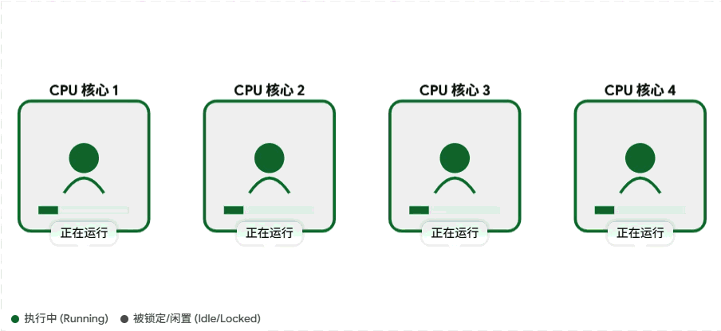

​	但在 **Python 语言**中，有一个叫 **GIL (Global Interpreter Lock，全局解释器锁)** 的限制，它规定在**某一时刻，无论 CPU 有多少个核心，始终只有一个线程占满 CPU “时间片” 去执行任务**，这就导致了 Python 语言的多线程编程**并非真正的并行执行**，无法充分利用多核 CPU 的性能（**即使有多个 CPU 核心，但都会被 GIL 锁拦截只保留一个**，变成了**始终只有一个 CPU 核心在调度一个进程中的一个线程，一个线程负责完成所有的子任务，其他 CPU 核心都处于 “空闲” 状态**，导致了**多核 CPU 的性能优势被完全忽略**）。

> 形象比喻：主管（进程）同样招聘了 10 个工人（线程），虽然车间里也有 4 台机器，但由于车间实行了极其严苛的安全规定（**GIL 锁**）——**任何时候，整个车间只能允许 1 个工人使用机器，其他 3 台机器必须关机闲置！**
>
> **它的荒唐之处在于**：工人 A 刚抢到机器干了 0.005 毫秒（时间片到期），就被要求下来，换工人 B 上去。工人 B 上去一开机，发现自己负责的**原材料快递还没到（I/O 阻塞）**。
>
> **结果**：工人 B 只能站在机器前傻傻地干等。因为 GIL 锁在他手里，他不下来，别人也无法用机器。直到他的时间到了或者他主动放弃，机器才轮到下一个人。这造成了机器（CPU）算力的极大浪费！


#### 多线程的 I/O 阻塞执行原理

​	传统的**多进程、多线程**开发是**依靠 CPU “时间片轮转” 机制**来进行**任务调度**的，即 **CPU 的实际最小执行单元是进程中的线程**，线程负责**一行行读取并执行程序中的代码片段**，这些代码片段称为 **“子任务”**。

​	一般情况下，一个线程所持有的 CPU“时间片” 是 `0.005` 毫秒，每次 **CPU “时间片” 到期**都需要**频繁切换线程（上下文切换）而消耗大量系统资源**；

​	如果在**线程抢到 CPU 指令执行任务期间**，**遇到了 I/O 操作**（读取文件、网络请求、数据库查询...），那么**当前线程会『同步阻塞』等待 I/O 操作返回结果**后，**再继续往下读取代码行**，此时的 **CPU 指令是 “空闲” 状态**，这会造成**线程存在一定的等待资源消耗问题**。

​	对于线程好不容易才争取到的**紧缺资源（CPU “时间片”）**，它**却把这一时刻的大部分时间都花费在了等待 I/O 操作上**，这对于高并发 I/O 操作的业务场景来说，是**多线程**存在的**致命问题**；


> 形象比喻：
>
> ​	一个主管（进程），分配了多个员工（线程）在同一台机器上工作（CPU 单核），每个员工的工作时间都是有时间限制的（CPU “时间片”），时间到了就换下一个员工上场（CPU 切换线程上下文），但是轮到某个员工在操作机器时需要等待原材料的提供才能开始干活（线程等待 I/O 操作结果），所以他就傻傻的等在那里（线程阻塞等待），其他员工也干瞪着眼看着他，这就造成了这一时间段的浪费；
>
> **理想状态**下是能让员工在意识到原材料还没到时，先把这个任务放在一边，转头先去干别的活，等原材料到了，才开启机器进行下一步的工作。**（异步编程）**

##### 方案选型

- 对于 **CPU 计算密集型任务**来说：

  - **多进程方案**：创建多个进程，让**多个 CPU 核心并发性地调度多个进程中的一个线程**，从而**充分利用多核 CPU 的并行性能优势**，是简单且高效的
  - **多线程**：由于 **GIL锁 的限制**，本质上还是**单线程串行执行**的，**无法充分利用 多核 CPU 性能**

- 对于 **I/O 密集型任务**来说：

  - **多进程方案**：由于**进程的上下文切换成本开销太高**【以空间换时间】，比较 **“大材小用“**

  - **多线程方案**：

    虽然能**实现真正的并发执行**；但是**由于原生线程本身的上下文切换还是存在一定的内存开销**，且**绝大部分时间，线程都在“等”数据传输**。

    如果面对一个**高并发 I/O 操作的业务场景**下，高频的**线程上下文切换**通过**以少成多**的形式**积累**下来，这内存开销还是非常庞大的

  > 比如：如果要同时处理 10,000 个网络请求，最直观的想法是开 10,000 个线程。但这在现实中会直接把服务器拖垮，原因有两点：
  >
  > - **内存扛不住（空间开销）**：操作系统创建一个原生线程，默认要分配 **1MB 左右**的栈内存。1万个线程就是 10GB 内存。仅仅为了“等待网络响应”，就占用了 10GB 内存，这极度浪费
  > - **切换成本太高（时间开销）**：线程切换由**操作系统内核**主导（上下文切换）。当 CPU 在 1万个线程之间疯狂轮转时，CPU 大量的时间片都浪费在“保存当前线程寄存器 -> 恢复下一个线程寄存器”的教条操作上，真正用来干活的时间反而变少了（这种现象叫 **线程雪崩** 或 **进程抖动**）

##### 队列策略

不同密集型任务的队列策略：

| **任务类型**   | **队列策略**       | **核心逻辑**                                                 |
| -------------- | ------------------ | ------------------------------------------------------------ |
| **CPU 密集型** | **多进程队列**     | 任务被分发到多个独立的 CPU 核心队列中，真正实现同时计算      |
| **IO 密集型**  | **单线程异步队列** | 通过一个队列和非阻塞机制，让 CPU 在多个等待状态的任务间快速穿梭 |

#### 异步编程的诞生

​	于是，在综合了以上问题的情况下，为了**保证一个「单线程」在执行子任务（代码片段）期间**能**充分榨干利用 CPU “时间片” 这个紧缺资源**；使得在**某一时刻，能让线程干更多的活**，而**不是**让线程把好不容易争取到的 CPU “时间片” **大部分都浪费在 “同步阻塞等待 I/O 操作结果”** 这一动作上；并且**尽量少的频繁切换线程上下文，以减少内存开销**。

​	程序员们便提出了 **“异步编程”** 的解决方案，该方案可以**允许在「单线程」模式下，当线程遇到 I/O 操作时，可以先在 <线程后台挂起> 这个 I/O 操作子任务，利用线程等待 I/O 操作的 “空闲” 时间，让线程去执行其他代码**；使得 I/O 操作变成一个**『异步非阻塞』的任务**（**线程-边等 I/O 操作返回结果、边往下读写代码**）。

- **“异步编程” 本质上**是**将「单线程」遇到 I/O 操作时**的**『同步阻塞』等待** 变为**『异步非阻塞』的并行交替执行**。

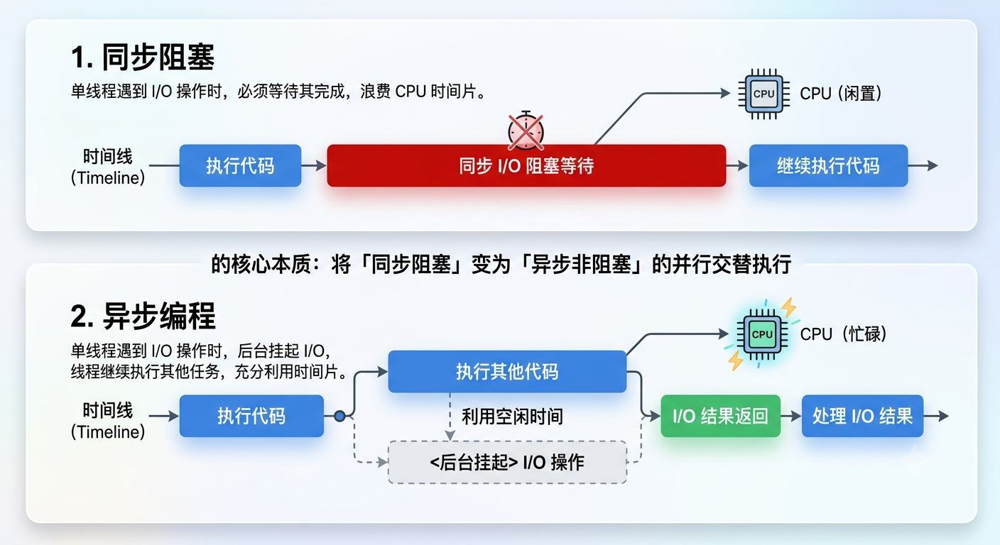

## 核心思想（高并发、高吞吐）

- “异步编程” 方案就是通过 **“协程”** + **事件循环（Event Loop）** 这一组合技术手段来实现的。

​	核心思想：**“异步编程”** 可以让**「单线程」**在面对**高并发I/O 操作**任务的业务场景下，能**通过「多个协程」借助事件循环（Event Loop）机制调度**，**在多个等待间的 I/O 任务之间快速穿梭**，以实现**高吞吐量**的效果。

> **为什么能实现“高吞吐”？（消除线程切换开销）**
>
> - **线程（Thread）太重了：** 在操作系统层面，创建一个线程需要消耗几兆的内存，而且线程之间的上下文切换（Context Switch）需要CPU保存和恢复寄存器，开销极大。当面对上万并发时，多线程单靠内存和切换就能把服务器压垮。
>
> - **协程（Coroutine）极轻：** 协程是**用户态**的**“轻量级线程”**，**协程切换只是一次次普通的函数调用和指针移动**，消耗的内存甚至可以忽略不计（几KB）。所以单线程内跑几十万个协程都轻轻松松。

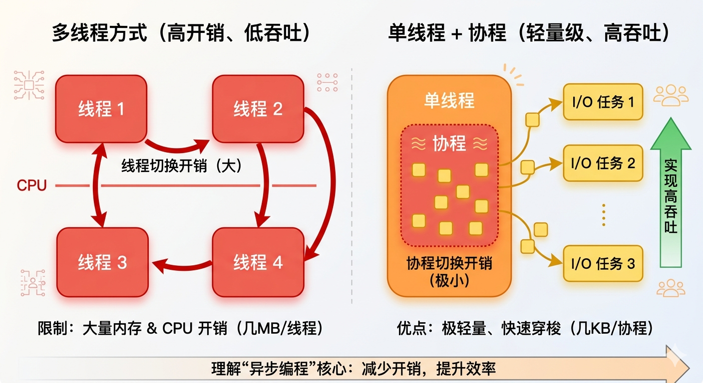

### 对比多线程的核心优势

假设：有一个任务A耗时10s，一个任务B耗时5s，一个任务C耗时2s。

- **异步编程**：当线程执行期间遇到 `await`任务A时，就挂起任务A让其在后台执行，切换到任务B去执行，`await` 任务B接着挂起，执行 `await` 任务C，最终便实现了只靠10s就完成了 3 个任务（因为任务A要 10s，所以最低也要10s）
- **同步阻塞**：则需要10+5+2=17s才能完成。

```
传统多线程 (Threads 轮转):
线程1 [执行]->[ 遇到I/O，阻塞挂起，等待数据... ] -------------> [数据到，恢复执行]
线程2          [执行]->[ 遇到I/O，阻塞挂起，等待数据... ] ----> [数据到，恢复执行]
（此时 CPU 在两个线程切换间空转，且每个线程白白占用 1MB 内存）

Python 异步协程 (Single Thread + Event Loop):
单线程 [执行任务A] -> [A遇I/O，挂起并注册] -> [立刻执行任务B] -> [B遇I/O，挂起并注册] -> [数据到了？立刻回头处理A/B]
（CPU 时间片全在跑代码，没有一刻在干等，且只有 1 个线程的内存开销）
```

## asyncio 模块

Python 3.5 之后推出了一个内置标准库 `asyncio`，专门用于支持现代协程的写法，内部提供了一个事件循环驱动（Event Loop）以及任务调度的解决方案。

核心功能：

- `asyncio` 库是用来编写 **并发** 代码的库，使用 **async/await** 语法
- `asyncio` 库被用作多个 Python 异步框架的基础，这些框架提供高性能网络和网站服务，数据库连接库，分布式任务队列等等
- `asyncio` 库往往是构建 IO 密集型和高层级 **结构化** 网络代码的最佳选择

### 核心组成

> [!NOTE]
>
> “异步编程” 的实现需要以下 2 个核心要素作为不同的角色参与：
>
> - **事件循环（Event Loop）**：”异步编程“ 的**核心调度器**，**由 `asyncio` 模块开启**；它是一个 **`while Ture` 的死循环**，一经启动就会在线程中持续运转，它是线程与多个协程之间 CPU 控制权的统筹管理者。
> - **协程（Coroutine）**：本质上是一个**函数子任务**；在代码上**通过 Python 内置的 `async/await` 关键字组合**来**定义**与**触发**。并**结合 `asyncio` 模块内部的事件循环（Event Loop）完成多协程之间的暂停跳转与切换任务调度**。
>
> 引用：“异步编程” **允许在「单线程」模式下，当线程遇到 I/O 操作时，可以先在 <后台挂起> I/O 操作子任务，利用线程等待 I/O 操作的 “空闲” 时间，让线程去执行其他代码**。
>
> > - **<后台挂起> = 事件循环驱动（Event Loop）的内部队列（Queue）**
> > - **I/O 操作子任务 = 协程（一个 `async def` 定义的协程函数）**

#### 事件循环 与 协程之间的关系

在 **Python 的 `asyncio` 标准库** 或 **前端 JavaScript（Node.js）语言框架**中，都实现了**事件循环（Event Loop）与 协程** 的概念。

- 两者都具备**在「单线程」中实现高并发、高吞吐量**的  **I/O 处理能力**。

##### 具体关系

- **事件循环（Event Loop）**：在底层**持续运行**，用于**统筹 I/O 任务管理与调度**的一个**后台程序**（驱动器）
- **协程（Coroutine）**：具体的 **I/O 任务执行单元**（计算逻辑）

简单来说，**事件循环（Event Loop）是舞台，而协程（Coroutine）是舞台上的演员**。它们共同协作，实现了单线程下的高性能并发（同时处理很多事情，但并不是真正的多核并行）。两者都处于一个单线程中运行。

| **维度** | **事件循环 (Event Loop)**              | **协程 (Coroutine)**                    |
| -------- | -------------------------------------- | --------------------------------------- |
| **角色** | I/O 任务的管理和调度者（驱动器）       | 具体的 **I/O 任务执行单元**（计算逻辑） |
| **数量** | 通常**一个线程只有一个**               | 可以有**成千上万个**                    |
| **本质** | 一个基础的底层 **`while True` 死循环** | 一种用户态的 **“轻量级线程”**           |

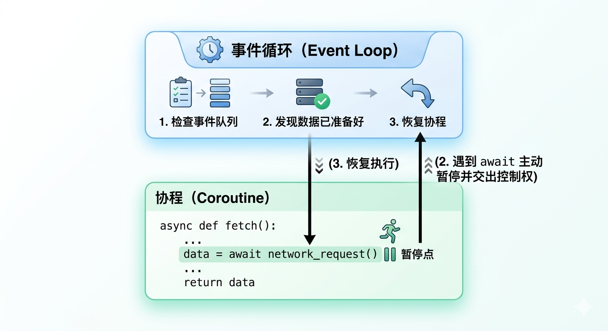

##### 核心关键点

- **协程 `async/await`**：提供了**函数 “可暂停/可恢复”**的**底层能力**；可以**让线程在多个协程之间来回跳转切换与恢复执行**（本质上是**线程在多个协程函数之间 ”上下游走“**）
- **事件循环（Event Loop）**：提供了**函数 “何时暂停/何时恢复”**的管理与调度能力；可以**管理与调度线程中的多个协程任务**（本质上是**管理与协调 I/O 任务资源与线程的 CPU 控制权切换**）

两者组合缺一不可，共同协作**解决**了**线程在遇到 I/O 操作时会陷入阻塞等待的资源等待浪费问题**，从而**实现 Python 在「单线程」中高吞吐量、高可用的并发能力**。

> 为什么说“两者组合，缺一不可”？
>
> - **只有协程，没有事件循环：** 你拥有了可以随时暂停（yield 或 await）的函数，但没有一个“管家”来告诉你什么时候该恢复执行。这就好比顾客暂停了点单，但服务员再也不回来看他了，程序会直接卡死。
>
> - **只有事件循环，没有协程：** 管家（操作系统或轮询机制）知道哪个 I/O 任务好了，但普通的函数一旦开始执行就必须“一条路走到黑”，无法在中间暂停。这就好比服务员想去服务下一桌，但当前这桌顾客死死拽着服务员不让走，依然会造成阻塞。

###### CPU 控制权切换

在**「单线程」异步模型**中，**协程与事件循环（Event Loop）**是**交替运行的两个单位**，所以两者之间的概念是精密相连的。

- 因为**只有一个线程，CPU 同一时刻只能做一件事**：
  - 当事件循环在挑选任务、监听网络状态时，协程代码没有在运行。
  - 当**事件循环（Event Loop）把 CPU 控制权交给某个协程**时，事件循环本身是 **“阻塞/等待” 该协程运行**的。**直到协程遇到 `await` 关键字释放 CPU 控制权，事件循环才重新拿回主导权**

### 协程的实现

#### 发展历程

Python 的异步编程经历了三个主要阶段：

- **一、早期：传统的回调函数（产生地狱）**

  在 Python 还没有原生异步语法的时代（比如早期的 twisted 框架，或者单纯用 selectors 模块写底层事件循环），处理多个依赖上一步结果的异步任务时，代码会长成这样：

  ```python
  # 传统回调写法：多层嵌套，逻辑支离破碎
  def fetch_user_data():
      def on_user_info_loaded(user_info):
          def on_permissions_loaded(permissions):
              def on_UI_updated():
                  print("所有任务完成！")
              
              # 第三步：更新UI
              update_ui_async(permissions, callback=on_UI_updated)
              
          # 第二步：获取权限
          get_permissions_async(user_info, callback=on_permissions_loaded)
  
      # 第一步：获取用户信息
      get_user_info_async(user_id=42, callback=on_user_info_loaded)
  ```

  **痛点：** 代码向右剧烈向右凹陷、异常处理（try...except）极难编写、控制流完全被打碎。这就是典型的**回调地狱**。

- **二、过渡期：基于生成器的协程（Yield Driven）**

  在 Python 3.4 时代，官方引入了 `asyncio` 库，并使用 `@asyncio.coroutine` 装饰器和 `yield from` 语法。这在一定程度上缓解了回调，但语法依旧不够直观：

  ```python
  import asyncio
  
  @asyncio.coroutine
  def fetch_data_legacy():
      # 虽然不再嵌套，但 yield from 的心智负担较重
      user_info = yield from get_user_info_async(42)
      permissions = yield from get_permissions_async(user_info)
      yield from update_ui_async(permissions)
  ```

- **三、现代：Async / Await（地狱终结者）**

  Python 3.5 迎来了终极解决方案：**async 和 await 关键字**。它允许你**用写 “同步代码”的思维和结构，去写“异步代码”**。

  ```python
  import asyncio
  
  async def fetch_data_modern():
      try:
          # 代码是纵向线性的，完全没有嵌套！
          user_info = await get_user_info_async(42)
          permissions = await get_permissions_async(user_info)
          await update_ui_async(permissions)
          
      except Exception as e:
          # 异常处理极其自然，就像普通同步代码一样
          print(f"出错了: {e}")
  
  asyncio.run(fetch_data_modern())
  ```

#### async/await 关键字组合

核心要点：**`async`** 和 **`await`** 关键字通常一起**组合使用**。

- **`async`** 关键字：用于**定义协程**
- **`await`** 关键字：用于**触发协程**

协程本质上是一个**使用 `async def` 关键字定义**的**协程函数**，且**可以随时被 `await` 暂停，并且后续在 `await` 暂停处恢复执行**。

##### 与 yield 生成器的区别

###### 设计理念（迭代器协议）

​	早期 Python 确实是用 `yield` 生成器函数中可以实现 “函数的暂停切换与恢复执行” 的设计理念来**模拟**一个协程的实现，当时主要是通过 **`asyncio.coroutine` 装饰器 + `yield from` 语法** 来实现的。

​	后面 Python 3.5+ 版本之后，Python 专门提供了 **`async/await` 关键字 + 事件循环（Event Loop）**的方案；本质上是**技术原理的继承**（借用了生成器能让函数暂停、保存上下文、随后恢复的设计），以简化代码编写，规定业务场景边界。

核心结论：**`async/await` 不是用 Python 的生成器（`Generator`）实现的**，它们俩是**平级**的兄弟关系，只是**共同继承了 CPython 底层同一个 “函数的暂停切换与恢复执行” 的底层机制（迭代器协议）**，本质上是 ——**堆栈帧对象（Frame）的暂停与恢复**。

换句话说，**原生协程**与**生成器**都是继承并实现了**同一套迭代器协议**的产物，只是走向了两个完全不同进化方向的独立物种。

- 生成器：继承了迭代器协议，并实现了 “函数可暂停恢复的” 能力
- 原生协程：继承了迭代器协议，并实现了 “函数可暂停恢复的” 能力，但**剔除了 `__next__` 魔术方法的实现**，并替代为 **`__await__`** 

| **特性 / 协议魔术方法**  | **迭代器 (Iterator)** | **生成器 (Generator)**  | **原生协程 (Coroutine)** |
| ------------------------ | --------------------- | ----------------------- | ------------------------ |
| **`__iter__()`**         | (返回自身)            | (返回自身)              | ✗ (替代为 `__await__`)   |
| **`__next__()`**         | (驱动迭代)            | (驱动迭代)              | **✗ 彻底剔除**           |
| **`send()` / `throw()`** | ✗                     | (双向数据/异常传递)     | (由事件循环驱动)         |
| **进化核心目的**         | **生产数据** (数据流) | **生产数据 + 状态暂停** | **等待事件** (非阻塞I/O) |

> 虽然 `yield` 和 `async/await` 在底层的“暂停/恢复”机制上共用了一套底座（核心是帧对象的切换），但它们在语义上有着严格的区别：
>
> - **生成器 (Generator)：** 核心目的是**生产数据**。它是一个数据源，调用 `next()` 或在 `for` 循环里遍历它，是为了源源不断地拿到它 `yield` 出来的值。
> - **原生协程 (Coroutine)：** 核心目的是**并发控制**。它代表一个异步执行的任务，它挂起是为了等待某个 I/O 操作完成（比如网络请求、磁盘读取），而不是为了向外部提供中间数据。

由于协程对象是基于迭代器协议实现的，所以 **`async def` 协程函数返回的 `<class coroutine>` 协程对象**也可以**使用 `send()` 方法通信（唤醒协程函数，让线程回到暂停处继续执行）**，但是它**不能使用 `next()` 或 `for x in <协程对象>` 来驱动**，必须**通过事件循环（Event Loop）来调度**，因为 **`async` 协程函数内部 `await` 传递的是 “异步状态”**，而不是要遍历的数据。

> **为什么协程保留了 `send()` 却阉割了 `next()`？**
>
> 其实，在 CPython 底层，**`next(obj)` 的本质就是 `obj.send(None)`**。如果 Python 允许你对协程调用 `next()`，就意味着允许你传一个 `None` 进去**盲目地唤醒它**。
>
> 但**原生协程的挂起是为了等待 I/O 结果**（比如数据库返回的数据）。当它被唤醒时，它需要**接收这个 I/O 结果**。
>
> - **事件循环（Event Loop）** 才是那个知道 I/O 结果的人
> - 当网络数据回来了，事件循环会调用 `coro.send(data)`，把数据精准地“塞回”给协程暂停的地方
>
> 为了**强迫开发者把控制权交给事件循环，不让人类手动去“盲目唤醒”**，Python 直接在 `PyCoro_Type` 的 C 层面**拒绝了 `__next__` 方法**，**只留下了 `send()` 供底层的异步驱动器（如 `asyncio` 的 `Task`）调用**。

###### 底层类型系统的隔离

在 CPython 的底层源码中，两者的 C 结构体定义虽然非常相似，但它们是**完全独立**的两个类型：

- **生成器对象** 的底层类型是 `PyGen_Type`
- **原生协程对象** 的底层类型是 `PyCoro_Type`

```
					┌────────────────────────┐
                    │  CPython 帧暂停/恢复机制 │
                    └───────────┬────────────┘
                                │
        ┌───────────────────────┴───────────────────────┐
        ▼                                               ▼
  【 生成器线 】                                   【 原生协程线 】
  沿用内核机制衍生出: PyGen_Type                      沿用内核机制衍生出: PyCoro_Type
  
  * 语法外壳: yield / yield from                   * 语法外壳: async def / await
  * 核心任务: 迭代/生产数据                          * 核心任务: 异步 I/O 并发调度
  * 驱动工具: next()                               * 驱动工具: 事件循环 / Task
```

> 这一切的原因是因为 **Python 的历史包袱**：
>
> - **历史上的过渡期：** 在 Python 3.4 时代，原生协程（`async/await`）还没出生。那时候为了实现异步，官方迫不得已，只能用现成的生成器去“客串”协程。那时候写异步代码得加 **`@asyncio.coroutine` 装饰器，里面用 `yield from`**。**那段历史，确实是用生成器模拟了协程。**
>
>   ```python
>   import asyncio
>   
>   # 早期的协程实现
>   @asyncio.coroutine # 注意：Python 3.8 已移除！
>   def task():
>       print("task start")
>       # 模拟 I/O 操作
>       yield from asyncio.sleep(2) # 线程在这里会暂停执行，并切换到调用者函数执行
>       print("task end")
>   ```
>
> - **后来的彻底分家：** 到了 Python 3.5，官方终于忍不了这种“借壳上市”的混乱语义了，于是直接在底层 C 语言层面，照着生成器的核心底座，重新复制并优化了一套全新的类型（`PyCoro_Type`），并赐予了它专用的 `async/await` 关键字。
>
>   ```python
>   import asyncio
>                             
>   async def task():
>       print('task start')
>       # 模拟 I/O 操作
>       await asyncio.sleep(2) # 线程在这里会暂停执行，并切换到其他函数执行
>       print("task end")
>   ```
>
>   > 也就是说 **`async` 关键字代替了 `@asyncio.coroutine` 装饰器，`await` 关键字代替了 `yield from`**。

#### async def 定义协程

##### 基本语法

```python
async def <协程函数名>():
    pass
```

核心作用：**使用 `async def` 定义**的**协程函数**可以传入给 **`asyncio.run()` 或 `await` 关键字使用**，表示这是一个**协程**。

- 当**调用 `async def` 协程函数**时，会**对外返回一个 `<coroutine object...>` 协程对象**。

##### 协程函数

###### 调用机制

​	当**把 `async def` 定义的协程函数**当做**普通函数一样直接调用**时，线程不会进入协程函数内执行，也就**不会立即执行协程函数内的代码**，而是**直接对外返回一个 `<coroutine object...>` 协程对象**。

普通函数：

```python
# 普通函数
def normal_func():
    print("normal_func 普通函数执行中...")
    return 'normal_func 普通函数调用的结果'


# 普通函数调用
normal_result = normal_func()
print(normal_result)

'''
输出结果：
normal_func 普通函数执行中...
normal_func 普通函数调用的结果
'''
```

协程函数：

```python
# 协程函数
async def async_func():
    print("async_func 协程函数执行中...")
    return 'async_func 协程函数调用的结果'

# 协程函数直接调用
coroutine_obj = async_func()
print(coroutine_obj)

print('主线程 end')

'''
输出结果：
<coroutine object async_func at 0x000001D6E9B9C8C0>
主线程 end

抛出提示：<sys>:0: RuntimeWarning: coroutine 'async_func' was never awaited
'''
```

> [!NOTE]
>
> **底层原理：**
>
> 在 Python 中，*万物皆对象*，函数也是一样。
>
> - 在 Python 底层**编译时**：
>
> ​	Python 编译器会**扫描所有通过 `def` 定义的普通函数**，先为所有函数都**构建出一个函数对象**，函数对象内包含相关的代码段、标志位（Flag）、栈帧上下文等等信息...；而一旦**检测到 `async def` 定义的协程函数**，Python 编译器会为其构造的**协程函数对象内添加一个 `CO_COROUTINE` 的特殊标志位（Flag）**。
>
> ​	注意点：在 CPython 解释器**运行时，栈堆内存的 CPU 指针切换调度的目标就是函数对象**。
>
> - 在 Python 底层**运行时**：
>
>   **CPython 解释器读取并调用某个函数时**，会**先判断该函数对象内是否有 `CO_COROUTINE` 标志位**：
>
>   - 如果**有  `CO_COROUTINE` 标志位**：则代表该函数是一个**协程函数**；
>
>     ​	CPython 解释器会**在堆内存中开辟一块空间**，用于**保存该协程函数的栈帧容器（函数代码、上下文变量）**表示一个**堆帧（Heap Frame）**，同时**冻结该协程函数的代码**【类似于 “生成器”函数】，并会**返回一个 `<coroutine object...>` 协程对象**给外部的变量接收
>
>   - 如果**没有 `CO_COROUTINE` 标志位**：则代表该函数是一个**普通函数**；则**直接进入函数体内执行代码语句**
>
> ```python
> # 简化后的 Python 底层 C 语言伪代码逻辑
> if (flags & CO_COROUTINE) {
>     # 发现是异步函数！不执行代码，直接打包成一个协程对象返回
>     return PyCoro_New(frame, ...); 
> } else {
>     # 普通函数，老老实实从第一行执行到最后一行
>     return PyEval_EvalFrameEx(frame, ...);
> }
> ```
>
> 这也就是为什么当协程函数被当做一个普通函数调用时， 线程不会立即执行函数体内的代码，而是返回一个协程对象的根本原因。
>
> 核心结论：Python 的 **`async def` 函数**在底层被彻底重新设计了，它根本**不是一个传统的 “函数”（“执行任务”）**，而是一个 **“协程对象工厂”（“创建任务”）**。
>
> 
>
> > 由于协程对象是**基于迭代器协议实现**的，所以需要**额外通过 `<class coroutine>` 协程对象调用它的 `send()` 方法来手动唤醒协程函数执行**。
> >
> > - **`await` 关键字和事件循环内部就是通过不断调用协程对象的 `send()` 方法来实现协程函数驱动调度的**
> >
> > ```python
> > # 协程函数
> > async def async_func():
> >     print("async_func 协程函数执行中...")
> >     return 'async_func 协程函数调用的结果'
> > 
> > try:
> >     # 1. 仅仅拿到 <class coroutine> 协程对象，此时什么都不会打印
> >     coroutine_obj = async_func()
> >     # 2. 像事件循环一样，手动给它发送一个 None 信号
> >     coroutine_obj.send(None)
> > except StopIteration as e:
> >     # 协程执行完没有后续 await，会正常抛出 StopIteration 结束
> >     print(e.value)
> > 
> > '''
> > 输出结果：
> > async_func 协程函数执行中...
> > async_func 协程函数调用的结果
> > '''
> > ```

##### 协程对象

当**调用一个用 `async def` 定义的协程函数**时，它并**不会立即执行函数体内的代码**，而是会返回一个**协程对象**。

这个对象内部**封装了让程序能够“在暂停后精准恢复”的所有必要数据**。

- 协程对象（Coroutine Object）本质上是一个**处于暂停状态的、可恢复的函数执行上下文**。

###### 存储结构

一个协程对象内部主要包含了以下 4 个核心内容：

- **局部变量和函数参数表（Frame Context）**：

  - **参数值**：传给协程函数的初始参数

  - **局部变量**：协程函数内部创建的临时变量

  - **值栈（Evaluation Stack）**：正在进行计算的临时中间结果

  > **对比普通函数**：
  >
  > 普通函数的局部变量和函数参数存放在系统的**栈内存（Stack）**中，函数一旦 return，栈帧就被销毁了。
  >
  > 而**协程函数**的**局部变量和函数参数**存放在**堆内存（Heap）**中，即使暂停了，**数据依然完好无损地保存在内存里**。

- **执行状态与代码指针（Instruction Pointer）**：

  - 字节码指针：指向**当前暂停处的下一条底层字节码指令**

  - **协程状态机**：记录协程当前处于什么生命周期阶段，通常是一个**常量值**

    分为 2 个层面：

    - C 语言层面（4 个）：

      | **C 语言常量名**      | **整数值** | **底层字面含义** | **什么时候触发**                                             |
      | --------------------- | ---------- | ---------------- | ------------------------------------------------------------ |
      | **`FRAME_CREATED`**   | `-2`       | **刚创建**       | 仅创建协程对象，未被 `await` 使用，处于**未激活**状态        |
      | **`FRAME_SUSPENDED`** | `-1`       | **已挂起**       | 协程执行到了内部的某个 `await` 表达式，交出控制权，正在**等待** I/O 返回结果 |
      | **`FRAME_EXECUTING`** | `0`        | **正在执行**     | CPU 正在**一行行跑**这个协程内部的代码（只要它被 `await` 激活了且没被挂起） |
      | **`FRAME_CLEARED`**   | `1`        | **已清除/结束**  | 协程内部的代码全部执行完毕（或者遇到异常退出了），栈帧内存被清空 |

    - Python 语言层面（4 个）：

      | **Python 状态值 (字符串)** | **对应底层的 C 状态** | **实际含义**                                              |
      | -------------------------- | --------------------- | --------------------------------------------------------- |
      | **`CORO_CREATED`**         | `FRAME_CREATED`       | 协程对象已创建，但**还没有被 awaited**（未激活）          |
      | **`CORO_RUNNING`**         | **`FRAME_EXECUTING`** | 协程正在运行中                                            |
      | **`CORO_SUSPENDED`**       | `FRAME_SUSPENDED`     | 协程在某个 `await` 处**暂停**了（等待被事件循环重新唤醒） |
      | **`CORO_DONE`**            | `FRAME_CLEARED`       | 协程已经**执行完毕**或被销毁                              |

    可以通过 **`<class coroutine>` 协程对象**的 **`cr_suspended`** 和 **`cr_running`** 属性判断该协程对象的运行状态

    > **注意**：在 Python 层面，当协程**处于 `cr_suspended`（挂起）**状态时，`cr_running` **必然为 False**。因为此时控制权已经交还给了事件循环（Event Loop），协程本身并没有在运行代码。

    ```python
    import asyncio
    import inspect
    
    
    async def my_coroutine():
        print("--- 协程内部：刚开始运行 ---")
        # 此时协程正在运行，打印它自己的状态
        # 注意：我们使用 asyncio.current_task() 获取当前协程
        current_frame = inspect.currentframe()
        print(
            f"Inside - cr_running: {current_frame.f_back.f_code.co_name if current_frame.f_back else 'Unknown'}")
    
        # 模拟异步挂起
        await asyncio.sleep(1)
        print("--- 协程内部：被唤醒并结束 ---")
    
    
    async def main():
        # 1. 创建协程对象（此时它还没开始运行）
        coro = my_coroutine()
    
        print(f"1. 刚创建时 cr_running: {coro.cr_running}")
        # 输出: False (因为还没被事件循环调度)
    
        # 2. 我们把协程包装成 Task 并运行
        task = asyncio.create_task(coro)
    
        # 让出一下控制权，让 task 有机会运行到 await asyncio.sleep(1)
        await asyncio.sleep(0.1)
    
        print(f"2. 遇到 await 挂起时 cr_running: {coro.cr_running}")
        # 输出: False (因为此时它在 sleep 挂起等待中，没有在消耗 CPU 运行)
    
        # 3. 等待任务彻底结束
        await task
        print(f"3. 运行结束时 cr_running: {coro.cr_running}")
        # 输出: False (已经死掉/结束的协程也是 False)
    
    asyncio.run(main())
    ```

    协程的状态流转：

    ```
    [ 创建协程 ] 
        │  (cr_running = False)
        ▼
    [ 事件循环调用 loop.run_until_complete() 或 await ]
        │  
        ▼
    [ 正在执行代码 ] ◄────────────────┐
        │  (cr_running = True)       │
        ▼                            │ (唤醒，重回运行)
    [ 遇到 await 异步操作 ]          │
        │                            │
        ▼                            │
    [ 协程被挂起 (Suspended) ] ───────┘
        │  (cr_running = False)
        ▼
    [ 协程执行完毕 / Return ]
    ```

  > 通过协程状态机，**可以让线程知道此时协程函数的运行状态**。
  >
  > 通过**字节码指针**，**可以让协程知道下一次被唤醒时，应该从哪一行代码继续往下执行**。

- **底层迭代器协议（`__iter__` 和 send()、`__await__`）**：

  在 Python 内部，**协程对象**的底层其实是**基于迭代器协议（Iterable Protocol）**的演进高级版。

  - **`<class coroutine>` 协程对象**内部实现了 **`send()`、`throw()`、`close()` **方法
  - **事件循环（Event Loop）**内部就是通过**任务 Task 不断调用 协程对象的 `coroutine.send()` 方法**，把**异步操作的结果发送回给协程对象，从而驱动着它往下走**

  > 类似于生成器函数对象的 `yield` 和 `send()` 一样的**双向通信机制**。

- **异常与返回值槽位（Result / Exception Slot）**：

  - 当协程最终执行完毕（遇到 return）时，它的返回值会存放在对象内部的特定槽位中，并抛出一个 `StopIteration` 异常，**把这个值带给等待它的上层协程**。
  - 如果协程执行中途报错了，这个异常也会被记录在对象内，并向上抛给事件循环。

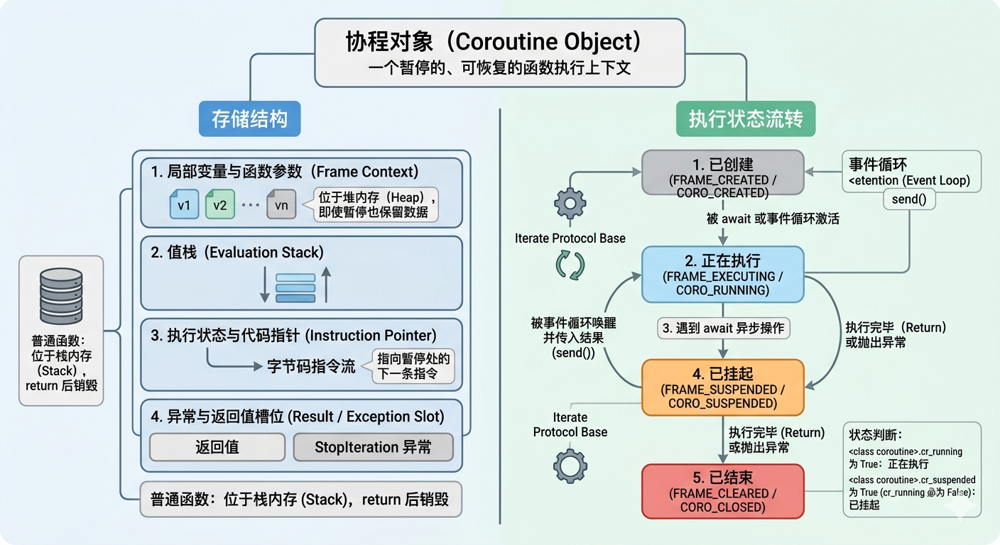

###### 类型

协程对象的所属类是 **`<class 'corouotine'>`**，可以通过 **`types.CoroutineType`** 类来判断：

```python
import types

# 协程函数
async def async_func():
    print("async_func 协程函数执行中...")
    return 'async_func 协程函数调用的结果'

# 返回一个协程对象
coroutine_obj = async_func()

print(coroutine_obj)  # <coroutine object async_func at 0x0000022F302768C0>
print(coroutine_obj.__class__)  # <class 'coroutine'>
print(isinstance(coroutine_obj, types.CoroutineType))  # True
```

###### 使用机制

**`async def` 协程函数调用**后返回的 **`<class coroutine>` 协程对象**必须**传入给 `asyncio` 模块的 `run()` 或 `gather()` 方法使用**。

- 目的是**为了让事件循环（Event Loop）来驱动 `<class coroutine>` 协程对象的下一步内容**

否则在程序执行完毕后，Python 会抛出异常提示 `<sys>:0: RuntimeWarning: coroutine 'async_func' was never awaited`。（注意它只是个被捕获处理的提示，并不会导致程序崩溃），这是源于 **Python 底层的垃圾回收机制**导致的。

```python
# 协程函数
async def async_func():
    print("async_func 协程函数执行中...")
    return 'async_func 协程函数调用的结果'

# 协程函数直接调用
coroutine_obj = async_func()
print(coroutine_obj)

print('主线程 end')

'''
输出结果：
<coroutine object async_func at 0x000001D6E9B9C8C0>
主线程 end

抛出提示：<sys>:0: RuntimeWarning: coroutine 'async_func' was never awaited
'''
```

> [!NOTE]
>
> **Python 垃圾回收机制检测**：
>
> 在 Python 的 C 语言底层实现中，**协程对象**有一个**状态标志**（可以理解为 **`cr_frame`** 或者是**状态机的指针**）。
>
> - 如果用了 **`await`** 或者是**通过事件循环（如 asyncio.run(main())）驱动 `<class coroutine>` 协程对象**，这个协程就会**开始执行**，状态会变为**“已激活（CORO_CREATED）”或“已结束（CORO_CLOSED）”**
>
> - 如果只是**像普通函数一样简单的执行一次**，它的状态就永远停留在 **“未激活”**
>
> 在 Python 脚本即将结束，准备销毁协程对象时，**会调用底层的析构函数（类似于 Python 里的 `del` 关键字）**。
>
> Python 在这个析构函数（`del` 关键字）里写了一段检查逻辑：**“如果这个协程对象要被销毁了，但它的状态依然是‘从未激活’，说明开发者创建了它却把它忘在脑后了。”**
>
> 于是，Python 底层就会立刻调用 PyErr_WarnEx 抛出这个 RuntimeWarning 异常。
>
> 如下代码示例：
>
> ```python
> import sys
> import gc
> 
> async def main():
>     print('hello')
> 
> print("1. 准备创建协程")
> result = main()  # 这一步极其安静，什么都不会发生
> 
> print("2. 协程已经创建，赋值给了 result")
> 
> print("3. 准备手动删除 result 变量")
> del result      # 删掉引用，触发垃圾回收
> 
> print("4. 脚本结束")
> 
> '''
> 输出结果：
> 1. 准备创建协程
> 2. 协程已经创建，赋值给了 result
> 3. 准备手动删除 result 变量
> sys:1: RuntimeWarning: coroutine 'main' was never awaited
> 4. 脚本结束
> '''
> ```

#### await 触发协程

##### 基本语法

```python
async def <协程函数名>():
    <返回结果> = await <其他协程函数>()
```

核心作用：

- **让渡 CPU 控制权：暂停中断当前协程函数的执行，从上次暂停处位置恢复继续执行**

  > ​	**核心本质：** `await` 能够让渡控制权的前提，是整个调用链的底层**必须产生并 `yield` 出了一个真正代表异步 IO 的 `Future` 对象**。
  >
  > ​	如果底层（如协程B）只是个普通计算，它最终返回的是一个具体的值（或者 `None`），根本没有触发向上的 `yield` 挂起流程。
  >
  > ​	这也是为什么执行 `asyncio.sleep(1)` 可以切换任务，而执行 `time.sleep(1)` 会卡死整个事件循环的原因（因为后者不产生 `Future` 对象，不让出 CPU 控制权）。

- **I/O 操作与事件循环（Event Loop）之间的 “沟通桥梁”（通过 `await` 向上逐层传递的 `Future` 对象）**

核心特征：

- `await` 关键字**只能在 `async def` 定义内的异步函数内使用**
- `await` 关键字**后面只能写『可等待的对象』**；如 **`<class coroutine>` 协程对象、`Future` 对象、`Task` 任务对象**

核心作用：

- **控制流——向下委托，就地冻结（暂停）**：

  **`await`** 会**就地暂停中断当前协程函数（任务 Task）的执行**，**冻结当前函数的上下文和栈帧（Stack Frame）并挪到堆内存中存储（堆帧 Heap Frame）**，主动**让出 CPU 控制权给事件循环（Event Loop）**；

  本质是——**函数栈帧（Stack Frame）从线程栈向堆内存（Heap）的搬移与恢复**。

- **数据流——向上抛出，直达顶层（让出）**：

  **`await`** 会**顺着调用链通过 `yield Future` 反向、逐层向上抛出 `Future` 对象，穿透协程函数A、B，直到顶层的事件循环（Event Loop），CPU 控制权交还给事件循环（Event Loop）**，并根据**协程对象的`send()` 方法**在**上一次 `await` 暂停处重新恢复执行**

  本质是——**利用 Python 生成器（Generator）底层的 `yield` 机制，把代表未来结果的 `Future` 对象一路向上冒泡传递到顶层事件循环手里**。

##### Future 对象

核心定义：当**线程执行 `await` 遇到一个 I/O 阻塞操作**时，**Python 内置的 I/O 标准库（如网络请求库）会抛出一个 `Future` 对象**。

核心机制：`Future` 对象**包含着 I/O 操作任务的状态、返回结果**等信息...，`await` **会按照调用栈链条进行回溯，逐层向上穿透抛出**，直到**顶层的事件循环（Event Loop）接收**。

核心作用：**当顶层的事件循环（Event Loop）接收到 `Future` 对象**之后，就会**将 I/O 操作（`await`）所在的当前函数栈帧暂停冻结，并保存到堆内存中（堆帧【Heap Frame】），直到 I/O 操作返回结果后恢复执行**。

核心价值：**`Future` 对象**就是**事件循环（Event Loop）控制线程进行任务切换调度的关键点**，由 **`await` 关键字负责逐层 “传送” 抛出它**。

流程如下示例：

```
⚡ 【向下调用流：控制权委托】                                 🎈 【向上抛出流：Future 穿透】

 [ 事件循环 Event Loop ]                                   [ 事件循环 Event Loop ]
        │                                                         ▲
        │ 1. Task 调用协程对象.send() 初次激活                        │ 5. 接住 Future, 挂起整个 Task
        ▼                                                         │
   [ 协程函数 A ]                                              [ 协程函数 A ]
        │                                                         ▲
        │ 2. await B (创建 A 的堆帧)                                │ 4. yield Future (顺着调用栈回溯)
        ▼                                                         │
   [ 协程函数 B ]                                              [ 协程函数 B ]
        │                                                         ▲
        │ 3. await C (创建 B 的堆帧)                               │ 3. yield Future 向上冒泡
        ▼                                                         │
   [ I/O 函数 C ] ───► 1. 触发 asyncio 标准库 ───► 2. 产出 Future(PENDING) ──┘
                             │
                             ▼ (建立映射: FD ──► Future)
                       [ 操作系统内核 (epoll) ]
```

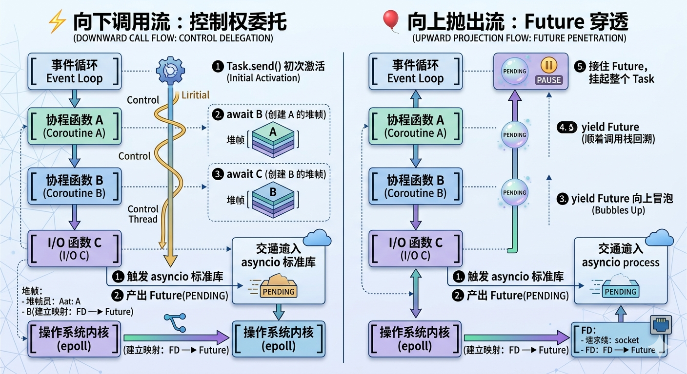

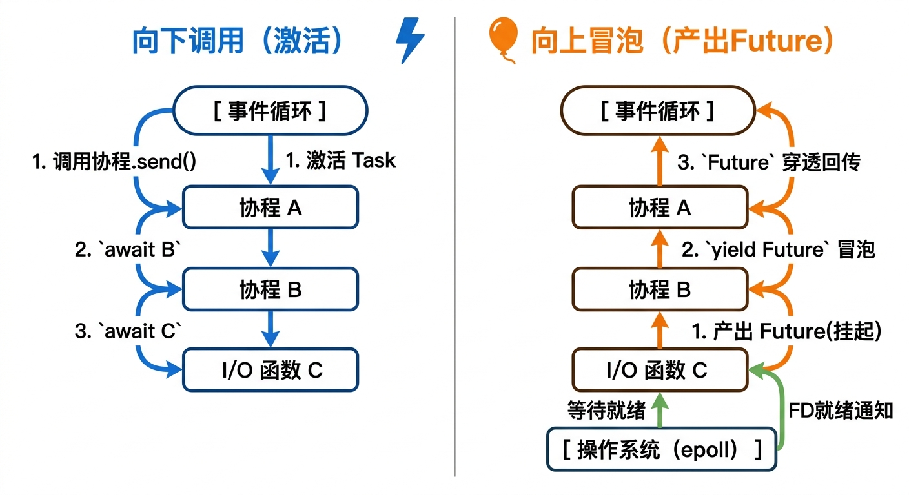

###### 存储结构

在 `asyncio` 异步编程中， `Future` 对象充当着【**任务 Task > 事件循环 < I/O 操作任务**】三者之间的 **“信息载体”**。

核心定义：当**线程执行 `await` 遇到一个 I/O 阻塞操作**时，**Python 内置的 I/O 标准库（如网络请求库）会抛出一个 `Future` 对象**。

- `Future` 对象主要包含以下属性结构：

```python
class Future:
    def __init__(self, loop):
        self._loop = loop
        self._state = 'PENDING'
        self._result = None
        self._exception = None
        self._callbacks = []
```

属性描述：

- **`_state`（I/O 状态）：异步 I/O 操作的任务状态**

  - **`PENDING` 等待中：异步 I/O 操作刚创建**，还**在系统内核 “排队等待” 或进行中**
  - **`CANCELLED` 已取消：异步 I/O 操作在完成之前被手动 `cancel()` 取消了**
  - **`FINISHED` 完成态：异步 I/O 操作完成（成功/失败）**

  > 可通过 `future._state` 访问到，或者是（`done()`、`cancelled()`、`running()`）

- **`_result`（I/O 结果）**：

  ​	当 **`_state` 为 `FINISHED`** 时，Python **内置 I/O 标准库会**从系统内核缓冲区中**将 I/O 操作结果注入 `_result`属性中存放**。

  > 可通过 `future.reuslt()` 方法直接获取。

- **`_exception`（I/O 异常）**：

  ​	如果**异步 IO 失败**（如超时、断网等不可抗外力因素），导致操作崩溃，异常对象会被捕获并存放在 `_exception` 属性中。

- **`_loop`（事件循环的引用）**：

  ​	**当前 `Future` 对象对所属事件循环（Event Loop）的引用**，确保 `Future` 知道该把后续的唤醒通知发送给哪一个事件循环。

  ​	原因：`asyncio.run()` 可以调用多次，所以理论上会存在多个事件循环，只是不建议这么做

- **`_callbacks`（回调函数列表）**：

  - 当 **`_state` I/O 状态为 `PENDING` **时，表示 **I/O 操作刚创建**
    - 所属的**「任务 Task」 会通过 `future.add_done_callback()` 方法注入它自己的『回调函数』**在 I/O 操作返回的 `Future` 对象的 **`_callbacks` 属性中**
    - 用于**后续 I/O 操作完成，唤醒「任务 Task」**
  - 当 **`_state` I/O 状态为 `FINISHED`** 时，表示 **I/O 操作已完成**
    - **事件循环（Event Loop）依次调用 `Future` 对象的 `_callbacks` 回调函数列表，唤醒所属「主任务 Task」**
    - **「任务 Task」调用 `future.result()` 方法拿到 I/O 操作结果**，**重新 "激活" 回到事件循环的就绪队列中 “排队等待” 执行**

  流程如表：

  | **阶段**        | **状态 (_state)** | **_callbacks 列表内部情况** | **发生的事情**                                               |
  | --------------- | ----------------- | --------------------------- | ------------------------------------------------------------ |
  | **1. 阻塞挂起** | `PENDING`         | `[Task._wakeup]`            | `Task` 遇到 `await`，把自己的唤醒函数塞进列表，然后让出 CPU  |
  | **2. 内核完成** | `FINISHED`        | `[Task._wakeup]`            | 操作系统通知事件循环，数据被注入 `_result`                   |
  | **3. 循环唤醒** | `FINISHED`        | `[]` *(清空并执行)*         | 事件循环把列表里的 `Task._wakeup` 拿出来执行，`Task` 回到就绪队列 |

###### 核心结论

`Future` 对象

- 用 `_result` 和 `_exception` 承载“数据”
- 用 `_state` 记录“时机”
- 用 `_callbacks` 牵引“任务（Task）”
- 最终在 `Event Loop` 的调度下实现无缝的非阻塞运转


##### 核心流程

`await` 关键字是否能发挥实际作用，**取决于 `await` 后面的『可等待的对象』中是执行了什么操作**：

###### 无 I/O 操作

```python
import asyncio

async def <协程函数A>():
    # ...
    <返回结果> = await <协程函数B>()
    # ...

async def <协程函数B>():
	# 一些简单的计算逻辑

asyncio.run(<协程函数A>())
```

执行流程：

> 准备阶段：
>
> - **`asyncio.run()` **将**「协程函数 A」打包成一个主任务 Task**，**塞入到事件循环的就绪队列（Ready Queue）中 “排队等待”**
> - 此时，**就绪队列（Ready Queue）中的内容为 `[Task_A]`**

一、*向下调用*：

1. **事件循环（Event Loop）**初始化创建后，通过**任务 Task 调用协程对象的 `send()` 方法**开始**第一次 “激活”** 执行**「协程函数 A」（主任务）**

2. 线程在「协程函数A」内 **遇到 `await <协程函数B>()`** 的函数调用，栈内存**扩展出一个调用栈**：

   此时 **`await`** 关键字会**暂停冻结**当前**「协程函数A」**的执行，**线程进入「协程函数B」（子任务）去执行**

3. **「协程函数B」** 只是一个纯粹的普通函数。线程**没有遇到任何的 I/O 阻塞操作**，全都是 CPU 密集型计算任务：

   那么**线程会一直同步顺序往下执行**，直到语句末尾处执行完毕返回结果；

****

二、*CPU 控制权回归*：

1. 「协程函数B」执行完毕，**线程跳出「协程函数B」**，将 **CPU 控制权交还给上层直接调用者「协程函数A」**继续往下执行
2. 「协程函数A」执行完毕，**事件循环（Event Loop）关闭**
3. **线程退出 “异步程序”，回到 “同步程序” 中继续往下执行**

****

> 在这整个过程中，由于 **CPU 控制权一直在线程手中执行着协程函数A、B**，所以**事件循环（Event Loop）**一直是**睡眠状态**，从未插手过。所以虽然协程函数A 中写了 `await` 关键字，但**实际上并没有发生任何的任务切换**。

本质上**「协程函数A」（主任务）**还是**『同步阻塞式』**的代码执行。即**异步代码被同步阻塞**，如果这个同步代码耗时很长，会导致整个事件循环（Event Loop）卡死，其他排队等待的协程任务全部无法运行。

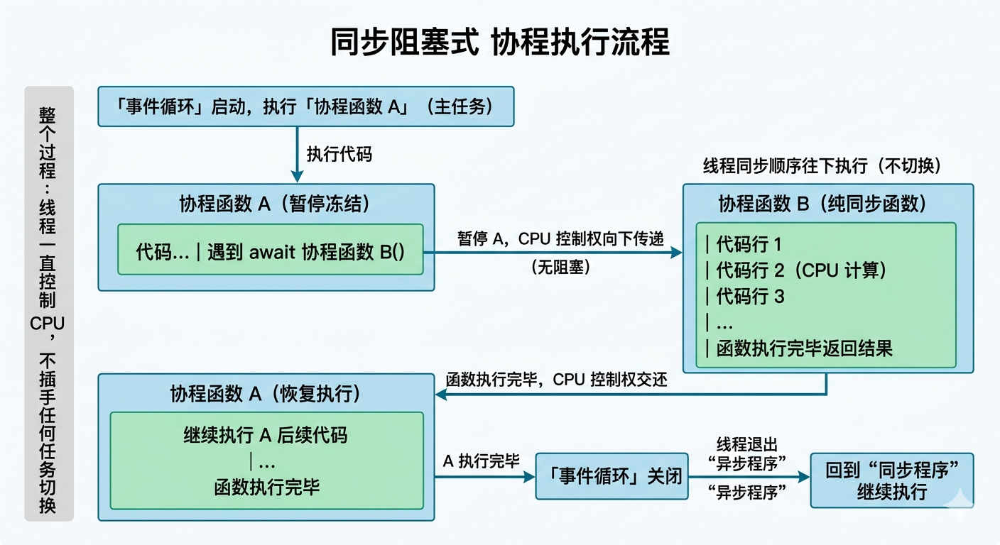

###### 有 I/O 操作

假设有以下代码：

```python
import asyncio
import httpx # Python I/O 标准库（网络请求）

async def <协程函数A>(): # 1.线程进入
    # ...
    <返回结果> = await <协程函数B>() # 6.接着抛 Future 对象👆，直到顶层的事件循环（Event Loop） 接收到
    # ...

async def <协程函数B>(): # 2.`await` 暂停冻结协程函数A的执行，线程进入协程函数B（“子过程”）内执行 
    # ...
    <I/O 返回结果> = await <I/O操作函数C>() # 5.接着抛 Future 对象👆
    # ...

async def <I/O操作函数C>(): # 3.`await` 暂停冻结协程函数B的执行，线程I/O操作函数C进入（“子过程”）内执行 
    # ...
    # I/O 阻塞操作
    # response = await httpx.AsyncClient().get(xxx) # 4.与系统OS内核对接，抛出一个 Future 对象👆
    # return response

asyncio.run(<协程函数A>())
```

执行流程：

> 准备阶段：
>
> - **`asyncio.run()` **将**「协程函数 A」打包成一个主任务 Task**，**塞入到事件循环的就绪队列（Ready Queue）中 “排队等待”**
> - 此时，**就绪队列（Ready Queue）中的内容为 `[Task_A]`**

一、*向下调用*：

1. **事件循环（Event Loop）**初始化创建后，通过**任务 Task 调用协程对象的 `send()` 方法**开始**第一次 “激活”** 执行**「协程函数 A」（主任务）**

2. 线程在**「协程函数A」**内 **遇到 `await <协程函数B>()`** 的函数调用，栈内存**扩展出一个调用栈**：

   此时 **`await`** 关键字会**暂停冻结**当前**「协程函数A」**的执行，让**线程进入「协程函数B」（子任务）去执行**

3. 线程在**「协程函数B」** 内**遇到 `await <I/O操作函数C>()`** 的函数调用，栈内存**又扩展出一个调用栈**：

   此时 **`await`** 关键字会**暂停冻结**当前**「协程函数B」**的执行，让**线程进入「I/O 操作函数C」（子任务）去执行**

4. **「I/O操作函数C」** 内的**I/O 阻塞操作**会**调用** Python 内置的 **I/O 标准库，与系统内核驱动对接**

> **CPU 执行流：协程函数A →（await 中断）→  协程函数B →（await 中断）→  I/O 操作函数C**
>
> 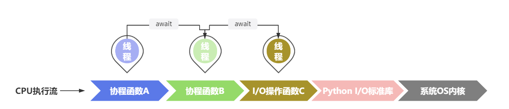

****

二、*触发系统OS内核，产出 `Future` 对象、注册重新激活Task的回调函数、冻结函数栈帧到堆内存*：

1. Python 内置的 **I/O 标准库会向系统OS内核发送 I/O 操作请求**，此时会有以下 2 个动作：

   1. **系统OS内核抛出一个文件描述符FD**、**注册到系统OS内核中的 `epoll` / `Selector` 里 “排队等候”** 硬件来执行 I /O 操作
   2. Python 内置的 **I/O 标准库会产出一个 `Future` 对象**，设置 `_state` 属性为 **`PENDING` 状态**，并**在事件循环（Event Loop）内部的映射表**中，**建立**一个 **`文件描述符 DF -> Future 对象`** 的**映射关系**

2. **「协程函数A、B」（主任务 Task）**会**通过 `future.add_done_callback()` 方法注册自己的一个回调函数 `Task._weakup` 到 `Future` 对象的 `_callbacks` 回调函数列表属性中**，同时**将「主任务Task」与 `Future` 对象建立绑定关联**。

   ​	用于**后续 `Future` 对象状态变成 `FINISHED` 完成态后触发执行**。**重新把 <主任务 Task 自己> 放回到事件循环的就绪队列（Ready Queue）中，等待下一次 CPU 轮询**。

****

三、*`await` 向上穿透逐层传递 `Future` 对象，直达顶层事件循环（Event Loop）*：

1. **「I/O操作函数C」**会将Python 内置的 **I/O 标准库** 返回的 `Future` 对象返回给上层直接调用者「协程函数B」

2. **「协程函数B」**接收到 **`await <I/O操作函数C>()` 返回的 `Future` 对象**后，会**通过 `yield Future` 机制**：

   - 使用 **`await` 顺着「协程函数A、B」调用链的栈堆进行回溯**，将 **`Future` 对象**一路**向上冒泡穿透传递**给**顶层的事件循环（Event Loop）接住**
   - 在此过程中，会**将 `await` 经过的「协程函数A、B」的状态、上下文，以及整个「任务 Task」，一起暂停冻结（函数栈帧被保存到堆内存中）**，等待**后续恢复执行**

   > 注意：在**事件循环（Event Loop）视角**中，**「协程函数A」是一个主任务 Task**，**「协程函数B」**就是**主任务 Task 中包含的一个 “子过程”**。
   >
   > 所以这一切都是**以任务 Task  为单位**进行操作的，**任务 Task**是事件循环（Event Loop）中**最小的并发执行单元**。

3. 此时，「协程函数A、B」（主任务 Task）一整个**调用链**的 **CPU控制权主动让出，交还给了事件循环（Event Loop）**

****

四、*事件循环（Event Loop）开始插手运行、挂起协程A、B调用链条（任务 Task）到堆内存*：

1. **事件循环（Event Loop）收到 `Future` 对象**之后，**确认**该 `Future` 对象的**状态为 `PENDING` 等待中**
2. 把**当前被挂起的整个协程调用链条（也就是包裹了「协程函数A、B」的 Task 主任务对象）放入 ”堆内存“ 中暂存**

****

五、*事件循环（Event Loop）检测就绪队列（Ready Queue）*：

1. 为了**不让线程等待 I/O 操作而 “空闲” 下来**，事件循环（Event Loop）会**继续遍历就绪队列（Ready Queue）中的剩余任务**：

   - **就绪队列（Ready Queue）不为空**：表示**有可执行任务**（如`[Task_D、Task_E...]`），**CPU 控制权会交给线程去执行任务D、E...**

   - **就像队列（Ready Queue）为空**：表示**没有可执行任务**（如 `[]`）

     事件循环（Event Loop）调用系统内核的 `epoll_wait` 机制**主动陷入『阻塞』状态并彻底让出 CPU 进入沉睡**，**死等底层的 I/O 操作结果返回**；

     线程也一样，这就是为什么 **`asyncio.run()` 会阻塞当前线程**的核心原因。

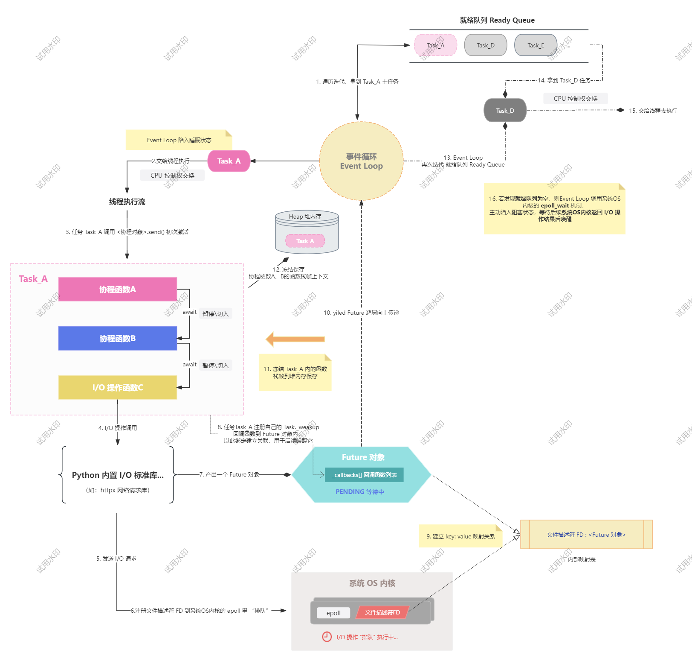

*****

六、*I/O 操作结果返回、系统OS内核强制唤醒事件循环（Event Loop）、`Future` 对象状态改为 `FINISHED`*：

1. 当**系统 OS 内核中的 I/O 操作执行完成，返回结果**后，会直接**发送一个硬件中断信号（包含 文件描述符 FD），强制唤醒事件循环（Event Loop）**

   > 硬件中断信号内：**包含一个当初注册的文件描述符FD**，该文件描述符FD 内的**内容是一个 `key` 键值指针**

2. 被唤醒后的事件循环（Event Loop）会**根据系统OS内核返回的文件描述符FD 作为 `Key` 键**，在**内部映射表中精准定位到与之关联的那个 `Future` 对象**

3. 之后，事件循环（Event Loop）会**将存放在系统OS内核缓冲区的 I/O 操作结果数据塞入到 `Future` 对象中的 `_result` 属性**中，并**将 `_state` 属性状态从 `PENDING` 等待中改为 `FINISHED` 完成态**

4. 根据 **`Future` 对象找到关联的「协程函数A、B」（主任务）**

****

七、*事件循环依次触发回调函数、唤醒任务 Task、重回就绪队列排队、拿取结果恢复执行*：

1. 事件循环（Event Loop）**依次调用 `Future` 对象自带的 `_callbacks` 回调函数列表**，**唤醒**的「协程函数A、B」（主任务 Task）；

2. 将**「协程函数A、B」的函数栈帧**从**堆内存中提取出来**，恢复函数状态上下文；

3. 重新**”激活“ 任务 Task**，塞入到**就绪队列（Ready Queue）中末尾处重新 “排队等待”**；

4. 直到 **事件循环（Event Loop）遍历到「协程函数A、B」（主任务 Task）**后，重新执行

5. 线程**通过任务Task 调用协程对象的 `send()` 方法重新回到上一次 `await` 暂停处重新恢复执行**

6. **「协程函数A、B」（主任务 Task） 访问 `Future` 对象的 `_result` 属性（`result()` 方法），拿到 I/O 操作的返回结果**；

7. 同时 **`Future.result()` 方法返回的 I/O 操作结果作为协程函数B 中 `await <I/O 操作函数C>` 表达式的返回值赋给变量**。

   > 注意点：**在底层，是 `Task`（任务）对象在调用 `coroutine`（协程）对象的 `send()` 方法。**
   >
   > `send()` 方法是属于**协程对象（Coroutine Object）**的，而 **任务`Task`** 是那个**负责去调用协程对象的`send()`方法**的**执行者（驱动器）**。

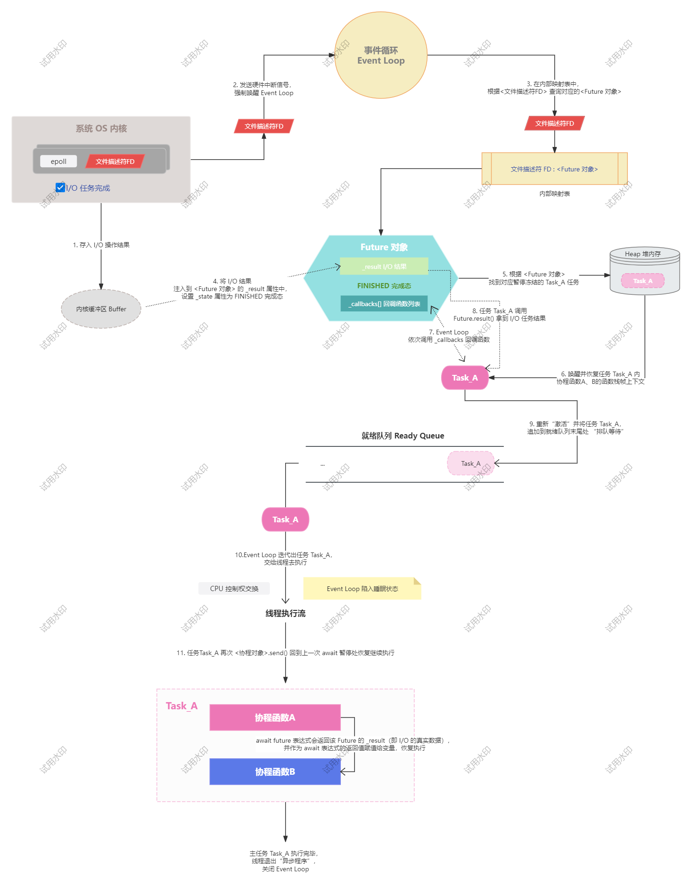

****

整体流程图解：

```
[Event Loop] 
    │  1. Task 调用协程对象.send() 第一次激活执行
    ▼
[协程 A] ────(await B)───► [协程 B] ────(await C)───► [I/O 函数 C]
                                                           │
                                             2. 创建 Future(PENDING)
                                             3. 注册 FD 到 epoll
                                             4. yield Future
                                                           │
┌─────────────────────────────── 弹回 Future ──────────────┘
│
▼
[Event Loop] 收到 Future 
    │
    ├─► 5. 把整个 Task 丢进等待区
    ├─► 6. 执行 Ready Queue 中的其他任务 (D, E...)
    │
    └─► 7. 若队列为空，调用 epoll_wait() 线程陷入沉睡
             │
             ▼
        [ 操作系统内核 ] ◄───(硬件中断)─── [ 网卡/硬盘硬件完成 I/O ]
             │
             └─► 8. 内核标记 FD 就绪，epoll_wait() 返回，Event Loop 线程被激活！
             │
             ▼
[Event Loop] 
    │  9. 根据 FD 找到 Future，把结果塞入 _result，状态改为 FINISHED
    │ 10. 触发 Future 的 _callbacks 回调函数，将 Task 重新塞回 Ready Queue 末尾
    ▼
[Ready Queue] 重新排队 ───► 11. 再次轮到该 Task，调用 send() 恢复 A 和 B 的执行
```

###### 总结

综上所述，`await` 的核心本质作用就是 2 个：

- **控制流——向下委托，就地冻结（暂停）**：

  **`await`** 会**就地暂停中断当前协程函数（任务 Task）的执行**，**冻结当前函数的上下文和栈帧（Stack Frame）并挪到堆内存中存储（堆帧 Heap Frame）**，主动**让出 CPU 控制权给事件循环（Event Loop）**；

  本质是——**函数栈帧（Stack Frame）从线程栈向堆内存（Heap）的搬移与恢复**。

- **数据流——向上抛出，直达顶层（让出）**：

  **`await`** 会**顺着调用链通过 `yield Future` 反向、逐层向上抛出 `Future` 对象，穿透协程函数A、B，直到顶层的事件循环（Event Loop），CPU 控制权交还给事件循环（Event Loop）**，并根据**协程对象的`send()` 方法**在**上一次 `await` 暂停处重新恢复执行**
  
  本质是——**利用 Python 生成器（Generator）底层的 `yield` 机制，把代表未来结果的 `Future` 对象一路向上冒泡传递到顶层事件循环手里**。

```
⚡ 【向下调用流：控制权委托】                                 🎈 【向上抛出流：Future 穿透】

 [ 事件循环 Event Loop ]                                   [ 事件循环 Event Loop ]
        │                                                         ▲
        │ 1. Task.send() 激活                                     │ 5. 接住 Future, 挂起整个 Task
        ▼                                                         │
   [ 协程函数 A ]                                              [ 协程函数 A ]
        │                                                         ▲
        │ 2. await B (创建 A 的堆帧)                               │ 4. yield Future (顺着调用栈回溯)
        ▼                                                         │
   [ 协程函数 B ]                                              [ 协程函数 B ]
        │                                                         ▲
        │ 3. await C (创建 B 的堆帧)                               │ 3. yield Future 向上冒泡
        ▼                                                         │
   [ I/O 函数 C ] ───► 1. 触发 asyncio 标准库 ───► 2. 产出 Future(PENDING) ──┘
                             │
                             ▼ (建立映射: FD ──► Future)
                       [ 操作系统内核 (epoll) ]
```

###### 两者之间的对比

| **场景**                             | **线程的行为**                                     | **是否能切换到其他协程**             | **对程序的影响**             |
| ------------------------------------ | -------------------------------------------------- | ------------------------------------ | ---------------------------- |
| **没有 I/O 操作** (纯计算/假异步)    | 像执行普通代码一样，**硬着头皮死磕**，直到算出结果 | **不能**。线程被死死卡在当前位置     | 卡死事件循环，异步退化为同步 |
| **遇到真正的 I/O** (网络/文件/Timer) | 把任务丢给操作系统，**抽身离开**，去干别的活       | **能**。线程立刻去执行其他就绪的协程 | 高并发，线程利用率达到极致   |

#### 以 yield 生成器的角度映射 async/await

在 Python 中，**`async/await`** 本质上就是一个**基于 `yield` 生成器（Generator） + `send()` 通信机制**打造的一套**高级封装**。

##### `yield` 和 `send()` 的双向通信机制：

核心定义：只要**函数内定义了 `yield` 关键字**，那么**调用它**就会**返回一个生成器函数对象（Generator）**。

```python
def my_generator():
    # 4. 暂停在这里，等待外部 send() 唤醒。收到值后赋给 result
    result = yield "我暂停了，等个数据"
    print(f"收到外部数据: {result}")

    return 'result'  # 5. 遇到 return，抛出 StopIteration 异常，并返回 return 后的值


try:
    gen = my_generator()   # 1. 创建并返回一个生成器对象

    print(next(gen))  # 2. 执行到 yield，暂停并返回 yield 后的值 "我暂停了，等个数据"

    # 3. 唤醒暂停的生成器函数 my_generator，把 'hello' 赋给 result，继续执行到下一个 yield，暂停并返回 yield 后的值
    # 如果遇到 return ，则抛出 StopIteration 异常，并返回 return 后的值
    gen.send('hello')
except StopIteration as e:
    print(e.value)  # 6. 收到 StopIteration 异常，打印异常对象的 value 属性，即 return 后的值

'''
输出结果：
我暂停了，等个数据
收到外部数据: hello
result
'''
```

- **`yield` 的作用**：**暂停函数执行**，**保存当前函数的所有局部变量和状态上下文（栈帧）**，并**把 CPU 控制权交给上层调用者**
- **`send()` 的作用**：**恢复生成器的执行**，并**将 `value` 值作为 `yield` 表达式的返回值注入进去**，给 **`yield` 前面的变量接收结果**


##### 从 `yield` 到 `async/await` 的映射

Python 3.5 引入的 `async/await` 在底层完全复用了 “暂停/恢复 函数执行” 的这套机制。可以做如下对等转换：

- **`async def`**：本质上是**一个返回 `<coroutine>` 协程对象的函数**。这个协程对象在底层极度**类似于一个生成器函数对象**。

  > 协程对象实现了**迭代器协议**，事件循环可以**调用 `<coroutine>` 协程对象的 `send()` 方法回到上一次 `await` 位置恢复执行**

- **`await <target>`**：本质上就是 **`yield from <target>` 的映射替代**。

  作用是：**暂停当前函数的执行**，转而**去 `<target>` 函数内执行**，并**将 `<target>` 的返回结果交给 `await`  前面的变量接收**

###### 事件循环（Event Loop）使用 `send()` 驱动 `await`

单纯的生成器自己是不会动弹的，必须有**一个角色不断地去调用 `.send()`**。这个角色就是**事件循环（Event Loop）**。

如下代码示例：

```python
import asyncio


async def main():
    # 3. 事件循环指示线程开始执行
    
    result = await asyncio.sleep(1, result="async_io_result")  # 4. 模拟 I/O 操作返回结果，并将结果返回给 await 前面的 result 变量接收
    print(f"收到外部数据: {result}")

    return 'main_result'  
	# 5. 抛出 StopIteration 异常，事件循环收到后，会将异常对象的值（return 后面的值）作为返回结果给外部调用者


coro = main()  # 1. 创建并返回一个协程对象

main_result = asyncio.run(coro) # 2. 协程对象 coro 被打包成任务 Task 到事件循环中
print(main_result) # 6. run() 方法收到并返回事件循环抛出的 StopIteration 异常值（main() 函数 return 后面的值）

'''
输出结果：
收到外部数据: async_io_result
main_result
'''
```

执行流程：

1. **初始化挂起**：

   当**调用 `coro = main()` **时，`main()` 函数并**不会立刻执行**，而是**返回一个协程对象**。

   事件循环将其**注册为任务（Task）**，作为**并发驱动**的基本单元。

2. **首次驱动（启动）**：

   **事件循环调用 `coro.send()`**【协程对象的 `send()`方法】 ：

   - `main()` 协程函数开始执行，直到**遇到 `await asyncio.sleep(1, result="async_io_result")`**
   - `await` 发现**后面是一个 I/O 阻塞操作任务**；于是它会一路向外 **`yield`（产出）一个非阻塞的 I/O 信号**（比如一个文件描述符或 Future 对象）
   - **`main()` 函数在 `await` 此处暂停**，状态被保存

3. **交还 CPU 控制权与异步等待**：

   控制权回到了事件循环手里。事件循环把这个 I/O 任务扔给操作系统内核（如 `select/epoll`）去监控，自己则转身去执行其他的协程。**这就是“非阻塞”的秘密。**

4. **唤醒与数据注入（关键点）**：

   当操作系统通知网络数据下载完毕时，事件循环拿到结果（假设是 `"async_io_result"`）。

   - 事件循环重新找到刚才暂停的 `coro` 协程对象（任务 Task）
   - 事件循环**再次执行 `coro.send('async_io_result')`**

5. **恢复执行与收尾**：

   - `coro.send('async_io_result')` 会**恢复协程函数，在上一次 `await` 的位置继续执行**
   - **将 `'async_io_result'` 值（I/O 操作结果）作为 `await <target>` 表达式的返回值注入进去**，给 **`await` 前面的变量接收结果**
   - 线程在函数**继续往下走，直到遇到 `return 'main_result'`**
   - 协程函数执行到最后一行 `return`，底层**会抛出一个 `StopIteration` 异常，而 `return` 的 `'main_result'` 值会被包裹在异常中**
   - **事件循环捕获这个 `StopIteration` 异常，拿到最终结果**，流程结束
   - **`main()` 函数的返回值 `main_result` 返回给外部的 `main_result` 变量接收**

在这个过程中，可以**把 `await` 完全替代成 `yield from`**，把**事件循环 Event Loop 替代成 `send()` 方法的外部调用者（驱动器）**。

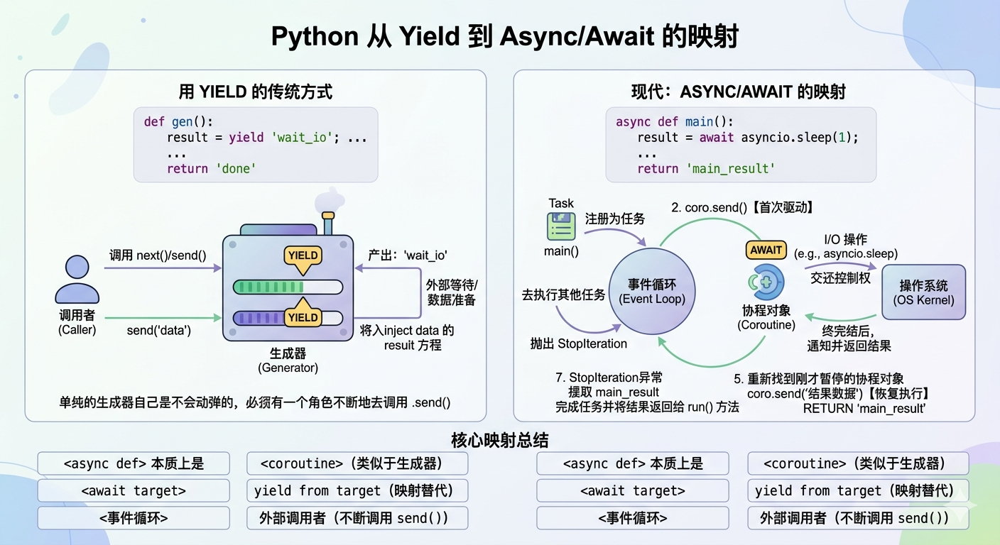

| **原生生成器机制 (Low-level)**       | **async/await 异步语法 (High-level)** | **底层角色与逻辑**                                           |
| ------------------------------------ | ------------------------------------- | ------------------------------------------------------------ |
| **`def` + `yield`**                  | **`async def`**                       | 产生一个**协程对象 (Coroutine)**，底层依然实现了迭代器协议，暴露了 `.send()` 方法。 |
| **`yield from <target>`**            | **`await <target>`**                  | **让出控制权**。挂起当前协程，去执行 `target`，直到 `target` 返回结果并注入回当前变量。 |
| **外部驱动者 (`next()` / `send()`)** | **事件循环 (Event Loop)**             | 异步管家。负责在 I/O 就绪时，调用 `coro.send(value)` 来驱动代码往下走。 |
| **`StopIteration` 异常**             | **协程的 `return` 结果**              | 协程执行完毕的信号，`return` 的值会被封装在异常中，由事件循环捕获。 |

用一句话概括 `async/await` 的原理：

> **`async` 负责把函数打包成一个支持暂停的“高级生成器”；`await` 负责在遇到耗时任务时扔出 `yield` 释放 CPU；而事件循环则像一个永动机，在 I/O 就绪后，通过 `send(数据)` 重新唤醒代码继续往下跑。**


### 事件循环（Event Loop）

在 Python 异步编程中，事件循环是掌控一切的“心脏”。它是一个永不停歇的 **`while True` 死循环**，唯一的职责就是：**收集任务、监听状态、分发执行**。

核心定义：**在后台中持续运行的异步核心调度器**。由 `asyncio` 标准库提供，在当前线程内创建，一旦创建便会在线程后台持续运行。

核心机制：事件循环（Event Loop）是**单线程**的，用于调度**当前线程内的 CPU控制权交换**。

架构图：

```
+-------------------------------------------------------------+
| 操作系统分配的一个物理线程 (OS Thread)                      |
|                                                             |
|  +-------------------------------------------------------+  |
|  | 事件循环 (Event Loop) - 核心是一个 while(true) 逻辑    |  |
|  |                                                       |  |
|  |  +------------------+                                 |  |
|  |  | Ready Task Queue | ----> 驱动 CPU 执行当前任务     |  |
|  |  +------------------+       (如：计算、解析 JSON)     |  |
|  |           ^                                           |  |
|  |           | (事件就绪，推入队列)                      |  |
|  |           |                                           |  |
|  |  +------------------+                                 |  |
|  |  |  Blocked Demux   | ----> 监控异步网络 I/O 状态       |  |
|  |  +------------------+       (向 Linux epoll 注册监听) |  |
|  +-------------------------------------------------------+  |
+-------------------------------------------------------------+
```

#### 角色参与

整个事件循环（Event Loop）的工作机制需要以下 4 个核心元素共同参与：

| **概念**       | **英文名** | **比喻**   | **作用**                                                     |
| -------------- | ---------- | ---------- | ------------------------------------------------------------ |
| **协程**       | Coroutine  | 菜谱步骤   | 用 `async def` 定义的函数，是异步执行的最小单元              |
| **可等待对象** | Awaitable  | 等待的事件 | 任何可以用 `await` 表达式修饰的对象（如协程、Task、Future）  |
| **任务**       | Task       | 正在炒的菜 | 对协程的封装。把协程丢进事件循环后，就变成了一个并行的 Task  |
| **未来对象**   | Future     | 取餐凭证   | 代表一个**未来才会完成**的结果，通常由 `asyncio` 底层框架使用 |

#### 核心工作原理

我们可以把事件循环的工作流程简化为以下几个步骤：

1. **注册任务**：把**一个协程（Coroutine）包装成任务（Task）**提交给事件循环（Event Loop）的就绪队列（Ready Queue）
2. **循环监听**：事件循环启动，开始**不断轮询所有注册的任务**
3. **协作式挂起**：当**任务A 遇到 `await`** 时（通常是**等待 I/O**），它会**主动交出控制权**
4. **切换执行**：事件循环**把这个挂起的任务A 放到一边**，立刻**去就绪队列中迭代下一个“就绪”的任务**
5. **回调唤醒**：被**挂起的 I/O 操作完成**后，**系统OS内核会通知事件循环**，事件循环再**把该任务A重新排进就绪队列**，等待继续执行


#### 内部模型与工作机制

整个事件循环（Event Loop）内部的组成与工作机制如下：

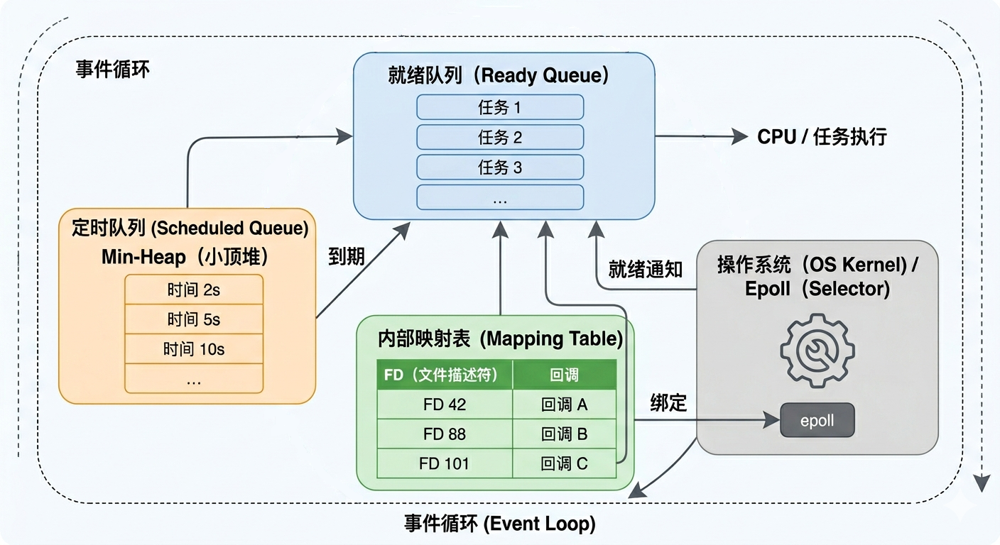

##### 就绪队列（Ready Queue）

核心定义：一个 **FIFO 先进先出**的 **Queue 队列容器**，专门用于**存储由 `asyncio.create_task` 创建的任务 Task**。

- 内部名称为 **`_ready`**

核心作用：

当 **CPU 控制权交还给事件循环（Event Loop）**时：

1. **初次激活任务 Task执行**
2. **任务TaskA 进入 I/O 阻塞操作，需要线程切换其他任务执行**

事件循环（Event Loop）会**不断轮询它**来**获取可执行的任务**。

- 当**就绪队列（Ready Queue）为空**时，**事件循环（Event Loop）**会调用 `epoll_wait` 机制，进入**『阻塞』挂起状态**，**死死等待**系统 OS 内核中的 **I/O 操作返回结果**

##### 内部映射表（Mapping Table）

核心定义：一个 **`{ key:value }`** 的**字典**；事件循环（Event Loop）会**为 `FD` 与 `Future` 对象建立一对映射关系**。

- **`key`：系统OS内核抛出的 文件描述符 FD**
- **`value`**：**Python 内置 I/O 标准库创建并返回**的**一个 `Future` 对象**

核心作用：

1. 当系统 OS 内核的 **I/O 操作返回结果**，发送**硬件中断信号**来**强制唤醒『阻塞』状态中的事件循环（Event Loop）**时
2. 事件循环（Event Loop）会通过**硬件中断信号内携带的一个 `FD` 去内部映射表（Mapping Table）中查找对应的 `Future` 对象**
3. 将系统OS内核**在内核缓冲区Buffer 中存放的 I/O 操作结果，注入到 `Future` 对象的 `_result` 属性中**
4. **依次调用 `Future` 对象的 `_callbacks` 回调函数列表，唤醒对应的已冻结任务 Task，并重新 “激活” 塞入就绪队列（Ready Queue） 末尾处 “排队等候‘**
5. 事件循环（Event Loop）在就绪队列（Ready Queue）中**迭代到 任务 Task** 时：
   1. **调用 `Future` 对象的 `result()` 方法拿到 I/O 操作结果**
   2. **通过 任务 Task 调用 协程对象的 `send()`方法 回到上一次 `await` 暂停处恢复执行**

##### 系统OS内核 （`epoll`）

核心定义：它**不是**事件循环内部的组成，而是一个**计算机硬件驱动**，但它会与事件循环（Event Loop）发生联系。

核心作用：

1. 当**线程遇到 I/O 阻塞操作**时，**Python 的 I/O 标准库**会**向系统OS内核发送一个 I/O 请求**
2. 系统OS内核会**返回一个文件描述符 FD**，并**放入 `epoll` 中 “排队等待” 执行**
3. 当底层的 **I/O 操作执行完毕返回结果**后，系统OS内核会：
   1. 将 **I/O 操作执行结果注入内核缓冲区 Buffer 中缓存**
   2. 发送一个**硬件中断信号（携带 文件描述符 FD）**直达顶层，**强制唤醒事件循环（Event Loop） 接收**


##### 定时队列（Scheduled）

核心定义：**一个多级优先级的定时队列**（独立存在的）；专门用于**存储 `asyncio.sleep()` 定时器任务（包含 `TimerHandle` 对象）**

- 内部名称为 **`_scheduled`**

> **`TimerHandle`**：这个对象极其简单，它里面只包含了两个核心要素：
>
> - **触发时间戳**（例如：`当前时间 + 2秒`）
> - **要执行的回调函数**（也就是 `Task._wakeup`，这个方法就是专门**用来唤醒任务 Task 的指针**）

核心作用：

1. 事件循环每次通过 `epoll/select` 阻塞等待时，会计算这个堆顶最近的一个定时器还需要多久触发
2. 当 **`sleep()` 时间到了**，就**调用存放的`TimerHandle` 回调函数，唤醒 `sleep()` 所在的任务 Task 移入 `_ready` 就绪队列中执行**

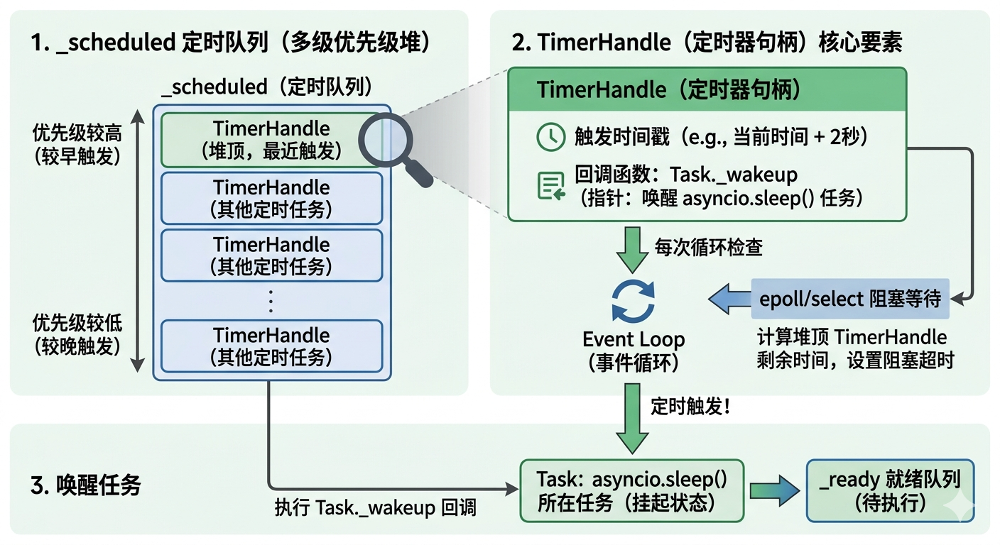

### async.run(<coroutine_obj>) 入口处

在 Python 的 `asyncio`（异步编程）中，**`asyncio.run()` 方法**是**启动整个异步程序（协程机制）的 唯一 “主入口”**。

源码描述：`asyncio.run()` 是一个**控制事件循环（Event Loop）生命周期**的**上下文管理器**。上下文管理器总是创建一个新的事件循环，允许**在其中运行异步函数**，并在上下文管理器出口时**正确完成循环**。

#### 基本语法

```python
import asyncio

# 主协程函数（主任务）
async def <协程函数>():
    # ....
    <异步任务返回结果> = await <其他协程子任务>()
    # ...
    
    # return '' # 主任务 Task 的返回结果
    
<coroutine 协程对象> = <协程函数>()

<Task 主任务的返回值> = asyncio.run(<coroutine 协程对象>)
```

##### 核心特性

1. **只能在同步代码中调用 `asyncio.run()`，不能在异步协程函数中使用**。在 **`async def` 异步协程函数内部，应该仅使用 `await` 或 `asyncio.create_task()`**。
2. **一个线程通常只调用一次**。因为频繁创建和销毁事件循环（Event Loop）的开销非常大
3. `asyncio.run()` 执行后，会**『阻塞』当前线程**，**直到传入的协程函数整体执行完毕，线程才会拿着返回结果跳出来**

##### 异步世界与同步世界的区分

在 Python 的 `asyncio` 异步编程中，存在以下 2 个 “世界” 区域：

- **同步世界**：包含了各种按顺序同步执行的**普通函数**

- **异步世界**：由 **`asyncio.run()` 作为异步程序的 “主入口”**，会**『阻塞』当前线程**，并**让线程进入 “异步世界” 区域**。

  ​	即**主线程开始进入传给 `run()` 方法的 `async ref` 协程函数（主任务）中执行，只有当主任务执行完毕，返回结果，线程才会从 “异步世界” 中出来**。

而沟通 “同步世界” 与 “异步世界” 的**桥梁**就是 `asyncio.run()` 内部自动执行的 **`run_until_complete()` 方法**；

它的核心职责就是**开始运行 `async def` 定义的协程函数，并将其打包成一个任务，连接事件循环（Event Loop），开始协调调度**。

> 注意点：“同步世界” 是 包含 “异步世界” 的。

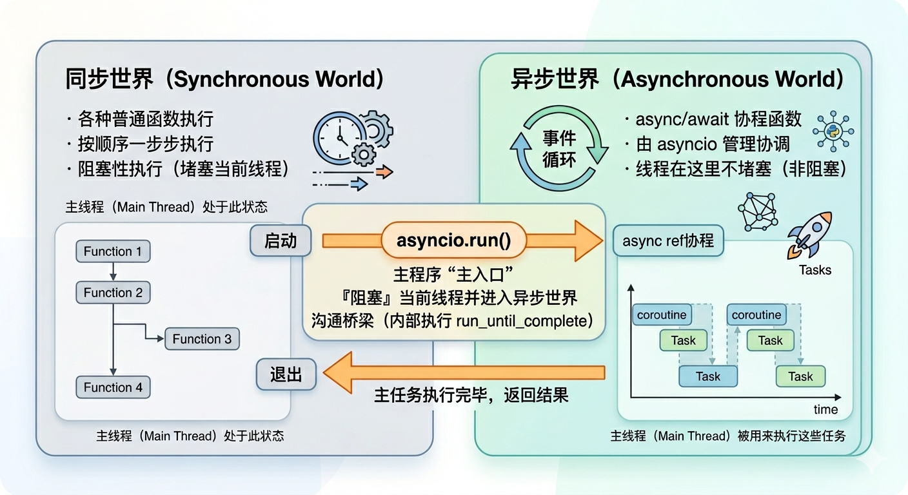

###### 注意点

- **不要在 `async def`异步函数里使用同步阻塞库**（`time.sleep()`、`reuqests` 模块）

  例如：如果在 `async def` 里写了 `time.sleep(5)` 或者用了普通的 `requests.get()`，整个单线程就会被直接卡死 5 秒，**异步直接失效**。

  > **正确做法**：使用 `await asyncio.sleep()` 或异步网络库 `httpx` / `aiohttp`。

- **`async def` 异步协程函数内被使用**时一定要**在前面加上 `await` 关键字**

  例如：如果直接调用 `boil_water()` 而不加 `await`，它不会报错，但**什么都不会发生（只是一个普通函数的调用执行）**，它只会返回一个孤零零的协程对象 `<coroutine object...>`。

##### 示例

```python
import asyncio


# 主协程（主任务）
async def task():
    print('  -进入协程函数-')
    result = await io_task()  # 异步任务
    print('  -离开协程函数-')

    return result  # 主任务执行完毕，返回结果，线程退出异步世界，回到同步世界


# 子协程（微任务）
async def io_task():
    print('     I/O 操作中...')
    await asyncio.sleep(2)  # 模拟 I/O 操作，耗时 2s
    print('     I/O 操作完成')
    return 'I/O Result'  # I/O 操作的结果


# ------- 同步世界 ---------
print('-主线程 start-')

result = asyncio.run(task())  # 线程进入异步世界，阻塞等待 task 主任务执行完成

print('协程函数（主任务）task 的执行结果：', result)

print('-主线程 end-')
# ------- 同步世界 ---------


'''
输出结果：
-主线程 start-
  -进入协程函数-
     I/O 操作中...
     I/O 操作完成
  -离开协程函数-
  (此处线程会阻塞 2s)
  
协程函数（主任务）task 的执行结果： I/O Result
-主线程 end-
'''
```

#### 执行流程

`asyncio.run()` 方法内部会执行以下 4 个步骤：

1. **创建并启动一个事件循环（Event Loop）**：它核心是一个 **`while True` 死循环的子程序**，会在**当前线程后台中持续运行**

   > 事件循环（Event Loop）是一个**后台的统筹调度器**，用于**管理当前线程中的所有协程任务（Task）以及内部异步 I/O 任务的结果，控制线程在多个协程任务之间的跳转执行**，主要是**对 CPU 的控制权调度**。

2. **任务打包，推入就绪队列（Ready Queue）**：

   ​	将传入给 `run()` 方法的 **`<class coroutine>` 协程对象**，通过**调用 `create_task()` 将其打包成一个主任务（Task）**，**推送到事件循环内部的就绪队列（Ready Queue）中 “排队等候”，等待被事件循环迭代执行**

3. **进入主协程函数（主任务）中开始执行执行**，并**让当前线程『阻塞』等待，直到主协程函数（主任务）执行完毕返回结果**

   > （主协程函数内可以包含多个子协程函数，代表多个异步 I/O 子任务，使用 `await` 进行触发）

4. **自动关闭事件循环（Event Loop）**：

   ​	当事件循环（Event Loop）内部的主协程函数（主任务）执行完毕时，`asyncio.run()` 会自动关闭事件循环、释放线程资源

示例：

```python
import asyncio

async def fetch_data():
    await asyncio.sleep(2)
    return "Data ready!"

# async.run(fetch_data()) 
# 等价于以下 3 个步骤：

# 1. 获取事件循环。get_event_loop()：获取一个已有的事件循环，效果与 new_event_loop() 差不多；前者是获取已有，后者是创建
loop = asyncio.get_event_loop()

# 2. 扔进循环并运行，程序会在这里卡住 2 秒，直到任务完成
result = loop.run_until_complete(fetch_data())

print(result) 
# 正确输出: Data ready!

# 3. 别忘了关闭循环（良好习惯）
loop.close()
```

#### 任务 Task

当**调用 `asyncio.run()` **时，除了会**启动事件循环（Event Loop）**之外，还会**调用 `create_task()` 方法传入的 `<class coroutine>` 协程对象包装成一个任务对象（Task）**。

核心特征：

- 任务对象（Task）拥有着对**整个协程对象的控制权**
- 任务对象（Task）是**连接事件循环（Event Loop）与 `await` 抛出的 `Future` 对象之间沟通的 “桥梁”**

在异步 Python 中，**`Task` 是并发的最小单位**。

- 如果只想**按顺序**拆解、复用异步代码，用 `await` 就够了，它没有多余的打包开销。
- 如果想让**两段异步代码同时（并发）运行**，才需要**用 `asyncio.create_task()` 或 `asyncio.gather()` 把它打包成任务**。

##### 任务对象的结构

可以通过 `create_task()` 创建并返回一个Task 任务对象，直接输出它的相关信息：

```python
import asyncio

async def work(num):
    # 模拟 I/O 操作
    await asyncio.sleep(2) 
    return f"任务--{num}的结果"

async def main():
    # 创建并返回 1 个协程对象、都包装成 1 个 Task 任务对象，并添加到事件循环中的就绪队列中“排队”
    task1 = asyncio.create_task(work(1))

    # 输出任务task1 执行前的信息
    print(task1)
    # <Task pending name='Task-2' coro=<work() running at ...\demo10.py:6>>

    # 开始执行 3 个任务，并返回结果
    res1 = await task1

    # 输出任务task1 执行完成的信息
    print(task1)
    # <Task finished name='Task-2' coro=<work() done, defined at ...\demo10.py:6> result='任务--1的结果'>


if __name__ == '__main__':
    asyncio.run(main())
```

###### 结构拆解

- **`<Task>`**：Task 任务**所属类型是 `<class Task>`**
- **`name`：Task 任务的名称**；自动**以 `Task-` 为前缀，后接累加 + 1 的数值**
- **`pending | finished`：任务状态（等待中、完成态）**
- **`coro`**：Task 任务所包含的 **`<coroutine>` 协程对象信息**
  - `work()`：协程对象的**协程函数名**
  - **`running | done`：协程对象状态**
  - `at ...\demo10.py`：协程对象**所在的文件代码行位置**
- **`result`：Task 任务执行返回结果**

##### 与协程对象的区别

核心要点：协程对象只是**一块想被执行的代码**；包装成 Task 后，它才变成了一个**受事件循环调度、有生命周期、可控的并发任务**。

> [!NOTE]
>
> **为什么协程对象要包装为任务Task？**
>
> 1. **触发执行与并发管理（最核心的原因）**
>
>    原生的协程对象是非常“被动”的。如果不显式地去 `await` 它，它就永远只是一段**静态的代码**。
>
>    - **只用协程：** 如果**连续 `await` 两个协程**，它们只会**串行（同步）执行**。因为 **`await` 会交出 CPU 控制权，直到前一个协程完全执行完，才会轮到下一个**。
>    - **包装成 Task：** 当**使用 `asyncio.create_task(coro)`** 时，这个**协程对象会被立刻注册到事件循环（Event Loop）中**。它被赋予了“生命”，**开始在后台自主运行**，而**不需要马上写 `await`**。这样就可以**同时创建多个 Task**，实现真正的**并发**。
>
> 2. **提供状态追踪与生命周期管理**
>
>    原生的协程对象不知道自己“执行到哪了”，也无法从外部得知它的状态。而包装成 `Task` 后，由于 **Task 继承自 `Future`**，于是它变成了一个标准的**未来对象（Future-like object）**，向外暴露了丰富的生命周期状态：
>
>    - `task.done()`：判断任务是否已经结束（成功或失败）
>    - `task.cancelled()`：判断任务是否被取消了
>    - 内部还会记录**任务是处于 `PENDING`（等待）、`RUNNING`（运行中）还是 `FINISHED`（已结束）状态**
>
> 3. **支持外部取消（Cancellation）**
>
>    ​    在异步编程中，我们经常需要中途终止某个操作（比如用户关闭了网页，或者请求超时了）。 原生的协程是无法从外部直接掐断的。但 **`Task` 提供了 `.cancel()` 方法**；
>
>    ​    当调用 `task.cancel()` 时，事件循环会在该任务下一次切回执行时，向其内部抛出一个 `CancelledError` 异常，从而优雅地中断协程的执行并释放资源
>
> 4. **方便获取返回值和捕获异常**
>
>    如果一个协程在后台默默运行，它报错了或者返回了结果，此时 `Task` 充当了一个“结果收集器”：
>
>    - **获取结果：** 当任务完成后，可以通过 `task.result()` 随时拿回协程的返回值
>    - **异常处理：** 如果协程内部崩了，异常会被保存在 Task 内部，通过 `task.exception()` 可以捕获到，而不会直接导致整个事件循环当场死锁或崩溃

| **特性**     | **协程对象 (Coroutine)**                  | **任务 (Task)**                    |
| ------------ | ----------------------------------------- | ---------------------------------- |
| **本质**     | 包含了执行逻辑的**函数对象**              | 正在事件循环中**运行的实体**       |
| **驱动方式** | 必须依赖 `await` 驱动，且会阻塞当前上下文 | 自动被事件循环调度执行             |
| **执行顺序** | 多个协程直接 `await` 是**串行**的         | 多个 Task 在事件循环中是**并发**的 |
| **控制力**   | 无法从外部取消、无法直接查询状态          | 可取消、可查询状态、可绑定回调     |

| **内部装了什么** | **协程对象 (Coroutine)**                           | **任务对象 (Task)**                                     |
| ---------------- | -------------------------------------------------- | ------------------------------------------------------- |
| **主要角色**     | 纯粹的**执行上下文**（数据、代码指针、变量）。     | 具备**独立生命周期**的调度单元。                        |
| **驱动方式**     | **被动的**。没人理它，它就永远躺在内存里一动不动。 | **主动的**。一旦创建，会自动向事件循环申请排队执行。    |
| **对外状态**     | 只知道自己暂停在哪里。                             | 知道自己是正在排队、被取消了、还是已经做完了。          |
| **沟通能力**     | 只能和直接 await 它的上层发生关系。                | 拥有回调列表（Callbacks），可以被任意多个其他任务关注。 |

##### 与 Future 对象的区别

`Task` 任务对象是 `Future` 对象的**子类**。所以 `Future` 对象有的，`Task` 对象基本也有。

无论是 Task 还是 Future，它们都属于 **Python 用户态** 的高级抽象概念，操作系统内核（Kernel）根本不认识它们。

简而言之：**`Future` 是一个占位符（代表未来的结果），而 `Task` 是 `Future` 的子类，专门用来“包装并执行”协程（Coroutine）。**

| **维度**         | **Future**                                     | **Task**                                                     |
| ---------------- | ---------------------------------------------- | ------------------------------------------------------------ |
| **层级**         | 低级别 API（通常框架开发者、底层库用得更多）   | 高级别 API（日常业务开发主要使用）                           |
| **继承关系**     | 基类（Base Class）                             | 子类（Inherits from `Future`）                               |
| **是否包含代码** | **不包含**。只是一个状态记录器和结果容器。     | **包含**。绑定了一个具体的协程（你写的异步函数）。           |
| **如何驱动**     | 需要底层手动通过 `set_result()` 来激活和结束。 | 由事件循环（Event Loop）自动调度、驱动并设置结果。           |
| **创建方式**     | `loop.create_future()`                         | `asyncio.create_task(coro)` 或 `asyncio.ensure_future(coro)` |

###### 核心流程

虽然**系统OS内核的 `epoll` 不认识 `Future`**，但 **`Future` 是连接 “内核世界” 和 “Python世界” 的 "桥梁"**。

**1.创建低级 Future 并挂起（用户态）：**

​	当**在 Task 任务内部遇到网络 I/O** 时，Python 会在底层创建一个**低级的 Future 对象**（注意：不是顶层的 Task，而是专门代表这一次 I/O 的 Future）。

​	**Task 会 `await` 这个 `Future`  对象**，随后 Task 自身进入 **PENDING** 等待中状态，**让出 CPU 执行权**。

**2.向内核注册 FD 和回调（`asyncio` 异步框架）：**

​	**事件循环（Event Loop）拿到这个 FD（文件描述符），调用系统的 `epoll_ctl`，把 FD 扔给内核监控。**

​	同时，事件循环在**自己的内部映射表**里记录下一对**映射：{ FD : 唤醒该 Future 的回调函数 }**。

**3.内核阻塞与唤醒（内核 epoll 侦听）：**

​	**事件循环调用 `epoll_wait()` 进入阻塞等待**。当网络数据大军送达网卡，内核发现该 FD 可读，epoll_wait 立即返回这个 FD。

**4.触发回调，Future 变 FINISHED（事件循环 Event Loop）：**

​	事件循环拿到被唤醒的 FD，**去自己的内部映射表里，根据 `FD` 查到对应的 `Future` 回调函数并执行**。

​	这个回调函数的核心任务就是：**调用 future.set_result()**。

​	这一步，让低级 Future 的状态**由 `PENDING` 变成 `FINISHED`**。

**5.Task 被间接唤醒（Future ）：**。

​	还记得 Task 内部的“回调函数列表”吗？因为 **Task 之前在等这个 `Future`**，它就**把自己的 `_wakeup` 方法注册在了 `Future` 的 `_callbacks` 回调列表属性里**。

​	现在 **`Future` 变成了 `FINISHED`，触发了 Task 的 `_wakeup`。Task 重新把自己放回事件循环的就绪队列，等待下一次 CPU 轮询**。


```
[操作系统内核 epoll] 
       │
       ▼ (内核只知道 fd 激活了)
[事件循环 Event Loop] ──通过 fd 查到──> [回调函数 (BaseSelectorEventLoop._read_from_self)]
                                              │
                                              ▼ (驱动执行)
                                        [低级 Future 对象] (状态: PENDING -> FINISHED)
                                              │
                                              ▼ (通过 Future 的 callbacks 唤醒)
                                        [顶层 Task 对象] (重新排队，准备调用 coroutine.send())
```

```
[事件循环] 
   │
   ▼ 发现 Task 就绪了，调用：
   task._step()
     │
     ▼ 内部实际执行：
     result = low_level_future.result()  <─── 此时 Future 已经是 FINISHED，直接拿到 I/O 数据！
     │
     ▼ 通过 send() 把数据“喂”回给你的原函数：
     coroutine.send(result)
```

##### 协程对象 vs Task vs Future

- **协程对象 Coroutine**：只是一个**静态的代码上下文，自身没有驱动力，无法被事件循环（Event Loop）识别并驱动**。

- **任务 Task**：是**一个被整体协程对象 Coroutine 包装**后的**产物**，任务 Task **赋予了协程生命周期（Pending、Cancelled、Funished）**，是**真正被调度、被挂起、被恢复**的**最小并发实体**。

  - **顶层事件循环（Event Loop）**不认协程对象，**只认任务Task**。事件循环**调度切换的就是 任务Task 实体本身**，而非协程对象。
  - **任务 `Task` 实际上是 `Future` 的子类**。Task **在 Future 的基础上**，增加了**追踪协程执行状态**的功能。

  > （**一个协程函数=一个协程对象**，可**包含多个协程函数（协程对象）**，表示**一个主任务可以包含多个 “子过程”**）

- **Future 对象**：是**底层异步框架 `asyncio` 应用**的 **"桥梁"**

  在**一次 `await` I/O操作的完整过程**中，`Future` 对象**连接着上层的 Task、底层的操作系统 I/O 信号以及事件循环（Event Loop）**

  它现在没有数据，但它承诺：“一旦底层硬件/I/O 搞定了，我会把结果放进来并通知事件循环。”

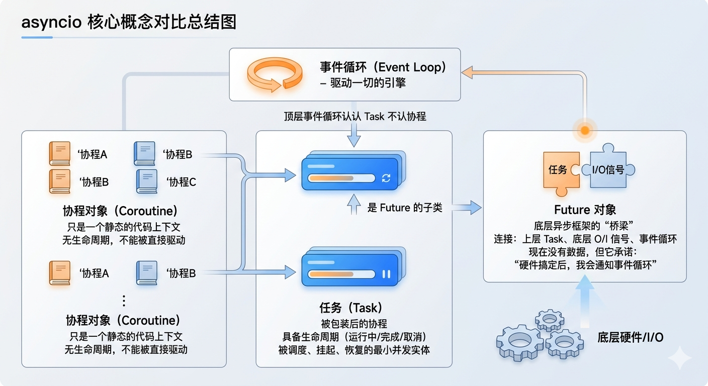

###### 核心结论

- **协程 Coroutine** 决定了 **“做什么”**（What）
- **任务 Task** 决定了**“什么时候做、状态是什么”**（When & State）
- **Future 对象** 解决了**“做完之后结果怎么传回来”**（How to return）

#### 多任务并发处理

##### 协程对象与任务的核心区别

原生的协程对象是非常“被动”的。如果不显式地去 `await` 它，它就永远只是一段**静态的代码**。

- **只用协程：** 如果**连续 `await` 两个协程**，它们只会**串行（同步）执行**。因为 **`await` 会交出 CPU 控制权，直到前一个协程完全执行完，才会轮到下一个**。
- **包装成 Task：** 当**使用 `asyncio.create_task(coro)`** 时，这个**协程对象会被立刻注册到事件循环（Event Loop）中**。它被赋予了“生命”，**开始在后台自主运行**，而**不需要马上写 `await`**。这样就可以**同时创建多个 Task**，实现真正的**并发**。

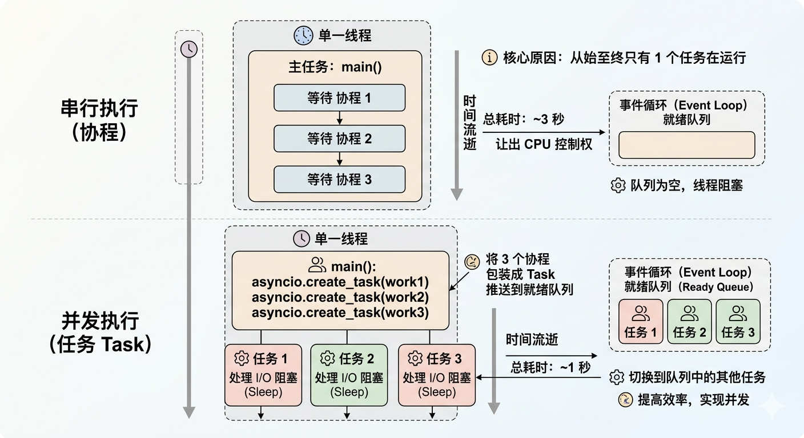

如下示例：

##### 同步阻塞（仅 async/await）

```python
# 仅使用 async/await 的协程操作，不打包成任务【同步阻塞式】
import asyncio
import time


async def work(num):
    print(f'work--{num} start')
    await asyncio.sleep(1)
    print(f'work--{num} end')


async def main():
    # 创建并返回 3 个协程对象（注意：不是并发的任务Task）
    coroutine1 = work(1)
    coroutine2 = work(2)
    coroutine3 = work(3)

    start_time = time.time()
    await coroutine1

    # 阻塞上一个 coroutine1 任务完成
    await coroutine2

    # 阻塞上一个 coroutine2 任务完成
    await coroutine3

    # 阻塞上一个 coroutine3 任务完成
    print(f"总耗时：{(time.time() - start_time):.4f} 秒")
    # 计算 3 个协程函数对象执行的总耗时：3.0293 秒

if __name__ == '__main__':
    asyncio.run(main())

'''
输出结果：
work--1 start
work--1 end
work--2 start
work--2 end
work--3 start
work--3 end
总耗时：3.0228 秒
'''
```

核心原因：**`asyncio.run(main())`** 内部只是**调用了一次 `create_task(main())` **，**向事件循环（Event Loop）的就绪队列（Ready Queue）中添加了 1 个任务**，即 `main()` 函数自身。所以此时**就绪队列（Ready Queue）中只有 1 个任务**。

执行流程：

1. 当**线程执行 `coroutine1()` 协程函数**时，**遇到了 `await asyncio.sleep()`** 类似的 **I/O 阻塞操作**时；**`await` 会让出 CPU 控制权交还给事件循环（Event Loop）**
2. 此时，**事件循环（Event Loop）为了不让线程 “空闲” 下来**，就**会去绪队列（Ready Queue）中查看是否有可执行的任务**
3. 但是事件循环（Event Loop）**发现就绪队列（Ready Queue）中只有 1 个任务，即正在被阻塞中的 `main()` 本身，没有其他任务**
4. 所以线程会**阻塞等待**，直到 `coroutine(1)` 内的 I/O 阻塞操作完成，才会继续执行 `main()` 中的 `await coroutine2`
5. 以此类推
6. 最终，3 个任务**串行执行**，总耗时是**累加**的

场景：**虽然写了多个 `await` **，但是**代码**却还是**『同步阻塞』**式的**串行执行**；**根本原因**就在于**从始至终只有一个主任务 Task 在运行**。


解决方案：**使用 `asyncio.create_task()` 或 `asyncio.gather()` **将 **3 个协程对象都包装成任务 Task 对象**，**推送到就绪队列（Ready Queue）中**，实现**真正的并行运行**，从而缩短总耗时。

- 核心结论：**只写 `async/await` 不等于并发**。**并发的精髓在于：让多个任务Task 同时在事件循环中 “排队” 执行。** 

##### 异步非阻塞（注册多个任务）

核心定义：**使用 `create_task()` 或 `gether()` 将协程对象都包装成任务 Task，放入事件循环的就绪队列中 “排队运行”。**

核心过程：

1. **`asyncio.run(main())`** 内部**调用一次 `create_task(main())` **，**向事件循环（Event Loop）的就绪队列（Ready Queue）中添加了 1 个任务**，即 `main()` 函数自身。
2. 线程开始进入 `main()` 执行，遇到显式调用 **`create_task()` 或 `gather()` 会将 `3` 个协程对象**都**包装成 `3` 个任务 Task，放入事件循环的就绪队列中 “排队运行”**
3. 此时，**就绪队列（Ready Queue）中就包含了主任务（`main(0)`） + `3` 个任务**，一共 4 个任务
4. 当**线程执行 `task1()` 任务函数**时，**遇到了 `await asyncio.sleep()`** 类似的 **I/O 阻塞操作**时；**`await` 会让出 CPU 控制权交还给事件循环（Event Loop）**
5. 此时，**事件循环（Event Loop）为了不让线程 “空闲” 下来**，就**会去绪队列（Ready Queue）中查看是否有可执行的任务**
6. 发现**还有其他 2 个任务**，（**主任务 `main()` 和 当前任务** 已经**被 `await` 挂起存放在堆内存**【Heap Frame】中）
7. 事件循环（Event Loop）会迭代出其中一个任务（一般按注册的顺序），将 **CPU 控制权交给线程去执行迭代出来的任务**
8. 当 **`task1()` 任务的 `await` I/O 操作完成**后，**开始 `yield Future` 回溯，线程会返回来恢复执行**
9. `task2()`、`task3()` 也是如此...以此类推
10. 最终，3 个任务**并行执行**，总耗时是**重叠**的（以耗时最长的任务为准）

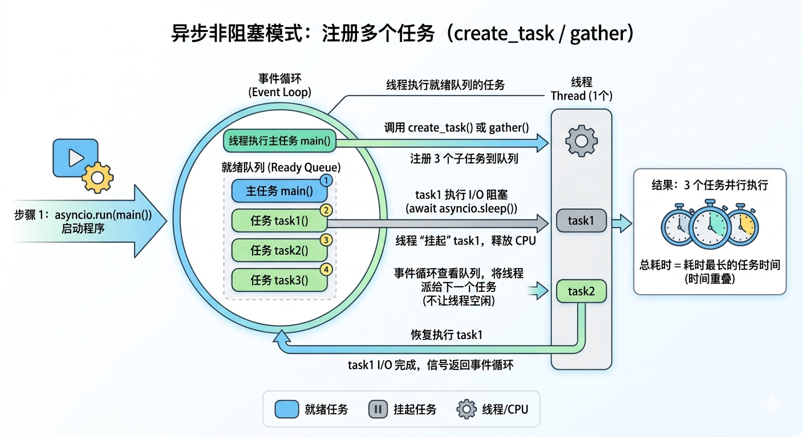

###### **`create_task()`**

核心定义：**创建单个任务；精细化控制单个任务结果、更可控**。

```python
# 使用 create_task() 创建多个任务【异步非阻塞】
import asyncio
import time


async def work(num):
    print(f"任务--{num}开始执行")
    # 模拟 I/O 操作
    await asyncio.sleep(2) # sleep() 会放入定时队列，以及唤醒任务Task 的回调函数
    # 暂停当前任务Task 冻结函数上下午放入堆内存，CPU 控制权交给事件循环，事件循环会从就绪队列中取出下一个任务来执行
    print(f"任务--{num}执行完毕")

    return f"任务--{num}的结果"


async def main():
    start_time = time.time()

    # 创建并返回 3 个协程对象、都包装成 3 个 Task 任务对象，并添加到事件循环中的就绪队列中“排队”
    task1 = asyncio.create_task(work(1))
    task2 = asyncio.create_task(work(2))
    task3 = asyncio.create_task(work(3))

    # 开始执行 3 个任务，并返回结果
    res1 = await task1
    res2 = await task2
    res3 = await task3

    # 输出 3 个任务的结果
    print(res1)
    print(res2)
    print(res3)

    print(f'总耗时：{(time.time() - start_time):.4f} 秒')


if __name__ == '__main__':
    asyncio.run(main())

'''
输出结果：
任务--1开始执行
任务--2开始执行
任务--3开始执行
任务--1执行完毕
任务--2执行完毕
任务--3执行完毕
任务--1的结果
任务--2的结果
任务--3的结果
总耗时：2.0156 秒
'''
```

###### **`gather()`**

核心定义：**批处理任务；一次性注册多个任务和收集多个任务结果、更简便**。

```python
# 使用 gether() 批处理多个任务【异步非阻塞】
import asyncio
import time


async def work(num):
    print(f"任务--{num}开始执行")
    # 模拟 I/O 操作
    await asyncio.sleep(2) # sleep() 会放入定时队列，以及唤醒任务Task 的回调函数
    # 暂停当前任务Task 冻结函数上下午放入堆内存，CPU 控制权交给事件循环，事件循环会从就绪队列中取出下一个任务来执行
    print(f"任务--{num}执行完毕")

    return f"任务--{num}的结果"


async def main():
    start_time = time.time()

    # 创建并返回 3 个协程对象、都包装成 3 个 Task 任务对象，并添加到事件循环中的就绪队列中“排队”
    task_list = await asyncio.gather(work(1), work(2), work(3))

    # task_list 是一个任务结果列表，里面存放的是每个任务的结果
    print(task_list)

    print(f'总耗时：{(time.time() - start_time):.4f} 秒')


if __name__ == '__main__':
    asyncio.run(main())

'''
输出结果：
任务--1开始执行
任务--2开始执行
任务--3开始执行
任务--1执行完毕
任务--2执行完毕
任务--3执行完毕
['任务--1的结果', '任务--2的结果', '任务--3的结果']
总耗时：2.0121 秒
'''
```

#### 内部执行流程

在 `asyncio.run()` 方法中其实内部是调用了以下几个方法：

```python
import asyncio

# ---- 定义 -----
def run(<coroutine 协程对象1>):
    # 1. 初始化环境，创建新的事件循环
    loop = asyncio.new_event_loop()
    asyncio.set_event_loop(loop)
    
    # 2. 将传入的协程对象包装成一个Task 任务对象，使得协程对象拥有一个并发能力，可以被事件循环调度
    <Task 任务对象> = loop.create_task(<coroutine 协程对象>)
    
    try:
        # 3. 核心：运行主协程（任务），并拿到返回值
        return loop.run_until_complete(<Task 任务对象>)
    finally:
        try:
            # 4. 清理现场：取消所有还在后台苟活的剩余任务
            _cancel_all_tasks(loop)
        finally:
            # 5. 彻底关闭循环，释放资源
            asyncio.set_event_loop(None)
            loop.close()

# ---- 使用 -----
def <协程函数>(): pass

<coroutine 协程对象1> = <协程函数>()

run(<coroutine 协程对象1>)
```

##### 执行步骤

###### 1、初始化

- **`new_event_loop()`**：**创建**一个新的**事件循环（Event Loop）**，**初始化任务就绪队列（Ready Queue）**
- **`set_event_loop()`**：**将事件循环（Event Loop）与当前线程上下文绑定关联**，实现**对线程 CPU 控制权的协调调度**

###### 2、包装任务入队等候

- **`create_task()`**：

  - 将传入 `run()` 方法的 `<class rocoutine>` 协程对象**打包成第一个 Task 任务对象**， 将其**作为一个主任务（Master Task）塞入到事件循环（Event Loop）中的就绪队列（Ready Queue）的末尾处 “排队等候”**

  > 后续可**显式调用 `asyncio.create_task()` 创建 `n` 个微任务 Task 塞入就绪队列（Ready Queue）末尾处 “排队等候”**。

###### 3、启动事件循环、阻塞线程

- **`run_until_complete()`**：
  - **启动事件循环**（Event Loop），并**根据队列 FIFO 先进先出**的原则，**开始循环迭代出第一个主任务（Master Task）开始运行**；
  - 在主任务运行期间：
    - **事件循环（Event Loop）会『阻塞』当前线程，直到主任务 Task 执行完毕返回结果**
    - 如果又**调用了 `asyncio.create_task(sub())` 方法**，**就绪队列在末尾处追加一个微任务 Task** -> `[Task1、Task2]`


###### 4、主任务结束、清理微任务

- **`_cancel_all_tasks()`**：
  - 当**主任务Task 执行完毕返回结果**后，`run_until_complete()` 会**停止事件循环（Event Loop）**
  - 为了防止内存泄漏，会调用 `_cancel_all_tasks()` **强行清理所有通过 `create_task()` 创建的微任务（即使还未完成也会被回收）**，以及所有 `asyncio.sleep()` 创建的定时器任务等等...

###### 6、关闭事件循环、释放线程

- **`close()`**：**彻底关闭事件循环（Event Loop）、释放线程资源**；线程跳出异步程序，**拿到异步任务Task 执行结果回到同步代码中**

> 整体流程：**创建循环 -> 注册主任务 -> 开启循环并阻塞等待 -> 清理微任务 -> 关闭资源**。

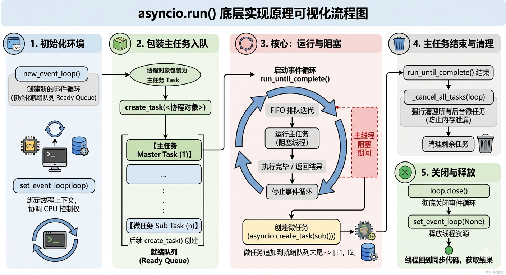

##### get_event_loop 和 new_event_loop 的区别

核心区别在于：**一个是“获取或自动创建当前线程的事件循环”，另一个是“无条件强制创建一个全新的事件循环”。**

| **特性**             | **asyncio.get_event_loop()**                 | **asyncio.new_event_loop()**            |
| -------------------- | -------------------------------------------- | --------------------------------------- |
| **主要目的**         | **复用**（获取当前线程的循环）               | **新建**（创建一个全新的独立循环）      |
| **单例性**           | 只要不更改，同一线程内多次调用返回同一个对象 | 每次调用都返回不同的、崭新的对象        |
| **子线程行为**       | 默认会报错（需要手动先设置）                 | 可以安全调用，直接返回新循环            |
| **是否自动绑定线程** | 是（主线程会自动绑定）                       | **否**（必须手动配合 `set_event_loop`） |

> 在现代 Python 开发中，其实已经**很少直接使用这两个方法了**。因为 Python 引入了更高层的 API：
>
> - 如果是启动整个异步程序的入口，直接使用 **`asyncio.run(main())`**。它会在底层自动帮你处理 `new_event_loop()`、`set_event_loop()` 以及最后的关闭和清理工作，非常安全省心。
> - 如果在已经运行的异步函数内部想要获取当前的循环，推荐使用 **`asyncio.get_running_loop()`**，它比 `get_event_loop()` 更严格、更高效，如果当前没有运行的循环会直接报错，避免隐式创建导致难以排查的 Bug。

#### 底层实现原理

核心要点：协程是以**堆内存对象（栈帧）**为媒介、以**操作系统的多路复用（如 epoll）**为闹钟、以**事件循环（Event Loop）**为调度员的**用户态轻量级线程**。

假设有以下代码：

```python
import asyncio

async def taskA():
    # ....其他逻辑
    result = await taskB()  
    # 当线程执行到这里时，会暂停并挂起 taskA() 函数的执行，冻结后续的代码执行
    # ...其他逻辑


async def taskB():
    # 模拟耗时 2s 的 I/O 操作，线程不会 “空闲”，而是会切换到其他任务执行
    result = await asyncio.sleep(2)
    return result


# 启动一个事件循环（Event Loop），并将 taskA() 注册到事件循环中的就绪队列（Ready Queue）中
asyncio.run(taskA())
```

****

##### 阶段一

- *启动事件循环驱动、打包成任务Task 排队、进入第一个任务执行*：

​	一开始，在线程执行最初会**通过 `asyncio.run(<taskA>,...)` 方法开启**一个**事件循环驱动（Event Loop）**；

​	它本质是一个 **`while True` 死循环**，它会**持续不断地在线程后台监听与调度任务**，不论是**调度队列中的任务还是线程中 CPU 的控制权**，都会**经过事件循环（Event Loop）**来处理；（线程是 ”牛“，事件循环是 ”鞭子“）

​	之后，**线程会将传入给 `asyncio.run()` 方法中，所有使用 `async def` 定义的协程函数打包成一个个任务（Task）一并推入到事件循环（Event Loop）内的就绪队列（Ready Queue）中 “排队等待”**；

​	事件循环（Event Loop）会**不断轮询就绪队列（Ready Queue）中的任务状态（Task State）**，遵循**队列 FIFO 先进先出**的原则，**先把第一个任务（协程函数A）提取出来交给线程去执行**；此时 **CPU 指针指向协程函数A 的栈帧（Stack Frame）**。

> **CPU 执行流（任务初始化）**：顶层函数 → 打包任务 Task → 进入就绪队列 → 提取给线程执行


****

##### 阶段二

- *遇到 `await` 调用、线程暂停并切换到另一个协程函数B执行*：

​	当线程在执行协程函数A 期间，遇到通过 **`yield/await` 语句调用的某个协程函数（如：另一个协程函数B）**时；

​	之后，**协程函数A 会把 CPU 执行控制权主动让出**，并让**线程跳转切换到另一个协程函数B 内去调用执行**；此时 **CPU 指针转而指向协程函数B 的栈帧（Stack Frame）**。

> **CPU 执行流**：线程 → 协程函数A 栈帧位于栈顶 → 栈指针压栈 → 协程函数B 栈帧位于栈顶


****

##### 阶段三

- *线程遇到 I/O 操作、抛出 `Future` 对象、挂起并持久化存储协程函数A、B栈帧*：

​	当**线程在协程函数B 内遇到阻塞式 I/O 操作**时，协程函数B 会第一时间**抛出一个协程对象（`Future` 对象）** 给协程函数A （调用者）内的变量接收，该 **`Future` 对象用于存储协程函数B 中后续 I/O 操作任务返回的结果（`_result`）以及任务状态（`_state`）**。

​	此时，由于协程函数A 需要等协程函数B 的 I/O 操作，**线程会将协程函数A、B 的执行链条一起在后台挂起，等待 I/O 结果返回**；

​	线程会**暂停当前协程函数A 的执行，冻结后续的代码语句执行**。

​	同时**将当前协程函数A 、B的栈帧容器（Stack Frame）存储到协程对象中进行 “私有化”**，并**一起保存到堆内存中进行 “持久化” 存储（堆帧Heap Frame）**，最后**挂起协程函数A、B的栈帧**。	

> **CPU 执行流**：线程 → 遇到阻塞 I/O → 协程函数A、B 调用链冻结 → 栈帧转换为堆帧(Heap Frame) → 存储至堆内存 → 抛出 `Future` 对象


****

##### 阶段四

- *I/O 操作注入到系统内核中，等待结果返回*：

​	在**协程函数A、B被挂起等待**后，线程会接着**将协程函数B 的 CPU 控制权主动让出**，**交还给事件循环（Event Loop）**；

​	事件循环（Event Loop）会**提取协程函数B 返回的协程对象（`Future` 对象）**【`Future` 对象关联着协程函数A】 ，由它**将 `Future` 对象再次关联一个文件描述符（FD）**，并**将文件描述符（FD）注册到系统内核中 `epoll` / `Selector` 里 “排队等候” 执行**；（这是一个**等待队列**）

​	在后台中，事件循环（Event Loop）会持续**监听并等待系统内核中 `epoll` 的某个 I/O 操作任务的结果返回**。

> **CPU 执行流**：事件循环接管 `Future`对象 → 提取文件描述符 FD → 注册至系统内核(epoll)


****

##### 阶段五

- *CPU 控制权回归、调度其他就绪任务*：

​	当**协程函数A、B被挂起等待、并完成 I/O 操作的内核注册**后，**CPU 控制权会自然回到事件循环（Event Loop）手中**；

​	让其**在就绪队列（Ready Queue）中拉取其他可执行的任务**（如协程函数C），**告知线程 “协程函数A、B” 都已经被挂起，在后台执行 I/O 操作任务了，你要是闲着没事可以去执行其他任务C“**；

​	接着**线程就会跳转切换到协程函数C 内去执行**，此时 **CPU 指针指向协程函数C 的栈帧**。

​	要是**就绪队列（Ready Queue）中没有任务**了，则**线程无事可做，直接等待协程函数B 的I/O 操作结果返回**即可

> **CPU 执行流**：事件循环接管控制权 → 轮询就绪队列  → 驱动线程跳转至独立协程函数C / 或无任务休眠


****

##### 阶段六

- *I/O 结果返回、读取 I/O 数据、`Future` 对象回调触发、将任务和结果重新塞入就绪队列中*：

​	在此期间，一旦**系统内核的 I/O 操作返回了结果**，会通过 `epoll` **唤醒后台一直运行的事件循环（Event Loop）**，让其**亲自去读取 I/O 硬件设备的数据**，并**将 I/O操作结果注入到 `Future` 对象中的 `_result` 私有属性**中；

​	此时**事件循环（Event Loop）就会将拿到的 `Future` 对象，并根据 `Future` 对象的关联链条找到任务 Task（协程函数A）**；

​	**`Future` 对象会执行它附带的回调函数（Callback）**，将**任务 Task（协程函数A）重新"激活"并塞入事件循环（Event Loop）中的就绪队列（Ready Queue）中的队列末尾处**，此时协程函数A 的任务状态（Task State）为可执行，**允许让事件循环（Event Loop）重新轮询提取该任务**。

> **CPU 执行流**：系统内核数据就绪 → 唤醒事件循环注入` _result` → 触发 `Future` 回调 → 任务 A 重新塞入就绪队列队尾


****

##### 阶段七

- *线程重新执行、任务Task 调用协程对象的 `send()` 恢复执行*：

​	之后，**当事件循环（Event Loop）从就绪队列（Ready Queue）中迭代到任务 Task（协程函数A）**时，会**再次将其提取出来交给线程去执行**；

​	线程接收到**提取准备恢复执行的任务 Task（协程函数A）**后；**任务Task** 会通过**调用协程函数A 对象的 `send()` 方法**，**激活**协程函数A 的**栈帧，**并**让线程回到上一次协程函数B 的 `awat` 暂停位置处**；

​	并**从 `Future` 对象中的 `_result` 私有属性中拿到 I/O 操作的返回结果作为 `await` 表达式的返回值赋给变量**，从**堆内存中恢复堆帧容器对象（Heap Frame）【函数调用栈上下文】，得以让协程函数A、B 恢复并继续往下执行**。

> **CPU 执行流**：事件循环 → 取出就绪队列中的任务 A → 线程调用 `A.send()` → 从 Future 拿结果并恢复堆帧 → 恢复执行协程 A/B


****

​	以此类推...，实现**多个协程函数在同一线程内的来回跳转切换**，以此**把线程原本要浪费在等待 I/O 任务结果上的时间，全部压榨出来去跑其他的业务代码**。

##### 核心要点

​	在**传统线程遇到 I/O 阻塞操作**时，**操作系统内核把整个线程挂起（昂贵的上下文切换）**；

​	而**协程遇到 I/O 阻塞操作**时，是 Python 运行时**把协程函数的调用栈（Call Stack）【栈帧（Stack Frame）】，一股脑丢到堆（Heap）里形成堆帧（Heap Frame），线程拍排屁股转头去干别的事了**。

- 总结流程图：

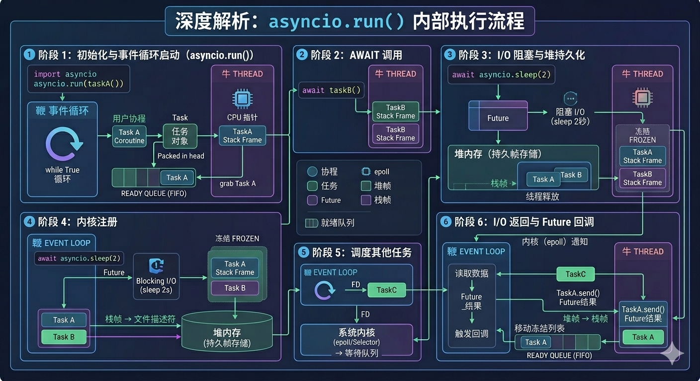

### 常用方法

#### sleep() 异步定时器任务

核心特征：**先短暂暂停当前协程函数 `n` 秒**，它会**交出 CPU 控制权让线程先切换到其他协程函数（任务）去执行**；等 **`n` 秒过后，线程再切回来继续执行**。类似于一个**定时器**任务。

##### 基本语法

```python
<time 秒后返回的 result 结果> = await asyncio.sleep(<time>, result=<result>)
```

核心作用：**暂停当前协程 `time` 秒**，当 **`time` 秒到期**后，会**返回一个 `result` 结果给外部接收**。（这也是一个 **I/O 等待操作**）

核心特征：

- **`asyncio.sleep()`** 会被事件循环（Event Loop）**放到**内部的**定时队列（Scheduled）中存放**
- 当 **`time` 时间到了**，就**调用存放一起存放的`TimerHandle` 回调函数，唤醒 `sleep()` 所在的任务 Task 移入 `_ready` 就绪队列中执行**，最后将 `result` 结果返回


示例：

```python
# asyncio.sleep(time,result): time 秒后，返回一个 result 结果【I/O操作】
import asyncio


async def main():
    # 2 秒后，返回一个 'hello' 结果给外部的 result 变量接收
    result = await asyncio.sleep(2, result='hello')
    print(result)  # hello

asyncio.run(main())
```

##### 对比 time.sleep()

核心要点：**在协程函数（任务）中，不要使用 `time.sleep()` ，而是使用 `asyncio.sleep()`**。

- **`time.sleep()`（同步阻塞）**：**不会交出 CPU 控制权**，从而会**导致当前线程陷入真正的『阻塞』状态**，让线程**傻傻的在原地等待**
- **`asyncio.sleep()`（异步非阻塞）**：**会交出 CPU 控制权，不会让线程 “空闲” 下来，而是去先忙其他协程函数（任务）**

| **特性**             | **time.sleep()**                             | **asyncio.sleep()**                                 |
| -------------------- | -------------------------------------------- | --------------------------------------------------- |
| **对事件循环的影响** | **直接冻结**整个事件循环                     | 向事件循环**注册一个定时任务**，然后交出 CPU 控制权 |
| **其他并发任务**     | 哪怕其他任务已经准备就绪，也**无法执行**     | 在等待期间，其他任务可以**无缝轮流执行**            |
| **性能表现**         | 多任务串行，异步代码退化为**极慢的同步代码** | 多任务并发，**高效利用** CPU 空闲时间               |


##### 代码示例

- 使用 `time.sleep()`（错误示例）：

```python
# time.sleep() vs asyncio.sleep
import asyncio
import time


# 协程函数（任务）
async def work(num):
    print(f"任务 {num} 开始...")
    time.sleep(2)  # ❌ 错误：这会卡死整个线程 2 秒
    print(f"任务 {num} 结束！")


async def main():
    # 创建 2 个任务，并行运行
    start = time.time()
    await asyncio.gather(work(1), work(2))
    print(f"所有任务完成，耗时 {time.time() - start} 秒")
    # 所有任务完成，耗时 4.0011210441589355 秒


asyncio.run(main())
```

预期结果：2 个任务总结耗时 `4` 秒左右

核心原因：任务 1 **直接卡死**线程 2 秒，任务 2 只能等任务 1 完全结束后才开始。

- 使用 `asyncio.sleep()`（正确示例）：

```python
# time.sleep() vs asyncio.sleep
import asyncio
import time


# 协程函数（任务）
async def work(num):
    print(f"任务 {num} 开始...")
    await asyncio.sleep(2)  # ✅ 正确：交出 CPU 控制权，让线程去执行别的任务
    print(f"任务 {num} 结束！")


async def main():
    # 创建 2 个任务，并行运行
    start = time.time()
    await asyncio.gather(work(1), work(2))
    print(f"所有任务完成，耗时 {time.time() - start} 秒")
    # 所有任务完成，耗时 2.015291213989258 秒


asyncio.run(main())

```

预期结果：2 个任务总结耗时 `2` 秒左右

核心原因：任务 1 暂停并交出控制权，任务 2 立刻开始。两个任务的 2 秒等待时间是**重叠**的。

#### create_task() 创建一个任务-异步非阻塞

核心定义：在 Python 的 `asyncio` 库中，`loop.create_task()`（以及更常用的 `asyncio.create_task()`）是一个核心方法。

##### 基本概念

核心作用：将**一个协程（Coroutine）封装成一个任务（Task）**，并**将其塞入事件循环（Event Loop）中的就绪队列（Ready Queue）末尾处 “排队等待”，使其异步执行**。

核心特性：适合**单独、动态**地**提交一个任务**。若需要**一堆并发任务需要同时等待并获取结果**，则**使用 `asyncio.gather(task1,...)`**。

##### 为什么需要 create_task() ?

如果**直接调用一个 `async def` 异步协程函数**，它**不会立即执行**，而是会返回一个**`<class coroutinte>` 协程对象**。

- 如果**用 `await coro`**，程序会**阻塞**在原地，直到这个协程执行完毕。

- 如果**用 `create_task(coro)`**，它会**立即返回一个 Task 对象**（不阻塞），同时**把这个任务Task 注册到事件循环里，等待轮询执行**

  这正是实现**并发**的关键。


##### 基本语法

```python
<Task 任务对象> = asyncio.create_task(<coroutine 协程对象>, *, name=None)
```

参数：

- **`<coroutine 协程对象>`**：**需要执行的一个协程对象**（即**通过 `async def` 定义的函数调用**），会被**包装成一个Task 任务对象返回**
- **`name`**：给**任务设置一个名字**，方便调试

核心特征：`create_task()` 是**『异步非阻塞』**的；执行完 `create_task` 后，**代码会立刻执行下一行**。

###### 返回值（任务 Task）

`create_task()` 返回的是**一个 `asyncio.Task` 任务对象（它是 `Future` 的子类）**，它**允许对这个任务Task 进行控制和状态追踪**：

- **`await task`**: 等待任务执行完毕，并获取它的返回值
- **`task.cancel()`**: 取消这个任务。如果任务还没完成，会抛出 `CancelledError` 异常
- **`task.done()`**: 返回布尔值，检查任务是否已经执行完毕
- **`task.result()`**: 获取任务的执行结果（如果任务没完会抛出异常，通常配合 `done()` 或在 `await` 后使用）

###### 与 loop.create_task() 对比

- **`asyncio.create_task()`**：**自动获取当前线程的事件循环（Event Loop）**来**创建任务 Task**。
- **`loop.create_task()`**：必须**先通过 `new_event_loop()` 或 `get_event_loop()` 获取指定的事件循环 `loop`** 来**创建任务Task**

> 注：`asyncio.create_task()` 是推荐写法、`loop.createt_task()` 是异步框架 `asyncio` 的**底层写法**

##### 与 asyncio.run() 的对比

| **特性**               | **asyncio.run(coro)**                                  | **asyncio.create_task(coro)**                                |
| ---------------------- | ------------------------------------------------------ | ------------------------------------------------------------ |
| **你在哪里调用它？**   | **同步**代码中（普通函数 / Python 脚本顶层）           | **异步**代码中（带有 `async` 的函数内部）                    |
| **它对代码的影响？**   | **阻塞的**。会停在这里直到任务彻底执行完               | **非阻塞的**。瞬间返回一个 Task 对象，任务在后台排队准备运行 |
| **能调用几次？**       | 整个程序生命周期内通常**只调用一次**（作为程序入口）   | 可以在异步流程中**调用无数次**，用于创建成百上千个并发任务   |
| **它对事件循环的影响** | 自动**创建**、**启动**并最终**关闭**一个全新的事件循环 | 必须依赖**已经运行中**的事件循环，否则直接报错（`RuntimeError`） |

核心结论：**`asyncio.create_task()`** 内部**依赖当前线程的事件循环（Event Loop）**。

因此，**不能**在普通的同步函数中直接调用它，**必须在通过 `asyncio.run()` 启动的异步上下文（`async def` 函数内）中使用**。

##### 注意强引用

Python 的垃圾回收机制可能会在任务未完成时，误把没有引用的 Task 对象回收掉。

- 即**如果没有定义一个变量接收 `asyncio.create_task(my_coro())` 返回的任务**，则 **Python 的垃圾回收机制可能会回收它**

- [x] **正确做法**：用**一个变量或集合保存接收 `asyncio.create_task(my_coro())` 返回的任务，直到它运行结束**。

```python
import asyncio

# 协程函数（其他任务）
async def work(): pass

# 协程函数（主任务）
async def main():
    # --- ❌️ 错误写法 ---
    # await asyncio.create_task(work()) # 它会被 Python 的 GC 回收
    
    # --- ✅️ 推荐写法 ----
    # 使用一个变量接收，防止被 GC 误回收
    task = asyncio.create_task(work())
    
    # 使用 await 开启事件循环机制，并接收任务执行结果
    result = await task

asyncio.run(main())
```

##### 代码示例：对比 `await` 与 `create_task`

- 不使用 `create_task`（**串行执行**）：

  ```python
  import asyncio
  import time
  
  async def wash_clothes():
      print("开始洗衣服...")
      await asyncio.sleep(2)  # 模拟耗时操作
      print("衣服洗完了！")
  
  async def clean_room():
      print("开始打扫房间...")
      await asyncio.sleep(2)
      print("房间打扫干净了！")
  
  async def main():
      start_time = time.time()
      # 串行：必须等洗完衣服，才能开始打扫房间
      await wash_clothes()
      await clean_room()
      print(f"总耗时: {time.time() - start_time:.2f} 秒")
  
  asyncio.run(main())
  
  '''
  输出结果：
  
  开始洗衣服...
  衣服洗完了！
  开始打扫房间...
  房间打扫干净了！
  总耗时: 4.00 秒
  '''
  ```

  

- 使用 `create_task`（**并发执行**）：

  ```python
  import asyncio
  import time
  
  async def wash_clothes():
      print("开始洗衣服...")
      await asyncio.sleep(2)
      print("衣服洗完了！")
  
  async def clean_room():
      print("开始打扫房间...")
      await asyncio.sleep(2)
      print("房间打扫干净了！")
  
  async def main():
      start_time = time.time()
      
      # 1. 将协程包装成 Task，并立即排入事件循环（后台开始运行）
      task1 = asyncio.create_task(wash_clothes())
      task2 = asyncio.create_task(clean_room())
      
      # 2. 此时两件事情已经在并发执行了，等待它们最终结束
      await task1
      await task2
      
      print(f"总耗时: {time.time() - start_time:.2f} 秒")
  
  asyncio.run(main())
  
  '''
  输出结果：
  
  开始洗衣服...
  开始打扫房间...
  (等待2秒)
  衣服洗完了！
  房间打扫干净了！
  总耗时: 2.00 秒
  '''
  ```

  

#### gather() 批处理任务-异步阻塞

##### 基本概念

在 Python 的 `asyncio` 异步编程中，`asyncio.gather` 是一个非常核心且常用的工具。

核心要点：`asyncio.gather()` **关注的是所有任务的批处理注册与返回结果**。

简单来说，它的核心作用是：**并发（Concurrent）运行多个异步任务（Coroutines/Tasks），并等待它们全部完成。**

*类似于 JavaScript 的 Promise.all*

##### 基本语法

```python
<Task 任务结果集> = asyncio.gather(*<coroutine 协程对象>, /, return_exceptions=Ture/False)
```

参数：

- **`*<coroutine 协程对象>`**：**需要执行的多个协程对象**（即**通过 `async def` 定义的函数调用**），会被**包装成多个Task 任务对象返回**。

  - 可以以 **`<coroutine 协程对象>1()、<coroutine 协程对象>2(),...`** 的**依次显式传入多个**

    ```python
    results = await asyncio.gather(fetch_data(1,2),fetch_data(2, 3),...)
    ```

  - 也可以以 **`[<coroutine 协程对象>1(),<coroutine 协程对象>2(),...]`** 的**列表推导式**形式**一次性传入多个**

    ```python
    tasks = [fetch_data(i, i) for i in range(1, 5)]
    results = await asyncio.gather(*tasks) # 注意：列表需要 *解包 传入
    ```

- **`return_exceptions`**：**控制** Task 任务**在执行期间出错时的行为**

  - `Flase`：如果**其中一个 Task 任务抛出异常**，则会将这个异常**抛给外界的直接调用者（主任务）**【默认】
  - `True`：如果**其中一个 Task 任务抛出异常**，则会将这个异常**视为一个 “结果”，混在 `gather()` 返回的任务结果列表（List）中一起返回**

核心特征：`gather()` 是**『异步阻塞』**的；**必须等待所有传入的 Task 任务结束才会继续向下执行**。

###### 返回值（任务结果集）

`asyncio.gather()` 会**按 `<coroutine>` 协程对象的传入顺序**，返回一个**包含所有 Task任务结果 的列表（List）**。

- 可以使用 `for\while` 循环、或者其他数据容器类型的函数（`map`、`len`,...）等方法操作 Task 任务结果

> 注意点：线程会**等待所有 `gather()` 提交的任务都完成（成功/失败）**后，才会**一次性输出所有任务结果**。

```python
import asyncio


# 协程函数（其他任务）
async def work(n):
    print(f'work start {n}')
    match n:
        case 1:
            await asyncio.sleep(2)
        case 2:
            await asyncio.sleep(1)
        case 3:
            await asyncio.sleep(3)
    print(f'work end {n}')

    return f'work {n} result'


# 协程函数（其他任务）
async def fetch_data(i):
    print(f'fetch_data start {i}')
    await asyncio.sleep(1)
    print(f'fetch_data end {i}')
    return f'fetch_data {i} result'


# 协程函数（主任务）
async def main():
    # 依次传入，创建多个任务
    task_result_list = await asyncio.gather(work(1), work(2), work(3))
    print('所有任务的结果：', task_result_list)

    # 列表推导式一次性创建多个任务
    tasks = [fetch_data(i) for i in range(1, 5)]
    task_result_list2 = await asyncio.gather(*tasks)
    print('所有任务的结果：', task_result_list2)

if __name__ == '__main__':
    asyncio.run(main())

'''
输出结果：
work start 1
work start 2
work start 3
work end 1
work end 2
work end 3
所有任务的结果： ['work 1 result', 'work 2 result', 'work 3 result']
（尽管 work(2) 任务的耗时最短，但依然是先按照 work(1) > work(2) > work(3) 的顺序返回）

（这里线程会阻塞等待所有异步任务的执行结果，才继续往下执行）

fetch_data start 1
fetch_data start 2
fetch_data start 3
fetch_data start 4
fetch_data end 1
fetch_data end 2
fetch_data end 3
fetch_data end 4
所有任务的结果： ['fetch_data 1 result', 'fetch_data 2 result', 'fetch_data 3 result', 'fetch_data 4 result']
'''
```

##### 核心工作原理

当向 `gather` 传入多个协程时，它会做以下几件事：

1. **自动包装**：将传入的**协程（Coroutine）自动包装成事件循环中的任务（Task）**
2. **注册到事件循环**：将这些任务**注册到事件循环的就绪队列（Ready Queue）中**，让它们开始**并发执行**
3. **挂起等待**：`await asyncio.gather(...)` 会**挂起当前协程，把控制权交还给事件循环（Event Loop）**
4. **结果返回**：当**所有**任务都执行完毕后，`gather` 会按照**传入的顺序**返回一个**包含所有结果的列表（List）**

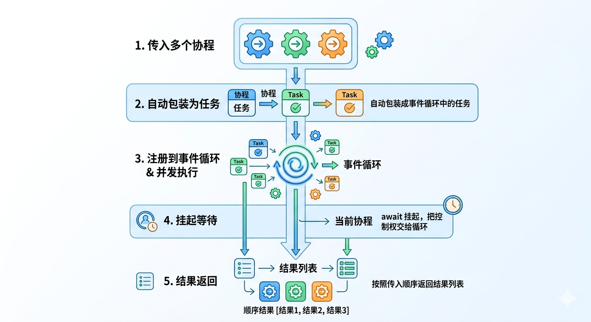

##### **`return_exceptions`** 参数

核心定义：**控制** Task 任务**在执行期间出错时的行为**

- `Flase`：如果**其中一个 Task 任务抛出异常**，则会将这个异常**抛给外界的直接调用者（主任务）**【默认】

  ```python
  import asyncio
  
  
  # 正常的协程函数（其他任务）
  async def work():
      await asyncio.sleep(1)
      return 'work result'
  
  
  # 会抛出一个异常的协程函数（其他任务）
  async def fetch_data():
      await asyncio.sleep(1)
      raise ValueError("出错了！")
  
  
  # 协程函数（主任务）
  async def main():
      try:
          # 依次传入，创建多个任务
          task_result_list = await asyncio.gather(work(), fetch_data(), return_exceptions=False)
          # return_exceptions=False: 会将 fetch_data() 抛出的异常抛给 main() 主任务函数中捕获
  
          print('所有任务的结果：', task_result_list)
      except ValueError as e:
          print(e)  # 出错了！
  
  
  if __name__ == '__main__':
      asyncio.run(main())
  ```

- `True`：如果**其中一个 Task 任务抛出异常**，则会将这个异常**视为一个 “结果”，混在 `gather()` 返回的任务结果列表（List）中一起返回**

  ```python
  import asyncio
  
  
  # 正常的协程函数（其他任务）
  async def work():
      await asyncio.sleep(1)
      return 'work result'
  
  
  # 会抛出一个异常的协程函数（其他任务）
  async def fetch_data():
      await asyncio.sleep(1)
      raise ValueError("出错了！")
  
  
  # 协程函数（主任务）
  async def main():
      # 依次传入，创建多个任务
      task_result_list = await asyncio.gather(work(), fetch_data(), return_exceptions=True)
      # return_exceptions=True: 会将 fetch_data() 抛出的异常作为结果掺杂到 task_result_list 列表中一起返回
  
      print('所有任务的结果：', task_result_list)
      # 输出结果：['work result', ValueError('出错了！')]
  
  
  if __name__ == '__main__':
      asyncio.run(main())
  ```

##### 与 await 的对比

| **特性**       | **asyncio.gather**                        | **asyncio.wait**                                    |
| -------------- | ----------------------------------------- | --------------------------------------------------- |
| **主要关注点** | **获取结果**（Results）                   | **监控状态**（State: 完成/未完成）                  |
| **返回值**     | 按顺序的结果列表                          | 两个集合：`(done_tasks, pending_tasks)`             |
| **输入控制**   | 只能等待全部完成（或异常退出）            | 可以通过 `return_when` 控制（如：第一个完成就返回） |
| **推荐场景**   | 确定要打包执行并拿回数据的 I/O 密集型任务 | 需要灵活控制任务超时、根据进度动态处理的场景        |

##### 与 create_task 的对比

| **特性**     | **asyncio.create_task(coro)**                             | **asyncio.gather(\*coros_or_tasks)**                         |
| ------------ | --------------------------------------------------------- | ------------------------------------------------------------ |
| **主要目的** | **提交**一个异步任务到事件循环，使其在后台独立运行        | **并发运行**多个任务，并**阻塞等待**它们全部完成             |
| **执行时机** | 调用后**立即**在后台排队执行，不需要 `await` 它才开始     | 只有在 `await gather(...)` 时，当前协程才会挂起，等待所有结果 |
| **返回值**   | 返回一个 `Task` 对象（用于取消任务、检查状态）            | 返回一个**包含所有任务执行结果的列表（List）**               |
| **代码阻塞** | **非阻塞**。执行完 `create_task` 后，代码会立刻执行下一行 | **阻塞（异步阻塞）**。必须等待所有传入的任务结束才会继续向下执行 |

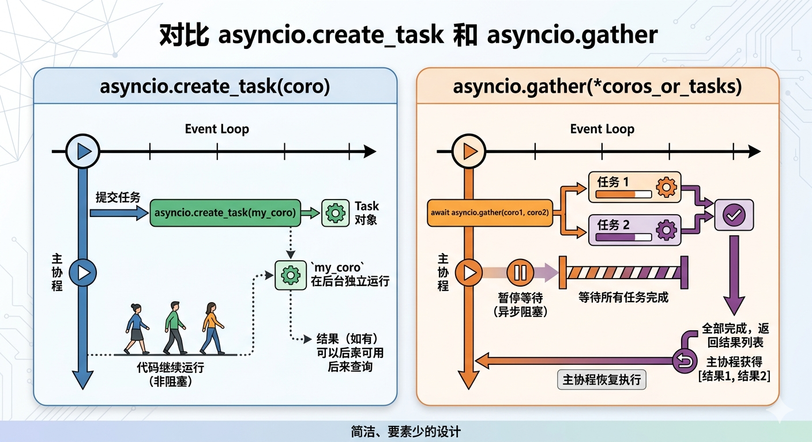

### Lock() **异步 “锁”** 机制

#### 多协程冲突

协程**本质上**就是**同一「单线程」执行流内运行的一个个子程序（函数）**；

在 CPU 视角中，**同一时刻**内**只有一个线程在运行**，只不过是**多个协程在一个线程内来回切换恢复执行而已**；

由于**多个协程函数**之间是**来回交替执行**的，如果**多个协程协同操作同一线程内的共享资源（临界区）**时，有可能会存在**多协程冲突**问题。

因为**协程函数A 内通常会有一个 I/O 操作（`await`）**，当**线程遇到 I/O 操作（`await`）**时会**跳转切换到另一个协程函数B 去执行**，并在**后台中挂起当前协程函数A 的执行**；

而如果**协程函数A 内需要 I/O 操作返回一个结果来修改共享资源**，但是此时线程已经**跳转切换到其他协程函数B 去执行**了（相当于**进行中的任务显式主动让出了 CPU 控制权**），如果**协程函数B 也需要操作同一个共享资源**，那么就会造成**多协程共享资源的冲突**问题。（**多协程访问操作同一临界区的共享资源造成数据混乱**）。

##### 异步锁的产生

简单来说，**线程遇到 I/O 操作（`await`）**就会**把一个原子性的业务逻辑拆分成了上下两部分执行**，上半部分利用 I/O 操作请求资源，下半部分通过 I/O 操作（`await`）返回的资源结果对线程内的共享数据进行修改，从而完成一个任务的整体逻辑；但是由于线程遇到  I/O 操作（`await`）就会切走，所以导致了**一个完整的原子性任务被活生生切成了两半**，这时候就需要**为这个协程函数内的原子性任务加上一把 “异步锁”**；

在**协程函数执行**期间，如果 **“异步锁” 被占用**，则代表**上一个协程函数还未执行完毕，当前协程会被挂起排队，绝不继续执行**；等到 **“异步锁” 被释放，才会进入**，以此**保证一个任务的原子性一致（不可分割）**。

核心本质：“异步锁” 将**线程在遇到 I/O 操作时，通过多协程跳转切换而实现的『异步非阻塞』又变成了『同步阻塞』执行**。


##### 为什么要这么搞？

原因在于：**多线程锁与多协程锁之间所消耗的系统资源相差甚远**。

| **维度**     | **传统多线程 (Thread + 内核锁)**                             | **异步协程 (Coroutine + 异步锁)**                            |
| ------------ | ------------------------------------------------------------ | ------------------------------------------------------------ |
| **内存开销** | 一个线程起步约 **2MB - 8MB**（1万个线程就吃掉几万兆内存）。  | 一个协程只需几百字节到几KB（1万个协程只占用几兆内存）。      |
| **切换成本** | **操作系统内核**强制抢占，进行上下文切换，需要保存 CPU 寄存器、刷新 TLB 缓存，极耗 CPU。 | **用户态指针切换**，只是 Python 在堆里换个 Frame 对象引用，不惊动内核，开销近乎为零。 |
| **锁的代价** | 线程锁会引发**线程挂起**，由内核调度，把线程丢进等待队列，唤醒时又要经历内核切换，很重。 | 异步锁只是 **Event Loop 内部的一个普通 Python 队列**，谁拿不到锁，谁就在 Python 列表里排队，线程压根不挂起，继续去干别的活。 |

#### 基本概念

在 Python 的 `asyncio` （异步编程）中，**`asyncio.Lock`（异步锁）**是用来**保护共享资源、防止竟态条件**的核心工具。

虽然 Python 有 GIL（全局解释器锁），且**异步协程**是**单线程交替执行**的，但**当遇到 `await` 时，CPU 控制权会被交出**。如果**多个协程在 `await` 前后同时修改同一个全局变量**，就会导致**数据错乱**。

##### 基本语法

```python
import asyncio

async def main():
    lock = await asyncio.Lock() # 获取一把 异步“锁”
```

核心作用：由于 **`asyncio.Lock()`** 是**异步协程函数**，所以需要**在前面加上 `await`** 表示**等待获取 异步 “锁”**，并**在 `async def` 定义的协程函数下使用**。

- 获取到 `lock` 异步 ”锁“ 之后，便可以**调用 `lock.acquire()` 和 `lock.release()` 方法**来**获取 “锁” 与释放 “锁”** 的组合操作。

#### 核心方法

##### acquire() 等待获取锁

核心作用：一个**异步的协程函数**，需在**前面添加 `await` 关键字**，表示**当前协程需等待获取异步 “锁”**。

核心原理：如果**锁已被占用，协程会挂起（block）**，直到**锁被释放**。

```python
await lock.acquire() # 等待获取异步 “锁”
```

##### release() 释放锁

核心作用：在**原子性任务操作完成**后，必须在代码**末尾处，写上 `lock.release()`** 表示**释放 “锁”，给其他协程获取**。

核心要点：如果**没有任何协程持有 “锁”，调用它会抛出 `RuntimeError` 异常**。

```python
lock.release() # 释放异步“锁”
```

##### locked() 锁状态

核心作用：**（同步方法）** 返回布尔值，**判断当前锁是否被占用**。

```python
if lock.locked():
    print("锁正忙，我等会儿再来")
```

##### 核心工作原理

核心原理：`asyncio.Lock()` 异步 “锁” 就是**让当前协程一定要执行完 `await` 原子性任务后，释放 “锁”，其他协程才能进入执行**。

```python
import asyncio

# 任务
async def work(lock): # 共享同一把 “锁” 实例
    await lock.acquire() # 协程进入后，若手上没有 “锁” ，则会持有它，进入原子性任务
    
    # .... 原子性任务操作（临界区）
    
    lock.release() # 协程离开原子性任务操作区域后，主动释放 “锁”

if __name__ == '__main__':
    lock = asyncio.Lock() # 获取 “锁” 实例
    
    # 2 个协程任务共同操作同一个原子性任务
    await asyncio.gather(work(lock), work(lock))
```

执行流程：

1. **起点（争夺锁）：** `Task 1` 和 `Task 2` 同时尝试执行 `await lock.acquire()`
2. **Task 1 成功（持有锁）：** `Task 1` 抢先拿到了唯一的一把钥匙，进入临界区（原子性任务）执行代码
3. **Task 2 等待（被挂起）：** 因为锁已经被拿走了，`Task 2` 只能在门外**挂起等待**。此时它不会占用 CPU，允许其他无关的异步任务运行
4. **释放与交接：** `Task 1` 执行完后调用 `lock.release()` 把锁还回去。此时 `Task 2` 被唤醒，拿到锁并进入临界区


> 注意点：如果临界区代码**报错（发生异常）**，`release()` 将永远不会被执行，导致 **“死锁”**。
>
> 所以最好**使用 `async with`  语句（它会自动管理 “锁” 的获取和释放（即使报错也会安全释放）：）**。

##### 注意点

1. **锁必须是同一个实例**：保护同一个资源的所有协程，必须共享同一个 `lock = asyncio.Lock()` 对象。如果每个协程内部自己 `lock = asyncio.Lock()`，那锁就失效了
2. **避免死锁（Deadlock）**：不要在持有一把锁的同时，去 `await` 另一个需要等待这把锁的协程
3. **不要在同步代码中用 `lock.release()`**：它只能在异步上下文或确保安全的逻辑中成对出现
4. **性能代价**：加锁会让原本并发的异步代码变成**串行（排队）执行**。因此，锁的颗粒度越小越好，只保护真正触及共享资源的那几行代码

#### 示例对比

##### 多协程冲突问题

```python
# 多协程冲突问题
import asyncio

# 全局变量
count = 0


# 任务
async def work():
    global count
    # await 释放 CPU 控制权，其他协程任务进来执行
    current = await asyncio.sleep(0.1, result=count)
    # 模拟 I/O 操作获取结果（count）
    count = current + 1  # 多个协程同时操作 count 变量（共享资源），导致数据不准确


async def main():
    # 同时并发运行 10 个任务
    await asyncio.gather(*(work() for _ in range(10)))

    print(count)  # 预期输出结果为 10，实际输出结果为 1
    # 核心原因：当每个协程任务执行到 await asyncio.sleep(0.1, result=count) 时，会释放 CPU 控制权并挂起
    # 此时，其他协程进来执行，也是随之挂起
    # 但是当 0.1s 时间到了后，前面冻结的协程被唤醒后，asyncio.sleep(0.1, result=count) 返回的依然是 count 的初始值，而不是当前值，所以 count 的值始终为 1，每个协程都是如此。


if __name__ == '__main__':
    asyncio.run(main())
```

执行流程：

1. `asyncio.gather(*(work() for _ in range(10)))` 同时并发创建 10 个任务
2. `Task1` 进入 `work` 协程函数内，遇到 `await asyncio.sleep(0.1, result=count)` 挂起
3. 随后，`Task2` 进入 `work()` 协程 函数内，同样遇到 `await asyncio.sleep(0.1, result=count)` 挂起
4. 之后的 `Task3\4\5...` 任务也是如此，都被挂起
5. **`0.1` 秒时间到，`Task1` 被唤醒，拿到 `asyncio.sleep()` 返回的`count` 变量的初始值去赋值给 `current`，此时 `current` 的值为 1**
6. 接着，`Task2\3\4\5...` 的 `0.1` 秒定时器也到期，也同样拿到 `asyncio.sleep()` 返回的`count` 变量的初始值去赋值给 `current`，此时 `current` 的值被覆盖为 1
7. 以此类推，所以最终的 `count` 变量的结果始终为 1 

- 原因是**被后续唤醒的 `Task2\3\4\5\,...`任务所返回的 I/O 结果值（count 初始值） 给覆盖**了

 多协程冲突示例.png)

##### `asyncio.Lock()` 锁机制

需**配合 `try...finally` 代码块**使用：

```python
# 多协程冲突问题(使用 Lock 锁解决)
import asyncio

# 全局变量
count = 0


# 任务
async def work(lock):
    global count
    await lock.acquire()  # 获取锁，如果锁被占用，则其他协程等待
    try:
        # 模拟 I/O 操作获取结果（count）
        current = await asyncio.sleep(0.1, result=count)
        count = current + 1
        # 0.1 秒后，唤醒当前协程，继续往下执行
    finally:
        lock.release()  # 手动释放锁


async def main():
    lock = asyncio.Lock()
    # 同时并发运行 10 个任务
    await asyncio.gather(*(work(lock) for _ in range(10)))
    print(count)  # 输出结果：10

if __name__ == '__main__':
    asyncio.run(main())
```

执行流程：

1. `asyncio.gather(*(work() for _ in range(10)))` 同时并发创建 10 个任务
2. `Task1` 进入 `work` 协程函数内，遇到 `await asyncio.sleep(0.1, result=count)` 挂起
3. 随后，`Task2` 进入 `work()` 协程 函数内，但是**发现 `lock` 锁被 `Task1` 占用着**，所以 **`Task2` 会『阻塞』等待**...
4. **`0.1` 秒时间到，`Task1` 被唤醒，拿到 `asyncio.sleep()` 返回的`count` 变量的初始值去赋值给 `current`，此时 `current` 的值为 1**
5. 当**原子性任务完成，`Task1` 调用 `release()` 释放锁，`Task2` 随后进入执行**...拿到 `count` 的值为 1，再加上 `Task2` 操作 +1=2
6. 以此类推...

- 最终结果：**每次后续的 `Task2\3\4,...` 任务都需要阻塞等待前面的协程任务完成后，才能进入执行**，而每次后续的协程任务进入后，**拿到的共享资源 `count` 都是已经被上一个协程操作完后的结果**，以此保证了数据的安全性

核心本质：**协程A 遇到 `await` 阻塞操作后，不会立即释放 “锁”，后续协程B、C 由于拿不到 “锁” 就会一直陷入 『阻塞』等待**。


#### async with 语句（推荐）

> [!NOTE]
>
> 在 Python 中，`async with` 是**异步上下文管理器**（Asynchronous Context Manager）。
>
> ​	简单来说，它是**传统 `with` 语句的“异步版本”**。
>
> ​	 `async with` 与 `with`的作用完全一样，只不过它**允许在进入和退出上下文时进行异步等待（`await`）**。

由于 **`try...finally` 的手动获取-释放 “锁” 的流程比较繁琐**，且**存在遗忘 释放 “锁” 的可能性**，导致**代码安全性降低**。

Python 提供了 `with` 代码块来解决，`with` 代码块专门用于那些 **成双成对** 的必要操作（**“上锁” - “释放锁”**）。

##### **为什么推荐 `async with lock`？** 

它在底层完全等价于：

```python
await lock.acquire()
try:
    # 你的代码
finally:
    lock.release()
```

##### 基本语法

```python
async with <Lock 锁>:
    # 进入 with 代码块，会自动调用 acquire() 获取 “锁”
    
    # 原子性任务...
    
# 离开后会自动调用 release() 释放“锁”
```

- **`with <锁实例>:`**  

  - **“上锁”**：当**进程/线程进入`with` 代码块**时，会**自动调用 `<锁实例>` 的 `acquire()` 方法**进行 **“上锁”** 动作

  - **“释放锁”**：当**进程/线程离开 `with` 代码块**时，会**自动调用 `<锁实例>.release()` 方法**进行 **“释放锁”** 动作

    开发人员**无需手动编写 “上锁” - “释放锁” 的组合动作**，**只需关心进程/线程的原子性任务体**即可。


> [!NOTE]
>
> **关于协程任务执行过程中出错的处理**：
>
> - 未使用 `with` 代码块：
>
> ​	如果在执行协程任务时出错时，由于未执行到  **“释放锁”** 的动作，所以**其他协程会一直阻塞等待**；
>
> - 使用 `with` 代码块：**即使发生了错误也会被 `Lock` 锁实例内部的 `__exit__()` 魔术方法捕捉到**，从而**自动释放锁**

##### 示例

```python
# 多协程冲突问题(使用 Lock 锁解决)
import asyncio

# 全局变量
count = 0


# 任务
async def work(lock):
    global count
    async with lock:  # 使用上下文管理器，自动获取锁和释放锁
        # 模拟 I/O 操作获取结果（count）
        current = await asyncio.sleep(0.1, result=count)
        count = current + 1

    # 离开上下文管理器，自动释放锁


async def main():
    lock = asyncio.Lock()
    # 同时并发运行 10 个任务
    await asyncio.gather(*(work(lock) for _ in range(10)))
    print(count)  # 输出结果：10

if __name__ == '__main__':
    asyncio.run(main())
```

## aiohttp 网络请求异步模块

在 Python 中，有类似于 `aiohttp`、`requests` ... 的网络请求标准库。区别在于：

- **`requests` ：同步阻塞的，不支持协程**
- **`aiohttp`：异步非阻塞的，支持协程**

> 注：以 **`aio` 开头的模块**基本都是**支持协程**的。

### requests 同步阻塞示例

```python
# 传统方式下载多个图片
import requests  # type: ignore


# 任务函数
def download_image(url):
    print('开始下载：', url)
    response = requests.get(url)

    print('下载完毕')

    # 将图片保存到本地，取 url 最后 10个字符作为文件名
    with open(url[-10:], 'wb') as f:
        f.write(response.content)


def main():
    urls = [
        'https://www.baidu.com/img/flexible/logo/pc/result.png',
        'https://www.baidu.com/img/flexible/logo/pc/result.png',
        'https://www.baidu.com/img/flexible/logo/pc/result.png',
        'https://www.baidu.com/img/flexible/logo/pc/result.png',
        'https://www.baidu.com/img/flexible/logo/pc/result.png',
    ]

    for url in urls:
        download_image(url)


main()
```

### aiohttp 异步非阻塞示例

`asyncio` 可以实现单线程并发IO操作。如果仅用在客户端，发挥的威力不大。如果把 `asyncio` 用在服务器端，例如Web服务器，由于HTTP连接就是IO操作，因此可以用单线程+`async` 函数实现多用户的高并发支持。

`asyncio` 实现了 TCP、UDP、SSL等协议，`aiohttp` 则是基于 `asyncio` 实现的HTTP框架。

先安装`aiohttp`：

```plain
$ pip install aiohttp
```

代码示例：

```python
# 协程方式下载多个图片
import aiohttp  # type: ignore
import asyncio


async def download_image(session, url):
    print('开始下载：', url)

    # 发送网络请求，需要等待服务器返回数据（I/O 操作等待）
    response = await session.get(url)

    # 等待数据下载完毕（aiohttp 是分批次传输响应数据的，需要等待所有数据传输完成，才能获取到完整的数据）
    content = await response.read()

    print('下载完毕')

    # 保存图片到本地
    with open(url[-10:], 'wb') as f:
        f.write(content)

    # 释放单个连接资源
    await response.release()


async def main():
    urls = [
        'https://www.baidu.com/img/flexible/logo/pc/result.png',
        'https://www.baidu.com/img/flexible/logo/pc/result.png',
        'https://www.baidu.com/img/flexible/logo/pc/result.png',
        'https://www.baidu.com/img/flexible/logo/pc/result.png',
        'https://www.baidu.com/img/flexible/logo/pc/result.png',
    ]

    # 创建一个会话对象
    session = aiohttp.ClientSession()

    # 创建多个协程对象
    tasks = [download_image(session, url) for url in urls]

    # 将多个协程对象打包成多个任务 Task，一次性注册到事件循环中
    await asyncio.gather(*tasks)

    # 关闭会话
    await session.close()

if __name__ == '__main__':
    asyncio.run(main())
```

#### 使用 async with 语句

```python
import aiohttp
import asyncio

async def fetch():
    # 异步地建立连接，期间不会阻塞其他任务
    async with aiohttp.ClientSession() as session:
        async with session.get("https://example.com") as response:
            return await response.text()
```

## async for 异步迭代器

## async with 组合语句

